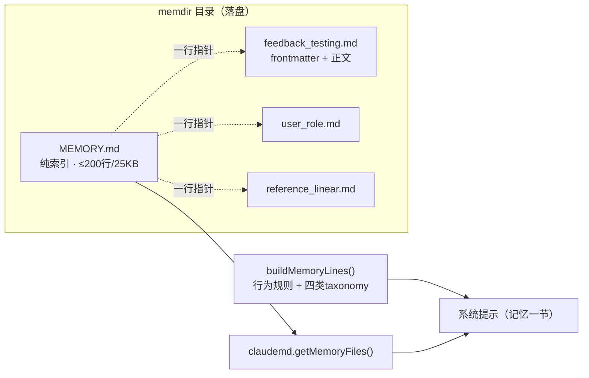
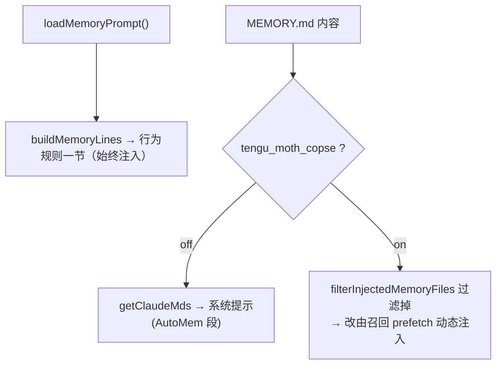
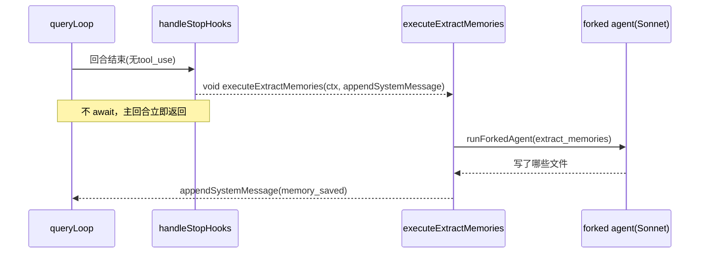
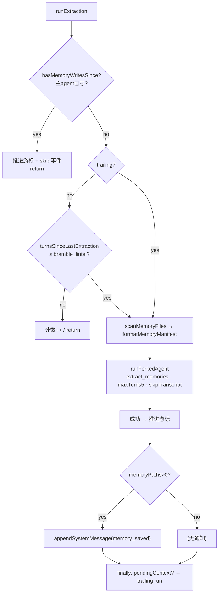
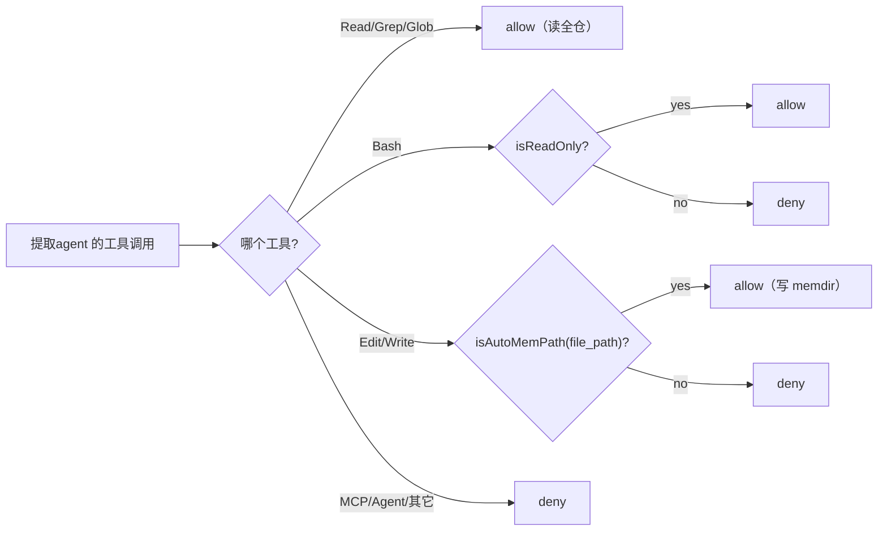
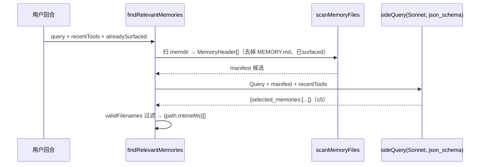
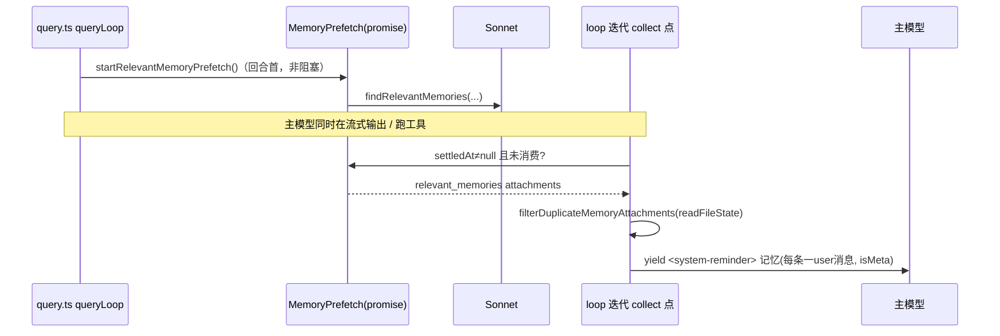
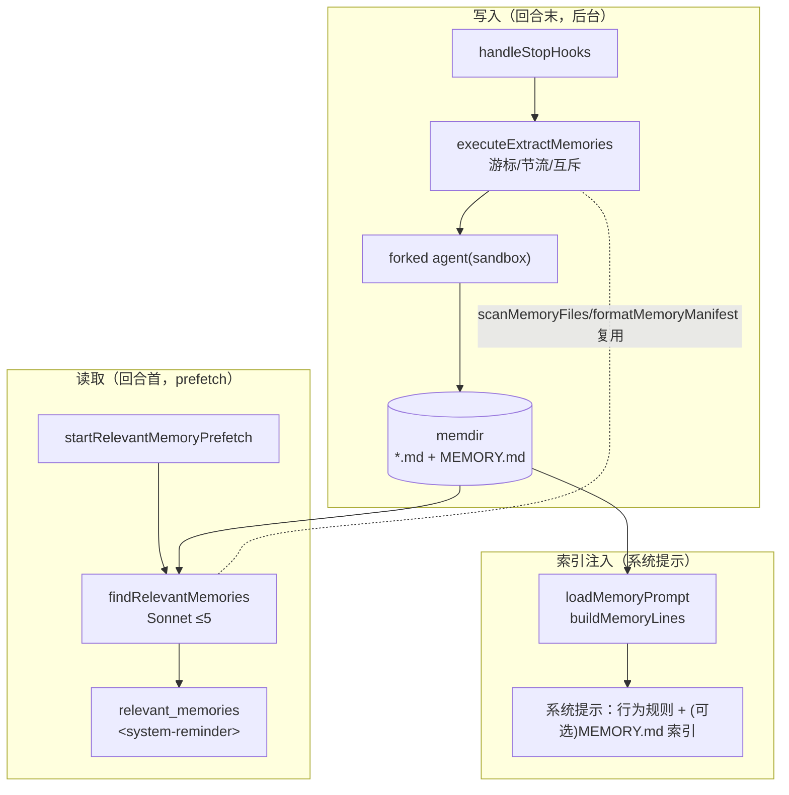

# 16 · 持久记忆（memdir / 提取 / 召回）

本篇覆盖：类型化记忆的落盘布局与提示（`buildMemoryLines` / 四类 taxonomy / 两步保存） ｜ 提取子系统（回合末 fire-and-forget 触发 → 游标 / 节流 / 直接写互斥 / manifest / forked agent 沙箱） ｜ 召回子系统（`findRelevantMemories` Sonnet 选择器 → prefetch 生命周期 → `relevant_memories` `<system-reminder>` 注入 → 去重与会话字节节流） ｜ 关键源文件：`src/memdir/memdir.ts`、`src/memdir/memoryTypes.ts`、`src/memdir/memoryScan.ts`、`src/memdir/findRelevantMemories.ts`、`src/memdir/paths.ts`、`src/memdir/memoryAge.ts`、`src/services/extractMemories/extractMemories.ts`、`src/services/extractMemories/prompts.ts`、`src/query/stopHooks.ts`、`src/utils/attachments.ts`、`src/utils/messages.ts` ｜ 上一篇：15-compaction.md ｜ 下一篇：17-tokens-cost-spill.md

---

持久记忆是 Claude Code 里唯一**跨会话存活**的状态。它不是一个数据库，而是一个**文件系统目录**（memdir，默认 `~/.claude/projects/<sanitized-git-root>/memory/`），里面是一堆带 frontmatter 的 `.md` 主题文件，外加一个纯索引 `MEMORY.md`。围绕这个目录有三条独立的数据流：

1. **写入路径（提取）**：每个回合结束后，一个后台 forked agent 读最近几条消息，把值得记的东西写成记忆文件。
2. **索引注入路径**：`MEMORY.md`（索引）被塞进系统提示或作为召回候选，让模型知道"有哪些记忆"。
3. **读取路径（召回）**：每个用户回合开头，一个 Sonnet 选择器根据用户 query 从目录里挑最多 5 个相关文件，作为 `<system-reminder>` 注入当前对话。

三条流用的是**同一份磁盘布局**、**同一个目录扫描原语**（`scanMemoryFiles` / `formatMemoryManifest`），但**互不阻塞**、各自有独立的节流与去重。下面逐个机制展开。

一条贯穿全篇的设计原则来自 `memoryTypes.ts` 顶部注释：记忆只存**无法从当前工程状态推导**的东西——代码模式、架构、git history、文件结构都是"可推导的"（grep/git/CLAUDE.md 就有），**不该**被存成记忆。这条约束同时刻进了提示文本（四类 taxonomy）和召回侧的 drift 校验。

---

### 类型化记忆提示与两步保存（buildMemoryLines）

- **触发 / 记录**：`buildMemoryLines` 是所有记忆提示文本的中枢——它拼出"你有一个持久记忆系统 / 四类 taxonomy / 什么不该存 / 怎么保存 / 何时访问 / 召回后如何取信"这一整段行为指令。主 agent 的系统提示（`loadMemoryPrompt`）和提取子 agent 的 prompt（`prompts.ts`）都从它或它引用的常量拼装。核心是 `skipIndex` 参数控制"一步保存"还是"两步保存"：

```ts
export function buildMemoryLines(
  displayName: string,
  memoryDir: string,
  extraGuidelines?: string[],
  skipIndex = false,
): string[] {
  const howToSave = skipIndex
    ? [ /* 只写主题文件，不维护 MEMORY.md */ ]
    : [
        '## How to save memories',
        '',
        'Saving a memory is a two-step process:',
        '',
        '**Step 1** — write the memory to its own file (e.g., `user_role.md`, `feedback_testing.md`) using this frontmatter format:',
        '',
        ...MEMORY_FRONTMATTER_EXAMPLE,
        '',
        `**Step 2** — add a pointer to that file in \`${ENTRYPOINT_NAME}\`. \`${ENTRYPOINT_NAME}\` is an index, not a memory — each entry should be one line, under ~150 characters: \`- [Title](file.md) — one-line hook\`. It has no frontmatter. Never write memory content directly into \`${ENTRYPOINT_NAME}\`.`,
```
`src/memdir/memdir.ts:199`（`howToSave` 分支起于 :205，两步保存文案 :219–227）

四类 taxonomy 与 frontmatter 格式是常量，不在这个函数里内联：

```ts
export const MEMORY_TYPES = ['user', 'feedback', 'project', 'reference'] as const
```
`src/memdir/memoryTypes.ts:14`

```ts
export const MEMORY_FRONTMATTER_EXAMPLE: readonly string[] = [
  '```markdown',
  '---',
  'name: {{memory name}}',
  'description: {{one-line description — used to decide relevance in future conversations, so be specific}}',
  `type: {{${MEMORY_TYPES.join(', ')}}}`,
  '---',
  '',
  '{{memory content — for feedback/project types, structure as: rule/fact, then **Why:** and **How to apply:** lines}}',
  '```',
]
```
`src/memdir/memoryTypes.ts:261`

- **使用 / 注入**：`buildMemoryLines` 的返回被 `loadMemoryPrompt` join 成一段字符串，作为**系统提示的一节**注入（`displayName='auto memory'`）：

```ts
  if (autoEnabled) {
    const autoDir = getAutoMemPath()
    await ensureMemoryDirExists(autoDir)
    // ...
    return buildMemoryLines('auto memory', autoDir, extraGuidelines, skipIndex).join('\n')
  }
```
`src/memdir/memdir.ts:475`（`ensureMemoryDirExists` :479 保证目录已存在，于是提示里能写死 "This directory already exists"，模型不必先 `mkdir`/`ls`——见 `DIR_EXISTS_GUIDANCE` :116）

`ENTRYPOINT_NAME`（`MEMORY.md`）本身的内容注入是**另一条路**（下一节讲）：`buildMemoryLines` 只给"行为规则"，不含 `MEMORY.md` 正文——正文经 `claudemd.ts` 的 `getMemoryFiles()` 走系统提示的 CLAUDE.md 通道注入（见函数头注释 :196–197）。

- **为什么（设计意图）**：
  - **两步保存**把"内容"和"索引"分离：主题文件可以任意长，`MEMORY.md` 必须是一行一条的瘦索引，因为它**每次都被整个塞进上下文**。常量 `MAX_ENTRYPOINT_LINES = 200` / `MAX_ENTRYPOINT_BYTES = 25_000` 是硬上限，`truncateEntrypointContent` 超限就截断并追加警告。行注释点破了字节上限存在的原因："~125 chars/line at 200 lines ... catches long-line indexes that slip past the line cap (p100 observed: 197KB under 200 lines)"（`src/memdir/memdir.ts:34–38`）。
  - **四类封闭 taxonomy** 逼模型分类，避免把"这周改了哪些文件"这种活动日志噪音存进来。`WHAT_NOT_TO_SAVE_SECTION` 甚至有一条 "explicit-save gate"：即便用户明说"存一下"，PR 列表/活动摘要也要反问"哪里是*surprising*的"（`memoryTypes.ts:192–194`，注释标注 eval case 3，0/2 → 3/3）。
  - **`skipIndex`（GB flag `tengu_moth_copse`）** 是一次范式切换：开启后不再把 `MEMORY.md` 索引注入系统提示，改由召回侧 prefetch 动态surfacing 主题文件。所以 `loadMemoryPrompt` 一开头就取这个 flag（`memdir.ts:422`）。

- **示例数据**（示例，据源码构造）——一个 `feedback` 类型的记忆文件：

```markdown
---
name: testing-no-db-mocks
description: Integration tests must hit a real database, not mocks — prior prod migration incident
type: feedback
---

Integration tests must hit a real database, not mocks.

**Why:** Last quarter mocked tests passed but the prod migration failed — mock/prod divergence masked a broken migration.
**How to apply:** When touching anything under `tests/integration/`, use a real DB fixture; flag any new mock of the DB layer.
```

对应 `MEMORY.md` 里的一行索引指针（一行、无 frontmatter、<150 字符）：

```markdown
- [No DB mocks in integration tests](feedback_testing.md) — real DB required; prior migration incident
```

- **图**：



- **生命周期**：`buildMemoryLines` 的输出属于**系统提示前缀**，一次会话构建一次并被 prompt cache 缓存；记忆文件与 `MEMORY.md` 是**持久落盘**，跨会话/跨 resume 存活。目录路径由 `getAutoMemPath()` 决定，用 `findCanonicalGitRoot` 归一化，所以**同一 repo 的所有 worktree 共享一个 memdir**（`paths.ts:203–205`，注释引 #24382）。

---

### MEMORY.md 索引的两条注入路径与截断（loadMemoryPrompt / truncateEntrypointContent）

- **触发 / 记录**：`loadMemoryPrompt` 是系统提示构建期唯一入口，按启用的记忆子系统分派（KAIROS 日志模式 / TEAMMEM 组合 / 纯 auto / 全关）。它同时决定"`MEMORY.md` 索引走哪条注入路":

```ts
export async function loadMemoryPrompt(): Promise<string | null> {
  const autoEnabled = isAutoMemoryEnabled()
  const skipIndex = getFeatureValue_CACHED_MAY_BE_STALE('tengu_moth_copse', false)
  // ... KAIROS / TEAMMEM 分支 ...
  if (autoEnabled) {
    const autoDir = getAutoMemPath()
    await ensureMemoryDirExists(autoDir)
    logMemoryDirCounts(autoDir, { memory_type: 'auto' as ... })
    return buildMemoryLines('auto memory', autoDir, extraGuidelines, skipIndex).join('\n')
  }
```
`src/memdir/memdir.ts:419`

- **使用 / 注入**：`MEMORY.md` 的**正文**注入有两条互斥路径，靠 `tengu_moth_copse`（`skipIndex`）切换：
  - **flag 关（传统）**：`MEMORY.md` 作为 `AutoMem` 类型的 CLAUDE.md 文件，经 `getClaudeMds()` 拼成 `Contents of <path> (user's auto-memory, persists across conversations):\n\n<content>` 注入系统提示（`claudemd.ts:1175–1177`）。
  - **flag 开（moth_copse）**：`filterInjectedMemoryFiles` 把 `AutoMem`/`TeamMem` 从系统提示里**过滤掉**，改由召回 prefetch 动态 surfacing：

```ts
export function filterInjectedMemoryFiles(files: MemoryFileInfo[]): MemoryFileInfo[] {
  const skipMemoryIndex = getFeatureValue_CACHED_MAY_BE_STALE('tengu_moth_copse', false)
  if (!skipMemoryIndex) return files
  return files.filter(f => f.type !== 'AutoMem' && f.type !== 'TeamMem')
}
```
`src/utils/claudemd.ts:1142`

无论哪条路，`MEMORY.md` 内容都先过 `truncateEntrypointContent`：先按行截（自然边界），再按字节在最后一个换行处截，附一条命名了哪个 cap 触发的 WARNING（`memdir.ts:57–103`）。

- **为什么（设计意图）**：把索引从"永远在系统提示里"改成"按需 surfacing"，是为了在记忆库变大时不让一个静态索引长期占据 cache 前缀。注释直说：moth_copse 开启后 "the MEMORY.md index is no longer injected into the system prompt"（`claudemd.ts:1136–1140`）。

- **图**：



- **生命周期**：每会话构建一次系统提示；`MEMORY.md` 由提取 agent 落盘维护，resume 后自动读到最新落盘内容（无内存态需要恢复）。

---

### 提取触发：回合末 fire-and-forget（handleStopHooks → executeExtractMemories）

- **触发 / 记录**：一个完整 query loop 结束（模型给出最终答复、无 tool call）时进入 `handleStopHooks`。它把内存提取和 prompt suggestion、autoDream 一起，以 **fire-and-forget** 方式踢出去（`void`，不 await）：

```ts
    if (
      feature('EXTRACT_MEMORIES') &&
      !toolUseContext.agentId &&
      isExtractModeActive()
    ) {
      // Fire-and-forget in both interactive and non-interactive. For -p/SDK,
      // print.ts drains the in-flight promise after flushing the response
      // but before gracefulShutdownSync (see drainPendingExtraction).
      void extractMemoriesModule!.executeExtractMemories(
        stopHookContext,
        toolUseContext.appendSystemMessage,
      )
    }
```
`src/query/stopHooks.ts:141`

三重门槛缺一不可：编译期 `feature('EXTRACT_MEMORIES')`、`!toolUseContext.agentId`（**只主 agent，子 agent 不提取**）、`isExtractModeActive()`（GB flag `tengu_passport_quail` + 交互态或 `tengu_slate_thimble`，见 `paths.ts:69–77`）。`--bare`/SIMPLE 模式整段跳过（`stopHooks.ts:136`）。

- **使用 / 注入**：这里传入的 `appendSystemMessage` 是提取完成后回注"已保存记忆"通知的回调（后面 `createMemorySavedMessage` 会用）。因为是 `void` 不 await，主回合**立即返回**，提取在后台跑。对 `-p`/SDK 非交互路径，`print.ts` 在 flush 响应后、优雅关停前调用 `drainPendingExtraction` 等待在途提取，避免被 5s 关停失效器杀掉（`extractMemories.ts:604–615`）。

- **为什么（设计意图）**：提取是**尽力而为的旁路**，绝不能拖慢用户看到答复的速度。fire-and-forget + 后台 drain 兼顾"不阻塞"与"别丢活"。gate 在 `agentId` 上，是因为子 agent（Explore/Task）的对话不代表用户长期偏好，不该污染记忆。

- **图**：



- **生命周期**：每回合（queryLoop 结束）触发一次；提取器闭包本身是**每进程**的（`initExtractMemories` 在启动时建一次，见下节）。

---

### 提取执行：游标 / 节流 / 直接写互斥 / manifest / forked agent

- **触发 / 记录**：`executeExtractMemoriesImpl` 是提取的真正实现，`initExtractMemories()` 建的**闭包**捕获了全部可变状态（游标、进行中标志、pending 上下文）。入口先做四道早退，再决定串行/合并：

```ts
  async function executeExtractMemoriesImpl(context, appendSystemMessage): Promise<void> {
    if (context.toolUseContext.agentId) return              // 只主 agent
    if (!getFeatureValue_CACHED_MAY_BE_STALE('tengu_passport_quail', false)) { /* gate off */ return }
    if (!isAutoMemoryEnabled()) return
    if (getIsRemoteMode()) return                            // remote 模式跳过
    if (inProgress) {                                        // 已有提取在跑
      logEvent('tengu_extract_memories_coalesced', {})
      pendingContext = { context, appendSystemMessage }      // 只留最新一个
      return
    }
    await runExtraction({ context, appendSystemMessage })
  }
```
`src/services/extractMemories/extractMemories.ts:527`

真正干活的 `runExtraction` 依次做：**直接写互斥 → 节流门 → manifest 预注入 → forked agent → 推进游标 → 落盘通知**。三段关键代码：

（1）直接写互斥——如果主 agent 这一段自己已经写过记忆文件，跳过并**把游标推过这一段**，让主 agent 与后台 agent 每回合互斥：

```ts
    if (hasMemoryWritesSince(messages, lastMemoryMessageUuid)) {
      const lastMessage = messages.at(-1)
      if (lastMessage?.uuid) lastMemoryMessageUuid = lastMessage.uuid
      logEvent('tengu_extract_memories_skipped_direct_write', { message_count: newMessageCount })
      return
    }
```
`src/services/extractMemories/extractMemories.ts:348`（`hasMemoryWritesSince` 定义于 :121，用 `isAutoMemPath(filePath)` 判断写目标）

（2）节流——非 trailing run 每 N 个 eligible 回合才真跑一次（`tengu_bramble_lintel`，默认 1）：

```ts
    if (!isTrailingRun) {
      turnsSinceLastExtraction++
      if (turnsSinceLastExtraction < (getFeatureValue_CACHED_MAY_BE_STALE('tengu_bramble_lintel', null) ?? 1)) {
        return
      }
    }
    turnsSinceLastExtraction = 0
```
`src/services/extractMemories/extractMemories.ts:377`

（3）manifest 预注入 + forked agent——先扫目录成 manifest 塞进 prompt（省一个 `ls` 回合），再以 `extract_memories` 为 querySource 起一个**主对话的完美 fork**：

```ts
      const existingMemories = formatMemoryManifest(
        await scanMemoryFiles(memoryDir, createAbortController().signal),
      )
      const userPrompt = /* team? */ buildExtractAutoOnlyPrompt(newMessageCount, existingMemories, skipIndex)
      const result = await runForkedAgent({
        promptMessages: [createUserMessage({ content: userPrompt })],
        cacheSafeParams,
        canUseTool,
        querySource: 'extract_memories',
        forkLabel: 'extract_memories',
        skipTranscript: true,   // 不写 transcript，避免与主线程竞态
        maxTurns: 5,            // 良性提取 2–4 回合完成；硬上限防钻牛角尖
      })
```
`src/services/extractMemories/extractMemories.ts:398`（`runForkedAgent` 调用 :415，`querySource` :419，`skipTranscript` :423，`maxTurns` :427）

- **使用 / 注入**：提取成功后（且不是错误退出）才**推进游标** `lastMemoryMessageUuid = messages.at(-1).uuid`（:432），保证出错时那段消息下回合会被重新考虑。随后从 fork 的输出里提取写过的路径，过滤掉 `MEMORY.md`（索引更新是机械操作，用户可见的"记忆"是主题文件本身），若有真记忆则回注一条 `memory_saved` 系统消息：

```ts
      const memoryPaths = writtenPaths.filter(p => basename(p) !== ENTRYPOINT_NAME)
      // ...
      if (memoryPaths.length > 0) {
        const msg = createMemorySavedMessage(memoryPaths)
        if (feature('TEAMMEM')) msg.teamCount = teamCount
        appendSystemMessage?.(msg)
      }
```
`src/services/extractMemories/extractMemories.ts:465`（`createMemorySavedMessage` 产出 `type:'system', subtype:'memory_saved'`，见 `messages.ts:4460`——这是 **UI 通知**，不进模型上下文）

`inProgress`/`pendingContext` 实现**合并 + 拖尾**：跑的过程中来的新调用只 stash 最新一个，当前跑完在 `finally` 里以 `isTrailingRun: true` 补跑一次，trailing run 的 `newMessageCount` 相对刚推进的游标算，只吃两次调用之间新增的消息（:506–521）。`drainer` 用 `Promise.race` + `setTimeout(...).unref()` 给在途提取一个 60s 软超时（:579–586）。

- **为什么（设计意图）**：
  - **完美 fork 共享 prompt cache**：fork 复用主对话的系统提示与消息前缀，`extract_memories` 这类非 agentic query 的 cache 命中率是核心指标（函数里专门算 `hitPct` 打日志，:444–452）。`canUseTool` 里也注释：给 fork 换 tool list 会破坏 cache 共享（tools 是 cache key 的一部分，:177–179）。
  - **游标 + 互斥**让"主 agent 主动写"与"后台 agent 补写"在每回合**恰好只发生一个**，既不漏也不重。
  - **manifest 预注入**让提取 agent 第一回合就知道现有文件，直接决定"更新还是新建"，省一个 `ls` 回合——`scanMemoryFiles` 是召回侧复用的同一个扫描原语。

- **示例数据**（示例，据源码构造）——`formatMemoryManifest` 产出的 manifest 文本（`- [type] filename (ISO-mtime): description`，见 `memoryScan.ts:84`）：

```text
- [feedback] feedback_testing.md (2026-06-28T14:03:11.000Z): Integration tests must hit a real database, not mocks — prior prod migration incident
- [user] user_role.md (2026-06-27T09:12:00.000Z): User is a staff backend engineer, deep Go, new to the React frontend
- [reference] reference_linear.md (2026-06-20T16:40:00.000Z): Pipeline bugs tracked in Linear project "INGEST"
```

它被 `opener()` 包成 `## Existing memory files` 段落，附一句 "Check this list before writing — update an existing file rather than creating a duplicate."（`prompts.ts:29–43`）。

- **图**：



- **生命周期**：闭包状态（游标、`inProgress`、`pendingContext`）是**每进程**的（`initExtractMemories` 启动建一次；测试在 `beforeEach` 重建）。游标是 UUID 指针，指向已处理到的最后一条消息；compaction 若移除了该 UUID，`countModelVisibleMessagesSince` 回退成"数全部"而非返回 0（否则会永久禁用本会话提取，:103–108）。resume 后闭包重置，游标从头开始——但直接写互斥 + manifest 去重保证不会重复写已有记忆。

---

### 提取代理的权限沙箱（createAutoMemCanUseTool）

- **触发 / 记录**：fork 出来的提取 agent 必须被关进沙箱——它能读全仓，但**只能往 memdir 里写**。`createAutoMemCanUseTool` 返回一个 `CanUseToolFn`，逐工具裁决：

```ts
export function createAutoMemCanUseTool(memoryDir: string): CanUseToolFn {
  return async (tool, input) => {
    if (tool.name === REPL_TOOL_NAME) return { behavior: 'allow', updatedInput: input }
    if (tool.name === FILE_READ_TOOL_NAME || tool.name === GREP_TOOL_NAME || tool.name === GLOB_TOOL_NAME)
      return { behavior: 'allow', updatedInput: input }            // 读类无限制
    if (tool.name === BASH_TOOL_NAME) {
      const parsed = tool.inputSchema.safeParse(input)
      if (parsed.success && tool.isReadOnly(parsed.data)) return { behavior: 'allow', updatedInput: input }
      return denyAutoMemTool(tool, 'Only read-only shell commands are permitted ...')
    }
    if ((tool.name === FILE_EDIT_TOOL_NAME || tool.name === FILE_WRITE_TOOL_NAME) && 'file_path' in input) {
      const filePath = input.file_path
      if (typeof filePath === 'string' && isAutoMemPath(filePath)) return { behavior: 'allow', updatedInput: input }
    }
    return denyAutoMemTool(tool, `only ${FILE_READ_TOOL_NAME}, ... within ${memoryDir} are allowed`)
  }
}
```
`src/services/extractMemories/extractMemories.ts:171`

- **使用 / 注入**：这个函数作为 `canUseTool` 传给 `runForkedAgent`。REPL 模式下原始工具被隐藏、模型改调 REPL，但 REPL 的 VM 会对每个内部原语**再次回调**这同一个 `canUseTool`，所以 Read/Bash/Edit/Write 的门禁依然生效（:174–182）。Edit/Write 的路径校验用 `isAutoMemPath`——它 `normalize()` 后 `startsWith(getAutoMemPath())`，防 `..` 穿越（`paths.ts:274–278`）。

- **为什么（设计意图）**：提取 agent 面对的是**未受信的对话内容**——如果它能写任意路径或跑写命令，一段恶意对话就能诱导它篡改仓库。沙箱把破坏面收敛到 memdir 一个目录。prompt 里也明说 `Bash rm is not permitted`、`All other tools — MCP, Agent, write-capable Bash, etc — will be denied`（`prompts.ts:37`），提示与门禁双保险。`createAutoMemCanUseTool` 被 extractMemories 与 autoDream 共享。

- **图**：



- **生命周期**：每次提取 run 现建一个（`const canUseTool = createAutoMemCanUseTool(memoryDir)`，:371），随 fork 生命周期结束。

---

### 召回：Sonnet 选择器（findRelevantMemories）

- **触发 / 记录**：召回与提取完全解耦——它在**用户回合开头**跑，用一个 side query 让 Sonnet 从目录扫描结果里挑最相关的 ≤5 个文件。`findRelevantMemories` 先扫描（复用 `scanMemoryFiles`）、过滤已 surfaced 的，再交给 `selectRelevantMemories`：

```ts
export async function findRelevantMemories(
  query, memoryDir, signal,
  recentTools: readonly string[] = [],
  alreadySurfaced: ReadonlySet<string> = new Set(),
): Promise<RelevantMemory[]> {
  const memories = (await scanMemoryFiles(memoryDir, signal)).filter(m => !alreadySurfaced.has(m.filePath))
  if (memories.length === 0) return []
  const selectedFilenames = await selectRelevantMemories(query, memories, signal, recentTools)
  const byFilename = new Map(memories.map(m => [m.filename, m]))
  const selected = selectedFilenames.map(f => byFilename.get(f)).filter((m): m is MemoryHeader => m !== undefined)
  return selected.map(m => ({ path: m.filePath, mtimeMs: m.mtimeMs }))
}
```
`src/memdir/findRelevantMemories.ts:39`

选择器本体：Sonnet + JSON schema 强制结构化输出，`max_tokens: 256`，`querySource: 'memdir_relevance'`：

```ts
    const result = await sideQuery({
      model: getDefaultSonnetModel(),
      system: SELECT_MEMORIES_SYSTEM_PROMPT,
      skipSystemPromptPrefix: true,
      messages: [{ role: 'user', content: `Query: ${query}\n\nAvailable memories:\n${manifest}${toolsSection}` }],
      max_tokens: 256,
      output_format: {
        type: 'json_schema',
        schema: {
          type: 'object',
          properties: { selected_memories: { type: 'array', items: { type: 'string' } } },
          required: ['selected_memories'],
          additionalProperties: false,
        },
      },
      signal,
      querySource: 'memdir_relevance',
    })
    const parsed: { selected_memories: string[] } = jsonParse(textBlock.text)
    return parsed.selected_memories.filter(f => validFilenames.has(f))
```
`src/memdir/findRelevantMemories.ts:98`

系统提示明确了"≤5"和"排除在用工具的文档"两条硬规则：

```text
Return a list of filenames ... (up to 5). Only include memories that you are certain will be helpful ...
- If a list of recently-used tools is provided, do not select memories that are usage reference or API
  documentation for those tools (Claude Code is already exercising them). DO still select memories
  containing warnings, gotchas, or known issues about those tools — active use is exactly when those matter.
```
`src/memdir/findRelevantMemories.ts:18`（`recentTools` 拼进 `Recently used tools:` 段，:92–95）

- **使用 / 注入**：`findRelevantMemories` 的返回（`{path, mtimeMs}[]`）交给 `getRelevantMemoryAttachments`，再过 `readFileState`/`alreadySurfaced` 去重、`slice(0, 5)`、读文件成 `relevant_memories` attachment（下一节）。选择器输出被 `validFilenames.has(f)` 二次校验，防模型编造不存在的文件名。

- **为什么（设计意图）**：
  - 用 **Sonnet 做语义选择**而非关键词匹配——注释点出关键词匹配会假阳性（query 里的 "spawn" 撞上某记忆 description 里的 "spawn"，:88–91）。
  - **排除在用工具文档**：当对话已经在成功调某工具，再 surfacing 它的 reference 就是噪音；但 **warnings/gotchas 例外**——正在用才是它们最该出现的时候。`recentTools` 由 `collectRecentSuccessfulTools` 算（只算"成功且未失败"的工具，任何报错就排除，因为模型还在挣扎、文档该留着，`attachments.ts:2465`）。
  - JSON schema + `additionalProperties:false` 保证输出可 `jsonParse`，失败/abort 一律返回空数组，召回是纯增益、绝不报错阻断主流程（:131–140）。

- **示例数据**（示例，据源码构造）——给定用户 query "review the new integration tests before I push" 与上面那份 manifest，Sonnet 的结构化输出：

```json
{ "selected_memories": ["feedback_testing.md"] }
```

若 query 换成 "where do we track pipeline bugs?"，则：

```json
{ "selected_memories": ["reference_linear.md"] }
```

- **图**：



- **生命周期**：每用户回合触发一次（下节 prefetch）。`scanMemoryFiles` 每次实时读盘，无缓存——所以刚被提取 agent 写入的记忆下个回合就能被召回。

---

### 召回的注入与生命周期：prefetch → relevant_memories 系统提醒

- **触发 / 记录**：召回不能阻塞回合，所以走 **prefetch**：`startRelevantMemoryPrefetch` 在回合一开始（`query.ts` 用 `using` 绑定，随所有退出路径自动 dispose）就把 `getRelevantMemoryAttachments`（内含 Sonnet side query）踢成后台 promise：

```ts
  using pendingMemoryPrefetch = startRelevantMemoryPrefetch(
    state.messages,
    state.toolUseContext,
  )
```
`src/query.ts:301`

`startRelevantMemoryPrefetch` 的门槛：`isAutoMemoryEnabled()` + `tengu_moth_copse`、有真实（非 isMeta）用户消息、query **至少两个词**（单词 query 上下文不足）、会话累计字节未超 `MAX_SESSION_BYTES`：

```ts
  const surfaced = collectSurfacedMemories(messages)
  if (surfaced.totalBytes >= RELEVANT_MEMORIES_CONFIG.MAX_SESSION_BYTES) return undefined
  const controller = createChildAbortController(toolUseContext.abortController)
  const promise = getRelevantMemoryAttachments(input, ..., surfaced.paths).catch(...)
```
`src/utils/attachments.ts:2361`（`MAX_SESSION_BYTES = 60*1024` :288；单词 query 早退 :2379）

- **使用 / 注入**：在 query loop 每次迭代的 collect 点，若 prefetch 已 settle 且本回合未消费过，就取结果、去重、逐条 `yield` 成 attachment 消息（**永不阻塞**——没 settle 就跳过下轮再试）：

```ts
    if (pendingMemoryPrefetch && pendingMemoryPrefetch.settledAt !== null &&
        pendingMemoryPrefetch.consumedOnIteration === -1) {
      const memoryAttachments = filterDuplicateMemoryAttachments(
        await pendingMemoryPrefetch.promise,
        toolUseContext.readFileState,
      )
      for (const memAttachment of memoryAttachments) {
        const msg = createAttachmentMessage(memAttachment)
        yield msg
        toolResults.push(msg)
      }
      pendingMemoryPrefetch.consumedOnIteration = turnCount - 1
    }
```
`src/query.ts:1599`

`relevant_memories` attachment 最终在 `messages.ts` 渲染成注入模型的**用户消息**，每条记忆一条，外面裹 `<system-reminder>`：

```ts
    case 'relevant_memories': {
      return wrapMessagesInSystemReminder(
        attachment.memories.map(m => {
          const header = m.header ?? memoryHeader(m.path, m.mtimeMs)  // 用建时存的 header 保 cache 稳定
          return createUserMessage({ content: `${header}\n\n${m.content}`, isMeta: true })
        }),
      )
    }
```
`src/utils/messages.ts:3708`

`header` 由 `memoryHeader` 生成，>1 天的记忆前面挂一段 staleness 警告（`memoryFreshnessText`），否则只标 "saved today/yesterday/N days ago"：

```ts
export function memoryHeader(path: string, mtimeMs: number): string {
  const staleness = memoryFreshnessText(mtimeMs)
  return staleness ? `${staleness}\n\nMemory: ${path}:` : `Memory (saved ${memoryAge(mtimeMs)}): ${path}:`
}
```
`src/utils/attachments.ts:2327`（`memoryFreshnessText` / `memoryAge` 见 `memoryAge.ts:15,33`）

- **为什么（设计意图）**：
  - **prefetch + 每回合一次**：prompt 在 loop 各迭代不变，per-iteration 触发会把同一问题问 Sonnet N 遍，故只 fire 一次（`query.ts:297–299`）。
  - **`<system-reminder>` 而非普通 user 消息**：召回内容是"系统注入的上下文"，不是用户说的话；`isMeta: true` 使其在 UI/brief 模式隐藏但仍进 API。
  - **freshness 文案而非 raw 时间戳**：注释直说"Models are poor at date arithmetic — a raw ISO timestamp doesn't trigger staleness reasoning the way '47 days ago' does"（`memoryAge.ts:10–14`）；stale 警告是为了防"旧的 file:line 引用被当成事实"（`memoryAge.ts:29–31`）。
  - **三层节流/去重**：per-file `MAX_MEMORY_BYTES=4096`（5×4KB=20KB/回合上限，`attachments.ts:270–277`）、per-turn `slice(0,5)`、per-session `MAX_SESSION_BYTES=60KB`（约 3 次满注入后停止 prefetch，:280–288）。`filterDuplicateMemoryAttachments` 用 `readFileState` 滤掉模型本回合已 Read/Write/Edit 或上回合已 surfaced 的文件，并在**过滤后**才写回 `readFileState`（顺序 load-bearing，否则自指过滤会全删，:2513–2518）。

- **示例数据**（示例，据源码构造）——一条 6 天前保存的 `feedback` 记忆被召回后，注入模型的 `<system-reminder>`（`memoryHeader` staleness 分支 + `wrapInSystemReminder`）：

```text
<system-reminder>
This memory is 6 days old. Memories are point-in-time observations, not live state — claims about code behavior or file:line citations may be outdated. Verify against current code before asserting as fact.

Memory: /home/lian/.claude/projects/-home-lian-proj/memory/feedback_testing.md:

---
name: testing-no-db-mocks
description: Integration tests must hit a real database, not mocks — prior prod migration incident
type: feedback
---

Integration tests must hit a real database, not mocks.

**Why:** Last quarter mocked tests passed but the prod migration failed — mock/prod divergence masked a broken migration.
**How to apply:** When touching anything under `tests/integration/`, use a real DB fixture; flag any new mock of the DB layer.
</system-reminder>
```

若是当天保存的记忆，header 首行改为 `Memory (saved today): <path>:`（无 staleness 段）。

- **图**：



- **生命周期**：prefetch handle 是**每用户回合**的（`using` 作用域），dispose 时 abort 在途请求并打 `tengu_memdir_prefetch_collected` 遥测。`collectSurfacedMemories` 通过**扫描消息**（而非在 toolUseContext 里记状态）统计会话累计字节与已 surfaced 路径——这样 **compact 天然重置**：老 attachment 随压缩从上下文消失，同一文件重新变为可 surfacing（`attachments.ts:2245–2266`、`RELEVANT_MEMORIES_CONFIG` 注释 :284–287）。resume 后同理，从当前（可能已压缩的）消息集重新计算。

---

## 小结：三条数据流一张图



三条流共享磁盘与扫描原语，但**触发时机、节流参数、去重状态各自独立**：写入按 UUID 游标推进、读取按会话字节封顶、索引注入按 GB flag 二选一。这种"共享落盘、独立控制"的切分，是这个子系统能同时做到"跨会话记得住"和"不拖慢单回合"的关键。
