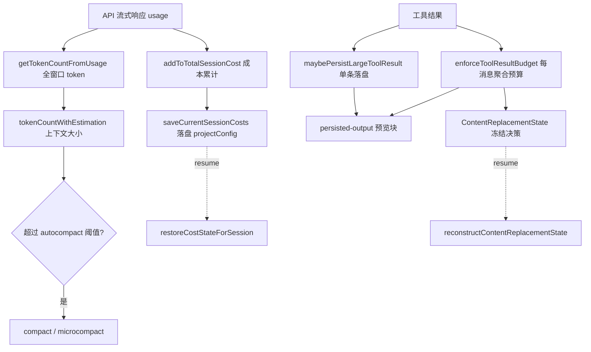
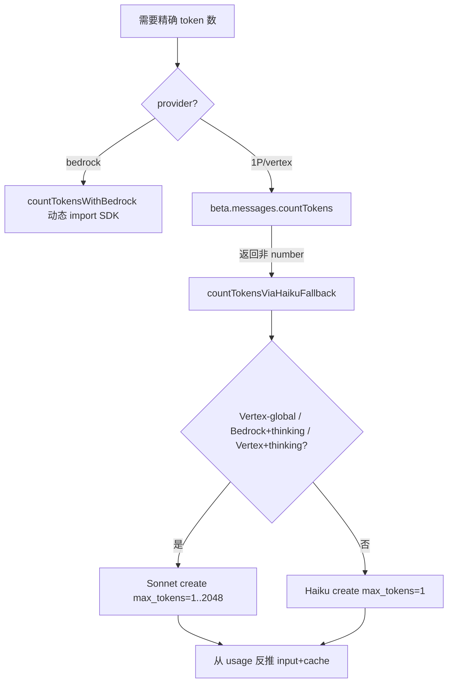
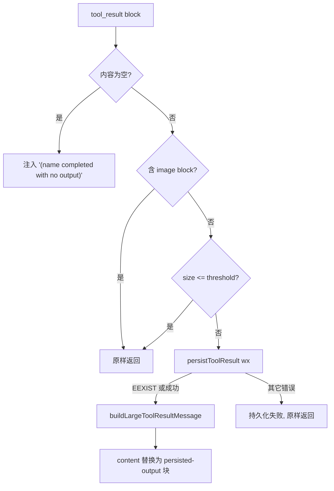
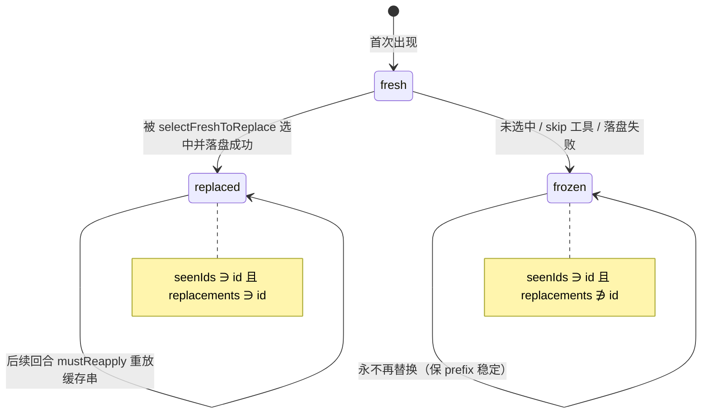
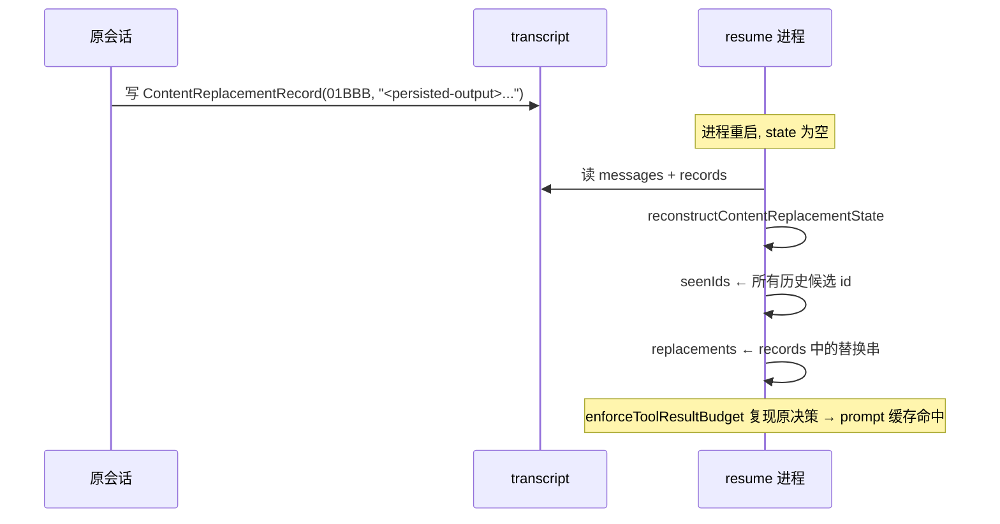

# 17 · Token 计数、成本与结果落盘

本篇覆盖：全窗口 token 测量（`getTokenCountFromUsage`）｜上下文大小的规范估算（`tokenCountWithEstimation`，末次真实 usage + 增量 char/4 粗估 + 并行 split 回溯）｜char/4 与 JSON=2 粗估（`roughTokenCountEstimation` / `bytesPerTokenForFileType`）｜精确计数与 Haiku 回退（`countMessagesTokensWithAPI` / `countTokensViaHaikuFallback`）｜窗口大小解析与压缩输出上限（`getContextWindowForModel` / `COMPACT_MAX_OUTPUT_TOKENS`）｜成本累计（`addToTotalModelUsage` / `addToTotalSessionCost` / `calculateUSDCost`）｜成本落盘与 resume（`saveCurrentSessionCosts` / `restoreCostStateForSession`）｜大工具结果落盘（`getPersistenceThreshold` / `persistToolResult` / `buildLargeToolResultMessage` / `maybePersistLargeToolResult`）｜每消息聚合预算与冻结状态机（`ContentReplacementState` / `enforceToolResultBudget`）｜resume 重建（`reconstructContentReplacementState`）
关键源文件：`src/utils/tokens.ts`、`src/services/tokenEstimation.ts`、`src/utils/context.ts`、`src/cost-tracker.ts`、`src/utils/modelCost.ts`、`src/utils/toolResultStorage.ts`、`src/constants/toolLimits.ts`
上一篇：16-persistent-memory.md ｜ 下一篇：18-extensibility.md

---

这一节讲的是三件互相咬合的事：**一个回合结束后，Claude Code 怎么知道自己「花了多少上下文」、「花了多少钱」、以及「一条工具结果太大时怎么办」**。三者共享同一个约束——**prompt 缓存前缀必须稳定**。凡是会改变发给模型的字节的决策（落盘、替换、预算），都被设计成一旦做出就冻结，resume 后还能逐字节重放。理解这一点是读懂整节代码的钥匙。

数据流总览：



---

### getTokenCountFromUsage — 从一次 API usage 求全窗口 token

- **触发 / 记录**：每次 API 响应流结束时，`usage` 被写回最后一条 assistant 消息（`claude.ts:2244` 处 `lastMsg.message.usage = usage`）。任何需要「那一刻上下文有多满」的地方，都拿这条 usage 调用本函数。它把一次响应的四个 token 分量加成一个数：

```ts
export function getTokenCountFromUsage(usage: Usage): number {
  return (
    usage.input_tokens +
    (usage.cache_creation_input_tokens ?? 0) +
    (usage.cache_read_input_tokens ?? 0) +
    usage.output_tokens
  )
}
```
`src/utils/tokens.ts:46`

- **使用 / 注入**：它是 `tokenCountWithEstimation`（本节下一个机制）的「基准锚点」，也被 `doesMostRecentAssistantMessageExceed200k`（`tokens.ts:159`，阈值 `200_000`）直接用于 200k 硬判断。注意它**只是本地度量**，不进 API 字段——发给模型的永远是消息数组，这个数字只用来做本地阈值决策（autocompact、session memory 初始化）。

- **为什么（设计意图）**：注释（`tokens.ts:40`）写得很清楚——「Includes input_tokens + cache tokens + output_tokens. This represents the full context size at the time of that API call.」关键是**必须把 cache 读/写都算进去**：缓存命中的 token 虽然计费便宜，但它们仍然实打实占着上下文窗口。漏算 cache 会让上下文测量系统性偏小，导致 autocompact 触发太晚、下一次请求 413。对比 `messageTokenCountFromLastAPIResponse`（`tokens.ts:123`）只返回 `output_tokens`，源码里专门加了 `WARNING: Do NOT use this for threshold comparisons`。

- **示例数据**（示例，据 `Usage` 结构构造）：

| 字段 | 值 |
|---|---|
| `input_tokens` | 8_000 |
| `cache_creation_input_tokens` | 2_000 |
| `cache_read_input_tokens` | 140_000 |
| `output_tokens` | 1_200 |
| **`getTokenCountFromUsage` 返回** | **151_200** |

- **生命周期**：纯函数，无状态。每回合读一次最新 usage。

---

### tokenCountWithEstimation — 上下文大小的规范测量

- **触发 / 记录**：这是「当前上下文有多满」的**唯一权威函数**（源码注释：`This is the CANONICAL function`，`tokens.ts:202`）。它从消息尾部往前找到最近一条带真实 usage 的 assistant 记录作为锚点，用 `getTokenCountFromUsage(usage)` 拿到那一刻的精确窗口，再对**锚点之后新增的所有消息**用 char/4 粗估补上：

```ts
      return (
        getTokenCountFromUsage(usage) +
        roughTokenCountEstimationForMessages(messages.slice(i + 1))
      )
```
`src/utils/tokens.ts:253`

在返回之前，它有一段**并行 split 回溯**逻辑。当模型一次响应里发起多个并行 tool_use 时，流式代码会把每个 content block 拆成独立的 AssistantMessage 记录（共享同一个 `message.id` 与 usage），而 query loop 会把每个 tool_result 紧跟在其 tool_use 之后插入。于是消息数组长这样：`[..., asst(id=A), user(result), asst(id=A), user(result), ...]`。若只停在**最后**一条 asst 记录，就会漏掉前面所有交错的 tool_result。所以它找到 usage 后，会沿相同 `message.id` 向前走到**第一条同胞 split**：

```ts
        let j = i - 1
        while (j >= 0) {
          const prior = messages[j]
          const priorId = prior ? getAssistantMessageId(prior) : undefined
          if (priorId === responseId) {
            // Earlier split of the same API response — anchor here instead.
            i = j
          } else if (priorId !== undefined) {
            // Hit a different API response — stop walking.
            break
          }
          // priorId === undefined: a user/tool_result/attachment message ...
          j--
        }
```
`src/utils/tokens.ts:237`

- **使用 / 注入**：`autoCompact.ts:225` 用 `tokenCountWithEstimation(messages) - snipTokensFreed` 对比阈值判断是否需要压缩；`compact.ts:401`、`compact.ts:810` 用它记录 `preCompactTokenCount`；`query.ts:638` 同样在预算路径里用它。**它不直接进 prompt**——它是所有本地上下文管理决策（autocompact / microcompact / session memory）的输入信号。

- **为什么（设计意图）**：注释列了三个「不要用」的替代方案（`tokens.ts:209`）：累计计数（会随上下文增长重复计数）、只看 output_tokens、不估算新消息的 `tokenCountFromLastAPIResponse`。核心思路是**「最后一次真实测量 + 之后的增量粗估」**——真实 usage 是权威锚，新增消息用便宜的 char/4 补偿，既准又不需要每回合都发一次 countTokens 请求。回溯逻辑保证并行工具批次不被系统性低估。

- **示例数据**（示例，据源码逻辑构造）：接上一个机制的 usage（锚点 = 151_200），锚点之后新增两条 user tool_result 消息，内容分别 4_800、1_200 字符：

```
基准（末次真实 usage）           = 151_200   ← getTokenCountFromUsage
+ 新增 tool_result #1 (4800 chars) = round(4800/4) =  1_200
+ 新增 tool_result #2 (1200 chars) = round(1200/4) =    300
────────────────────────────────────────────────
tokenCountWithEstimation 返回     = 152_700
```

- **图**：

```mermaid
flowchart LR
  S[messages 尾部] --> F{找到带真实 usage 的 asst?}
  F -->|否, i--| S
  F -->|是, id=A| W[沿 message.id==A 向前回溯到第一条 split]
  W --> B[getTokenCountFromUsage(usage) 锚点]
  W --> R[roughTokenCountEstimationForMessages(slice(i+1))]
  B --> SUM[相加 = 上下文 token]
  R --> SUM
```

- **生命周期**：每回合 queryLoop 内多次调用，纯函数无状态。

---

### roughTokenCountEstimation / bytesPerTokenForFileType — char/4 与 JSON=2 粗估

- **触发 / 记录**：粗估的底座。默认按 4 字节/token：

```ts
export function roughTokenCountEstimation(
  content: string,
  bytesPerToken: number = 4,
): number {
  return Math.round(content.length / bytesPerToken)
}
```
`src/services/tokenEstimation.ts:203`

对已知文件类型用更准的比率——密集 JSON 满是单字符 token（`{`、`}`、`:`、`,`、`"`），实际比率接近 2：

```ts
export function bytesPerTokenForFileType(fileExtension: string): number {
  switch (fileExtension) {
    case 'json':
    case 'jsonl':
    case 'jsonc':
      return 2
    default:
      return 4
  }
}
```
`src/services/tokenEstimation.ts:215`

- **使用 / 注入**：`roughTokenCountEstimationForMessages`（`tokenEstimation.ts:327`）遍历消息、逐 block 累加，是 `tokenCountWithEstimation` 补偿新增消息的实现。逐 block 的 `roughTokenCountEstimationForBlock`（`tokenEstimation.ts:391`）有几个特判值得记：`image`/`document` 一律按 **2000 token** 估（避免把 1MB base64 PDF 当成 ~325k token 而过度触发压缩，注释 `tokenEstimation.ts:400`）；`tool_use` 按 `name + jsonStringify(input)` 的字符数估。JSON=2 主要用于 API 计数不可用（如 Bedrock）时的落盘阈值判断，注释（`tokenEstimation.ts:229`）指出「an underestimate can let an oversized tool result slip into the conversation」。

- **为什么（设计意图）**：char/4 是业界对英文文本的经典近似。之所以要 JSON=2 的特化，是因为落盘阈值一旦低估，超大结果会溜进上下文；而 image=2000 的常量则是防止高估导致过早压缩——两个方向的偏差都会造成实际问题，所以按内容类型分别校准。

- **示例数据**（示例，据源码构造）：

| content | bytesPerToken | 估算 |
|---|---|---|
| 2048 字符普通文本 | 4 | `round(2048/4)` = 512 |
| 2048 字符 `.json` | 2 | `round(2048/2)` = 1024 |
| 一张截图 image block | — | 固定 2000 |
| `tool_use{name:"Bash", input:{command:"ls -la"}}` | 4 | `round(len("Bash{\"command\":\"ls -la\"}")/4)` |

- **生命周期**：纯函数，每回合估算时调用。

---

### countMessagesTokensWithAPI / countTokensViaHaikuFallback — 精确计数与 Haiku 回退

- **触发 / 记录**：当粗估不够、需要**服务器权威 token 数**时走这条路。首选调 `beta.messages.countTokens`：

```ts
      const response = await anthropic.beta.messages.countTokens({
        model: normalizeModelStringForAPI(model),
        messages:
          // When we pass tools and no messages, we need to pass a dummy message
          // to get an accurate tool token count.
          messages.length > 0 ? messages : [{ role: 'user', content: 'foo' }],
        tools,
        ...(filteredBetas.length > 0 && { betas: filteredBetas }),
        ...(containsThinking && {
          thinking: { type: 'enabled', budget_tokens: TOKEN_COUNT_THINKING_BUDGET },
        }),
      })
```
`src/services/tokenEstimation.ts:172`（函数 `countMessagesTokensWithAPI` 在 `:140`）

Bedrock 走 `countTokensWithBedrock`（`tokenEstimation.ts:437`，动态 import AWS SDK 以省 ~279KB）。当 `countTokens` 端点不可用时，`countTokensViaHaikuFallback`（`tokenEstimation.ts:251`）改用一次**真实 create 调用**、`max_tokens: 1`，从响应 usage 反推输入 token：

```ts
  const usage = response.usage
  const inputTokens = usage.input_tokens
  const cacheCreationTokens = usage.cache_creation_input_tokens || 0
  const cacheReadTokens = usage.cache_read_input_tokens || 0
  return inputTokens + cacheCreationTokens + cacheReadTokens
```
`src/services/tokenEstimation.ts:319`

- **使用 / 注入**：这些计数不进 prompt，是本地度量。选模逻辑（`tokenEstimation.ts:274`）默认用 `getSmallFastModel()`（Haiku 4.5，支持 thinking blocks），仅在 Vertex global region、或 Bedrock/Vertex 带 thinking blocks 时退回 Sonnet（Haiku 3.5 不支持 thinking）。发送前会用 `stripToolSearchFieldsFromMessages`（`tokenEstimation.ts:66`）剥掉 `caller`、`tool_reference` 等仅在 tool-search beta 下合法的字段，否则会 400。

- **为什么（设计意图）**：`countTokens` 是免费且精确的官方端点，是首选；但它在部分 provider/endpoint 上不可得，于是用 Haiku 的 `max_tokens:1` create 作退路——因为服务器在真实请求里回报的 `input_tokens` 就是被计费的输入大小。用 Haiku 是为了**便宜**（见下面成本表：Haiku 4.5 $1/$5 vs Opus $5/$25）。注释里那句 warning（`tokenEstimation.ts:269`）——「if you change this to use a non-Haiku model, this request will fail in 1P unless it uses getCLISyspromptPrefix」——是踩过坑的痕迹。

- **图**：



- **生命周期**：按需异步调用（落盘阈值判断、compact 预估等），无持久状态。

---

### getContextWindowForModel / COMPACT_MAX_OUTPUT_TOKENS — 窗口大小与压缩输出上限

- **触发 / 记录**：所有阈值计算都需要「分母」——上下文窗口有多大。默认 200k，`[1m]` 后缀模型给 1M：

```ts
export const MODEL_CONTEXT_WINDOW_DEFAULT = 200_000
// ...
export function getContextWindowForModel(model: string, betas?: string[]): number {
  if (process.env.USER_TYPE === 'ant' && process.env.CLAUDE_CODE_MAX_CONTEXT_TOKENS) {
    const override = parseInt(process.env.CLAUDE_CODE_MAX_CONTEXT_TOKENS, 10)
    if (!isNaN(override) && override > 0) return override
  }
  if (has1mContext(model)) return 1_000_000
  // ... capability lookup / beta header / experiment gates ...
  return MODEL_CONTEXT_WINDOW_DEFAULT
}
```
`src/utils/context.ts:9` 与 `:51`

`has1mContext`（`context.ts:35`）就是 `/\[1m\]/i.test(model)`——本快照运行的模型 ID 正是 `claude-opus-4-8[1m]`，命中 1M 分支。压缩输出上限是个独立常量：

```ts
// Maximum output tokens for compact operations
export const COMPACT_MAX_OUTPUT_TOKENS = 20_000
```
`src/utils/context.ts:12`

- **使用 / 注入**：`getContextWindowForModel` 被 `cost-tracker.ts:273`（写进 `modelUsage.contextWindow`）、`getStoredSessionCosts`（`cost-tracker.ts:105`）、autocompact 的 `getEffectiveContextWindowSize` 等广泛消费。`COMPACT_MAX_OUTPUT_TOKENS` 进入 compact 子查询的 API 参数——它是 `maxOutputTokensOverride` 的**下限夹取**：

```ts
          maxOutputTokensOverride: Math.min(
            COMPACT_MAX_OUTPUT_TOKENS,
            getMaxOutputTokensForModel(context.options.mainLoopModel),
          ),
```
`src/services/compact/compact.ts:1317`

- **为什么（设计意图）**：`[1m]` 后缀是「显式客户端 opt-in，优先于一切检测」（注释 `context.ts:69`），因为服务端能力探测有滞后，用后缀让用户明确表态。`CLAUDE_CODE_MAX_CONTEXT_TOKENS` 环境变量则让 ant 用户「即使连着 1M 端点也能把有效窗口压小」以便本地决策（注释 `context.ts:56`）。压缩输出封顶 20k 是因为摘要本身不该长——封住上限既省钱又避免摘要膨胀，与 `getMaxOutputTokensForModel` 取 min 保证不超过模型自身上限。

- **示例数据**（示例，据源码构造）：

| model | 分支 | 窗口 |
|---|---|---|
| `claude-opus-4-8[1m]` | `has1mContext` 命中 | 1_000_000 |
| `claude-sonnet-4-6` | 默认 | 200_000 |
| 任意 + `USER_TYPE=ant`、`CLAUDE_CODE_MAX_CONTEXT_TOKENS=300000` | env override | 300_000 |

- **生命周期**：纯函数，随模型/beta 参数即时计算。

---

### addToTotalModelUsage / addToTotalSessionCost / calculateUSDCost — 成本累计

- **触发 / 记录**：API 流每收到一段 usage，就在 `claude.ts:2251` 算出这段的 USD 成本并累加进全局状态：

```ts
            const costUSDForPart = calculateUSDCost(resolvedModel, usage)
            costUSD += addToTotalSessionCost(costUSDForPart, usage, options.model)
```
`src/services/api/claude.ts:2251`

`calculateUSDCost`（`modelCost.ts:177`）按模型 pricing tier 把四类 token 折算成钱（Opus 4.5 = `COST_TIER_5_25`，`$5/$25` 每 Mtok，`modelCost.ts:54`）：

```ts
function tokensToUSDCost(modelCosts: ModelCosts, usage: Usage): number {
  return (
    (usage.input_tokens / 1_000_000) * modelCosts.inputTokens +
    (usage.output_tokens / 1_000_000) * modelCosts.outputTokens +
    ((usage.cache_read_input_tokens ?? 0) / 1_000_000) * modelCosts.promptCacheReadTokens +
    ((usage.cache_creation_input_tokens ?? 0) / 1_000_000) * modelCosts.promptCacheWriteTokens +
    (usage.server_tool_use?.web_search_requests ?? 0) * modelCosts.webSearchRequests
  )
}
```
`src/utils/modelCost.ts:131`

`addToTotalModelUsage`（`cost-tracker.ts:250`）把 token 分量累加进按模型分桶的 `ModelUsage`；`addToTotalSessionCost`（`cost-tracker.ts:278`）在此之上更新全局 `totalCostUSD`、喂 OpenTelemetry 计数器，并**递归**把 advisor 工具的子 usage 也计入：

```ts
  let totalCost = cost
  for (const advisorUsage of getAdvisorUsage(usage)) {
    const advisorCost = calculateUSDCost(advisorUsage.model, advisorUsage)
    logEvent('tengu_advisor_tool_token_usage', { /* ... */ })
    totalCost += addToTotalSessionCost(advisorCost, advisorUsage, advisorUsage.model)
  }
  return totalCost
```
`src/cost-tracker.ts:303`

- **使用 / 注入**：不进 prompt，是纯度量/记账。累计结果由 `formatTotalCost`（`cost-tracker.ts:228`）渲染成退出时打印的 `Total cost` / `Usage by model` 块；`getModelUsage`（`state.ts`）供 UI 状态栏与 SDK 结果消费。底层写入 `addToTotalCostState`（`state.ts:557`：`STATE.modelUsage[model] = modelUsage; STATE.totalCostUSD += cost`）。

- **为什么（设计意图）**：pricing 表按 canonical 名归桶，unknown 模型回退到默认 tier 并置 `hasUnknownModelCost`（成本显示会附「may be inaccurate」）。cache 读/写单独计价（读远比写便宜，如 Opus 4.5 读 `$0.5` / 写 `$6.25`）——这解释了为什么系统拼命保护 prompt 缓存前缀：缓存命中不仅省上下文，还直接省钱。advisor 递归确保「工具背后隐藏的模型调用」也被计入总账。Opus 4.6 fast mode 还有专门的 `getOpus46CostTier`（`modelCost.ts:94`，fast 时 `COST_TIER_30_150`）。

- **示例数据**（示例，据 `COST_TIER_5_25` 与前述 usage 构造）：

```
usage = { input 8_000, output 1_200, cache_read 140_000, cache_creation 2_000 }
tier  = COST_TIER_5_25 { in 5, out 25, cacheRead 0.5, cacheWrite 6.25 }

  8_000/1e6 * 5     = $0.04000   (input)
  1_200/1e6 * 25    = $0.03000   (output)
140_000/1e6 * 0.5   = $0.07000   (cache read)
  2_000/1e6 * 6.25  = $0.01250   (cache write)
────────────────────────────────
calculateUSDCost    ≈ $0.15250
```

- **生命周期**：每回合每段 usage 累加进**进程级** `STATE`；进程退出前落盘（下一个机制）。

---

### saveCurrentSessionCosts / restoreCostStateForSession — 成本落盘与 resume

- **触发 / 记录**：进程退出时（`costHook.ts:17` 的 `process.on('exit')`）把进程级成本状态写进 project config：

```ts
export function saveCurrentSessionCosts(fpsMetrics?: FpsMetrics): void {
  saveCurrentProjectConfig(current => ({
    ...current,
    lastCost: getTotalCostUSD(),
    lastAPIDuration: getTotalAPIDuration(),
    // ... lastTotalInputTokens / lastTotalOutputTokens / cache 分量 ...
    lastModelUsage: Object.fromEntries(
      Object.entries(getModelUsage()).map(([model, usage]) => [model, {
        inputTokens: usage.inputTokens, outputTokens: usage.outputTokens,
        cacheReadInputTokens: usage.cacheReadInputTokens,
        cacheCreationInputTokens: usage.cacheCreationInputTokens,
        webSearchRequests: usage.webSearchRequests, costUSD: usage.costUSD,
      }]),
    ),
    lastSessionId: getSessionId(),
  }))
}
```
`src/cost-tracker.ts:143`

resume 时反向读回，但**只在 sessionId 匹配上一次保存时**才恢复：

```ts
export function restoreCostStateForSession(sessionId: string): boolean {
  const data = getStoredSessionCosts(sessionId)
  if (!data) return false
  setCostStateForRestore(data)
  return true
}
```
`src/cost-tracker.ts:130`

- **使用 / 注入**：`restoreCostStateForSession` 由 `ResumeConversation.tsx:224` 与 `sessionRestore.ts:450` 在恢复会话时调用。`getStoredSessionCosts`（`cost-tracker.ts:87`）读回时**现算** `contextWindow` 与 `maxOutputTokens`（因为窗口大小依赖当前模型/beta，不能用旧值）。落地写入由 `setCostStateForRestore`（`state.ts:881`）完成——它还会 `STATE.startTime = Date.now() - lastDuration`，让墙钟时长跨 resume 继续累加。

- **为什么（设计意图）**：成本是进程级 `STATE`，进程一退就丢；但一个逻辑会话可能跨多个进程（resume）。`lastSessionId` 守卫（`cost-tracker.ts:93`）保证只有「同一会话」的成本才被继承——换会话不会把别人的账算到你头上。`contextWindow`/`maxOutputTokens` 不落盘、resume 时重算，是因为它们是模型能力的函数而非历史事实。

- **示例数据**（示例，据 `StoredCostState` / project config 字段构造）：

```json
{
  "lastSessionId": "9f8c1e34-2b7a-4c1d-8e55-0a1b2c3d4e5f",
  "lastCost": 0.1525,
  "lastAPIDuration": 41230,
  "lastLinesAdded": 87,
  "lastLinesRemoved": 12,
  "lastModelUsage": {
    "claude-opus-4-8[1m]": {
      "inputTokens": 8000, "outputTokens": 1200,
      "cacheReadInputTokens": 140000, "cacheCreationInputTokens": 2000,
      "webSearchRequests": 0, "costUSD": 0.1525
    }
  }
}
```
（resume 读回时，每个 model 会补上 `contextWindow: 1_000_000`、`maxOutputTokens: getModelMaxOutputTokens(...).default`。）

- **生命周期**：**持久化落盘**（project config）。作用域：每会话进程结束写、resume 且 sessionId 匹配时读回。

---

### getPersistenceThreshold / persistToolResult / buildLargeToolResultMessage / maybePersistLargeToolResult — 单条工具结果落盘

- **触发 / 记录**：工具产出结果后，`processToolResultBlock`（`toolResultStorage.ts:205`）用 `getPersistenceThreshold` 解析该工具的落盘阈值，再交给 `maybePersistLargeToolResult` 决定是否落盘。阈值解析：GrowthBook 覆盖（`tengu_satin_quoll`）优先，否则用「工具声明上限」与全局默认 `50_000` 的较小值；`Infinity` 声明（如 Read）是硬 opt-out：

```ts
export function getPersistenceThreshold(toolName: string, declaredMaxResultSizeChars: number): number {
  // Infinity = hard opt-out. Read self-bounds via maxTokens ...
  if (!Number.isFinite(declaredMaxResultSizeChars)) return declaredMaxResultSizeChars
  const overrides = getFeatureValue_CACHED_MAY_BE_STALE<Record<string, number> | null>(
    PERSIST_THRESHOLD_OVERRIDE_FLAG, {})
  const override = overrides?.[toolName]
  if (typeof override === 'number' && Number.isFinite(override) && override > 0) return override
  return Math.min(declaredMaxResultSizeChars, DEFAULT_MAX_RESULT_SIZE_CHARS)
}
```
`src/utils/toolResultStorage.ts:55`（`DEFAULT_MAX_RESULT_SIZE_CHARS = 50_000`，`toolLimits.ts:13`）

`maybePersistLargeToolResult`（`toolResultStorage.ts:272`）依次：空内容→注入 `(<toolName> completed with no output)` 占位符；含 image block→原样返回；`size <= threshold`→原样返回；否则落盘。落盘用 `persistToolResult`，关键是 **`flag: 'wx'` 独占创建**：

```ts
  try {
    await writeFile(filepath, contentStr, { encoding: 'utf-8', flag: 'wx' })
    logForDebugging(`Persisted tool result to ${filepath} (${formatFileSize(contentStr.length)})`)
  } catch (error) {
    if (getErrnoCode(error) !== 'EEXIST') {
      logError(toError(error)); return { error: getFileSystemErrorMessage(toError(error)) }
    }
    // EEXIST: already persisted on a prior turn, fall through to preview
  }
```
`src/utils/toolResultStorage.ts:162`

替换消息由 `buildLargeToolResultMessage`（`toolResultStorage.ts:189`）拼出，包 `<persisted-output>` 标签、落盘路径、`PREVIEW_SIZE_BYTES = 2000`（`:109`）字节预览：

```ts
export function buildLargeToolResultMessage(result: PersistedToolResult): string {
  let message = `${PERSISTED_OUTPUT_TAG}\n`
  message += `Output too large (${formatFileSize(result.originalSize)}). Full output saved to: ${result.filepath}\n\n`
  message += `Preview (first ${formatFileSize(PREVIEW_SIZE_BYTES)}):\n`
  message += result.preview
  message += result.hasMore ? '\n...\n' : '\n'
  message += PERSISTED_OUTPUT_CLOSING_TAG
  return message
}
```
`src/utils/toolResultStorage.ts:189`

- **使用 / 注入**：返回的 `<persisted-output>` 字符串**替换掉** tool_result block 的 content，作为 **user 消息里的 tool_result** 发给模型（API 字段 `content`）。模型看到的是路径 + 2KB 预览，需要完整内容时可以再用 Read 工具读那个文件。落盘目录 `getToolResultsDir()` = `<projectDir>/<sessionId>/tool-results/`（`toolResultStorage.ts:104`），文件名 `<toolUseId>.txt|json`。

- **为什么（设计意图）**：与其**截断**丢信息，不如**落盘**保全并给模型一条可回溯的路径——这是整个机制的名字（persist 而非 truncate，`toolResultStorage.ts:1`）。`wx` 独占写而非 stat-then-write，是因为 `tool_use_id` 唯一且内容确定，microcompact 重放原始消息时会反复走到这里；`wx` 让「已存在」变成无害的 EEXIST 快速路径，避免每回合重写同一文件（注释 `:157`）。空结果占位符是修 inc-4586：尾部空 tool_result 会让某些模型误判 turn 边界、零输出结束（注释 `:280`）。

- **示例数据**（示例，据 `buildLargeToolResultMessage` 与真实路径布局构造，一条 500KB 的 `.txt` Bash 输出）：

```
<persisted-output>
Output too large (500KB). Full output saved to: /home/user/.claude/projects/-home-user-Projects-myapp/9f8c1e34-2b7a-4c1d-8e55-0a1b2c3d4e5f/tool-results/toolu_01ABCdefGHIjklMNOpqrs.txt

Preview (first 2KB):
Cloning into 'node_modules'...
npm warn deprecated inflight@1.0.6: This module is not supported ...
[... 前 2000 字节，在最后一个换行处截断 ...]
...
</persisted-output>
```
（若内容 ≤ 2000 字节则 `hasMore=false`，末尾无 `\n...\n` 只有 `\n`。）

- **图**：



- **生命周期**：文件**持久化落盘**（会话目录下），跨回合、跨 resume 存在；`wx` 保证幂等。替换后的 content 进入消息历史。

---

### ContentReplacementState / enforceToolResultBudget — 每消息聚合预算与冻结状态机

- **触发 / 记录**：单条落盘管不住「一回合 N 个并行工具各自 40K、合计 400K」的情况。`enforceToolResultBudget`（`toolResultStorage.ts:769`）按 **API 级 user 消息**为单位聚合：若一条消息里所有 tool_result 合计超过 `getPerMessageBudgetLimit()`（默认 `MAX_TOOL_RESULTS_PER_MESSAGE_CHARS = 200_000`，`toolLimits.ts:49`），就把**最大的若干条 fresh 结果**落盘替换，直到降到预算内。决策记录在跨回合稳定的状态里：

```ts
export type ContentReplacementState = {
  seenIds: Set<string>
  replacements: Map<string, string>
}
```
`src/utils/toolResultStorage.ts:390`

每条候选按「先前决策」三分（`partitionByPriorDecision`，`:649`）：`mustReapply`（已替换→重放缓存的替换串）、`frozen`（已见过但未替换→禁止现在再替换）、`fresh`（没见过→可做新决策）。选谁落盘由 `selectFreshToReplace`（`:675`）按 size 降序贪心。落盘成功后**原子地**同时写 `seenIds` 与 `replacements`：

```ts
    state.seenIds.add(candidate.toolUseId)
    if (replacement === null) continue
    replacedSize += candidate.size
    replacementMap.set(candidate.toolUseId, replacement.content)
    state.replacements.set(candidate.toolUseId, replacement.content)
    newlyReplaced.push({ kind: 'tool-result', toolUseId: candidate.toolUseId, replacement: replacement.content })
```
`src/utils/toolResultStorage.ts:865`

聚合分组由 `collectCandidatesByMessage`（`:600`）完成——它必须与 `normalizeMessagesForAPI` 的合并规则一致：只有 assistant 消息（且是**未见过的** `message.id`）才切分组边界，因为服务端会把连续 user 消息合并成一条 wire 消息。

- **使用 / 注入**：query loop 在 `query.ts:379` 调 `applyToolResultBudget`（`:924` 的门面，`state===undefined` 即功能关闭时直接返回原数组），把替换后的 messages 发给模型。被替换的块和单条落盘一样变成 user 消息里的 `<persisted-output>` tool_result。`newlyReplaced` 记录会通过回调写进 transcript（仅对 resume 时会读回记录的 querySource：`repl_main_thread*`、`agent:*`）。Read 这类 `maxResultSizeChars: Infinity` 的工具由 `skipToolNames` 排除（`query.ts:391` 传入）。

- **为什么（设计意图）**：核心不变量是**「一旦 seen，命运冻结」**（注释 `:377`）——已替换的每回合重放同一份缓存串（Map 查找，零 I/O、逐字节相同、不会失败），已见但未替换的永远不再替换。这样 prompt 缓存前缀在整个会话里稳定，缓存必命中。`selectFreshToReplace` 用预览 ~2K 远小于命中此路径的大结果这一事实做近似（注释 `:685`）；若 frozen 部分本身已超预算就接受超额，交给 microcompact 最终清理（注释 `:669`）。分组必须匹配 `normalizeMessagesForAPI`，否则 N 条各自 under-budget 的消息会被服务端合并成一条 over-budget 的 wire 消息，防线失效（注释 `:576`）。

- **示例数据**（示例，据 `ContentReplacementState` 类型构造，一回合 3 个并行 Bash，各 90K，合计 270K > 200K，落盘最大的一条）：

```jsonc
// enforceToolResultBudget 处理后（Set/Map 展开示意）
{
  "seenIds": [                     // 3 条都被标记 seen（命运已冻结）
    "toolu_01AAA...", "toolu_01BBB...", "toolu_01CCC..."
  ],
  "replacements": {                // 仅最大的那条被落盘替换
    "toolu_01BBB...":
      "<persisted-output>\nOutput too large (90KB). Full output saved to: .../tool-results/toolu_01BBB....txt\n\nPreview (first 2KB):\n...\n</persisted-output>"
  }
}
// 结果：270K - 90K = 180K <= 200K，达标；01AAA / 01CCC 保留完整内容并冻结
```

- **图**（冻结状态机）：



- **生命周期**：`ContentReplacementState` 是**每会话线程一个实例**，挂在 `ToolUseContext` 上（主线程 REPL 只 provision 一次、永不 reset；子代理 clone 父状态或从 sidechain 重建）。`replacements` 的字符串还会落进 transcript 供 resume。

---

### reconstructContentReplacementState — resume 后重建冻结状态

- **触发 / 记录**：resume 时进程重启、`ContentReplacementState` 是空的，但历史消息里已经有当初发给模型的 `<persisted-output>` 块。必须重建状态，让预算**做出和原会话完全相同的决策**：

```ts
export function reconstructContentReplacementState(
  messages: Message[],
  records: ContentReplacementRecord[],
  inheritedReplacements?: ReadonlyMap<string, string>,
): ContentReplacementState {
  const state = createContentReplacementState()
  const candidateIds = new Set(collectCandidatesByMessage(messages).flat().map(c => c.toolUseId))
  for (const id of candidateIds) state.seenIds.add(id)          // 冻结所有历史候选
  for (const r of records) {
    if (r.kind === 'tool-result' && candidateIds.has(r.toolUseId))
      state.replacements.set(r.toolUseId, r.replacement)         // 从记录重放替换串
  }
  if (inheritedReplacements) { /* fork 子代理 gap-fill */ }
  return state
}
```
`src/utils/toolResultStorage.ts:960`

- **使用 / 注入**：`REPL.tsx:1924` 在恢复对话时调用；`provisionContentReplacementState`（`:447`）在 cold start 用 `createContentReplacementState()`、有 `initialMessages` 时走重建。fork 子代理 resume 用 `reconstructForSubagentResume`（`:1001`）把父的 live `replacements` 作为 gap-fill 传入。重建出的 state 随后被 `enforceToolResultBudget` 消费，保证 wire prefix 与原会话一致。

- **为什么（设计意图）**：`ContentReplacementRecord.replacement` 存的是**模型当初逐字看到的那串**（注释 `:474`：`stored rather than derived on resume so code changes to the preview template ... can't silently break prompt cache`）。若 resume 时重新生成预览，模板/大小格式/路径布局的任何改动都会让字节变化、缓存 miss。把「历史里出现过的候选 id 全部 `seenIds`」是因为——它出现在 transcript 就说明当初发给过模型、就是 seen，于是冻结它不被将来替换。`inheritedReplacements` 补的是 fork 子代理的坑：fork 原始运行通过 `mustReapply` 应用父继承的替换（从不 persist、不进 `newlyReplaced`），resume 时 sidechain 有原内容但无记录，只靠 records 会误判为 frozen，故用父 live state 补映射（注释 `:952`）。

- **示例数据**（示例，据 `ContentReplacementRecord` 类型构造，写进 transcript 的记录）：

```json
{
  "kind": "tool-result",
  "toolUseId": "toolu_01BBB...",
  "replacement": "<persisted-output>\nOutput too large (90KB). Full output saved to: .../tool-results/toolu_01BBB....txt\n\nPreview (first 2KB):\n...\n</persisted-output>"
}
```
resume 后 `reconstructContentReplacementState` 读回：`seenIds = { 01AAA, 01BBB, 01CCC }`（历史全部候选），`replacements = { 01BBB → 上面那串 }`——与关机前的活状态逐字节一致。

- **图**：



- **生命周期**：**从持久化 transcript 重建**到内存 state。作用域回到「每会话线程一个实例」，此后行为与 cold start 后长期运行的会话完全等价。

---

## 小结：三个子系统的共同律

| 子系统 | 权威来源 | 本地度量/决策 | 持久化 | resume 语义 |
|---|---|---|---|---|
| Token 计数 | API `usage` / `countTokens` | `tokenCountWithEstimation`（锚点 + char/4） | 无（每回合现算） | 从末次 usage 重新锚定 |
| 成本 | `usage` × pricing tier | `addToTotalSessionCost` 累加进程 `STATE` | project config（`lastCost` 等） | sessionId 匹配才继承 |
| 结果落盘 | 工具原始输出 | 阈值/预算决定是否替换 | 落盘文件 + transcript 记录 | 逐字节重放，冻结决策 |

贯穿三者的是同一条工程律：**任何改变发给模型字节的决策都必须可确定性重放**。Token 锚点、成本的 sessionId 守卫、落盘的 `wx` 幂等、预算的 `seenIds`/`replacements` 冻结、resume 的逐字节重建——都是为了让「同一段历史无论跑几次进程，产出的 wire prefix 完全相同」，从而把 prompt 缓存的命中率（=省钱 + 省上下文）钉死。
