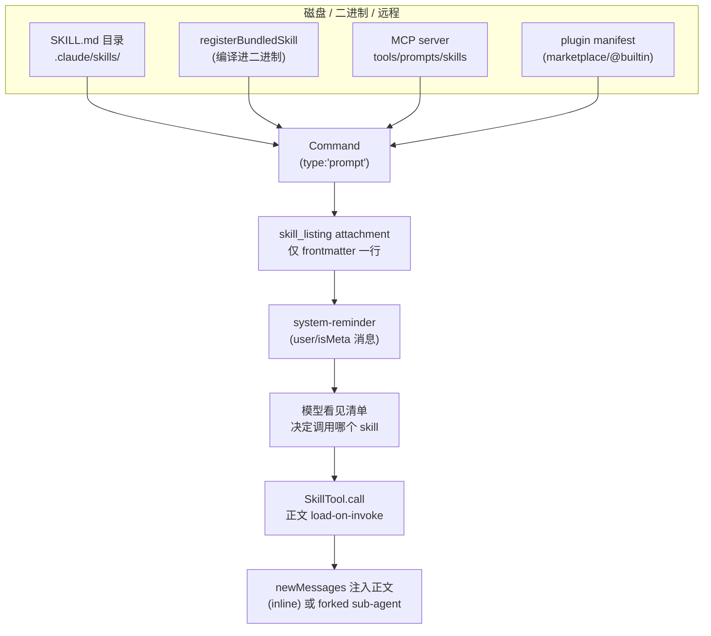
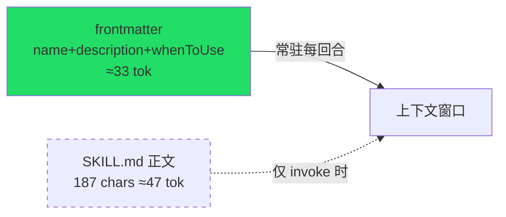
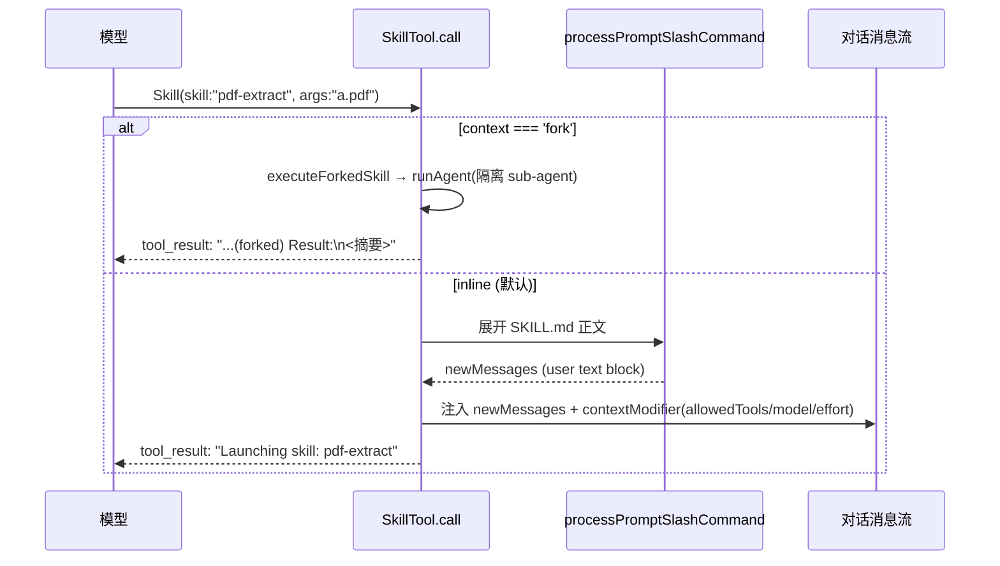
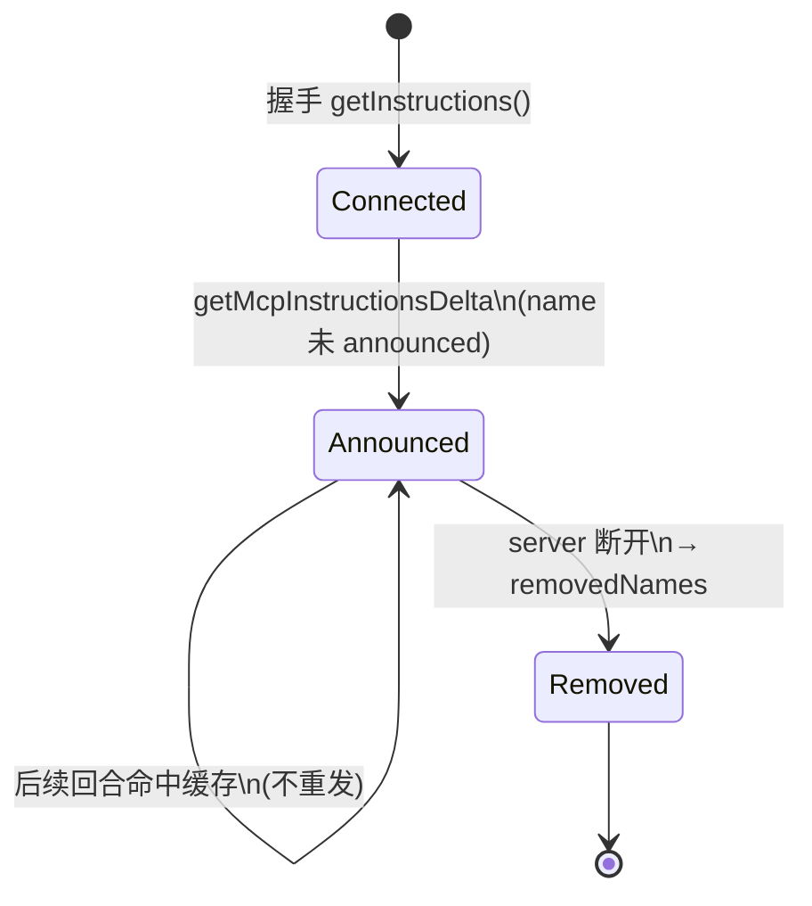
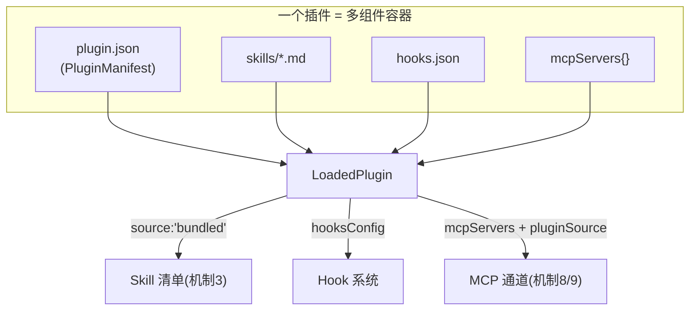
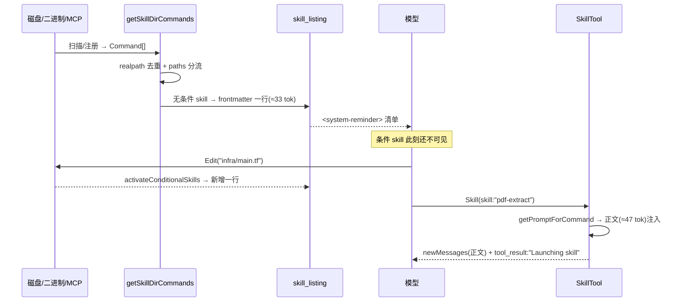

# 18 · 可扩展性：Skill 渐进披露 / MCP / 插件

本篇覆盖：SKILL.md 的目录加载与 frontmatter 解析 · "仅 frontmatter 常驻 / 正文按需加载"的渐进披露（progressive disclosure）· skill_listing 的 token 预算与 system-reminder 注入 · SkillTool 的 inline/fork 调用通道与安全属性授权 · 多来源加载/去重/条件披露 · 编译进二进制的 bundled skill 与引用文件按需落盘 · MCP 三类能力（tools / prompts / skills）· MCP server instructions 的静态注入与增量 attachment · 内置插件（@builtin）与 marketplace 插件的 LoadedPlugin/PluginManifest。 ｜ 关键源文件：`src/skills/loadSkillsDir.ts`、`src/skills/bundledSkills.ts`、`src/tools/SkillTool/{prompt.ts,SkillTool.ts}`、`src/services/mcp/{client.ts,types.ts,mcpStringUtils.ts}`、`src/utils/mcpInstructionsDelta.ts`、`src/utils/attachments.ts`、`src/utils/messages.ts`、`src/constants/prompts.ts`、`src/plugins/builtinPlugins.ts`、`src/plugins/bundled/index.ts`、`src/types/plugin.ts`。 ｜ 上一篇：17-tokens-cost-spill.md ｜ 下一篇：(本篇为最后一篇)

---

## 全景：三条扩展通道

Claude Code 的可扩展性由三条正交通道构成，它们的"粒度、加载时机、谁定义"各不相同——理解这张表是理解全篇的地图：

| 通道 | 单元 | 谁定义 | 加载/披露时机 | 常驻上下文的成本 | 模型如何触达 |
|---|---|---|---|---|---|
| **Tool**（工具） | 一次 API 调用的原语（Read/Bash/…） | Claude Code 内建（或 MCP 提供） | 进程启动即注册；`tools` API 字段全量或经 ToolSearch 延迟 | 每个工具一份 JSONSchema | API `tools` 数组直接可调 |
| **Skill**（技能） | 一段 Markdown 提示词 + 可选引用文件 | 用户（`.claude/skills/*/SKILL.md`）、插件、bundled | **frontmatter 常驻**（name/description/whenToUse）；**正文 load-on-invoke** | 每个 skill 约几十 token 的一行清单 | `Skill` 工具按名调用，正文才展开 |
| **MCP**（服务器） | 远程 server 暴露的 tools / prompts / skills / resources | 第三方进程（stdio/http/sse/ws/sdk） | 连接握手后拉取；tools 走 deferred，instructions 增量注入 | tool 描述 + server instructions（各截断到 2048 字符） | `mcp__<server>__<tool>` 工具名 / Skill 通道 |

Skill 通道是本篇的重心，因为它把"渐进披露"做到了极致：**一个 skill 无论正文多长，常驻上下文的只有它 frontmatter 里的三个字段**。下面从加载链路自底向上拆解。



---

### 机制 1 · Skill 目录加载：`loadSkillsFromSkillsDir` + `parseSkillFrontmatterFields`

- **触发 / 记录**：`getSkillDirCommands(cwd)`（被 `memoize` 缓存）在启动时并行扫描 managed / user / project 三层 `skills/` 目录。每个目录下 **只认 `skill-name/SKILL.md` 目录格式**（单个 `.md` 文件在 `/skills/` 里不被支持）。读到文件后先 `parseFrontmatter` 切出 YAML 头与正文，再交给 `parseSkillFrontmatterFields`。

```ts
const skillDirPath = join(basePath, entry.name)
const skillFilePath = join(skillDirPath, 'SKILL.md')
// ...
const { frontmatter, content: markdownContent } = parseFrontmatter(
  content,
  skillFilePath,
)
const skillName = entry.name
const parsed = parseSkillFrontmatterFields(
  frontmatter,
  markdownContent,
  skillName,
)
const paths = parseSkillPaths(frontmatter)
```
`src/skills/loadSkillsDir.ts:430-458`

`parseSkillFrontmatterFields` 是所有来源（文件、legacy commands、MCP）共享的字段解析器。几个关键映射值得记住：

```ts
whenToUse: frontmatter.when_to_use as string | undefined,
// ...
allowedTools: parseSlashCommandToolsFromFrontmatter(frontmatter['allowed-tools']),
model: frontmatter.model === 'inherit' ? undefined : ...,
disableModelInvocation: parseBooleanFrontmatter(frontmatter['disable-model-invocation']),
userInvocable: frontmatter['user-invocable'] === undefined ? true : parseBooleanFrontmatter(...),
executionContext: frontmatter.context === 'fork' ? 'fork' : undefined,
```
`src/skills/loadSkillsDir.ts:242-263`

注意 frontmatter 的键名是 kebab / snake（`allowed-tools`、`when_to_use`、`disable-model-invocation`），解析后统一成驼峰的 `Command` 字段。`description` 若 frontmatter 未给，则回退到 `extractDescriptionFromMarkdown(markdownContent, 'Skill')`（`:212-214`）。

- **使用 / 注入**：解析结果传给 `createSkillCommand(...)` 造出一个 `type:'prompt'` 的 `Command`（见机制 4）。所有来源的 skill 最终汇入 `getSkillDirCommands` 的去重与条件分流（见机制 6）。

- **为什么（设计意图）**：把"字段解析"从"来源发现"里拆出来，是为了让文件 skill、legacy `/commands/`、MCP skill 三条来源用同一套语义。注释明确写道该函数"shared between file-based and MCP skill loading"（`:181-183`）。

- **示例数据**（示例，据 `parseSkillFrontmatterFields` 真实字段构造）——一个完整的 `SKILL.md`：

```markdown
---
name: pdf-extract
description: Extract text and tables from PDF files into Markdown.
when_to_use: When the user needs to read, search, or convert a PDF's contents.
allowed-tools:
  - Bash(pdftotext:*)
  - Read
---

# PDF Extract

## Steps
1. Run `pdftotext -layout ${CLAUDE_SKILL_DIR}/scripts/dump.py <file>`.
2. Read the produced `.txt`, then reformat tables as Markdown.
3. Never modify the source PDF.
```

解析后（关键字段）：

```jsonc
{
  "type": "prompt",
  "name": "pdf-extract",
  "description": "Extract text and tables from PDF files into Markdown.",
  "whenToUse": "When the user needs to read, search, or convert a PDF's contents.",
  "allowedTools": ["Bash(pdftotext:*)", "Read"],
  "disableModelInvocation": false,
  "userInvocable": true,
  "loadedFrom": "skills",
  "source": "projectSettings",
  "skillRoot": ".claude/skills/pdf-extract",
  "contentLength": 187   // 正文字符数，用于统计而非常驻
}
```

---

### 机制 2 · 渐进披露的 token 核算：`estimateSkillFrontmatterTokens`

- **触发 / 记录**：这是"渐进披露"最直白的一行代码——它明确规定**只有 name / description / whenToUse 计入常驻上下文的 token 估算**，正文（以及 `allowed-tools` 等其余字段）一概不算。

```ts
export function estimateSkillFrontmatterTokens(skill: Command): number {
  const frontmatterText = [skill.name, skill.description, skill.whenToUse]
    .filter(Boolean)
    .join(' ')
  return roughTokenCountEstimation(frontmatterText)
}
```
`src/skills/loadSkillsDir.ts:100-105`

`roughTokenCountEstimation` 就是 `Math.round(content.length / 4)`（`src/services/tokenEstimation.ts:203-208`，默认 4 字符/token）。

- **使用 / 注入**：该估算被 `analyzeContext`（token 归因）用来核算"skills"占了多少上下文——它反映的是清单成本，不是正文成本。正文的 token 只有在 skill 被真正 invoke、正文进入消息流后才产生。

- **为什么（设计意图）**：函数注释是最好的佐证——"since full content is only loaded on invocation"（`:97-98`）。这条不变式贯穿全篇：**你可以有 200 个 skill，常驻代价仍是 200 行清单，而不是 200 篇正文。**

- **示例数据**（示例，据上面 `pdf-extract` 构造）：

```
frontmatterText = "pdf-extract Extract text and tables from PDF files into Markdown. When the user needs to read, search, or convert a PDF's contents."
length ≈ 132 → roughTokenCountEstimation ≈ 33 tokens
```
正文 187 字符（约 47 token）**不计入**常驻——只有 33 token 的 frontmatter 常驻。



---

### 机制 3 · Skill 清单常驻上下文：`getSkillListingAttachments` → `formatCommandsWithinBudget` → system-reminder

- **触发 / 记录**：每回合组装 attachment 时，`getSkillListingAttachments(toolUseContext)` 汇总本地 skill（`getSkillToolCommands`）+ MCP skill（`getMcpSkillCommands`），用一个 **module-scope 的 `sentSkillNames` Map** 做增量去重——只把"这个 agent 还没发过的"skill 打包，避免每回合重发整份清单。

```ts
// Find skills we haven't sent yet
const newSkills = allCommands.filter(cmd => !sent.has(cmd.name))
if (newSkills.length === 0) return []
const isInitial = sent.size === 0
for (const cmd of newSkills) sent.add(cmd.name)
// ...
const content = formatCommandsWithinBudget(newSkills, contextWindowTokens)
return [{ type: 'skill_listing', content, skillCount: newSkills.length, isInitial }]
```
`src/utils/attachments.ts:2718-2750`

清单本身有严格的字符预算——**上下文窗口的 1%**（fallback 8000 字符 = 1% × 200k × 4）：

```ts
export const SKILL_BUDGET_CONTEXT_PERCENT = 0.01
export const CHARS_PER_TOKEN = 4
export const DEFAULT_CHAR_BUDGET = 8_000 // Fallback: 1% of 200k × 4
export const MAX_LISTING_DESC_CHARS = 250
```
`src/tools/SkillTool/prompt.ts:21-29`

`formatCommandsWithinBudget` 的降级策略分三档：全量 → 非 bundled 描述截断 → 非 bundled 只留名字。**bundled skill 永远不被截断**（`bundledIndices` 单独保留全描述，`:92-109`、`:163-170`），因为它们是 Anthropic 官方 curated 的核心用例。

- **使用 / 注入**：`skill_listing` attachment 在 `messages.ts` 里被物化成一条 **`<system-reminder>` 包裹的 user/isMeta 消息**：

```ts
case 'skill_listing': {
  if (!attachment.content) return []
  return wrapMessagesInSystemReminder([
    createUserMessage({
      content: `The following skills are available for use with the Skill tool:\n\n${attachment.content}`,
      isMeta: true,
    }),
  ])
}
```
`src/utils/messages.ts:3728-3737`

这正是本对话顶部你看到的那段 "The following skills are available for use with the Skill tool: …" 的来源。

- **为什么（设计意图）**：清单是"发现用的"，不是"执行用的"——`MAX_LISTING_DESC_CHARS` 的注释说得很直白："The listing is for discovery only — the Skill tool loads full content on invoke, so verbose whenToUse strings waste turn-1 cache_creation tokens without improving match rate"（`prompt.ts:27-29`）。增量 `sentSkillNames` 则避免重复烧 cache_creation。

- **示例数据**（示例，据 `formatCommandDescription` 的 `- name: description - whenToUse` 格式构造）——清单里 `pdf-extract` 那一行：

```
The following skills are available for use with the Skill tool:

- pdf-extract: Extract text and tables from PDF files into Markdown. - When the user needs to read, search, or convert a PDF's contents.
- commit: Create a git commit with a well-formed message.
- mcp__linear__create_issue: Create a Linear issue (MCP)
```

- **生命周期**：`sentSkillNames` 是进程内、按 `agentId` 分桶的。`--resume` 时 `suppressNextSkillListing()` 会把当前所有 skill 标记为"已发"，只补发 resume 之后新增的（`:2633-2636`、`:2709-2715`），避免重复注入整份清单。

---

### 机制 4 · 正文按需加载：`createSkillCommand.getPromptForCommand`

- **触发 / 记录**：`createSkillCommand` 造出的 `Command` 把 SKILL.md 正文 **闭包捕获**在 `getPromptForCommand` 里——这个函数只在 skill 被 invoke 时才执行，也就是"load-on-invoke"的落点。它在此刻才做三件注入：base directory 头、`${CLAUDE_SKILL_DIR}`/`${CLAUDE_SESSION_ID}` 变量替换、以及正文里 `` !`...` `` 的 shell 执行。

```ts
async getPromptForCommand(args, toolUseContext) {
  let finalContent = baseDir
    ? `Base directory for this skill: ${baseDir}\n\n${markdownContent}`
    : markdownContent
  finalContent = substituteArguments(finalContent, args, true, argumentNames)
  if (baseDir) {
    const skillDir = process.platform === 'win32' ? baseDir.replace(/\\/g, '/') : baseDir
    finalContent = finalContent.replace(/\$\{CLAUDE_SKILL_DIR\}/g, skillDir)
  }
  finalContent = finalContent.replace(/\$\{CLAUDE_SESSION_ID\}/g, getSessionId())
  // Security: MCP skills are remote and untrusted — never execute inline
  // shell commands (!`…`) from their markdown body.
  if (loadedFrom !== 'mcp') {
    finalContent = await executeShellCommandsInPrompt(finalContent, { ... }, `/${skillName}`, shell)
  }
  return [{ type: 'text', text: finalContent }]
}
```
`src/skills/loadSkillsDir.ts:344-398`

- **使用 / 注入**：返回的 `ContentBlockParam[]` 由 `SkillTool` 包成 `newMessages`（见机制 5）注入对话，成为一条 user 消息里的 `text` block。`Base directory for this skill: <dir>` 这行头让模型知道去哪 Read/Grep skill 自带的脚本与参考文件。

- **为什么（设计意图）**：`loadedFrom !== 'mcp'` 的 shell 隔离是关键安全边界——MCP skill 来自远程、不可信，其 markdown 正文里的 `` !`...` `` 绝不执行（注释：`${CLAUDE_SKILL_DIR}` 对 MCP skill 也无意义，`:371-373`）。这把"本地可信 skill 可以做 shell 注入"和"远程 skill 只是声明式 markdown"两种信任级别在同一个函数里区分开。

- **示例数据**（示例，据 `pdf-extract` 正文与替换规则构造）——invoke 后注入的 text block：

```
Base directory for this skill: .claude/skills/pdf-extract

# PDF Extract
## Steps
1. Run `pdftotext -layout .claude/skills/pdf-extract/scripts/dump.py <file>`.
2. Read the produced `.txt`, then reformat tables as Markdown.
...
```
（`${CLAUDE_SKILL_DIR}` 已就地替换为 `.claude/skills/pdf-extract`。）

---

### 机制 5 · 模型侧调用通道：`SkillTool`（inline vs fork、safe-properties 授权）

- **触发 / 记录**：模型看到 skill 清单后，通过 `Skill` 工具按名调用。`inputSchema` 极简——只有 `skill` 名与可选 `args`：

```ts
z.object({
  skill: z.string().describe('The skill name. E.g., "commit", "review-pr", or "pdf"'),
  args: z.string().optional().describe('Optional arguments for the skill'),
})
```
`src/tools/SkillTool/SkillTool.ts:291-298`

`validateInput` 会剥掉前导 `/`、用 `findCommand` 在 `getAllCommands`（本地 + MCP skill，`:81-94`）里查，拒绝 `disableModelInvocation` 或非 prompt 类型的 skill（`:402-427`）。

- **使用 / 注入**：`call` 里分两条路——`command.context === 'fork'` 走 `executeForkedSkill`（跑成隔离的 sub-agent，有独立 token 预算），否则走 inline：`processPromptSlashCommand` 展开正文，`tagMessagesWithToolUseID` 把 user/attachment/system 消息标上 `toolUseID`，作为 `newMessages` 返回。

```ts
if (command?.type === 'prompt' && command.context === 'fork') {
  return executeForkedSkill(command, commandName, args, context, canUseTool, parentMessage, onProgress)
}
// ...inline:
return {
  data: { success: true, commandName, allowedTools: ..., model },
  newMessages,
  contextModifier(ctx) { /* 叠加 allowedTools / model / effort 覆盖 */ },
}
```
`src/tools/SkillTool/SkillTool.ts:622-840`

工具结果块本身很短——inline 时只回 `Launching skill: <name>`（真正的正文是通过 `newMessages` 旁路注入的，不占 tool_result）：

```ts
return { type: 'tool_result', tool_use_id: toolUseID, content: `Launching skill: ${result.commandName}` }
```
`src/tools/SkillTool/SkillTool.ts:857-861`

- **权限**：`checkPermissions` 有一个"安全属性白名单"——只使用 `SAFE_SKILL_PROPERTIES` 里字段的 skill 自动放行，任何白名单外且有实义的属性都要求授权：

```ts
if (commandObj?.type === 'prompt' && skillHasOnlySafeProperties(commandObj)) {
  return { behavior: 'allow', updatedInput: { skill, args }, decisionReason: undefined }
}
```
`src/tools/SkillTool/SkillTool.ts:529-538`（白名单定义见 `:875-908`）

- **为什么（设计意图）**：白名单是"默认拒绝新能力"的机制——注释写明"new properties added to PromptCommand in the future default to requiring permission until explicitly reviewed"（`:872-874`）。这样后来给 skill 加了危险能力（如自定义 hooks）时，不会因为旧的自动放行逻辑而绕过授权。inline vs fork 则解决"轻量 skill 直接展开进主对话 / 重 skill 隔离执行不污染主上下文"两种需求。



---

### 机制 6 · 多来源加载、去重与条件披露：`getSkillDirCommands` / `parseSkillPaths` / `activateConditionalSkillsForPaths`

- **触发 / 记录**：`getSkillDirCommands` 并行加载 managed（`policySettings`）/ user / project / `--add-dir` / legacy commands 五路，然后做两步处理：**按 `realpath` 去重**（`getFileIdentity` 解 symlink，避免同一文件经不同路径重复加载，`:728-763`），再**按 `paths` frontmatter 分流**——带 `paths` 的是"条件 skill"，先存起来不进清单：

```ts
for (const skill of deduplicatedSkills) {
  if (skill.type === 'prompt' && skill.paths && skill.paths.length > 0 &&
      !activatedConditionalSkillNames.has(skill.name)) {
    newConditionalSkills.push(skill)   // 暂不披露
  } else {
    unconditionalSkills.push(skill)    // 立即进清单
  }
}
for (const skill of newConditionalSkills) conditionalSkills.set(skill.name, skill)
// ...
return unconditionalSkills
```
`src/skills/loadSkillsDir.ts:772-802`

`getSkillsPath` 定义了各来源的目录约定（这是"谁定义"落到磁盘的映射）：

```ts
case 'policySettings': return join(getManagedFilePath(), '.claude', dir)
case 'userSettings':   return join(getClaudeConfigHomeDir(), dir)
case 'projectSettings':return `.claude/${dir}`
case 'plugin':         return 'plugin'
```
`src/skills/loadSkillsDir.ts:82-93`

- **使用 / 注入**：条件 skill 在模型 Read/Write/Edit 某文件、路径命中 `paths` 模式时被 `activateConditionalSkillsForPaths` 激活——用 `ignore`（gitignore 风格）匹配相对路径，命中后从 `conditionalSkills` 移入 `dynamicSkills` 并 `skillsLoaded.emit()` 通知清缓存，随后才在清单里出现：

```ts
const skillIgnore = ignore().add(skill.paths)
// ...
if (skillIgnore.ignores(relativePath)) {
  dynamicSkills.set(name, skill)
  conditionalSkills.delete(name)
  activatedConditionalSkillNames.add(name)
  activated.push(name)
}
```
`src/skills/loadSkillsDir.ts:1012-1039`

另有 `discoverSkillDirsForPaths` 会在操作嵌套子目录文件时向上走查 `.claude/skills/`（不含 cwd 本身，且跳过 gitignored 目录，`:861-915`）——这是"打开一个子项目才加载它的 skill"的动态发现。

- **为什么（设计意图）**：这是渐进披露的第二层——**连 frontmatter 都不常驻，直到相关文件被触碰**。`paths` 条件 skill 让"只在改 `*.tf` 时才出现 terraform skill"成为可能，进一步压低无关 skill 的常驻成本。`activatedConditionalSkillNames` 跨 cache clear 存活，保证一旦激活就不会在同一会话里反复消失。

- **示例数据**（示例，据 `parseSkillPaths` 与 frontmatter 构造）——一个条件 skill 的头部与激活：

```yaml
# .claude/skills/terraform/SKILL.md frontmatter
name: terraform
description: Review and lint Terraform configs.
paths: "infra/**"        # → parseSkillPaths 去掉 /** → ["infra"]
```
```
模型 Edit("infra/main.tf") → activateConditionalSkillsForPaths(["infra/main.tf"], cwd)
  → ignore(["infra"]).ignores("infra/main.tf") === true
  → terraform 进入 dynamicSkills，下一回合清单里才出现
```

- **生命周期**：`conditionalSkills` / `dynamicSkills` / `dynamicSkillDirs` 都是进程内状态；`clearSkillCaches()` 清 memoize 与条件表，但 `activatedConditionalSkillNames` 只在 `clearDynamicSkills()`（测试用）时清。

---

### 机制 7 · 编译进二进制的 skill：`registerBundledSkill` + 引用文件按需落盘

- **触发 / 记录**：bundled skill 不在磁盘上，而是在启动时由 `initBundledSkills()`（`src/skills/bundled/index.ts:24-79`）逐个 `registerBundledSkill(...)` 注册进内存 registry。若定义里带 `files`（额外引用文件），会包一层懒加载——**第一次 invoke 时才把文件解压到磁盘**：

```ts
if (files && Object.keys(files).length > 0) {
  skillRoot = getBundledSkillExtractDir(definition.name)
  let extractionPromise: Promise<string | null> | undefined
  const inner = definition.getPromptForCommand
  getPromptForCommand = async (args, ctx) => {
    extractionPromise ??= extractBundledSkillFiles(definition.name, files)
    const extractedDir = await extractionPromise
    const blocks = await inner(args, ctx)
    if (extractedDir === null) return blocks
    return prependBaseDir(blocks, extractedDir)   // 同 disk skill 的 "Base directory" 契约
  }
}
```
`src/skills/bundledSkills.ts:59-73`

解压目录带**每进程随机 nonce**，且用 `O_NOFOLLOW|O_EXCL` + `0o600` 写文件防符号链接攻击：

```ts
export const getBundledSkillsRoot = memoize(function getBundledSkillsRoot(): string {
  const nonce = randomBytes(16).toString('hex')
  return join(getClaudeTempDir(), 'bundled-skills', MACRO.VERSION, nonce)
})
```
`src/utils/permissions/filesystem.ts:365-368`

- **使用 / 注入**：`getBundledSkills()` 返回的 `Command`（`source:'bundled'`, `loadedFrom:'bundled'`）与磁盘 skill 一样进 `getSkillToolCommands` → 清单。`prependBaseDir` 保证 invoke 后正文前也有 `Base directory for this skill: <解压目录>` 头，模型可 Read/Grep 这些参考文件。

- **为什么（设计意图）**：bundled skill 是"官方核心能力随二进制分发"的载体（`/remember`、`/simplify`、`/verify` 等）。懒解压 + nonce 目录既避免启动时无谓写盘，又把"可预测路径下被预置恶意符号链接"的攻击面关掉（注释：nonce 是"primary defense against pre-created symlinks/dirs"，`bundledSkills.ts:169-175`）。在清单里 bundled skill 还享受**永不截断**的特权（见机制 3）。

- **示例数据**（示例，据 `src/skills/bundled/remember.ts:64-81` 真实注册构造）：

```ts
registerBundledSkill({
  name: 'remember',
  description: 'Review auto-memory entries and propose promotions to CLAUDE.md, ...',
  whenToUse: 'Use when the user wants to review, organize, or promote their auto-memory entries. ...',
  userInvocable: true,
  isEnabled: () => isAutoMemoryEnabled(),
  async getPromptForCommand(args) {
    let prompt = SKILL_PROMPT            // 编译进二进制的正文
    if (args) prompt += `\n## Additional context from user\n\n${args}`
    return [{ type: 'text', text: prompt }]
  },
})
```

---

### 机制 8 · MCP 三类能力：`fetchToolsForClient` / `fetchCommandsForClient` / `fetchMcpSkillsForClient`

- **触发 / 记录**：MCP server 连上后，`reconnectMcpServerImpl` 并行拉取它的 tools / prompts / skills / resources（skills 受 `feature('MCP_SKILLS')` 门控且要求 server 支持 resources）：

```ts
const [tools, mcpCommands, mcpSkills, resources] = await Promise.all([
  fetchToolsForClient(client),
  fetchCommandsForClient(client),
  feature('MCP_SKILLS') && supportsResources ? fetchMcpSkillsForClient!(client) : Promise.resolve([]),
  supportsResources ? fetchResourcesForClient(client) : Promise.resolve([]),
])
const commands = [...mcpCommands, ...mcpSkills]
```
`src/services/mcp/client.ts:2171-2179`

**Tools**：`fetchToolsForClient` 把 MCP tool 映射成 `Tool`，工具名统一 `buildMcpToolName(server, tool)` = `mcp__<server>__<tool>`（`mcpStringUtils.ts:50-52`），并读 `_meta` 上的 `anthropic/searchHint`、`anthropic/alwaysLoad`（决定是否进 deferred/ToolSearch），描述超 2048 字符即截断：

```ts
const fullyQualifiedName = buildMcpToolName(client.name, tool.name)
return {
  ...MCPTool,
  name: skipPrefix ? tool.name : fullyQualifiedName,
  mcpInfo: { serverName: client.name, toolName: tool.name },
  isMcp: true,
  searchHint: typeof tool._meta?.['anthropic/searchHint'] === 'string' ? ... : undefined,
  alwaysLoad: tool._meta?.['anthropic/alwaysLoad'] === true,
  async prompt() {
    const desc = tool.description ?? ''
    return desc.length > MAX_MCP_DESCRIPTION_LENGTH ? desc.slice(0, MAX_MCP_DESCRIPTION_LENGTH) + '… [truncated]' : desc
  },
  isReadOnly() { return tool.annotations?.readOnlyHint ?? false },
  inputJSONSchema: tool.inputSchema as Tool['inputJSONSchema'],
  ...
}
```
`src/services/mcp/client.ts:1766-1813`

**Prompts**：`fetchCommandsForClient` 把 MCP prompt 映射成 `type:'prompt'`、`source:'mcp'`、`isMcp:true`、名字 `mcp__<server>__<prompt>` 的 `Command`；invoke 时用 `client.getPrompt(...)` 现取内容并 `transformResultContent`：

```ts
return {
  type: 'prompt', name: 'mcp__' + normalizeNameForMCP(client.name) + '__' + prompt.name,
  description: prompt.description ?? '', isMcp: true, source: 'mcp',
  argNames, userFacingName() { return `${client.name}:${prompt.name} (MCP)` },
  async getPromptForCommand(args) { /* client.getPrompt → transformResultContent */ },
}
```
`src/services/mcp/client.ts:2054-2095`

**Skills**：`fetchMcpSkillsForClient`（`require('../../skills/mcpSkills.js')`，feature-gated，本快照未包含该模块）产出 `loadedFrom:'mcp'` 的 skill，走机制 1 的 `parseSkillFrontmatterFields` + `createSkillCommand`——注意它们在机制 4 里被禁止 shell 执行。

- **使用 / 注入**：MCP tools 进 `AppState` 的工具集（deferred/ToolSearch 之外的直接可调）；MCP prompts + skills 存 `mcp.commands`。`getMcpSkillCommands` 只挑出 **prompt 型、可 model 调用、`loadedFrom:'mcp'`** 的那部分并入 skill 清单：

```ts
return mcpCommands.filter(cmd =>
  cmd.type === 'prompt' && cmd.loadedFrom === 'mcp' && !cmd.disableModelInvocation)
```
`src/commands.ts`（`getMcpSkillCommands`）。而 `SkillTool.getAllCommands` 只放行 `loadedFrom==='mcp'` 的 skill、不放行裸 MCP prompt（`SkillTool.ts:82-90`）。

- **为什么（设计意图）**：三类能力对应三种"谁定义"的粒度——tool 是原语（deferred 化后不占常驻）、prompt 是斜杠命令、skill 是渐进披露单元。`mcp__` 前缀 + `mcpInfo` 让权限系统能区分"同名的 MCP 替身工具"和内建工具（`getToolNameForPermissionCheck`，`mcpStringUtils.ts:60-67`）。2048 字符截断专治"OpenAPI 自动生成的 MCP server 把 15–60KB 文档塞进 tool.description"（注释：`client.ts:213-217`）。

- **示例数据**（示例，据 `fetchToolsForClient` 与 `fetchCommandsForClient` 构造）：

```jsonc
// 一个 MCP tool 映射后（server="linear", tool="create_issue"）
{ "name": "mcp__linear__create_issue", "isMcp": true,
  "mcpInfo": { "serverName": "linear", "toolName": "create_issue" },
  "inputJSONSchema": { "type": "object", "properties": { "title": {"type":"string"} } } }

// 一个 MCP prompt 映射后
{ "type": "prompt", "name": "mcp__linear__triage", "source": "mcp", "isMcp": true,
  "userFacingName": "linear:triage (MCP)", "argNames": ["team"] }
```

---

### 机制 9 · MCP server 指令注入：`getMcpInstructions` 与 `getMcpInstructionsDelta`

- **触发 / 记录**：MCP server 在握手时可返回 `InitializeResult.instructions`（`client.getInstructions()`），连接时截断到 2048 字符存进 `ConnectedMCPServer.instructions`：

```ts
const rawInstructions = client.getInstructions()
let instructions = rawInstructions
if (rawInstructions && rawInstructions.length > MAX_MCP_DESCRIPTION_LENGTH) {
  instructions = rawInstructions.slice(0, MAX_MCP_DESCRIPTION_LENGTH) + '… [truncated]'
}
```
`src/services/mcp/client.ts:1159-1171`

指令有两条注入路径，二选一由 `isMcpInstructionsDeltaEnabled()` 决定（ant / GrowthBook `tengu_basalt_3kr` / 环境变量 `CLAUDE_CODE_MCP_INSTR_DELTA`，`mcpInstructionsDelta.ts:37-44`）：

1. **静态路径**（旧）：`getMcpInstructionsSection` → `getMcpInstructions` 每回合重建一段 system prompt，late-connect 会 cache-bust。
2. **增量路径**（新）：`getMcpInstructionsDelta` 扫描历史 attachment、diff 出"新连上"与"已断开"的 server（按 **name** diff，因为 instructions 握手后不可变），只把增量落成一条持久 attachment：

```ts
const added = ...   // 未 announced 的 server
const removed = ...  // 曾 announced 但已断开
if (added.length === 0 && removed.length === 0) return null
return { addedNames, addedBlocks: added.map(a => a.block), removedNames }
```
`src/utils/mcpInstructionsDelta.ts:94-129`

- **使用 / 注入**：两条路径最终都变成同一段文案。增量 attachment 在 `messages.ts` 里物化成 `<system-reminder>` 包裹的 user/isMeta 消息：

```ts
case 'mcp_instructions_delta': {
  const parts: string[] = []
  if (attachment.addedBlocks.length > 0)
    parts.push(`# MCP Server Instructions\n\nThe following MCP servers have provided instructions for how to use their tools and resources:\n\n${attachment.addedBlocks.join('\n\n')}`)
  if (attachment.removedNames.length > 0)
    parts.push(`The following MCP servers have disconnected. Their instructions above no longer apply:\n${attachment.removedNames.join('\n')}`)
  return wrapMessagesInSystemReminder([createUserMessage({ content: parts.join('\n\n'), isMeta: true })])
}
```
`src/utils/messages.ts:4216-4230`

静态版的文案在 `prompts.ts:599-603`，同样是 `# MCP Server Instructions` + 每 server 一个 `## <name>` 块。

- **为什么（设计意图）**：静态版每回合重建、late-connect 就把整段 cache 打穿；增量版把指令写成一次性 attachment，之后回合命中缓存。注释点明 delta 路径的意义是"persisted delta attachments"对抗"rebuilt every turn; cache-busts on late connect"（`mcpInstructionsDelta.ts:29-33`）。这与 deferred-tools 的增量池是同构设计。

- **示例数据**（示例，据 `getMcpInstructionsDelta` 输出结构构造）：

```jsonc
// attachment
{ "type": "mcp_instructions_delta",
  "addedNames": ["Uber Eats"],
  "addedBlocks": ["## Uber Eats\nMCP server for eats-3p-mcp service"],
  "removedNames": [] }
```
物化后的 system-reminder：
```
# MCP Server Instructions
The following MCP servers have provided instructions for how to use their tools and resources:

## Uber Eats
MCP server for eats-3p-mcp service
```
（对照本对话顶部的 "## claude.ai Uber Eats" 段，即此机制产物。）



---

### 机制 10 · 插件系统：`builtinPlugins`（@builtin）与 `LoadedPlugin` / `PluginManifest`

- **触发 / 记录**：插件是"一次打包多种组件（skills / hooks / MCP servers / commands / agents）"的容器。两种来源：

1. **内置插件**（`@builtin`）——用 `registerBuiltinPlugin(definition)` 注册进内存 Map，出现在 `/plugin` UI，可被用户开关（持久化到 user settings）。`getBuiltinPlugins()` 按 `enabledPlugins[<name>@builtin]` > `defaultEnabled` > `true` 三级决定启用态：

```ts
const pluginId = `${name}@${BUILTIN_MARKETPLACE_NAME}`   // BUILTIN_MARKETPLACE_NAME = 'builtin'
const userSetting = settings?.enabledPlugins?.[pluginId]
const isEnabled = userSetting !== undefined ? userSetting === true : (definition.defaultEnabled ?? true)
```
`src/plugins/builtinPlugins.ts:70-76`

`initBuiltinPlugins()` 目前是空脚手架（`src/plugins/bundled/index.ts:20-23`）——注释说明它是"给需要用户开关的 bundled skill 预留的迁移路径"，与不可开关的 `src/skills/bundled/` 有意区分。

2. **marketplace 插件**——从 git repo 拉取，解析 `plugin.json`（`PluginManifest`）后成 `LoadedPlugin`，携带 `commandsPath/skillsPath/hooksConfig/mcpServers/...` 等各组件路径（`src/types/plugin.ts:47-71`）。

- **使用 / 注入**：内置插件的 skill 经 `getBuiltinPluginSkillCommands()` → `skillDefinitionToCommand` 转成 `Command`。这里有个关键细节——它们的 `source` 标成 `'bundled'` 而非 `'builtin'`：

```ts
// 'bundled' not 'builtin' — 'builtin' in Command.source means hardcoded
// slash commands (/help, /clear). Using 'bundled' keeps these skills in
// the Skill tool's listing, analytics name logging, and prompt-truncation exemption.
source: 'bundled',
loadedFrom: 'bundled',
```
`src/plugins/builtinPlugins.ts:145-150`

插件提供的 MCP server 则挂到 `LoadedPlugin.mcpServers`，并以 `ScopedMcpServerConfig.pluginSource`（如 `'slack@anthropic'`）标记来源，供 channel 权限门控使用（`mcp/types.ts:163-168`）。

- **为什么（设计意图）**：插件是"分发单元"，把 skill/hook/MCP 三条通道打成一个可开关、可版本钉（`sha`）的包。`{name}@builtin` vs `{name}@{marketplace}` 的 ID 命名把"随二进制分发但可开关"与"第三方市场"两类插件区分开。`source:'bundled'` 的复用是为了让内置插件 skill 继续享受清单不截断、analytics 明文记名等 bundled 待遇——`isBuiltin` 这个"可开关"语义单独挂在 `LoadedPlugin` 上而非 `Command.source`。

- **示例数据**（示例，据 `PluginManifestMetadataSchema` 与 `LoadedPlugin` 构造）——一个 marketplace 插件 manifest 与其装载形态：

```jsonc
// plugin.json (PluginManifest 的元数据部分)
{ "name": "slack", "version": "1.2.0", "description": "Slack integration",
  "author": { "name": "Anthropic" }, "keywords": ["chat", "notifications"] }
```
```jsonc
// 装载后的 LoadedPlugin
{ "name": "slack", "manifest": { "name": "slack", "version": "1.2.0", ... },
  "source": "slack@anthropic", "repository": "slack@anthropic",
  "enabled": true, "isBuiltin": false, "sha": "a1b2c3d",
  "skillsPath": "skills", "hooksConfig": { ... },
  "mcpServers": { "slack": { "type": "stdio", "command": "slack-mcp", "args": [] } } }
```



- **生命周期**：内置插件启用态持久化在 user settings（`enabledPlugins`），跨会话稳定；marketplace 插件的 repo/sha 落盘钉版本，resume 后按已装配置重建组件。

---

## 收束：一个渐进披露的完整时序

把 skill 通道的三层披露串起来——**frontmatter 常驻 → paths 条件延迟 → 正文 invoke 时才加载**——就是 Claude Code 控制上下文成本的核心手法：



三条通道的分工再重申一次：**Tool 是原语（deferred 化摊薄常驻）、Skill 是渐进披露的提示词单元（frontmatter 常驻 / 正文 load-on-invoke）、MCP 是把外部进程的 tools+prompts+skills+instructions 桥接进来的远程通道（各带 2048 字符护栏与信任降级）**；插件则是把这三者打成可开关、可版本钉的分发包。这套设计让"能力可以无限扩展，而常驻上下文只按发现清单线性增长"这一不变式在整个系统里成立。
