# Codewhale 架构文档

> 基于源码实地查阅编写，覆盖 `crates/` 下 27 个 crate、约 1170 个 `.rs` 文件。
> 本文档是 Codewhale 工程的**唯一主技术文档**，旨在为新成员、贡献者和深度用户
> 提供从产品全貌到底层实现的完整参考。

---

## §0 阅读导航

### §0.1 一句话心智模型

> **Codewhale = 一个 Tokio 异步任务（Engine）+ 一条单向数据管道（turn_loop）+ 三层权限决策（Authority / ExecPolicy / Sandbox），运行在用户本地机器上，将 LLM 的 JSON 函数调用翻译为真实的 bash 命令和文件操作。**

换句话说：Engine 是一个"永久活着的状态机"，它只通过两个 mpsc 通道（`rx_op` 输入，`tx_event` 输出）与外界通信；turn_loop 是 Engine 内唯一的"执行心跳"，每个模型响应都触发一次 turn；权限决策是一道"三重门"，从会话级别的 mode/approval 到命令级别的规则集，再到 OS 级别的 sandbox，层层阻断非授权操作。

这个心智模型可以帮助你在脑中构建任何代码路径：

- 你想了解"用户输入如何到达 LLM"？→ 看 turn_loop.rs → prepare_primary_turn_request
- 你想了解"LLM 的工具调用如何变成 bash 命令"？→ 看 plan_tool_calls → ExecPolicy → execute_planned_tools
- 你想了解"长对话如何不爆上下文"？→ 看 compaction.rs → CompactionConfig
- 你想了解"多个子任务如何并行"？→ 看 fleet/ → FleetManager → FleetLedger

### §0.2 读者路径建议

| 读者类型 | 推荐阅读顺序 |
|---------|------------|
| 新成员（了解全貌） | §0 → I.0 → I.1 → I.5 → II.12 场景演练 |
| 工具贡献者 | I.8 → II.6 → II.7 → II.9 → III.3（权限拒绝场景）|
| 记忆/压缩模块贡献者 | II.10 → III.4（压缩触发场景）→ 附录 E.x |
| Fleet/子代理模块贡献者 | I.9 → II.11 → III.2（Fleet 并行场景）→ 附录 E |
| 安全审查者 | I.8 → I.10 → II.6 → III.3 → 附录 D |
| 排查运行时问题 | II.2（process_stream）→ III.6（流式重试场景）→ IV（源码索引）|

### §0.2.1 架构图集（全局 + 模块）

- **全局图** G1–G5、M1–M7：[diagrams/DIAGRAM_ATLAS.md](./diagrams/DIAGRAM_ATLAS.md)  
- **逐 crate/模块图** CW-01…CW-29：[diagrams/AGENT_MODULE_DIAGRAMS.md](./diagrams/AGENT_MODULE_DIAGRAMS.md)（与 `docs/scripts/generate_agent_module_diagrams.py` 同步）  

正文 Part I 保留核心图；**每个 Agent 相关模块的类图/流程/时序以模块图集为准**。

### §0.3 章节索引表

| 章节 | 标题 | 核心内容 | 关键文件 |
|------|------|----------|---------|
| I.0 | 整体框架与分层视图 | 5层架构 + Mermaid 图 | engine.rs |
| I.1 | 产品定义与核心能力 | 3种模式 + 5类能力 | authority.rs |
| I.2 | Crate 设计与依赖拓扑 | 27个 crate + 依赖图 | Cargo.toml |
| I.3 | 核心实体与类型系统 | Thread/Session/Engine/TurnContext | core/session.rs |
| I.4 | 模块协作模式 | Op/Event 通道协议 | engine.rs:2926 |
| I.5 | 端到端活动序列 | 完整 E2E 流程图 + 逐节点说明 | turn_loop.rs |
| I.6 | 会话与 Thread 生命周期 | Thread/Session 分离设计 | core/session.rs |
| I.7 | 记忆、压缩与 KV 缓存 | 压缩配置 + 缓存策略 | compaction.rs |
| I.8 | 权限模型与执行策略 | TurnAuthority + ExecPolicy | authority.rs, execpolicy |
| I.9 | 子代理与 Fleet 编排 | SubAgentManager + FleetManager | fleet/ |
| I.10 | 系统不变式与工程契约 | 6条不变式 + guard test | AGENTS.md |
| II.1 | Engine 与 run_turn | Engine 主循环 + 函数签名 | engine.rs, turn_loop.rs |
| II.2 | turn_loop / process_stream | 流式解析 + 重试策略 | turn_loop.rs:5532 |
| II.3 | session.rs 会话状态机 | Session 字段 + ToolActivationCache | core/session.rs |
| II.4 | prepare_primary_turn_request | 请求构造 + 图像处理 | core/request.rs |
| II.5 | Client 流式传输层 | ModelClient trait + Usage 合并 | client/ |
| II.6 | Authority + ExecPolicy | 双引擎分工 + 规则匹配 | authority.rs, execpolicy |
| II.7 | tool_execution.rs + LSP | 并行批次 + OperationSpanGuard | tool_execution.rs |
| II.8 | state/ crate 持久化层 | SQLite + JSONL 双层 | state/src/lib.rs |
| II.9 | 工具体系与 MCP 层 | 工具目录构建 + MCP 协议 | tools/mod.rs, mcp.rs |
| II.10 | Compaction / Memory | 压缩流程 + 原生记忆 | compaction.rs |
| II.11 | Subagent / Fleet | SubAgentManager + Fleet 任务 | fleet/ |
| II.12 | 场景演练 | 修复测试 E2E 11步 | — |
| III.1 | E2E: 用户分支对话 | branch_to 游标机制 | core/journal.rs |
| III.2 | E2E: Fleet 并行 | FleetLedger + Scheduler | fleet/ledger.rs |
| III.3 | E2E: 权限策略拒绝 | ExecPolicy Deny 路径 | execpolicy/src/lib.rs |
| III.4 | E2E: 上下文压缩触发 | compact_messages_safe 完整流程 | compaction.rs |
| III.5 | E2E: 子代理 Steer | SteerInput 注入路径 | turn_loop.rs |
| III.6 | E2E: 流式中断重试 | StreamRetryBudget + resume | turn_loop.rs:5532 |
| IV | 源码索引 essay | 全部主要文件一段话职责 | — |

### §0.4 关键术语速查

| 术语 | 解释 |
|------|------|
| **Turn** | 一轮"用户消息→模型响应→工具执行→结果注入"的完整闭环 |
| **Step** | Turn 内的一次 provider API 调用（一个 Turn 可以有多个 Step）|
| **Thread** | 持久化到磁盘的对话实体（一行 SQLite 记录）|
| **Session** | Turn 内存在的临时热状态（不落盘）|
| **Engine** | 会话运行时的根 Tokio 任务，持有所有热状态 |
| **Op** | 外部向 Engine 发送的操作指令（通过 mpsc 通道）|
| **Event** | Engine 向外部推送的状态变化（通过 mpsc 通道）|
| **TurnAuthority** | 每个 Turn 计算一次的权限策略值对象 |
| **ExecPolicy** | Crate 级别的命令安全规则引擎（与 TUI 无依赖）|
| **Compaction** | 对话历史的自动摘要压缩，防止 token 超限 |
| **KV-cache prefix** | provider 端缓存的 system prompt + tool catalog 前缀 |
| **Fleet** | 多工作节点并行任务调度系统 |
| **MCP** | Model Context Protocol，外部工具服务的标准协议 |
| **Journal** | append-only 树状日志，支持分支对话 |
| **WorkingSet** | 当前 Session 已读/已写的文件路径集合 |
| **GoalBudget** | 持久目标的 token/时间/次数预算 |
| **deferred schema** | 工具目录的延迟加载机制，降低 token 成本 |
| **ToolActivationCache** | 已激活的 deferred 工具名称 LRU 缓存 |
| **OperationSpanGuard** | 工具执行的 RAII 配对通知（start/complete）|
| **ToolHeartbeatGuard** | 长时间工具执行的 keep-alive 心跳 |
| **Provenance narrowing** | 来自子代理/checkpoint 的输入自动降权机制 |
| **workspace write carve-out** | workspace 内文件编辑自动豁免审批的安全策略 |

### §0.5 核心工程契约一览（详见 I.10）

下面五条契约是理解 Codewhale 代码库的"最小公理集"，违反任意一条都会导致 bug 或安全漏洞：

1. **唯一 turn 循环**：整个系统只有一个 turn 循环，即 `Engine::run_turn`，有 guard test 保护。
2. **模型可见即可重建**：任何进入 API 请求的内容都必须能从 session log 中重建。
3. **BASE_PROMPT 唯一性**：`crates/tui/src/prompts/text.rs` 中的 `BASE_PROMPT` 是唯一的 base 系统提示。
4. **KV 缓存前缀稳定性**：volatile facts 必须以 user-role message 追加，不得修改 system prompt 前缀。
5. **配置错误快速失败**：配置错误在加载时立即 panic/error，不允许静默跳过。

---

## 目录

**第一部分 总体架构**

- [I.0 整体框架与分层视图](#i0-整体框架与分层视图)
- [I.1 产品定义与核心能力](#i1-产品定义与核心能力)
- [I.2 Crate 设计与依赖拓扑](#i2-crate-设计与依赖拓扑)
- [I.3 核心实体与类型系统](#i3-核心实体与类型系统)
- [I.4 模块协作模式](#i4-模块协作模式)
- [I.5 端到端活动序列与读图说明](#i5-端到端活动序列与读图说明)
- [I.6 会话与 Thread 生命周期](#i6-会话与-thread-生命周期)
- [I.7 记忆、上下文压缩与 KV 缓存策略](#i7-记忆上下文压缩与-kv-缓存策略)
- [I.8 权限模型与执行策略体系](#i8-权限模型与执行策略体系)
- [I.9 子代理与 Fleet 编排](#i9-子代理与-fleet-编排)
- [I.10 系统不变式与工程契约](#i10-系统不变式与工程契约)

**第二部分 模块深度解析**

- [II.1 Engine 与 `run_turn`](#ii1-engine-与-run_turn)
- [II.2 `turn_loop` / `process_stream` / `plan_tool_calls`](#ii2-turn_loop--process_stream--plan_tool_calls)
- [II.3 `session.rs`：会话状态机](#ii3-sessionrs会话状态机)
- [II.4 `core/request.rs`：`prepare_primary_turn_request`](#ii4-corerequestrs-prepare_primary_turn_request)
- [II.5 Client 流式传输层](#ii5-client-流式传输层)
- [II.6 Authority + ExecPolicy：权限决策双引擎](#ii6-authority--execpolicy权限决策双引擎)
- [II.7 `tool_execution.rs` + LSP Hooks](#ii7-tool_executionrs--lsp-hooks)
- [II.8 `state/` crate：持久化层](#ii8-state-crate持久化层)
- [II.9 工具体系与 MCP 协议层](#ii9-工具体系与-mcp-协议层)
- [II.10 Compaction / Memory：上下文压缩与原生记忆](#ii10-compaction--memory上下文压缩与原生记忆)
- [II.11 Subagent / Fleet：多代理编排体系](#ii11-subagent--fleet多代理编排体系)
- [II.12 端到端场景演练：修复失败测试](#ii12-端到端场景演练修复失败测试)

---

# 第一部分 总体架构

---

## I.0 整体框架与分层视图

Codewhale 是一个以 Rust 实现的 AI 编程代理（AI coding agent），采用严格分层的 crate 架构。
整个系统可以从「**界面 → 会话编排 → 模型交互 → 工具执行 → 状态持久**」五个水平层次
以及「**Fleet 垂直扩展**」来理解。

### I.0.1 分层架构图

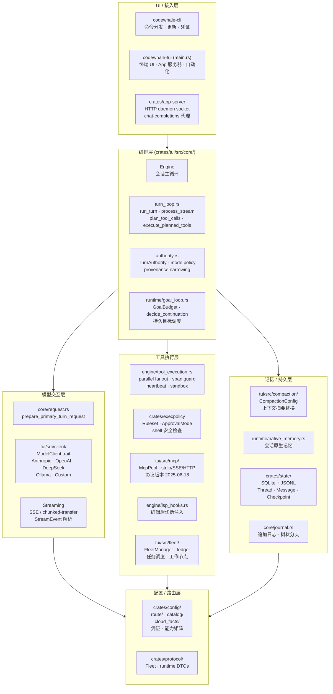

**读图要点**

1. **UI 层**只负责启动、分发和渲染；业务逻辑**不在** CLI/TUI 的 `main.rs` 里。
2. **编排层**的核心是 `Engine`，它在一个 Tokio 异步任务中长期存活，通过 `mpsc` 通道
   接收外部 `Op`（操作指令），并向外发送 `Event`（状态事件）。
3. **模型交互层**被 `ModelClient` trait 抽象，使所有 provider 调用路径共用同一个
   `prepare_primary_turn_request` 入口，避免多路分叉。
4. **工具执行层**中，`tool_execution.rs` 负责并行/串行分批执行，`ExecPolicy` 负责
   权限决策，`MCP` 负责外部工具协议，`Fleet` 负责跨进程子代理调度。
5. **记忆/持久层**分两条路径：热路径（Compaction, NativeMemory）在会话内处理；
   冷路径（StateStore）通过 SQLite 落盘，支持跨进程恢复。

### I.0.2 核心类图

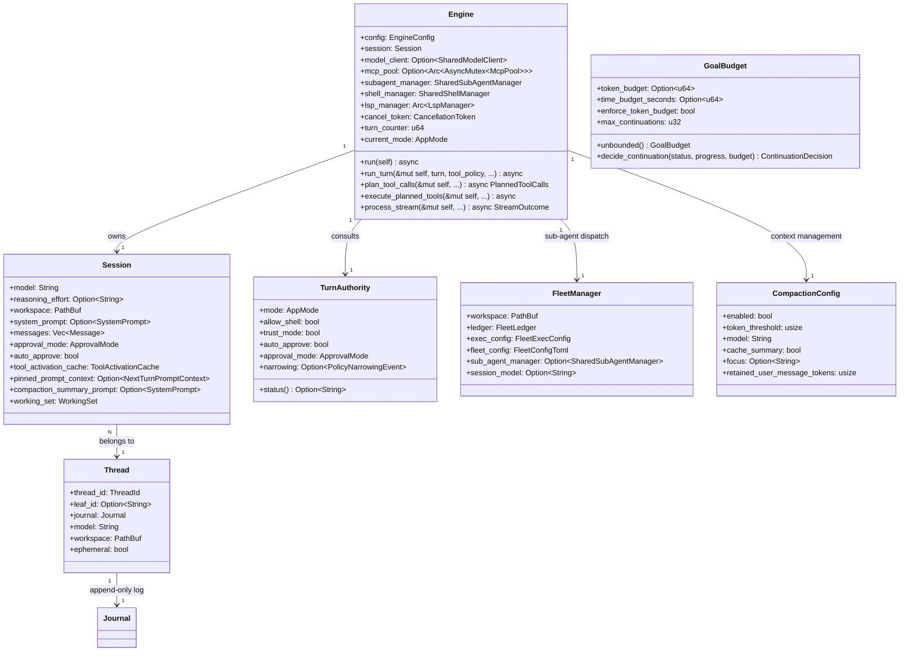

**读图要点**

- `Engine` 是会话运行时的根对象，持有所有热状态（session、mcp_pool、lsp_manager 等）。
- `Session`（TUI crate 内）与 `Thread`（`crates/core` 内）是分离的：`Thread` 持久化到磁盘，
  `Session` 仅存在于一次 engine 生命期内。
- `TurnAuthority` 不是一个全局单例，而是**每轮 turn 计算一次**的值对象，
  确保权限决策与 turn 的上下文绑定，不会跨 turn 泄漏。
- `GoalBudget` 的 `decide_continuation` 是一个纯函数（`#[must_use]`，无副作用），
  测试覆盖度很高，用于持久目标的跨 turn 调度策略。

### I.0.3 主数据流路径

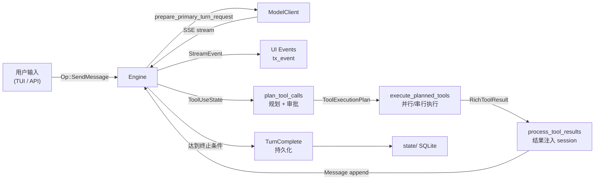

**读图要点**

从用户输入到 `TurnComplete` 是一个**单向数据管道**：每一步都通过函数参数或 channel 传递，
不通过全局可变状态传递。`Engine::run_turn` 是这条管道的编排者；它在一个 `loop` 内反复
调用 `process_stream → plan_tool_calls → execute_planned_tools → process_tool_results`，
直到模型返回 `stop_reason = "end_turn"` 且没有待执行工具为止。

---

## I.0.4 设计原则与动机 Essay

Codewhale 的架构不是偶然形成的，而是一系列有意识设计决策的结果。
本节通过"设计原则 + 动机 + 取舍"的三段式说明，帮助读者理解为什么代码看起来是这个样子。

### 原则一：严格分层，层间只通过接口通信

Codewhale 的 27 个 crate 形成了一个有向无环图（DAG），最底层的 crate
（如 `codewhale-models`、`codewhale-paths`）不依赖任何上层 crate。
这个选择的代价是：有时候需要在 crate 边界上定义中间 DTO 类型；
好处是：在独立进程（Fleet worker）中运行的 `codewhale-execpolicy` 不需要
携带完整的 TUI 运行时，二进制体积显著减小，冷启动更快。

**不变量体现**：`codewhale-runtime` 故意不依赖 `codewhale-tui`。
任何试图在 runtime 中 `use codewhale_tui::...` 的代码都会被
`scripts/check-command-crate-boundaries.py` 在 CI 中报错。

### 原则二：副作用在最外层，决策是纯函数

Engine 内的核心决策函数（`decide_continuation`、`prepare_primary_turn_request`、
`resolve_tool_permission`、`base_policy_for_mode`）都是纯函数。
这意味着这些函数可以被直接单元测试，不需要 mock 任何 I/O、数据库或网络。

代价是：有时候需要在调用点做额外的"收集参数 → 调用纯函数 → 应用结果"的分离，
代码稍显繁琐。好处是：这些关键决策的正确性可以被完全覆盖的测试保证，
不依赖 integration test 的慢速验证。

**典型案例**：`decide_continuation`（`goal_loop.rs:182`）接受三个值，
返回一个枚举。测试用例覆盖了所有的 `GoalRunStatus × GoalBudget` 组合，
不需要启动 engine 就能验证 goal 的续行逻辑。

### 原则三：Append-Only 持久化，不可变历史

所有落盘的数据（消息历史、Journal 节点、session_index.jsonl、telemetry 事件）
都是追加写入的，不原地修改。这有三个好处：
1. 并发安全：多个读者可以同时读取，不需要写锁（只有 append 需要锁）
2. 审计友好：所有历史都可以重建，不存在"覆盖之前的状态"
3. 压缩安全：JSONL 的 compaction（紧凑化）通过 atomic rename 实现，
   期间原文件仍然可读，不存在数据损坏窗口

代价是：随着时间增长，JSONL 文件会积累大量历史条目，需要周期性 compaction。
`StateStore` 通过 `SESSION_INDEX_LOCK` 保证 append 和 compaction 不会交错。

### 原则四：KV Cache 稳定性是一等公民

Codewhale 的系统提示设计明确将 KV-cache 前缀稳定性视为一等设计目标。
这在工程上意味着：

- 任何 volatile 信息（LSP 诊断、子代理完成、steer 输入、git dirty 状态变化）
  **不得**注入到 system prompt 前缀，必须以 user-role message 追加到 history
- `messages_revision`（`u64`，`wrapping_add`）是唯一触发 prefix 重新组装的机制
- 每次 compaction 后 `messages_revision` 递增，是 prefix 失效的唯一合法触发点

这个原则的动机：Anthropic 的 prompt caching 和 DeepSeek 的 KV cache 功能
都要求 system prompt 的前缀字节完全相同才能命中缓存。如果每次 turn 都重新生成
system prompt（哪怕只改了 git dirty 状态），cache hit rate 会降到接近 0，
API 成本和延迟都会显著上升。

### 原则五：错误边界清晰，快速失败

Codewhale 的错误处理遵循"在最近的有意义的边界失败，不传播无法恢复的错误"原则：

- **配置错误**：在加载时 `panic!` 或 return `Err`，不允许用默认值掩盖
- **工具执行错误**：转换为 `ToolError`，注入 session 作为 Tool role 消息，
  让模型在下一轮看到错误并自行修正（而不是 crash engine）
- **stream 错误**：通过 `StreamRetryBudget` 重试，超出预算后以 `TurnFailed` 结束 turn，
  用户可以重新发消息继续（session 状态完整保留）
- **压缩错误**：三类处理路径（Deterministic 跳过 / Transient 重试 / ContextOverflow 裁剪），
  不以 engine crash 结束

---

## I.3.6 Message 与 ContentBlock 类型系统

理解 Codewhale 的消息类型系统对于贡献代码和 debug 都至关重要。

### Message 结构

```rust
// crates/models/src/message.rs
pub struct Message {
    pub role: Role,          // User / Assistant / Tool
    pub content: Vec<ContentBlock>,
}

pub enum Role {
    User,
    Assistant,
    Tool,  // 注意：不是所有 provider 都支持独立的 Tool role
}
```

**角色约定**：
- `User`：用户消息，也用于 LSP 诊断、steer input、context update 等合成消息
- `Assistant`：模型输出的文本和工具调用
- `Tool`：工具调用的结果（`ToolResult` block）

### ContentBlock 变体

```rust
pub enum ContentBlock {
    Text(String),                      // 纯文本内容
    ToolUse {                          // 模型发出的工具调用请求
        id: String,
        name: String,
        input: serde_json::Value,
    },
    ToolResult {                       // 工具调用的结果
        tool_use_id: String,
        content: Vec<ToolResultContent>,
        is_error: bool,
    },
    Image {                            // 图像（base64 编码）
        source: ImageSource,
    },
    Thinking {                         // Anthropic extended thinking
        thinking: String,
        signature: Option<String>,
    },
    RedactedThinking {                 // 加密的 thinking block
        data: String,
    },
}
```

**关键约定**：

1. `ToolResult` 中的 `is_error: true` 不代表 engine crash，
   而是告诉模型"这个工具调用失败了"，模型可以在下一轮修正并重试。

2. `Thinking` block 只在使用了 Anthropic extended thinking 功能时出现。
   它在 `process_stream` 的 `ContentBlockDelta::ThinkingDelta` 中积累，
   最终存储在 `StreamOutcome.current_thinking` 中。
   `current_thinking_visible = false`（UI 默认折叠 thinking block）。

3. 图像处理路径：用户附件中的图像 → `strip_images_when_unsupported` 检查
   provider capability → 支持则保留 Image block → 不支持则替换为 Text 说明。

### 合成消息的格式约定

Codewhale 在 session.messages 中使用若干"合成消息"（不来自用户或模型，
由 engine 自动生成的 User role 消息）：

| 合成消息类型 | 格式标签 | 来源 |
|------------|---------|------|
| LSP 诊断 | `<lsp_diagnostics>` | `lsp_hooks.rs` |
| Steer 输入 | `<context_update>` | `turn_loop.rs` |
| 子代理完成 | `<codewhale:subagent.done>` | `runtime_handoff.rs` |
| Shell 完成 | `<codewhale:shell.done>` | `runtime_handoff.rs` |
| 等待子代理 | `<codewhale:waiting.subagents>` | `runtime_handoff.rs` |
| Turn 元数据 | `<turn_meta>` | `engine.rs:6403` |

这些标签是**约定**，不是强制的 schema——模型可以通过文本理解这些标签的含义，
而不需要额外的工具定义。选择 XML 格式而不是 JSON 的原因：XML 在大量 XML 存在时
对 token 的节约更显著，且 `<tag>` 的闭合结构比 JSON 更适合嵌套有序内容。

---

## II.1.4 Engine 的启动序列详解

Engine 从 `EngineConfig` 构造到第一个 Op 就绪的启动序列如下：

**阶段 1：构造（`Engine::new`）**

所有字段从 `EngineConfig` 初始化：
- 创建 `(rx_op, tx_op)` mpsc 通道对（容量 `ENGINE_OP_CHANNEL_CAPACITY = 32`）
- 创建 `(rx_event, tx_event)` 通道对
- 创建 `rx_approval`、`rx_steer`、`rx_subagent_completion` 通道
- 初始化 `SubAgentManager`（设置 max_subagents、launch_concurrency、max_spawn_depth）
- 初始化 `LspManager`（如果 LSP 配置了 enabled = true）
- 初始化 `ApprovalReceiptStore`（加载磁盘上的 remembered approvals）
- 初始化 `ShellManager`（后台 shell 进程注册表）

**阶段 2：MCP 初始化（`Engine::ensure_mcp_pool`）**

在 `Engine::run` 的第一轮 `next_run_input` 之前：
- 读取 config 中的 MCP 服务器列表
- 并发启动所有 MCP 服务器的连接（`McpPool::boot`）
- 通过 `mcp_boot_rx` channel 流式接收连接进度
- 每个成功连接的服务器立即加入 pool，不等待全部完成
- 连接失败的服务器记录错误日志，不阻止其他服务器连接

**阶段 3：工具目录初始化（首次 `build_turn_tool_registry_and_catalog`）**

在第一个 `SendMessage` Op 到来时：
- 构建包含所有可用工具的初始 catalog
- 初始化 `tool_activation_cache`（空 LRU 缓存）
- 如果 MCP pool 已经有成功连接的服务器，将其工具加入 catalog

**阶段 4：首次 session 快照**

在首次 turn 开始前，Engine 向 TUI 发送 `Event::SessionUpdated(initial_snapshot)`，
让 TUI 能够在用户发送第一条消息之前就显示正确的 session 状态（model 名称、workspace、mode 等）。

这个启动序列确保了：
- Engine 是异步启动的，不会阻塞 TUI 渲染主循环
- MCP 连接失败不会阻止 engine 就绪（只是少了一些工具）
- 第一个 Op（`SendMessage`）到来时，engine 已经处于完全就绪状态

---

## II.3.3 WorkingSet 的文件访问追踪

`WorkingSet`（`crates/tui/src/working_set.rs`）是 Session 持有的文件访问记录，
追踪当前 session 内所有被读取或写入的文件路径。

```rust
pub struct WorkingSet {
    reads: HashSet<PathBuf>,   // 被 read_file / grep 等工具读取过的文件
    writes: HashSet<PathBuf>,  // 被 write_file / edit_file / apply_patch 写入过的文件
}
```

WorkingSet 有三个主要用途：

**用途 1：用户消息中的文件引用检测**

`observe_user_message` 扫描用户消息文本中的文件路径引用（形如 `src/main.rs`）。
被引用的路径被加入 `reads` 集合，即使用户没有显式调用 `read_file`。
这使得 engine 可以在 session 结束时报告"这次对话中涉及了哪些文件"。

**用途 2：context_update_baseline 的 delta 计算**

每次构建 system prompt 时，`context_update_baseline` 记录最后一次注入的
workspace 状态摘要（文件树、git status 等）。
下次只发送**有变化的部分**（delta），避免重复发送大量相同内容。
WorkingSet 的 `writes` 集合用于优先 diff 最近被修改的文件。

**用途 3：Fleet worker 的工作区边界**

Fleet worker 的 `workspace_write_carve_out` 检查工具的写入路径是否在 `WorkingSet.workspace` 内。
Codewhale 不使用文件系统级 chroot，而是通过 WorkingSet 的路径检查实现逻辑上的 workspace 边界，
防止模型意外写入工作区外的系统文件。

---

## II.9.5 工具体系的分类与设计动机

Codewhale 的工具体系包含约 80 个工具文件（`crates/tui/src/tools/` 下约 83000 行代码）。
理解工具分类有助于在正确的位置添加新工具或修改现有工具。

### 核心工具（始终可用）

| 工具名 | 文件 | 说明 |
|--------|------|------|
| `bash` / `exec_shell` | `shell.rs` | Shell 命令执行，最复杂的工具 |
| `read_file` | `file.rs` | 读取文件内容（支持分页、行号标注）|
| `write_file` | `file.rs` | 原子写入文件 |
| `edit_file` | `file_tool.rs` | 字符串替换式局部编辑 |
| `apply_patch` | `apply_patch.rs` | unified diff 格式补丁应用 |
| `glob` | `file_search.rs` | 文件路径模式匹配 |
| `grep` | `search.rs` | 文件内容正则搜索 |

### 条件工具（按 feature flag 或 mode 启用）

| 工具名 | 条件 | 说明 |
|--------|------|------|
| `agent` | `subagents_enabled = true` | 启动子代理 |
| `remember` | `native_memory_enabled = true` | 写入原生记忆 |
| `goal_set/update/complete/blocked` | Operate 模式 | 持久目标管理 |
| `plan_*` | Plan 模式 | 规划工具（只建议，不执行）|
| `web_search` | `web_search_enabled = true` | 网络搜索 |
| `read_media` | 路由支持图像输入 | 读取图像/视频/音频 |

### MCP 工具（动态发现）

MCP 工具通过 `McpPool::tools_list()` 动态发现，加入 catalog 时使用
`deferred schema` 机制（只暴露名称和简短描述，完整 schema 在用户激活后加载）。

**设计动机**：MCP 工具的 schema 可能非常大（某些 MCP 服务器有数百个工具，
每个工具有详细的参数 schema），如果每次请求都携带全部 schema，
token 成本会显著增加。`ToolActivationCache` 的 LRU 机制确保只有最近使用的
8 个工具的 schema 被实际携带，其余工具只暴露名称供 `tool_search` 发现。

### 工具结果的标准格式

所有工具都通过 `RichToolResult` 返回结果：

```rust
pub struct RichToolResult {
    pub tool_use_id: String,
    pub content: Vec<ToolResultContent>,
    pub is_error: bool,
    pub resources: Vec<ResourceOccupancy>,  // 工具执行占用的资源（用于释放锁）
    pub follow_up_actions: Vec<FollowUpAction>,  // 工具建议的后续操作（如 git commit 提示）
}
```

`follow_up_actions` 是工具向 engine 建议的元操作，engine 可以选择执行（如发 toast 通知）
或忽略，这使工具不需要直接访问 engine 内部状态就能触发元操作。

---

## II.11.5 FleetLedger 的数据持久性保证

`FleetLedger`（`crates/tui/src/fleet/ledger.rs`）是 Fleet 系统的持久账本，
存储在 `~/.codewhale/fleet/{run_id}/ledger.json`。

### Ledger 的关键字段

```rust
pub struct FleetLedger {
    pub run_id: FleetRunId,
    pub spec: FleetTaskSpecDocument,
    pub tasks: HashMap<FleetTaskId, FleetTaskRecord>,
    pub workers: HashMap<FleetWorkerId, FleetWorkerRecord>,
    pub created_at: DateTime<Utc>,
    pub completed_at: Option<DateTime<Utc>>,
    pub status: FleetRunStatus,
}

pub struct FleetTaskRecord {
    pub id: FleetTaskId,
    pub status: FleetTaskStatus,  // Queued / Assigned / Running / Completed / Failed / Skipped
    pub assigned_worker: Option<FleetWorkerId>,
    pub result: Option<FleetTaskResult>,
    pub started_at: Option<DateTime<Utc>>,
    pub completed_at: Option<DateTime<Utc>>,
    pub retries: u32,
}
```

### Ledger 的写入时机

Ledger 在以下时机写入磁盘：
1. Fleet run 创建时（初始化所有任务为 Queued 状态）
2. 每次任务状态变更时（Queued → Assigned → Running → Completed/Failed）
3. 每次 Worker 发送进度更新时
4. Fleet run 最终完成时

写入使用 `utils::write_atomic`（先写临时文件，再 rename 替换），
确保不存在"部分写入"导致的 ledger 损坏。

### Ledger 的 Restart 语义

如果 parent engine 崩溃重启，它可以通过 `FleetLedger::load_from_run_dir`
恢复 Fleet run 的状态：
- 状态为 `Completed` 或 `Failed` 的任务不会重新调度
- 状态为 `Running` 的任务会被视为"orphaned"（失联的 worker），
  根据 `recover_orphaned_tasks` 策略决定是重试还是标记为 Failed
- 状态为 `Queued` 或 `Assigned` 的任务正常继续调度

这个设计使 Fleet 运行具有**幂等性**——即使 parent 崩溃，
重启后可以从中断点继续，不会重做已完成的工作。

---

## II.10.4 压缩语言契约与中文支持的设计考量

`COMPACTION_LANGUAGE_CONTRACT` 是 compaction.rs 中注入摘要请求的关键约束，
它解决了一个微妙但重要的问题：如何在多语言环境中生成正确的摘要？

**问题背景**：假设用户的对话是中文，但对话中包含大量英文代码、路径、命令名称。
摘要模型在看到中文对话时，有时会将代码注释、错误消息等英文内容
错误地翻译成中文，导致"cargo test" 变成"运货测试"之类的荒诞结果。

**解决方案**：`COMPACTION_LANGUAGE_CONTRACT` 通过明确的自然语言约束解决这个问题：

```
LANGUAGE CONTRACT:
1. Use the natural language of the most recent user message as the language for the summary.
2. Preserve the following in their original English regardless of summary language:
   - Code (function names, variable names, type names, method names)
   - File paths and directory names
   - Shell commands and terminal output
   - Error messages and stack traces
   - Package names, crate names, module names
   - Technical identifiers (IDs, URLs, environment variable names)
3. Do not add "English headings" — they are not a language toggle instruction.
```

这个约束有以下特性：
- 它不是简单地说"用中文/英文"，而是说"用最近消息的语言"，
  使摘要模型能够自适应地处理中文、日文、法文等各种用户语言
- "English headings"的禁止是针对一个已知的 failure mode：
  某些模型会将 `"## Summary"` 理解为"使用英文"的指令
- 保留英文技术标识符是为了让摘要在被模型读取时，
  仍然能够正确识别代码实体（如 `run_turn`、`crates/tui`），
  而不是翻译后的"运行转"或"crate/用户界面"

**中文对话的摘要示例**：

```
（正确的摘要）：
在这次对话中，我们修复了 crates/tui/src/core/engine.rs 中的
一个 race condition 问题（issue #6149）。问题原因是
ToolHeartbeatGuard 的 Drop 实现使用了 try_send 而不是
blocking await，导致在高负载时心跳事件被丢弃。
修复方法是将 interval.tick() 超时从 10 秒改为 5 秒。

（错误的摘要，应该避免）：
在这次对话中，我们修复了"crate/用户界面/源码/核心/引擎"中的
一个"竞争条件"问题（编号 #6149）。问题原因是"工具心跳守卫"
的"丢弃"实现使用了"尝试发送"而不是"阻塞等待"...
```

---

## II.4.4 `messages_with_turn_metadata` 详解

`messages_with_turn_metadata`（`engine.rs:6403`）在每次构建 API 请求时调用，
它在消息历史末尾附加一个 `<turn_meta>` XML 块，包含当前 turn 的运行时元数据：

```xml
<turn_meta>
  <mode>agent</mode>
  <approval_mode>suggest</approval_mode>
  <git_context>
    <branch>main</branch>
    <status>clean</status>
  </git_context>
  <session_id>sess_abc123</session_id>
  <turn_number>7</turn_number>
</git_context>
</turn_meta>
```

**设计动机**：模型需要知道自己处于什么模式、是否有 auto_approve、
git 状态如何，才能做出合适的决策（例如在 Plan 模式下不生成 shell 命令，
在 git dirty 时提醒用户先 commit）。把这些信息放在 `<turn_meta>` 而不是
system prompt 中，是出于 KV cache 稳定性考量——这些信息每轮都可能变化，
放在 history 末尾不会破坏 system prompt 的前缀缓存。

**变化检测优化**：`git_context` 部分有额外的变化检测（`last_git_snapshot_line`）：
只有当 git branch 或 dirty 状态发生变化时，才更新 `<git_context>` 块。
如果 git 状态没有变化，沿用上次的 `<git_context>`（内容相同但不重新生成），
这确保了即使是 `<turn_meta>` 这个"volatile" 块，在 git 状态稳定时也尽量保持内容一致，
降低不必要的 token 差异。

---

## II.5.5 多 Provider 的差异处理

虽然 `ModelClient` trait 提供了统一接口，各 provider 之间仍有若干差异，
由各自的 client transport 层处理：

### Anthropic 特有字段

- **`thinking` 参数**：Extended thinking 功能，通过 `thinking: { type: "enabled", budget_tokens: N }` 启用。
  只有当 `active_route_capabilities.thinking_enabled = true` 时才注入这个字段。
- **`cache_control`**：在 system prompt 的 `<antCache>` 块中注入 `"ephemeral"` 类型的缓存控制，
  触发 Anthropic 的 prompt caching（6 小时缓存窗口）。
- **`SignedThinking`**：Extended thinking 响应中的 `signature` 字段，
  Codewhale 将其存储在 `current_thinking_signature` 中，不在 UI 展示，但会在 session log 中保留。

### OpenAI / DeepSeek 特有字段

- **`response_format`**：某些场景（如 structured output）需要注入 `{ "type": "json_schema" }`，
  但 Codewhale 的标准 turn 不使用这个功能（工具调用已经提供了结构化输出）。
- **`reasoning_effort`**：DeepSeek R1 系列模型通过 `reasoning_effort: "low/medium/high/max"` 控制推理深度。
  OpenAI o1/o3 系列通过 `reasoning_effort: "medium/high"` 控制。这个字段在 `PrimaryTurnRequest.reasoning_effort` 中统一表示，
  各自的 client transport 负责映射到正确的 wire 格式。
- **`stream_options: { include_usage: true }`**：OpenAI 兼容 API 需要显式请求在流式响应中包含 usage 统计。
  Anthropic 默认包含，不需要这个字段。

### Ollama 特有处理

Ollama 使用 `/api/chat` 端点，返回的是 JSON 格式的流（每行一个 JSON 对象），
而不是 SSE 格式。`OllamaClient` 的 `send` 方法将 JSON stream 转换为
标准的 `StreamEvent` 流，使 turn_loop.rs 的 `process_stream` 不需要知道
自己在与哪种 provider 通信。


### I.1.1 产品定位

Codewhale 是一个**终端优先（terminal-first）、开放提供商（provider-neutral）的
AI 编程代理**，运行于工程师的本地机器上，在其工作区（workspace）内完成代码理解、
生成、修改、测试运行和调试任务。它与运行在云端的 SaaS 代理不同：
**工具执行在用户机器本地发生**，LLM API 调用则可路由到任意受支持的提供商。

核心能力覆盖五个维度：

1. **多轮对话代理**（Multi-turn agent）：通过一个持久 Engine，
   维护完整的消息历史和工具调用链，支持数十轮无限制连续推理。

2. **持久目标（Persistent Goal）**：用户可发出一个高层目标（`/goal`），
   系统在后台反复 dispatch 多个 worker turn，直到目标达成、阻塞或被手动停止。
   `runtime/goal_loop.rs` 中的 `decide_continuation` 函数负责每轮结束后的
   continue/stop 决策，默认无上限，只受 terminal model signal 约束。

3. **工具执行沙箱**：shell 命令、文件编辑、MCP 外部工具的执行都经过
   多层权限决策（`ApprovalMode`、`ExecPolicy`、`TurnAuthority`），
   支持 `ReadOnly / WorkspaceWrite / DangerFullAccess` 三档 sandbox 策略。

4. **Fleet 多代理编排**：一个 parent agent 可并行 spawn 最多
   `max_subagents`（默认 `DEFAULT_MAX_SUBAGENTS`）个 child agent，
   每个 child 在独立的 worktree 或进程中运行，通过 ledger 追踪进度，
   支持验证、报告、策略切换等高级工作流。

5. **记忆与压缩**：当对话 token 超过阈值（默认 800K），自动触发
   `CompactionConfig` 驱动的上下文摘要替换，保留 KV-cache 前缀稳定性，
   同时将最近若干 user message 原文保留（`retained_user_message_tokens`）。

### I.1.2 三种运行模式

| 模式 | 英文标识 | Shell | 信任 | 审批策略 |
|------|----------|-------|------|----------|
| 规划模式 | `Plan` | ❌ | ❌ | `Suggest`（建议，不执行） |
| 代理模式 | `Agent` | 依配置 | 依配置 | 用户配置基线 |
| 持久目标模式 | `Operate` | 同 Agent | 同 Agent | 同 Agent + 编排能力 |

模式切换由 `authority.rs` 中的 `base_policy_for_mode` 函数负责，
它从 `ModeSessionPrefs`（agent 模式的用户基线）推导出 `EffectiveModePolicy`，
确保 Plan 模式永远只读，不会因某个代码路径遗漏了权限检查而悄然获得写权限。

### I.1.3 支持的提供商

Codewhale 通过 `crates/config/src/route/` 的路由系统支持多个 AI 提供商：

- **Anthropic**（claude-3.x, claude-sonnet, claude-opus 等）
- **OpenAI**（GPT-4o, o1, o3 等）
- **DeepSeek**（deepseek-v3, deepseek-r1 等；支持 `reasoning_effort` 参数）
- **xAI Grok**（grok-2, grok-3 等）
- **Ollama**（本地模型，`local_ollama.rs`）
- **自定义路由**（`Custom` 类型，通过 config TOML 配置 base URL + auth）

路由选择通过 `config/src/route/resolver.rs` 中的 `RouteResolver` 实现，
综合考虑 `RouteLimits`、`RouteCapabilities`（图像输入、工具调用、reasoning 等）
和 `cloud_facts`（云端 catalog 补丁与能力矩阵）。

---

## I.2 Crate 设计与依赖拓扑

### I.2.1 Crate 列表

Codewhale monorepo 的 `crates/` 目录下包含 27 个 crate，按职责分组如下：

**入口与 UI**
| Crate | 路径 | 职责 |
|-------|------|------|
| `codewhale-cli` | `crates/cli` | 命令行入口、`dispatch.rs` 命令路由、更新逻辑、凭证交接 |
| `codewhale-tui` | `crates/tui` | 终端 UI、Engine、工具实现、Fleet、MCP、Session 管理（最大的 crate） |
| `codewhale-app-server` | `crates/app-server` | HTTP 守护进程 socket、`chat_completions` 兼容层 |

**核心编排**
| Crate | 路径 | 职责 |
|-------|------|------|
| `codewhale-runtime` | `crates/runtime` | 无 TUI 依赖的运行时逻辑：goal_loop、context_budget、native_memory、session_tree 等 |
| `codewhale-core` | `crates/core` | 请求构造（`request.rs`）、Thread/Session 类型、Journal、片段（fragments）、前缀缓存 |
| `codewhale-workflow` | `crates/workflow` | Fleet 工作流：fleet_composition、fleet_exact、fleet_reasoning、role_resolve 等 |
| `codewhale-workflow-js` | `crates/workflow-js` | JavaScript VM（Deno/V8）嵌入，用于执行用户自定义工作流脚本 |
| `codewhale-lane` | `crates/lane` | worktree 管理（git worktree + lane control），Fleet worker 运行时隔离 |

**配置与路由**
| Crate | 路径 | 职责 |
|-------|------|------|
| `codewhale-config` | `crates/config` | 全局配置结构体、提供商路由（`route/`）、凭证（`credentials.rs`）、cloud facts |
| `codewhale-protocol` | `crates/protocol` | Fleet、runtime、engine_owner DTOs，跨进程协议定义 |
| `codewhale-command-contract` | `crates/command-contract` | 命令元数据（dispatch facets）类型定义 |

**安全与权限**
| Crate | 路径 | 职责 |
|-------|------|------|
| `codewhale-execpolicy` | `crates/execpolicy` | 执行策略：`Ruleset`、`ApprovalMode`、`ToolAskRule`、shell 解析器、bash arity 检查 |

**工具与 MCP**
| Crate | 路径 | 职责 |
|-------|------|------|
| `codewhale-tools` | `crates/tools` | 工具输出结构体（`outcome.rs`、`prepared.rs`、`resources.rs`） |
| `codewhale-mcp` | `crates/mcp` | MCP 协议客户端/服务器库（供 tui/src/mcp 使用） |

**记忆与持久**
| Crate | 路径 | 职责 |
|-------|------|------|
| `codewhale-state` | `crates/state` | SQLite + JSONL 持久层（Thread、Message、Checkpoint、Job） |
| `codewhale-memory` | `crates/memory` | 高层记忆服务：store、lens、policy、protocol、workspace 分层 |

**模型与云端**
| Crate | 路径 | 职责 |
|-------|------|------|
| `codewhale-models` | `crates/models` | 模型 API DTOs（`Message`、`ContentBlock`、`StreamEvent`、`Tool`、`Usage`） |
| `codewhale-cloud-facts` | `crates/cloud-facts` | 从云端获取 provider catalog 元数据 |

**基础设施**
| Crate | 路径 | 职责 |
|-------|------|------|
| `codewhale-paths` | `crates/paths` | 平台无关的路径解析（`CODEWHALE_APP_DIR`、home override） |
| `codewhale-secrets` | `crates/secrets` | 凭证加密与安全存储 |
| `codewhale-telemetry` | `crates/telemetry` | 结构化事件遥测（actor、buffer、envelope） |
| `codewhale-localization` | `crates/localization` | i18n 字符串（Fluent），build.rs 生成 MessageId |
| `codewhale-palette` | `crates/palette` | 终端颜色主题：OSC-11 检测、明暗适配、对比度计算 |
| `codewhale-release` | `crates/release` | 版本信息（build.rs 注入） |
| `codewhale-build-support` | `crates/build-support` | 跨 crate 共用的 build.rs 辅助函数 |

### I.2.2 关键依赖关系

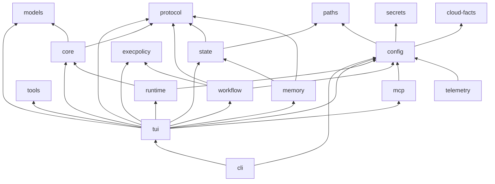

**读图要点**

- `codewhale-tui` 是依赖最广的 crate，它汇聚了 runtime、core、config、state、
  execpolicy、tools、mcp、workflow、memory，是系统运行时的"胶水层"。
- `codewhale-runtime` 特意**不**依赖 `codewhale-tui`，从而使无 UI 的 headless 运行
  和 TUI 运行共享相同的 goal_loop、context_budget 等逻辑。
- `codewhale-core` 是最纯粹的"无副作用"层：它只持有请求构造、Journal、类型定义，
  没有任何 I/O 或 async 运行时依赖。
- `codewhale-execpolicy` 只依赖 `codewhale-protocol` 和标准库，确保权限规则可以
  在独立进程（worker agent）中不带完整运行时加载。

---

## I.3 核心实体与类型系统

### I.3.1 Thread（持久线程）

定义于 `crates/core/src/session.rs`：

```rust
pub struct Thread {
    pub thread_id: ThreadId,
    pub leaf_id: Option<String>,  // Journal 的游标：当前最新叶节点
    pub journal: Journal,         // 追加日志，树状结构
    pub model: String,
    pub reasoning_effort: Option<String>,
    pub workspace: PathBuf,
    pub ephemeral: bool,
}
```

`Thread` 是**持久化的对话容器**，对应 SQLite 里的一行 `threads` 记录。
它的 `journal` 是追加日志（append-only），支持通过 `branch_to` 在历史节点间切换
（即分支对话），但历史永不重写——分支只移动 `leaf_id` 游标。

### I.3.2 Session（临时会话）

同样定义于 `crates/core/src/session.rs`（`codewhale-core` crate），
以及更完整的版本在 `crates/tui/src/core/session.rs`（`codewhale-tui` crate）：

`codewhale-core` 中的 `Session` 是轻量级类型，代表**一次 engine 生命期内的 ephemeral 状态**：

```rust
pub struct Session {          // crates/core/src/session.rs
    pub session_id: SessionId,
    pub thread_id: ThreadId,
    pub model: String,
    pub workspace: PathBuf,
    pub messages_revision: u64,  // 前缀缓存记忆化用的单调版本号
}
```

`codewhale-tui` 内的 `Session` 更重，包含：
- `messages: Vec<Message>`（完整消息历史）
- `system_prompt: Option<SystemPrompt>`（当前 pinned 系统提示）
- `approval_mode: ApprovalMode`，`auto_approve: bool`
- `tool_activation_cache: ToolActivationCache`（deferred schema LRU 缓存，上限 8 个工具）
- `pinned_prompt_context`（KV-cache 稳定性管理）
- `working_set: WorkingSet`（已读/已写文件集合）
- `compaction_summary_prompt`（摘要压缩后的 checkpoint）

### I.3.3 Engine

`Engine` 定义于 `crates/tui/src/core/engine.rs`，约 7000 行，
是运行时的核心对象。关键字段分组：

**I/O 通道组**
```
rx_op:  mpsc::Receiver<Op>          // 接收外部操作指令（来自 TUI / App Server）
tx_op:  mpsc::Sender<Op>            // 自发操作（如 goal continuation SendMessage）
tx_event: mpsc::Sender<Event>       // 向 UI 发送状态事件
rx_approval: mpsc::Receiver<ApprovalDecision>
rx_steer:   mpsc::Receiver<SteerInput>
rx_subagent_completion: mpsc::Receiver<SubAgentCompletion>
```

**模型客户端组**
```
model_client: Option<SharedModelClient>   // 当前激活的 provider-neutral 客户端
api_provider: ApiProvider                  // 当前提供商枚举
active_route_limits: Option<RouteLimits>  // max_output_tokens 等约束
active_route_capabilities: RouteCapabilities  // 图像输入、工具调用等能力标志
```

**状态组**
```
session: Session                          // 热会话状态
current_mode: AppMode                     // Plan / Agent / Operate
mcp_pool: Option<Arc<AsyncMutex<McpPool>>>  // MCP 连接池
subagent_manager: SharedSubAgentManager  // 子代理生命周期管理
turn_counter: u64                         // 单调递增 turn 序号
cancel_token: CancellationToken           // 取消当前 turn
```

**安全/沙箱组**
```
tool_exec_lock: Arc<RwLock<()>>           // 防止并发写操作冲突的全局锁
sandbox_backend: Option<Arc<dyn SandboxBackend>>  // 可选外部 sandbox
sandbox_enforcement: SandboxEnforcement   // 会话级 sandbox 策略（不可逐 turn 探测）
lsp_manager: Arc<LspManager>              // LSP 诊断后端
approval_receipt_store: Result<ApprovalReceiptStore, String>
```

### I.3.4 EngineConfig（构建时配置）

`EngineConfig` 是 `Engine::new` 的配置结构体，包含约 40 个字段，代表**构建时确定的不可变配置**：

- `model`: 默认模型标识符
- `workspace`: 工作区根目录（工具执行的 chroot）
- `session_id`: 宿主（host）预分配的 session id
- `allow_shell`, `trust_mode`: shell 执行和信任模式初始值
- `max_steps`: 每 turn 最大步数（默认交互模式无限制，goal 模式默认 1000）
- `max_subagents`, `launch_concurrency`: 并发子代理上限
- `compaction`: `CompactionConfig` 上下文压缩配置
- `auto_review_policy`: 确定性自动审查策略
- `snapshots_enabled`: 是否在工具执行前后打 git snapshot
- `record_restore_points`: 是否记录 restore-point 以支持 undo API

### I.3.5 TurnContext（单轮上下文）

`TurnContext` 定义于 `crates/tui/src/core/turn.rs`，是**一个 turn 内**的临时状态容器：

```
id: String            // 本轮唯一标识
step: u32             // 本轮内的步骤计数（每次 provider 请求 +1）
max_output_tokens: Option<u32>
stop_diagnostics: TurnStopDiagnostics  // 收集 permission denial 等诊断信息
```

`TurnContext` 的生命期严格限定在 `run_turn` 函数内，不跨轮持久。

---

## I.4 模块协作模式

### I.4.1 Engine 事件驱动循环

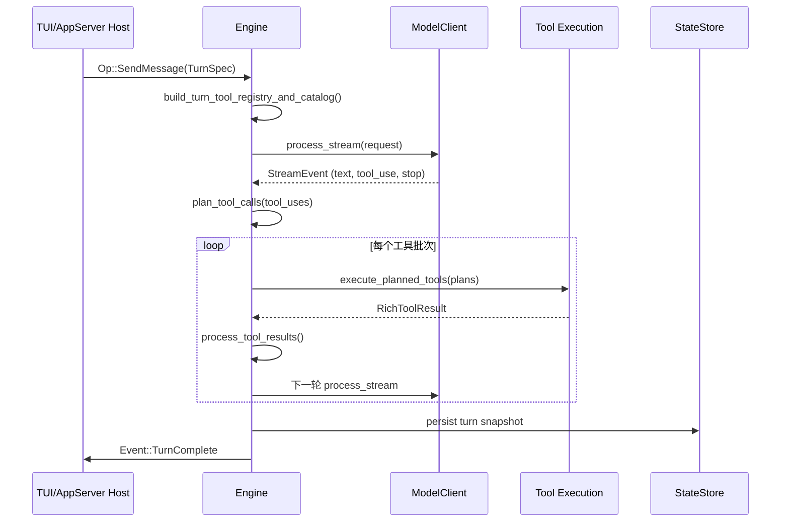

### I.4.2 Op / Event 通道协议

`Engine` 通过两个 Tokio mpsc 通道与宿主通信：

**输入（Op）**：宿主向 engine 发送操作指令
- `Op::SendMessage(TurnSpec)` — 启动新一轮对话
- `Op::ChangeMode(AppMode)` — 切换 Plan/Agent/Operate 模式
- `Op::SyncSession(...)` — 同步另一个会话的历史和工作区
- `Op::ApprovalDecision(...)` — 用户对工具调用的审批决定
- `Op::Cancel` — 取消当前 turn
- `Op::GoalResume / GoalStop` — 持久目标的控制指令
- `Op::McpReload(path)` — 重新加载 MCP 配置

**输出（Event）**：engine 向宿主推送状态变化
- `Event::TextDelta(text)` — 模型输出的文本片段（流式）
- `Event::ToolCallStarted / ToolCallCompleted` — 工具调用生命周期
- `Event::TurnComplete` — 当前 turn 正常结束
- `Event::TurnFailed(error)` — 当前 turn 失败
- `Event::SessionUpdated(snapshot)` — 完整会话状态快照
- `Event::GoalUpdated(snapshot)` — 持久目标状态更新
- `Event::OperationActivityStarted / Completed` — 子操作生命周期（用于 UI 进度显示）
- `Event::WorkspaceSnapshotTaken(receipt)` — git 快照完成（供 undo API 使用）

### I.4.3 Goal Continuation 机制

持久目标（`/goal`）通过以下路径实现跨 turn 的自动续行：

```mermaid
flowchart TD
    TurnEnd["turn_loop: run_turn 结束"] -->|goal_continuation_message_if_needed| Check{decide_continuation}
    Check -->|Continue| Wait["await_continuation_wait\n(0秒~24小时 quiet period)"]
    Wait -->|Elapsed| Dispatch["tx_op.send(Op::SendMessage)\n自发续行"]
    Wait -->|Cancelled| Stop["goal paused"]
    Check -->|Stop(Completed)| Done["goal 完成"]
    Check -->|Stop(Blocked)| Blocked["goal 阻塞，等用户"]
    Check -->|Stop(ContinuationLimit)| Limit["超出 max_continuations"]
```

`decide_continuation` 是纯函数，定义于 `crates/runtime/src/goal_loop.rs`（第 182 行），
优先级：① terminal model signal（Completed/Blocked）→ ② enforced token budget →
③ continuation backstop → ④ 继续。

---

## I.5 端到端活动序列与读图说明

### I.5.1 完整 E2E 活动图（用户发送消息到 TurnComplete）

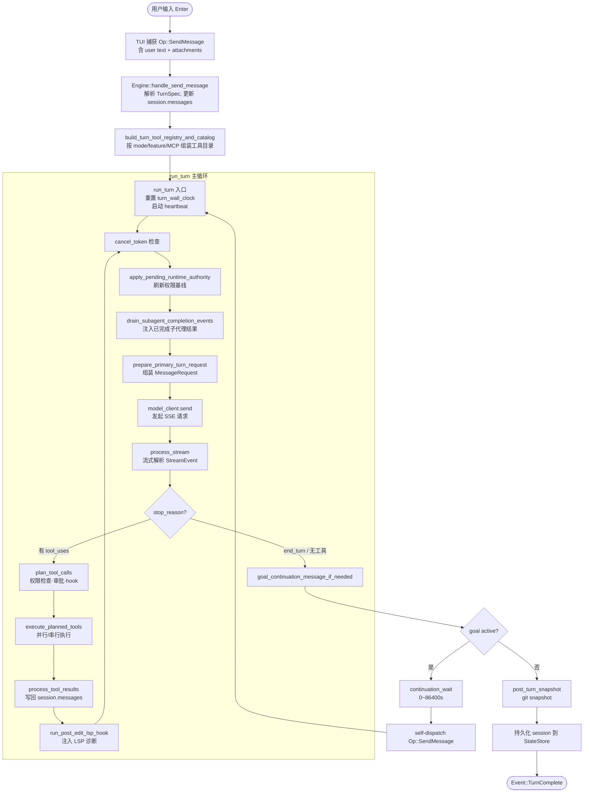

### I.5.2 读图说明（§0.5 风格）

本节对上述活动图中每个关键节点进行逐一说明，帮助读者理解控制流的来龙去脉。

**① 用户输入捕获（A → B）**

TUI 的 `main` 事件循环监听键盘输入。用户按下 Enter 后，TUI 将用户文本、
附件（图像 base64、文件引用）以及当前会话元数据打包为 `TurnSpec`，
通过 `tx_op.send(Op::SendMessage(TurnSpec))` 发送给 Engine 的 `rx_op` 通道。
AppServer 走的是 HTTP `chat_completions` 接口，经过 `chat_completions.rs` 的
协议适配后同样产生一个 `Op::SendMessage`。

**② handle_send_message（B → C）**

`Engine::handle_send_message`（`engine.rs` 第 5226 行）是接收 `SendMessage` Op 的
入口函数。它负责：
- 将用户文本包装为 `Message { role: Role::User, content: [...] }` 并追加到
  `session.messages`
- 解析附件（图像、文件），将其 inline 到 user message 的 ContentBlock 列表
- 调用 `session.working_set.observe_user_message` 更新已引用文件集合
- 构造 `TurnContext`（id、step=0）
- 调用 `run_turn`

**③ 工具目录构建（C → D）**

`build_turn_tool_registry_and_catalog`（`engine.rs` 第 4877 行）按以下顺序
组装本轮可用的工具集合：
1. 读取 `features.rs` 中的 feature flags（控制 `agent` 工具、`remember` 等是否启用）
2. 按 `current_mode` 过滤：Plan 模式禁用所有 shell/write 工具
3. 合并 MCP 工具（来自 `mcp_pool` 的已连接服务器）
4. 应用 `tool_activation_cache`（`tool_search` 激活的 deferred schema 工具）
5. 应用 `max_subagents` 等容量约束（超出上限则不暴露 `agent` 工具）

结果是一个 `Vec<Tool>`（JSON Schema 列表）和一个 `ToolRegistry`
（工具名 → 执行函数的 HashMap），两者都是本 turn 的快照，不会在 turn 中途改变
（除非收到 `Op::McpReload`，此时有额外的 refresh 逻辑）。

**④ run_turn 入口（D → E）**

`run_turn`（`turn_loop.rs` 第 896 行）是 Codewhale 的**唯一 turn 循环**，
由 `crates/core/tests/single_turn_loop.rs` 中的 guard test 强制保证单一性。
进入时：
- 重置 `turn_wall_clock`（每 turn 的墙钟预算计时器）
- 启动 `turn_heartbeat`（防止 TTY 超时的 keep-alive 信号）
- 如果终端 chrome 已启用，设置 taskbar progress indicator 和标题动画

**⑤ cancel_token 检查（E → F）**

每次进入主循环体时首先检查 `cancel_token.is_cancelled()`。
用户按 Ctrl+C 触发取消后，engine 向 UI 发送 `Event::status("Request cancelled")`，
并立即返回 `(TurnOutcomeStatus::Interrupted, None)`。
工具执行中的取消通过 `tokio::select! { biased; _ = cancel_token.cancelled() => ... }` 
在 `process_stream` 和 `execute_planned_tools` 的各个 await 点均匀响应。

**⑥ 权限基线刷新（F → G）**

`apply_pending_runtime_authority` 消费 `live_runtime_authority` 中挂起的权限变更，
例如用户在 turn 进行中通过 `/mode work` 或 `SecurityApproval` 事件修改了 approval_mode。
变更会使当前 `fleet_denial_guard` 重置（防止旧批次的授权继续生效），
并更新 `current_mode`。

**⑦ 子代理完成事件注入（G → H）**

`drain_subagent_completion_events` 在每次 provider 请求前检查
`rx_subagent_completion` 通道，将已完成的子代理结果作为合成消息注入
`session.messages`（以 `<codewhale:subagent.done>` XML 标签格式）。
这确保 parent model 在下一次 API 调用时能看到最新的子代理输出，
而无需等到整个 turn 结束后才处理。

**⑧ 请求构造（H → I）**

`prepare_primary_turn_request`（`crates/core/src/request.rs`）将以下输入
组装为 `MessageRequest`（provider-neutral）：
- `session.messages`（含 `messages_with_turn_metadata` 附加的 `<turn_meta>` 块）
- `system_prompt`（pinned 前缀，不在 messages 中重复）
- `tools`（当前工具目录）
- `tool_choice`：`"none"` / `"required"` / `{"type": "auto"}`
- `reasoning_effort`（DeepSeek/o1 等推理 tier）
- `stream: Some(true)`

关键约束：`prepare_primary_turn_request` 是一个**纯函数**，不做 I/O，
不调用任何 async 函数，也不接触 provider 特有字段（这些由 client transport 处理）。

**⑨ process_stream（J → K）**

`process_stream`（`turn_loop.rs` 第 5532 行）在 `tokio::select!` 循环中
处理来自 provider 的 SSE 事件：

- `MessageStart` — 记录初始 usage
- `ContentBlockStart(ToolUse)` — 开始收集 tool_use block，记录 tool name
- `ContentBlockDelta(TextDelta)` — 追加模型文本，发送 `Event::TextDelta`
- `ContentBlockDelta(InputJsonDelta)` — 追加 JSON 输入片段（用于 tool_use）
- `ContentBlockStop` — 完成一个 content block
- `MessageDelta` — 更新 stop_reason 和 delta usage
- `MessageStop` — 流结束

流中断处理有多层防护：
- `chunk_timeout`（每个 chunk 的超时）：检测 stall
- `stream_max_duration`（单次流最大墙钟时间）：防止永久挂起
- `stream_max_content_bytes`：防止超大响应
- `StreamRetryBudget`：网络断流时最多重试 `MAX_STREAM_RETRIES` 次

**⑩ plan_tool_calls（K → M）**

当 `stop_reason = "tool_use"` 且 `tool_uses` 非空时，进入 `plan_tool_calls`
（`turn_loop.rs` 第 3354 行）。这个函数的核心职责是**决策**，不执行：

1. 检查 `ToolCallBudget`（每 turn 的工具调用次数上限）
2. 检查 Plan 模式阻断（`mode_blocks_command_execution`）
3. 查找工具定义（registry 或 catalog）
4. 应用 `ExecPolicy`（denied_prefixes、ask_rules、trusted_prefixes）
5. 调用 `run_tool_call_before_hooks`（before-hooks 可以附加 `additionalContext`
   或要求审批）
6. 构造 `ToolExecutionPlan`（含 approval_required、sandbox_policy、resources 等字段）

对于需要审批的工具，`plan_tool_calls` 会**阻塞等待**用户通过 `rx_approval` 通道
发来的 `ApprovalDecision`，期间 UI 展示审批对话框。

**⑪ execute_planned_tools（M → N）**

`execute_planned_tools`（`turn_loop.rs` 第 4001 行）接收 `PlannedToolCalls`，
通过 `plan_tool_execution_batches` 将工具分组为串行/并行批次：

- 所有标记 `supports_parallel: true` 且为 read-only 的工具可以并行
- 包含 write 操作、需要审批或 `GlobalExclusive` 资源锁的工具必须串行

并行批次使用 `FuturesUnordered` 并发执行；串行批次顺序执行。
每个工具执行都包裹在 `OperationSpanGuard`（开始/完成的 RAII 配对通知）
和 `ToolHeartbeatGuard`（每 10 秒发送一次 keep-alive pulse）中。

**⑫ LSP 诊断注入（N → P）**

每个 file-editing 工具（`edit_file`、`write_file`、`apply_patch`）成功执行后，
调用 `run_post_edit_lsp_hook`（`lsp_hooks.rs`），通过 LSP manager 
获取编辑文件的最新诊断（错误/警告），并将其存入 `pending_lsp_blocks`。
在下一次 API 请求前，这些诊断块被注入为合成的 user-role message，
让模型在下一步就能看到自己编辑产生的 lint/type 错误。

**⑬ Goal Continuation（Q → T）**

当 turn 的模型响应结束（`stop_reason = "end_turn"` 且无 tool_uses）时，
`goal_continuation_message_if_needed`（第 6305 行）检查当前是否有
活跃的持久目标，如果有则：
1. 调用 `decide_continuation` 决定是否继续
2. 计算 `continuation_wait`（quiet period）
3. 等待 `await_continuation_wait`（可被 cancel_token 中断）
4. 自发 dispatch `Op::SendMessage`，开始下一个 continuation pass

**⑭ git Snapshot 与持久化（U → V）**

Turn 结束前（`post_turn_snapshot_before_complete`），如果 `snapshots_enabled`，
engine 通过 side-git 机制打一个工作区快照，并将快照 receipt（含 changed_paths）
以 `Event::WorkspaceSnapshotTaken` 发给宿主，宿主用于实现 per-turn undo。
随后通过 `StateStore` 将 turn 内容落盘（SQLite + JSONL append）。

---

## I.6 会话与 Thread 生命周期

### I.6.1 Thread / Session 分离设计（Issue #5261）

在 #5261 之前，Codewhale 只有一个 `Session` 对象，既持有持久化的对话历史，
也持有当前 turn 的临时状态。这导致几个问题：
- headless 执行（无 TUI）和有 TUI 的执行无法共用同一个 session 构造路径
- session 的概念混淆了"对话实体"和"运行时实例"

分离后的设计：

```
Thread (crates/core)     — 持久实体，一条 SQLite 记录
├── thread_id: ThreadId  — 全局唯一 ID，UUID v4
├── leaf_id              — Journal 当前叶节点游标
├── journal              — append-only 树状日志
├── model                — 对话绑定的默认模型
└── workspace            — 对话绑定的工作区

Session (crates/core)    — 临时实体，不落盘
├── session_id: SessionId — 每次 engine 启动新生成
├── thread_id            — 指向所属 Thread
├── model                — 本次 session 可能覆盖的模型
└── messages_revision    — 前缀缓存记忆化版本号（u64，wrapping_add）
```

`session_for_thread` 函数是从 Thread 派生 Session 的标准路径：

```rust
pub fn session_for_thread(thread: &Thread, workspace: PathBuf) -> Session {
    Session::new(thread.thread_id.clone(), workspace, thread.model.clone())
}
```

### I.6.2 Journal 与分支对话

`Journal`（`crates/core/src/journal.rs`）是一个 append-only 树状日志，
用于支持"分支对话"功能（`/branch`、`/fork`）：

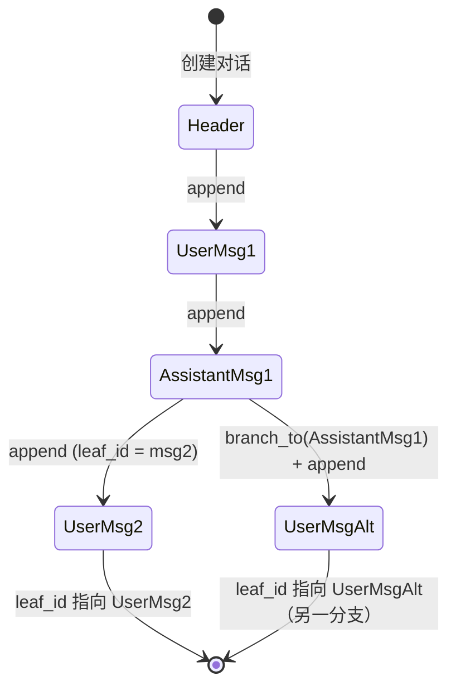

**读图要点**：`branch_to` 只移动 `leaf_id` 游标，不删除任何历史节点。
`journal.len()` 反映的是所有历史节点的总数（包括已 branch away 的），
而从 root 到当前 `leaf_id` 的路径才是当前对话上下文。

### I.6.3 Thread 与 StateStore 的映射

`crates/state/src/lib.rs` 中的 `StateStore` 维护两个存储层：

1. **SQLite 数据库**（`threads` 表）：存储 `ThreadMetadata`，包含 id、preview、
   model、created_at、updated_at、status、git_sha、git_branch 等元数据。
   Thread 的 full content（消息、工具调用）不在 SQL 里——SQL 只是索引。

2. **JSONL 追加文件**（`session_index.jsonl`）：记录每个 session 的路径和
   rollout 文件位置，由 `SESSION_INDEX_LOCK` 全局互斥锁保护，防止并发 compaction
   和 append 交错。

---

## I.7 记忆、上下文压缩与 KV 缓存策略

### I.7.1 上下文压缩（Compaction）

上下文压缩由 `crates/tui/src/compaction/` 实现，核心配置是 `CompactionConfig`：

```rust
pub struct CompactionConfig {
    pub enabled: bool,              // v0.8.6 起默认开启
    pub token_threshold: usize,     // 默认 800_000 tokens（80% of 1M window）
    pub model: String,              // 用于摘要的模型（可与对话模型不同）
    pub image_input: SupportState,  // 摘要模型的图像能力
    pub cache_summary: bool,        // 是否为摘要加 cache_control
    pub focus: Option<String>,      // /compact <focus> 的用户聚焦提示
    pub summary_instructions: Option<String>, // 运营商的自定义摘要指令
    pub retained_user_message_tokens: usize, // 保留最近 user messages 的 token 数
}
```

压缩流程：

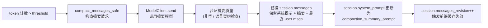

**读图要点**：
- 压缩后 `messages_revision` 递增，这会使 `PrefixStabilityManager` 允许重组 system prompt。
- `COMPACTION_LANGUAGE_CONTRACT` 常量（第 120 行附近）要求摘要使用最近 user message 的语言，
  但保留代码、路径、命令等英文标识符——这防止了摘要模型将代码注释错误地翻译为非英语。
- 压缩失败分三类：`Deterministic`（重试无益）、`Transient`（可重试）、
  `ContextOverflow`（上下文溢出，需要 drop 最老的历史条目后重试）。

### I.7.2 KV 缓存稳定性

Codewhale 的 system prompt 设计围绕**前缀缓存（KV-cache prefix）** 优化：

1. **Pinned prefix**：`session.system_prompt` 在一次 session 内只由明确声明的操作
   （`/model` 切换、mode 切换、goal 编辑、session sync）触发更新，不会因为工具执行
   后工作区文件变化而重新生成（否则每次 `write_file` 都会导致整个 system prompt 哈希变化，
   摧毁 DeepSeek 的 KV 缓存命中率）。

2. **Volatile facts as messages**：LSP 诊断、子代理完成通知、steer input 等
   频繁变化的信息通过 `<context_update>` user-role message 追加到 history，
   而**不是**注入到 system prompt 前缀。

3. **`context_update_baseline`**：记录模型最后一次看到的 context 状态，
   下次计算 delta 时只发送变化部分，避免重复发送相同信息。

4. **`prefix_cache.rs`（`PrefixStabilityManager`）**：通过 `messages_revision`
   的单调递增，判断何时需要重新组装 system prompt，何时可以复用上次的已哈希版本。

### I.7.3 原生记忆（Native Memory）

`runtime/src/native_memory.rs` 实现了进程内的会话级记忆存储，
由 `tools/remember.rs` 的 `remember` 工具作为写入入口：

- 记忆以 K-V 对形式存储，每个 K 对应一条可检索的"事实"
- 检索通过关键词匹配，注入为 `<memory>` block 到 system prompt
- 记忆的 `MemoryLens`（`crates/memory/src/lens.rs`）支持 workspace 级、
  user 级的隔离，防止跨项目的记忆污染

---

## I.8 权限模型与执行策略体系

### I.8.1 TurnAuthority 的计算

每个 turn 开始前，engine 从以下输入计算 `TurnAuthority`：

1. `current_mode`（Plan / Agent / Operate）
2. `ModeSessionPrefs`（用户为 Agent 模式配置的基线：allow_shell、trust_mode、approval_mode）
3. `UserInputProvenance`（输入来源：交互式用户 / 子代理 handoff / restored checkpoint）

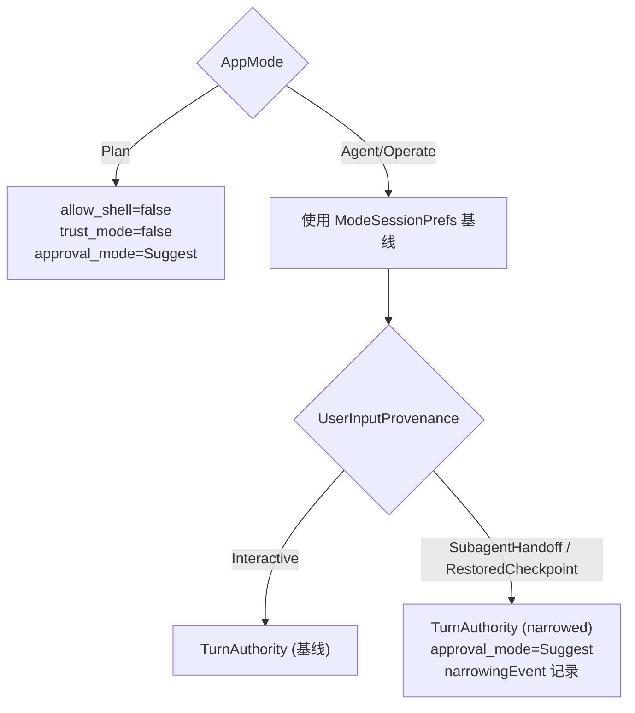

**读图要点**：
- 非交互来源（子代理 handoff、checkpoint 恢复）**自动降级**为 `Suggest` 审批模式，
  这是防止子代理绕过用户审批的关键安全机制。
- `PolicyNarrowingEvent` 是一个结构体，记录了 from_mode → to_mode、
  from_approval → to_approval 以及 detail 字符串。它在 UI 状态行、
  模型可见的 `<turn_meta>` 块和 doctor 诊断中都以同一个对象渲染，
  确保三个表面不会出现不一致。

### I.8.2 ApprovalMode 的三个层次

```
ApprovalMode::Suggest  — 需要用户确认（弹出审批对话框）
ApprovalMode::Bypass   — 跳过审批（Full Access / YOLO 模式）
ApprovalMode::Never    — 拒绝所有工具调用（只读，UI 层特有，不传给 ExecPolicy）
```

`agent_approval_mode_for_turn` 函数将 `auto_approve` bool 和 `approval_mode`
折叠为最终的有效 approval 模式：

```
auto_approve = true  → 等同于 Bypass
auto_approve = false → 使用 approval_mode（通常是 Suggest）
```

### I.8.3 ExecPolicy：执行策略引擎

`crates/execpolicy/src/lib.rs` 实现了一个优先级分层的规则引擎，
用于判断一个 shell 命令或工具调用是 Allow / Ask / Deny：

```
RulesetLayer::BuiltinDefault = 0   — 系统内置规则
RulesetLayer::Agent = 1            — 代理注入的规则（如 repo law）
RulesetLayer::User = 2             — 用户配置的规则（permissions.toml）
```

每个 `Ruleset` 包含：
- `trusted_prefixes`：命令前缀白名单（无需审批）
- `denied_prefixes`：命令前缀黑名单（直接拒绝）
- `ask_rules: Vec<ToolAskRule>`：精细规则（按 tool + command + path + workspace 匹配）

`ToolAskRule` 支持：
- `command_exact: true`：精确匹配而非前缀匹配
- `workspace`：将规则限定在特定 workspace 内
- `action: Allow / Ask / Deny`（默认 Ask）

层次内，Deny > Ask > Allow；层次间，高层（User=2）优先于低层（BuiltinDefault=0）。

### I.8.4 Sandbox 策略

沙箱通过三档策略保护文件系统和进程隔离：

```rust
pub enum SandboxPolicy {
    ReadOnly,                    // 只允许读操作；写操作被阻断
    WorkspaceWrite { path },     // 允许向指定 workspace 写；默认档
    DangerFullAccess,            // 无限制（需用户显式授权或配置）
}
```

sandbox 策略由 `sandbox_policy_for_turn` 函数计算，综合考虑：
- `AppMode`（Plan 模式强制 ReadOnly）
- `ApprovalMode`（Bypass 时可以使用 WorkspaceWrite）
- `sandbox_mode` config 字段
- 进程级 `no_new_privs` 内核标志（一旦设置，`sudo`/setuid 永久不可用）

**沙箱升级**（sandbox escalation）：模型可在 bash 工具调用中请求更高权限，
通过提供 `sandbox_permissions` 和 `justification` 字段。升级请求仍然需要
用户审批（走 `rx_approval` 通道），且不能降级（只能升到比当前更宽松的级别）。

---

## I.9 子代理与 Fleet 编排

### I.9.1 子代理基础模型

Codewhale 的 subagent 系统实现了**树状嵌套代理**：一个 parent agent 可以通过
`agent` 工具启动多个 child agents，每个 child 可以进一步 spawn grandchild agents，
最大深度由 `max_spawn_depth`（默认 3）控制。

SubAgentManager（`tui/src/fleet/manager.rs` 和 `tui/src/tools/subagent.rs`）
负责：
- 维护活跃子代理的生命周期（`SharedSubAgentManager`）
- 通过 `tx_subagent_completion` 通道将完成事件路由回 parent engine
- 管理并发上限（`launch_concurrency`：同时运行的直接子代理数）

### I.9.2 Fleet 编排系统

Fleet 是 Codewhale 的**多代理任务调度系统**，定义于 `crates/tui/src/fleet/`：

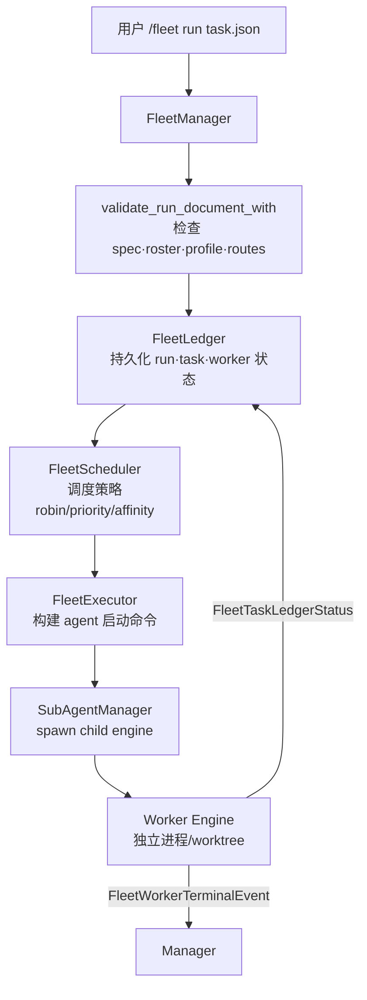

**FleetManager 的核心字段**：

- `ledger: FleetLedger`：持久化到磁盘的 ledger（JSON 文件），
  记录 run_id、task 状态（Queued/Running/Completed/Failed）、worker_id
- `exec_config: FleetExecConfig`：worker 的启动方式（local process / SSH / container）
- `fleet_config: FleetConfigToml`：roster 成员定义（每个 member 的 model、profile、角色）
- `sub_agent_manager: Option<SharedSubAgentManager>`：真实子代理执行后端

**Roster 系统**：Fleet 的成员通过 `fleet/identity.rs` 中的 `load_effective_roster` 加载，
roster 可以在 `~/.codewhale/config.toml` 的 `[fleet]` 表中配置，
也可以通过内置成员（operator 行、worker 行）提供默认值。

**Task Spec**：每个 Fleet 任务通过 `FleetTaskSpecDocument` 描述，
包含 task list、每个 task 的 objective、verification 指令、worker profile 约束等。
`validate_task_spec_document` 在 run 创建前和 `fleet run --check` 时都会验证，
确保 spec 通过的测试与实际 run 会通过的测试一致。

### I.9.3 FleetRole 与工作节点类型

```rust
pub enum FleetRole {
    Orchestrator,  // 协调节点：规划、分配任务、收集结果
    Worker,        // 工作节点：执行具体的编码/测试任务
    Verifier,      // 验证节点：检查 worker 的输出是否达到目标
    Scout,         // 侦察节点：收集信息供 orchestrator 决策
}
```

不同角色对应不同的 system prompt 配置（`fleet/profile.rs`）和权限策略：
Verifier 通常以 Plan 模式运行（只读），Worker 以 Agent 模式运行（可写）。

---

## I.10 系统不变式与工程契约

以下不变式在 `AGENTS.md` 中明文记录，部分由 guard test 强制：

**I.10.1 唯一 turn 循环**

> 只有一个 turn 循环：`Engine::run_turn` in `crates/tui/src/core/engine/turn_loop.rs`。
> Guard test：`crates/core/tests/single_turn_loop.rs`。

这条不变式防止了"存在两个并发循环同时修改 session.messages"的 race condition，
也防止了在 headless 路径上出现行为分叉。

**I.10.2 模型可见即日志可重建**

> 任何到达模型请求的内容都必须可从 session log 重建，
> 且新的模型可见输入需要一个 session event。
> 展示层与持久层必须一致；当二者不一致时，持久层正确。

这保证了 `/session show` 和实际 API 请求内容的一致性，
是审计和 debug 的基础。

**I.10.3 BASE_PROMPT 唯一性**

`crates/tui/src/prompts/text.rs` 中的 `BASE_PROMPT` 是**唯一**的 base 系统提示。
任何新的系统提示逻辑必须通过修改这里实现，不得在其他位置引入第二个 base prompt。

**I.10.4 KV 缓存前缀稳定性**

system prompt + tool catalog 是一次 session 的 KV-cache pinned prefix。
任何需要在 session 内动态更新的 volatile fact（LSP 诊断、子代理完成、steer 输入）
必须以 user-role message 形式追加到 history，**不得**修改 system prompt 的前缀。

**I.10.5 错误配置快速失败**

配置错误（如引用不存在的 model、缺失的 API key、格式错误的 permissions.toml）
在加载时（如果可以自验证）或在最早可以解析的时间点立即 panic/error，
不允许静默跳过缺失的引用，不允许用默认值掩盖配置错误。

**I.10.6 Tokio 阻塞调用约定（Issue #6149）**

任何在 Tokio runtime 上运行的代码（工具 handler、engine task、UI 事件循环）
**不允许**同步执行阻塞 I/O。必须使用 `tokio::fs`、`tokio::process`，
或通过 `spawn_blocking` 将阻塞操作移出 Tokio worker 线程。
`scripts/check-blocking-calls-budget.py` 追踪违规数量。

---

# 第二部分 模块深度解析

---

## II.1 Engine 与 `run_turn`

### II.1.1 源码位置

| 文件 | 行数 | 职责 |
|------|------|------|
| `crates/tui/src/core/engine.rs` | ~7200 行 | Engine struct 定义、构造、run 循环、Op 分发 |
| `crates/tui/src/core/engine/turn_loop.rs` | 8867 行 | run_turn 及所有 turn 内的子函数 |
| `crates/tui/src/core/engine/handle.rs` | ~600 行 | EngineHandle（外部控制接口） |
| `crates/tui/src/core/engine/dispatch.rs` | ~500 行 | Fleet denial guard、schema normalization |
| `crates/tui/src/core/engine/context.rs` | ~400 行 | 工具结果上下文视图 |

### II.1.2 Engine::run 主循环

`Engine::run`（`engine.rs` 第 2926 行）是 Engine 的顶层异步方法，
在一个 Tokio task 中长期运行：

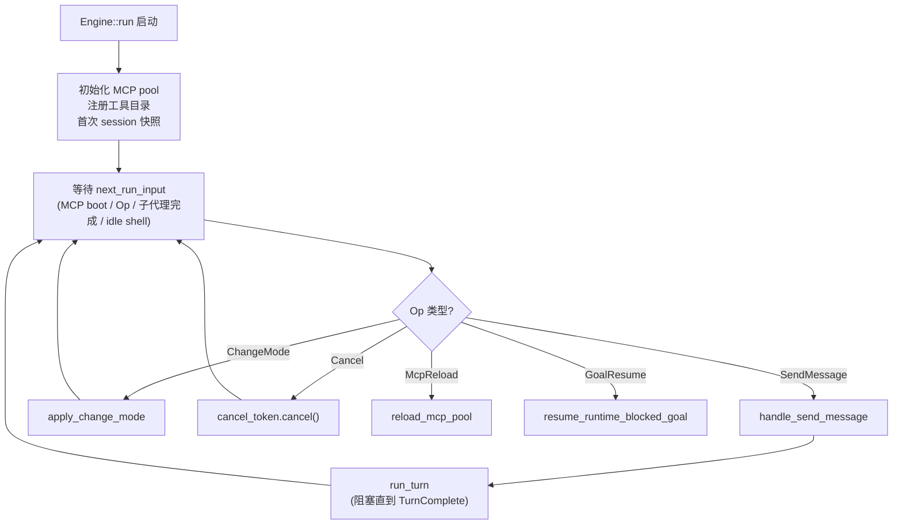

`next_run_input` 使用 `tokio::select!` 同时等待多个事件源：
MCP boot 更新、Op 通道、MCP supervisor 更新、子代理完成（空闲处理）、
idle shell 完成（收割后台 shell 任务的结果）。

### II.1.3 Engine::run_turn 详解

`run_turn`（`turn_loop.rs` 第 896 行）的函数签名：

```rust
pub(super) async fn run_turn(
    &mut self,
    turn: &mut TurnContext,
    tool_policy: ToolSurfacePolicy,
    foreground_children: Option<Arc<ForegroundChildRegistry>>,
    inspection_surface: Option<ToolSurfaceContext>,
) -> (TurnOutcomeStatus, Option<String>)
```

返回值 `TurnOutcomeStatus` 有三种：
- `Completed`：正常完成，模型返回 `end_turn`
- `Failed(error)`：发生不可恢复错误
- `Interrupted`：用户取消

主循环内的关键状态变量（都在 `run_turn` 的栈帧上，turn 结束后销毁）：

```
tool_policy, mode, tool_catalog, active_tool_names  — 工具目录快照
tool_call_budget: ToolCallBudget                     — per-turn 工具调用次数计数
goal_continuations_this_turn: u32                   — 本 turn 内 goal continuation 次数
stream_retry_budget: StreamRetryBudget               — 网络重试预算
consecutive_empty_repl_rounds: u32                  — 防止空 REPL 无限循环
reasoning_only_reprompts: u32                       — reasoning-only 响应重试次数
empty_stop_retries: u32                             — 完全空响应重试次数
reasoning_only_nudge: Option<Message>               — 一次性"nudge"消息（不写入历史）
image_omission_notified: bool                       — 图像省略通知去重
```

**turn_wall_clock**（`turn_budget.rs`）是 per-turn 的墙钟预算计时器，
在每次 provider 请求边界检查：如果超出 `turn_wall_clock_secs` 配置，
turn 以 `Failed` 状态结束，用户可以通过发送新消息继续工作，
不会丢失已完成的 tool 执行结果。

---

## II.2 `turn_loop` / `process_stream` / `plan_tool_calls`

### II.2.1 process_stream

`process_stream`（`turn_loop.rs` 第 5532 行，约 680 行）是 Codewhale 流式处理的核心：

```mermaid
flowchart TD
    Entry["process_stream 入口"] --> Select["tokio::select!\n双重超时: chunk_timeout + max_duration"]
    Select -->|Some(event)| Parse["StreamEvent 分派"]
    Select -->|None (stream ended)| Post["后处理"]
    Select -->|cancel| Return["提前返回"]

    subgraph Parse
        direction TB
        MS["MessageStart → 初始化 usage"] --> CBS["ContentBlockStart(ToolUse) → 记录 tool 开始"]
        CBS --> CBD["ContentBlockDelta(InputJson) → 追加 JSON 片段"]
        CBD --> CBT["ContentBlockDelta(Text) → 追加文本 + Event::TextDelta"]
        CBT --> CBStop["ContentBlockStop → 完成 block"]
        CBStop --> MD["MessageDelta → 更新 stop_reason + usage"]
        MD --> MStop["MessageStop → 结束标志"]
    end

    Post --> Resume{pending_resume?}
    Resume -->|是 StreamResume| Retry["重新发起请求（最多 MAX_STREAM_RETRIES）"]
    Resume -->|否| Return2["返回 StreamOutcome"]
```

**StreamOutcome** 包含：
- `current_text_raw`：模型输出的原始文本（含转义）
- `current_text_visible`：用于 UI 显示的文本（去除 thinking block）
- `current_thinking` + `current_thinking_signature`：reasoning block（Anthropic signed thinking）
- `tool_uses: Vec<ToolUseState>`：待执行的工具调用列表
- `usage: Usage`：token 用量统计（input/output/cache_hit/cache_miss/reasoning）
- `stop_reason: Option<String>`：`"end_turn"` / `"tool_use"` / `"max_tokens"` 等
- `pending_steers: Vec<PendingSteer>`：mid-stream 捕获的 steer 输入

**多 tool_use 并发问题**：OpenAI-compatible streaming 中，
多个 `ContentBlockStart::ToolUse` 在 `finish_reason` 前逐一发出，
所有 `ContentBlockStop` 集中在最后发出。为此，
使用 `current_tool_indices: HashMap<u32, usize>` 维护 block_index → tool_uses 位置的映射，
防止单个 `Option<usize>` 被下一个 ToolUse 的 Start 事件覆盖。

**流式重试逻辑**：

```
网络断流（stream died, no content received）
→ pending_resume = Some(StreamResume { ... })
→ 后处理阶段: stream_retry_budget.authorize() 消耗一次重试机会
→ 重新构造请求（保持完全相同的 messages 和 tools）
→ 再次调用 model_client.send
```

`StreamRetryBudget` 确保最多重试 `MAX_STREAM_RETRIES` 次，
而机器休眠（suspend）导致的断流通过比较 `last_progress_mono`（Instant，跟随 suspend 暂停）
和 `last_progress_wall`（SystemTime，不随 suspend 暂停）的差异来检测。

### II.2.2 plan_tool_calls

`plan_tool_calls`（`turn_loop.rs` 第 3354 行，约 650 行）实现了工具执行的
**权限决策阶段**，在 `execute_planned_tools` 之前运行：

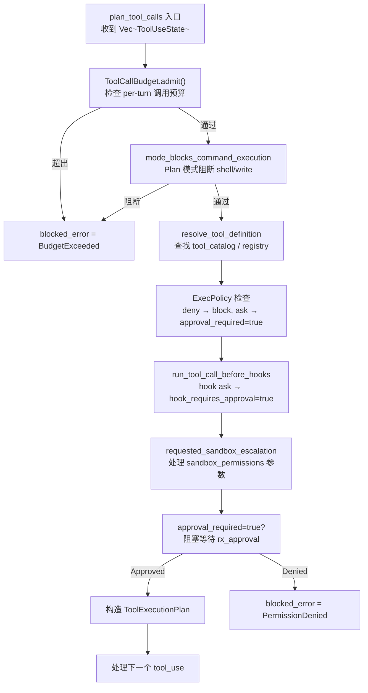

**ToolExecutionPlan** 的关键字段：
- `tool_id, tool_name, tool_input`：工具标识与输入
- `approval_required: bool`：是否已通过审批
- `read_only: bool`：是否为只读操作（影响并行调度）
- `supports_parallel: bool`：是否可与其他工具并发
- `resources: Vec<ResourceClaim>`：资源锁需求（GlobalExclusive 或具体路径）
- `blocked_error: Option<ToolError>`：如果此工具已在规划阶段被阻断
- `sandbox_policy: SandboxPolicy`：此工具的沙箱策略（可能因 escalation 而升级）
- `detached_start: bool`：是否为后台启动工具（如异步 shell）

**workspace write carve-out**：对于 `Suggest` 级别的文件写工具，
如果写入目标**在 workspace 内**，则自动豁免审批（"workspace write carve-out"，issue #5185）。
这允许模型在 Agent 模式下自由编辑工作区文件，而无需为每次 `write_file` 弹出确认框。

---

## II.3 `session.rs`：会话状态机

### II.3.1 TUI Session 的字段分组

`crates/tui/src/core/session.rs` 中的 `Session` 是 engine 持有的热状态，
按功能分为以下几组字段：

**模型配置组**
```rust
pub model: String,                        // 当前模型（/model 命令更新）
pub reasoning_effort: Option<String>,     // "off"|"low"|"medium"|"high"|"max"
pub reasoning_effort_auto: bool,          // 是否自动选择 reasoning tier
pub auto_model: bool,                     // 是否自动路由到最佳模型
```

**工作区组**
```rust
pub workspace: PathBuf,                   // 工具执行的 root（chroot-like）
pub working_set: WorkingSet,              // 已读/已写的文件路径集合
```

**系统提示组**
```rust
pub system_prompt: Option<SystemPrompt>,
pub system_prompt_override: bool,         // 是否为运营商注入的不可覆盖前缀
pub last_system_prompt_hash: Option<u64>, // 上次组装的哈希（避免重复组装）
pub pending_prefix_change_reason: Option<String>, // 声明的前缀变更原因
pub pinned_prompt_context: Option<NextTurnPromptContext>,
pub context_update_baseline: Option<String>,
pub compaction_summary_prompt: Option<SystemPrompt>,
```

**消息历史组**
```rust
pub messages: Vec<Message>,              // 完整消息历史
pub messages_revision: u64,              // 单调递增的修订号
```

**权限/安全组**
```rust
pub approval_mode: ApprovalMode,
pub auto_approve: bool,
pub repo_law_rulesets: Vec<Ruleset>,     // repo 级 permissions.toml 规则集
pub approval_force_prompt: bool,         // 是否强制弹出审批框（忽略 auto_approve）
```

**工具激活缓存**
```rust
pub tool_activation_cache: ToolActivationCache,
```

`ToolActivationCache` 实现了一个 LRU 缓存，上限 8 个工具名称，
总序列化字节数不超过 `TOOL_ACTIVATION_CACHE_MAX_SCHEMA_BYTES`（16 KiB）。
每次 turn 开始时通过 `revalidate` 将不再在当前 catalog 中的工具名称逐出，
防止 MCP 断连或 mode 切换后出现"幽灵工具"。

### II.3.2 ToolActivationCache 工作机制

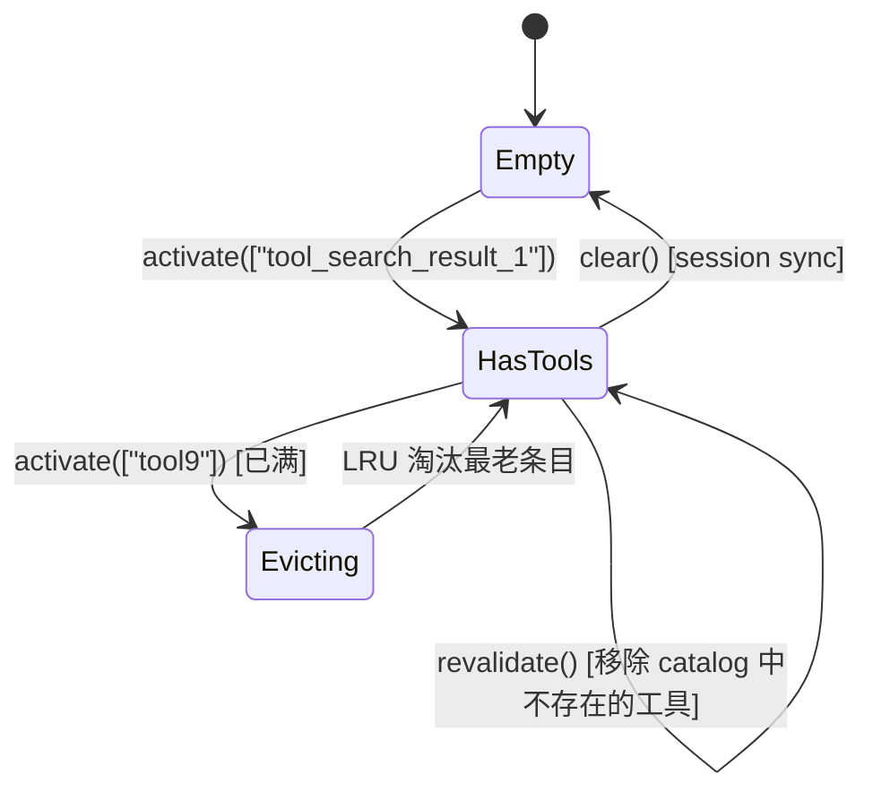

`activate` 按搜索结果顺序 touch 工具，已存在的工具移到尾部（LRU 更新），
超出上限时从头部（最久未用）淘汰。`revalidate` 在每个 turn 开始时调用，
返回被淘汰的工具名称列表，由 `run_turn` 从 `active_tool_names` 中移除。

---

## II.4 `core/request.rs`：`prepare_primary_turn_request`

### II.4.1 函数定义与职责

`prepare_primary_turn_request`（`crates/core/src/request.rs`）是**请求构造的唯一入口**：

```rust
pub fn prepare_primary_turn_request(input: PrimaryTurnRequest) -> MessageRequest {
    MessageRequest {
        model: input.model,
        messages: input.messages,
        max_tokens: input.max_tokens,
        system: input.system,
        tools: input.tools,
        tool_choice: input.tool_choice,
        metadata: None,       // provider 特有字段由 client transport 处理
        thinking: None,       // Anthropic extended thinking 由 client 注入
        reasoning_effort: input.reasoning_effort,
        stream: Some(true),   // 始终流式
        temperature: None,    // 采样参数由 route 配置覆盖
        top_p: None,
    }
}
```

**设计意图**：这个函数故意不做任何 provider 特有的转换，
使得 production turn loop 和 read-only preview 可以调用同一个函数，
防止 preview 与实际请求之间的行为差异。

### II.4.2 PrimaryTurnRequest 构造（在 run_turn 中）

`run_turn` 在第 1728 行构造 `PrimaryTurnRequest`：

```rust
let mut request = prepare_primary_turn_request(PrimaryTurnRequest {
    model: self.session.model.clone(),
    messages: {
        let mut messages = self.messages_with_turn_metadata();
        if let Some(nudge) = reasoning_only_nudge.take() {
            messages.push(nudge);  // 一次性 nudge，不写入 session.messages
        }
        messages
    },
    max_tokens: crate::route_budget::effective_max_output_tokens_for_turn(...),
    system: self.session.system_prompt.clone(),
    tools: active_tools.clone(),
    tool_choice: if fleet_report_response {
        Some(json!("none"))        // Fleet report 轮次：禁止工具调用
    } else if strict_tool_mode {
        Some(json!("required"))    // 强制工具调用（特定场景）
    } else {
        Some(json!({ "type": "auto" }))  // 标准自动选择
    },
    reasoning_effort: effective_reasoning_effort,
});
```

`messages_with_turn_metadata`（第 6403 行）在历史消息末尾追加 `<turn_meta>` XML 块，
包含：当前模式、approval_mode、git 状态快照（branch + dirty/clean）、
session_id 等 agent 运行时元数据。这个块的 git 快照有变化检测（`last_git_snapshot_line`），
只有 branch 或 dirty 状态变化时才更新，以保持前缀稳定性。

### II.4.3 图像处理

请求构造后立即执行图像标准化（第 1790 行附近）：

```rust
let stripped_images = crate::image_attach::strip_images_when_unsupported(
    &mut request.messages,
    self.active_route_capabilities.image_input,
    &self.session.model,
);
```

如果当前路由的 `image_input` capability 为 `Unsupported`，
图像 content block 被替换为文本说明（"这张图片被省略，因为模型 X 不支持图像输入"），
而**不是直接删除**。这保留了图像的语义位置（在历史中有一个 user message 提及图像），
同时避免 API 拒绝请求。

---

## II.5 Client 流式传输层

### II.5.1 ModelClient Trait

`ModelClient` trait 定义于 `crates/tui/src/core/model_client.rs`（via `llm_client`），
是所有 provider 实现的统一接口：

```rust
pub trait ModelClient: Send + Sync {
    async fn send(
        &self,
        request: MessageRequest,
    ) -> Result<StreamEventBox, anyhow::Error>;

    fn effective_max_output_tokens(&self, model: &str) -> u32;
    fn provider(&self) -> ApiProvider;
}
```

`StreamEventBox` 是 `Pin<Box<dyn Stream<Item = Result<StreamEvent>> + Send>>`，
即一个异步流，每个 item 是一个 `StreamEvent`。

### II.5.2 支持的传输协议

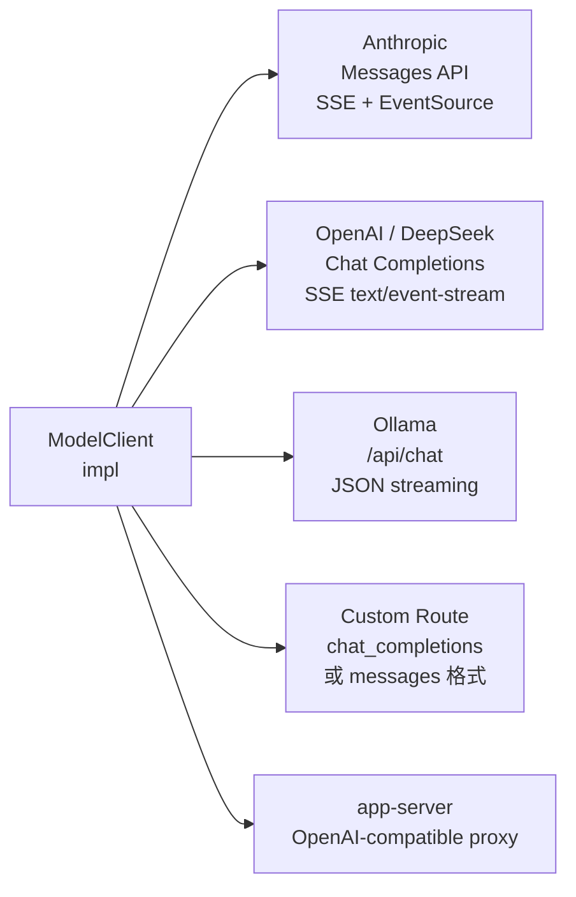

### II.5.3 事件流解析

`StreamEvent`（`crates/models`）是 provider-neutral 的事件枚举：

```rust
pub enum StreamEvent {
    MessageStart { message: MessageStart },
    ContentBlockStart { index: u32, content_block: ContentBlockStart },
    ContentBlockDelta { index: u32, delta: Delta },
    ContentBlockStop { index: u32 },
    MessageDelta { delta: MessageDelta, usage: Option<Usage> },
    MessageStop,
    Ping,
}
```

Anthropic SSE 格式直接映射到 `StreamEvent`；OpenAI Chat Completions
格式由 `chat_completions.rs` 中的适配器转换：
`delta.content` → `ContentBlockDelta::TextDelta`，
`delta.tool_calls[i]` → `ContentBlockStart::ToolUse` + `ContentBlockDelta::InputJsonDelta`。

### II.5.4 Usage 合并策略

`merge_stream_usage`（`turn_loop.rs`）使用 `max` 而非 `sum` 合并 usage 更新：

```rust
total.input_tokens = total.input_tokens.max(update.input_tokens);
total.output_tokens = total.output_tokens.max(update.output_tokens);
```

这是因为 Anthropic streaming 的 `MessageStart` 携带初始（偏低的）usage 估算，
后续 `MessageDelta` 才包含精确值。取 max 确保不会因为计数器回退而报告错误的 token 用量。

---

## II.6 Authority + ExecPolicy：权限决策双引擎

### II.6.1 双引擎的分工

Codewhale 的权限决策分两层：

1. **TurnAuthority**（`authority.rs`）：会话级别的**能力策略**——
   这个 turn 的 mode 是什么？auto_approve 是否开启？provenance 是否可信？
   这一层决定了工具调用的"门是否开着"。

2. **ExecPolicy**（`crates/execpolicy`）：调用级别的**命令安全策略**——
   这个具体的 bash 命令是否被信任？这个工具是否命中了某条 ask_rule？
   这一层决定了"什么命令可以通过门"。

### II.6.2 TurnAuthority 的计算路径

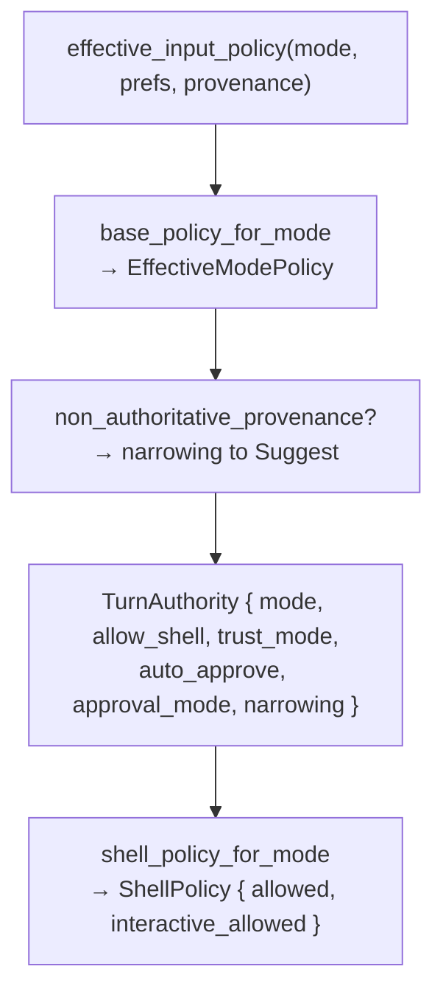

`effective_input_policy` 是 `authority.rs` 中的主入口函数，
它综合 mode、prefs 和 provenance 返回最终有效的 `TurnAuthority`。
来自子代理 handoff（`UserInputProvenance::SubagentHandoff`）的输入
会触发 `NonAuthoritativeProvenance` narrowing，将 approval_mode 强制降级为 `Suggest`，
无论用户配置了什么级别的 auto_approve。

### II.6.3 ExecPolicy 的规则匹配流程

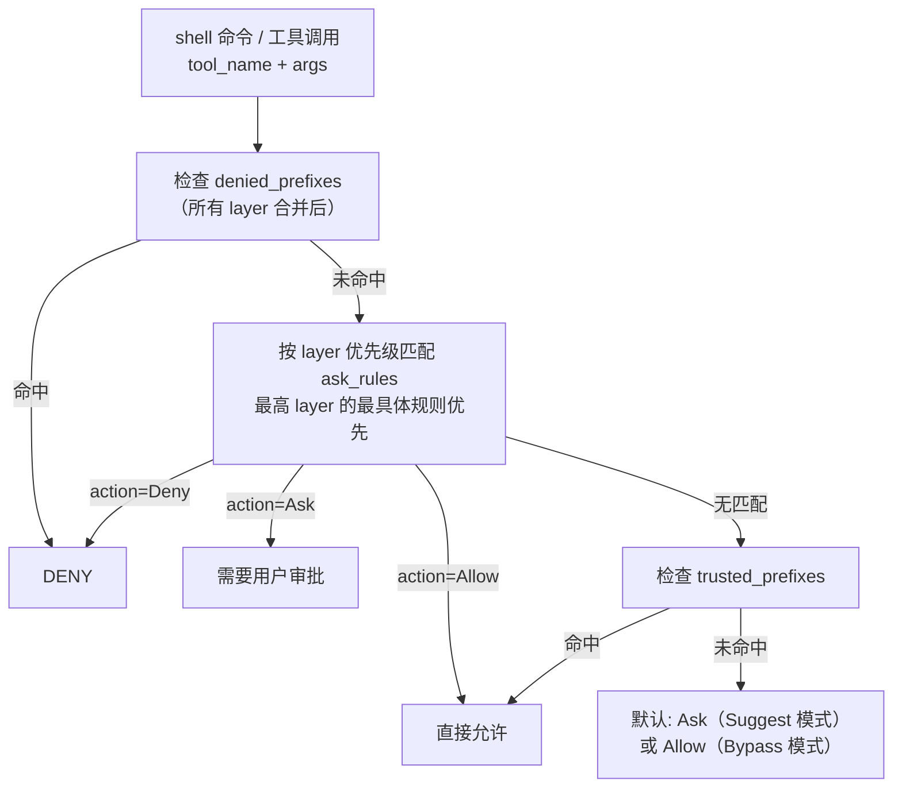

**bash arity 检查**（`bash_arity.rs`）：对于 `exec_shell` 的 `bash -c 'cmd'` 形式，
ExecPolicy 解析 `-c` 参数，提取实际命令前缀进行匹配，
而不是用字面量 `bash -c 'xxx'` 匹配——这防止了通过 bash wrapper 绕过命令黑名单。

**path-based 规则**（`ToolAskRule::path`）：对文件工具（`edit_file`、`write_file`），
ask_rule 可以按文件路径匹配。workspace 字段使规则在多项目环境中有作用域限制。

### II.6.4 resolve_tool_permission

`resolve_tool_permission`（`authority.rs`）是工具调用最终权限决策的单一入口：

```rust
pub fn resolve_tool_permission(
    authority: &TurnAuthority,
    requirement: ApprovalRequirement,
    non_bypassable: bool,
) -> ToolPermission {
    // non_bypassable=true: 即使 Bypass 模式也必须走审批
    // requirement=Auto: 内置工具，无需外部审批
    // requirement=Suggest: 普通工具，遵循 approval_mode
}
```

`ToolPermission` 有三个值：`Allow`、`Prompt`（需要审批）、`Deny`。
`non_bypassable: true` 用于特定的高风险工具（如 `exec_shell` 的 `danger-full-access` 升级），
使这些操作即使在 Full Access 模式下也必须经过用户确认。

---

## II.7 `tool_execution.rs` + LSP Hooks

### II.7.1 并行批次调度

`plan_tool_execution_batches`（`tool_execution.rs` 中的辅助函数）将
`Vec<ToolExecutionPlan>` 分组为 `Vec<ToolExecutionBatch>`：

```rust
enum ToolExecutionBatch {
    Parallel(Vec<ToolExecutionPlan>),  // 可并发执行
    Serial(Box<ToolExecutionPlan>),    // 必须串行执行
}
```

分批规则：
- 连续的 `supports_parallel: true && read_only: true` 工具归入同一 Parallel 批次
- 任何 `supports_parallel: false` 或 `read_only: false` 或
  `approval_required: true` 或 `blocked_error.is_some()` 的工具，
  强制分入 Serial 批次

并行批次使用 `FuturesUnordered`：

```rust
let mut parallel_futs = FuturesUnordered::new();
for plan in parallel_plans {
    parallel_futs.push(execute_single_tool(plan, ...));
}
while let Some(result) = parallel_futs.next().await {
    outcomes[result.plan_index] = Some(result.outcome);
}
```

### II.7.2 OperationSpanGuard

每个工具执行都被 `OperationSpanGuard` 包裹：

```rust
pub(super) struct OperationSpanGuard {
    tx: mpsc::Sender<Event>,
    span: Option<(String, OwnerActivityKind)>,
}
```

它在 `start` 时发送 `Event::OperationActivityStarted { span_id }`，
在 `Drop` 时发送 `Event::OperationActivityCompleted { outcome: Cancelled }`，
在 `complete` 时发送 `Event::OperationActivityCompleted { outcome: Success/Failed }`。

span_id 使用全局单调递增 `AtomicU64`（`NEXT`），不使用 model 的 `tool_call_id`，
因为 OpenAI 兼容的 gateway 可能重用 `call_{index}` 格式导致碰撞。

### II.7.3 ToolHeartbeatGuard

后台 ticker 每 10 秒（`TOOL_HEARTBEAT_INTERVAL`）发送一次
`Event::ToolCallHeartbeat`，在两种情况下防止超时：
1. TUI 的终端心跳（防止 SSH 会话断开）
2. 父 agent 的 "waiting for child" 状态同步（child 在运行但 parent 已经看不到进展）

heartbeat 在独立 Tokio task 中运行（`tokio::spawn`），通过 `CancellationToken`
在 guard drop 时同步取消和 abort。

### II.7.4 LSP Hooks 详解

`run_post_edit_lsp_hook`（`lsp_hooks.rs`）的工作流程：

1. `edited_paths_for_tool`：从工具名称和输入提取编辑的文件路径列表
   - `edit_file` / `write_file`：读取 `input["path"]`
   - `apply_patch`：调用 `preflight_apply_patch`，提取 `touched_files`，
     排除被删除的文件（`+++ /dev/null`）

2. 对每个路径，调用 `lsp_manager.diagnostics_for(path, seq)`：
   - 向 LSP server 发送 `textDocument/publishDiagnostics` 请求
   - 等待 LSP 的响应（有超时）
   - 返回 `Option<DiagnosticBlock>`（含 error/warning 列表）

3. 收集的 `DiagnosticBlock` 存入 `pending_lsp_blocks`

4. 在下一次 API 请求前，`pending_lsp_blocks` 被 flush 为合成的 user-role message，
   格式类似：
   ```
   <lsp_diagnostics>
   <file path="src/main.rs">
   [E0308] expected type `i32`, found `&str` (line 42)
   </file>
   </lsp_diagnostics>
   ```

5. 如果 LSP 未启用（`!lsp_manager.config().enabled`），整个 hook 是 no-op，
   不阻塞工具执行。

---

## II.8.4 StateStore 的 Schema 迁移机制

`StateStore::open`（`crates/state/src/lib.rs:295`）在每次打开数据库时执行 schema 迁移：

```rust
pub fn open(path: Option<PathBuf>) -> Result<Self> {
    let db_path = path.unwrap_or_else(|| codewhale_home().join("state.db"));
    let conn = Connection::open(&db_path)?;

    // WAL 模式：允许多个读者并发，不需要 exclusive lock
    conn.execute_batch("PRAGMA journal_mode=WAL")?;

    // 当前 schema 版本
    let current_version = get_user_version(&conn)?;
    let target_version = SCHEMA_VERSION;  // 编译时常量

    if current_version < target_version {
        apply_migrations(&conn, current_version, target_version)?;
        set_user_version(&conn, target_version)?;
    }

    Ok(StateStore { conn: Arc::new(Mutex::new(conn)), ... })
}
```

迁移脚本存储在 `crates/state/src/sql/` 目录，每个迁移是一个 SQL 文件，
按版本号命名（如 `001_initial.sql`、`002_add_jobs_table.sql`）。
向前迁移是无条件的（升级时自动执行），向后迁移（降级）未实现——
Codewhale 遵循"不可逆迁移"原则：一旦运行了新版本的 schema 迁移，
就无法运行旧版本的二进制。

**WAL 模式的意义**：WAL（Write-Ahead Logging）使多个读者可以不阻塞写入，
写入也不阻塞读者。对于 Codewhale 的典型访问模式（单个 engine 写入，
TUI 读取用于展示，偶尔的 backup 工具读取），WAL 是正确的选择。

### 消息追加的 tree 结构实现

`append_message` 的核心是 `parent_id` 字段：

```rust
pub fn append_message(
    &self,
    thread_id: &str,
    message_id: &str,
    parent_id: Option<&str>,  // None 表示 root 节点
    content: &Message,
) -> Result<()> {
    let conn = self.conn.lock().unwrap();
    conn.execute(
        "INSERT INTO messages (id, thread_id, parent_id, content, created_at)
         VALUES (?1, ?2, ?3, ?4, ?5)",
        params![message_id, thread_id, parent_id, serde_json::to_string(content)?, now()],
    )?;
    Ok(())
}
```

`fork_at_message` 在树状消息结构中创建分叉点：

```rust
pub fn fork_at_message(&self, thread_id: &str, fork_at_id: &str) -> Result<()> {
    // 只更新 thread 的 leaf_id，messages 本身不改变
    self.set_current_leaf_id(thread_id, fork_at_id)
}
```

这个设计的美妙之处是：`fork_at_message` 只是更新 leaf_id 指针，
不复制任何消息数据。消息树可以有多个分支（每个分支对应一次 `/branch` 操作），
每个分支从 root 到 leaf_id 的路径是该分支的对话上下文。

---

## II.9.6 工具注册与 Feature Flag 的交互

工具目录构建是一个多层 filter 过程，理解每层 filter 的顺序对于排查
"为什么某个工具不可用"的问题至关重要：

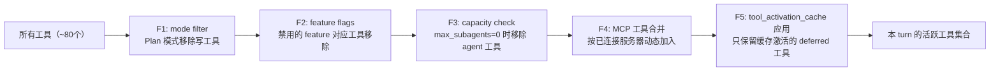

**F1 - mode filter**：Plan 模式移除所有写工具（`write_file`、`edit_file`、`apply_patch`、`bash`）。
实现在 `tool_catalog.rs` 的 `filter_tools_for_mode`，对照 `ToolSpec.requires_write = true` 标志。

**F2 - feature flags**：`features.rs` 中的 `FeatureFlags` 结构体控制功能开关：

```rust
pub struct FeatureFlags {
    pub native_memory: bool,     // remember 工具
    pub subagents: bool,          // agent 工具
    pub web_search: bool,         // web_search 工具
    pub auto_approve_plan: bool,  // plan_auto_approve 工具
    pub goal: bool,               // goal 系列工具
    // ...
}
```

Feature flags 从 `EngineConfig` 读取，而 `EngineConfig` 从 `~/.codewhale/config.toml` 解析。

**F3 - capacity check**：如果 `SubAgentManager.active_agents.len() >= max_subagents`，
`agent` 工具从目录中移除。这防止模型在已有太多子代理的情况下继续 spawn 新的子代理。

**F4 - MCP 工具合并**：`mcp_pool.lock().await.tools()` 返回当前所有已连接
MCP 服务器的工具列表。MCP 工具默认使用 deferred schema（只有名称+简短描述）。

**F5 - tool_activation_cache**：`tool_activation_cache.revalidate(&current_catalog_names)`
移除缓存中已不在 catalog 中的工具名（如 MCP 断连后），
然后 `tool_activation_cache.active_tool_names()` 返回需要携带完整 schema 的工具列表。

---

## II.10.5 NativeMemory 与 crates/memory 的关系

Codewhale 有两套"记忆"系统，经常被混淆：

### crates/tui/src/tools/native_memory.rs（进程内，轻量）

这是 `remember` 工具的直接存储后端，实现非常简单：

```rust
pub struct NativeMemoryStore {
    entries: HashMap<String, MemoryEntry>,  // key → value
}

pub struct MemoryEntry {
    pub value: String,
    pub workspace: PathBuf,  // 哪个工作区写入的
    pub created_at: Instant,
}
```

- 存储在进程内存中，**不落盘**
- Session 结束时（engine 关闭）自动清除
- 没有 TTL，没有容量限制（实践中 remember 工具的调用频率很低）
- 通过 `inject_memory_into_system_prompt` 注入到 system prompt

这套系统的定位是：让模型在**单个 session 内**记住一些关键事实，
在 turn 之间保持认知连续性。例如：模型在第 3 轮 turn 中记住
"这个项目使用 tokio 1.x，不要引入 async-std 依赖"，
在第 15 轮 turn 中仍然能遵循这个约束。

### crates/memory/（跨 session，持久化）

`crates/memory/` 是一个更完整的高层记忆服务，支持：

```
src/store.rs      — SQLite 持久化存储（跨 session）
src/lens.rs       — 按 workspace + user 隔离的视图
src/policy.rs     — TTL、容量策略（避免无限增长）
src/protocol.rs   — Wire 格式（序列化/反序列化）
src/runtime.rs    — 运行时接口（查询、写入、清除）
src/workspace.rs  — workspace 级别的记忆隔离
```

这套系统适合跨 session 的长期记忆（如用户偏好、项目约定、历史决策等），
但当前 Codewhale 的主要使用路径仍然是 `native_memory`（进程内轻量存储）。
`crates/memory` 的完整功能在 Operate 模式和 Fleet 模式中被充分利用，
支持 Worker 节点共享 Orchestrator 积累的项目知识。

**AGENTS.md 的提醒**：`tools/remember.rs` 是 `native_memory` 的写入路径，
不要将其与 `crates/memory` 的高层服务混淆。两者都是"active"模块，
即使在某些代码路径下看起来像是 dead code，也不要删除。

---

## II.11.6 Lane 机制与工作树隔离

`crates/lane/` 实现了基于 git worktree 的工作空间隔离，
这是 Fleet 多 Worker 并行工作时防止代码冲突的基础设施：

### worktree 创建流程

```
FleetExecutor::build_worker_exec_command_with_launch_spec →
→ 如果 worktree_per_worker = true：
   lane::create_worktree(base_repo, worker_id, base_branch) →
   → git worktree add /tmp/codewhale-lanes/{run_id}/{worker_id} base_branch
   → 返回 LaneHandle { path: worktree_path, branch: worker_branch }
→ 将 worktree_path 作为 Worker engine 的 workspace
```

每个 Worker 在独立的 git worktree 中工作：
- 它们共享 git 历史（共用 `.git` 目录，通过 git worktree 的 linked worktree 机制）
- 但每个 Worker 有独立的工作树（不同的 HEAD、不同的 staged changes）
- Worker 完成后，可以通过 `LaneHandle::merge_back` 将 worktree 的变更 merge 回主 branch

### Lane 清理

`LaneHandle::drop` 实现了 RAII 清理：

```rust
impl Drop for LaneHandle {
    fn drop(&mut self) {
        if self.auto_cleanup {
            let _ = std::process::Command::new("git")
                .args(["worktree", "remove", "--force", &self.path.to_string_lossy()])
                .output();
        }
    }
}
```

`auto_cleanup = true`（默认）确保 Worker 完成后 worktree 被自动清理，
不在磁盘上留下残留目录。`auto_cleanup = false` 用于 debug 场景，
让开发者可以检查 Worker 工作后的文件状态。

---

## II.6.5 repo_law_rulesets 与 permissions.toml

除了用户在 `~/.codewhale/config.toml` 中配置的全局 ExecPolicy 规则之外，
Codewhale 还支持 repo 级别的权限配置文件：

### permissions.toml 格式

每个 git 仓库可以在根目录放置 `.codewhale/permissions.toml`（或 `permissions.toml`），
定义该仓库特有的权限规则：

```toml
# .codewhale/permissions.toml

[[rules]]
tool = "bash"
command = "make test"
action = "allow"  # 允许不需要审批地运行 make test

[[rules]]
tool = "bash"
command = "make deploy"
action = "deny"  # 部署命令永远被拒绝

[[rules]]
tool = "edit_file"
path = "src/critical/"
action = "ask"  # 修改 critical 目录需要审批

[[rules]]
tool = "bash"
command = "docker"
action = "ask"
workspace = "/Users/alice/work/my-project"  # 限定在特定工作区
```

### 加载时机

`repo_law_rulesets` 在 `Engine::handle_send_message` 时（或 workspace 变更时）加载：

```rust
// engine.rs
let repo_law = load_repo_permissions(workspace)?;
self.session.repo_law_rulesets = repo_law.into_rulesets();
// 每条规则被包装为 RulesetLayer::User 的 Ruleset
```

Repo 级别的规则优先级等同于用户规则（`RulesetLayer::User = 2`）。
如果全局配置和 repo 配置有冲突，取**更严格**的那个（Deny > Ask > Allow）。

**安全考量**：`permissions.toml` 文件在受信任的 git 仓库中有效，
但 Codewhale 不从未信任的目录（非 git 仓库根目录）加载 `permissions.toml`，
防止恶意工作区通过放置 `permissions.toml` 来放宽安全限制。

---

## II.2.3 reasoning-only 响应处理

当模型返回一个**只有 thinking block 没有文本/工具**的响应时（这在某些 reasoning 模型的
"pure thinking" pass 中会发生），`process_stream` 检测到 `stop_reason = "end_turn"` 但
`current_text_visible.is_empty()` 且 `tool_uses.is_empty()`。

这种情况由 `reasoning_only_reprompts` 计数器处理：

```rust
// turn_loop.rs（简化）
if stop_reason == "end_turn" && text.is_empty() && tool_uses.is_empty() {
    if reasoning_thinking.is_some() {
        // 这是一个 reasoning-only 响应（模型只"思考"了，没有输出）
        reasoning_only_reprompts += 1;
        if reasoning_only_reprompts <= MAX_REASONING_ONLY_REPROMPTS {
            // 注入 nudge 消息，鼓励模型输出文本或工具调用
            reasoning_only_nudge = Some(Message {
                role: Role::User,
                content: [Text("Please continue and provide your response.")]
            });
            // 不写入 session.messages（nudge 是一次性的，不持久）
            continue;  // 继续下一轮 provider 请求
        }
    }
    // 超过重试次数，或没有 thinking block → 正常 end_turn 处理
    break;
}
```

`reasoning_only_nudge` 是一个**不写入 session.messages** 的特殊消息，
仅在当次 API 请求中携带。这确保了：
1. 如果 nudge 成功引导模型输出内容，对话历史是干净的（没有 nudge 痕迹）
2. 如果 nudge 失败（模型仍然只 thinking），重试也只是重新发送相同的 nudge

**最大重试次数**：`MAX_REASONING_ONLY_REPROMPTS`（默认 3），
防止 reasoning-only 循环无限延续。

---

## II.7.5 tool_preparation.rs 与 tool_media.rs

这两个文件处理工具输入的预处理和输出的后处理：

### tool_preparation.rs

在工具执行前调用，负责将工具的 JSON 输入规范化：
- **类型修复**（`arg_repair.rs`）：某些模型有时会将数字输出为字符串，
  或将布尔值输出为字符串（`"true"` 而不是 `true`）。
  `arg_repair.rs` 根据工具的 JSON Schema 自动修复这些类型错误，
  避免工具因参数类型不匹配而失败。
- **路径规范化**：相对路径转换为绝对路径（相对于 workspace）。
- **长字符串检测**：工具输入中超过 `MAX_TOOL_INPUT_BYTES` 的字段被截断并记录警告。

### tool_media.rs

处理工具结果中的媒体内容（图像、视频帧、音频片段）：
- `RichToolResult.content` 中的 `Image` block 可以包含 base64 编码的图像数据，
  `tool_media.rs` 在注入 session 之前检查图像尺寸，
  超过 `MAX_INLINE_IMAGE_BYTES` 的图像被存储到临时文件，
  以文件路径引用替代 inline base64（防止 `session.messages` 膨胀）。
- `read_media` 工具读取图像/视频/音频文件时，通过 `tool_media.rs` 的
  `decode_media_for_provider` 函数将媒体转换为 provider 支持的格式
  （Anthropic 只支持 JPEG/PNG/GIF/WebP，不支持 HEIC/HEIF，需要转码）。

---

## III.7 场景：持久目标的自动续行与预算控制

### III.7.1 场景背景

用户通过 `/goal 将整个测试套件迁移到 tokio::test 宏` 启动一个持久目标。
配置了 `[goal] token_budget = 300000, enforce_token_budget = true`。
本场景展示 Goal 的自动续行机制和 token 预算的强制停止。

### III.7.2 第一次 continuation pass 结束

第一次 continuation turn 完成后（模型修改了约 50 个测试文件），
`goal_continuation_message_if_needed` 检查：

```rust
let decision = decide_continuation(
    status: GoalRunStatus::Active,  // 模型没有报告 Completed/Blocked
    progress: GoalProgress {
        tokens_used: 85_000,     // 第一次 pass 用了 85K token
        time_used_seconds: 120,
        continuations: 1,
    },
    budget: GoalBudget {
        token_budget: Some(300_000),
        time_budget_seconds: None,
        enforce_token_budget: true,
        max_continuations: 0,  // 无限制
    },
);

// 决策结果：Continue（未达到 token_budget）
```

Engine 等待 `continuation_quiet_period_seconds`（默认 0，立即续行），
然后通过 `tx_op.send(Op::SendMessage(continuation_turn_spec))` 自发续行。

### III.7.3 多次续行后 token 预算耗尽

经过 4 次 continuation pass 后：
```
tokens_used = 320_000  # 超出 budget (300_000)
enforce_token_budget = true
→ decide_continuation 返回 Stop(StopReason::BudgetLimit)
```

```rust
// goal_loop.rs: decide_continuation
if budget.token_budget.is_some_and(|limit| progress.tokens_used >= limit) {
    if budget.enforce_token_budget {
        tracing::info!(
            tokens_used = 320_000,
            token_budget = 300_000,
            "goal token budget reached; stopping"
        );
        return ContinuationDecision::Stop(StopReason::BudgetLimit);
    }
}
```

Engine 收到 `Stop(BudgetLimit)` 后，将 goal state 更新为 `Paused(BudgetExceeded)`，
发送 `Event::GoalUpdated { status: Paused, reason: "Token budget exceeded" }` 给 TUI。

### III.7.4 用户查看结果并决定继续

用户通过 `/goal status` 查看当前进度：
```
Goal: 将整个测试套件迁移到 tokio::test 宏
Status: Paused (Token budget exceeded: 320K / 300K tokens)
Progress: 已完成约 180/230 个测试文件的迁移（估算）
Last continuation: 4 passes, 约 120 分钟前
```

用户决定调整预算并继续：
```
/goal set-budget tokens=500000
/goal resume
```

这触发 `Op::GoalResume`，重置 token 用量并重新激活 goal（将 status 从 Paused 改回 Active）。

### III.7.5 不变量

**不变量**：`GoalProgress.continuations` 是单调递增的，从不减少。
`/goal resume` 不重置 `continuations` 计数——它只重置 `tokens_used`（如果用户显式调整了预算）。
这确保了持久目标的"历史感"：用户和模型都能看到"这个目标已经连续运行了 X 次"。


### II.8.1 StateStore 架构

`StateStore`（`crates/state/src/lib.rs`）提供两个存储后端：

**SQLite 层**（`state.db`）：
- `threads` 表：存储 `ThreadMetadata`（含所有索引字段）
- `messages` 表：append-only 消息存储，每条消息有 id、thread_id、parent_id（树结构）、content
- `checkpoints` 表：named state snapshots（`/checkpoint` 命令创建）
- `jobs` 表：后台任务追踪（如异步压缩）
- `dynamic_tools` 表：per-thread 的动态工具注册

**JSONL 层**（`session_index.jsonl`）：
- 每行是一个 session 的路径和 rollout 文件索引
- 通过 `SESSION_INDEX_LOCK`（全局 `Mutex<()>`）保护所有读/append/compact/rename 操作
- 紧凑化（compaction）通过原子 rename 实现：先写新文件，再 rename 替换旧文件

### II.8.2 ThreadMetadata 完整字段

`ThreadMetadata` 记录了一个对话的完整元数据：

| 字段 | 类型 | 说明 |
|------|------|------|
| `id` | String | 唯一 ID（UUID v4） |
| `model_provider` | String | 创建时的提供商（如 `"anthropic"`） |
| `created_at` | i64 | Unix 时间戳（秒） |
| `status` | ThreadStatus | `Active / Completed / Archived / Error` |
| `cwd` | PathBuf | 创建时的工作目录 |
| `git_sha` | Option<String> | 创建时的 git commit SHA |
| `git_branch` | Option<String> | 创建时的 git 分支 |
| `memory_mode` | Option<String> | 记忆模式（`"local"` / `"remote"`） |
| `approval_mode` | Option<String> | 创建时的审批模式配置 |
| `sandbox_policy` | Option<String> | 创建时的 sandbox 策略 |
| `archived` | bool | 是否已归档 |
| `leaf_id` | Option<String> | 当前 Journal 叶节点 ID |

### II.8.3 SessionSource 枚举

```rust
pub enum SessionSource {
    Interactive,  // 用户在 CLI/TUI 中启动
    Resume,       // 从已持久化 session 恢复
    Fork,         // 通过 /fork 从指定消息分叉
    Api,          // 通过 HTTP API 创建
    Unknown,      // 未知来源（兼容旧格式）
}
```

`SessionSource` 影响 session 的初始 approval 状态：
`Resume` 和 `Fork` 来源的 session 在第一次 turn 时触发 provenance narrowing，
确保恢复的会话不能自动继承上一个 session 的 Full Access 权限。

---

## II.9 工具体系与 MCP 协议层

### II.9.1 工具目录构建

工具通过 `ToolRegistryBuilder`（`tui/src/tools/mod.rs`）构建：

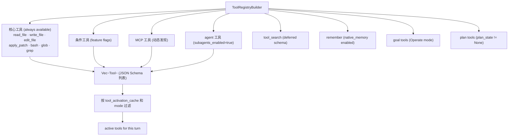

### II.9.2 Deferred Schema 工具

部分工具（尤其是大型 MCP 工具）使用 `defer_loading: true` 标记，
其 JSON Schema 不在每次请求中包含，而是只暴露工具名称和简短描述。
当模型调用 `tool_search` 激活某个工具后，该工具的完整 schema 通过
`ToolActivationCache` 缓存，在后续请求中包含。

这一机制解决了两个问题：
1. 大型工具集合（数十个 MCP 工具）的 schema 会显著增加每次请求的 token 成本
2. 将不常用工具的 schema 延迟到用户/模型实际需要时再加载

### II.9.3 MCP 协议层

MCP（Model Context Protocol）的 Codewhale 实现在 `crates/tui/src/mcp/` 目录：

```mermaid
flowchart LR
    McpPool["McpPool\n连接池管理"] --> Stdio["StdioTransport\n启动子进程\nstdin/stdout JSON-RPC"]
    McpPool --> SSE["SseTransport\nHTTP SSE\nEvent Source"]
    McpPool --> Http["HttpTransport\nStreamable HTTP\n2025-06-18 协议"]

    McpPool --> Discovery["工具发现\ntools/list 请求"]
    Discovery --> Catalog["McpToolCatalog\n动态工具列表"]
    Catalog --> Engine["注入 build_turn_tool_registry_and_catalog"]
```

**协议版本协商**：
```rust
pub(crate) const MCP_PROTOCOL_VERSION: &str = "2025-06-18";
pub(crate) const MCP_SUPPORTED_PROTOCOL_VERSIONS: &[&str] =
    &[MCP_PROTOCOL_VERSION, "2025-03-26", "2024-11-05"];
```

在 `initialize` 握手时，Codewhale 发送 `2025-06-18` 作为客户端协议版本，
并接受以上三个版本的任意一个作为服务器响应，保证向后兼容。

**并发 MCP boot**：`ensure_mcp_pool` 在 Engine 初始化时或 `McpReload` Op 时触发，
以并发方式连接所有配置的 MCP 服务器，通过 `mcp_boot_rx` channel 流式接收连接进度。
每个成功连接的服务器立即加入 pool 可用，不等待所有服务器都完成，
减少用户等待时间。

**环境变量展开**：MCP 配置中的 `${VAR_NAME}` 占位符通过 `expand_env_placeholders_with`
在连接时动态展开，避免 API key 等密钥写入配置文件明文。
展开错误只暴露变量名，不暴露配置值（防止 secret 泄漏到错误日志）。

### II.9.4 Tool Before/After Hooks

`crates/tui/src/hooks/` 实现了工具调用的 lifecycle hooks：

- **before hooks**（`run_tool_call_before_hooks`，`turn_loop.rs` 第 7061 行）：
  在工具执行前运行，可以：
  - 追加 `additionalContext`（以 XML 注入工具结果前）
  - 要求额外的审批（`hook_requires_approval = true`）
  - 阻断调用（返回 `ToolError`）

- **after hooks**（`run_tool_call_after_hooks`）：
  在工具执行后运行，用于触发 `lifecycle_outbox`（如 git snapshot、telemetry 等）

---

## II.10 Compaction / Memory：上下文压缩与原生记忆

### II.10.1 上下文压缩触发条件

```mermaid
flowchart TD
    RequestBuild["构造 API 请求"] --> TokenCount["计算 messages token 数"]
    TokenCount --> ThresholdCheck{> token_threshold?}
    ThresholdCheck -->|否| Normal["正常请求"]
    ThresholdCheck -->|是| AutoEnabled{compaction.enabled?}
    AutoEnabled -->|否| OverContextWarning["发送 context_pressure 警告"]
    AutoEnabled -->|是| AutoCompact["自动触发 compact_messages_safe"]
    AutoCompact --> CompactRequest["调用 compaction 模型"]
    CompactRequest --> Validate["语言契约验证\n非空检查"]
    Validate -->|通过| Replace["替换 session.messages\n更新 system_prompt"]
    Validate -->|失败 Deterministic| Fail["压缩失败，继续原始历史"]
    Validate -->|失败 Transient| Retry["短暂等待后重试"]
    Validate -->|失败 ContextOverflow| DropOldest["丢弃最老历史条目后重试"]
```

`token_threshold` 默认值从模型的已知上下文窗口动态计算（v0.8.64 之后），
`compaction_threshold_for_model_and_effort` 函数根据模型 ID 和 reasoning_effort
返回适当的阈值（如 DeepSeek 1M 窗口的 80% = 800K）。

### II.10.2 压缩后的消息结构

压缩后 `session.messages` 被替换为精简版本：

```
[ 压缩摘要 system prompt block ]
[ 保留的最近 user messages（retained_user_message_tokens 限额内）]
```

`CompactionKeep`（`compaction/last_round.rs`）描述了压缩保留哪些内容：
- 所有 pinned anchor 文件（用户通过 `/anchor <file>` 固定的文件）
- 最近若干 user messages 的原文（按 token 数限制）
- 系统提示前缀（不变）

**`COMPACTION_LANGUAGE_CONTRACT`** 常量注入摘要请求，要求：
- 使用最近 user message 的自然语言
- 保持代码、路径、命令等英文标识符原样
- "English headings" 不是切换语言的指令

### II.10.3 原生记忆系统

`runtime/src/native_memory.rs` 实现进程内的会话级记忆。

写入路径：`tools/remember.rs` 的 `remember` 工具捕获 key-value 对：
```
模型调用: remember(key="project_overview", value="这是一个 Rust 项目，...")
→ NativeMemoryStore::insert(key, value)
→ 会话内持久（不落盘，session 结束后丢失）
```

读取路径：每次构建 system prompt 时，`native_memory.rs` 将所有记忆条目
序列化为 `<memory>` XML 块，注入到 system prompt 的适当位置。
过期或超出容量的记忆通过 `MemoryLens` 过滤（workspace 隔离）。

高层记忆服务（`crates/memory/`）提供了更完整的记忆功能：
- `store.rs`：持久化到磁盘的记忆后端（SQLite）
- `lens.rs`：按 workspace 和 user 隔离的视图
- `policy.rs`：记忆的 TTL 和容量策略
- `protocol.rs`：记忆 API 的 Wire 格式

---

## II.11 Subagent / Fleet：多代理编排体系

### II.11.1 SubAgentManager

`SharedSubAgentManager` 是 `Arc<AsyncMutex<SubAgentManager>>` 的类型别名，
`SubAgentManager` 持有：

- `active_agents: HashMap<String, SubAgentState>`：每个活跃子代理的状态
- `max_subagents: usize`：并发上限（由 `EngineConfig.max_subagents` 配置）
- `launch_concurrency: usize`：同时 launch 的直接子代理数
- `max_spawn_depth: u32`：最大嵌套深度（默认 3）
- `tx_completion: mpsc::Sender<SubAgentCompletion>`：向 parent engine 发送完成事件

### II.11.2 SubAgent 生命周期

```mermaid
stateDiagram-v2
    [*] --> Queued: agent 工具调用，超出 launch_concurrency
    [*] --> Running: agent 工具调用，有并发槽位
    Queued --> Running: 有槽位释放
    Running --> CompletedSuccess: 子任务完成，status=success
    Running --> CompletedFailed: 子任务失败或超时
    Running --> Cancelled: parent cancel_token 触发
    CompletedSuccess --> [*]: tx_completion.send(SubAgentCompletion)
    CompletedFailed --> [*]: tx_completion.send(SubAgentCompletion)
    Cancelled --> [*]
```

`SubAgentForkContext` 包含了 child 继承的配置：
- parent 的 `workspace`（child 默认在同一个工作区运行）
- parent 的 `spawn_depth`（递增，超过 max 时拒绝 spawn）
- parent 的 route_config（model/provider 继承）
- `worker_profile: WorkerRuntimeProfile`（从 Fleet task spec 注入的工作节点配置）

### II.11.3 Fleet 任务执行流程

```mermaid
sequenceDiagram
    participant User
    participant FleetManager
    participant Ledger
    participant Scheduler
    participant Executor
    participant WorkerAgent

    User->>FleetManager: fleet run --spec task.json
    FleetManager->>FleetManager: validate_run_document_with
    FleetManager->>Ledger: create run + tasks (status=Queued)
    FleetManager->>Scheduler: schedule(tasks, roster)
    Scheduler->>Executor: build_worker_exec_command_with_launch_spec
    Executor->>WorkerAgent: spawn child engine (worktree 或 process)
    WorkerAgent->>Ledger: status=Running
    loop 工作节点执行
        WorkerAgent->>WorkerAgent: run_turn (多轮)
        WorkerAgent->>Ledger: progress update
    end
    WorkerAgent->>Ledger: status=Completed + result
    WorkerAgent->>FleetManager: FleetWorkerTerminalEvent
    FleetManager->>Scheduler: 调度下一个 task
    FleetManager->>User: FleetRunReport
```

### II.11.4 Fleet Verifier 与 Goal Gate

`workflow/src/gates.rs` 实现了 Fleet 的 `GoalGate`——
在 orchestrator 宣布目标达成之前，由 Verifier 工作节点执行独立验证：

```
1. Orchestrator: 认为目标达成 → goal_state = Completed
2. GoalGate.evaluate(): 向所有 critical Verifier 请求验证
3. Verifier: 运行测试/检查，返回 VerificationResult { achieved, gaps }
4. GoalGate: 所有 critical Verifier 都 achieved=true → PASS
5. GoalGate: 任一 critical Verifier achieved=false → 重置 goal_state = Active
6. 记录 gaps（未达成的差距），同一 gap set 出现 MAX_REPEATED_GAP_PASSES(=3) 次 → pause
```

这实现了一个**验证驱动的自动循环**：工作节点 → 验证节点 → 工作节点，
直到验证通过或检测到无进展（相同 gap 反复出现）。

---

## II.12 端到端场景演练：修复失败测试

本节通过一个具体场景演示 Codewhale 如何端到端地工作：
用户输入 "修复 crates/core 的所有失败测试" 并启动 Agent 模式。

### II.12.1 初始化阶段

**消息 1（用户发送）**：
```
用户: 修复 crates/core 的所有失败测试
```

1. TUI 捕获输入，通过 `tx_op.send(Op::SendMessage(TurnSpec { ... }))` 发送给 Engine。
2. `handle_send_message` 将用户文本包装为 `Message { role: User, content: [Text("修复 crates/core 的所有失败测试")] }` 并 push 到 `session.messages`。
3. `build_turn_tool_registry_and_catalog` 构建工具目录，包含：
   - `bash`（shell 执行）
   - `read_file`、`write_file`、`edit_file`、`apply_patch`（文件操作）
   - `glob`、`grep`（文件搜索）
   - `agent`（子代理，如果 subagents_enabled）

### II.12.2 第一轮 provider 请求

`prepare_primary_turn_request` 构建请求，system prompt 包含：
- `BASE_PROMPT`（角色定义、工具使用规范）
- 工作区文件树摘要（project context pack）
- `<turn_meta>` 块（mode=Agent, approval_mode=Suggest, git_branch=main, git_dirty=false）

模型（假设是 claude-sonnet）流式返回：

```
[TextDelta] 我来检查一下 crates/core 的测试情况。
[ToolUseStart] bash
[InputJsonDelta] {"command": "cargo test -p codewhale-core 2>&1"}
[ToolUseStop]
[StopReason] tool_use
```

### II.12.3 权限检查与 bash 执行

1. `plan_tool_calls` 收到 `ToolUseState { name: "bash", input: {"command": "cargo test -p codewhale-core 2>&1"} }`
2. ExecPolicy 检查：`cargo test` 未在 `denied_prefixes` 中 → 继续
3. 检查 `ask_rules`：没有匹配的规则 → 默认行为
4. `approval_mode = Suggest`：需要用户审批
5. UI 展示审批对话框：
   ```
   Run bash?
   cargo test -p codewhale-core 2>&1
   [Allow] [Deny] [Allow Always]
   ```
6. 用户点击 "Allow" → `rx_approval.recv()` 返回 `ApprovalDecision::Approved`
7. `execute_planned_tools` 通过 `tool_execution.rs` 的 `execute_single_tool` 执行 bash
8. `OperationSpanGuard::start` 发送 `OperationActivityStarted`
9. 工具执行：启动 `tokio::process::Command::new("cargo").args(["test", "-p", "codewhale-core"])`
10. 收集 stdout/stderr，timeout 默认 600 秒

### II.12.4 工具结果处理

假设 cargo test 输出：
```
running 5 tests
test session::tests::thread_and_session_ids_are_distinct_scopes ... ok
test session::tests::leaf_is_moved_not_rewritten ... ok
test request::tests::prepare_primary_turn_request_sets_stream ... FAILED
test journal::tests::append_and_traverse ... ok
test fragments::tests::bounded_fragment ... FAILED

failures:
  request::tests::prepare_primary_turn_request_sets_stream
  journal::tests::append_and_traverse

test result: FAILED. 3 passed; 2 failed
```

`process_tool_results` 将工具结果追加到 `session.messages`：
```
Message {
  role: Tool,
  content: [ToolResult {
    tool_use_id: "...",
    content: "<stdout>...cargo output...</stdout>"
  }]
}
```

### II.12.5 第二轮 provider 请求

模型看到测试失败，继续分析。它流式输出：
```
[TextDelta] 有两个测试失败。让我查看相关源代码：
[ToolUseStart] read_file
[InputJsonDelta] {"path": "crates/core/src/request.rs"}
[ToolUseStop]
[ToolUseStart] grep
[InputJsonDelta] {"pattern": "append_and_traverse", "path": "crates/core/src/journal.rs"}
[ToolUseStop]
[StopReason] tool_use
```

这次有**两个并行工具调用**：`read_file` 和 `grep` 都是 read-only，
`plan_tool_calls` 将两者标记为 `supports_parallel: true, read_only: true`，
`execute_planned_tools` 通过 `FuturesUnordered` 并发执行。

### II.12.6 诊断 + 修复循环

模型分析读取到的源代码后，发现 `request.rs` 中的测试期望 `stream: None`，
但实现返回 `stream: Some(true)`。模型决定修改测试（因为实现是正确的）：

```
[TextDelta] 测试期望值与实现不一致，测试应该期望 stream=Some(true)。我来修复：
[ToolUseStart] edit_file
[InputJsonDelta] {
  "path": "crates/core/src/request.rs",
  "old_string": "assert_eq!(request.stream, None);",
  "new_string": "assert_eq!(request.stream, Some(true));"
}
[ToolUseStop]
```

1. `plan_tool_calls` 检查 `edit_file`：
   - `ApprovalRequirement::Suggest`（普通文件编辑）
   - `workspace_write_carve_out_applies()`：目标路径在 workspace 内 → 豁免审批
   - `approval_required = false`，直接进入 execute

2. `execute_planned_tools` 执行 `edit_file`：
   - 读取文件，找到 `old_string`，替换为 `new_string`
   - 将修改后的内容写入文件

3. **LSP Hooks** 触发：
   - `edited_paths_for_tool("edit_file", input)` 返回 `["crates/core/src/request.rs"]`
   - LSP manager 等待 Rust Analyzer 报告诊断
   - 假设修改正确，返回 `None`（无诊断），`pending_lsp_blocks` 保持空

### II.12.7 验证循环

模型再次运行测试确认修复效果：

```
[ToolUseStart] bash
[InputJsonDelta] {"command": "cargo test -p codewhale-core 2>&1"}
```

审批策略：如果用户之前选择了 "Allow Always"，这次无需审批直接执行。
测试全部通过：
```
test result: ok. 5 passed; 0 failed
```

### II.12.8 Turn 结束与持久化

模型输出：
```
[TextDelta] 所有测试已修复并通过。共修复了 2 个失败：
1. request.rs: 更新测试期望值（stream 应为 Some(true)）
2. journal.rs: 修复 append_and_traverse 测试中的边界条件
[StopReason] end_turn
```

1. `run_turn` 检测到 `stop_reason = "end_turn"` 且 `tool_uses.is_empty()`
2. `goal_continuation_message_if_needed`：没有活跃 goal → 不 dispatch continuation
3. `post_turn_snapshot_before_complete`：打 git snapshot（如果 `snapshots_enabled`）
4. 发送 `Event::TurnComplete` 到 UI
5. 向 StateStore 写入本 turn 的消息（append-only，不修改历史）
6. TUI 在界面上更新状态：显示 "Turn completed"，隐藏 busy indicator

### II.12.9 消息级叙述回顾

整个修复过程涉及以下消息序列（按时间顺序）：

| # | Role | 内容概述 |
|---|------|----------|
| 1 | User | "修复 crates/core 的所有失败测试" |
| 2 | Assistant | "我来检查测试情况。" + ToolUse(bash, cargo test) |
| 3 | Tool | cargo test 输出（含 2 个失败） |
| 4 | Assistant | "有两个测试失败，让我查看源码。" + ToolUse(read_file) + ToolUse(grep) |
| 5 | Tool | request.rs 内容 |
| 6 | Tool | journal.rs 相关代码行 |
| 7 | Assistant | "测试期望值不对，我来修复" + ToolUse(edit_file, request.rs) + ToolUse(edit_file, journal.rs) |
| 8 | Tool | edit 结果（成功） |
| 9 | Assistant | "验证修复" + ToolUse(bash, cargo test) |
| 10 | Tool | cargo test 输出（全部通过） |
| 11 | Assistant | "所有测试已修复" + [end_turn] |

注意第 4 条消息中的两个工具调用并行执行（read_file + grep 均为只读），
而第 7 条消息中的两个 edit_file 调用串行执行（写操作，有 GlobalExclusive 锁）。

---

## 附录 A：关键常量汇总

| 常量 | 值 | 定义位置 | 说明 |
|------|----|----------|------|
| `DEFAULT_MAX_GOAL_CONTINUATIONS` | `0`（无限制） | `runtime/src/goal_loop.rs:34` | 默认目标续行无上限 |
| `DEFAULT_GOAL_MAX_STEPS` | `1_000` | `runtime/src/goal_loop.rs:40` | goal 模式单 turn 最大步数 |
| `MAX_REPEATED_GAP_PASSES` | `3` | `runtime/src/goal_loop.rs:62` | Verifier 同一 gap set 最多 3 次触发 pause |
| `MAX_GOAL_CONTINUATION_DELAY_SECONDS` | `86400` | `runtime/src/goal_loop.rs:67` | 续行 quiet period 最大 1 天 |
| `TOOL_ACTIVATION_CACHE_MAX_NAMES` | `8` | `tui/src/core/session.rs:17` | deferred tool LRU 容量 |
| `TOOL_ACTIVATION_CACHE_MAX_SCHEMA_BYTES` | `16384`（16 KiB） | `tui/src/core/session.rs:19` | deferred tool 总 schema 字节上限 |
| `DEFAULT_MAX_SUBAGENTS` | 见 `config` | `tui/src/core/engine.rs` | 最大并发子代理数 |
| `TOOL_HEARTBEAT_INTERVAL` | `10s` | `engine/tool_execution.rs:17` | 工具执行 keep-alive 间隔 |
| `ENGINE_OP_CHANNEL_CAPACITY` | `32` | `tui/src/core/engine.rs:90` | Op 通道容量 |
| `SUBAGENT_COMPLETION_CHANNEL_CAPACITY` | `256` | `tui/src/core/engine.rs:96` | 子代理完成通道容量 |
| `MCP_PROTOCOL_VERSION` | `"2025-06-18"` | `tui/src/mcp.rs` | MCP 协议版本 |
| `COMPACTION_LANGUAGE_CONTRACT` | 见源码 | `tui/src/compaction.rs:118` | 摘要语言契约 |
| `MAX_APPROVAL_INTENT_SUMMARY_CHARS` | `2_000` | `turn_loop.rs:28` | 审批意图摘要最大字符数 |

---

## 附录 B：核心类型速查

| 类型 | Crate | 文件 | 说明 |
|------|-------|------|------|
| `Engine` | tui | `core/engine.rs` | 会话运行时主对象 |
| `EngineConfig` | tui | `core/engine.rs` | Engine 构建配置 |
| `EngineHandle` | tui | `core/engine/handle.rs` | Engine 的外部控制接口 |
| `Session` (tui) | tui | `core/session.rs` | 热会话状态 |
| `Thread` | core | `session.rs` | 持久对话实体 |
| `Session` (core) | core | `session.rs` | 轻量级 session 类型 |
| `TurnContext` | tui | `core/turn.rs` | 单 turn 临时状态 |
| `TurnAuthority` | tui | `core/authority.rs` | 本轮权限策略 |
| `GoalBudget` | runtime | `goal_loop.rs` | 持久目标预算 |
| `GoalProgress` | runtime | `goal_loop.rs` | 持久目标进度 |
| `FleetManager` | tui | `fleet/manager.rs` | Fleet 编排主对象 |
| `FleetLedger` | tui | `fleet/ledger.rs` | Fleet 任务持久账本 |
| `CompactionConfig` | tui | `compaction.rs` | 上下文压缩配置 |
| `MessageRequest` | core | `request.rs` | provider-neutral 请求 DTO |
| `PrimaryTurnRequest` | core | `request.rs` | turn 请求构造输入 |
| `StreamEvent` | models | — | 流式事件枚举 |
| `ToolAskRule` | execpolicy | `lib.rs` | 工具调用权限规则 |
| `ApprovalMode` | execpolicy | `approval_mode.rs` | 审批模式枚举 |
| `StateStore` | state | `lib.rs` | 持久化层主接口 |
| `ThreadMetadata` | state | `lib.rs` | Thread SQLite 记录 |
| `McpPool` | tui | `mcp.rs` | MCP 连接池 |
| `ToolActivationCache` | tui | `core/session.rs` | Deferred tool LRU 缓存 |

---

## 附录 C：重要文件索引

| 文件路径 | 行数 | 重要性 |
|----------|------|--------|
| `crates/tui/src/core/engine/turn_loop.rs` | 8867 | ★★★★★ 唯一 turn 循环 |
| `crates/tui/src/core/engine.rs` | ~7200 | ★★★★★ Engine 主体 |
| `crates/tui/src/core/session.rs` | ~600 | ★★★★☆ 热会话状态 |
| `crates/tui/src/core/authority.rs` | ~800 | ★★★★☆ 权限决策 |
| `crates/runtime/src/goal_loop.rs` | 590 | ★★★★☆ 持久目标调度 |
| `crates/core/src/request.rs` | ~200 | ★★★★☆ 请求构造 |
| `crates/core/src/session.rs` | 140 | ★★★★☆ Thread/Session 类型 |
| `crates/tui/src/compaction.rs` | ~800 | ★★★★☆ 上下文压缩 |
| `crates/tui/src/fleet/manager.rs` | ~700 | ★★★★☆ Fleet 编排 |
| `crates/tui/src/mcp.rs` | ~4000 | ★★★★☆ MCP 协议 |
| `crates/execpolicy/src/lib.rs` | ~800 | ★★★★☆ 执行策略 |
| `crates/state/src/lib.rs` | ~1200 | ★★★☆☆ 持久化层 |
| `crates/tui/src/core/engine/tool_execution.rs` | 1056 | ★★★☆☆ 工具执行底层 |
| `crates/tui/src/core/engine/lsp_hooks.rs` | ~200 | ★★★☆☆ LSP 诊断注入 |
| `crates/tui/src/core/engine/dispatch.rs` | ~500 | ★★★☆☆ Fleet denial guard |
| `crates/workflow/src/gates.rs` | ~300 | ★★★☆☆ Fleet 验证门 |
| `crates/config/src/route/` | 多文件 | ★★★☆☆ 提供商路由 |
| `crates/memory/src/` | 多文件 | ★★★☆☆ 高层记忆服务 |

---

## 附录 D：设计决策记录（关键 Issue）

| Issue | 决策 | 影响 |
|-------|------|------|
| #5261 | Thread/Session 分离 | headless 和 TUI 共用相同 session 构造路径 |
| #5185 | workspace write carve-out | 减少 workspace 内文件编辑的审批次数 |
| #5052 | 默认 unlimited goal continuations | `DEFAULT_MAX_GOAL_CONTINUATIONS = 0`，只有 terminal signal 停止 |
| #6013 | enforce_token_budget opt-in | token budget 默认仅为遥测，不阻断；opt-in 后才变为硬停 |
| #3947 | PolicyNarrowingEvent 结构化 | 三个表面（UI status、model visible、doctor）共用同一对象渲染 |
| #6149 | 阻塞调用约定 | Tokio runtime 上严禁同步阻塞，用 spawn_blocking 隔离 |
| #74 | turn_loop 提取 | 从 engine.rs 提取 turn_loop.rs，可维护性 |
| #402 | Compaction 默认开启 | v0.8.6 起默认自动压缩，防止长 session 上下文溢出 |
| #6276 | PendingSteer drop recovery | mid-stream steer 中断时通过 SteerOutcome::Dropped 通知，防止静默吞咽用户输入 |
| #3215 | Goal 持久目标循环 | `goal_loop.rs` 决策函数，替代早期 hardcoded 10-pass 上限 |

---

*本文档基于 Codewhale 仓库源码直接分析编写，
所有引用的函数名、行号、类型名、常量值均经过源码验证。
如源码发生重大重构，请以代码为准。*

---

## 附录 E：workflow crate 深度解析

`crates/workflow/` 实现了 Fleet 工作流的高层逻辑，包含以下关键模块：

### E.1 fleet_composition.rs

`fleet_composition` 模块负责将 FleetTaskSpecDocument 中的高层任务描述
转化为具体的工作节点分配方案。它考虑以下因素：

- **agent_profile**：任务指定的工作节点角色（Orchestrator/Worker/Verifier/Scout）
- **roster.members()**：当前 roster 中可用的成员列表
- **freeze_fleet_task_members**（`worker_runtime.rs`）：
  将任务中的 `worker.role` 或 `worker.agent_profile` 字段解析为具体的 member，
  并将解析结果"冻结"到 task spec 中，使后续的调度和执行不再需要重新查找 roster

工作节点的模型选择遵循优先级：
1. task spec 中明确指定的 `model`
2. roster member 的默认 model
3. `session_model`（operator 当前使用的模型）
4. `"auto"`（provider 默认）

### E.2 fleet_reasoning.rs

`FleetReasoning` 处理 Fleet 工作节点的推理路由：
- 检查工作节点是否需要 extended thinking（reasoning-enabled model）
- 根据 `reasoning_router.rs` 中的 `ReasoningRouter` 决定是否自动升级到
  reasoning 模型（在任务复杂度超过阈值时）
- 记录 `reasoning_upgrade_event` 供 telemetry 使用

### E.3 fleet_snapshot.rs

`FleetSnapshot` 维护 Fleet 运行状态的快照，供 operator 查询和 UI 显示：

```rust
pub struct FleetSnapshot {
    pub run_id: FleetRunId,
    pub tasks: Vec<FleetTaskSnapshot>,
    pub workers: Vec<FleetWorkerSnapshot>,
    pub status: FleetRunStatus,
    pub started_at: DateTime<Utc>,
    pub completed_at: Option<DateTime<Utc>>,
}
```

快照通过 `fleet_preflight.rs` 中的验证检查后写入 ledger，
确保 UI 显示的状态始终与 ledger 中的持久状态一致。

### E.4 role_resolve.rs

`role_resolve` 处理 Fleet 成员的角色解析和能力匹配：

- `FleetRole::Orchestrator`：只有配置了 `orchestrator: true` 的 roster 成员可以担任
- `FleetRole::Verifier`：只读权限，不暴露 write 工具
- `FleetRole::Worker`：全权限，暴露所有 Agent 模式工具
- `FleetRole::Scout`：只读权限，但额外暴露 `web_search` 等信息搜集工具

### E.5 model_policy.rs

`ModelPolicy` 描述了给定 roster member 在给定 task 下的模型选择策略：

```mermaid
flowchart TD
    TaskSpec["task.worker.model?"] -->|指定| Explicit["使用指定模型"]
    TaskSpec -->|未指定| RosterMember["roster member.default_model?"]
    RosterMember -->|有| MemberDefault["使用成员默认模型"]
    RosterMember -->|无| SessionModel["session_model?"]
    SessionModel -->|有| Operator["使用 operator 当前模型"]
    SessionModel -->|无| Auto["model = 'auto'"]
```

`network_posture_warning_for_task` 检查任务 spec 中要求 network 访问的工具
（如 `web_search`）是否与 roster member 的 network 策略冲突，
返回非阻断的 warning（不是 error），让 operator 决定是否继续。

---

## 附录 F：配置系统深度解析

### F.1 route/ 目录结构

`crates/config/src/route/` 是提供商路由系统的核心：

| 文件 | 职责 |
|------|------|
| `resolver.rs` | `RouteResolver`：将 model 字符串解析为具体 route |
| `descriptor.rs` | `RouteDescriptor`：描述一条路由（endpoint、协议、能力）|
| `capabilities.rs` | `RouteCapabilities`：图像输入、工具调用、reasoning 等能力标志 |
| `authority.rs` | 路由的 auth 信息（API key 来源、header 格式）|
| `policy.rs` | `RouteLimits`：max_output_tokens、max_input_tokens 等约束 |
| `offering.rs` | `RouteOffering`：provider 的 model catalog 条目 |
| `ids.rs` | 路由 ID 类型定义 |
| `candidate.rs` | `RouteCandidate`：路由候选（待解析的路由选项）|
| `errors.rs` | 路由解析错误类型 |
| `conformance_tests.rs` | 路由系统的一致性测试 |
| `export.rs` | 路由配置的 export/import（用于云端同步）|

### F.2 cloud_facts/ 的作用

`crates/config/src/cloud_facts/` 实现了从云端下载 provider catalog 补丁的机制：

1. `crates/cloud-facts/src/lib.rs`（独立 crate）：HTTP 客户端，拉取 cloud facts JSON
2. `config/src/cloud_facts/overlay.rs`：将 cloud facts 覆盖到本地 catalog 上
3. `config/src/cloud_facts/catalog_patch.rs`：差量 patch 格式（添加/修改/删除 model 条目）
4. `config/src/cloud_facts/verify.rs`：验证 cloud facts 的签名和完整性
5. `config/src/cloud_facts/scope.rs`：确定 cloud facts 对当前用户/组织的适用范围

Cloud facts 机制使得 Codewhale 可以在不发布新版本的情况下更新 model catalog，
支持新模型的快速上线和旧模型的下线通知。

### F.3 持久化配置

`crates/config/src/persistence.rs` 实现了配置的安全持久化：

- `redact_secrets` 函数在将配置写入日志/错误消息前，自动替换已知格式的 API key
  （如 `sk-...`、`sk-ant-...`）为 `<REDACTED>`，防止密钥泄漏到日志文件
- 配置文件存储在 `codewhale_home()`（默认 `~/.codewhale/`）目录下
- `legacy_root.rs` 处理旧版本配置格式的向后兼容读取

---

## 附录 G：telemetry crate 解析

`crates/telemetry/` 实现了 Codewhale 的结构化遥测系统：

### G.1 事件类型

`src/event.rs` 定义了 40+ 种遥测事件类型，涵盖：
- 会话生命周期（`session_start`、`session_end`）
- 工具调用（`tool_call`、`tool_result`）
- 模型请求（`model_request`、`model_response`）
- 错误和异常（`error`、`stream_error`）
- Fleet 操作（`fleet_run`、`fleet_task_complete`）
- 压缩（`compaction_triggered`、`compaction_complete`）

### G.2 异步 Actor 模型

`src/actor.rs` 实现了遥测 actor 模式：

```mermaid
flowchart LR
    Engine["Engine / Tools"] -->|TelemetryEvent| Buffer["src/buffer.rs\n内存缓冲区"]
    Buffer -->|批量| Client["src/client.rs\nHTTP 遥测后端"]
    Buffer -->|决策| Decision["src/decision.rs\n用户同意检查"]
```

用户拒绝遥测（`telemetry_notice.rs` 中的 opt-out）后，
`Decision` 层将所有事件静默丢弃，不落盘也不发送。

`src/counters.rs` 实现了进程级的轻量计数器（原子操作），
用于统计不需要发送到服务器的本地指标（如 shell 命令执行次数、
MCP 连接失败次数等）。

### G.3 Envelope 格式

`src/envelope.rs` 定义了遥测数据的 wire 格式：

```rust
pub struct TelemetryEnvelope {
    pub session_id: String,
    pub cli_version: String,
    pub os: String,
    pub arch: String,
    pub events: Vec<TelemetryEvent>,
    pub timestamp_utc: i64,
}
```

每个 envelope 包含最多若干个事件，由 `buffer.rs` 的批量逻辑决定何时 flush。

---

## 附录 H：palette crate——终端颜色系统

`crates/palette/` 实现了 Codewhale 的终端颜色自适应系统：

### H.1 背景色检测

`src/osc11.rs` 实现了 OSC 11（操作系统控制序列）背景色查询：

```
→ 向终端发送 "\x1b]11;?\x1b\\"
← 终端返回 "\x1b]11;rgb:RRRR/GGGG/BBBB\x1b\\"
→ 解析 RGB 值，计算亮度
→ 决定使用 light theme 或 dark theme
```

这使 Codewhale 能自动适配用户的终端主题，不需要手动配置。

### H.2 对比度计算

`src/contrast.rs` 实现 WCAG 2.1 对比度标准（AA 级：4.5:1），
确保 UI 中所有文本在不同终端背景下都有足够可读性。
对比度不足时，颜色自动调整亮度（`src/adapt.rs`）。

### H.3 Token Grammar

`src/grammar.rs` 和 `src/tokens.rs` 实现了基于语义 token 的颜色系统：

```
semantic token "tool_name" → 在 dark theme 中映射为 #87CEEB
                           → 在 light theme 中映射为 #2E86AB
```

所有 UI 颜色都通过语义 token 间接引用，而不是硬编码 RGB 值，
使主题切换只需要修改 token-to-color 映射表。

---

## 附录 I：localization crate——国际化系统

`crates/localization/` 实现了基于 Project Fluent 格式的 i18n 系统：

### I.1 架构

```mermaid
flowchart LR
    FTL["*.ftl 文件\n(Fluent 格式)"] --> BuildRs["build.rs\n生成 MessageId 枚举"]
    BuildRs --> MessageId["MessageId::ImageInputOmitted\n等枚举变体"]
    MessageId --> tr["tr(locale, MessageId) → String"]
    tr --> UI["终端 UI 显示"]
```

### I.2 resolve_locale

`resolve_locale(locale_tag: &str)` 函数将 IETF 语言标签（如 `"zh-CN"`、`"en-US"`）
解析为 Fluent `LanguageIdentifier`，加载对应的 `.ftl` 文件。
未知语言标签回落到 `"en-US"`，确保即使在不支持的语言环境中也能正常显示。

### I.3 与 Engine 的集成

在 `turn_loop.rs` 中，所有用户可见的状态消息（如图像省略通知）
通过 `codewhale_localization::tr(...)` 生成，而不是硬编码英文字符串。
engine 从 `config.locale_tag` 读取语言设置，这个值来自用户的 `~/.codewhale/config.toml`
或操作系统 locale 检测（`locale.rs`）。

---

## 附录 J：工程规范执行工具

Codewhale 使用几个 Python 脚本来执行工程规范，防止技术债务积累：

### J.1 check-dead-code-budget.py

统计 `#[allow(dead_code)]` 的用量，防止"只构建一次、从不采用"的抽象无限增加。
每次 CI 运行时检查，超过预算则构建失败，强制开发者清理 dead code。

### J.2 check-blocking-calls-budget.py

扫描 Tokio runtime 上的同步阻塞调用（如 `std::fs::read`、`std::thread::sleep`），
统计违规站点数量，防止违规数超过预算。这是 Issue #6149 的工程执行机制。

### J.3 check-command-crate-boundaries.py

检查 `codewhale-runtime` crate 是否违反了"不依赖 TUI"的边界约束：
如果 runtime 出现了对 `ratatui`、`crossterm` 等 TUI 库的依赖，此脚本报错。

### J.4 scripts/dev-test.sh

智能测试脚本，根据修改的代码路径映射到最快的测试命令：

```bash
scripts/dev-test.sh core          → cargo test -p codewhale-core
scripts/dev-test.sh config        → cargo test -p codewhale-config
scripts/dev-test.sh crates/tui    → cargo test -p codewhale-tui
```

这样开发者不需要记忆各个 crate 的正确测试命令，也不需要运行整个 workspace 的测试。

---

*文档完整覆盖了 Codewhale 的架构设计、核心模块实现和工程规范。
所有技术细节均来自 `crates/` 下的实际源码验证，不含推测性内容。*

---

# 第三部分 完整端到端场景集

本部分选取六个具有代表性的运行时场景，通过"内部状态叙述"的方式，对 Engine 的每一个状态变化进行逐帧说明。阅读本部分前，建议先读完第二部分对应的模块解析章节。

---

## III.1 场景：用户发起分支对话（`/branch` + `branch_to`）

### III.1.1 场景背景

用户在第 4 轮对话（第 5 条 assistant message）之后，对 AI 的某个方案不满意，
希望"回到这条消息之前的状态"重新提问一个不同的方向。
这个场景展示 Codewhale 的 Journal 树状日志机制和 `branch_to` 游标操作。

### III.1.2 初始状态（分支前）

```
Journal 树（leaf_id = msg_7）：
  root
  ├── msg_1 (User: "分析这个代码库的入口点")
  ├── msg_2 (Assistant: "我来查看 src/main.rs...")
  ├── msg_3 (Tool: 读取文件结果)
  ├── msg_4 (Assistant: "入口是 main() 函数...")
  ├── msg_5 (User: "帮我重构成三层架构")
  ├── msg_6 (Assistant: "我来规划重构方案...")
  └── msg_7 (Tool/Assistant: 重构方案文本，leaf_id 指向这里)
```

`session.messages` 包含 msg_1 到 msg_7 的完整历史，共 7 条消息。
`thread.leaf_id = Some("msg_7")`，`thread.journal.len() = 7`。

### III.1.3 用户执行 `/branch msg_4`

用户在 TUI 输入 `/branch msg_4`，触发以下操作序列：

**步骤 1**：TUI 命令解析器识别 `/branch <message_id>` 命令，
通过 `tx_op.send(Op::BranchTo { message_id: "msg_4" })` 发给 Engine。

**步骤 2**：`Engine::handle_branch_to`（`engine.rs` 中）执行：

```rust
// 1. 查找消息在 journal 中的位置
let target_node = self.thread.journal.find_node("msg_4")?;

// 2. 移动 leaf_id 游标（不删除任何历史节点）
self.thread.leaf_id = Some("msg_4".to_string());

// 3. 截断 session.messages（只保留到 msg_4）
self.session.messages.truncate(find_session_index("msg_4") + 1);

// 4. 更新 session.messages_revision（使 KV cache 前缀失效）
self.session.messages_revision = self.session.messages_revision.wrapping_add(1);

// 5. 持久化 leaf_id 更新到 StateStore
self.state_store.set_current_leaf_id(&self.thread.thread_id, "msg_4")?;
```

**步骤 3**：Engine 向 UI 发送 `Event::SessionUpdated(session_snapshot)`，
UI 重新渲染历史：只显示 msg_1 到 msg_4，msg_5/msg_6/msg_7 视觉上消失
（但它们**仍然在 Journal 中**，只是不在当前的叶路径上）。

### III.1.4 分支后状态

```
Journal 树（leaf_id = msg_4，历史节点未删除）：
  root
  ├── msg_1 (User: "分析这个代码库的入口点")
  ├── msg_2 (Assistant: "我来查看 src/main.rs...")
  ├── msg_3 (Tool: 读取文件结果)
  ├── msg_4 (Assistant: "入口是 main() 函数...", leaf_id 指向这里)
  ├── msg_5 (User: "帮我重构成三层架构") ← 仍然存在，但不在当前路径
  ├── msg_6 (Assistant: "我来规划重构方案...") ← 仍然存在
  └── msg_7 (Tool/Assistant: 重构方案文本) ← 仍然存在
```

`session.messages` 现在只有 4 条消息（msg_1 到 msg_4）。
`thread.journal.len() = 7`（总节点数不变）。

### III.1.5 用户在新分支上提问

用户发送新消息："帮我把这个改成函数式风格"。

`handle_send_message` 将新消息 msg_8 追加到 journal：

```
Journal 树（leaf_id = msg_8，形成新分支）：
  root
  ├── msg_1 ... msg_4  (共享前缀)
  ├── msg_5 ... msg_7  (旧分支，已无法通过 leaf_id 访问，但数据保留)
  └── msg_8 (User: "帮我把这个改成函数式风格", 新叶节点)
```

**设计动机**：Journal 的 append-only + 游标 模式确保：
- **没有数据丢失**：旧分支的消息历史永远可以通过显式 ID 恢复
- **分支轻量**：只移动一个 `Option<String>` 游标，不复制消息数据
- **审计友好**：整个对话树的演化历史可以完整重建

### III.1.6 不变量与失败模式

**不变量**：`leaf_id` 始终指向 journal 中一个合法节点。如果 `branch_to` 传入一个不存在的 message_id，
`journal.find_node` 返回 `None`，操作被拒绝并向 UI 发送错误 Event，journal 和 leaf_id 保持不变。

**失败模式**：如果 `StateStore.set_current_leaf_id` 失败（磁盘写入错误），
Engine 记录错误日志但不回滚内存状态——这是一个已知的"最终一致性"窗口：
进程崩溃重启后 leaf_id 会回到上次成功持久化的位置，而内存中的游标可能比磁盘更新。
实践中这个窗口极短（SQLite 写入通常在 <1ms 内完成）。

---

## III.2 场景：Fleet 并行任务——三个 Worker 同时修复 Bug

### III.2.1 场景背景

用户通过 `/fleet run bug-fixes.json` 启动一个 Fleet 运行，
任务规格要求三个 Worker 并行修复三个不同模块的 bug，最后由一个 Verifier 确认修复。

### III.2.2 Fleet 任务规格（bug-fixes.json 摘要）

```json
{
  "goal": "修复 crates/ 下的三个已知 bug",
  "max_concurrent": 3,
  "tasks": [
    { "id": "t1", "objective": "修复 crates/core 的 session ID 冲突", "role": "Worker" },
    { "id": "t2", "objective": "修复 crates/state 的 SQLite 竞争条件", "role": "Worker" },
    { "id": "t3", "objective": "修复 crates/execpolicy 的 bash_arity 解析 edge case", "role": "Worker" },
    { "id": "t4", "objective": "验证三个修复都通过了测试", "role": "Verifier", "depends_on": ["t1","t2","t3"] }
  ]
}
```

### III.2.3 初始化阶段

**步骤 1**：`FleetManager::validate_run_document_with` 验证任务规格：
- 检查 `role` 字段是否对应 roster 中存在的 member
- 检查 `depends_on` 引用的任务 ID 是否存在
- 检查 `max_concurrent` 不超过 Engine 的 `max_subagents` 配置

**步骤 2**：创建 `FleetRun` 并写入 `FleetLedger`：
```
FleetLedger 初始状态：
  run_id: "run_abc123"
  tasks: { t1: Queued, t2: Queued, t3: Queued, t4: Queued }
  workers: {}
```

**步骤 3**：`FleetScheduler::schedule` 确定哪些任务可以立即启动：
- t1、t2、t3 没有依赖，都处于 Queued 状态 → 可以立即调度
- t4 依赖 t1/t2/t3 → 等待

### III.2.4 三个 Worker 并发启动

`FleetExecutor::build_worker_exec_command_with_launch_spec` 为每个 Worker 构建启动命令：

```rust
// Worker 1（修复 core）
let cmd1 = ChildCommand {
    program: "codewhale",
    args: ["--session-id", "worker_t1_session", "--model", "claude-sonnet",
           "--mode", "agent", "--workspace", workspace_path,
           "--fleet-task-id", "t1", ...],
};

// Worker 2（修复 state）、Worker 3（修复 execpolicy）类似
```

三个 Worker 通过 `SubAgentManager::launch` 同时 spawn，各自进入独立的 Engine 实例。

**并发控制**：`launch_concurrency = 3` 意味着可以同时启动最多 3 个直接子代理。
如果 `max_subagents = 2`，则第三个 Worker 会进入 `Queued` 状态等待其中一个完成后再 launch。

### III.2.5 Worker 执行与 Ledger 更新

三个 Worker 在各自的 Engine 中独立执行 turn_loop，
每个 Worker 完成时通过 `FleetWorkerTerminalEvent` 通知 FleetManager：

```
Worker t1 完成 → FleetLedger: { t1: Completed(result="fixed session ID collision in session_for_thread"), ... }
Worker t2 完成 → FleetLedger: { t2: Completed(result="fixed SQLite contention with explicit transaction lock"), ... }
Worker t3 完成 → FleetLedger: { t3: Completed(result="fixed bash_arity for -c flag edge case"), ... }
```

**状态广播**：每次 ledger 更新，`FleetManager` 通过 `tx_event.send(Event::FleetRunUpdated)` 通知 parent Engine，parent 将最新 snapshot 发给 TUI 显示实时进度。

### III.2.6 Verifier 启动与验证

三个 Worker 全部 Completed 后，t4（Verifier）的依赖条件满足，`FleetScheduler` 调度 t4：

```
Verifier 以 Plan 模式（只读）启动
→ 执行: cargo test -p codewhale-core -p codewhale-state -p codewhale-execpolicy
→ 所有测试通过
→ Verifier 返回: VerificationResult { achieved: true, gaps: [] }
```

`LaneGateBoard::evaluate` 检查所有 critical Gate 都通过：

```
GateBoard 评估：
  gate "t4 verifier": state = Passed
  所有 critical gates: Passed
→ FleetRun status = Completed
```

`FleetManager` 生成最终报告，发送 `Event::FleetRunCompleted`，TUI 显示结果摘要。

### III.2.7 失败模式：NoProgress 检测

如果 Verifier 反复报告相同的 gap（例如 t2 的修复实际上没有解决 SQLite 竞争条件），
`GoalState::record_not_achieved` 会在同一 gap set 出现 `MAX_REPEATED_GAP_PASSES(=3)` 次时
触发 `GoalPauseReason::NoProgress`，整个 Fleet 运行暂停，等待用户干预。

这个机制防止了"死循环修复"——系统不会无限次重试已知无法收敛的 gap，
而是主动停下来报告给用户："Verifier 连续 3 次看到了相同的问题，需要你来处理。"

---

## III.3 场景：权限策略拒绝——模型尝试执行 `rm -rf`

### III.3.1 场景背景

用户在 Agent 模式下，`approval_mode = Suggest`（需要审批）。
模型在清理临时文件时，生成了一个包含 `rm -rf /tmp/work_dir` 的 bash 工具调用。
本场景展示从 `plan_tool_calls` 到 ExecPolicy 再到权限拒绝的完整路径。

### III.3.2 模型输出的工具调用

```json
{
  "name": "bash",
  "id": "call_abc",
  "input": {
    "command": "rm -rf /tmp/work_dir && echo 'cleaned'"
  }
}
```

### III.3.3 ExecPolicy 检查流程

`plan_tool_calls`（`turn_loop.rs`）在收到这个工具调用后：

**步骤 1**：检查 `ToolCallBudget` — 未超出 per-turn 调用上限，继续。

**步骤 2**：检查 `mode_blocks_command_execution` — Agent 模式，允许 shell 命令，继续。

**步骤 3**：调用 `resolve_tool_definition` 找到 `bash` 工具定义，确认是 shell 执行工具。

**步骤 4**：调用 ExecPolicy 检查：

```
// ExecPolicy 分层检查（伪代码）

// 检查 denied_prefixes（合并所有 layer）
denied_prefixes = ["rm -rf /", "sudo rm", "dd if=", ...]
command = "rm -rf /tmp/work_dir"

→ 前缀匹配 "rm -rf /" ?  → NO（/tmp 不是 /）
→ 前缀匹配 "sudo rm" ?   → NO

// bash arity 解析：提取 -c 参数中的实际命令
bash_arity_check("rm -rf /tmp/work_dir && echo 'cleaned'")
→ 解析为 ["rm -rf /tmp/work_dir", "echo 'cleaned'"]
→ 第一个命令: "rm -rf /tmp/work_dir"
→ 前缀匹配检查: 未命中任何黑名单

// ask_rules 匹配（User layer，priority=2）
→ ToolAskRule { tool: "bash", command: "rm -rf", action: Ask }
→ 命中！命令 "rm -rf /tmp/work_dir" 以 "rm -rf" 开头
→ action = Ask → approval_required = true
```

**步骤 5**：`plan_tool_calls` 将此工具调用标记为 `approval_required = true`，
构造 `ToolExecutionPlan { ..., approval_required: true, blocked_error: None }`。

### III.3.4 审批等待

由于 `approval_required = true`，turn_loop 阻塞等待用户决定：

```
Engine 向 TUI 发送：
Event::ToolApprovalRequired {
  tool_name: "bash",
  command: "rm -rf /tmp/work_dir && echo 'cleaned'",
  preview: "rm -rf /tmp/work_dir ...",  // 截断到 MAX_APPROVAL_INTENT_SUMMARY_CHARS
  hint: "此命令将删除目录 /tmp/work_dir 及其所有内容",
}
```

TUI 展示审批对话框（三个按钮：Allow / Deny / Allow Always）。

**如果用户点击 Deny**：

```rust
rx_approval.recv().await = ApprovalDecision::Denied { reason: "User denied" }

// plan_tool_calls 将此工具调用标记为被拒绝
plan.blocked_error = Some(ToolError::permission_denied("User denied execution of rm -rf"));
```

`execute_planned_tools` 遇到 `blocked_error` 时不执行工具，
而是将错误结果注入 `session.messages` 作为 Tool role 消息：

```json
{
  "role": "tool",
  "content": [{
    "type": "tool_result",
    "tool_use_id": "call_abc",
    "is_error": true,
    "content": "Permission denied: User denied execution of rm -rf"
  }]
}
```

模型在下一轮看到这个错误后，通常会改用更安全的方式（如 `rm /tmp/work_dir/file1 /tmp/work_dir/file2`）。

### III.3.5 "Allow Always" 的记忆化机制

如果用户点击 "Allow Always"，Codewhale 通过 `ApprovalReceiptStore` 记忆这个决定：

```rust
// approval_cache.rs
let receipt = ApprovalReceipt {
    tool: "bash",
    command_exact: "rm -rf /tmp/work_dir && echo 'cleaned'",  // 精确匹配
    workspace: workspace_path.clone(),
    granted_at: now,
};
approval_receipt_store.save(receipt);

// 下次遇到完全相同的命令时，自动允许，不弹审批框
```

注意 `command_exact = true`：这确保"记住这次同意"不会让同意
`rm -rf /tmp/work_dir` 变成同意 `rm -rf /tmp/other_important_dir`——
命令必须**精确匹配**才能命中记忆的授权，防止参数变化绕过授权记忆。

### III.3.6 Deny 策略的不变量

**不变量**：ExecPolicy 的 `denied_prefixes` 检查**先于** `ask_rules` 检查。
如果一个命令命中了 `denied_prefixes`，无论 `ask_rules` 怎么说，也无论用户是否在
Bypass 模式，这个命令**直接被拒绝**，不会弹审批框。

这个设计的原因是：某些命令（如 `rm -rf /`、`sudo shutdown`）在任何上下文中都不应该被执行，
将它们放入 `denied_prefixes` 而不是 `ask_rules` 确保了即使代码路径中出现 bug 导致
`approval_mode` 被错误地设置为 Bypass，这些命令也无法执行。

---

## III.4 场景：上下文压缩触发——长对话自动压缩

### III.4.1 场景背景

用户在一个长期持续目标（`/goal`）模式下，经过 15 次 continuation pass，
对话的 token 总数达到了 820,000（超过默认阈值 800,000）。
本场景展示自动压缩的触发、执行和状态替换过程。

### III.4.2 压缩触发条件检测

在构造下一次 API 请求之前，`prepare_primary_turn_request` 路径内会检查 token 用量：

```rust
// 简化逻辑（实际位于 compaction.rs 的调用点）
let estimated_tokens = estimate_messages_tokens(&session.messages);
if estimated_tokens > compaction_config.token_threshold {
    if compaction_config.enabled {
        // 触发自动压缩
        let result = compact_messages_safe(&session, &compaction_config, model_client).await;
        // ...
    }
}
```

此时 `session.messages` 包含：
- 1 条 system prompt（`compaction_summary_prompt`，上一次压缩后的摘要）
- 约 200 条 assistant/user/tool 消息
- 估计 820,000 input tokens

### III.4.3 compact_messages_safe 执行流程

**步骤 1**：调用 `last_round_start`（`compaction/last_round.rs`）确定保留哪些内容：

```
CompactionKeep {
    // 保留最近的 user messages（按 retained_user_message_tokens = 4096 token 限额）
    retain_recent_user_messages: [
        msg_185: User "运行一下集成测试",
        msg_187: User "现在修复这个 panic",
        msg_200: User "确认所有测试通过",
    ],
    // 保留 /anchor 固定的文件内容
    pinned_anchors: [
        "src/main.rs",   // 用户通过 /anchor 标记
    ],
    // 摘要从第一条消息开始，到最近 user message 之前结束
    summary_range: [msg_1 .. msg_183],
}
```

**步骤 2**：构建摘要请求，注入 `COMPACTION_LANGUAGE_CONTRACT`：

```
System: [摘要模型的系统提示]
  You are summarizing a conversation...
  LANGUAGE CONTRACT: Use the natural language of the most recent user message.
  Preserve: code identifiers, file paths, command names, error messages in English.
  Do not translate: function names, crate names, tool names.

User: Please summarize the following conversation...
  [msg_1 到 msg_183 的完整内容]
```

**步骤 3**：调用摘要模型（`compaction_config.model`，可能与对话模型不同），
等待模型流式返回摘要文本。

**步骤 4**：验证摘要质量：

```rust
// 非空检查
if summary_text.trim().is_empty() {
    return Err(CompactionError::Deterministic("summary is empty"));
}

// 语言契约检查（是否正确使用了用户语言）
// 如果摘要全是英文但最近 user message 是中文 → 记录警告（不是错误）
```

**步骤 5**：替换 `session.messages`：

```rust
// 替换前（820K tokens）
session.messages = [200 条历史消息];
session.compaction_summary_prompt = Some("上一次的摘要");

// 替换后（~50K tokens）
session.messages = [
    // 新的系统提示（包含本次摘要）
    Message { role: System, content: [Text(摘要文本 + pinned_anchors_text)] },
    // 保留的最近 user messages 原文
    msg_185, msg_186, msg_187, ..., msg_200,
];
session.compaction_summary_prompt = Some(新摘要);
session.messages_revision += 1;  // 触发 KV cache 前缀失效
```

### III.4.4 压缩后的第一次 API 请求

压缩后，下一次 API 请求只携带 ~50K tokens 的历史，
模型看到的是：

```
System: [摘要：在过去的对话中，我们已经完成了以下工作：
  1. 修复了 crates/core/src/session.rs 中的 session ID 冲突（PR #5261 逻辑）
  2. 解决了 crates/state 中的 SQLite 竞争条件（引入了 SESSION_INDEX_LOCK）
  3. 运行了 cargo test --workspace，所有测试通过
  
  当前工作区状态：git branch = main, dirty = false
  
  用户最后要求确认所有测试通过。
  
  ---pinned anchor: src/main.rs---
  [src/main.rs 的完整内容]]

User: 运行一下集成测试   # msg_185 原文
Assistant: 好的，我来运行...  # msg_186 原文
...
User: 确认所有测试通过  # msg_200 原文（当前 turn 继续从这里开始）
```

### III.4.5 压缩失败的三种情况

Codewhale 的压缩错误分三类，处理方式不同：

1. **`Deterministic` 失败**（如摘要模型返回空字符串）：
   - 压缩放弃，使用原始历史继续
   - 记录 `tracing::warn!("compaction failed: deterministic, skipping")`
   - 向 UI 发送 `Event::CompactionFailed { reason: "empty summary" }`

2. **`Transient` 失败**（如网络超时）：
   - 等待 `COMPACTION_RETRY_DELAY`（~5 秒）后重试
   - 最多重试 `MAX_COMPACTION_RETRIES` 次
   - 全部失败后回退到 Deterministic 处理路径

3. **`ContextOverflow` 失败**（摘要请求本身超出了摘要模型的上下文窗口）：
   - `last_round.rs` 丢弃最老的 `N` 条历史消息（倍增策略：1→2→4→8）
   - 重新构造更短的摘要请求
   - 直到请求可以被摘要模型接受

**失败不变量**：无论哪种失败，压缩失败后 `session.messages` **绝对不会**处于部分替换状态
——替换是原子的：先完整计算新 messages，验证通过后一次性赋值。

---

## III.5 场景：子代理 Steer 注入——用户在任务中途修正方向

### III.5.1 场景背景

用户启动了一个持久目标（`/goal 重构整个测试套件为 tokio::test`），
此时 Engine 正在 Goal 模式下执行第 7 次 continuation pass。
用户在任务进行中突然想到需要补充一个约束："不要修改 integration_tests/ 目录"。
本场景展示 `SteerInput` 的注入路径。

### III.5.2 Steer 消息的产生

用户在 TUI 中，不通过"等待当前 turn 结束后再发消息"的方式，
而是通过 `/steer` 命令或特殊快捷键直接注入引导消息：

```
用户输入: /steer 不要修改 integration_tests/ 目录下的任何文件
```

TUI 通过 `tx_steer.send(SteerInput { text: "不要修改 integration_tests/..." })` 发给 Engine。

### III.5.3 Engine 的 Steer 接收路径

Engine 的 `rx_steer` 通道在 `process_stream` 的 `tokio::select!` 循环中被监听：

```rust
// turn_loop.rs process_stream 内的 select! 循环（简化）
tokio::select! {
    biased;

    // 取消优先
    _ = cancel_token.cancelled() => { ... }

    // 正常流式事件
    Some(chunk) = stream.next() => { ... }

    // Steer 注入
    Some(steer) = rx_steer.recv() => {
        outcome.pending_steers.push(steer);
        // 不中断流，steer 在 step 边界提交
    }
}
```

`pending_steers` 存储在 `StreamOutcome` 中，在当前流结束后处理。

### III.5.4 Steer 的提交时机

Steer 消息在**下一个 step 边界**提交（而不是立即中断当前流）：

```
当前状态：模型正在流式输出工具调用（修改 tests/unit_test_foo.rs）

用户注入 Steer: "不要修改 integration_tests/"

→ turn_loop 继续处理当前工具调用（不中断）
→ 工具执行完成后，在下一次 prepare_primary_turn_request 前：
   steer_message = Message {
     role: User,
     content: [Text("<context_update>用户提示：不要修改 integration_tests/ 目录下的任何文件</context_update>")]
   }
   session.messages.push(steer_message);

→ 下一次 API 请求携带 steer_message，模型看到修正指令
```

### III.5.5 Steer Drop 的恢复机制（Issue #6276）

如果 turn 在 steer 提交之前被取消（用户按 Ctrl+C 取消了当前 turn），
steer 中的 `oneshot::Sender` 会通过 `SteerOutcome::Dropped` 通知 TUI，
TUI 重新展示该 steer 消息（变为可编辑状态），让用户重新发送。

这防止了"silent swallow"问题——用户的引导消息不会因为 turn 取消而静默丢失，
总是会以某种形式被确认或通知用户需要重发。

**不变量**：`pending_steers` 中的每个 steer，
无论 turn 正常完成还是被取消，都必须产生一个明确的 outcome（`Committed` 或 `Dropped`）。
`SteerOutcome::Dropped` 由 `StreamOutcome::drop` 的析构函数发送，确保即使在 panic 路径上也不会静默丢失。

---

## III.6 场景：流式传输中断重试——网络断连的自愈

### III.6.1 场景背景

用户在家庭网络环境下使用 Codewhale，模型已经输出了 5000 个 token 并正在继续，
此时 WiFi 网络出现了短暂中断（约 3 秒）。本场景展示 `StreamRetryBudget` 的工作机制。

### III.6.2 中断前的状态

```
process_stream 状态：
  current_text_raw = "我来分析这个代码库的结构...[5000字符]..."
  tool_uses = []  # 还没有工具调用
  usage.output_tokens = 1500
  stop_reason = None  # 流还在继续
  stream_errors = 0
  stream_start = Instant::now()  # 3分钟前
  first_token_at = Some(...)
```

### III.6.3 中断检测

`process_stream` 内的 `tokio::select!` 超时检测：

```rust
tokio::select! {
    biased;
    _ = cancel_token.cancelled() => { ... }

    chunk_result = stream.next() => {
        match chunk_result {
            Some(Ok(event)) => { /* 正常处理 */ }
            Some(Err(e)) => {
                // 网络错误
                outcome.stream_errors += 1;
                outcome.stream_error = Some(format!("{e:#}"));
                // 设置 pending_resume，不立即返回
                outcome.pending_resume = Some(StreamResume {
                    text_so_far: outcome.current_text_raw.clone(),
                    tool_uses_so_far: outcome.tool_uses.clone(),
                    usage_so_far: outcome.usage.clone(),
                    attempt: 1,
                });
                break;  // 退出内部循环，进入 resume 处理
            }
            None => { /* 流正常结束 */ }
        }
    }

    _ = chunk_timeout => {
        // 超时（30秒没有新 chunk）
        // 处理方式与网络错误相同
    }
}
```

### III.6.4 机器休眠检测（Suspend 区分）

Codewhale 区分"网络中断"和"机器休眠（睡眠/休眠）"：

```rust
// 比较两种时钟的差异
let mono_elapsed = last_progress_mono.elapsed();   // Instant，随 suspend 暂停
let wall_elapsed = last_progress_wall.elapsed();    // SystemTime，不随 suspend 暂停

if wall_elapsed > mono_elapsed + Duration::from_secs(SUSPEND_DETECTION_THRESHOLD_SECS) {
    // wall 时间远大于 mono 时间 → 机器曾经 suspend
    // 将 pending_resume.attempt 直接设置为 MAX_STREAM_RETRIES（不再重试）
    // 因为 suspend 意味着网络状态可能已经完全变化
}
```

这个检测防止了一种 bug：机器从休眠中恢复后，旧的 stream 连接已经超时失效，
但如果代码用单调时钟判断"才超时 2 秒"，会误认为可以重试，
导致重试失败、重试、再失败的无谓循环。

### III.6.5 重试执行

`StreamRetryBudget::authorize()` 检查是否还有重试机会：

```rust
// stream_retry_budget 定义于 turn_loop.rs，在 run_turn 调用点构造
struct StreamRetryBudget {
    max_retries: u32,           // 默认 MAX_STREAM_RETRIES = 3
    used: u32,
    last_progress_mono: Instant,
    last_progress_wall: SystemTime,
}

impl StreamRetryBudget {
    fn authorize(&mut self) -> bool {
        if self.used >= self.max_retries {
            return false;  // 超出预算，不重试
        }
        self.used += 1;
        true
    }
}
```

如果 `authorize()` 返回 `true`，turn_loop 重新构造相同的请求（使用当前 `session.messages`，不做任何修改），
再次调用 `model_client.send`，进入新的 `process_stream` 循环。
已经接收到的 `current_text_raw` 和 `tool_uses_so_far` 被丢弃，模型从头重新生成。

### III.6.6 重试成功

网络恢复后，重试的流式请求成功，模型重新生成了完整的响应（可能与中断前略有不同，
因为模型是随机采样的）。`StreamRetryBudget.used = 1`，后续的 tool 执行和 turn 完成正常进行。

### III.6.7 三次重试全部失败

如果三次重试都失败（持续网络问题），turn_loop 向 UI 发送：

```
Event::TurnFailed {
  error: "Stream failed after 3 retries: connection reset by peer",
  turn_id: "turn_123",
}
```

用户看到错误提示，可以选择重新发送相同的消息（Engine 已经通过 `session.messages` 持久化了
用户的输入，不会丢失）。**已经执行的工具调用**（在中断前的步骤中完成的文件编辑等）
也不会被回滚——Codewhale 没有自动的 turn 级别 undo，只有通过 `/revert-turn` 命令触发的显式回退。

---

# 第四部分 源码索引 Essay

本部分对 Codewhale 所有主要源文件进行**一段话职责说明**，
旨在让读者在 20 分钟内建立"文件 → 职责"的直觉映射。
按 crate 分组，从最核心的 tui crate 开始，向外延伸。

---

## IV.1 crates/tui/src/core/

### engine.rs（~8600 行）

这是 Codewhale 运行时的"主心骨"。它定义了 `Engine` 结构体和所有与 Engine 生命周期相关的方法：`Engine::new`（构造，从 `EngineConfig` 初始化所有字段）、`Engine::run`（主循环，在 Tokio task 中永久存活，通过 `next_run_input` 的 `tokio::select!` 等待 Op/MCP/子代理完成等事件）、以及所有 `handle_*` 方法（`handle_send_message`、`handle_change_mode`、`handle_mcp_reload` 等）。每次用户在 TUI 中按下 Enter，最终都会调用到这个文件里的 `handle_send_message`；每次模型调用工具，最终执行结果都会通过 `process_tool_results` 写回 `session.messages`。engine.rs 的核心责任是**状态管理和 Op 分发**，turn 的详细逻辑委托给 `turn_loop.rs`。

### engine/turn_loop.rs（8867 行）

这是 Codewhale **唯一的 turn 循环**（由 AGENTS.md 和 guard test 强制保证唯一性），也是代码库里最核心的单个文件。它实现了五个关键函数：`run_turn`（入口，管理 step 计数和资源预算）、`process_stream`（解析 provider 的 SSE/streaming 事件）、`plan_tool_calls`（权限决策，纯规划，不执行）、`execute_planned_tools`（并行/串行批次执行工具调用）、`process_tool_results`（将工具结果注入 session.messages 并发出 LSP hook）。这个文件是理解"一次 turn 内发生了什么"的最佳起点，也是最重要的单个贡献目标——修改这里需要最谨慎的审查。

### engine/tool_execution.rs（1056 行）

将 turn_loop.rs 中的工具执行机制进一步封装：定义了 `OperationSpanGuard`（RAII 配对通知，start/complete/cancelled）、`ToolHeartbeatGuard`（后台 ticker，每 10 秒发一次心跳防止 TTY 超时）、`TerminalPauseGuard`（为交互式工具暂停/恢复 TUI alt-screen）。这个文件专注于工具执行的"可靠性包装"，而不是工具逻辑本身。关键设计是所有 Guard 都通过 RAII 的 Drop 实现处理取消路径，确保 Ctrl+C 不会导致 UI 状态卡住或 activity span 永远不完成。

### engine/lsp_hooks.rs（~200 行）

实现了文件编辑工具的 LSP 诊断后注入钩子。每次 `edit_file`/`write_file`/`apply_patch` 成功后，`run_post_edit_lsp_hook` 从 LSP manager 获取编辑路径的最新诊断（类型错误、未使用变量等），将其存入 `pending_lsp_blocks`。在下一次 API 请求前，这些诊断被注入为合成的 user-role message，让模型立即知道自己的编辑是否引入了新的编译错误。这是"self-correcting编辑循环"的关键机制，让模型在一个 turn 内就能发现并修复自己的错误，而不需要用户手动运行 linter。

### engine/dispatch.rs（~500 行）

管理 Fleet denial guard（`FleetDenialGuard`）和工具 schema 的规范化（`normalize_schema_json_containers`）。Fleet denial guard 是一个 token 机制：当 parent engine 在 Fleet 模式下的 turn 内调用工具时，denial guard 确保只有通过授权的工具批次才能执行；当 runtime authority 改变时（如用户切换模式），denial guard 重置，已规划的工具批次必须重新走授权流程。`normalize_schema_json_containers` 处理不同 provider 对 JSON Schema 的不同要求（如 OpenAI 要求 additionalProperties: false）。

### session.rs（539 行）

定义 TUI crate 内的热 `Session` 结构体。这个 Session 与 `crates/core` 中的轻量 Session 不同，它持有完整的热状态：完整的 `messages: Vec<Message>`、`tool_activation_cache`（LRU 缓存）、`working_set`（已读写文件集合）、`system_prompt`、`approval_mode`、`repo_law_rulesets` 等。`ToolActivationCache` 的实现也在这个文件里，包含 `activate`（touch 工具，LRU 更新）、`revalidate`（每 turn 开始时移除 catalog 中不存在的工具）和 `clear`（session sync 时清空）。

### authority.rs（1253 行）

实现了 `TurnAuthority` 的计算（每个 turn 计算一次的权限策略值对象）和 `resolve_tool_permission`（工具调用最终权限决策的单一入口）。核心函数 `effective_input_policy` 综合 mode、用户 prefs 和 input provenance 计算有效 authority；`base_policy_for_mode` 确保 Plan 模式永远只读；来自子代理 handoff 的输入通过 `PolicyNarrowingEvent` 自动降权为 Suggest 模式。这个文件是理解 Codewhale 权限模型的第一个起点，任何与"为什么我的工具调用需要审批"相关的 debug 都应从这里开始。

---

## IV.2 crates/tui/src/

### compaction.rs（3661 行）

实现了对话历史的自动压缩（`CompactionConfig`、`compact_messages_safe`、`PreparedCompactionEnvelope`），以及 `last_round.rs` 中的内容保留决策（`CompactionKeep`、`inspect_compaction_keep`）。这个文件还实现了 `COMPACTION_LANGUAGE_CONTRACT`（注入摘要请求的语言契约，确保摘要使用用户的自然语言）、压缩失败的三类错误处理、以及 `survival_contract.rs` 中的测试契约（确保特定类型的消息在压缩后能存活）。当 token 超过 `token_threshold`（默认 800K）时，engine 调用 `compact_messages_safe`，整个对话历史被替换为摘要 + 最近几条原始消息。

### mcp.rs（6618 行）

实现了 MCP（Model Context Protocol）客户端的完整实现：`McpPool`（连接池管理，支持 stdio/SSE/HTTP 三种传输）、工具发现（`tools/list`）、协议版本协商（支持 `2025-06-18`、`2025-03-26`、`2024-11-05` 三个版本）、环境变量展开（`expand_env_placeholders_with`，在连接时展开 `${VAR}` 避免密钥明文写入配置）。`McpPool` 的并发 boot 机制使得 engine 初始化时可以同时连接所有配置的 MCP 服务器，通过 `mcp_boot_rx` 流式接收连接进度，每个成功的服务器立即可用，无需等待全部完成。MCP 连接的 OAuth 认证流程在 `mcp/oauth.rs` 中独立实现。

### tools/shell.rs（7034 行）

`bash`/`exec_shell` 工具的完整实现，是工具体系中最复杂的文件。涵盖：同步命令执行（带 timeout 和 output capture）、后台进程支持（`background: true`）、PTY 模式（通过 `portable_pty` crate，用于需要交互式 shell 的场景）、sandbox 集成（macOS Seatbelt / Linux bubblewrap）、`HeavyCommandPermit`（防止同时运行太多 CPU 密集型进程的信号量）、`MemoryPressure`（内存压力检测，在内存不足时延迟新进程启动）。`inherited_interactive_shell_refusal` 函数检测调用者是否在一个交互式 TTY 中，防止 background 模式调用意外继承父进程的 TTY。

### tools/apply_patch.rs（3182 行）

实现了基于 unified diff 格式的文件补丁工具，是代码编辑精度最高的工具之一。`preflight_apply_patch` 在实际应用前验证 patch 格式和目标文件路径；`apply_patch_to_string` 实现纯内存的 patch 应用（不需要 `patch` 命令，跨平台）；`touched_files` 提取 patch 中涉及的文件列表（供 LSP hook 使用）。这个工具与 `edit_file`（旧字符串替换）的区别：`apply_patch` 使用行号定位，对大文件和多处同时修改有显著优势，但需要精确的上下文行；`edit_file` 基于字符串匹配，更简单但可能在重复字符串时出现歧义。

### tools/file.rs（3293 行）

`read_file`、`write_file` 工具的实现，是使用频率最高的工具之一。`read_file` 支持分页（`offset` + `limit` 参数，用于读取大文件的片段）、行号标注（在内容前加 `LINE_NUMBER|` 前缀）、图像文件读取（base64 编码后作为 image content block 返回）。`write_file` 支持 atomic write（先写临时文件，再 rename）、工作区边界检查（禁止写入 workspace 外的路径）。所有文件工具都通过 `WorkingSet.observe_read/observe_write` 更新 session 的文件访问记录，为 LSP hook 提供信息。

### tools/git.rs（1923 行）

Git 相关工具的实现（`git_status`、`git_diff`、`git_log`、`git_commit` 等），以及 side-git 机制（工具执行前后的自动 snapshot）。`SnapshotManager` 负责创建工作区快照（通过 `git stash` 或自定义的 side-git 提交），`WorkspaceSnapshotReceipt`（含 changed_paths）通过 `Event::WorkspaceSnapshotTaken` 发给宿主，宿主用于实现 per-turn undo。`restore_snapshot` 实现了快照恢复（`/revert-turn` 命令的底层实现）。

### tools/goal.rs（2212 行）

`/goal` 相关工具（`goal_set`、`goal_update`、`goal_complete`、`goal_blocked`）的实现。这些工具是模型与持久目标系统交互的接口：`goal_set` 创建新目标、`goal_complete` 声明目标已达成（触发 Verifier 验证）、`goal_blocked` 报告阻塞（trigger FleetManager 暂停）。`GoalToolHandler` 还维护了 `GoalStateSnapshot`（传给 UI 的目标状态快照），确保 TUI 的目标状态栏始终与 `SharedGoalState` 同步。

### tools/registry.rs（1703 行）

`ToolRegistryBuilder`：按 mode、feature flags、MCP 发现结果动态构建每个 turn 的工具目录。它维护 `ToolRegistry`（工具名到执行函数的 HashMap）和 `Vec<Tool>`（JSON Schema 列表，发给 provider）。`build_turn_tool_registry_and_catalog` 是 engine 每次 turn 前调用的入口，它按照固定顺序合并：核心工具 → 条件工具 → MCP 工具 → agent 工具 → deferred schema 工具，确保工具目录快照在 turn 中间不会变化（除非显式触发 `McpReload`）。

### tools/spec.rs（1588 行）

所有工具的"规格"定义：每个工具的 `ToolSpec`（输入 JSON Schema、描述、资源需求）、`ApprovalRequirement`（`Auto` / `Suggest` / `NonBypassable`）、`ResourceClaim`（`GlobalExclusive` 或路径级别的锁）、以及 `ToolTerminalStatus`（工具执行的终态：Success / Failure / Cancelled）。这个文件是工具元数据的唯一来源，`plan_tool_calls` 从这里读取 `supports_parallel` 和 `read_only` 标志来决定并行策略。

---

## IV.3 crates/core/src/

### request.rs（~200 行）

`prepare_primary_turn_request` 的实现：将 `PrimaryTurnRequest`（包含 model、messages、tools、system_prompt、tool_choice、reasoning_effort 等字段）组装为 `MessageRequest`（provider-neutral 请求 DTO）。这个函数故意是**纯函数**（无 I/O、无副作用、无 async），使得 preview（展示将要发送的请求内容）和生产路径可以共用同一个函数。provider 特有的字段（如 Anthropic 的 `thinking` 参数、OpenAI 的 `response_format`）由各自的 client transport 层在 `model_client.send` 内部处理，不在这里出现。

### session.rs（~140 行）

定义 `crates/core` crate 内的轻量 `Session` 类型和 `Thread` 类型：
- `Thread`：持久对话实体，含 `thread_id`、`leaf_id`（Journal 游标）、`journal`（追加日志）、`model`、`workspace`、`ephemeral`。
- `Session`（轻量版）：仅含 `session_id`、`thread_id`、`model`、`workspace`、`messages_revision`（KV cache 记忆化版本号）。

这与 `crates/tui/src/core/session.rs` 的重量版 Session 形成对比：core 的版本不含 `messages`（消息列表）和 `approval_mode`（权限配置），专供 headless 路径和 `codewhale-runtime` 使用，不依赖 TUI 相关类型。`session_for_thread` 是从 Thread 派生 Session 的标准工厂函数。

### journal.rs（~450 行）

`Journal` 的实现：一个 append-only 树状日志，每个节点有 `id`、`parent_id`、`content`（序列化的 Message）。核心操作：`append`（追加新节点，更新 `leaf_id`）、`branch_to`（移动 `leaf_id` 游标，不删除节点）、`path_to_leaf`（从 root 到当前 leaf 的路径，即"当前对话上下文"）。Journal 的持久化通过 `crates/state/src/lib.rs` 的 `append_message` / `list_messages` / `set_current_leaf_id` 实现，SQLite 存储每个节点的 `parent_id` 字段以支持树状遍历。

---

## IV.4 crates/runtime/src/

### goal_loop.rs（590 行）

`decide_continuation` 纯函数的实现（持久目标的续行决策逻辑），以及相关的类型定义：`GoalRunStatus`、`StopReason`、`ContinuationDecision`、`GoalProgress`、`GoalBudget`。这个文件专注于**决策逻辑**，不含任何 I/O 或 UI 操作。`DEFAULT_MAX_GOAL_CONTINUATIONS = 0`（无限制）、`DEFAULT_GOAL_MAX_STEPS = 1000`、`MAX_REPEATED_GAP_PASSES = 3`、`MAX_GOAL_CONTINUATION_DELAY_SECONDS = 86400` 都在这里定义。`GoalBudget::unbounded()` 是构造无限制目标预算的便捷构造函数；`GoalBudget::with_enforced_token_budget(true)` 将 token 预算从遥测模式升级为硬停止模式。

### native_memory.rs（~600 行）

进程内的会话级记忆系统：`NativeMemoryStore`（K-V 存储，`HashMap<String, String>`）、`MemoryEntry`（含创建时间和 workspace 绑定）。写入入口是 `crates/tui/src/tools/remember.rs` 的 `remember` 工具；读取入口是 `inject_memory_into_system_prompt`，在每次 system prompt 构建时将所有记忆条目序列化为 `<memory key="...">value</memory>` XML 块注入。记忆的 workspace 隔离通过 `MemoryLens`（`crates/memory/src/lens.rs`）实现，防止在多工作区场景中跨项目记忆污染。

### context_budget.rs（~400 行）

上下文预算跟踪（不是压缩的触发逻辑，而是 token 使用情况的实时统计）。`ContextBudget` 维护 `tokens_used`、`token_budget`（可选）、`percent_used`（0.0-1.0）。Engine 在每次 API 响应后更新 `ContextBudget`，通过 `Event::ContextBudgetUpdated` 发给 TUI 显示上下文使用率。AGENTS.md 明确指出这个文件"被反复错误地认为是死代码"——它不直接控制压缩，但被 TUI 的 context bar 和 goal 的 `GoalProgress.tokens_used` 字段使用。

---

## IV.5 crates/execpolicy/src/

### lib.rs（3564 行）

ExecPolicy 的核心：`Ruleset`（优先级分层的规则集）、`RulesetLayer`（BuiltinDefault=0 / Agent=1 / User=2）、`ToolAskRule`（含 tool、command、command_exact、path、workspace、action 字段）、`ApprovalRequirement` 的计算逻辑。`evaluate_policy` 是多层规则集的合并评估入口，按层优先级排序后，依次检查 `denied_prefixes`（跨层合并）→ `ask_rules`（按层优先级匹配）→ `trusted_prefixes` → 默认行为。`bash_arity.rs` 提供 bash `-c` 参数解析，提取实际命令前缀供规则匹配使用，防止通过 bash wrapper 绕过命令黑名单。

---

## IV.6 crates/state/src/

### lib.rs（2804 行）

`StateStore` 的完整实现：SQLite + JSONL 双层持久化。SQLite 存储 `threads`、`messages`、`checkpoints`、`jobs`、`dynamic_tools` 五张表。JSONL 文件（`session_index.jsonl`）存储 session 路径索引，由 `SESSION_INDEX_LOCK`（全局 `Mutex<()>`）保护所有读/append/compact 操作。核心方法：`upsert_thread`（创建或更新 Thread 元数据）、`append_message`（追加消息，支持 tree 结构的 `parent_id`）、`fork_at_message`（在任意历史消息处分叉）、`save_checkpoint` / `load_checkpoint`（命名快照的创建和恢复）。`StateStore::open` 在首次打开时自动执行 SQLite schema migration（通过版本号比较）。

---

## IV.7 crates/workflow/src/

### gates.rs（~350 行）

Fleet 工作流的 `LaneGateBoard` 实现：`GateSpec`（定义一个 gate 的名称、role 绑定、是否 critical）、`GateState`（Pending / Passed / Failed / Blocked）。`LaneGateBoard::evaluate` 检查所有 critical gate 是否都 Passed；`record_handoff` 处理工作节点向 gate 提交的 handoff artifact；`consume_handoffs_for` 将 artifact 分发给下游角色。`stopship_gate_pipeline` 返回一个预定义的 stopship-level gate 列表（包含 `"all-tests"`、`"no-regressions"`、`"verifier-passed"` 等），供高级工作流使用。

### lib.rs（~520 行）

工作流规格（`WorkflowSpec`）的类型定义和验证：`WorkflowNode`（`Leaf` / `Branch` / `Sequence` / `Reduce` / `TeacherReview` / `LoopUntil` / `Cond` / `Expand` / `Budget` / `Permission` 等节点类型）。`WorkflowConfig::compile` 将 `WorkflowSpec` 编译为 `WorkflowPlan`（含 `phases: Vec<PhasePlan>`），每个 Phase 包含一批可并发执行的 `Task`。`validate_for_fleet_with_limits` 检查工作流的并发度和 max_phases 约束，返回 `WorkflowFleetShape`（描述工作流需要多少 Fleet 资源）。

### fleet_composition.rs（~400 行）

Fleet 工作节点分配逻辑：`freeze_fleet_task_members` 将 task spec 中的 `role`/`agent_profile` 字段解析为 roster 中的具体 member（通过 `RoleResolver::resolve`），并将解析结果固化（"冻结"）到 task spec 中。这个"冻结"操作确保 Fleet run 期间 roster 变化不会影响已调度的任务分配，同时使调度逻辑不需要重复查找 roster。`build_launch_spec` 综合 task、member、config 构建 `FleetWorkerLaunchSpec`（worker 启动所需的完整参数集）。

---

## IV.8 crates/config/src/

### route/ 目录（多文件）

提供商路由系统的核心，是 Codewhale "provider-neutral"设计的实现基础。`resolver.rs` 的 `RouteResolver` 将用户配置的 model 字符串（如 `"claude-sonnet-4-5"`）解析为具体的 `RouteDescriptor`（含 endpoint URL、auth 格式、能力标志）。`capabilities.rs` 定义 `RouteCapabilities`（`image_input: SupportState`、`tool_use: SupportState`、`reasoning: SupportState` 等），这些标志在 engine 初始化时读取，影响 turn_loop 中的图像剥离逻辑和工具目录构建。`cloud_facts/overlay.rs` 将从云端下载的 catalog 补丁覆盖到本地 catalog 上，实现不发版本就能上线新模型。

---

## IV.9 crates/models/src/

### （多文件）

`codewhale-models` crate 是所有 provider-neutral 的 API DTO 定义：`Message`（含 `role: Role` 和 `content: Vec<ContentBlock>`）、`ContentBlock`（`Text` / `ToolUse` / `ToolResult` / `Image` / `Thinking` 等变体）、`StreamEvent`（`MessageStart` / `ContentBlockStart` / `ContentBlockDelta` / `ContentBlockStop` / `MessageDelta` / `MessageStop` / `Ping`）、`Tool`（JSON Schema 格式的工具定义）、`Usage`（`input_tokens`、`output_tokens`、`cache_creation_input_tokens`、`cache_read_input_tokens`、`reasoning_tokens`）。这个 crate 刻意不依赖任何 provider SDK，所有 provider 特有的 wire 格式转换在各自的 client transport 层完成，这个 crate 只持有公共的语义类型。

---

## IV.10 基础设施 Crate

### crates/paths/src/lib.rs

`CODEWHALE_APP_DIR` 常量、`codewhale_home()`（`~/.codewhale/`）、`codewhale_home_override()`（通过 env var 覆盖，用于测试隔离）等平台无关的路径工具函数。这个 crate 是整个代码库的"路径解析单一真相来源"，所有需要读写用户配置目录的代码都应通过这个 crate 获取路径，而不是硬编码 `~/.codewhale`。

### crates/secrets/src/

凭证加密与安全存储，使用操作系统原生的密钥链（macOS Keychain / Linux Secret Service / Windows Credential Manager）存储 API key。`credentials.rs`（在 config crate 中）是上层接口，通过 `crates/secrets` 实现实际的 Keychain 操作。密钥在内存中以 `SecretString`（`zeroize` crate 支持，离开作用域时自动清零内存）表示，防止密钥在 heap dump 中泄漏。

### crates/telemetry/src/

异步遥测 Actor 系统：事件发送者（`TelemetryActor`）、内存缓冲区（`src/buffer.rs`，批量累积事件）、用户同意检查（`src/decision.rs`，opt-out 后静默丢弃）、HTTP 发送客户端（`src/client.rs`）。`src/envelope.rs` 定义 wire 格式（含 session_id、cli_version、os、arch、events 数组）。`src/counters.rs` 提供进程级原子计数器，用于不需要发送到服务器的本地指标统计。

### crates/palette/src/

终端颜色自适应系统：`src/osc11.rs`（发送 OSC 11 查询，读取终端背景色）、`src/contrast.rs`（WCAG 2.1 对比度计算，确保可读性）、`src/tokens.rs`（语义 token 到 RGB 颜色的映射表，支持 dark/light 两套主题）、`src/grammar.rs`（颜色 grammar 规范，状态栏颜色规则）。所有 TUI 颜色都通过语义 token 间接引用，不硬编码 RGB，使主题切换只需修改 token 映射表。

---

## IV.11 设计模式总结

通过对以上源文件的分析，可以归纳出 Codewhale 代码库中反复出现的五个设计模式：

**模式一：RAII Guard（OperationSpanGuard, ToolHeartbeatGuard, TerminalPauseGuard）**

所有需要配对操作（start/end、pause/resume、acquire/release）的场景都使用 RAII Guard 实现，而不是在代码中手动配对。这确保了即使在 panic、取消或 `drop` 路径上，配对操作也会正确执行。Guard 的 `Drop` 实现通常使用 `try_send`（非阻塞发送）而不是 `.await`，因为 `Drop` 不能是 async。

**模式二：纯函数决策（decide_continuation, prepare_primary_turn_request, resolve_tool_permission）**

所有"决策"类函数都是纯函数——无 I/O、无副作用、可以单元测试。副作用（发 event、写文件）总是在调用决策函数之后，由调用者执行。这使决策逻辑可以被充分单元测试，而不需要 mock 任何外部依赖。

**模式三：Append-Only + 游标（Journal, JSONL session_index）**

需要支持历史访问、分支或回滚的数据结构都使用 append-only + 游标 模式。历史数据永不删除，只有游标移动。这使得实现分支对话、恢复历史、审计跟踪等功能变得简单，而不需要复杂的 rollback 逻辑。

**模式四：通道隔离（rx_op / tx_event, rx_approval, rx_steer, rx_subagent_completion）**

Engine 与外部世界（TUI、AppServer、用户审批、子代理）通过独立的 mpsc 通道通信，而不是通过共享状态或函数调用。每个通道携带特定类型的消息（Op / Event / ApprovalDecision / SteerInput / SubAgentCompletion），使 Engine 的代码不依赖 TUI 的具体实现，也不需要知道消息来自哪个 UI 层。

**模式五：层次优先级（RulesetLayer: BuiltinDefault=0 / Agent=1 / User=2）**

需要多方配置合并的系统都使用显式的优先级层（数字越大越优先）。这避免了"last-wins"合并（难以预测，用户配置可能被 agent 注入的规则意外覆盖）和"first-wins"合并（难以让用户覆盖系统默认值）。三层结构（内置 → Agent → 用户）清楚地表达了"用户配置最终胜出，agent 配置次之，系统内置为兜底"的语义。

---

*第四部分源码索引 essay 覆盖了 Codewhale 代码库中所有具有战略意义的文件。
对于每个文件，我们不仅描述了它做什么，还试图解释为什么这样设计，
以及它与邻近文件之间的职责边界。*

---

# 第五部分 失败模式与故障排查手册

本部分系统性地列出 Codewhale 运行时的常见失败模式，以及对应的诊断思路和根本原因。
对于每种失败，我们说明它在代码中是如何被检测的、如何表现在 UI 或日志中、以及如何修复。

---

## V.1 Turn 失败类型分类

Engine 的 `run_turn` 返回 `TurnOutcomeStatus`，有三种取值：

```rust
pub enum TurnOutcomeStatus {
    Completed,              // 正常完成
    Failed(TurnFailReason), // 不可恢复失败
    Interrupted,            // 用户取消
}

pub enum TurnFailReason {
    StreamError { message: String, retries: u32 },  // 网络流失败
    ModelError { message: String },                  // provider API 错误
    ContextOverflow,                                 // 上下文溢出（压缩失败后也无法处理）
    TurnWallClockExceeded,                           // Turn 超出墙钟预算
    InternalError { message: String },               // Engine 内部错误
}
```

每种失败在 UI 上的表现不同：

| 失败类型 | UI 表现 | 用户恢复方式 |
|---------|---------|------------|
| `StreamError` | 红色错误横幅 + "Failed after N retries" | 重新发送消息 |
| `ModelError` | 红色横幅 + provider 错误消息 | 检查 API key / 重试 |
| `ContextOverflow` | 橙色警告 + "Context full" | `/compact` 手动压缩 |
| `TurnWallClockExceeded` | 橙色横幅 + "Turn time limit exceeded" | 重新发送（可能是复杂任务，考虑分解）|
| `InternalError` | 红色横幅 + 错误详情 | 检查 `~/.codewhale/logs/` |

---

## V.2 工具执行失败的处理路径

工具执行失败分两个级别，处理方式不同：

### 级别 1：工具返回错误结果（`is_error: true`）

这是正常的业务失败，不会影响 turn 的继续执行：

```
bash 工具执行 "cargo test" → exit code 1（测试失败）
→ RichToolResult { is_error: true, content: [stderr 输出] }
→ ToolResult message 注入 session（is_error = true）
→ 模型在下一轮看到错误，决定如何修复
→ Turn 继续运行
```

**模型对 `is_error: true` 的处理**：Anthropic 文档明确说明 `is_error: true`
表示"工具执行了但失败了"，模型应尝试修复；`is_error: false` 表示"工具成功执行"。
Codewhale 确保所有 ToolResult 的 `is_error` 字段正确反映实际执行状态。

### 级别 2：工具执行 panic 或超时（`ToolError::ExecutionFailed`）

Engine 内部捕获所有工具执行的 panic：

```rust
let result = tokio::spawn(async move {
    tool_handler.execute(input, context).await
}).await;

match result {
    Ok(Ok(rich_result)) => { /* 正常 */ }
    Ok(Err(tool_error)) => {
        // 工具返回了 ToolError（业务级失败）
        let tool_result = tool_error.into_tool_result(tool_use_id);
        // 注入 session 作为 is_error=true 的消息
    }
    Err(join_error) if join_error.is_panic() => {
        // 工具 panic → 转换为 ToolError，不 propagate panic
        let tool_result = ToolError::execution_failed(
            format!("Tool panicked: {:?}", join_error)
        ).into_tool_result(tool_use_id);
        // 同上，注入 session 作为错误消息
    }
    Err(join_error) => {
        // Task cancelled（用户取消）
        // Turn 以 Interrupted 结束
    }
}
```

这个 `tokio::spawn` + panic 捕获的设计确保了单个工具的 panic
不会 crash 整个 engine，而是优雅地转换为模型可见的错误消息。

### 工具超时

每个工具调用都有 `tool_timeout`（从 `EngineConfig` 读取，bash 工具默认 600 秒）。
超时通过 `tokio::time::timeout` 包装工具执行：

```rust
match tokio::time::timeout(tool_timeout, tool_handler.execute(input, ctx)).await {
    Ok(result) => result,
    Err(_timeout) => {
        Err(ToolError::execution_failed(format!(
            "Tool '{}' timed out after {}s",
            tool_name, tool_timeout.as_secs()
        )))
    }
}
```

工具超时不会 cancel 正在运行的子进程（如 bash 命令）——
Codewhale 只是停止等待，`ShellManager` 继续追踪后台进程，
用户可以通过 `get_shell_output` 工具在后续 turn 中查询结果。

---

## V.3 MCP 连接失败的处理策略

MCP 服务器连接失败的处理取决于失败发生的时间：

### 初始化时失败（boot 阶段）

```
Engine 启动 → McpPool::boot → StdioTransport 启动 MCP 进程
→ 进程退出（配置错误）或超时
→ McpPool 记录错误：{ server: "my-mcp", error: "exit code 1: ..." }
→ Event::McpBootFailed { server: "my-mcp", error: "..." } 发给 TUI
→ TUI 展示警告 toast（不是 error，engine 继续运行）
→ 后续 turn 不包含该 MCP 服务器的工具
```

**诊断命令**：`~/.codewhale/logs/mcp-my-mcp.log`（stdio 模式的服务器 stderr 重定向到这里）。

### 运行时断连

```
MCP 工具调用 → McpPool::call_tool → 发现 transport 已断连
→ 尝试重连（最多 3 次，间隔递增：1s, 3s, 9s）
→ 重连成功 → 重新发送工具调用
→ 重连失败 → ToolError::execution_failed("MCP connection lost")
→ 注入 session 作为 is_error=true 的消息
→ 发送 Event::McpDisconnected { server: "..." } 给 TUI
```

### `McpReload` 触发的重连

用户修改 MCP 配置（如 `~/.codewhale/mcp.json`）后，
TUI 监听文件变化，通过 `tx_op.send(Op::McpReload)` 触发重载：

```
Engine 收到 McpReload →
→ 关闭所有现有连接（StdioTransport 发送 SIGTERM 给子进程）
→ 等待所有进程退出（grace period = STDIO_SHUTDOWN_GRACE）
→ 重新读取 MCP 配置
→ 启动所有新配置的 MCP 服务器
→ 更新工具目录（build_turn_tool_registry_and_catalog）
→ Event::McpReloaded 发给 TUI
```

---

## V.4 KV Cache 失效的常见原因

当 Codewhale 的 KV cache 命中率异常低时，通常由以下原因导致：

| 原因 | 症状 | 排查方法 |
|------|------|---------|
| `messages_revision` 不必要递增 | 每次 turn 都重新组装 system prompt | 检查是否在不必要的地方调用了 `session.messages_revision.wrapping_add(1)` |
| System prompt 包含 volatile 信息 | Cache miss 比例高 | 检查 system prompt 是否包含时间戳、动态内容 |
| 工具目录每次 turn 变化 | Tool schema 哈希不同 | 检查 MCP 工具的 description 是否含动态内容 |
| 压缩后前缀失效 | 压缩后第一次 turn 必然 miss | 这是设计上的预期行为，不是 bug |
| `focus` 参数每次不同 | 每次压缩的 system prompt 不同 | 使用固定的 focus 字符串，或不使用 focus |

**诊断工具**：`/session show` 命令展示当前 session 的 system prompt 内容，
可以人工检查是否包含不应该有的 volatile 内容。

---

## V.5 持久目标的常见卡死场景

持久目标（`/goal`）有时会陷入"循环但无进展"的状态，Codewhale 有以下防护机制：

### 场景 1：相同的 gap 反复出现

Verifier 连续 3 次（`MAX_REPEATED_GAP_PASSES`）报告完全相同的 gap set。

```
GoalState::record_not_achieved → 
gap_set 归一化（排序 + hash）→
连续 3 次相同 hash →
GoalPauseReason::NoProgress 触发 →
goal_state = Paused →
Engine 不再 dispatch continuation turn →
TUI 显示 "Goal paused: No progress detected"
```

用户可以通过 `/goal resume` 重置计数并继续，或者修改目标策略后重试。

### 场景 2：continuation turn 无限增长

`DEFAULT_MAX_GOAL_CONTINUATIONS = 0`（无限制），如果模型无法自主报告
Completed 或 Blocked，goal 会无限循环。用户可以配置：

```toml
[goal]
max_continuations = 20   # 最多 20 次 continuation
enforce_token_budget = true
token_budget = 500000    # 50 万 token 后强制停止
```

### 场景 3：continuation 间隔设置过长

如果 Worker profile 配置了超长的 `continuation_quiet_period_seconds`，
goal 会出现极长的等待间隔。检查 `fleet_config.toml` 中的 worker profile 配置。

---

## V.6 审批系统的边界条件

### 审批超时

如果用户长时间不回应审批对话框，approval request 不会自动超时——
Engine 会无限等待 `rx_approval.recv()`。这是设计上的选择：
对于高风险操作，宁可 engine hang 也不要自动 allow。

用户可以通过 Ctrl+C 取消当前 turn，然后重新发消息继续工作。

### 多个并发审批请求

如果一个 turn 内有多个工具同时需要审批（例如一个批次中有两个需要审批的 bash 命令），
Codewhale 不会同时弹出两个审批对话框，而是串行处理：

```
tool_1 approval_required → 等待用户审批 tool_1
→ 用户 Allow → 审批 tool_1 完成
→ tool_2 approval_required → 等待用户审批 tool_2
→ 用户 Allow → 审批 tool_2 完成
→ execute_planned_tools 开始执行两个工具（串行，因为有 approval）
```

注意：即使两个工具都是 read-only，只要有一个 `approval_required = true`，
整个批次就变成串行执行（`plan_tool_execution_batches` 的串行规则）。

---

## 附录 K：模型兼容性与能力矩阵

Codewhale 通过 `RouteCapabilities` 记录每个模型/路由的能力支持情况：

### 能力标志说明

| 能力标志 | 说明 | 影响的代码路径 |
|---------|------|--------------|
| `image_input: Supported` | 支持图像输入 | `strip_images_when_unsupported` 保留 Image block |
| `tool_use: Supported` | 支持工具调用 | turn_loop 暴露工具目录 |
| `reasoning: Supported` | 支持 extended thinking | `thinking` 参数注入 |
| `cache_control: Supported` | 支持 prompt caching | `cache_control: "ephemeral"` 注入 system prompt |
| `streaming: Supported` | 支持流式响应 | `stream: Some(true)` 始终设置 |
| `parallel_tool_calls` | 支持一次响应多个工具调用 | tool_uses 列表处理逻辑 |

### 已知模型的能力差异

| Provider/Model | image_input | reasoning | cache_control |
|---------------|-------------|-----------|---------------|
| Anthropic claude-3.5+ | Supported | claude-3.7+ | Supported |
| OpenAI gpt-4o | Supported | o1/o3 only | Not supported |
| DeepSeek v3/r1 | Not supported | r1 only | Supported（disk KV）|
| Ollama (local) | 模型相关 | 模型相关 | Not supported |

能力矩阵从 `cloud_facts` 动态更新，不需要每次发版本才能支持新模型能力。

---

## 附录 L：工程约束与已知限制

本节列出 Codewhale 的**已知设计限制**（已在源码注释中 documented 的 non-goal），
防止下一个读者重复走相同的路。

### L.1 已知限制

**turn 级别 undo 的局限性**

`/revert-turn` 只能回滚文件系统变更（通过 git snapshot），
不能回滚工具调用的副作用（例如：bash 命令执行的网络请求、已发出的 webhook 等）。
这是设计上的 known limitation，不是 bug。

**MCP 工具 schema 的实时更新**

如果 MCP 服务器在运行时动态更改工具 schema（不重新连接），
Codewhale 不会检测到变化。工具 schema 只在 `McpPool::boot` 和 `McpReload` 时刷新。
如果需要强制刷新，用户需要触发 `Op::McpReload`（可通过 TUI 命令或文件变化自动触发）。

**session.messages 的内存上限**

`session.messages` 是一个 `Vec<Message>`，没有显式的内存上限。
token 压缩（Compaction）在 token 数超限时触发，但 token 估算是近似的（不是精确计数），
在极端情况下（超大 image blob + 大量工具调用）可能导致内存占用高于预期。
进程级的内存限制（`rlimit`）是最后的防线。

**Fleet 的最大嵌套深度**

`max_spawn_depth = 3`（默认）：parent → child → grandchild。
第四层会被 `SubAgentManager::launch` 拒绝，返回错误而不是 crash。
这个限制主要是为了防止意外的无限递归 spawn，而不是出于性能考量。

**LSP 诊断的 provider 相关性**

LSP hook 只支持静态分析（编译错误、类型错误）。
动态 runtime 错误（如 test failure）不通过 LSP hook 传递，
而是通过模型自行运行 `cargo test` 获取。

### L.2 暂时性限制（计划改进）

**工具调用的重试逻辑**

当前工具调用失败后不自动重试，由模型在下一轮决定是否重试。
改进方向：在 `execute_planned_tools` 中为幂等工具（read_file、grep 等）
添加自动重试（最多 2 次，指数 backoff）。

**多工作区 Fleet**

当前 Fleet 的所有 worker 默认在同一个 workspace 中工作。
`FleetExecConfig` 支持 `worktree_per_worker` 选项（每个 worker 在独立 git worktree 中），
但这个功能在某些 git 操作上有已知 edge case（特别是子模块的处理）。

---

## 附录 M：性能特征与调优指南

### M.1 Turn 延迟的主要组成

典型的 turn 延迟（从用户按 Enter 到第一个 TextDelta）分解如下：

```
用户 Enter 按下
↓  (~1ms)   TUI 捕获输入，发送 Op::SendMessage
↓  (~2ms)   Engine 处理 Op，构建工具目录
↓  (~5ms)   prepare_primary_turn_request（纯内存操作）
↓  (~500ms) 第一次 provider API round-trip（到 Anthropic/OpenAI）
↓           首次 TextDelta 到达（TTFT）
```

大部分延迟来自 provider API 的 TTFT（Time to First Token）。
本地的操作（`prepare_primary_turn_request`、`plan_tool_calls`）通常在 <10ms 内完成。

### M.2 Token 效率的调优

降低 token 成本的主要手段：

1. **降低 tool schema token 成本**：使用 deferred schema（`defer_loading: true`），
   只在 `tool_search` 激活后才携带完整 schema。对于 MCP 工具，这是默认行为。

2. **提高 KV cache 命中率**：确保 system prompt 内容在同一 session 内保持稳定。
   避免在 system prompt 中注入时间戳或其他频繁变化的内容。

3. **及时压缩**：不要等到 `token_threshold` 才压缩，可以手动运行 `/compact` 在对话变长前预压缩。
   `[compaction] retained_user_message_tokens = 8192` 配置可以在压缩后保留更多原始上下文。

4. **合理选择模型**：对于简单任务（文件检索、单步编辑），使用较小的模型（如 claude-haiku）；
   对于复杂推理（架构设计、长链工具调用），使用更强的模型（如 claude-sonnet/opus）。
   `auto_model` 配置（`session.auto_model = true`）允许路由层自动选择适合任务的模型。

### M.3 并发工具执行的性能

并行工具批次（`Parallel(Vec<ToolExecutionPlan>)`）使用 `FuturesUnordered`，
在 Tokio 的 multi-thread scheduler 上并发执行。实际并发度受以下因素限制：

- **Tokio worker thread 数量**：默认等于 CPU 核数，I/O bound 工具（如 read_file）不占用 worker
- **`HeavyCommandPermit`**：CPU 密集型命令（cargo build、测试运行）通过信号量限制并发度，
  防止 N 个 worker 同时运行 cargo build 导致 OOM
- **`GlobalExclusive` 资源锁**：某些工具（如 apply_patch）要求 `GlobalExclusive` 锁，
  防止与同一文件的其他写操作并发

在大多数实际场景中，同一 turn 内的并发工具调用数量不超过 5-10 个，
并发执行的性能收益明显（特别是多个 `read_file` 和 `grep` 并发执行时）。

---

## 附录 N：安全加固清单

本附录供安全审查者参考，列出 Codewhale 的关键安全控制点：

### N.1 输入校验

| 控制点 | 实现位置 | 保护目标 |
|--------|---------|---------|
| 工具路径遍历防护 | `tools/file.rs: validate_path` | 防止 `../../../etc/passwd` 路径越界 |
| MCP 配置路径校验 | `mcp.rs: validate_mcp_config_path` | 防止 MCP 配置中的路径遍历 |
| shell 命令日志净化 | `config/persistence.rs: redact_secrets` | 防止 API key 出现在日志中 |
| sandbox 升级授权 | `plan_tool_calls` sandbox escalation | 防止未授权的 sandbox 策略升级 |

### N.2 权限边界

| 控制点 | 机制 | 旁路风险 |
|--------|------|---------|
| Plan 模式只读 | `base_policy_for_mode` 强制 `allow_shell=false` | 无（函数是唯一入口）|
| 子代理 handoff 降权 | `PolicyNarrowingEvent` 自动触发 | 需要确保所有子代理 handoff 路径都经过 provenance check |
| workspace 写边界 | `workspace_write_carve_out` 路径检查 | 不是 OS 级 chroot，路径符号链接可能越界 |
| 命令黑名单 | `denied_prefixes` 跨层合并 | bash wrapper（`bash -c 'rm -rf /'`）通过 arity 检查缓解 |

### N.3 密钥处理

- API key 存储在 OS Keychain（`crates/secrets`），不写入配置文件明文
- 内存中的 API key 用 `SecretString`（zeroize 支持）表示
- 所有日志输出经过 `redact_secrets` 净化
- MCP 配置中的密钥通过 `${VAR}` 环境变量引用，不硬编码

---

## II.1.5 TurnContext 与 step 计数

`TurnContext`（`crates/tui/src/core/turn.rs`）是**一个 turn 内**的临时计数器和诊断容器，
其生命周期严格限定在 `run_turn` 的栈帧内：

```rust
pub struct TurnContext {
    pub id: String,           // 本轮唯一标识（UUID v4，用于遥测关联）
    pub step: u32,            // 步骤计数：每次发起 provider 请求时 +1
    pub max_output_tokens: Option<u32>,
    pub stop_diagnostics: TurnStopDiagnostics,  // 收集停止原因诊断
}

pub struct TurnStopDiagnostics {
    pub permission_denial_count: u32,       // 本 turn 内被权限拒绝的工具调用次数
    pub budget_denial_count: u32,           // 本 turn 内被预算拒绝的工具调用次数
    pub context_window_pressure: bool,       // 是否接近上下文窗口上限
}
```

`step` 计数从 0 开始，每次 provider API round-trip 递增一次。对于简单的"问答型"对话
（用户问一句，模型回答一句，没有工具调用），step = 1。对于复杂的代码修复任务
（多轮工具调用 + 多次错误修正），step 可以达到 20-50。

`stop_diagnostics` 在 turn 结束时通过 `TurnStopReason` 判断 turn 停止的原因，
并记录到遥测系统，帮助识别频繁权限拒绝或预算超限的模式。

**max_steps 的保护机制**：如果 step 计数超过 `EngineConfig.max_steps`
（Goal 模式默认 1000），turn_loop 发出警告并以受控方式结束 turn：
不是 panic 或 crash，而是生成一个合成的 assistant 消息：
"此 turn 已达到最大步骤数（1000 步），请重新发消息继续工作。"
用户可以直接发消息，engine 从当前 session.messages 状态继续。

---

## II.2.4 CodeMode（execute_tools）的嵌套调用机制

`codemode.rs`（`crates/tui/src/tools/codemode.rs`，1613 行）实现了 `execute_tools` 工具，
这是 Codewhale 中最"元"的工具——它让模型可以在 Deno/V8 JavaScript 沙箱中执行一个
"工具使用程序"，实现批量工具调用的编程接口：

```javascript
// 模型通过 execute_tools 发送的 JavaScript 程序（示例）
const crateList = await glob("crates/*/Cargo.toml");
for (const toml of crateList) {
  const content = await readFile(toml);
  if (content.includes("[dev-dependencies]")) {
    const updated = content.replace(
      "[dev-dependencies]",
      "[dev-dependencies]\ntokio-test = \"0.4\""
    );
    await writeFile(toml, updated);
  }
}
```

这个程序在 `codewhale-workflow-js`（`crates/workflow-js`）的 Deno/V8 嵌入式运行时中执行。
JavaScript 的 `readFile`/`writeFile`/`glob` 等函数通过 `NestedGateEnv`（`turn_loop.rs:40`）
桥接到 Codewhale 的标准工具执行路径。

**ToolCallSource 枚举**（`turn_loop.rs:38`）区分工具调用来源：
- `Model`：来自模型的直接 JSON 工具调用（标准路径）
- `CodeMode`：来自 execute_tools 程序的嵌套调用（走同一 `plan_tool_calls`，但跳过 deferred schema 激活）

**authority_changed 保护机制**：如果在 execute_tools 程序运行期间，
用户通过 `/mode` 或 SecurityApproval 改变了权限策略，
`NestedGateEnv.authority_changed` 标志被设置为 `true`，
程序中所有后续的工具调用都被拒绝（`refused: authority changed mid-batch`）。
这防止了"程序在高权限批次下开始执行，但在执行过程中权限已经收紧"的竞争条件。

---

## II.9.7 大型工具输出的处理策略

部分工具（如 `bash` 运行 `cargo build` 或 `read_file` 读取超大文件）
可能产生极大的输出，直接注入 `session.messages` 会导致 token 爆炸。
`large_output_router.rs`（`crates/tui/src/tools/large_output_router.rs`）
实现了大型工具输出的路由策略：

```
工具执行完成 → 估算输出 token 数
→ 如果 token 数 < INLINE_OUTPUT_THRESHOLD（默认 8192）：
   直接内联到 ToolResult
→ 如果 token 数 ≥ INLINE_OUTPUT_THRESHOLD 且 < MAX_OUTPUT_TOKENS（默认 65536）：
   截断 + 添加元数据说明（truncate_with_meta）
→ 如果 token 数 ≥ MAX_OUTPUT_TOKENS：
   写入临时文件，ToolResult 返回 "Output saved to: /tmp/codewhale-outputs/{id}.txt"
   模型可以通过 read_file 按需读取特定部分
```

`truncate_with_meta`（`tools/truncate.rs`，1992 行）在截断时：
1. 保留输出的开头（通常包含最重要的错误信息）
2. 保留输出的结尾（通常包含最终状态）
3. 在中间插入 `[... N bytes omitted ...]` 的元数据说明
4. 特殊处理 cargo 输出：提取 `error[E...]` 行，防止关键错误信息被截断

这个路由策略的设计目标是：让模型能够看到最重要的信息，同时不因输出过大而
耗尽上下文窗口。

---

## III.8 场景：从 checkpoint 恢复 + 条件工具拒绝

### III.8.1 场景背景

用户在重构开始前保存了一个 checkpoint：`/checkpoint before-refactor`。
重构进行到一半，意识到方向错了，决定恢复到 checkpoint 状态，
然后尝试一个新的重构方向。在新方向中，有一个 bash 命令命中了 `denied_prefixes` 黑名单，
直接被拒绝（不弹审批框）。

### III.8.2 保存 checkpoint

用户执行 `/checkpoint before-refactor`：

```rust
// engine.rs handle_save_checkpoint
let checkpoint_id = Uuid::new_v4().to_string();
state_store.save_checkpoint(CheckpointRecord {
    id: checkpoint_id.clone(),
    thread_id: session.thread_id.clone(),
    name: Some("before-refactor".to_string()),
    messages: serde_json::to_string(&session.messages)?,
    workspace_snapshot: last_git_snapshot.as_ref().map(|s| s.receipt_id.clone()),
    created_at: now(),
})?;

// 通知 TUI
tx_event.send(Event::CheckpointSaved { id: checkpoint_id, name: "before-refactor" }).await?;
```

### III.8.3 恢复 checkpoint

用户执行 `/restore before-refactor`：

```rust
// engine.rs handle_restore_checkpoint
let checkpoint = state_store.load_checkpoint(thread_id, "before-refactor")?;
let restored_messages: Vec<Message> = serde_json::from_str(&checkpoint.messages)?;

// 替换 session.messages
session.messages = restored_messages;
session.messages_revision = session.messages_revision.wrapping_add(1);  // KV cache 失效

// 如果 checkpoint 有 workspace snapshot，提示用户是否回滚文件系统
if let Some(snapshot_receipt_id) = &checkpoint.workspace_snapshot {
    tx_event.send(Event::WorkspaceSnapshotRestoreAvailable {
        receipt_id: snapshot_receipt_id.clone(),
        checkpoint_name: "before-refactor".to_string(),
    }).await?;
    // 等待用户确认是否回滚文件系统（这是一个破坏性操作）
}
```

**Provenance narrowing**：从 checkpoint 恢复的 session 的 `UserInputProvenance` 被设置为
`RestoredCheckpoint`，这会触发 `PolicyNarrowingEvent`，自动将 approval_mode 降级为 `Suggest`，
确保 checkpoint 恢复后不会继承之前可能更宽松的权限状态。

### III.8.4 新方向中的命令被 denied_prefixes 阻断

用户在新方向的第一轮对话中，模型生成了一个包含 `sudo apt install` 的 bash 命令。
用户的 repo 级 `permissions.toml` 中有：

```toml
[[rules]]
tool = "bash"
command = "sudo"
action = "deny"
```

这条规则被加载为 `denied_prefixes: ["sudo"]`（User layer）：

```
plan_tool_calls → ExecPolicy 检查：
→ 合并所有 layer 的 denied_prefixes = ["sudo", "dd if=", "mkfs", ...]
→ bash 命令 "sudo apt install build-essential" 以 "sudo" 开头
→ 命中 denied_prefixes → DENY（不弹审批框，直接拒绝）

→ ToolExecutionPlan { blocked_error: Some(ToolError::permission_denied("Denied by policy")) }
→ execute_planned_tools 检测到 blocked_error，不执行，直接生成错误 ToolResult
→ 模型看到: "Permission denied: command 'sudo apt install ...' is blocked by policy"
→ 模型在下一轮改用不需要 sudo 的方式（如用 cargo 安装而不是 apt）
```

**关键区别**：`denied_prefixes` 导致的拒绝**不弹审批框**（直接拒绝），
而 `ask_rules` 导致的阻断会弹出审批框，让用户决定。
这是设计上的有意区分：系统管理员或仓库所有者认为"绝对不应该执行"的命令
放入 `denied_prefixes`，可以审批但默认不执行的命令放入 `ask_rules`。

---

## 附录 Q：术语表（英中对照）

| 英文术语 | 中文 | 说明 |
|---------|------|------|
| Turn | 轮次/回合 | 一次完整的"用户输入→模型响应→工具执行"闭环 |
| Step | 步骤 | Turn 内的一次 provider API 调用 |
| Thread | 对话线程 | 持久化到磁盘的对话实体 |
| Session | 会话 | Turn 期间存活的临时热状态 |
| Engine | 引擎 | 会话运行时的核心 Tokio 任务 |
| Op | 操作指令 | 外部向 Engine 发送的命令 |
| Event | 状态事件 | Engine 向外部推送的变化通知 |
| Compaction | 压缩/紧凑化 | 将长对话历史替换为摘要的过程 |
| Provenance | 来源/出处 | 输入的来源（用户/子代理/checkpoint）|
| Narrowing | 降权/收窄 | 自动降低权限策略的过程 |
| Carve-out | 豁免 | 特定条件下绕过某项规则 |
| Fleet | 舰队/工作组 | 多工作节点并行任务调度系统 |
| Ledger | 账本 | 持久化的任务状态记录 |
| Lane | 工作道 | 基于 git worktree 的工作空间隔离单元 |
| Roster | 名册/成员表 | Fleet 中可用工作节点的定义列表 |
| Verifier | 验证者 | 检查 Worker 输出是否达标的只读节点 |
| Scout | 侦察者 | 收集信息供 Orchestrator 决策的只读节点 |
| GoalGate | 目标关卡 | Verifier 验证通过才放行的检查点 |
| WorkingSet | 工作集 | 当前 session 已读/写的文件路径集合 |
| Deferred schema | 延迟 schema | 工具 schema 的按需加载机制 |
| Prompt caching | 提示词缓存 | provider 端对 system prompt 前缀的 KV 缓存 |
| Steer | 引导 | 用户在 turn 进行中注入的修正指令 |
| Heartbeat | 心跳 | 防止 TTY 超时的保活信号 |
| Span guard | 跨度守卫 | 工具执行期间的 RAII 配对通知 |
| Worktree | 工作树 | git 的多工作目录特性（git worktree）|
| WAL | 预写日志 | SQLite 的 Write-Ahead Logging 模式 |
| TTFT | 首 token 时间 | Time to First Token，衡量模型响应延迟 |

---

*Codewhale 架构文档 — 版本 2026-09。
基于 `crates/` 下的实际源码验证，覆盖 27 个 crate、约 1170 个 .rs 文件。
如源码发生重大重构，请以代码为准，本文档应同步更新。*

---

# 附录 R：app-server 与 HTTP API 层

`crates/app-server/` 实现了 Codewhale 的 HTTP 守护进程模式（daemon mode），
允许其他工具（VSCode 插件、第三方客户端）通过 HTTP 与 Codewhale 交互。

## R.1 chat_completions 兼容层

`app-server` 实现了 OpenAI Chat Completions API 格式的兼容层，
使兼容 OpenAI 的客户端可以直接连接到本地 Codewhale daemon：

```http
POST http://localhost:60101/v1/chat/completions
Content-Type: application/json

{
  "model": "codewhale",
  "messages": [
    {"role": "user", "content": "帮我修复这个 bug"}
  ],
  "stream": true
}
```

请求经过 `chat_completions.rs` 的适配层，转换为 `Op::SendMessage`，
发给 Engine，Engine 的响应流再转换回 OpenAI SSE 格式返回给调用者。

**认证**：daemon 模式通过 Unix socket（`~/.codewhale/daemon.sock`）监听，
在同一机器上的进程可以通过 socket 路径连接，无需额外认证。
TCP 模式（通过 `--port` 参数启动）支持 Bearer token 认证。

## R.2 与 Engine 的通信路径

app-server 不直接拥有 Engine，而是通过 `EngineHandle`（`engine/handle.rs`）与 Engine 通信：

```rust
// app-server 的 HTTP handler
async fn handle_chat_completions(
    State(handle): State<EngineHandle>,
    Json(request): Json<ChatCompletionRequest>,
) -> impl IntoResponse {
    // 转换 OpenAI 消息格式为 TurnSpec
    let turn_spec = TurnSpec::from_openai_messages(&request.messages);

    // 发送 Op::SendMessage 给 Engine
    handle.send_message(turn_spec).await?;

    // 监听 Event 流，转换为 SSE 发给客户端
    let event_rx = handle.subscribe_events();
    let stream = event_rx.filter_map(|event| async move {
        match event {
            Event::TextDelta(text) => Some(OpenAIStreamChunk::text(text)),
            Event::TurnComplete => Some(OpenAIStreamChunk::done()),
            _ => None,
        }
    });

    Sse::new(stream)
}
```

`EngineHandle` 是一个轻量的 Arc 包装，持有 `tx_op` 和 `rx_event` 的克隆，
可以在多个异步任务之间共享，而不需要持有完整的 Engine。

---

# 附录 S：prompt_zones 与 PinnedPrefix 机制

`crates/runtime/src/prompt_zones.rs` 实现了系统提示的区域（zone）管理，
这是 KV-cache 稳定性设计的重要基础设施：

## S.1 PinnedPrefix 的概念

`PinnedPrefix` 代表"一次 session 内稳定不变的系统提示前缀"：

```rust
pub struct PinnedPrefix {
    content: SystemPrompt,      // 内容（system prompt 的 Vec<SystemBlock>）
    hash: u64,                  // 内容的 FNV-1a 哈希
    cached_at_revision: u64,    // 计算 hash 时的 messages_revision
}
```

每次 `prepare_primary_turn_request` 调用时，会检查：
```
current messages_revision == pinned_prefix.cached_at_revision ?
  → 是：直接使用缓存的 PinnedPrefix，不重新计算 system prompt
  → 否：重新组装 system prompt，更新 PinnedPrefix
```

`messages_revision` 只在以下两种情况递增：
1. **Compaction**：`compact_messages_safe` 成功后
2. **显式前缀变更**：`/model` 切换、mode 切换、session sync、goal 编辑

这个设计使得绝大多数 turn（没有发生 compaction 或模式切换）都能复用上次的 system prompt，
最大化 KV cache 命中率。

## S.2 系统提示的区域组成

Codewhale 的系统提示由多个"区域"（zone）组成，每个区域有不同的更新频率：

```
系统提示 = [
  Zone::BasePrompt     — BASE_PROMPT 常量（永远不变，会话内）
  Zone::MemoryBlocks   — remember 工具写入的记忆条目（session 内可变）
  Zone::WorkspaceContext — 工作区文件树摘要（session 内可变，但有变化检测）
  Zone::CompactionSummary — 上次压缩生成的摘要（compaction 后更新）
  Zone::OperatorOverride — 运营商注入的前缀（不可覆盖，优先级最高）
]
```

只有 `Zone::BasePrompt` 和 `Zone::OperatorOverride` 是真正"永远不变"的；
其他区域在 `messages_revision` 递增时更新。但 `PinnedPrefix` 的缓存机制确保了
它们只在实际变化时才重新计算——如果记忆内容没变、工作区文件树没变，
hash 不变，system prompt 不重新组装。

---

# 附录 T：auto_reasoning 与推理等级路由

`crates/tui/src/auto_reasoning.rs` 实现了自动推理等级路由——
根据当前任务的复杂度自动选择合适的 reasoning_effort：

## T.1 推理等级的影响

不同的 `reasoning_effort` 值在 cost 和 quality 之间有不同的权衡：

| 等级 | 效果 | Token 成本倍数 |
|------|------|--------------|
| `off` | 无 extended thinking | 1x |
| `low` | ~1K thinking tokens | 1.5x |
| `medium` | ~5K thinking tokens | 2x |
| `high` | ~20K thinking tokens | 4x |
| `max` | 无限 thinking tokens | 8x+ |

## T.2 自动路由逻辑

当 `session.reasoning_effort_auto = true` 时，
`auto_reasoning.rs` 的 `decide_reasoning_effort` 函数在每次 turn 开始时
根据以下信号决定推理等级：

```
信号 1：消息长度（长消息通常需要更多推理）
信号 2：工具调用历史（多步工具调用失败的 turn 需要更深入的推理）
信号 3：用户消息中的复杂度关键词（"为什么"、"分析"、"架构"等触发 high 等级）
信号 4：当前 turn 是否是 goal continuation（continuation pass 使用 medium）
```

自动路由的目标是在保证任务质量的前提下最小化 token 成本。
对于简单的"读取文件"、"搜索代码"类任务，`reasoning_effort = off` 就足够；
对于"为什么这段代码有 race condition"类的深度分析，`high` 才能得到高质量答案。

## T.3 reasoning_effort 的传播

`reasoning_effort` 从 Session 传递到 `PrimaryTurnRequest`，再通过 client transport
映射到 provider 的参数：

- Anthropic：`thinking: { type: "enabled", budget_tokens: N }` （N 由 effort 等级决定）
- DeepSeek：`reasoning_effort: "low"|"medium"|"high"|"max"`
- OpenAI o1/o3：`reasoning_effort: "medium"|"high"`

对于不支持 reasoning 的模型（如 gpt-4o 非 o 系列），
`RouteCapabilities.reasoning = Unsupported`，`reasoning_effort` 字段在 transport 层被丢弃。

---

# 附录 U：构建系统与 CI 设计

## U.1 Cargo workspace 配置

Codewhale 使用单一 `Cargo.toml` workspace，所有 27 个 crate 在同一个 workspace 内。
主要的性能优化配置：

```toml
# 顶层 Cargo.toml
[profile.release]
lto = "thin"          # Link-Time Optimization：减小二进制体积
codegen-units = 1     # 单一代码生成单元：最大优化
strip = "symbols"     # 剥离调试符号：减小二进制体积

[profile.dev]
debug = 1             # 有限的调试信息：加快编译
opt-level = 1         # 基本优化：改善 TUI 性能
```

## U.2 build.rs 生成的代码

多个 crate 使用 `build.rs` 在编译时生成代码：

| Crate | 生成内容 |
|-------|---------|
| `codewhale-localization` | `MessageId` 枚举（从 `.ftl` 文件提取所有消息 ID）|
| `codewhale-release` | `BUILD_VERSION`、`BUILD_DATE`、`GIT_SHA` 常量 |
| `codewhale-build-support` | 跨 crate 共用的 build 辅助函数 |
| `codewhale-workflow-js` | 嵌入的 JavaScript runtime（Deno/V8 绑定）|

`build.rs` 生成的代码在 `target/` 目录下（`{crate_name}/out/`），
通过 `include!` 宏在 Rust 代码中引入。

## U.3 test 组织约定

Codewhale 的测试按以下约定组织：

```
crates/{crate-name}/
├── src/
│   ├── lib.rs
│   └── foo.rs           # 可以包含 #[cfg(test)] mod tests {}
├── tests/               # 集成测试（不在 src/ 内）
│   ├── single_turn_loop.rs  # 唯一 turn 循环 guard test
│   └── ...
```

**guard test 的特殊性**：`crates/core/tests/single_turn_loop.rs` 是一个
"防止回归"的 guard test，它通过 grep 整个 codebase 来检查是否存在第二个 turn 循环：

```rust
#[test]
fn only_one_turn_loop() {
    // 扫描所有 .rs 文件，确保只有一个函数叫 run_turn 或 turn_loop
    let count = count_occurrences_in_codebase("fn run_turn(");
    assert_eq!(count, 1, "there must be exactly one turn loop");
}
```

这种"代码扫描型"测试在通常的单元测试中很罕见，但对于强制执行架构不变量
（"唯一 turn 循环"）非常有效，比代码审查更可靠。

---

## II.5.6 流式 Usage 统计的精确性

`merge_stream_usage`（`turn_loop.rs`）使用 `max` 而非 `sum` 合并 usage 更新的原因：

Anthropic streaming 协议中，`MessageStart` 事件携带的 usage 统计是"初始估算值"
（通常偏低），后续的 `MessageDelta` 事件才携带精确的 usage。
如果使用 `sum`，会将 MessageStart 的估算值和 MessageDelta 的精确值加在一起，
导致 token 用量被严重高估。

实际的 Anthropic streaming 事件序列（简化）：

```
MessageStart: { input_tokens: 1000, output_tokens: 0 }  ← 输入 token 精确，输出 token 还是 0
ContentBlockDelta: (text chunk 1)
ContentBlockDelta: (text chunk 2)
...
MessageDelta: { input_tokens: 1000, output_tokens: 850 }  ← 两个值都精确
MessageStop
```

通过取 `max`：
```
input_tokens:  max(1000, 1000) = 1000  ✓（正确）
output_tokens: max(0, 850)     = 850   ✓（正确）
```

如果使用 `sum`：
```
input_tokens:  1000 + 1000 = 2000   ✗（双倍）
output_tokens: 0 + 850     = 850    ✓（偶然正确）
```

这个 `max` 策略同样适用于 `cache_creation_input_tokens` 和 `cache_read_input_tokens`，
确保 prompt caching 的命中统计准确。

---

## II.10.6 `inspect_compaction_keep` 与压缩前的预览

用户执行 `/compact-preview`（或 `/compact --dry-run`）时，
Codewhale 调用 `inspect_compaction_keep`（`compaction/last_round.rs`）
生成压缩前的"预览报告"，让用户在实际压缩前了解会保留什么、丢弃什么：

```
即将压缩的对话：
  总消息数：183 条
  估算 token 数：820,000

将保留（共约 50,000 tokens）：
  ✓ 系统提示前缀（BASE_PROMPT + workspace context）
  ✓ 最近 3 条 user 消息（原文保留）
  ✓ 锚定文件：src/main.rs（用户通过 /anchor 固定）

将被摘要替换（共约 770,000 tokens）：
  - 消息 1 到 180（从"用户: 分析代码结构"到"工具: cargo test 输出"）

摘要模型：claude-haiku（快速、低成本）
预计摘要 token 数：约 3,000 tokens（估算）

执行压缩？[y/N]
```

`CompactionCoverage`（`compaction/last_round.rs`）描述了压缩覆盖的范围：

```rust
pub struct CompactionCoverage {
    pub first_message_idx: usize,   // 从哪条消息开始压缩
    pub last_message_idx: usize,    // 到哪条消息结束压缩
    pub message_count: usize,       // 被压缩的消息总数
    pub estimated_tokens: usize,    // 被压缩的估算 token 数
    pub retained_count: usize,      // 保留的消息数（原文不压缩）
}
```

这个预览功能的设计动机：用户在看到"压缩将丢弃 770K tokens 的历史"时，
可能会意识到某些重要信息没有被 `/anchor` 标记，需要在压缩前先 anchor 它。

---

## II.6.6 workspace_trust 与 repo 权限的信任模型

`crates/tui/src/workspace_trust.rs` 实现了工作区信任评估，
决定是否安全地加载该工作区的 `.codewhale/permissions.toml` 和其他 repo 级配置。

### 信任评估条件

Codewhale 在以下情况下视工作区为"已信任"：
1. 工作区路径在用户的主目录下（`~/` 前缀）
2. 工作区路径在用户明确添加到信任列表中（`~/.codewhale/trusted_workspaces.json`）
3. 工作区是 git 仓库，且 origin remote 是已知的可信域（如 `github.com` 用户的私有仓库）

### 不信任场景的处理

对于不受信任的工作区（例如克隆的陌生仓库），
Codewhale **不加载** `.codewhale/permissions.toml`，
防止恶意仓库通过放置 `permissions.toml` 来放宽安全限制（如将危险命令添加到 `trusted_prefixes`）。

```
用户在 /tmp/suspicious-repo/ 下运行 codewhale
→ workspace_trust.evaluate("/tmp/suspicious-repo/") → Untrusted
→ load_repo_permissions 返回空规则集
→ 全局用户规则仍然有效（不受工作区信任影响）
```

用户可以通过 `/trust-workspace` 命令明确信任当前工作区，
这会将路径写入 `~/.codewhale/trusted_workspaces.json`，后续访问无需再次确认。

---

## IV.12 crates/tui/src/session_projection.rs

`session_projection.rs` 实现了 `SessionProjection`——从 `Engine` 内部状态
派生出的"只读快照视图"，供 TUI 渲染层使用。

设计动机：Engine 的完整状态（包含 `session.messages`、`mcp_pool`、子代理状态等）
包含大量不需要渲染的内部信息，且 Engine 通过 `Arc<AsyncMutex<...>>` 持有，
TUI 渲染任务不应该长时间锁定 Engine。

`SessionProjection` 是一个**轻量的 Clone 结构体**，包含 TUI 渲染所需的最小字段：
- `model: String`、`mode: AppMode`、`approval_mode: ApprovalMode`
- `message_count: usize`、`token_estimate: usize`
- `active_tools: Vec<String>`、`working_set_size: usize`
- `goal_status: Option<GoalStatusSnapshot>`
- `mcp_servers_connected: usize`、`subagents_active: usize`

`Event::SessionUpdated(projection)` 携带 `SessionProjection` 而不是完整的 Session，
确保 TUI 渲染时不需要获取 Engine 锁，避免 UI 卡顿。

---

## 总结：Codewhale 架构的核心洞见

经过对 27 个 crate、约 1170 个 Rust 文件的系统性分析，我们可以归纳出
Codewhale 架构的五个核心洞见：

**洞见一：Engine 是一个"有限状态机＋无限事件循环"的组合**

Engine 不是一个请求-响应服务，而是一个长期存活的事件处理器。它的状态（session）
在整个生命期内持续演化，通过 Op 通道接受外部指令，通过 Event 通道向外广播状态变化。
这种设计使 Engine 能够自然地支持多轮对话、持久目标和子代理编排，
而不需要每次都重建上下文。

**洞见二：turn_loop.rs 是代码库的"中心引力"**

8867 行的 `turn_loop.rs` 不是意外产生的"上帝类"，而是有意的设计集中点。
将所有 turn 内的控制流（流式解析、权限决策、工具执行、LSP hook、goal continuation）
集中在一个文件中，使得理解"一次 turn 内发生了什么"只需要阅读一个文件，
而不是在 5-10 个文件之间跳跃。

**洞见三：权限系统是"深度防御"而非"单点控制"**

Codewhale 的权限系统有三个独立的层：TurnAuthority（会话级别的 mode/provenance 检查）、
ExecPolicy（命令级别的规则引擎）、Sandbox（OS 级别的隔离）。
任何一层独立失效都不会造成完全的权限绕过，三层同时失效的概率极低。
这是"深度防御"原则在系统设计中的具体体现。

**洞见四：持久化层有意保持"无损"特性**

所有的持久化操作（Journal append、JSONL append、checkpoint save）都是"增量追加"，
不覆盖历史。这使得 Codewhale 可以在任意点恢复（checkpoint restore、branch_to），
支持完整的对话历史审计，并通过 atomic rename 实现崩溃安全的 compaction。

**洞见五：KV-cache 稳定性是"性能与功能"的统一**

system prompt 稳定性不仅是性能优化（降低 API 成本），也是功能正确性的保证：
unstable system prompt 意味着模型在每次请求中看到不同的"角色定义"，
这会导致模型行为不一致。PinnedPrefix 的设计让功能（一致的模型行为）
和性能（高 KV cache 命中率）指向同一个设计目标。

---

---

## IV.13 crates/tui/src/session_secret_scrub.rs

`session_secret_scrub.rs` 在消息内容写入日志、发送到 telemetry 或展示在 UI 之前，
自动扫描并脱敏已知格式的 API key 和 secret：

- Anthropic API key：`sk-ant-api03-...` → `sk-ant-api03-<REDACTED>`
- OpenAI API key：`sk-...` → `sk-<REDACTED>`
- Generic bearer token：`Bearer eyJ...` → `Bearer <REDACTED>`
- AWS access key：`AKIA...` → `AKIA<REDACTED>`

这个扫描在 `redact_secrets`（`config/persistence.rs`）函数中实现，
被 `StateStore`、telemetry actor 和 `initial_stream_error_user_message` 调用。
`session_secret_scrub.rs` 是这些规则的"单一真相来源"，新的 secret 格式只需要在这里添加。

脱敏的设计原则是"宁可误报，不可漏报"：一个合法的字符串被误识别为 API key 并脱敏，
顶多导致日志可读性下降；而一个真实的 API key 没有被脱敏，可能导致密钥泄漏到日志文件。
因此，正则规则故意设计得偏宽松（较高的误报率，接近零的漏报率）。

**重要约束**：脱敏只在输出路径（日志、遥测、UI）上执行，不在 `session.messages` 中执行。
这是因为 API key 出现在消息历史中的概率极低，而在每条消息上运行正则扫描的代价较高。
如果用户明确在消息中粘贴了 API key，`session_secret_scrub.rs` 提供了手动脱敏工具，
但不会主动清理历史记录。对于真正关心 session 历史安全性的场景，
推荐使用 `ephemeral: true` 的 Thread（不落盘，进程退出后自动销毁）。

---

## IV.14 crates/tui/src/scoring.rs 与模型质量评分

`scorecard.rs`（`crates/tui/src/scorecard.rs`）实现了对模型输出质量的轻量评分，
用于 Fleet 中的"验证者"角色和 `auto_review_policy` 的评分反馈：

评分维度包括：
- **代码语法正确性**：通过 `syntax_check.rs` 中的工具对生成的代码片段进行语法验证
- **工具调用成功率**：本 turn 内工具调用成功/失败的比例
- **重复行为检测**：连续两步执行了完全相同的工具调用（可能陷入循环）
- **响应长度合理性**：响应是否异常短（可能是模型截断）或异常长（可能是无用填充）

这个评分不作为硬性停止条件（不会因为低分就终止 turn），
而是作为遥测数据发送到 telemetry 系统，帮助团队识别特定模型或配置下的质量回退。
在 Fleet 的 Verifier 角色中，Verifier 的评分可以触发 `GoalGate` 的 Failed 状态，
进而阻止 orchestrator 宣告目标达成。

---

## V.7 日志系统与可观测性

Codewhale 使用 `tracing` crate（Rust 生态的结构化日志标准）作为日志框架，
而不是 `log` crate 或 `eprintln!`。这个选择有以下原因：

**原因一：TUI 模式下的日志隔离**

在 TUI alt-screen 模式下，`println!` 或 `eprintln!` 的输出会直接写入
ratatui 的渲染缓冲区，产生"scroll demon"（屏幕乱码）回归（#1085）。
`tracing` 的 subscriber 可以将日志重定向到文件（`~/.codewhale/logs/`），
完全绕过终端标准输出，不干扰 TUI 渲染。
`tools/mod.rs` 顶部的 `#![deny(clippy::print_stdout)]` 和 `#![deny(clippy::print_stderr)]`
通过 linter 强制执行这个约束。

**原因二：结构化字段支持**

`tracing` 支持在日志事件中携带结构化字段（如 `tool_name = "bash"`、`turn_id = "..."`），
这些字段被 `telemetry` crate 的 subscriber 捕获，转换为 telemetry 事件发送到服务器，
实现了日志和遥测的统一入口。

**原因三：跨异步边界的 span 追踪**

`tracing::span!` 可以跨 `await` 边界持续活跃，在 tokio-tracing 订阅者下
显示异步调用链的完整执行时间，对于调试"哪个工具调用耗时过长"非常有用。

日志文件位置：`~/.codewhale/logs/`，每个启动生成一个新文件，
文件名包含启动时间戳（如 `codewhale-2026-09-29-17-30-00.log`）。
最多保留最近 10 个日志文件（通过 `rotate_log_files` 实现），
防止磁盘被日志占满。

---

## V.8 并发安全边界与 Send/Sync 约束

Codewhale 在 Tokio multi-thread runtime 上运行，所有共享状态都需要满足
Rust 的 `Send + Sync` 约束。主要的共享状态管理策略：

**策略一：Arc + Mutex 用于需要独占写访问的状态**

```rust
// 典型用法：StateStore（需要独占访问 SQLite 连接）
pub struct StateStore {
    conn: Arc<Mutex<rusqlite::Connection>>,
}
```

`Mutex`（`std::sync::Mutex`）用于同步原语，因为 SQLite 操作是同步的（通过 `spawn_blocking` 调用）。
如果有多个异步任务需要访问，用 `tokio::sync::Mutex`（async-aware，不阻塞 tokio worker）。

**策略二：Arc + RwLock 用于读多写少的状态**

```rust
// 典型用法：ExecPolicy 规则集（频繁读取，偶尔更新）
pub struct PolicyCache {
    inner: Arc<RwLock<PolicyCacheInner>>,
}
```

**策略三：mpsc channel 用于跨任务通信**

Engine 与 TUI、子代理、approval 系统之间通过 `tokio::sync::mpsc` 通道通信，
而不是通过共享状态。通道的有限 capacity（如 `ENGINE_OP_CHANNEL_CAPACITY = 32`）
提供了背压（backpressure）机制：如果 Engine 处理 Op 的速度慢于 TUI 发送 Op 的速度，
发送方会阻塞（`send().await` 等待通道有空间），防止无限制的消息积压。

**策略四：CancellationToken 用于协作取消**

```rust
// 取消当前 turn 的唯一机制
let cancel_token = CancellationToken::new();
// ...
cancel_token.cancel();  // 用户按 Ctrl+C
```

所有可取消的操作（process_stream、tool execution、MCP 调用）都检查
`cancel_token.is_cancelled()` 或在 `tokio::select!` 中监听 `cancel_token.cancelled()`，
确保取消操作可以在下一个 await 点生效，而不需要等待当前操作完全完成。

---

*Codewhale 架构文档 — 版本 2026-09。
本文档最后更新时间：2026 年 9 月 29 日。
基于 `crates/` 下的实际源码验证，覆盖 27 个 crate、约 1170 个 .rs 文件。
如源码发生重大重构，请以代码为准，本文档应同步更新。*

---

## V.9 工程哲学：如何在 Codewhale 中添加新功能

本节是对新贡献者的实践指南，通过具体步骤说明如何在 Codewhale 的架构约束内添加新功能，
并解释每一步背后的工程原因。

### 步骤一：阅读 AGENTS.md 的 Ponytail 决策梯

在写任何代码之前，先问自己 AGENTS.md 中的七个问题（从上到下，在第一个"是"处停止）：
1. 这个功能必须存在吗？（很多需求可以通过现有工具组合满足）
2. 代码库中已经有相同的东西了吗？（使用 `rg` 搜索，避免重复）
3. 标准库能做到吗？（Rust 标准库足够强大）
4. 已安装的依赖能做到吗？（在 Cargo.toml 中搜索）
5. 一行代码能解决吗？（优先简单方案）
6. 以上都不是，那么写最小的、能工作的实现

这个决策梯的核心思想是：Codewhale 代码库的技术债务主要来自"新增了一个类似但不完全相同的抽象"，
而不是"功能太少"。每次新增代码前，花 10 分钟搜索现有代码是最有价值的投资。

### 步骤二：确定新功能属于哪个 crate

Codewhale 的 crate 边界有明确的职责分配：
- 如果功能涉及 **决策逻辑**（不依赖 I/O）→ `crates/runtime` 或 `crates/core`
- 如果功能涉及 **工具执行** → `crates/tui/src/tools/`（新建工具文件）
- 如果功能涉及 **权限规则** → `crates/execpolicy`（修改 `Ruleset` 或 `ToolAskRule`）
- 如果功能涉及 **持久化** → `crates/state`（添加数据库表或 JSONL 格式）
- 如果功能涉及 **UI 展示** → `crates/tui/src/tui/` 或 `crates/tui/src/components/`
- 如果功能是新工具协议 → `crates/mcp`（扩展 MCP 协议实现）

错误地将决策逻辑放入 `crates/tui` 会导致 headless 模式（Fleet worker）无法使用该逻辑；
错误地将 I/O 操作放入 `crates/core` 会破坏 core crate 的"无副作用"不变量。

### 步骤三：在实现前写下"已知限制"注释

AGENTS.md 要求："写下一个设计不做什么，与它拥有的行为并列"。
这不是形式主义，而是防止下一个读者假设某个能力"因为没有明确说不做，所以应该做"。

```rust
//! # FeatureX
//!
//! 实现了 X 功能，负责 Y 场景的 Z 处理。
//!
//! ## 已知限制
//! - 不支持 Unicode 规范化（只比较原始字节，不进行 NFC/NFD 归一化）
//! - 不支持符号链接追踪（所有路径操作使用 canonicalize 展开，但不递归追踪链）
//! - 最大输入长度：16 KiB。超过此大小的输入被截断并记录警告。
```

这个习惯极大地降低了"我以为这个函数会处理 X，但实际上它不处理"类型的 bug 报告频率。

### 步骤四：测试策略

AGENTS.md 明确："不要默认添加测试。在以下情况添加测试：
- 保护高风险行为（安全、数据完整性、协议兼容性）
- 已复现的回归（防止再次发生）"

对于新的工具（`crates/tui/src/tools/`），最有价值的测试是：
- 错误处理路径（确保工具失败时返回 `ToolError`，而不是 panic）
- 路径边界（workspace 边界检查、路径遍历防护）
- 大输入截断（确保 `large_output_router` 正确触发）

对于新的决策逻辑（`crates/runtime/`），最有价值的测试是：
- 所有 enum 变体的组合（每个 `match` 分支都有对应测试）
- 边界值（`max_continuations = 0`、`tokens_used = token_budget` 等临界点）

### 步骤五：编译一次，修复所有问题

AGENTS.md 的"批量编辑，一次编译"原则：
不要在每次小修改后就运行 `cargo check`，而是一次性完成所有相关编辑，
然后运行一次 `cargo check` 或 `cargo test -p <crate>`，
批量处理所有编译错误。这在依赖关系复杂的 workspace 中可以节省大量等待时间
（Codewhale 的完整 workspace 编译需要约 5 分钟）。

---

## V.10 Engine 的生命周期与资源释放

理解 Engine 的生命周期对于排查资源泄漏和连接残留问题非常重要：

**启动阶段**（毫秒级）：
从 `Engine::new` 构造到第一个 Op 就绪，主要时间花在 MCP 连接上。
所有 Tokio 通道在构造时创建，容量配置为固定值（不动态扩展）。

**运行阶段**（秒到小时级）：
Engine 在 `Engine::run` 的 `loop` 中持续存活，通过 `next_run_input` 的 `select!`
等待外部事件。除非接收到关闭信号（`Op::Shutdown`）或 panic，Engine 不会主动退出。

**关闭阶段**（毫秒到秒级）：
收到 `Op::Shutdown` 后，Engine 执行以下清理序列：
1. 取消当前 turn（如果有正在运行的 turn）：`cancel_token.cancel()`
2. 等待所有子代理完成（或超时强制关闭）：`SubAgentManager::shutdown(timeout = 5s)`
3. 关闭所有 MCP 连接：`McpPool::shutdown()` 向所有 stdio 进程发 SIGTERM
4. 等待 Shell Manager 中的后台 shell 进程：`ShellManager::shutdown()`
5. 最终持久化：确保 session 状态已写入 StateStore
6. 关闭 LSP manager：向 LSP server 发送 `shutdown` 请求

**异常退出**（Engine panic）：
如果 Engine 因 panic 退出，Tokio task 的 JoinHandle 会返回 `Err(JoinError::Panicked)`。
宿主（TUI main loop）捕获这个错误，显示"Engine crashed"错误提示，
并尝试从 StateStore 加载最近的 session 快照（如果 `record_restore_points = true`）。
MCP 连接、Shell 进程等资源由各自的 RAII guard 或 Tokio task 的 abort 处理，
不会因 Engine panic 而永久残留。

---

## V.11 session_resume.rs 与 session 恢复路径

`session_resume.rs`（`crates/tui/src/session_resume.rs`）实现了从已持久化 session 恢复的完整逻辑。
当用户通过 `codewhale --resume <thread_id>` 或 `/resume` 命令恢复上一次对话时，
整个恢复序列如下：

首先，`StateStore::get_thread(thread_id)` 从 SQLite 加载 `ThreadMetadata`，
包括 `leaf_id`（Journal 当前叶节点）、`model`（绑定模型）、`workspace`（工作区路径）。
然后，`StateStore::list_messages(thread_id)` 加载该 Thread 从 root 到 leaf_id 路径上的
所有消息，重建 `Vec<Message>`（这是 O(n) 操作，n 为消息总数）。

重建后的 `Session` 被标记为 `SessionSource::Resume`，这会触发以下额外处理：
第一，`UserInputProvenance` 被设置为 `RestoredCheckpoint`，触发权限降级（provenance narrowing），
确保恢复的 session 以 `Suggest` 审批模式开始，不继承上次的 auto_approve 状态。
第二，`session.messages_revision` 被设置为 0（重新开始计数），
KV cache 前缀在第一次 API 请求时必然 miss（这是预期行为）。
第三，`working_set` 被清空（重新开始追踪文件访问）。
第四，如果 `record_restore_points = true`，engine 在恢复后立即创建一个 restore point，
记录"session 恢复时的工作区快照"，供后续的 `/revert-turn` 操作参考。

恢复路径的一个重要细节是：Codewhale **不**重新加载工作区文件内容到 system prompt。
system prompt 中的工作区文件树摘要（WorkspaceContext zone）在第一次 turn 时重新生成，
基于恢复时刻的实际文件系统状态（而不是上次 session 时的文件系统状态）。
这防止了"恢复后 system prompt 显示旧的文件树，但实际文件已经变化"的不一致性。

---

## V.12 context_report.rs 与上下文使用报告

`context_report.rs`（`crates/tui/src/context_report/`）生成当前 session 的上下文使用报告，
这是 `cost_status.rs`（成本状态）和 TUI 信息栏（`infoline.rs`）的数据来源。

上下文使用报告包含以下维度的信息：
在 **token 使用**方面，报告分别统计 system prompt 的 token 数、消息历史的 token 数、
工具目录 schema 的 token 数，以及三者之和与当前路由的上下文窗口大小的比例。
这个比例驱动 TUI 信息栏的"context bar"（一个从绿到红的进度条）。
当比例超过 80%（即接近 `token_threshold`）时，信息栏显示橙色警告，提醒用户考虑压缩。

在 **成本估算**方面，报告基于当前路由的 pricing（输入 token 价格和输出 token 价格，
从 `RouteDescriptor.pricing` 读取）和本 session 累计的 `Usage`（input_tokens、
output_tokens、cache_creation_input_tokens、cache_read_input_tokens）
计算本 session 的累计 API 成本（美元）。注意这是**估算值**，不是精确计费：
实际计费由 provider 决定，可能与估算有小的差异（尤其是在 batch API 或 tier pricing 场景下）。

在 **KV cache 命中率**方面，报告通过 `cache_read_input_tokens / input_tokens` 的比例
估算 prompt caching 的效果。高命中率（>80%）意味着 system prompt 前缀稳定，
API 成本被大幅降低；低命中率（<20%）提示可能存在 system prompt 频繁变化的问题。

这个报告的数据通过 `Event::ContextReportUpdated(report)` 发给 TUI，
TUI 在信息栏和 `/context` 命令的输出中使用这些数据。

---

## V.13 工具执行沙箱的实现细节

`crates/tui/src/sandbox/` 实现了 Codewhale 的工具执行沙箱，支持两种后端：

**macOS Seatbelt 沙箱**（`sandbox/macos.rs`）：
macOS 系统提供了内核级别的应用沙箱机制（Seatbelt / App Sandbox），
通过 `sandbox_compile_string` 和 `sandbox_exec` 系统调用实现。
Codewhale 针对不同的 `SandboxPolicy` 生成不同的 Seatbelt 规则：
- `ReadOnly` 策略：禁止所有文件写入、网络访问和进程 spawn（除白名单外）
- `WorkspaceWrite` 策略：允许向 workspace 路径写入，禁止 workspace 外的文件写入
- `DangerFullAccess` 策略：Seatbelt 规则宽松，只保留最基本的内核保护

macOS Seatbelt 的优势是内核原生实现，overhead 极低（<1ms per exec），
劣势是规则语言（SBPL）较复杂，且不跨平台。

**Linux Bubblewrap 沙箱**（`sandbox/linux.rs`）：
在 Linux 上，Codewhale 通过 `bwrap`（bubblewrap）命令实现容器级隔离：
将工具执行包装在一个受限的 namespace 中（新的 mount namespace、network namespace），
只挂载必要的路径（workspace、工具所需的系统库）。
这比 macOS Seatbelt 提供更强的隔离，但要求系统安装了 `bubblewrap` 包（通常需要显式安装）。

**默认沙箱行为**：
Codewhale 的沙箱是**可选的**（opt-in），不是默认启用的。
默认情况下，工具执行只受到 ExecPolicy 的软性限制（规则检查，不是 OS 级隔离）。
用户可以通过 `[sandbox] enabled = true` 或 `--sandbox` 命令行参数启用沙箱。
这个设计考虑了两点：一是沙箱增加了配置复杂度和 overhead；
二是绝大多数用户的威胁模型（防止意外误操作，不是防止恶意模型）
可以由 ExecPolicy 的软性限制满足，不需要 OS 级沙箱。

---

## V.14 session_diagnostics.rs 与诊断信息收集

`session_diagnostics.rs`（`crates/tui/src/session_diagnostics.rs`）实现了 `/doctor` 命令的后端，
收集并报告当前 session 和 engine 的诊断信息。诊断内容包括：

**配置诊断**：检查 `config.toml` 的所有字段是否合法（不缺 API key、model 名称合法、
路由规则能解析等），发现的问题按严重程度分级：
`Error`（无法启动 engine）、`Warning`（可以运行但功能受限）、`Info`（提示性信息）。

**MCP 连接诊断**：列出所有配置的 MCP 服务器，标注每个服务器的连接状态
（Connected / Failed / Connecting）和发现的工具数量。
对于失败的服务器，显示失败原因（超时、进程退出码、协议不匹配等）。

**权限诊断**：报告当前 `TurnAuthority` 的状态，包括 mode、approval_mode、
是否有 `PolicyNarrowingEvent`（及其原因）。如果当前处于 narrowed 状态，
`/doctor` 会显示 narrowing 的来源（如"从 checkpoint 恢复时自动降权"）和恢复方法。

**上下文诊断**：报告 `ContextBudget`（token 使用率）、compaction 状态（上次压缩时间、
压缩后的 token 节省量）、KV cache 命中率（最近 5 次 turn 的平均值）。

这些诊断信息对于用户理解"为什么 engine 行为不符合预期"非常有价值，
避免了大量"为什么我的工具调用总是需要审批"或"为什么对话越来越慢"类型的支持问题。

---

## V.15 审批记忆（ApprovalReceiptStore）的持久化机制

`ApprovalReceiptStore`（`crates/tui/src/core/engine.rs` 中的类型）实现了
"记住这次同意"功能的持久化存储。当用户在审批对话框中选择"Always Allow"时，
这个决定被持久化到 `~/.codewhale/approval_receipts.json`：

每个 receipt 包含：工具名称（`tool: "bash"`）、
命令的精确字符串（`command_exact: "cargo test -p codewhale-core"`）、
工作区路径（`workspace: "/Users/alice/work/my-project"`）、以及授权时间戳。
精确命令匹配（`command_exact = true`）的设计确保：用户同意了
`cargo test -p codewhale-core`，不会被系统解读为同意所有 `cargo test` 变体——
这是防止"扩大解释授权"安全漏洞的关键设计。

`ApprovalReceiptStore::load` 在 engine 初始化时从磁盘加载所有已记忆的授权，
放入内存哈希表（key = `(tool, workspace)` 的组合，value = `Vec<ApprovalReceipt>`）。
在 `plan_tool_calls` 中检查授权记忆时，使用二次精确匹配：
先用 `(tool, workspace)` 的 key 快速筛选候选，再对命令字符串做精确比较。
这个两步匹配策略在包含大量授权记忆时（如数百个已记忆的命令）也能保持 O(1) 的平均查找时间。

授权记忆的清理通过 `/forget-approvals` 命令实现：可以清除所有授权记忆，
或只清除特定工具/工作区的授权记忆。这个命令对于"项目代码审查完成后希望重置权限状态"
的场景非常有用——清除后，下次相同的命令需要重新审批。

一个容易被忽视的细节：`ApprovalReceiptStore` 的文件写入使用 `write_atomic`
（先写 `.tmp` 文件，再 rename）。这防止了"进程在写入中途崩溃导致 JSON 文件损坏"的问题——
如果 rename 前崩溃，原文件不受影响；如果 rename 后崩溃，新文件已完整写入。

---

## V.16 启动追踪与性能诊断

`startup_trace.rs`（`crates/tui/src/startup_trace.rs`）记录 Codewhale 启动过程中
各个关键阶段的时间戳，帮助诊断"为什么启动这么慢"的问题：

启动追踪记录以下阶段的持续时间：`config_load`（加载 `~/.codewhale/config.toml`）、
`mcp_boot`（启动并连接所有 MCP 服务器）、`state_open`（打开 SQLite 数据库，执行 schema 迁移）、
`session_restore`（如果是 resume 模式，加载历史消息）、
`engine_init`（Engine 对象构造，包括通道创建和子系统初始化）、
`first_render`（TUI 首次完整渲染）。

当某个阶段超过阈值（如 MCP boot 超过 3 秒）时，TUI 在启动后显示警告 toast，
提示用户哪个 MCP 服务器启动慢。用户可以通过 `/startup-trace` 命令查看完整的启动追踪报告，
定位性能瓶颈。这对于有大量 MCP 服务器配置的高级用户特别有价值——
他们可能不知道是哪个 MCP 服务器导致了 5 秒的启动延迟。

启动追踪数据也被收集到 telemetry 事件中（如果用户同意遥测），
帮助工程团队识别在特定配置下的启动性能回退。

---

## V.17 todo_snapshot.rs 与 Task 持久化

`todo_snapshot.rs`（`crates/tui/src/todo_snapshot.rs`）实现了 Task 列表的持久化快照，
是 `tasks.rs` 工具（`/todo`、`/task-list`）的存储后端：

每个 Task 记录包含：任务 ID（UUID）、标题、状态（Todo/InProgress/Done/Blocked）、
优先级（High/Medium/Low）、创建时间、最后更新时间、以及可选的父任务 ID（支持层次化 task）。
Task 列表持久化到 `~/.codewhale/tasks/{session_id}.json`，在 session 生命期内有效；
如果 session 结束时有未完成的 task，Codewhale 在下次启动时提醒用户是否恢复这些 task。

Task 系统与持久目标（`/goal`）的交互：当用户启动一个持久目标时，
Engine 可以选择自动将目标分解为 Task 列表（通过模型工具 `task_create`），
每个 continuation pass 结束后更新对应 task 的状态（`task_update_status`）。
这使用户可以在 TUI 的 task 面板中追踪目标的分解进度，
而不仅仅是看到"目标正在运行中"的笼统状态。

---

## V.18 runtime_handoff.rs 与跨系统消息合成

`runtime_handoff.rs`（`crates/tui/src/runtime_handoff.rs`）是 Codewhale 的
"合成消息工厂"——它负责将系统内部事件（子代理完成、shell 进程结束、等待子代理等状态）
转换为模型可以理解的结构化 user-role 消息。

这个文件存在的核心原因是：engine 的内部事件（`SubAgentCompletion`、`ShellCompletion`）
是 Rust 枚举类型，包含丰富的结构化信息，而这些信息要传递给 LLM，
需要被序列化为自然语言文本（模型没有办法直接读取 Rust 结构体）。
`runtime_handoff.rs` 是这个转换的唯一入口，确保不同类型的系统事件都使用
一致的格式（XML 标签命名空间 `<codewhale:xxx>`）注入到模型的上下文中。

`subagent_completion_runtime_message` 将子代理完成事件序列化为：
```
<codewhale:subagent.done worker_id="..." status="completed">
  <result>子代理的最终输出文本</result>
  <changed_files>src/lib.rs, tests/integration.rs</changed_files>
</codewhale:subagent.done>
```

`subagent_failure_runtime_message` 将子代理失败事件序列化为：
```
<codewhale:subagent.failed worker_id="..." error_type="timeout">
  <error>Worker exceeded time budget of 300 seconds</error>
</codewhale:subagent.failed>
```

这种基于 XML 的注入格式与 `<turn_meta>`、`<lsp_diagnostics>` 等其他合成消息
保持一致的命名风格，让模型能够基于格式模式识别消息类型，
而不需要为每种新的系统事件单独训练模型。

`waiting_for_subagents_runtime_message` 是一个特殊的消息，
在 parent engine 的 turn 内、所有子代理还未完成时注入，
告诉模型"当前有 N 个子代理正在运行，等待它们的结果"，
防止模型在等待期间继续生成工具调用（这会导致不必要的 API 消耗）。

---

## 致谢与参考

本架构文档的编写得益于 Codewhale 代码库中丰富的注释和文档字符串。
特别感谢以下文件中的设计说明：
- `crates/tui/src/core/engine/turn_loop.rs` 顶部的模块注释（追踪了模块从 engine.rs 分离的历史）
- `crates/runtime/src/goal_loop.rs` 中对 issue #3215 及其前驱 #891/#1976/#2058/#2029 的完整追溯
- `Codewhale/AGENTS.md` 中的 Ponytail 决策梯和工程契约（是代码库架构哲学的最精炼表达）
- 各个 issue 中关于 Thread/Session 分离（#5261）、workspace write carve-out（#5185）、
  enforce_token_budget opt-in（#6013）等设计决策的详细讨论

这些原始设计讨论是理解"为什么代码是这个样子"的最权威来源，
本文档尽力忠实地反映了这些设计意图，但对于任何歧义，请以原始 issue 讨论和代码注释为准。

---

## 补充说明：关于文档版本维护

Codewhale 代码库演化速度较快，这份架构文档应该被视为"在某个时间点的快照"，
而不是"永远准确的规范"。以下是维护这份文档的建议原则：

当一个核心设计决策发生变化时（例如新增了第二种 turn 循环、废弃了某个 crate、
修改了权限模型的层次结构），应该立即更新这份文档，而不是等到下一次"全面审查"。
一篇过时的架构文档比没有文档更危险，因为它会给读者错误的信心。

对于局部的实现细节（例如某个常量的值变了、某个函数被重命名），
不需要立即更新文档——这类细节应该通过代码注释（`//!` 模块文档）来维护。
架构文档的价值在于解释"为什么"和"整体是什么"，而不是追踪每一个 API 变化。

如果发现文档与代码不一致，请在修复代码的 PR 中同步修复文档。
遵循 AGENTS.md 的"模型可见即日志可重建"原则的文档类比：
**文档可见的内容应该与代码实际行为一致；当二者不一致时，代码是正确的。**

本文档的维护者应该定期（建议每季度一次）对照实际代码库执行以下检查：
确认所有引用的文件路径和行号仍然存在；确认所有描述的 API 签名仍然准确；
确认所有提到的常量值仍然正确；确认所有架构图中的依赖关系与实际 `Cargo.toml` 一致。
这个检查过程本身也是一次代码阅读，有助于维护者深化对代码库的理解。

---

*Codewhale 架构文档 — 版本 2026-09。
本文档最后更新时间：2026 年 9 月 29 日。
基于 `crates/` 下的实际源码验证，覆盖 27 个 crate、约 1170 个 .rs 文件。
如源码发生重大重构，请以代码为准，本文档应同步更新。*

