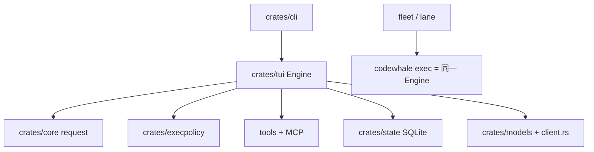

# Codewhale 设计思想导读（九幕）

> **深潜**：[ARCHITECTURE.md](./ARCHITECTURE.md)  
> **源码**: `Codewhale/`

---

## 第 1 幕：源码全景

**一句话**：Rust workspace；**TUI crate 仍是活的运行时**，`crates/core` 只做请求拼装与 Thread 类型，**禁止当成第二套循环**。

```text
Codewhale/
├── crates/cli           codewhale 二进制门面（auth/update 自管，run/exec 交给 tui）
├── crates/tui           终端 UI + Engine::run_turn + 工具执行
├── crates/core          request / fragments / thread-session 类型（无 turn loop）
├── crates/runtime       从 TUI 拆出的无头 runtime（进行中）
├── crates/execpolicy    审批 / 沙箱策略
├── crates/state         SQLite session
├── crates/tools / mcp / memory / protocol / config / models ...
└── docs/                上游 ARCHITECTURE / AGENT_RUNTIME / CACHE / MODES
```

**易错**：`crates/tui/src/core/` 是 TUI 内模块，不是 `crates/core`。

---

## 第 2 幕：状态 vs 执行

| | 状态载体 | 执行 |
|--|----------|------|
| **交互 TUI** | Session + transcript + checkpoint | 进程内 `run_turn` |
| **`codewhale exec`** | stream-json 事件 + 可选 resume | 同一 Engine，无 UI |
| **Fleet / Lane** | 身份、成员、lease | 选一个 Runtime worker 去跑 `exec` |

**校正**：Fleet 回答 **谁有资格**；Runtime 回答 **怎么跑、在哪跑**。不要做成两套 worker。

---

## 第 3 幕：双层循环

```text
外层：用户 Turn（一条用户消息 → 若干模型往返直到停）
  └── 内层：run_turn
        拼 request（冻结 KV 前缀 + 追加历史）
        → 流式模型
        → plan_tool_calls（权限 / 预算 / 审批）
        → 执行工具 + hooks + LSP
        → 写回 observation，再模型
```

上限：`ToolCallBudget`、turn 预算、mode（Plan 禁副作用）。

---

## 第 4 幕：依赖与装配



---

## 第 5 幕：工具管线

```text
模型 tool_use
  → 目录/延迟 schema（tool_search 激活）
  → resolve_tool_permission
  → pre hooks
  → 审批（Ask 模式弹窗）
  → sandbox 包装执行
  → post hooks + LSP diagnostics
  → observation 进 session log
```

**原则**：模型看见的必须能从 session log 重建。

---

## 第 6 幕：事件流

| 类型 | 用途 |
|------|------|
| TUI events | 流式文本、审批、toast |
| stream-json | `exec` / Runtime API |
| runtime_threads 时间线 | `item.started/delta/completed` |
| hooks crate | stdout / JSONL / webhook（与 shell hooks 不是同一套） |

---

## 第 7 幕：Steer vs Follow-up

| 语义 | Codewhale |
|------|-----------|
| 流中途插入 | `pending_steers`，在 step 边界提交；中断时必须 `Dropped` 通知发送方 |
| 用户下一条 | 新 Turn |
| 离线 | `offline_queue.json`，恢复后补跑 |

---

## 第 8 幕：持久化账本

| 账 | 路径/组件 |
|----|-----------|
| Session snapshot | `~/.codewhale/sessions/` |
| Checkpoint | `checkpoints/latest.json` |
| SQLite | `crates/state` |
| side-git 工作区快照 | `~/.codewhale/snapshots/...`（`/restore` 还原文件，不改对话） |
| Tasks | `~/.codewhale/tasks` |

---

## 第 9 幕：核心 vs 边界

| 进内核 | 应用/可选 |
|--------|-----------|
| 一条 turn loop、权限、session 日志 | Computer Use、Fleet 调度、Workflow JS、云 facts |

→ [Part 1](./ARCHITECTURE_PART1.md)
