# Codewhale — Agent 模块级图集（细粒度）

> 源码根：`Codewhale/crates/` · 与 [DIAGRAM_ATLAS.md](./DIAGRAM_ATLAS.md)（全局图）配套。
> **每个重要 Agent 相关模块**至少 1 张图；复杂模块含流程 + 时序/类图。

## 模块索引

| ID | 模块 | 源码锚点 | 图类型 |
|----|------|----------|--------|
| CW-01 | Engine 主循环与 Op 分派 | `engine.rs` | flowchart |
| CW-02 | run_turn 与 TurnContext | `turn_loop.rs` | sequence |
| CW-03 | process_stream 流解析 | `turn_loop.rs` | flowchart |
| CW-04 | plan_tool_calls 权限门 | `turn_loop.rs` | flowchart |
| CW-05 | prepare_primary_turn_request | `core/request.rs` | flowchart |
| CW-06 | Thread / Journal / branch | `core/session.rs` | classDiagram |
| CW-07 | Session 热状态 | `tui/core/session.rs` | classDiagram |
| CW-08 | TurnAuthority 与 Mode | `authority.rs` | flowchart |
| CW-09 | ExecPolicy 规则引擎 | `execpolicy/` | sequence |
| CW-10 | tool_execution 并行批次 | `tool_execution.rs` | flowchart |
| CW-11 | 工具体系与 deferred schema | `tools/` | flowchart |
| CW-12 | MCP 集成 | `mcp.rs` | sequence |
| CW-13 | Compaction | `compaction.rs` | flowchart |
| CW-14 | memory crate | `memory/` | flowchart |
| CW-15 | state / SQLite | `state/` | erDiagram |
| CW-16 | ModelClient 多 Provider | `tui/client/` | flowchart |
| CW-17 | goal_loop / GoalBudget | `runtime/goal_loop.rs` | sequence |
| CW-18 | Fleet / SubAgent | `fleet/` | flowchart |
| CW-19 | Lane 工作树 | `lane/` | flowchart |
| CW-20 | workflow | `workflow/` | flowchart |
| CW-21 | cli / exec 无 UI | `cli/` | sequence |
| CW-22 | app-server | `app-server/` | flowchart |
| CW-23 | hooks / telemetry | `hooks/ telemetry/` | flowchart |
| CW-24 | config / secrets | `config/ secrets/` | flowchart |
| CW-25 | protocol 消息类型 | `protocol/` | classDiagram |
| CW-26 | models 与路由 | `models/` | flowchart |
| CW-27 | command-contract | `command-contract/` | flowchart |
| CW-28 | Steer 与 pending_steers | `turn_loop.rs` | sequence |
| CW-29 | checkpoint / resume | `state/ exec` | sequence |

---

## CW-01 Engine 主循环与 Op 分派

**源码**：`engine.rs`

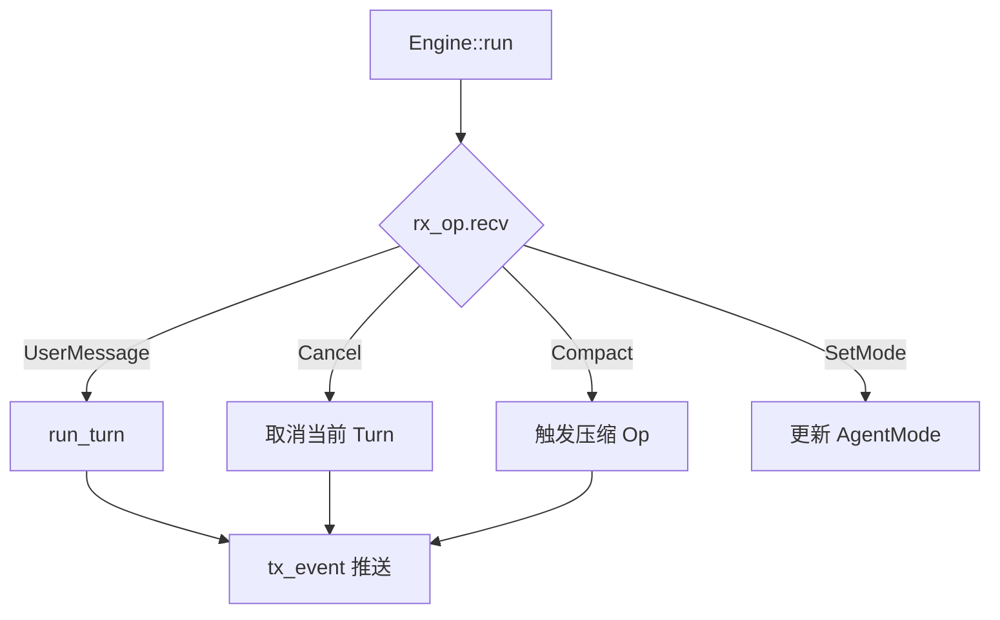

**读图**：Engine 单 Tokio 任务；所有外部输入经 Op 队列，禁止旁路调用 run_turn。

---

## CW-02 run_turn 与 TurnContext

**源码**：`turn_loop.rs`

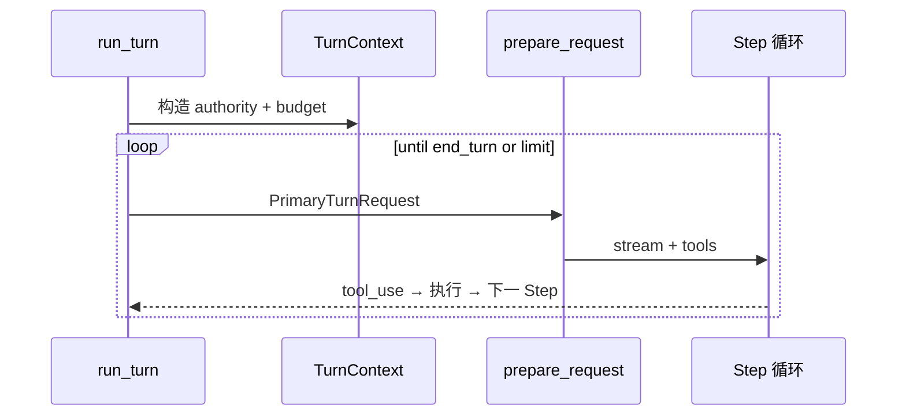

**读图**：TurnContext 每 Turn 一次；Step 可多次。

---

## CW-03 process_stream 流解析

**源码**：`turn_loop.rs`

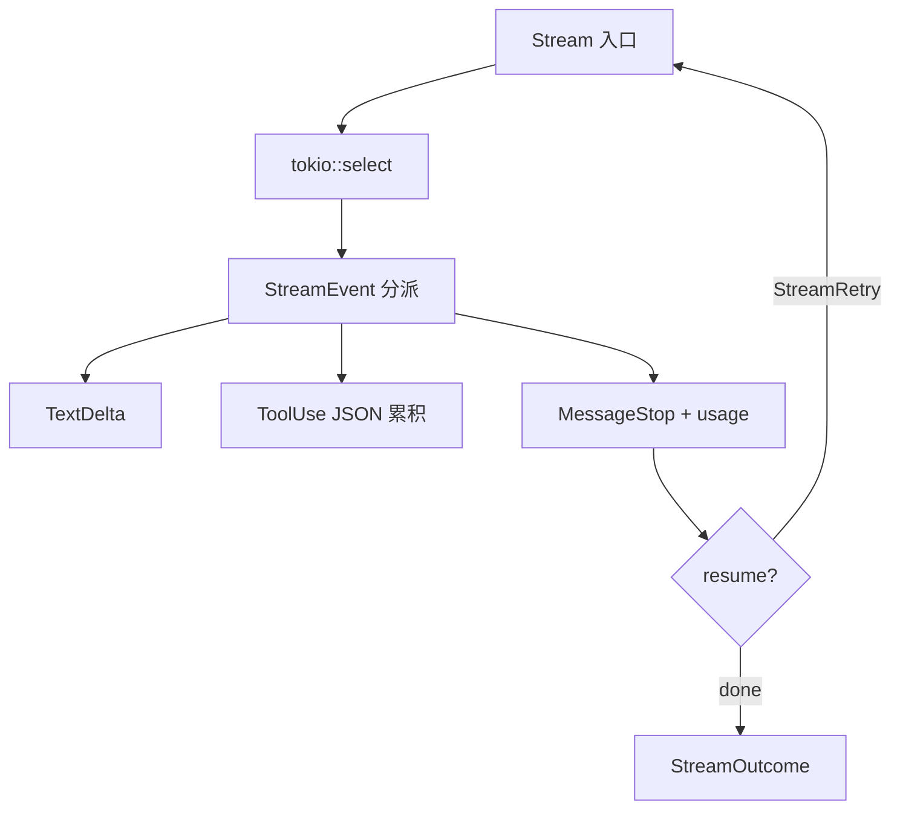

**读图**：多 ToolUse 用 block_index 映射；suspend 检测用 mono vs wall clock。

---

## CW-04 plan_tool_calls 权限门

**源码**：`turn_loop.rs`

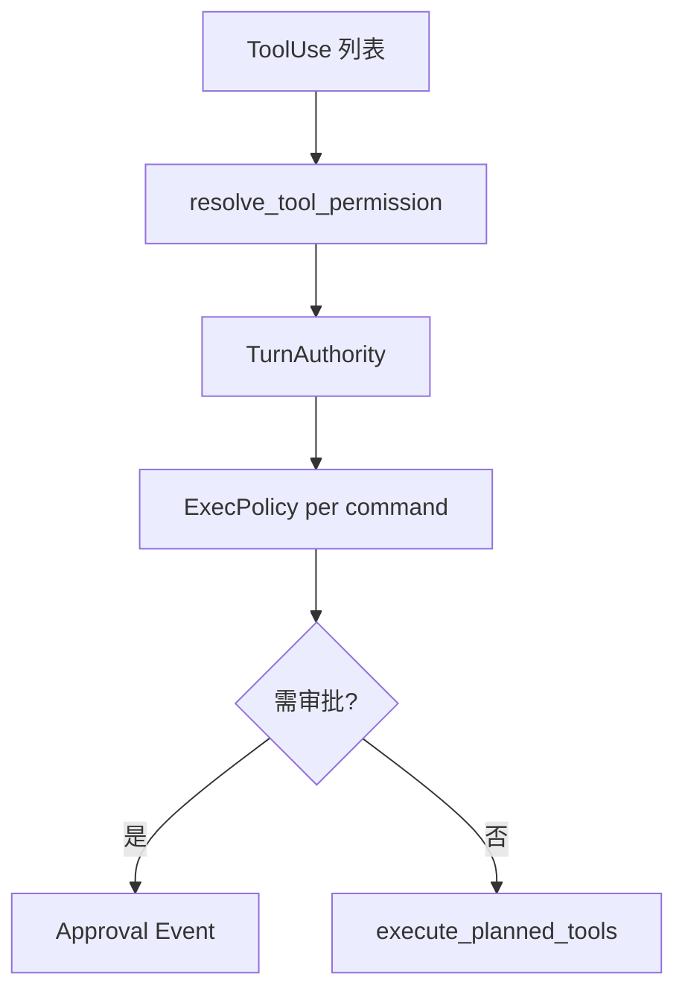

**读图**：TurnAuthority 会话级；ExecPolicy 命令级。

---

## CW-05 prepare_primary_turn_request

**源码**：`core/request.rs`

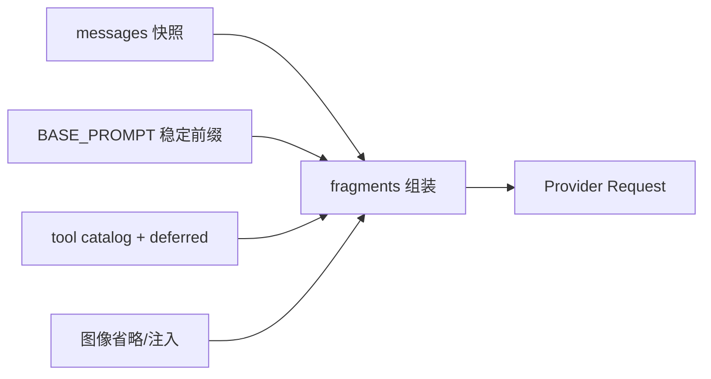

**读图**：volatile facts 用 user message 追加，不改 system 前缀（KV cache）。

---

## CW-06 Thread / Journal / branch

**源码**：`core/session.rs`

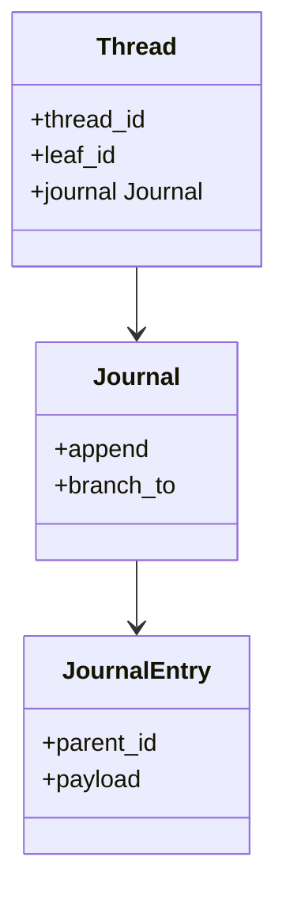

**读图**：分支只移动 leaf_id；历史 append-only。

---

## CW-07 Session 热状态

**源码**：`tui/core/session.rs`

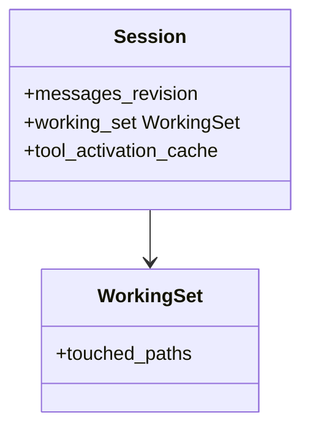

**读图**：Session 不落盘；Thread 落 SQLite。

---

## CW-08 TurnAuthority 与 Mode

**源码**：`authority.rs`

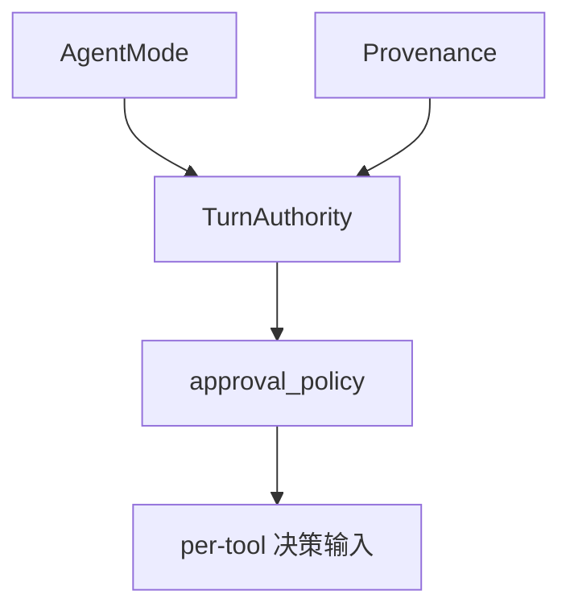

**读图**：子代理/checkpoint 来源可 provenance narrowing。

---

## CW-09 ExecPolicy 规则引擎

**源码**：`execpolicy/`

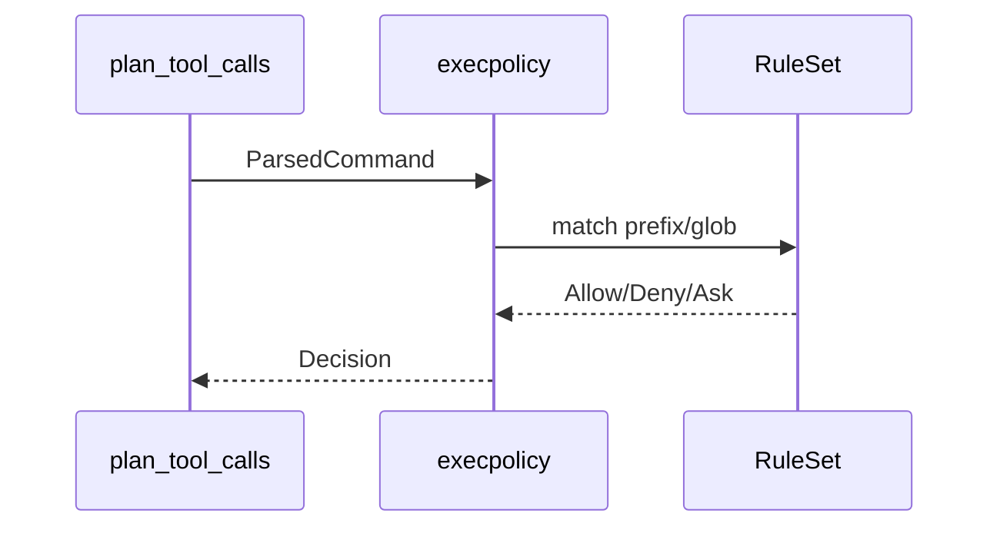

**读图**：独立 crate，无 TUI 依赖，worker 可复用。

---

## CW-10 tool_execution 并行批次

**源码**：`tool_execution.rs`

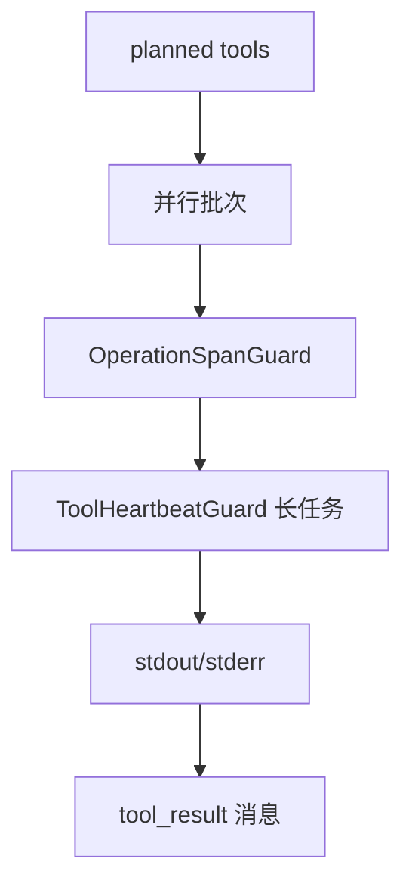

**读图**：LSP hooks 在特定工具前后触发。

---

## CW-11 工具体系与 deferred schema

**源码**：`tools/`

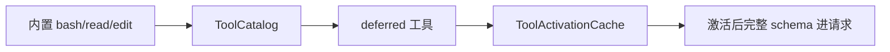

**读图**：降低每轮 token：未激活工具仅短描述。

---

## CW-12 MCP 集成

**源码**：`mcp.rs`

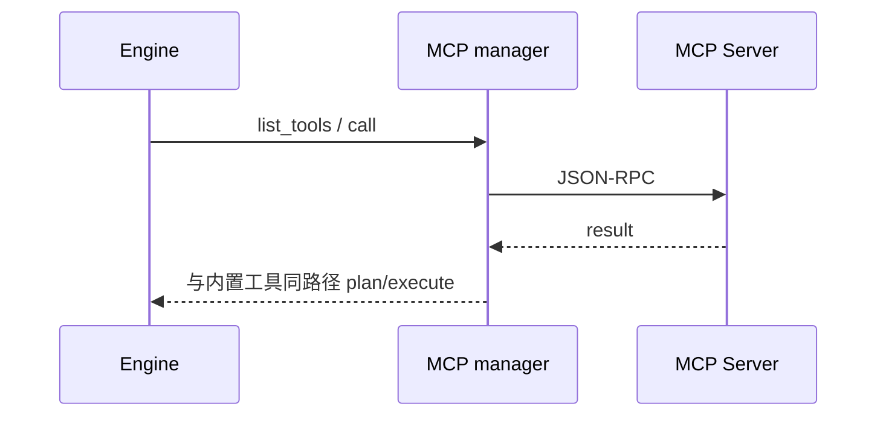

**读图**：环境变量占位符 expand_env_placeholders。

---

## CW-13 Compaction

**源码**：`compaction.rs`

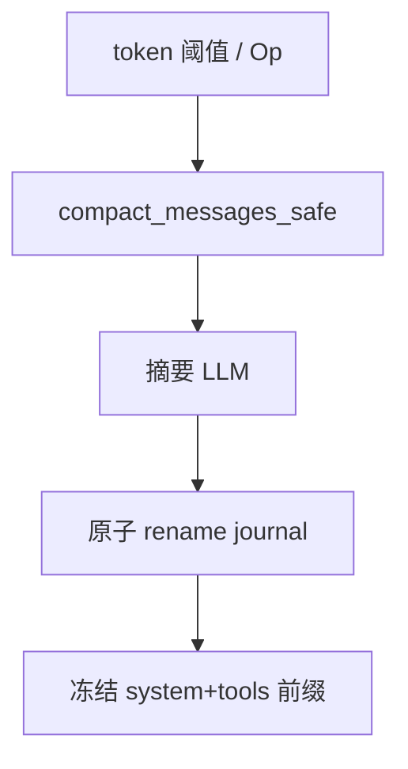

**读图**：压缩后 messages_revision 递增。

---

## CW-14 memory crate

**源码**：`memory/`

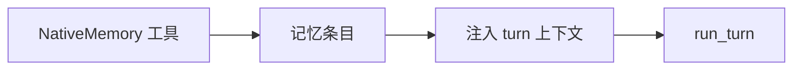

**读图**：与对话 compaction 不同域。

---

## CW-15 state / SQLite

**源码**：`state/`

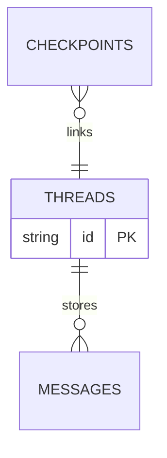

**读图**：Schema 迁移在 state crate。

---

## CW-16 ModelClient 多 Provider

**源码**：`tui/client/`

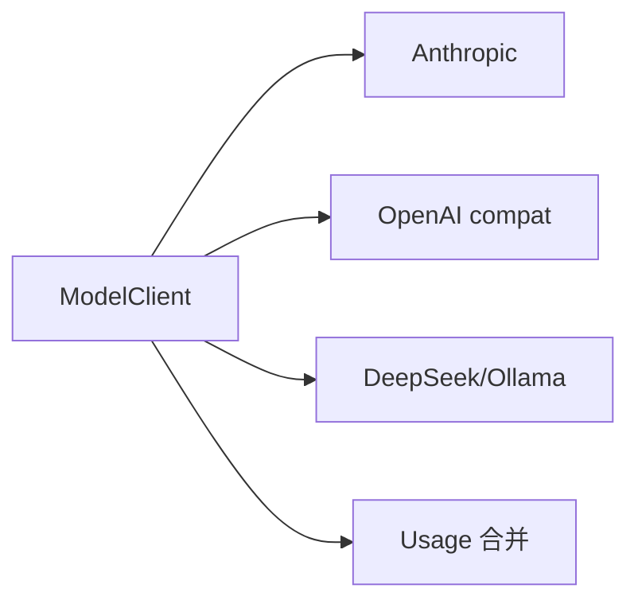

**读图**：SSE/chunked 解析为统一 StreamEvent。

---

## CW-17 goal_loop / GoalBudget

**源码**：`runtime/goal_loop.rs`

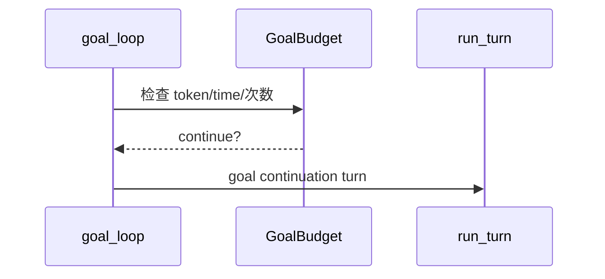

**读图**：持久目标跨多个 Turn。

---

## CW-18 Fleet / SubAgent

**源码**：`fleet/`

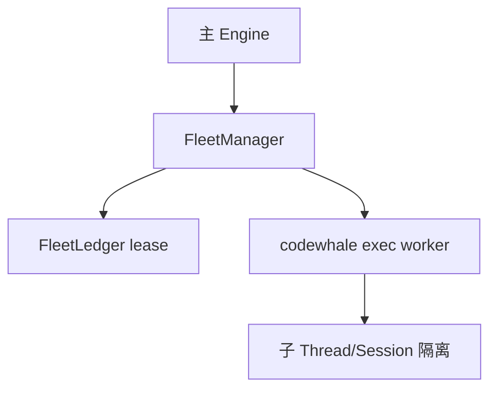

**读图**：Fleet 管资格；Runtime 管执行。

---

## CW-19 Lane 工作树

**源码**：`lane/`

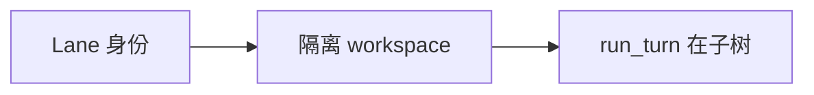

**读图**：与 Fleet 编排配合。

---

## CW-20 workflow

**源码**：`workflow/`

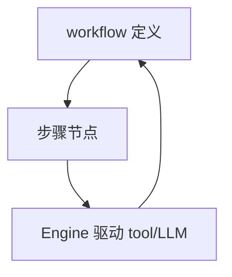

**读图**：高层任务编排，底层仍 run_turn。

---

## CW-21 cli / exec 无 UI

**源码**：`cli/`

```mermaid
sequenceDiagram
    participant EX as codewhale exec
    participant E as Engine
    participant OUT as stream-json
    EX->>E: 同 TUI Engine
    E-->>OUT: Event 序列
    OUT-->>EX: resume checkpoint
```

**读图**：与 TUI 共享 turn_loop。

---

## CW-22 app-server

**源码**：`app-server/`

```mermaid
flowchart LR
    HTTP[HTTP/daemon] --> PROXY[chat-completions 代理]
    PROXY --> ENG[Engine 或转发]
```

**读图**：可选 headless 接入。

---

## CW-23 hooks / telemetry

**源码**：`hooks/ telemetry/`

```mermaid
flowchart LR
    RT[run_turn] --> HK[hooks 埋点]
    HK --> TEL[telemetry 导出]
```

**读图**：可观测性不进入模型上下文。

---

## CW-24 config / secrets

**源码**：`config/ secrets/`

```mermaid
flowchart TD
    CFG[加载配置] --> FAIL[错误即 panic/明确 error]
    SEC[secrets] --> MC[ModelClient 凭证]
```

**读图**：快速失败契约。

---

## CW-25 protocol 消息类型

**源码**：`protocol/`

```mermaid
classDiagram
    class Op
    class Event
    class ToolSpec
    Op <|-- UserMessage
    Event <|-- TextDelta
```

**读图**：跨 crate 共享类型；减少循环依赖。

---

## CW-26 models 与路由

**源码**：`models/`

```mermaid
flowchart LR
    CFG[config model id] --> RES[resolve provider]
    RES --> MC[ModelClient 实例]
```

**读图**：多 provider 配置入口。

---

## CW-27 command-contract

**源码**：`command-contract/`

```mermaid
flowchart TD
    TOOL[bash 工具] --> PARSE[contract 解析]
    PARSE --> EP[execpolicy 输入]
```

**读图**：结构化命令表示。

---

## CW-28 Steer 与 pending_steers

**源码**：`turn_loop.rs`

```mermaid
sequenceDiagram
    participant U as 用户
    participant PS as process_stream
    participant RT as run_turn
    U->>PS: mid-stream steer
    PS->>PS: pending_steers 缓冲
    PS-->>RT: Turn 边界合并入 messages
```

**读图**：steer 在 Step 边界提交，不撕裂 tool JSON。

---

## CW-29 checkpoint / resume

**源码**：`state/ exec`

```mermaid
sequenceDiagram
    participant EX as exec
    participant ST as state
    participant E as Engine
    EX->>ST: 读 checkpoint
    ST->>E: resume Op
    E-->>EX: 续跑 stream-json
```

**读图**：headless 恢复路径。

---


# 附录 A — Crate 依赖与 Agent 数据流

```mermaid
flowchart TB
    subgraph UI[tui/cli]
        ENG[Engine]
    end
    subgraph Core[core/protocol]
        REQ[request/session]
    end
    subgraph Exec[execpolicy/tools/mcp]
        TE[tool_execution]
    end
    subgraph Data[state/memory]
        SQL[SQLite]
    end
    ENG --> REQ
    ENG --> TE
    ENG --> SQL
    TE --> execpolicy
```

```mermaid
sequenceDiagram
    participant UI as TUI
    participant E as Engine
    participant J as Journal
    participant L as LLM
    participant T as Tools
    UI->>E: Op
    E->>J: append user
    E->>L: Step
    L-->>E: tool_use
    E->>T: execute
    T-->>E: result
    E->>J: append tool
    E-->>UI: Event
```

**读图**：左为编译期分层；右为单 Step 消息落盘顺序。
