# Codewhale 架构图集（全局）

> 与 [ARCHITECTURE.md](../ARCHITECTURE.md) 配套。**每个 Agent 相关模块的细粒度图**见 **[AGENT_MODULE_DIAGRAMS.md](./AGENT_MODULE_DIAGRAMS.md)**（CW-01…CW-29 + 附录）。  
> 本文件：**全局** 架构图、类图、实体图、流程图、时序图。  
> 图源与 `Codewhale/crates/` 源码一致；图下附简短读图说明。

---

## 图目录

| 编号 | 类型 | 标题 |
|------|------|------|
| G1 | architecture | 五层运行时总览 |
| G2 | sequence | 端到端 Turn（用户输入 → 工具 → 回写） |
| G3 | classDiagram | 核心运行时类 |
| G4 | erDiagram | Thread / Journal / 持久化实体 |
| G5 | flowchart | Op / Event 双通道 |
| M1 | sequence | `run_turn` 内层 Step 循环 |
| M2 | flowchart | `process_stream` 流事件分派 |
| M3 | flowchart | `plan_tool_calls` → 执行管道 |
| M4 | sequence | ExecPolicy 审批与沙箱 |
| M5 | flowchart | Compaction 触发与落盘 |
| M6 | sequence | Fleet 任务投递 |
| M7 | flowchart | MCP 工具注册与调用 |

---

## G1 五层运行时总览

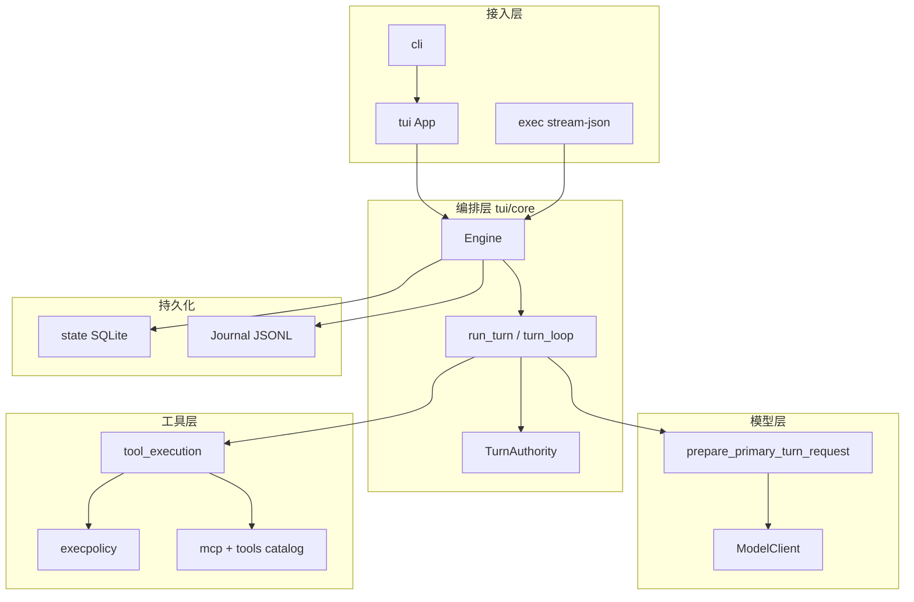

**读图**：所有用户可见行为最终汇入 `Engine`；**唯一**内层循环在 `turn_loop.rs` 的 `run_turn`，其它 crate 不实现第二套 loop。

---

## G2 端到端 Turn 时序

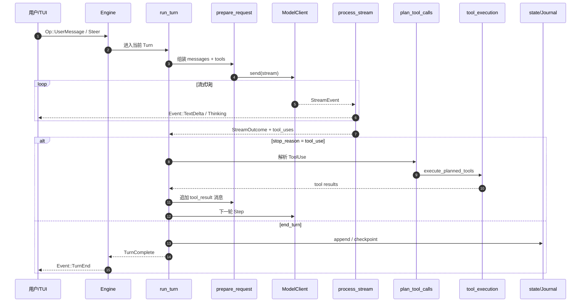

**读图**：一个 Turn 可含**多个 Step**（每次 `tool_use` 后递归请求模型）；`TurnComplete` 前所有进入 API 的内容须可自 Journal 重建。

---

## G3 核心运行时类图

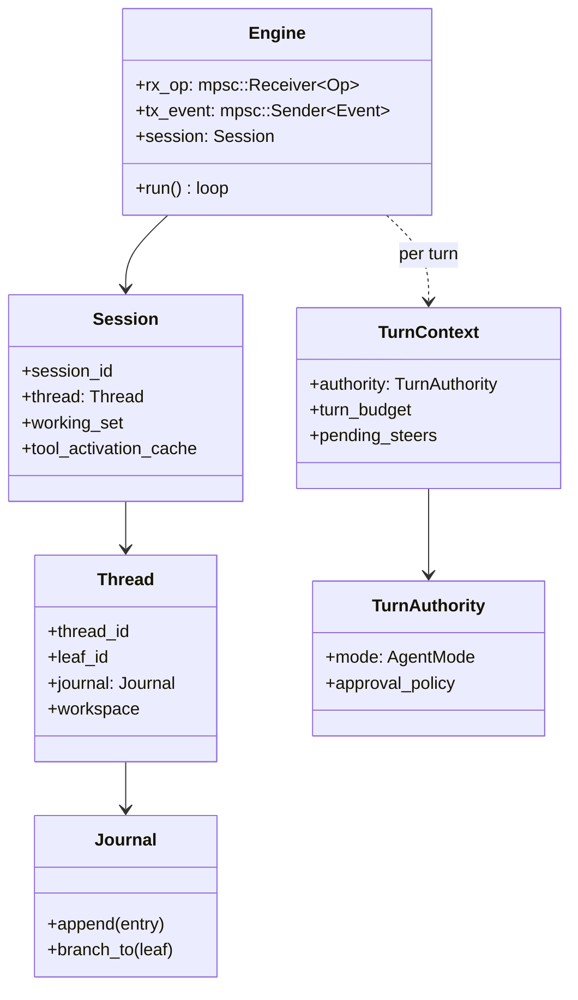

**读图**：`Session` 为进程内热状态；`Thread` + `Journal` 为可持久化对话树；`TurnContext` 每 Turn 构造一次。

---

## G4 持久化实体关系

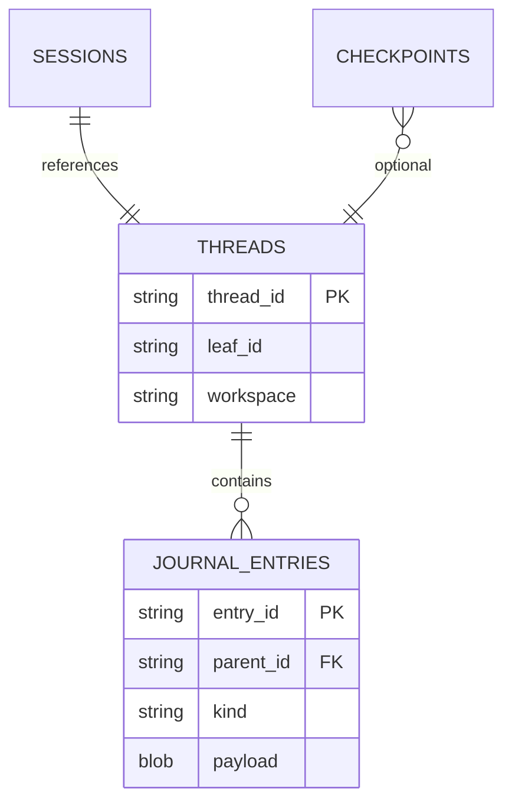

**读图**：分支对话 = 移动 `leaf_id`，不删除 `JOURNAL_ENTRIES`；checkpoint 与 thread 关联用于 resume/exec。

---

## G5 Op / Event 双通道

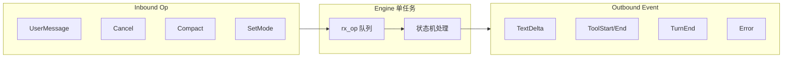

**读图**：外部**只**通过 Op 驱动；UI/exec **只**订阅 Event，避免与内部锁竞争。

---

## M1 `run_turn` Step 循环

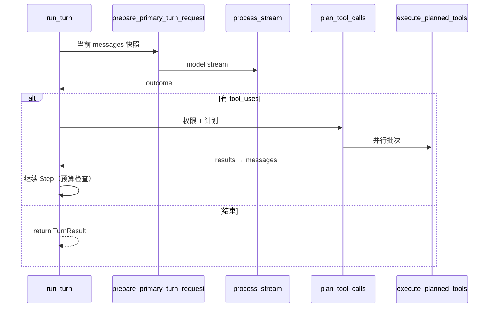

---

## M2 `process_stream` 流程

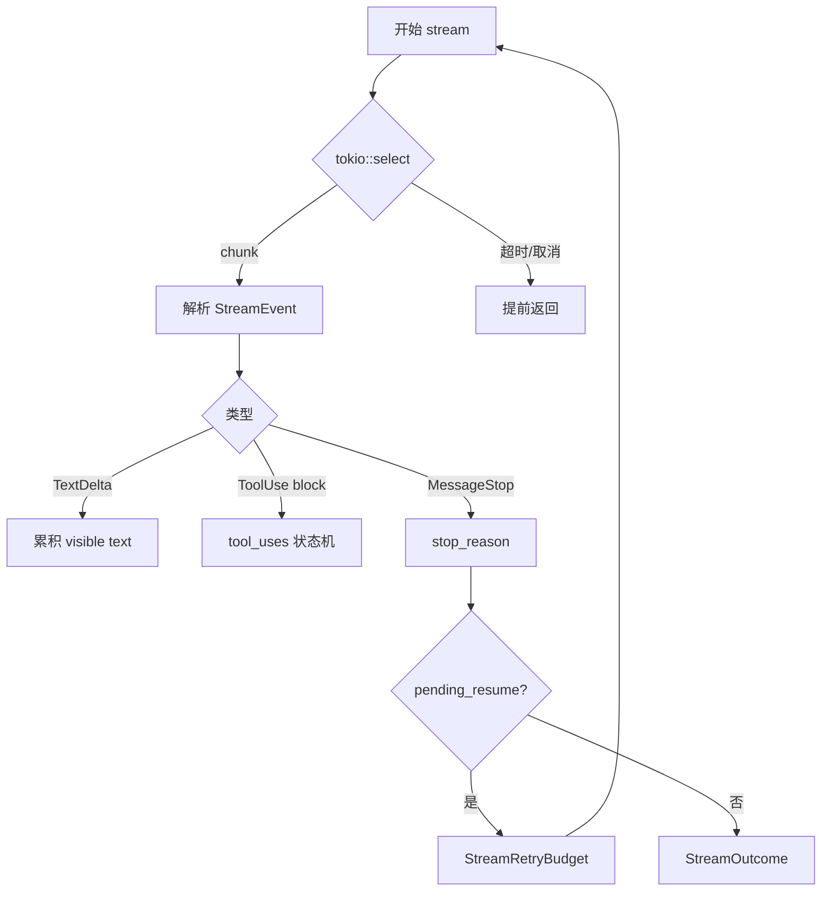

---

## M3 工具计划与执行

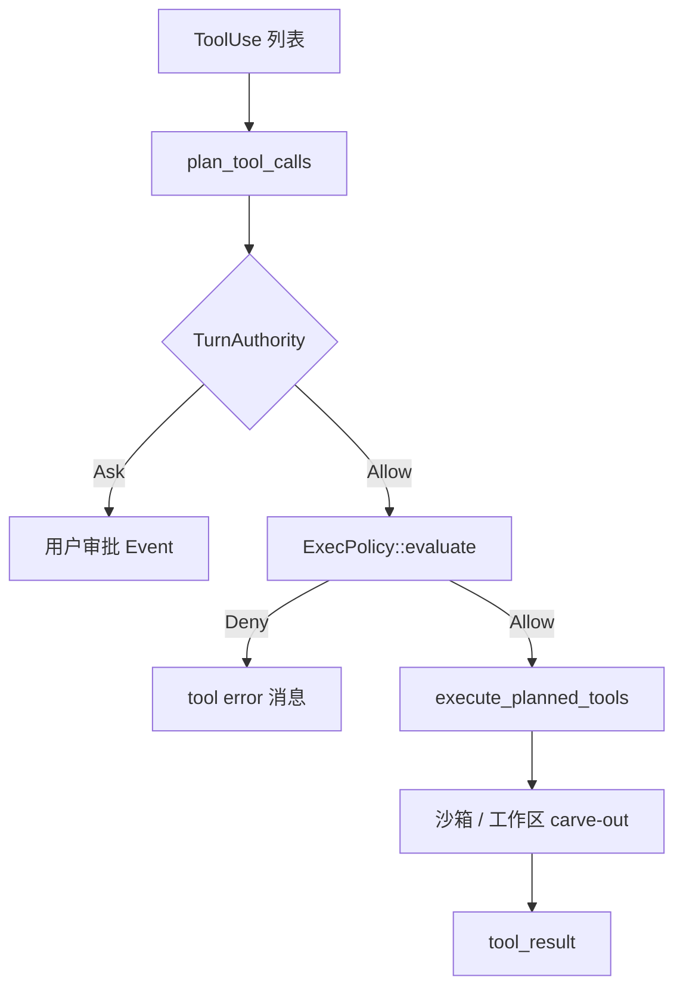

---

## M4 ExecPolicy 时序

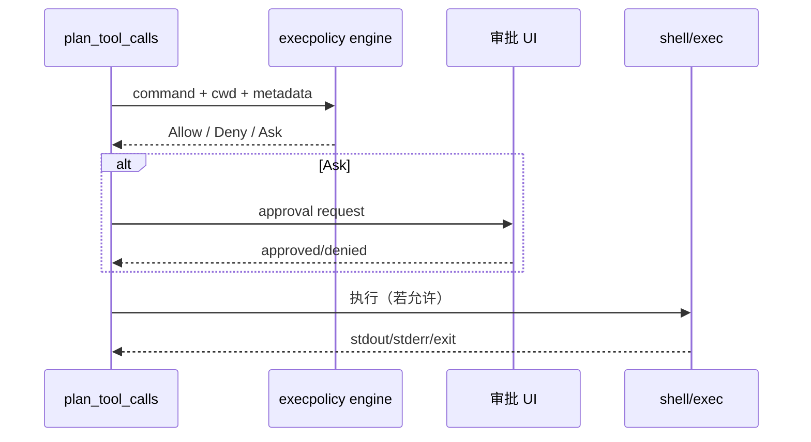

---

## M5 Compaction 流程

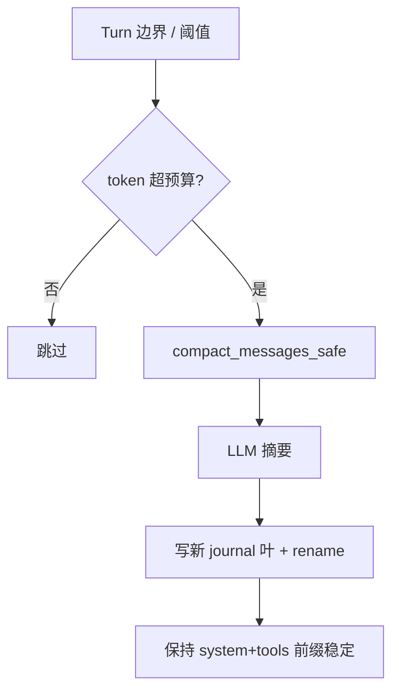

---

## M6 Fleet 并行

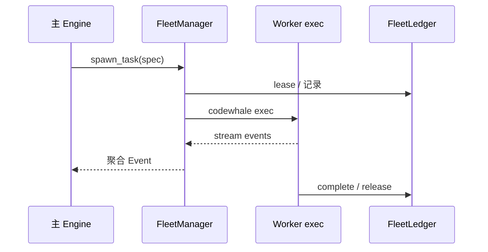

---

## M7 MCP 调用链

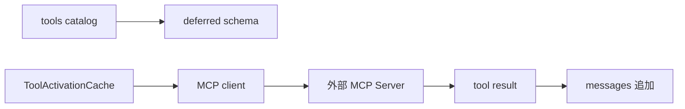

---

## 与主文档对照

| 图 | ARCHITECTURE 章节 |
|----|-------------------|
| G1–G2 | I.0, I.5 |
| G3–G4 | I.3, I.6 |
| G5 | I.4 |
| M1–M2 | II.1, II.2 |
| M3–M4 | II.6, II.7 |
| M5 | II.10 |
| M6 | II.11 |
| M7 | II.9 |
