    # Codex 完整架构设计文档（第一部分）

> **版本**: 2.19（2026-09-03）· **分析方法**: 源码阅读（`codex/codex-rs/`）  
> **v2.20**: 链至 [PLAN_AND_MULTI_AGENT.md](./PLAN_AND_MULTI_AGENT.md)（Plan / `update_plan` / MA 合一、持久化校正）。  
> **v2.19**: §8.3.1–§8.3.2 校正 InterAgentCommunication / AgentControl 用户补充稿；链至 [FULL_LIFECYCLE_SEQUENCE.md](./FULL_LIFECYCLE_SEQUENCE.md) 全链路时序与 OpenAI Agents Python SDK 对比。  
> **v2.18**: §8.9 主子 Agent 同步/异步与 delegate 语义；链至 [RUNTIME_PROMPTS.md](./RUNTIME_PROMPTS.md) 完整运行时 Prompt 中文全览。  
> **v2.17**: §8.7–§8.8 协作范式对照（ReAct / Plan-and-Execute / 协调器）与 MA V1/V2；§9.5 Plan 在范式中的位置；修正 §8.3 `send_input` 路径。  
> **v2.16**: §4.1 扩写 Op 触发来源、子 Agent、采样/压缩双路径、Reject。

> **体例参照**: `software-agent-sdk/docs/ARCHITECTURE_PART1.md`

---

## 目录

- [第1章：项目定位与分层](#第1章项目定位与分层)（§1.2.0 图示公约）
- [第2章：身份模型：Thread / Session / Turn / Step](#第2章身份模型thread--session--turn--step)
- [第3章：SQ/EQ 协议](#第3章sqeq-协议)（§3.5 EventMsg 投影；§3.8 Memories 长期记忆；§3.7 桥接）
- [第4章：Agent Loop（run_turn）](#第4章agent-loop--四层循环与源码级设计)
- [第5章：Message 设计（三层投影）](#第5章message-设计三层投影)（§5.8 状态归属与持久化生命周期）
- [第6章：端到端流程](#第6章端到端流程)
- [第7章：Context Fragments 与压缩](#第7章context-fragments-与压缩)
- [第8章：多 Agent](#第8章多-agent)（§8.3.1–8.3.2 IAC/AgentControl；§8.7 协作范式；§8.8 MA V1/V2；§8.9 同步/异步）
- [第9章：Plan 与 Collaboration Mode](#第9章plan-与-collaboration-mode)（§9.5 范式位置）
- [附录 B：源码速查](#附录-b源码速查)

---

## 第1章：项目定位与分层

### 1.1 项目定位

**Codex** 是 OpenAI 的本地编码 Agent 运行时，目标不是「一个 TUI」，而是：

1. **协议化运行时** — 任意客户端通过 `Op` / `EventMsg` 驱动同一套 core
2. **增量上下文** — 发给模型的 `ResponseItem[]` 只追加、不重写（利于 prompt cache）
3. **可回放** — Rollout 文件 + ThreadStore 支持 Resume / Fork
4. **纵深防御** — Sandbox、ExecPolicy、Guardian、网络审批分层

### 1.2 分层架构

本节分四层阅读：**图示公约** → **运行时分层总览** → **全栈实体全景** → **源码级核心实体** → **控制面/数据面**。

#### 1.2.0 图示与术语公约（全文档强制）

后续 **所有** Mermaid 图、时序图、状态机与文字描述须遵守；[`ENTITY_AND_SEQUENCES.md`](./ENTITY_AND_SEQUENCES.md) 同步遵循。

| # | 公约 | 正确画法 / 用语 | **禁止** |
|---|------|-----------------|----------|
| 1 | **`run_turn` 是什么** | `session/turn.rs` 的 **`async fn`**（Step 采样循环） | 画成与 `Session` / `submission_loop` **并列**的长期组件或 struct |
| 2 | **谁执行 `run_turn`** | `ActiveTurn.task: RunningTask` → **`RegularTask::run`** → `run_turn(...)` | `turn_input` / `submission_loop` **箭头直连** `run_turn` 且无 `spawn_task` |
| 3 | **Start 路径** | `turn_input::handle` → `spawn_task` / `start_task` → `tokio::spawn` → `RegularTask::run` | `spawn run_turn`、`start_new_turn()` |
| 4 | **Steer 路径** | `steer_input` → **`TurnState.pending_input`**；**已在跑**的 `run_turn` Step loop `get_pending_input` drain | 写入 `active_turn.items`；steer 进 **`Session.input_queue` 邮箱** |
| 5 | **SQ 与内部队列** | `submission_loop` 从 `rx_sub.recv()` **直接 dispatch** | `Session.input_queue: VecDeque<Submission>` |
| 6 | **`Session.input_queue`** | 仅 **子 Agent 邮箱** `mailbox_pending_mails` | 用户 TurnInput / Steer 排队 |
| 7 | **模型上下文** | `SessionState.history`（`ContextManager`）+ `StepContext` | `ActiveTurn.items` |
| 8 | **序列图 participant** | 需要时拆 **`RegularTask::run`** 与 **`run_turn`**，或 Note「在 RunningTask 内」 | 单独 `run_turn task` 与 `ActiveTurn` 平级且无挂载关系 |
| 9 | **Op 命名** | `Interrupt`、`ExecApproval`、`PatchApproval` | `CancelTurn`、`Op::Approve` |

**推荐栈（画图时默认可沿此展开）**：

```text
CodexThread.submit → SessionIo.tx_sub → submission_loop → turn_input::handle
  ├─ Start  → spawn_task(RegularTask) → RunningTask → RegularTask::run → run_turn()
  └─ Steer  → TurnState.pending_input ──drain──► run_turn() Step loop（同 RunningTask）
```

#### 1.2.1 运行时分层总览

> 实体字段与时序深潜另见 [ENTITY_AND_SEQUENCES.md §1–2](./ENTITY_AND_SEQUENCES.md#1-实体总览与包含关系)；**SQ/EQ / `input_queue` / `pending_input`** 见 [§3.1](#31-通道与队列sq--eq--input_queue--pending_input)。图示须符合 [§1.2.0](#120-图示与术语公约全文档强制)。

**阅读路径**：App → Entry → `ThreadManager` → `CodexThread` →（`SessionIo` 走 SQ/EQ + `Session` 跑 Turn）→ 见下图、时序图与示例。

##### 端到端总览（入口 + 运行时主链合一）

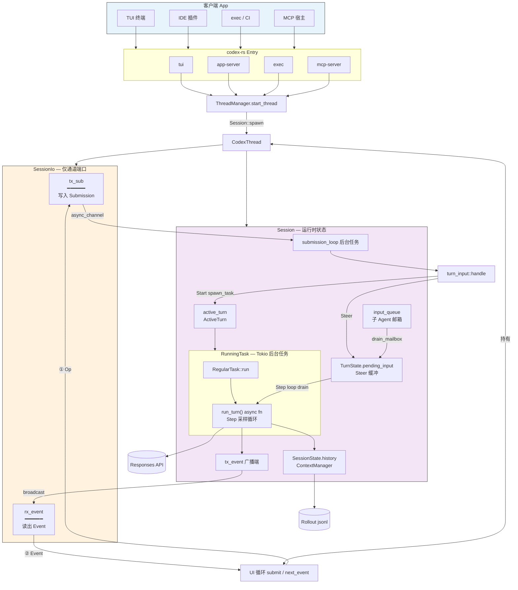
```mermaid
flowchart TB
    subgraph APP["客户端 App"]
        direction LR
        A1[TUI 终端]
        A2[IDE 插件]
        A3[exec / CI]
        A4[MCP 宿主]
    end

    subgraph ENTRY["codex-rs Entry"]
        direction LR
        E1[tui]
        E2[app-server]
        E3[exec]
        E4[mcp-server]
    end

    THM[ThreadManager.start_thread]
    CT[CodexThread]

    A1 & A2 & A3 & A4 --> ENTRY
    E1 & E2 & E3 & E4 --> THM
    THM -->|Session::spawn| CT

    subgraph IO["SessionIo — 仅通道端口"]
        TX["tx_sub<br/>━━━━━━<br/>写入 Submission"]
        RX["rx_event<br/>━━━━━━<br/>读出 Event"]
    end

    subgraph SESS["Session — 运行时状态"]
        direction TB
        SL[submission_loop 后台任务]
        IQ["input_queue<br/>子 Agent 邮箱"]
        AT["active_turn<br/>ActiveTurn"]
        subgraph TASK["RunningTask — Tokio 后台任务"]
            RK["RegularTask::run"]
            RT["run_turn() async fn<br/>Step 采样循环"]
            RK --> RT
        end
        PI["TurnState.pending_input<br/>Steer 缓冲"]
        HIST["SessionState.history<br/>ContextManager"]
        TXE[tx_event 广播端]
        AT --> TASK
    end

    UI[UI 循环 submit / next_event]

    UI <-->|持有| CT
    CT --> IO
    CT --> SESS

    UI -->|① Op| TX
    TX -->|async_channel| SL
    SL --> TI[turn_input::handle]
    TI -->|Start spawn_task| AT
    TI -->|Steer| PI
    IQ -->|drain_mailbox| PI
    PI -->|Step loop drain| RT
    RT --> HIST
    RT --> API[(Responses API)]
    RT --> TXE
    TXE -->|broadcast| RX
    RX -->|② Event| UI
    HIST --> ROL[(Rollout jsonl)]

    classDef app fill:#e8f4fc,stroke:#333
    classDef io fill:#fff3e0,stroke:#333
    classDef sess fill:#f3e5f5,stroke:#333
    class APP app
    class IO io
    class SESS sess
```

| 阶段 | 节点 | 含义 |
|------|------|------|
| 左 | App → Entry | 各端 UI/脚本进入对应 crate，**汇聚到** `ThreadManager` |
| 中 | `CodexThread` | 对外句柄；内挂 **`SessionIo` + `Session`** 一对 |
| 右 | `SessionIo` | **只**负责 SQ 进、EQ 出（不存业务状态） |
| 右 | `Session` | `submission_loop`、`active_turn`、队列、history；**`run_turn` 在 `RunningTask` 内执行** |
| 底 | `UI 循环` | `submit(Op)` → `tx_sub`；`next_event()` ← `rx_event` |

| App | 对应 Entry |
|-----|------------|
| TUI 终端 | `cli` → `tui` |
| IDE / Desktop 壳 | `app-server`（JSON-RPC） |
| CI / 脚本 | `exec` |
| MCP 宿主 | `mcp-server` |

> **`run_turn` 统一读法**（全文档图示共用，详见 [§1.2.0](#120-图示与术语公约全文档强制)）：源码里是 `session/turn.rs` 的 **`async fn run_turn`**，**不是**与 `Session` / `ActiveTurn` 并列的长期对象。`turn_input` Start 路径调用 `spawn_task` → `start_task` 在 `ActiveTurn` 上挂 **`RunningTask`**（`tokio::spawn`），由 **`RegularTask::run`** 调用 `run_turn`；Steer 只写 `TurnState.pending_input`，由**已在跑的** `run_turn` Step loop drain。`RegularTask::run` 外层还可能因残留 `pending_input` **再次**调用 `run_turn`（见 `tasks/regular.rs`）。

##### 时序：冷启动 + turn/start + steer（源码对齐）

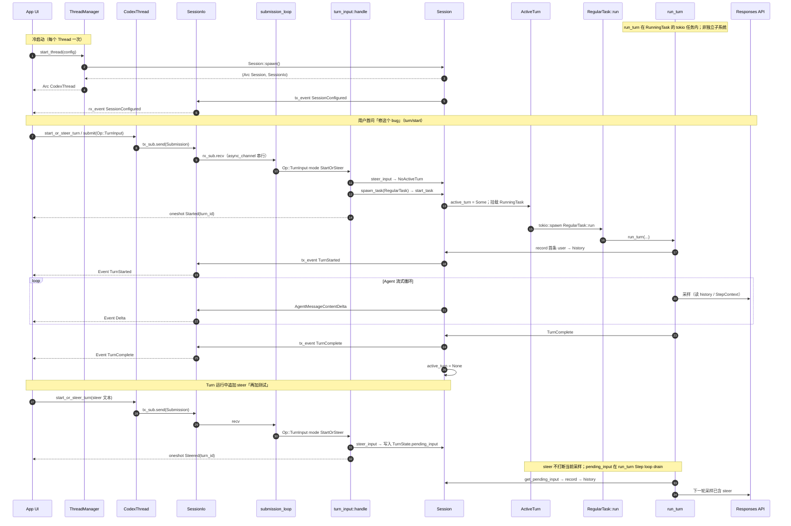
```mermaid
sequenceDiagram
    autonumber
    participant App as App UI
    participant THM as ThreadManager
    participant CT as CodexThread
    participant SIO as SessionIo
    participant SL as submission_loop
    participant TI as turn_input::handle
    participant S as Session
    participant AT as ActiveTurn
    participant RK as RegularTask::run
    participant RT as run_turn
    participant LLM as Responses API

    Note over RT: run_turn 在 RunningTask 的 tokio 任务内；非独立子系统

    Note over App,THM: 冷启动（每个 Thread 一次）
    App->>THM: start_thread(config)
    THM->>S: Session::spawn()
    S-->>THM: (Arc Session, SessionIo)
    THM-->>App: Arc CodexThread
    S->>SIO: tx_event SessionConfigured
    SIO-->>App: rx_event SessionConfigured

    Note over App,LLM: 用户首问「修这个 bug」（turn/start）
    App->>CT: start_or_steer_turn / submit(Op::TurnInput)
    CT->>SIO: tx_sub.send(Submission)
    SIO->>SL: rx_sub.recv（async_channel 串行）
    SL->>TI: Op::TurnInput mode StartOrSteer
    TI->>S: steer_input → NoActiveTurn
    TI->>S: spawn_task(RegularTask) → start_task
    S->>AT: active_turn = Some；挂载 RunningTask
    TI-->>App: oneshot Started(turn_id)

    AT->>RK: tokio::spawn RegularTask::run
    RK->>RT: run_turn(...)
    RT->>S: record 首条 user → history
    S->>SIO: tx_event TurnStarted
    SIO-->>App: Event TurnStarted

    loop Agent 流式循环
        RT->>LLM: 采样（读 history / StepContext）
        S->>SIO: AgentMessageContentDelta
        SIO-->>App: Event Delta
    end

    RT->>S: TurnComplete
    S->>SIO: tx_event TurnComplete
    SIO-->>App: Event TurnComplete
    S->>S: active_turn = None

    Note over App,S: Turn 运行中追加 steer「再加测试」
    App->>CT: start_or_steer_turn(steer 文本)
    CT->>SIO: tx_sub.send(Submission)
    SIO->>SL: recv
    SL->>TI: Op::TurnInput mode StartOrSteer
    TI->>S: steer_input → 写入 TurnState.pending_input
    TI-->>App: oneshot Steered(turn_id)

    Note over AT,RT: steer 不打断当前采样；pending_input 在 run_turn Step loop drain
    RT->>S: get_pending_input → record → history
    RT->>LLM: 下一轮采样已含 steer
```

##### 常见误图 vs 源码事实

| 误述（旧图 / 外部笔记） | 源码事实（`codex-rs`） |
|------------------------|------------------------|
| App 直接向 `SessionIo.tx_sub` 发 `StartOrSteer` 标记 | App **只**持有 `CodexThread`；经 `submit` / `start_or_steer_turn` → `SessionIo.submit` → `tx_sub`。`StartOrSteer` 是 **`Op::TurnInput` 的 `mode` 字段**（`TurnInputMode`），不是单独通道 |
| `submission_loop` 先把 `Submission` 推入 `Session.input_queue: VecDeque<Submission>` | ❌ **无此结构**。`submission_loop` 从 `rx_sub.recv()` **直接 dispatch**；串行顺序由 `async_channel` 保证。`Session.input_queue` 是 **`InputQueue`**，只管 **子 Agent 邮箱**（`mailbox_pending_mails`），**不**存 `Submission` |
| Steer 直接追加到 `active_turn.items` | ❌ **`ActiveTurn` 无 `items` 字段**（只有 `task` + `turn_state`）。Steer 经 `Session::steer_input` → **`TurnState.pending_input`**（`TurnInputQueue`） |
| 「不存在 `pending_input` / 无 drain」 | ❌ **`TurnState.pending_input` 存在**（`state/turn.rs`）。`run_turn` Step loop 在 `can_drain_pending_input` 时 `get_pending_input` → `record_conversation_items` → **`history`** |
| `turn_input::handle` 直接 `spawn run_turn` | `handle` 在 Start 路径调 **`spawn_task` / `start_task`**，由 **`RegularTask::run`** 进入 `run_turn`；Steer 路径**只写 `pending_input` 并 oneshot 返回**，不 spawn |
| `Op::CancelTurn` / `Op::Approve` | 实际是 **`Op::Interrupt`**、**`Op::ExecApproval`** / **`Op::PatchApproval`** 等（`protocol.rs`） |
| 模型读 `active_turn.items` | 模型上下文来自 **`SessionState.history`（`ContextManager`）** + 当轮 **`StepContext`**；steer drain 后进 **history**，不是 Turn 上挂的 `items` 向量 |

##### Turn 提交与 Steer 完整链路（文字版）

**统一入口**：`SessionIo.tx_sub` 是唯一 SQ 发送端；`turn/start`、`steer`、中断、审批等 **共用同一 channel**，没有 `tx_steer` / `tx_normal`。

```rust
// codex-rs/protocol/src/protocol.rs（节选）
pub enum Op {
    TurnInput {
        request: Box<TurnInputRequest>,
        mode: TurnInputMode,   // StartOrSteer | StartIfIdle | Steer { expected_turn_id }
        reply: oneshot::Sender<CodexResult<TurnInputSubmission>>,
    },
    Interrupt,
    ExecApproval { id, turn_id, decision },
    // …
}
```

**`turn/start` 与 `steer` 的区分不在发送端**，而在 `turn_input::handle`（`StartOrSteer` 模式）：

1. App → `CodexThread.start_or_steer_turn(request)` → `SessionIo.submit_turn_input(..., StartOrSteer)`
2. `submission_loop` `recv` → `turn_input::handle`
3. `handle` 先调 `Session::steer_input`：
   - 有活跃 Regular Turn → **`Steered`**：写入 **`TurnState.pending_input`**
   - `NoActiveTurn` → **`Started`**：`apply_started` + **`spawn_task(..., RegularTask)`**
4. Steer **不中断**当前 LLM/工具；`run_turn` 下一轮 Step **`can_drain_pending_input`** 时合并进 **history**

```
turn-start: App → CodexThread → SessionIo.tx_sub → submission_loop → turn_input::handle
            → spawn_task(RegularTask) → run_turn → history

steer:      App → CodexThread → SessionIo.tx_sub → submission_loop → turn_input::handle
            → steer_input → TurnState.pending_input
            → run_turn Step loop drain → history → 下一轮采样
```

| 业务行为 | `Op` 类型 | 备注 |
|----------|-----------|------|
| 新开 Turn | `Op::TurnInput` + `TurnInputMode::StartOrSteer`（或 `StartIfIdle`） | oneshot 回 `Started` |
| 中途插话 steer | 同上 `StartOrSteer` | 有 `active_turn` 时 oneshot 回 `Steered` |
| 指定 Turn 的 steer | `Op::TurnInput` + `TurnInputMode::Steer { expected_turn_id }` | `CodexThread::steer_turn` |
| 取消 / 中断 | `Op::Interrupt` | 非 `CancelTurn` |
| 工具审批 | `Op::ExecApproval` / `Op::PatchApproval` | 非单一 `Approve` |

**`ActiveTurn` 真实字段**（`core/src/state/turn.rs`）：`task: Option<RunningTask>`（含 `turn_context`、取消令牌、后台 `AbortOnDropHandle`）+ `turn_state: Arc<Mutex<TurnState>>`（含 **`pending_input`**、审批 waiters、`mailbox_delivery_phase` 等）。对话 transcript 在 **`SessionState.history`**，不在 `ActiveTurn` 上。

> 四条通道与 Start/Steer 分支详见 [§3.1](#31-通道与队列sq--eq--input_queue--pending_input)（含 [与 PI 双队列对照](#与-pi双队列的对照steer-vs-turn-后排队)）；下方为字段示例；`CodexThread` 三件套图见 [§2.4](#24-session--codexthread--sessionio-三层)。

##### `Session` 与 `SessionIo`：分工、存什么、示例

二者在 `Session::spawn()` 时 **1:1 成对** 交给 `CodexThread`。`SessionIo` 是**插座**；`Session` 是**机房**。

| 端点 / 字段 | 挂在 | 类型 | **里面放什么** | 谁写 | 谁读 |
|-------------|------|------|----------------|------|------|
| **`tx_sub`** | `SessionIo` | `Sender<Submission>` | 一条 **控制消息**：`{ id, op: Op, … }`；如 `TurnInput`、`Interrupt`、`ExecApproval` | App 经 `CodexThread.submit` | `submission_loop` |
| **`rx_sub`** | 与 `tx_sub` 成对 channel 接收端 | `Receiver<Submission>` | 同上（从 channel 取出） | — | `submission_loop` |
| **`tx_event`** | `Session` | `Sender<Event>`（broadcast） | **UI 事件**：`{ id: turn_id, msg: EventMsg }`；如 `TurnStarted`、`AgentMessageContentDelta`、`TurnComplete` | `Session::send_event` | 所有 `rx_event` 订阅者 |
| **`rx_event`** | `SessionIo` | `Receiver<Event>` | 同上（broadcast 的一个订阅） | — | App `next_event()` |
| **`input_queue`** | `Session` | `InputQueue` | **子 Agent 邮箱**：`VecDeque<PendingMailboxCommunication>`，每项含 `InterAgentCommunication { author, recipient, content, trigger_turn }` | `Op::InterAgentCommunication` handler | `maybe_start_turn` / `drain_mailbox` |
| **`pending_input`** | `Session` → `ActiveTurn` → `TurnState` | `TurnInputQueue` | **Steer 缓冲**：`Vec<TurnInput>`（`UserInput` / `ResponseItem` / `IAC`） | `turn_input` Steer 路径 | `run_turn` Step loop drain |
| **`history`** | `Session` → `SessionState` | `ContextManager` | **模型 transcript**：`ResponseItem[]`（只追加） | `record_conversation_items` | `build_prompt` → LLM |

**示例 A — `tx_sub` / `rx_event`（用户首问，SQ + EQ）**

App 写入 SQ（经 `tx_sub`）：

```json
{
  "id": "01J9XK8Q3M2N4P5R6T7V8W9X0",
  "op": {
    "TurnInput": {
      "request": { "input": [{ "type": "text", "text": "修这个 bug" }] },
      "mode": "StartOrSteer"
    }
  }
}
```

`submission_loop` 处理后，`tx_event` → `rx_event` 推给 App 的 EQ 事件（节选）：

```json
{ "id": "01J9XK8Q3M2N4P5R6T7V8W9X0", "msg": { "type": "turn_started" } }
{ "id": "01J9XK8Q3M2N4P5R6T7V8W9X0", "msg": { "type": "agent_message_content_delta", "delta": "我来" } }
{ "id": "01J9XK8Q3M2N4P5R6T7V8W9X0", "msg": { "type": "turn_complete" } }
```

`TurnInput` 的 oneshot **不**走 EQ，直接回：`Started { turn_id: "01J9XK8Q3M2N4P5R6T7V8W9X0" }`。

**示例 B — `pending_input`（Turn 运行中 Steer）**

同一 `turn_id` 再 `submit` 一条 `TurnInput` → `turn_input` **不**新开 Turn，写入：

```rust
// TurnState.pending_input.items 追加
TurnInput::UserInput {
    content: vec![UserInput::Text { text: "再加单元测试".into() }],
    client_id: None,
}
```

`run_turn` 在 `can_drain_pending_input == true` 时 drain → `record_conversation_items` → **进入 `history`**（与首条 user 相同路径）。

**示例 C — `input_queue`（子 Agent 邮件，非 Steer）**

```json
{
  "op": {
    "InterAgentCommunication": {
      "author": { "path": ["parent"] },
      "recipient": { "path": ["child-1"] },
      "content": "lint 已通过",
      "trigger_turn": true
    }
  }
}
```

先入 `Session.input_queue.mailbox_pending_mails`；若 `trigger_turn` 可能 `maybe_start_turn`，否则在 `drain_mailbox` 时并入 `pending_input`。

**示例 D — `history`（模型可见，非队列）**

drain / 首条 record 之后 `ContextManager` 中追加（概念上）：

```json
{
  "type": "message",
  "role": "user",
  "content": [{ "type": "input_text", "text": "修这个 bug" }]
}
```

工具输出、assistant 回复同样以 `ResponseItem` 追加；**不**经过 `tx_sub` / `pending_input` 长期存放。

#### 1.2.2 全栈实体全景（客户端 · 运行时 · 云端）

> **定位**：产品级全栈边界图（含闭源客户端/云端）。**开源 `codex-rs` 进程内字段级真相以 [§1.2.3](#123-运行时核心实体源码级-classdiagram) 为准**。  
> **`RunTurn`** 在本图表示 **`turn.rs::run_turn` 函数**（Agent Step 循环），挂在 **`RegularTask` → `RunningTask`** 下执行，**不是** `Session` 上与 `submission_loop` 平级的长期组件；Start 经 `turn_input` → `spawn_task`，Steer 经 `TurnState.pending_input` 由运行中的 `run_turn` drain。

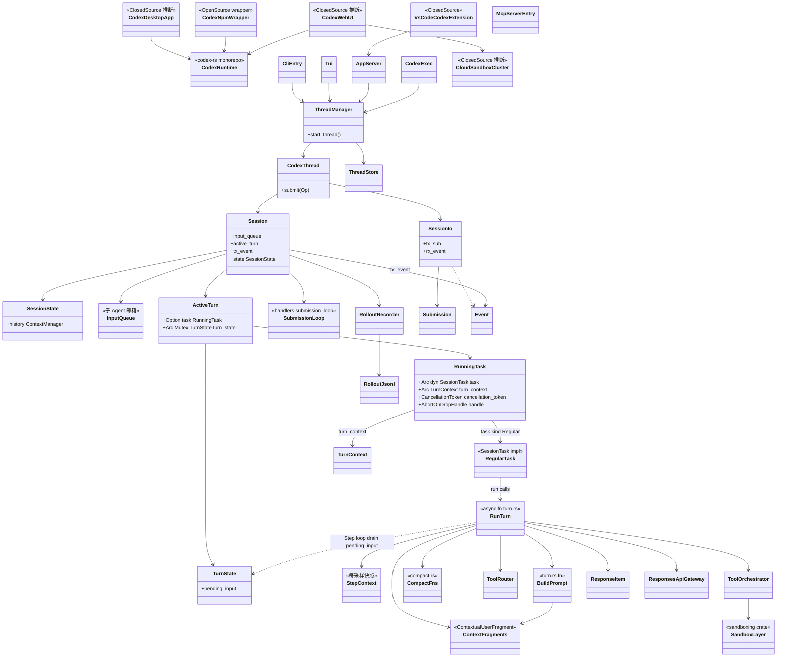
```mermaid
classDiagram
    class CodexWebUI {
        <<ClosedSource 推断>>
    }
    class CodexDesktopApp {
        <<ClosedSource 推断>>
    }
    class VsCodeCodexExtension {
        <<ClosedSource>>
    }
    class CodexNpmWrapper {
        <<OpenSource wrapper>>
    }

    class CodexRuntime {
        <<codex-rs monorepo>>
    }
    class CliEntry
    class Tui
    class AppServer
    class CodexExec
    class McpServerEntry

    class ThreadManager {
        +start_thread()
    }
    class CodexThread {
        +submit(Op)
    }
    class SessionIo {
        +tx_sub
        +rx_event
    }
    class Session {
        +input_queue
        +active_turn
        +tx_event
        +state SessionState
    }
    class SessionState {
        +history ContextManager
    }
    class InputQueue {
        <<子 Agent 邮箱>>
    }
    class ActiveTurn {
        +Option task RunningTask
        +Arc Mutex TurnState turn_state
    }
    class RunningTask {
        +Arc dyn SessionTask task
        +Arc TurnContext turn_context
        +CancellationToken cancellation_token
        +AbortOnDropHandle handle
    }
    class RegularTask {
        <<SessionTask impl>>
    }
    class TurnState {
        +pending_input
    }
    class SubmissionLoop {
        <<handlers submission_loop>>
    }
    class RunTurn {
        <<async fn turn.rs>>
    }
    class StepContext {
        <<每采样快照>>
    }
    class BuildPrompt {
        <<turn.rs fn>>
    }
    class ContextFragments {
        <<ContextualUserFragment>>
    }
    class CompactFns {
        <<compact.rs>>
    }
    class ToolRouter
    class ToolOrchestrator
    class RolloutRecorder
    class Submission
    class Event
    class ResponseItem
    class ThreadStore
    class RolloutJsonl
    class ResponsesApiGateway
    class CloudSandboxCluster {
        <<ClosedSource 推断>>
    }
    class SandboxLayer {
        <<sandboxing crate>>
    }

    VsCodeCodexExtension --> AppServer
    CodexDesktopApp --> CodexRuntime
    CodexNpmWrapper --> CodexRuntime
    CodexWebUI --> CodexRuntime
    CodexWebUI --> CloudSandboxCluster

    CliEntry --> ThreadManager
    Tui --> ThreadManager
    AppServer --> ThreadManager
    CodexExec --> ThreadManager

    ThreadManager --> CodexThread
    ThreadManager --> ThreadStore
    CodexThread --> Session
    CodexThread --> SessionIo

    SessionIo --> Submission
    SessionIo ..> Event
    Session --> SubmissionLoop
    Session --> SessionState
    Session --> InputQueue
    Session --> ActiveTurn
    Session --> RolloutRecorder
    ActiveTurn --> RunningTask
    ActiveTurn --> TurnState
    RunningTask --> RegularTask : task kind Regular
    RunningTask --> TurnContext : turn_context
    RegularTask ..> RunTurn : run calls
    RunTurn ..> TurnState : Step loop drain pending_input
    RolloutRecorder --> RolloutJsonl

    RunTurn --> StepContext
    RunTurn --> BuildPrompt
    RunTurn --> ContextFragments
    RunTurn --> CompactFns
    RunTurn --> ToolRouter
    RunTurn --> ToolOrchestrator
    RunTurn --> ResponsesApiGateway
    RunTurn --> ResponseItem
    Session --> Event : tx_event

    ToolOrchestrator --> SandboxLayer
    BuildPrompt --> ContextFragments
```


#### 1.2.3 运行时核心实体（源码级 classDiagram）

下图与 §1.2.2 互补：只画 **`codex-rs` 进程内** 的真实 Rust 类型与字段关系。领域术语 Turn/Step 对应 `ActiveTurn` + `run_turn` 与 `StepContext`。

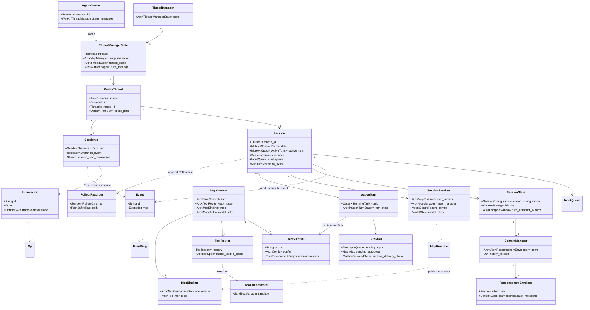
```mermaid
classDiagram
    direction TB

    class ThreadManager {
        +Arc~ThreadManagerState~ state
    }
    class ThreadManagerState {
        +HashMap threads
        +Arc~McpManager~ mcp_manager
        +Arc~ThreadStore~ thread_store
        +Arc~AuthManager~ auth_manager
    }
    class CodexThread {
        +Arc~Session~ session
        +SessionIo io
        +ThreadId thread_id
        +Option~PathBuf~ rollout_path
    }
    class SessionIo {
        +Sender~Submission~ tx_sub
        +Receiver~Event~ rx_event
        +Shared session_loop_termination
    }
    class Session {
        +ThreadId thread_id
        +Mutex~SessionState~ state
        +Mutex~Option~ActiveTurn~~ active_turn
        +SessionServices services
        +InputQueue input_queue
        +Sender~Event~ tx_event
    }
    class SessionState {
        +SessionConfiguration session_configuration
        +ContextManager history
        +AutoCompactWindow auto_compact_window
    }
    class SessionServices {
        +Arc~McpRuntime~ mcp_runtime
        +Arc~McpManager~ mcp_manager
        +AgentControl agent_control
        +ModelClient model_client
    }
    class ActiveTurn {
        +Option~RunningTask~ task
        +Arc~Mutex~TurnState~~ turn_state
    }
    class TurnState {
        +TurnInputQueue pending_input
        +HashMap pending_approvals
        +MailboxDeliveryPhase mailbox_delivery_phase
    }
    class TurnContext {
        +String sub_id
        +Arc~Config~ config
        +TurnEnvironmentSnapshot environments
    }
    class StepContext {
        +Arc~TurnContext~ turn
        +Arc~ToolRouter~ tool_router
        +Arc~McpBinding~ mcp
        +Arc~ModelInfo~ model_info
    }
    class ContextManager {
        +Arc~Vec~ResponseItemEnvelope~~ items
        +u64 history_version
    }
    class ResponseItemEnvelope {
        +ResponseItem item
        +Option~CodexHarnessMetadata~ metadata
    }
    class Submission {
        +String id
        +Op op
        +Option~W3cTraceContext~ trace
    }
    class Event {
        +String id
        +EventMsg msg
    }
    class RolloutRecorder {
        +Sender~RolloutCmd~ tx
        +PathBuf rollout_path
    }
    class ToolRouter {
        +ToolRegistry registry
        +Arc~ToolSpec~ model_visible_specs
    }
    class ToolOrchestrator {
        +SandboxManager sandbox
    }
    class McpBinding {
        +Arc~McpConnectionSet~ connections
        +Vec~ToolInfo~ tools
    }
    class AgentControl {
        +SessionId session_id
        +Weak~ThreadManagerState~ manager
    }

  ThreadManager "1" --> "1" ThreadManagerState
  ThreadManagerState "1" --> "*" CodexThread
  CodexThread "1" --> "1" Session
  CodexThread "1" --> "1" SessionIo
  Session "1" --> "1" InputQueue
  SessionIo ..> Submission : enqueue
  Session ..> Event : send_event / tx_event
  SessionIo ..> Event : rx_event subscribe
  Session "1" --> "1" SessionState
  Session "1" --> "1" SessionServices
  Session "0..1" --> "1" ActiveTurn
  SessionState "1" --> "1" ContextManager
  ActiveTurn "1" --> "1" TurnState
  ActiveTurn "0..1" --> "1" TurnContext : via RunningTask
  StepContext "1" --> "1" TurnContext
  StepContext "1" --> "1" ToolRouter
  StepContext "1" --> "1" McpBinding
  ContextManager "1" --> "*" ResponseItemEnvelope
  Submission "1" --> "1" Op
  Event "1" --> "1" EventMsg
  Session ..> RolloutRecorder : append RolloutItem
  ToolRouter ..> ToolOrchestrator : execute
  SessionServices "1" --> "1" McpRuntime
  McpRuntime ..> McpBinding : publish snapshot
  AgentControl ..> ThreadManagerState : Weak
```

#### 1.2.4 核心实体属性速查

| 实体 | 源码 | 核心属性 | 关系 |
|------|------|----------|------|
| **ThreadManager** | `core/src/thread_manager.rs` | `state: Arc<ThreadManagerState>` | 进程级；创建/恢复 Thread |
| **ThreadManagerState** | 同上 | `threads`, `mcp_manager`, `thread_store`, `auth_manager`, `skills_service` | 1:N `CodexThread` |
| **CodexThread** | `core/src/codex_thread.rs` | `session`, `io: SessionIo`, `rollout_path` | 客户端唯一句柄；`submit(Op)` |
| **SessionIo** | `core/src/session/mod.rs` | `tx_sub`, `rx_event`, `session_loop_termination` | SQ 入队 / EQ 订阅 |
| **Session** | `core/src/session/session.rs` | `thread_id`, `state`, `active_turn`, `services`, `input_queue`, `tx_event` | 0..1 `ActiveTurn` |
| **SessionState** | `core/src/state/session.rs` | `session_configuration`, `history: ContextManager`, `auto_compact_window` | 可变会话状态 |
| **SessionConfiguration** | `session/session.rs` | `provider`, `approval_policy`, `base_instructions`, `history_mode`, `parent_thread_id` | Turn 启动时冻结进 `TurnContext` |
| **SessionServices** | `core/src/state/service.rs` | `mcp_runtime`, `mcp_manager`, `agent_control`, `model_client`, `hooks` | 依赖注入容器 |
| **ActiveTurn** | `core/src/state/turn.rs` | `task: Option<RunningTask>`, `turn_state` | 与 `run_turn` 任务 1:1 |
| **TurnState** | 同上 | `pending_approvals`, `pending_input`, `mailbox_delivery_phase`, `token_usage_at_turn_start` | Turn 内可变 |
| **TurnContext** | `session/turn_context.rs` | `sub_id`, `config`, `environments`, `dynamic_tools` | 一整轮用户 Turn |
| **StepContext** | `session/step_context.rs` | `turn`, `tool_router`, `mcp`, `model_info`, `approval_policy` | **每次采样**冻结工具表 |
| **ContextManager** | `context_manager/history.rs` | `items: Arc<Vec<ResponseItemEnvelope>>`, `history_version` | 模型真相；常规 **只追加**；压缩/回滚 **整体 replace**（§5.8） |
| **Submission** | `protocol/src/protocol.rs` | `id`, `op: Op`, `trace`, `parent_turn_id` | `id` 关联 `Event.id` |
| **Op** | 同上 | `TurnInput`, `Interrupt`, `ExecApproval`, `Compact`, `ThreadRollback`, … | 控制面载荷 |
| **Event / EventMsg** | 同上 | `TurnStarted`, `AgentMessage*`, `ExecCommand*`, `ContextCompacted`, … | UI/审计投影 |
| **ResponseItem** | `protocol/src/models.rs` | `Message`, `FunctionCall`, `FunctionCallOutput`, `Reasoning`, `Compaction`, … | 模型历史条目 |
| **RolloutItem** | `history/src/lib.rs` | `SessionMeta`, `ResponseItem`, `EventMsg`, `Compacted`, `TurnContext`, … | jsonl 行类型 |
| **ToolRouter** | `tools/router.rs` | `registry`, `model_visible_specs` | Step 快照 |
| **ToolOrchestrator** | `tools/orchestrator.rs` | `sandbox: SandboxManager` | 审批 → 沙箱 → 执行 |
| **McpBinding** | `codex-mcp/src/binding.rs` | `connections`, `tools`, `calls` | Step 级 MCP 快照 |
| **AgentControl** | `agent/control.rs` | `session_id`, `manager: Weak<ThreadManagerState>` | 子 Agent spawn 树 |

**三层 ID / 真相对照**（与 §1.2.2 领域术语对齐）：

| 层级 | 概念实体 | 源码锚点 | 持久化 |
|------|----------|----------|--------|
| L0 | Thread | `ThreadId` | Rollout + ThreadStore |
| L1 | Session | `Session` struct | 进程内；配置写入 Rollout `SessionMeta` |
| L2 | Turn | `ActiveTurn` + `run_turn` | `TurnStarted` / `TurnComplete` 事件 |
| L3 | Step | `StepContext`（每次 `capture_step_context`） | `RolloutItem::TurnContext` 可选 |

#### 1.2.5 `codex-rs` 仓库分层目录

```text
openai/codex/codex-rs/
├── 表现层 Entry Points
│   ├── cli/              # 多子命令 main（tui / exec / app-server / mcp-server）
│   ├── tui/              # Ratatui 终端 UI
│   ├── app-server/       # JSON-RPC v2（IDE / 桌面壳）
│   ├── app-server-daemon/
│   ├── exec/             # 非交互批处理
│   └── mcp-server/       # 对外暴露 Codex 为 MCP Server
├── 编排层
│   └── core/
│       ├── thread_manager.rs   # ThreadManager / ThreadManagerState
│       ├── codex_thread.rs     # CodexThread 客户端句柄
│       └── session/            # Session, submission_loop, turn_input, run_turn
├── 领域内核 codex-core（同上 core/）
│   ├── state/            # SessionState, ActiveTurn, TurnState, SessionServices
│   ├── context/          # ContextualUserFragment 注入
│   ├── context_manager/  # ContextManager（模型 history）
│   ├── tools/            # ToolRouter, ToolOrchestrator, handlers
│   ├── compact.rs        # 压缩
│   ├── mcp.rs            # McpManager（配置投影）
│   ├── agent/            # AgentControl 多 Agent
│   └── rollout.rs        # RolloutRecorder 桥接
├── 协议层
│   ├── protocol/         # Op, EventMsg, Submission, Event, 配置类型
│   └── history/          # ResponseItemEnvelope, RolloutItem, InitialHistory
├── 持久化
│   ├── rollout/          # jsonl 读写
│   ├── thread-store/     # Thread 元数据索引
│   └── state-db/         # 可选 SQLite 状态
├── 扩展与安全
│   ├── codex-mcp/        # McpRuntime, McpBinding
│   ├── skills/           # Skill 发现与调用
│   ├── core-plugins/     # 插件宿主
│   ├── sandboxing/       # Seatbelt / Landlock / Windows sandbox
│   ├── execpolicy/       # 命令策略
│   └── guardian/         # 自动审批审查（在 core 内）
└── 外部依赖客户端
    ├── codex-api/ / codex-client/   # Responses API
    ├── codex-login/                 # AuthManager
    └── model-provider/              # 模型路由
```

#### 1.2.6 控制面与数据面分离

**控制面与数据面分离**：

| 平面 | 载体 | 谁读写 |
|------|------|--------|
| **控制面** | `Op` / `Submission` | 客户端写、session loop 读 |
| **数据面（模型）** | `ResponseItem[]` in `Prompt.input` | `run_turn` 只追加 |
| **数据面（UI）** | `EventMsg` 流 | Session 广播，客户端订阅 |
| **审计** | `RolloutItem` | `RolloutRecorder` append-only |

客户端 **永不** 直接调用 `run_turn`；唯一入口是 `SessionIo::submit(Op)`。

### 1.3 关键 crate 职责（精要）

| Crate | 路径 | 职责 |
|-------|------|------|
| `codex-core` | `core/` | Agent loop、Session、工具编排、压缩、context 注入 |
| `codex-protocol` | `protocol/` | `Op`、`EventMsg`、`ResponseItem`、配置类型 |
| `codex-cli` | `cli/` | 多子命令入口：TUI、exec、app-server、MCP |
| `codex-tui` | `tui/` | Ratatui 终端 UI，消费 Event 流 |
| `codex-app-server` | `app-server/` | IDE/桌面用的 JSON-RPC v2 |
| `codex-mcp` | `codex-mcp/` | MCP 连接管理、工具暴露 |
| `codex-thread-store` | `thread-store/` | Thread 元数据与历史加载 |
| `codex-rollout` | `rollout/` | Rollout 文件格式与读写 |
| `codex-skills` | `skills/` | Skill 发现、隐式/显式调用 |
| `codex-tools` | `tools/` | 工具名、ToolSpec 定义 |
| `codex-sandboxing` | `sandboxing/` | Seatbelt / Linux sandbox / Windows sandbox |

完整 crate 列表见 [ARCHITECTURE_PART2.md §6](./ARCHITECTURE_PART2.md#第6章-codex-rs-crate-地图)。

### 1.4 设计不变量（来自 AGENTS.md + 源码）

| # | 不变量 | 源码锚点 |
|---|--------|----------|
| 1 | 模型上下文 **禁止历史改写**，只能增量追加 | `AGENTS.md` Model visible context；`Session::record_conversation_items` |
| 2 | 注入 fragment 必须有 **上界**（单条 ≤10K tokens） | `core/context/*` + `ContextualUserFragment` |
| 3 | 所有注入 fragment 必须在 `core/context` 定义并实现 trait | `context/mod.rs` |
| 4 | Session **至多一个** ActiveTurn | `session/session.rs` `active_turn: Mutex<Option<ActiveTurn>>` |
| 5 | `Op` **不可 Clone**（测试只 snapshot 子集） | `thread_manager.rs` `capture_test_op` |

---

## 第2章：身份模型：Thread / Session / Turn / Step

### 2.0 设计原则

| 原则 | 含义 | 违反时的症状 |
|------|------|--------------|
| **Thread 是持久身份，Session 是运行时** | `ThreadId` 跨进程/Resume 不变；`Session` 仅进程内 | 把 Session 当持久 key，Resume 后状态丢失 |
| **控制面与执行面分离** | 客户端只持有 `CodexThread` + `SessionIo`，不直接调 `run_turn` | 绕过 SQ 导致审批/steer 失效 |
| **一 Session 一 ActiveTurn** | `active_turn: Mutex<Option<ActiveTurn>>` 互斥 | 双 Turn 并发破坏 history 顺序 |
| **Turn ID = Submission ID** | `new_submission_id()`（UUID v7）在 Start 时即 `turn_id` | 客户端用自造 ID 无法关联 EQ |
| **Step 是采样快照** | 每次 `capture_step_context` 冻结 tools/MCP | mid-turn 改 tools 导致 call/execute 不一致 |
| **Steer 不新开 run_turn** | 文字进 `TurnState.pending_input`，由 Step loop drain | 误以为每次 steer 是新 Turn |

### 2.1 术语对照

| 概念 | 含义 | 持久化 | 源码锚点 |
|------|------|--------|----------|
| **Thread** | 用户可见对话线程，`ThreadId` 唯一 | Rollout jsonl + ThreadStore | `thread_manager.rs` `NewThread` |
| **Session** | 内存运行时：MCP、工具、history、ActiveTurn | 配置快照写入 Rollout；进程内主体 | `session/session.rs` |
| **CodexThread** | 客户端句柄：`submit(Op)` + 订阅 `Event` | 无（指向 Session） | `codex_thread.rs` |
| **SessionIo** | SQ/EQ 通道端点，与 Session 状态分离 | 无 | `session/mod.rs` `SessionIo` |
| **Turn** | 一次 `TurnInput` → `TurnComplete`/`TurnAborted` | Rollout 边界事件 | `session/turn.rs` `run_turn` |
| **Step** | Turn 内一次采样周期（`run_sampling_request`） | `StepContext` 快照 | `step_context.rs` |

> 历史命名：`Conversation` → `Thread`（`lib.rs` 有 `#[deprecated]` 别名）。

### 2.2 身份 ER 图

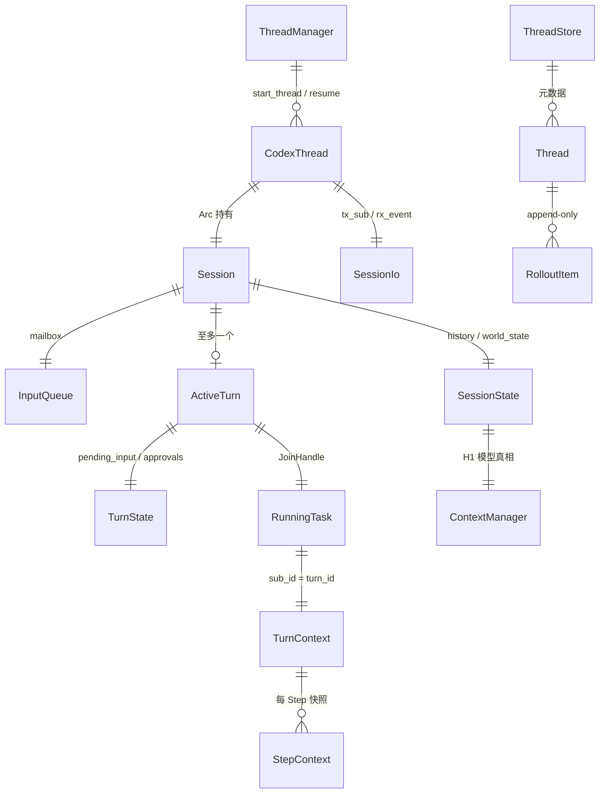
```mermaid
erDiagram
    ThreadManager ||--o{ CodexThread : "start_thread / resume"
    CodexThread ||--|| Session : "Arc 持有"
    CodexThread ||--|| SessionIo : "tx_sub / rx_event"
    Session ||--|| InputQueue : "mailbox"
    Session ||--o| ActiveTurn : "至多一个"
    ActiveTurn ||--|| TurnState : "pending_input / approvals"
    ActiveTurn ||--|| RunningTask : "JoinHandle"
    RunningTask ||--|| TurnContext : "sub_id = turn_id"
    TurnContext ||--o{ StepContext : "每 Step 快照"
    Session ||--|| SessionState : "history / world_state"
    SessionState ||--|| ContextManager : "H1 模型真相"
    Thread ||--o{ RolloutItem : "append-only"
    ThreadStore ||--o{ Thread : "元数据"
```

### 2.3 Thread 生命周期状态机

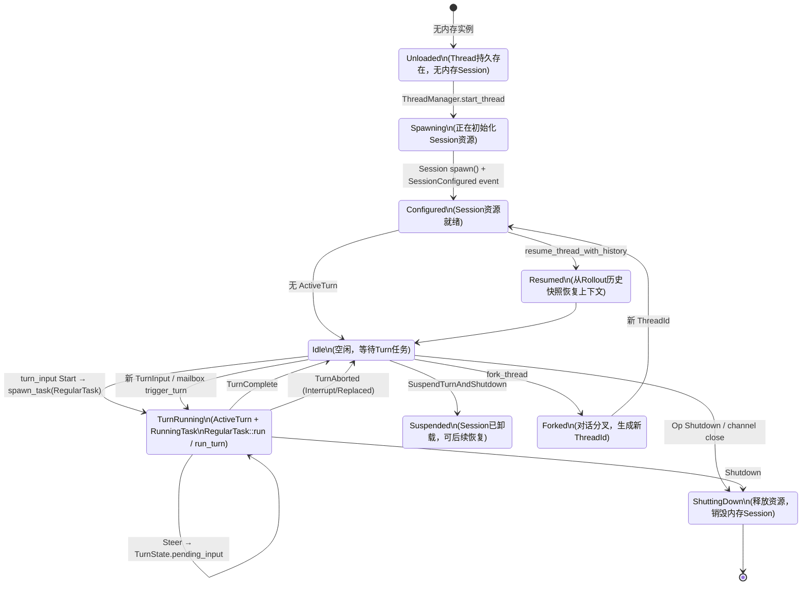
```mermaid
stateDiagram-v2
    state "Unloaded\n(Thread持久存在，无内存Session)" as Unloaded
    state "Spawning\n(正在初始化Session资源)" as Spawning
    state "Configured\n(Session资源就绪)" as Configured
    state "Idle\n(空闲，等待Turn任务)" as Idle
    state "TurnRunning\n(ActiveTurn + RunningTask\nRegularTask::run / run_turn)" as TurnRunning
    state "Suspended\n(Session已卸载，可后续恢复)" as Suspended
    state "Resumed\n(从Rollout历史快照恢复上下文)" as Resumed
    state "Forked\n(对话分叉，生成新ThreadId)" as Forked
    state "ShuttingDown\n(释放资源，销毁内存Session)" as ShuttingDown

    [*] --> Unloaded: 无内存实例
    Unloaded --> Spawning: ThreadManager.start_thread
    Spawning --> Configured: Session spawn() + SessionConfigured event
    Configured --> Idle: 无 ActiveTurn
    Idle --> TurnRunning: turn_input Start → spawn_task(RegularTask)
    TurnRunning --> TurnRunning: Steer → TurnState.pending_input
    TurnRunning --> Idle: TurnComplete
    TurnRunning --> Idle: TurnAborted (Interrupt/Replaced)
    Idle --> TurnRunning: 新 TurnInput / mailbox trigger_turn
    Idle --> Suspended: SuspendTurnAndShutdown
    Configured --> Resumed: resume_thread_with_history
    Resumed --> Idle
    Idle --> Forked: fork_thread
    Forked --> Configured: 新 ThreadId
    Idle --> ShuttingDown: Op Shutdown / channel close
    TurnRunning --> ShuttingDown: Shutdown
    ShuttingDown --> [*]
```
**模块路径**：

| 阶段 | 文件 | 关键符号 |
|------|------|----------|
| 创建 | `core/src/thread_manager.rs` | `start_thread`, `NewThread` |
| Session 孵化 | `core/src/session/mod.rs` | `Session::spawn`, `submission_loop` spawn |
| 恢复 | `core/src/thread_manager.rs` | `resume_thread_with_history` |
| Fork | `core/src/thread_manager.rs` | `ForkSnapshot`, `fork_thread` |
| 关闭 | `core/src/session/handlers.rs` | `shutdown`, `shutdown_session_runtime` |

### 2.4 Session / CodexThread / SessionIo 三层

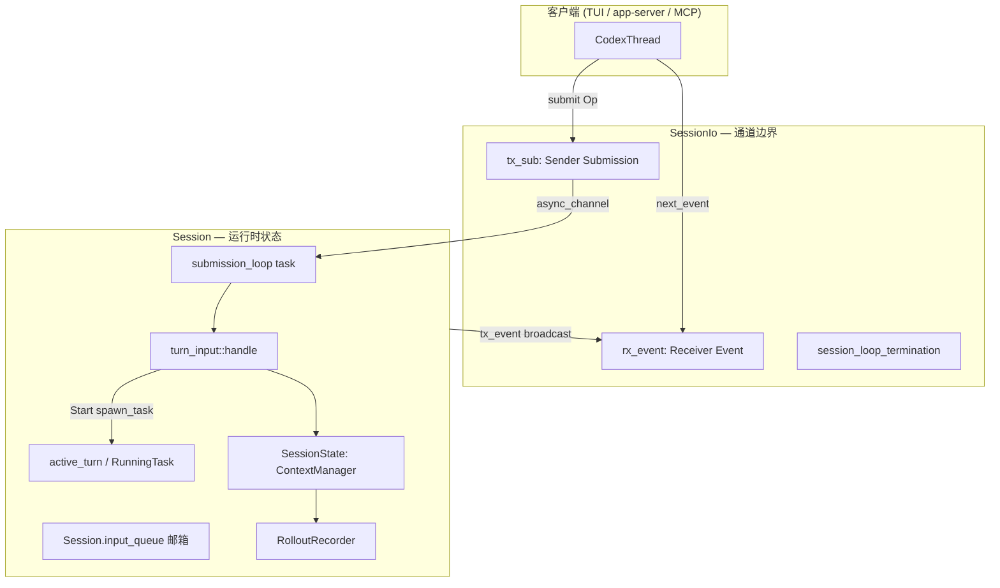
```mermaid
flowchart TB
    subgraph Client["客户端 (TUI / app-server / MCP)"]
        CT[CodexThread]
    end
    subgraph IO["SessionIo — 通道边界"]
        TX[tx_sub: Sender Submission]
        RX[rx_event: Receiver Event]
        TERM[session_loop_termination]
    end
    subgraph Runtime["Session — 运行时状态"]
        SL[submission_loop task]
        TI[turn_input::handle]
        AT[active_turn / RunningTask]
        IQ[Session.input_queue 邮箱]
        ST[SessionState: ContextManager]
        REC[RolloutRecorder]
    end
    CT -->|submit Op| TX
    TX -->|async_channel| SL
    SL --> TI
    TI -->|Start spawn_task| AT
    TI --> ST
    ST --> REC
    Runtime -->|tx_event broadcast| RX
    CT -->|next_event| RX
```

> **与 §1.2.1 对齐**：`submission_loop` 从 channel **接收端**（与 `tx_sub` 成对）读 `Submission`，在 **`Session`** 上执行 handler；EQ 由 `Session.tx_event` 发出，经 `SessionIo.rx_event` 回到 `CodexThread`。

| 类型 | 职责 | 为何分离 |
|------|------|----------|
| **`Session`** | 全部业务状态：history、MCP、工具、压缩、ActiveTurn | 单一大对象，内部 `Mutex` 保护 |
| **`SessionIo`** | 仅 `tx_sub` / `rx_event` / `agent_status` watch / 终止 future | 丢弃所有 `tx_sub` 持有者可终止 loop，而不泄漏 Session |
| **`CodexThread`** | 对外 API：`submit`, `config_snapshot`, `shutdown_and_wait` | 客户端不接触 `Session` 内部；便于 ThreadStore 持久化包装 |

```371:384:codex/codex-rs/core/src/session/mod.rs
/// Queue and lifecycle endpoints for a running [`Session`].
///
/// Runtime state lives on `Session`; keeping these endpoints separate lets all
/// submission senders be dropped to terminate the session loop.
pub(crate) struct SessionIo {
    pub(crate) tx_sub: Sender<Submission>,
    pub(crate) rx_event: Receiver<Event>,
    pub(crate) agent_status: watch::Receiver<AgentStatus>,
    pub(crate) session_loop_termination: SessionLoopTermination,
}
```

```202:210:codex/codex-rs/core/src/codex_thread.rs
pub struct CodexThread {
    pub(crate) session: Arc<Session>,
    pub(crate) io: SessionIo,
    pub(crate) session_source: SessionSource,
    session_configured: SessionConfiguredEvent,
    rollout_path: Option<PathBuf>,
    // ...
}
```

### 2.5 Session 结构（源码）

```39:71:codex/codex-rs/core/src/session/session.rs
pub(crate) struct Session {
    pub(crate) thread_id: ThreadId,
    pub(crate) installation_id: String,
    pub(super) tx_event: Sender<Event>,
    pub(super) agent_status: watch::Sender<AgentStatus>,
    pub(super) state: Mutex<SessionState>,
    pub(crate) conversation: Arc<RealtimeConversationManager>,
    pub(crate) active_turn: Mutex<Option<ActiveTurn>>,
    pub(crate) input_queue: InputQueue,
    // ...
}
```

`SessionIo` 只持有 SQ/EQ **通道端点**；`Session.input_queue` 是 **子 Agent 邮箱**，**不是** `VecDeque<Submission>`。见 [§1.2.0](#120-图示与术语公约全文档强制)。

### 2.6 双循环：`submission_loop`（外层调度）与 `run_turn`（内层 Agent）

系统里存在 **两套独立的异步循环**，极易混淆：

| 循环 | 源码 | Tokio 任务 | 职责 |
|------|------|------------|------|
| **外层调度** | `handlers.rs::submission_loop` | `session_loop` | SQ `recv` → dispatch；**不**跑 LLM/工具 |
| **内层 Agent** | `turn.rs::run_turn` | `RunningTask` | Step 采样；Steer drain `pending_input` |

**仅一层 Submission 缓冲**：`async_channel`（SQ）。`submission_loop` **直接 dispatch**，无 `VecDeque<Submission>`。

#### 设计目的

若在 `submission_loop` 内 `run_turn(...).await`（❌），LLM/工具耗时期间无法处理 `Op::Interrupt`、审批、新 `Submission`。

**源码**：`spawn_task` → `tokio::spawn(RegularTask::run)` **不 await**；`turn_input` oneshot 立即返回；`Op::Interrupt` → `interrupt_task` → `abort_all_tasks(Interrupted)` → `cancellation_token.cancel()`。

| 能力 | 机制 |
|------|------|
| 新 Start 抢占 | `abort_all_tasks(Replaced)`（Steer **不** spawn） |
| 单回合互斥 | `active_turn: Mutex<Option<ActiveTurn>>` |
| 并行调度 | `submission_loop` 与 `RunningTask` 同时存活 |

> **§2.8 时序** = **点火启动**，非完整 Agent；Step loop 见 [§4.3](#43-l3run_turn--turn-级外层循环step-loop)。

#### Start 点火步骤

| 步骤 | 目的 |
|------|------|
| `new_turn_with_sub_id` | turn_id / EQ 关联 |
| `spawn_task` + `abort_all_tasks(Replaced)` | 后台任务；新 Start 抢占 |
| `get_or_insert ActiveTurn` | 繁忙占位 |
| `tokio::spawn`；`task = Some(RunningTask)` | **submission_loop 立刻回到 recv** |
| `RegularTask::run` → `run_turn` | 内层 Agent 循环（本图不展开） |
| `Op::Interrupt` | 独立 Submission，并行中断 |
| `TurnAborted` / clear `active_turn` | 回到 Idle |

```text
submission_loop: recv → turn_input / interrupt / 审批 → recv
                      ╲ Start → RunningTask → run_turn { Step loop }
```

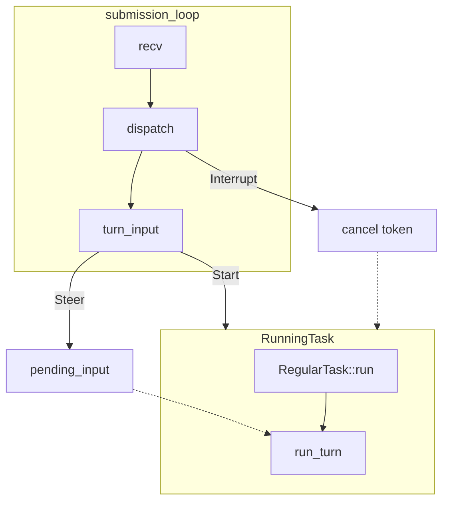
```mermaid
flowchart TB
    subgraph OUTER[submission_loop]
        R[recv] --> D[dispatch] --> TI[turn_input]
    end
    subgraph INNER[RunningTask]
        RK[RegularTask::run] --> RT[run_turn]
    end
    TI -->|Start| INNER
    TI -->|Steer| P[pending_input]
    P -.-> RT
    D -->|Interrupt| X[cancel token]
    X -.-> INNER
```

**误述对照**：❌ 双层 Submission 队列 · ❌ `Op::CancelTurn`（应为 `Interrupt`）· ❌ `active_turn.items` · ❌「Session 主线程」（均为 **Tokio 任务**）。

### 2.7 ThreadManager 职责

```216:228:codex/codex-rs/core/src/thread_manager.rs
pub struct ThreadManager {
    state: Arc<ThreadManagerState>,
}
pub struct StartThreadOptions {
    pub config: Config,
    pub initial_history: InitialHistory,
    pub history_mode: Option<ThreadHistoryMode>,
    // ...
}
```

| 操作 | API | 结果 |
|------|-----|------|
| 新建 | `start_thread()` | `NewThread { thread_id, thread: Arc<CodexThread>, session_configured }` |
| 恢复 | `resume_thread_with_history()` | `InitialHistory::Resumed` 重建 history |
| Fork | `fork_thread(ForkSnapshot)` | 新 `ThreadId`，可选截断/中断语义 |

### 2.8 ActiveTurn：spawn 与 cancel（点火时序）

#### `spawn` 在本章指什么？

文档里的 **spawn** 不是泛称「创建对象」，在 Codex 里通常指 **在 Tokio 运行时上再挂一个并发任务，让它在后台跑，调用方不等待它结束**。和「新建线程 / fork 进程」也不是一回事（仍是同一进程内的 async 任务）。

| 名称 | 层级 | 做什么 | 何时发生 |
|------|------|--------|----------|
| **`Session::spawn`** | Thread 冷启动 | 创建 `Session` + 启动 **`submission_loop`** 那个长期 Tokio 任务 | `ThreadManager.start_thread` 一次 |
| **`spawn_task`** | 用户 Turn **Start** | 业务入口：`abort_all_tasks(Replaced)` → `start_task` | `turn_input` 判定空闲、开新回合 |
| **`start_task`** | 同上（内部） | 准备 `ActiveTurn`、`TurnContext`，最后 **`tokio::spawn { RegularTask::run }`** | `spawn_task` 内部 |
| **`tokio::spawn`** | 真正 **点火** | 把 `RegularTask::run`（进而 `run_turn`）丢进 **新的后台任务**；`submission_loop` **立即返回** | `start_task` 末尾 |
| **`RunningTask`** | 句柄 | `ActiveTurn.task = Some(...)`，含 `AbortOnDropHandle`、`cancellation_token` | spawn 成功后保存，供 **cancel** |

**不是 spawn 的（勿混）**：

- **Steer**：只写 `TurnState.pending_input`，**不**再 `spawn_task`。
- **`ActiveTurn` 占位**：`get_or_insert ActiveTurn` 是内存结构，不等于「已经点火」；要点火必须有 `tokio::spawn` + `task = Some(RunningTask)`。
- **cancel**：`Op::Interrupt` → `interrupt_task` → `abort_all_tasks` → **`cancellation_token.cancel()`**，让已 spawn 的后台任务协作式退出。

```text
Start 路径一句话：
  spawn_task ≈ 「请 Session 安排一次后台 Turn」
  tokio::spawn ≈ 「真正把 RegularTask::run 丢到后台跑」
```

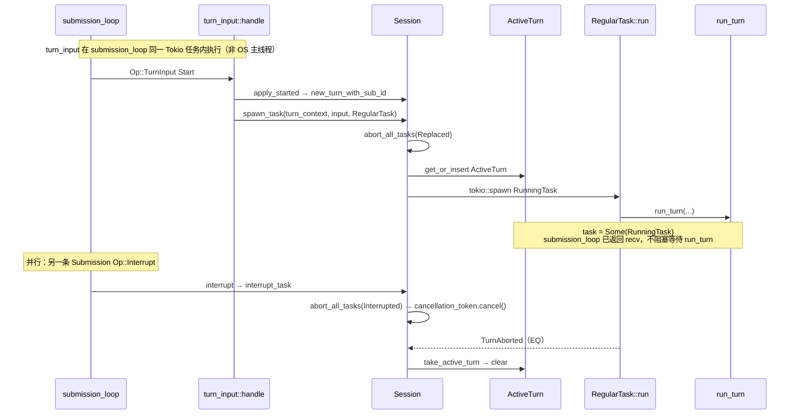
```mermaid
sequenceDiagram
    participant SL as submission_loop
    participant TI as turn_input::handle
    participant S as Session
    participant AT as ActiveTurn
    participant RK as RegularTask::run
    participant RT as run_turn

    Note over SL,TI: turn_input 在 submission_loop 同一 Tokio 任务内执行（非 OS 主线程）

    SL->>TI: Op::TurnInput Start
    TI->>S: apply_started → new_turn_with_sub_id
    TI->>S: spawn_task(turn_context, input, RegularTask)
    S->>S: abort_all_tasks(Replaced)
    S->>AT: get_or_insert ActiveTurn
    S->>RK: tokio::spawn RunningTask
    RK->>RT: run_turn(...)
    Note over AT,RT: task = Some(RunningTask)<br/>submission_loop 已返回 recv，不阻塞等待 run_turn

    Note over SL: 并行：另一条 Submission Op::Interrupt
    SL->>S: interrupt → interrupt_task
    S->>S: abort_all_tasks(Interrupted) → cancellation_token.cancel()
    RK-->>S: TurnAborted（EQ）
    S->>AT: take_active_turn → clear
```
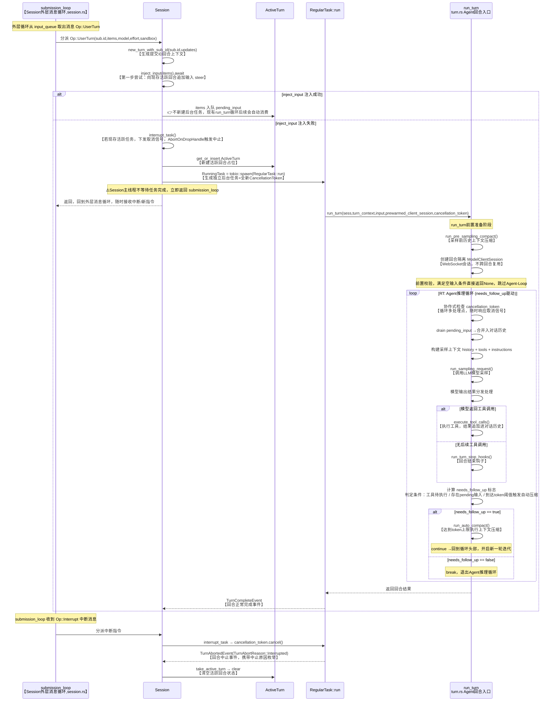
```mermaid
sequenceDiagram
    participant SL as submission_loop<br/>【Session外层消息循环,session.rs】
    participant S as Session
    participant AT as ActiveTurn
    participant RK as RegularTask::run
    participant RT as run_turn<br/>turn.rs Agent回合入口

    Note over SL: 外层循环从 input_queue 取出消息 Op::UserTurn
    SL->>S: 分派 Op::UserTurn(sub.id,items,model,effort,sandbox)

    S->>S: new_turn_with_sub_id(sub.id,updates)<br/>【生成提交ID回合上下文】
    S->>S: inject_input(items).await<br/>【第一步尝试：向现存活跃回合追加输入 steer】

    alt inject_input 注入成功
        S->>AT: items 入队 pending_input<br/>👉不新建后台任务，现有run_turn循环后续会自动消费
    else inject_input 注入失败
        S->>S: interrupt_task()<br/>【若现存活跃任务，下发取消信号，AbortOnDropHandle触发中止】
        S->>AT: get_or_insert ActiveTurn<br/>【新建活跃回合占位】
        S->>RK: RunningTask = tokio::spawn(RegularTask::run)<br/>【生成独立后台任务+全新CancellationToken】
        Note over S: ⚠️Session主线程不等待任务完成，立即返回 submission_loop
        S-->>SL: 返回，回到外层消息循环，随时接收中断/新指令

        %% --------后台子任务 run_turn 完整链路--------
        RK->>RT: run_turn(sess,turn_context,input,prewarmed_client_session,cancellation_token)
        Note over RT: run_turn前置准备阶段
        RT->>RT: run_pre_sampling_compact()<br/>【采样前历史上下文压缩】
        RT->>RT: 创建回合隔离 ModelClientSession<br/>【WebSocket会话，不跨回合复用】
        Note over RT: 前置校验，满足空输入条件直接返回None，跳过Agent‑Loop
        loop RT: Agent推理循环 (needs_follow_up驱动)
            RT->>RT: 协作式检查 cancellation_token<br/>【循环多处埋点，随时响应取消信号】
            RT->>RT: drain pending_input →合并入对话历史
            RT->>RT: 构建采样上下文 history + tools + instructions
            RT->>RT: run_sampling_request()<br/>【调用LLM模型采样】
            RT->>RT: 模型输出结果分发处理
            alt 模型返回工具调用
                RT->>RT: execute_tool_calls()<br/>【执行工具，结果追加进对话历史】
            else 无后续工具调用
                RT->>RT: run_turn_stop_hooks()<br/>【回合结束钩子】
            end
            RT->>RT: 计算 needs_follow_up 标志<br/>判定条件：工具待执行 / 存在pending输入 / 到达token阈值触发自动压缩
            alt needs_follow_up == true
                RT->>RT: run_auto_compact()<br/>【达到token上限执行上下文压缩】
                Note over RT: continue →回到循环头部，开启新一轮迭代
            else needs_follow_up == false
                Note over RT: break，退出Agent推理循环
            end
        end
        RT-->>RK: 返回回合结果
        RK-->>S: TurnCompleteEvent<br/>【回合正常完成事件】
    end

    %% --------异步中断路径：可在Agent‑Loop任意时刻触发，独立链路--------
    Note over SL: submission_loop 收到 Op::Interrupt 中断消息
    SL->>S: 分派中断指令
    S->>RK: interrupt_task → cancellation_token.cancel()
    RK-->>S: TurnAbortedEvent(TurnAbortReason::Interrupted)<br/>【回合中止事件，携带中止原因枚举】

    S->>AT: take_active_turn → clear<br/>【清空活跃回合状态】
```
**`ActiveTurn` 结构**（`state/turn.rs`）：

| 字段 | 类型 | 作用 |
|------|------|------|
| `task` | `Option<RunningTask>` | 后台 `RegularTask::run`（其内调用 `run_turn`）的 `AbortOnDropHandle` |
| `turn_state` | `Arc<Mutex<TurnState>>` | 审批 oneshot、mailbox 阶段、token 累计 |

**`RunningTask`** 还携带：`cancellation_token`、`turn_context`、`AgentExecutionGuard`（多 Agent 并发限制）、OTel `Timer`。

**取消路径**（`tasks/mod.rs` `abort_all_tasks`）：

| `TurnAbortReason` | 触发源 | 后续 |
|-------------------|--------|------|
| `Interrupted` | `Op::Interrupt`、Guardian Abort | 可能 `maybe_start_turn_for_pending_work` |
| `Replaced` | 新 `spawn_task` 替换旧 Turn | 清空 pending approvals |
| `BudgetLimited` | Rollout 预算 | 同 Interrupted 处理分支 |

### 2.9 Turn 与 Step 的关系

```139:151:codex/codex-rs/core/src/session/turn.rs
/// Takes initial turn input and runs a loop where, at each sampling request,
/// the model replies with either function calls or an assistant message.
/// While it is possible for the model to return multiple items in a single
/// sampling request, in practice we generally one item per sampling request.
```

| 层级 | 边界 | 典型次数 |
|------|------|----------|
| **Turn** | `RegularTask::run` 从开始到返回（其内可调用 `run_turn` 一次或多次） | 每用户 **Start** 提交 1 个 `RunningTask`（steer 不新开） |
| **Step** | `run_turn` 内层 `loop` 每次迭代 | 1 + 工具 follow-up 次数 |
| **HTTP 采样** | `run_sampling_request` 内 retry loop | 可重试 |
| **SSE 事件** | `try_run_sampling_request` 单响应流 | 流内多 tool in_flight |

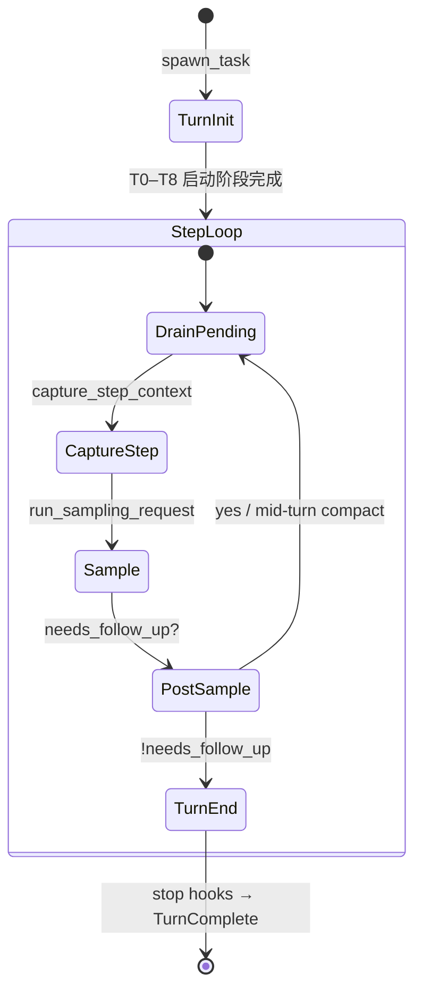
```mermaid
stateDiagram-v2
    [*] --> TurnInit: spawn_task
    TurnInit --> StepLoop: T0–T8 启动阶段完成
    state StepLoop {
        [*] --> DrainPending
        DrainPending --> CaptureStep: capture_step_context
        CaptureStep --> Sample: run_sampling_request
        Sample --> PostSample: needs_follow_up?
        PostSample --> DrainPending: yes / mid-turn compact
        PostSample --> TurnEnd: !needs_follow_up
    }
    TurnEnd --> [*]: stop hooks → TurnComplete
```

---

## 第3章：SQ/EQ 协议

### 3.0 设计原则

| 原则 | 含义 |
|------|------|
| **异步双队列** | 客户端写 SQ、读 EQ；Core 永不阻塞客户端等待采样结束（TurnInput 用 oneshot 仅回路由决策） |
| **Submission 不可 Clone** | 测试用 `capture_test_op` snapshot 子集；防止重复投递 |
| **Event.id 关联 Submission** | Turn 生命周期事件的 `id` = 发起该 Turn 的 `submission.id` |
| **控制 Op 与模型 history 分离** | `Op`/`Submission` 不进 `ResponseItem[]` |
| **非穷尽 Op 枚举** | `Op` 为 `non_exhaustive`，未知 Op 在 loop 中静默忽略 |

### 3.1 通道与队列：SQ / EQ / `input_queue` / `pending_input`

Codex 里和「队列」相关的有四样东西，**不要混成一个 `InputQueue`**：

| 名称 | 挂在哪个对象 | Rust 类型 / 字段 | 里面放什么 | 作用 | 生命周期 |
|------|-------------|------------------|------------|------|----------|
| **SQ**（Submission Queue） | **`SessionIo`** | `tx_sub` / `rx_sub`（`async_channel`） | `Submission { id, op: Op, … }` | **控制面入口**：客户端 `submit(Op)` → `submission_loop` **串行**处理；含 `TurnInput`、`Interrupt`、审批回复等 | Session 存活 |
| **EQ**（Event Queue） | **`Session`** + **`SessionIo`** | `Session.tx_event` → `SessionIo.rx_event`（broadcast） | `Event { id, msg: EventMsg }` | **事件面出口**：Turn 生命周期、流式增量、工具/审批事件推给 TUI / IDE | Session 存活 |
| **`Session.input_queue`** | **`Session`** | `InputQueue`（`session/input_queue.rs`） | `mailbox_pending_mails`（`InterAgentCommunication`）+ `watch::InputQueueActivity` | **子 Agent 邮箱**：邮件先入队；可 `maybe_start_turn` 或 `drain_mailbox` 进 Turn | Session 存活（**不**随 Turn 销毁） |
| **`TurnState.pending_input`** | **`ActiveTurn` → `TurnState`** | `TurnInputQueue`（同文件） | `Vec<TurnInput>`：`UserInput` / `ResponseItem` / `InterAgentCommunication` | **同 Turn 内待合并输入**：Steer 用户话、程序化注入；`run_turn` Step loop **drain** 后 `record` 进 history | 仅 **ActiveTurn** 存在时有内容；Turn 结束 **清空** |

**不是队列、但常一起问**：模型 transcript 在 **`SessionState.history`**（`ContextManager`），只追加，由 `record_conversation_items` 写入——这是 **history**，不是上述任一队列。

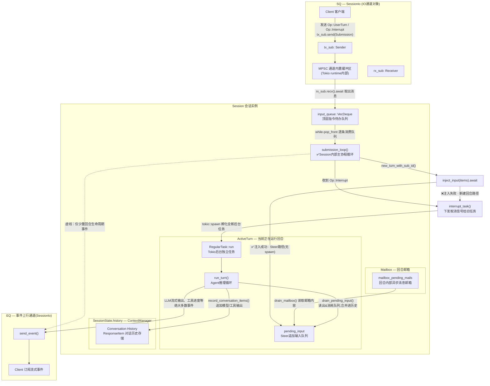
```mermaid
flowchart TB
%% ===================== IO通道层 SQ：SessionIo，只存放通道句柄 =====================
   subgraph SQ["SQ — SessionIo (IO通道对象)"]
      Client["Client 客户端"]
      TX["tx_sub: Sender<Submission>"]
      CH_BUF["MPSC 通道内置缓冲区<br/>(Tokio runtime内部)"]
      RX["rx_sub: Receiver<Submission>"]
   end

%% ===================== Session 业务对象（核心容器） =====================
   subgraph SESSION["Session 会话实例"]
      INPUT_Q["input_queue: VecDeque<Submission><br/>顶层指令待办队列"]
      SL["submission_loop()<br/>✅Session内部主协程循环"]

   %% 回合邮箱缓冲（独立缓冲区）
      subgraph MAILBOX["Mailbox — 回合邮箱"]
         MAIL["mailbox_pending_mails<br/>回合内部异步消息邮箱"]
      end

   %% ActiveTurn 活跃回合容器
      subgraph ACTIVE_TURN["ActiveTurn — 当前正在运行回合"]
         PIN["pending_input<br/>Steer追加输入队列"]
         BG_TASK["RegularTask::run<br/>Tokio后台独立任务"]
         RT["run_turn()<br/>Agent推理循环"]
      end

   %% 对话历史上下文管理器
      subgraph HISTORY["SessionState.history — ContextManager"]
         HIST["Conversation History<br/>ResponseItem 对话历史存储"]
      end
   end

%% ===================== 上行：事件推送通道 EQ =====================
   subgraph EQ["EQ — 事件上行通道(SessionIo)"]
      EV_SEND["send_event()"]
      Client_Sub["Client 订阅流式事件"]
   end

%% ======================== 下行数据流链路 ========================
   Client -->|"发送 Op::UserTurn / Op::Interrupt<br/>tx_sub.send(Submission)"| TX
   TX --> CH_BUF
   CH_BUF -->|"rx_sub.recv().await 取出消息"| INPUT_Q
   INPUT_Q -->|"while‑pop_front 逐条消费队列"| SL

%% ======================== submission_loop 收到 UserTurn 分支逻辑 ========================
   SL -->|"new_turn_with_sub_id()"| INJ["inject_input(items).await"]

   INJ --"✅注入成功 · Steer路径(无spawn)"--> PIN
    INJ --"❌注入失败 · 新建回合路径"--> INT["interrupt_task()<br/>下发取消信号给旧任务"]
INT -->|"tokio::spawn 孵化全新后台任务"| BG_TASK
BG_TASK --> RT

%% ======================== 回合邮箱 → pending_input ========================
MAIL -->|"drain_mailbox() 读取邮箱内容"| PIN

%% ======================== run_turn Agent循环内部数据流 ========================
RT -->|"drain_pending_input()<br/>读出&消耗队列,合并进历史"| PIN
RT -->|"record_conversation_items() 追加模型/工具输出"| HIST

%% ======================== 上行事件推送链路 ========================
RT -->|"LLM流式输出、工具进度等绝大多数事件"| EV_SEND
SL -.->|"虚线：仅少量回合生命周期事件"| EV_SEND
EV_SEND --> Client_Sub

%% ======================== 异步中断独立路径 ========================
SL -->|"收到 Op::Interrupt"| INT
```
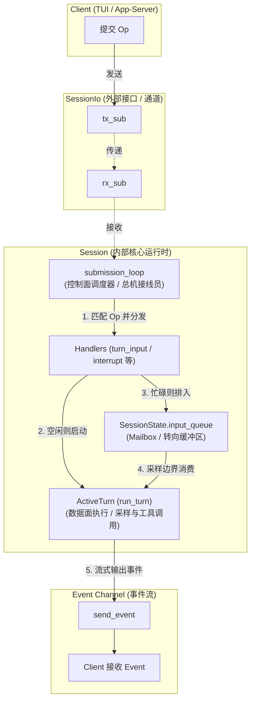
```mermaid
flowchart TB
   subgraph Client["Client (TUI / App-Server)"]
      C[提交 Op]
   end

   subgraph IO["SessionIo (外部接口 / 通道)"]
      TX["tx_sub"]
      RX["rx_sub"]
      C -->|发送| TX
      TX -.传递.-> RX
   end

   subgraph SESS["Session (内部核心运行时)"]
      SL["submission_loop<br/>(控制面调度器 / 总机接线员)"]
      RX -.接收.-> SL

      MB["SessionState.input_queue<br/>(Mailbox / 转向缓冲区)"]

      ATASK["ActiveTurn (run_turn)<br/>(数据面执行 / 采样与工具调用)"]

      HANDLERS["Handlers (turn_input / interrupt 等)"]

      SL -->|1. 匹配 Op 并分发| HANDLERS
      HANDLERS -->|2. 空闲则启动| ATASK
      HANDLERS -->|3. 忙碌则排入| MB
      MB -->|4. 采样边界消费| ATASK
   end

   subgraph EQ["Event Channel (事件流)"]
      ATASK -->|5. 流式输出事件| EV[send_event]
      EV --> UI[Client 接收 Event]
   end
```

#### SQ / EQ（协议双通道）

协议注释中的 SQ/EQ 是**异步双通道模式**；源码实现是 channel + broadcast，**没有**名为 `SubmissionQueue` / `EventQueue` 的 struct：

```1:4:codex/codex-rs/protocol/src/protocol.rs
//! Uses a SQ (Submission Queue) / EQ (Event Queue) pattern to asynchronously communicate
//! between user and agent.
```

| | 写入方 | 读取方 |
|---|--------|--------|
| **SQ** | `CodexThread::submit` → `SessionIo.tx_sub` | `submission_loop` 读 `rx_sub` |
| **EQ** | `Session::send_event` / `deliver_event_raw` | 客户端 `SessionIo.rx_event` |

要点：

- `submission_loop` 串行处理每个 `Submission`；`Op::TurnInput` 在 `turn_input::handle` **oneshot 立即返回**（`Started` / `Steered` / `NotSubmitted`），**不**等待 `run_turn` 结束。
- Turn 运行中用户再发话：`StartOrSteer` → **Steer** → 写入 **`TurnState.pending_input`**，**不是**在 SQ 里等 Idle 再开新 Turn。
- EQ 事件同时可写入 Rollout（`RolloutRecorder`），与客户端订阅并行。

#### `Session.input_queue`（`InputQueue`）

```76:80:codex/codex-rs/core/src/session/input_queue.rs
/// Session-scoped pending input storage and active-turn mailbox delivery coordination.
pub(crate) struct InputQueue {
    activity_tx: watch::Sender<InputQueueActivity>,
    mailbox_pending_mails: Mutex<VecDeque<PendingMailboxCommunication>>,
}
```

| 职责 | 说明 |
|------|------|
| **邮箱** | `Op::InterAgentCommunication` → `enqueue_mailbox_communication` |
| **Activity 通知** | `InputQueueActivity::Mailbox` / `Steer` → `maybe_start_turn_for_pending_work`、UI 观察是否有待处理工作 |
| **与 steer 的关系** | Steer **不**进 `InputQueue`；邮箱邮件经 `drain_mailbox_input_items` 可并入 **`pending_input`** |

#### `TurnState.pending_input`（`TurnInputQueue`）

```70:74:codex/codex-rs/core/src/session/input_queue.rs
pub(crate) struct TurnInputQueue {
    items: Vec<TurnInput>,
}
```

| `TurnInput` 变体 | 来源 | drain 后 |
|------------------|------|----------|
| `UserInput` | `TurnInput` Steer 的用户文字 | `record_conversation_items` → `ResponseItem`（**会进模型 history**） |
| `ResponseItem` | 程序化注入 | 同上 |
| `InterAgentCommunication` | 子 Agent 邮件（常经 mailbox） | 可能先入 `input_queue` 再 drain 到此 |

`run_turn` 用 **`can_drain_pending_input`** 控制何时 drain（首圈通常 `false`，避免与 T8 首条 user 重复 record）。**不是**每个 micro-step 都立刻合并 steer；首轮采样前、auto-compact 后等场景会推迟 drain（见 `session/turn.rs` 注释）。

#### 与 PI「双队列」的对照（Steer vs Turn 后排队）

PI 等运行时常见 **两个用户侧队列**：

| PI 概念 | 行为 |
|---------|------|
| **Steer 队列** | Turn **仍在跑**时插入；每个 Step 迭代可被模型读到 |
| **普通排队队列** | 消息先攒着，**当前 Turn 结束**后再消费（开下一轮或跟进） |

Codex **概念上可对齐**，但职责拆在 **Core** 与 **客户端** 两层；Core 还多一条 **子 Agent 邮箱**（与用户聊天无关）。

| PI 概念 | Codex 对应 | 层级 | 说明 |
|---------|------------|------|------|
| Steer 队列 | **`TurnState.pending_input`** | **Core** | `start_or_steer_turn` → `Steered` → `steer_input` 写入；`run_turn` Step loop 在 `can_drain_pending_input` 时 drain → **history** |
| 普通排队（Turn 后再发） | **`queued_user_messages`** | **客户端**（TUI `ChatWidget`） | Turn 进行中 **不应立刻开新 Turn** 时本地入队；`TurnComplete` 后 `maybe_send_next_queued_input` 再 `submit` |
| — | **`pending_steers`** | **客户端**（TUI） | 已 submit 到 Core 的 steer，本地跟踪「已发、尚未在 history/UI 落地」 |
| — | **`Session.input_queue` 邮箱** | **Core** | `InterAgentCommunication`；**不是**用户 follow-up 排队 |

**Core 层要点**：

- **有** Steer 缓冲（`pending_input`），**没有**「等 Turn 完再消费用户 `TurnInput`」的内置队列。
- SQ 上每条 `Submission` **立刻** dispatch：能 steer → `pending_input`；不能 steer → `NotSubmitted`（如 Review/Compact Turn）。
- 若对接方只持有 `CodexThread`、想要 PI 式 follow-up 排队，需 **自行缓存**，或在繁忙时用 `start_turn_if_idle` 拿到 `NotSubmitted` 后再排队。

**TUI 层（与 PI 最像）** — `tui/src/chatwidget/input_queue.rs`：

```rust
/// User inputs queued while a turn is in progress.
pub(super) queued_user_messages: VecDeque<QueuedUserMessage>,
/// Steers already submitted to core but not yet committed into history.
pub(super) pending_steers: VecDeque<PendingSteer>,
```

| TUI 行为 | 源码逻辑 |
|----------|----------|
| Turn **在跑**时用户回车 | `render_in_history = !agent_turn_running`（`input_submission.rs`）→ **立刻 submit steer** 到 Core，并记入 `pending_steers` |
| Plan 流式 / slash 跟进等 | `queue_user_message` → `queued_user_messages`；**idle 后** `maybe_send_next_queued_input` 发下一条 |
| Turn 结束 | `turn_runtime.rs`：`TurnComplete` 后若有 `queued_user_messages`，发一条开启 **下一轮** |

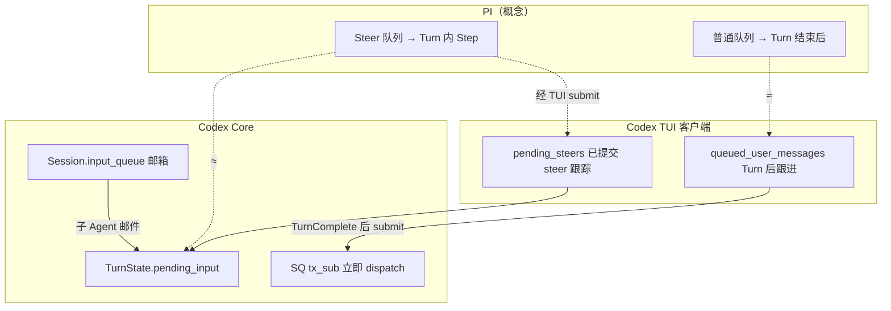
```mermaid
flowchart TB
    subgraph PI["PI（概念）"]
        PS[Steer 队列 → Turn 内 Step]
        PQ[普通队列 → Turn 结束后]
    end

    subgraph CODEX_CORE["Codex Core"]
        PEND[TurnState.pending_input]
        SQ[SQ tx_sub 立即 dispatch]
        MB[Session.input_queue 邮箱]
    end

    subgraph CODEX_TUI["Codex TUI 客户端"]
        QS[pending_steers 已提交 steer 跟踪]
        QU[queued_user_messages Turn 后跟进]
    end

    PS -.->|≈| PEND
    PQ -.->|≈| QU
    PS -.->|经 TUI submit| QS
    QS --> PEND
    QU -->|TurnComplete 后 submit| SQ
    MB -->|子 Agent 邮件| PEND
```

| 对比 | PI | Codex Core | Codex TUI |
|------|----|------------|-----------|
| Turn 内插话 | Steer 队列 | `pending_input` | 即时 submit + `pending_steers` |
| Turn 后再消费 | 普通排队 | ❌ 无（立刻 steer 或拒绝） | `queued_user_messages` |
| 额外 | — | 子 Agent 邮箱 | `rejected_steers_queue` 等边界态 |

#### Start vs Steer（与 SQ、`pending_input` 的关系）

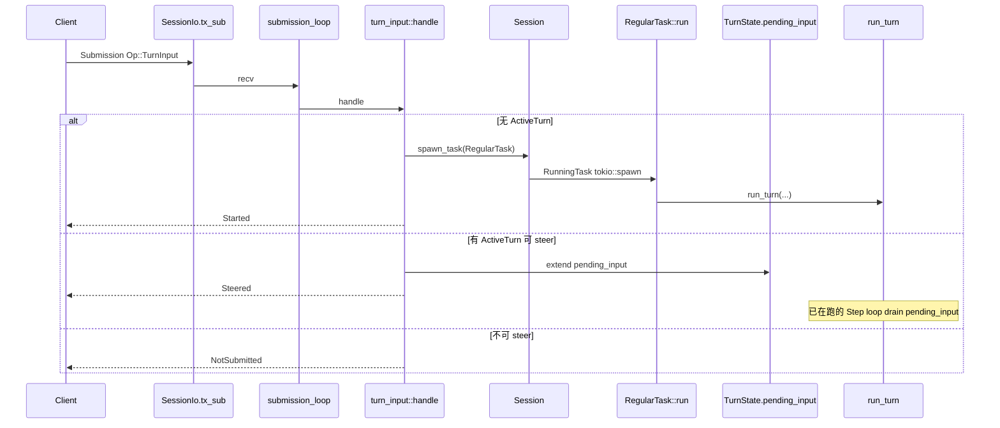
```mermaid
sequenceDiagram
    participant C as Client
    participant SQ as SessionIo.tx_sub
    participant SL as submission_loop
    participant TI as turn_input::handle
    participant S as Session
    participant RK as RegularTask::run
    participant P as TurnState.pending_input
    participant RT as run_turn

    C->>SQ: Submission Op::TurnInput
    SQ->>SL: recv
    SL->>TI: handle
    alt 无 ActiveTurn
        TI->>S: spawn_task(RegularTask)
        S->>RK: RunningTask tokio::spawn
        RK->>RT: run_turn(...)
        TI-->>C: Started
    else 有 ActiveTurn 可 steer
        TI->>P: extend pending_input
        TI-->>C: Steered
        Note over RT: 已在跑的 Step loop drain pending_input
    else 不可 steer
        TI-->>C: NotSubmitted
    end
```

**源码锚点**：`session/input_queue.rs`、`state/turn.rs`（`TurnState`）、`session/turn_input.rs`。

---

### 3.2 SQ/EQ 关联模型

**核心规则**：对 **Turn 作用域** 的 `EventMsg`，`Event.id == Submission.id`（即 `turn_id`）。`Session::send_event` 显式使用 `turn_context.sub_id`：

```1951:1954:codex/codex-rs/core/src/session/mod.rs
let event = Event {
    id: turn_context.sub_id.clone(),
    msg,
};
```

| 场景 | `Event.id` 来源 | 示例 EventMsg |
|------|-----------------|---------------|
| 用户 Turn | `submit_turn_input` 生成的 UUID v7 | `TurnStarted`, `AgentMessage*`, `TurnComplete` |
| 同 Turn 内工具/增量 | 同上（`turn_context.sub_id`） | `ExecCommandBegin`, `ItemStarted` |
| 非 Turn Op | `SessionIo::submit` 的 `sub.id` | `ContextCompacted`（`Op::Compact`） |
| 错误 | 触发该 Op 的 `sub.id` | `Error` |
| Session 配置 | `INITIAL_SUBMIT_ID`（`""`） | `SessionConfigured` |

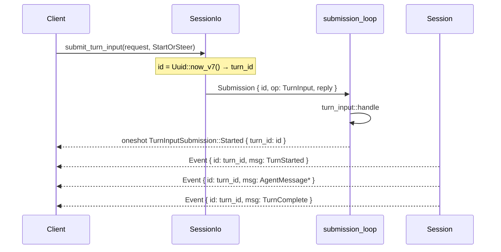
```mermaid
sequenceDiagram
    participant C as Client
    participant IO as SessionIo
    participant SL as submission_loop
    participant S as Session

    C->>IO: submit_turn_input(request, StartOrSteer)
    Note over IO: id = Uuid::now_v7() → turn_id
    IO->>SL: Submission { id, op: TurnInput, reply }
    SL->>SL: turn_input::handle
    SL-->>C: oneshot TurnInputSubmission::Started { turn_id: id }
    S-->>C: Event { id: turn_id, msg: TurnStarted }
    S-->>C: Event { id: turn_id, msg: AgentMessage* }
    S-->>C: Event { id: turn_id, msg: TurnComplete }
```

**Submission 结构**：

```186:200:codex/codex-rs/protocol/src/protocol.rs
pub struct Submission {
    pub id: String,
    pub op: Op,
    pub trace: Option<W3cTraceContext>,
    pub parent_turn_id: Option<String>,
    pub root_turn_id: Option<String>,
}
```

`parent_turn_id` / `root_turn_id` 用于子 Agent / mailbox 因果链（`InterAgentCommunication` 路径）。

### 3.3 Op 路由表（submission_loop → handler）

**入口**：`core/src/session/handlers.rs::submission_loop`

| `Op` 变体 | Handler / 模块 | 是否等待采样 | 备注 |
|-----------|----------------|--------------|------|
| `TurnInput` | `turn_input::handle` | 否（oneshot 回 `TurnInputSubmission`） | 主路径 |
| `RecoverTurn` | `turn_input::handle_recovery` | 否 | 恢复中断 Turn，复用 `turn_id` |
| `Interrupt` | `interrupt` → `interrupt_task` | 否 | cancel ActiveTurn token |
| `ExecApproval` | `exec_approval` | 否 | 唤醒 tool future |
| `PatchApproval` | `patch_approval` | 否 | |
| `UserInputAnswer` | `request_user_input_response` | 否 | control tool |
| `RequestPermissionsResponse` | `request_permissions_response` | 否 | |
| `ResolveElicitation` | `resolve_elicitation` | 否 | MCP |
| `DynamicToolResponse` | `dynamic_tool_response` | 否 | |
| `InterAgentCommunication` | `inter_agent_communication` | 否 | `Session.input_queue` 邮箱；可能 `maybe_start_turn` |
| `ThreadSettings` | `thread_settings::update` | 否 | |
| `Compact` | `compact` | 否 | 独立 CompactTask |
| `ThreadRollback` | `thread_rollback` | 否 | 内存上下文回滚 |
| `SetThreadMemoryMode` | `set_thread_memory_mode` | 否 | |
| `Review` | `review` | 否 | Review 子任务 |
| `RefreshMcpServers` | `refresh_mcp_servers` | 否 | |
| `ReloadUserConfig` | `reload_user_config` | 否 | |
| `RunUserShellCommand` | `run_user_shell_command` | 否 | 可挂 ActiveTurn 或 spawn |
| `SuspendTurnAndShutdown` | `turn_suspension::suspend_turn_and_shutdown` | 是（持久化） | 可 break loop |
| `Shutdown` | `shutdown` | — | 退出 loop |
| Realtime `Op::*` | `handle_realtime_*` | 否 | 并行子系统 |
| `_` (未知) | 忽略 | — | `non_exhaustive` 扩展点 |

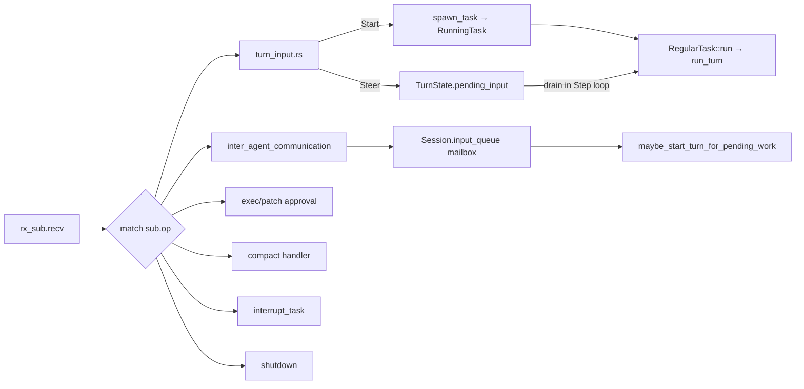
```mermaid
flowchart LR
    RX[rx_sub.recv] --> MATCH{match sub.op}
    MATCH --> TI[turn_input.rs]
    MATCH --> IA[inter_agent_communication]
    MATCH --> APR[exec/patch approval]
    MATCH --> CMP[compact handler]
    MATCH --> INT[interrupt_task]
    MATCH --> SH[shutdown]
    TI -->|Start| ATASK[spawn_task → RunningTask]
    TI -->|Steer| PEND[TurnState.pending_input]
    IA --> MB[Session.input_queue mailbox]
    MB --> MAYBE[maybe_start_turn_for_pending_work]
    ATASK --> RT[RegularTask::run → run_turn]
    PEND -->|drain in Step loop| RT
```

### 3.4 TurnInputSubmission 结果全集

**定义**：`protocol/src/turn_input.rs`

| 结果 | 含义 | 何时返回 | 副作用 |
|------|------|----------|--------|
| `Started { turn_id }` | 新 Turn 已接受 | `StartOrSteer` 无 ActiveTurn；`StartIfIdle` 空闲 | `apply_started`：settings + `spawn_task` |
| `Steered { turn_id }` | 并入当前 Turn | 有 ActiveTurn 且可 steer | `apply_steered`：仅持久化 settings |
| `NotSubmitted { reason }` | 拒绝 | 见下表 | **不**改 thread settings |

**`NotSubmittedReason` 完整表**：

| Reason | 触发 API | 典型原因 |
|--------|----------|----------|
| `NotIdle` | `StartIfIdle` | 已有 ActiveTurn |
| `PendingTriggerTurn` | `StartIfIdle` | 更高优先级 mailbox `trigger_turn` 待处理 |
| `PlanMode` | `StartIfIdle` | 自动非用户输入在 Plan mode 被拒绝 |
| `NoActiveTurn` | `Steer` | 无活跃 Turn |
| `ExpectedTurnMismatch` | `Steer` | `expected_turn_id` 不匹配 |
| `ActiveTurnNotSteerable` | Start/Steer | Review/Compact 等不可 steer |
| `ActiveTurnOutputSchemaMismatch` | Start/Steer | `final_output_json_schema` 冲突 |
| `EmptyInput` | Start/Steer | steer 路径空输入 |

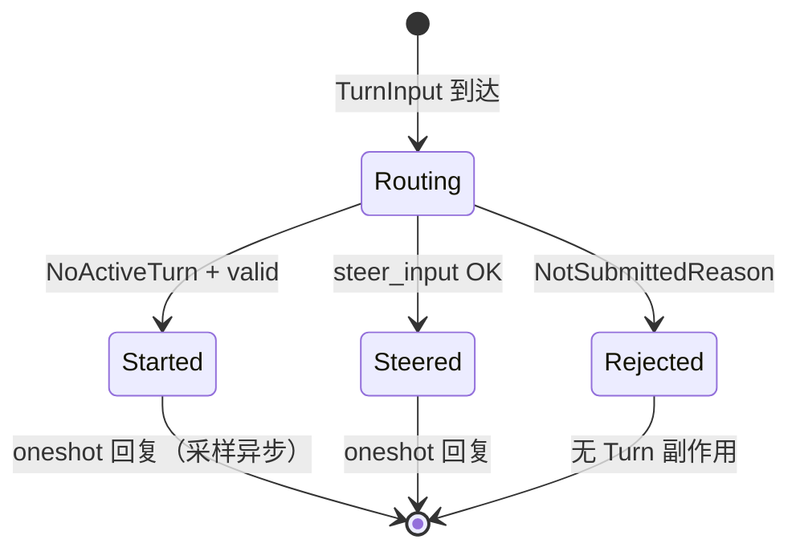
```mermaid
stateDiagram-v2
    [*] --> Routing: TurnInput 到达
    Routing --> Started: NoActiveTurn + valid
    Routing --> Steered: steer_input OK
    Routing --> Rejected: NotSubmittedReason
    Started --> [*]: oneshot 回复（采样异步）
    Steered --> [*]: oneshot 回复
    Rejected --> [*]: 无 Turn 副作用
```

### 3.5 EventMsg 投影管线

> **本节回答三件事**：（1）`EventMsg` 在 **Op → run_turn → UI** 全流程里**何时、为何**出现；（2）它和 **`ResponseItem`（模型层）** 是什么关系；（3）一条事件从产生到销毁的 **生命周期**。
>
> **上下游**：控制面走 SQ（`Op` / `Submission`），见 [§3.1–§3.4](#31-通道与队列sq--eq--input_queue--pending_input)；数据面走 EQ（`Event` / `EventMsg`），见 [§3.2](#32-sqeq-关联模型)。`run_turn` 在后台产生内容，见 [§4](#第4章agent-loop--四层循环与源码级设计)。三层模型与字段级对照见 [第5章](#第5章message-设计三层投影)。

#### 3.5.0 在全流程中的位置（起 → 止）

```text
【起点】客户端 submit(Op) ──SQ──► submission_loop ──► run_turn（后台）
                                      │
                    ┌─────────────────┴─────────────────┐
                    ▼                                   ▼
            record 路径（真相）                    emit 路径（投影）
         ResponseItem → history + Rollout          EventMsg → EQ 广播
                    │                                   │
                    └──────────► 下一轮采样 ◄────────────┘
                                      │
【终点】TurnComplete EventMsg ──EQ──► 客户端 next_event；Rollout jsonl 可 Resume
```

| 阶段 | 通道 | 载荷 | 客户端怎么收 |
|------|------|------|--------------|
| 提交 /  steering | **SQ** | `Op::TurnInput` 等 | `TurnInputSubmission` **oneshot**（`Started` / `Steered`）——**不是** EventMsg |
| Turn 运行中 | **EQ** | `Event { id, msg: EventMsg }` | `SessionIo.rx_event` 持续订阅（流式 Delta、工具、审批） |
| Turn 结束 | **EQ** | `TurnComplete` / `TurnAborted` | 同上；之后 `active_turn` 清空，可接下一 `TurnInput` |
| 持久化 | **Rollout** | `RolloutItem::ResponseItem` + `RolloutItem::EventMsg` | 不实时推送；Resume / 审计 / ThreadStore |

**关键分工**：`Op` 告诉 Core **做什么**；`EventMsg` 告诉客户端 **发生了什么**（可流式）。模型下一轮读的是 **`ContextManager.history` 里的 `ResponseItem`**，不是 EventMsg 流。

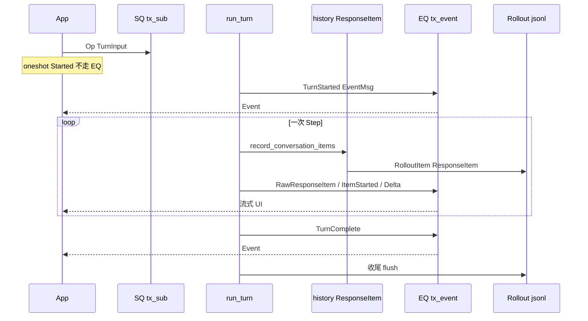
```mermaid
sequenceDiagram
    participant App
    participant SQ as SQ tx_sub
    participant RT as run_turn
    participant H as history ResponseItem
    participant EQ as EQ tx_event
    participant ROL as Rollout jsonl

    App->>SQ: Op TurnInput
    Note over App: oneshot Started 不走 EQ
    RT->>EQ: TurnStarted EventMsg
    EQ-->>App: Event

    loop 一次 Step
        RT->>H: record_conversation_items
        H->>ROL: RolloutItem ResponseItem
        RT->>EQ: RawResponseItem / ItemStarted / Delta
        EQ-->>App: 流式 UI
    end

    RT->>EQ: TurnComplete
    EQ-->>App: Event
    RT->>ROL: 收尾 flush
```

#### 3.5.1 为什么要「投影」：三层数据模型

同一次 Agent 行为在 Core 里往往有 **三种表示**，职责不同：

| 层 | Rust 类型 | 存哪 | 谁消费 | 是否进下次 LLM Prompt |
|----|-----------|------|--------|------------------------|
| **模型层** | `ResponseItem` | `ContextManager.history` + Rollout | `build_prompt` → API | **是**（唯一真相） |
| **UI 层** | `EventMsg`（包在 `Event` 里） | EQ 实时广播 + Rollout 副本 | TUI / app-server / MCP | **否**（展示、审批、进度） |
| **审计层** | `RolloutItem` | 线程 `jsonl` | Resume、Fork、Memories、调试 | 恢复时重放为 history / 事件 |

**投影（projection）** 指：从模型协议里的 `ResponseItem`（或 SSE 增量）**派生**出客户端友好的 `EventMsg` / `TurnItem`——例如把 assistant `Message` 拆成 `AgentMessageContentDelta`（流式）+ `ItemCompleted(AgentMessage)`（结构化条目）。

```text
ResponseItem（模型协议）  ──record──►  history（跨 Turn 累积）
        │
        ├──send_raw_response_items──►  EventMsg::RawResponseItem（调试/重建）
        └──parse_turn_item + emit──►  ItemStarted/Completed + Delta 系列（UI 主路径）
```

#### 3.5.2 类型模型：`Event` 与 `EventMsg`

```rust
// protocol/src/protocol.rs（概念）
pub struct Event {
    pub id: String,      // Turn 作用域下通常 = turn_id（= 发起 Turn 的 Submission.id）
    pub msg: EventMsg,
}

pub enum EventMsg {
    TurnStarted(...),
    TurnComplete(...),
    AgentMessageContentDelta(...),
    ItemStarted(...),
    ItemCompleted(...),
    ExecCommandBegin(...),
    // … 见 §3.6
}
```

| 字段 | 含义 |
|------|------|
| `Event.id` | 把 EQ 事件关联到 **哪一轮 Turn**（[§3.2](#32-sqeq-关联模型)） |
| `EventMsg` | **载荷枚举**；一种「发生了什么事」的协议化描述 |
| `TurnItem` | **不是**独立 wire 类型；嵌在 `ItemStarted` / `ItemCompleted` 里，是 app-server v2 的 UI 条目契约 |

#### 3.5.3 生命周期：一条 `EventMsg` 从哪来到哪去

以 **模型输出一条 assistant 消息** 为例（工具调用类似，多 `ExecCommand*` 事件）：

| 阶段 | 发生了什么 | 源码锚点 |
|------|------------|----------|
| **1. 产生** | SSE `OutputItemDone` / 工具完成 → 得到 `ResponseItem` | `try_run_sampling_request` / `stream_events_utils.rs` |
| **2. Record（真相写入）** | `record_conversation_items` → **history 追加** → `persist_rollout_items(ResponseItem)` | `session/mod.rs` |
| **3. Raw 投影（可选）** | `send_raw_response_items` → EQ `RawResponseItem` | 同文件；调试用 |
| **4. UI 投影（流式）** | 采样过程中已发 `*ContentDelta`；完成时 `emit_turn_item_*` | `turn.rs` / `emit_turn_item_started` |
| **5. 持久化 EventMsg** | `send_event` → `persist_rollout_items(EventMsg)` **再** `tx_event.send` | `send_event_raw_with_persistence` |
| **6. 投递** | `deliver_event_raw` → 所有 `rx_event` 订阅者（含 TUI） | broadcast channel |
| **7. 消费** | 客户端渲染；app-server 可分页 `thread/read`（TurnItem） | 客户端 |
| **8. 归档** | Rollout 行永久保留；Resume 时重放 | `thread_manager` resume |
| **9. 消亡** | 内存中无长期 `EventMsg` 队列；EQ 为 broadcast，慢消费者可能丢事件需靠 Rollout 补 | — |

**生命周期类事件**（不经过 `ResponseItem`）：

| EventMsg | 产生时机 | 是否 record ResponseItem |
|----------|----------|-------------------------|
| `SessionConfigured` | `Session::spawn` 完成 | 否 |
| `TurnStarted` | `RegularTask::run` 开头 | 否 |
| `TurnComplete` / `TurnAborted` | `run_turn` / abort 收尾 | 否 |
| `ContextCompacted` | `Op::Compact` / 内联 compact | 伴随 history 替换（见 §5章） |

#### 3.5.4 两条并行管线：Record vs Emit

模型产出后 **同时**走两条路（不是二选一）：

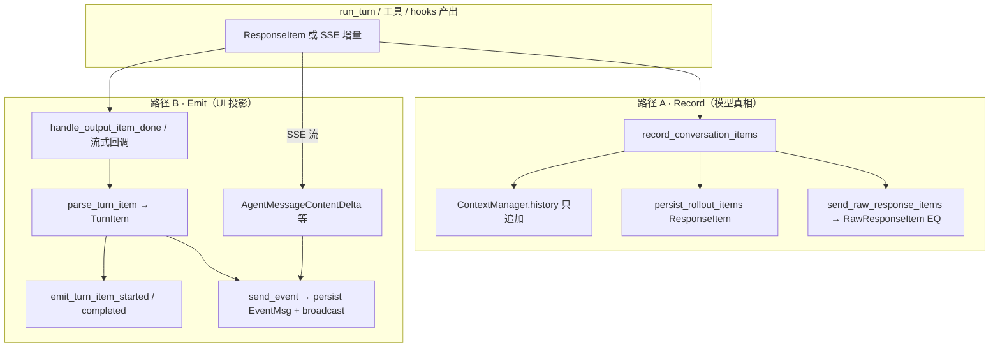
```mermaid
flowchart TB
    subgraph Source["run_turn / 工具 / hooks 产出"]
        RI[ResponseItem 或 SSE 增量]
    end

    subgraph Record["路径 A · Record（模型真相）"]
        R1[record_conversation_items]
        R2[ContextManager.history 只追加]
        R3[persist_rollout_items ResponseItem]
        R4[send_raw_response_items → RawResponseItem EQ]
    end

    subgraph Emit["路径 B · Emit（UI 投影）"]
        E1[handle_output_item_done / 流式回调]
        E2[parse_turn_item → TurnItem]
        E3[emit_turn_item_started / completed]
        E4[AgentMessageContentDelta 等]
        E5[send_event → persist EventMsg + broadcast]
    end

    RI --> R1 --> R2
    R1 --> R3
    R1 --> R4
    RI --> E1 --> E2 --> E3
    E2 --> E5
    RI -->|SSE 流| E4 --> E5
```

| 路径 | 核心 API | 写入 | EQ 上典型事件 |
|------|----------|------|----------------|
| **Record** | `record_conversation_items` | **history + Rollout ResponseItem** | `RawResponseItem`（每条 item 一条） |
| **Emit** | `send_event` / `emit_turn_item_*` | Rollout **EventMsg** + broadcast | `ItemStarted/Completed`、`*Delta`、`TurnStarted`… |

**顺序要点**（避免读代码时晕）：

- `record_conversation_items`：**先** `history`，**再** Rollout `ResponseItem`，**再** `RawResponseItem` EQ。
- `send_event` / `send_event_raw`：**先** `persist_rollout_items(EventMsg)`，**再** `deliver_event_raw`（`tx_event` 广播）。见 `send_event_raw_with_persistence`。
- **UI 应以 `TurnItem` 系列 + Delta 为主**；`RawResponseItem` 偏调试与协议重建（[第5章 §5.4](#54-eventmsg客户端可见)）。

#### 3.5.5 在 run_turn 流程中的作用（按时间）

| 时刻 | Record 侧 | Emit 侧 | 客户端可见 |
|------|-----------|---------|------------|
| Turn 点火 | user `ResponseItem` 经 T8 record | `TurnStarted` | 生命周期 + 首条 user TurnItem |
| 每步采样前 | fragments / world_state 可能 record | 通常无 | — |
| 流式生成 | 未完成前 **不**进 history | `*ContentDelta` 高频 | TUI 打字机 |
| 一条 item 完成 | `record_conversation_items` | `ItemCompleted` | 结构化行落定 |
| 工具执行 | `FunctionCall` + `Output` record | `ExecCommandBegin/End`… | 终端 / 审批 UI |
| 需要用户审批 | 工具挂起 | `ExecApprovalRequest` 等 | 客户端 `Op::ExecApproval` 回 SQ |
| Turn 结束 | 最终 history 一致 | `TurnComplete` | 可发下一 `TurnInput` |

Steer 路径：用户话先进入 `pending_input` → drain → **同样走 record + emit**，不产生新的 `TurnStarted`。

#### 3.5.6 客户端集成要点（本节收尾）

1. **两条回执不要混**：`TurnInputSubmission`（oneshot）只表示 Core **是否接受**输入；**进度与内容**只看 EQ 的 `EventMsg`。
2. **关联键**：同一 Turn 的 EQ 事件用 `Event.id == turn_id`（[§3.2](#32-sqeq-关联模型)）。
3. **Resume**：线程重启后靠 **Rollout** 重建 history；EQ 不回放历史。详见 [§5.8.4](#584-冷启动与-resume从-jsonl-重建内存)。
4. **分类速查**：见下一节 [§3.6 EventMsg 分层](#36-eventmsg-分层节选)；字段级与 `ResponseItem` 映射见 [§5.2–§5.4](#第5章message-设计三层投影)。

---

### 3.6 EventMsg 分层（节选）

| 类别 | 代表 EventMsg | 进入模型上下文 |
|------|---------------|----------------|
| 生命周期 | `TurnStarted`, `TurnComplete`, `TurnAborted` | 否 |
| 结构化条目 | `ItemStarted`, `ItemCompleted` | 否（由 ResponseItem 投影源） |
| 流式 | `AgentMessageContentDelta`, `ReasoningContentDelta` | 否（完成后写入 ResponseItem） |
| 工具 | `ExecCommandBegin/End`, `McpToolCall*` | 部分（`FunctionCallOutput`） |
| 审批 | `ExecApprovalRequest`, `RequestPermissions` | 否 |
| 压缩 | `ContextCompacted` | 摘要 → `CompactionSummary` fragment |
| Plan | `PlanDelta`, `PlanUpdate` | Plan mode：`PlanItem`；`update_plan` 工具：仅 UI |

### 3.7 CodexThread 桥接

| 方法 | 文件 | 行为 |
|------|------|------|
| `submit(op)` | `codex_thread.rs` | `SessionIo::submit` → 生成 `sub.id` |
| `submit_turn_input` | `session/mod.rs` `SessionIo` | `Op::TurnInput` + oneshot |
| `next_event` | `session/mod.rs` | 阻塞读 EQ |

TUI / app-server / MCP **均不**直接调用 `run_turn`。

---

### 3.8 Memories（长期记忆管道）

> **本节回答**：（1）Memories 与 **`ContextManager.history`** 是什么关系；（2）分几层、每层存什么、怎么用；（3）Write（Phase1/2）与 Read（注入/工具）全流程；（4）**压缩**对记忆提炼的影响与策略。  
> **相关章节**：[§5.8 三真源与 JSONL](#58-状态归属与持久化生命周期) · [第7章 压缩](#第7章context-fragments-与压缩)

#### 3.8.0 定位：不是第四条队列，而是 history 的「跨 Session 蒸馏」

Memories **不占用** `input_queue` / `pending_input` / SQ / EQ。它与 Session 的关系是：

| 概念 | 载体 | 时间范围 | 作用 |
|------|------|----------|------|
| **会话 transcript（真相）** | `ContextManager.history` | 当前 Session 进程内 | 模型每轮 `for_prompt()` 的输入链 |
| **会话审计日志** | Rollout JSONL | 跨重启 | Resume、Fork、**记忆提炼原料** |
| **长期记忆产物** | `~/.codex/memories/` + State DB | 跨 Thread / Session | 浓缩后的可复用知识 |
| **运行时注入** | Developer `PromptFragment` + 可选工具 | 每个 Thread 启动后 | 让模型**知道**记忆存在并会引用 |
| **生成开关** | `ThreadMemoryMode`（State DB） | 每 Thread | 控制该线程是否参与 Phase1 提炼 |

```text
                    ┌─── run_turn 同步 ───┐
User/Tools ──► ContextManager.history ──► LLM（当轮上下文）
                    │ record
                    ▼
              Rollout JSONL（全量 append）
                    │
                    │  Session 存活期后台（异步）
                    ▼
         Phase1 按 Thread 提炼 ──► Phase2 全局合并
                    │
                    ▼
         ~/.codex/memories/{MEMORY.md, memory_summary.md, …}
                    │
                    │  Thread 启动 / 模型 tool call
                    ▼
         developer instructions + memory_search/read ──► 再次进入 history（作为 developer/user fragment）
```

**核心原则**：history 是 **原文**；Memories 是 **从 Rollout 蒸馏出的第二知识层**，通过 fragment/工具**回灌** prompt，而不是替代 `ContextManager`。

#### 3.8.1 五层记忆架构

```mermaid
flowchart TB
    subgraph L0["L0 · 会话 transcript（运行时真相）"]
        CM[ContextManager.items]
    end
    subgraph L1["L1 · Rollout 审计（持久原料）"]
        JSONL["*.jsonl RolloutItem"]
    end
    subgraph L2["L2 · Stage-1 单线程提炼（State DB + 文件）"]
        S1[stage1_outputs 表]
        RS[rollout_summaries/*.md]
        RAW[raw_memories.md 片段来源]
    end
    subgraph L3["L3 · Stage-2 全局合并（Git 工作区）"]
        MEM[MEMORY.md]
        SUM[memory_summary.md]
        EXT[extensions/*/instructions.md]
    end
    subgraph L4["L4 · 运行时读路径"]
        INJ[developer PromptFragment 注入]
        TOOL[ext/memories 工具]
        CITE[MemoryCitation 回写 usage]
    end

    CM -->|record_conversation_items| JSONL
    JSONL -->|Phase1 load_rollout_items| S1
    S1 --> RS
    S1 --> RAW
    S1 -->|Phase2 合并 Agent| MEM
    S1 --> SUM
    MEM --> INJ
    SUM --> INJ
    MEM --> TOOL
    INJ --> CM
    TOOL --> CM
    CITE --> S1
```

| 层 | 存储 | 写入时机 | 读取时机 | 是否进 `for_prompt` |
|----|------|----------|----------|---------------------|
| **L0 history** | 内存 `ResponseItemEnvelope[]` | 每 Turn `record` | 每 Step `for_prompt` | **始终** |
| **L1 Rollout** | `~/.codex/sessions/...jsonl` | 每 `record` / `send_event`（选择性） | Resume、**Phase1 读全文件** | 间接（恢复后进 L0） |
| **L2 Stage-1** | SQLite `stage1_outputs` + `rollout_summaries/` | Session 启动后 Phase1（线程 idle 后） | Phase2 选题；citation `usage_count` | 否（中间产物） |
| **L3 Stage-2** | `MEMORY.md`、`memory_summary.md` | Phase2 合并 Agent 编辑 | Thread 启动注入；工具 list/read/search | **经 L4 注入后**是 |
| **L4 读路径** | 无独立存储 | 模型 tool call / extension | 每 Thread `on_thread_start` | 注入为 developer fragment |

#### 3.8.2 磁盘与数据库布局

**`~/.codex/memories/`**（`memories/read`、`memories/write`）：

```text
~/.codex/memories/
├── MEMORY.md                 # Phase2 主索引：结构化长期事实（合并 Agent 维护）
├── memory_summary.md         # Phase2 摘要层：Thread 启动时注入（v1 格式，有 token 上限）
├── raw_memories.md           # Phase2 输入：由 DB stage1 行重建的合并稿（给合并 Agent 读）
├── rollout_summaries/        # 每线程一条短摘要 *.md（Phase1 rollout_summary）
│   └── <thread_id>_<slug>.md
└── extensions/               # 可选扩展源（如外部 Agent 导入）
    └── <name>/instructions.md
```

**State DB**（`codex-state`，`state/src/runtime/memories.rs`）：

| 表/作业 | 用途 |
|---------|------|
| `threads.memory_mode` | `enabled` / `disabled` / `polluted`（字符串，非仅 enum 两项） |
| `stage1_outputs` | 每 `thread_id` 一条：raw_memory、rollout_summary、source_updated_at、usage_count… |
| `jobs` (`memory_stage1`) | Phase1 租约、重试、watermark |
| `jobs` (`memory_consolidate_global`) | Phase2 全局锁、cooldown |

#### 3.8.3 配置与开关（三层正交）

```rust
// config/src/types.rs — MemoriesConfig（生效值）
pub struct MemoriesConfig {
    pub use_memories: bool,              // 读：是否注入 memory_summary + 说明
    pub generate_memories: bool,           // 写：新线程默认 memory_mode
    pub dedicated_tools: bool,             // 是否暴露 ext/memories 独立工具
    pub disable_on_external_context: bool, // MCP/Web 后标 polluted
    pub max_rollouts_per_startup: usize,
    pub min_rollout_idle_hours: i64,       // 线程多久无活动才可提炼
    pub max_rollout_age_days: i64,
    pub max_raw_memories_for_consolidation: usize,
    pub extract_model / consolidation_model: Option<String>,
    // …
}
```

| 开关 | 控制面 | 效果 |
|------|--------|------|
| `Feature::MemoryTool` | 功能旗标 | 总闸；关则整个管道跳过 |
| `use_memories` | 用户/TUI `/memories` | 关 → 不注入 developer 记忆说明 |
| `generate_memories` | 用户/TUI | 关 → 新线程 `memory_mode=disabled`，Phase1 不 claim |
| `Op::SetThreadMemoryMode` | 每线程 SQ | `Enabled` / `Disabled` |
| `disable_on_external_context` | 配置 | WebSearch / MCP 等 → `memory_mode=polluted`，**不再提炼** |
| `dedicated_tools` | 配置 | `memory_search` / `memory_read` / `memory_list` / `add_ad_hoc_note` |

**`polluted` 语义**：不是协议 enum 字段，而是 State DB 字符串。线程一旦被标 `polluted`，`claim_stage1_jobs_for_startup` 的 SQL 过滤 `memory_mode = 'enabled'`，该线程**永久退出**自动记忆生成（除非用户改回）。

#### 3.8.4 Write 路径：Session 启动后的两阶段管道

**入口**：`memories/write/src/start.rs::start_memories_startup_task` — 在根 Session `spawn` 后 `tokio::spawn`，**不阻塞** `run_turn`。

**跳过条件**：`ephemeral`、无 `Feature::MemoryTool`、子 Agent Session、`state_db` 不可用。

```mermaid
sequenceDiagram
    participant S as Session spawn
    participant ST as start_memories_startup_task
    participant P1 as Phase1
    participant DB as State DB
    participant RR as Rollout JSONL
    participant LLM1 as extract_model
    participant P2 as Phase2
    participant AG as Consolidation Agent
    participant FS as ~/.codex/memories

    S->>ST: tokio::spawn（根 Session、非 ephemeral）
    ST->>ST: ensure_layout + prune + rate_limit 检查
    ST->>P1: run
    P1->>DB: claim_stage1_jobs（idle + enabled + 陈旧）
    loop 每线程最多 max_rollouts_per_startup
        P1->>RR: load_rollout_items(path)
        P1->>P1: serialize_filtered_rollout_response_items
        P1->>LLM1: stage_one 结构化输出
        LLM1-->>P1: raw_memory + rollout_summary
        P1->>DB: upsert stage1_outputs
        P1->>FS: rollout_summaries/*.md
    end
    ST->>P2: run
    P2->>DB: claim global Phase2 lock
    P2->>FS: prepare git workspace + workspace_diff
    P2->>DB: get_phase2_input_selection
    P2->>FS: rebuild raw_memories.md
    P2->>AG: 沙箱 Agent 编辑 MEMORY.md / memory_summary.md
    AG->>FS: 提交合并结果
    P2->>DB: release lock + watermark
```

##### Phase1：单 Rollout → Stage1Output

| 步骤 | 说明 |
|------|------|
| **Claim** | `memory_mode='enabled'`、非当前线程、超过 `min_rollout_idle_hours`、rollout `updated_at` 新于已有 stage1 |
| **读 Rollout** | `RolloutRecorder::load_rollout_items` — **顺序扫描整文件** |
| **过滤** | `should_persist_response_item_for_memories`：含 user/assistant、工具调用；**排除** `Reasoning`、`Compaction`、`developer` Message |
| **采样** | `extract_model` + `stage_one_system.md` prompt → JSON `{ raw_memory, rollout_summary, rollout_slug }` |
| **落盘** | DB `stage1_outputs` + `rollout_summaries/<stem>.md` |

##### Phase2：全局合并

| 步骤 | 说明 |
|------|------|
| **Claim** | 全局 job `memory_consolidate_global`；cooldown 6h；单 worker 租约 |
| **选题** | `get_phase2_input_selection(max_raw_memories, max_unused_days)` |
| **工作区** | Git baseline + `phase2_workspace_diff.md`（合并 Agent 读 diff） |
| **Agent** | `consolidation_model`、沙箱策略、审批 `AskForApproval`；按 `consolidation.md` 模板维护 `MEMORY.md` / `memory_summary.md` |
| **收尾** | `sync_rollout_summaries`、prune 过期 extension 资源 |

#### 3.8.5 Read 路径：注入、工具、引用计数

> **深入说明**：developer item 与 history/prompt 关系、是否存在 query 自动召回，见 [§3.8.9](#389-读路径-faqdeveloper-history-itemhistory-与-prompt主动召回)。与 OpenAI Agents SDK 对比见 [§3.8.10](#3810-与-openai-agents-sdk-两阶段记忆对比)。

##### A. Thread 启动注入（被动读）

`ext/memories/src/extension.rs` — `ContextContributor::contribute_thread_context`：

1. 读 `~/.codex/memories/memory_summary.md`
2. 按 token 上限截断
3. 渲染 `templates/memories/read_path.md` → **`PromptFragment::developer_policy`**
4. 进入 `build_initial_context` → 最终成为 history 里的 **developer Message**（L0）

模型**不会**自动获得 `MEMORY.md` 全文——只有摘要层 + 使用说明；细节靠工具按需读取。

##### B. 专用工具（主动读，`dedicated_tools=true`）

| 工具 | 作用 |
|------|------|
| `memory_search` | 在记忆文件中搜索 |
| `memory_read` | 按路径读片段 |
| `memory_list` | 列出可用记忆文件 |
| `add_ad_hoc_note` | 写临时笔记（扩展管道） |

工具结果 → `FunctionCallOutput` → `record_conversation_items` → **回到 L0 history**。

##### C. MemoryCitation（用量回写）

模型输出可含 `<citation_entries>` / `<rollout_ids>` 块。`stream_events_utils::record_completed_response_item` 解析后：

- `record_stage1_output_usage(thread_ids)` → `usage_count++`（影响 Phase2 选题与 prune）
- `record_memory_citation_for_turn` 标记当轮引用

```mermaid
sequenceDiagram
    participant U as User
    participant RT as run_turn
    participant CM as ContextManager
    participant EXT as MemoriesExtension
    participant TOOL as memory_read
    participant FS as memories/

    Note over EXT: Thread 启动
    EXT->>CM: developer fragment（memory_summary 摘要）
    U->>RT: TurnInput
    RT->>CM: for_prompt（含记忆说明）
    RT->>TOOL: 模型调用 memory_search
    TOOL->>FS: 读 MEMORY.md 片段
    TOOL->>CM: FunctionCallOutput record
    RT->>CM: assistant 回复 + MemoryCitation
    Note over CM: citation → stage1 usage_count
```

#### 3.8.6 与 history、Rollout、压缩的关系（重点）

##### 6.1 数据流：history 是「因」，Memories 是「果」

```text
run_turn 内每一次 record_conversation_items:
  ① ContextManager.items 追加     ← 模型真相（L0）
  ② RolloutItem::ResponseItem  append JSONL   ← 原料（L1）
  （与 ③ EventMsg 投影并行，见 §3.5）

Session 存活期（用户已离开或线程 idle）:
  ④ Phase1 读 ② 全文件 → ⑤ Stage1 DB / rollout_summaries
  ⑥ Phase2 合并 → ⑦ MEMORY.md / memory_summary.md

下一次 Thread:
  ⑧ developer fragment 把 ⑦ 摘要注入 → 回到 ①（作为 developer Message，非 transcript 复制）
```

**Memories 从不直接修改 `ContextManager`**；只通过 **Rollout 间接读** 和 **fragment/工具回灌** 影响后续 prompt。

##### 6.2 压缩对两层的影响（策略不同）

| 对象 | 压缩时行为 | 对 Memories 的影响 |
|------|------------|-------------------|
| **内存 history** | `replace_compacted_history` 整体替换 | 无直接影响（Phase1 不读内存） |
| **JSONL** | **只追加** `Compacted { replacement_history }`；旧 `ResponseItem` 行保留 | Phase1 **顺扫全文件**所有 `ResponseItem` 行；**跳过** `Compacted` 行本身 |
| **Stage1 输入** | `serialize_filtered_rollout_response_items` | 可能同时包含压缩**前**陈旧行 + 压缩**后**新行；`replacement_history` 在 `Compacted` 内**不**展开给 Phase1 |
| **Reasoning** | 压缩后通常不在 history | Phase1 **本就不收录** Reasoning（`should_persist_response_item_for_memories`） |
| **Compaction item** | 可能在 replacement_history 里 | Phase1 过滤掉 `Compaction` 变体 |

**设计含义**：

- **Resume** 用 `Compacted.replacement_history` 作检查点（§5.8.6.1）；**Memories Phase1 不用同一逻辑**——它朴素遍历 JSONL 里所有 `ResponseItem`。
- 已压缩线程的 Rollout 文件可能**偏长且含冗余**；Stage1 依赖提炼模型从摘要化后的后缀 + 陈旧行中归纳，**以 rollout 文件 mtime 驱动是否重跑**（`source_updated_at` 比较）。
- 会话内 **Auto Compact**（token 超阈值）与 **Op::Compact** 都会追加 `Compacted`；之后新对话继续 append `ResponseItem` → Phase1 下次 idle 时看到更新后的文件。

##### 6.3 压缩策略对照（会话 vs 记忆）

| 维度 | 会话压缩（[第7章](#第7章context-fragments-与压缩)） | 记忆提炼（本节） |
|------|--------------------------------------------------|------------------|
| **目的** | _fit 模型 context window_ | _跨 Session 保留用户偏好/事实_ |
| **触发** | token 超 `auto_compact` 阈值；`Op::Compact` | Session 启动 + 线程 idle + `memory_mode=enabled` |
| **输入** | 内存 `ContextManager.items` | 磁盘 JSONL 全文件（过滤后） |
| **输出** | 内存替换 + JSONL `Compacted` 检查点 | `stage1_outputs` + `MEMORY.md` / `memory_summary.md` |
| **模型** | 当前 Turn 的 `ModelClient` / remote compact API | 独立 `extract_model` / `consolidation_model` |
| **同步性** | Mid-turn 可阻塞式触发 | **完全异步**，不阻塞 `run_turn` |
| **与 history 关系** | **改写** L0 | **读取** L1，**回灌** L4→L0 |

#### 3.8.7 类图（Memories 子系统）

```mermaid
classDiagram
    class MemoriesConfig {
        +bool use_memories
        +bool generate_memories
        +bool dedicated_tools
        +bool disable_on_external_context
        +usize max_rollouts_per_startup
        +i64 min_rollout_idle_hours
    }
    class MemoryStartupContext {
        +ThreadManager thread_manager
        +ThreadId thread_id
        +Arc~CodexThread~ thread
        +stream_stage_one_prompt()
        +spawn_consolidation_agent()
    }
    class MemoryStore {
        +claim_stage1_jobs_for_startup()
        +upsert_stage1_output()
        +record_stage1_output_usage()
        +claim_phase2_job()
        +get_phase2_input_selection()
    }
    class Stage1Output {
        +ThreadId thread_id
        +PathBuf rollout_path
        +String raw_memory
        +String rollout_summary
        +DateTime source_updated_at
    }
    class MemoriesExtension {
        +contribute_thread_context()
        +on_thread_start()
        +tools()
    }
    class LocalMemoriesBackend {
        +search()
        +read()
        +list()
    }
    class ContextManager {
        +record_annotated_items()
        +for_prompt()
    }
    class RolloutRecorder {
        +load_rollout_items()
        +persist_rollout_items()
    }

    MemoryStartupContext --> MemoryStore : Phase1/2
    MemoryStartupContext --> RolloutRecorder : load JSONL
    MemoryStore --> Stage1Output
    MemoriesExtension --> LocalMemoriesBackend
    MemoriesExtension ..> ContextManager : PromptFragment 注入
    LocalMemoriesBackend ..> ContextManager : tool output record
    ContextManager --> RolloutRecorder : record
```

#### 3.8.8 端到端示例

**场景**：用户在 Thread A 修了三处 API 命名偏好，关闭 Codex；次日新开 Thread B。

| 时刻 | 发生的事 | 层 |
|------|----------|-----|
| T0 | Thread A 多轮对话，`record` 进 history + JSONL | L0 + L1 |
| T1 | Token 超限，Auto Compact：内存替换，JSONL append `Compacted` | L0 改写，L1 追加检查点 |
| T2 | 用户退出；根 Session 下次启动触发 Phase1 | — |
| T3 | Phase1 claim Thread A（idle > 12h，`memory_mode=enabled`） | L2 |
| T4 | 读 JSONL → 提炼「用户偏好 camelCase API」→ `stage1_outputs` | L2 |
| T5 | Phase2 合并进 `MEMORY.md` / `memory_summary.md` | L3 |
| T6 | Thread B 启动，`MemoriesExtension` 注入摘要 | L4 → L0 developer |
| T7 | 模型调用 `memory_read` 查细节 → 输出带 Citation | L4 → L0 |
| T8 | `usage_count` 增加，下次 Phase2 优先保留该条 stage1 | L2 元数据 |

若 T1 中用了 Web Search 且 `disable_on_external_context=true` → `memory_mode=polluted` → T3 **跳过** Thread A，不产生记忆。

**各层文件样例（Thread A → Thread B，camelCase API 偏好）**

| 阶段 | 层 | 路径 / 载体 | 内容示意 |
|------|-----|-------------|----------|
| 对话中 | L0 | `ContextManager.history`（内存） | `[user]` 改成 camelCase；`[assistant]` 好的；`[tool_call]` apply_patch；`[tool_output]` applied |
| 持久化 | L1 | `~/.codex/sessions/.../rollout-abc123.jsonl` | 每行 `RolloutItem::ResponseItem`；压缩后 **追加** `Compacted` 行，旧行保留 |
| Phase1 后 | L2 | State DB `stage1_outputs` | `raw_memory`: 用户要求 API 统一 camelCase；`rollout_summary`: 修 API 命名偏好 |
| Phase1 后 | L2 | `rollout_summaries/thread-a_api-naming.md` | 短摘要 Markdown |
| Phase2 后 | L3 | `MEMORY.md` | `## Coding preferences` → camelCase API naming |
| Phase2 后 | L3 | `memory_summary.md` | 一两句摘要，供 Thread 启动注入 |
| Thread B 启动 | L4→L0 | history 内 **developer Message** | 渲染 `read_path.md` + 截断后的 `memory_summary`（**非 tool result**） |
| Thread B 提问后 | L4→L0 | `memory_search` / `memory_read` | `function_call` + `function_call_output` → **是 tool result** |

L1 JSONL 行示意：

```jsonl
{"type":"response_item","item":{"type":"message","role":"user","content":[{"type":"input_text","text":"把这个项目的 API 都改成 camelCase"}]}}
{"type":"response_item","item":{"type":"message","role":"assistant","content":[{"type":"output_text","text":"好的，我会记住这个偏好…"}]}}
{"type":"response_item","item":{"type":"function_call","name":"apply_patch","arguments":"{...}"}}
{"type":"response_item","item":{"type":"function_call_output","output":"patch applied"}}
```

L3 `memory_summary.md` 示意：

```markdown
- User prefers camelCase for API naming in this repo.
- Auth module was updated as reference implementation.
```

Thread B 启动后 L0 中 developer 片段示意（经 `for_prompt()` 进入模型请求）：

```text
[developer]
<memory_policy>
You have long-term memories. Summary:
- User prefers camelCase for API naming in this repo.
Use memory_search / memory_read for details. Cite rollout_ids when used.
</memory_policy>
```

#### 3.8.9 读路径 FAQ：developer history item、history 与 prompt、主动召回

##### 9.1 什么是 developer history item？

**是** `ContextManager.history`（L0）里的一条 **Message**，`role = developer`。

它不是 user/assistant 对话正文，也不是 tool result，而是 Thread 启动时由 `MemoriesExtension::contribute_thread_context` 注入的 **PromptFragment**：

```text
memory_summary.md
    → templates/memories/read_path.md
    → PromptFragment::developer_policy
    → build_initial_context
    → history 追加一条 developer Message
```

与 tool 读记忆的区别：

| 读路径 | 触发 | 进入 L0 的形式 | 是否 tool result |
|--------|------|----------------|------------------|
| **被动读** | Thread 启动 | `developer` Message（fragment） | **否** |
| **主动读** | 模型在 Turn 内调用 | `function_call` + `function_call_output` | **是** |

##### 9.2 长期记忆是进 history 还是进 prompt？

**两者不是对立关系：在 Codex 里，history 就是组 prompt 的原料。**

```text
L3 文件（MEMORY.md / memory_summary.md）
        │
        ├─ 被动读：摘要 → developer Message → L0 history
        │
        └─ 主动读：memory_read 结果 → tool output → L0 history
                                    │
                                    ▼
                            for_prompt() 每轮读取 L0
                                    │
                                    ▼
                            发给 LLM 的 API 请求（context window）
```

因此：

- 长期记忆摘要 **先** 建模为 history 里的 developer 消息，**再** 经 `for_prompt()` 进入模型所见 prompt。
- 不是说「只进上下文、不进 prompt」——developer item **最终会进入** 模型请求。
- Memories **从不直接修改** `ContextManager` 以外的旁路；只通过 Rollout 蒸馏 + fragment/工具 **回灌** L0。

##### 9.3 有没有「根据用户问题自动召回」？

**默认没有。** Codex 不在 `TurnInput` 到达时做 embedding/RAG 自动注入。

实际机制：

1. **被动**：每个新 Thread 固定注入 `memory_summary.md` 截断摘要（与本轮用户问题无关）。
2. **主动**：模型根据摘要与说明，**自行决定**是否调用 `memory_search` / `memory_read` 读取 `MEMORY.md` 细节。
3. 若产品需要「按 query 自动召回」，需另加 retrieval 层（Turn 前服务），**不在当前五层架构内**。

```text
用户问题 ──► run_turn ──► for_prompt()
                              │
         Thread 启动已注入 ────┤ memory_summary（被动）
                              │
         模型若需要细节 ───────┴──► memory_search/read（主动 tool）
```

#### 3.8.10 与 OpenAI Agents SDK 两阶段记忆对比

> **对照对象**：monorepo 内 `openai-agents-python/src/agents/sandbox/memory/`（`phase_one.py`、`phase_two.py`、`manager.py`）。  
> **勿混淆**：SDK 每轮 `prepare_input_with_session` → `Runner.run` → `save_result_to_session` 是 **Session 持久化**，不是本节长期记忆提炼。

##### 10.1 共同设计范式

Codex Memories 与 SDK Sandbox Memory **整体思路一致**：

```text
Run 全量轨迹 → Rollout JSONL（审计原料，不直接当长期记忆）
        ↓
Phase1：单 Rollout → raw_memory + rollout_summary（中间层 L2）
        ↓
Phase2：多份 raw 合并 → MEMORY.md + memory_summary.md（长期层 L3）
        ↓
下次 Run：摘要被动注入 + 模型按需读全文/搜索
```

##### 10.2 差异对照

| 维度 | Codex（§3.8.4） | OpenAI Agents SDK |
|------|-----------------|-------------------|
| **原料** | `~/.codex/sessions/...jsonl` 全文件扫描 | `{sessions_dir}/*.jsonl` |
| **Phase1 触发** | 根 Session 启动 `tokio::spawn`；claim **其他 idle 线程** | Sandbox Session `flush` / `pre_stop`；处理**本会话** rollout |
| **Phase1 过滤** | 排除 Reasoning、Compaction、developer Message | 整段 rollout 交 Phase1 Agent（有 token 截断） |
| **Phase1 产出** | DB `stage1_outputs` + `rollout_summaries/*.md` | `raw_memories/{rollout_id}.md` + `rollout_summaries/` |
| **Phase2 触发** | 全局 job + 6h cooldown + 租约锁 | 同一次 flush 末尾 |
| **Phase2 执行** | Consolidation 沙箱 Agent + Git workspace diff | `SandboxAgent` + consolidation prompt，`max_turns=500` |
| **Phase2 产出** | `MEMORY.md`、`memory_summary.md` | 同上 + 可选 `skills/` |
| **元数据** | `memory_mode`、`polluted`、`usage_count` | `phase_two_selection.json` |
| **被动读落点** | **developer Message in history** → `for_prompt()` | **`Memory.instructions()`** → Agent 系统 instructions（不进 Session item 链） |
| **主动读** | 专用 `memory_search` / `memory_read` / `memory_list` | Shell / Filesystem 读 `MEMORY.md`（无专用 memory 工具名） |

##### 10.3 SDK 同场景文件布局

Sandbox workspace（相对根目录）：

```text
.sandbox/
├── sessions/
│   └── abc123.jsonl              # L1：Run 结束 enqueue
└── memories/
    ├── raw_memories/
    │   └── abc123.md             # L2：Phase1
    ├── rollout_summaries/
    │   └── abc123_api-naming.md
    ├── MEMORY.md                 # L3：Phase2
    ├── memory_summary.md         # 被动读摘要
    ├── phase_two_selection.json
    └── skills/                   # Phase2 可能生成（SDK 特有）
        └── api-camelcase-naming/SKILL.md
```

##### 10.4 三句话总结

1. **developer history item** = L0 里一条 `developer` Message，由 Thread 启动注入，**不是** tool result。
2. Codex 把长期记忆摘要放进 **history**，再经 `for_prompt()` 进模型 prompt；SDK 把摘要放进 **Agent instructions**，不进 `session.get_items()` 对话列表——**两者最终都进入模型 context，挂载槽位不同**。
3. **两阶段提炼范式一致**（Rollout → 单会话提炼 → 全局合并 → 下轮读回）；差别在调度时机、输入过滤、读回路径与元数据治理。

#### 3.8.11 控制 Op 与重置

| 入口 | 行为 |
|------|------|
| `Op::SetThreadMemoryMode` | 单线程 enabled/disabled |
| TUI `/memories` | 改 `use_memories` / `generate_memories` 写 config |
| app-server `thread/memory_mode_set` | 同 Op |
| app-server `memory/reset` | `clear_memory_roots_contents` + `MemoryStore::clear_memory_data` |

#### 3.8.12 与 §3.1 通道对照（收尾）

| 通道 | Memories 是否使用 |
|------|-------------------|
| SQ `Op::SetThreadMemoryMode` | ✅ 控制 |
| SQ `TurnInput` | 间接（产生 L1 原料） |
| EQ `EventMsg` | ❌ 不写记忆；UI 无关 |
| `pending_input` / `input_queue` | ❌ |
| `ContextManager.history` | ✅ 注入目标 + 工具结果落点 |
| Rollout JSONL | ✅ Phase1 唯一原料 |

> **一句话**：**history 记「这次说了什么」；Memories 记「跨次应记住什么」**——通过 Rollout 蒸馏、文件合并、developer 注入与可选工具，回到 history 影响后续 Turn，但不取代 `ContextManager` 真源地位。

---
## 第4章：Agent Loop — 四层循环与源码级设计

> **核心文件**: `session/handlers.rs` → `session/turn_input.rs` → `session/turn.rs`（`run_turn` / `run_sampling_request` / `try_run_sampling_request`）  
> **配套时序**: [ENTITY_AND_SEQUENCES §9](./ENTITY_AND_SEQUENCES.md#第三篇-模块深潜)

Agent Loop **不是**一个函数，而是四层嵌套循环，每层职责严格分离。搞错层级是读 Codex 源码最常见的误区。

### 4.0 设计原理（必须先读）

| 原理 | 含义 | 违反时的症状 |
|------|------|--------------|
| **控制与执行解耦** | `turn_input::handle` 只决定 Start/Steer/**拒绝**，不等待采样结束 | 在 handler 里等 Turn 结束会死锁 |
| **Turn 独占 ActiveTurn** | 一 Session 至多一个 `run_turn` task | 双 Turn 并发破坏 history 顺序 |
| **Step 冻结视图** | 每次采样前 `capture_step_context`，工具列表与 MCP 绑定在该 Step | mid-turn 改 tools 导致 call/execute 不一致 |
| **History 只追加** | `record_conversation_items` 不写回旧 item | prompt cache 失效、Resume 不一致 |
| **采样内可多次 HTTP** | 外层 Step loop + 内层 `run_sampling_request` 重试 loop + SSE 单响应内 tool follow-up | 把「一次 Step」误认为「一次 HTTP」 |
| **needs_follow_up 驱动延续** | Turn 结束条件 = 无 follow-up，而非「模型说了再见」 | 误判 Turn 何时结束 |

```mermaid
flowchart TB
    L1["L1 submission_loop<br/>handlers.rs"]
    L2["L2 turn_input::handle<br/>Start / Steer / Reject"]
    L3["L3 run_turn 外层 loop<br/>Step = 一次采样周期"]
    L4["L4 run_sampling_request<br/>一次 HTTP 流 + 流内工具"]
    L5["L5 try_run_sampling_request<br/>SSE 事件状态机"]
    L1 --> L2
    L2 -->|spawn_task| L3
    L3 --> L4
    L4 --> L5
```

---

### 4.1 L1：`submission_loop` — Op 分发（不跑模型）

**文件**: `core/src/session/handlers.rs::submission_loop`

Session 创建时 `tokio::spawn` 一个长期任务，从 `rx_sub` 读 `Submission`，`match sub.op`。**此循环是控制面单线程入口，永不直接调 LLM**（执行面在 `RegularTask::run` → `run_turn`）。

#### 4.1.0 为什么所有消息都进 `submission_loop`？

Codex 把 **控制面** 与 **执行面** 拆开：

| 层 | 组件 | 职责 |
|----|------|------|
| **控制面** | `submission_loop` + SQ | 串行接收 `Op`，改 `ActiveTurn`、唤醒审批、入队邮箱 |
| **执行面** | `spawn_task` → `run_turn` | 采样（调 LLM）、跑工具、写 `history` |

所有客户端 / 子 Agent / 内部任务想动某个 Session，都必须 `CodexThread.submit(Op)` → `tx_sub`，原因：

1. **串行化** — 避免两个 Turn 同时改 `ContextManager`
2. **统一状态机** — `ActiveTurn`、审批、中断、压缩共用一把锁语义
3. **快速回执** — `TurnInput` 用 oneshot 立刻回 `Started/Steered/NotSubmitted`，**不阻塞在采样上**

```text
TUI / app-server / AgentControl / 内部任务
        │ submit(Op)
        ▼
   tx_sub ──► submission_loop ── match sub.op
                    │
        ┌───────────┼───────────────┐
        ▼           ▼               ▼
   turn_input   notify_approval   spawn CompactTask
        │
        └─► spawn RegularTask ──► run_turn（采样）
```

#### 4.1.1 `Op` 触发来源（谁发、何时发）

| `Op` | 典型触发者 | 怎么进 SQ | `submission_loop` 做什么 |
|------|------------|-----------|---------------------------|
| **`TurnInput`** | 用户 TUI、app-server `turn/start`、**`send_input` 工具** | `SessionIo.submit_turn_input` | `turn_input::handle` → Start / Steer；**oneshot 立即回复** |
| **`InterAgentCommunication`** | 子 Agent `send_message` / `followup_task`（v2）、结构化协作回传 | `AgentControl.send_op` | `input_queue.enqueue` + 可能 `maybe_start_turn` |
| **`ExecApproval` / `PatchApproval`** | 用户点审批 UI | 客户端 `submit` | `notify_approval` → **唤醒** `run_turn` 内挂起的 tool future |
| **`Interrupt`** | Ctrl+C、`/interrupt` | `submit` | 取消 `ActiveTurn` 的 `CancellationToken` |
| **`Compact`** | 用户 `/compact`、app-server | `submit(Op::Compact)` | `spawn_task(CompactTask)` — **独立任务** |
| **`RecoverTurn`** | Resume 失败重试 | `submit_recover_turn` | `handle_recovery` |
| **`ThreadSettings` / `TurnSettings`** | 改模型、协作模式 | 客户端 submit | 更新配置 |
| **`SetThreadMemoryMode`** | `/memories` | submit | 改 State DB |
| **`Shutdown`** | 退出 | submit | `break` loop |

> **LLM 不会直接发 `Op`**。模型只能通过 **tool call** 间接导致后续 `Op`（例如用户点批准 → `ExecApproval`）。

#### 4.1.2 子 Agent：像 tool 一样调用吗？

**对模型/UI 来说：是 tool；对运行时来说：是独立 Session + 跨线程 `Op`。**

两层不要混：

| 视角 | 是什么 |
|------|--------|
| **父 Turn 内** | `spawn_agent`、`send_input`、`send_message` 等是 **ToolRouter 里的普通 `FunctionCall`**，在父 `run_turn` 的采样周期里同步/异步执行 |
| **子 Thread** | 每个子 Agent 是 **自己的 `Session` + `submission_loop` + `ContextManager`**，与父进程内 tool 不是同栈函数调用 |

**跨线程投递有两条路径**（不要都叫「邮箱」）：

| 工具 / API | 目标 Session 收到的 `Op` | 入队位置 | 典型场景 |
|------------|-------------------------|----------|----------|
| **`send_input`**（MA v1） | **`TurnInput`**（`start_or_steer_turn`） | 有 ActiveTurn → **`pending_input`（steer）**；无 → 新 Turn | 父模型给**已存在**子线程追加任务 |
| **`send_message` / `followup_task`**（MA v2） | **`InterAgentCommunication`** | **`input_queue` 邮箱** | 结构化协作消息；`trigger_turn` 控制是否立刻开 Turn |
| **子 Agent 完成回传** | V2: `InterAgentCommunication`；V1: `SubagentNotification` 注入 | 父 history / 邮箱（**不阻塞**父 Turn） | 父 `wait` 为**可选**同步点；见 [FULL_LIFECYCLE_SEQUENCE.md](./FULL_LIFECYCLE_SEQUENCE.md) |

```mermaid
sequenceDiagram
    participant P as 父 run_turn
    participant TR as ToolRouter
    participant AC as AgentControl
    participant CS as 子 Session
    participant SL as 子 submission_loop

    P->>TR: FunctionCall spawn_agent
    TR->>AC: spawn_agent_with_metadata
    AC->>CS: 新建 Thread + Session

    P->>TR: FunctionCall send_input
    TR->>AC: send_input(child_id, items)
    AC->>CS: submit TurnInput
    CS->>SL: turn_input → Start/Steer

    P->>TR: FunctionCall send_message
    TR->>AC: send_inter_agent_communication
    AC->>CS: submit InterAgentCommunication
    CS->>SL: input_queue.enqueue + maybe_start_turn
```

**「子 Agent 邮箱」** 专指 **`Session.input_queue.mailbox_pending_mails`**（`input_queue.rs`），只收 **`Op::InterAgentCommunication`**。

与 **`TurnState.pending_input`（steer）** 对比：

| | **邮箱 `input_queue`** | **Steer `pending_input`** |
|--|------------------------|---------------------------|
| 对应 `Op` | `InterAgentCommunication` | `TurnInput`（父/客户端 steer） |
| 来源 | 其他 Agent、v2 消息工具 | 同 Thread 用户插队 |
| 消费 | `maybe_start_turn` / mailbox delivery phase | `run_turn` Step loop `drain` |

#### 4.1.3 「采样（sampling）」是什么意思？

文档里的 **采样** = **向模型发一次生成请求并消费 SSE 流**（`run_sampling_request` → `try_run_sampling_request`），不是统计学抽样。

```text
run_turn
  └─ run_sampling_request          ← 一个 Step 的一次 HTTP
       └─ try_run_sampling_request  ← SSE 事件机（Delta、tool call…）
```

§4.1 表写「客户端不阻塞在采样上」= `TurnInput` 只等到 `TurnInputSubmission::Started`，**不等** `TurnComplete`；生成在后台 `RegularTask` 里跑。

#### 4.1.4 `Compact` 压缩从哪来？（双路径）

| 路径 | 入口 | 是否在 `submission_loop` | 与 token 阈值 |
|------|------|--------------------------|---------------|
| **A. Auto compact（inline）** | `run_turn` 内 `run_pre_sampling_compact` / Step 后 `run_auto_compact` | **否**（执行面内联） | **是** — `context_window_token_status` + `model_auto_compact_token_limit` |
| **B. 手动 `Op::Compact`** | TUI `/compact`、API `submit` | **是** → `CompactTask` | 用户显式触发，不依赖当轮 token |

```text
Token 满 + 仍在 run_turn
  → run_auto_compact(PreTurn | MidTurn)   // 路径 A，压完 continue 采样

用户 /compact
  → Op::Compact → submission_loop → CompactTask   // 路径 B，独立 TaskKind::Compact
```

路径 B 期间 **不能 steer**（`ActiveTurnNotSteerable { Compact }`）。路径 A 在**同一** `RegularTask` 内继续。

#### 4.1.5 `TurnInput` 速查表 + `NotSubmitted` 拒绝原因

| `Op` | 处理 | 与 Agent Loop 关系 |
|------|------|-------------------|
| `TurnInput` | `turn_input::handle` → **立即** `oneshot` 回复 | 异步 `spawn_task(RegularTask)` |
| `ExecApproval` / `PatchApproval` | `notify_approval` | 唤醒 L5 挂起 tool |
| `Interrupt` | `interrupt_task` | 取消 `CancellationToken` |
| `InterAgentCommunication` | `input_queue.enqueue` + `maybe_start_turn` | 邮箱；可能 `StartIfIdle(Automatic)` |
| `Compact` | `CompactTask` | 不走 `run_turn` 主路径 |
| `Shutdown` | break loop | 进程退出 |

**`NotSubmittedReason`**（`protocol/src/turn_input.rs`）— 详见 [§4.2.3](#423-notsubmitted-拒绝原因)：

| Reason | 何时 |
|--------|------|
| `PlanMode` | **`TurnStartKind::Automatic`** 且当前/目标为 **Plan 模式**（子 Agent 自动开 Turn 被拒） |
| `ExpectedTurnMismatch` | `Steer { expected_turn_id }` 与活跃 `turn_id` 不一致 |
| `NotIdle` | `StartIfIdle` 时已有 ActiveTurn |
| `NoActiveTurn` | Steer 时无活跃 Turn |
| `PendingTriggerTurn` | 邮箱里有更高优先级 `trigger_turn` 待处理 |
| `ActiveTurnNotSteerable` | 当前是 Review / **Compact** 任务 |
| `EmptyInput` | Steer 空内容 |
| `ActiveTurnOutputSchemaMismatch` | steer 的 JSON schema 与当前 Turn 不一致 |

```mermaid
sequenceDiagram
    participant C as Client
    participant IO as SessionIo
    participant SL as submission_loop
    participant TI as turn_input::handle
    participant S as Session
    participant RK as RegularTask::run

    C->>IO: submit_turn_input(request, StartOrSteer)
    IO->>SL: Op::TurnInput + oneshot reply_tx
    SL->>TI: handle(sess, request, mode, sub.id)
    TI->>S: start_or_steer → spawn_task(RegularTask)
    Note over S,RK: start_task → RunningTask → RegularTask::run → run_turn
    TI-->>SL: TurnInputSubmission::Started { turn_id }
    SL-->>C: oneshot 完成（Turn 仍在后台跑）
    Note over S: EQ 事件经 tx_event 异步推送
```

---

### 4.2 L2：`turn_input` — Start / Steer / Reject

**文件**: `core/src/session/turn_input.rs`（文件头注释是权威说明）

> *「This is the one place Core decides whether submitted input starts a turn, steers an active turn, or is rejected. It replies after that decision; it does not wait for … sampling.」*

#### 4.2.1 `TurnInputMode`

| Mode | 行为 |
|------|------|
| `StartOrSteer` | 有 ActiveTurn → **Steer** 进 `TurnState.pending_input`；无 → **Start** 新 Turn |
| `StartIfIdle` | 仅空闲时 Start；忙则 `NotSubmitted` |
| `Steer { expected_turn_id }` | 必须命中当前 turn_id 才 steer |

#### 4.2.2 Steer 与三条通道（见 [§3.1](#31-通道与队列sq--eq--input_queue--pending_input)）

| 路径 | 条件 | 写入位置 | `TurnInputSubmission` |
|------|------|----------|------------------------|
| **Start** | 无 `ActiveTurn`（且通过校验） | `spawn_task(RegularTask)` → `run_turn`；用户输入在 T8 `record` | `Started { turn_id }` |
| **Steer** | 有 `ActiveTurn` 且可 steer | `TurnState.pending_input`（**非**邮箱） | `Steered { turn_id }` |
| **Reject** | Plan mode / turn_id 不匹配等 | 无 | `NotSubmitted { reason }` |

#### 4.2.3 `NotSubmitted` 拒绝原因

定义：`protocol/src/turn_input.rs::NotSubmittedReason`。

**`PlanMode` — 为何 Plan 模式会拒绝？**

Plan 模式（`ModeKind::Plan`）= **只规划、不擅自执行**。自动触发的 Turn（`TurnStartKind::Automatic`）在 Plan 下被拒：

```rust
// turn_input.rs
fn permits_mode(self, mode: ModeKind) -> bool {
    match self {
        TurnStartKind::User | TurnStartKind::Recovery => true,
        TurnStartKind::Automatic => mode != ModeKind::Plan,
    }
}
```

| 场景 | `TurnStartKind` | 结果 |
|------|-----------------|------|
| 用户显式输入（含进入 Plan） | `User` | ✅ 允许 |
| 邮箱 `InterAgentCommunication` + `maybe_start_turn` | `Automatic` | ❌ `PlanMode` |
| 子 Agent `trigger_turn` 唤醒父线程 | `Automatic` | ❌ `PlanMode` |
| Recovery | `Recovery` | ✅ 允许 |

另有：`apply_started` 若 `new_turn_with_sub_id_if` 判定自动 Turn 会**进入或离开** Plan → 返回 `None` → `PlanMode`。

**`ExpectedTurnMismatch`** — 仅 `TurnInputMode::Steer { expected_turn_id }`：客户端以为在 steer `turn_A`，Session 已在跑 `turn_B`。

**其他** — 完整表见 [§4.1.5](#415-turninput-速查表--notsubmitted-拒绝原因)。

`run_turn` 在 Step loop 内通过 `can_drain_pending_input` 控制 **何时** 把 `pending_input` 合并进本轮采样（首圈通常禁止 drain，避免与 T8 重复 record）。

```mermaid
sequenceDiagram
    participant RT as run_turn Step loop
    participant P as pending_input
    participant H as ContextManager

    Note over RT: can_drain_pending_input == true
    RT->>P: drain pending TurnInput
    P->>H: record_conversation_items
    RT->>RT: run_sampling_request
```

**勿与以下混淆**：

- **SQ**：Steer 仍经 `Submission` 投递，在 `turn_input` 分流到 `pending_input`。
- **`Session.input_queue` 邮箱**：仅 `InterAgentCommunication`；**`send_input` 工具走 `TurnInput`，不是邮箱** — 见 [§4.1.2](#412-子-agent像-tool-一样调用吗)。
- **Memories**：见 [§3.8](#38-memories长期记忆管道)。

---
### 4.3 L3：`run_turn` — Turn 级外层循环（Step loop）

**入口**: `session/turn.rs::run_turn`（L153）

一个 **Turn**（用户视角）= 一次 `RunningTask` / `RegularTask::run` 生命周期；**`run_turn`** 是其内 **`async fn`**（`loop { ... }`，L301），每次迭代 = **一个 Step**。`RegularTask::run` 外层还可能因残留 `pending_input` **再次**调用 `run_turn`（`tasks/regular.rs`）。

#### 4.3.1 Turn 启动阶段（进 loop 之前）

按 **严格顺序**（省略错误分支）：

| 阶段 | 函数/代码区 | 作用 |
|------|-------------|------|
| **T0** | `drain_async_hook_results(before_user_prompt=true)` | 上轮异步 hook 结果入 history |
| **T1** | `ModelClientSession::new` 或复用 prewarmed | Turn 内 sticky WS / routing |
| **T2** | `run_pre_sampling_compact` | token 超限则 **PreTurn** 压缩；`InitialContextInjection::DoNotInject` |
| **T3** | `required_mcp_servers_for_input` | 从 user 文本解析需连接的 MCP |
| **T4** | `capture_step_context_with_required_mcp_servers` | **首个 StepContext** |
| **T5** | `record_context_updates_and_set_reference_context_item` | WorldState diff → environment fragment |
| **T6** | `build_skills_and_plugins` | skill/plugin 注入 items |
| **T7** | `run_pending_session_start_hooks` | 可中止 Turn |
| **T8** | `run_hooks_and_record_inputs(TurnStart)` | 用户输入 + hooks → **写入 history** |
| **T9** | 初始化 `turn_diff_tracker`、`can_drain_pending_input` | 首圈 **禁止** drain steer |

```153:268:codex/codex-rs/core/src/session/turn.rs
pub(crate) async fn run_turn(...) -> CodexResult<Option<String>> {
    drain_async_hook_results(..., true).await;
    let mut client_session = prewarmed_client_session.unwrap_or_else(...);
    if let Err(err) = run_pre_sampling_compact(...).await { ... }
    // MCP → first_step_context → world_state → skills → hooks → record input
    let mut can_drain_pending_input = input.is_empty();
    // ...
    let mut next_step_context = Some(first_step_context);
    loop { ... }
}
```

**关键设计**：T2 在 T8 **之前** 执行——压缩时 **尚未** 写入本轮 user message；代码注释（L165–168）说明未来可能预估 incoming tokens 做 preemptive compact。

#### 4.3.2 Step loop 单次迭代（L301–548+）

```mermaid
flowchart TD
    START[Step loop 迭代开始] --> PEND{can_drain_pending_input?}
    PEND -->|是| DRAIN[get_pending_input from TurnState.pending_input]
    PEND -->|否| EMPTY[pending = 空]
    DRAIN --> HOOK[run_hooks_and_record_inputs pending]
    EMPTY --> HOOK
    HOOK --> CAP[capture_step_context / 复用 next_step_context]
    CAP --> WS[record_step_world_state_if_changed]
    WS --> HIST[clone_history.for_prompt → sampling_request_input]
    HIST --> SR[run_sampling_request → L4]
    SR --> POST{post sampling 分析}
    POST -->|should_roll_over| MC[mid-turn run_auto_compact]
    MC --> CONT1[continue Step loop]
    POST -->|needs_follow_up| CONT1
    POST -->|!needs_follow_up| STOP[run_turn_stop_hooks]
    STOP --> BREAK[break: Turn 结束]
```

**`run_sampling_request` 返回后**（L395–548）核心变量：

| 变量 | 定义 |
|------|------|
| `model_needs_follow_up` | 本 Step 内模型还要工具/继续（L4 设置） |
| `has_pending_input` | `TurnState.pending_input` 非空；与 `Session.input_queue` 邮箱无关 |
| `needs_follow_up` | 二者 OR |
| `token_limit_reached` | `context_window_token_status` |
| `should_roll_over` | `needs_follow_up && (new_context_window_request \|\| token_limit_reached)` |

**Mid-turn compact**（L470–497）：`should_roll_over` 时 `run_auto_compact`，`InitialContextInjection::BeforeLastUserMessage`——摘要必须紧贴最后 user message（训练/产品假设）。压缩后 `can_drain_pending_input = !model_needs_follow_up`。

**Turn 结束**（`!needs_follow_up`）：

1. `run_turn_stop_hooks` — stop hook 可 **block** 并 `continue` loop  
2. `run_legacy_after_agent_hook`  
3. `break` 出 Step loop  

#### 4.3.3 `can_drain_pending_input` 状态机

| 时机 | 值 | 原因（源码注释 L265–266, L296–298） |
|------|-----|--------------------------------------|
| Turn 刚开始且有 fresh `input` | `false` | 保证首条 user 先被采样 |
| 每 Step 正常结束后 | `true` | 允许 steer 进 history |
| Mid-turn compact 后 | `!model_needs_follow_up` | 工具续跑完成前不 steer |

---

### 4.4 L4：`run_sampling_request` — 单次 HTTP 采样 + 重试

**函数**: `turn.rs` L1341–1441

职责：**组装 `Prompt` → 调 `try_run_sampling_request` → 处理可重试流错误**。

```mermaid
sequenceDiagram
    participant RT as run_turn Step loop
    participant RSR as run_sampling_request
    participant H as ContextManager
    participant TR as ToolCallRuntime
    participant TRY as try_run_sampling_request
    participant API as ModelClientSession.stream

    RT->>RSR: sampling_request_input
    RSR->>TR: ToolCallRuntime::new(step_context)
    loop HTTP retry loop
        RSR->>H: for_prompt (或复用 initial_input)
        RSR->>RSR: build_prompt
        RSR->>TRY: try_run_sampling_request(prompt)
        TRY->>API: stream SSE
        API-->>TRY: ResponseEvent*
        TRY-->>RSR: SamplingRequestResult
        alt 可重试错误
            RSR->>RSR: handle_retryable_response_stream_error
        else 成功
            RSR-->>RT: needs_follow_up, last_agent_message
        end
    end
```

**内层 retry loop**（L1369–1440）：`ResponsesStreamRetryState` + `stream_max_retries()`；`ContextWindowExceeded` 直接失败并 `set_total_tokens_full`。

**`ToolCallRuntime`** 在 L4 创建并传入 L5——保证工具执行使用 **本 Step 的 `tool_router` 快照**（`parallel.rs` L43–44 注释）。

---

### 4.5 L5：`try_run_sampling_request` — SSE 流状态机

**函数**: `turn.rs` L2180+

这是 **单条 HTTP 响应** 的事件循环：`client_session.stream(...)` → `while let event = stream.next()`。

#### 4.5.1 并发结构

```rust
let mut in_flight: FuturesOrdered<BoxFuture<'static, CodexResult<ResponseInputItem>>> = ...;
let mut needs_follow_up = false;
```

- **SSE 解析** 与 **工具执行** 解耦：遇到 `FunctionCall` 可 `push` 到 `in_flight`  
- `FuturesOrdered` 保证 tool 完成顺序可预期  
- `ToolCallRuntime::handle_tool_call` 内部对 non-parallel 工具用 `RwLock` 串行（`parallel.rs` L46）

#### 4.5.2 `ResponseEvent` 处理矩阵

| 事件 | 主要处理 | 副作用 |
|------|----------|--------|
| `Created` | 无 | — |
| `OutputItemDone(item)` | `handle_output_item_done` | 写 history；可能 spawn tool |
| `OutputTextDelta` 等 | 发 `EventMsg::*Delta`；Plan mode 解析 | UI 流式 |
| `Completed` | usage 入账；flush parsers | 结束本 HTTP |
| 工具参数流 | `ToolArgumentDiffConsumer` | `ExecCommandBegin` 增量 |

#### 4.5.3 Plan Mode 流式特殊路径

当 `turn_context.mode == ModeKind::Plan`（L2244–2246）：

- `AssistantMessageStreamParsers::new(plan_mode: true)`  
- `PlanModeStreamState` 跟踪 `ProposedPlanItemState`  
- 计划文本与 agent message **分流**：`handle_assistant_item_done_in_plan_mode`  
- 发 `PlanDeltaEvent` 给 UI，不一定立即进 assistant history  

这与 `update_plan` **工具**（TODO checklist）完全无关——见第 9 章。

#### 4.5.4 `needs_follow_up` 何时为 true

在 `try_run_sampling_request` 末尾汇总：

- 流内执行了 tool → 需再采样把 `FunctionCallOutput` 发给模型  
- 或 stop reason 要求 continuation（由 `handle_output_item_done` 等设置）

返回 `SamplingRequestResult { needs_follow_up, last_agent_message }` 给 L3，驱动 Step loop 是否 `continue`。

---

### 4.6 工具执行子系统（L5 内调用）

```mermaid
sequenceDiagram
    participant TRY as try_run_sampling_request
    participant TCR as ToolCallRuntime
    participant OR as ToolOrchestrator
    participant AP as Approval
    participant SB as SandboxManager
    participant H as history

    TRY->>TCR: handle_tool_call(call)
    TCR->>OR: router.dispatch
    OR->>AP: approval required?
    AP-->>Client: ExecApprovalRequest (EQ)
    Client->>Session: Op::ExecApproval
    AP->>OR: resume
    OR->>SB: sandbox attempt 1
    alt denied escalatable
        OR->>SB: attempt 2 (no re-approval)
    end
    OR-->>TCR: ResponseInputItem / ToolOutput
    TCR-->>TRY: join in_flight
    TRY->>H: record FunctionCall + Output
```

**并行**（`parallel_tool_calls: true` 且 `router.tool_supports_parallel`）：多个 call 同时 `in_flight`；`ExecutedToolCallMetadata` 特性记录审计。

**Control tools**（`request_user_input` 等）：在 orchestrator 层挂起，等待 `Op::UserInputAnswer`，**不**结束 Turn。

---

### 4.7 `TurnContext` vs `StepContext` — 为何要两层

| | `TurnContext` | `StepContext` |
|--|---------------|---------------|
| 生命周期 | 整个 Turn 共享 | 每个 Step 新建或复用 `next_step_context` |
| 典型字段 | `sub_id`(turn_id)、`collaboration_mode`、`cwd`、`sandbox_policy` | `tool_router`、`mcp`、`model_info`、`reasoning_effort` |
| 创建 | `new_turn_with_sub_id` | `capture_step_context*` |

**原因**：用户可在 Turn 执行中通过 `ThreadSettings` 改模型；MCP 连接可热刷新；tools 列表必须与 **当次** `FunctionCall` 的 schema 一致。`StepContext` 是 **不可变快照**，避免 TOCTOU。

---

### 4.8 Prompt 组装（`build_prompt`）

输入：`Vec<ResponseItem>` from `ContextManager::for_prompt(input_modalities)`。

| 字段 | 来源 |
|------|------|
| `input` | history + 本 Step 已 record 的 items |
| `tools` | `step_context.tool_router` → `ToolSpec[]` |
| `base_instructions` | `sess.get_base_instructions()` |
| `parallel_tool_calls` | 配置 + 模型能力 |
| `output_schema` | `TurnStartOptions.final_output_json_schema` |

**不**在 `build_prompt` 里做 compact——compact 替换的是 `ContextManager` 底层链。

---

### 4.9 取消、中断与错误

| 路径 | 机制 |
|------|------|
| 用户 Interrupt | `Op::Interrupt` → cancel `ActiveTurn` token → `CodexErr::TurnAborted` |
| 审批 Abort | `ReviewDecision::Abort` → `interrupt_task` |
| SSE 中途 cancel | `or_cancel(cancellation_token)` → `TurnAborted` |
| Pre-compact 失败 | 仍 `record input` 后返回（L177–179） |
| Context window | `ContextWindowExceeded`；可能触发 mid-turn compact 或 Turn 失败 |
| Guardian 连续拒绝 | 熔断中断 Turn（见 PART2） |

---

### 4.10 端到端时序（四层合一）

```mermaid
sequenceDiagram
    autonumber
    participant UI
    participant SL as submission_loop
    participant TI as turn_input::handle
    participant S as Session
    participant RK as RegularTask::run
    participant RT as run_turn
    participant RSR as run_sampling_request
    participant TRY as try_run_sampling_request
    participant LLM as Responses API

    UI->>SL: Op::TurnInput
    SL->>TI: handle
    alt Start
        TI->>S: spawn_task(RegularTask)
        S->>RK: RunningTask tokio::spawn
        TI-->>UI: Started (oneshot)
        RK->>RT: run_turn(...)
    else Steer
        TI->>S: steer_input → TurnState.pending_input
        TI-->>UI: Steered (oneshot)
        Note over RT: 已在跑的 run_turn Step loop drain
    end
    RT->>RT: T0–T8 启动阶段（Start 路径）
    loop Step loop
        RT->>RT: drain pending / capture_step_context
        RT->>RSR: run_sampling_request
        loop HTTP retry
            RSR->>TRY: stream
            TRY->>LLM: POST stream
            LLM-->>TRY: SSE events
            TRY->>TRY: tools in_flight
        end
        alt needs_follow_up
            RT->>RT: continue
        else
            RT->>RT: stop hooks → break
        end
    end
    RT-->>UI: TurnComplete (EQ)
```

---

### 4.11 与 Software Agent SDK 的 loop 对照

| 维度 | Codex `run_turn` | OpenHands SDK `run()` |
|------|------------------|----------------------|
| 循环层数 | 4 层（submission / turn / sampling HTTP / SSE） | 2 层（run / step） |
| Step 含义 | 一次 `run_sampling_request` 调用周期 | 一次 LLM + actions |
| Steer | `TurnState.pending_input` + `can_drain_pending_input` | 视 harness 而定 |
| Compact | Turn 前 + mid-turn 内联 | CondensationRequest 事件 |
| 审批 | 嵌在 tool orchestrator，EQ 异步 | Action 回调 |

---

### 4.12 调试与修改指南

| 你想改… | 打开 | 注意 |
|---------|------|------|
| Turn 何时开始/steer | `turn_input.rs` | 别在 handler 里等采样 |
| Step 次数与 compact | `run_turn` L301 loop | `should_roll_over` 条件 |
| 流式 UI 事件 | `try_run_sampling_request` | Plan mode 分支 |
| 工具并行/审批 | `parallel.rs` + `orchestrator.rs` | StepContext 快照 |
| Prompt 内容 | `context_manager/history.rs` | 只追加 |
| 首包压缩 | `run_pre_sampling_compact` | 在 record user 之前 |

---

## 第5章：Message 设计（三层投影）

### 5.0 设计原则

> **与 §3.5 的关系**：§3.5 讲 **EQ 上 EventMsg 在全流程中的位置与生命周期**；本章讲 **三层类型的字段、映射与同步点**（更细）。**三真源、压缩/Resume/JSONL** 见 [§5.8](#58-状态归属与持久化生命周期)。

| 原则 | 含义 |
|------|------|
| **三层正交** | Rollout（审计）、ResponseItem（模型）、EventMsg/TurnItem（UI）各司其职 |
| **History 只追加** | `record_conversation_items` 不改写旧 item |
| **Record 先于 Emit 可见** | Rollout ResponseItem 与 history 同步；EventMsg 可含 legacy fanout |
| **TurnItem 是 UI 契约** | app-server v2 `thread/read` 分页基于 TurnItem |
| **Fragment 有界** | 单条 ≤10K tokens；必须实现 `ContextualUserFragment` |

### 5.1 三层架构与同步点

```mermaid
flowchart TB
    subgraph L1["层1: Rollout / 审计"]
        ROL["RolloutItem<br/>ResponseItem | EventMsg | WorldState"]
    end
    subgraph L2["层2: 模型 API"]
        CM[ContextManager.history]
        RI["ResponseItem[] → Prompt.input"]
    end
    subgraph L3["层3: 客户端 UI"]
        EVT["EventMsg 流"]
        TI["TurnItem"]
    end

    OP[run_turn / tools] --> RI
    RI -->|record_conversation_items| CM
    RI -->|RolloutItem::ResponseItem| ROL
    RI -->|send_raw_response_items| EVT
    RI -->|parse_turn_item| TI
    TI -->|ItemStarted/Completed| EVT
    EVT -->|RolloutItem::EventMsg| ROL
```

**同步点对照**：

| 操作 | Record（L1+L2） | Emit（L3） | 源码 |
|------|-----------------|------------|------|
| 用户消息入 history | `record_conversation_items` | `ItemStarted/Completed`（UserMessage） | `turn.rs` hooks |
| 模型 assistant 完成 | `record_conversation_items` | `ItemCompleted(AgentMessage)` + 此前 Delta | `stream_events_utils.rs` |
| 工具 FunctionCall | 立即 `record` | `ExecCommandBegin` 等（流式） | `try_run_sampling_request` |
| WorldState 变化 | `record` fragments + `WorldState` patch rollout | 通常无独立 UI 事件 | `record_step_world_state_if_changed` |
| 生命周期 | rollout EventMsg | `TurnStarted/Complete` broadcast | `send_event` |
| 压缩 | 替换 history + `CompactionSummary` | `ContextCompacted` | `compact.rs` |

```mermaid
sequenceDiagram
    participant RT as run_turn
    participant REC as record_conversation_items
    participant H as ContextManager
    participant ROL as Rollout
    participant EQ as Event Queue

    RT->>REC: ResponseItem batch
    REC->>H: history.record_annotated_items
    REC->>ROL: RolloutItem::ResponseItem
    REC->>EQ: RawResponseItem (per item)
    RT->>EQ: ItemStarted (TurnItem)
    RT->>EQ: ItemCompleted (TurnItem)
    Note over REC,EQ: send_event 另路径 persist EventMsg → ROL
```

### 5.2 ResponseItem（模型可见）

**定义**：`protocol/src/models.rs`

| 变体 | 典型来源 | TurnItem 映射 |
|------|----------|---------------|
| `Message { role: "user" }` | 用户输入 / fragment | `UserMessage` 或 `HookPrompt` |
| `Message { role: "assistant" }` | 模型文本 | `AgentMessage` |
| `Message { role: "developer" }` | 注入 fragment | **无** TurnItem（上下文项） |
| `Reasoning` | o-系列 | `Reasoning` |
| `FunctionCall` | 模型工具请求 | **无**（工具路径发 CommandExecution 等） |
| `FunctionCallOutput` | 工具结果 | **无**（已含在 execution item） |
| `AgentMessage` | 多 Agent 通信 | 视路径 |
| `WebSearchCall` | 托管搜索 | `WebSearch` |
| `ImageGenerationCall` | 托管生图 | `ImageGeneration` |
| `LocalShellCall` | 本地 shell | `CommandExecution`（工具层 emit） |

**映射实现**：`core/src/event_mapping.rs::parse_turn_item` — 仅处理 **非工具** 的 message/reasoning/web_search/image_generation；工具类由 `ToolRouter` + handler 直接 `emit_turn_item_*`。

### 5.3 TurnItem vs ResponseItem 映射表

| ResponseItem / 来源 | TurnItem | 投影模块 | 备注 |
|---------------------|----------|----------|------|
| `Message(user)` 非 contextual | `UserMessage` | `event_mapping.rs` | `strip_user_message_prefix` 剥 UI 前缀 |
| `Message(user)` hook | `HookPrompt` | `context/parse_visible_hook_prompt` | |
| `Message(assistant)` | `AgentMessage` | `stream_events_utils.rs` | Plan mode 剥 `proposed_plan` |
| `Reasoning` | `Reasoning` | `event_mapping.rs` | `show_raw_agent_reasoning` 控制 legacy |
| `WebSearchCall` | `WebSearch` | `event_mapping.rs` | |
| `ImageGenerationCall` | `ImageGeneration` | `event_mapping.rs` | |
| `FunctionCall` → shell | `CommandExecution` | `tools/handlers/unified_exec*.rs` | 流式 `ExecCommandOutputDelta` |
| `FunctionCall` → patch | `FileChange` | `tools/handlers/apply_patch.rs` | |
| `FunctionCall` → MCP | `McpToolCall` | `mcp_tool_call.rs` | |
| `FunctionCall` → spawn_agent | `CollabAgentToolCall` / `SubAgentActivity` | `multi_agents*.rs` | V1/V2 分支 |
| `FunctionCall` → update_plan | `Plan`（经 `PlanUpdate` 事件） | `tools/handlers/plan.rs` | 非 Plan mode |
| Plan mode 流式 plan 块 | `Plan` | `turn.rs` `PlanModeStreamState` | `PlanDelta` + `PlanItem` |
| Extension tools | `Extension(...)` | 各 extension handler | sleep/web_search 等 |
| `CompactionSummary` fragment | `ContextCompaction` | `compact.rs` | 压缩边界 |
| Review 模式 | `Entered/ExitedReviewMode` | `review` 子系统 | |

### 5.4 EventMsg（客户端可见）

| 类型 | 用途 | 与 TurnItem 关系 |
|------|------|------------------|
| `*Delta` | 打字机/流式 | 完成后 consolidated 到 TurnItem |
| `ItemStarted/Completed` | 结构化生命周期 | 携带完整 `TurnItem` |
| `RawResponseItem` | 低层调试 / 重建 | 1:1 ResponseItem |
| `PlanDelta` | Plan mode 流式计划 | 最终 `PlanItem` |
| `PlanUpdate` | `update_plan` 工具 | TODO checklist UI |

### 5.5 TurnItem（持久化条目）

**定义**：`protocol/src/items.rs` — 用于 Rollout 重建与 `ThreadHistoryMode::Paginated`（app-server `thread/read`）。

### 5.6 ContextualUserFragment（注入规则）

**Trait 契约**（`context-fragments/src/fragment.rs`）：

| 方法 | 契约 |
|------|------|
| `role()` | 固定 `"user"` 或 `"developer"` |
| `content_kind()` | 稳定 `<feature>.<name>` 分类 |
| `markers()` / `body()` | XML 风格标签；`render()` = 拼接 |
| `requires_separate_message()` | 默认 `false`；`true` 时独立 Message |
| `matches_text()` | 从历史识别已注入内容（防重复） |
| `render_fragment()` → `RenderedFragment` → `ResponseItem::Message` | 进入模型 |

标签常量：`protocol/src/protocol.rs`（`USER_INSTRUCTIONS_OPEN_TAG`, `ENVIRONMENT_CONTEXT_OPEN_TAG` 等）。

### 5.7 LLM 可见 vs 内部

| 数据 | LLM | UI/Rollout |
|------|-----|------------|
| `ResponseItem::Message` (user/assistant) | ✅ | TurnItem |
| `FunctionCall` / `FunctionCallOutput` | ✅ | CommandExecution 等 |
| `CompactionSummary` | ✅ | ContextCompaction |
| `EventMsg::TurnStarted` | ❌ | ✅ EventMsg |
| `Submission` / `Op` | ❌ | ❌（仅 trace） |
| Developer contextual fragments | ✅ | 通常隐藏 |

### 5.8 状态归属与持久化生命周期

> **本节回答**：`ContextManager` 是不是「唯一真源」？压缩会不会改 history？JSONL 何时写、Resume 怎么读？Steer 会不会落盘？  
> **与 §3.5 的分工**：§3.5 讲 EQ 上 **EventMsg 投影**；本节讲 **三真源边界** 与 **内存 ↔ 磁盘** 同步。压缩算法细节见 [第7章](#第7章context-fragments-与压缩)。

#### 5.8.0 结论先行：三个维度、三种真源

| 维度 | 运行时真源 | 持久化真源 | 典型消费者 |
|------|------------|------------|------------|
| **模型上下文** | `SessionState.history` → `ContextManager` | JSONL 中的 `RolloutItem::ResponseItem` 序列 | `for_prompt()` → `ModelClient` |
| **客户端 UI** | EQ 上的 `Event { id, msg: EventMsg }` 流 | JSONL 中**选择性**持久化的 `RolloutItem::EventMsg` | TUI / app-server / MCP |
| **过程性元数据** | `CompactionState`、`TurnContextItem`、`WorldState` 等 | `Compacted`、`TurnContext`、`WorldState`、`SessionMeta`… | Resume / Fork / 审计 |

**精确表述**：

- **`ContextManager` 是单进程内「模型可见 transcript」的唯一真源**——所有进 prompt 的 `ResponseItem` 必须经 `record_conversation_items` → `record_annotated_items` 写入；压缩/回滚经 `replace_annotated_history` / `replace_compacted` **整体替换**。
- **它不是整个系统的唯一真源**：UI 以 **EventMsg 流** 为准；跨进程/崩溃恢复以 **Rollout JSONL** 为准。
- **EventMsg 不是 `items` 的派生视图**：二者从同一源头（模型流 + 工具执行）**平行投影**；`event_mapping.rs` 的 `parse_turn_item()` 做 ResponseItem → TurnItem，与 history 追加是两条管线（[§3.5](#35-eventmsg-投影管线)）。

```mermaid
flowchart TB
    subgraph Runtime["进程内运行时"]
        CM["ContextManager<br/>Arc&lt;Vec&lt;ResponseItemEnvelope&gt;&gt;"]
        EQ["tx_event broadcast<br/>EventMsg 流"]
    end
    subgraph Disk["~/.codex/sessions/*.jsonl"]
        RI["RolloutItem::ResponseItem"]
        EM["RolloutItem::EventMsg（选择性）"]
        CP["RolloutItem::Compacted"]
        META["SessionMeta / TurnContext / WorldState"]
    end
    subgraph Consumers["消费者"]
        LLM["ModelClient.for_prompt"]
        UI["TUI / app-server"]
        RES["Resume / Fork"]
    end

    CM -->|record_conversation_items| RI
    CM -->|for_prompt normalize| LLM
    EQ --> UI
    RI --> RES
    EM --> RES
    CP --> RES
    META --> RES
    RES -->|reconstruct_history_from_rollout| CM
```

#### 5.8.1 核心结构（UML）

```mermaid
classDiagram
    class SessionState {
        +ContextManager history
        +SessionConfiguration session_configuration
        +AutoCompactWindow auto_compact_window
    }
    class ContextManager {
        +Arc~Vec~ResponseItemEnvelope~~ items
        +u64 history_version
        +u64 user_message_revision
        +Option~TokenUsageInfo~ token_info
        +Option~TurnContextItem~ reference_context_item
        +Option~WorldStateSnapshot~ world_state_baseline
        +record_annotated_items()
        +for_prompt(input_modalities)
        +replace_annotated()
        +replace_compacted()
    }
    class ResponseItemEnvelope {
        +ResponseItem item
        +Option~CodexHarnessMetadata~ metadata
    }
    class RolloutRecorder {
        +Sender~RolloutCmd~ tx
        +PathBuf rollout_path
        +persist()
        +flush()
        +shutdown()
    }
    class RolloutItem {
        <<enum>>
        SessionMeta
        ResponseItem
        EventMsg
        Compacted
        TurnContext
        WorldState
    }
    class Event {
        +String id
        +EventMsg msg
    }

    SessionState "1" --> "1" ContextManager
    ContextManager "1" --> "*" ResponseItemEnvelope
    Session ..> RolloutRecorder : persist_rollout_items
    RolloutRecorder ..> RolloutItem : append JSONL
    Session ..> Event : send_event_raw_with_persistence
```

源码：`context_manager/history.rs`、`session/mod.rs`（`record_conversation_items`、`replace_compacted_history`）、`rollout/recorder.rs`、`rollout/policy.rs`。

#### 5.8.2 ContextManager：模型上下文的读写契约

```rust
// context_manager/history.rs（概念）
pub(crate) struct ContextManager {
    items: Arc<Vec<ResponseItemEnvelope>>,  // 有序：最旧 → 最新
    history_version: u64,                   // 压缩/回滚/整体 replace 时递增
    user_message_revision: u64,             // 与 compaction generation 独立
    token_info: Option<TokenUsageInfo>,
    reference_context_item: Option<TurnContextItem>,  // settings diff 基线
    world_state_baseline: Option<WorldStateSnapshot>,
}
```

| 操作 | API | 行为 |
|------|-----|------|
| **追加** | `record_annotated_items`（经 `Session::record_conversation_items`） | 带 `TruncationPolicy` 截断后 push；`user_message_revision` 可能递增 |
| **读取（给模型）** | `for_prompt(input_modalities)` | `normalize_history` + 按模态剥离不支持的 image/audio |
| **读取（内部）** | `raw_items()` / `annotated_items()` | 不做 normalize |
| **整体替换（压缩）** | `replace_compacted` / `replace_annotated_history(..., Compaction)` | **替换** `items`；`history_version++`；保留 `review_history` 供 guardian |
| **整体替换（回滚等）** | `replace_annotated` | `history_version++`；`user_message_revision++` |

**为何称「唯一真源」**：下一轮 prompt 只从 `for_prompt()` 取链；`EventMsg` 流不参与采样。Steer drain 后的用户话同样 `record_conversation_items` 进 `items`。

**`history_version` 用途**：每次 history **重写**（压缩、回滚、`replace_annotated`）递增；下游 prompt 前缀缓存、guardian checkpoint 等据此失效重算。与 `user_message_revision`（用户输入边界修订）分工不同。

#### 5.8.3 ResponseItem 分类与来源

**协议变体**（`codex_protocol::models::ResponseItem`，节选）：

| 变体 | 含义 | 典型来源 | 默认写 JSONL |
|------|------|----------|--------------|
| `Message` | user / assistant 文本 | 用户输入、模型输出、压缩摘要 | ✅ |
| `AgentMessage` | 多 Agent 结构化消息 | 协作 / 子 Agent | ✅ |
| `Reasoning` | 思维链 | 模型流式 | ✅ |
| `FunctionCall` / `FunctionCallOutput` | 标准工具 | 模型 + 工具执行 | ✅ |
| `CustomToolCall` / `CustomToolCallOutput` | 自定义工具 | 同上 | ✅ |
| `LocalShellCall` | 本地 shell | 模型 | ✅ |
| `WebSearchCall` / `ImageGenerationCall` | 搜索 / 生图 | 模型 | ✅ |
| `ToolSearchCall` / `ToolSearchOutput` | 工具发现 | 模型 + runtime | ✅ |
| `Compaction` / `ContextCompaction` | 远程/结构化压缩边界 | 压缩 API | ✅ |
| `AdditionalTools` / `CompactionTrigger` / `Other` | 内部或透传 | 各异 | ❌（`policy.rs` 过滤） |

**写入路径总览**：

```text
1. 用户输入
   Op::TurnInput → inject → ResponseItem::Message(user)
   → record_conversation_items → items + Rollout ResponseItem

2. 模型流式输出
   ResponseEvent → process_items → Message/Reasoning/FunctionCall…
   → record_conversation_items（完成项）；流式 Delta 仅 EQ，不进 history

3. 工具结果
   ToolOutput::to_response_item() → FunctionCallOutput 等
   → record_conversation_items

4. Steer（活跃 Turn）
   steer_input → pending_input → run_turn drain
   → 与 1 相同：普通 user Message，无单独 "steer" Rollout 类型

5. 压缩
   本地 compact.rs / 远程 compact_remote_v2.rs
   → replace_compacted_history → items 整体替换 + Rollout Compacted

6. 回滚
   ThreadRolledBack → drop_last_n_user_turns / replace
   → history_version++；Rollout 记 EventMsg::ThreadRolledBack
```

> **纠偏**：`GhostSnapshot` 是 **Git undo 配置**（`GhostSnapshotConfig`），不是 `ResponseItem` 变体；不要画进 history 分类表。

#### 5.8.4 冷启动与 Resume：从 JSONL 重建内存

**冷启动**（`InitialHistory::New`）：

1. `RolloutRecorderParams::Create` — 预计算 `rollout_path` + `SessionMeta`，**延迟物化文件**（首次 `persist()` / `flush()` 才创建 JSONL）。
2. `ContextManager::new()` → `items` 为空。
3. `SessionConfigured` 经 EQ 发出（**通常不写** Rollout，见 `should_persist_event_msg`）。
4. 首条 `TurnInput` → `record_conversation_items` 开始累积 history 并 append JSONL。

**Resume**（`RolloutRecorderParams::Resume` + `get_rollout_history`）：

1. 打开已有 JSONL（必要时 `materialize_rollout_for_append` 解压）。
2. 逐行解析 `RolloutItem`。
3. `Session::reconstruct_history_from_rollout`（`rollout_reconstruction.rs`）重放：
   - 从**文件尾向前**找最新 `Compacted.replacement_history` → 灌入基线；
   - **只**正向 replay 该 `Compacted` **之后**的 `ResponseItem` 后缀（见 [§5.8.6.1](#5861-resume-遇到-compacted还要读前面的历史吗)）；
   - 恢复 `TurnContextItem`、`WorldState`、window id、`reference_context_item`。
4. 工具**不重新执行**——JSONL 存的是已完成的 `FunctionCallOutput` 等结果。

```mermaid
sequenceDiagram
    participant TM as ThreadManager
    participant RR as RolloutRecorder
    participant S as Session
    participant CM as ContextManager

    TM->>RR: Resume(path)
    RR->>RR: load_rollout_items
    TM->>S: spawn + InitialHistory::Resumed
    S->>S: reconstruct_history_from_rollout
    S->>CM: replace / hydrate items
    Note over CM: 内存 items ≈ 崩溃前 transcript
```

#### 5.8.5 JSONL 何时写、写什么

**写入模型**（`rollout/recorder.rs`）：

| 机制 | 说明 |
|------|------|
| **异步通道** | `record_*` → MPSC → 后台 writer task；调用方不阻塞磁盘 I/O |
| **屏障** | `persist()` / `flush()` / `shutdown()` 保证落盘；失败时队列保留、下次 barrier 重试 |
| **延迟物化** | `Create` 模式在首次 barrier 前**不创建空文件** |

**选择性持久化**（`rollout/policy.rs`）：

| 写入 JSONL | 不写 JSONL（仅 EQ 实时） |
|------------|-------------------------|
| `RolloutItem::ResponseItem`（经 `should_persist_response_item`） | `*ContentDelta`、`ItemStarted`、`ExecCommandBegin`、多数 progress 类 EventMsg |
| `Compacted`、`TurnContext`、`WorldState`、`SessionMeta` | `RawResponseItem`、`SessionConfigured`（transient 列表见 `should_persist_event_msg`） |
| 关键 `EventMsg`：`TurnStarted/Complete/Aborted`、`TokenCount`、`ThreadRolledBack`… | Legacy 模式下额外持久化 `UserMessage`/`AgentMessage` 等 |

**与 `record_conversation_items` 的绑定**：每次 history 追加**同步 enqueue** 对应 `RolloutItem::ResponseItem`（`session/mod.rs` `record_prepared_conversation_items`）。

#### 5.8.6 压缩：内存改写 vs JSONL 只追加

压缩同时触及**两层**，语义不同，不要混为一谈：

| 层 | 压缩时发生什么 | 是否「只追加」 |
|----|----------------|----------------|
| **内存 `ContextManager.items`** | `replace_compacted_history` **整体替换**向量 | ❌ 破坏性改写 |
| **磁盘 JSONL** | `persist_rollout_items` **追加**一行（或多行）`RolloutItem` | ✅ **只追加，不改写旧行** |

**JSONL 在压缩时不删、不改**压缩点之前的 `ResponseItem` 行——那些行变成**事件日志里的陈旧记录**；真正用于 Resume 的是后面追加的 **检查点**。

压缩瞬间 append 的典型序列（`replace_compacted_history`）：

```text
…（文件中已有的旧 ResponseItem 行，Resume 时通常不再读取）…
→ RolloutItem::Compacted { replacement_history: Some([摘要, 保留的 user, …]) }   ← 检查点
→ RolloutItem::WorldState（可选）
→ RolloutItem::TurnContext（可选）
→ RolloutItem::EventMsg(ThreadSettingsApplied)
…（压缩之后的新对话继续 append ResponseItem 行）…
```

> **注意**：压缩当下**不会**把 `replacement_history` 里的每条 item 再拆成多行 `ResponseItem` 写入；快照嵌在 **`Compacted` 一行**里。压缩**之后**的新消息才继续以 `RolloutItem::ResponseItem` 逐条 append。

| 路径 | 触发 | 内存 | JSONL（追加） |
|------|------|------|---------------|
| **远程** | `compact_remote_v2` | `Compaction` item → `replace_compacted_history` | `Compacted` + 元数据行 |
| **本地** | `compact.rs` | `build_compacted_history` → `replace_compacted_history` | 同上 |

压缩后内存侧：`history_version++`；EQ 可发 `ContextCompacted`（Legacy 模式才持久化该 EventMsg）。

**例外（不是原地改文件）**：`thread/revert` 会**新建**一份 rollout 文件（文件名带新 `rollout_id`），旧文件保留——仍是 append-only 哲学，不是 truncate 原文件。

#### 5.8.6.1 Resume 遇到 `Compacted`：还要读前面的历史吗？

**一般不需要。** `reconstruct_history_from_rollout`（`rollout_reconstruction.rs`）逻辑：

1. **从文件末尾向前扫**（newest → oldest）。
2. 找到**最新幸存**的 `RolloutItem::Compacted`，且 `replacement_history.is_some()`。
3. 用该行的 **`replacement_history` 直接 `replace_annotated` 灌入 `ContextManager`**——等价于压缩后的内存快照。
4. **只正向重放**该 `Compacted` 行**之后**的后缀（`rollout_items[index + 1..]`）里的 `ResponseItem` / `InterAgentCommunication` 等。
5. 一旦检查点 + 必要元数据齐备，**提前 `break`**，更旧的行不再参与 history 重建。

```text
JSONL 文件（时间向下）:

  ResponseItem u1        ─┐
  ResponseItem a1        │ Resume 时跳过（已被 Compacted 快照取代）
  ResponseItem u2        │
  ResponseItem a2        ─┘
  Compacted { replacement_history: [summary, u2, …] }  ← 检查点：从这里取基线
  ResponseItem u3        ─┐
  ResponseItem a3        ─┘ 后缀：正向 replay 进 history
```

**仍要读后缀的原因**：压缩检查点记录的是**压缩完成那一刻**的快照；压缩**之后**的对话（steer、新 user/assistant）只以 `ResponseItem` 行 append 在 `Compacted` 后面，必须 replay 进 history 才完整。

**Legacy 边角**：极老 rollout 若 `Compacted.replacement_history == None`，会走二次重建分支（`collect_annotated_user_messages` + `build_compacted_history`），并可能清空 `reference_context_item`——新代码路径应始终带 `replacement_history`。

**Mid-turn 压缩 + Steer**：steer 的 user 若在压缩**之后**，表现为 `Compacted` 行后的普通 `ResponseItem::Message(user)`，无单独 steer 类型。

#### 5.8.7 运行中 Turn 与关闭

```text
Op::TurnInput
  → spawn RegularTask::run → run_turn
      loop Step:
        for_prompt() 取当前 items
        ModelClient 流式采样
        完成项 → record_conversation_items（items + JSONL ResponseItem）
        并行 → send_event（选择性 JSONL EventMsg + EQ）
      TurnComplete
Op::Shutdown → submission_loop 退出 → RolloutRecorder::shutdown → flush
→ Session drop，ContextManager 随进程释放
```

#### 5.8.8 架构图绘制建议（避免旧版误区）

| ❌ 错误画法 | ✅ 正确画法 |
|------------|------------|
| 用单一 `ResponseItem[]` 代表 UI + 模型 + 磁盘 | **三列并列**：`ContextManager` / `EventMsg` / `RolloutItem` |
| `EventMsg` 画成 history 的只读视图 | **平行投影**：record 路径写 history，emit 路径写 EQ |
| Resume 重放 EQ | Resume **读 JSONL** → `reconstruct_history_from_rollout` |
| Steer 写特殊 Rollout 类型 | Steer → **普通** `ResponseItem::Message(user)` |
| `active_turn.items` 存 transcript | 模型上下文在 **`SessionState.history`** |

---

## 第6章：端到端流程

### 6.0 设计原则

| 原则 | 含义 |
|------|------|
| **冷启动零 history** | `InitialHistory::New` 不读盘 |
| **Resume 不重放全文件到采样** | `SessionState` 持链；`ModelClientSession` sticky |
| **审批异步挂起** | Turn 不结束；`Op::ExecApproval` 唤醒 |
| **配置分层覆盖** | 文件 → env → CLI |

### 6.1 冷启动（首次 `codex`）

**步骤**：

1. `cli/main.rs` 解析子命令，无 `thread_id` 时走新建路径
2. `ConfigBuilder` 加载 `config.toml` + env + CLI overrides
3. `bootstrap_auth_config` 解析 API key / OAuth
4. `ThreadManager::start_thread(InitialHistory::New)`
5. `Session::spawn` → `tokio::spawn(submission_loop)` + `RolloutRecorder`
6. 广播 `Event { id: "", msg: SessionConfigured }`
7. 返回 `NewThread { thread_id, CodexThread, session_configured }`
8. 客户端 `submit_turn_input` → `TurnStarted` → 采样 → `TurnComplete`

```mermaid
sequenceDiagram
    autonumber
    participant U as User
    participant CLI as cli/main.rs
    participant CFG as ConfigBuilder
    participant TM as ThreadManager
    participant S as Session
    participant CT as CodexThread

    U->>CLI: codex
    CLI->>CFG: load layers
    CLI->>TM: start_thread(New)
    TM->>S: Session::spawn
    S-->>CT: SessionConfigured
    CT-->>CLI: NewThread
    U->>CT: submit_turn_input
    CT->>S: SQ TurnInput
    S-->>U: TurnStarted → items → TurnComplete
```

**配置加载顺序**：`codex-home` → `ConfigBuilder` → auth → `ManagedFeatures`（Plan mode、Multi-agent 等）。

**模块路径**：`cli/src/main.rs`, `core/src/thread_manager.rs`, `core/src/session/mod.rs`, `core/src/codex_thread.rs`

### 6.2 同 Thread 第二次提问

**步骤**：

1. 客户端复用 `Arc<CodexThread>`（或 app-server 同 `thread_id`）
2. `submit_turn_input` → 新 `submission.id` = 新 `turn_id`
3. `run_turn` 启动：`run_pre_sampling_compact` 检查 token
4. 若 `token_limit_reached` → `run_auto_compact`（PreTurn）
5. `run_hooks_and_record_inputs` 追加 user `ResponseItem`
6. `ContextManager::for_prompt` 组装 **全量增量** history
7. `run_sampling_request` → 可能多 Step（工具 follow-up）
8. 每 `record_conversation_items` append Rollout
9. `TurnComplete` EQ

```mermaid
sequenceDiagram
    autonumber
    participant U as User
    participant CT as CodexThread
    participant TI as turn_input
    participant RK as RegularTask::run
    participant RT as run_turn
    participant CMP as compact
    participant M as ModelClientSession
    participant ROL as Rollout

    U->>CT: TurnInput #2
    CT->>TI: submit → spawn_task(RegularTask)
    TI->>RK: RunningTask
    RK->>RT: run_turn (新 turn_id)
    RT->>CMP: run_pre_sampling_compact
    alt token 超限
        CMP->>ROL: CompactionSummary
    end
    RT->>RT: record user message
    RT->>M: Prompt { input: 增量 history }
    loop Step loop
        M-->>RT: FunctionCall / Message
        opt 工具
            RT->>RT: ToolOrchestrator
            RT->>M: FunctionCallOutput → 再采样
        end
    end
    RT->>ROL: append items
    RT-->>U: TurnComplete
```

**关键点**：不重放整个 Rollout；`reset_client_session` 由增量检查决定（AGENTS.md 禁止无谓 reset）。

### 6.3 从磁盘 Resume

**步骤**：

1. `ThreadManager::resume_thread_with_history` / rollout 路径
2. `ThreadStore::load` → `RolloutItem[]`
3. `InitialHistory::Resumed` 重建 `SessionState.history` + world_state baseline
4. V2 多 Agent：`AgentControl::restore_v2_agent_metadata`
5. `SessionConfigured` EQ
6. 新 `TurnInput` 走正常 `run_turn`

```mermaid
sequenceDiagram
    autonumber
    participant U as User
    participant TM as ThreadManager
    participant TS as ThreadStore
    participant AC as AgentControl
    participant S as Session

    U->>TM: resume(thread_id)
    TM->>TS: LoadThreadHistoryParams
    TS-->>TM: RolloutItems
    TM->>AC: restore_v2_agent_metadata
    TM->>S: InitialHistory::Resumed
    S->>S: 重建 history + auto_compact_window
    S-->>U: SessionConfigured
    U->>S: TurnInput
```

| `ThreadHistoryMode` | 行为 | 模块 |
|---------------------|------|------|
| `Legacy` | 整段 history 一次加载 | core resume |
| `Paginated` | app-server `thread/read` 分页 TurnItem | `app-server/` |

### 6.4 审批两阶段（Exec）

**步骤**：

1. 模型 `FunctionCall(shell, ...)`
2. `ToolOrchestrator` 判定需审批 → 注册 `pending_approval` oneshot
3. `ExecApprovalRequest` EQ（Turn **挂起**，不 abort）
4. 用户 `Op::ExecApproval { decision }`
5. `exec_approval` → `notify_approval` 唤醒 future
6. `SandboxManager` 执行（可能 escalation 第二次无需再批）
7. `ExecCommandBegin/End` + `FunctionCallOutput` record
8. 继续采样直至 Turn 结束

```mermaid
sequenceDiagram
    autonumber
    participant M as Model SSE
    participant TRY as try_run_sampling_request
    participant OR as ToolOrchestrator
    participant U as User UI
    participant SL as submission_loop

    M->>TRY: FunctionCall(shell)
    TRY->>OR: dispatch
    OR-->>U: ExecApprovalRequest (EQ)
    Note over OR: pending_approval 阻塞
    U->>SL: Op::ExecApproval Approved
    SL->>OR: resume
    OR->>OR: sandbox execute
    OR-->>U: ExecCommandBegin/End
    OR->>TRY: FunctionCallOutput
    TRY->>M: 下一采样
```

**模块**：`core/src/tools/orchestrator.rs`, `core/src/session/handlers.rs` `exec_approval`, `core/src/state/turn.rs` `pending_approvals`

---

## 第7章：Context Fragments 与压缩

### 7.0 设计原则

| 原则 | 含义 |
|------|------|
| **Fragment 单一注册点** | 全部在 `core/context/` 实现 `ContextualUserFragment` |
| **WorldState 分段 diff** | 仅变化 section 重注入；RFC 7386 merge patch 写 Rollout |
| **压缩不删审计** | Rollout 保留全链；history 用 `CompactionSummary` 替换窗口 |
| **Pre-turn vs Mid-turn 注入策略不同** | `InitialContextInjection` 区分 |
| **AutoCompactWindow 有状态** | `window_id` UUID v7 追踪窗口代数 |

### 7.1 ContextualUserFragment Trait 契约

**crate**：`context-fragments`（trait）+ `core/context/*`（实现）

```64:118:codex/codex-rs/context-fragments/src/fragment.rs
pub trait ContextualUserFragment {
    fn role(&self) -> &'static str;
    fn content_kind(&self) -> ContentItemKind;
    fn requires_separate_message(&self) -> bool { false }
    fn markers(&self) -> (&'static str, &'static str);
    fn body(&self) -> String;
    fn render(&self) -> String { /* markers + body */ }
    fn render_fragment(&self) -> RenderedFragment;
    fn into(self) -> ResponseItem where Self: Sized;
}
```

| 契约点 | 要求 |
|--------|------|
| 有界大小 | 单 fragment body ≤10K tokens（AGENTS.md） |
| 可识别 | `type_markers()` + `matches_text()` 防止重复注入 |
| 分类 | `content_kind` 写入 `InternalChatMessageMetadataPassthrough` |
| 投影 | `RenderedFragment` → `ResponseItem::Message` |

### 7.2 Fragment 模块地图

| Fragment | 文件 | 触发 |
|----------|------|------|
| `BaseInstructionsFragment` | `context/base_instructions.rs` | 每 Turn |
| `UserInstructions` | `context/user_instructions.rs` | AGENTS.md |
| `EnvironmentContext` | `context/environment_context.rs` | cwd/git/OS |
| `CollaborationModeInstructions` | `context/world_state/collaboration_mode.rs` | mode 变化 |
| `CompactionSummary` | `context/compaction_summary.rs` | 压缩后 |
| `MultiAgentRoleInstructions` | `context/multi_agent_role_instructions.rs` | 子 Agent |
| `GuardianPolicy` | `context/guardian_policy.rs` | Guardian |
| Skills / Plugins | `skills/`, `context/world_state/*` | 特性开关 |

### 7.3 WorldState Diff 算法（叙事）

**数据结构**（`context/world_state/mod.rs`）：

- `WorldState`：运行时 `IndexMap<section_id, ErasedWorldStateSection>`
- `WorldStateSnapshot`：可序列化 `BTreeMap<String, Value>`
- 每 section 实现 `WorldStateSection::render_diff(previous)`

**每 Step 流程**（`record_step_world_state_if_changed`）：

1. `build_world_state_for_step(step_context)` 渲染当前各 section 状态
2. `snapshot()` 得 `world_state_snapshot`
3. `merge_patch_from(&previous_snapshot)` → 可选 `WorldStateItem::patch`（Rollout 审计）
4. `world_state.render_diff(&previous_snapshot)` → `Vec<ContextualUserFragment>`
5. 非空则 `record_conversation_items`（**进入模型 history**）
6. `history.set_world_state_baseline(world_state_snapshot)`（**内存基线**）
7. 若有 patch → `persist_rollout_items(WorldState)`（**Rollout 补丁**）

```mermaid
flowchart TD
    A[上一 Step baseline] --> B[build_world_state_for_step]
    B --> C[snapshot 当前]
    C --> D{render_diff 各 section}
    D -->|有变化| E[ContextualUserFragment → ResponseItem]
    D -->|无变化| F[跳过注入]
    E --> G[record_conversation_items]
    C --> H[merge_patch_from → Rollout WorldState]
    G --> I[set_world_state_baseline]
    H --> I
```

**`PreviousSectionState` 三态**：

| 状态 | 含义 | render 行为 |
|------|------|-------------|
| `Absent` | 上一快照无此 section | 全量注入 |
| `Known(prev)` | 有精确 JSON 快照 | section 级 diff；相等则 `None` |
| `Unknown` | Resume 时仅有 legacy fragment | 保守重注入 |

**Resume 路径**：`render_history_diff` 扫描 history 中 retained fragment，避免重复大块注入。

### 7.4 压缩触发

| 阶段 | 函数 | `CompactionPhase` | `InitialContextInjection` |
|------|------|-------------------|---------------------------|
| Turn 前 | `run_pre_sampling_compact` | `PreTurn` | `DoNotInject` |
| Turn 中 token 满 | `run_auto_compact` in Step loop | `MidTurn` | `BeforeLastUserMessage` |
| 模型切换 | `maybe_run_previous_model_inline_compact` | 内联 | 视路径 |
| 手动 | `Op::Compact` | 独立 task | `DoNotInject` |

```1013:1041:codex/codex-rs/core/src/session/turn.rs
async fn run_pre_sampling_compact(...) -> CodexResult<()> {
    maybe_run_previous_model_inline_compact(...).await?;
    if token_status.token_limit_reached {
        run_auto_compact(..., InitialContextInjection::DoNotInject, CompactionPhase::PreTurn).await?;
    }
}
```

### 7.5 压缩实现路径

| 路径 | 模块 |
|------|------|
| 本地摘要 | `compact.rs` |
| 远程 v1 | `compact_remote.rs` |
| 远程 v2 | `compact_remote_v2.rs` |

### 7.6 AutoCompactWindow 状态机

**文件**：`core/src/state/auto_compact_window.rs`

```mermaid
stateDiagram-v2
   direction TB

   [*] --> W0
   W0 : W0 - 初始窗口
   W0 --> W0 : 正常采样 prefill 累计
   W0 --> CheckTokenLimit : 消息追加

   state CheckTokenLimit <<choice>>
   CheckTokenLimit --> W0 : 否，未超限
   CheckTokenLimit --> W1 : 是，执行Compact，窗口+1

   note right of W1: previous_window_id = old<br/>window_id = new v7<br/>flags 重置
   W1 : W1 - 新上下文窗口

   W1 --> W1 : mid‑turn 继续采样
   W1 --> CheckTokenLimit : 再次检查token上限
   W1 --> [*] : Session结束
```

| 字段 | 作用 |
|------|------|
| `window_number` | 压缩代数 |
| `window_id` / `previous_window_id` | UUID v7 链 |
| `prefill_input_tokens` | Server 观测或估算基线 |
| `new_context_window_requested` | 触发 mid-turn rollover |
| `token_budget_reminder_delivered` | 一次性提醒门闩 |

### 7.7 与 OpenHands SDK 对比

（保持原表，见既有文档 `COMPRESSION_SCHEMES_COMPARISON.md`）

---

## 第8章：多 Agent

> **合一阅读**（Plan / `update_plan` / MA 对比与误解校正）：[PLAN_AND_MULTI_AGENT.md](./PLAN_AND_MULTI_AGENT.md)  
> **全链路时序**（压缩 + 子 Agent + 继续提问 + Phase1/2）：[FULL_LIFECYCLE_SEQUENCE.md](./FULL_LIFECYCLE_SEQUENCE.md)  
> **默认版本**：`Feature::Collab` 开 → **MA V1**；开 `multi_agent_v2` → **MA V2**。

### 8.0 设计原则

| 原则 | 含义 |
|------|------|
| **子 Agent = 新 Thread** | 独立 `ThreadId`、独立 Session，非同 Session 协程 |
| **共享 AgentControl 树** | 根 Session 创建唯一 `AgentControl`，子 Agent clone 共享 registry |
| **Weak ThreadManager** | 防 `ThreadManager → CodexThread → Session → AgentControl` 循环引用 |
| **邮箱两阶段投递** | `MailboxDeliveryPhase` 防止迟到的子消息拉长已展示答案 |
| **深度上限** | `max_thread_spawn_depth` |

### 8.1 AgentControl 与 Spawn 树

```mermaid
flowchart TB
    ROOT[Root Thread Session]
    AC[AgentControl session_id]
    REG[AgentRegistry]
    TM[ThreadManager Weak]

    ROOT --> AC
    AC --> REG
    AC --> TM

    AC -->|spawn_agent| C1[Child Thread 1]
    AC -->|spawn_agent| C2[Child Thread 2]
    C1 -->|spawn_agent| GC[Grandchild Thread]

    C1 -.->|parent_thread_id| ROOT
    GC -.->|parent_thread_id| C1
```

**`AgentControl`**（`core/src/agent/control.rs`）：

| 组件 | 作用 |
|------|------|
| `session_id` | 整棵 spawn 树共享 |
| `state: AgentRegistry` | `agent_name` → `LiveAgent` 元数据 |
| `v2_residency` | V2 常驻/恢复策略 |
| `agent_execution_limiter` | 并发执行上限 |
| `rollout_budget` | 子 Agent rollout 配额 |

**Spawn 路径**：`tools/handlers/multi_agents/spawn.rs` → `AgentControl::spawn_agent_internal` → `ThreadManager::start_thread`（`SessionSource::SubAgent`）。

### 8.2 工具面

| 工具 | Handler | 作用 |
|------|---------|------|
| `spawn_agent` | `multi_agents/spawn.rs` | 新 Thread，可 fork history |
| `send_input` | `send_input.rs` | 向子 Agent 发消息 |
| `wait` | `wait.rs` | 等待子 Turn 完成 |
| `close_agent` | `close_agent.rs` | 关闭子 Thread |
| `resume_agent` | `resume_agent.rs` | 恢复暂停子 Agent |

子 Agent 继承 provider、approval、sandbox、cwd + **role config**（`agent-roles` crate）。

### 8.3 InterAgentCommunication 流

> **纠偏**：**`send_input`（MA v1）走 `Op::TurnInput`，不是本节邮箱路径** — 见 [§4.1.2](#412-子-agent像-tool-一样调用吗)。本节专述 **`Op::InterAgentCommunication`**（MA v2 `send_message` / `followup_task`、子 Agent 结构化回传等）。

```744:761:codex/codex-rs/protocol/src/protocol.rs
pub struct InterAgentCommunication {
    pub author: AgentPath,
    pub recipient: AgentPath,
    pub content: String,
    pub trigger_turn: bool,
}
```

```mermaid
sequenceDiagram
    autonumber
    participant Parent as Parent run_turn
    participant AC as AgentControl
    participant Child as Child Session
    participant SL as submission_loop
    participant IQ as input_queue 邮箱

    Parent->>AC: send_message / followup_task（tool）
    AC->>Child: Op::InterAgentCommunication
    Child->>SL: inter_agent_communication
    SL->>IQ: enqueue_mailbox_communication
    alt trigger_turn=true
        SL->>Child: maybe_start_turn_for_pending_work
        Child->>Child: StartIfIdle(Automatic) → run_turn
    end
    Child-->>Parent: Collab / AgentMessage EQ
```

**对比 `send_input`（v1）**：

```mermaid
sequenceDiagram
    participant Parent as Parent run_turn
    participant AC as AgentControl
    participant Child as Child Session

    Parent->>AC: send_input tool
    AC->>Child: Op::TurnInput（非 InterAgentCommunication）
    Child->>Child: start_or_steer → pending_input 或新 Turn
```

**Handler**（`handlers.rs`）：

1. `Session.input_queue.enqueue_mailbox_communication`
2. `emit_agent_communication_receive`
3. 若 `trigger_turn` 或 outstanding sleep → `maybe_start_turn_for_pending_work_with_sub_id`

记入 history 为 `ResponseItem::AgentMessage`；`parent_turn_id`/`root_turn_id` 写入 `Submission` 因果链。

### 8.3.1 InterAgentCommunication 精解（源码校正）

> 以下校正自用户补充草稿：保留正确意图，删除与源码不符的 API 名。

**源码**：`codex-rs/protocol/src/protocol.rs`

**定义**：`InterAgentCommunication` 是 **DTO（消息信封）**，不是发送器。跨线程投递由 `AgentControl::send_inter_agent_communication` 完成。

| 字段 | 含义 |
|------|------|
| `id` | 可选消息 id |
| `author` / `recipient` | `AgentPath` 寻址 |
| `other_recipients` | 抄送 |
| `content` | 明文正文 |
| `encrypted_content` | V2 加密通道时的密文 |
| `internal_chat_message_metadata_passthrough` | turn/tool 元数据透传 |
| `trigger_turn` | `true` → 投递后尝试 `maybe_start_turn`；`false` → 仅入邮箱/历史 |

**发送侧**（V2）：

```text
send_message / followup_task tool
  → message_tool.rs
  → AgentControl::send_inter_agent_communication
  → 子 Session Op::InterAgentCommunication
  → input_queue.enqueue_mailbox_communication
```
## MA‑V2 两条配套消息工具（成对对比，最核心）

源码 `MessageDeliveryMode` 枚举，决定 `trigger_turn` 布尔值：

```
pub(crate) enum MessageDeliveryMode {
    QueueOnly,      // send_message  → trigger_turn = false
    TriggerTurn,    // followup_task → trigger_turn = true
}
```

### 1、`send_message`

- 载荷：`InterAgentCommunication { trigger_turn: false }`
- 行为：投递消息写入子 Agent 上下文历史、rollout；**仅进子邮箱，不启动新一轮 Turn**；子保持 Idle。

### 2、`followup_task`（MA‑V2）

- 载荷：`InterAgentCommunication { trigger_turn: true }`
- 行为：投递消息写入子 Agent 上下文历史；消息送入**子 Session input_queue（mailbox）**；触发子 Agent 新一轮 `run_turn()` 开始执行任务。

>
> 👉 一句话本质：
> **MA‑V2 followup_task = send_message + trigger_turn=true**

## 三、followup_task 完整调用链路（源码可追踪）

```
父Session LLM输出 followup_task(target, message)
    → ToolRouter
        → Multi‑Agent‑V2 message_tool 处理器
            → 构造 InterAgentCommunication
                author = 当前父 AgentPath
                recipient = target（子Agent路径）
                trigger_turn = true
            → AgentControl.send_inter_agent_communication(msg)
                → AgentControl寻址，解析AgentPath → 子线程ThreadId
                → 将消息投递进【子Session】input_queue（mailbox邮箱）
                    → 子Session写入 ContextManager.items + rollout.jsonl
                    → trigger_turn=true → 子Session启动 run_turn()
```

>
> ⚠️关键点：**全程父 Session 不会入任何本地任务队列；队列是子线程那边的 input_queue**。

## 四、参数清单（MA‑V2 followup_task）

```
{
  "name":"followup_task",
  "parameters":{
    "target":"/root/researcher",
    "message":"读取 ./config.yaml 列出所有端口配置",
    "interrupt": true|false
  }
}
```

1. `target`：AgentPath（层级路径，不是裸 ThreadId，MA‑V2 路径寻址）
2. `message`：下发给子 Agent 的任务指令文本
3. `interrupt`：抢占开关
   - `interrupt=true`：子 Agent 如果正处在 TurnRunning，尝试中断当前 turn，立刻执行这条新任务
   - `interrupt=false`：子 Agent 正在运行，则消息在子的 input_queue 排队；等当前 turn 跑完再执行

## 五、时序图（MA‑V2 followup_task，trigger_turn=true）

```mermaid
sequenceDiagram
    participant PS as 父‑Session
    participant TR as ToolRouter
    participant MH as MultiAgentV2 Message‑Handler
    participant AC as AgentControl
    participant MSG as InterAgentCommunication<br/>trigger_turn=true
    participant SS as 子‑Session(SubAgent)
    participant Q as 子Session.input_queue(mailbox)
    participant CTX as 子ContextManager.items + rollout.jsonl

    Note over PS: LLM输出 followup_task(target,message)
    PS->>TR: 提交工具调用
    TR->>MH: 路由至MA‑V2消息处理器
    MH->>MSG: 构造跨Agent消息载荷
    MH->>AC: send_inter_agent_communication(MSG)
    Note over AC: AgentPath寻址 → 解析子ThreadId
    AC->>SS: 投递 InterAgentCommunication
    SS->>CTX: 写入子会话历史、落盘rollout
    SS->>Q: 任务送入子邮箱 input_queue
    Note over SS: Idle → TurnRunning
    SS->>SS: run_turn() 启动新一轮执行
```
## 六、4 条工具横向对比（MA‑V2）

表格

| 工具 | 作用 | InterAgentCommunication trigger_turn | 消息投递去向 |
| --- | --- | --- | --- |
| `spawn_agent` | 新建子 Agent 线程 | ‑ | 创建全新 Session |
| `send_message` | 静默下发消息，不唤醒子 Agent | false | 子‑input_queue，**不触发 turn** |
| `followup_task` | 下发任务并唤醒子 Agent 干活 | true | 子‑input_queue，**触发 turn** |
| `wait_agent` | 父阻塞等待子 Agent 任务完成 | ‑ | 父侧等待子完成事件回调 |

## 七、最容易混淆的三组概念总结

1. **旧版单线程 followup_task**：父线程本地队列，任务自己接着干。（MA‑V2 多 Agent 编排**不用这条路径**）
2. **MA‑V2 send_message**：跨线程发消息、静默投递（`trigger_turn=false`）。
3. **MA‑V2 followup_task**：跨线程下发任务，投递 + 唤醒子 Agent 执行（`trigger_turn=true`），消息进入**子 Session 邮箱 (input_queue)**。
**注意**：V1 的 `send_input` **不走** `InterAgentCommunication`，而是 `Op::TurnInput`（见 §8.3 对比图）。

**接收侧**：子 Session `record_inter_agent_communication` → 写入子 `ContextManager` + 子 `rollout.jsonl`；若 `trigger_turn` 则 `maybe_start_turn_for_pending_work`。

**子完成回父（V2）**：子 `TurnComplete` → `forward_child_completion_to_parent` → 父邮箱投递 `InterAgentCommunication`（**`trigger_turn: false`**）。

**记忆边界**：子 Session `SessionSource::SubAgent` 不启动 `start_memories_startup_task`；父 rollout 中的 `<subagent_notification>` 在 Phase1 `serialize_filtered` 时过滤。详见 [FULL_LIFECYCLE_SEQUENCE.md §3](./FULL_LIFECYCLE_SEQUENCE.md#3-jsonl-与记忆提炼)。

```mermaid
flowchart LR
    P[父 Session]
    T[send_message / followup_task Handler]
    AC[AgentControl]
    MSG[InterAgentCommunication]
    Q[子 input_queue 邮箱]
    S[子 ContextManager + rollout.jsonl]

    P --> T --> MSG --> AC --> Q
    Q -->|trigger_turn=true| S
    Q -->|trigger_turn=false 仅排队| S
```

### 8.1.2 AgentControl 精解（源码校正）

**源码**：`core/src/agent/control.rs`

**定位**：多 Agent **控制平面**——spawn、跨线程消息、状态订阅、V2 residency、并发限额。根 Thread 创建**唯一**实例，子 Agent clone 共享同一 `AgentRegistry`。

**真实结构体**（非 `RwLock<MultiAgentState>`）：

```rust
pub(crate) struct AgentControl {
    session_id: SessionId,              // = 根 thread id
    manager: Weak<ThreadManagerState>,
    thread_id_generator: ThreadIdGenerator,
    state: Arc<AgentRegistry>,          // agent 元数据注册表
    v2_residency: Arc<V2Residency>,
    agent_execution_limiter: Arc<AgentExecutionLimiter>,
    rollout_budget: Arc<RolloutBudget>,
    root_service_tier: Arc<ArcSwapOption<String>>,
}
```

| 组件 | 职责 |
|------|------|
| `ThreadManager` | 创建/fork Thread；**不**维护父子树语义 |
| `Session` | 单 Thread 内 `ContextManager`、Turn 状态机、`input_queue` |
| `AgentControl` | spawn 树、消息投递、`subscribe_status`、执行配额 |

**核心公开方法**（实际名称）：

| 方法 | 作用 |
|------|------|
| `spawn_agent_with_metadata` | 创建子 Thread + 首条 `send_input` |
| `send_input` | V1：`Op::TurnInput` |
| `send_inter_agent_communication` | V2：邮箱消息 |
| `subscribe_status` / `get_status` | `wait_agent` 同步基础 |
| `maybe_start_completion_watcher` | V1 子完成 → 父 `SubagentNotification` |

**不存在于源码的 API（草稿误写，已校正）**：`spawn_subagent()`、`MultiAgentState` + `children: HashMap`、`SessionKind::SubAgent`、`MultiAgentHandler` 单例、`shutdown_live_agent` / `force_abort_agent` / `get_children_of`。

**Spawn 真实调用链**：

```text
spawn_agent tool → SpawnAgentHandler
  → AgentControl::spawn_agent_internal
  → spawn_forked_thread（有 fork_mode）或 spawn_new_thread_with_source
  → send_input（子首条消息，启动子 run_turn）
  → maybe_start_completion_watcher（V1 非 V2 常驻路径）
```

**当前默认 MA 版本**：`Feature::Collab` 默认 **开** → **V1**；`Feature::MultiAgentV2` 默认 **关**。开 V2 feature 后 override 为 V2。见 [FULL_LIFECYCLE_SEQUENCE.md §0](./FULL_LIFECYCLE_SEQUENCE.md#0-当前生效的多-agent-版本)。

### 8.3.2 与 OpenAI Agents Python SDK 对比（Handoff）

对比仓库：`openai-agents-python/`（**非** OpenHands）。

| | Codex MA V1（默认） | OpenAI Agents Python SDK |
|--|---------------------|--------------------------|
| 机制 | `spawn_agent` + 可选 `wait` | `Agent.handoffs[]` → `NextStepHandoff` |
| 运行时 | 独立子 Thread + 双 rollout | 同 `Runner` 内切换 `_current_agent` |
| 父阻塞 | spawn **不**阻塞 | Handoff 在 turn loop 内**同步**切换 |
| 控制面 | `AgentControl` | 无对等组件 |

全链路对照图见 [FULL_LIFECYCLE_SEQUENCE.md §4](./FULL_LIFECYCLE_SEQUENCE.md#4-与-openai-agents-python-sdk-时序对比)。

### 8.4 Mailbox 投递阶段

**`MailboxDeliveryPhase`**（`state/turn.rs`）：

```mermaid
stateDiagram-v2
    [*] --> CurrentTurn: Turn 开始
    CurrentTurn --> CurrentTurn: 工具/steer 重开接收
    CurrentTurn --> NextTurn: 用户可见最终 assistant 输出已 record
    NextTurn --> CurrentTurn: 同 Turn 又有显式 follow-up work
    NextTurn --> NextTurn: 子 Agent 迟到邮件排队
    note right of NextTurn: 邮件留待下一 Turn drain
```

| 阶段 | `accepts_mailbox_delivery_for_current_turn` | 行为 |
|------|-------------------------------------------|------|
| `CurrentTurn` | true | 邮件经 `pending_input` drain → `record` → 参与下一采样 |
| `NextTurn` | false | 邮件保留在 `Session.input_queue` |

切换触发：`stream_events_utils::record_completed_response_item` 在非 commentary 最终 assistant 后调用 `defer_mailbox_delivery_to_next_turn`。

### 8.5 Collab 事件

| EventMsg | UI 用途 |
|----------|---------|
| `CollabAgentSpawnBegin/End` | spawn 进度 |
| `CollabWaitingBegin/End` | wait 编排 |
| V2 子完成 | 父 Session `forward_child_completion_to_parent` |

### 8.6 深度限制

`exceeds_thread_spawn_depth_limit` — `config.max_thread_spawn_depth`。

### 8.7 协作范式对照：ReAct / Plan-and-Execute / 协调器

> **本节回答**：业界常说的 ReAct、Plan-and-Execute、Orchestrator-Workers 在 Codex 里**对应什么、不是什么**。此前 §8 只写了机制（Spawn、邮箱、Collab 事件），**缺少范式层地图**；本节补上。

#### 8.7.0 总览：Codex 默认是什么？

**单 Thread + `CollaborationMode::Default` 时，内核就是 ReAct 形态**（Reason → Act → Observe 循环），只是代码里不叫这个名字：

```text
run_turn Step loop:
  for_prompt(history) → 采样(LLM) → FunctionCall? → ToolOrchestrator 执行
       → FunctionCallOutput record → needs_follow_up? → 继续
```

| 业界范式 | 核心特征 | Codex 实现 | 源码锚点 |
|----------|----------|------------|----------|
| **ReAct** | 单 Agent 交替推理与工具调用 | **默认模式**下 `run_turn` + `run_sampling_request` | `session/turn.rs` |
| **Plan-and-Execute** | 先规划再执行，常拆 planner/executor | **部分**：Plan Mode（同模型、用户门控）；可用 `spawn_agent` + **role** 拆多模型 | §9、`agent-roles` |
| **Orchestrator-Workers** | 协调者派工、Worker 并行/串行 | **Multi-Agent** `spawn` + `wait` / v2 `send_message` | §8.1–§8.2、`AgentControl` |
| **Hierarchical Teams** | 多层委派 | `parent_thread_id` + `max_thread_spawn_depth` | spawn 树 |
| **Human-in-the-loop** | 人审批再继续 | `ExecApproval`、`request_user_input`、Plan Mode | `ToolOrchestrator`、`ModeKind::Plan` |

**不是**这些（易混命名）：

| 名字 | 实际是什么 |
|------|------------|
| **`ToolOrchestrator`** | 单 Turn 内 **工具** 的审批→沙箱→重试管道（`tools/orchestrator.rs`），**不是**多 Agent 协调器 |
| **`submission_loop`** | Session **控制面** Op 分发，不是 Agent 推理范式 |
| **`update_plan` 工具** | Default 模式下的 TODO checklist，**不是** Plan Mode |

```mermaid
flowchart TB
    subgraph Paradigms["业界范式（概念层）"]
        R[ReAct]
        PE[Plan-and-Execute]
        OW[Orchestrator-Workers]
    end
    subgraph Codex["Codex 实现（代码层）"]
        RT[run_turn Default]
        PM[Plan Mode + request_user_input]
        MA[Multi-Agent spawn/wait/message]
        TO[ToolOrchestrator 工具管道]
    end
    R --> RT
    PE --> PM
    PE -.->|可选| MA
    OW --> MA
    RT --> TO
```

#### 8.7.1 ReAct（默认单 Agent）

| 维度 | Codex |
|------|-------|
| **Agent 数量** | 1 Thread / 1 Session |
| **循环** | `run_turn` 外层 Step；内层 `run_sampling_request` + 流内 tool follow-up |
| **「推理」** | `Reasoning` ResponseItem / `*ReasoningContentDelta` EQ |
| **「行动」** | `FunctionCall` → `ToolOrchestrator` → shell/MCP/… |
| **「观察」** | `FunctionCallOutput` → `record_conversation_items` → 下一轮 `for_prompt` |
| **终止** | `needs_follow_up == false` + stop hooks 通过 |

**没有**单独的 `ReActAgent` 类——范式体现在 **Turn/Step 循环协议** 上。

#### 8.7.2 Plan-and-Execute：Codex 做了哪几层？

经典 Plan-and-Execute = **Planner LLM 出计划 → Executor LLM 逐步执行**。Codex **拆成三条可组合路径**：

| 路径 | 规划 | 执行 | 门控 |
|------|------|------|------|
| **A. Plan Mode**（§9） | 同模型流式 `PlanItem` / `PlanDelta` | 用户切回 Default 或显式批准后同一 `run_turn` 继续 | **用户**；自动 `StartIfIdle` 在 Plan 下被拒（§4.2.3） |
| **B. `update_plan` 工具** | 模型写结构化 TODO | 同 Turn 内其他工具执行 | 无硬门控（Default only） |
| **C. Multi-Agent + role** | 父 `spawn_agent`（planner role） | 子 Thread 独立 `run_turn`（coder role） | `wait` 同步；`agent-roles` 配置 |

**结论**：Codex **没有**内置固定的两阶段 planner/executor 进程对；Plan Mode 是 **「计划展示 + 用户门控」**，不是全自动 Plan-and-Execute。要多模型分工需 **显式 spawn + role**（路径 C）。

#### 8.7.3 Orchestrator-Workers（主子 Agent）

| 角色 | Codex 实体 | 行为 |
|------|------------|------|
| **Orchestrator（父）** | 根 Thread 的 `run_turn` | 通过 **tool** 调用 `spawn_agent`、`send_input`、`wait` |
| **Worker（子）** | `SessionSource::SubAgent` 的新 Thread | 独立 `submission_loop` + `run_turn` |
| **派工** | `FunctionCall` → `AgentControl` | 跨 Session `Op`（`TurnInput` 或 `InterAgentCommunication`） |
| **汇合** | `wait` / `wait_agent` | 父 tool 挂起，子 Turn 完成后 EQ 唤醒 |
| **并行** | 多次 `spawn` + 多个子 Thread | `agent_execution_limiter` 并发上限 |

```text
父 ReAct loop
  ├─ spawn_agent → 子 Worker A（独立 ReAct loop）
  ├─ spawn_agent → 子 Worker B
  ├─ send_input / send_message → 追加任务
  └─ wait → 阻塞直到子 Turn 完成（协调器同步点）
```

这是 **工具驱动的协调器模式**，不是中央 LLM 直接读所有子 Agent 内存——子状态在 **子 `ContextManager`**，父只见 tool 返回与 Collab EQ。

#### 8.7.4 Plan Mode × Multi-Agent 交叉

| 组合 | 行为 |
|------|------|
| **父 Plan + 无子 Agent** | 只出计划；邮箱/自动 Turn 拒绝（`PlanMode`） |
| **父 Default + 子 Agent** | 常见：父协调，子执行 |
| **子 Agent 在 Plan Mode** | 子 Thread 可有独立 `CollaborationMode`；父 `send_input` 仍走子 Session 的 `turn_input` 规则 |
| **父 spawn planner 子 spawn coder** | 最接近经典 Plan-and-Execute 的 Codex 用法 |

详见 [§9.5](#95-plan-mode-在协作范式中的位置)。

### 8.8 Multi-Agent V1 vs V2

| | **V1** (`MultiAgentVersion::V1`) | **V2** (`MultiAgentVersion::V2`) |
|--|----------------------------------|----------------------------------|
| **工具命名空间** | `multi_agent.*` | 可配置（默认 `collaboration.*` / `agents.*`） |
| **Handler 目录** | `tools/handlers/multi_agents/` | `tools/handlers/multi_agents_v2/` |
| **派工** | `spawn_agent`, `send_input` | `spawn_agent`, `send_message`, `followup_task` |
| **跨线程消息** | `send_input` → **`Op::TurnInput`** | `send_message` → **`Op::InterAgentCommunication`**（邮箱） |
| **等待** | `wait` | `wait_agent` |
| **其它** | `close_agent`, `resume_agent` | `list_agents`, `interrupt_agent` |
| **消息加密** | 否 | v2 schema 可加密 payload |
| **常驻** | — | `v2_residency`、metadata 恢复 |

选型由 `Feature::MultiAgentVersion` + 模型 `multi_agent_version` capability 决定（`tools/spec_plan.rs::add_collaboration_tools`）。

**与范式关系**：V1 偏 **同步 orchestrator**（`send_input` + `wait`）；V2 偏 **异步邮箱 + trigger_turn**（更像消息驱动的 worker 池）。

### 8.9 主子 Agent：同步/异步与 delegate 语义

> **完整 Prompt 拼装、压缩实例、MCP/Skill/Plugin 封装**：见专用文档 [**RUNTIME_PROMPTS.md**](./RUNTIME_PROMPTS.md)。

#### 8.9.1 同步 vs 异步（结论先行）

| 操作 | 父 `run_turn` 是否阻塞 | 子完成如何通知父 |
|------|------------------------|------------------|
| `spawn_agent` | **否**（返回 thread_id / agent_path） | 不保证；V2 另有完成信封 |
| V1 `send_input` | **否** | 无自动完成回调 |
| V2 `send_message` | **否** | 邮箱排队；`trigger_turn: false` |
| V2 `followup_task` | **否** | 邮箱 + **异步**开子 Turn |
| `wait` / `wait_agent` | **是**（tool 挂起到终态/超时） | 同步返回 `AgentStatus` 文本 |
| V2 子 `TurnComplete` | — | `SubAgentActivity::Completed` + `InterAgentCommunication`（`trigger_turn: false`）进父邮箱 |

**默认委派模型是异步的**：产品内嵌在 `spawn_agent` tool description 的策略要求父在子后台运行时继续做非重叠工作，**仅关键路径阻塞时才 `wait_agent`**（`multi_agents_spec.rs::spawn_agent_tool_description`）。

#### 8.9.2 「Delegate」不是独立 tool

Codex **没有** `delegate` 工具名。委派 = **`spawn_agent` +（可选）`send_message`/`followup_task` +（可选）`wait`**，其中 spawn 的 description 内嵌：

- **何时委派**：侧车、可并行、边界清晰；**不委派**关键路径阻塞项。
- **如何拆任务**：自包含、写集合不相交、避免重复劳动。
- **委派之后**：少 wait；集成子 Agent 返回的 patch/报告。

源码：`core/src/tools/handlers/multi_agents_spec.rs`（`spawn_agent_tool_description` / `spawn_agent_tool_description_v2`）。

#### 8.9.3 时序：异步委派 + 可选同步汇合

```mermaid
sequenceDiagram
    participant P as 父 Session
    participant S as spawn_agent
    participant C as 子 Session
    participant W as wait_agent

    P->>S: tool call
    S->>C: AgentControl::spawn + 子 run_turn
    S-->>P: thread_id（立即返回）
    Note over P,C: 父继续其它 tool / 推理
    C->>C: 独立 Prompt 流水线
    C->>P: InterAgentCommunication 结果（V2）
    P->>W: 仅当关键路径需要
    W-->>P: AgentStatus::Completed
```

子 Agent 的 `ContextManager` 与父 **完全隔离**；父模型只见 tool `FunctionCallOutput` 与 Collab EQ，不见子 Rollout 全文。

---

## 第9章：Plan 与 Collaboration Mode

> **合一阅读**（`update_plan` 源码链路、持久化校正、MA 对比、示例）：[PLAN_AND_MULTI_AGENT.md](./PLAN_AND_MULTI_AGENT.md)

### 9.0 设计原则

| 原则 | 含义 |
|------|------|
| **两个 Plan 正交** | Plan **Mode**（协作模式）≠ `update_plan` **工具**（TODO checklist） |
| **Plan mode 禁 update_plan** | 避免双通道计划语义冲突 |
| **CollaborationMode 进 WorldState** | 模式/指令变化 → diff 注入 developer fragment |
| **Settings 可部分覆盖** | `CollaborationModeMask` / `ThreadSettingsOverrides` |

### 9.1 Plan Mode vs update_plan 决策树

```mermaid
flowchart TD
    Q[模型想输出计划文本] --> M{collaboration_mode.mode?}
    M -->|Plan| PM[Plan Mode 路径]
    M -->|Default| D[Default 路径]

    PM --> PS[AssistantTextStreamParser plan_mode=true]
    PS --> PD[PlanDelta 流式 EQ]
    PS --> PI[PlanItem 完成入 history]
    PM --> X[update_plan 工具不可用]

    D --> UP{调用 update_plan 工具?}
    UP -->|是| TU[PlanHandler → PlanUpdate EQ]
    UP -->|否| AM[普通 AgentMessage]

    TU --> REJ[Plan mode 下 Handler 返回错误]
```

| 机制 | 入口 | 输出 | 进 history |
|------|------|------|------------|
| **Plan Mode** | `ModeKind::Plan` | `PlanDelta`, `PlanItem` | `PlanItem`（剥 proposed_plan 块） |
| **update_plan 工具** | `FunctionCall(update_plan)` | `PlanUpdate` EventMsg | 工具 output 文本 |

```84:88:codex/codex-rs/core/src/tools/handlers/plan.rs
if turn.mode == ModeKind::Plan {
    return Err(FunctionCallError::RespondToModel(
        "update_plan is a TODO/checklist tool and is not allowed in Plan mode".to_string(),
    ));
}
```

### 9.2 CollaborationMode 与 Settings 效应

```707:710:codex/codex-rs/protocol/src/config_types.rs
pub struct CollaborationMode {
    pub mode: ModeKind,
    pub settings: Settings,
}
```

**`Settings` 字段效应**：

| 字段 | 作用域 | 效应 |
|------|--------|------|
| `model` | Turn 级（`TurnContext`） | 覆盖默认模型 slug |
| `reasoning_effort` | 采样 | 传入 Responses API |
| `developer_instructions` | WorldState | 无 catalog 时作为 collaboration 指令 fallback |

**`ModeKind` 效应**：

| Mode | 工具面 | 流式解析 | 自动 Turn |
|------|--------|----------|-----------|
| `Default` | 全量 core tools（含 `update_plan`） | 标准 assistant | 正常 |
| `Plan` | `update_plan` **拒绝**；`request_user_input` **blocking** | `PlanModeStreamState` | 非用户 `StartIfIdle` → `NotSubmitted(PlanMode)` |

**WorldState 注入**（`collaboration_mode.rs`）：

1. 优先 `CollaborationModeMessages` catalog（plan/default 文案）
2. 否则 `settings.developer_instructions`
3. `render_diff` 比较 `WorldStateHash`；未变则不注入

**TUI**：`collaboration_modes::plan_mask()` 切换 footer；`ThreadSettings` 可热切换 mode。

### 9.3 Plan Mode 流式路径（模块）

| 步骤 | 模块 |
|------|------|
| SSE `OutputTextDelta` | `session/turn.rs` `try_run_sampling_request` |
| 解析 proposed plan | `codex_utils_stream_parser` + `PlanModeStreamState` |
| 发 `PlanDelta` | `turn.rs` `ProposedPlanItemState` |
| 完成 `PlanItem` | `stream_events_utils.rs` |
| 剥 plan 块出 assistant | `strip_proposed_plan_blocks` |

### 9.4 Code Mode（正交）

`ToolMode::CodeMode` / `CodeModeOnly`（`tools/mod.rs`）— 与 Plan 正交；`code-mode` crate 提供 `CodeModeSessionProvider`。Plan mode 不自动启用 Code mode。

```mermaid
flowchart LR
    subgraph Modes["正交维度"]
        CM[CollaborationMode Plan/Default]
        TM[ToolMode Default/CodeMode]
    end
    CM --> WS[WorldState collaboration section]
    TM --> SP[spec_plan 工具注册]
```

### 9.5 Plan Mode 在协作范式中的位置

把 §8.7 与 §9 合在一起读：

| 问题 | 答案 |
|------|------|
| Plan Mode 是不是 Plan-and-Execute？ | **不完全是**。它是 **单模型、用户门控的计划阶段**；执行仍靠同一 Thread 切回 Default 或用户继续输入，**没有**强制独立 executor 进程 |
| Plan Mode 与 ReAct 关系？ | **互斥协作模式**：Default = ReAct 全开；Plan = 限制自动 Turn + 专用 `PlanItem` 流 + 禁 `update_plan` |
| Plan Mode 下子 Agent 能自动干活吗？ | **不能自动开 Turn**（`TurnStartKind::Automatic` → `PlanMode` reject）；父可 **显式** `send_input` / 用户 TurnInput |
| `update_plan` 算计划吗？ | Default 下的 **TODO 工具**，与 Plan Mode 的 `PlanItem` **正交**（§9.0） |
| 想要真·两阶段？ | `spawn_agent`（planner role）→ `wait` → 再 `send_input` 给 coder 子 Thread（§8.7.2 路径 C） |

```mermaid
stateDiagram-v2
   direction TB

   [*] --> Execute: 会话初始化默认协作模式
   Execute --> Plan: 命令 /plan 切换
   Pair --> Plan: 命令 /plan 切换

   Plan --> Execute: /apply‑plan 审批通过
   Plan --> Execute: /exit‑plan 退出计划模式
   Plan --> Pair: 手动切到 Pair

   state Execute {
      [*] --> ReActLoop
      ReActLoop --> ReActLoop: LLM思考 + 工具调用循环
   }

   state Pair {
      [*] --> ReActLoop
      ReActLoop --> ReActLoop: 交互式分步执行循环
   }

   state Plan {
      [*] --> ReActLoop
      ReActLoop --> ReActLoop: 只读调研，禁止变更操作(提示约束)
      ReActLoop --> IdleAfterPlan: 输出 <proposed_plan>，本轮Turn结束
      IdleAfterPlan --> ReActLoop: 用户发送新消息继续规划
   }

   note right of Plan
      底层仍然复用 run_turn / ReActLoop
      软约束：仅推荐只读工具，不阻断工具调用
      硬拦截：禁止本会话调用 update_plan 工具
      无自动执行；方案产出后回到 Idle，等待用户指令
   end note
```

**阅读顺序建议**：先 [§4.1](#41-l1submission_loop--op-分发不跑模型)（控制面）→ [§4 Agent Loop](#第4章agent-loop--四层循环与源码级设计)（ReAct）→ [§8.7](#87-协作范式对照react--plan-and-execute--协调器)（范式地图）→ [§9](#第9章plan-与-collaboration-mode)（Plan 机制细节）。

---


## 附录 B：源码速查

| 要改的行为 | 打开 |
|------------|------|
| Turn 主循环 | `core/src/session/turn.rs` |
| Start / Steer 决策 | `core/src/session/turn_input.rs` |
| 通道与 mailbox | `core/src/session/input_queue.rs` |
| Session 状态 | `core/src/session/session.rs`, `state/session.rs` |
| 协议 Op/Event | `protocol/src/protocol.rs` |
| 模型 history | `core/src/context_manager/history.rs` |
| Memories 管道 | `memories/README.md`, `core/src/memories/` |
| 工具注册 | `core/src/tools/registry.rs`, `spec_plan.rs` |
| 压缩 | `core/src/compact.rs`, `compact_remote_v2.rs` |
| 多 Agent | `core/src/tools/handlers/multi_agents*.rs` |
| Thread 生命周期 | `core/src/thread_manager.rs` |

**下一章**: [ARCHITECTURE_PART2.md](./ARCHITECTURE_PART2.md) — 工具、MCP、Skills、Sandbox（~1800 行深潜）


直接回答你的四个问题，基于 `codex-rs` 的真实实现（核心在 `core/src/context_manager/`、`core/src/rollout/`、`core/src/compact*.rs`）：

## 一、压缩会不会改变 `history` 里的内容？**会，而且是整体替换**

压缩对内存中的 `ContextManager.items` 是**破坏性**的——不是"追加一条摘要"，而是**整个向量被替换**。

### 本地压缩（非 OpenAI provider）
`compact.rs` 的流程：
1. `collect_user_messages()` 从旧历史反向扫描，提取最近的 user 消息保留
2. 把压缩提示词 + 旧历史发给模型，让模型生成摘要
3. `build_compacted_history()` 重建：
   ```
   [SUMMARY_PREFIX + 模型摘要]
   [保留的 user 消息]
   [InitialContext 重注入（仅 Mid-turn 压缩）]
   [GhostSnapshot 保留]
   ```
4. `ContextManager::replace(items)` 整体替换 `self.items`，清空 `token_info`，递增 `history_version`

### 远程压缩（OpenAI provider）
`compact_remote_v2.rs` 的流程：
1. 把整个 `ContextManager.items` 序列化发给 `/responses/compact`
2. 服务端返回 `type=compaction` 的 item，带 `encrypted_content`（客户端不透明）
3. `replace()` 整体替换到 `self.items`

> 💡 关键认知：压缩后内存里的 `items` 和压缩前的 `items` **完全不是同一份数据**。这就是为什么 `history_version` 要在每次 `replace` 时递增——所有下游缓存（如 prompt 前缀缓存）都要失效重算。

## 二、冷启动如何从 JSONL 恢复？

恢复入口是 `RolloutRecorderParams::Resume{ path }`，流程：

```
1. 打开 rollout 文件（Resume 模式会先把压缩 rollout 物化，再打开 append handle）
2. 逐行读取 RolloutItem，按类型分发：
   - SessionMeta → 恢复 base instructions、model、cwd
   - ResponseItem → 顺序 push 进 ContextManager.items
   - Compacted    → 识别压缩边界，重建压缩状态
   - TurnContext  → 恢复 turn 级上下文
   - EventMsg     → 选择性重放，重建客户端 UI 状态
3. metadata::builder_from_items() 重建线程元数据
4. recompute_token_usage() 重算 token 统计
```

恢复后的 `ContextManager.items` 与崩溃前内存中的 `items` **完全一致**——这就是 rollout 设计的根本目的：JSONL 是会话状态的"事件溯源日志"，可以精确重建内存状态。

> ⚠️ 注意：工具**不会重新执行**。JSONL 里存的是工具执行的**结果**（`FunctionCallOutput` 等），不是工具调用的请求。恢复只是重建"模型看到的上下文"，不重放副作用。

## 三、什么时候写 JSONL？

`RolloutRecorder` 的写入模型：
- **内存缓冲**：`RolloutRecorder::new` 创建容量 256 的 Tokio MPSC 通道
- **后台 writer task**：调用方 `record_*()` 只是往通道发消息，不阻塞
- **屏障操作**：`persist()` / `flush()` / `shutdown()` 才真正保证数据落盘
- **自愈**：I/O 失败时保留未写后缀在内存队列，下次 barrier 重开文件重试

**新会话的延迟物化**：`RolloutRecorderParams::Create` 模式**不会立刻创建文件**，只预计算 `rollout_path` 和 `SessionMeta`。只有第一次真正 `persist()` 或 `flush()` 时才打开文件写入。这样设计是为了避免 session 初始化中途失败时留下空文件或半成品。

**写入内容（选择性持久化策略）**：
rollout 文件每行是一个 `RolloutItem`，类型包括：
- `ResponseItem` —— 模型上下文历史条目
- `EventMsg` —— 协议事件（特定关键事件，过滤掉瞬时 UI 增量）
- `SessionMeta` —— 会话元数据
- `Compacted` —— **压缩标记**
- `TurnContext` —— Turn 上下文快照

**不写** transient UI 事件（deltas、progress updates），保持 rollout 文件紧凑。

## 四、压缩和 steer 都会写 JSONL 吗？

### 压缩：**会写**
压缩完成时会产生一个 `Compacted` 类型的 `RolloutItem` 追加到 JSONL。这样在会话恢复时，能从 `Compacted` 标记识别出压缩边界，正确重建 `CompactionState`（包括 `compaction_count` 和 `last_user_messages`）。

同时，压缩后 `replace()` 进 `ContextManager.items` 的那些新 `ResponseItem`（摘要消息等）也会作为普通的 `ResponseItem` 条目写入 JSONL。

### Steer：**会写，但是以输入消息的形式**
`turn/steer` 的语义是在活跃 turn 中注入新输入：
```json
{"method":"turn/steer","params":{"threadId":"thr_123",
  "input":[{"type":"text","text":"Actually focus on failing tests first."}],
  "expectedTurnId":"turn_456"}}
```

在 TUI 里 steer 模式的行为：
- **Enter** → `InputResult::Submitted` → 立即通过 `submit_user_message()` 发送
- **Tab** → `InputResult::Queued` → 通过 `queue_user_message()` 排队

无论哪种，steer 产生的用户输入最终都会：
1. 作为 `ResponseItem::Message(role="user")` 被 `record_items()` 追加进 `ContextManager.items`
2. 同时作为 `ResponseItem` 类型的 `RolloutItem` 写入 JSONL

**但 steer 本身不会写一条特殊的"steer 标记"**——它在 rollout 里就是一条普通的 user message。区分 steer 和普通 turn 输入的边界信息靠 `TurnContext` 和 turn 的 `expectedTurnId` 来追溯。

### 一个特殊细节：Mid-turn 压缩 + Steer 交织
如果正在跑的 turn 中途触发了压缩（token 超阈值且 `needs_follow_up`），同时用户又 steer 了新输入，那么 JSONL 里的顺序是：
```
... 旧历史 ...
Compacted          ← 压缩边界
ResponseItem(summary)
ResponseItem(user msg 保留)
ResponseItem(user msg: "Actually focus on failing tests first.")  ← steer 输入
... 后续模型输出 ...
```

---

## 回到"唯一真源"的问题

精确表述应该是：

| 维度 | 运行时真源 | 持久化真源 |
|---|---|---|
| 模型上下文 | `ContextManager.items`（内存） | JSONL 中的 `ResponseItem` 序列 |
| 压缩边界 | `CompactionState`（内存） | JSONL 中的 `Compacted` 标记 |
| 客户端 UI 状态 | `EventMsg` 流（内存通道） | JSONL 中的 `EventMsg` 关键事件 |
| 线程元数据 | `ThreadMetadata`（SQLite） | JSONL 首行 `SessionMeta` |

**压缩时**：内存 `ContextManager.items` 整体替换 + `history_version++`；JSONL 追加 `Compacted` + 新 `ResponseItem` 序列。两边通过 rollout 机制保持一致。

**恢复时**：从 JSONL 逆推出内存中的 `ContextManager.items` + `CompactionState` + 客户端状态。JSONL 是"因"，内存状态是"果"。

> 📌 所以严格说：**JSONL 是跨进程的持久化真源，`ContextManager.items` 是单进程内的运行时真源**。进程活着时以内存为主，进程死了/重启时以 JSONL 为准重建内存。

如果你在梳理架构图，建议把"内存 `ContextManager.items`"和"磁盘 JSONL"画成**双向同步**关系（压缩/记录时内存→磁盘，恢复时磁盘→内存），而不是单向的"内存是真源"。这正是 Codex 这套 rollout 设计比单纯"消息数组"强大的地方——它能精确记录和重建压缩边界、turn 边界、steer 注入点等过程性信息

