、」“？# Codex 完整架构设计文档（第二部分）

> **版本**: 2.1 · **整理**: 2026-09-01  
> **源码根**: `codex/codex-rs/`  
> **配套**: [PART1 — 运行时与 Agent Loop](./ARCHITECTURE_PART1.md) · [ENTITY_AND_SEQUENCES — 实体与时序深潜](./ENTITY_AND_SEQUENCES.md)

本文档是 **扩展层（工具 / MCP / Skills / 安全 / Hooks / Plugins）** 的源码级设计说明。PART1 讲 Thread / Session / `run_turn` 主循环；本文讲模型「能调用什么」以及「调用时如何被约束」。函数级时序与 JSON 示例见 [ENTITY_AND_SEQUENCES](./ENTITY_AND_SEQUENCES.md)。

---

## 目录

- [第 0 章：扩展层在 run_turn 中的位置](#第-0-章扩展层在-run_turn-中的位置)
- [第 1 章：工具系统设计目标](#第-1-章工具系统设计目标)
- [第 2 章：spec_plan 与 build_tool_router](#第-2-章spec_plan-与-build_tool_router)
- [第 3 章：ToolOrchestrator 状态机](#第-3-章toolorchestrator-状态机)
- [第 4 章：ToolCallRuntime 与并行调度](#第-4-章toolcallruntime-与并行调度)
- [第 5 章：Handler 分类与执行路径](#第-5-章handler-分类与执行路径)
- [第 6 章：MCP 集成](#第-6-章mcp-集成)
- [第 7 章：Skills 系统](#第-7-章skills-系统)
- [第 8 章：四层安全决策树](#第-8-章四层安全决策树)
- [第 9 章：Hooks 生命周期](#第-9-章hooks-生命周期)
- [第 10 章：Plugins / Connectors / AGENTS.md](#第-10-章plugins--connectors--agentsmd)
- [第 11 章：Code Mode vs Direct](#第-11-章code-mode-vs-direct)
- [附录：codex-rs Crate 地图（精简）](#附录codex-rs-crate-地图精简)

---

## 第 0 章：扩展层在 run_turn 中的位置

### 0.1 设计哲学与不变量

扩展层不是「挂在 Session 上的杂项」，而是 **每个 Step 的快照化能力面**：

1. **Step 级快照** — `ToolRouter`、`McpBinding`、`loaded_agents_md` 在 `capture_step_context` 时冻结；同一 Turn 内 mid-turn 改配置不会影响已开始的 Step（见 [ENTITY §9.5](./ENTITY_AND_SEQUENCES.md#95-stepcontext-快照边界)）。
2. **只追加的模型上下文** — Skills / Plugins / Hook 注入产物经 `ContextualUserFragment` 变成 `ResponseItem`，与 PART1 的增量历史原则一致。
3. **扩展注册与核心解耦** — `ExtensionRegistry` 贡献 MCP server、工具 executor、Hook、Turn 输入 fragment；`spec_plan` 在 Step 边界合并。
4. **Guardian 会话隔离** — `is_basic_session_source` 时跳过大部分扩展注入，避免审查用 transcript 被二次污染。

### 0.2 与 run_turn 的层叠关系

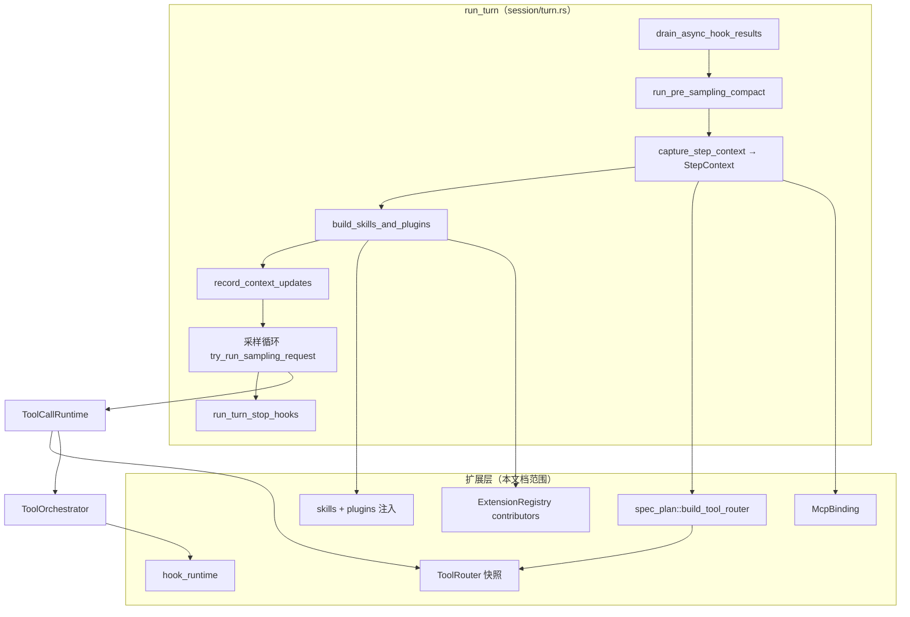

### 0.3 关键类型与文件

| 概念 | Rust 类型 / 函数 | 文件 |
|------|------------------|------|
| Turn 主循环 | `run_turn` | `core/src/session/turn.rs` |
| Step 快照 | `StepContext` | `core/src/session/step_context.rs` |
| 工具表快照 | `ToolRouter` | `core/src/tools/router.rs` |
| MCP 绑定 | `McpBinding` | `codex-mcp` crate |
| 扩展注册表 | `ExtensionRegistry<Config>` | `ext/extension-api/` |
| Skills 服务 | `HostSkillsService` | `skills-extension` + `core/src/skills.rs` |
| 插件管理 | `PluginsManager` | `core-plugins` + `core/src/plugins/` |

### 0.4 Turn 内扩展相关阶段表

| `run_turn` 阶段 | 扩展层动作 | 源码锚点 |
|-----------------|-----------|----------|
| Turn 开始前 | 异步 Hook 结果 drain | `hook_runtime::drain_async_hook_results` |
| 首 Step 捕获 | `build_tool_router`、MCP bind | `capture_step_context_with_required_mcp_servers` |
| 用户输入落盘前 | SessionStart / UserPromptSubmit hooks | `run_hooks_and_record_inputs` |
| 上下文注入 | Skills、Plugins、extension turn items | `build_skills_and_plugins` |
| 流式采样 | 工具并行调度 | `try_run_sampling_request` + `FuturesOrdered` |
| Turn 结束 | Stop hooks、legacy after-agent | `run_turn_stop_hooks` |

### 0.5 Step 边界时序

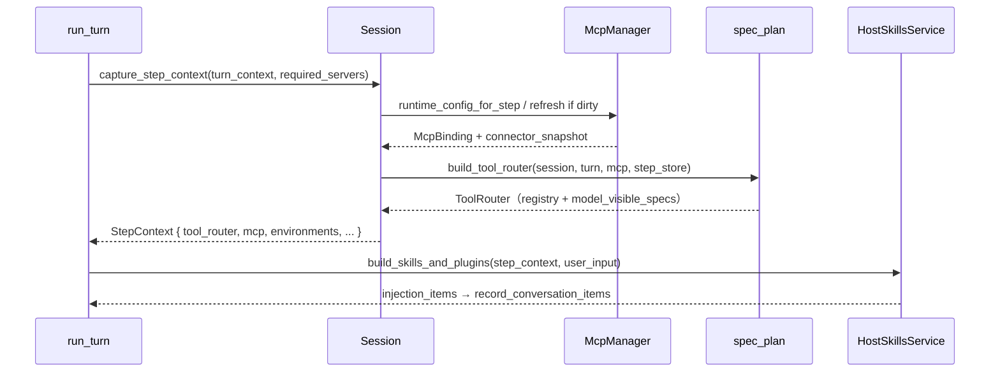

### 0.6 Guardian 基本会话的扩展裁剪

当 `is_basic_session_source(session)` 为真时，扩展层进入 **最小能力面**（审查 transcript 不被污染）：

| 子系统 | 正常会话 | Guardian basic 会话 |
|--------|----------|---------------------|
| MCP 工具 | 全量 server catalog | **跳过** |
| Extension tools | `extension_tool_executors` | **跳过** |
| Hosted tools | web_search 等 | **跳过** |
| Skills / Plugins 注入 | `build_skills_and_plugins` | **跳过** mention 解析 |
| Shell | `exec_command` / `write_stdin` | 保留（受管沙箱） |
| Core utilities | plan, permissions 等 | 大部分 **跳过** |

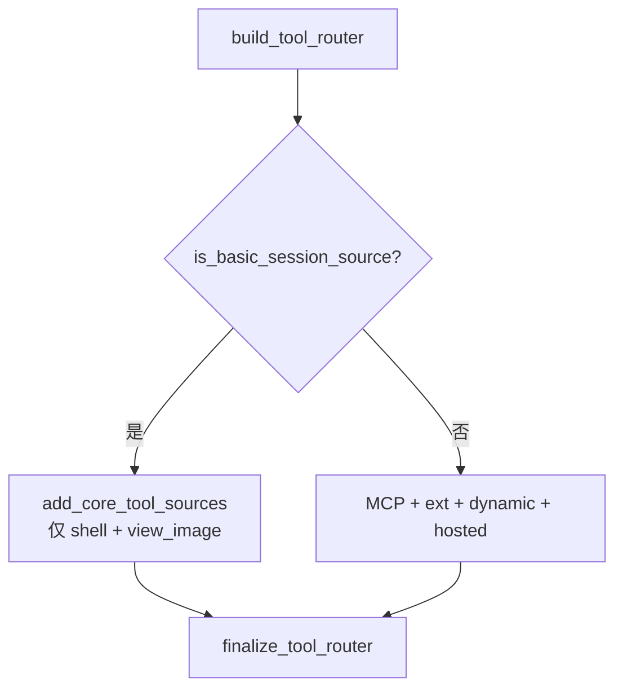

**源码锚点**: `spec_plan.rs:147-155`（Guardian 分支直接 `finalize`，不注册 MCP）。

### 0.7 扩展层错误传播

| 失败点 | 错误类型 | Turn 影响 |
|--------|----------|-----------|
| `build_tool_router` 碰撞 | `CodexErrorDetails::ToolCollision` | Step 无法开始；Turn 失败 |
| MCP refresh 超时 | `CodexErr` + 用户事件 | 可能降级无 MCP 工具 |
| Hook `Blocked` | `PreToolUseHookResult` | 工具不执行；模型收到 hook 消息 |
| Guardian 熔断 | `InterruptTurn` | 整个 Turn 取消 |
| Code Mode 进程不可用 | `effective_tool_mode` → Direct | 降级；可能 `take_unavailable_warning` |

---

## 第 1 章：工具系统设计目标

### 1.1 设计哲学与不变量

Codex 工具层用 **两个正交抽象** 拆分「注册」与「执行策略」：

| 抽象 | 职责 | 不变量 |
|------|------|--------|
| **ToolRouter** | Step 级工具目录 + 模型可见 `ToolSpec[]` | 构建后只读；碰撞在 `finalize_tool_router` 失败或记警告 |
| **ToolOrchestrator** | 审批 → 沙箱选择 → 执行 → 升级重试 | 升级重试利用审批缓存，默认不二次打扰用户 |
| **ToolRegistry** | `ToolName → CoreToolRuntime` + `ToolExposure` | 内置工具 `register_trusted`；MCP/扩展 `register_external` |
| **ToolCallRuntime** | 并发门闸 + 取消 + 分发 | 非并行工具持写锁；并行工具共享读锁 |

额外目标：

- **模式正交** — `ToolMode::{Direct, CodeMode, CodeModeOnly}` 决定模型见 Direct spec 还是 Code Mode 嵌套定义（第 11 章）。
- **可观测** — `ToolDispatchTrace`、`ExecutedToolCallRecorder`、`codex.tool_call` 日志。
- **Hook 契约稳定** — `HookToolName` 与 `pre_tool_use_payload` / `post_tool_use_payload` 在 registry 层统一。

### 1.2 模块架构

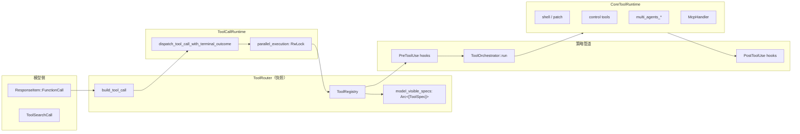

### 1.3 核心类型与文件

| 类型 / 函数 | 文件 |
|-------------|------|
| `ToolRouter`, `ToolCall`, `build_tool_call` | `core/src/tools/router.rs` |
| `ToolRegistry`, `CoreToolRuntime`, `dispatch_any_with_terminal_outcome` | `core/src/tools/registry.rs` |
| `ToolOrchestrator`, `OrchestratorRunResult` | `core/src/tools/orchestrator.rs` |
| `ToolCallRuntime` | `core/src/tools/parallel.rs` |
| `ToolRuntime`, `SandboxAttempt`, `ApprovalStore` | `core/src/tools/sandboxing.rs` |
| `ApprovalContext`, `Session::request_approval` | `core/src/tools/approvals.rs` |
| `build_tool_router`, `finalize_tool_router` | `core/src/tools/spec_plan.rs` |
| `ToolMode`, `effective_tool_mode` | `core/src/tools/mod.rs` |

### 1.4 概念—代码对照

| 设计概念 | 实现 |
|----------|------|
| 工具快照 | `StepContext.tool_router: Arc<ToolRouter>` |
| 模型工具列表 | `ToolRouter::model_visible_specs()` → Prompt tools 字段 |
| 并行能力声明 | `CoreToolRuntime::supports_parallel_tool_calls` |
| 暴露面 | `ToolExposure`: Direct / Deferred / CodeModeOnly / Hidden |
| 工具输出格式化 | `format_exec_output_for_model`（`tools/mod.rs`） |
| 碰撞检测 | `CodexErrorDetails::ToolCollision`（`spec_plan::finalize_tool_router`） |

### 1.5 ToolMode 解析

```67:88:codex/codex-rs/core/src/tools/mod.rs
pub(crate) fn requested_tool_mode(turn_context: &TurnContext) -> ToolMode {
    turn_context.model_info.tool_mode.unwrap_or_else(|| {
        if turn_context.config.features.enabled(Feature::CodeModeOnly) {
            ToolMode::CodeModeOnly
        } else if turn_context.config.features.enabled(Feature::CodeMode) {
            ToolMode::CodeMode
        } else {
            ToolMode::Direct
        }
    })
}
```

`effective_tool_mode` 在 Code Mode 进程不可用时回退 `Direct`（除非 `disable_in_process_fallback`）。

### 1.6 端到端数据流

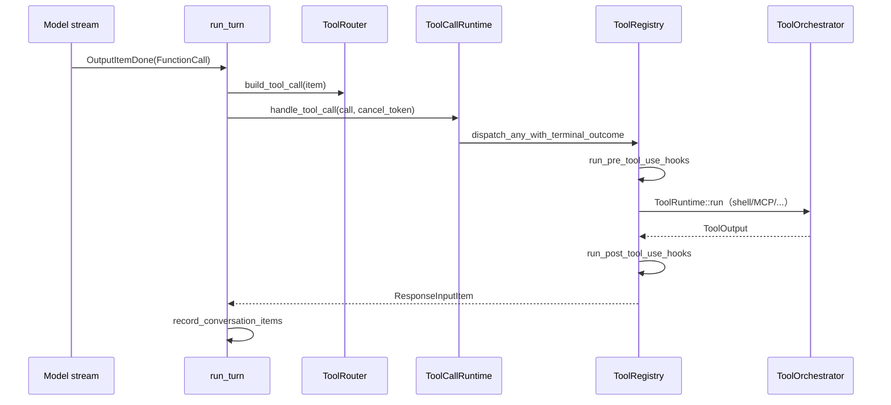

### 1.7 `ToolRegistry` 分发管道（registry 层）

**文件**: `core/src/tools/registry.rs`

`dispatch_any_with_terminal_outcome` 是 handler 执行的**统一前门**（在 `ToolOrchestrator` 之前已跑 PreToolUse）：

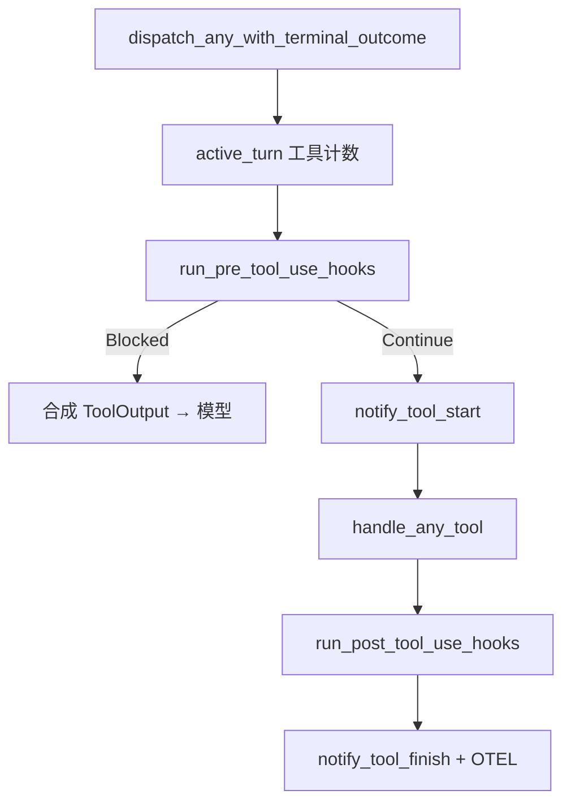

| 步骤 | 可改写内容 | 持久化 |
|------|-----------|--------|
| PreToolUse | `tool_input` JSON | Hook 事件 |
| Handler | 副作用（FS/网络） | `FunctionCallOutput` |
| PostToolUse | 模型可见输出文本 | 可选额外 context |

### 1.8 `ToolExposure` 与模型/API 两面

**文件**: `tools/src/tool_executor.rs`

| 暴露位 | 模型见 Direct spec？ | Code Mode cell 内？ | `tool_search` 后发现？ |
|--------|---------------------|--------------------|-----------------------|
| `Direct` | ✅ | ✅（除非 excluded） | N/A |
| `Deferred` | ❌（初始） | ✅ | ✅ |
| `DirectModelOnly` | ✅ | ❌ | N/A |
| `CodeModeOnly` | ❌ | ✅ | N/A |
| `Hidden` | ❌ | ❌ | ❌ |

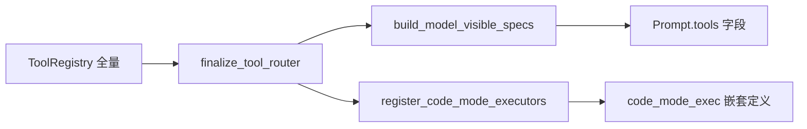

---

## 第 2 章：spec_plan 与 build_tool_router

### 2.1 设计哲学与不变量

`build_tool_router` 是 **Step 级工具组合的单一入口**。设计原则：

1. **分阶段合并** — 先注册 core handlers，再 MCP / 扩展 / dynamic tools，最后 `finalize` 处理 Code Mode、`tool_search`、namespace 合并。
2. **暴露策略后置** — MCP `omit_tools_from`、Code Mode namespace、`tool_search` 启用等都在 registry 填满后由 `apply_mcp_tool_exposure_policy` 与 `finalize_tool_router` 决定。
3. **Guardian 最小面** — `is_basic_session_source` 时跳过 MCP/扩展/hosted tools，仅保留受管沙箱下的 `exec_command` / `write_stdin` / `view_image`。
4. **外部工具非覆盖** — `register_external` 遇重名记 `first_collision`，不静默覆盖内置工具。

### 2.2 组合阶段

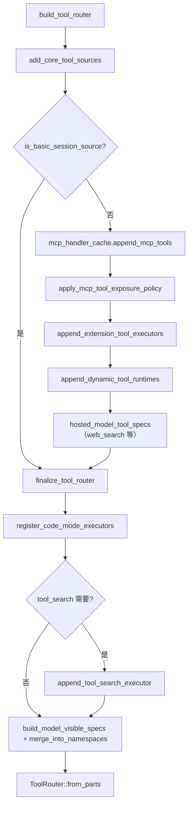

### 2.3 Core 工具分派（add_core_tool_sources）

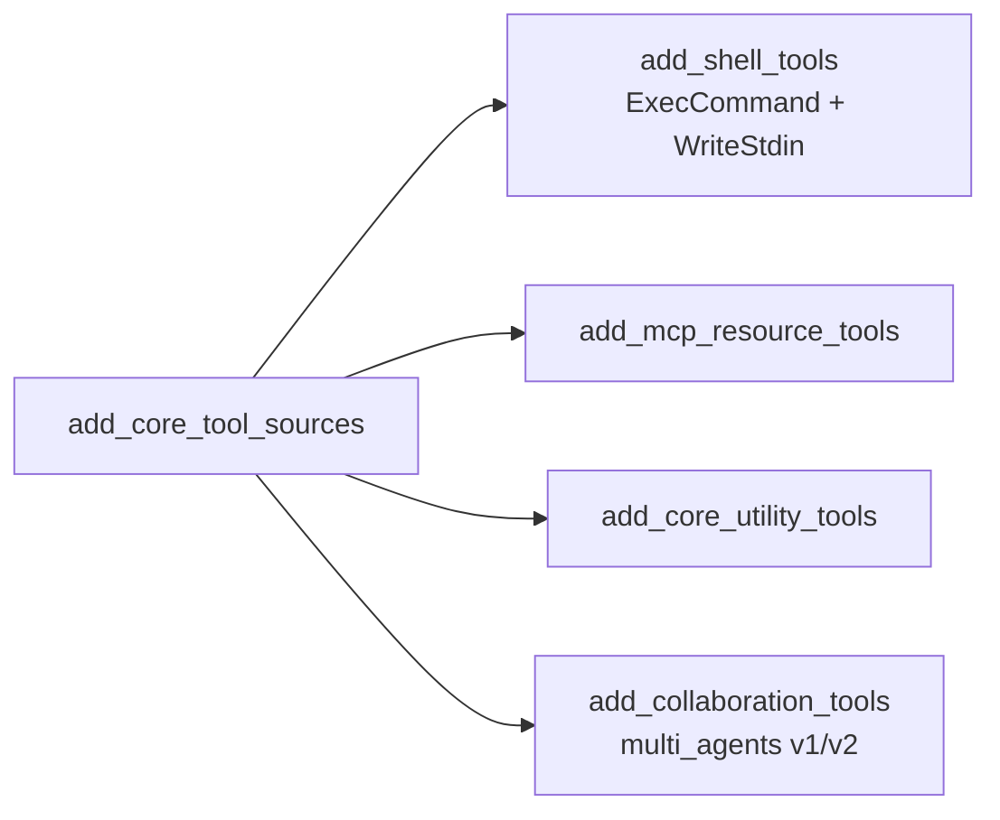

| 子函数 | 注册的典型 Handler | 门控 Feature |
|--------|-------------------|--------------|
| `add_shell_tools` | `ExecCommandHandler`, `WriteStdinHandler` | `ShellTool`, `UnifiedExec` |
| `add_mcp_resource_tools` | `ListMcpResources*`, `ReadMcpResource` | `mcp.has_servers()` |
| `add_core_utility_tools` | `PlanHandler`, `RequestUserInput`, `GetContextRemaining`, … | 各 `Feature::*` |
| `add_collaboration_tools` | `SpawnAgent*`, `Wait*`, `SendMessage*`, … | `MultiAgentVersion` |

### 2.4 关键函数与文件

| 函数 | 文件 | 作用 |
|------|------|------|
| `build_tool_router` | `spec_plan.rs:117` | 主入口 |
| `add_core_tool_sources` | `spec_plan.rs:888` | 内置 handler 注册 |
| `extension_tool_executors` | `spec_plan.rs:294` | 遍历 `ExtensionRegistry::tool_contributors` |
| `finalize_tool_router` | `spec_plan.rs:313` | Code Mode / tool_search / 碰撞 / visible specs |
| `build_model_visible_specs` | `spec_plan.rs:483` | 过滤 `ToolExposure::is_direct()` |
| `apply_mcp_tool_exposure_policy` | `spec_plan.rs:173` | MCP server 级 omit + deferred 规则 |

### 2.5 ToolExposure 决策表（finalize 后）

| 条件 | 典型结果 |
|------|----------|
| 默认内置工具 | `ToolExposure::Direct` |
| MCP `omit_tools_from` 含 DIRECT | 降为 Deferred 或 Hidden |
| `direct_only_tool_namespaces` 配置 | `DirectModelOnly`（仅模型可见，不进 Code Mode cell） |
| `tool_search` 启用且有 deferred 工具 | deferred 工具从 DIRECT 暴露中移除 |
| Code Mode 嵌套赢家 | `augment_tool_spec_for_code_mode` |

### 2.6 Step 内调用链

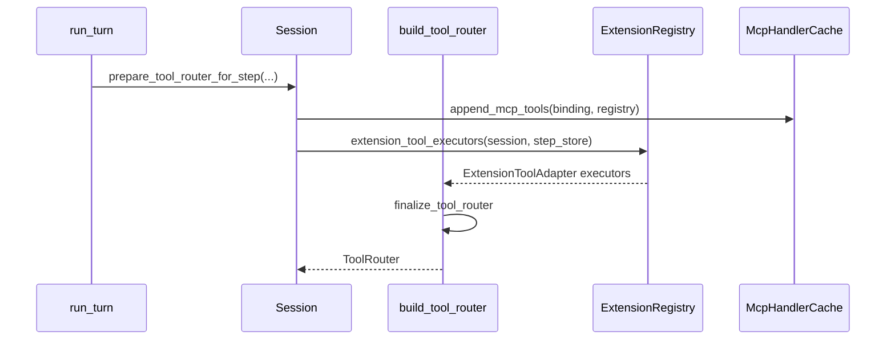

### 2.7 Feature 门控矩阵

**文件**: `spec_plan.rs`（helper 函数区）

| Feature / 配置 | 影响的工具 / 行为 | 函数 |
|----------------|------------------|------|
| `Feature::ShellTool` / `UnifiedExec` | exec_command / write_stdin | `add_shell_tools` |
| `Feature::CodeMode` / `CodeModeOnly` | Code Mode 路径 | `effective_tool_mode` |
| `Feature::MultiAgentVersion` | v1 vs v2 namespace | `add_collaboration_tools` |
| `tool_search` 配置 | deferred 暴露 + search handler | `search_tool_enabled` |
| `apps_enabled` | Codex Apps MCP 过滤 | `filter_codex_apps_mcp_tools` |
| `parallel_tool_calls` | 模型请求 + 门闸 | `build_prompt` |

### 2.8 `tool_search` 与 Deferred 发现

当 `tool_search` 启用时，`finalize_tool_router` 追加 `ToolSearchHandler`，并将大量 MCP 工具标为 `Deferred`：

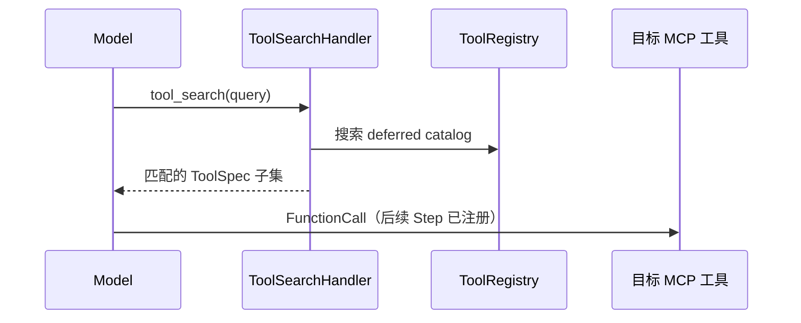

| 概念 | 文件 |
|------|------|
| `ToolSearchHandler` | `handlers/tool_search.rs` |
| `ToolSearchCache` | `handlers/tool_search.rs` |
| deferred 剥离 | `apply_mcp_tool_exposure_policy` |

### 2.9 碰撞与命名空间

| 碰撞类型 | 检测位置 | 结果 |
|----------|----------|------|
| 工具名重复 | `finalize_tool_router` | `ToolCollision` 错误或 warn |
| namespace 描述冲突 | `error_on_tool_collisions` | 构建失败 |
| MCP vs 内置 | `register_external` | `first_collision` 日志，不覆盖 |

---

## 第 3 章：ToolOrchestrator 状态机

### 3.1 设计哲学与不变量

`ToolOrchestrator` 是所有实现 `ToolRuntime` 的 handler 的 **统一策略管道**（`orchestrator.rs` 文件头注释）。核心不变量：

1. **审批先于沙箱** — `exec_approval_requirement` 决定 Skip / Forbidden / NeedsApproval。
2. **沙箱升级可跳过重复审批** — `should_bypass_approval` + `ApprovalStore`（`with_cached_approval`）在 `ApprovedForSession` 后不再提示。
3. **Strict auto-review 例外** — Guardian 严格模式下，沙箱升级必须重新 `request_approval`。
4. **Attachment 网络策略不可绕过** — `owner_network_policy` + `requires_escalated_permissions` 直接 `Rejected`。
5. **网络审批可延迟提交** — `DeferredNetworkApproval` 在成功执行后 `finish_deferred_network_approval`。

### 3.2 状态机

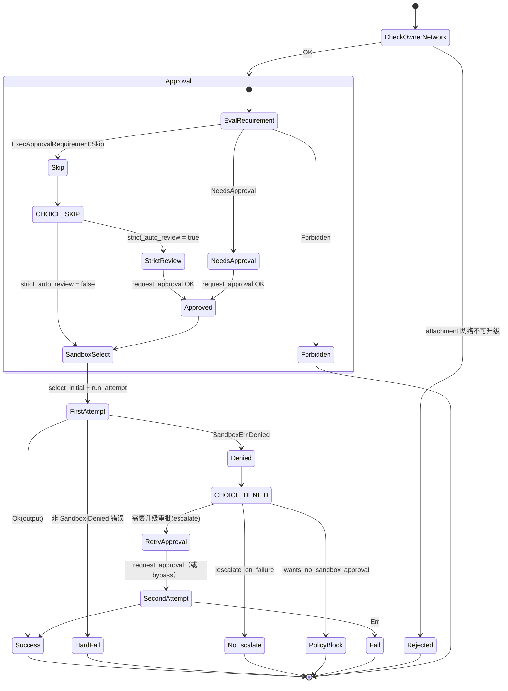

### 3.3 run_attempt 内部

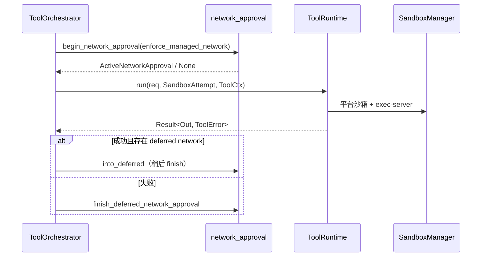

### 3.4 关键类型

| 类型 | 文件 | 说明 |
|------|------|------|
| `ToolOrchestrator` | `orchestrator.rs:40` | 持有 `SandboxManager` |
| `SandboxAttempt` | `sandboxing.rs` | 单次执行沙箱参数包 |
| `ExecApprovalRequirement` | `sandboxing.rs` | Skip / Forbidden / NeedsApproval |
| `ApprovalContext` | `approvals.rs:54` | 含 `GuardianReviewContext` |
| `ApprovalStore` | `sandboxing.rs:40` | Session 级审批缓存 |
| `with_cached_approval` | `sandboxing.rs:70` | 多 key（如 multi-file patch）会话缓存 |

### 3.5 审批缓存语义

| 场景 | 行为 |
|------|------|
| 用户选「本会话批准」 | 各 approval key 写入 `SessionServices.tool_approvals` |
| 沙箱拒绝后升级 | `retry_reason` 填入 `ApprovalContext`；若已 `already_approved` 且非 strict 可 bypass |
| `AskForApproval::OnRequest` + 网络拒绝 | 允许网络专项二次提示（`allow_on_request_network_prompt`） |
| OTel | `sandbox_outcome`: `denied` / `escalated` / `timed_out` |

### 3.6 与 Session 审批 API

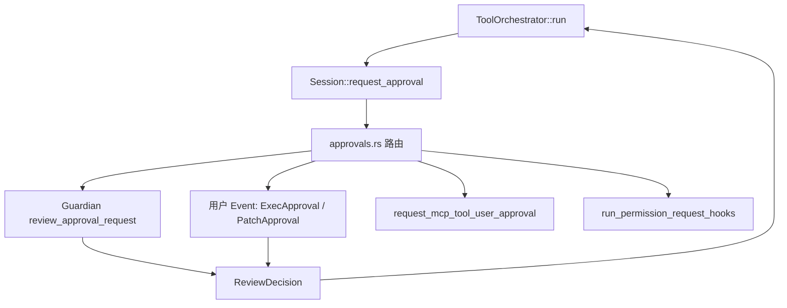

### 3.7 `ExecPolicy` 与 Orchestrator 交界

**文件**: `core/src/exec_policy.rs`, `core/src/tools/sandboxing.rs`

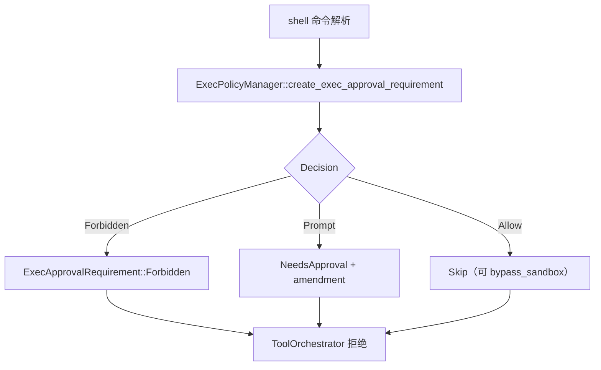

| `ExecPolicyAmendment` | UI 行为 | 持久化 |
|-----------------------|---------|--------|
| 用户批准 allow-prefix | 写入 `default.rules` | Session 级 + 磁盘 |
| 仅本次批准 | `ApprovalStore` | 内存 |
| Guardian Deny | 无 amendment | 审计 |

**默认规则路径**: `{codex_home}/rules/default.rules`（`ExecPolicyManager::default_policy_path`）。

### 3.8 网络审批子状态机

**文件**: `core/src/tools/network_approval.rs`（由 orchestrator 调用）

| 阶段 | 类型 | 说明 |
|------|------|------|
| 开始 | `ActiveNetworkApproval` | 工具执行前 `begin_network_approval` |
| 成功延迟提交 | `DeferredNetworkApproval` | 执行成功后 `finish_deferred` |
| 失败 | 立即 `finish_deferred_network_approval` | 不保留 pending |

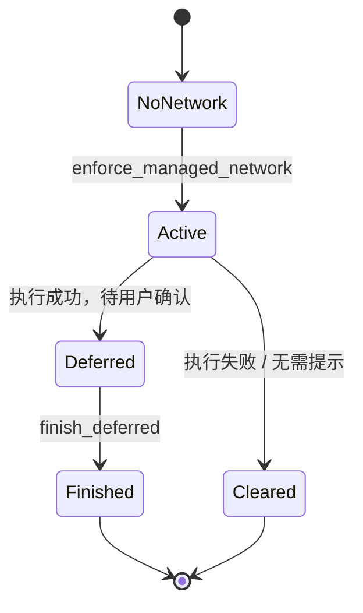

---

## 第 4 章：ToolCallRuntime 与并行调度

### 4.1 设计哲学与不变量

两层并行：

| 层级 | 机制 | 语义 |
|------|------|------|
| **响应内多工具** | `FuturesOrdered`（`turn.rs`） | 同一 `response.completed` 前发起的工具 future **按完成顺序** drain 进 history |
| **单工具执行门闸** | `ToolCallRuntime.parallel_execution: RwLock` | `supports_parallel` → 读锁；否则写锁（全局串行化非并行工具） |

不变量：

- 取消时若 handler 已到达 terminal outcome，保留完成结果而非伪造 abort。
- Code Mode 嵌套调用 **不** 创建 `ToolCallTimingGuard`（避免与父 `exec` 计时重叠）。
- `wait_until_ready`（MCP 等）在抢门闸 **之前** 等待。

### 4.2 并行门闸

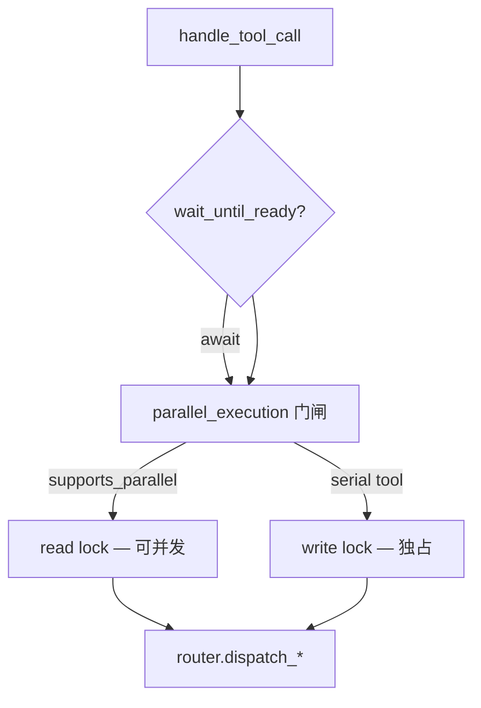

### 4.3 FuturesOrdered 在采样循环中

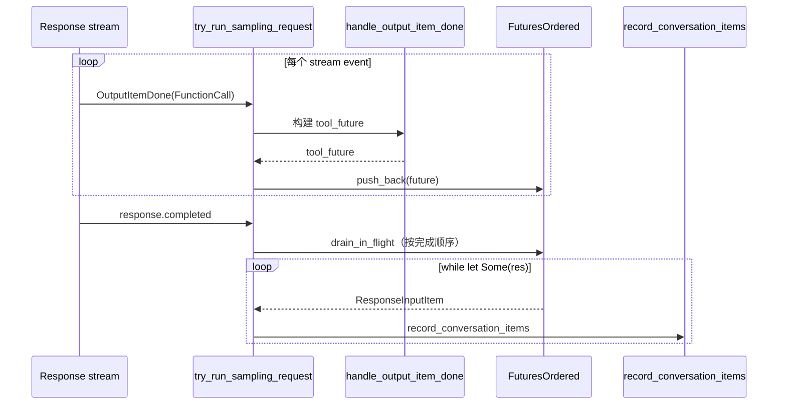

### 4.4 关键代码位置

| 符号 | 文件 |
|------|------|
| `ToolCallRuntime::handle_tool_call` | `parallel.rs:73` |
| `parallel_execution` 读/写锁 | `parallel.rs:152-156` |
| `FuturesOrdered` 声明 | `turn.rs:2225` |
| `in_flight.push_back` | `turn.rs:2393` |
| `drain_in_flight` | `turn.rs:2131` |
| `tool_supports_parallel` | `router.rs:137` |

### 4.5 并行 vs 串行对照表

| 工具类别 | `supports_parallel` | 原因 |
|----------|---------------------|------|
| 只读 MCP（`read_only_hint`） | 通常 true | 协议声明 |
| `exec_command` / `apply_patch` | false | 进程/文件系统副作用 |
| `update_plan` | false | Turn 状态机 |
| `spawn_agent` 等 | false | Agent 树一致性 |
| 测试 `ImmediateHandler` | 可配置 | 单测 |

### 4.6 取消语义与 `AbortOnDropHandle`

**文件**: `parallel.rs:179-201`

| 场景 | 行为 |
|------|------|
| Turn `CancellationToken` 触发 | `select!` 取消 future |
| Handler 已达 terminal outcome | **保留**完成结果，不伪造 abort |
| Code Mode 嵌套 | 无 `ToolCallTimingGuard`；父 exec 计时不受影响 |
| `wait_until_ready` 等待中取消 | 在门闸之前退出 |

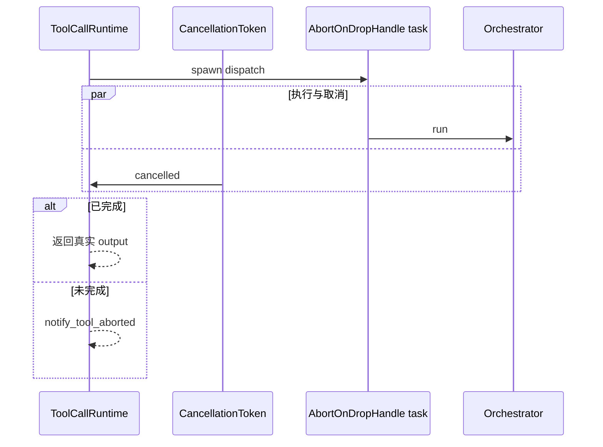

### 4.7 `ExecutedToolCallRecorder` 与审计

| 字段 | 用途 |
|------|------|
| `call_id` | 与 `FunctionCall` 关联 |
| `tool_name` | OTEL / analytics |
| `parallel_group` | 并行批次标识 |
| terminal outcome | Rollout / state_db 工具事实 |

---

## 第 5 章：Handler 分类与执行路径

### 5.1 设计哲学

所有 handler 实现 `ToolExecutor<ToolInvocation>`，并通过 `CoreToolRuntime` 扩展 Hook / telemetry / diff / MCP 元数据。执行路径分三类：

1. **沙箱化本地运行时** — 实现 `ToolRuntime`，由 `ToolOrchestrator` 包装（shell、patch）。
2. **直通 handler** — `handle()` 内自行完成逻辑（plan、control、部分 MCP resource）。
3. **Code Mode 嵌套** — `CodeModeExecuteHandler` 在 cell 内再调 `ToolCallRuntime`（`ToolCallSource::CodeMode`）。

### 5.2 分类总览

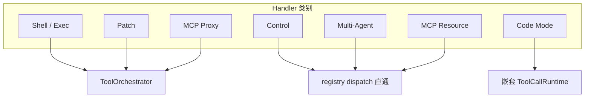

### 5.3 Shell / Exec

```mermaid
sequenceDiagram
    participant M as Model
    participant H as ExecCommandHandler
    participant OR as ToolOrchestrator
    participant UE as unified_exec / process_manager
    participant SK as maybe_emit_implicit_skill

    M->>H: exec_command
    H->>OR: UnifiedExecRuntime::run
    OR->>OR: approval + sandbox
    OR->>UE: spawn / write_stdin
    UE->>SK: 检测 $skill 隐式调用
    UE-->>H: ExecToolCallOutput
    H-->>M: format_exec_output_for_model
```

| 符号 | 文件 |
|------|------|
| `ExecCommandHandler` | `handlers/unified_exec/exec_command.rs` |
| `WriteStdinHandler` | `handlers/unified_exec/write_stdin.rs` |
| `UnifiedExecRuntime` | `tools/runtimes/unified_exec.rs` |
| `process_manager` | `unified_exec/process_manager.rs` |

### 5.4 Patch

```mermaid
sequenceDiagram
    participant M as Model
    participant H as ApplyPatchHandler
    participant OR as ToolOrchestrator
    participant AP as ApplyPatchRuntime

    M->>H: apply_patch
    H->>OR: run
    OR->>OR: PatchApproval（独立 Op 通道）
    OR->>AP: sandboxed patch apply
    AP-->>M: diff + success flag
```

| 符号 | 文件 |
|------|------|
| `ApplyPatchHandler` | `handlers/apply_patch.rs` |
| `ApplyPatchRuntime` | `tools/runtimes/apply_patch.rs` |
| `ApplyPatchApprovalKey` | `runtimes/apply_patch.rs` |

### 5.5 Control（计划 / 权限 / 上下文）

```mermaid
sequenceDiagram
    participant M as Model
    participant REG as ToolRegistry
    participant H as PlanHandler / RequestPermissionsHandler
    participant S as Session

    M->>REG: update_plan / request_permissions
    REG->>REG: pre_tool_use hooks
    REG->>H: handle（无 Orchestrator）
    H->>S: 更新 plan state / 发 Event
    H-->>M: FunctionToolOutput
```

| Handler | 文件 | 副作用 |
|---------|------|--------|
| `PlanHandler` | `handlers/plan.rs` | `PlanDeltaEvent` |
| `RequestPermissionsHandler` | `handlers/request_permissions.rs` | 权限升级 UI |
| `NewContextWindowHandler` | `handlers/new_context_window.rs` | 换窗 |
| `GetContextRemainingHandler` | `handlers/get_context_remaining.rs` | token 预算 |

### 5.6 Multi-Agent

```mermaid
sequenceDiagram
    participant M as Model
    participant H as SpawnAgentHandler V2
    participant AC as AgentControl
    participant TM as ThreadManager

    M->>H: collaboration.spawn_agent
    H->>AC: spawn_tree / followup
    AC->>TM: 新 Thread + Session
    TM-->>H: agent_id
    H-->>M: 结构化结果
```

| 版本 | Namespace | 文件目录 |
|------|-----------|----------|
| V1 | `multi_agent` | `handlers/multi_agents/` |
| V2 | `collaboration` | `handlers/multi_agents_v2/` |
| 共享 | — | `handlers/multi_agents_common.rs`, `multi_agents_spec.rs` |

### 5.7 MCP Proxy

```mermaid
sequenceDiagram
    participant M as Model
    participant MH as McpHandler
    participant OR as ToolOrchestrator
    participant MC as mcp_tool_call

    M->>MH: namespace.tool
    MH->>OR: run（可能仅需直通）
    OR->>MC: handle_mcp_tool_call
    MC->>MC: RMCP tools/call + elicitation
    MC-->>M: McpToolOutput
```

| 符号 | 文件 |
|------|------|
| `McpHandler` | `handlers/mcp.rs` |
| `handle_mcp_tool_call` | `mcp_tool_call.rs` |
| `McpHandlerCache` | `mcp_tool_exposure.rs` |

### 5.8 Handler 模块索引

| 目录 / 文件 | 类别 |
|-------------|------|
| `handlers/unified_exec/` | Shell |
| `handlers/apply_patch.rs` | Patch |
| `handlers/plan.rs`, `request_*.rs` | Control |
| `handlers/multi_agents*` | Multi-Agent |
| `handlers/mcp.rs`, `mcp_resource.rs` | MCP |
| `handlers/tool_search.rs` | Deferred 发现 |
| `handlers/dynamic.rs` | `SessionConfiguration.dynamic_tools` |
| `handlers/extension_tools.rs` | Extension adapter |
| `code_mode/*` | Code Mode 公共/等待 |

### 5.9 `ToolRuntime` trait 契约

**文件**: `core/src/tools/sandboxing.rs:363+`

实现 `ToolRuntime` 的 handler（shell、patch、MCP）必须提供：

| 方法 | 作用 |
|------|------|
| `exec_approval_requirement` | 覆盖默认 ExecPolicy 推导 |
| `sandbox_preference` | 首次尝试沙箱级别 |
| `escalate_on_failure` | 拒绝后是否升级重试 |
| `run(SandboxAttempt)` | 实际执行 |
| `network_approval_spec` | 可选托管网络策略 |

```mermaid
classDiagram
    class ToolExecutor~T~ {
        +handle(invocation) ToolOutput
        +supports_parallel_tool_calls() bool
    }
    class ToolRuntime~Req,Out~ {
        +run(req, SandboxAttempt) Result
        +exec_approval_requirement()
    }
    class CoreToolRuntime {
        +dispatch hooks/telemetry
    }
    ToolExecutor <|-- CoreToolRuntime
    ToolRuntime <|.. UnifiedExecRuntime
    ToolRuntime <|.. ApplyPatchRuntime
```

### 5.10 隐式 Skill 发射（Shell 路径）

**文件**: `core/src/skills.rs:83+`, `handlers/unified_exec/`

`exec_command` 成功路径调用 `maybe_emit_implicit_skill_invocation`：

```mermaid
sequenceDiagram
    participant UE as unified_exec
    participant DET as detect_implicit_skill_invocation
    participant EXT as extension skill_invocation_contributors
    participant H as history

    UE->>DET: 命令行 + cwd
    DET->>EXT: on_skill_invocation
    EXT-->>H: ContextualUserFragment（每 Turn 一次）
```

---

## 第 6 章：MCP 集成

### 6.1 设计哲学与不变量

MCP 在 Codex 中分三层：

1. **配置投影** — `McpManager::runtime_config_for_step` 合并 config.toml、Plugins、Extension overlays、Selected plugins。
2. **运行时绑定** — `McpBinding` 是 Step 快照上的已连接 server + tool catalog。
3. **工具表面** — `McpHandler` 把 RMCP tool 映射为 `ToolSpec` + `CoreToolRuntime`；暴露策略由 server 配置与 `AppToolPolicyEvaluator` 决定。

不变量：

- **刷新串行化** — `McpRefresh` 信号量保证 publish 单飞；取消时 `McpRefreshInvalidationGuard` 恢复 dirty。
- **Prewarm 尽力而为** — 通道合并请求；正确性仍以 Step 捕获时 refresh 为准。
- **Elicitation 可 Guardian 审查** — `GuardianMcpElicitationReviewer` 在 server 要用户输入时介入。
- **缓存一致性** — `McpHandlerCache` 在 `McpBinding` 指针变化时失效。

### 6.2 McpManager 架构

```mermaid
flowchart TB
    subgraph MM["McpManager（core/src/mcp.rs）"]
        PM["PluginsManager"]
        ER["ExtensionRegistry"]
        CACHE["McpToolCatalogCache"]
        APPS["ConnectorRuntimeManager ToolInfo"]
    end

    CFG["Config + TurnEnvironment"] --> PROJ["runtime_config_for_step"]
    PROJ --> OVER["Extension McpServerContribution overlays"]
    OVER --> EFF["effective_mcp_servers"]
    EFF --> BIND["McpBinding（codex-mcp）"]

    BIND --> STEP["StepContext.mcp"]
    STEP --> ROUTER["append_mcp_tools → McpHandler"]
```

### 6.3 Prewarm 与 Refresh

```mermaid
sequenceDiagram
    participant UI as 配置变更 / Auth
    participant S as Session
    participant PW as mcp_prewarm worker
    participant RF as refresh_mcp_if_dirty
    participant GATE as McpRefresh.gate

    UI->>S: request_mcp_runtime_refresh()
    S->>S: mark_mcp_runtime_dirty + schedule_mcp_prewarm
    PW->>RF: refresh_mcp_if_dirty
    RF->>GATE: acquire permit
    RF->>RF: rebuild McpBinding, publish
    Note over RF: 取消未 publish → invalidate 恢复 dirty
```

| 组件 | 文件 |
|------|------|
| `McpManager` | `core/src/mcp.rs:73` |
| `request_mcp_runtime_refresh` | `session/mcp_prewarm.rs:9` |
| `McpRefresh` | `session/mcp_refresh.rs:8` |
| `refresh_mcp_if_dirty` | `session/mcp.rs`（impl Session） |
| `capture_step_context_*` | `session/handlers.rs` |

### 6.4 Elicitation

```mermaid
stateDiagram-v2
    [*] --> ServerRequests
    ServerRequests --> Review: ElicitationReviewer::review
    Review --> Guardian: 需策略审查
    Review --> ForwardUI: 直接转发客户端
    Guardian --> Decline: 拒绝
    Guardian --> Approve: 构造 ApprovalRequest
    ForwardUI --> UserResponse
    UserResponse --> Accept
    UserResponse --> Decline
    UserResponse --> Cancel
    Accept --> [*]
    Decline --> [*]
    Cancel --> [*]
```

| 概念 | 实现 |
|------|------|
| Reviewer trait | `codex_mcp::ElicitationReviewer` |
| Guardian 适配 | `GuardianMcpElicitationReviewer`（`session/mcp.rs`） |
| Session API | `Session::request_mcp_server_elicitation` |
| 工具安装 elicitation | `handlers/request_plugin_install.rs` |
| 执行暂停 | `elicitations.wait_until_clear`（Code Mode `execute_handler`） |

### 6.5 Exposure Policy

| 阶段 | 函数 | 规则 |
|------|------|------|
| 模型可见性过滤 | `tool_is_model_visible` | `codex-mcp` + connector policy |
| Registry 注册 | `append_mcp_tools` | `mcp_tool_exposure.rs` |
| 暴露位运算 | `apply_mcp_tool_exposure_policy` | `omit_tools_from`、deferred、code_mode namespace |
| Apps | `AppToolPolicyEvaluator` | `connectors.rs` + config layer stack |
| Agent plugin 体积上限 | `MAX_AGENT_PLUGIN_MCP_*` | `mcp_tool_exposure.rs` |

### 6.6 MCP 概念表

| 概念 | 类型 / 函数 | Crate / 路径 |
|------|-------------|--------------|
| Server 注册 | `McpServerRegistration` | `codex-mcp` |
| 工具元数据 | `ToolInfo` | `codex-mcp` |
| RMCP 客户端 | `rmcp-client` | `codex-rs/rmcp-client/` |
| MCP resource 工具 | `ReadMcpResourceHandler` | `handlers/mcp_resource.rs` |
| Turn 元数据 | `McpTurnMetadataContext` | `turn_metadata.rs` |
| Skill 依赖安装 | `maybe_prompt_and_install_mcp_dependencies` | `mcp_skill_dependencies.rs` |

### 6.7 `McpManager` 配置投影链

**文件**: `core/src/mcp.rs`

```mermaid
flowchart TB
    CFG["config.toml mcp_servers"] --> PM["PluginsManager 选中 plugin"]
    PM --> ER["ExtensionRegistry McpServerContribution"]
    ER --> PROJ["runtime_config_for_step"]
    PROJ --> EFF["effective_mcp_servers"]
    EFF --> BIND["McpBinding::connect"]
    BIND --> CACHE["McpToolCatalogCache"]
```

| 函数 | 输入 | 输出 |
|------|------|------|
| `runtime_config` | 全局 Config | 静态 server 列表 |
| `runtime_config_for_step` | TurnEnvironment + plugins | Step 级有效配置 |
| `configured_servers` | — | 用户声明的 server |
| `effective_servers` | overlays 后 | 实际连接目标 |

### 6.8 RMCP 工具调用路径

**文件**: `core/src/mcp_tool_call.rs`, `rmcp-client/`

```mermaid
sequenceDiagram
    participant MH as McpHandler
    participant OR as ToolOrchestrator
    participant MC as handle_mcp_tool_call
    participant RMCP as rmcp-client
    participant SRV as MCP Server

    MH->>OR: run（若需审批）
    OR->>MC: tools/call
    MC->>RMCP: JSON-RPC
    RMCP->>SRV: 协议帧
    SRV-->>RMCP: result / elicitation
    RMCP-->>MC: McpToolOutput
    MC-->>MH: 格式化模型输出
```

### 6.9 Connector / Apps 策略栈

**文件**: `core/src/connectors.rs`, `mcp_tool_exposure.rs`

| 层 | 类型 | 作用 |
|----|------|------|
| OAuth 连接器 | `ConnectorSnapshot` | Slack 等托管 MCP |
| 策略求值 | `AppToolPolicyEvaluator` | 按 app id 过滤工具 |
| 体积上限 | `MAX_AGENT_PLUGIN_MCP_*` | 防止 agent plugin 撑爆 schema |

---

## 第 7 章：Skills 系统

### 7.1 设计哲学与不变量

Skills 是 **可引用的指令包**（`SKILL.md`），通过两条路径进入模型上下文：

1. **显式（Explicit）** — 用户在 `UserInput` 中 `@skill` 或 mention；`collect_explicit_skill_mentions` 解析。
2. **隐式（Implicit）** — Shell 命令行匹配 skill 触发器；`detect_implicit_skill_invocation` 在 `exec_command` 路径检测。

不变量：

- 注入内容必须是 **有界 fragment**（PART1 Context 规则；单条 &lt; 10K tokens）。
- 同一 Turn 隐式 skill 只计一次（`ImplicitSkillInvocations` HashSet）。
- Guardian 基本会话 **不** 解析 skill mention（防 transcript 污染）。
- 显式与隐式均上报 analytics（`codex.skill.injected`）。

### 7.2 注入流水线

```mermaid
flowchart TB
    UI["UserInput"] --> EXP["collect_explicit_skill_mentions"]
    UI --> TURN["build_skills_and_plugins"]
    TURN --> SNAP["turn_context.skills_snapshot()"]
    SNAP --> LOAD["load_skill_prompts(mentioned)"]
    LOAD --> FRAG["ContextualUserFragment → ResponseItem"]
    FRAG --> REC["record_conversation_items"]

    EXEC["exec_command"] --> IMP["detect_implicit_skill_invocation"]
    IMP --> EXT["Extension skill_invocation_contributors"]
    IMP --> ANA["track_skill_invocations"]
```

### 7.3 显式 vs 隐式时序

```mermaid
sequenceDiagram
    participant U as User
    participant RT as run_turn
    participant SK as HostSkillsService
    participant H as exec_command

    Note over U,RT: 显式路径（Turn 开始）
    U->>RT: @my-skill 问题
    RT->>SK: load_skill_prompts
    SK-->>RT: fragments + injected metadata
    RT->>RT: emit_explicit_skill_invocations

    Note over H,RT: 隐式路径（工具执行中）
    U->>H: 命令含 skill 触发器
    H->>H: maybe_emit_implicit_skill_invocation
    H->>H: extension contributors on_skill_invocation
```

### 7.4 关键类型与文件

| 符号 | 文件 |
|------|------|
| `HostSkillsService` | `skills-extension` + `thread_manager.rs` |
| `skills_load_input_from_config` | `core/src/skills.rs:25` |
| `emit_explicit_skill_invocations` | `skills.rs:36` |
| `maybe_emit_implicit_skill_invocation` | `skills.rs:83` |
| `build_skills_and_plugins` | `session/turn.rs:758` |
| `InjectedHostSkillPrompts` | `extension_data`（去重已注入路径） |
| `PluginSkillRoot` | `codex_utils_plugins` |

### 7.5 Skills 概念对照

| 概念 | 实现 |
|------|------|
| Skill 元数据 | `codex_skills::SkillMetadata` |
| Scope | `SkillScope`: User / Repo / System / Admin |
| Mention 解析 | `codex_skills::collect_explicit_skill_mentions` |
| MCP skill URI | `skill://` resource（`mcp_resource_tests.rs`） |
| Bundled skills | `Config::bundled_skills_enabled` |
| 与 Plugin 交集 | `effective_skill_roots` + `PluginSkillRoot` |

### 7.6 Skill 发现与 Scope

**Crate**: `codex-skills`, `codex_utils_plugins`

| `SkillScope` | 搜索根 | 优先级 |
|--------------|--------|--------|
| `User` | `~/.codex/skills` | 低 |
| `Repo` | 项目内 `.codex/skills` | 中 |
| `System` / `Admin` | 安装包 / 企业目录 | 高 |

```mermaid
flowchart TB
    CFG["Config + PluginsManager"] --> ROOTS["effective_skill_roots"]
    ROOTS --> DISC["SkillMetadata 索引"]
    DISC --> MENTION["@skill mention 解析"]
    DISC --> TRIG["shell 触发器表"]
    MENTION --> LOAD["load_skill_prompts"]
    TRIG --> IMP["detect_implicit_skill_invocation"]
```

### 7.7 `InjectedHostSkillPrompts` 去重

**文件**: `extension_data`（Session 扩展存储）

同一 Turn 内同一路径的 skill prompt **只注入一次**，防止 steer 或重复 mention 导致上下文膨胀：

| 键 | 语义 |
|----|------|
| skill 路径 | 已注入的 `SKILL.md` 绝对路径 |
| 与 compact 关系 | 压缩后若 skill 仍在 mention 中可再注入（新 window） |

### 7.8 Analytics：`codex.skill.injected`

| 字段 | 来源 |
|------|------|
| skill name | `SkillMetadata` |
| location | explicit vs implicit |
| turn_id | `TrackEventsContext` |

---

## 第 8 章：四层安全决策树

### 8.1 设计哲学

Codex 对「工具能否执行」采用 **纵深防御**，四层正交检查；任一层拒绝则 fail closed（或转用户 / Guardian）：

```mermaid
flowchart TB
    REQ["工具调用请求"] --> L1{"① ExecPolicy / 规则引擎"}
    L1 -->|Forbidden| R1["Rejected"]
    L1 --> L2{"② AskForApproval + ApprovalStore"}
    L2 -->|NeedsApproval| AP["用户 / Guardian / Hook PermissionRequest"]
    AP --> L3{"③ SandboxManager"}
    L3 -->|Denied 可升级| ESC["升级重试 + 可选二次审批"]
    L3 --> L4{"④ Hooks PreToolUse"}
    L4 -->|Blocked| R2["RespondToModel"]
    L4 --> EXEC["执行"]
    ESC --> EXEC
```

### 8.2 各层详解

#### 层 1：ExecPolicy（声明式策略）

| 概念 | 位置 |
|------|------|
| Shell 解析 | `codex-shell-command`, `execpolicy` crate |
| 默认需求推导 | `default_exec_approval_requirement`（`sandboxing.rs`） |
| Per-tool 覆盖 | `ToolRuntime::exec_approval_requirement` |
| 网络策略 | `NetworkProxySpec`, `effective_network_sandbox_policy` |

#### 层 2：审批（人类 / Guardian / 缓存）

```mermaid
flowchart LR
    AR["ApprovalAction"] --> RT{"routes_approval_to_guardian?"}
    RT -->|是| G["Guardian review_session"]
    RT -->|否| UI["Event → Op::ExecApproval"]
    G --> DEC["ReviewDecision"]
    UI --> DEC
    DEC --> CACHE["ApprovalStore ApprovedForSession"]
```

| 组件 | 文件 |
|------|------|
| Guardian 主逻辑 | `guardian/review.rs`, `review_session.rs` |
| 熔断 | `GuardianRejectionCircuitBreaker`（`guardian/mod.rs`） |
| MCP 工具审批 | `approvals.rs` → `request_mcp_tool_user_approval` |
| Patch 审批 | `ApprovalAction::ApplyPatch` |
| Strict auto-review | `active_turn_context_and_strict_auto_review` |

#### 层 3：沙箱（OS / 托管）

| 平台 | 实现 |
|------|------|
| macOS | `sandbox-exec` / Seatbelt |
| Linux | Landlock + `codex-linux-sandbox` |
| Windows | `windows-sandbox-rs` |
| 远程 | `exec-server` executor 侧沙箱 |
| 网络 | `network_approval.rs`, managed proxy |

#### 层 4：Hooks（可变策略）

| Hook | 效果 |
|------|------|
| `PreToolUse` | `Blocked` / 改写 `tool_input` |
| `PermissionRequest` | 覆盖审批决策 |
| `PostToolUse` | 反馈改模型可见输出 |

### 8.3 四层对照总表

| 层 | 典型拒绝原因 | 用户可见 | 可会话缓存 |
|----|-------------|----------|-----------|
| ExecPolicy | 命令不在 allowlist | 模型收到错误文本 | 否 |
| Approval | `OnRequest` 未批 | ExecApproval UI / Guardian 卡片 | 是（ApprovedForSession） |
| Sandbox | Landlock EPERM | 升级提示或 denial 输出 | 升级路径可 bypass 二次审批 |
| PreToolUse | 企业 Hook 阻断 | 模型收到 hook 消息 | 否 |

### 8.4 Guardian 特殊路径

```mermaid
stateDiagram-v2
    [*] --> BuildTranscript
    BuildTranscript --> ReviewJSON: 独立 review session
    ReviewJSON --> Allow: outcome Allow
    ReviewJSON --> Deny: outcome Deny
    ReviewJSON --> FailClosed: 超时 / 畸形 JSON
    Deny --> CircuitBreaker: 累计拒绝
    CircuitBreaker --> InterruptTurn: 超阈值
    Allow --> [*]
    FailClosed --> [*]
```

常量见 `guardian/mod.rs`：`MAX_CONSECUTIVE_GUARDIAN_DENIALS_PER_TURN = 3`，`GUARDIAN_REVIEW_TIMEOUT = 90s`。

### 8.5 ExecPolicy 规则引擎

**Crate**: `execpolicy/`, **包装**: `core/src/exec_policy.rs`

```mermaid
flowchart LR
    PARSE["shell 解析<br/>codex-shell-command"] --> MATCH["Policy::match_command"]
    MATCH --> D1["Forbidden"]
    MATCH --> D2["Prompt"]
    MATCH --> D3["Allow"]
    D2 --> UI["审批 UI + 可选 amendment"]
    D3 --> SB["沙箱执行"]
```

| `Decision` | Orchestrator 映射 | 用户可见 |
|------------|-------------------|----------|
| `Forbidden` | `ExecApprovalRequirement::Forbidden` | 模型错误文本 |
| `Prompt` | `NeedsApproval` | ExecApproval |
| `Allow` | `Skip` 或 bypass | 无（或仅沙箱升级） |

### 8.6 平台沙箱实现对照

| OS | Crate / 模块 | 机制 |
|----|-------------|------|
| macOS | `sandboxing` + seatbelt | `sandbox-exec` profile |
| Linux | `codex-linux-sandbox` | Landlock + bubblewrap |
| Windows | `windows-sandbox-rs` | WFP + ACL + 受限用户 |
| 远程 | `exec-server` | executor 侧隔离 |

```mermaid
flowchart TB
    OR["ToolOrchestrator"] --> SM["SandboxManager"]
    SM --> SEL["select_initial / should_sandbox"]
    SEL --> PLAT{"target_os"}
    PLAT --> MAC["seatbelt"]
    PLAT --> LIN["landlock"]
    PLAT --> WIN["windows-sandbox-rs"]
    PLAT --> REM["exec-server RPC"]
```

### 8.7 安全层交互时序（合一）

```mermaid
sequenceDiagram
    participant M as Model
    participant REG as ToolRegistry
    participant EP as ExecPolicy
    participant HK as PreToolUse
    participant AP as Approval
    participant G as Guardian
    participant SB as Sandbox

    M->>REG: FunctionCall
    REG->>HK: pre_tool_use
    HK-->>REG: Continue / Blocked
    REG->>EP: exec_approval_requirement
    EP-->>REG: Skip / Needs / Forbidden
    REG->>AP: request_approval
    AP->>G: optional guardian review
    G-->>AP: Allow / Deny
    AP->>SB: SandboxAttempt
    SB-->>M: FunctionCallOutput
```

---

## 第 9 章：Hooks 生命周期

### 9.1 设计哲学与不变量

Hooks 由 `codex-hooks` 配置、`hook_runtime.rs` 调度。原则：

1. **与 run_turn 阶段对齐** — 每类 Hook 在固定边界运行，避免与采样竞态。
2. **可注入上下文** — `additional_contexts` → `HookAdditionalContext` fragment。
3. **异步完成** — 部分 Hook MCP 执行异步；`drain_async_hook_results` 在 Turn 边界回收。
4. **子 Agent 差异** — `SubagentHookContext`；仅 `ThreadSpawn` 跑 SessionStart 类 hook。

### 9.2 与 run_turn 阶段映射

```mermaid
flowchart TB
    subgraph Turn["run_turn 时间线"]
        A["drain_async_hook_results(before_user_prompt=true)"]
        B["run_hooks_and_record_inputs TurnStart"]
        C["采样 / 工具循环"]
        D["drain_async_hook_results(false)"]
        E["run_turn_stop_hooks"]
        F["run_legacy_after_agent_hook"]
    end

    subgraph Hooks["hook_runtime"]
        SS["run_pending_session_start_hooks"]
        UPS["UserPromptSubmit"]
        PTU["run_pre_tool_use_hooks"]
        POT["run_post_tool_use_hooks"]
        PC["run_pre/post_compact_hooks"]
        TS["run_turn_stop_hooks"]
    end

    A --> SS
    B --> UPS
    C --> PTU
    C --> POT
    D --> POT
    E --> TS
    F --> TS
```

### 9.3 工具级 Hook 时序

```mermaid
sequenceDiagram
    participant REG as ToolRegistry::dispatch
    participant PRE as run_pre_tool_use_hooks
    participant H as Handler
    participant POST as run_post_tool_use_hooks

    REG->>PRE: pre_tool_use_payload
    alt Blocked
        PRE-->>REG: PreToolUseHookResult::Blocked
    else Continue + updated_input
        PRE-->>REG: 改写 ToolInvocation
    end
    REG->>H: execute
    H-->>REG: ToolOutput
    REG->>POST: post_tool_use_payload
    POST-->>REG: 可改模型可见输出
```

### 9.4 Hook API 表

| 时机 | 函数 | 文件 |
|------|------|------|
| Session / Subagent start | `run_pending_session_start_hooks` | `hook_runtime.rs:115` |
| 用户输入 | `inspect_pending_input`, `record_pending_input` | `hook_runtime.rs` |
| Pre-tool | `run_pre_tool_use_hooks` | `hook_runtime.rs:175` |
| Post-tool | `run_post_tool_use_hooks` | `registry.rs` 调用链 |
| Permission | `run_permission_request_hooks` | `hook_runtime.rs` |
| Compact | `run_pre_compact_hooks`, `run_post_compact_hooks` | `hook_runtime.rs` |
| Turn stop | `run_turn_stop_hooks` | `hook_runtime.rs` |
| 异步 drain | `drain_async_hook_results` | `hook_runtime.rs` |
| MCP 执行器 | `hooks/src/engine/mcp_runner.rs` | `codex-hooks` |

### 9.5 事件与持久化

| 产出 | 协议类型 |
|------|----------|
| Hook 开始 | `HookStartedEvent` |
| Hook 完成 | `HookCompletedEvent` |
| 注入上下文 | `build_hook_prompt_message` → `ResponseItem` |
| Rollout | `state_db` 记录 Hook run facts |

### 9.6 Hook 配置与 MCP 执行器

**Crate**: `codex-hooks/`

| 组件 | 文件 | 作用 |
|------|------|------|
| `CommandHookRuntime` | `hooks/src/engine/command_runner.rs` | 子进程 hook |
| Hook registry | `hooks/src/registry.rs` | 配置解析 |
| `CoreHookMcpExecutor` | `core/src/hook_mcp_executor.rs` | Hook 内调 MCP `tools/call` |

```mermaid
flowchart TB
    CFG["~/.codex/hooks.toml"] --> REG["hooks registry"]
    REG --> CMD["CommandHookRuntime"]
    REG --> MCP["MCP hook server"]
    CMD --> HR["hook_runtime.rs 调度"]
    MCP --> HME["CoreHookMcpExecutor"]
    HME --> MM["McpManager"]
```

### 9.7 异步 Hook 与 `drain_async_hook_results`

| 调用点 | `before_user_prompt` | 作用 |
|--------|---------------------|------|
| Turn 开始 | `true` | 回收上轮未完成 hook 输出 |
| Step 之间 | `false` | 工具触发的异步 hook |

**不变量**：异步 hook 产物必须以 `ResponseItem` 或 `HookAdditionalContext` 形式进入 history，**禁止**直接改 UI 状态而不落盘。

### 9.8 Subagent Hook 差异

**类型**: `SubagentHookContext`（`hook_runtime.rs`）

| Hook 类 | 主 Agent | Subagent |
|---------|----------|----------|
| SessionStart | ✅ | 仅 `ThreadSpawn` |
| UserPromptSubmit | ✅ | ✅ |
| PreToolUse | ✅ | ✅（隔离 transcript） |

---

## 第 10 章：Plugins / Connectors / AGENTS.md

### 10.1 设计哲学

三类「项目知识 / 外部能力」入口：

| 机制 | 作用 | 何时生效 |
|------|------|----------|
| **AGENTS.md** | 仓库级持久指令 | Step `loaded_agents_md` 快照 → base instructions |
| **Plugins** | 可安装能力包（含 MCP server、skills） | 选中 plugin → MCP overlay + mention 注入 |
| **Connectors / Apps** | OAuth 托管 MCP（Slack 等） | `apps_enabled` + `AppToolPolicyEvaluator` |

### 10.2 Plugins 与 Connectors 架构

```mermaid
flowchart TB
    PM["PluginsManager"] --> SEL["SelectedPluginSnapshot"]
    SEL --> MM["McpManager overlays"]
    SEL --> INJ["build_plugin_injections"]
    CONN["ConnectorSnapshot"] --> MCP["McpBinding.tools"]
    CONN --> APPS["accessible_connectors_from_mcp_tools"]
    APPS --> POL["AppToolPolicyEvaluator"]
    POL --> ROUTER["ToolRouter MCP handlers"]
    MENTION["@plugin mention"] --> REQ["required_mcp_servers_for_input"]
    REQ --> CAP["capture_step_context 等待 server ready"]
```

### 10.3 AGENTS.md 发现

```mermaid
flowchart TB
    CWD["TurnEnvironment.cwd"] --> FIND["find_nearest_ancestor_with_markers"]
    FIND --> ROOT["project_root_markers (.git, ...)"]
    ROOT --> WALK["root → cwd 逐级 AGENTS.md"]
    WALK --> MERGE["拼接 + AGENTS.override.md"]
    MERGE --> FRAG["UserInstructions fragment"]
```

| 符号 | 文件 |
|------|------|
| `load_project_instructions` | `agents_md.rs:57` |
| `read_agents_md` | `agents_md.rs` |
| `AgentsMdManager` | `agents_md_manager.rs` |
| `DEFAULT_AGENTS_MD_FILENAME` | `AGENTS.md` |
| `LOCAL_AGENTS_MD_FILENAME` | `AGENTS.override.md` |

### 10.4 Turn 级 Plugin 注入

```mermaid
sequenceDiagram
    participant RT as run_turn
    participant M as mentions 解析
    participant P as build_plugin_injections
    participant H as record_conversation_items

    RT->>M: collect_explicit_plugin_mentions
    M->>RT: mentioned_plugins + required MCP servers
    RT->>P: 生成 plugin 指令 ResponseItem
    P->>H: 与 skill_items 合并注入
```

| 函数 | 文件 |
|------|------|
| `build_plugin_injections` | `plugins/mod.rs` |
| `list_tool_suggest_discoverable_tools` | `connectors.rs` |
| `RequestPluginInstallHandler` | `handlers/request_plugin_install.rs` |
| `ListAvailablePluginsToInstallHandler` | `handlers/list_available_plugins_to_install.rs` |

### 10.5 概念对照

| 用户动作 | 代码路径 |
|----------|----------|
| `@plugin` mention | `mentions::collect_explicit_plugin_mentions` |
| `app://connector` | `collect_explicit_app_ids` |
| Tool suggest 安装 | `tool_suggest` + elicitation |
| Plugin MCP server | `McpServerContribution::SelectedPlugin` |
| Analytics | `track_plugin_used`, `track_app_mentioned` |

### 10.6 `ExtensionRegistry` 贡献点

**Crate**: `extension-api/`

| Trait 贡献 | 生效边界 | 示例 |
|------------|----------|------|
| `McpServerContribution` | Step `capture_step_context` | Plugin 附带 MCP server |
| `ToolContributor` | `extension_tool_executors` | 自定义工具 |
| `TurnInputContributor` | `build_skills_and_plugins` | 额外 fragment |
| `HookContributor` | hook registry 刷新 | 企业策略 |

```mermaid
flowchart TB
    ER["ExtensionRegistry"] --> MCP["MCP overlays"]
    ER --> TOOL["extension tools"]
    ER --> FRAG["turn input fragments"]
    ER --> HK["hook definitions"]
    CAP["capture_step_context"] --> ER
```

### 10.7 Plugin 安装与 Elicitation

**文件**: `handlers/request_plugin_install.rs`, `handlers/list_available_plugins_to_install.rs`

```mermaid
sequenceDiagram
    participant M as Model
    participant H as RequestPluginInstallHandler
    participant EL as MCP elicitation
    participant PM as PluginsManager
    participant MM as McpManager refresh

    M->>H: request_plugin_install
    H->>EL: 用户确认安装
    EL-->>H: Accept
    H->>PM: install + select
    PM->>MM: request_mcp_runtime_refresh
```

### 10.8 `AGENTS.md` 与 WorldState

**文件**: `core/src/context/world_state/agents_md.rs`

| 阶段 | 函数 | 输出 |
|------|------|------|
| Step 捕获 | `AgentsMdManager::get_loaded` | `LoadedAgentsMd` |
| WorldState diff | `record_step_world_state_if_changed` | environment fragment |
| Prompt | `get_base_instructions` | 合并进 base instructions |

**与 Skills 区别**：AGENTS.md 是**仓库级持久指令**（随 cwd 变）；Skills 是**可引用能力包**（`@skill`）。

---

## 第 11 章：Code Mode vs Direct

### 11.1 设计原则

| 模式 | 模型可见 | 执行语义 |
|------|----------|----------|
| **Direct** | 完整 `ToolSpec` 列表（含 namespace） | 每次 `FunctionCall` 经 `ToolCallRuntime` 直达 handler |
| **CodeMode** | 主工具 `code_mode_exec` + 嵌套定义 | 模型写 TypeScript/Python cell；runtime 内批量调工具 |
| **CodeModeOnly** | 仅 Code Mode 面 | 无 Direct 暴露；嵌套工具仍注册 |

原则：

- **减少 tool schema token** — 大量 MCP 工具以嵌套定义形式进入 cell，而非全量 Direct。
- **嵌套调用不计顶层计时** — `ToolCallSource::CodeMode` 抑制 `ToolCallTimingGuard`。
- **Elicitation 屏障** — `CodeModeExecuteHandler` 在 dispatch 前 `wait_until_clear()`。
- **Fallback** — `effective_tool_mode` 在进程不可用时回退 Direct。

### 11.2 架构简图

```mermaid
flowchart TB
    subgraph Direct["Direct 路径"]
        M1["Model FunctionCall"] --> TCR1["ToolCallRuntime"]
        TCR1 --> H1["Handler + Orchestrator"]
    end

    subgraph CodeMode["Code Mode 路径"]
        M2["Model code_mode_exec"] --> CM["CodeModeService session"]
        CM --> CELL["Cell 内 RuntimeResponse"]
        CELL --> TCR2["ToolCallRuntime（source=CodeMode）"]
        TCR2 --> H2["嵌套工具"]
    end

    REG["ToolRegistry"] --> CM
    REG --> TCR1
    FIN["finalize: register_code_mode_executors"] --> REG
```

### 11.3 Code Mode 单次 exec 时序

```mermaid
sequenceDiagram
    participant M as Model
    participant EX as CodeModeExecuteHandler
    participant CM as CodeModeSession
    participant TCR as ToolCallRuntime

    M->>EX: code_mode_exec(cell_source)
    EX->>EX: wait_until_clear(elicitations)
    EX->>CM: run_cell
    loop 嵌套工具调用
        CM->>TCR: handle_tool_call(CodeMode source)
        TCR-->>CM: nested result
    end
    CM-->>EX: RuntimeResponse
    EX-->>M: 聚合 FunctionCallOutput
```

### 11.4 关键文件

| 符号 | 路径 |
|------|------|
| `CodeModeExecuteHandler` | `tools/code_mode/execute_handler.rs` |
| `CodeModeWaitHandler` | `tools/code_mode/wait_handler.rs` |
| `CodeModeDispatchBroker` | `tools/code_mode/delegate.rs` |
| `collect_code_mode_exec_prompt_tool_definitions` | `codex-tools` |
| `augment_tool_spec_for_code_mode` | `codex-tools` |
| `is_code_mode_nested_tool` | `codex-code-mode` |

### 11.5 `CodeModeService` 与 `CodeModeDispatchBroker`

**文件**: `core/src/tools/code_mode/mod.rs`, `delegate.rs`

| 组件 | 职责 |
|------|------|
| `CodeModeService` | cell 生命周期、`execute` / `wait` / `terminate` |
| `CodeModeDispatchBroker` | 嵌套工具调用队列 |
| `CodeModeDispatchWorker` | 消费 `DispatchMessage`，调 `ToolCallRuntime` |
| `response_adapter.rs` | 聚合嵌套结果为 cell 输出 |

```mermaid
flowchart TB
    CELL["Model cell 源码"] --> EX["CodeModeExecuteHandler"]
    EX --> SVC["CodeModeService::run_cell"]
    SVC --> BRK["CodeModeDispatchBroker"]
    BRK --> WRK["DispatchWorker"]
    WRK --> TCR["ToolCallRuntime<br/>ToolCallSource::CodeMode"]
    TCR --> H["嵌套 Handler"]
    H --> WRK
    WRK --> SVC
    SVC --> EX
```

### 11.6 Code Mode 工具注册算法

**函数**: `register_code_mode_executors`（`spec_plan.rs:705-811`）

1. 扫描 `ToolRegistry` 中 `exposure.is_available_in_code_mode()` 的项
2. 构建 `code_mode_tool_names: BTreeMap<String, ToolName>`（规范化标识符）
3. `collect_code_mode_exec_prompt_tool_definitions` 生成嵌套 schema
4. `prepend_trusted(CodeModeWaitHandler, CodeModeExecuteHandler)`
5. `augment_tool_spec_for_code_mode` 改写对外 `code_mode_exec` spec

### 11.7 Direct vs CodeMode 选型

| 场景 | 推荐模式 | 原因 |
|------|----------|------|
| 少量内置工具 | Direct | schema 简单 |
| 大量 MCP 工具 | CodeMode | 减少 prompt tokens |
| Guardian 审查 | Direct（裁剪后） | 可预测单步审批 |
| 企业禁止任意代码 | CodeModeOnly + 沙箱 | 限制嵌套工具集 |
| MCP elicitation 频繁 | Direct | Code Mode 需 `wait_until_clear` |

```mermaid
flowchart TD
    Q1{"MCP 工具数 > 阈值?"}
    Q1 -->|是| CM["CodeMode / CodeModeOnly"]
    Q1 -->|否| Q2{"需要 Guardian basic?"}
    Q2 -->|是| DIR["Direct（裁剪）"]
    Q2 -->|否| Q3{"Feature::CodeMode?"}
    Q3 -->|是| CM
    Q3 -->|否| DIR
```

---

## 附录：codex-rs Crate 地图（精简）

> 完整 90+ crate 列表见 v1.0 同文档；此处保留高频分组。

### 核心运行时

| Crate | 职责 |
|-------|------|
| `core` | `run_turn`、Session、工具、压缩、Guardian |
| `protocol` | `Op`、`EventMsg`、`ResponseItem` |
| `model-provider` | 模型提供商抽象 |
| `tools` | `ToolName`、`ToolSpec`、`ToolExposure` |

### 工具执行与沙箱

| Crate | 职责 |
|-------|------|
| `exec-server` / `execpolicy` | 远程执行与 shell 策略 |
| `sandboxing` | `SandboxManager` |
| `apply-patch` | Patch 解析 |
| `codex-mcp` / `rmcp-client` | MCP 绑定与协议 |

### 扩展

| Crate | 职责 |
|-------|------|
| `skills` / `skills-extension` | Skill 加载与 Host 服务 |
| `core-plugins` | `PluginsManager` |
| `hooks` | Hook 配置与 MCP runner |
| `extension-api` | `ExtensionRegistry` trait |
| `connectors` | App/Connector 合并策略 |
| `code-mode` | Cell runtime 与嵌套工具 ID |

### 入口

| Crate | 职责 |
|-------|------|
| `cli` / `tui` / `app-server` / `exec` | 客户端 |
| `mcp-server` | 对外暴露 Codex 为 MCP server |

---

## 延伸阅读

| 主题 | 文档 |
|------|------|
| Thread / Turn / Step 身份 | [PART1 §2](./ARCHITECTURE_PART1.md#第2章身份模型thread--session--turn--step) |
| `run_turn` 分阶段 | [ENTITY §9.3](./ENTITY_AND_SEQUENCES.md#93-run_turn-分阶段源码-turnrs) |
| ToolOrchestrator 时序 | [ENTITY §9.6](./ENTITY_AND_SEQUENCES.md#96-toolorchestrator-与审批) |
| 冷启动实例 | [CORE_RUNTIME_WALKTHROUGH](./CORE_RUNTIME_WALKTHROUGH.md) |
| Rollout / 可观测 | [PART3](./ARCHITECTURE_PART3.md) |

---

*第二部分完 · 扩展层设计 v2.1*
