# Codex 完整架构设计文档（第三部分）

> **版本**: 2.1 · **整理**: 2026-09-01  
> **源码路径**: `codex/codex-rs/`  
> **范围**: 持久化哲学、Rollout / ThreadStore / State DB、历史重建、Fork / Rollback、可观测性、Realtime 并行路径、设计权衡与选型对照

---

## 目录

- [第 0 章：持久化哲学——三种真相](#第-0-章持久化哲学三种真相)
- [第 1 章：Rollout 格式、写入路径与重建算法](#第-1-章rollout-格式写入路径与重建算法)
- [第 2 章：Fork、Truncate 与 ThreadRollback](#第-2-章forktruncate-与-threadrollback)
- [第 3 章：ThreadStore vs State DB vs Rollout 文件](#第-3-章threadstore-vs-state-db-vs-rollout-文件)
- [第 4 章：History Mode——Legacy vs Paginated](#第-4-章history-modelegacy-vs-paginated)
- [第 5 章：Observability——Analytics 与 OTEL](#第-5-章observabilityanalytics-与-otel)
- [第 6 章：Realtime Conversation 并行路径](#第-6-章realtime-conversation-并行路径)
- [第 7 章：设计权衡与决策记录](#第-7-章设计权衡与决策记录)
- [第 8 章：Codex / DeepTutor / SDK 选型对照](#第-8-章codex--deeptutor--sdk-选型对照)

---

## 第 0 章：持久化哲学——三种真相

Codex 的会话持久化不是「单一数据库」模型，而是**刻意分层的三套真相（Three Truths）**，各自服务不同消费者，并通过明确的投影与重建规则保持一致。

### 0.1 设计原则（来自 `codex/AGENTS.md` 与 core 实践）

| 原则 | 含义 | 违反后果 |
|------|------|----------|
| **No history rewrite** | 发给模型的 `ContextManager` 历史只能增量追加；压缩用 `replacement_history` 检查点，不做静默改写 | Prompt cache 失效、Resume 不一致 |
| **Append-only audit** | Rollout JSONL 是审计源；Fork / Revert 产生新文件或新 ordinal 前缀，不原地篡改历史 | 无法离线复现、合规审计失败 |
| **Bounded injection** | 所有注入模型的 fragment 有硬上限（单条 <10K tokens，新增 >1K 需 P0 审查） | 上下文爆炸、成本失控 |
| **Separation of concerns** | `Op`（控制面）≠ `EventMsg`（展示面）≠ `ResponseItem`（模型面） | IDE 与 core 耦死、协议演进困难 |

### 0.2 三种真相

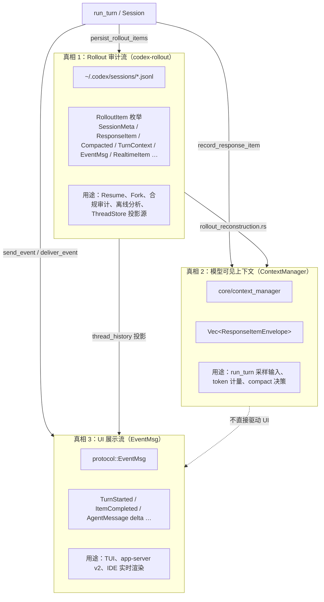

**关键洞察**：三者**不必逐字段同构**。Legacy 模式下 Rollout 可能存 `EventMsg::UserMessage` 而 Paginated 模式存 `ItemCompleted(TurnItem::UserMessage)`；重建算法负责把 Rollout 投影回 `ContextManager`，app-server 再把 Rollout / SQLite 投影为客户端所需的 `TurnItem` 页。

### 0.3 RolloutItem 与消费者的映射

`codex-history` 定义持久化项（`history/src/lib.rs`）：

```rust
pub enum RolloutItem {
    SessionMeta(SessionMetaLine),
    ResponseItem(ResponseItemEnvelope),      // 模型原始 Responses API 项 + harness 元数据
    InterAgentCommunication(...),
    Compacted(CompactedItem),                // 压缩检查点 + replacement_history
    TurnContext(TurnContextItem),            // model / comp_hash / realtime_active
    WorldState(WorldStateItem),              // 世界状态快照/补丁
    EventMsg(EventMsg),                      // 执行标记、Turn 生命周期、Legacy UI 事件
    RealtimeItem(RealtimeItem),              // Paginated 专用：稀疏 realtime 事实
    SecurityRiskScore(...),
    // ...
}
```

| RolloutItem 变体 | 模型可见？ | UI 可见？ | 典型写入时机 |
|------------------|-----------|-----------|--------------|
| `ResponseItem` | ✅ 直接进入/经 compact 替换 | 经 `ItemCompleted` 或 Legacy 事件投影 | 每轮采样产出 |
| `Compacted` | ✅ 通过 `replacement_history` | `ContextCompacted`（Legacy） | auto-compact 完成 |
| `TurnContext` | ❌（元数据） | ❌ | Turn 开始时 |
| `EventMsg::TurnStarted/Complete` | ❌ | ✅（分页 Turn 边界） | Turn 生命周期 |
| `EventMsg::ThreadRolledBack` | ✅（回放时 drop turns） | ✅ | `Op::ThreadRollback` |
| `RealtimeItem` | ❌ | ✅（经 realtime_history 投影） | Realtime WS 事件 |

### 0.4 生命周期总览

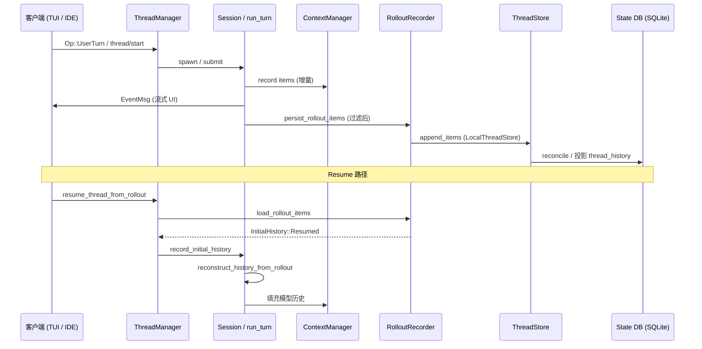

### 0.5 三种真相的同步与失配症状

| 失配场景 | 表现 | 根因 | 修复路径 |
|----------|------|------|----------|
| Rollout 有 `ResponseItem` 但 UI 无对应 cell | Paginated 线程 `thread/read` 空页 | `ItemCompleted` 投影滞后或 migration 未完成 | `thread_history_materialization` catch-up |
| UI 有 `UserMessage` 但 Resume 后模型「失忆」 | Legacy 事件未映射到 `ContextManager` | 仅用 `EventMsg` 重建模型历史 | 走 `reconstruct_history_from_rollout` 而非 event replay |
| State DB 标题与 rollout 不一致 | 列表显示旧 cwd/model | backfill 未完成或 reconcile 未跑 | `reconcile_rollout` / 等待 `BackfillStatus::Complete` |
| Compact 后 token 仍超限 | `replacement_history` 未应用 | 逆向扫描 cutoff 错误 | 检查 `Compacted` 是否带 `replacement_history` |

**设计哲学**：三套真相**刻意允许投影滞后**——JSONL 写入成功后，SQLite 与 `ContextManager` 可在毫秒到秒级内追平；**禁止**在热路径上同步写三处（`run_turn` 只 `record` + `persist_rollout_items`，投影异步）。

### 0.6 消费者矩阵（扩展）

| 消费者 | 读取真相 | 典型 API / 函数 | 是否可离线 |
|--------|----------|-----------------|------------|
| `run_turn` 采样 | `ContextManager` | `for_prompt()` | 否（需 live Session） |
| TUI transcript | Legacy `EventMsg` 或 Paginated 投影 | `load_history` / `list_items` | Resume 后可 |
| app-server v2 | Paginated `TurnItem` | `thread/turn/list`, `thread/item/list` | 是 |
| Guardian 审查 | 独立 basic session transcript | `is_basic_session_source` 路径 | 是 |
| 合规 / 支持 | Rollout JSONL | `jq`, `rollout-trace replay` | 是 |
| Memories 子系统 | 过滤后的 `ResponseItem` | `should_persist_response_item_for_memories` | 是 |
| Analytics | 事实流（非 transcript） | `AnalyticsReducer::ingest` | 否 |

### 0.7 持久化边界总览

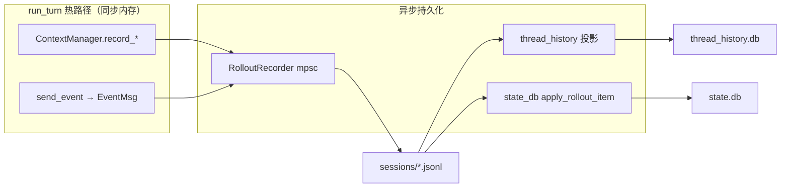

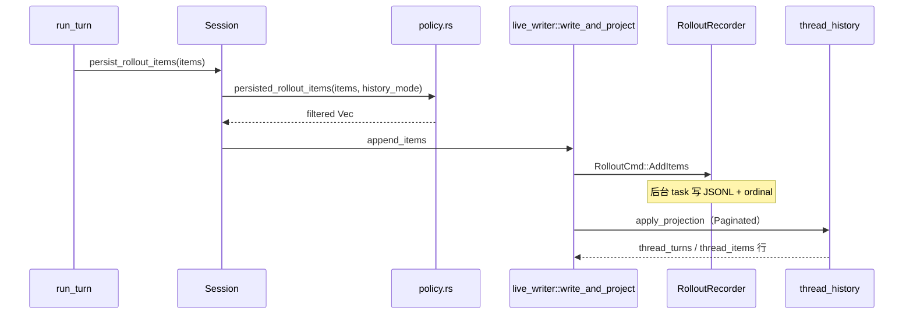

---

## 第 1 章：Rollout 格式、写入路径与重建算法

### 1.1 物理格式

- **路径**: `{codex_home}/sessions/rollout-{timestamp}-{thread_id}[_{rollout_id}].jsonl`
- **压缩**: 可选 zstd 包装；引用型 Fork 前需 `materialize_rollout_for_reference`
- **行结构** (`RolloutLine`):

```json
{
  "timestamp": "2026-09-01T12:00:00.000Z",
  "ordinal": 42,
  "type": "response_item",
  "payload": { "...": "..." }
}
```

`ordinal` 在 **Paginated** 模式下单调递增，是 ThreadStore SQLite 投影与 `thread/revert` 的锚点；**Legacy** 模式可为空。

**文件名语义**（`rollout/src/metadata.rs`）：

| 模式 | 文件名模式 | thread_id vs rollout_id |
|------|-----------|-------------------------|
| 普通线程 | `rollout-...-{thread_id}.jsonl` | 相同 |
| `thread/revert` 后 | `rollout-...-{thread_id}_{rollout_id}.jsonl` | thread_id 稳定，rollout_id 为新不可变文件 |

### 1.2 RolloutRecorder 写入路径

`RolloutRecorder`（`rollout/src/recorder.rs`）是**单写者、异步刷盘**模型：

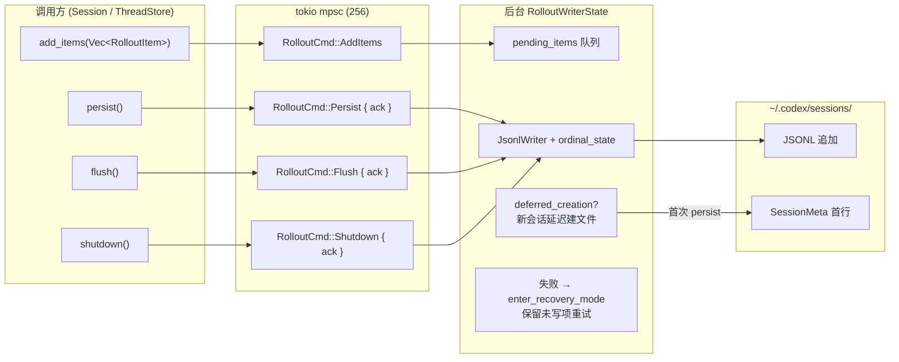

**Create vs Resume**（`RolloutRecorderParams`）：

| 参数分支 | 文件行为 | SessionMeta |
|----------|----------|-------------|
| `Create { ... }` | `deferred_creation=true`，`persist()` 前无文件 | 预计算，首写时落盘 |
| `Resume { path }` | 立即 `open_rollout_for_append` | 从已有首行读取 |

**Create 携带的关键元数据**：`history_mode`、`history_base`（引用型 Fork）、`forked_from_id`、`subagent_history_start_ordinal`、`initial_window_id`（compact window UUID v7）。

**持久化策略门控**：写入前经 `rollout/src/policy.rs::persisted_rollout_items` 过滤——同一 `EventMsg` 在 Legacy / Paginated 下是否落盘不同（详见第 4 章）。

### 1.3 重建算法：`reconstruct_history_from_rollout`

实现位于 `core/src/session/rollout_reconstruction.rs`，是 Resume / Fork / ThreadRollback 的**单一真相入口**。

#### 1.3.1 两阶段结构

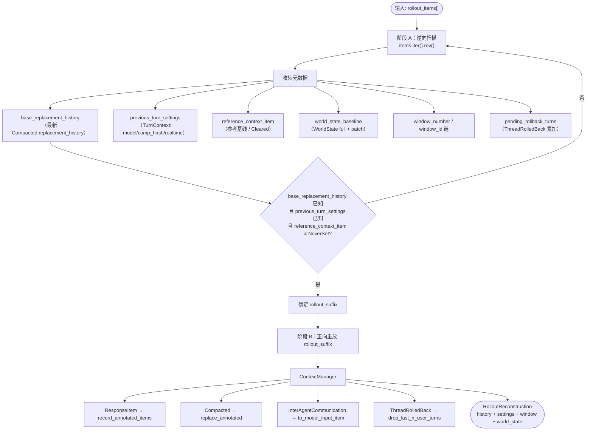

#### 1.3.2 逆向段（ActiveReplaySegment）

逆向扫描以 `TurnStarted` 为段边界，将每个段 finalize 到全局 accumulator：

- **Compaction**：若见 `Compacted` 且带 `replacement_history`，记录为 `base_replacement_history` 并截断 `rollout_suffix`；同时把 `reference_context_item` 标为 `Cleared`（旧基线失效）。
- **ThreadRolledBack**：累加 `pending_rollback_turns`；finalize 时跳过含真实 user turn 的最近 N 段。
- **TurnContext**：提取 `PreviousTurnSettings` 与 `reference_context_item`（需 turn_id 兼容）。

#### 1.3.3 正向段（精确语义重放）

```rust
// 伪代码摘要 — rollout_reconstruction.rs
for item in rollout_suffix {
    match item {
        ResponseItem(r) => history.record_annotated_items(...),
        Compacted(c) if c.replacement_history.is_some() =>
            history.replace_annotated(c.replacement_history),
        Compacted(c) => /* legacy: build_compacted_history 二次重建 */,
        EventMsg::ThreadRolledBack(r) => history.drop_last_n_user_turns(r.num_turns),
        InterAgentCommunication(c) => history.record_items(c.to_model_input_item()),
        _ => {}
    }
}
```

**Legacy compaction 无 `replacement_history`**：触发 `saw_legacy_compaction_without_replacement_history`，清空 `reference_context_item`，Resume 时接受短暂 OOD prompt，并在代码中留有 TODO 以彻底移除该路径。

#### 1.3.4 与 `ModelContextScan` 的关系

`rollout/src/model_context.rs::ModelContextScan` 为 **load_latest_model_context**（Fork 准备、引用型 Fork）提供**有界反向扫描**：

- 停止条件：`saw_compaction`（带 replacement + window_number）+ `saw_completed_turn_context`（用户 turn 证明）。
- **禁用有界截断**：无 replacement 的 compaction、`ThreadRolledBack`、缺 `ItemCompleted(UserMessage)` 的旧 rollout → `must_scan_to_start`。

重建算法与 ModelContextScan **共享 cutoff 规则**，保证 Fork 只复制「足够重建最新模型上下文」的后缀，而非全量 JSONL。

### 1.4 Resume 入口链

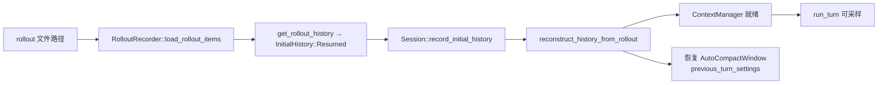

`RolloutRecorder::get_rollout_history`（`recorder.rs:1074`）保留文件中**全部** items（含重复 SessionMeta），仅在内存中标记 canonical thread id。

### 1.5 Ordinal 与 RolloutLine 语义

**文件**: `rollout/src/ordinal.rs`

| 概念 | 类型 / 函数 | 语义 |
|------|-------------|------|
| `RolloutOrdinalState` | `ordinal.rs` | 每文件单调 `ordinal` 分配器 |
| 首行 | `SessionMeta` | `ordinal` 通常为 0 或省略 |
| 后续行 | 任意 `RolloutItem` | Paginated 下每条持久化项 +1 |
| Revert 新文件 | 新 `rollout_id` | ordinal 从 0 重启；lineage 拼接跨文件游标 |

**设计不变量**：`ordinal` **只在单文件内单调**；跨 `RolloutLineage` 分页时，`thread_history/segment_paging.rs` 将 `(rollout_path, ordinal)` 映射为全局游标。

### 1.6 压缩与物化（引用型 Fork）

**文件**: `rollout/src/compression.rs`

| 函数 | 触发 | 作用 |
|------|------|------|
| `materialize_rollout_for_reference` | 引用型 Fork / Revert 前 | 将 zstd 包装或指针前缀物化为可追加 JSONL |
| zstd 包装 | 配置开启 | 透明解压读取；写入仍可走压缩 |

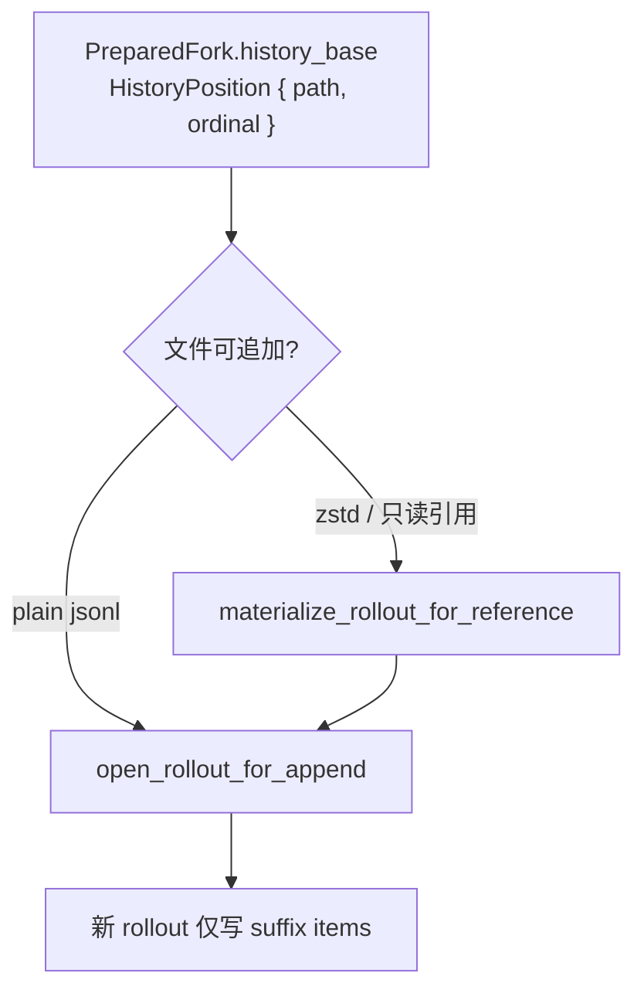

### 1.7 写入失败与 Recovery Mode

**文件**: `rollout/src/recorder.rs`（`RolloutWriterState`）

| 状态 | 行为 | 对调用方 |
|------|------|----------|
| 正常 | `pending_items` drain → `JsonlWriter` | `persist()` ack 成功 |
| IO 错误 | `enter_recovery_mode`；保留未写队列 | 后续 `AddItems` 仍入队 |
| Shutdown | `RolloutCmd::Shutdown { ack }` | 必须 flush 后 ack |

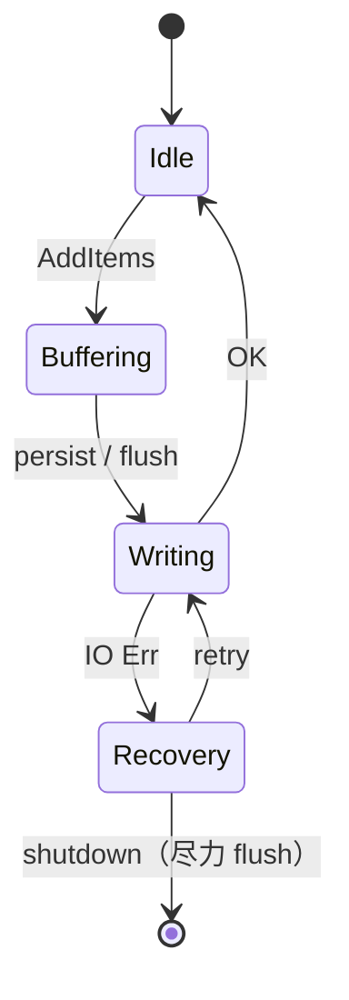

**哲学**：Rollout 写入**永不静默丢项**——宁可阻塞 `persist()` ack，也不在内存中丢弃已提交的 `RolloutItem`（与 `AGENTS.md` append-only 一致）。

### 1.8 `ModelContextScan` 与 Fork 准备

**文件**: `rollout/src/model_context.rs`

| 停止条件 | 含义 |
|----------|------|
| `saw_compaction` + `replacement_history` + `window_number` | 找到可重建最新窗口的压缩检查点 |
| `saw_completed_turn_context` | 证明存在完整用户 turn（非 mid-turn 快照） |
| `must_scan_to_start` | Legacy compaction / ThreadRolledBack / 缺 UserMessage 证明 → **禁止**有界截断 |

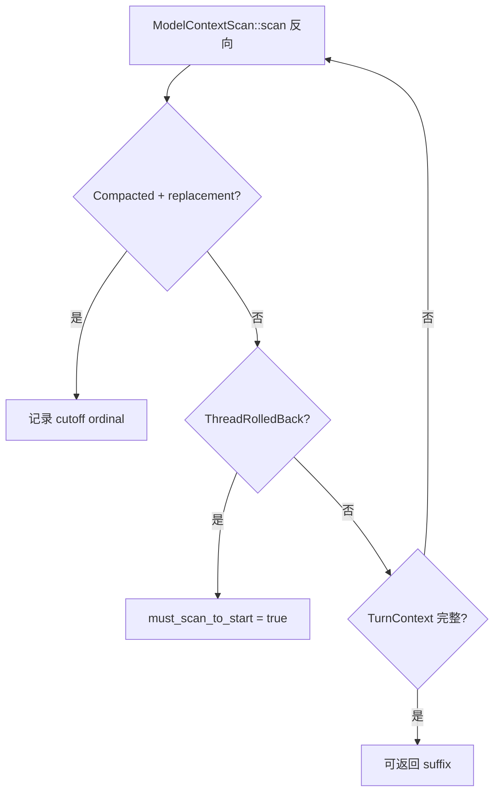

**与重建共享规则**：`reconstruct_history_from_rollout` 的逆向段与 `ModelContextScan` 使用相同的 compaction / rollback 语义，保证 Fork 复制的 suffix **恰好**能 hydrate 父线程最新模型上下文。

### 1.9 ResponseItem 持久化矩阵（`policy.rs`）

| `ResponseItem` 变体 | 落盘？ | 模型历史？ | 备注 |
|---------------------|--------|-----------|------|
| `Message` / `AgentMessage` | ✅ | ✅ | 主对话内容 |
| `FunctionCall` / `FunctionCallOutput` | ✅ | ✅ | 工具往返 |
| `Reasoning` | ✅ | ✅ | 推理链（若模型产出） |
| `Compaction` / `ContextCompaction` | ✅ | 经 compact 替换 | 检查点 |
| `AdditionalTools` | ❌ | ❌ | 瞬态 tool 提示 |
| `CompactionTrigger` | ❌ | ❌ | 仅触发，不审计 |
| `Other` | ❌ | ❌ | 未知项丢弃 |

Memories 子集使用更严过滤：`should_persist_response_item_for_memories` 排除 `developer` role 与 `Reasoning`（`policy.rs:66+`）。

---

## 第 2 章：Fork、Truncate 与 ThreadRollback

三类操作都触及历史，但**语义层级不同**：Fork 创建新线程；Truncate 是物理/逻辑文件操作；ThreadRollback 是同一线程内的逻辑撤销。

### 2.1 语义对比

| 操作 | 作用域 | 持久化 | 文件系统副作用 | 典型入口 |
|------|--------|--------|----------------|----------|
| **Fork** | 新 `thread_id` | 新 Rollout 文件或引用前缀 | 无（不撤销父线程磁盘修改） | `ThreadManager::fork_thread` |
| **Truncate** | 同一文件或 Fork 前快照 | 截断 `Vec<RolloutItem>` 前缀 | 调试/管理用物理截断 | `truncate_rollout_*` |
| **ThreadRollback** | 同一 `thread_id` | 追加 `ThreadRolledBack` 标记 | **不**撤销工作区修改 | `Op::ThreadRollback { num_turns }` |

### 2.2 ForkSnapshot 模式

定义于 `core/src/thread_manager.rs`：

```rust
pub enum ForkSnapshot {
    /// 保留第 n 条用户消息之前的 committed prefix（0-based 边界）
    TruncateBeforeNthUserMessage(usize),
    /// 如同此刻 Interrupt：若 persisted 状态 ends_mid_turn，追加 TurnAborted
    Interrupted,
}
```

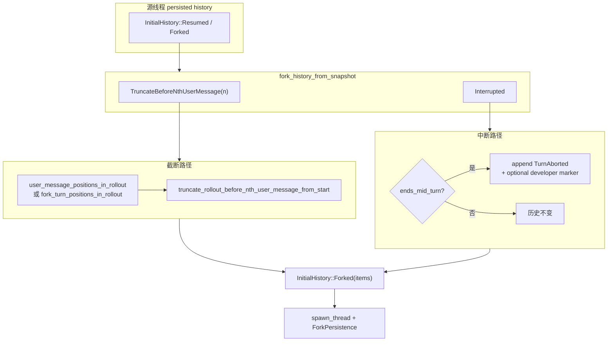

**ForkPersistence**（`session/mod.rs`）：

| 变体 | 含义 |
|------|------|
| `Copied` | 完整复制 rollout items 到新文件 |
| `Referenced { history_base, inherited_item_count }` | 新文件仅追加段；前缀通过 `history_base` 指向父 rollout（`PreparedFork`） |

`fork_prepared_thread` 固定使用 `ForkSnapshot::Interrupted` + `Referenced`，适合大线程低成本分支。

### 2.3 Truncate 工具函数

`core/src/thread_rollout_truncation.rs` 提供基于 **Turn 边界** 的截断（供 app-server `thread/fork` 参数 `lastTurnId` / `beforeTurnId`）：

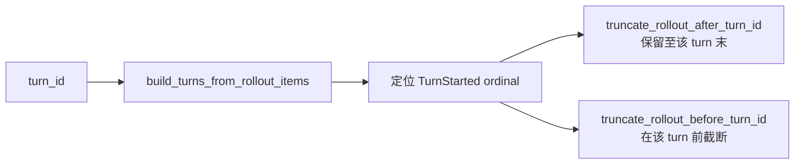

**拒绝条件**（防不稳定 Fork）：

- turn 不存在或 `InProgress`
- 目标 turn 已被 `ThreadRolledBack` 滚掉
- Legacy 投影产生的 synthetic turn id（如 `rollout-0`）

用户消息边界截断与 **ThreadRolledBack 标记**联动：`user_message_positions_in_rollout` 在扫描时动态 `truncate` 已回滚的 user 位置列表。

### 2.4 ThreadRollback 语义

`Op::ThreadRollback { num_turns }` → `handlers::thread_rollback`（`core/src/session/handlers.rs`）。

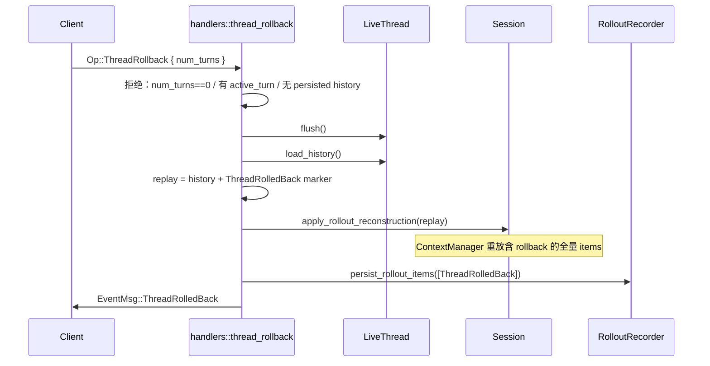

**核心约束**（产品/协议层明确）：

1. **仅内存+审计历史**：丢弃最近 N 个用户 Turn 的模型上下文；**不**自动 `git checkout` 或撤销 patch。
2. **累积语义**：多次 Rollback 追加多个 `ThreadRolledBack`；重建时按序 `drop_last_n_user_turns`。
3. **与 compact 交互**：Rollback 后 `previous_turn_settings` / `reference_context_item` 从 replay 重算（见 `session/tests.rs` 覆盖）。
4. **Paginated 限制**：`ModelContextScan` 遇 rollback 必须扫到文件头；`thread/revert` 是 Paginated 的首选「硬撤销」。

### 2.5 Paginated Fork 准备（`prepare_fork`）

**文件**: `thread-store/src/local/paginated_fork.rs`

| 步骤 | 函数 | 作用 |
|------|------|------|
| 1 | `prepare()` | 冻结源线程 live writer；物化压缩 rollout |
| 2 | `resolve_rollout_lineage` | 收集 `history_base` 链上所有 segment |
| 3 | `materialize_ancestors_to_sqlite` | 确保分页 DB 可服务 fork 边界 |
| 4 | `history_base_at_boundary` | `ForkBoundary` → `HistoryPosition` |

**`ForkBoundary` 变体**（`thread-store/src/types.rs`）：

| 变体 | 语义 | 典型 RPC |
|------|------|----------|
| `Latest` | 当前 durable 末尾 | 默认 fork |
| `ThroughTurn(turn_id)` | 保留至该 turn 结束（含） | `lastTurnId` |
| `BeforeTurn(turn_id)` | 在该 turn 开始前截断 | `beforeTurnId` |

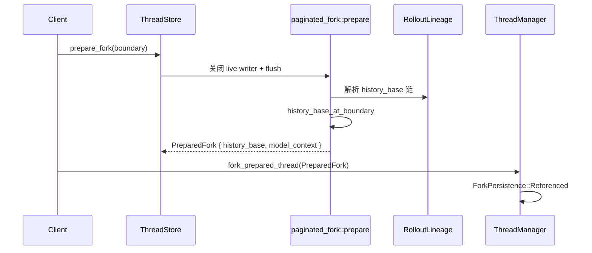

### 2.6 `revert_thread`（Paginated 硬撤销）

**文件**: `thread-store/src/local/revert_thread.rs`

与 `ThreadRollback` 对比——**不追加** rollback 标记，而是创建**新不可变 rollout 文件**：

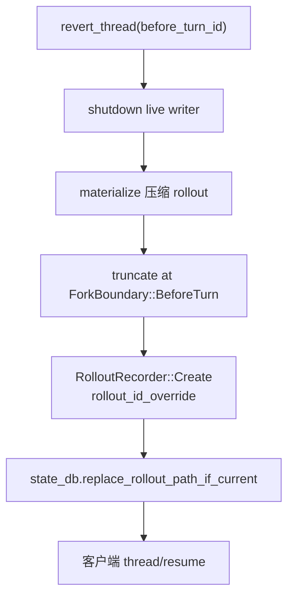

| 约束 | 原因 |
|------|------|
| 仅 Paginated | Legacy 无 SQLite 游标截断 |
| Live writer 必须关闭 | 防止双写 |
| CAS 更新 rollout_path | 多客户端并发 revert 时仅一者成功 |

### 2.7 Fork 与工作区 / Git 的边界

| 操作 | 模型上下文 | 磁盘工作区 | Git 历史 |
|------|-----------|-----------|----------|
| Fork | 复制/引用 prefix | **不**自动 checkout | **不**变 |
| ThreadRollback | 逻辑 drop N turns | **不**变 | **不**变 |
| Revert | 新 rollout 截断 | **不**变 | **不**变 |
| Interrupt + Fork | 可选 `TurnAborted` 标记 | **不**变 | **不**变 |

**产品哲学**：持久化层只保证**对话与审计**可分支；代码状态由用户或 IDE 集成（如 `git stash`）自行管理。

---

## 第 3 章：ThreadStore vs State DB vs Rollout 文件

### 3.1 职责三角

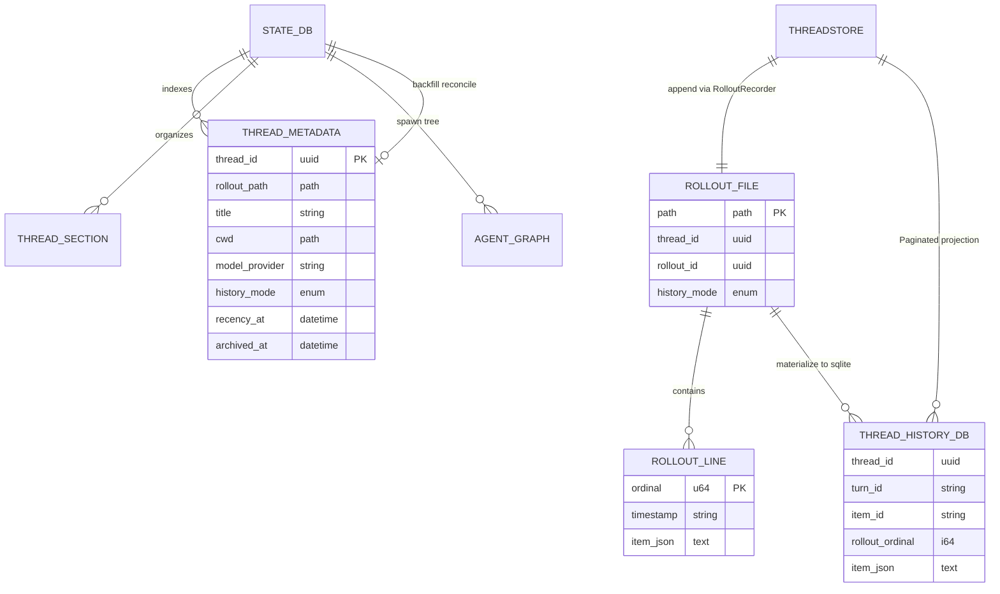

### 3.2 组件职责表

| 组件 | Crate / 模块 | 存储 | 主要职责 |
|------|-------------|------|----------|
| **Rollout 文件** | `codex-rollout` | JSONL per thread | 审计源、Resume、离线 `jq` 分析、压缩引用 |
| **State DB** | `codex-state` + `rollout/state_db.rs` | SQLite `{sqlite.home}` | 线程列表、标题、排序、归档、agent graph 索引、backfill |
| **ThreadStore** | `codex-thread-store` | 内存 live writer + 上述两者 | 统一 `append_items` / `load_history` / `prepare_fork` / `revert_thread` API |
| **Thread History DB** | `thread-store/local/thread_history*` | SQLite（Paginated） | `list_turns` / `list_items` 分页游标 |

### 3.3 State DB 初始化与 Backfill

`rollout/src/state_db.rs::init` 流程：

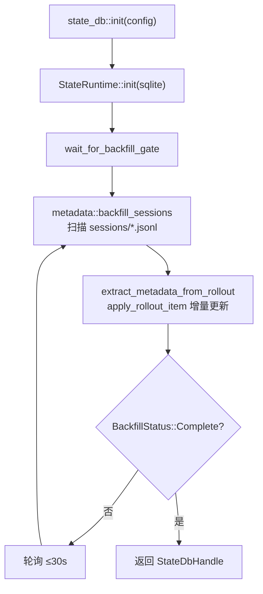

- **租约**：`try_claim_backfill` 防多进程重复 backfill（生产 900s）。
- **Reconcile**：`list_threads` 时若 DB 与文件系统不一致，`reconcile_rollout` 以文件为准修复元数据。

### 3.4 ThreadStore trait 边界

`thread-store/src/store.rs::ThreadStore` 是**存储中立**接口：

| 方法 | PersistContext | 说明 |
|------|----------------|------|
| `append_items` | — | 经 `is_persisted_rollout_item` 过滤后写 Rollout |
| `persist_thread` | `Standard` / `TurnStart` | TurnStart 可后台化，但须被 flush/shutdown fence |
| `load_history` | — | Resume / Fork / Rollback 重放源 |
| `load_latest_model_context` | — | `ModelContextScan` 有界读取 |
| `prepare_fork` | — | 冻结 `PreparedFork`（引用型） |
| `revert_thread` | — | Paginated：在 `before_turn_id` 前截断 durable history |

**LocalThreadStore** 用 `live_writer_lock` + `writer_lock_coordinator` 保证同 thread 单写者；与 `RolloutRecorder` 后台任务串联。

### 3.5 列表查询的双路径

`RolloutRecorder::list_threads`：

1. **首选** `state_db::list_threads_db`（keyset pagination，`SortKey::RecencyAt` 等）
2. **回退** 扫描 `sessions/` 目录（`get_threads`）
3. **修复** 对仅 DB 命中项 `reconcile_rollout`

这解释了 AGENTS 所述 mental load：列表 API 可能来自 DB，但 Resume 永远以 Rollout 为准。

### 3.6 `write_and_project` 统一写入路径

**文件**: `thread-store/src/local/live_writer.rs`

所有 durable 追加经 **`write_and_project`**，保证 JSONL 与 Paginated 投影同源：

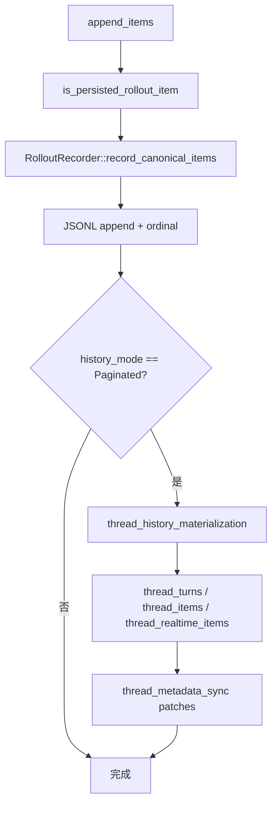

| 阶段 | 失败语义 |
|------|----------|
| JSONL 写失败 | `enter_recovery_mode`；投影暂停 |
| 投影失败 | JSONL 仍 canonical；下次 read 可 catch-up |
| metadata sync 失败 | 列表可能陈旧；`reconcile_rollout` 修复 |

### 3.7 Writer 锁栈

| 锁 | 文件 | 作用 |
|----|------|------|
| `LiveWriterLocks` | `local/mod.rs` | 每 thread 生命周期互斥（create/resume/fork/revert） |
| `WriterLockCoordinator` | `local/mod.rs` | 单写者租约；fork/revert 前 acquire |
| `RolloutRecorder` mpsc | `recorder.rs` | 进程内异步刷盘单飞 |

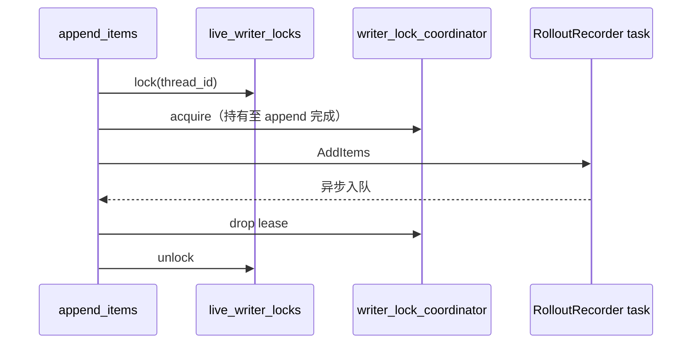

### 3.8 Thread History SQLite 表结构

**文件**: `thread-store/src/local/thread_history/`

| 表 | 主键 / 索引 | 内容 |
|----|------------|------|
| `thread_history_projection_state` | `thread_id` | `(next_rollout_byte_offset, next_rollout_ordinal)` |
| `thread_turns` | `(thread_id, turn_id)` | Turn 边界、model、状态 |
| `thread_items` | `(thread_id, item_id)` | `TurnItem` JSON + `rollout_ordinal` |
| `thread_realtime_items` | `(thread_id, item_id)` | `RealtimeItem` 投影 |

**Catch-up 算法**：`apply_projection` 从 `projection_state` 记录的 byte offset 继续读 JSONL，幂等插入 items——DB 可随时删除重建。

### 3.9 State DB 多库布局

**文件**: `state/src/sqlite.rs`, `state/src/runtime.rs`

| 数据库文件 | `DbKind` | 用途 |
|-----------|----------|------|
| `state.db` | `State` | 线程元数据、归档、agent graph |
| `thread_history.db` | `ThreadHistory` | Paginated 分页（独立文件减锁争用） |
| `logs.db` | `Logs` | 渲染日志分区（10 MiB cap） |
| `goals.db` / `memories.db` / `queue.db` | 各功能库 | 目标、记忆、排队提交 |

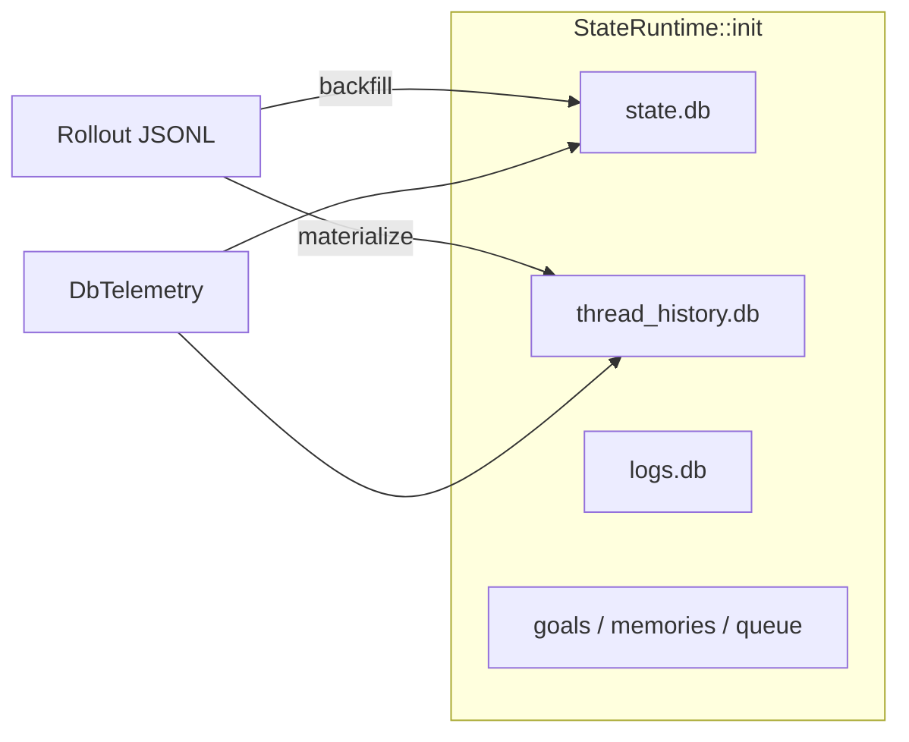

---

## 第 4 章：History Mode——Legacy vs Paginated

### 4.1 协议定义

```rust
// protocol/src/protocol.rs
pub enum ThreadHistoryMode {
    #[default]
    Legacy,
    Paginated,
}
```

写入 `SessionMeta.history_mode`，线程生命周期内不可变（未知值在 resume 时拒绝）。

### 4.2 持久化差异（核心）

`rollout/src/policy.rs::should_persist_event_msg`：

| EventMsg | Legacy | Paginated |
|----------|--------|-----------|
| `UserMessage` / `AgentMessage` / `McpToolCallEnd` / … | ✅ 落盘 | ❌ 不落盘（用 `ItemCompleted`） |
| `ItemCompleted(TurnItem)` | 仅 Plan / Sleep / SubAgentCompleted | ✅ 落盘 |
| `TurnStarted` / `TurnComplete` / `TurnAborted` | ✅ | ✅ |
| `ThreadRolledBack` | ✅ | ✅ |
| `RealtimeItem` | ❌ | ✅ |
| 流式 delta / Begin 事件 | ❌ 瞬态 | ❌ 瞬态 |

**设计意图**：

- **Legacy**：单文件即 transcript；`thread/read` 可一次反序列化全量 `EventMsg`；适合 TUI / 旧客户端。
- **Paginated**：Rollout 存 canonical `ResponseItem` + 结构化 `TurnItem`；SQLite 投影支持 `list_turns`/`list_items` 游标；适合 IDE 长会话。

### 4.3 读取路径

```mermaid
flowchart TB
    subgraph LegacyRead["Legacy thread/read"]
        L1["load_history 全量 items"]
        L2["EventMsg 回放 → UI cells"]
        L3["ResponseItem 重建 → 模型（若 resume）"]
    end

    subgraph PaginatedRead["Paginated thread/read"]
        P1["list_turns(cursor, limit)"]
        P2["thread_history SQLite"]
        P3["RolloutLineage 多文件链"]
        P4["ItemCompleted / ResponseItem 投影"]
    end

    ROLLOUT["Rollout JSONL"] --> LegacyRead
    ROLLOUT --> P3
    P3 --> P2 --> PaginatedRead
```

**RolloutLineage**（`thread-store/local/rollout_lineage.rs`）：Revert 后同一 `thread_id` 可对应多个 rollout 文件，分页查询按 lineage 拼接 ordinal。

### 4.4 Revert vs Rollback（Paginated 专属）

| | ThreadRollback | thread/revert |
|--|----------------|---------------|
| 机制 | 追加 `ThreadRolledBack` | 新 rollout 文件 + `history_base` 指针 |
| thread_id | 不变 | 不变 |
| IDE 分页 | 需全量扫描 rollback | 游标自然截断 |
| 实现 | `handlers::thread_rollback` | `ThreadStore::revert_thread` |

### 4.5 设计哲学：为何双模并存

| 维度 | Legacy 优先 | Paginated 优先 |
|------|------------|----------------|
| 客户端复杂度 | 低（一次读全文件） | 高（游标分页 + lineage） |
| 长会话性能 | 全量反序列化 O(n) | SQLite 索引 O(page) |
| Prompt cache | UI 事件与模型项混存 | 模型项与 UI 投影分离 |
| Realtime | 不持久 sparse facts | `RealtimeItem` 一等公民 |
| 测试矩阵 | TUI / exec 主路径 | app-server v2 / IDE |

**迁移策略**：新线程默认 Paginated（配置层）；`rollout_migration` 将 Legacy JSONL **canonicalize** 为 Paginated 格式 + 触发投影，**不**原地改写源文件。

### 4.6 `rollout_migration` 流水线

**文件**: `thread-store/src/local/rollout_migration/`

```mermaid
flowchart TB
    START["RolloutMigrationMode::OnDemand / Startup"] --> PARSE["line_parser"]
    PARSE --> CANON["canonicalizer<br/>EventMsg → ItemCompleted"]
    CANON --> PUB["publish 新 Paginated JSONL"]
    PUB --> PROJ["thread_history 投影"]
    PROJ --> MARK["StateRuntime::mark_thread_paginated"]
    MARK --> RB{"失败?"}
    RB -->|是| PLAN["rollback_plan + rollback_replay"]
    RB -->|否| OK["RolloutMigrationReport::Success"]
```

| 子模块 | 职责 |
|--------|------|
| `canonicalizer.rs` | Legacy `UserMessage` → `ItemCompleted(UserMessage)` |
| `rollback.rs` / `rollback_plan.rs` | 迁移失败时恢复 pre-migration 指针 |
| `startup.rs` | 进程启动批量迁移门控 |

### 4.7 完整 `should_persist_event_msg` 矩阵

**源码**: `rollout/src/policy.rs:90+`

| `EventMsg` | Legacy | Paginated | 重建用途 |
|------------|--------|-----------|----------|
| `TurnStarted` / `TurnComplete` / `TurnAborted` | ✅ | ✅ | Turn 边界 |
| `ThreadRolledBack` | ✅ | ✅ | `drop_last_n_user_turns` |
| `TokenCount` | ✅ | ✅ | token 审计 |
| `ThreadSettingsApplied` | ✅ | ✅ | 设置回放 |
| `ItemCompleted` | 仅 Plan/Sleep/SubAgentCompleted | ✅ 全部 | UI 分页源 |
| `UserMessage` / `AgentMessage` | ✅ | ❌ | Legacy transcript |
| `ExecCommandBegin/End` 等工具 UI | ✅ | ❌ | Legacy 仅 |
| `RealtimeConversation*` 瞬态 | ❌ | ❌ | 经 `RealtimeItem` 持久化 |
| 流式 `*Delta` | ❌ | ❌ | 纯瞬态 |

### 4.8 读取 API 对照

```mermaid
sequenceDiagram
    participant IDE as IDE / app-server
    participant TS as ThreadStore
    participant LEG as Legacy 路径
    participant PAG as Paginated 路径

    alt Legacy thread
        IDE->>TS: load_history
        TS->>LEG: 全量 RolloutItem[]
        LEG-->>IDE: EventMsg 回放
    else Paginated thread
        IDE->>TS: list_turns(cursor)
        TS->>PAG: thread_turns SQL
        IDE->>TS: list_items(turn_id, cursor)
        TS->>PAG: thread_items SQL
        PAG-->>IDE: TurnItem 页
    end
```

| RPC（v2） | Legacy | Paginated |
|-----------|--------|-----------|
| `thread/read` | 全量 events | 不推荐；用 list API |
| `thread/turn/list` | N/A | ✅ |
| `thread/item/list` | N/A | ✅ |
| `thread/timeline/list` | N/A | ✅（含 realtime） |
| `thread/search` | rollout 扫描 | SQLite FTS |

---

## 第 5 章：Observability——Analytics 与 OTEL

### 5.1 Analytics 事件与 `run_turn` 阶段映射

`run_turn`（`core/src/session/turn.rs`）是主循环；analytics 事实定义于 `codex-analytics`。

```mermaid
flowchart TB
    subgraph PreTurn["Turn 前"]
        A1["track_turn_resolved_config<br/>TurnResolvedConfigFact"]
        A2["run_pre_sampling_compact<br/>CompactionPhase::PreTurn"]
        A3["emit SkillInvocation<br/>build_track_events_context"]
    end

    subgraph SamplingLoop["采样循环"]
        B1["Responses API stream"]
        B2["ToolCall → ControlToolCallFact / CodeModeToolCallFact"]
        B3["CompactionPhase::MidTurn"]
        B4["TurnTokenUsageFact / ImagePreparationFact"]
    end

    subgraph PostTurn["Turn 后"]
        C1["TurnComplete / TurnAborted → TurnStatus"]
        C2["CodexCompactionEvent<br/>phase / reason / strategy"]
        C3["SubAgentThreadStartedInput"]
    end

    START["Op::UserTurn 进入 run_turn"] --> PreTurn
    PreTurn --> SamplingLoop
    SamplingLoop --> PostTurn
```

| Analytics 类型 | 触发点 | 关键字段 |
|----------------|--------|----------|
| `TurnResolvedConfigFact` | `track_turn_resolved_config_analytics`，run_turn 早期 | model, approval_policy, collaboration_mode, is_first_turn |
| `CompactionPhase::PreTurn` | `run_pre_sampling_compact` | reason: ModelSwitch / ContextLimit / … |
| `CompactionPhase::MidTurn` | 采样中 `should_roll_over` | token_limit_reached |
| `SkillInvocation` | `emit_explicit_skill_invocations` | skill name, location |
| `CodeModeToolCallFact` | code-mode 子采样 | cell_id, status |
| `TurnTokenUsageFact` | turn 结束 | input/output tokens |
| `SubAgentThreadStartedInput` | spawn thread | parent thread_id |

`TrackEventsContext`（`analytics/facts.rs`）绑定 `model_slug + thread_id + turn_id + product_client_id`，供 Statsig / OTLP 指标关联。

### 5.2 OpenTelemetry 传播链

```mermaid
sequenceDiagram
    participant Client
    participant AppServer
    participant TM as ThreadManager
    participant Turn as run_turn
    participant API as Responses API

    Client->>AppServer: thread/start (optional parent trace)
    AppServer->>TM: StartThreadOptions.parent_trace
    TM->>Turn: W3cTraceContext in TurnContext
    Turn->>Turn: codex_otel::current_span_w3c_trace_context
    Turn->>API: X-Codex-Turn-Metadata header<br/>(responses_metadata.rs)
    Note over API: thread_id, turn_id, window_id,<br/>compaction, sandbox, parent_thread_id
    Turn->>Turn: child spans: tool dispatch, compact, MCP
```

**初始化**（`core/otel_init.rs`）：

- `build_provider`：分离 `exporter` / `trace_exporter` / `metrics_exporter`（analytics 关闭时 metrics 为 None）
- `install_sqlite_telemetry`：State DB 查询延迟 → `codex.rollout.sqlite.*` 指标
- Span 属性来自 `config.otel.span_attributes` + `tracestate`

**请求头**（`core/responses_metadata.rs`）：

- `X_CODEX_TURN_METADATA_HEADER`：JSON 元数据（含 `TURN_ID_KEY`, `WINDOW_ID_KEY`, `COMPACTION_KEY` 等）
- 保留键列表 `RESERVED_METADATA_KEYS` 防止客户端覆盖 core 自有字段

### 5.3 Rollout Trace 调试

`rollout-trace` crate：将 Rollout 降维为 `REDUCED_STATE_FILE_NAME` bundle；CLI `replay` 命令用于工程支持，不参与生产路径。

### 5.4 Token 计量与 Budget

- `EventMsg::TokenCount`：可选推送；`Session::get_total_token_usage` 驱动 compact
- `rollout_budget.rs`：接近上限时注入 `token_budget_context` fragment 提醒模型
- `EventMsg::TokenCount` 在 `policy.rs` 中**持久化**（两种 history mode 均 true）

### 5.5 Analytics Reducer 架构

**文件**: `analytics/src/reducer.rs`, `analytics/src/facts.rs`

Analytics 与 OTEL **刻意分离**：OTEL 服务 SRE（延迟、错误率）；Analytics 服务产品（turn 漏斗、功能采用）。

```mermaid
flowchart TB
    subgraph Sources["事实来源"]
        INIT["initialize RPC"]
        REQ["JSON-RPC request/response"]
        NOTIF["ServerNotification v2"]
        ERR["CodexErr"]
        CORE["core track_* 调用"]
    end

    subgraph Reducer["AnalyticsReducer"]
        ING["ingest(AnalyticsFact)"]
        STATE["内部状态机<br/>pending turns / tools / connections"]
        FLUSH["flush() → Vec&lt;TrackEventRequest&gt;"]
    end

    subgraph Sink["analytics/src/client.rs"]
        Q["异步 mpsc 队列"]
        HTTP["POST track-events"]
    end

    Sources --> ING --> STATE --> FLUSH --> Q --> HTTP
```

| `AnalyticsFact` 类别 | 产出事件示例 | 触发文件 |
|---------------------|-------------|----------|
| Turn 生命周期 | `CodexTurnEvent` | `turn.rs` turn complete |
| 工具调用 | file change, MCP usage | `registry.rs`, handlers |
| Compaction | `CodexCompactionEvent` | `compact.rs` |
| Skill / Plugin | `SkillInvocation`, plugin used | `skills.rs`, `plugins/` |
| Sub-agent | `SubAgentThreadStartedInput` | `multi_agents_*` |

### 5.6 OTEL 指标名索引

| 指标前缀 | 来源 | 含义 |
|----------|------|------|
| `codex.sqlite.init.*` | `state/src/telemetry.rs` | DB 打开 / 迁移耗时 |
| `codex.sqlite.fallback.count` | `state/src/telemetry.rs` | 回退文件扫描次数 |
| `codex.rollout.persistence.*` | `rollout/persistence_metrics.rs` | 每项字节数、append 次数 |
| `codex.rollout.size_bytes` | `live_writer.rs` shutdown | 线程 rollout 总大小 |
| `codex.tool_call` | `parallel.rs` `ToolCallTimingGuard` | 工具耗时 span |

```mermaid
sequenceDiagram
    participant TUI as TUI / app-server
    participant OI as otel_init::build_provider
    participant ST as install_sqlite_telemetry
    participant DB as StateRuntime / Rollout
    participant EXP as OTLP / Statsig exporter

    TUI->>OI: Config.otel
    OI->>ST: DbTelemetry 桥接
    ST->>DB: 包装 SQL 查询
    DB-->>ST: 延迟 histogram
    ST->>EXP: codex.sqlite.*
    OI->>EXP: traces + logs + metrics
```

### 5.7 W3C Trace 传播与 Turn 元数据

**文件**: `otel/src/trace_context.rs`, `core/responses_metadata.rs`

| 字段 | 头 / 元数据键 | 用途 |
|------|--------------|------|
| `traceparent` | W3C 标准 | 跨服务关联 |
| `thread_id` | `X-Codex-Turn-Metadata` JSON | 云端按线程聚合 |
| `turn_id` | 同上 | 单 turn 调试 |
| `window_id` | 同上 | compact window 边界 |
| `parent_thread_id` | 同上 | sub-agent 树 |

**设计原则**：客户端可在 `thread/start` 注入 `parent_trace`；core 在 `run_turn` 内创建 child span，并**禁止**客户端覆盖 `RESERVED_METADATA_KEYS` 列表中的 core 字段。

### 5.8 Rollout Trace 与工程支持

**Crate**: `rollout-trace`

| 能力 | 命令 / 产物 | 生产路径 |
|------|------------|----------|
| 状态降维 | `REDUCED_STATE_FILE_NAME` bundle | ❌ 仅支持工具 |
| 回放 | CLI `replay` | 离线复现 turn 序列 |
| 与 OTEL 关系 | 无自动桥接 | 人工关联 thread_id |

---

## 第 6 章：Realtime Conversation 并行路径

Realtime 与 `run_turn` **并行存在**，不是子集：独立 WS 连接、独立队列、独立 context fragment，最终通过 handoff 汇入主线程。

### 6.1 架构

```mermaid
flowchart TB
    subgraph MainPath["常规 Agent 路径"]
        UT["Op::UserTurn"] --> RT["run_turn"]
        RT --> CM["ContextManager"]
        RT --> RR["RolloutRecorder"]
    end

    subgraph RealtimePath["Realtime 路径"]
        RC["Op::RealtimeConversation*"] --> RCM["RealtimeConversationManager"]
        RCM --> WS["RealtimeWebsocketClient<br/>V1 / V2"]
        WS --> RTP["RealtimeEventParser / BEM"]
        RTP --> EVT["EventMsg::RealtimeConversation*<br/>（瞬态 UI）"]
        RTP --> RI["RolloutItem::RealtimeItem<br/>（Paginated 持久化）"]
    end

    subgraph Handoff["Handoff 汇合"]
        H1["RealtimeHandoffStream"]
        H2["[BACKEND] prefix 文本"]
        H3["Op::UserTurn 或 session end"]
        H3 --> CM
        H2 --> CM
    end

    RealtimePath --> Handoff
```

### 6.2 Session 字段与 Op 族

`Session` 持有 `RealtimeConversationManager`（`core/src/realtime_conversation.rs`）：

| Op | 作用 |
|----|------|
| `RealtimeConversationStart` | 建立 WS / WebRTC sideband；`build_realtime_startup_context` |
| `RealtimeConversationAudio/Text/Speech` | 双向媒体 |
| `RealtimeConversationClose` | 结束；可能注入 `REALTIME_SESSION_ENDED_HANDOFF_INSTRUCTION` |
| `RealtimeConversationListVoices` | 语音列表 |

**Context Fragments**（`core/context/`）：

- `realtime_start_instructions` / `realtime_end_instructions`
- `realtime_delegation`：将后台 agent 输出委托给 realtime 模型
- Token 预算：`REALTIME_STARTUP_CONTEXT_TOKEN_BUDGET`（5300）、`REALTIME_INITIAL_ITEMS_MAX_TOKENS`（8192）

### 6.3 与 Rollout / UI 的交界

- **瞬态**：`RealtimeConversationStarted/Sdp/Realtime/Closed` 在 `policy.rs` 中**不**持久化
- **持久**：`RealtimeItem`（`codex-protocol::realtime`）仅 Paginated；`app-server/realtime_history.rs` 将 WS 事件投影为 `RealtimeItem` 与 `TurnItem`
- **Handoff**：V2 下 `[BACKEND]` 前缀流式 flush；结束后 `REALTIME_V2_HANDOFF_COMPLETE_ACKNOWLEDGEMENT` 进入常规 turn

### 6.4 与 ThreadRollback / Fork 的交互

- `TurnContext.realtime_active` 存入 `TurnContextItem`；Resume 时恢复
- Realtime 进行中通常阻塞 Rollback（与 active turn 相同级别的互斥由产品层处理）
- Fork `Interrupted` 快照不复制进行中的 Realtime WS，仅复制已持久化 items

### 6.5 设计哲学：Realtime 不是 `run_turn` 子循环

Realtime 路径遵循 **独立传输 + 稀疏持久化 + Handoff 汇合**：

1. **独立 WS** — `RealtimeWebsocketClient` V1/V2 与 `ModelClientSession` 采样流分离，避免阻塞 Agent Loop。
2. **瞬态 UI 与 durable facts 分离** — `RealtimeConversation*` `EventMsg` 不落盘；`RealtimeHistoryState::observe` 产出 `RealtimeItem`。
3. **Paginated 专属持久化** — Legacy 线程不存 `RealtimeItem`（`policy.rs:16`）。
4. **Handoff 是显式协议** — `[BACKEND]` 前缀 + `REALTIME_V2_HANDOFF_COMPLETE_ACKNOWLEDGEMENT` 进入常规 `ContextManager`，非隐式合并。

### 6.6 端到端分层（app-server → core）

```mermaid
flowchart TB
    subgraph ClientLayer["客户端"]
        MIC["音频 / 文本输入"]
        RPC["thread/realtime/* JSON-RPC"]
    end

    subgraph AppServer["app-server"]
        TP["turn_processor"]
        RHS["RealtimeHistoryState::observe"]
        REH["realtime_event_handling"]
        BEH["bespoke_event_handling"]
        TL["thread_lifecycle listener"]
    end

    subgraph Core["codex-core"]
        RCM["RealtimeConversationManager"]
        WS["RealtimeWebsocketClient"]
        REP["RealtimeEventParser"]
        SESS["Session + ContextManager"]
    end

    subgraph Persist["持久化（Paginated）"]
        RI["RolloutItem::RealtimeItem"]
        SQL["thread_realtime_items"]
    end

    MIC --> RPC --> TP --> RCM
    RCM --> WS --> REP
    REP --> RHS
    RHS --> REH --> RI
    REH --> SQL
    BEH --> ClientLayer
    TL --> RHS
    SESS --> RCM
```

### 6.7 `RealtimeItem` 变体与投影

**文件**: `protocol/src/realtime.rs`, `app-server/src/realtime_history.rs`

| `RealtimeItemContent` | 写入时机 | UI 通知 |
|----------------------|----------|---------|
| `RealtimeSessionStarted` | WS 连接建立 | `ThreadRealtimeStarted` |
| `TranscriptSegment { role, text }` | 语音识别 / 模型文本 | `ThreadRealtimeTranscriptDelta/Done` |
| `BemItemPromoted { turn_id, item_id }` | BEM 提升为 turn item | `ThreadRealtimeItemAdded` |
| `RealtimeSessionClosed { outcome }` | 正常/错误关闭 | `ThreadRealtimeClosed` |

```mermaid
sequenceDiagram
    participant WS as Realtime WS
    participant REP as RealtimeEventParser
    participant RHS as RealtimeHistoryState
    participant PERS as persist_realtime_items
    participant TS as ThreadStore
    participant UI as IDE notifications

    WS->>REP: binary / JSON event
    REP->>RHS: observe(event)
    RHS-->>PERS: RealtimeItem[]
    PERS->>TS: append_rollout_items
    REP->>UI: bespoke EventMsg（瞬态）
    Note over PERS,TS: 仅 Paginated 落盘
```

### 6.8 Handoff 与常规 Turn 汇合

| 阶段 | 函数 / 常量 | 行为 |
|------|------------|------|
| 用户文字输入前 | `seal_realtime_transcript_before_user_input` | 封闭开放 transcript segment |
| V2 流式 | `[BACKEND]` prefix flush | 后台 agent 输出注入 realtime |
| 会话结束 | `REALTIME_SESSION_ENDED_HANDOFF_INSTRUCTION` | 指令模型交接 |
| 完成确认 | `REALTIME_V2_HANDOFF_COMPLETE_ACKNOWLEDGEMENT` | 进入 `Op::UserTurn` 常规路径 |

```mermaid
stateDiagram-v2
    [*] --> RealtimeActive: RealtimeConversationStart
    RealtimeActive --> StreamingBackend: delegation / BEM
    StreamingBackend --> RealtimeActive: 继续对话
    RealtimeActive --> Sealing: UserTurn 或 Close
    Sealing --> HandoffPending: seal transcript
    HandoffPending --> MainTurn: handoff ack + UserTurn
    MainTurn --> [*]: run_turn 常规循环
```

### 6.9 Context Fragment 与 Token 预算

**文件**: `core/context/`（realtime 相关 fragment）

| Fragment | 预算常量 | 作用 |
|----------|----------|------|
| `realtime_start_instructions` | `REALTIME_STARTUP_CONTEXT_TOKEN_BUDGET` (5300) | 启动指令 |
| startup items | `REALTIME_INITIAL_ITEMS_MAX_TOKENS` (8192) | 初始上下文项 |
| `realtime_delegation` | 受全局 fragment 上限约束 | 后台 agent 委托 |
| `realtime_end_instructions` | 同上 | 关闭 / handoff 指令 |

**与 PART1 一致**：所有 fragment 实现 `ContextualUserFragment`；单条 &lt; 10K tokens。

### 6.10 Realtime 与持久化子系统交互表

| 操作 | Realtime WS | Rollout | thread_history | ContextManager |
|------|-------------|---------|----------------|----------------|
| 进行中对话 | 活跃 | 不写瞬态 EventMsg | 可选增量 `RealtimeItem` | 不写（直至 handoff） |
| Handoff 完成 | 关闭或空闲 | `ResponseItem` user/assistant | `ItemCompleted` | `record_*` |
| ThreadRollback | 通常阻塞 | 不删已持久化 RealtimeItem* | 游标仍可见* | 仅 drop user turns |
| Fork | 不复制活跃 WS | 复制已持久化 items | 新线程重投影 | hydrate 自 suffix |

\*Paginated 下 rollback 语义以 `drop_last_n_user_turns` 为准；sparse realtime 行可能仍留在 timeline（产品层过滤）。

---

## 第 7 章：设计权衡与决策记录

采用 ADR 风格记录核心决策，便于后续演进时质疑前提。

### ADR-001：Append-Only Rollout 而非数据库存储全 transcript

| 维度 | 决策 |
|------|------|
| **状态** | 已采纳 |
| **上下文** | 需离线审计、用户可 `jq` 检查、跨版本 resume |
| **决策** | 每线程 JSONL 为 canonical audit；SQLite 仅为索引与分页投影 |
| **后果 (+)** | 灾难恢复简单；版本回滚可读旧文件 |
| **后果 (−)** | 列表/搜索需 DB backfill；双路径一致性成本高 |
| **替代方案** | 纯 SQLite BLOB 存 transcript — 放弃人类可读性 |

### ADR-002：三种真相而非统一 CRDT

| 维度 | 决策 |
|------|------|
| **状态** | 已采纳 |
| **决策** | `ResponseItem`（模型）、`EventMsg`（UI）、`RolloutItem`（审计）显式分裂 |
| **后果 (+)** | IDE 可只要 UI 事件；模型不被 UI delta 污染 |
| **后果 (−)** | `policy.rs` 与重建算法必须随协议演进同步 |

### ADR-003：ThreadRollback 逻辑撤销，不碰工作区

| 维度 | 决策 |
|------|------|
| **状态** | 已采纳 |
| **决策** | 只追加 `ThreadRolledBack`；客户端负责 git revert |
| **后果 (+)** | 无静默磁盘破坏；审计链完整 |
| **后果 (−)** | 用户期望「撤销代码」时需额外 UX |

### ADR-004：Legacy 与 Paginated 双模并存

| 维度 | 决策 |
|------|------|
| **状态** | 迁移中（`rollout_migration`） |
| **决策** | 新 IDE 默认 Paginated；TUI/旧客户端 Legacy |
| **后果 (+)** | 长会话 IDE 分页；prompt cache 更稳定（少存 UI 事件） |
| **后果 (−)** | 测试矩阵翻倍；`rollout_migration/canonicalizer` 维护成本 |

### ADR-005：RolloutRecorder 单写者异步队列

| 维度 | 决策 |
|------|------|
| **状态** | 已采纳 |
| **决策** | mpsc + 后台 task；失败保留 `pending_items` 重试 |
| **后果 (+)** | `run_turn` 不在热路径做阻塞 IO |
| **后果 (−)** | `flush` 语义需客户端理解；崩溃可能丢最后一缓冲区（TurnStart persist 缓解） |

### ADR-006：引用型 Fork（PreparedFork）

| 维度 | 决策 |
|------|------|
| **状态** | 已采纳 |
| **决策** | `history_base: HistoryPosition` 指向父 rollout ordinal |
| **后果 (+)** | 大线程 Fork O(追加) 而非 O(复制) |
| **后果 (−)** | Lineage 管理复杂；父文件删除需防护 |

### ADR-007：core 膨胀克制

| 维度 | 决策 |
|------|------|
| **状态** | 持续约束（`codex/AGENTS.md`） |
| **决策** | 新功能优先 `codex-rollout` / `codex-thread-store` / 独立 crate |
| **后果** | `session/mod.rs` 仍 >4000 行历史债；重建逻辑已拆至 `rollout_reconstruction.rs` |

### 风险登记

| 风险 | 等级 | 缓解 |
|------|------|------|
| Resume 后 MCP cache 与 rollout 不一致 | 高 | session start prewarm；`McpResourceOriginCheckpoint` |
| Legacy compaction 无 replacement_history | 中 | 重建时特殊路径；计划弃用 |
| DB backfill 阻塞启动 30s | 中 | 租约 + 异步重试 + fallback 文件扫描 |
| Paginated + Rollback 交互 | 中 | 推荐 `revert_thread` 代替多次 rollback |

### ADR-008：Thread History 独立 SQLite 文件

| 维度 | 决策 |
|------|------|
| **状态** | 已采纳 |
| **上下文** | Paginated `list_items` 高频读；state metadata 写路径争用 |
| **决策** | `thread_history.db` 与 `state.db` 分离（`state/src/sqlite.rs`） |
| **后果 (+)** | 分页查询不阻塞线程列表 backfill |
| **后果 (−)** | 多 DB 连接池；迁移需协调 |

### ADR-009：Realtime 稀疏事实（RealtimeItem）而非全量 EventMsg

| 维度 | 决策 |
|------|------|
| **状态** | 已采纳 |
| **决策** | WS 二进制流 → `RealtimeHistoryState` 降维 → 仅存 promoted transcript / session 边界 |
| **后果 (+)** | Rollout 体积可控；timeline API 统一 |
| **后果 (−)** | 丢失部分低层 WS 调试信息（依赖 OTEL） |

### ADR-010：Memories 使用更严 ResponseItem 过滤

| 维度 | 决策 |
|------|------|
| **状态** | 已采纳 |
| **决策** | `should_persist_response_item_for_memories` 排除 developer / reasoning |
| **后果** | 长期记忆不含系统注入与链式思考 |

```mermaid
flowchart TB
    subgraph ADRs["持久化 ADR 依赖图"]
        A1["ADR-001 Append-Only JSONL"]
        A2["ADR-002 三种真相"]
        A5["ADR-005 异步 RolloutRecorder"]
        A4["ADR-004 Legacy/Paginated"]
        A6["ADR-006 引用型 Fork"]
        A8["ADR-008 thread_history DB"]
        A9["ADR-009 RealtimeItem"]
    end

    A1 --> A2
    A1 --> A5
    A2 --> A4
    A4 --> A8
    A4 --> A9
    A1 --> A6
    A6 --> A8
```

### 7.1 运维检查清单

| 症状 | 检查命令 / 路径 | 期望 |
|------|----------------|------|
| 线程列表空 | `~/.codex/state.db` + backfill 日志 | `BackfillStatus::Complete` |
| Resume 后历史短 | `sessions/rollout-*.jsonl` 行数 | 与 `load_history` item count 一致 |
| Paginated 分页空洞 | `thread_history_projection_state` | `next_rollout_byte_offset` 追上文件大小 |
| Realtime timeline 缺段 | `policy.rs` history_mode | 必须 Paginated |
| OTEL 无 SQLite 指标 | `otel_init` + `install_sqlite_telemetry` | provider 非 None |

---

## 第 8 章：Codex / DeepTutor / SDK 选型对照

| 维度 | **Codex** (`codex-rs`) | **DeepTutor** (`naviforge/`) | **software-agent-sdk** / **deepagents** |
|------|------------------------|------------------------------|----------------------------------------|
| **语言** | Rust | Python | Python |
| **主循环** | `run_turn` + Responses API 采样循环 | `AgentLoop` + OpenAI tools | `Agent.step` + event sourcing |
| **控制面** | `Op` / `EventMsg` 双协议 | HTTP/WebSocket + 能力层 | `Action` / `Observation` |
| **会话真相** | Rollout JSONL + SQLite 索引 | SQLite / PocketBase + JSON legacy | FileStore 每 event 一文件 |
| **模型历史** | `ContextManager` 增量 + compact 检查点 | `context_builder` 摘要 | `CondensationRequest` 两步压缩 |
| **UI 历史** | Legacy EventMsg / Paginated TurnItem | 服务端渲染 transcript | 客户端自行投影 |
| **压缩** | Inline + remote v2；`CompactedItem.replacement_history` | 教育场景摘要优先 | 显式 condensation 事件 |
| **多 Agent** | Thread 隔离 + `InterAgentCommunication` | `agents/` partners | Delegate / Subagent |
| **Fork** | `ForkSnapshot` + 引用型 Fork | 较弱 / 课程分支 | Branch per experiment |
| **Rollback** | `ThreadRolledBack` 逻辑标记 | 通常重新开 session | 依赖 event log 回放 |
| **Realtime** | 一等 `RealtimeConversationManager` | 非核心 | 视集成而定 |
| **沙箱** | Seatbelt / Landlock + ExecPolicy | 较轻 | 可配置 |
| **可观测** | OTEL + analytics facts + rollout trace | 应用日志 | OpenTelemetry 可选 |
| **目标用户** | 开发者本地编码 Agent | 学习者辅导 | 企业 Agent 嵌入 |
| **推荐场景** | CLI / IDE / 强沙箱 / 长会话 | 教学内容 / 辅导 | Python 嵌入式 / 快速原型 |

### 选型决策树

```mermaid
flowchart TD
    Q1{"需要 Rust 级沙箱 +<br/>本地 Codex CLI?"}
    Q1 -->|是| CODEX["Codex"]
    Q1 -->|否| Q2{"垂直领域是教育辅导?"}
    Q2 -->|是| DT["DeepTutor"]
    Q2 -->|否| Q3{"需要 Python SDK 嵌入<br/>自有产品?"}
    Q3 -->|是| SDK["software-agent-sdk / deepagents"]
    Q3 -->|否| CODEX
```

### 8.1 持久化子系统细粒度对照

| 子能力 | Codex | DeepTutor | software-agent-sdk |
|--------|-------|-----------|-------------------|
| 审计日志 | JSONL Rollout | DB + 导出 | 每 event 一文件 |
| 分页读取 | SQLite `thread_history` | ORM 查询 | 客户端扫描目录 |
| 逻辑撤销 | `ThreadRolledBack` 标记 | 弱 | event log 回放 |
| 物理撤销 | `revert_thread` 新文件 | 少见 | 分支目录 |
| 引用型分支 | `PreparedFork` + lineage | 少见 | 少见 |
| 压缩检查点 | `CompactedItem.replacement_history` | 摘要表 | `CondensationRequest` |
| Realtime 持久 | `RealtimeItem` | 非核心 | 视集成 |
| OTEL DB 指标 | `DbTelemetry` 一等 | 应用日志 | 可选 |

### 8.2 迁移与互操作考量

```mermaid
flowchart LR
    subgraph CodexExport["Codex 导出"]
        ROL["Rollout JSONL"]
        META["SessionMeta"]
    end

    subgraph Consumers["外部消费者"]
        JQ["jq / 合规"]
        RT["rollout-trace replay"]
        SDK["自定义 ETL"]
    end

    ROL --> JQ
    ROL --> RT
    ROL --> SDK
    META --> SDK
```

| 若从 X 迁移到 Codex | 建议 |
|---------------------|------|
| SDK event files | 写转换器产出 `RolloutItem::ResponseItem` 序列 |
| 纯 DB transcript | 生成 Legacy `EventMsg` 行或 Paginated `ItemCompleted` |
| 无 sandbox 需求 | 仍可用 Codex；关闭 strict policy |

### 8.3 能力成熟度矩阵

| 能力 | Codex 成熟度 | 备注 |
|------|-------------|------|
| 长会话 + 分页 | ★★★★★ | Paginated + lineage |
| 离线审计 | ★★★★★ | JSONL 人类可读 |
| 多 Agent 树 | ★★★★☆ | Thread + `InterAgentCommunication` |
| 教育场景定制 | ★★☆☆☆ | 用 DeepTutor |
| Python 嵌入 | ★★★☆☆ | 通过 app-server / MCP |
| Realtime 语音 | ★★★★☆ | 独立 WS 路径 |

---

## 附录 A：关键源文件索引

| 主题 | 路径 |
|------|------|
| Rollout 写入 | `rollout/src/recorder.rs` |
| 持久化策略 | `rollout/src/policy.rs` |
| 模型上下文扫描 | `rollout/src/model_context.rs` |
| State DB 桥接 | `rollout/src/state_db.rs`, `rollout/src/metadata.rs` |
| 历史重建 | `core/src/session/rollout_reconstruction.rs` |
| Fork / Resume | `core/src/thread_manager.rs` |
| Truncate 工具 | `core/src/thread_rollout_truncation.rs` |
| ThreadRollback | `core/src/session/handlers.rs` |
| ThreadStore | `thread-store/src/store.rs`, `thread-store/src/local/` |
| History 分页 | `thread-store/src/local/thread_history/read.rs` |
| run_turn | `core/src/session/turn.rs` |
| Realtime | `core/src/realtime_conversation.rs`, `app-server/src/realtime_history.rs` |
| Analytics | `analytics/src/facts.rs`, `analytics/src/lib.rs` |
| OTEL | `core/otel_init.rs`, `otel/src/trace_context.rs` |
| 协议 | `protocol/src/protocol.rs` (`ThreadHistoryMode`, `Op`) |
| Rollout 域类型 | `history/src/lib.rs` |

### 附录 B：持久化相关 Crate 地图

| Crate | 路径 | 职责 |
|-------|------|------|
| `codex-history` | `history/` | `RolloutItem`, `InitialHistory` 域类型 |
| `codex-rollout` | `rollout/` | 写入、policy、compression、state_db 桥接 |
| `codex-thread-store` | `thread-store/` | `ThreadStore` trait、live_writer、migration |
| `codex-state` | `state/` | SQLite 多库、`ThreadMetadata`、backfill |
| `rollout-trace` | `rollout-trace/` | 工程支持降维与 replay |
| `codex-analytics` | `analytics/` | 产品事件 reducer |
| `codex-otel` | `otel/` | OTEL provider、metrics、trace context |

### 附录 C：测试与验证入口

| 场景 | 测试位置 |
|------|----------|
| 重建算法 | `core/src/session/rollout_reconstruction.rs` tests |
| Rollback | `core/src/session/tests.rs`, handlers tests |
| Paginated fork | `thread-store/src/local/paginated_fork.rs` tests |
| Policy 矩阵 | `rollout/src/policy.rs` tests |
| Realtime 持久化 | `app-server` realtime_history tests |
| Migration | `thread-store/src/local/rollout_migration/` tests |

---

**上一章**: [ARCHITECTURE_PART2.md](./ARCHITECTURE_PART2.md)  
**深潜**: [CORE_RUNTIME_WALKTHROUGH.md](./CORE_RUNTIME_WALKTHROUGH.md)

---

*第三部分完 · 持久化与可观测性设计 v2.1*
