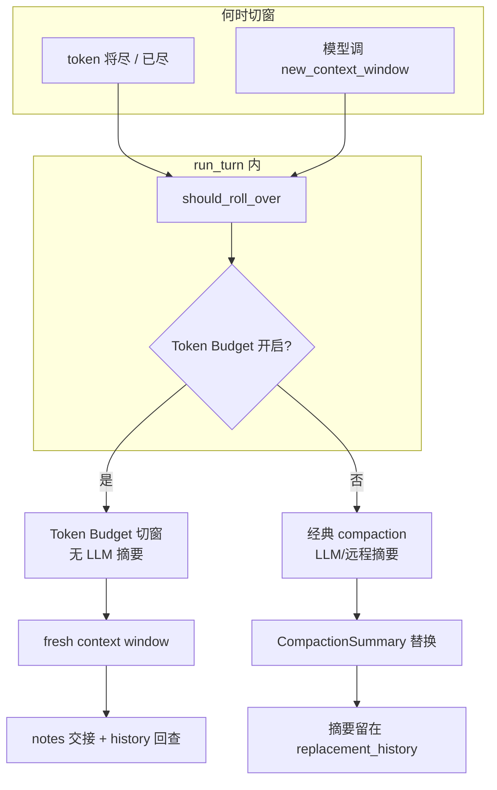
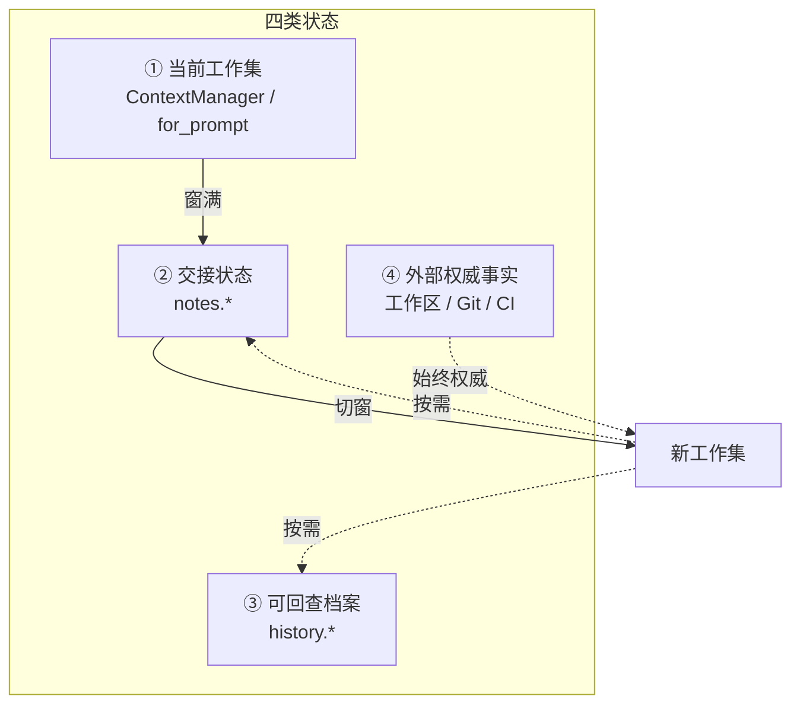
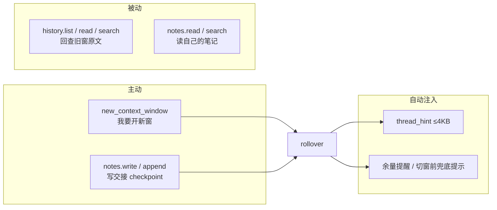
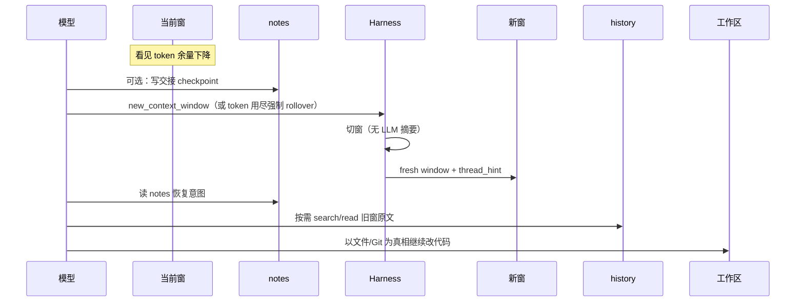
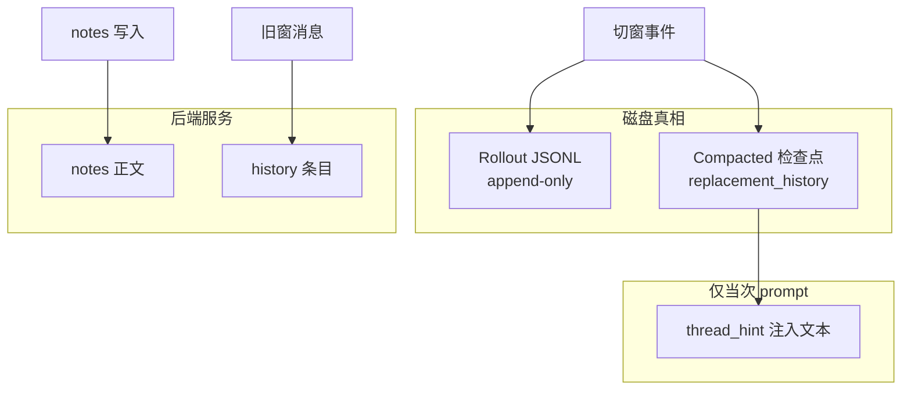
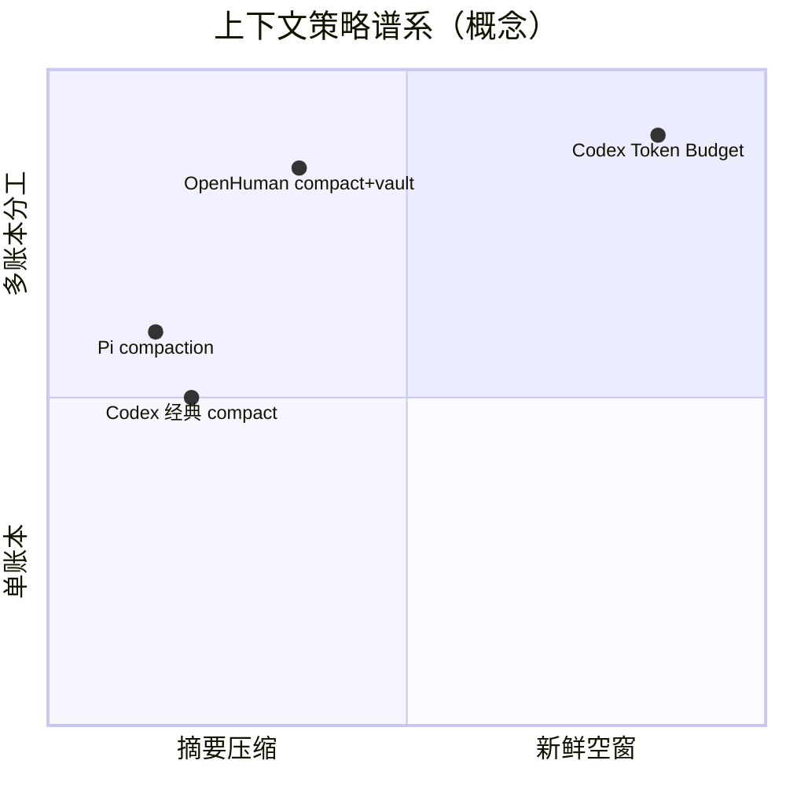

# Codex 上下文管理架构导读

> **定位**：讲清 **Token Budget 切窗** 的设计思想、四类状态、与经典 compaction 的关系。  
> **阅读时间**：~20 分钟  
> **关联**：[JSONL_TREE_GUIDE.md](./JSONL_TREE_GUIDE.md) · [RUNTIME_PROMPTS.md §3](./RUNTIME_PROMPTS.md#3-压缩方案与前后对比) · [DESIGN_THINKING_SERIES.md](./DESIGN_THINKING_SERIES.md)  
> **源码深潜**：[ARCHITECTURE_PART3.md](./ARCHITECTURE_PART3.md) · [RUNTIME_PROMPTS.md](./RUNTIME_PROMPTS.md)

---

## 1. 要解决什么问题

长编码任务会撞上 **上下文窗口上限**。常见做法是 **用 LLM 把旧对话压成摘要**——简单，但摘要会丢约束、丢失败路径、丢「为什么当时那么做」。

Codex Token Budget 走另一条路：

**不摘要，换一扇新窗；用多本账分工，让模型自己交接、自己回查；磁盘上的代码和 Git 才是最终真相。**

| 痛点 | 经典 compaction | Token Budget 切窗 |
|------|-----------------|-------------------|
| 窗口满了 | LLM 生成摘要替换 history | 装 **fresh 窗口**，旧内容 **可搜不回灌** |
| 信息丢失 | 摘要质量决定命运 | 完整记录在 history；交接写在 notes |
| 编码任务 | 聊天摘要 ≠ 代码真相 | **工作区不因切窗回滚** |
| 谁触发 | 多为 Harness 自动 | 模型可主动 `new_context_window` + Harness 兜底 |

两套机制 **并存**，不是互相取代。

---

## 2. 设计原则

| 原则 | 含义 |
|------|------|
| **No history rewrite** | 发给模型的上下文只增量追加；切窗用 `replacement_history` 检查点，不静默改旧 rollout 行 |
| **四账本分工** | 工作集 / 交接 / 档案 / 外部事实——不混在一棵摘要里 |
| **切窗 ≠ 撤销副作用** | 换 prompt 里的对话；**不**撤销已写文件、已跑命令、已发 API |
| **仍走 compaction 生命周期** | 切窗在实现上挂在 compaction 钩子上，UI 与 Hook 行为一致 |
| **按需回查** | 新窗默认轻量；细节用工具拉，不整段塞进 prompt |

---

## 3. 两类切窗路径（总览）



| 路径 | 核心动作 | 模型新窗里有什么 |
|------|----------|------------------|
| **经典 compaction** | 旧 history → **一段摘要** | 摘要 + 保留的尾部消息 |
| **Token Budget** | 旧 history → **不再塞进 prompt** | thread_hint + 指引；细节靠 tools |

---

## 4. 四类状态（架构核心）

**为什么分四本账？** 因为「模型此刻在想什么」「下一窗从哪接手」「原始记录在哪」「事实到底是什么」是四个不同问题，塞进一条 compaction 摘要会糊在一起。



| 账本 | 回答的问题 | 典型载体 | 切窗后 |
|------|------------|----------|--------|
| **① 工作集** | 这一步推理要什么？ | 当前窗 `ResponseItem` 链 | **清空重建**（fresh window） |
| **② 交接** | 下一窗从哪接手？ | `notes` 虚拟文件（跨窗） | 模型 **应先写入** checkpoint |
| **③ 档案** | 原始记录在哪？ | 按 window/item 索引的旧窗条目 | **不丢**；字面搜索回查 |
| **④ 外部事实** | 任务实际做成了什么？ | repo、测试、部署结果 | **不变** |

---

## 5. Harness 协议：模型能做什么

### 5.1 工具面（概念）



| 工具族 | 用途 | 重要语义 |
|--------|------|----------|
| **new_context_window** | 模型主动请求切窗 | 明确告知：**不会**对旧对话做摘要 |
| **notes.*** | 跨窗「交接便签」 | 模型应在此写进度、约束、下一步 |
| **history.*** | 按窗/条目读 **原文** | 搜索是 **字面子串**，不是语义 RAG |
| **（注入）thread_hint** | 新窗自动带的短摘要 | 硬上限约 4KB；不够还得读 notes/history |

### 5.2 Prompt 里多出来的「元数据层」

Token Budget 开启时，developer 区除正常指令外，还可出现：

| 片段类型 | 作用 |
|----------|------|
| **Window 身份** | 当前 / 上一窗 UUID，让模型知道自己第几扇窗 |
| **余量** | 「还剩 N tokens」——驱动模型提前写 notes |
| **Reminder** | 低于阈值时提醒即将切窗 |
| **Fallback 提示** | 自动 rollover 前的最后兜底文案 |
| **Catalog 指引** | 模型侧「该如何用 notes/history」的说明 |

设计意图：**把「窗口经济学」显式告诉模型**，而不是默默截断。

---

## 6. 一次切窗的生命周期



| 阶段 | 发生什么 |
|------|----------|
| **切窗前** | 模型应把「下一窗必须知道什么」写入 notes |
| **rollover** | 推进 window id；`replacement_history` 变为 fresh 内容（非摘要） |
| **切窗后** | thread_hint 自动注入；模型按需拉档案 |
| **全程** | 工作区变更 **保留** |

仍走 **compaction 生命周期**（Hook、TurnItem、Rollout 检查点），所以 UI 与审计语义与经典 compact 对齐，只是 **替换物不是摘要**。

---

## 7. 持久化：什么落在哪



| 数据 | 落点 | 说明 |
|------|------|------|
| **切窗检查点** | Rollout `Compacted` | Resume 用；**不是**「没持久化」 |
| **notes 正文** | 服务端 notes 存储 | 不进每条 rollout 行全文镜像 |
| **history 条目** | 服务端 history 存储 | 按 window 索引，供回查 |
| **thread_hint** | 当次 prompt | 源在后端，注入有上限 |
| **经典 compact 摘要** | 同样 `Compacted` 路径 | 与 Token Budget **共用检查点类型**，内容不同 |

**校正常见误解**：外链说「notes 不写 rollout」——对 **notes 正文** 成立；但 **切窗动作本身** 会写 Compacted 行。

---

## 8. 与 Pi / OpenHuman 等 Harness 的对照



| 项目 | 策略 | 与 Token Budget 关系 |
|------|------|----------------------|
| **Pi / Prime** | JSONL 树 + **compaction 摘要节点** | 同属「压上下文」，但走 **摘要** 而非空窗 |
| **OpenHuman** | transcript **compact** + vault **长期记忆** | 思想像「短账 + 长账」，但无 `new_context_window` 协议 |
| **Codex Memories** | 跨 thread 的 MEMORY.md | **跨会话**，不是单任务内切窗 |
| **Codex Token Budget** | 四账本 + 切窗工具 | 本文件主题 |

---

## 9. 设计优势与代价

### 优势

| 优势 | 原因 |
|------|------|
| **降低摘要幻觉** | 不依赖二次 LLM 压缩传递关键约束 |
| **档案可审计** | history 保留原文；rollout 仍 append-only |
| **适配编码 Agent** | 真相在 repo；切窗只清「聊天工作集」 |
| **模型可控节奏** | 先写 notes 再切窗，比被动摘要更可规划 |
| **与经典 compact 共存** | token 紧时仍可走摘要路径 |

### 代价与风险

| 风险 | 表现 |
|------|------|
| **notes 漏写** | 新窗「假失忆」 |
| **字面搜索局限** | 换说法搜不到旧内容 |
| **复杂度高** | 四账本 + 工具协议，比单次 compact 难教模型 |
| **后端绑定** | history/notes 扩展依赖 Codex 托管后端（实验特性） |
| **模型负担** | 要学会窗口经济学，而不只是继续 chat |

### 评估长任务是否健康

- 多次切窗后，用户约束和失败路线是否仍对？
- 模型是否在信息不足时 **主动** 查 history / notes？
- 切窗后是否重复执行命令 / 重复改文件？
- 首 token 延迟与 prompt cache 是否可接受？

---

## 10. 与其它 Codex 机制的正交边界

| 机制 | 管什么 | 与 Token Budget |
|------|--------|-----------------|
| **Token Budget 切窗** | 单 thread 内跨窗续跑 | — |
| **经典 compaction** | 同 thread 内摘要压缩 | 并存，触发条件可重叠 |
| **Plan Mode** | 用户门控方案 | 正交 |
| **Multi-Agent** | 子 thread 独立上下文 | 各子 Agent 自有 ContextManager |
| **Memories** | 跨 thread 长期知识 | 正交；原料仍含 rollout |

→ [PLAN_AND_MULTI_AGENT.md](./PLAN_AND_MULTI_AGENT.md)

---

## 11. 配置与产品边界（仅记名字）

| 用户可见配置（本仓库快照） | 含义 |
|---------------------------|------|
| `[features.token_budget] enabled` | 打开 Token Budget（默认关，实验态） |
| `use_history_notes_extension` | 挂载 `history.*` / `notes.*` 工具族 |

**启用 history-notes 扩展通常需要**：OpenAI Codex 托管后端（非任意 API Key 自建 provider）。

**校正外链**：配置名可能是 `context_management`（上游改名）；工具名是 **`new_context_window`** 不是 `new_context`。

---

## 12. 九步心智模型

```text
1. 长任务 → 当前窗是「工作集」
2. 余量下降 → Prompt 提醒模型
3. 模型应写 notes（交接）
4. 主动 new_context_window 或 token 用尽 → rollover
5. 切窗不做 LLM 摘要 → fresh window
6. 自动注入 thread_hint（很短）
7. 需要细节 → history / notes 工具拉
8. 代码真相 → 永远看工作区
9. Rollout 写 Compacted 检查点 → 可 Resume
```

---

## 相关文档

| 文档 | 内容 |
|------|------|
| [JSONL_TREE_GUIDE.md](./JSONL_TREE_GUIDE.md) | Compacted 检查点与三真相 |
| [RUNTIME_PROMPTS.md §3](./RUNTIME_PROMPTS.md) | 压缩优先级与 Prompt 实例 |
| [ARCHITECTURE_PART3.md](./ARCHITECTURE_PART3.md) | Rollout 重建算法 |
| [CROSS_AGENT_CONCEPT_MAP.md](../agent-doc-template/CROSS_AGENT_CONCEPT_MAP.md) | 跨项目「切窗」对照 |

**外部参考**（需结合本文校正）：[Codex 上下文管理架构拆解](https://mp.weixin.qq.com/s/s7jLKhfg4sKOIisI2P6ddw)
