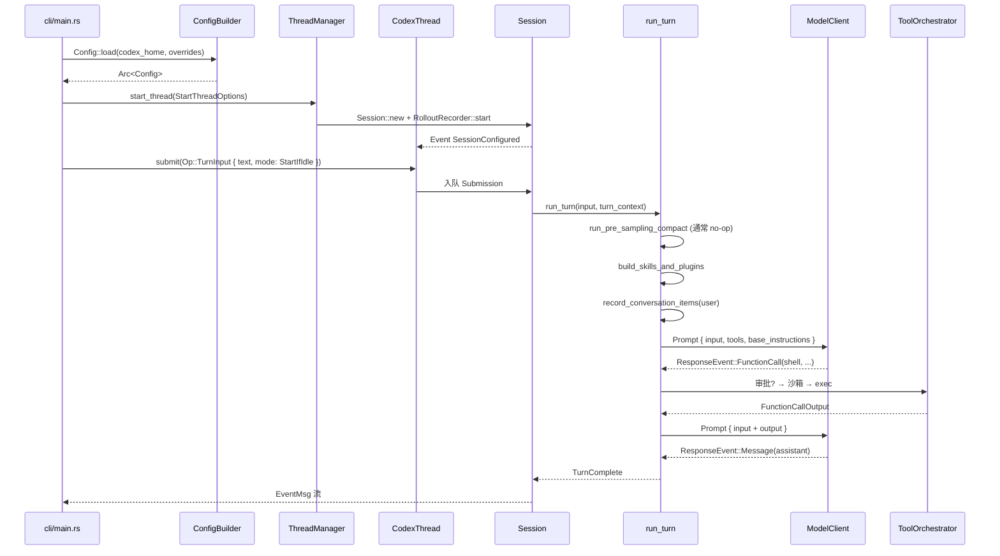
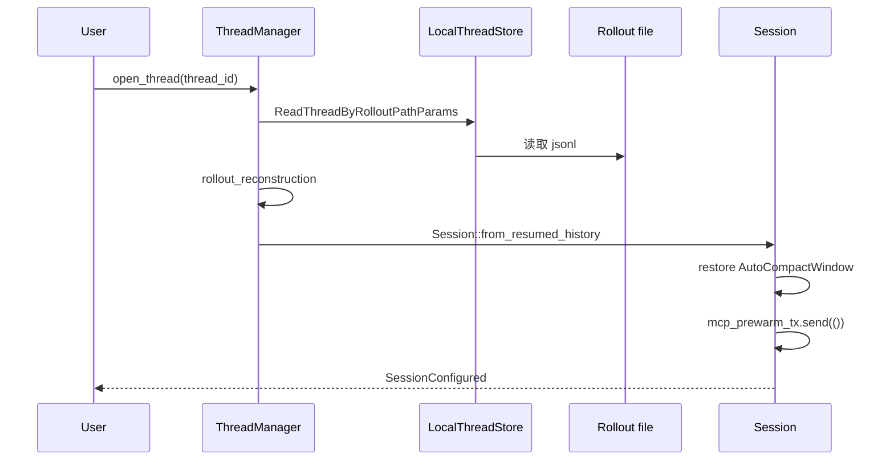
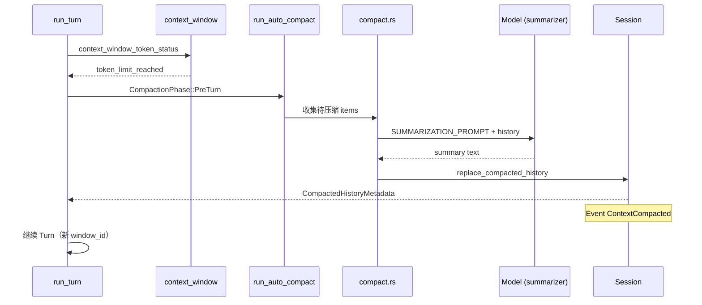

# Codex 核心运行时走查

> **版本**: 1.0 · **整理**: 2026-09-01  
> **阅读前提**: [ARCHITECTURE_PART1.md](./ARCHITECTURE_PART1.md) §4–§7

本文用 **三个完整场景** + **压缩实例** + **Prompt 组装实例** 把源码路径串起来。所有路径相对于 `codex/codex-rs/`。

---

## 场景 A：冷启动 — 第一次提问

### A.1 用户操作

```bash
# 安装后
codex
# TUI 中输入：「帮我在当前目录创建一个 hello.py」
```

### A.2 时序（源码级）



### A.3 关键对象实例（概念）

**TurnInput**（用户文本进入 core）：

```json
{
  "items": [
    { "type": "user_message", "content": "帮我在当前目录创建一个 hello.py" }
  ]
}
```

**Prompt**（第一次采样前，`client_common::Prompt`）：

```json
{
  "base_instructions": "<系统指令 + collaboration mode>",
  "input": [
    { "type": "message", "role": "user", "content": [
      { "type": "input_text", "text": "<environment_context>...</environment_context>" },
      { "type": "input_text", "text": "## My request for Codex:\n帮我在当前目录创建一个 hello.py" }
    ]}
  ],
  "tools": ["shell", "apply_patch", "update_plan", ...],
  "parallel_tool_calls": true
}
```

**EventMsg 流（用户可见顺序）**：

```
SessionConfigured
TurnStarted
AgentReasoning*          (可选，o-系列)
ExecApprovalRequest      (若 policy 需要)
ExecCommandBegin
ExecCommandOutputDelta*
ExecCommandEnd
AgentMessageContentDelta*
TurnComplete
TokenCount               (可选)
```

### A.4 落盘

`RolloutRecorder` 在同一线程文件追加 `RolloutItem`，路径形如：

```
~/.codex/sessions/<date>/<thread_id>.jsonl
```

首行 `SessionMeta` 含 `thread_id`、`model`、`session_source: "cli"`。

---

## 场景 B：同 Thread 第二次提问

### B.1 用户操作

在同一会话（未退出 TUI）继续输入：

```
给 hello.py 加上单元测试
```

### B.2 与第一次的差异

| 步骤 | 第一次 | 第二次 |
|------|--------|--------|
| `start_thread` | ✅ 新建 Session | ❌ 复用 `CodexThread` |
| `SessionConfigured` | ✅ | ❌ |
| `run_pre_sampling_compact` | 通常跳过 | **可能触发**（history 变长） |
| `ModelClientSession` | `new_session()` | **可能复用** sticky session |
| `Prompt.input` | 仅当前 user | **完整增量 history** + 新 user |
| Rollout | 创建文件 | **append** |

### B.3 History 增量示意

第二次采样前 `ResponseItem` 链（简化）：

```
[0] Message user: "## My request... hello.py"
[1] FunctionCall: shell("echo 'print(hello)' > hello.py")
[2] FunctionCallOutput: Exit code 0...
[3] Message assistant: "已创建 hello.py"
[4] Message user: "## My request... 单元测试"   ← 新增
```

**不变量**：`[0..3]` 不会被重写；若 compact，则 `[0..3]` 被 **单条** `CompactionSummary` 替换，Rollout 仍保留原始项。

### B.4 Pending Input（Steer）

若用户在第一次 Turn **尚未完成** 时输入第二条消息：

1. 消息进入 `InputQueue`
2. `run_turn` 在下一 Step 边界 `drain`（见 `turn.rs` 300–312 行）
3. 可能与 auto-compact 交互：compact 后延迟 drain 以保证模型先看到压缩结果

---

## 场景 C：Resume — 退出后重新打开线程

### C.1 用户操作

```bash
# TUI 或 IDE 选择历史线程
codex resume <thread_id>
# 或 app-server: thread/read + TurnInput
```

### C.2 时序



### C.3 重建注意点

1. **Compaction windows** — `AutoCompactWindowIds` 必须从 Rollout 恢复，否则 token 预算计算错误
2. **MCP** — 工具列表缓存失效，走 `mcp_refresh` / prewarm
3. **Permission profile** — 从 `ThreadSettingsSnapshot` 恢复
4. **Parent thread** — 子 Agent 线程含 `parent_thread_id`，Resume 后 spawn 深度计数仍有效

### C.4 Fork 变体

从某条用户消息 **分叉** 新线程：

```rust
// 概念 API
thread_manager.fork_thread(
    source_thread_id,
    ForkSnapshot::TruncateBeforeNthUserMessage(2),
)
```

新 `ThreadId`，history 为源线程第 2 条用户消息之前的 prefix。

---

## 场景 D：压缩完整实例

### D.1 触发条件

`context_window_token_status` 返回 `token_limit_reached: true`，或：

- 手动 `Op::Compact`
- 模型切换导致 `comp_hash_changed`
- Mid-turn 采样失败（上下文超限）

### D.2 Pre-turn 压缩时序



### D.3 压缩前后 Prompt 对比

**压缩前**（假设 80k tokens，上限 64k）：

```
input: [
  ... 40 轮 user/assistant/tool ...
  { user: "继续重构 auth 模块" }
]
```

**压缩后**（`InitialContextInjection::DoNotInject`）：

```
input: [
  { user: "<compaction_summary>...长摘要...</compaction_summary>" },
  { user: "## My request for Codex:\n继续重构 auth 模块" }
]
```

下一轮 Turn 开始时 **重新注入** `environment_context`、`user_instructions` 等 initial fragments（因为 `reference_context_item` 已清空）。

### D.4 Mid-turn 差异

Mid-turn 使用 `InitialContextInjection::BeforeLastUserMessage`：

```
input: [
  <re-injected initial context fragments>,
  <compaction_summary>,
  { user: "最后一条真实用户消息" },
  { assistant: "压缩前模型刚说的话..." }  // 可能部分保留
]
```

---

## 场景 E：Plan Mode 一轮

### E.1 用户切换

TUI footer 切换到 **Plan**（`ModeKind::Plan`，`CollaborationMode` 变更经 `Op::ThreadSettings` 或 UI 直接改）。

### E.2 行为差异

| 方面 | Default mode | Plan mode |
|------|--------------|-----------|
| 危险工具 | 按 policy | **额外限制**（`turn_runtime.rs`） |
| `update_plan` | 可用 | **拒绝** |
| 助手文本解析 | 普通 | `AssistantTextStreamParser(plan_mode: true)` |
| UI 事件 | — | `PlanDelta` / proposed plan segment |

### E.3 典型 Event 序列

```
TurnStarted
PlanDelta*                    ← 结构化计划流
AgentMessageContentDelta*
TurnComplete
```

用户确认计划后，通常 **切换回 Default mode** 再执行（产品层行为；core 不自动切换）。

---

## 场景 F：spawn 子 Agent

### F.1 模型调用

```json
{
  "name": "spawn_agent",
  "arguments": {
    "message": "调研项目中所有 TODO 注释并汇总",
    "agent_type": "explorer",
    "fork_context": "full_history"
  }
}
```

### F.2 Core 行为

1. `SpawnAgentHandler` → `AgentControl::spawn`
2. `ThreadManager::start_thread` 带 `parent_thread_id`
3. 子 Thread 独立 `run_turn`
4. 父 Session 收 `CollabAgentSpawnBegin/End`
5. 子 Agent 完成后 `InterAgentCommunication` 或 `wait` 工具返回

### F.3 父模型看到的输出

`FunctionCallOutput` 含子 Agent 最终摘要（非完整子 Rollout）。

---

## Prompt 组装实例（完整片段顺序）

一次 **Default mode** Turn 的 typical `input` 构建顺序（`build_initial_context` + user turn）：

| 顺序 | Fragment | 来源文件 |
|------|----------|----------|
| 1 | Base instructions | `base_instructions.rs` |
| 2 | Developer instructions | `developer_instructions.rs` |
| 3 | User instructions (AGENTS.md) | `user_instructions.rs` |
| 4 | Environment context | `environment_context.rs` |
| 5 | Permissions instructions | `permissions_instructions.rs` |
| 6 | Skills instructions | skills extension |
| 7 | Plugins / Apps | `plugin_instructions.rs` |
| 8 | Multi-agent hints | `multi_agent_usage_hint.rs` |
| 9 | Compaction summary（若有） | `compaction_summary.rs` |
| 10 | **真实用户消息** | `USER_MESSAGE_BEGIN` 前缀 |
| 11+ | 历史 turns（assistant / tool / user） | 增量追加 |

**Tools 数组** 并行组装于 `Prompt.tools`，与 input 分离（Responses API 格式）。

---

## 调试清单

| 现象 | 检查 |
|------|------|
| 第二轮变卡 | `run_pre_sampling_compact` 是否触发；查看 `ContextCompacted` 事件 |
| Resume 后工具缺失 | MCP prewarm 日志；`Op::RefreshMcpServers` |
| 审批循环 | `pending_actions` / `ExecApprovalRequest` 是否收到对应 `Op` |
| Plan 下 update_plan 报错 | 预期行为；换 checklist 或切 Default |
| Token 暴涨 | 单 fragment >1k tokens（AGENTS.md P0 review） |

---

**返回**: [ARCHITECTURE.md](./ARCHITECTURE.md)
