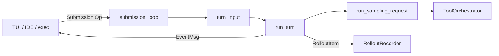
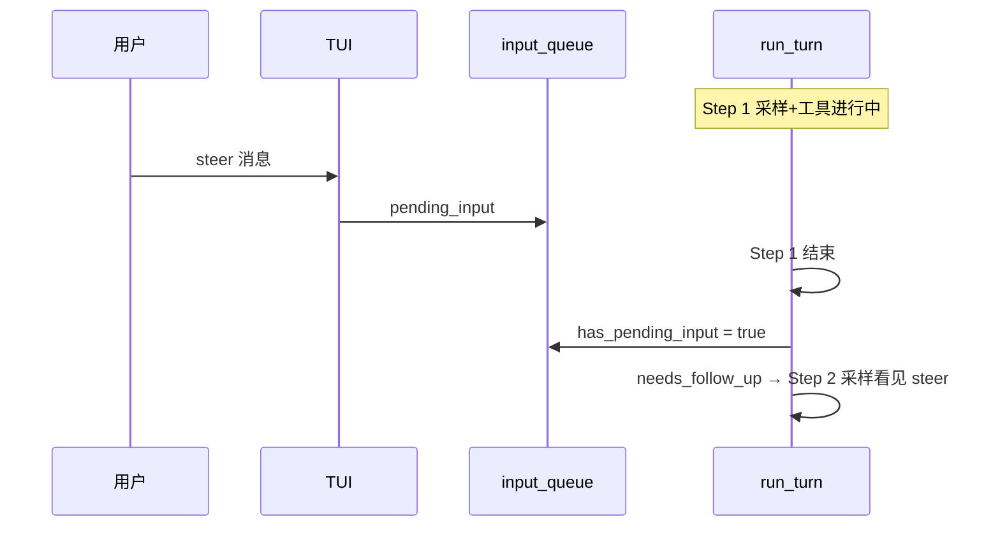

# Codex 设计思想导读

> **阅读方式**：先读本导读（~40 分钟）→ [README.md](./README.md) → [ARCHITECTURE_PART1.md](./ARCHITECTURE_PART1.md)  
> **树形 / Rollout**：[JSONL_TREE_GUIDE.md](./JSONL_TREE_GUIDE.md)  
> **图解速览**：[diagrams/design-thinking-series.html](./diagrams/design-thinking-series.html)（浏览器打开）  
> **写法标准**：[PROGRESSIVE_ARCH_DOC_METHODOLOGY.md](../agent-doc-template/PROGRESSIVE_ARCH_DOC_METHODOLOGY.md)  
> **跨项目对照**：[CROSS_AGENT_CONCEPT_MAP.md](../agent-doc-template/CROSS_AGENT_CONCEPT_MAP.md) · [Pi 导读](../../pi/docs/DESIGN_THINKING_SERIES.md)

---

## 先建立一条运行路径

在打开任何 Part II 之前，先把 **一次用户提问** 在内存里的路径背下来：

```text
TUI / IDE / exec 提交 Op::UserTurn
  → ThreadManager 找到 Session
  → submission_loop 分发 Op
  → turn_input 点火 ActiveTurn
  → run_turn Step 循环
        → run_sampling_request（LLM 流式）
        → ToolOrchestrator 执行工具
        → needs_follow_up? 继续 Step : TurnComplete
  → EventMsg 流式推给客户端
  → persist_rollout_items 追加 JSONL（过滤后）
```

后面每一节都是在这条路径上 **加一个透镜**；不是按 crate 名罗列。

---

## 第 1 步：先认识真实源码全景

**一句话**：Codex 不是「一个 CLI 调 OpenAI」，而是 **多客户端共用 `codex-core` + SQ/EQ 协议 + Rollout 可恢复会话**。

**为什么先看这里**：TUI、exec、app-server、MCP host 看起来是不同产品，但它们共享同一套 `Session` / `run_turn`。先认目录，后面才不会把「UI 事件」和「模型历史」混成一棵树。

### `codex-rs` 模块地图

```text
codex-rs/
├── core/              Session, run_turn, ContextManager, tools, compact
├── protocol/          Op, EventMsg, ModeKind, PlanUpdate
├── tui/               ChatWidget, queued_user_messages
├── rollout/           JSONL 持久化 + policy 过滤
├── thread-store/      本地线程列表、Resume
├── ext/history-notes/ Token Budget 的 notes/history 工具
└── app-server/        thread/turn/item 分页 API
```

| 模块 | 职责 | 改什么时打开 |
|------|------|--------------|
| **core/session** | 运行时真相 | Turn 生命周期、steer 队列 |
| **core/tools** | 工具注册与执行 | 新工具、审批、沙箱 |
| **rollout/** | 磁盘 append-only | Resume、合规导出 |
| **protocol/** | 客户端契约 | 新 EventMsg、Op |

### 深潜

→ [ARCHITECTURE.md](./ARCHITECTURE.md) · [ENTITY_AND_SEQUENCES.md](./ENTITY_AND_SEQUENCES.md)

---

## 第 2 步：控制面 vs 执行面

**一句话**：**`submission_loop` 像总控台**（收 Op、点火、不跑模型）；**`run_turn` 像发动机**（采样 + 工具 + Step 循环）。

**为什么先看这里**：新人常把「用户发了消息」等同于「模型开始采样」。实际上中间有 **ActiveTurn 互斥**、**turn_input 排队**、**邮箱投递** 等多层；搞清分界才能理解 steer 和 follow-up。

| | 控制面 | 执行面 |
|--|--------|--------|
| **入口** | `submission_loop` | `run_turn` → `run_sampling_request` |
| **职责** | `Op` 分发、`Interrupt`、`TurnInput` | LLM 流、工具链、compact 触发 |
| **状态** | `Session`、邮箱、`active_turn` | `StepContext`、`TurnContext` |
| **类比 Pi** | AgentSession 编排 | Agent Loop |



`submission_loop` 是长期运行的 `while recv Submission`；`Op::Shutdown` 才能退出：

```529:537:codex/codex-rs/core/src/session/handlers.rs
pub(super) async fn submission_loop(
    sess: Arc<Session>,
    config: Arc<Config>,
    rx_sub: Receiver<Submission>,
) {
    // To break out of this loop, send Op::Shutdown.
    let mut shutdown_received = false;
    while let Ok(sub) = rx_sub.recv().await {
```

### 校正 / 易错点

- **一个 Thread 至多一个 ActiveTurn**：新 Turn 需等当前 Turn 结束或被 Interrupt，除非走 steer 邮箱（见第 7 步）。
- **`submission_loop` 不直接调模型**：所有采样都在 `run_turn` 内。

### 深潜

→ [ARCHITECTURE_PART1.md §2–§4](./ARCHITECTURE_PART1.md) · [CORE_RUNTIME_WALKTHROUGH.md](./CORE_RUNTIME_WALKTHROUGH.md)

---

## 第 3 步：一次 Turn，其实是 Step 循环

**一句话**：**外层 Step** 在「模型还要跟工具 / 还有 pending 输入」时继续；**内层采样** 在一次 `run_sampling_request` 里流式消费 tool follow-up。

**为什么先看这里**：`needs_follow_up` 是读 Codex 源码的最高频问号之一。它 **不是**「子 Agent 没跑完」的标志，而是 **本 Turn 是否还要再跑一个 Step**。

### 核心公式（源码）

```474:474:codex/codex-rs/core/src/session/turn.rs
                let needs_follow_up = model_needs_follow_up || has_pending_input;
```

| 变量 | 含义 | 典型来源 |
|------|------|----------|
| `model_needs_follow_up` | 采样结果还要工具链 / `end_turn==false` | `run_sampling_request` 输出 |
| `has_pending_input` | steer 邮箱里有未消费用户输入 | `input_queue.has_pending_input` |
| `needs_follow_up` | **Step 循环是否 `continue`** | 上两者 OR |

```text
run_turn {
  loop {  // Step 循环（外层）
    run_sampling_request()     // 内层：一次采样 + 流内 tool
    if model_needs_follow_up → accept_mailbox_delivery
    if needs_follow_up && token_limit → run_auto_compact; continue
    if !needs_follow_up → TurnComplete; break
    else → continue Step
  }
}
```

| 循环 | 继续条件 | 类比 Pi |
|------|----------|---------|
| **Step（外）** | `needs_follow_up == true` | outer `while` + followUp |
| **采样（内）** | 流里还有 tool / 未 end_turn | inner tool + steering |

### 校正 / 易错点

- **`needs_follow_up` ≠ Multi-Agent 完成度**：MA 的 `followup_task` 是 **跨 Session 邮箱**，走另一套路径（见 [PLAN_AND_MULTI_AGENT.md](./PLAN_AND_MULTI_AGENT.md)）。
- **token 超限可 mid-turn compact**：`should_roll_over` 为真时先 `run_auto_compact` 再 `continue` Step，而不是直接结束 Turn。

### 深潜

→ [PLAN_AND_MULTI_AGENT.md §needs_follow_up](./PLAN_AND_MULTI_AGENT.md) · [ENTITY_AND_SEQUENCES.md](./ENTITY_AND_SEQUENCES.md) · `core/src/session/turn.rs`

---

## 第 4 步：依赖与装配

**一句话**：**客户端只认 SQ/EQ**；**ThreadManager 管线程生命周期**；**工具面在 Turn 开始时 `spec_plan` 扁平化**（含 MCP）。

**为什么先看这里**：改工具、改模式、改 MCP，最终都会落到 **某次 Turn 的 `TurnContext`**。要知道是谁在 Turn 开始前把 registry 装好。

```text
TUI / exec / app-server / MCP host
  → ThreadManager::submit(Op)
  → Session::submission_loop
  → turn_input::handle → spawn ActiveTurn
  → run_turn
       TurnContext.config + collaboration_mode
       ToolRegistry (spec_plan + MCP flatten + Skills)
```

| 装配时机 | 内容 |
|----------|------|
| Session 创建 | Config、cwd、model、history_mode |
| Turn 开始 | `TurnContext`、`ModeKind`（Default / Plan / …） |
| 采样前 | `ContextManager.for_prompt()` 组装 |

### 深潜

→ [ARCHITECTURE_PART2.md](./ARCHITECTURE_PART2.md) 工具注册 · [RUNTIME_PROMPTS.md](./RUNTIME_PROMPTS.md)

---

## 第 5 步：工具调用经过 ToolOrchestrator

**一句话**：模型产出 `FunctionCall` 后，不是直接 `exec`，而是 **`ToolOrchestrator`：路由 → 审批 → 沙箱 → 重试 → `FunctionCallOutput`**。

**为什么先看这里**：Codex 工具栈深（shell、patch、MCP、Plan、spawn_agent…）。Orchestrator 是 **单 Turn 内** 的统一管道；**不是** Multi-Agent 协调器。

```text
FunctionCall(name, arguments)
  → ToolRouter 解析 Handler
  → 权限 / Guardian / 用户审批
  → 沙箱执行（或 MCP 转发）
  → FunctionCallOutput → ContextManager.record
  → EventMsg（ItemCompleted 等）→ UI
```

| 阶段 | 失败时 |
|------|--------|
| Schema 解析 | 错误回注模型 |
| 审批拒绝 | `FunctionCallOutput` 带拒绝说明 |
| 沙箱超时 | 可重试策略（见 PART2） |

**校正**：`ToolOrchestrator` 管 **工具**；`spawn_agent` 管 **子 Session**——名字里都有 orchestration，层级不同。

### 深潜

→ [ARCHITECTURE_PART2.md](./ARCHITECTURE_PART2.md) · `core/src/tools/orchestrator.rs` · [**SECURITY_ARCHITECTURE.md**](./SECURITY_ARCHITECTURE.md)

---

## 第 6 步：三套投影，一套事件流

**一句话**：**EventMsg 给 UI 看**；**ContextManager 给模型看**；**Rollout JSONL 给 Resume/合规看**——三者 **刻意允许短暂不一致**。

**为什么先看这里**：「Plan 进度没进 history」「Resume 后 UI 有、模型没有」类 bug，几乎都是 **没分清三真相**。

### UI 事件序（Paginated 概念）

```text
TurnStarted
  → ItemStarted → *Delta → ItemCompleted
  → PlanUpdate / PlanDelta（瞬时，多数不进 durable rollout）
  → TokenCount / ContextCompacted
TurnComplete
```

| 真相 | 载体 | 消费者 |
|------|------|--------|
| **模型历史** | `ContextManager` → `for_prompt()` | 下一轮采样 |
| **UI** | `EventMsg` / `TurnItem` 投影 | TUI、app-server |
| **磁盘** | `RolloutItem` 行 | Resume、jq、Memories |

### 校正 / 易错点（持久化）

| 误解 | 事实 |
|------|------|
| `PlanUpdate` 会进 rollout | `should_persist_event_msg` 对 `PlanUpdate` → **false**（瞬时 UI） |
| `update_plan` 不进历史 | **`FunctionCall` / `FunctionCallOutput` 作为 ResponseItem 会持久化** |
| UI 即模型所见 | Paginated 下经 `ItemCompleted` 投影，Legacy 下可能分叉 |

→ 专文：[UPDATE_PLAN_REFERENCE.md](./UPDATE_PLAN_REFERENCE.md)

### 深潜

→ [ARCHITECTURE_PART3.md §0](./ARCHITECTURE_PART3.md) · [JSONL_TREE_GUIDE.md](./JSONL_TREE_GUIDE.md) · `rollout/src/policy.rs`

---

## 第 7 步：Steering、Follow-up 与邮箱

**一句话**：**Steer** 进 `pending_input`，在当前 Turn 的 **下一 Step** 被模型看见；**TUI follow-up 队列** 是 idle 后再发新 Turn；**MA `followup_task`** 是 **跨 Agent 邮箱**。

**为什么先看这里**：三种「第二条消息」语义完全不同，混谈是 Codex 文档里最常见的坑。

| 机制 | 入口 | 何时进模型 | 类比 Pi |
|------|------|------------|---------|
| **Steer** | `TurnInput` steer | 当前 Turn 下一 Step（`has_pending_input`） | `steeringQueue` |
| **TUI queued messages** | `queued_user_messages` | Session idle 后新 `UserTurn` | `followUpQueue` |
| **MA followup_task** | 子 Session 邮箱 | 子 Agent 自己的 Turn | 跨 lane，非 UI 队列 |



### 校正 / 易错点

- Steer **不** 等价于 Interrupt：当前 Step 的工具链通常会跑完，再消费 pending。
- `can_drain_pending_input` 在 `model_needs_follow_up` 为真时会被置回 false，避免错误清空邮箱（见 `turn.rs` 547 行附近）。

### 深潜

→ [ARCHITECTURE_PART1.md §3.1](./ARCHITECTURE_PART1.md) · [PLAN_AND_MULTI_AGENT.md](./PLAN_AND_MULTI_AGENT.md)

---

## 第 8 步：持久化 Harness 与三真相

**一句话**：Rollout 是 **append-only 账本**；`Compacted` 是 **切窗/压缩检查点**；Token Budget 用 **notes/history 工具** 续跑长任务。

**为什么先看这里**：长会话、Resume、合规导出都绕不开 JSONL。要先会读行类型，再读 compact 策略。

### Rollout 行流（简图）

```text
line 1: SessionMeta { model, cwd, history_mode, … }
line 2+: RolloutItem 流
  ResponseItem::Message / FunctionCall / …
  Compacted { replacement_history }   ← compact / 切窗后
  TokenUsageRecord
  TurnContext / WorldState（元数据）
```

### 四类状态（读长任务时）

| 类型 | 问题 | Codex 载体 |
|------|------|------------|
| 当前工作集 | 这一步推理要什么？ | `ContextManager.for_prompt()` |
| 交接状态 | 下一窗从哪接手？ | `notes.*`（Token Budget） |
| 可回查历史 | 原始记录在哪？ | `history.*` + rollout 行 |
| 外部事实 | 文件/Git/CI 真相 | 工作区（**不因切窗回滚**） |

### 校正 / 易错点

| 外链/口语 | 源码事实 |
|-----------|----------|
| `context_management.experimental_mode` | 本仓库为 `[features.token_budget] enabled` |
| `new_context` 工具名 | 实际为 **`new_context_window`** |
| Token Budget 取代 compaction | **并存**；`compact_token_budget.rs` 仍走 compaction 生命周期钩子 |

### 深潜

→ [CONTEXT_MANAGEMENT.md](./CONTEXT_MANAGEMENT.md) · [JSONL_TREE_GUIDE.md](./JSONL_TREE_GUIDE.md) · [ARCHITECTURE_PART3.md](./ARCHITECTURE_PART3.md)

---

## 第 9 步：Plan、Multi-Agent 与扩展边界

**一句话**：**Plan Mode**（人要批方案）与 **`update_plan` 工具**（执行期 checklist）**硬互斥**；**Multi-Agent** 是独立 Session + 协作协议；**MCP/Skills** 扁平进 registry。

**为什么先看这里**：三个名字都带 Plan/Agent，却是正交维度。用 10 秒决策树选对机制：

```text
要先审方案再动手？     → ModeKind::Plan + <proposed_plan>
执行中勾进度？         → update_plan（Default + 开关）
派子任务给独立 Agent？ → spawn_agent / followup_task（MA V2）
```

| 边界 | 职责 |
|------|------|
| **ModeKind::Plan** | 协作模式；TUI「Implement this plan?」 |
| **`update_plan`** | Default 下工具；`PlanUpdate` 瞬时 UI |
| **Multi-Agent V1/V2** | 子线程、邮箱、`InterAgentCommunication` rollout 行 | [MULTI_AGENT_ARCHITECTURE.md](./MULTI_AGENT_ARCHITECTURE.md) |
| **MCP / Skills / Plugins** | 扩展工具与 prompt 注入 |
| **Token Budget** | `ext/history-notes/` 实验切窗 |

### 深潜

→ [PLAN_AND_MULTI_AGENT.md](./PLAN_AND_MULTI_AGENT.md) · [RUNTIME_PROMPTS.md](./RUNTIME_PROMPTS.md) · [FULL_LIFECYCLE_SEQUENCE.md](./FULL_LIFECYCLE_SEQUENCE.md)

---

## 阅读路径建议

```text
1. 本导读（建立运行路径）
2. README 10 秒心智模型
3. JSONL_TREE_GUIDE（三真相 + Rollout 行）
4. CORE_RUNTIME_WALKTHROUGH（冷启动 / Resume 实例）
5. ARCHITECTURE Part I–III（改代码时）
```

## 专题速查

| 主题 | 文档 |
|------|------|
| Plan / update_plan / MA | [PLAN_AND_MULTI_AGENT.md](./PLAN_AND_MULTI_AGENT.md) |
| MA V1/V2 架构 | [MULTI_AGENT_ARCHITECTURE.md](./MULTI_AGENT_ARCHITECTURE.md) |
| Token Budget / notes / history | [CONTEXT_MANAGEMENT.md](./CONTEXT_MANAGEMENT.md) |
| 运行时 Prompt | [RUNTIME_PROMPTS.md](./RUNTIME_PROMPTS.md) |
| `update_plan` 专文 | [UPDATE_PLAN_REFERENCE.md](./UPDATE_PLAN_REFERENCE.md) |
