# Codex — 实体模型、时序与模块深潜（源码级）

> **配套**: [PART1](./ARCHITECTURE_PART1.md) 原理 · [WALKTHROUGH](./CORE_RUNTIME_WALKTHROUGH.md) 叙事实例  
> **源码根**: `codex/codex-rs/`  
> **图示公约**: 全文档 Mermaid / 时序图须遵守 [PART1 §1.2.0](./ARCHITECTURE_PART1.md#120-图示与术语公约全文档强制)（`run_turn` = async fn，经 `RunningTask` → `RegularTask::run` 执行；禁止 `spawn run_turn` 扁平画法）。

本文档是 **单文件完整参考**：实体字段与 ER 关系、端到端时序、**按源码模块展开的深潜**（函数级阶段、状态机、时序图、JSON 示例）。设计取舍见 PART1，此处只写「代码里是什么」。

---

## 导读：阅读顺序

| 你想搞懂… | 跳转到 |
|-----------|--------|
| Thread / Session / Turn 谁包含谁 | [§1 实体总览](#1-实体总览与包含关系) |
| SQ/EQ、`Op` 有哪些 | [§3 协议实体](#3-协议实体sqeq) |
| 冷启动到工具再到第二问 | [§6–8 端到端时序](#6-端到端时序-a冷启动--第一问--shell-工具) |
| `submission_loop` 怎么分发 | [§9.1 submission_loop](#91-submission_loopop-全量分发) |
| `run_turn` 内层在干什么 | [§9.3 run_turn 分阶段](#93-run_turn-分阶段源码-turnrs) |
| 工具审批与沙箱升级 | [§9.6 ToolOrchestrator](#96-toolorchestrator-与审批) |
| 压缩何时触发 | [§9.8 Compact](#98-compact-子系统) |
| 子 Agent 怎么 spawn | [§9.10 多 Agent](#910-多-agentagentcontrol) |

---

## 完整目录

**第一篇 实体模型** — §1–5  
**第二篇 端到端时序** — §6–8  
**第三篇 模块深潜** — §9（9.1–9.12）  
**第四篇 JSON 实例** — §10

---

# 第一篇 实体模型

## 1. 实体总览与包含关系

### 1.1 进程级包含（1:N）

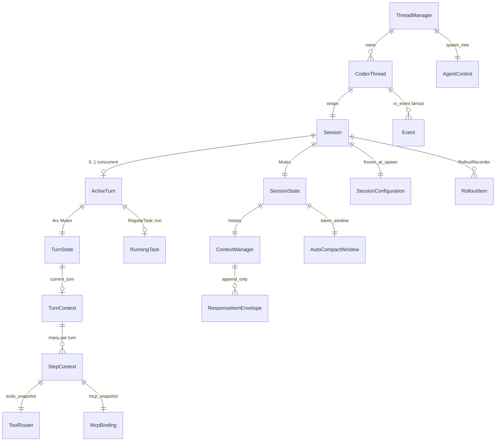

### 1.2 身份 ID 对照

| ID 类型 | Rust 类型 | 文件 | 生命周期 |
|---------|-----------|------|----------|
| Thread | `ThreadId` | `protocol/src/thread_id.rs` | 持久化；Resume/Fork 的主键 |
| Session（协议） | `SessionId` | `protocol/src/session_id.rs` | 一次进程内 Session 实例；wire 上与 thread 常同现 |
| Submission | `Submission.id: String` | `protocol.rs` | 单次客户端操作，关联 EQ 事件 |
| Turn（逻辑） | `TurnStartedEvent.turn_id` 等 | 事件载荷 | 一轮用户问题；无独立全局 ID 类型 |
| Response item | `ResponseItemId` | `protocol/src/response_item_id.rs` | 模型历史条目的稳定 id |
| Tool call | `call_id: String` | `FunctionCall` | 配对 `FunctionCallOutput` |
| Compact window | `Uuid` v7 | `AutoCompactWindowIds.window_id` | 压缩换窗后递增 `window_number` |

### 1.3 三层投影（再次强调关系）

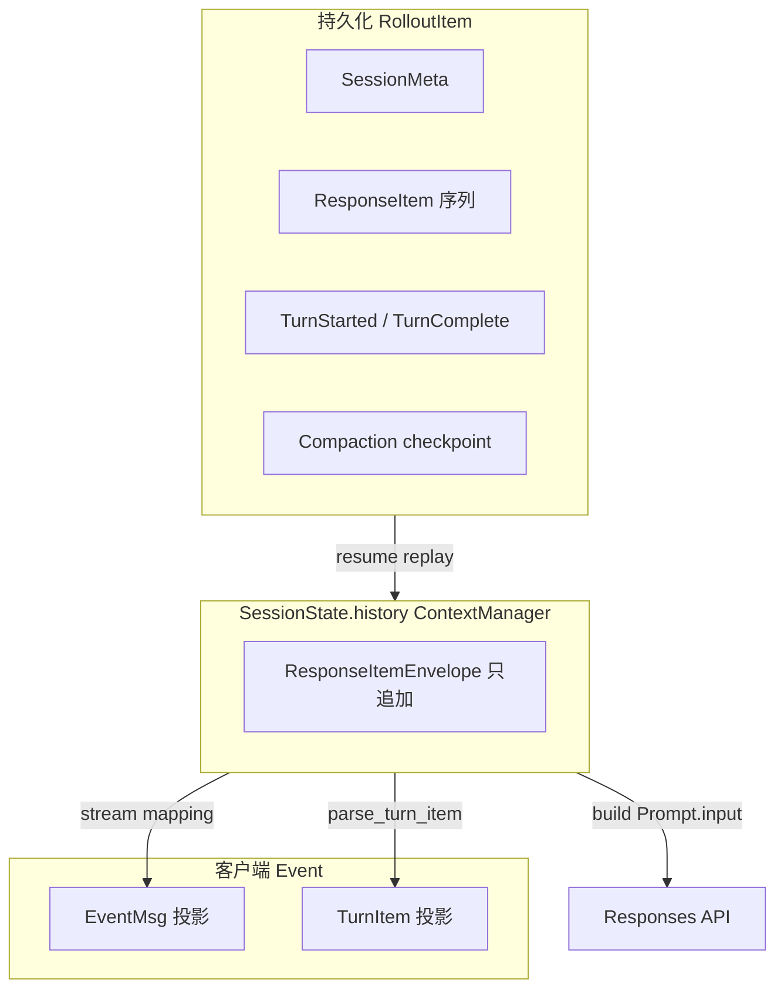

**不变量**：`ContextManager` 是模型真相；`Event` 是 UI 真相；`Rollout` 是磁盘真相。三者通过 `record_*` / `emit` / `RolloutRecorder` 同步，禁止 UI 直接改 `history`。

---

## 2. 核心实体字段表

### 2.1 `ThreadManager` / `CodexThread`

| 实体 | 关键字段 | 源码 |
|------|----------|------|
| `ThreadManager` | `state: ThreadManagerState`（含 `HashMap<ThreadId, Arc<CodexThread>>`）、`agent_control: AgentControl` | `core/src/thread_manager.rs` |
| `CodexThread` | `thread_id`, `session: Arc<Session>`, `io: SessionIo`, `rx_event: broadcast::Receiver<Event>`, `rollout_path` | `core/src/codex_thread.rs` |
| `SessionIo` | `tx_sub: Sender<Submission>`, `session_loop_termination` | `core/src/session/mod.rs` |

`CodexThread::submit(op)` → `SessionIo::submit` → 包装 `Submission { id, op, trace }` → `tx_sub.send`。

### 2.2 `Session`

```40:71:codex/codex-rs/core/src/session/session.rs
pub(crate) struct Session {
    pub(crate) thread_id: ThreadId,
    pub(crate) installation_id: String,
    pub(super) tx_event: Sender<Event>,
    pub(super) agent_status: watch::Sender<AgentStatus>,
    pub(super) state: Mutex<SessionState>,
    pub(super) managed_network_proxy_refresh_lock: Semaphore,
    pub(super) features: ManagedFeatures,
    pub(crate) active_turn: Mutex<Option<ActiveTurn>>,
    pub(crate) input_queue: InputQueue,
    pub(crate) conversation: Arc<RealtimeConversationManager>,
    pub(crate) services: SessionServices,
    // mcp_refresh, guardian_review_session, fork_persistence, ...
}
```

| 字段 | 职责 |
|------|------|
| `tx_event` | EQ 出口；所有 `EventMsg` 经此广播 |
| `state` | `SessionState`：history、compact window、rate limits |
| `active_turn` | 当前 `run_turn` 任务 + `TurnState` |
| `input_queue` | Turn 运行中用户 steer 排队 |
| `services` | `ModelClient`, `McpManager`, `Hooks`, analytics, extensions |

### 2.3 `SessionState`

```28:50:codex/codex-rs/core/src/state/session.rs
pub(crate) struct SessionState {
    pub(crate) session_configuration: SessionConfiguration,
    pub(crate) history: ContextManager,
    pub(crate) latest_rate_limits: Option<RateLimitSnapshot>,
    pub(crate) previous_turn_settings: Option<PreviousTurnSettings>,
    pub(crate) auto_compact_window: AutoCompactWindow,
    pub(crate) active_connector_selection: HashSet<String>,
    // ...
}
```

`ContextManager`（`core/src/context_manager/history.rs`）持有 `Vec<ResponseItemEnvelope>`，提供 `record`、`replace_compacted_history`、`items_for_prompt` 等。

### 2.4 `ActiveTurn` / `TurnState`

```32:35:codex/codex-rs/core/src/state/turn.rs
pub(crate) struct ActiveTurn {
    pub(crate) task: Option<RunningTask>,
    pub(crate) turn_state: Arc<Mutex<TurnState>>,
}
```

`TurnState` 内含：pending exec approvals、dynamic tool waiters、`TokenUsage` 累计、`MailboxDeliveryPhase`（子 Agent 邮件是否并入本轮采样）等。

### 2.5 `TurnContext` vs `StepContext`

| | `TurnContext` | `StepContext` |
|--|---------------|---------------|
| 粒度 | 一整轮用户 Turn | 一次 LLM 采样 |
| 文件 | `session/turn_context.rs` | `session/step_context.rs` |
| 典型字段 | `model_info`, `collaboration_mode`, `environments`, `auth_manager` | `tool_router`, `mcp`, `loaded_agents_md`, `model_info`（可随 step 变） |
| 创建 | Turn 开始时 | 每次采样前 `capture_step_context*` |

```18:47:codex/codex-rs/core/src/session/step_context.rs
pub(crate) struct StepContext {
    pub(crate) turn: Arc<TurnContext>,
    pub(crate) model_info: Arc<ModelInfo>,
    pub(crate) tool_router: Arc<ToolRouter>,
    pub(crate) mcp: Arc<McpBinding>,
    pub(crate) loaded_agents_md: Option<Arc<LoadedAgentsMd>>,
    // reasoning_effort, approval_policy, environments, ...
}
```

### 2.6 `SessionServices`（依赖注入容器）

概念上包含（见 `session/session.rs` 附近组装）：

- `model_client: ModelClient`
- `mcp_manager: McpManager`
- `hooks: Hooks`
- `analytics_events_client`
- `rollout_recorder: RolloutRecorder`
- `extensions: ExtensionRegistry`
- `thread_extension_data` / `session_extension_data`

---

## 3. 协议实体（SQ/EQ）

### 3.1 `Submission` / `Event`

```187:194:codex/codex-rs/protocol/src/protocol.rs
pub struct Submission {
    pub id: String,
    pub op: Op,
    pub trace: Option<W3cTraceContext>,
    pub parent_turn_id: Option<String>,
    pub root_turn_id: Option<String>,
}
```

```1278:1283:codex/codex-rs/protocol/src/protocol.rs
pub struct Event {
    pub id: String,      // correlates to Submission.id
    pub msg: EventMsg,
}
```

### 3.2 `Op` 与 Turn 相关的变体（关系）

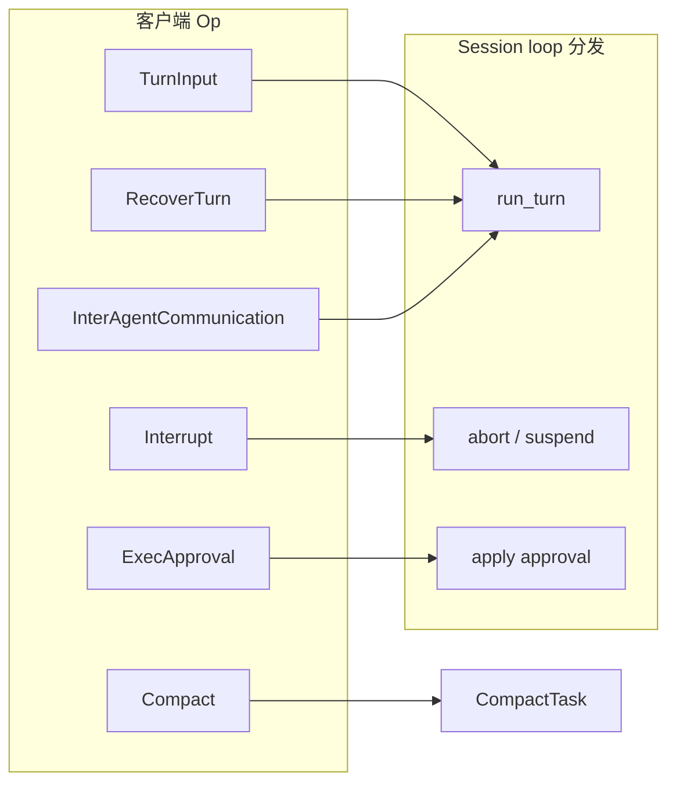

### 3.3 `SessionConfiguredEvent`（首包）

Resume/新建 Thread 后第一个 EQ 事件，字段见 `protocol.rs` ~L3685：`session_id`, `thread_id`, `model`, `cwd`, `permission_profile`, `rollout_path`, `initial_messages?`…

---

## 4. 模型历史实体

### 4.1 `Prompt`（一次 HTTP 采样请求）

```19:37:codex/codex-rs/core/src/client_common.rs
pub struct Prompt {
    pub input: Vec<ResponseItem>,
    pub(crate) tools: Arc<[ToolSpec]>,
    pub(crate) parallel_tool_calls: bool,
    pub base_instructions: BaseInstructions,
    pub output_schema: Option<Value>,
    pub output_schema_strict: bool,
}
```

### 4.2 `ResponseItem` 主要变体

| 变体 | 用途 | 写入时机 |
|------|------|----------|
| `Message { role, content, phase? }` | user/assistant/developer 文本与图 | 用户输入、fragment 注入、assistant 终稿 |
| `FunctionCall { name, arguments, call_id }` | 工具请求 | SSE `OutputItemDone` |
| `FunctionCallOutput { call_id, output }` | 工具结果 | `ToolOutput::to_response_item` |
| `Reasoning { summary, encrypted_content? }` | 思维链 | 模型输出 |
| `AgentMessage { author, recipient, content }` | 多 Agent | `InterAgentCommunication` |

### 4.3 `ContextualUserFragment`

实现体在 `core/src/context/*.rs`，通过 trait 渲染为 `Message` 里的 `InputText`，带 XML 标签。`is_contextual_user_fragment()` 用于 UI 剥离与压缩时识别。

---

## 5. 持久化实体

| 实体 | 存储 | 内容 |
|------|------|------|
| `RolloutItem` | `~/.codex/sessions/.../*.jsonl` 每行 | meta、history item、lifecycle event |
| `StoredThread` | `thread-store` / State DB | 索引、标题、path |
| `SessionMeta` | jsonl 首行 | model、cwd、history_mode、parent_thread_id |

Resume：`InitialHistory::Resumed` → replay jsonl → `SessionState.history`。

---

# 第二篇 端到端时序

## 6. 端到端时序 A：冷启动 + 第一问 + shell 工具

**场景**：`codex` TUI，用户问 *Fix flaky test*，模型先 `rg` 再回答。

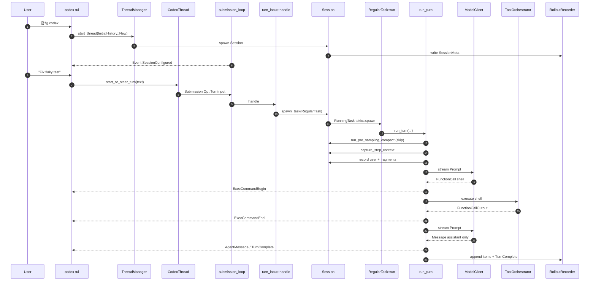

```text
tui → CodexThread::start_or_steer_turn
    → SessionIo::submit_turn_input (Op::TurnInput)
    → submission_loop → turn_input::handle
    → spawn_task(RegularTask) → RegularTask::run → session/turn.rs::run_turn
    → tools/orchestrator.rs::ToolOrchestrator::run
    → client.rs ModelClientSession::stream
```

---

## 7. 端到端时序 B：同 Thread 第二问

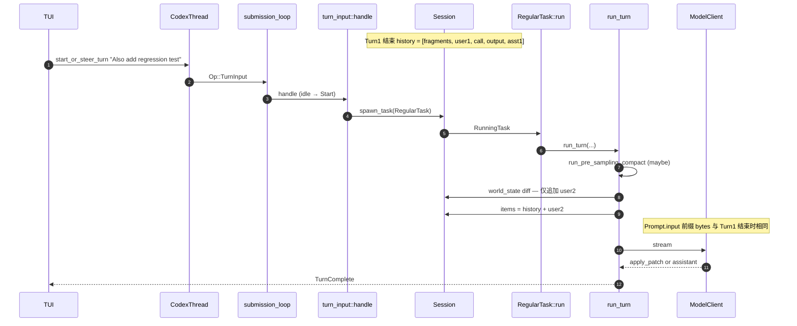

**设计点**：`record_context_updates` 比较 `WorldState` / `reference_context_item`，环境未变则不重贴整段 `<environment_context>`。

---

## 8. 端到端时序 C：Resume + 预压缩

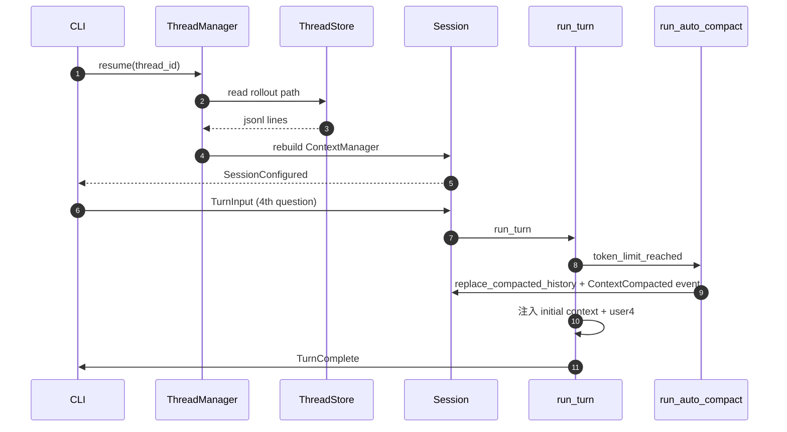

---

# 第三篇 模块深潜

> 按 **调用顺序** 排列：从进程入口到单次工具执行。每节含：职责、关键类型、阶段表、时序图、源码路径。

## 9.1 submission_loop（Op 全量分发）

**文件**: `core/src/session/handlers.rs::submission_loop`  
**线程模型**: 每个 `Session` 一个 Tokio task，从 `rx_sub` 阻塞读取 `Submission`，直到 `Op::Shutdown` 或 channel 关闭。

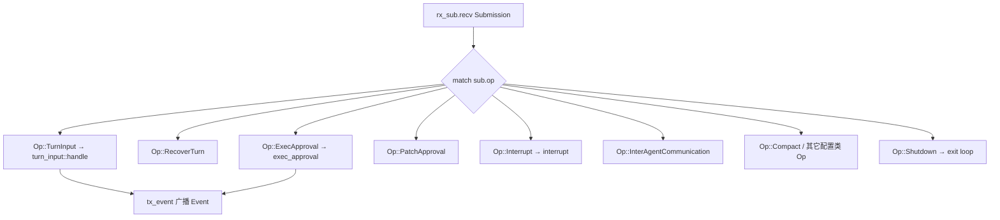

| `Op` 变体 | 处理函数 | 是否新开 Turn | 说明 |
|-----------|----------|---------------|------|
| `TurnInput` | `turn_input::handle` | 视 `TurnInputMode` | 返回 `TurnInputSubmission` 经 oneshot |
| `RecoverTurn` | `turn_input::handle_recovery` | 恢复中断 Turn | 用于 crash 后接续 |
| `ExecApproval` | `exec_approval` | 否 | 唤醒 `ActiveTurn` 内 pending future |
| `PatchApproval` | `patch_approval` | 否 | apply_patch 类工具 |
| `Interrupt` | `interrupt` | 中止当前 | 发 `TurnAborted` |
| `InterAgentCommunication` | `inter_agent_communication` | 否 | 子 Agent 邮件并入父 Session |
| `ThreadSettings` | `thread_settings::update` | 否 | 模型/模式热更新 |
| `Shutdown` | break loop | — | `SessionIo::shutdown_and_wait` 等待此 task 结束 |

**时序（TurnInput）**:

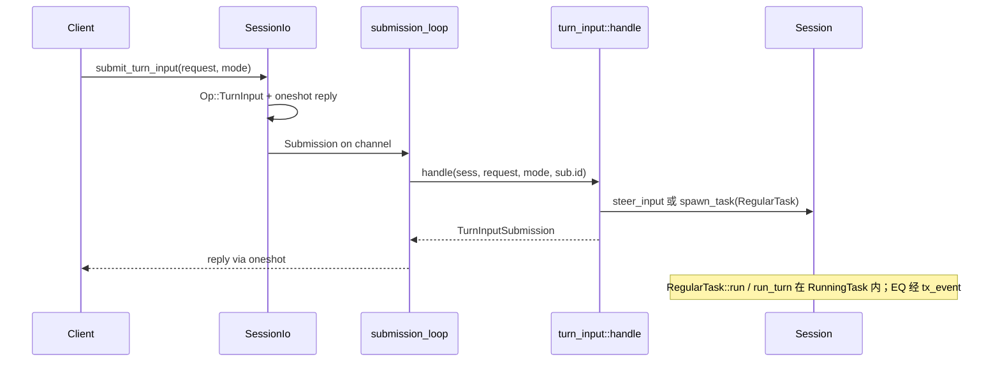

**不变量**: `Submission.id`（UUID v7）常作为对外 **turn id** 暴露给 app-server；EQ 里 `Event.id` 与触发它的 `Submission.id` 关联。

---

## 9.2 ThreadManager 与 CodexThread

**文件**: `core/src/thread_manager.rs`、`core/src/codex_thread.rs`

| 公开 API | 作用 |
|----------|------|
| `start_thread(...)` | `InitialHistory::New` → 新 `Session` + jsonl |
| `resume_thread(thread_id)` | 读 `ThreadStore` + replay rollout → `Session` |
| `fork_thread(...)` | 复制 history 子集到新 Thread |
| `get_thread(thread_id)` | `Arc<CodexThread>` 句柄 |
| `agent_control()` | 克隆 `AgentControl` 供 `spawn_agent` |

`CodexThread` 是对外的 **薄包装**：

```text
CodexThread
  ├── thread_id: ThreadId
  ├── session: Arc<Session>      # 真正状态
  ├── io: SessionIo              # submit / next_event / shutdown
  ├── rx_event: broadcast::Receiver<Event>
  └── rollout_path: PathBuf
```

`start_or_steer_turn`（`codex_thread.rs`）：经 `TurnInputMode::StartOrSteer` 提交；**空闲**时 `spawn_task(RegularTask)` 开新 Turn；**繁忙**且可 steer 时写入 **`TurnState.pending_input`**（不是 `Session.input_queue` 邮箱）。客户端 follow-up 排队见 PART1 §3.1 PI 对照（TUI `queued_user_messages`）。

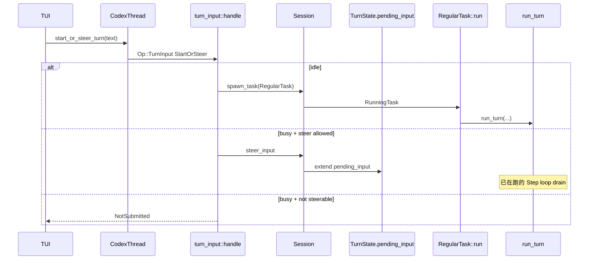

---

## 9.3 run_turn 分阶段（源码 turn.rs）

**入口**: `session/turn.rs::run_turn`（L153）

`run_turn` 是 **单轮用户问题的总编排**。下面按 **实际执行顺序** 拆阶段（非独立函数名，便于对照源码）：

| 阶段 | 代码区域（约） | 输入 → 输出 | 失败行为 |
|------|----------------|-------------|----------|
| P0 钩子排水 | L160 `drain_async_hook_results` | 上轮异步 hook 结果 → history | — |
| P1 预采样压缩 | L169 `run_pre_sampling_compact` | token 超限 → 换窗 history | `TurnAborted` 则仍 record input 后返回 |
| P2 MCP 需求解析 | L193 `required_mcp_servers_for_input` | user text → required_servers | cancel 则 record 后返回 |
| P3 首 StepContext | L207 `capture_step_context_with_required_mcp_servers` | TurnContext → StepContext | — |
| P4 环境 diff | L224 `record_context_updates_and_set_reference_context_item` | WorldState → 增量 fragments | — |
| P5 Skills/Plugins 注入 | L250 `build_skills_and_plugins` | mention → injection ResponseItems | — |
| P6 SessionStart hooks | L262 `run_pending_session_start_hooks` | 可能中止 Turn | return Ok(None) |
| P7 记录用户输入 | L266 `run_hooks_and_record_inputs(TurnStart)` | TurnInput → history + rollout | — |
| **P8 采样主循环** | L301 `loop { ... }` | 见 §9.4 | break on assistant-only |
| P9 Turn 收尾 | loop 后 | TurnComplete、stop hooks、analytics | — |

**P8 主循环核心逻辑**（L301+）：

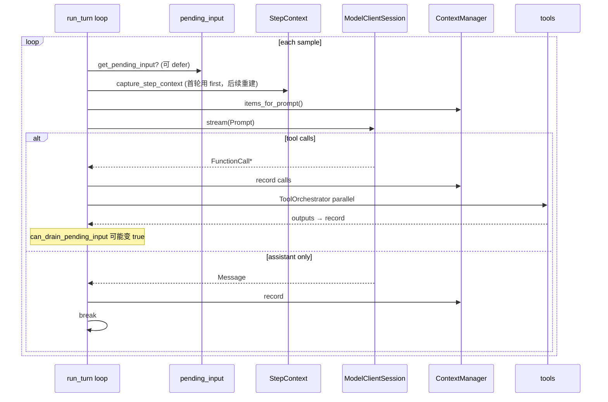

**关键局部变量**（读源码时对照）：

| 变量 | 含义 |
|------|------|
| `client_session: ModelClientSession` | Turn 内复用 WS + sticky routing |
| `can_drain_pending_input` | 首轮 false，避免 steer 抢在首条 user 前 |
| `next_step_context: Option<StepContext>` | 压缩后可能预置下一步 context |
| `turn_diff_tracker` | 用户视角的一 Turn 的文件 diff 聚合 |

---

## 9.4 ContextManager 与 WorldState diff

**文件**: `core/src/context_manager/history.rs`、`core/src/context/*.rs`

| API | 作用 |
|-----|------|
| `record(item)` | 追加 `ResponseItemEnvelope`（只增不改） |
| `items_for_prompt()` | 构建 `Prompt.input` |
| `replace_compacted_history(...)` | 压缩后 **整窗替换**（非原地编辑） |
| `is_contextual_user_fragment(item)` | 识别 `<environment_context>` 等 |

**WorldState diff**（`record_context_updates_and_set_reference_context_item`）：

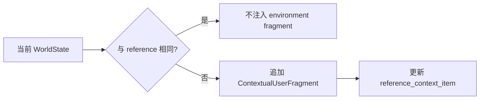

第二问时若 cwd、git、shell 环境未变，**不会**重复发送整段 environment XML——这是 Prompt 前缀可缓存的前提。

---

## 9.5 StepContext、ToolRouter、McpBinding

**文件**: `session/step_context.rs`、`tools/router.rs`、`mcp/binding.rs`

每次采样前 `capture_step_context*` 冻结一帧 **工具与 MCP 视图**：

| 字段 | 为何 per-step 快照 |
|------|-------------------|
| `tool_router: Arc<ToolRouter>` | 用户 mid-turn 改 enabled tools |
| `mcp: Arc<McpBinding>` | MCP server 连接状态变化 |
| `model_info` | 中途换模型 slug |
| `loaded_agents_md` | AGENTS.md 热加载 |

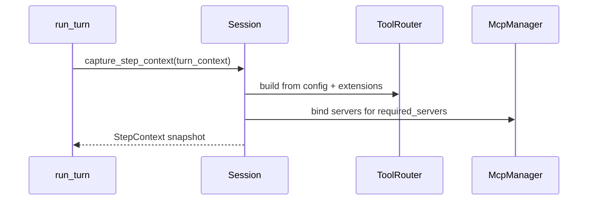

---

## 9.6 ToolOrchestrator 与审批

**文件**: `core/src/tools/orchestrator.rs`

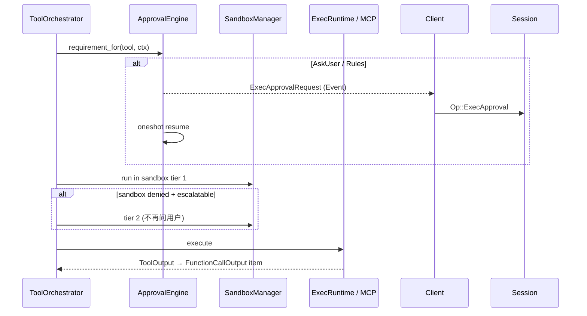

| 概念 | 说明 |
|------|------|
| `ExecApprovalRequirement` | 由规则引擎 + 用户 policy 决定 |
| 双次 sandbox | 第一次严格；失败可自动放宽 **不重复审批** |
| `PatchApproval` | `apply_patch` 走独立 `Op::PatchApproval` 通道 |
| 并行 | 同一采样内多个 `FunctionCall` 可 `join` 并行 |

---

## 9.7 InputQueue 与 mid-turn steer

**文件**: `core/src/input_queue.rs`（及 session 内 enqueue API）

用户在模型仍在跑时提交的文字进入 `input_queue`，在 `run_turn` 循环内 **drain 进 history**，再参与下一次采样。

| 时机 | `can_drain_pending_input` |
|------|---------------------------|
| Turn 刚开始、首条 user 尚未采样 | `false`（L265–266） |
| 工具执行后、压缩恢复后 | `true` |

Steer **不**保证模型一定立即响应——只是保证进入 history 的顺序正确。

---

## 9.8 Compact 子系统

**文件**: `core/src/compact.rs`、`session/turn.rs` 内联调用

| 触发点 | 函数 | `InitialContextInjection` |
|--------|------|---------------------------|
| Turn 第一次采样前 | `run_pre_sampling_compact` | `DoNotInject`（用户消息随后单独进） |
| 采样循环中途 token 爆 | inline compact task | `BeforeLastUserMessage` |
| 用户显式 `Op::Compact` | 独立 compact 任务 | 视配置 |

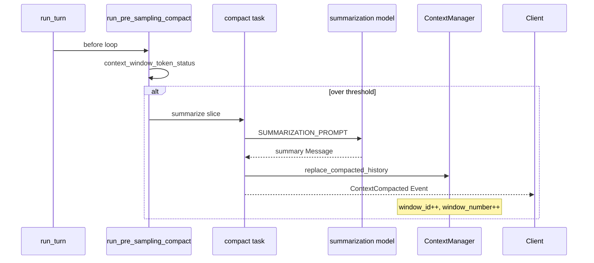

压缩后 **旧 items 不再进入 Prompt**，但 rollout 保留 checkpoint 行供审计。

---

## 9.9 RolloutRecorder 与 Resume

**文件**: `codex-rollout/`、`core/src/session` 内 `ensure_rollout_materialized`

| `RolloutItem` 种类 | 写入时机 |
|--------------------|----------|
| `SessionMeta` | Thread 创建 |
| `ResponseItem` | 每次 `record_conversation_items` |
| `TurnStarted` / `TurnComplete` | Turn 生命周期 |
| Compaction marker | 换窗后 |

Resume 路径：`ThreadManager::resume` → 读 jsonl → `ContextManager` 重放 → `SessionConfiguredEvent.initial_messages` 可选给 UI。

---

## 9.10 多 Agent（AgentControl）

**文件**: `core/src/agent/control.rs`、`tools/handlers/spawn_agent.rs`

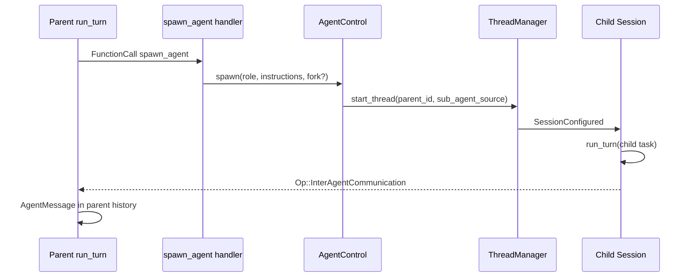

子 Thread 有 **独立** `Session` / rollout；父子通信用协议 `InterAgentCommunication`，不是共享内存。

---

## 9.11 Guardian 熔断

**文件**: `core/src/guardian/mod.rs`

| 策略 | 连续拒绝次数触发 interrupt |
|------|---------------------------|
| `Standard` | 3 |
| `CyberModel` | 1 |
| 滑动窗口 | 最近 10 次决策内统计 |

`record_non_denial` 重置 consecutive 计数。触发后 Turn 被中断，避免模型在持续被拒时空转。

---

## 9.12 Hooks 与 Event 投影

| 钩子时机 | 函数 |
|----------|------|
| Turn 开始前 | `run_pending_session_start_hooks` |
| 记录输入后 | `run_hooks_and_record_inputs` |
| Turn 结束 | `run_turn_stop_hooks` |
| Interrupt | `run_turn_interrupt_hooks` |

**Event 投影**：`ResponseItem` → `EventMsg`（流式）+ `TurnItem`（结构化回合 UI）。解析在 `session/` 与 `protocol` 映射层；**禁止** UI 反写 `ContextManager`。

---

# 第四篇 JSON 实例

## 10. 对象实例示例（JSON 形状）

### 10.1 客户端提交

```json
{
  "submission": {
    "id": "sub_7f3a",
    "op": {
      "TurnInput": {
        "request": {
          "input": [{ "type": "text", "text": "Fix the flaky auth test" }],
          "environments": [{ "environment_id": "local", "cwd": "/Users/dev/app" }]
        },
        "mode": "StartIfIdle"
      }
    }
  }
}
```

### 10.2 第一次采样的 Prompt（逻辑）

```json
{
  "base_instructions": { "text": "<codex system preset...>" },
  "tools": [{ "name": "shell", "parameters": { "...": "..." } }],
  "parallel_tool_calls": true,
  "input": [
    { "type": "message", "role": "user", "content": [
      { "type": "input_text", "text": "<environment_context>...</environment_context>" }
    ]},
    { "type": "message", "role": "user", "content": [
      { "type": "input_text", "text": "## My request for Codex:\nFix the flaky auth test" }
    ]}
  ]
}
```

### 10.3 FunctionCall 配对

```json
{
  "call": {
    "type": "function_call",
    "name": "shell",
    "call_id": "call_abc",
    "arguments": "{\"command\":\"rg -n flaky tests/auth\"}"
  },
  "output": {
    "type": "function_call_output",
    "call_id": "call_abc",
    "output": "Exit code: 0\nWall time: 0.3 seconds\nOutput:\ntests/auth.spec.ts:42:..."
  }
}
```

### 10.4 EQ 事件片段

```json
{
  "id": "sub_7f3a",
  "msg": {
    "type": "task_complete",
    "turn_id": "turn_01",
    "last_agent_message": "I added a regression test in ..."
  }
}
```

---

返回 [文档中心](./README.md)
