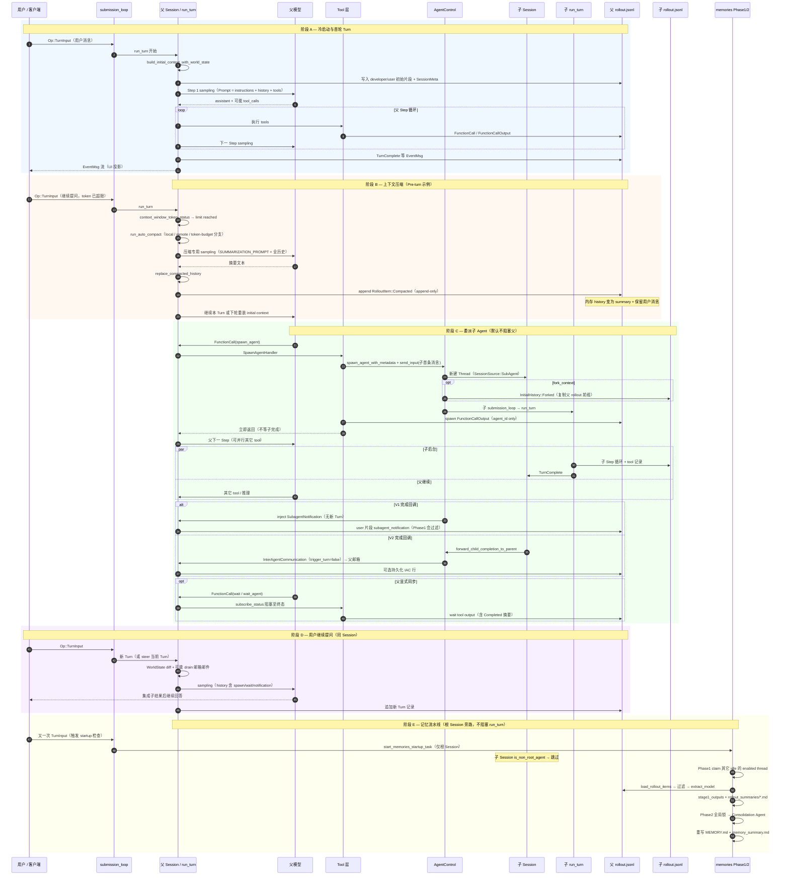
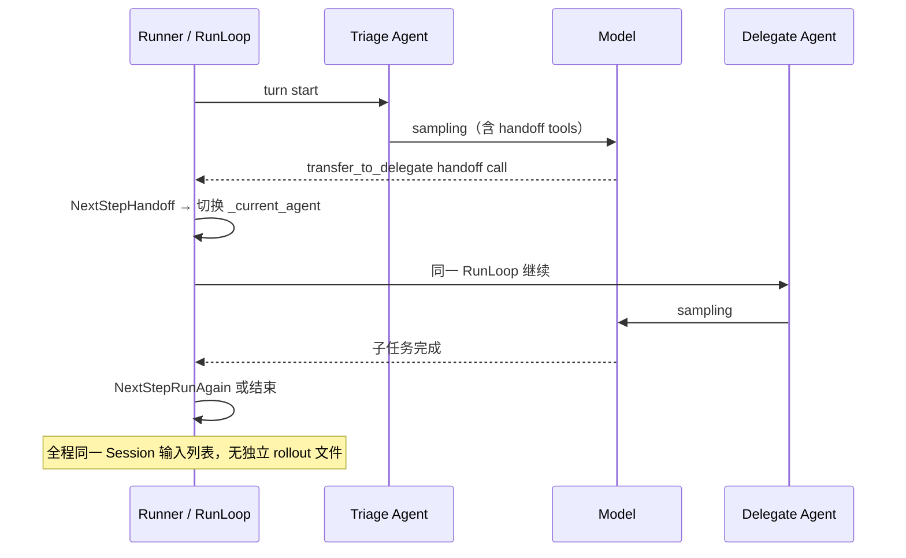

# Codex 全链路端到端时序（压缩 · 子 Agent · 记忆 · 继续提问）

> **版本**: 1.0（2026-09-03）  
> **源码**: `codex/codex-rs/`  
> **关联**: [ARCHITECTURE_PART1 §8](./ARCHITECTURE_PART1.md#第8章多-agent)、[RUNTIME_PROMPTS.md](./RUNTIME_PROMPTS.md)、[memory.md](./memory.md)

---

## 0. 当前生效的多 Agent 版本

| 配置 | Feature | 默认 | 生效版本 |
|------|---------|------|----------|
| 开箱默认 | `multi_agent`（`Feature::Collab`） | **enabled** | **MA V1** |
| 显式升级 | `multi_agent_v2`（`Feature::MultiAgentV2`） | disabled | **MA V2**（覆盖 V1） |
| 关闭 | `agents.enabled = false` | — | `MultiAgentVersion::Disabled` |

解析链（`config/mod.rs`）：

```text
multi_agent_version_for_model()
  ← multi_agent_version_override()   // V2 feature 开 → V2；agents 关 → Disabled
  ← model catalog capability
  ← multi_agent_version_from_features()  // Collab 开 → V1，否则 Disabled
```

**结论（2026-09 源码默认）**：未开 `multi_agent_v2` 时，**生产默认是 MA V1**（`multi_agent.spawn_agent` / `send_input` / `wait`）。开启 `multi_agent_v2` 后切到 V2（`spawn_agent` / `send_message` / `followup_task` / `wait_agent` + 邮箱）。

下文时序图在关键分叉处标注 **V1 / V2**。

---

## 1. 全景时序（一次用户会话的完整生命）

覆盖：冷启动 → 多轮对话 → 上下文压缩 → 委派子 Agent → 异步/同步汇合 → 用户继续提问 → Session 空闲后 Phase1/2 记忆。



---

## 2. 父调子：逐步拆解

### 2.1 `spawn_agent`（父视角的一次 tool）

| 步 | 动作 | 父是否阻塞 |
|----|------|-----------|
| 1 | 模型 `FunctionCall(spawn_agent)` | — |
| 2 | `SpawnAgentHandler` → `AgentControl::spawn_agent_internal` | — |
| 3 | `ThreadManager` 创建子 Thread + 独立 `RolloutRecorder` | — |
| 4 | `send_input` 投递子首条 `UserInput` → 子 `run_turn` | — |
| 5 | 返回 `FunctionCallOutput { agent_id, nickname }` | **否** |
| 6 | 父 `run_turn` Step 循环继续 | — |

### 2.2 子 Agent 内部

与父完全相同的 `submission_loop` → `run_turn` → Step sampling → tools，但：

- `SessionSource::SubAgent(ThreadSpawn { parent_thread_id, depth, agent_path, … })`
- 不写父 `ContextManager`
- 独立 `rollout.jsonl`（`thread_source: Subagent`）

### 2.3 结果回父的三条通道

| 通道 | 时机 | 父模型如何看到 |
|------|------|----------------|
| spawn output | spawn 完成瞬间 | 仅 `agent_id` |
| 异步通知 | 子 `TurnComplete` | V1: `<subagent_notification>`；V2: 邮箱 `InterAgentCommunication` |
| `wait` / `wait_agent` | 父显式调用 | tool output 含 `AgentStatus::Completed(Some(msg))` |

### 2.4 父继续 Step 推理

```text
run_turn inner loop:
  sampling → tools → record outputs → needs_follow_up?
  = model 还要 tool OR TurnState.pending_input 非空 OR（邮箱 drain 后）有待处理邮件
```

子完成通知若在父 Turn 进行中到达：

- V1 notification → `inject_fragment_without_turn` → 下轮 `for_prompt` 可见 → 详见 [MULTI_AGENT_ARCHITECTURE.md §4](./MULTI_AGENT_ARCHITECTURE.md#4-子--父完成后怎么通知核心)
- V2 邮箱 + `trigger_turn: false` → 等父 Turn 结束或 `needs_follow_up` drain 邮箱

---

## 3. JSONL 与记忆提炼

### 3.1 双文件模型（不合并）

```text
~/.codex/sessions/.../rollout_<parent_id>.jsonl   ← 父
~/.codex/sessions/.../rollout_<child_id>.jsonl    ← 子（独立）
```

压缩时父文件 **append** `RolloutItem::Compacted`；子文件自有 Compacted（若子也超限）。

### 3.2 记忆 Phase1 读谁？

| 来源 | 是否启动 pipeline | 是否典型原料 |
|------|------------------|-------------|
| 根 Session | ✅ `start_memories_startup_task` | ✅ 主原料 |
| 子 Session | ❌ `is_non_root_agent()` 跳过 | ❌ 非设计目标 |
| 父 jsonl 内 `<subagent_notification>` | — | ❌ `serialize_filtered` 过滤 |
| 父 jsonl 内 `wait_agent` output | — | ✅ 可进 Phase1（父视角摘要） |

Phase1 还可能 claim **其它 idle 的根 thread** 的 rollout（`claim_stage1_jobs_for_startup`），与当前是否在跑子 Agent 无关。

### 3.3 Phase2

批量读 `stage1_outputs` → Git 工作区 → Consolidation Agent 重写 `MEMORY.md` / `memory_summary.md`。与子 Agent 无直接调用关系。

---

## 4. 与 OpenAI Agents Python SDK 时序对比

对比对象：`openai-agents-python/`（Handoff 模型），**不是** OpenHands TaskToolSet。

| 维度 | Codex（MA V1 默认） | OpenAI Agents Python SDK |
|------|---------------------|--------------------------|
| **多 Agent 机制** | 工具 `spawn_agent` + 可选 `wait` | Agent 定义上的 **`handoffs[]`**（特殊 tool） |
| **运行时实体** | 独立 Thread + Session + rollout | 同 `Runner` 内 **`RunState._current_agent` 切换** |
| **委派时父是否阻塞** | **否**（spawn 立即返回） | Handoff 在**同一 turn loop** 内同步切换 agent |
| **子运行时** | 子 Session 独立 `run_turn` | 子 Agent 继续同一 `RunLoop`，换 `current_agent` |
| **结果回传** | tool output / notification / wait | Handoff 后子 agent 输出进入**同一 session 输入列表** |
| **上下文** | 父子 `ContextManager` 隔离；fork 可选 | 默认**共享** `Session` 输入历史（可配置过滤） |
| **控制平面** | `AgentControl`（spawn/消息/状态） | 无对等组件；`Runner` + `Handoff` 回调 |
| **持久化** | 双 rollout.jsonl | `Session` persistence / `RunItem` 列表 |
| **记忆** | 旁路 Phase1/2 + `MEMORY.md` | SDK Session persistence；无 Codex 式 MEMORY 管道 |

OpenAI SDK Handoff 时序（简化，见 `OPENAI_AGENTS_SDK_ARCHITECTURE_PART1.md` §3）：



**核心差异一句话**：OpenAI SDK Handoff 是**同进程、同 Session、同步切 agent**；Codex 是**跨 Thread、默认异步 spawn、可选 wait 同步**。

---

## 5. 源码索引

| 主题 | 文件 |
|------|------|
| MA 版本解析 | `core/src/config/mod.rs` → `multi_agent_version_from_features` |
| Feature 默认 | `features/src/lib.rs` → `Collab` default true, `MultiAgentV2` default false |
| spawn | `core/src/tools/handlers/multi_agents/spawn.rs`, `agent/control/spawn.rs` |
| wait | `core/src/tools/handlers/multi_agents/wait.rs` |
| V1 完成通知 | `core/src/agent/control.rs` → `maybe_start_completion_watcher` |
| V2 完成转发 | `core/src/session/mod.rs` → `forward_child_completion_to_parent` |
| 压缩 | `core/src/compact.rs`, `session/turn.rs` → `run_auto_compact` |
| 记忆入口 | `memories/write/src/start.rs` |
| OpenAI SDK handoff | `openai-agents-python/src/agents/run_internal/run_loop.py` |

---

## 6. 阅读顺序

1. 本文 §0–§2 — 版本与父调子  
2. 本文 §3 — JSONL + 记忆  
3. [RUNTIME_PROMPTS.md](./RUNTIME_PROMPTS.md) — Prompt 拼装  
4. [memory.md](./memory.md) — `~/.codex/memories/` 产物  
5. [openai-agents-python/docs/OPENAI_AGENTS_SDK_ARCHITECTURE_PART1.md](../../openai-agents-python/docs/OPENAI_AGENTS_SDK_ARCHITECTURE_PART1.md) — Handoff 对照
