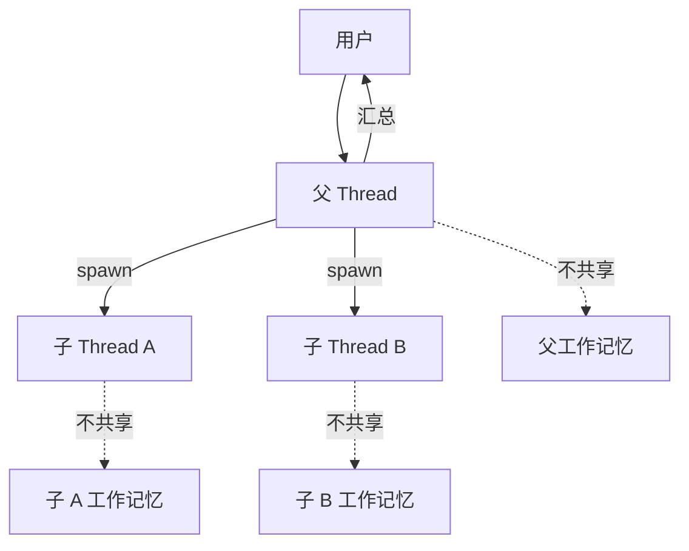
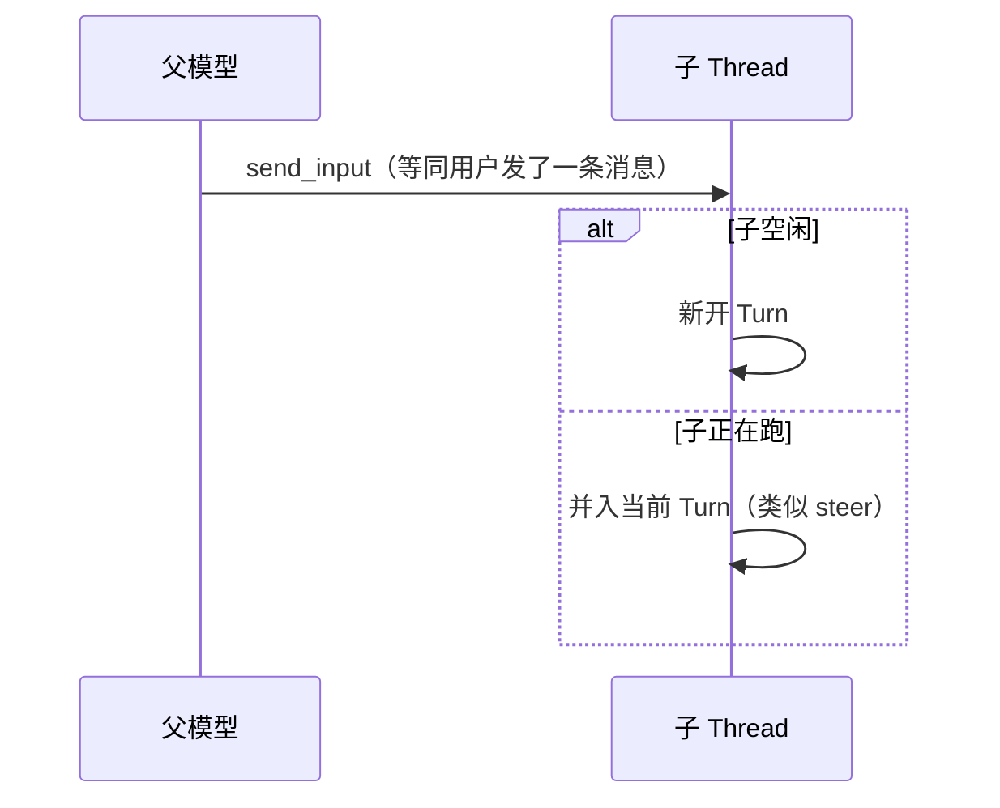
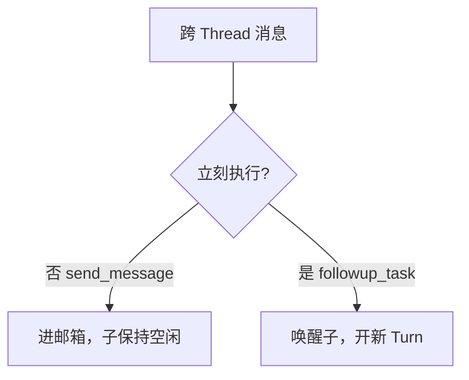
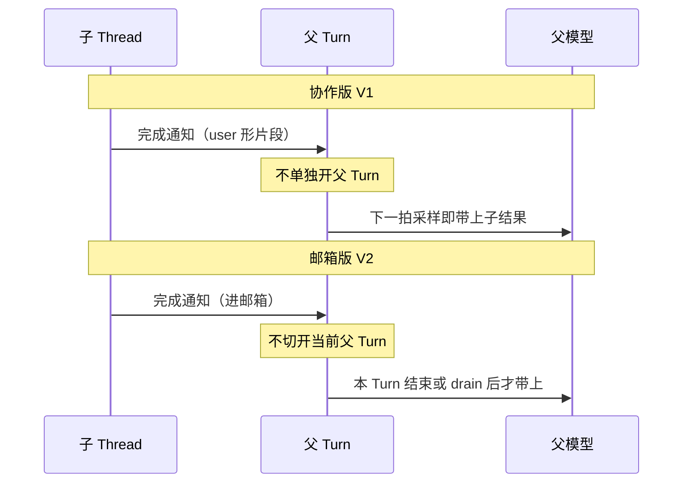
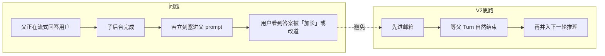
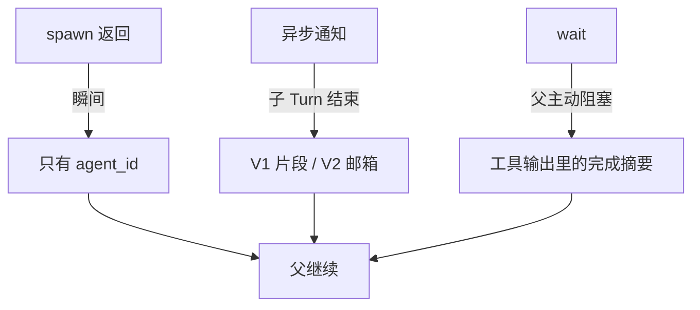
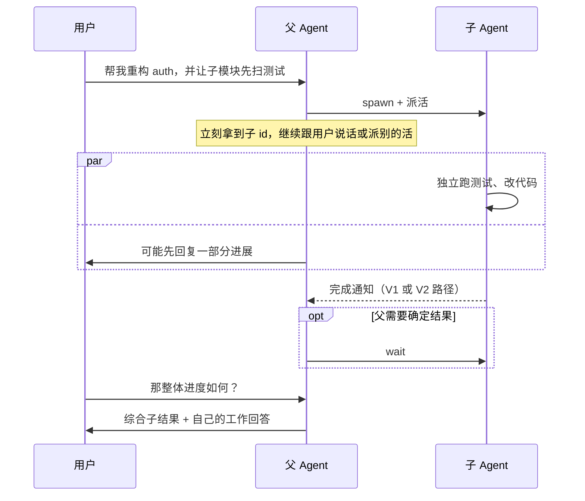

# Codex 多 Agent 架构导读

> **定位**：父子 Agent 如何协作——两套协议的设计思想、消息语义与通知时机。  
> **阅读时间**：~20 分钟  
> **关联**：[PLAN_AND_MULTI_AGENT.md](./PLAN_AND_MULTI_AGENT.md)（Plan / 示例）· [FULL_LIFECYCLE_SEQUENCE.md](./FULL_LIFECYCLE_SEQUENCE.md) · [CONTEXT_MANAGEMENT.md](./CONTEXT_MANAGEMENT.md)

---

## 1. 要解决什么问题

用户给一个复杂任务，单个 Thread 里的模型往往要 **既规划又执行**。多 Agent 设计把角色拆开：

```text
父（协调者）  →  拆任务、汇总结果、对用户说话
子（执行者）  →  独立 Thread 里跑自己的 turn + 工具
```

**核心矛盾**：父在跑的时候，子也在跑；子先做完时，**怎么把结果告诉父，又不把父正在说的话搅乱？**

Codex 用两代协议回答这个问题：**协作版（V1，默认）** 与 **邮箱版（V2）**。

---

## 2. 设计原则（两版共有）

| 原则 | 含义 | 为什么 |
|------|------|--------|
| **子 = 新 Thread** | 独立会话、独立上下文、独立 rollout | 隔离失败与 token；可 Resume / Fork |
| **父子不共享工作记忆** | 各有一套「模型所见历史」 | 避免子工具输出污染父 prompt |
| **spawn 默认异步** | 创建子后立即返回 id | 父可并行派多个子或继续推理 |
| **同步是显式选择** | 只有 `wait` 才阻塞父 | 默认 orchestrator，不是阻塞调用链 |
| **委派不是魔法工具** | 没有 `delegate`；spawn + 消息 + 可选 wait | 协议简单、可审计 |



---

## 3. 两代协议一览

| | **协作版 V1**（默认） | **邮箱版 V2** |
|--|----------------------|---------------|
| **隐喻** | 父给子「发一条用户消息」 | 父给子「投一封信到邮箱」 |
| **派活** | `send_input` | `send_message` / `followup_task` |
| **子完成后通知父** | **片段注入**（下一拍就看见） | **邮箱排队**（本 Turn 收尾或 drain 后才看见） |
| **适合** | 简单、结果尽快进父视野 | 精细控制「要不要立刻开 Turn」 |

**不要混用工具**：V1 没有 `followup_task`；V2 没有 `send_input`。

---

## 4. 父 → 子：两种派活哲学

### 4.1 协作版：把子当「另一个聊天线程」



| 特点 | 说明 |
|------|------|
| 心智简单 | 与「用户给 Agent 发消息」同一套语义 |
| 无「只排队不跑」 | 消息到了就要么开 Turn，要么 steer 进当前 Turn |
| spawn 常带首条 input | 创建子同时启动第一次执行 |

### 4.2 邮箱版：信封 +「要不要立刻跑」



| 工具 | 立刻执行？ | 设计意图 |
|------|------------|----------|
| **send_message** | 否 | 先排队：子还没准备好、或父还要连续发多条 |
| **followup_task** | 是 | 正式派工：子应立即开一轮执行 |

**设计演进**：V2 把「消息到达」和「是否启动 Turn」拆开，避免 V1 里「一发消息就必然扰动子运行态」的粗粒度。

---

## 5. 子 → 父：通知时机（全文重点）

子跑完时，父往往 **还在自己的 Turn 里**（还在流式回答或跑工具）。两代协议对「什么时候让父模型看见子结果」取舍不同。



### 5.1 对照表

| 维度 | 协作版 V1 | 邮箱版 V2 |
|------|-----------|-----------|
| **载体** | 注入父工作记忆的一段 **通知片段** | 父 Thread 的 **邮箱队列** |
| **是否新开父 Turn** | 否 | 否（完成信 `trigger_turn=false`） |
| **父模型何时看见** | **下一 Step** | **本 Turn 收尾** 或 Step 循环 drain 邮箱后 |
| **产品体验** | 子结果较快进入父推理 | 子结果 **不拉长** 父已展示给用户的答案 |
| **风险** | 可能打断父当前叙述节奏 | 父可能晚一步才知道子已完成 |

### 5.2 为什么 V2 要邮箱？



**MailboxDeliveryPhase**（投递相位）进一步保证：迟到的子消息不会在「父答案已经收尾展示之后」再硬插一脚。

---

## 6. 父怎么知道子干了什么：三条路

不只有「子完成通知」一条路：



| 通道 | 父何时用 | 父模型得到什么 |
|------|----------|----------------|
| **spawn 返回值** | 刚创建 | 子的 id，**无**执行结果 |
| **异步通知** | 子跑完（父未必在等） | 子结果的文本（V1 快、V2 晚） |
| **wait** | 父必须等子 | 结构化完成摘要，**同步** |

**编排模式**：典型是 spawn 多个子 → 父继续别的事 → 需要时用 wait 收束，或靠通知在后续 Step 集成。

---

## 7. 与「父 Turn 是否继续」的关系

常见误区：把 **子是否跑完** 和 **父 Step 是否继续** 混为一谈。

```text
父 Step 是否继续 = 模型还要跟工具  OR  父还有待消费的输入（含邮箱 drain）
```

| 说法 | 对错 |
|------|------|
| 子完成了，父 Turn 就该结束 | ❌ |
| 子完成只是给父 **多一条待消费输入** | ✅ |
| 邮箱版里，drain 邮箱可能让父 **多跑一个 Step** | ✅ |

**子完成 ≠ 父 Turn 结束**；只是多了一种输入来源。

---

## 8. 端到端：用户眼中的故事



---

## 9. 持久化边界（概念）

| 什么 | 设计选择 |
|------|----------|
| **父子 rollout** | **各一份** jsonl，不合并 |
| **子会话** | 不参与跨会话长期记忆提炼（记忆只吃根 Thread） |
| **V1 通知片段** | 进父对话记录；长期记忆流水线会 **过滤** 这类内部通知 |
| **V2 邮箱信** | 可作为跨 Agent 通信记录持久化 |

---

## 10. 与其它多 Agent 模型对照

| 维度 | Codex（协作版） | Handoff（如 Agents SDK） |
|------|-----------------|--------------------------|
| **实体** | 多个 Thread | 一个 Run，切换「当前 Agent」 |
| **委派** | spawn 不阻塞 | Handoff 在同轮循环里切换 |
| **结果回传** | 通知 / 邮箱 / wait | Handoff 输出进 **同一条** 会话链 |
| **隔离** | 强（独立 rollout） | 弱（共享 session） |

| 维度 | Codex 邮箱版 V2 | 用户 steer（单 Thread） |
|------|-----------------|-------------------------|
| **范围** | **跨 Thread** | 同 Thread |
| **队列** | 子 Session 邮箱 / 父邮箱 | 父 Turn 内 pending 输入 |
| **易错** | 与 MA `followup_task` 混淆 | 与 V2 `send_message` 混淆 |

---

## 11. 设计取舍：何时倾向哪一代

| 倾向协作版 V1 | 倾向邮箱版 V2 |
|---------------|---------------|
| 默认、工具少 | 需要「留言但不跑」 |
| 希望子结果 **尽快** 进入父推理 | 希望子结果 **不插入** 父 Turn 中途 |
| 编排逻辑像「给多个聊天窗口发消息」 | 需要显式「排队 vs 立刻执行」 |

两代解决的是同一问题：**异步子 Agent 与同步父 Turn 之间的时钟对齐**。

---

## 12. 九步心智模型

```text
1. 多 Agent = 多 Thread，不是父进程里的协程
2. spawn 异步；要同步结果用 wait
3. V1 派活 ≈ 给用户发消息；V2 派活 ≈ 投邮箱 + 是否立刻跑
4. 子完成：V1 下 Step 见；V2 等 Turn 收尾或 drain
5. 三条回传路：id / 异步通知 / wait
6. 子完成不等于父 Turn 结束
7. 父子各一份对话账本
8. 长期记忆只从根 Thread 提炼
9. followup_task（V2）≠ 单 Thread 的 follow-up 队列
```

---

## 相关文档

| 文档 | 用途 |
|------|------|
| [PLAN_AND_MULTI_AGENT.md](./PLAN_AND_MULTI_AGENT.md) | Plan / `update_plan` / 示例与误解表 |
| [FULL_LIFECYCLE_SEQUENCE.md](./FULL_LIFECYCLE_SEQUENCE.md) | 与压缩、记忆流水线在一起的完整时序 |
| [DESIGN_THINKING_SERIES.md](./DESIGN_THINKING_SERIES.md) | Codex 总运行路径 |
| [CONTEXT_MANAGEMENT.md](./CONTEXT_MANAGEMENT.md) | 单 Thread 内 Token Budget 切窗（正交话题） |

实现细节与 API 字段见 [ARCHITECTURE_PART1.md §8](./ARCHITECTURE_PART1.md)、[PLAN_AND_MULTI_AGENT.md §6](./PLAN_AND_MULTI_AGENT.md)。
