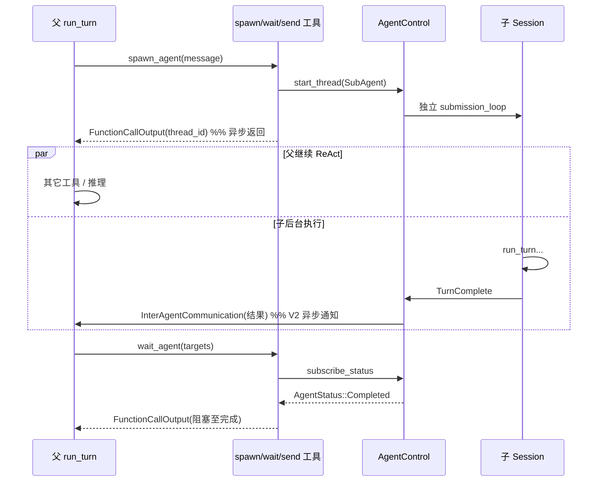

# Codex 运行时大模型 Prompt 全览（中文）

> **版本**: 1.0（2026-09-03）  
> **源码根**: `codex/codex-rs/`  
> **关联**: [ARCHITECTURE_PART1.md §8.9](./ARCHITECTURE_PART1.md#89-主子-agent同步异步与-delegate-语义)、[CORE_RUNTIME_WALKTHROUGH.md](./CORE_RUNTIME_WALKTHROUGH.md)

本文档回答三件事：

1. **每次访问大模型时，实际发送的 Prompt 长什么样**（`instructions` + `input[]` + `tools[]`）。
2. **主子 Agent 是同步等待还是异步通知**。
3. **「Delegate」在 Codex 里指什么**（不是独立 tool，而是 `spawn_agent` 内嵌策略 + 多 Agent 工具组合）。

文中凡标注 **【示例填充】** 的段落，表示运行时动态计算；示例值仅用于说明结构，非固定文案。

---

## 0. Prompt 总结构（Responses API 视角）

Codex 把一次模型调用封装为 `Prompt`（`core/src/client_common.rs`）：

| 字段 | API 映射 | 含义 |
|------|----------|------|
| `base_instructions` | `instructions` | 系统级基础指令（模型目录 / personality / 全局 Codex 行为） |
| `input` | `input[]` | 对话历史：`developer` / `user` / `assistant` / `function_call` / `function_call_output` … |
| `tools` | `tools[]` | 本轮可见工具 schema（内置 + MCP 扁平化 + 协作工具） |
| `parallel_tool_calls` | 请求参数 | 主 Turn 通常为 `true` |
| `output_schema` | 结构化输出约束 | Guardian / 部分模式启用 |
| `cyber_access_program` | 可选 | 特定访问控制程序 |

**组装入口**：

```text
build_prompt(input, step_context, base_instructions)
  → run_sampling_request → ModelClientSession::stream(prompt, ...)
```

压缩、Memories、Guardian 等 **旁路 LLM 调用** 复用同一 `Prompt` 结构，但 `input` 内容与 `CodexResponsesRequestKind` 不同。

---

## 1. 主子 Agent：同步 vs 异步

Codex **没有**单一的「主子通信模型」——而是 **工具 + Op + EQ 事件** 的组合。下表按路径分类：

| 路径 | 机制 | 父 Agent 是否阻塞 | 子完成如何告知父 |
|------|------|-------------------|------------------|
| **`spawn_agent`** | 创建子 Thread，通常 `trigger_turn: true` 启动子 `run_turn` | **否**（tool 在 spawn 握手后返回 thread_id） | 见下行 |
| **V1 `send_input`** | `Op::TurnInput`（steer 或新 Turn） | **否** | 无自动完成通知；父需 `wait` 或自己轮询 |
| **V2 `send_message`** | `Op::InterAgentCommunication`，`trigger_turn: false` | **否** | 消息进子邮箱；**不**自动开 Turn |
| **V2 `followup_task`** | 同上，但 `trigger_turn: true` | **否** | 投递后子 Session **异步**开新 Turn |
| **V1/V2 `wait` / `wait_agent`** | `subscribe_status` + `timeout_at` | **是**（父 tool 挂起直到终态或超时） | 返回 `AgentStatus` 文本给父模型 |
| **V2 子 Turn 终态** | `maybe_notify_parent_of_terminal_turn` | **否**（子已完成） | ① `SubAgentActivity::Completed` EQ；② `InterAgentCommunication` 结果信封（`trigger_turn: false`）进父邮箱 |

### 1.1 心智图



### 1.2 设计结论

- **默认委派模型 = 异步**：`spawn` 后父不必等待；产品文案（`spawn_agent` tool description）明确要求「少调用 `wait_agent`、并行做非重叠工作」。
- **同步点 = 显式 `wait`**：仅当父 **关键路径被阻塞** 时才同步等待。
- **V2 比 V1 更「消息驱动」**：完成通知走邮箱 + `SubAgentActivity`，不必依赖父正在 `wait`。
- **子 Agent 的 Prompt 与父隔离**：子有独立 `ContextManager`、独立 `WorldState` 基线；父 **看不到** 子完整 Rollout，只见 tool 返回与 Collab 事件。

源码锚点：

- 同步等待：`core/src/tools/handlers/multi_agents/wait.rs`
- 异步完成转发：`core/src/session/mod.rs` → `maybe_notify_parent_of_terminal_turn` / `forward_child_completion_to_parent`
- V2 消息投递：`core/src/tools/handlers/multi_agents_v2/message_tool.rs`

---

## 2. 「Delegate」语义（非独立工具）

Codex **没有**名为 `delegate` 的内置 tool。「委派」是 **`spawn_agent` 工具描述内嵌的运行时策略**，指导主模型何时 spawn、如何拆任务、何时 wait。

核心规则（摘自 `multi_agents_spec.rs::spawn_agent_tool_description`，中文意译）：

### 2.1 何时委派 vs 自己做

- 先形成高层计划，区分 **关键路径** 与 **可并行侧车任务**。
- **可委派**：边界清晰、能并行、不阻塞父下一步的侧车任务。
- **不可委派**：紧急阻塞项、强耦合、父下一步立刻需要其结果的任务。
- 用户要求「深度/彻底/调研」**不等于**允许 spawn；需用户或 AGENTS.md/skill **显式**授权多 Agent。

### 2.2 如何设计委派任务

- 子任务具体、自包含、对主任务有实质推进。
- 避免父子重复劳动；同一未解决线程上避免重复 delegate。
- 编码类：指定写范围、要求子 Agent 在 fork workspace 直接改文件并在最终答案列出路径；写集合不相交。

### 2.3 委派之后

- **极少**调用 `wait_agent`；仅在下一关键步骤被阻塞时使用。
- 子 Agent 运行期间父应做 **非重叠** 的其它工作。
- 编码子任务返回后快速审阅 patch 再集成。

### 2.4 运行时「委派」数据流

```text
父模型 FunctionCall: spawn_agent
  → SpawnAgentHandler
  → AgentControl::spawn (parent_thread_id, agent_role, fork_context, initial_message)
  → 子 Thread InitialHistory（可含 fork 的历史前缀）
  → 子 run_turn（独立 Prompt 流水线）
  → 父收到 CollabAgentSpawnBegin/End + tool output（thread_id / agent_path）
```

**Delegate = spawn +（可选）send_message/followup_task +（可选）wait** 的组合模式，而非第四次 tool。

---

## 3. 压缩方案与前后对比

### 3.1 四层实现（按 feature / provider 分支）

`run_auto_compact`（`session/turn.rs`）按优先级选择：

| 层级 | 触发 | 实现 | 专用 Summarizer Prompt |
|------|------|------|------------------------|
| **A. Token Budget** | `Feature::TokenBudget` | `compact_token_budget::run_inline_auto_compact_task` | 扩展 Notes / `new_context_window`；详见 [CONTEXT_MANAGEMENT.md](./CONTEXT_MANAGEMENT.md) |
| **B. Remote V2** | provider 支持 + `RemoteCompactionV2` | `compact_remote_v2.rs` | **服务端**压缩（本地不发 SUMMARIZATION_PROMPT） |
| **C. Remote V1** | provider 支持 V2 但 feature 关 | `compact_remote.rs` | 远程 API |
| **D. Local Inline** | `RemoteCompactionSupport::Unsupported` | `compact.rs::run_inline_auto_compact_task` | `SUMMARIZATION_PROMPT` + 全历史 |

**触发时机**（共用）：

- Pre-turn：`context_window_token_status` 超限
- Mid-turn：采样 `ContextWindowExceeded`
- Manual：`Op::Compact` → `CompactTask`（独立 Turn）
- 模型切换：`comp_hash_changed`

**注入策略**（`InitialContextInjection`）：

| 阶段 | 枚举 | 压缩后 history |
|------|------|----------------|
| Pre-turn / Manual | `DoNotInject` | 仅摘要 + 保留的用户消息；`reference_context_item` 清空 → **下一轮 Turn 重新注入** 完整 initial context |
| Mid-turn | `BeforeLastUserMessage` | 在「最后真实用户消息」之上插入 **完整** `build_initial_context_with_world_state` |

### 3.2 压缩专用 LLM 调用 Prompt

**Local / Manual 路径**（`compact.rs::run_compact_task_inner_impl`）：

```text
instructions: <与主 Turn 相同的 base_instructions，来自 get_prompt_base_instructions()>

input:
  [0..N] 当前 ContextManager 全历史 for_prompt（含工具输出）
  [N+1]  user: <SUMMARIZATION_PROMPT 全文>   ← 作为「用户消息」注入本轮

tools: []   （默认空）
```

`SUMMARIZATION_PROMPT` 英文原文（`prompts/templates/compact/prompt.md`）：

```text
You are performing a CONTEXT CHECKPOINT COMPACTION. Create a handoff summary for another LLM that will resume the task.

Include:
- Current progress and key decisions made
- Important context, constraints, or user preferences
- What remains to be done (clear next steps)
- Any critical data, examples, or references needed to continue

Be concise, structured, and focused on helping the next LLM seamlessly continue the work.
```

模型回复后，运行时拼接：

```text
summary_text = SUMMARY_PREFIX + "\n" + <助手最后一条文本>
```

`SUMMARY_PREFIX`（`summary_prefix.md`）中文意译：

> 另一个语言模型已开始处理此问题并产出了思考过程摘要。你还可以看到该模型所用工具的状态。请在此基础上继续，避免重复劳动。以下是该模型的摘要，请用它辅助你的分析：

### 3.3 压缩前后 `input[]` 实例

**假设**：3 轮对话 + 多次 `read_file` / `apply_patch`，token 超限触发 Pre-turn local compact。

#### 压缩前（节选）

```json
{
  "instructions": "<BASE_INSTRUCTIONS 见 §4.1>",
  "input": [
    {"role": "developer", "content": "<skills_instructions>…</skills_instructions>\n<permissions_instructions>…"},
    {"role": "user", "content": "<environment_context>…cwd=/proj…</environment_context>"},
    {"role": "user", "content": "# AGENTS.md instructions…\n<INSTRUCTIONS>…</INSTRUCTIONS>"},
    {"role": "user", "content": "## My request for Codex:\n重构 auth 模块"},
    {"role": "assistant", "content": "我先查看目录结构…", "tool_calls": [...]},
    {"role": "tool", "content": "…read_file 输出…"},
    {"role": "assistant", "content": "…"},
    {"role": "user", "content": "## My request for Codex:\n继续，把 JWT 换成 session"}
  ],
  "tools": ["shell", "apply_patch", "read_file", ...]
}
```

#### 压缩后（同 Turn 继续或下一轮 Pre-turn）

`replace_compacted_history` 后 **内存** `items` 变为：

```json
{
  "input": [
    {"role": "user", "content": "<compaction.summary 元数据>\n<SUMMARY_PREFIX>\n## 进度\n- 已扫描 src/auth…\n## 待办\n- 完成 session 迁移\n…"},
    {"role": "user", "content": "## My request for Codex:\n继续，把 JWT 换成 session"}
  ]
}
```

**JSONL Rollout** 追加 `RolloutItem::Compacted { replacement_history, … }`（append-only）；Resume 时取 **最新** checkpoint + 后缀，而非重放全部 Compacted 层。

下一轮 Pre-turn **重新注入**（因 `DoNotInject`）：

```json
{
  "input": [
    {"role": "developer", "content": "<合并的 developer 片段>"},
    {"role": "user", "content": "<environment_context>…</environment_context>"},
    {"role": "user", "content": "<compaction summary>"},
    {"role": "user", "content": "## My request for Codex:\n继续…"}
  ]
}
```

---

## 4. 主 Turn 采样 Prompt（Default Mode 完整拼装）

### 4.1 `instructions`（`base_instructions`）

来源链：

```text
Session::get_base_instructions()
  → 可能来自 ModelCatalog / personality / 内置模板
Session::get_prompt_base_instructions()  // 请求副本
  → 若未启用 update_plan 且 provenance=Model：剥离 update_plan 相关段落
```

**【示例填充】英文主体（结构示意，实际以模型目录为准）**：

```text
You are Codex, based on GPT-5. You are running as a coding agent in the Codex CLI on a user's computer.

## General
- When searching for text or files, prefer using the ripgrep-based `grep` tool…
- …

## Editing constraints
- …

## `$update_plan` tool
- …（Plan Mode 或特定配置下可能从 instructions 中移除）
```

中文说明：这是 **唯一** 不走 `input[]` 的系统指令通道；子 Agent、Guardian、Memories 旁路可能替换或追加此字段。

### 4.2 `input[]` 首包：Initial Context（`build_initial_context_with_world_state`）

首轮或 compaction 后重装时，按 **固定顺序** 生成若干 `ResponseItem`（`session/mod.rs`）：

| 顺序 | role | XML / 标记 | 来源 |
|------|------|------------|------|
| 1 | developer | 合并 bundle | `developer_instructions`、extensions `contribute_thread/turn_context`、WorldState developer 段 |
| 2 | developer | 独立消息 | `TokenBudgetContext`、`GuardianPolicy`、role instructions |
| 3 | developer | `<multi_agent_mode>…` | 多 Agent 模式与 usage hint |
| 4 | user | 推荐插件等 | `RecommendedPluginsInstructions` |
| 5 | user | WorldState user 段 | 见下表 |

**WorldState 各 section 渲染为 fragment**（steady-state 走 **diff**，仅变化段注入）：

| Section ID | 典型标签 | 内容 |
|------------|----------|------|
| `agents_md` | `# AGENTS.md instructions` / `<INSTRUCTIONS>` | 仓库 AGENTS.md |
| `environment` | `<environment_context>` | cwd、日期、时区、shell、网络、文件系统权限 |
| `permissions` | `<permissions_instructions>` | 审批 / sandbox 策略说明 |
| `skills` | `<skills_instructions>` | 可用 skill 目录与调用约定 |
| `plugins` | `<plugins_instructions>` | 已加载插件能力 |
| `apps` | `<apps_instructions>` | Connector / App 工具策略 |
| `tools` | `<tools>` | **Deferred MCP namespaces**（见 §6.1） |
| `collaboration_mode` | `<collaboration_mode>` | Plan/Default/Code 模式指令 |
| `multi_agent_mode` | `<multi_agent_mode>` | ExplicitRequestOnly / Proactive / Custom hint |
| `model_switch` | developer 置顶 | 换模型后的能力差异说明 |

#### 4.2.1 【示例】`<environment_context>`

```xml
<environment_context>
  <cwd>/Users/dev/my-app</cwd>
  <date>2026-09-03</date>
  <timezone>Asia/Shanghai</timezone>
  <shell>zsh 5.9</shell>
  <network access="restricted"/>
  <filesystem writable_roots="/Users/dev/my-app" read_only_system="true"/>
</environment_context>
```

#### 4.2.2 【示例】`<user_instructions>` / AGENTS.md

```text
# AGENTS.md instructions for /Users/dev/my-app

<INSTRUCTIONS>
- 本仓库默认使用 pnpm
- 修改 API 前先跑 `pnpm test:unit`
- 未经用户明确要求不要 spawn 子 Agent
</INSTRUCTIONS>
```

#### 4.2.3 【示例】`<skills_instructions>`

```xml
<skills_instructions>
## Available skills
- **playwright-browser-automation** — 浏览器自动化测试；用户要求 E2E 时使用
- **yw** — 运维操作走 yw CLI，禁止手改 alerts.yaml

## How to use
在消息中用 `$skill-name` 或路径提及 skill；本回合将注入对应 SKILL.md 正文…
</skills_instructions>
```

显式提及 skill 时，`build_skills_and_plugins`（`turn.rs`）额外注入 **skill 正文** 为 user/developer 消息（`load_skill_prompts`）。

#### 4.2.4 【示例】`<plugins_instructions>`

```xml
<plugins_instructions>
## Loaded plugins
- **figma** (v1.2.0) — 设计稿只读访问
- **sentry** — 错误追踪查询

插件通过 MCP 暴露工具；见 tools 数组中 `figma__*` 命名空间。
</plugins_instructions>
```

#### 4.2.5 【示例】`<collaboration_mode>`（Default）

```xml
<collaboration_mode>
mode: default
You may use all standard tools. Use `update_plan` for multi-step work when helpful.
</collaboration_mode>
```

Plan Mode 时同一标签内换成模型目录中的 `CollaborationModeMessages.plan.instructions`（禁止危险工具、禁止 `update_plan` 等）。

### 4.3 稳态 Turn：用户消息与历史

真实用户输入包装（`USER_MESSAGE_BEGIN`）：

```text
## My request for Codex:

<用户原文或 IDE 附加上下文>
```

之后 `ContextManager` 增量追加：

- `assistant` + `tool_calls`
- `function_call_output` / `custom_tool_call_output`
- 中途 **WorldState diff**（如 cwd 变更 → 新 `<environment_context>` developer/user 差分片段）
- **Skill 注入**（本 turn 提及的 skill）
- **Compaction summary**（若存在，带 `content_kind: compaction.summary`）

### 4.4 `tools[]` 并行数组

由 `step_context.tool_router.model_visible_specs()` 生成，包含：

| 类别 | 命名 | 说明 |
|------|------|------|
| 内置 | `shell`, `read_file`, `apply_patch`, `grep`, … | `tools/spec*.rs` |
| MCP 扁平化 | `github__create_issue`, `playwright__browser_click` | `namespace__tool_name` |
| 协作 V1 | `multi_agent.spawn_agent`, `multi_agent.wait`, … | feature 门控 |
| 协作 V2 | `spawn_agent`, `send_message`, `wait_agent`, … | 可配置命名空间 |
| Plan | `update_plan` | Default only |
| Token budget | `new_context` | Feature::TokenBudget |

MCP tool 的 **description / parameters** 来自 MCP `tools/list`；Codex 不负责改写业务语义，只做 **policy 过滤** 与 **命名空间前缀**。

### 4.5 完整请求示意（Default，第二轮采样 Step）

```json
{
  "instructions": "<§4.1 BASE>",
  "input": [
    {"role": "developer", "content": "<skills_instructions>…</skills_instructions>\n<permissions_instructions>…"},
    {"role": "user", "content": "<environment_context>…</environment_context>"},
    {"role": "user", "content": "## My request for Codex:\n给 UserService 加单元测试"},
    {"role": "assistant", "tool_calls": [{"name": "read_file", "arguments": "{\"path\":\"src/user.rs\"}"}]},
    {"role": "tool", "tool_call_id": "call_1", "content": "<文件内容>"},
    {"role": "assistant", "content": "我将添加 tests 模块…"}
  ],
  "tools": [
    {"name": "read_file", "description": "Read a file…", "parameters": {...}},
    {"name": "apply_patch", "description": "…", "parameters": {...}},
    {"name": "shell", "description": "…", "parameters": {...}}
  ],
  "parallel_tool_calls": true
}
```

---

## 5. 各模式下的 Prompt 差异

| 模式 | `instructions` | `input` 额外片段 | `tools` |
|------|----------------|------------------|---------|
| **Default** | 完整 base | 标准 WorldState | 全量（policy 后） |
| **Plan** | 同左 | `<collaboration_mode>` plan 文案；流式输出解析为 `PlanDelta` | **无** `update_plan`；危险工具受限 |
| **Code mode** | 可能含 code 专用说明 | collaboration_mode 为 code | 偏编辑/执行工具集 |
| **Sub-agent** | 同模型族 | `MultiAgentRoleInstructions` 独立 developer 消息；子 **不**注入父 `<skills_instructions>`（测试断言） | 可能不含 `spawn_agent`（role 限制） |
| **Guardian** | policy + output contract | `GuardianPolicy` 独立 developer；输入含父 transcript 作 **不可信证据** | 分类/打分工具 |
| **Compaction turn** | `get_prompt_base_instructions()` | 历史 + summarization 用户消息 | `[]` |
| **Memories Phase1** | `stage_one_system.md` 全文 | 单条 rollout 文本（用户角色包装） | `[]` |
| **Memories Phase2** | `consolidation.md` | 多条 raw memory | `[]` |
| **Manual Compact (`Op::Compact`)** | 同主 Turn | 用户可通过 `Op::Compact` 附带额外说明作为 `UserInput` | `[]` |

### 5.1 Plan Mode 协作指令【示例】

```xml
<collaboration_mode>
mode: plan
You are in planning mode. Produce a clear plan for the user. Do not execute destructive changes.
Do not call update_plan in this mode.
</collaboration_mode>
```

自动 `TurnStartKind::Automatic` 在 Plan 下会被 `submission_loop` 拒绝（`NotSubmittedReason::PlanMode`），因此 **邮箱里的 followup 不会悄悄开干**——需用户显式批准或切模式。

### 5.2 子 Agent Prompt【示例】

```text
developer (独立消息):
<multi_agent_role>
You are a sub-agent spawned by the parent agent at path /root/researcher.
Your role: explorer — read-only investigation. Do not spawn further sub-agents.
Return a concise final report listing files examined and findings.
</multi_agent_role>

user:
<environment_context>…子 Thread cwd…</environment_context>

user:
## My request for Codex:
调研 src/ 下所有 TODO 并分类（bug / tech-debt / docs）
```

---

## 6. MCP / Skill / Plugin 封装

### 6.1 MCP 三层封装

```text
┌─────────────────────────────────────────────────────────┐
│ L1 传输：codex-mcp / mcp_runtime（stdio、SSE、插件宿主）   │
├─────────────────────────────────────────────────────────┤
│ L2 注册：MCP tools/list → ToolRouter 扁平化为 ToolSpec   │
│         命名：{connector_slug}__{tool_name}               │
├─────────────────────────────────────────────────────────┤
│ L3 模型可见：                                             │
│   • tools[] 数组：完整 JSON Schema                        │
│   • <tools> WorldState：仅 **deferred namespace** 摘要    │
│     （命名空间 → 一行 description，超 4KB 截断）           │
│   • Apps/Plugins instructions：策略与启用状态             │
└─────────────────────────────────────────────────────────┘
```

**Deferred namespace**（`world_state/tools.rs`）：模型可先 `CallDynamicTool` 发现 schema，再真正调用——用于动态 MCP 命名空间。

【示例】`<tools>` diff：

```xml
<tools>
  <namespace name="github" description="GitHub repository operations via MCP"/>
  <namespace name="playwright" description="Browser automation"/>
</tools>
```

【示例】扁平 tool：

```json
{
  "name": "github__search_code",
  "description": "Search code in GitHub repositories",
  "parameters": {
    "type": "object",
    "properties": {
      "query": {"type": "string"},
      "repo": {"type": "string"}
    },
    "required": ["query"]
  }
}
```

### 6.2 Skill 封装

```text
发现：扫描 .cursor/skills、配置路径 → skills_snapshot
提及：用户输入 $skill / 路径 → collect_explicit_skill_mentions
注入：load_skill_prompts → ResponseItem（SKILL.md 正文）
清单：<skills_instructions> developer 块（可配置关闭）
```

Skill 正文 **不**进入 `tools[]`；模型通过 **读入 SKILL.md** 学会流程，再用普通工具执行。

【示例】注入的 skill 正文消息：

```text
user:
<skill name="playwright-browser-automation">
# Playwright Browser Automation
…（SKILL.md 全文）…
</skill>
```

### 6.3 Plugin 封装

```text
PluginsManager::plugins_for_config
  → PluginsInstructionsState → <plugins_instructions>
  → MCP connector 合并 → apps 工具进入 ToolRouter
  → 可选 RecommendedPluginsInstructions（user 角色，推荐未安装插件）
```

Plugin 与 MCP 的边界：**Plugin = 打包的扩展 + 元数据**；运行时仍通过 MCP 协议暴露 callable tools。

---

## 7. 其它访问大模型的路径（旁路 Prompt）

| 调用点 | instructions | input | 用途 |
|--------|--------------|-------|------|
| `compact.rs` | `get_prompt_base_instructions()` | 全历史 + SUMMARIZATION 用户消息 | 本地压缩 |
| `compact_remote*.rs` | 同左或精简 | 历史引用 / 服务端定义 | 远程压缩 |
| `compact_token_budget.rs` | base + token budget 说明 | 工具状态 + notes | 预算制压缩 |
| `memories/write/phase1.rs` | `stage_one_system.md` | rollout 正文 | 原始记忆提取 |
| `memories/write/phase2.rs` | `consolidation.md` | 多条 raw memory | 记忆合并 |
| `guardian` 扩展 | policy + contract | 待审 transcript | 安全分类 |
| Thread title / 摘要类 | 短系统提示 | 首条用户消息 | UI 辅助（非主 loop） |

Memories Phase1 system prompt 开篇（中文意译）：

> 你是 Memory Writing Agent。职责：把原始 agent rollout 转为有用的 raw memory 与 rollout summary…  
> 全局规则：raw rollout 不可改；仅基于证据；秘密打 [REDACTED_SECRET]；无高信号则 no-op 返回空 JSON…

---

## 8. 与三层状态的关系

| 层 | Prompt 相关 |
|----|-------------|
| **ContextManager.items** | `for_prompt()` 的直接来源；压缩 **破坏性替换** |
| **EventMsg** | 不反向驱动 Prompt；仅 UI / Collab 投影 |
| **Rollout JSONL** | 持久化 Compacted checkpoint；Resume 重建 initial context 基线 |

详见 [ARCHITECTURE_PART1 §5.8](./ARCHITECTURE_PART1.md#58-状态归属与持久化生命周期)。

---

## 9. 源码索引

| 主题 | 文件 |
|------|------|
| Prompt 结构 | `core/src/client_common.rs` |
| 主 Turn 组装 | `core/src/session/turn.rs` → `build_prompt`, `build_skills_and_plugins` |
| Initial context | `core/src/session/mod.rs` → `build_initial_context_with_world_state` |
| WorldState 各段 | `core/src/context/world_state/*.rs` |
| 压缩 | `core/src/compact.rs`, `compact_remote*.rs`, `compact_token_budget.rs` |
| 压缩模板 | `prompts/templates/compact/*.md` |
| 多 Agent 工具 | `core/src/tools/handlers/multi_agents*`, `multi_agents_spec.rs` |
| 父异步通知 | `core/src/session/mod.rs` → `maybe_notify_parent_of_terminal_turn` |
| XML 标签常量 | `protocol/src/protocol.rs` |
| 测试金样 | `core/tests/suite/snapshots/*model_visible_layout*` |

---

## 10. 阅读顺序建议

1. 本文 §1–§2 — 主子同步/异步与 delegate  
2. 本文 §3 — 压缩实例  
3. 本文 §4–§6 — 主 Prompt 与封装  
4. [CORE_RUNTIME_WALKTHROUGH.md](./CORE_RUNTIME_WALKTHROUGH.md) — 场景串联  
5. [ARCHITECTURE_PART1.md §4、§7、§8、§9](./ARCHITECTURE_PART1.md) — 架构上下文
