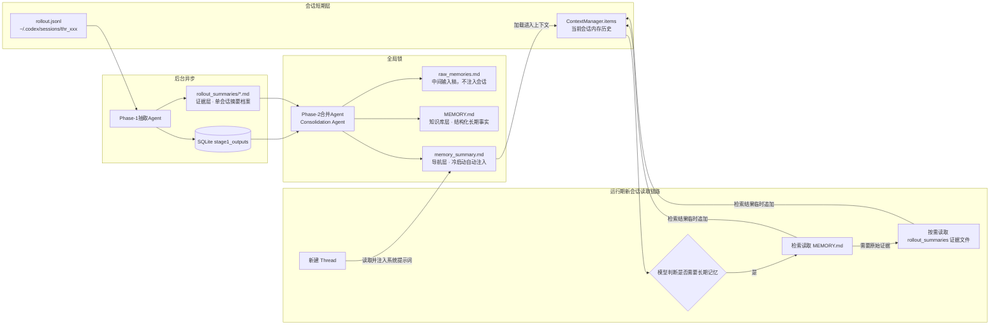
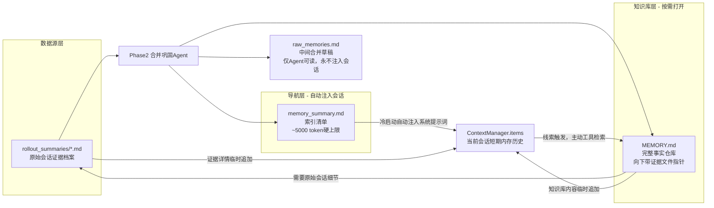

# Codex‑rs 长期记忆目录 `~/.codex/memories/` 完整解析（基于 Phase1 / Phase2 双阶段流水线源码事实）

## 前置：两条记忆流水线（先理清生成关系）

>
> 短期会话上下文：`ContextManager.items`（单会话内存，压缩可被 replace 丢弃，仅存于当前 Thread）
> 长期记忆：独立旁路后台异步流水线，**完全独立于 Thread 的 rollout jsonl 会话日志**，分为两阶段：

1. **Phase 1（抽取阶段，单会话粒度）**
   空闲超过 6h 的会话 rollout‑jsonl → 抽取 Agent 产出 `raw_memory` + `rollout_summary`，写入 SQLite stage1_outputs 数据表。
2. **Phase 2（合并 / 巩固阶段，全局唯一锁）**
   批量读取 stage1_outputs → 合并 Agent（Consolidation Sub‑Agent）生成最终磁盘 Markdown 产物：`MEMORY.md`、`memory_summary.md`，同步证据文件到 `rollout_summaries/`GitHub。

>
> ⚠️ 关键边界：记忆生成**不会实时修改当前正在运行会话的 `ContextManager.items`**；新会话启动时，`memory_summary.md` 被注入系统提示词，实现跨会话知识传递。

## 目录总览

```
~/.codex/memories/
├── MEMORY.md                 # Phase2 主索引：结构化长期事实（合并 Agent 维护）
├── memory_summary.md         # Phase2 摘要层：Thread 冷启动自动注入（v1 格式，token上限≈5000）
├── raw_memories.md           # Phase2 输入稿：DB stage1 行的合并文稿（仅给合并Agent读取，不注入会话）
├── rollout_summaries/        # 证据层：每线程一条短摘要 *.md（Phase1 rollout_summary）
│   └── <thread_id>_<slug>.md
└── extensions/               # 可选扩展源（外部Agent/MCP导入记忆）
    └── <name>/instructions.md
```

# 文件逐份详解 + 真实内容示例

## 1、`memory_summary.md` —— 启动注入摘要（最高优先级）

### 源码事实

- **冷启动会话时自动完整注入 Developer 系统提示词**，进入本轮 LLM 上下文；
- 第一行强制固定为 `v1`；
- 严格受 token 上限约束（默认～5000 token）；
- 作用：导航目录，快速告诉模型「我们之间有哪些长期约定、偏好、项目基线」；
- **模型不会直接在这里存储详细事实**，详细事实放在 MEMORY.md；
- 用户无法手动编辑生效，由 Phase2 合并 Agent 重写生成。

### 示例内容 memory_summary.md

```
v1

# 用户偏好
- 用户偏好小粒度增量修改，拒绝一次性大规模重构
- 输出代码变更附带简短文字解释
- 优先使用最小依赖方案

# 活跃项目基线
1. auth‑backend (/home/dev/auth‑backend)
    PostgreSQL数据库；启动脚本 ./scripts/dev‑start.sh；禁止修改 legacy_auth 模块
2. frontend‑web (/home/dev/frontend‑web)
    React + Tailwind；单元测试命令 npm run test

# 过往重要任务索引
- 2026‑08‑28：修复JWT过期刷新逻辑 → rollout_summaries/thr_abc123_fix‑jwt‑refresh.md
- 2026‑08‑30：CI流水线优化 → rollout_summaries/thr_def456_ci‑pipeline‑refactor.md

# 检索指引
如需详细细节，请检索 MEMORY.md，必要时打开对应的 rollout_summary 文件
```

## 2、`MEMORY.md` —— 长期记忆知识库主文件（可检索手册）

### 源码事实

- Phase2 合并 Agent 产出的**结构化事实仓库**；
- **不会被完整注入会话上下文**；
- 运行时记忆工具工作流：模型读取简短的 `memory_summary.md` → 根据关键词主动检索（grep）读取 MEMORY.md → 需要原始证据时打开对应 `rollout_summaries/*.md`；
- 结构化范式：`# Task Group` 顶层分组，带 `scope` / `applies_to`（工作目录隔离）；内部 `## Task` 条目，附带关键词、证据文件指针；
- 存储：用户偏好、项目约束、踩坑记录、验证清单、已证明可行的工作流、历史决策记录；
- Phase2 每次合并任务**整体重写该文件**，增量更新、淘汰过时记忆条目DEV Commun...。

### 示例片段 MEMORY.md

```
# Task Group: Auth‑Backend 项目
scope: backend
applies_to: /home/dev/auth‑backend

## Task 1 JWT 刷新令牌修复
keywords: jwt,refresh‑token,expire,redis
decision:
  1. 刷新令牌有效期设置 7天
  2. 旧刷新令牌使用后立即加入黑名单存入Redis
  3. 不允许无限续期刷新令牌
lessons‑learned:
  - 不能只检查access_token过期；并发场景下旧refresh_token可被重放
evidence_files:
  - rollout_summaries/thr_abc123_fix‑jwt‑refresh.md

## Task 2 CI流水线重构
keywords: github‑actions,ci,cache,build‑time
decision:
  - node_modules缓存key包含package‑lock.json哈希
  - 分开执行lint / test / build三个阶段
evidence_files:
  - rollout_summaries/thr_def456_ci‑pipeline‑refactor.md

# 用户通用偏好设置
## User‑Preferences‑Global
keywords: ui‑output,code‑style,refactor‑policy
preferences:
  - 每次代码改动尽量小于30行
  - 重构legacy_auth模块必须先沟通，禁止自动重构
```

## 3、`raw_memories.md` —— Phase 2 的临时合并输入稿

### 源码事实

- **纯中间产物，不会注入会话，模型永远不会直接读到这份文件**；
- Phase 2 启动时，系统从 SQLite stage1_outputs 读取一批被选中的 Phase‑1 抽取结果；
- 按时间倒序拼接所有 `raw_memory` 字段，写出 raw_memories.md，给到合并 Agent 作为参考素材；
- 合并 Agent 读完素材、产出 MEMORY.md/memory_summary.md 之后，该文件仅留存，下一轮 phase2 运行时**被覆盖重写**；
- 文件头部携带每条记忆的元数据：`thread_id`、`updated_at`、`cwd`、对应的 rollout_summary 文件路径GitHub。

### raw_memories.md 示例片段

```
---
thread_id: thr_abc123
updated_at: 2026‑08‑28T14:22:00Z
cwd: /home/dev/auth‑backend
rollout_summary_file: rollout_summaries/thr_abc123_fix‑jwt‑refresh.md
---
本次会话解决JWT刷新令牌过期问题；
根因：刷新令牌没有黑名单机制；当用户同时在两台设备登录，旧刷新令牌仍然可用；
解决方案：刷新令牌存入Redis黑名单，使用一次之后作废；
测试结果：新增单元测试覆盖并发刷新场景。

---
thread_id: thr_def456
updated_at: 2026‑08‑30T09:15:00Z
cwd: /home/dev/auth‑backend
rollout_summary_file: rollout_summaries/thr_def456_ci‑pipeline‑refactor.md
---
优化github‑actions构建速度；node_modules缓存命中不稳定；
根因：缓存key没有锁定package‑lock.json；
修复方案：缓存 hash(package‑lock.json)；
构建耗时从 110s下降至 35s。
```

## 4、`rollout_summaries/*.md` —— 原始证据层（单会话摘要）

### 源码事实

- Phase 1（抽取 Agent）直接产物；**每一条历史 Thread（会话）对应 1 份 md 文件**；
- 文件名：`{thread_id}_{slug}.md`；slug 为会话主题简短标识；
- 保存该会话学到的完整细节、试验过程、失败日志；
- 属于证据档案，**不会自动注入会话**；仅当模型检索 MEMORY.md，判定该历史会话高度相关，才按需读取这份文件；
- Phase2 的淘汰规则：当这条会话记忆长期不被使用、超出 `max_unused_days`，该 md 文件会被删除，不再参与后续合并；
- 文件自带元数据头部：thread_id, git_branch, rollout_jsonl 路径，cwd, updated_atCodex Know...。

### rollout_summaries/thr_abc123_fix‑jwt‑refresh.md 示例

```
---
thread_id: thr_abc123
updated_at: 2026‑08‑28T14:22:00Z
cwd: /home/dev/auth‑backend
rollout_path: ~/.codex/sessions/thr_abc123/rollout.jsonl
git_branch: feature/jwt‑refresh‑fix
---
# 会话总结：JWT刷新令牌并发漏洞修复
问题现象：
用户反馈，退出登录之后，旧刷新令牌仍然能够获取新access_token。
排查过程：
1. 查看 token_service.rs，发现刷新令牌校验成功后没有加入黑名单；
2. Redis黑名单表不存在；
修复：
- 添加 redis key `refresh‑blacklist:{token‑id}`，过期时间7天
- 在 issue_new_access_token() 校验黑名单
测试用例：
✅ 单设备刷新正常
✅ 并发双设备刷新：旧令牌作废
遗留风险：无
```

## 5、`extensions/` —— 外部记忆扩展目录

### 源码事实

可选目录，用于 MCP / 第三方外部 Agent 导入外部知识库；
`extensions/<name>/instructions.md` 存放扩展源的记忆规则与内容；
Phase2 合并 Agent 在生成 MEMORY.md 时会读取 extensions 下内容作为附加素材；
非核心主流水线产物，默认生成记忆时不会写入任何内容。

# 完整记忆读取链路（新会话冷启动）

```
1. Session 新建，ContextManager.items = []
2. Codex读取 memory_summary.md，完整注入 Developer System Prompt
3. 用户提问；模型根据 memory_summary.md 的索引，判断是否需要长期记忆
4. 需要记忆 → 模型发起记忆检索，读取 MEMORY.md
5. 需要原始会话证据 → 按需打开 rollout_summaries/xxx.md
6. 检索到的事实作为本轮上下文补充，追加到当前 ContextManager.items
```

# 关键区分对照表（最容易混淆的三组对象）

表格

| 对象 | 位置 | 生命周期 | 是否注入新会话上下文 | 维护者 |
| --- | --- | --- | --- | --- |
| ContextManager.items（会话短期历史） | 内存 Session | 会话进程存活；压缩可被 replace () 整体替换 | ✅是，每轮对话全部送入模型 | 主 Agent 对话循环 |
| memory_summary.md | 磁盘 memories | Phase2 重写更新；长期留存 | ✅完整注入会话启动提示词 | Phase2 Consolidation Agent |
| MEMORY.md + rollout_summaries/*.md | 磁盘 memories | 随 Phase2 合并淘汰过期条目 | ❌不会自动注入，按需检索读取 | Phase2 Consolidation Agent |
| raw_memories.md | 磁盘 memories | Phase2 中间产物，每次合并覆盖 | ❌永不注入会话 | 系统流水线自动生成 |

# memory_summary.md/ MEMORY.md/rollout_summaries/***.md 三者关系

先给出一句话顶层关系：

>
> **rollout_summaries 是原始证据库；MEMORY.md 是结构化长期知识库；memory_summary.md 是精简导航摘要，会话启动自动注入上下文。**
> 三者构成 **证据层 → 知识库层 → 启动导航层** 的三层金字塔。

## 一、三层定位对照表

表格

| 层级 | 文件 | 角色 | 是否自动注入新会话 |
| --- | --- | --- | --- |
| 证据层（底层原始素材） | `rollout_summaries/*.md` | 单会话原始摘要档案，保存完整过程、踩坑、试验细节 | ❌ 永不自动注入；按需检索打开 |
| 知识库层（中间结构化层） | `MEMORY.md` | 全局事实仓库，沉淀跨会话的决策、约束、偏好；带证据指针指向 rollout 文件 | ❌ 不会全部注入；模型按需检索读取 |
| 导航层（顶层入口） | `memory_summary.md` | 高度浓缩索引摘要，列出最重要偏好、活跃项目、记忆线索 | ✅ **会话冷启动完整注入系统提示词** |

## 二、生成流水线关系（Phase1 → Phase2）

数据流方向：

```
会话 rollout.jsonl（~/.codex/sessions/）
        ↓ Phase‑1 抽取 Agent（后台异步）
生成 rollout_summaries/<thread_id>.md （证据层产出）
        ↓
存入 SQLite stage1 数据表
        ↓ Phase‑2 合并巩固 Agent（全局锁批量合并）
读取一批 rollout_summaries 素材 → 先写出 raw_memories.md（中间稿）
        ↓ 提炼、结构化、去重、淘汰过期记忆
产出两个最终产物：
    1. MEMORY.md     (结构化知识库)
    2. memory_summary.md (精简导航摘要)
```

>
> 重要：**memory_summary 和 MEMORY.md 二者都是 Phase2 同一个合并任务同时生成的一对输出文件。**

## 三、运行期（会话启动之后）读取链路

```
新建 Thread 会话
    ↓
读取 memory_summary.md → 完整注入 Developer Prompt，进入 ContextManager.items
    ↓（模型看到导航索引）
用户提出问题，模型判断需要查阅长期记忆
    ↓
模型主动工具检索，读取 MEMORY.md 获取结构化事实
    ↓（MEMORY.md 里面保存证据文件指针）
如果需要会话原始细节 → 打开对应的 rollout_summaries/xxx.md
    ↓
检索得到的事实临时追加进当前会话上下文，用于回答用户
```

## 四、文件之间的引用关系示例

### memory_summary.md（导航，注入）

```
v1
# 用户偏好
- 增量修改，拒绝大重构
# 活跃项目
auth‑backend
# 记忆线索
JWT刷新令牌修复 → rollout_summaries/thr_abc123_fix‑jwt‑refresh.md
CI流水线优化 → rollout_summaries/thr_def456_ci‑pipeline‑refactor.md
如需详情查阅 MEMORY.md
```

### MEMORY.md（知识库，引用证据）

```
# Auth‑Backend
## JWT刷新令牌修复
keywords: jwt,refresh‑token
decision: 刷新令牌7天有效期，使用一次拉黑
evidence_files:
    - rollout_summaries/thr_abc123_fix‑jwt‑refresh.md
```

### rollout_summaries/thr_abc123_fix‑jwt‑refresh.md（原始证据）

保存那次会话完整排查、修复、测试全过程。

>
> 引用链：
> `memory_summary.md` → 指向 MEMORY.md/rollout 文件
> `MEMORY.md` → 向下指针指向 rollout_summaries 证据档案
> rollout_summaries 不向上引用上层文件

## 五、核心边界规则（高频误区澄清）

1. memory_summary ≠ MEMORY.md 的简单节选
   memory_summary 是**面向启动提示词的高压缩导航版**，严格卡 token 上限（~5000 token），只放最高优先级信息；MEMORY.md 是完整结构化知识库，不受该 token 限制。
2. 修改 rollout_summaries/***.md 不会立刻改变 memory_summary / MEMORY.md
   上层两份文件只会在下一轮 Phase‑2 合并任务时才会重新生成。
3. 长期记忆文件 **不会实时修改当前运行会话的 ContextManager.items**
   只有两条路径进入会话上下文：
    - 冷启动一次性加载 memory_summary
    - 模型主动检索后，临时把 MEMORY /rollout 内容追加进本轮对话
4. 淘汰过期记忆的流向
   Phase‑2 判断一条记忆长期不用：
    - 从 memory_summary.md、MEMORY.md 移除对应条目
    - 可选：删除对应的 rollout_summaries 证据文件

## 六、三者和会话短期历史 ContextManager.items 的边界

```
短期会话内存： ContextManager.items (Vec<ResponseItem>)
        ↑ 冷启动注入 ↑
memory_summary.md (磁盘导航摘要)
        ↑ Phase2生成 ↑
MEMORY.md (知识库) ←→ rollout_summaries/*.md (证据档案)
```


两者**素材来源完全相同（都来自 rollout_summaries）**，所以主题高度重合，肉眼看很像；
但是 **是两套完全独立 Prompt 分别生成，并不是把 MEMORY.md 裁剪一下就得到 memory_summary.md**，它们承担完全不一样的运行时职责，行为差异巨大。

>
> 一个口诀区分：
> **memory_summary.md = 上车检票清单（会话一打开直接塞给模型看）**
> **MEMORY.md = 厚重百科全书（不会自动带上车，需要的时候模型主动翻书查阅）**

## 一、为什么你会觉得内容相似

Phase‑2 合并 Agent，一次性读取全部证据素材，**并行产出两份文件**：

```
rollout_summaries/*md → raw_memories.md → [合并Agent] → MEMORY.md + memory_summary.md
```

数据源同源 → 出现的项目名称、用户偏好、任务主题自然重复。
但生成它们使用两套不同的系统提示词，有着不同的约束规则。

## 二、并排实例对比（同一个项目，两份文件，直观看出差别）

### memory_summary.md（导航‑注入版，受～5000token 硬上限）

```
v1

# 用户全局偏好
- 优先增量小修改，拒绝一次性大规模重构
- 代码附带简短文字解释

# 活跃项目列表
1. auth‑backend
   路径：/home/dev/auth‑backend
   禁止改动 legacy_auth 模块

# 历史重要记忆索引
- JWT刷新令牌漏洞修复
  证据：rollout_summaries/thr_abc123_fix‑jwt‑refresh.md
- CI构建速度优化
  证据：rollout_summaries/thr_def456_ci‑pipeline‑refactor.md

> 如需完整决策细节、踩坑记录，请查阅 MEMORY.md
```

👉 特征：**高度概括、只给线索、不给完整决策细节、清单化**

---

### MEMORY.md（知识库版，无严格 token 上限）

```
# Task Group: Auth‑Backend 项目
scope: backend
applies_to: /home/dev/auth‑backend

## Task 1 JWT刷新令牌修复
keywords: jwt,refresh‑token,redis,blacklist
decision:
  1. 刷新令牌有效期设置7天
  2. 刷新令牌使用一次之后立即加入Redis黑名单
  3. 不支持刷新令牌无限续期
lessons‑learned:
  - 并发双设备登录场景下旧令牌存在重放漏洞
evidence_files:
  - rollout_summaries/thr_abc123_fix‑jwt‑refresh.md

## Task 2 CI流水线优化
keywords: github‑actions,cache,build‑time
decision:
  - node_modules缓存key绑定 package‑lock.json 的哈希值
  - lint、test、build三个阶段拆分并行执行
lessons‑learned:
  - 之前缓存不稳定是因为没有锁定依赖哈希
evidence_files:
  - rollout_summaries/thr_def456_ci‑pipeline‑refactor.md

# 用户全局偏好
## User‑Preferences‑Global
keywords: output,code‑style,refactor
preferences:
  - 单次代码修改尽量控制在30行以内
  - 重构 legacy_auth 模块前必须先沟通，禁止自动修改
```

👉 特征：**完整结构化、保存决策结果、踩坑教训、关键词标签、作用域 scope**

## 三、最关键运行时行为差距（源码层面，决定性区别）

表格

| 维度 | memory_summary.md | MEMORY.md |
| --- | --- | --- |
| **会话启动加载** | ✅ **完整自动注入 Developer 系统提示词，进入 ContextManager.items** | ❌ **永远不会自动注入会话上下文** |
| Token 限制 | 硬上限（默认≈5000 token），超载时必须删减条目 | 几乎无上限，可以不断增长 |
| 内容深度 | 线索、索引、导航、清单；**省略详细决策和教训** | 保存完整事实、决策、踩坑经验、标签、作用域 |
| 读取触发方式 | 被动加载：新建会话就塞进去 | 主动检索：模型必须显式调用文件读取工具打开它 |
| 过期淘汰策略 | 优先砍掉低频使用的记忆线索，保证整体 token 不超限 | 保留完整事实；淘汰时连带删除证据指针 |
| 定位 | 会话的「长期记忆目录 / 导航页」 | 完整的「长期知识库本体」 |

## 四、二者内容重叠，但分工契约

1. 当会话刚启动，模型只拿到 `memory_summary.md`。
   模型只知道：**有这么一件往事存在**，但是看不到完整决策细节。
2. 如果用户问题刚好命中这件往事，模型不能仅凭导航里简略信息作答；
   需要**主动打开 MEMORY.md** 获取完整决策；
   如果排查过程细节缺失，再顺着证据指针打开 `rollout_summaries/xxx.md`。

完整调用链路：

```
memory_summary.md(导航注入)
        ↓线索提示
模型意识到有相关历史 → 读取 MEMORY.md(知识库拿完整事实)
        ↓需要过程证据
读取 rollout_summaries/*.md (原始会话细节)
```

## 五、一个高频踩坑误区

>
> ❌ 错误理解：memory_summary = MEMORY.md 的一份简短副本
> ✅ 正确契约：memory_summary 是**索引导航**；MEMORY 才是知识库本体。

极端例子：当记忆条目太多，`memory_summary.md` 受 5000token 限制，**会直接删掉某条记忆，不再出现在导航清单里**；
但是该条目**仍然保存在 MEMORY.md 里面**。

- 结果：新会话启动看不到这条记忆的导航线索；
- 除非用户精准关键词触发检索 MEMORY.md，否则模型很难想起这条知识。

## 六、Mermaid，展示两份文件的职责边界




生成失败，请重试

豆包

你的 AI 助手，助力每日工作学习

如果你需要