# CrewAI 架构设计与执行流程深度分析

> **版本**: 2.7（2026-07-20）
> **源码根目录**: `lib/crewai/src/crewai/`
> **建议阅读顺序**: 先读 **§0**（导航 + 四层栈 + **能力循环**），再按需跳 **§5**（Agent 执行）、**§10**（Crew kickoff）、**§6.5**（Planning）、**§7–§8**（Memory/Skill 细节）、**§11**（用户 Flow）。
> **可运行对照**: [`examples/crewai-hermes-demo`](../../examples/crewai-hermes-demo/)（Flow → Crew → Agent → memory/skill/planning/主子委托）。

---

## 0. 阅读导航与高层架构

读完仍晕，多半是 **缺一张总地图**：CrewAI 不是「一个 loop」，而是 **三条用户入口** 共用 **一套 Flow 运行时** 与 **事件总线**。

### 0.1 一句话心智模型

```text
用户代码
  ├── Crew.kickoff()        → Task 顺序循环 → Agent.execute_task() → AgentExecutor.invoke() → Flow.kickoff()
  ├── crewai.flow.Flow      → 用户自定义 @start/@listen/@router 图（可内嵌 Crew.kickoff）
  └── Agent.kickoff()       → 单 Agent，仍走 AgentExecutor Flow

共享底座：event bus、hooks、LLM providers、memory、checkpoint、Flow runtime（flow/runtime/）
```

| 你要找的东西 | 先读章节 | 关键文件 |
|--------------|----------|----------|
| **核心实体：抽象 / 依赖 / 引用 / 源码** | [CREWAI_CORE_ENTITIES.md](./CREWAI_CORE_ENTITIES.md) §1.5 | Flow/Crew/Process/Task/Agent 五元关系 |
| **核心实体：10 实体详解** | [CREWAI_CORE_ENTITIES.md](./CREWAI_CORE_ENTITIES.md) | 依赖 + 三条 kickoff 链路 |
| **四层栈：Flow/Crew/Process/Task/Agent/Executor** | §0.3–§0.4、§0.13、§2 | `flow/runtime/`、`crew.py`、`task.py`、`process.py` |
| **端到端一次 run 怎么走** | §0.14 | 全链路时序图 |
| Crew 怎么跑完所有 Task | §0.5、§10.2 | `crew.py` → `crews/utils.py` |
| 单个 Agent 怎么调 tool | §5.0、§5.1 | `experimental/agent_executor.py` |
| Sequential vs Hierarchical | §0.5.2、§0.12 | `crew.py` `_get_agent_to_use` |
| **Hierarchical + Crew.planning 有/无** | [CORE §3.3.1](./CREWAI_CORE_ENTITIES.md#331-hierarchical-完整链路--crewplanning-有无对比)、§0.6.4 | `planning_handler.py` + `crew.py` |
| **主子 Agent / 委托** | §0.12 | `tools/agent_tools/delegate_work_tool.py` |
| 两种 Planning（Crew vs Agent） | §0.6、§6.5 | `planning_handler.py` / `reasoning_handler.py` |
| **Memory 何时存/何时取** | §0.10、§7 | `memory/unified_memory.py` |
| **Knowledge RAG 何时索引/检索** | §0.10.1 | `knowledge/`、`agent/utils.py` |
| **Skill 如何进 Prompt** | §0.11、§8 | `skills/loader.py`、`utilities/prompts.py` |
| 用户 Flow vs Agent 内 Flow | §0.4、§0.13、§11.2 | `flow/runtime/` vs `agent_executor.py` |
| **`@router` 分支编排** | **§11.3** | `flow/dsl/_router.py`、`runtime/_execute_listeners` |
| MCP / Hooks / Checkpoint | §6 | `mcp/`、`hooks/`、`state/` |

### 0.2 Monorepo 与代码包

```
crewAI/
├── docs/                          # Mintlify 文档 + 本架构分析
└── lib/
    ├── crewai/                    # ★ 核心 SDK（pip install crewai）
    │   └── src/crewai/
    ├── cli/                       # crewai CLI（create / run / deploy）
    │   └── src/crewai_cli/
    ├── crewai-tools/              # 可选第三方工具适配（搜索、AWS、MCP 等）
    ├── crewai-files/              # 多模态文件输入类型
    ├── crewai-core/               # 内部共享（printer、telemetry、Plus API）
    └── devtools/                  # 文档版本等开发工具
```

**布局约定**：`lib/<package>/src/<import_name>/`，不是仓库根下单一 `src/`。

| 包 | import 名 | 职责 |
|----|-----------|------|
| **crewai** | `from crewai import Agent, Crew, Task, Flow` | 多 Agent 编排、执行、记忆、事件 |
| **crewai_cli** | `crewai` 命令 | 脚手架、运行 crew/flow、AMP 部署 |
| **crewai_tools** | `crewai_tools` | 可选工具集成（与核心解耦） |
| **crewai_files** | `crewai_files` | `FileInput`、多模态附件 |
| **crewai_core** | `crewai_core` | 低层打印、遥测钩子 |

**`crewai` 包内一级目录（按层分组）**：

| 层 | 目录 | 职责 |
|----|------|------|
| **领域模型** | `agent/`、`task.py`、`crew.py`、`process.py` | Agent / Task / Crew / Process 枚举 |
| **执行引擎** | `experimental/agent_executor.py`、`agents/crew_agent_executor.py`（deprecated） | ReAct + Plan-and-Execute Flow 图 |
| **工作流** | `flow/`（`dsl/`、`runtime/`、`persistence/`） | 用户级 Flow + 共用运行时 |
| **编排辅助** | `crews/`、`utilities/planning_handler.py`、`utilities/reasoning_handler.py` | kickoff 准备、Crew 预规划、Agent 推理规划 |
| **横切** | `events/`、`hooks/`、`state/`、`memory/` | 事件总线、拦截、checkpoint、记忆 |
| **扩展** | `tools/`、`mcp/`、`skills/`、`knowledge/`、`a2a/` | 工具、MCP、SKILL.md、RAG、A2A |
| **项目化** | `project/crew_base.py` | `@CrewBase` 装饰器项目 |

### 0.3 分层架构（抽象设计）

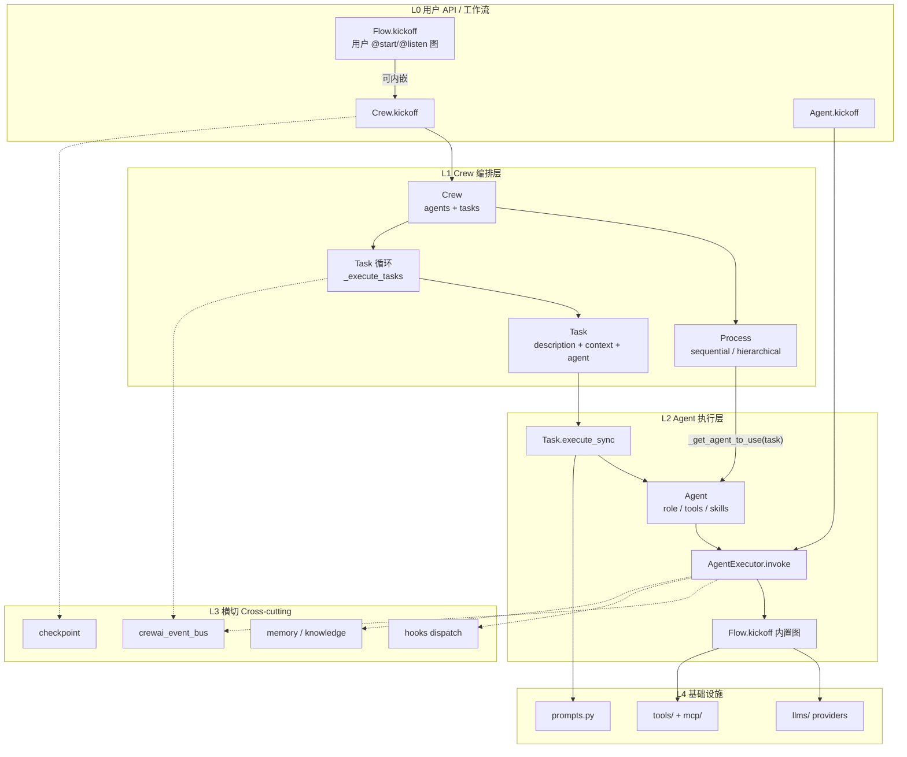
```mermaid
flowchart TB
    subgraph L0["L0 用户 API / 工作流"]
        UF[Flow.kickoff<br/>用户 @start/@listen 图]
        CK[Crew.kickoff]
        AK[Agent.kickoff]
    end

    subgraph L1["L1 Crew 编排层"]
        CR["Crew<br/>agents + tasks"]
        PR[Process<br/>sequential / hierarchical]
        TL[Task 循环<br/>_execute_tasks]
        TK[Task<br/>description + context + agent]
        CR --> PR
        CR --> TL
        TL --> TK
    end

    subgraph L2["L2 Agent 执行层"]
        AG[Agent<br/>role / tools / skills]
        ET[Task.execute_sync]
        EX[AgentExecutor.invoke]
        IF[Flow.kickoff 内置图]
    end

    subgraph L3["L3 横切 Cross-cutting"]
        EB[crewai_event_bus]
        HK[hooks dispatch]
        MEM[memory / knowledge]
        CP[checkpoint]
    end

    subgraph L4["L4 基础设施"]
        LLM[llms/ providers]
        TOOL[tools/ + mcp/]
        PRM[prompts.py]
    end

    UF -->|可内嵌| CK
    CK --> CR
    PR -->|"_get_agent_to_use(task)"| AG
    TK --> ET
    ET --> AG
    AG --> EX --> IF
    AK --> EX

    TL -.-> EB
    EX -.-> EB
    EX -.-> HK
    EX -.-> MEM
    CK -.-> CP
    IF --> LLM
    IF --> TOOL
    ET --> PRM
```

**实体在图中的位置**：

| 实体 | 层 | 说明 |
|------|-----|------|
| **Flow** | L0 | 用户业务阶段；可多次调用 Crew |
| **Crew** | L1 | 持有 `agents[]` + `tasks[]` |
| **Process** | L1 | 挂在 Crew 上的**策略枚举**（非独立引擎） |
| **Task** | L1→L2 | Crew 内**单个任务**；`tasks[]` 有序列表，逐项 `execute_sync` 交给 Agent |
| **Agent** | L2 | 执行 `execute_task(task)` |
| **AgentExecutor** | L2→L3 | 内层 Flow，单 Task 的 ReAct/plan 循环 |

**设计原则（读源码时对照）**：

1. **Crew 不负责 ReAct**——只编排 Task 顺序、选 Agent、合并 tools/MCP；真正 loop 在 `AgentExecutor`。
2. **Flow 是共用引擎**——用户 `Flow` 与 `AgentExecutor` 继承同一 `flow.runtime.Flow`；后者 `suppress_flow_events=True` 避免 agent 内层刷屏。
3. **Process 不是独立调度器**——sequential / hierarchical 共用 `_execute_tasks` 线性循环；差异在 **每 Task 用哪个 Agent** 与 **委托工具如何注入**。
4. **Planning 两条轨**——`Crew.planning`（kickoff 前 enrich description）与 `planning_config`（AgentExecutor 内 Plan-and-Execute）可叠加。

### 0.4 三大入口与「两种 Flow」

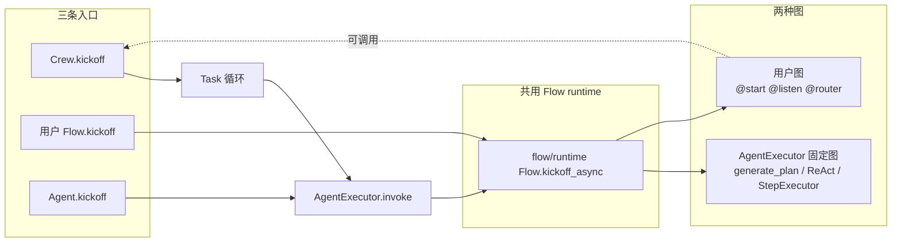
```mermaid
flowchart LR
    subgraph entries["三条入口"]
        C[Crew.kickoff]
        F[用户 Flow.kickoff]
        A[Agent.kickoff]
    end

    subgraph shared["共用 Flow runtime"]
        RT[flow/runtime Flow.kickoff_async]
    end

    subgraph graphs["两种图"]
        UG["用户图<br/>@start @listen @router"]
        AG["AgentExecutor 固定图<br/>generate_plan / ReAct / StepExecutor"]
    end

    C --> TaskLoop[Task 循环] --> AE[AgentExecutor.invoke] --> RT --> AG
    F --> RT --> UG
    A --> AE

    UG -.->|可调用| C
```

| | **用户 `crewai.flow.Flow`** | **`AgentExecutor(Flow)`** |
|--|----------------------------|---------------------------|
| **状态** | 用户自定义 Pydantic / dict | 固定 `AgentExecutorState`（messages、todos、plan…） |
| **图** | 业务工作流（ETL、分支、人工） | ~30 个 `@router`：规划 / ReAct / todo 步进 |
| **事件** | 完整 `FlowStarted` / `FlowFinished` | `suppress_flow_events=True` |
| **典型用途** | 跨 Crew、条件分支、持久化 state | 单次 Task 或 `agent.kickoff()` 的 tool loop |

### 0.5 多 Agent 协作

#### 0.5.1 Sequential（顺序）

**语义**：Task 列表 **线性执行**；后序 Task 通过 `context` 拿到前序 `TaskOutput`（或 `task.context` 显式依赖）。

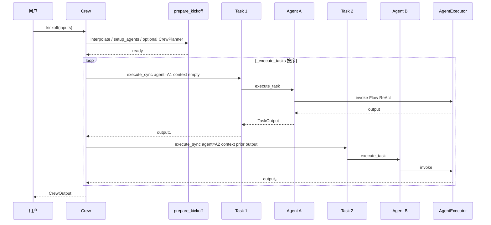
```mermaid
sequenceDiagram
    participant U as 用户
    participant C as Crew
    participant P as prepare_kickoff
    participant T1 as Task 1
    participant A1 as Agent A
    participant T2 as Task 2
    participant A2 as Agent B
    participant EX as AgentExecutor

    U->>C: kickoff(inputs)
    C->>P: interpolate / setup_agents / optional CrewPlanner
    P-->>C: ready

    loop _execute_tasks 按序
        C->>T1: execute_sync agent=A1 context empty
        T1->>A1: execute_task
        A1->>EX: invoke Flow ReAct
        EX-->>A1: output
        A1-->>T1: TaskOutput
        T1-->>C: output1

        C->>T2: execute_sync agent=A2 context prior output
        T2->>A2: execute_task
        A2->>EX: invoke
        EX-->>C: output₂
    end

    C-->>U: CrewOutput
```

- **执行单元**：每个 Task 绑定的 `task.agent`（X3 Task + X1 内层 loop）。
- **可选委托**：`allow_delegation=True` 时向 **当前 task.agent** 注入 peer delegation tools（非 Manager）。

#### 0.5.2 Hierarchical（层级）

> **易错点**：不是 Manager 先 `plan_tasks()` 再派子任务图；而是 **每个 Task 仍顺序执行**，但 **执行者恒为 `manager_agent`**，Manager 通过 **委托工具** 调用 Worker。
>
> **Manager 身份**：只传 `manager_llm` 时，Manager 是 `_create_manager_agent()` **自动创建**的 **"Crew Manager"**（`agents[]` 里的 researcher/writer/reviewer 只是 Worker，不是 Manager）。

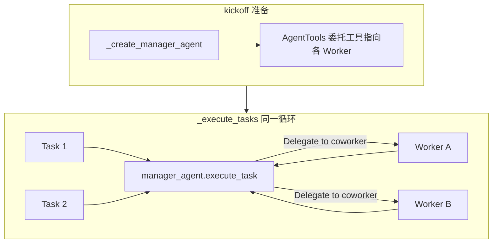
```mermaid
flowchart TB
    subgraph kickoff["kickoff 准备"]
        M[_create_manager_agent]
        M --> MT["AgentTools 委托工具指向各 Worker"]
    end

    subgraph exec_loop["_execute_tasks 同一循环"]
        T1[Task 1] --> MA[manager_agent.execute_task]
        T2[Task 2] --> MA
        MA -->|Delegate to coworker| W1[Worker A]
        MA -->|Delegate to coworker| W2[Worker B]
        W1 --> MA
        W2 --> MA
    end

    kickoff --> exec_loop
```

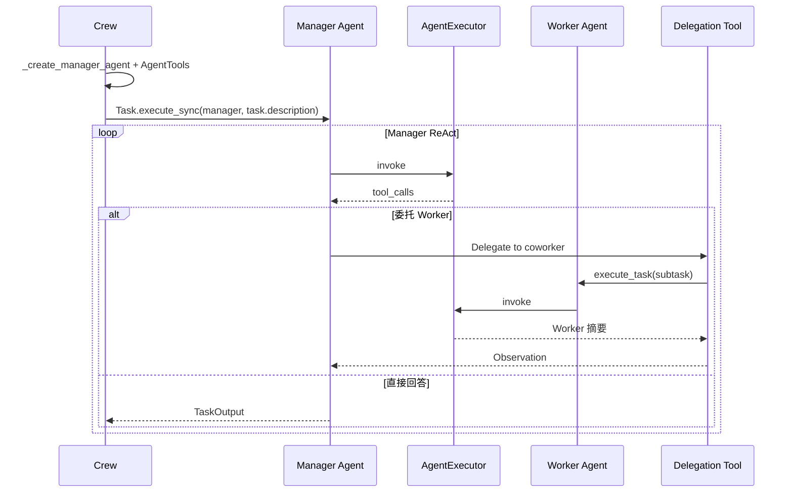
```mermaid
sequenceDiagram
    participant C as Crew
    participant M as Manager Agent
    participant EX as AgentExecutor
    participant W as Worker Agent
    participant DT as Delegation Tool

    C->>C: _create_manager_agent + AgentTools
    C->>M: Task.execute_sync(manager, task.description)

    loop Manager ReAct
        M->>EX: invoke
        EX-->>M: tool_calls
        alt 委托 Worker
            M->>DT: Delegate to coworker
            DT->>W: execute_task(subtask)
            W->>EX: invoke
            EX-->>DT: Worker 摘要
            DT-->>M: Observation
        else 直接回答
            M-->>C: TaskOutput
        end
    end
```

> **与 Crew.planning 的关系**：上图从 `_create_manager_agent` 开始，**未画出** `prepare_kickoff` 里可选的 `CrewPlanner` 阶段。`planning=True` 时，在 `_create_manager_agent()` **之前**已完成 `task.description += plan`；之后 Manager 委托链路与上图**完全相同**，只是 Manager prompt 更长。
> **完整对比（有/无 plan、图 1 + 图 2）**：[CREWAI_CORE_ENTITIES.md §3.3.1](./CREWAI_CORE_ENTITIES.md#331-hierarchical-完整链路--crewplanning-有无对比)。

| 维度 | Sequential | Hierarchical |
|------|------------|--------------|
| `_get_agent_to_use` | `task.agent` | `manager_agent` |
| 委托工具 | 注入到 task.agent（若 allow_delegation） | Manager 的 `AgentTools(agents=...)` |
| Task 顺序 | 线性相同 | 线性相同 |
| 「计划」从哪来 | Task.description（+ 可选 Crew.planning） | 同上；Manager **运行时**决定派谁 |

#### 0.5.3 Parallel？

`Process` 枚举 **仅有** `sequential` 与 `hierarchical`（`process.py`）。**没有** `Process.parallel`；并行靠 **单 Task 的 `async_execution=True`** 在 `_execute_tasks` 里 `execute_async` + `gather`，不是第三种 Process。
# CrewAI Hierarchical 模式 Manager 完整解答

## 1. Manager 是什么？作用是什么？

`Hierarchical`（层级模式）会生成一个**管理者 Agent**（经理），充当整个团队的**调度总指挥**CSDN博...。

>
> 两种创建方式：
>
>
> 1. 自动生成：你只填 `manager_llm`，框架内部自动创建一个隐藏 Manager Agent
> 2. 手动指定：传入你自己写好的 `manager_agent`

### Manager 的 4 项核心职责

1. **任务规划拆解**：接收顶层目标，把大任务拆成多个子任务；
2. **动态委派任务**：在运行时挑选合适的 worker‑agent 去干活；
3. **结果审核校验**：拿到 worker 输出，判断质量是否达标；不合格就打回去重跑；
4. **结果汇总合成**：收集全部 worker 产出，整合生成最终答案返回。

>
> ⚠️ **关键点：Manager 默认不亲自干活，只做调度**。
> 和 `sequential` 最大区别：
>
>
> - sequential：**你在代码写死 Task → Agent 的绑定关系**，执行顺序固定；
> - hierarchical：**代码里不需要预先给 Task 指定 Agent，由 Manager 运行时动态分配**。

---

## 2. 是否由 Manager 选择 Agent 执行 Task？

✅ **是的，完全由 Manager 在运行时动态选择**。

执行对比：

表格

| 模式 | 谁分配任务给谁 | 任务是否预先绑定 Agent |
| --- | --- | --- |
| Sequential | 开发者（写代码时） | 必须指定`agent=xxx` |
| Hierarchical | Manager Agent（运行时） | 不需要绑定 Agent |

```
# hierarchical下，task不要写agent参数
task = Task(description="市场调研", expected_output="调研报告")
# manager会自己挑researcher agent来执行它
```

---

## 3. 根据什么标准选择 Agent？

**没有硬编码的调度算法，全部靠 Manager 背后的 LLM 大模型推理决策**。
LLM 做选择时，能看到所有 Worker Agent 的全部元信息：

1. `role` 角色名称（研究员、文案、律师）
2. `goal` 该 agent 的工作目标
3. `backstory` 背景故事、擅长领域
4. 该 agent 绑定了哪些工具（搜索工具、代码工具）
5. 当前子任务的描述、预期输出
6. 历史执行结果、上下文信息

>
> **本质提示词逻辑**（简化版）：
>
>
> >
> > 你是项目经理，现在需要完成任务【xxx】。团队成员列表：
> > Agent A：role = 市场研究员，擅长互联网行业调研
> > Agent B：role = 文案撰稿人，擅长写报告
> > 请选出最合适的 Agent 来执行这个任务。

### 影响选择质量的关键坑点

- 如果各个 Agent 的`role/backstory`描述模糊、职责重叠，LLM 就容易选错人；
- 想要稳定路由：**每个 worker 职责边界一定要写清晰、互不重叠**。

---

## 4. Manager 是不是把 Agent 当做 Tool 工具来使用？

### 结论：**逻辑上像调用工具，但底层本质不是普通 Tool**

#### 1）底层实现原理

Manager 会被框架自动注入一个内置特殊工具：`DelegateWorkTool`（委派工具）CSDN博...。
当 LLM 决定委派任务时，Manager 就调用这个委派工具，框架内部再把任务转发给选中的 worker agent。

#### 2）Agent vs 普通 Tool 的核心区别

表格

| 对比项 | 普通 Tool（搜索、计算器） | 被委派的 Worker‑Agent |
| --- | --- | --- |
| 执行主体 | 工具函数，无自主思考 | 独立 Agent，可以自主思考、调用自己的工具、拥有记忆 |
| 返回值 | 直接返回函数结果 | Agent 完整执行一轮推理 + 工具调用，再返回结果 |
| 权限 | 只能做固定动作 | 可以继续二次委派（如果`allow_delegation=True`） |

>
> 通俗比喻：
>
>
> - Tool = 你电脑上一个计算器按钮，点一下就出结果；
> - Worker Agent = 你的下属员工，你（Manager）派给他一份工作，他自己思考完成再交回报告。

#### 3）重要配置参数 `allow_delegation`

- Manager：`allow_delegation=True`（必须开启，才有委派能力）
- Worker Agents：**一般设置 `allow_delegation=False`**

>
> 如果 worker 也开启委派，就会出现员工又把活派给别人，无限空转循环的问题。

---

# 完整流程图（Mermaid）


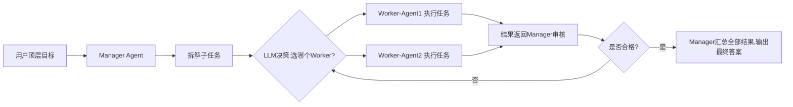
```mermaid
flowchart LR
    A[用户顶层目标] --> B[Manager Agent]
    B --> C[拆解子任务]
    C --> D{LLM决策:选哪个Worker?}
    D --> E[Worker‑Agent1 执行任务]
    D --> F[Worker‑Agent2 执行任务]
    E --> G[结果返回Manager审核]
    F --> G
    G --> H{是否合格?}
    H --否--> D
    H --是--> I[Manager汇总全部结果,输出最终答案]
```


### 0.6 Planning 双轨（与编排 / 执行单元的关系）

> **完整流程 + 协作图**：[`CREWAI_CORE_ENTITIES.md` §3.9](./CREWAI_CORE_ENTITIES.md#39-planning-双轨详解crewplan-vs-agentplan)

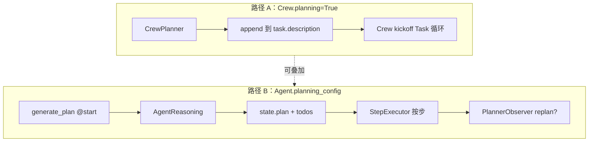
```mermaid
flowchart TB
    subgraph crew_plan["路径 A：Crew.planning=True"]
        CP[CrewPlanner] --> APP[append 到 task.description]
        APP --> KICK[Crew kickoff Task 循环]
    end

    subgraph agent_plan["路径 B：Agent.planning_config"]
        GP[generate_plan @start] --> AR[AgentReasoning]
        AR --> ST[state.plan + todos]
        ST --> SE[StepExecutor 按步]
        SE --> PO["PlannerObserver replan?"]
    end

    crew_plan -.->|可叠加| agent_plan
```

| | **Crew 预规划** | **Agent planning_config** |
|--|-----------------|---------------------------|
| 开关 | `Crew(planning=True)` | `Agent(planning_config=PlanningConfig(...))` |
| 时机 | `prepare_kickoff` **末尾**，任何 Task 前 | `AgentExecutor` Flow **每次 invoke** 的 `@start` |
| 产物 | 文本 append `task.description` | `state.plan` + `TodoList`（不改 description） |
| 规划 Agent | 临时 `Task Execution Planner`（不在 agents[]） | 当前 Task 的 Agent 自身 |
| 执行中 replan | ❌ | ✅ `PlannerObserver` + `handle_replan_now` |
| 编排者 | L1 Crew `prepare_kickoff` | L3 AgentExecutor `@router` 图 |
# CrewAI `agent.plan` 开启后完整源码流程深度解析

>
> 版本范围：crewai >= 0.100.x 新版架构
> `plan` 参数：`Agent(..., plan=True)`
> 作用：**Agent 在正式执行任务之前，先生成一份执行计划，再按计划干活**。
> 默认关闭 `plan=False`；开启 `plan=True` 会在 Agent 执行链路插入一个独立「规划步骤」。

## 一、先厘清顶层入口调用链

Agent 最终干活的入口方法：`Agent.execute_task()`

```
Crew.kickoff()
    └── TaskExecutor._execute_task()
        └── Agent.execute_task(task: Task, context: str, tools: list[BaseTool])
```

`execute_task` 是整个 Agent 生命周期的主函数，plan 逻辑就在这个函数内部分支判断。

## 二、源码主干流程（带源码位置逻辑）

### 文件路径参考（crewai 仓库）

`crewai/agent/agent.py` → `execute_task()`
`crewai/agent/agent_executor.py` → AgentExecutor（LLM 调用、工具循环）

### 开启 plan=True 的完整时序

```
1. 接收任务：task + 上下文context
2. 【分支判断】if self.plan is True:
    ├─ 2.1 构造规划专用 Prompt（Planning Prompt）
    ├─ 2.2 调用 LLM，生成 Task Execution Plan（执行计划）
    ├─ 2.3 将生成好的计划注入到任务上下文中
    └─ 2.4 把计划附加给 agent 内部状态 self.agent_plans
3. 进入标准 AgentExecutor 循环（ReAct 工具调用循环）
    ├─ 3.1 LLM思考（Thought）
    ├─ 3.2 可选：调用工具 action
    ├─ 3.3 工具返回结果 observation
    └─ 3.4 循环直到返回最终答案 Final Answer
4. 返回任务结果
```

>
> 关键点：**Plan 不是用来控制 Agent 执行步骤的程序 / 脚本，Plan 只是一段附加进上下文的文本提示。Agent 不会严格强制按计划执行，只是 “看见计划，参考它干活”**
> ❗ **没有硬代码校验 Agent 有没有遵守计划**。是否按计划执行，完全取决于 LLM 本身。

---

## 三、分步拆解每一步源码逻辑

### 步骤 1：execute_task 入口，plan 判断分支

伪源码还原：

```python
def execute_task(self, task: Task, context: str = "", tools: list[BaseTool] = None):
    # 省略记忆、回调、日志初始化
    planned_task = None

    if self.plan:
        # ========== PLAN 开启分支 ==========
        planned_task = self._create_task_plan(task, context)
        # 将生成的计划追加到上下文，传给后续执行循环
        context = self._append_plan_to_context(context, planned_task)
        # 保存计划到agent实例，可后续读取
        self.agent_plans.append(planned_task)

    # ========== 标准 ReAct Agent 执行器 ==========
    result = self.agent_executor.invoke({
        "task": task,
        "context": context,
        "tools": tools
    })
    return result
def _create_task_plan(self, task: Task, context: str):
    # 1.加载内置规划提示词模板
    planning_prompt = self.i18n.slice("planning").format(
        role=self.role,
        goal=self.goal,
        backstory=self.backstory,
        task=task.description,
        expected_output=task.expected_output,
        context=context or ""
    )
    # 2.单独一轮LLM调用，让AI生成一份分步todo清单
    plan_text = self.llm.call(planning_prompt)
    # 3.把这份todo文本存进agent实例的数组
    planned_task = PlannedTask(raw=plan_text)
    self.agent_plans.append(planned_task)
    return planned_task
```

### 步骤 2：`_create_task_plan(task, context)` —— 生成计划

内部行为：

1. 加载内置的 planning prompt 模板（crewai 内置提示词）
   模板核心内容大意：
>
> " 基于下面任务，创建一份详细分步执行计划。列出你需要完成哪些步骤，需要使用哪些工具，最终如何达成目标。不要执行任务本身，**只输出计划**。"
2. 填充变量：agent.role、agent.goal、agent.backstory、task.description、expected_output、传入的上下文
3. 使用 agent.llm 单独发起一次 LLM 请求，**一次独立大模型调用**
4. 接收 LLM 返回的文本，即为「计划文本」，封装成 `PlannedTask` 对象

>
> ⚠️ 一次额外 LLM 开销！开启 plan = True，会**多消耗一轮 token**。

### 步骤 3：`_append_plan_to_context` 将计划注入上下文

把刚刚生成的计划文本，追加到传给 AgentExecutor 的 prompt 上下文里。
示例追加后上下文片段：

```
=== 执行计划 ===
1. 第一步：使用搜索工具查找行业最新数据
2. 第二步：整理数据，对比增长率
3. 第三步：撰写结论报告
=== 任务开始 ===
原始任务描述：xxx
```

### 步骤 4：AgentExecutor 进入 ReAct 循环（计划不会被解析成代码）

AgentExecutor 就是标准的 ReAct 循环：
Thought → Action → Observation → Thought → ... → Final Answer
此时 LLM 只是**读到了计划文本**，框架没有：

- 解析计划成步骤列表
- 没有按计划一步步调度执行
- 没有校验是否完成计划每一条
- 失败不会自动重试计划步骤

👉 **Plan = 前置提示增强，不是确定性工作流**

---

## 四、plan=True vs plan=False 对比表

表格

| 维度 | plan=False (默认) | plan=True |
| --- | --- | --- |
| LLM 调用轮次 | 1 轮起（ReAct 循环） | **+1 次额外规划 LLM 调用** |
| 执行前规划 | 无 | 先生成一份分步计划文本 |
| 计划约束力 | 无 | **软约束，LLM 自主决定要不要遵守** |
| 上下文输入 | 任务 + 背景 | 任务 + 背景 + 生成的执行计划 |
| 适用场景 | 简单任务、快速执行 | 复杂长任务，需要 Agent 先理清思路再动手 |
## 一、两个特性严格区分

表格

| 参数 | 版本 | 本质 |
| --- | --- | --- |
| `agent.plan=True` | 0.100.x 旧稳定版 | **一次性前置文本规划，无循环、无观测、无重规划**，生成计划之后就扔掉调度权，交给普通 ReAct 循环，没有 Todo 对象，没有 Observer，没有 replan。也就是我上一轮讲解的链路。 |
| `agent.reasoning=True` | Edge / 开发版 | **闭环规划执行引擎，完整 Plan‑Execute‑Observe‑Replan 循环，就是你时序图画出来的整套架构**。内部引入了全套结构化 Todo、独立 StepExecutor、PlannerObserver 观测器、动态重规划分支。 |

>
> 这也就是你之前反馈我讲解「缺少 TodoList」的根本原因：我一直拿旧`plan`的源码给你解释，而你分析的源码对象，是**全新 reasoning 推理引擎**。

## 二、你的时序图，逐组件映射真实源码类名

你的时序图 6 个参与者，一一对应新版推理引擎内部模块：

1. **Task**：顶层任务对象，来自 `crewai.task.Task`
2. **Agent**：`crewai.agent.Agent`，`execute_task`入口不变
3. **AgentExecutor**：新版推理模式下的主控调度器（不再是传统 ReAct 执行器），负责 TodoList 循环调度
4. **AgentReasoning**：规划核心模块，源码位置：`crewai.agent.reasoning`，负责`generate_plan`，输出结构化 `TodoList`（带`pending/ready/completed`状态的结构化对象，不是纯文本字符串）
5. **StepExecutor**：单条 Todo 子步骤隔离执行器，**每一条 todo 单独开启会话、隔离上下文**，避免全局记忆污染
6. **PlannerObserver**：观测校验组件，负责`observe_step_result`，评估步骤结果风险等级 (low/medium/high)，判断是否触发`replan`重规划分支，PR#6618 正是这个观测器的开发提交记录GitHub

## 三、1:1 还原源码真实调用栈（reasoning=True 开启时）

```
Crew.kickoff()
    └── TaskExecutor._execute_task()          # 最外层调度层（之前我们讨论的第一层execute_task）
        └── Agent.execute_task()               # Agent干活入口（第二层execute_task）
            └── if agent.reasoning == True:
                └── 启动 ReasoningAgentExecutor（新版规划调度主控，不再走旧ReAct AgentExecutor）
                    ├─ AgentReasoning.generate_plan() → 生成结构化 TodoList
                    └── loop(遍历ready状态todo):
                        ├─ StepExecutor.execute(todo) 隔离上下文执行单步
                        ├─ 返回 step_result
                        ├─ PlannerObserver.observe_step_result(step_result)
                        ├─ if medium/high风险 → 触发 replan
                        │    └── AgentReasoning.handle_replan_now() → 更新todo清单，得到新pending todos
                        └─ mark todo completed，取下一条循环
```

>
> 最关键分叉点：
>
>
> - `reasoning=False`：执行 → **传统 ReAct AgentExecutor（无 todo 调度循环）**
> - `reasoning=True`：执行 → **ReasoningAgentExecutor，也就是你时序图的整套闭环引擎**

## 四、`reasoning=True` vs 老 `plan=True`，完整对比表

表格

| 对比项 | `plan=True`（旧版，0.100 稳定） | `reasoning=True`（Edge 新版，你的时序图） |
| --- | --- | --- |
| 生成产物 | 纯文本计划字符串，无结构化对象 | 结构化 `TodoList` 对象，每条 todo 带 step_id、status、risk_level |
| 调度循环 | 无专门循环，计划仅附加进 prompt；ReAct 自由执行 | 外层专门循环遍历 Todo 清单，一条一条调度 StepExecutor 执行 |
| 上下文 | 全局共享上下文，所有步骤记忆互通 | **每条 todo 执行上下文隔离** |
| 观测校验 | 无 Observer 模块，无结果评估 | 独立`PlannerObserver`校验每一步输出 |
| 重规划能力 | ❌ 全程不可修改计划，一次性生成 | ✅ 运行途中随时触发 replan，动态增删修改待办清单 |
| 计划约束力 | 软约束，LLM 可以无视计划 | 强调度约束，由 Executor 驱动 todo 进度 |

## 五、两个 execute‑task 函数，在 reasoning 新链路中的位置

1. `TaskExecutor._execute_task()`：**完全不受影响，仍然是最上层的任务调度入口**，它只负责选出 agent，然后调用 agent.execute_task。
2. `Agent.execute_task()`：**这里是开关分叉点**，在这个函数内部判断`self.reasoning`布尔标记，然后二选一：
    - False：走传统 ReAct 执行链路；
    - True：启动整套 AgentReasoning 闭环引擎，也就是你画出来的整套时序。
## 状态模型 `AgentExecutorState`

所有运行时上下文全部收敛到这个 Pydantic State 对象，Flow 无额外局部变量。

表格

| 字段 | 用途 |
| --- | --- |
| `messages` | LLM 对话历史消息列表 |
| `iterations` | ReAct 迭代轮次计数器 |
| `current_answer` | 上一轮 LLM 输出 `AgentAction / AgentFinish` |
| `is_finished` | 是否已经产出最终答案 |
| `pending_tool_calls` | 原生函数调用模式下待执行工具列表 |
| `plan` | AgentReasoning 生成的文本执行计划 |
| `plan_ready` | 计划是否生成成功 |
| `todos: TodoList` | 拆解后的执行步骤清单（Plan‑and‑Execute 核心） |
| `replan_count` | 动态重规划次数计数器 |
| `last_replan_reason` | 最近一次重规划触发原因 |
| `observations` | 每一步完成后的 LLM 观测结果字典 `{step_number: StepObservation}` |
| `execution_log` | 审计调试日志（**不会喂给 LLM**） |

## 三、完整 Flow 状态跳转流程图（Mermaid）


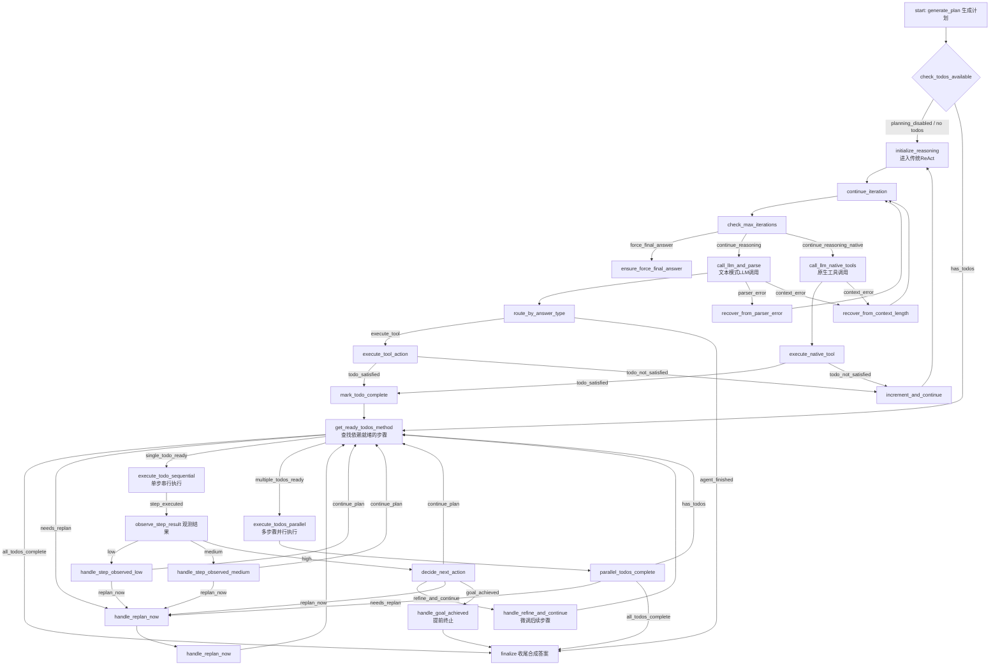
```mermaid
flowchart TD
    A[start: generate_plan 生成计划] --> B{check_todos_available}

    B -->|planning_disabled / no todos| C[initialize_reasoning<br/>进入传统ReAct]
    B -->|has_todos| D[get_ready_todos_method<br/>查找依赖就绪的步骤]

    D -->|all_todos_complete| Z[finalize 收尾合成答案]
    D -->|needs_replan| REP[handle_replan_now]
    D -->|single_todo_ready| E[execute_todo_sequential<br/>单步串行执行]
    D -->|multiple_todos_ready| F[execute_todos_parallel<br/>多步骤并行执行]

    %% 串行路径
    E -->|step_executed| OBS[observe_step_result 观测结果]
    OBS -->|low| LOW[handle_step_observed_low]
    OBS -->|medium| MED[handle_step_observed_medium]
    OBS -->|high| HIGH[decide_next_action]

    LOW -->|continue_plan| D
    LOW -->|replan_now| REP

    MED -->|continue_plan| D
    MED -->|replan_now| REP

    HIGH -->|continue_plan| D
    HIGH -->|refine_and_continue| RF[handle_refine_and_continue<br/>微调后续步骤] --> D
    HIGH -->|replan_now| REP
    HIGH -->|goal_achieved| GA[handle_goal_achieved<br/>提前终止] --> Z

    %% 并行路径
    F --> PAR[parallel_todos_complete]
    PAR -->|needs_replan| REP
    PAR -->|has_todos| D
    PAR -->|all_todos_complete| Z

    %% ReAct 传统循环链路
    C --> CI[continue_iteration]
    CI --> MI[check_max_iterations]
    MI -->|force_final_answer| FF[ensure_force_final_answer]
    MI -->|continue_reasoning| LLM1[call_llm_and_parse<br/>文本模式LLM调用]
    MI -->|continue_reasoning_native| LLM2[call_llm_native_tools<br/>原生工具调用]

    %% 文本工具调用分支
    LLM1 --> RA[route_by_answer_type]
    RA -->|execute_tool| TOOL[execute_tool_action]
    TOOL -->|todo_satisfied| TC[mark_todo_complete] --> D
    TOOL -->|todo_not_satisfied| INC[increment_and_continue] --> C
    RA -->|agent_finished| Z

    %% Native Function Calling 分支
    LLM2 --> NT[execute_native_tool]
    NT -->|todo_satisfied| TC
    NT -->|todo_not_satisfied| INC

    %% 重规划分支
    REP --> RN[handle_replan_now] --> D

    %% 解析错误/上下文超长恢复分支
    LLM1 -->|parser_error| PARSER[recover_from_parser_error] --> CI
    LLM1 -->|context_error| CONTEXT[recover_from_context_length] --> CI
    LLM2 -->|context_error| CONTEXT
```


## 四、Plan‑and‑Execute 三大推理强度（`reasoning_effort`）

代码核心的分层决策逻辑，由 `agent.planning_config.reasoning_effort` 控制：

### 1. `low`

- **无额外 LLM 观测调用**，使用启发式 `heuristic_observation`
- 步骤失败**默认继续往下跑**；只有观测标记 `needs_full_replan=True` 才触发重规划
- 最低 Token 开销

### 2. `medium`

- 每一步后调用 LLM 做观测（PlannerObserver）
- **仅步骤失败并且标记需要重规划时才 replan**
- 不支持计划微调 (refine)、不支持提前目标达成检测

### 3. `high`（最强自适应）

完整决策流水线，观测完成后可选择：

1. `goal_achieved`：任务目标提前达成，跳过剩余步骤直接结束
2. `replan_now`：全盘作废剩余计划，生成全新步骤列表
3. `refine_and_continue`：**轻量微调后续待执行步骤，不重做全部计划**（`suggested_refinements`）
4. `continue_plan`：计划有效，正常执行下一步

>
> 微调（refine）≠ 重规划 (replan)
>
>
> - refine：仅修改**pending 未执行的 todo 描述文本**，已完成结果保留，无完整计划重生成，低成本
> - replan：调用 Planner LLM，生成一套全新剩余任务清单

## 五、并行步骤执行 `execute_todos_parallel` 关键点

```
@router("multiple_todos_ready")
async def execute_todos_parallel(self)
```

1. 筛选**无依赖冲突**的就绪任务 `get_ready_todos()`
2. 使用 `asyncio.to_thread` 在线程池中调用同步的 `StepExecutor.execute`
3. **所有并行步骤跑完以后，再逐个串行执行观测**
>
> ⚠️ 重要限制：观测逻辑无法并行，因为观测会修改共享的 AgentExecutorState
4. 每一个并行任务都拥有**隔离的 StepExecutionContext**，仅传入依赖步骤最终结果，**不会共享 LLM message 历史**。
>
> 这就是 Plan‑and‑Execute 的隔离特性：每个步骤独立执行，消息不会互相污染。

### 并行禁用条件（`_should_parallelize_native_tool_calls`）

只要待执行工具满足任一条件就强制串行：

1. `result_as_answer=True`：工具输出即最终答案，可以短路结束
2. 设置了 `max_usage_count`：有调用次数上限

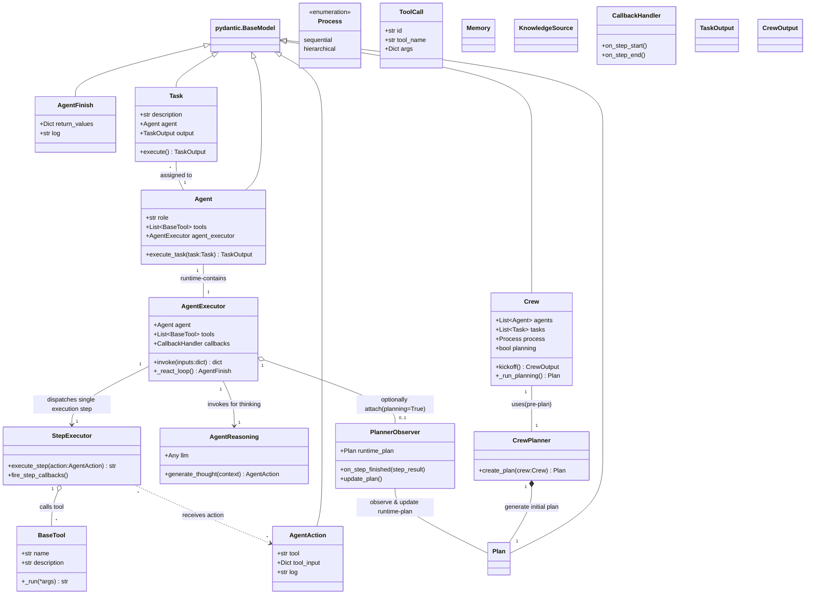
```mermaid
classDiagram
    direction TB
%%===== 顶层基础 =====
    class BaseModel["pydantic.BaseModel"]

%%===== 枚举 =====
    class Process{
        <<enumeration>>
        sequential
        hierarchical
    }

%%===== ReAct动作值对象 =====
    class AgentAction{
        +str tool
        +Dict tool_input
        +str log
    }
    class AgentFinish{
        +Dict return_values
        +str log
    }
    class ToolCall{
        +str id
        +str tool_name
        +Dict args
    }

%%===== 工具层 =====
    class BaseTool{
        +str name
        +str description
        +_run(*args) str
    }

%%===== 记忆、知识库、回调 =====
    class Memory
    class KnowledgeSource
    class CallbackHandler{
        +on_step_start()
        +on_step_end()
    }

%%===== 输出对象 =====
    class TaskOutput
    class CrewOutput
    class Plan

%%===== 规划顶层前置生成器 =====
    class CrewPlanner{
        +create_plan(crew:Crew) Plan
    }

%%==================== 【核心深层执行流水线组件 你截图缺失部分】 ====================
    class AgentExecutor{
        +Agent agent
        +List~BaseTool~ tools
        +CallbackHandler callbacks
        +invoke(inputs:dict) dict
        +_react_loop() AgentFinish
    }
    class AgentReasoning{
        +Any llm
        +generate_thought(context) AgentAction
    }
    class StepExecutor{
        +execute_step(action:AgentAction) str
        +fire_step_callbacks()
    }
    class PlannerObserver{
        +Plan runtime_plan
        +on_step_finished(step_result)
        +update_plan()
    }

%%===== 顶层业务模型 =====
    class Task{
        +str description
        +Agent agent
        +TaskOutput output
        +execute() TaskOutput
    }
    class Agent{
        +str role
        +List~BaseTool~ tools
        +AgentExecutor agent_executor
        +execute_task(task:Task) TaskOutput
    }
    class Crew{
        +List~Agent~ agents
        +List~Task~ tasks
        +Process process
        +bool planning
        +kickoff() CrewOutput
        +_run_planning() Plan
    }

%%===== 继承关系 =====
    BaseModel <|-- Agent
    BaseModel <|-- Task
    BaseModel <|-- Crew
    BaseModel <|-- Plan
    BaseModel <|-- AgentAction
    BaseModel <|-- AgentFinish

%%===== 聚合 & 调用关联 【核心流水线链路】 =====
    Task "*" -- "1" Agent : assigned to
    Agent "1" -- "1" AgentExecutor : runtime‑contains
    AgentExecutor "1" --> "1" AgentReasoning : invokes for thinking
    AgentExecutor "1" --> "1" StepExecutor : dispatches single execution step
    StepExecutor "*" ..> "*" AgentAction : receives action
StepExecutor "1" o-- "*" BaseTool : calls tool
AgentExecutor "1" o-- "0..1" PlannerObserver : optionally attach(planning=True)

%%===== Crew顶层规划关系 =====
Crew "1" -- "1" CrewPlanner : uses(pre‑plan)
CrewPlanner "1" *-- "1" Plan : generate initial plan
PlannerObserver -- Plan : observe & update runtime‑plan
```

#### 0.6.1 Crew.plan 时序（路径 A）

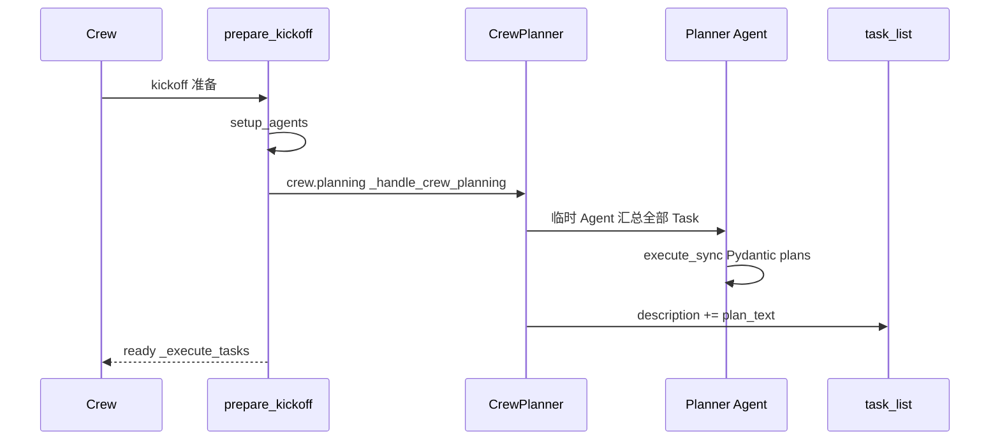
```mermaid
sequenceDiagram
    participant Crew
    participant Prep as prepare_kickoff
    participant CP as CrewPlanner
    participant PA as Planner Agent
    participant T as task_list

    Crew->>Prep: kickoff 准备
    Prep->>Prep: setup_agents
    Prep->>CP: crew.planning _handle_crew_planning
    CP->>PA: 临时 Agent 汇总全部 Task
    PA->>PA: execute_sync Pydantic plans
    CP->>T: description += plan_text
    Prep-->>Crew: ready _execute_tasks
```

#### 0.6.2 Agent.plan 时序（路径 B）

> **完整五张时序图**：[CREWAI_CORE_ENTITIES.md §3.9.7](./CREWAI_CORE_ENTITIES.md#397-agentplan-完整时序小白版)（端到端 / 规划 / 单步循环 / replan / 收尾 / ReAct 回退）。**LLM 调用点与两层 loop 详图**见本文 **§0.7**。

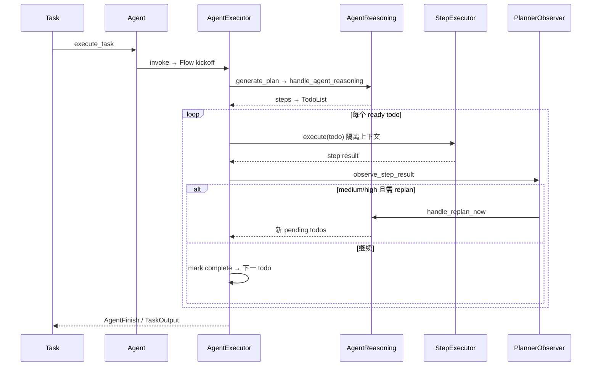
```mermaid
sequenceDiagram
    participant Task
    participant Agent
    participant EX as AgentExecutor
    participant AR as AgentReasoning
    participant SE as StepExecutor
    participant PO as PlannerObserver

    Task->>Agent: execute_task
    Agent->>EX: invoke → Flow kickoff
    EX->>AR: generate_plan → handle_agent_reasoning
    AR-->>EX: steps → TodoList

    loop 每个 ready todo
        EX->>SE: execute(todo) 隔离上下文
        SE-->>EX: step result
        EX->>PO: observe_step_result
        alt medium/high 且需 replan
            PO->>AR: handle_replan_now
            AR-->>EX: 新 pending todos
        else 继续
            EX->>EX: mark complete → 下一 todo
        end
    end

    EX-->>Task: AgentFinish / TaskOutput
```
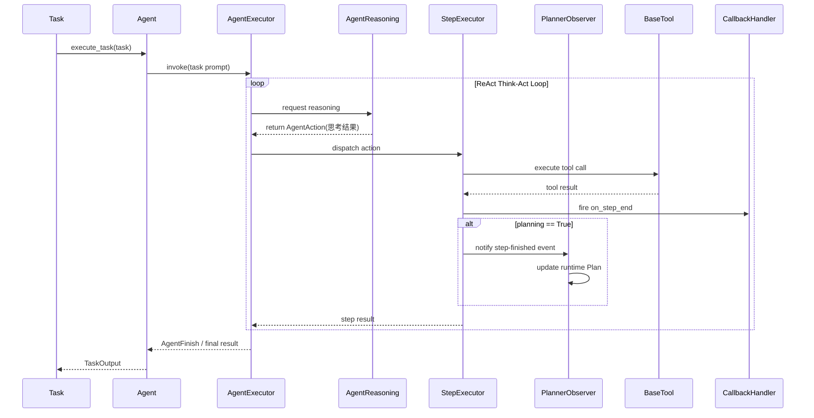
```mermaid
sequenceDiagram
    participant T as Task
    participant A as Agent
    participant AE as AgentExecutor
    participant AR as AgentReasoning
    participant SE as StepExecutor
    participant PO as PlannerObserver
    participant Tool as BaseTool

    T->>A: execute_task(task)
    A->>AE: invoke(task prompt)
    %% ReAct 循环开始
    loop ReAct Think‑Act Loop
        AE->>AR: request reasoning
        AR-->>AE: return AgentAction(思考结果)
        AE->>SE: dispatch action
        SE->>Tool: execute tool call
        Tool-->>SE: tool result
        SE->>CallbackHandler: fire on_step_end
        %% 如果开启planning，观察者接收单步事件
        alt planning == True
            SE->>PO: notify step‑finished event
            PO->>PO: update runtime Plan
        end
        SE-->>AE: step result
    end
    AE-->>A: AgentFinish / final result
    A-->>T: TaskOutput
```
```python
def kickoff(self) -> None:
    """
    主执行控制器
    修改 self.state: current_answer / is_finished / plan / todos / replan_count
    """
    # ===================== 阶段 1：Agent‑Self‑Plan 前置规划阶段 =====================
    # 【仅 reasoning=True 才进入】
    if self.agent.reasoning:
        # 循环生成 Agent 私有计划直到计划就绪
        while not self.state.plan_ready:
            # 调用 AgentReasoning，让LLM生成分步执行计划
            plan_output = self._reason_generate_plan()

            # 写入运行时状态
            self.state.plan = plan_output
            self.state.todos = TodoList(plan_output.steps)

            # 校验计划是否完整可行
            self.state.plan_ready = self._validate_self_plan(plan_output)

            # 计划不合格：循环重来，再次生成计划
            if not self.state.plan_ready:
                self.state.replan_count += 1

    # ===================== 阶段 2：Re‑Act 主循环（永远执行） =====================
    while (
        not self.state.is_finished
        and self.state.iterations < self.max_iterations
    ):
        # 2.1 推理步骤
        # 如果 reasoning=True：LLM 会读取 self.state.plan + todos 作为上下文约束
        action = self._react_get_next_action()

        # 2.2 判断是否完成任务
        if isinstance(action, AgentFinish):
            self.state.current_answer = action
            self.state.is_finished = True
            break

        # 2.3 StepExecutor 执行工具动作
        observation = self._step_executor.execute(action)

        # 2.4 【动态重规划分支 reasoning=True 独有能力】
        # 工具返回结果异常 / 计划失败，触发中途重新规划
        if self.agent.reasoning and self._need_replan(observation):
            self.state.last_replan_reason = observation
            self.state.plan_ready = False   # 重置计划就绪标记
            # 跳回前置规划逻辑，重新生成plan
            continue

        # 2.5 保存观测结果，迭代计数，进入下一轮Re‑Act循环
        self.state.observations[self.state.iterations] = observation
        self.state.execution_log.append(observation)
        self.state.iterations += 1

```
## 总览对比表

表格

| 对比维度 | `reasoning=False` (默认 标准 ReAct) | `reasoning=True` (Plan‑Then‑ReAct) |
| --- | --- | --- |
| **前置规划循环** | ❌ 跳过阶段 1，直接进入 Re‑Act 循环 | ✅ 先跑一轮前置循环，生成 Agent 私有分步计划，`state.plan`、`state.todos`被填充 |
| **LLM 思考上下文** | 仅接收原始任务 Prompt、历史工具观测记录 | 思考时**额外带上已经生成好的 plan + todos 待办清单**，LLM 需要按照计划推进任务 |
| **运行时重规划 replan** | ❌ 没有重规划分支；计划失效只能靠 ReAct 自己摸索调整 | ✅ 执行途中检测到计划不可行，可以随时触发重规划，重置 plan，生成新执行路线 |
| `self.state` 相关字段 | `plan=None`、`plan_ready=False`、`todos`为空全程不变 | `plan`、`todos`、`replan_count`、`last_replan_reason` 被全程读写维护 |
| 循环结构 | 单层循环：Re‑Act 循环 | 双层嵌套逻辑：前置 Plan 循环 + Re‑Act 循环 + ReAct 内可跳转回 Plan 生成 |
| 任务拆解责任 | LLM 在每一轮 ReAct 思考中**即时、临时**拆解任务 | Agent**提前一次性把任务拆成 todo 步骤清单**，后续执行以清单为导航 |
| 失败恢复策略 | ReAct 自由调整下一步动作，没有导航锚点 | 发现路线走不通 → 主动重新生成一份全新计划 |

---

# 四、两条执行路径完整时序

## 路径 1：`reasoning=False`（纯原生 Re‑Act）

```python
kickoff()
    ↳ 跳过前置规划
    ↳ Re‑Act while‑loop:
        ├─ AgentReasoning → 基于历史即时思考下一步
        ├─ StepExecutor → 调用工具，拿到观测
        └─ 循环直到 AgentFinish / 到达最大迭代
```

>
> LLM 没有一份提前写好的分步路线，**走一步看一步**。

## 路径 2：`reasoning=True` (Plan‑Then‑React + 动态重规划)

```python
kickoff()
    # 前置规划循环（一次或多次迭代）
    ↳ while(not plan_ready):
        └─ AgentReasoning 生成本地分步计划
    # Re‑Act主循环
    ↳ while(not finished):
        ├─ AgentReasoning(带着plan+todos) →下一步行动
        ├─ StepExecutor执行工具
        ├─ 【检测是否需要重规划】
            ├─ 是 → plan_ready=False → continue，跳回生成新计划
            └─ 否 → 保存观测，下一轮循环
```
更新todo list列表
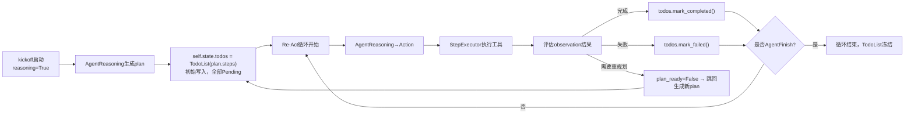
```mermaid
flowchart LR
    A[kickoff启动<br/>reasoning=True] --> B[AgentReasoning生成plan]
    B --> C[self.state.todos = TodoList&lpar;plan.steps&rpar;<br/>初始写入，全部Pending]
C --> D[Re‑Act循环开始]
D --> E[AgentReasoning→Action]
E --> F[StepExecutor执行工具]
F --> G[评估observation结果]
G -->|完成| H[todos.mark_completed&lpar;&rpar;]
G -->|失败| I[todos.mark_failed&lpar;&rpar;]
G -->|需要重规划| J[plan_ready=False → 跳回生成新plan]
J --> C
H --> K{是否AgentFinish?}
I --> K
K -->|否| D
K -->|是| L[循环结束，TodoList冻结]
```
---

#### 0.6.3 叠加协作（A + B 同一次 kickoff）

```text
prepare_kickoff:  CrewPlanner → task.description 含 Crew 级计划
_execute_tasks:   每个 Task → AgentExecutor
                  → AgentReasoning 读已 enrich 的 description
                  → 生成 Agent 级 TodoList → StepExecutor 逐步执行
```

与 OpenHarness 对比文档：[05-plan-mode.md §13](../../OpenHarness/docs/framework-comparison/05-plan-mode.md#13-crewai--三路径规划无-writetodos)。

#### 0.6.4 Hierarchical + Crew.planning（有/无对比摘要）

| | 无 `Crew.planning` | 有 `Crew.planning` |
|---|-------------------|-------------------|
| kickoff 前 | 直接进入 `_run_hierarchical_process` | `CrewPlanner` 先 append 各 `task.description` |
| Manager 创建 | `_create_manager_agent()` | 同上（Planner 不是 Manager） |
| 委托机制 | `DelegateWorkTool` → Worker | **不变** |
| Worker 子 Task | Manager 写的委托文本 | **不变**（通常不含 CrewPlanner 全文） |

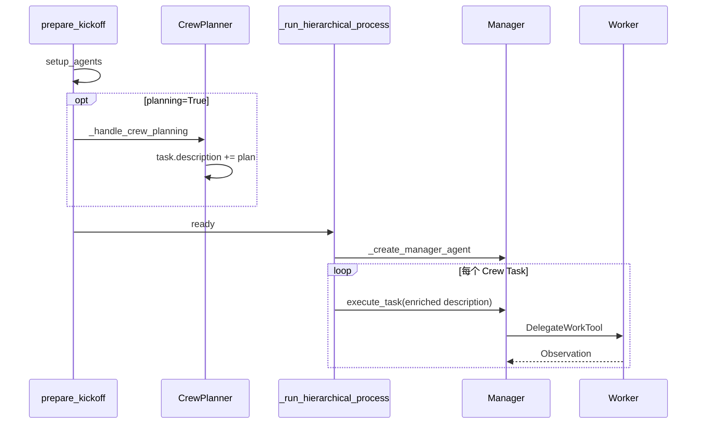
```mermaid
sequenceDiagram
    participant Prep as prepare_kickoff
    participant CP as CrewPlanner
    participant Hier as _run_hierarchical_process
    participant M as Manager
    participant W as Worker

    Prep->>Prep: setup_agents
    opt planning=True
        Prep->>CP: _handle_crew_planning
        CP->>CP: task.description += plan
    end
    Prep->>Hier: ready
    Hier->>M: _create_manager_agent
    loop 每个 Crew Task
        Hier->>M: execute_task(enriched description)
        M->>W: DelegateWorkTool
        W-->>M: Observation
    end
```

详情与两张完整时序图：[CREWAI_CORE_ENTITIES.md §3.3.1](./CREWAI_CORE_ENTITIES.md#331-hierarchical-完整链路--crewplanning-有无对比)。

### 0.7 AgentExecutor 内 Flow 详图（ReAct vs Plan-and-Execute + LLM 调用）

> **与 §0.6 的关系**：§0.6.2 是路径 B 的**时序**；本节补 §0.6 图里没画出来的 **LLM 调用点** 与 **两层 loop**。
> **注意**：本节仅指 `Agent(planning_config=...)`（L3），不是 `Crew.planning`（L1 kickoff 前 enrich）。

#### 0.7.1 路由简图（仅 Flow `@router`，无 LLM）

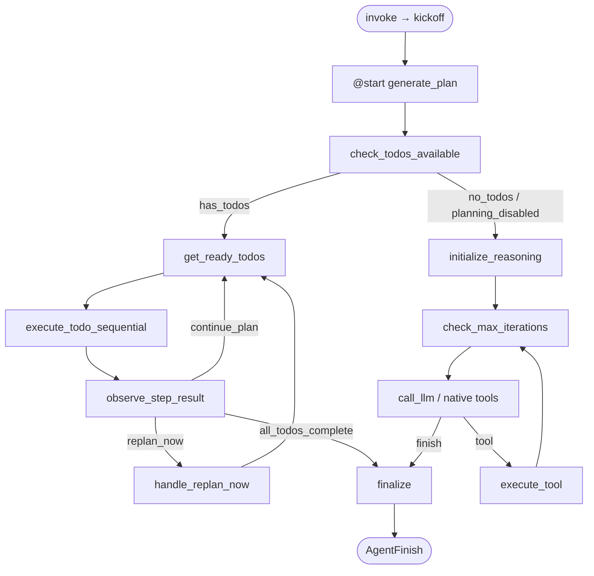
```mermaid
flowchart TD
    START(["invoke → kickoff"]) --> GP["@start generate_plan"]
    GP --> RT["check_todos_available"]
    RT -->|has_todos| READY["get_ready_todos"]
    RT -->|no_todos / planning_disabled| INIT["initialize_reasoning"]
    READY --> EXEC["execute_todo_sequential"]
    EXEC --> OBS["observe_step_result"]
    OBS -->|continue_plan| READY
    OBS -->|replan_now| REPLAN["handle_replan_now"]
    REPLAN --> READY
    OBS -->|all_todos_complete| FIN["finalize"]
    INIT --> REACT["check_max_iterations"]
    REACT --> LLM["call_llm / native tools"]
    LLM -->|tool| TOOL["execute_tool"]
    TOOL --> REACT
    LLM -->|finish| FIN
    FIN --> END(["AgentFinish"])
```

#### 0.7.2 详图（标注 LLM 调用与 loop）

Plan 模式 = **外层 todo 调度 Flow** + **每步 StepExecutor 内小 ReAct** + **可选每步 PlannerObserver**；不是一个大 `state.messages` 从头跑到尾。

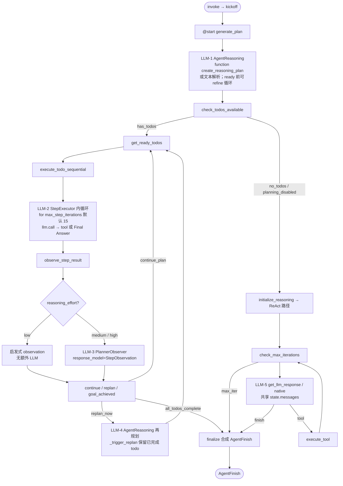
```mermaid
flowchart TD
    START(["invoke → kickoff"]) --> GP["@start generate_plan"]

    GP --> LLM1["LLM-1 AgentReasoning<br/>function create_reasoning_plan<br/>或文本解析；ready 前可 refine 循环"]
    LLM1 --> RT["check_todos_available"]

    RT -->|has_todos| READY["get_ready_todos"]
    RT -->|no_todos / planning_disabled| INIT["initialize_reasoning → ReAct 路径"]

    READY --> EXEC["execute_todo_sequential"]
    EXEC --> LLM2["LLM-2 StepExecutor 内循环<br/>for max_step_iterations 默认 15<br/>llm.call → tool 或 Final Answer"]
    LLM2 --> OBS["observe_step_result"]

    OBS --> EFF{"reasoning_effort?"}
    EFF -->|low| H["启发式 observation<br/>无额外 LLM"]
    EFF -->|medium / high| LLM3["LLM-3 PlannerObserver<br/>response_model=StepObservation"]
    H --> DECIDE["continue / replan / goal_achieved"]
    LLM3 --> DECIDE

    DECIDE -->|continue_plan| READY
    DECIDE -->|replan_now| LLM4["LLM-4 AgentReasoning 再规划<br/>_trigger_replan 保留已完成 todo"]
    LLM4 --> READY
    DECIDE -->|all_todos_complete| FIN["finalize 合成 AgentFinish"]

    INIT --> REACT["check_max_iterations"]
    REACT --> LLM5["LLM-5 get_llm_response / native<br/>共享 state.messages"]
    LLM5 -->|tool| TOOL["execute_tool"]
    TOOL --> REACT
    REACT -->|max_iter| FIN
    LLM5 -->|finish| FIN
    FIN --> END(["AgentFinish"])
```

#### 0.7.3 LLM 调用一览

| ID | 阶段 | 触发节点 | 调用方 | API | 用哪个 LLM | 循环 |
|----|------|----------|--------|-----|------------|------|
| **LLM-1** | 初始规划 | `generate_plan` | `AgentReasoning` | `llm.call` + `create_reasoning_plan` function；fallback 纯文本 | `planning_config.llm` 或 `agent.llm` | `ready=False` 时 `_refine_plan_if_needed`（最多 `max_attempts`） |
| **LLM-2** | 单步执行 | `execute_todo_sequential` | `StepExecutor` | `llm.call` → `process_llm_response` → tool / finish | **执行 LLM**（`executor.llm`） | 每 todo 最多 `max_step_iterations`（默认 15） |
| **LLM-3** | 单步观察 | `observe_step_result` | `PlannerObserver` | `llm.call(..., response_model=StepObservation)` | `planning_config.llm` 或 `agent.llm` | 每 todo 至多 1 次（medium/high） |
| **LLM-4** | 动态重规划 | `handle_replan_now` | `AgentReasoning` | 同 LLM-1，带已完成步骤上下文 | 同 LLM-1 | 受 `max_replans` 限制（默认 3） |
| **LLM-5** | ReAct 回退 | `call_llm_and_parse` / `call_llm_native_tools` | `AgentExecutor` | `get_llm_response` 或 native tool_calls | `executor.llm` | 直到 `AgentFinish` 或 `max_iter` |

**源码入口**：

| 组件 | 路径 |
|------|------|
| Flow 路由 | `experimental/agent_executor.py`（`@start` / `@router` / `@listen`） |
| 规划 | `utilities/reasoning_handler.py` → `handle_agent_reasoning` |
| 单步执行 | `agents/step_executor.py` → `execute` / `_execute_text_parsed` |
| 观察 | `agents/planner_observer.py` → `observe` |
| 配置 | `agent/planning_config.py` → `PlanningConfig` |

#### 0.7.4 两层 loop 与上下文隔离

| Loop | 范围 | 消息列表 | 终止条件 |
|------|------|----------|----------|
| **外层** | `has_todos` → execute → observe → continue/replan | `AgentExecutorState.todos` + `execution_log`（审计用，**不**喂给 LLM） | 全部 todo 完成 / `goal_achieved` / `max_replans` |
| **内层（Plan）** | `StepExecutor.execute` 单步 | **每步新建** `messages`（system + user）；只注入依赖步骤的 **result 字符串** | `AgentFinish` 或 `max_step_iterations` |
| **内层（ReAct）** | `initialize_reasoning` 路径 | **共享** `state.messages`（跨迭代累积） | `AgentFinish` 或 `max_iter` |

```text
Plan 路径上下文边界：
  StepExecutor 不读写 AgentExecutor.state.messages
  依赖传递：todo.depends_on → StepExecutionContext.dependency_results（仅最终 result）
  观察输入：completed_step + result + remaining_todos（非完整 tool trace）
```

#### 0.7.5 `reasoning_effort` 与观察行为

| `reasoning_effort` | 每步 LLM-3 观察 | 失败后 | 成功后 |
|--------------------|-----------------|--------|--------|
| **low** | ❌ 启发式（除非 `observe_steps=True`） | 仅 `needs_full_replan` 时 `replan_now` | 标完成 → `continue_plan` |
| **medium**（默认） | ✅ | `replan_now` | 标完成 → 继续（无 refine） |
| **high** | ✅ | 完整 decide 管道 | 可 refine 剩余 todo / `goal_achieved` 提前结束 |

`observe_steps=False` 可在任意 effort 下关闭 LLM-3。

#### 0.7.6 何时走 ReAct 而非 Plan 步进

| 条件 | 路径 |
|------|------|
| 无 `planning_config`（`planning_enabled=False`） | 直接 `initialize_reasoning` → LLM-5 |
| 有 planning 但 `generate_plan` 未产出 steps | `check_todos_available` → `no_todos` → ReAct |
| Legacy `todo_injected`（旧模式注入 todo 到 messages） | ReAct + 可选 `mark_todo_complete` |

与 §0.6.2 时序图对照阅读：[CREWAI_CORE_ENTITIES.md §3.9.7](./CREWAI_CORE_ENTITIES.md#397-agentplan-完整时序小白版)。

### 0.8 正交维度速查（读晕时回来对表）

与 [05-plan-mode §1.5](../../OpenHarness/docs/framework-comparison/05-plan-mode.md#15-正交四维plan--编排者--执行单元--execute) 对齐：

| 维度 | CrewAI 典型落点 |
|------|-----------------|
| **Plan** | Crew.planning / planning_config / Task 图 |
| **编排者** | Crew Process（O3/O4）、AgentExecutor Flow（O2）、用户 Flow（O2） |
| **执行单元** | Task→Agent（X3+X1）；Manager 委托 Worker（X3）；`delegate` tool |
| **Execute** | Native `tool_calls` + `role=tool`（§5.0.5） |

### 0.9 能力地图（Memory / Skill / 委托 / Planning / Loop）

读完全文前，用这张表定位「能力落在哪一层」：

| 能力 | 配置入口 | 生效层级 | 运行时行为 | 源码入口 |
|------|----------|----------|------------|----------|
| **Memory** | `Crew(memory=True)` / `Agent(memory=...)` / `Flow` 自带 memory | L1 Crew + L2 Agent + L0 Flow | kickoff 后 `extract_memories` → 向量存储；下轮 `recall` 注入 prompt 或 `recall`/`remember` 工具 | `crew.create_crew_memory()`、`unified_memory.py` |
| **Knowledge** | `Crew/Agent(knowledge_sources=...)` | L1 Crew + L2 Agent | 构造时 `add_sources`；Task 前 LLM 改写 query → `knowledge.query` → append `task_prompt` | `knowledge/`、`agent/utils.py` `handle_knowledge_retrieval` |
| **Skill** | `Agent(skills=[Path])` / `Crew(skills=...)` | L2 Prompt 组装 | `discover_skills` → `activate_skill` → `Prompts._build_skill_block()` → system `<skills>` | `skills/loader.py` |
| **Planning（Crew）** | `Crew(planning=True)` | L1 kickoff 前 | `CrewPlanner` append `task.description` | `planning_handler.py` |
| **Planning（Agent）** | `Agent(planning_config=...)` | L3 AgentExecutor Flow | `generate_plan` → todos → `StepExecutor` → `PlannerObserver`（**§0.7** LLM-1～4 + 两层 loop） | `reasoning_handler.py`、`agent_executor.py` |
| **Peer 委托** | `Agent(allow_delegation=True)` + sequential | L2 同 Task 的 agent | 注入 `Delegate work to coworker` → 调另一 Agent `execute_task` | `delegate_work_tool.py` |
| **Manager 委托** | `Process.hierarchical` + `manager_llm` | L1 Manager 执行 Task | Manager 的 `AgentTools` → 同上委托工具 → Worker | `crew._create_manager_agent()` |
| **Tool loop** | `Agent(tools=[...])` + MCP | L3 | `call_llm` → `tool_calls` → `role=tool` → 循环 | `agent_executor.py` |
| **用户 Flow** | `class X(Flow)` + `@start/@listen` | L0 | `kickoff_async` 跑 listener 图；可内嵌 `Crew.kickoff()` | `flow/runtime/` |
| **Checkpoint** | `Crew/Flow/Agent(checkpoint=...)` | 各层 | 事件驱动写盘；`from_checkpoint()` 恢复 | `state/checkpoint_config.py` |

### 0.10 Memory 流程设计

**三种挂载方式**（可组合）：

| 挂载 | 谁持有 | 典型用途 |
|------|--------|----------|
| `Crew(memory=True)` | `crew._memory` | 多 Task 共享；任务结束批量 extract/save |
| `Agent(memory=Memory(...))` | `agent.memory` | 单 Agent kickoff / 每 agent 私有 scope |
| `Flow` 继承 | `flow.memory` | 跨 `@listen` 阶段 recall（`Flow.recall()`） |

**Crew 路径（最常见）**：

```text
kickoff 开始
  → create_crew_memory()  # Crew 校验后创建 unified Memory
  → _add_memory_tools()   # 可选 recall/remember 工具并入 task tools
  → 每个 Task 完成
       → AgentExecutor._save_to_memory(AgentFinish)
       → crew 侧 drain / task 级 extract（视配置）
kickoff 结束
  → _drain_memory_writes()
```

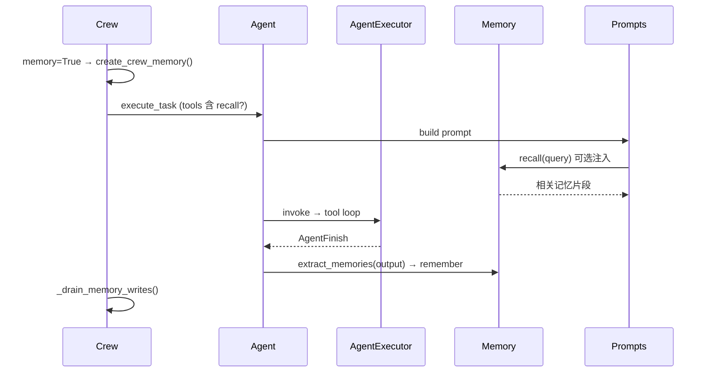
```mermaid
sequenceDiagram
    participant C as Crew
    participant A as Agent
    participant EX as AgentExecutor
    participant M as Memory
    participant P as Prompts

    C->>C: memory=True → create_crew_memory()
    C->>A: execute_task (tools 含 recall?)
    A->>P: build prompt
    P->>M: recall(query) 可选注入
    M-->>P: 相关记忆片段
    A->>EX: invoke → tool loop
    EX-->>A: AgentFinish
    A->>M: extract_memories(output) → remember
    C->>C: _drain_memory_writes()
```

**与 Flow.state 的区别**：`Flow.state` 是 **同一次 flow run 内的 Python 状态**；`Memory` 是 **跨 run 持久化**（向量库 / 配置的后端）。业务编排常用 Flow.state 传中间产物，Memory 做长期偏好/事实。

详见 **§7**；Memory / Knowledge 导读见 [06-memory.md](../../OpenHarness/docs/framework-comparison/06-memory.md)（深潜 · CREWAI、knowledge_CREWAI）；源码：`unified_memory.py`、`knowledge/`、`agent/utils.py`、`utilities/agent_utils.py`。

### 0.10.1 Knowledge（RAG）流程设计

**与 Memory 正交**：`knowledge_sources` 索引 **静态文档 chunk**；每个 Task 前 **LLM 改写 query → 向量检索 → append `task_prompt`**。不进 `messages`，不写回 Memory。

| 挂载 | 构造 | collection | 检索 |
|------|------|------------|------|
| `Crew(knowledge_sources=...)` | `create_crew_knowledge()` → `add_sources()` | `knowledge_crew` | `crew.query_knowledge()` |
| `Agent(knowledge_sources=...)` | `set_knowledge()` | `knowledge_{role}` | `agent.knowledge.query()` |

**Task 内顺序**（`agent/core.py` `execute_task`）：

```text
_prepare_task_execution → _retrieve_memory_context (Memory)
  → handle_knowledge_retrieval (Knowledge)
  → _finalize_task_prompt (Skill / tools)
  → AgentExecutor
```

默认存储：**ChromaDB**（`KnowledgeStorage`）；默认检索：`KnowledgeConfig`（`results_limit=5`, `score_threshold=0.6`）。

深潜：[06-memory.md](../../OpenHarness/docs/framework-comparison/06-memory.md)（深潜 · knowledge_CREWAI §3.2、CREWAI §1.6 压缩与 prompt 拼装）；与 Skill 对比见该文 §5 与本文 §0.11。

---

### 0.11 Skill 流程设计

CrewAI Skill **不是**独立 tool，而是 **Prompt 注入**（与 Cursor/Hermes skill tool 不同）。

```text
Agent(skills=[path]) 或 Crew(skills=[...])
  → setup_agents() / Agent.set_skills()
  → load_skills() → discover_skills() 扫描 SKILL.md
  → activate_skill() 提升到 INSTRUCTIONS 级（crew 级 skill 常自动 activate）
  → Prompts._build_skill_block() → system 内 <skill name="...">...</skill>
  → 进入 AgentExecutor loop（模型按 skill 正文行事，无单独 "load_skill" tool）
```

| 披露级别 | 注入内容 |
|----------|----------|
| `METADATA` | name + description（默认 discover） |
| `INSTRUCTIONS` | 完整 SKILL.md 正文 |
| `RESOURCES` | 含 references 等（视 loader） |

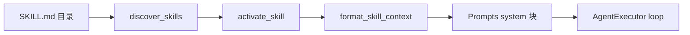
```mermaid
flowchart LR
    S[SKILL.md 目录] --> D[discover_skills]
    D --> A[activate_skill]
    A --> F[format_skill_context]
    F --> P[Prompts system 块]
    P --> EX[AgentExecutor loop]
```

详见 **§8**；可运行示例：`examples/crewai-hermes-demo/skills/brief-writer/`。

### 0.12 主子 Agent / 委托（两种模式）

CrewAI **没有** deepagents 式 `task` 子 graph；多 Agent 协作靠 **Task 图 + 委托工具**。

| 模式 | 何时用 | 谁执行 Task | 如何调用「子 Agent」 |
|------|--------|-------------|----------------------|
| **Sequential** | 线性流水线 | `task.agent` | 可选 **peer 委托**：`allow_delegation=True` → `Delegate work to coworker` |
| **Hierarchical** | Manager 协调 | **恒为 `manager_agent`** | Manager 的 `AgentTools(agents=workers)` → 同一委托工具调 Worker |

**委托工具内部**（`delegate_work_tool.py`）：

```text
Manager/Agent 调用 Delegate work to coworker
  → 解析 coworker role + task 描述
  → target_agent.execute_task(临时 Task)
  → Worker 完整走 AgentExecutor loop
  → 结果字符串返回 Manager 的 Observation
```

**主子 vs 平级**：

- **主子（Hierarchical）**：外层编排者是 Manager；Worker **不**直接接 Task 循环，只被委托调用。
- **平级（Sequential + delegation）**：各 Task 仍由绑定 agent 执行；delegation 是 loop 内的 **可选 shortcut**。

与 OpenHarness 对比：[04-multi-agent.md](../../OpenHarness/docs/framework-comparison/04-multi-agent.md)（CrewAI = MA4 + 委托工具，非 MA1 `task` thread）。

### 0.13 Flow、Crew、Agent 引用与调用关系

**层级（上 → 下）**：

```text
L0 用户 Flow          ConceptsDemoFlow / ResearchFlow
L1  Crew              crew.kickoff()
L2  Agent             agent.execute_task()
L3  AgentExecutor     executor.invoke() → 内层 Flow.kickoff()
```

**谁引用谁**：

| 从 | 到 | 典型写法 |
|----|-----|----------|
| **Flow → Crew** | `@listen` 方法内 | `Crew(...).kickoff(inputs={...})` |
| **Flow → Agent** | 少见；一般经 Crew 或 | `agent.kickoff("...")` |
| **Crew → Agent** | Task 循环 | `task.execute_sync(agent=...)` |
| **Agent → AgentExecutor** | 每次 task | `create_agent_executor().invoke(...)` |
| **Agent → Agent（委托）** | tool call | `Delegate work to coworker` |
| **Crew / Agent → Flow 上下文** | `FlowTrackable` | 在 Flow 内 `Crew()` 自动带 `_flow_id` |

**用户 Flow 嵌 Crew 最小模式**：

```python
from crewai import Agent, Crew, Task
from crewai.flow import Flow, listen, start

class AppFlow(Flow):
    @start()
    def init(self, topic: str):
        self.state["topic"] = topic
        return topic

    @listen(init)
    def run_crew_phase(self, topic: str):
        agent = Agent(role="Analyst", goal="Summarize", backstory="...")
        task = Task(description="Summarize: {topic}", agent=agent)
        crew = Crew(agents=[agent], tasks=[task], memory=True)
        return crew.kickoff(inputs={"topic": topic}).raw

AppFlow().kickoff(inputs={"topic": "..."})
```

**两种 Flow 别混**：

| | 用户 `crewai.flow.Flow` | `AgentExecutor(Flow)` |
|--|-------------------------|------------------------|
| 你写吗？ | ✅ `@start` / `@listen` | ❌ 框架固定 ~30 个 router |
| 调用 | `MyFlow().kickoff()` | `Agent.execute_task()` 内部自动 |
| 状态 | `self.state` 业务字段 | `AgentExecutorState.messages/todos` |

### 0.14 端到端时序（一次完整 run）

下面把 **Flow + Crew + Memory + Skill + Planning + 委托 + tool loop** 叠在一张图里（虚线 = 可选路径）：

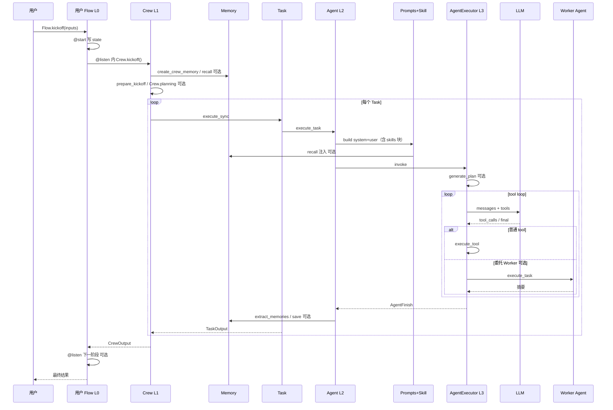
```mermaid
sequenceDiagram
    participant U as 用户
    participant F as 用户 Flow L0
    participant C as Crew L1
    participant M as Memory
    participant T as Task
    participant A as Agent L2
    participant P as Prompts+Skill
    participant EX as AgentExecutor L3
    participant LLM as LLM
    participant W as Worker Agent

    U->>F: Flow.kickoff(inputs)
    F->>F: @start 写 state

    F->>C: @listen 内 Crew.kickoff()
    C->>M: create_crew_memory / recall 可选
    C->>C: prepare_kickoff / Crew.planning 可选

    loop 每个 Task
        C->>T: execute_sync
        T->>A: execute_task
        A->>P: build system+user（含 skills 块）
        P->>M: recall 注入 可选
        A->>EX: invoke
        EX->>EX: generate_plan 可选
        loop tool loop
            EX->>LLM: messages + tools
            LLM-->>EX: tool_calls / final
            alt 普通 tool
                EX->>EX: execute_tool
            else 委托 Worker 可选
                EX->>W: execute_task
                W-->>EX: 摘要
            end
        end
        EX-->>A: AgentFinish
        A->>M: extract_memories / save 可选
        T-->>C: TaskOutput
    end

    C-->>F: CrewOutput
    F->>F: @listen 下一阶段 可选
    F-->>U: 最终结果
```

**读代码顺序（一次 kickoff）**：

```text
flow/runtime/__init__.py     kickoff_async（若用用户 Flow）
crew.py                      kickoff → _execute_tasks
crews/utils.py               prepare_kickoff / prepare_task_execution
task.py                      execute_sync
agent/core.py                execute_task → create_agent_executor
experimental/agent_executor.py  invoke → generate_plan / ReAct routers
utilities/prompts.py         skill + memory 块进 system
memory/unified_memory.py     recall / extract / remember
knowledge/knowledge.py       add_sources / query（Task 前 RAG）
```

### 0.15 章节索引（本文档结构）

| 章节 | 内容 | 与 §0 关系 |
|------|------|------------|
| **§0** | 导航、四层栈、协作、Memory/Skill/委托、端到端图 | **先读** |
| §1–2 | 产品概述、组件鸟瞰 | 背景 |
| §3–4 | Agent 模型、Prompt 组装 | L2 细节 |
| §5 | AgentExecutor loop、Native tools | L3 细节 |
| §6 | MCP、Hooks、Checkpoint、Planning 展开 | 横切 |
| §7–8 | Memory、Knowledge、Skill 源码级 | §0.10–§0.11 深潜；Knowledge 见 [06-memory.md](../../OpenHarness/docs/framework-comparison/06-memory.md) |
| §9 | Tools | L3 工具层 |
| §10 | Crew kickoff、Process | L1 深潜 |
| §11 | 事件总线、用户 Flow、**@router 分支** | L0 深潜 |
| §12 | Lite `agent.kickoff()` | 无 Crew 入口 |
| §14–15 | 框架对比、源码索引 | 查阅 |

---

## 1. 系统概述

CrewAI 是一个**多智能体协作框架**,专注于让多个 Agent 协同工作完成复杂任务。与单 Agent 框架不同,CrewAI 强调**角色分工、层级管理和团队协作**。

### 1.1 核心特性

- **角色驱动设计**:每个 Agent 有明确的 role(角色)、goal(目标)、backstory(背景故事)
- **多 Agent 协作**:支持 Sequential(顺序)、Hierarchical(层级)；Task 级 `async_execution` 并行（**非**独立 `Process.parallel`）
- **工具生态系统**:丰富的内置工具和自定义工具支持
- **记忆系统**:短期记忆(对话历史)+ 长期记忆(向量数据库)
- **技能系统**:可复用的 Skills 模块
- **人类反馈循环**:Human-in-the-loop 机制
- **MCP 集成**:Model Context Protocol 支持
- **事件总线**:基于 `crewai_event_bus` 的事件驱动架构
- **Guardrails**:输出验证和质量控制
- **Checkpointing**:执行状态持久化和恢复

### 1.2 技术栈

- **Python 3.10+**：主开发语言
- **Pydantic**：数据验证和配置管理
- **LangChain**：底层 LLM 抽象（可选）
- **Asyncio**：异步执行支持
- **ChromaDB/Faiss**：向量数据库（记忆系统）

### 1.3 架构要点（对齐 `lib/crewai/src/crewai/`）

- **默认执行器**：`AgentExecutor`（`agent/core.py` → `executor_class=AgentExecutor`）；`CrewAgentExecutor` 已 deprecated
- **Loop**：`while not AgentFinish` + `iterations` 计数；或 `AgentExecutor` 的 Flow `@router` 图
- **消息追加（现代默认）**：`assistant.tool_calls` + `role=tool`（OpenAI Chat Completions 规范）；ReAct 文本路径仅作 legacy fallback
- **Skills**：`Agent.skills` / `Crew.skills` + `SKILL.md` → system prompt `<skills>` 块
- **MCP**：`Agent.mcps` → `MCPToolResolver.resolve()` → 合并进 task tools
- **Checkpoint**：`CheckpointConfig(on_events=...)` 事件驱动；`from_checkpoint()` / `fork()`
- **Hooks**：legacy `register_*_hook` + 新 `@on(InterceptionPoint)` / `HookAborted`

---

## 2. 整体架构

> **高层总图见 §0.3**；五元关系（Flow/Crew/Process/Task/Agent）见 [CREWAI_CORE_ENTITIES.md](./CREWAI_CORE_ENTITIES.md) §1.5。
> 本节：**核心实体** 与组件依赖鸟瞰（与源码一致）。

### 2.1 核心实体关系（含 Task、Process）

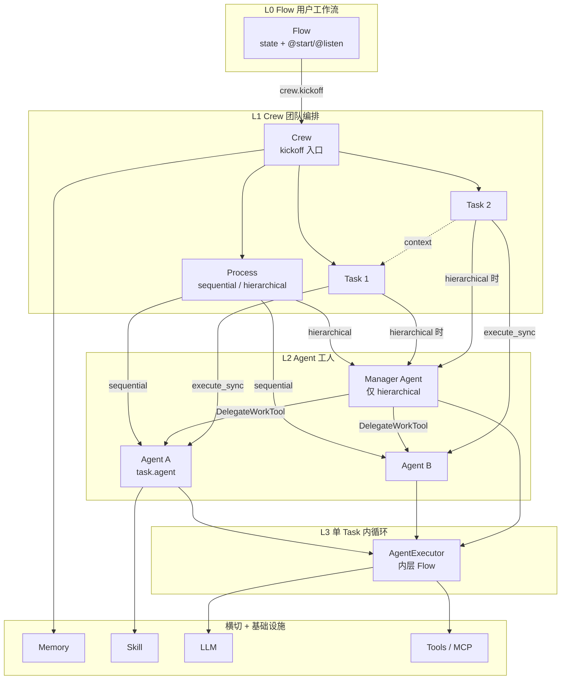
```mermaid
flowchart TB
    subgraph L0["L0 Flow 用户工作流"]
        Flow[Flow<br/>state + @start/@listen]
    end

    subgraph L1["L1 Crew 团队编排"]
        Crew[Crew<br/>kickoff 入口]
        Process[Process<br/>sequential / hierarchical]
        Task1[Task 1]
        Task2[Task 2]
        Crew --> Process
        Crew --> Task1
        Crew --> Task2
        Task2 -.->|context| Task1
    end

    subgraph L2["L2 Agent 工人"]
        A1[Agent A<br/>task.agent]
        A2[Agent B]
        Mgr[Manager Agent<br/>仅 hierarchical]
    end

    subgraph L3["L3 单 Task 内循环"]
        Exec[AgentExecutor<br/>内层 Flow]
    end

    subgraph X["横切 + 基础设施"]
        Mem[Memory]
        Skill[Skill]
        LLM[LLM]
        Tools[Tools / MCP]
    end

    Flow -->|crew.kickoff| Crew

    Process -->|sequential| A1
    Process -->|sequential| A2
    Process -->|hierarchical| Mgr
    Mgr -->|DelegateWorkTool| A1
    Mgr -->|DelegateWorkTool| A2

    Task1 -->|execute_sync| A1
    Task2 -->|execute_sync| A2
    Task1 -->|hierarchical 时| Mgr
    Task2 -->|hierarchical 时| Mgr

    A1 --> Exec
    A2 --> Exec
    Mgr --> Exec

    Crew --> Mem
    A1 --> Skill
    Exec --> LLM
    Exec --> Tools
```

**读图要点**：

1. **Task** 是 Crew 内的**单个工作单**；`tasks[]` 是有序列表，`_execute_tasks()` 按顺序逐个取出 Task 交给 Agent 执行（Task 本身不是队列）。
2. **Process** 是 Crew 上的**策略字段**（`process.py` 枚举），决定每个 Task 调用 `_get_agent_to_use()` 时返回 `task.agent` 还是 `manager_agent`。
3. **Flow** 在 L0，可串多个 Crew；**Task** 在 L1，不跨 Crew（跨阶段用 `Flow.state`）。
4. hierarchical 时 **Task 仍线性执行**，但执行者是 Manager；Worker 通过委托工具在 Manager 的 `execute_task` 内被调用。

### 2.2 组件与集成层（鸟瞰）

```mermaid
graph TB
    subgraph UI["User Interface"]
        CLI[CLI]
        SDK[Python SDK]
    end

    subgraph Core["核心实体（用户代码直接构造）"]
        FlowE[Flow]
        CrewE[Crew + Process]
        TaskE[Task]
        AgentE[Agent]
    end

    subgraph Runtime["运行时引擎"]
        Prep[prepare_kickoff]
        Loop[_execute_tasks]
        Executor[AgentExecutor]
    end

    subgraph Support["横切组件"]
        Prompt[Prompt Builder]
        Memory[Memory System]
        Tools[Tool Registry]
    end

    subgraph External["外部集成"]
        LLM[LLM Providers]
        VectorDB[Vector DB]
        MCP[MCP Servers]
    end

    CLI --> FlowE
    SDK --> CrewE

    FlowE --> CrewE
    CrewE --> Prep --> Loop
    Loop --> TaskE
    TaskE --> AgentE --> Executor

    AgentE --> Prompt
    AgentE --> Memory
    AgentE --> Tools

    Executor --> LLM
    Memory --> VectorDB
    Tools --> MCP
```

### 2.3 实体对照表

| 实体 | 源码 | 在架构中的角色 |
|------|------|----------------|
| **Flow** | `flow/` | L0 业务编排；`kickoff(inputs)` → state |
| **Crew** | `crew.py` | L1 容器：`agents[]` + `tasks[]` + `memory` |
| **Process** | `process.py` | L1 策略：每 Task 用哪个 Agent 执行 |
| **Task** | `task.py` | L1 工作单：description、`context[]`、`task.agent` |
| **Agent** | `agent/core.py` | L2 执行者：`execute_task(task)` |
| **AgentExecutor** | `experimental/agent_executor.py` | L3 内层 Flow：ReAct / plan-and-execute |

---

## 3. Agent 核心设计

### 3.1 Agent 定义

```python
# crewai/agent/core.py:147-300

class Agent(BaseAgent):
    """
    Represents an agent in a system.

    Each agent has a role, a goal, a backstory, and an optional language model (llm).
    The agent can also have memory, can operate in verbose mode, and can delegate tasks to other agents.

    Attributes:
        role: The role of the agent.
        goal: The objective of the agent.
        backstory: The backstory of the agent.
        llm: The language model that will run the agent.
        tools: Tools at agents disposal
        allow_delegation: Whether the agent is allowed to delegate tasks to other agents.
        memory: Whether the agent should have memory enabled.
        knowledge: The knowledge base of the agent.
    """

    # 核心属性
    role: str = Field(..., description="The role of the agent")
    goal: str = Field(..., description="The objective of the agent")
    backstory: str = Field(..., description="The backstory of the agent")

    # LLM 配置
    llm: str | BaseLLM | None = Field(
        default=None,
        description="Language model that will run the agent"
    )
    function_calling_llm: str | BaseLLM | None = Field(
        default=None,
        description="Language model for tool calling"
    )

    # 行为控制
    max_iter: int = Field(
        default=25,
        description="Maximum number of iterations for an agent to execute a task"
    )
    max_rpm: int | None = Field(
        default=None,
        description="Maximum number of requests per minute"
    )
    verbose: bool = Field(
        default=False,
        description="Whether the agent execution should be in verbose mode"
    )
    allow_delegation: bool = Field(
        default=True,
        description="Whether the agent is allowed to delegate tasks"
    )

    # 工具与知识
    tools: list[BaseTool] = Field(
        default_factory=list,
        description="Tools at agents disposal"
    )
    knowledge_sources: list[BaseKnowledgeSource] = Field(
        default_factory=list,
        description="Knowledge sources for the agent"
    )

    # 记忆系统
    memory: bool = Field(
        default=False,
        description="Whether the agent should have memory enabled"
    )

    # 高级功能
    planning: bool = Field(
        default=False,
        description="Whether the agent should plan before executing"
    )
    reasoning: bool = Field(
        default=False,
        deprecated=True,
        description="[DEPRECATED] Use planning_config instead"
    )
```

**关键设计理念**：
- ✅ **Role-Playing**：通过 role + goal + backstory 塑造 Agent 人格
- ✅ **职责单一**：每个 Agent 专注特定领域
- ✅ **可组合性**：多个 Agent 组成 Crew 协同工作

---

## 4. Prompt 系统设计

### 4.1 Prompt 组成结构

CrewAI 的 Prompt 采用**模块化组装**策略，由以下组件构成：

```mermaid
graph LR
    A[Role Playing<br/>角色设定] --> E[Complete Prompt<br/>完整提示词]
    B[Tools<br/>工具说明] --> E
    C[Task<br/>任务描述] --> E
    D[Context<br/>上下文信息] --> E

    style A fill:#e1f5ff
    style B fill:#fff4e1
    style C fill:#e8f5e9
    style D fill:#fce4ec
```

### 4.2 完整的 Prompt 模板（翻译为中文）

#### 组件 1: Role Playing（角色扮演）

```markdown
你是 {role}。{backstory}
你的个人目标是：{goal}
```

**实际示例**：
```markdown
你是 Senior Software Engineer。你是一位经验丰富的软件工程师，擅长编写高质量、可维护的代码。你对最佳实践和设计模式有深入的理解。
你的个人目标是：为项目实现一个高性能的数据处理管道
```

---

#### 组件 2: Tools（工具说明 - ReAct 模式）

```markdown
你只能使用以下工具，永远不要编造未列出的工具：

{tools}

重要：在你的响应中使用以下格式：

```
Thought: 你应该始终思考下一步该做什么
Action: 要采取的行动，只能是 [{tool_names}] 中的一个名称，完全按照书写方式
Action Input: 行动的输入，一个简单的 JSON 对象，用花括号包裹，使用双引号包裹键和值
Observation: 行动的结果
```

一旦收集到所有必要信息，返回以下格式：

```
Thought: 我现在知道最终答案了
Final Answer: 对原始输入问题的最终答案
```
```

**实际示例**：
```markdown
你只能使用以下工具，永远不要编造未列出的工具：

- search_web: Search the web for information
- read_file: Read content from a file
- write_file: Write content to a file

重要：在你的响应中使用以下格式：

```
Thought: 我应该先搜索最新的信息
Action: search_web
Action Input: {"query": "Python async best practices 2026"}
Observation: Found 5 relevant articles about async patterns...
```

一旦收集到所有必要信息，返回以下格式：

```
Thought: 我现在知道最终答案了
Final Answer: 基于搜索结果，推荐使用 asyncio.gather() 进行并发操作...
```
```

---

#### 组件 3: Task（任务描述）

```markdown
当前任务：{input}

开始！这对你非常重要，使用可用的工具并给出你最好的最终答案，你的工作取决于此！

Thought:
```

**实际示例**：
```markdown
当前任务：分析 GitHub 仓库 https://github.com/example/repo 的代码质量，并提供改进建议

开始！这对你非常重要，使用可用的工具并给出你最好的最终答案，你的工作取决于此！

Thought:
```

---

#### 组件 4: No Tools（无工具模式）

```markdown
当前任务：{input}

提供你的完整回答：
```

用于不需要工具调用的简单问答场景。

---

#### 组件 5: Native Tools（原生工具调用）

当 LLM 支持原生 Function Calling 时，不使用 ReAct 格式，而是直接注入工具 Schema：

```markdown
当前任务：{input}
```

工具定义通过 OpenAI Function Calling 格式传递，不在 Prompt 中显示。

---

### 4.3 Prompt 组装流程

```python
# crewai/utilities/prompts.py:75-120

def task_execution(self) -> SystemPromptResult | StandardPromptResult:
    """
    生成任务执行的标准 Prompt

    返回：
        包含构建的 Prompt 的字典
    """
    slices: list[COMPONENTS] = ["role_playing"]

    # 根据是否有工具选择对应的指令
    if self.has_tools:
        if not self.use_native_tool_calling:
            # ReAct 模式：添加工具说明
            slices.append("tools")
    else:
        # 无工具模式
        slices.append("no_tools")

    # 构建 System Prompt
    system: str = self._build_prompt(slices)

    # 确定任务部分使用哪个模板
    task_slice: COMPONENTS
    if self.use_native_tool_calling:
        task_slice = "native_task"  # 原生工具调用
    elif self.has_tools:
        task_slice = "task"  # ReAct 模式
    else:
        task_slice = "task_no_tools"  # 无工具

    slices.append(task_slice)

    # 如果使用 System Prompt 模式，分离 system 和 user
    if (
        not self.system_template
        and not self.prompt_template
        and self.use_system_prompt
    ):
        return SystemPromptResult(
            system=system,  # System message
            user=self._build_prompt([task_slice]),  # User message
            prompt=self._build_prompt(slices),  # 完整 Prompt
        )

    # 否则返回单个 Prompt
    return StandardPromptResult(
        prompt=self._build_prompt(
            slices,
            self.system_template,
            self.prompt_template,
            self.response_template,
        )
    )
```

**组装逻辑**：
1. **始终包含**：`role_playing`（角色设定）
2. **条件包含**：
   - 有工具 + ReAct 模式 → `tools`
   - 有工具 + 原生调用 → `native_tools`（空字符串）
   - 无工具 → `no_tools`（空字符串）
3. **任务部分**：
   - 原生调用 → `native_task`
   - ReAct → `task`
   - 无工具 → `task_no_tools`

---

### 4.4 运行时完整的 Prompt 示例

假设我们有一个 Research Agent：

```python
from crewai import Agent, Task, Crew

researcher = Agent(
    role="Senior Research Analyst",
    goal="Uncover cutting-edge developments in AI",
    backstory="""You are an experienced research analyst with a keen eye for
    identifying emerging trends. You have a PhD in Computer Science and have
    published numerous papers on AI topics.""",
    tools=[search_web, read_file],
    verbose=True
)
```

**生成的完整 System Prompt**：

```markdown
你是 Senior Research Analyst。你是一位经验丰富的研究分析师，擅长识别新兴趋势。你拥有计算机科学博士学位，并发表了大量关于 AI 主题的论文。
你的个人目标是：Uncover cutting-edge developments in AI

你只能使用以下工具，永远不要编造未列出的工具：

- search_web: Search the web for information using various search engines
  Arguments: {"query": {"type": "string", "description": "Search query"}}

- read_file: Read content from a file
  Arguments: {"file_path": {"type": "string", "description": "Path to the file"}}

重要：在你的响应中使用以下格式：

```
Thought: 你应该始终思考下一步该做什么
Action: 要采取的行动，只能是 [search_web, read_file] 中的一个名称，完全按照书写方式
Action Input: 行动的输入，一个简单的 JSON 对象，用花括号包裹，使用双引号包裹键和值
Observation: 行动的结果
```

一旦收集到所有必要信息，返回以下格式：

```
Thought: 我现在知道最终答案了
Final Answer: 对原始输入问题的最终答案
```
```

**生成的 User Prompt**：

```markdown
当前任务：Research the latest developments in large language models and summarize key findings

开始！这对你非常重要，使用可用的工具并给出你最好的最终答案，你的工作取决于此！

Thought:
```

---

### 4.5 Prompt 缓存与优化

#### 尊重上下文窗口

```python
# crewai/agent/core.py:215-218

respect_context_window: bool = Field(
    default=True,
    description="Keep messages under the context window size by summarizing content"
)
```

当对话历史接近模型上下文限制时，自动触发摘要：

```python
# crewai/utilities/agent_utils.py

def handle_context_length(messages: list[LLMMessage]) -> list[LLMMessage]:
    """
    处理上下文长度超限

    策略：
    1. 保留最近的 N 条消息
    2. 将早期消息压缩为摘要
    3. 保留重要的工具调用结果
    """

    # 计算当前 token 数
    current_tokens = count_tokens(messages)

    if current_tokens > MAX_CONTEXT_TOKENS * 0.8:  # 80% 阈值
        # 触发摘要
        summarized = summarize_early_messages(messages)
        return summarized

    return messages
```

---

## 5. Agent 执行流程

### 5.0 执行引擎、Loop 与消息追加（源码对齐）

#### 5.0.1 用哪个 Executor？

```python
# lib/crewai/src/crewai/agent/core.py

class Agent(BaseAgent):
    executor_class: type[CrewAgentExecutor] | type[AgentExecutor] = Field(
        default=AgentExecutor,  # ← 默认
        ...
    )
```

`Agent.create_agent_executor()` 实例化 `executor_class`。Crew 内 `setup_agents()` 会为每个 agent 调用它。`CrewAgentExecutor` 仍可用，但启动时会打 `DeprecationWarning`。

#### 5.0.2 端到端调用链

```text
crew.kickoff()
  → Crew._run_sequential / hierarchical / ...
    → Task.execute_sync / execute_async
      → Agent.execute_task(task)
        → create_agent_executor(tools, task)
        → agent_executor.invoke({"task": prompt, ...})
```

`invoke()` 共性步骤（`CrewAgentExecutor` 与 `AgentExecutor` 一致）：

1. **重置状态**：`messages = []`，`iterations = 0`（resume 时跳过）
2. **`_setup_messages(inputs)`**：写入初始 LLM 消息
3. **`_inject_multimodal_files`**（如有文件）
4. **进入 loop / Flow**
5. **`_save_to_memory`** → 返回 `{"output": ...}`

#### 5.0.3 初始消息如何构建（`_setup_messages`）

```python
# crew_agent_executor.py / agent_executor.py（逻辑相同）

# SystemPromptResult（有 system + user 两段）
messages.append(format_message_for_llm(system_prompt, role="system"))  # + cache breakpoint
messages.append(format_message_for_llm(user_prompt))                    # role 默认 user

# StandardPromptResult（仅一段 prompt）
messages.append(format_message_for_llm(user_prompt))
```

`user_prompt` 来自 `Prompts.build()`，包含 role/goal/backstory、工具说明、任务描述、上下文、记忆片段，以及 **`<skills>...</skills>` 块**（若 agent 配置了 skills）。

#### 5.0.4 Loop 结构对比

**A. `CrewAgentExecutor`（deprecated，但逻辑最直观）**

```python
def _invoke_loop(self) -> AgentFinish:
    if llm.supports_function_calling() and self.original_tools:
        return self._invoke_loop_native_tools()
    return self._invoke_loop_react()

def _invoke_loop_react(self) -> AgentFinish:
    formatted_answer = None
    while not isinstance(formatted_answer, AgentFinish):
        if has_reached_max_iterations(self.iterations, self.max_iter):
            return handle_max_iterations_exceeded(...)  # 额外 LLM 调用要最终答案
        answer = get_llm_response(llm, messages=self.messages, ...)
        formatted_answer = process_llm_response(answer, ...)
        if isinstance(formatted_answer, AgentAction):
            tool_result = execute_tool_and_check_finality(...)
            formatted_answer = self._handle_agent_action(formatted_answer, tool_result)
        self._invoke_step_callback(formatted_answer)
        self._append_message(formatted_answer.text)   # 默认 role=assistant
        ...
        finally:
            self.iterations += 1
```

要点：

- 循环条件是 **`while not AgentFinish`**，不是 `for range(max_iter)`
- **`iterations` 在 `finally` 里 +1**，与 `has_reached_max_iterations(iterations, max_iter)` 配合（`iterations >= max_iter` 时触发强制收尾）

**B. `AgentExecutor`（默认，基于 Flow）**

Flow 节点（简化）：

```text
generate_plan (可选)
  → initialize_reasoning
  → check_max_iterations ─┬→ force_final_answer
                          ├→ continue_reasoning_native (native tools)
                          └→ continue_reasoning (ReAct 文本)
  → call_llm_* → route_by_answer_type
      ├→ execute_tool_action → check_todo_completion → ...
      └→ agent_finished → finalize
  → increment_and_continue → check_max_iterations (下一轮)
```

状态保存在 `AgentExecutorState.messages`，通过 `self.state.messages` 与 `self.messages` 属性同步。

#### 5.0.5 每轮迭代中 messages 如何增长（Native 为主）

> **对比基线（2026）**：主流模型（GPT-4o+、Claude 3.5+、Gemini 2+ 等）均支持 **Native Tool Calling**。下文以 OpenAI Chat Completions 消息规范为对照；跨框架对比见 **§5.0.8**。

**Native 路径（`supports_function_calling()` 且 agent 有 tools 时默认）**

| 场景 | 追加方式 | role | 源码位置 |
|------|---------|------|---------|
| LLM 决定调工具 | `assistant` 含 `tool_calls: [{id, name, arguments}]` | `assistant` | `execute_native_tool` |
| 工具执行完成 | `{tool_call_id, name, content}` | `tool` | `execute_native_tool` |
| 最终答案 | `content` 文本，无 `tool_calls` | `assistant` | `AgentFinish` |
| 解析/校验失败 | 错误提示 | `user` 或 `tool` | `handle_output_parser_exception` |
| 超 iter 强制收尾 | 带 `force_final_answer` 的 assistant | `assistant` | `handle_max_iterations_exceeded` |

**典型一轮（与 Hermes / LangGraph 一致）**：

```text
[0] system:   role/goal/tools/skills/记忆…
[1] user:     任务描述
[2] assistant: { tool_calls: [{ id: "call_1", name: "web_search", arguments: {...} }] }
[3] tool:      { tool_call_id: "call_1", name: "web_search", content: "..." }
[4] assistant: Final Answer: ...
```

**Legacy ReAct 文本路径（仅 fallback）**

| 场景 | 追加方式 | role |
|------|---------|------|
| ReAct 工具执行后 | `action.text` + `\nObservation: {result}` 拼成一段再 append | `assistant` |
| ReAct 后再推理 | `post_tool_reasoning` | `user` |

CrewAI 在 native 不可用或 `_downgrade_to_text_tool_calling` 时才走 ReAct；**生产环境应确保走 Native**（`function_calling_llm`、模型支持 tools schema）。

#### 5.0.6 完整工具调用示例（Native）

```python
"""最小可运行示例：Agent + Tool + Crew.kickoff()"""
from crewai import Agent, Crew, Task
from crewai.tools import tool


@tool("Search the web for current information")
def web_search(query: str) -> str:
    """Run a web search and return snippets."""
  # 生产环境替换为真实搜索 API
    return f"[mock] Top results for '{query}': (1) CrewAI docs (2) Agent patterns"


researcher = Agent(
    role="Senior Researcher",
    goal="Gather accurate, cited facts",
    backstory="You verify claims before writing.",
    tools=[web_search],
    verbose=True,
    max_iter=5,
)

research_task = Task(
    description="Research the state of multi-agent frameworks in 2026.",
    expected_output="Bullet list of 3 trends with one sentence each.",
    agent=researcher,
)

crew = Crew(agents=[researcher], tasks=[research_task])
result = crew.kickoff()
print(result.raw)
```

**运行时消息演变（Native，推荐）**：

```text
[2] assistant: tool_calls=[{id, name: web_search, arguments}]
[3] tool:      tool_call_id=…, content="[mock] Top results…"
[4] assistant: Final Answer: 1. …
```

<details>
<summary>Legacy ReAct 文本路径（fallback，不推荐）</summary>

```text
[2] assistant: Thought… Action… Action Input… \nObservation: …
[3] user:    <post_tool_reasoning>
[4] assistant: Thought… Final Answer…
```

</details>

#### 5.0.7 Skills

Agent / Crew 支持 `skills` 字段，在 system prompt 注入 `<skills>` 块（非独立 tool）。详见 **§8 Skills 系统**。

#### 5.0.8 Native Tool Calling 跨框架对比（2026 基线）

> **前提**：对比统一假设模型与 Provider **已支持 Native Tool Calling**（`tools` JSON Schema + `tool_calls` 响应）。ReAct 纯文本解析、GPTs 后台 Actions、Assistants 托管线程等 **不纳入主矩阵**（见脚注）。

##### 规范消息形态（OpenAI Chat Completions 族）

```mermaid
sequenceDiagram
    participant Runner as Agent Loop
    participant API as LLM API
    participant T as Tools

    Runner->>API: messages + tools schema
    API-->>Runner: assistant with tool_calls
    loop each tool call
        Runner->>T: execute(name, args)
        T-->>Runner: result
        Runner->>Runner: append role=tool message
    end
    Runner->>API: updated messages
    API-->>Runner: assistant final text
```

**硬性约束**（各框架压缩/恢复时都要维护）：

- 每条 `assistant.tool_calls[i]` 必须有对应 `role=tool` 且 `tool_call_id` 匹配
- 不允许把 `tool_calls` 与工具结果塞进同一条 `assistant.content`（会与 Provider 校验冲突）
- `thinking` / `reasoning` 与 `tool_calls` 是 **不同字段**（Claude extended thinking、OpenAI reasoning 等），不能当 ReAct 文本混用

##### Thinking / Reasoning 与 messages 生命周期

> **结论先行**：thinking 是 **本轮模型的推理输出**，不是 tool result；**是否写回下一轮请求** 因 Provider 而异；**计费**上先生成算 **输出**，若保留在 history 里则后续轮次再算 **输入**。

**和 tool 的本质区别**

| | `tool_calls` + `tool` | `thinking` / `reasoning` |
|--|----------------------|---------------------------|
| 语义 | 调用外部工具 + 执行结果 | 模型内部推理轨迹 |
| 副作用 | ✅ 有（跑 shell、读文件…） | ❌ 无 |
| 下轮是否必带 | ✅ `tool_call_id` 必须配对 | ⚠️ **看 Provider / 框架** |
| 能否当普通 `content` 省略 | ❌ 会破坏 tool 链 | ⚠️ 部分 Provider 允许省略，部分会 400 |

**Provider：是否回传给下一轮 API**

| Provider / 模式 | 下轮是否需带回 | 典型形态 | 说明 |
|-------------------|----------------|----------|------|
| **Claude extended thinking** | **是** | `content` 内 `thinking` 块 + 正文 / `tool_use` | 多轮时 assistant 消息需 **结构完整**，缺 thinking 块可能报错 |
| **OpenAI reasoning（o 系列等）** | **否（应用层）** | `usage.completion_tokens_details.reasoning_tokens` | 推理在服务端完成，**不暴露**给你拼进 `messages` |
| **DeepSeek / Moonshot 等** | **常是** | 独立字段 `reasoning_content` | 带 `tool_calls` 的 assistant 若缺 `reasoning_content`，部分 API 会拒收 |
| **Gemini thinking** | **视配置** | `thinkingConfig` / thought parts | 可只返回 summary；是否持久化进 history 依 SDK 与 `includeThoughts` |
| **普通模型无 thinking** | — | 无 | 仅 `content` + 可选 `tool_calls` |

**成本归属（两轮示例）**

```text
Round 1 请求
  输入计费：system + user + tools schema + history
  输出计费：assistant.content + tool_calls 字段
           + reasoning / thinking tokens（若 Provider 单列，仍属「模型生成」）

Round 2 请求（history 含上一轮 assistant + tool + 可选 reasoning）
  输入计费：上述全部再次计入 input（history 越长越贵）
  输出计费：本轮新生成内容
```

| 阶段 | 计费桶 | 备注 |
|------|--------|------|
| 模型 **生成** thinking | **Output**（或 `reasoning_tokens` 子项） | 与可见正文分开计价时，单价可能不同 |
| thinking **留在 SessionDB / messages** | 下轮变为 **Input** | 压缩策略常会剥旧 reasoning 以省 input |
| tools schema 每轮重传 | **Input** | 与 thinking 无关，但同样占上下文 |

**框架行为（Native 基线）**

| 框架 | 持久化 | 下轮回传 API | 压缩 / 观测 |
|------|--------|--------------|-------------|
| **Hermes** | `reasoning` 写入 trajectory；部分嵌入 `<think>` | `_copy_reasoning_content_for_api()` **对所有 assistant 消息** 复制到 `reasoning_content`（Moonshot 等硬性要求） | `llm_thinking_chunk` / `reasoning.available` 流式事件；压缩时与 tool pair 一并治理 |
| **CrewAI** | 流式 `llm_thinking_chunk` 事件 | 依底层 LLM 适配器；无统一 thinking 块规范 | 观测为主，compress 路径弱于 Hermes |
| **deepagents / LangChain** | `AIMessage.additional_kwargs` / provider 字段 | `bind_tools` + provider 自动处理 | SummarizationMiddleware 可能摘要旧轮 |
| **OpenAI Agents SDK** | reasoning items 在 run 内 | SDK 管理，应用层通常不手拼 | `reasoning` 与 `function_call` 分轨 |

**设计建议（写 Agent 框架时）**

1. **不要把 reasoning 拼进 `tool` 消息或 Observation 文本**——与 Native tool 规范正交。
2. **按 Provider 决定是否在 `api_messages` 中回传** `reasoning_content` / thinking 块，不要假设「思考一次就扔」。
3. **压缩时单独策略**：可剥旧 reasoning 降 input，但勿破坏 **tool_call ↔ tool** 配对。
4. **账单展示**：对用户说明 reasoning 多为 **输出成本**；长会话若保留全量 thinking，**后续 input 会涨**。

##### 主矩阵

| 维度 | CrewAI | Hermes | deepagents / deer-flow | OpenAI Agents SDK | AutoGen AgentChat |
|------|--------|--------|------------------------|-------------------|-------------------|
| **工具 Schema 注入** | 每轮 `tools` 参数（native 路径） | 每轮 `tools` in completion | LangChain `bind_tools` → API | `tools` on run | `tools` on model client |
| **调用表达** | `assistant.tool_calls[]` | 同左 | `AIMessage.tool_calls` | `response.output` tool items | `FunctionCall` in message |
| **结果表达** | `role=tool` + `tool_call_id` | 同左 | `ToolMessage` | `function_call_output` | `FunctionExecutionResultMessage` |
| **并行多工具** | ✅ 单条 assistant 多个 `tool_calls` | ✅ | ✅ | ✅（batch executor） | ✅ |
| **MCP 桥接** | 解析为普通 tool schema 合并 | runtime MCP → dict tools | LangChain MCP 适配 | MCP server tools | `McpWorkbench` |
| **tool 配对修复** | 依赖 messages 完整性 | `_sanitize_tool_pairs` 压缩后 | `PatchToolCallsMiddleware` | SDK 内置 | 上下文裁剪需注意 |
| **Thinking 分离** | `llm_thinking_chunk` 流式；回传依 LLM 适配器 | `reasoning_content` 回传 API（§5.0.8） | provider / kwargs | reasoning items | 视 model client |
| **Legacy fallback** | ReAct 文本（Observation 拼 assistant） | ❌ 无 | ❌ 无 | ❌ 无 | 部分旧示例仍用文本 |

##### CrewAI 在 Native 基线下的位置

| 项 | 评价 |
|----|------|
| **与规范对齐** | Native 路径与 Hermes/LangGraph **同构**，无「Observation 拼 assistant」问题 |
| **差异点** | 仍保留 ReAct fallback；Prompt 层还有 `tools` / `native_tools` 双模板（§4） |
| **选型建议** | 确认 `llm.supports_function_calling()`；必要时 `function_calling_llm` 单独指定；禁用或避免触发 `_downgrade_to_text_tool_calling` |
| **与 GPTs 区别** | GPTs = ChatGPT 产品内预配助手；Native = **每次 API 请求**由框架传入 `tools`，非 OpenAI 后台保存 |

##### 脚注：不纳入主矩阵的模式

| 模式 | 说明 |
|------|------|
| **ReAct 文本** | `Action:` / `Observation:` 写在 `content` 里；仅老模型或无 tools API 时使用 |
| **GPTs / ChatGPT Actions** | 用户在 OpenAI 产品 UI 配置，非运行时 `tools` 参数 |
| **OpenAI Assistants API** | 服务端 Thread + 预注册 tools；与 Chat Completions 一轮一传不同 |
| **Cursor Skill tool** | Skill 以 tool 形式按需加载；语义层不同，底层仍多为 native tool_calls |

---

### 5.1 核心执行循环（Native Tool Calling）

> 下图以 **Native 路径** 为主；ReAct fallback 见 §5.0.5 Legacy 表。

```mermaid
sequenceDiagram
    participant User as 用户
    participant Crew as Crew Manager
    participant Agent as Agent
    participant Executor as AgentExecutor
    participant LLM as LLM Provider
    participant Tools as Tool Registry

    User->>Crew: kickoff(task)
    Crew->>Agent: execute_task(task)

    Note over Agent: 构建 Prompt + create_agent_executor
    Agent->>Executor: invoke(inputs)
    Executor->>Executor: _setup_messages (system/user)

    loop while not AgentFinish and iterations < max_iter
        Executor->>LLM: chat(messages, tools=schema)
        LLM-->>Executor: assistant + tool_calls 或 final text

        alt tool_calls 非空
            Executor->>Executor: append assistant(tool_calls)
            Executor->>Tools: execute (可并行)
            Tools-->>Executor: results
            Executor->>Executor: append tool(role=tool) × N
        else Final Answer
            Executor-->>Agent: AgentFinish
        end

        Executor->>Executor: iterations += 1
    end

    Agent-->>Crew: task_output
    Crew-->>User: CrewOutput
```

---
### 5.2 多 Agent 协作流程

#### Sequential Process（顺序流程）

```mermaid
graph LR
    A[Task 1<br/>Researcher] --> B[Task 2<br/>Writer]
    B --> C[Task 3<br/>Reviewer]
    C --> D[Final Output]
```

```python
from crewai import Agent, Task, Crew

researcher = Agent(role="Researcher", goal="Research topic")
writer = Agent(role="Writer", goal="Write article")
reviewer = Agent(role="Reviewer", goal="Review and improve")

tasks = [
    Task(description="Research AI trends", agent=researcher),
    Task(description="Write blog post", agent=writer, context=[tasks[0]]),
    Task(description="Review article", agent=reviewer, context=[tasks[1]]),
]

crew = Crew(agents=[researcher, writer, reviewer], tasks=tasks, process="sequential")
result = crew.kickoff()
```

---

#### Hierarchical Process（层级流程）

> **Manager 是谁**：只传 `manager_llm` 时，Manager **不是** `agents[]` 中的 researcher/writer/reviewer，而是 `kickoff()` 里 `_create_manager_agent()` **自动创建**的 **"Crew Manager"**（`manager_llm` 驱动）；`agents[]` 仅为 Worker 池，经委托工具被调用。也可传 `manager_agent=` 自定义 Manager（不得出现在 `agents[]`）。

```mermaid
flowchart TB
    subgraph workers["agents 列表 — Worker 池"]
        A[researcher]
        B[writer]
        C[reviewer]
    end

    subgraph manager["manager_agent — 执行所有 Task"]
        M["Crew Manager<br/>llm = manager_llm"]
        MT["AgentTools 委托工具"]
    end

    T1[Task 1] --> M
    T2[Task 2] --> M
    T3[Task 3] --> M
    M --> MT
    MT --> A
    MT --> B
    MT --> C
    M --> Final[Final Output]
```

```python
crew = Crew(
    agents=[researcher, writer, reviewer],  # Worker，不直接 execute_task(crew task)
    tasks=tasks,
    process="hierarchical",
    manager_llm=ChatOpenAI(model="gpt-4"),  # 自动 Manager 的 LLM
)
```

Manager Agent 在运行时负责：

1. **执行** Crew 的每个 Task（`_get_agent_to_use` 恒返回 `manager_agent`）
2. 通过 **Delegate work to coworker** 把子工作派给合适的 Worker
3. 整合 Worker 返回的 Observation，产出 Task 最终答案
4. **不是** kickoff 前单独 `plan_tasks()` 生成子任务 DAG


---

## 6. 扩展能力（MCP / Hooks / Checkpoint / Streaming 等）

> 源码根目录：`lib/crewai/src/crewai/`。本章为 2026-07 源码对齐版。

#### 6.1 MCP（Model Context Protocol）

CrewAI 将 MCP 工具 **在任务执行前动态合并** 进 agent tools，而不是单独的 MCP runtime。

**配置入口**

| 层级 | 字段 / API | 说明 |
|------|-----------|------|
| Agent | `mcps: list[str \| MCPServerConfig]` | 每个 agent 声明要连的 MCP |
| Crew 项目类 | `mcp_server_params` + `get_mcp_tools()` | `@CrewBase` 装饰器项目，用 `crewai_tools.MCPServerAdapter` |
| 解析器 | `MCPToolResolver` | `crewai/mcp/tool_resolver.py` |

**三种引用形式**（`MCPToolResolver.resolve`）：

```python
from crewai import Agent, Crew, Task
from crewai.mcp.config import MCPServerStdio, MCPServerHTTP

agent = Agent(
    role="Ops",
    goal="Use external tools",
    backstory="...",
    mcps=[
        # 1) 原生配置对象（Stdio / HTTP / SSE）
        MCPServerStdio(command="npx", args=["-y", "@modelcontextprotocol/server-filesystem", "/tmp"]),
        MCPServerHTTP(url="https://mcp.example.com/mcp", headers={"Authorization": "Bearer ..."}),
        # 2) 外部 HTTPS URL
        "https://mcp.example.com/api",
        # 3) CrewAI AMP 已连接集成（bare slug 或 legacy crewai-amp: 前缀）
        "notion",           # 全部工具
        "notion#search",    # 仅 search 工具
    ],
)
```

**执行时注入链**

```text
Crew._prepare_task_execution()
  → 若 task.agent.mcps 非空：Crew._add_mcp_tools()
    → Agent.get_mcp_tools(mcps)
      → MCPToolResolver.resolve()  # 连接、list_tools、包装为 BaseTool
    → Crew._merge_tools(task_tools, mcp_tools)
  → Agent.execute_task()  # MCP 工具与本地 @tool 无差别参与 loop
```

传输实现：`mcp/transports/{stdio,sse,http}.py` + `MCPClient`。连接/工具执行超时可配置（resolver 内 `MCP_CONNECTION_TIMEOUT=10s` 等）。事件：`mcp_connection_*`、`mcp_tool_execution_*`、`mcp_config_fetch_failed`。

**完整示例（本地 stdio MCP + 任务）**

```python
from crewai import Agent, Crew, Task
from crewai.mcp.config import MCPServerStdio

researcher = Agent(
    role="File Analyst",
    goal="Read and summarize files",
    backstory="You use MCP filesystem tools.",
    mcps=[MCPServerStdio(command="npx", args=["-y", "@modelcontextprotocol/server-filesystem", "/tmp"])],
    verbose=True,
)

task = Task(
    description="List files in the workspace and summarize README if present.",
    expected_output="Short bullet summary.",
    agent=researcher,
)

result = Crew(agents=[researcher], tasks=[task]).kickoff()
print(result.raw)
```

> `@CrewBase` 项目还可在类上设 `mcp_server_params`，`after_kickoff` 自动 `close_mcp_server` 清理连接。

---

#### 6.2 Hooks（LLM / Tool 拦截）

两套 API **并存**，底层统一到 `hooks/dispatch.py`：

| 风格 | 注册方式 | 阻断方式 |
|------|---------|---------|
| Legacy | `register_before_llm_call_hook(fn)` / `register_before_tool_call_hook(fn)` | LLM：`return False` 或抛 `ValueError`；Tool：`ToolCallHookContext` + `return True` 阻断 |
| 新拦截层 | `@on(InterceptionPoint.PRE_MODEL_CALL)` 等 | `raise HookAborted(reason=...)` |

拦截点枚举（`InterceptionPoint`）：

- `EXECUTION_START` / `INPUT` / `OUTPUT` / `EXECUTION_END`
- `PRE_MODEL_CALL` / `POST_MODEL_CALL`
- `PRE_TOOL_CALL` / `POST_TOOL_CALL`

装饰器（`crewai.hooks`）：

```python
from crewai.hooks import before_llm_call, after_tool_call, on, InterceptionPoint, HookAborted

@before_llm_call
def audit_messages(context) -> None:
    ...

@after_tool_call
def redact_secrets(context, result):
    return result  # 可修改返回值

@on(InterceptionPoint.PRE_TOOL_CALL)
def block_dangerous_tools(context):
    if context.tool_name == "rm_rf":
        raise HookAborted(reason="blocked by policy")
```

执行路径：`get_llm_response()` → `_setup_before_llm_call_hooks`；`execute_tool_and_check_finality()` → `run_before_tool_call_hooks` / `run_after_tool_call_hooks`。支持 **crew-scoped** hooks（仅某次 kickoff 生效）。

---

#### 6.3 Checkpointing（状态持久化与恢复）

基于 **事件总线** 自动写 checkpoint，而非 executor 内手动 `save every N steps`。

```python
from crewai import Agent, Crew, Task
from crewai.state.checkpoint_config import CheckpointConfig

crew = Crew(
    agents=[...],
    tasks=[...],
    checkpoint=CheckpointConfig(
        location="./.checkpoints",
        on_events=["task_completed", "agent_execution_completed"],  # 或 ["*"]
        # provider 默认 JsonProvider；可换 SqliteProvider
    ),
)

crew.kickoff()

# 从 checkpoint 恢复
restored = Crew.from_checkpoint(CheckpointConfig(restore_from="./.checkpoints/<id>.json"))
restored.kickoff()

# 分支实验
forked = restored.fork(branch="experiment-a")
forked.kickoff()
```

`Agent.from_checkpoint()` / `Agent.fork()` 同样支持 standalone `agent.kickoff()`。恢复时 `agent_executor._resuming = True`，保留 `messages` 与 execution context。`CheckpointEventType` 覆盖 crew/task/agent/flow/MCP/skill/a2a 等 80+ 事件类型。

---

#### 6.4 Streaming（流式输出）

```python
crew = Crew(agents=[...], tasks=[...], stream=True)  # 或 agent.llm.stream = True
output = crew.kickoff()

if hasattr(output, "__iter__"):  # CrewStreamingOutput
    for chunk in output:
        print(chunk, end="", flush=True)
    result = output.result  # 最终 CrewOutput
```

实现要点：

- `enable_agent_streaming(agents)` 在 kickoff 前打开各 agent LLM 的 `stream=True`
- `CrewStreamingOutput` / `FlowStreamingOutput` 包装 chunk 流
- 事件：`llm_stream_chunk`、`llm_thinking_chunk`；console formatter 有 Live 面板
- Conversational agent（`conversational_mixin`）支持对话轮次流式

---

#### 6.5 Planning（三路径，无 `write_todos`）

> **完整流程 + 协作图**：[`CREWAI_CORE_ENTITIES.md` §3.9](./CREWAI_CORE_ENTITIES.md#39-planning-双轨详解crewplan-vs-agentplan)
> **横向对比（源码级）**：[05-plan-mode.md §13](../../OpenHarness/docs/framework-comparison/05-plan-mode.md#13-crewai--三路径规划无-writetodos)

CrewAI 的 Plan **不是** deepagents 式 Middleware todo，而是三条可叠加路径：

| 路径 | 开关 | 要点 |
|------|------|------|
| **A. Crew 预规划** | `Crew(planning=True)` | kickoff 前 `CrewPlanner` → **append** 到 `task.description`；一次性、无 replan |
| **B. Agent Plan-and-Execute** | `planning_config` | `AgentReasoning` → `TodoList` → `StepExecutor` → `PlannerObserver` → replan |
| **C. Process** | `process=sequential` / `hierarchical` | Task 图 / Manager 委托；计划即 Task 定义 |

##### 路径 A：`Crew.planning`（Crew 级）

`crews/utils.py`：`setup_agents()` 之后若 `crew.planning` 则 `crew._handle_crew_planning()`。

```mermaid
flowchart LR
    SUM[_create_tasks_summary] --> PA[临时 Planner Agent]
    PA --> PT[planner Task.execute_sync]
    PT --> OUT[PlannerTaskPydanticOutput]
    OUT --> APP[task.description += plan]
```

- 规划者：`Agent(role="Task Execution Planner")`，`llm=planning_llm`（默认 `gpt-5.4-mini`）
- **不在** `crew.agents[]`；规划完即弃
- 输出按 `task_number` 写入对应 `task.description`
- **执行中不 replan**

##### 路径 B：`planning_config`（Agent 级）

旧字段 `planning=True` / `reasoning=True`（deprecated）→ **`planning_config`**：

```python
from crewai import Agent
from crewai.agent.planning_config import PlanningConfig

agent = Agent(
    role="Planner",
    goal="...",
    backstory="...",
    planning_config=PlanningConfig(
        reasoning_effort="medium",  # low | medium | high
        max_attempts=3,
        max_replans=3,
    ),
)
```

`Agent.planning_enabled` = `planning_config is not None or planning`。

`AgentExecutor.generate_plan()`（Flow `@start`）→ `AgentReasoning.handle_agent_reasoning()`：

1. `_create_initial_plan()` — function call `create_reasoning_plan`
2. `_refine_plan_if_needed()` — `ready=false` 时 refine（受 `max_attempts` 限制）
3. `_create_todos_from_plan()` — `state.todos`

执行环：`get_ready_todos` → `StepExecutor`（每步隔离上下文）→ `observe_step_result` → 按 `reasoning_effort` 决定是否 `handle_replan_now`。

| `reasoning_effort` | 观察 | replan |
|--------------------|------|--------|
| `low` | 启发式 | ❌ |
| `medium` | LLM `PlannerObserver` | 仅步骤失败 |
| `high` | 完整 decide 管道 | 失败 / refine / 提前 goal |

**与路径 A 区别**：Agent 规划**不写** `task.description`，只维护 `state.plan` + `TodoList`；可动态 replan。

##### 路径 C：Process

多 Agent 默认计划 = Task 顺序或 Hierarchical Manager **运行时**委托（非 kickoff 前 `plan_tasks()`）。

##### A + B 叠加

```mermaid
sequenceDiagram
    participant Crew
    participant CP as CrewPlanner
    participant Task
    participant EX as AgentExecutor

    Crew->>CP: planning=True
    CP->>Task: description += crew_plan
    Crew->>Task: execute_sync
    Task->>EX: invoke (planning_config Agent)
    Note over EX: 读已含 Crew 计划的 description
    EX->>EX: AgentReasoning → todos → StepExecutor
```

---

#### 6.6 Guardrails（输出校验）

| 挂载点 | 字段 | 行为 |
|--------|------|------|
| Agent | `guardrail`, `guardrail_max_retries` | `kickoff()` 后对 `LiteAgentOutput` 校验，失败带错误信息 **重跑 executor** |
| Task | `guardrail`, `guardrail_max_retries` | 任务输出校验（crew 流程） |

支持 **callable** 或 **自然语言描述**（内部转 `LLMGuardrail`）。事件：`llm_guardrail_started/completed/failed`。

```python
def valid_json(output) -> tuple[bool, str]:
    import json
    try:
        json.loads(output.raw)
        return True, output.raw
    except json.JSONDecodeError as e:
        return False, str(e)

agent = Agent(..., guardrail=valid_json, guardrail_max_retries=2)
```

---

#### 6.7 其他新功能速查

| 功能 | 关键 API / 模块 | 说明 |
|------|----------------|------|
| **Skills** | `Agent.skills`, `Crew.skills`, `skills/loader.py` | 见 §8 |
| **Platform Apps** | `Agent.apps` | CrewAI Platform 集成工具（Gmail 等） |
| **A2A 委托** | events: `a2a_*` | Agent-to-Agent 远程委托、流式、push notification |
| **Flow 声明式** | `flow/flow_definition.py`, `project/json_loader.py` | YAML/JSON 定义 crew/flow；`FlowDefinition.skill()` 生成编写指南 |
| **Lite Agent** | `agent.kickoff()` standalone | 不建 Crew 的单 agent 执行，带 guardrail/memory |
| **Human-in-the-loop** | `ask_for_human_input`, flow pause events | 执行中请求人工输入；Flow `human_feedback_*` checkpoint |
| **Tool cache** | `Agent(cache=True)` | 同参数工具结果缓存（opt-in） |
| **Multimodal** | `files` on inputs, `AddImageTool` | 消息 `files` 字段注入多模态 |
| **Observability** | OpenTelemetry tracing, `crewai_event_bus` | tracing context + 丰富 console formatter |

## 7. Memory 系统设计

> **流程总览**：§0.10（何时存/取、与 Flow.state 区别）。本节为 API 与存储细节。
> **Knowledge RAG**（与 Memory 正交）：§0.10.1、[06-memory.md](../../OpenHarness/docs/framework-comparison/06-memory.md)。
> **应急压缩 + Memory/Knowledge 拼 prompt**：[06-memory.md §1.6](../../OpenHarness/docs/framework-comparison/06-memory.md#16-压缩流程与-memoryknowledge-注入-prompt)。

### 7.1 记忆类型

```mermaid
graph TB
    subgraph "Short-term Memory 短期记忆"
        ConversationHistory[对话历史<br/>Messages List]
    end

    subgraph "Long-term Memory 长期记忆"
        EntityMemory[Entity Memory<br/>实体记忆]
        ShortTermMemory[Short-term Memory<br/>最近对话摘要]
        LongTermMemory[Long-term Memory<br/>向量数据库]
    end

    ConversationHistory -->|超出窗口| ShortTermMemory
    ShortTermMemory -->|定期保存| LongTermMemory
    EntityMemory --> LongTermMemory
```

---

### 7.2 记忆检索与存储

```python
# crewai/memory/long_term_memory/long_term_memory.py

class LongTermMemory:
    """
    长期记忆系统

    使用向量数据库存储和检索记忆
    """

    def __init__(self, storage: VectorStorage):
        self.storage = storage

    def save(self, content: str, metadata: dict):
        """
        保存记忆

        Args:
            content: 记忆内容
            metadata: 元数据（scope, categories, importance）
        """

        # 1. 提取离散的记忆语句
        memories = extract_memories(content)

        # 2. 为每个记忆生成嵌入
        for memory_text in memories:
            embedding = self.embedder.embed(memory_text)

            # 3. 存储到向量数据库
            self.storage.add(
                vector=embedding,
                text=memory_text,
                metadata=metadata,
            )

    def search(self, query: str, limit: int = 5) -> list[dict]:
        """
        搜索相关记忆

        Args:
            query: 查询文本
            limit: 返回结果数量

        Returns:
            相关记忆列表
        """

        # 1. 分析查询
        analysis = analyze_query(query)

        # 2. 生成多个查询变体
        queries = analysis.recall_queries or [query]

        # 3. 并行搜索
        results = []
        for q in queries:
            embedding = self.embedder.embed(q)
            matches = self.storage.search(
                vector=embedding,
                limit=limit,
                filters=analysis.suggested_scopes,
            )
            results.extend(matches)

        # 4. 去重和排序
        unique_results = deduplicate(results)
        return sorted(unique_results, key=lambda x: x.score, reverse=True)[:limit]
```

---

### 7.3 记忆在 Prompt 中的注入

```markdown
# 来自过去对话的记忆：

{memory}

重要：上述记忆是自动选择的，可能不完整。如果任务涉及计数、列出或求和（例如"多少"、"总计"、"列出所有"），你必须使用 Search memory 工具进行多次不同查询后再回答——不要仅依赖上面显示的记忆。在给出最终计数之前，枚举你找到的每个不同项目。
```

**实际示例**：
```markdown
# 来自过去对话的记忆：

- 用户偏好 Python 3.11+ 和 uv 作为依赖管理工具
- 项目使用 pytest 进行测试，要求 90% 以上的覆盖率
- 上次讨论中提到需要使用 asyncio.gather() 进行并发操作

重要：上述记忆是自动选择的，可能不完整。如果任务涉及计数、列出或求和（例如"多少"、"总计"、"列出所有"），你必须使用 Search memory 工具进行多次不同查询后再回答——不要仅依赖上面显示的记忆。在给出最终计数之前，枚举你找到的每个不同项目。
```

## 8. Skills 系统

> **流程总览**：§0.11（discover → prompt 注入，非独立 tool）。本节为 API 与 SKILL.md 格式。

> Skills 注入点是 **system prompt 的 `<skills>` 块**，不是 Cursor/Hermes 式的独立 Skill tool。

### 8.1 Skills 架构（源码 API）

```python
# lib/crewai/src/crewai/skills/loader.py

def discover_skills(search_path: Path, source: BaseAgent | None = None) -> list[Skill]:
    """扫描目录下含 SKILL.md 的子目录，默认 METADATA 披露级别。"""


def activate_skill(skill: Skill, source: BaseAgent | None = None) -> Skill:
    """将 skill 提升到 INSTRUCTIONS 级（加载 SKILL.md 正文）。幂等。"""


def load_skills(items: list[Path | Skill | str], source: BaseAgent | None = None) -> list[Skill]:
    """统一入口：路径 / Skill 对象 / 内联 SKILL.md / @org/registry 引用。"""


def format_skill_context(skill: Skill) -> str:
    """格式化为 <skill name="...">...</skill>，供 Prompts._build_skill_block() 使用。"""
```

Agent / Crew 集成：

```python
# lib/crewai/src/crewai/agent/core.py — Agent.set_skills()
# lib/crewai/src/crewai/crews/utils.py — setup_agents() → _resolve_crew_skills()
# lib/crewai/src/crewai/utilities/prompts.py — Prompts._build_skill_block()
```

目录结构（与旧文档一致）：

```text
skills/
├── code-review/
│   ├── SKILL.md          # 必需
│   ├── references/       # 可选
│   ├── templates/
│   └── assets/
```

---
### 8.2 Skill 文件格式

```markdown
---
name: code-review
description: Conduct thorough code reviews following best practices
version: 1.0.0
tags: [code-quality, review, best-practices]
---

# Code Review Skill

## When to Use

Use this skill when:
- You need to review pull requests
- Evaluating code quality
- Checking for security vulnerabilities

## Review Checklist

1. **Functionality**: Does the code work as intended?
2. **Readability**: Is the code easy to understand?
3. **Performance**: Are there any performance issues?
4. **Security**: Any security vulnerabilities?
5. **Testing**: Are there adequate tests?

## Example Review

```markdown
## Code Review Feedback

### Strengths
- Clear variable names
- Good error handling

### Issues
1. Line 42: Potential null pointer exception
2. Line 58: Missing input validation

### Suggestions
- Add unit tests for edge cases
- Consider using type hints
```


---

### 8.3 配置与加载流程

```python
from pathlib import Path
from crewai import Agent, Crew

agent = Agent(
    role="Reviewer",
    goal="Review code quality",
    backstory="Senior engineer.",
    skills=[Path("./skills/code-review")],  # 目录内含 SKILL.md
    # 或 skills=["@org/shared-skill"],     # registry 引用
    # 或 skills=[inline_skill_md_string],
)

crew = Crew(
    agents=[agent],
    tasks=[...],
    skills=[Path("./skills/shared")],  # crew 级 skills 会合并到每个 agent
)
```

```text
Agent.set_skills() / setup_agents()
  → load_skills() → discover_skills() 扫描 SKILL.md
  → crew 级 skill 经 activate_skill() 提升到 INSTRUCTIONS 级
  → Prompts._build_skill_block() → 追加到 system prompt 的 <skills> XML
```

披露级别（`METADATA` / `INSTRUCTIONS` / `RESOURCES`）控制注入内容多少：`METADATA` 仅 name+description；`INSTRUCTIONS` 含完整 SKILL.md 正文。

Flow 定义另有 `FlowDefinition.skill()` 用于生成 **Flow YAML 编写指南**（`flow/skill.py`），与 Agent SKILL.md 是不同用途。

---

## 9. Tools 系统设计

### 9.1 工具注册与发现

```python
# crewai/tools/base_tool.py

class BaseTool(BaseModel):
    """
    工具基类

    每个工具需要实现：
    1. name: 工具名称
    2. description: 工具描述
    3. _run: 执行逻辑
    """

    name: str = Field(..., description="Tool name")
    description: str = Field(..., description="Tool description")
    args_schema: type[BaseModel] | None = Field(
        default=None,
        description="Pydantic schema for tool arguments"
    )

    def run(self, input_data: dict) -> Any:
        """
        执行工具

        Args:
            input_data: 工具输入

        Returns:
            工具输出
        """

        # 1. 验证输入
        if self.args_schema:
            validated = self.args_schema(**input_data)
            input_data = validated.dict()

        # 2. 执行
        try:
            result = self._run(**input_data)
        except Exception as e:
            result = f"Error: {str(e)}"

        # 3. 格式化输出
        return self._format_result(result)

    def _run(self, **kwargs) -> Any:
        """子类实现具体逻辑"""
        raise NotImplementedError

    def _format_result(self, result: Any) -> str:
        """格式化结果为字符串"""
        if isinstance(result, str):
            return result
        return json.dumps(result, ensure_ascii=False)
```

---

### 9.2 内置工具示例

#### Search Web Tool

```python
from crewai.tools import BaseTool

class SearchWebTool(BaseTool):
    name: str = "search_web"
    description: str = "Search the web for information"

    class ArgsSchema(BaseModel):
        query: str = Field(..., description="Search query")
        num_results: int = Field(default=5, description="Number of results")

    args_schema: type[BaseModel] = ArgsSchema

    def _run(self, query: str, num_results: int = 5) -> str:
        """执行网络搜索"""

        # 调用搜索引擎 API
        results = search_engine.search(query, num_results=num_results)

        # 格式化结果
        formatted = []
        for i, result in enumerate(results, 1):
            formatted.append(f"{i}. {result.title}\n   URL: {result.url}\n   Summary: {result.snippet}")

        return "\n\n".join(formatted)
```

---

## 10. Crew 核心架构深度解析

> **编排总览**：§0.5（Sequential/Hierarchical）、§0.12（委托）、§0.14（端到端时序）。可运行示例：[`examples/crewai-hermes-demo`](../../examples/crewai-hermes-demo/demo.py)。

### 10.1 Crew 类结构分析

Crew 是整个框架的**核心编排器**,负责管理 Agent 团队和任务流程。

```python
# crewai/crew.py:158-300

class Crew(FlowTrackable, BaseModel):
    """
    Represents a group of agents, defining how they should collaborate and the
    tasks they should perform.

    Attributes:
        tasks: list of tasks assigned to the crew.
        agents: list of agents part of this crew.
        manager_llm: The language model that will run manager agent.
        manager_agent: Custom agent that will be used as manager.
        memory: Whether the crew should use memory to store memories of it's execution.
        cache: Whether the crew should use a cache to store the results of the tools execution.
        function_calling_llm: The language model that will run the tool calling for all the agents.
        process: The process flow that the crew will follow (e.g., sequential, hierarchical).
        verbose: Indicates the verbosity level for logging during execution.
        config: Configuration settings for the crew.
        max_rpm: Maximum number of requests per minute for the crew execution to be respected.
        prompt_file: Path to the prompt json file to be used for the crew.
        id: A unique identifier for the crew instance.
        task_callback: Callback to be executed after each task for every agents execution.
        step_callback: Callback to be executed after each step for every agents execution.
        share_crew: Whether you want to share the complete crew information and execution with crewAI.
        planning: Plan the crew execution and add the plan to the crew.
        chat_llm: The language model used for orchestrating chat interactions with the crew.
        security_config: Security configuration for the crew, including fingerprinting.
    """

    # 核心属性
    agents: Annotated[
        list[BaseAgent],
        BeforeValidator(_resolve_agents),
    ] = Field(
        default_factory=list,
        description="List of agents in this crew",
    )
    tasks: list[Task] = Field(
        default_factory=list,
        description="List of tasks in this crew",
    )

    # 流程控制
    process: Process = Field(
        default=Process.sequential,
        description="Process flow (sequential, hierarchical)",
    )

    # 记忆系统
    memory: bool = Field(
        default=False,
        description="Whether the crew should use memory",
    )
    memory_config: MemoryConfig | None = Field(
        default=None,
        description="Configuration for the crew's memory system",
    )

    # LLM 配置
    manager_llm: str | BaseLLM | None = Field(
        default=None,
        description="Language model for manager agent (hierarchical process)",
    )
    function_calling_llm: str | BaseLLM | None = Field(
        default=None,
        description="Language model for tool calling across all agents",
    )

    # 性能控制
    max_rpm: int | None = Field(
        default=None,
        description="Maximum requests per minute",
    )
    cache: bool = Field(
        default=True,
        description="Whether to cache tool execution results",
    )

    # 高级功能
    planning: bool = Field(
        default=False,
        description="Enable planning phase before execution",
    )
    guardrails: GuardrailsType | None = Field(
        default=None,
        description="Guardrails for output validation",
    )
```

**关键设计点**:
- ✅ **Pydantic 模型**:所有配置通过 Pydantic 验证和序列化
- ✅ **FlowTrackable 继承**:支持工作流跟踪和可视化
- ✅ **灵活流程**:支持三种不同的协作模式
- ✅ **事件驱动**:通过 `crewai_event_bus` 发送执行事件

---

### 10.2 Kickoff 执行流程

> **权威时序见 §0.5**；下图与 `crew.py` `kickoff()` → `prepare_kickoff()` → `_run_*_process()` → `_execute_tasks()` 一致。

```mermaid
sequenceDiagram
    participant User as 用户
    participant Crew as Crew
    participant Prep as prepare_kickoff
    participant Exec as _execute_tasks
    participant Task as Task
    participant Agent as Agent
    participant EX as AgentExecutor

    User->>Crew: kickoff(inputs)
    Crew->>Prep: hooks / interpolate / setup_agents
    alt crew.planning
        Prep->>Prep: CrewPlanner → task.description +=
    end
    Prep-->>Crew: ready

    alt Process.sequential
        Crew->>Exec: _run_sequential_process
    else Process.hierarchical
        Crew->>Crew: _create_manager_agent
        Crew->>Exec: _run_hierarchical_process
    end

    loop 每个 Task（线性）
        Exec->>Exec: prepare_task_execution / merge tools MCP
        Exec->>Task: execute_sync(agent, context, tools)
        Task->>Agent: execute_task
        Agent->>EX: invoke → Flow.kickoff
        EX-->>Agent: output
        Agent-->>Exec: TaskOutput
    end

    Exec-->>Crew: _create_crew_output
    Crew-->>User: CrewOutput
```

**详细代码实现**（Agent 内层 loop 见 **§5.0**）：

```python
# crewai/crew.py:700-900

def kickoff(
    self,
    inputs: dict[str, Any] | None = None,
) -> CrewOutput:
    """
    Execute the crew with given inputs.

    Args:
        inputs: Dictionary of input variables for task interpolation.

    Returns:
        CrewOutput containing final result and execution metrics.
    """

    # 1. 准备阶段
    prepare_kickoff(self, inputs)

    # 2. 检查是否跳过执行
    if check_conditional_skip(self):
        return CrewOutput(
            raw="",
            pydantic=None,
            json_dict=None,
            tasks_output=[],
            token_usage=UsageMetrics(),
        )

    # 3. 发射开始事件
    crewai_event_bus.emit(
        self,
        CrewKickoffStartedEvent(inputs=inputs),
    )

    try:
        # 4. 根据流程类型执行（源码：仅 sequential / hierarchical）
        if self.process == Process.sequential:
            result = self._run_sequential_process()
        elif self.process == Process.hierarchical:
            result = self._run_hierarchical_process()
        else:
            raise NotImplementedError(f"The process '{self.process}' is not implemented yet.")

        # 5. 发射完成事件
        crewai_event_bus.emit(
            self,
            CrewKickoffCompletedEvent(output=result),
        )

        return result

    except Exception as e:
        # 6. 错误处理
        crewai_event_bus.emit(
            self,
            CrewKickoffFailedEvent(error=str(e)),
        )
        raise
```

---

### 10.3 顺序流程 (Sequential Process)

```python
# crew.py — 实际入口

def _run_sequential_process(self) -> CrewOutput:
    return self._execute_tasks(self.tasks)
```

`_execute_tasks` 线性遍历 `crew.tasks`：`prepare_task_execution` → `task.execute_sync(agent=_get_agent_to_use(task), ...)` → 累积 `TaskOutput` 作为后续 `context`。

**特点**:
- ✅ **简单直观**:任务按顺序执行,易于理解和调试
- ✅ **上下文传递**:每个任务可以访问前序任务的输出
- ✅ **适合线性工作流**:如 Research → Write → Review

---

### 10.4 层级流程 (Hierarchical Process)

> **与源码对齐**：`kickoff()` → `_run_hierarchical_process()` → `_create_manager_agent()` → **同一** `_execute_tasks()`。Manager **不是** kickoff 前单独 `plan_tasks()`；而是在 **每个 Task** 的 `execute_task` 中通过 **委托工具** 调用 Worker。

**谁是 Manager？**

| 场景 | 结果 |
|------|------|
| `manager_llm=...`，未传 `manager_agent` | 自动创建 Agent：`role="Crew Manager"`（i18n），`llm=manager_llm`，`tools=AgentTools(agents=self.agents)` |
| `manager_agent=custom` | 使用 `custom`；须 **不在** `agents[]` 内；不应自带 tools |
| `agents=[researcher, writer, reviewer]` | 仅为 **Worker 池**；hierarchical 下 **不** 作为 `_get_agent_to_use()` 的返回值 |

**源码要点**（`crew.py`）：

```python
def _run_hierarchical_process(self) -> CrewOutput:
    self._create_manager_agent()
    return self._execute_tasks(self.tasks)  # 与 sequential 相同循环

def _create_manager_agent(self) -> None:
    if self.manager_agent is not None:
        self.manager_agent.allow_delegation = True
        manager = self.manager_agent
    else:
        manager = Agent(
            role=i18n.retrieve("hierarchical_manager_agent", "role"),  # "Crew Manager"
            goal=...,
            backstory=...,
            tools=AgentTools(agents=self.agents).tools(),
            allow_delegation=True,
            llm=self.manager_llm,
        )
        self.manager_agent = manager

def _get_agent_to_use(self, task: Task) -> BaseAgent | None:
    if self.process == Process.hierarchical:
        return self.manager_agent
    return task.agent
```

`task.agent` 仍可在 Task 定义里标注语义或委托范围，但 **Crew 级 Task 循环不会直接调用它**（除非 Manager 通过委托工具触发 Worker 的 `execute_task`）。

**协作时序**：见 **§0.5.2**。

**特点**:
- ✅ Manager 在 **运行时** 决定派哪个 Worker
- ✅ 与 Sequential **共用** Task 循环与 context 传递
- ❌ **不是** 独立的子任务 DAG 调度器
- ❌ Manager 额外 Token；委托链路过长时延迟高

---

### 10.5 Task 级异步（非 Process.parallel）

> `Process` 枚举 **只有** `sequential` 与 `hierarchical`。并行通过 **`Task(async_execution=True)`** 在 `_execute_tasks` 内 `execute_async` + `asyncio.gather` 实现。

```python
# crew.py _execute_tasks 片段（概念）

for task in tasks:
    if task.async_execution:
        futures.append(task.execute_async(agent, context, tools))
    else:
        if futures:
            task_outputs.extend(await gather(futures))
        task_output = task.execute_sync(...)
```

**特点**:
- ✅ 无依赖 Task 可并发，缩短 wall time
- ❌ 并发 Task **不能**依赖同轮尚未完成的 async 兄弟输出
- ❌ 与 hierarchical Manager 委托正交——需自行设计 Task 图

---

## 11. 事件总线与 Flow

> **Flow 与 Crew/Agent 关系**：§0.4、§0.13、§0.14。用户 Flow 在 **L0**；`AgentExecutor` 内层 Flow 在 **L3**。

### 11.1 事件总线（`crewai_event_bus`）

CrewAI 通过全局事件总线解耦执行与观测。核心类型包括：

- **Crew / Task**：`crew_kickoff_*`、`task_started`、`task_completed`
- **Agent**：`agent_logs_*`、`agent_execution_*`
- **LLM**：`llm_call_*`、`llm_stream_chunk`、`llm_guardrail_*`
- **Tool**：`tool_usage_*`
- **MCP**：`mcp_connection_*`、`mcp_tool_execution_*`
- **Skill**：`skill_discovery_*`、`skill_activated`
- **Checkpoint**：与 `CheckpointConfig.on_events` 对齐的 80+ 事件类型

```python
from crewai.events.event_bus import crewai_event_bus

@crewai_event_bus.on("task_completed")
def on_task_done(source, event):
    print(event.output)
```

Console 输出由 `events/utils/console_formatter.py` 格式化（含 MCP、Guardrail、Streaming Live 面板）。

### 11.2 Flow 工作流

除 `AgentExecutor` 内嵌的 Flow 外，CrewAI 提供用户级 **`crewai.flow.Flow`**：

```python
from crewai.flow import Flow, start, router, listen, or_
from crewai import Agent, Crew, Task

class ResearchFlow(Flow):
    @start()
    def init(self):
        return {"topic": "AI agents"}

    @router(init)
    def route(self):
        return "deep" if len(self.state["topic"]) > 3 else "quick"

    @listen("deep")
    def run_crew(self):
        agent = Agent(role="Researcher", goal="Research", backstory="...")
        task = Task(description=f"Research {self.state['topic']}", agent=agent)
        return Crew(agents=[agent], tasks=[task]).kickoff().raw

flow = ResearchFlow()
result = flow.kickoff()
```

**声明式 Flow**：`flow/flow_definition.py` + `project/json_loader.py` 支持 YAML/JSON；`FlowDefinition.skill()` 生成 Flow 编写指南（`flow/skill.py`）。

Flow 支持 `checkpoint=`、`stream=True`、`from_checkpoint()`，与 Crew/Agent 共用 `CheckpointConfig`。

**完整概念 demo**（Flow 嵌两套 Crew：memory + skill + planning + hierarchical 委托）：见仓库根 [`examples/crewai-hermes-demo`](../../examples/crewai-hermes-demo/) 与 **§0.13**。

### 11.3 `@router` 分支 Flow 专节

> **定位**：`@router` 是用户 Flow（L0）的 **条件分支与循环** 机制；与 `AgentExecutor` 内 ~30 个 `@router` **语法相同、引擎相同**，但后者是框架固定图（L3），用户一般不改。

#### 11.3.1 三种 DSL 装饰器对比

| 装饰器 | 角色 | 触发条件 | 返回值作用 |
|--------|------|----------|------------|
| **`@start()`** | 入口 / 可被事件重启 | `kickoff` 或 `@start("event")` 匹配 | 可选；作为下一跳 trigger payload |
| **`@listen(...)`** | 副作用步骤 | 前置方法完成或 **字符串事件名** | 作为后续 trigger payload |
| **`@router(...)`** | **分支决策** | 同 `@listen`（监听前置完成） | **必须**（通常）返回 **事件名字符串**，决定下一批 `@listen("事件")` |

```text
@start begin
  → @router(begin) 返回 "path_a" | "path_b"
      → @listen("path_a") 或 @listen("path_b")
      → 可再接 @router 形成链或环
```

**与 Crew `Process` 的区别**：`Process` 在 **L1** 用 Task 顺序 / Manager 委托分支；`@router` 在 **L0** 用 Python 返回值分支 **Flow 方法**（可内嵌不同 `Crew.kickoff()`）。

#### 11.3.2 运行时：`router` 返回值如何变成下一跳

源码：`flow/runtime/__init__.py` → `_execute_listeners()`。

```text
某方法 M 执行完成 (trigger_method=M, result=R)
  1. while True:
       a. 找出所有 @router 且 listen 条件满足 M 的 router 方法
       b. **串行**执行每个 router（非并行）
       c. router 返回值 str → 转为新事件名 FlowMethodName
       d. 把该事件名加入 router_results，current_trigger = 返回值
       e. 若无新 router 被触发 → 跳出 while
  2. 对 [M, *router_results] 中每个 trigger：
       并行执行匹配的 @listen（非 router）方法
  3. 每个 listener 完成后再递归 _execute_listeners
```

要点：

- **Router 串行、Listener 并行**（同 wave 内）。
- **链式 router**：`@router(kick)` 返回 `"SignalA"` → 可触发 `@router("SignalA")` 再返回 `"SignalB"`，同一 while 内连续执行。
- **循环**：router 返回的事件可重新触发 `@listen(or_(...))`；runtime 对 `or_` listener 有 **re-arm** 逻辑（见 `test_or_listener_re_arms_across_router_loop`）。

```mermaid
sequenceDiagram
    participant RT as Flow runtime
    participant S as @start begin
    participant R as @router decide
    participant L as @listen branch

    RT->>S: execute start
    S-->>RT: result
    RT->>R: router triggered by begin
    R-->>RT: return "go_deep"
    Note over RT: router while 结束
    RT->>L: listen("go_deep") parallel wave
    L-->>RT: done
```

#### 11.3.3 最小分支示例

```python
from crewai.flow import Flow, listen, router, start

class BranchFlow(Flow):
    @start()
    def begin(self):
        self.state["score"] = 85

    @router(begin)
    def decide(self) -> str:
        return "pass" if self.state["score"] >= 60 else "fail"

    @listen("pass")
    def on_pass(self):
        return "approved"

    @listen("fail")
    def on_fail(self):
        return "rejected"

assert BranchFlow().kickoff() == "approved"
```

**返回值类型**：可用 `-> Literal["pass", "fail"]` 或 `Enum`；DSL 从注解提取合法事件（`emit` 可视化用）。也可用 `@router(begin, emit=["pass", "fail"])` 显式声明。

#### 11.3.4 条件组合：`or_` / `and_`

来自 `crewai.flow import or_, and_`（`flow/dsl/_conditions.py`）。

| 组合 | 语义 | 典型用法 |
|------|------|----------|
| `@listen(or_(a, b))` | **任一**前置事件满足即触发 | 多 router 出口汇入同一 handler |
| `@listen(and_(a, b))` | **全部**满足才触发 | 等多步完成再汇总 |
| `@router(and_(validate, process))` | 多前置都完成后才跑 router | 门禁式路由 |

```python
from crewai.flow import Flow, and_, listen, or_, router, start

class OrListenFlow(Flow):
    @start()
    def kick(self):
        return "kick"

    @router(kick)
    def route_a(self):
        return "SignalA"

    @listen(or_("SignalA", "SignalB"))
    def handler(self):
        ...

    @router(handler)
    def loop_router(self):
        return "stop" if self.state["n"] >= 3 else "SignalB"
```

**注意**：`or_` 多事件 **竞态** 时只触发一次（`_build_racing_groups`）；chained router 同一 wave 内不会对同一 `or_` listener double-fire。

#### 11.3.5 `@router` + Crew：按分支跑不同流水线

```python
from crewai import Agent, Crew, Process, Task
from crewai.flow import Flow, listen, router, start

class TopicFlow(Flow):
    @start()
    def init(self, topic: str, mode: str = "quick"):
        self.state["topic"] = topic
        self.state["mode"] = mode

    @router(init)
    def pick_pipeline(self) -> str:
        return "deep_crew" if self.state["mode"] == "deep" else "quick_crew"

    @listen("quick_crew")
    def run_quick(self):
        agent = Agent(role="Analyst", goal="Brief", backstory="...")
        task = Task(description="One paragraph on {topic}", agent=agent)
        return Crew(agents=[agent], tasks=[task]).kickoff(
            inputs={"topic": self.state["topic"]}
        ).raw

    @listen("deep_crew")
    def run_deep(self):
        # sequential 多 Task 或 hierarchical — 另一套 Crew
        ...
        return "..."

TopicFlow().kickoff(inputs={"topic": "agents", "mode": "deep"})
```

此处 **router 选 L1 编排策略**；进入 Crew 后不再走 `@router`，而走 Task / Manager 委托（§0.5、§0.12）。

#### 11.3.6 `@start("event")` 与 router 重启

Router 返回值还可触发 **`@start("branch_event")`**（不仅是 `@listen`）：

```python
class RestartFlow(Flow):
    @start()
    def begin(self):
        return "begin"

    @router(begin)
    def route(self):
        return "branch_event"

    @start("branch_event")   # 由 router 事件重启的 start 分支
    def branch(self):
        ...

    @listen(branch)
    def done(self):
        ...
```

执行顺序：`begin → route → branch → done`（见 `test_start_runtime_uses_flow_definition_without_legacy_start_metadata`）。

#### 11.3.7 用户 Flow `@router` vs `AgentExecutor` `@router`

| | **用户 Flow（L0）** | **AgentExecutor（L3）** |
|--|---------------------|-------------------------|
| **谁写** | 你 | 框架 `experimental/agent_executor.py` |
| **分支依据** | `self.state`、业务逻辑、外部输入 | `planning_enabled`、`tool_calls`、todo 状态 |
| **出口事件** | `"deep_crew"`、`"pass"` 等自定义字符串 | `"has_todos"`、`"execute_tool"`、`"replan_now"` 等固定名 |
| **典型目的** | 选 Crew、选阶段、人工环 | ReAct / Plan-and-Execute 状态机 |
| **事件可见** | `FlowStarted` 等 | `suppress_flow_events=True` |

```mermaid
flowchart TB
    subgraph L0["L0 用户 Flow"]
        UR["@router pick_pipeline"]
        UR --> LC["@listen quick_crew"]
        UR --> LD["@listen deep_crew"]
        LC --> CK1[Crew.kickoff A]
        LD --> CK2[Crew.kickoff B]
    end

    subgraph L3["L3 AgentExecutor Flow"]
        AR["@router generate_plan"]
        AR --> HT[has_todos / ReAct routers]
        HT --> LOOP[LLM ↔ tools]
    end

    CK1 --> L3
    CK2 --> L3
```

#### 11.3.8 与人工反馈、`@persist` 的衔接

- **`human_feedback`**（`flow/dsl/_human_feedback.py`）：router 可 pause；`Flow.from_pending()` + `resume_with_feedback()` 恢复后 **从 pending router outcome** 继续。
- **`@persist`**：分支间 `self.state` 可落盘；与 checkpoint（§6.3）是不同机制，勿与 `from_checkpoint` 混用（`kickoff` 会 `ValueError`）。

#### 11.3.9 设计建议与坑

| 建议 | 原因 |
|------|------|
| Router 方法 **只做分支判断**，少写长 I/O | 重活放 `@listen`，内嵌 `Crew.kickoff()` |
| 返回 **稳定字符串常量**，用 `Literal` 注解 | 与 `emit`、可视化、listener 标签一致 |
| 循环加 **计数器 / max_method_calls** | runtime 默认防无限递归（`max_method_calls`） |
| 勿让 `@listen` 标签与方法同名 | 易触发递归错误（runtime 有检测） |
| 深业务用 **Flow.state**；跨 run 用 **Memory** | §0.10 |

**源码阅读顺序**：

```text
flow/dsl/_router.py          @router 装饰器、emit、Literal 解析
flow/dsl/_listen.py / _start.py
flow/runtime/__init__.py       _execute_listeners、_find_triggered_methods
tests/test_flow.py             test_flow_with_router、test_or_listener_re_arms_across_router_loop
```

---

## 12. Lite Agent（独立 `agent.kickoff()`）

不创建 `Crew` 即可运行单 Agent：

```python
from crewai import Agent

agent = Agent(
    role="Analyst",
    goal="Answer questions accurately",
    backstory="You are concise.",
    verbose=True,
)

result = agent.kickoff("Summarize the benefits of multi-agent systems.")
print(result.raw)  # LiteAgentOutput
```

特性：`guardrail` / `guardrail_max_retries`、`memory`、`tools`、`mcps`、`skills`、`stream`、`checkpoint`、`files` 多模态输入。内部仍走 `AgentExecutor` Flow。

---

## 13. 最佳实践

### Agent 设计

- 单一职责：每个 Agent 一个清晰 role
- `max_iter` 设合理上限（默认 25）
- 需要结构化输出时用 `Task.output_pydantic` / `response_model`

### 工具与 MCP

- 本地工具用 `@tool`；外部服务用 `mcps=[MCPServerStdio(...)]`
- 危险工具用 `@on(PRE_TOOL_CALL)` + `HookAborted` 阻断
- 工具结果缓存需显式 `Agent(cache=True)`（默认不缓存）

### 成本与性能

- `respect_context_window=True` 自动摘要超长上下文
- `max_rpm` 控制 API 频率
- 独立任务用 `process` 并行 / `for_each` 批处理
- `stream=True` 改善首 token 体验，不减少总 token

### 可靠性

- Task/Agent 级 `guardrail` 校验输出
- `checkpoint=CheckpointConfig(on_events=["task_completed"])` 支持恢复
- `verbose=True` + 事件监听器便于调试

---

## 14. 与其他框架对比

### 14.1 编排与产品形态

| 特性 | CrewAI | LangGraph | AutoGen | Hermes Agent |
|------|--------|-----------|---------|--------------|
| 设计理念 | 多 Agent 角色协作 | 状态图编排 | 对话式多 Agent | 自进化单 Agent + 工具 |
| Agent 定义 | role/goal/backstory | State + nodes | Assistant | 系统 prompt + skills |
| 工具 | `@tool` + MCP + Platform | 函数工具 | 函数/代码执行 | 丰富内置 + MCP |
| 记忆 | 向量 + 实体 + scope | checkpoint memory | 对话历史 | 多层 memory 系统 |
| Skills | SKILL.md 注入 prompt | 无原生 | 无原生 | SKILL.md + 工具化 |
| 编排 | Crew process + Flow | Graph edges | GroupChat | Gateway + subagents |
| 观测 | Event bus + OTel | LangSmith | 自定义 | OpenInspector 等 |

### 14.2 Native Tool Calling 消息与工具链（2026 基线）

> 统一假设：**模型已支持 Native Tool Calling**。详见 §5.0.8。

| 维度 | CrewAI | Hermes | deepagents | OpenAI Agents SDK |
|------|--------|--------|------------|-------------------|
| 消息规范 | OpenAI `tool_calls` + `tool` | 同左 | LangChain `AIMessage` + `ToolMessage` | Responses / Chat tool items |
| Schema 来源 | 运行时合并 agent tools + MCP | Gateway 注册表 | middleware 链注入 | Agent `tools=` |
| 并行调用 | ✅ | ✅ | ✅ | ✅ |
| 配对修复 | 靠完整 history | 压缩后 sanitize | PatchToolCallsMiddleware | SDK |
| Thinking 回传 / 计费 | 流式事件；回传依适配器（§5.0.8） | `reasoning_content` 回传；生成=输出、history=输入 | kwargs + 压缩摘要 | SDK 内建 reasoning |
| 非 Native 遗留 | ReAct 文本 fallback | — | — | — |

**结论**：在 Native 基线下，CrewAI 与 Hermes/LangGraph **消息形态一致**；差异在 **编排层**（Crew/Task/Flow vs Gateway/LangGraph）和 **是否保留 ReAct fallback**，而非「CrewAI 把 tool 结果塞进一条 assistant 消息」——那仅发生在 legacy 路径。

**适合 CrewAI**：角色分工明确的多步骤任务、快速搭建 research→write→review 流水线、需要 MCP/Skills/Guardrail 的一体化 Python SDK。

**局限**：重度自定义状态机不如 LangGraph 灵活；务必确认走 Native 路径，避免 silent downgrade 到 ReAct。

---

## 15. 源码索引

> **包级地图见 §0.2**；下表为高频文件速查。

| 模块 | 路径 | 说明 |
|------|------|------|
| **Crew 编排** | `crew.py` | `kickoff`、`_execute_tasks`、Process |
| **Kickoff 准备** | `crews/utils.py` | `prepare_kickoff`、`prepare_task_execution` |
| **Agent** | `agent/core.py` | `Agent`、`execute_task`、`kickoff` |
| **AgentExecutor** | `experimental/agent_executor.py` | 默认执行器 Flow 图 |
| **Legacy Executor** | `agents/crew_agent_executor.py` | deprecated ReAct while |
| **Task** | `task.py` | `execute_sync` / `execute_async` |
| **Process** | `process.py` | `sequential` / `hierarchical` |
| **用户 Flow** | `flow/flow.py`、`flow/runtime/` | DSL + 引擎 |
| **Flow `@router`** | `flow/dsl/_router.py`、`runtime/_execute_listeners` | 分支与链式路由 |
| **Crew 预规划** | `utilities/planning_handler.py` | `CrewPlanner` |
| **Agent 规划** | `utilities/reasoning_handler.py` | `AgentReasoning` |
| **Prompt** | `utilities/prompts.py` | role/tools/task 组装 |
| **MCP** | `mcp/tool_resolver.py` | MCP → BaseTool |
| **Skills** | `skills/loader.py` | SKILL.md → prompt |
| **Hooks** | `hooks/dispatch.py` | 拦截点 |
| **Checkpoint** | `state/checkpoint_config.py` | 恢复 / fork |
| **Events** | `events/event_bus.py` | `crewai_event_bus` |
| **项目模板** | `project/crew_base.py` | `@CrewBase` |

---

## 总结

**读架构先记 §0**：

1. **五元栈**：用户 Flow（L0）→ Crew + **Process** + **Task**（L1）→ Agent（L2）→ AgentExecutor 内 Flow（L3）。
2. **两种 Flow**：你写的 `@listen` 业务图 vs 框架固定的 ReAct/plan 图——共用 `flow/runtime`，用途不同。
3. **能力落点**：Memory/Skill/Planning/委托 见 **§0.9–§0.14**；**`@router` 分支** 见 **§11.3**。
4. **主子协作**：`Process.hierarchical` + `Delegate work to coworker`，不是独立子进程 graph。

可运行对照：[`examples/crewai-hermes-demo`](../../examples/crewai-hermes-demo/)（Hermes LLM 配置 + phase1 sequential + phase2 hierarchical）。

细节：Prompt（§4）→ Native tool loop（§5.0）→ MCP/Hooks/Checkpoint（§6）→ Memory/Skill 深潜（§7–§8）→ Crew kickoff（§10）→ 用户 Flow（§11）。与 deepagents/Hermes 对比见 OpenHarness `05-plan-mode.md` §13、`04-multi-agent.md`。

