# CrewAI 核心实体详解

> **版本**: 1.6（2026-07-19）
> **源码根目录**: `lib/crewai/src/crewai/`
> **关联文档**: [CREWAI_ARCHITECTURE_ANALYSIS.md](./CREWAI_ARCHITECTURE_ANALYSIS.md)（全量架构）、[examples/crewai-hermes-demo](../../examples/crewai-hermes-demo/)（可运行对照）

本文聚焦 **10 个核心实体** 的高层抽象、依赖与引用关系、关键源码入口。读完应能回答：谁包谁、谁调谁、引用在何时绑定。

---

## 1. 分层抽象（心智模型）

CrewAI 不是「一个 Agent 类走天下」，而是 **Flow → Crew（含 Process、Task）→ Agent → AgentExecutor** 嵌套：

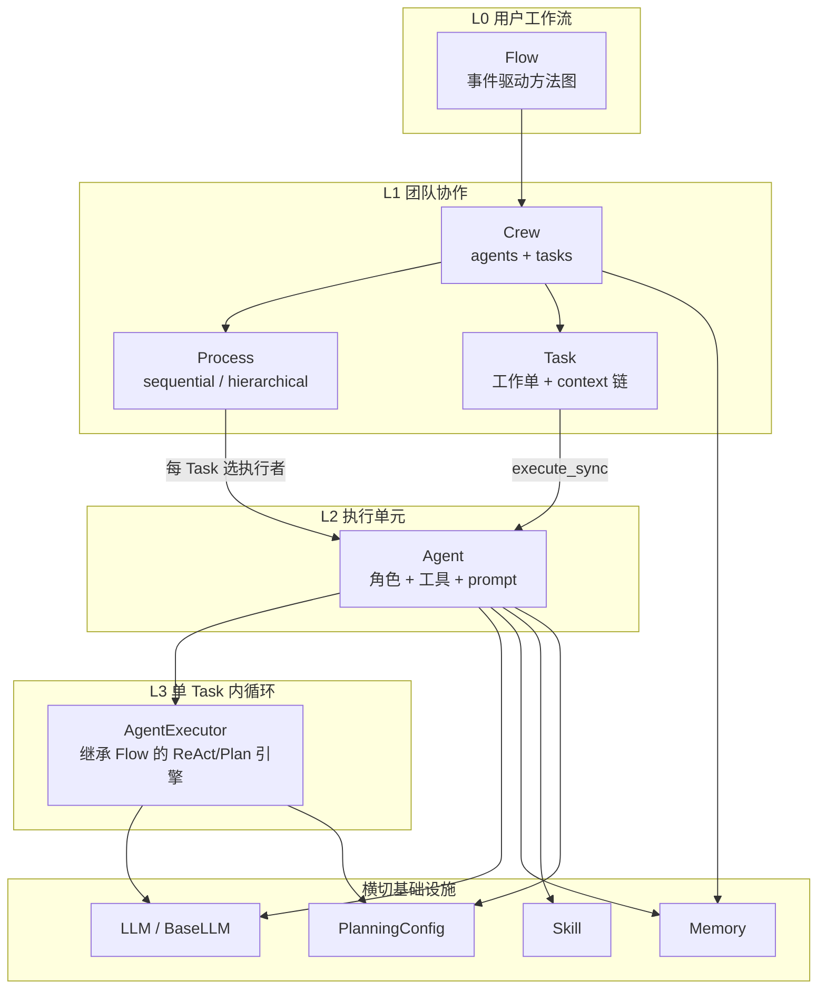
```mermaid
flowchart TB
    subgraph L0["L0 用户工作流"]
        Flow["Flow\n事件驱动方法图"]
    end
    subgraph L1["L1 团队协作"]
        Crew["Crew\nagents + tasks"]
        Process["Process\nsequential / hierarchical"]
        Task["Task\n工作单 + context 链"]
        Crew --> Process
        Crew --> Task
    end
    subgraph L2["L2 执行单元"]
        Agent["Agent\n角色 + 工具 + prompt"]
    end
    subgraph L3["L3 单 Task 内循环"]
        AE["AgentExecutor\n继承 Flow 的 ReAct/Plan 引擎"]
    end
    subgraph infra["横切基础设施"]
        LLM["LLM / BaseLLM"]
        Mem["Memory"]
        Skill["Skill"]
        Plan["PlanningConfig"]
    end

    Flow --> Crew
    Task -->|"execute_sync"| Agent
    Process -->|"每 Task 选执行者"| Agent
    Agent --> AE
    AE --> LLM
    Agent --> LLM
    Crew --> Mem
    Agent --> Mem
    Agent --> Skill
    Agent --> Plan
    AE --> Plan
```

| 层 | 实体 | 回答的问题 |
|----|------|-----------|
| **L0** | `Flow` | 业务流程怎么走？阶段间 state 怎么传？ |
| **L1** | `Crew` + `Process` + `Task` | 有哪些 Agent？Task 顺序？每步谁执行？ |
| **L2** | `Agent` | 谁执行 `execute_task(task)`？ |
| **L3** | `AgentExecutor` | 单个 Task 内怎么 think → tool 循环？ |

---

## 1.5 Flow / Crew / Process / Task / Agent 五元关系

读完本节应能回答：**Task 在栈里占哪一层、和谁引用谁、Process 如何改变 Task 的执行者、Flow 与 Task 如何分工**。

### 1.5.1 一句话分工

| 实体 | 管什么 | 不管什么 |
|------|--------|----------|
| **Flow** | 跨阶段编排、`state` 在阶段间传递 | 不拥有 Task 列表；不直接调 LLM |
| **Crew** | 持有 `agents[]` + `tasks[]`，驱动 Task 循环 | 不做单 Task 内 ReAct |
| **Process** | 每个 Task **由哪个 Agent 执行**（策略枚举） | 无方法、无状态；不改变 Task 列表顺序 |
| **Task** | 一次工作的描述、期望输出、依赖链（`context`） | 不自己跑 LLM；委托给 Agent |
| **Agent** | 角色、工具、prompt；执行 `execute_task` | 不决定 Crew 内 Task 顺序（由 Crew 循环决定） |

记忆口诀：**Flow 排阶段 → Crew 组团队跑 Task 列表 → Process 定每步谁上场 → Task 描述干什么 → Agent 具体干**。

### 1.5.2 包含与调用关系

```text
Flow（L0）
  └─ 方法内 crew.kickoff(inputs)     # 可多次、可换 Process
       └─ Crew（L1）
            ├─ process: Process      # 策略，挂在 Crew 上
            ├─ agents: Agent[]       # 工人池
            └─ tasks: Task[]         # 有序任务列表（线性执行）
                 │
                 for each Task（_execute_tasks）:
                   agent = _get_agent_to_use(task)   # ← Process 在这里生效
                   task.execute_sync(agent, context, tools)
                     └─ agent.execute_task(task)    # L2
                          └─ agent_executor.invoke()  # L3
```

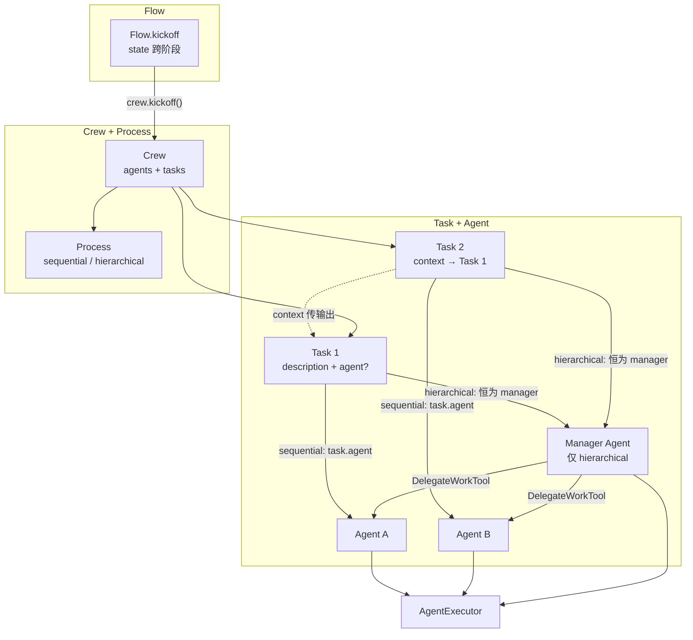
```mermaid
flowchart TB
    subgraph L0["Flow"]
        F["Flow.kickoff\nstate 跨阶段"]
    end

    subgraph L1["Crew + Process"]
        C["Crew\nagents + tasks"]
        P["Process\nsequential / hierarchical"]
        C --> P
    end

    subgraph L2["Task + Agent"]
        T1["Task 1\ndescription + agent?"]
        T2["Task 2\ncontext → Task 1"]
        A1["Agent A"]
        A2["Agent B"]
        M["Manager Agent\n仅 hierarchical"]
        T1 -->|"sequential: task.agent"| A1
        T2 -->|"sequential: task.agent"| A2
        T2 -.->|"context 传输出"| T1
        T1 -->|"hierarchical: 恒为 manager"| M
        T2 -->|"hierarchical: 恒为 manager"| M
        M -->|"DelegateWorkTool"| A1
        M -->|"DelegateWorkTool"| A2
    end

    F -->|"crew.kickoff()"| C
    C --> T1
    C --> T2
    A1 --> AE["AgentExecutor"]
    A2 --> AE
    M --> AE
```

### 1.5.3 引用关系（谁持有谁）

| 引用 | 方向 | 何时绑定 | 说明 |
|------|------|----------|------|
| `Crew.tasks` | Crew → Task | 构造 Crew | Task 列表 **顺序即执行顺序** |
| `Crew.agents` | Crew → Agent | 构造 Crew | Worker 池；hierarchical 时另建 `manager_agent` |
| `Crew.process` | Crew → Process | 构造 Crew | 只影响 `_get_agent_to_use()` |
| `Task.agent` | Task → Agent | 构造 Task | **sequential**：执行者；**hierarchical**：不跑该 Task，仅作提示/委托范围 |
| `Task.context` | Task → Task[] | 构造 Task | 前置 Task；Crew 将其输出拼成 context 字符串 |
| `Agent.crew` | Agent → Crew | `setup_agents()` | kickoff 时反向引用 |
| `Agent.agent_executor` | Agent → AgentExecutor | `create_agent_executor()` | 每个 Task 可能更新 executor 的 task/tools |
| Flow.state | Flow 内部 | `kickoff(inputs)` | 跨 Crew 阶段传数据（如 demo 的 `research_notes`） |

**Task 是 Crew 与 Agent 之间的枢纽**：Crew 循环 Task；每个 Task 通过 `execute_sync` 交给某个 Agent 执行。

### 1.5.4 Process 如何改变 Task 的执行路径

二者 **共用** `_execute_tasks()` 线性循环；**差异只在「当前 Task 选哪个 Agent」**：

| | sequential | hierarchical |
|--|------------|--------------|
| **执行者** | `task.agent` | 恒为 `manager_agent` |
| **Task 顺序** | `tasks[]` 顺序 | 同左 |
| **Agent 协作** | `Task.context` 传前序输出 | Manager 运行时 `Delegate work to coworker` |
| **子 Task** | 无 | 委托时为 Worker **临时创建**子 Task（`base_agent_tools._execute`） |

源码（`crew.py`）：

```python
def _get_agent_to_use(self, task: Task) -> BaseAgent | None:
    if self.process == Process.hierarchical:
        return self.manager_agent
    return task.agent
```

Task 执行链（`task.py` → `agent/core.py`）：

```python
# task._execute_core
result = agent.execute_task(task=self, context=context, tools=tools)
```

### 1.5.5 Flow 与 Task 的分工

| 维度 | Flow 上的「阶段」 | Crew 里的 Task |
|------|-------------------|----------------|
| **粒度** | 业务阶段（可含整个 Crew） | Crew 内一步工作 |
| **编排机制** | `@start` / `@listen` / `@router` | `tasks[]` 顺序 + `context` |
| **状态** | `Flow.state`（用户定义） | `Task.output` / `TaskOutput` |
| **典型用法** | phase1 sequential Crew → phase2 hierarchical Crew | Research Task → Write Task |

demo 对照（`examples/crewai-hermes-demo/demo.py`）：

| Flow 方法 | Crew | Process | Task | Agent |
|-----------|------|---------|------|-------|
| `phase1` | `build_phase1_crew` | sequential | `research_task` → `write_task` | Researcher → Writer |
| `phase2` | `build_phase2_crew` | hierarchical | `synthesis_task`（1 个） | Manager 委托 Fact Checker、Executive Editor |

数据流：`Flow.state.topic` → phase1 Tasks → `state.research_notes` → phase2 Task inputs → `state.final_brief`。

### 1.5.6 易错点

1. **`Task` 不是 `Flow`**：用户 Flow 编排阶段；Task 是 Crew 内工作单；AgentExecutor 内层 Flow 管单 Task 的 LLM 循环。
2. **hierarchical 下 `task.agent` 不执行该 Task**：跑 Task 的是 `manager_agent`（自动创建或自定义），不是 `agents[]` 里绑在 Task 上的 Worker；`task.agent` 勿当作执行者依赖。
3. **Process 没有 parallel**：并行靠 `Task.async_execution=True`，与 sequential/hierarchical 正交。
4. **`Task.context` 只在 sequential 流水线中最关键**；hierarchical 更依赖 Manager 委托时的 `context` 参数。

---

## 2. 核心实体速查

| 实体 | 源码 | 高层抽象 | 封装功能 |
|------|------|----------|----------|
| **Flow** | `flow/flow.py` → `flow/runtime/__init__.py` | 工作流编排器 | `@start`/`@listen`/`@router` 方法图、state、持久化 |
| **Crew** | `crew.py` | 团队执行单元 | agents + tasks + process + memory + callbacks |
| **Process** | `process.py` | 调度策略枚举 | `sequential` / `hierarchical`，无运行时逻辑 |
| **Agent** | `agent/core.py` ← `agents/agent_builder/base_agent.py` | 自治工人 | role/goal/backstory + llm + tools + executor |
| **Task** | `task.py` | 工作单 | description、expected_output、agent、context 链 |
| **LLM** | `llm.py` + `llms/base_llm.py` + `llms/providers/*` | 模型网关 | provider 路由、`call()`、tool calling、streaming |
| **Memory** | `memory/unified_memory.py` | 统一记忆 | remember/recall、向量存储、LLM 分析 |
| **AgentExecutor** | `experimental/agent_executor.py` | 内层执行引擎 | **Flow 子类**，ReAct + plan-and-execute |
| **PlanningConfig** | `agent/planning_config.py` | Agent 级规划配置 | plan 步数、replan、reasoning_effort |
| **Skill** | `skills/models.py` + `skills/loader.py` | 外部能力包 | `SKILL.md` 渐进式注入 prompt |

---

## 3. 实体详解

### 3.1 Flow — L0 编排

**抽象**：把用户业务写成 **有向方法图**（listener 链 + router 分支，非通用 DAG 引擎）。

**持有引用**：

- `state`：Pydantic model 或 dict
- 可选 `memory`、`persistence`、`checkpoint`
- 方法图由 `@start`/`@listen`/`@router` 在类定义时注册（`flow/dsl/`）

**入口**：`flow/runtime/__init__.py` → `kickoff()` / `kickoff_async()`

**执行逻辑**：初始化 state → 执行所有 `@start` 方法 → `_execute_method()` → `_execute_listeners()` 递归触发下游。

**与 Crew 的桥**：

- Python Flow 方法内可直接 `crew.kickoff()`
- 声明式 Flow 通过 `CrewAction`（`flow/runtime/_actions.py`）调 `crew.kickoff_async()`
- `kickoff(inputs={"topic": ...})` 写入 state，**不会**作为 `@start()` 方法参数传入

**公开类**：`flow/flow.py` 的 `Flow` 继承 `flow/runtime` 的 `RuntimeFlow` + `_ConversationalMixin`。

---

### 3.2 Crew — L1 团队

**抽象**：**一组 Agent 按 Process 策略跑一组 Task**，是「团队协作」的最小单元。

**关键字段**（`crew.py`）：

- `agents: list[BaseAgent]`
- `tasks: list[Task]`
- `process: Process`（默认 `sequential`）
- `memory`：`bool | Memory | MemoryScope | MemorySlice`
- `manager_llm` / `manager_agent`（hierarchical）
- `planning` / `planning_llm`（Crew 级预规划，与 Agent `planning_config` 不同）
- `skills`（crew 级，merge 到所有 agent）
- 私有运行时：`_memory`、`_cache_handler`、`_rpm_controller`、`_inputs`

**持有引用**：

- 拥有 `agents[]`、`tasks[]` 列表
- kickoff 时 `agent.crew = self`（反向引用）
- hierarchical 时持有 `manager_agent`

**kickoff 分支**（`crew.py`）：

```python
inputs = prepare_kickoff(self, inputs, input_files)
if self.process == Process.sequential:
    result = self._run_sequential_process()
elif self.process == Process.hierarchical:
    result = self._run_hierarchical_process()
```

**prepare_kickoff**（`crews/utils.py`）：hooks → 插值 inputs → `setup_agents()` → crew 级 planning。

**setup_agents** 建立引用链：

```python
for agent in agents:
    agent.crew = crew
    agent.set_knowledge(crew_embedder=embedder)
    agent.set_skills(resolved_crew_skills=resolved_crew_skills)
    agent.create_agent_executor()
```

---

### 3.3 Process — 调度策略（枚举，非对象）

**源码**：`process.py`

```python
class Process(str, Enum):
    sequential = "sequential"
    hierarchical = "hierarchical"
```

| 值 | 效果 |
|----|------|
| `sequential` | `_get_agent_to_use()` 返回 `task.agent`；Task 按列表顺序执行 |
| `hierarchical` | 自动创建或使用自定义 Manager；**所有 Task 由 `manager_agent` 执行**；通过 delegation tool 委托 Worker |

**谁是 Manager Agent？**（`crew.py` `_create_manager_agent()`）

| 配置 | Manager 是谁 |
|------|----------------|
| 只传 `manager_llm`（常见写法） | **不是** `agents[]` 里任一 Worker；`kickoff()` 时**自动新建**一个 Agent，赋给 `crew.manager_agent` |
| 传 `manager_agent=...` | 使用你指定的 Agent；**不能**同时出现在 `agents=[]` 里 |
| 二者 | `manager_llm` 与 `manager_agent` **至少其一**；同时传时以 `manager_agent` 为准 |

自动创建的 Manager（未传 `manager_agent` 时）：

| 属性 | 值 |
|------|-----|
| role / goal / backstory | i18n `hierarchical_manager_agent`（默认 role 为 **"Crew Manager"**） |
| `llm` | `manager_llm`（如 `ChatOpenAI(model="gpt-4")`） |
| `tools` | `AgentTools(agents=self.agents).tools()` — 委托工具，指向 `agents[]` 各 Worker |
| `allow_delegation` | `True` |

```python
crew = Crew(
    agents=[researcher, writer, reviewer],  # Worker 池，不直接跑 Task
    tasks=tasks,
    process="hierarchical",
    manager_llm=ChatOpenAI(model="gpt-4"),  # Manager 用此 LLM，非 Worker
)
# kickoff 后：manager_agent = 自动创建的 "Crew Manager"
# researcher / writer / reviewer 仅在 Manager 委托时被调用
```

**hierarchical 要点**（`crew.py`）：

- `_run_hierarchical_process()` → `_create_manager_agent()` → `_execute_tasks()`
- 未传 `manager_agent` 时：用 `manager_llm` + i18n 人设 **新建** Manager，并注入 `AgentTools(agents=self.agents)`
- 已传 `manager_agent` 时：复用该 Agent（不应自带 tools）；`allow_delegation=True`
- `_get_agent_to_use()` 在 hierarchical 时 **始终** 返回 `manager_agent`（与 `task.agent` 无关）
- sequential 与 hierarchical **共用** `_execute_tasks()` 循环

#### 3.3.1 Hierarchical 完整链路 + Crew.planning 有/无对比

> **可运行对照**：[`examples/crewai-hermes-demo`](../../examples/crewai-hermes-demo/)（`Process.hierarchical` + 可选 `Crew.planning`）。
> **Agent 级 plan**：见 [§3.9.4](#394-路径-bagentplanning_configplan-and-execute)。

##### 一句话区别（`planning=True` vs `planning=False`）

| | **无 plan** | **有 plan**（`Crew.planning=True`） |
|---|-------------|-------------------------------------|
| **何时发生** | 无额外阶段 | `prepare_kickoff` 末尾、**任何 Task 执行前** |
| **谁参与** | Manager + Worker | 多一个临时 **Task Execution Planner**（不在 `agents[]`） |
| **改了什么** | 无 | 每个 `task.description += plan_text`（字符串拼接） |
| **hierarchical 委托机制** | 相同 | 相同（`DelegateWorkTool` 不变） |
| **Manager 是否多一个「规划 Agent」** | 否 | 否（Planner ≠ Manager） |
| **运行时 replan** | 无 | 无（除非 Worker 另有 `planning_config`） |

**核心**：`Crew.planning` 是 kickoff 前的**一次性文本注入**，不是 hierarchical 的「预生成子任务 DAG」，也**不改变**委托链路。

##### 总调用链

```text
Crew.kickoff(inputs)
  └─ prepare_kickoff()
       ├─ interpolate inputs
       ├─ setup_agents()
       └─ [有 plan] CrewPlanner._handle_crew_planning()   ← 唯一分叉
            ├─ 临时 Agent "Task Execution Planner"
            ├─ 1 次 LLM（output_pydantic → list_of_plans_per_task）
            └─ 每个 task.description += plan_map[task_number]

  └─ _run_hierarchical_process()          ← 有无 plan 从这里开始完全相同
       ├─ _create_manager_agent()
       └─ _execute_tasks(tasks)
            for each task:
              _get_agent_to_use() → manager_agent
              manager.execute_task(task)   ← description 可能已含 plan
                └─ DelegateWorkTool → worker.execute_task(子Task)
```

源码：`crews/utils.py` `prepare_kickoff` → `crew._handle_crew_planning()`；`crew.py` `_run_hierarchical_process()`。

##### 图 1：Hierarchical kickoff（含可选 Crew.planning）

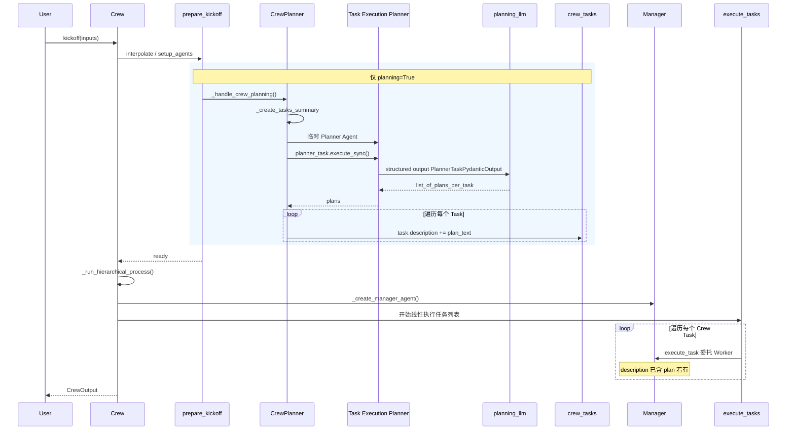
```mermaid
sequenceDiagram
    participant User
    participant Crew
    participant Prep as prepare_kickoff
    participant CP as CrewPlanner
    participant PA as Task Execution Planner
    participant PLLM as planning_llm
    participant Tasks as crew_tasks
    participant M as Manager
    participant ExecLoop as execute_tasks

    User->>Crew: kickoff(inputs)
    Crew->>Prep: interpolate / setup_agents

    rect rgb(240, 248, 255)
        Note over Prep,Tasks: 仅 planning=True
        Prep->>CP: _handle_crew_planning()
        CP->>CP: _create_tasks_summary
        CP->>PA: 临时 Planner Agent
        CP->>PA: planner_task.execute_sync()
        PA->>PLLM: structured output PlannerTaskPydanticOutput
        PLLM-->>PA: list_of_plans_per_task
        PA-->>CP: plans
        loop 遍历每个 Task
            CP->>Tasks: task.description += plan_text
        end
    end

    Prep-->>Crew: ready
    Crew->>Crew: _run_hierarchical_process()
    Crew->>M: _create_manager_agent()

    Crew->>ExecLoop: 开始线性执行任务列表
    loop 遍历每个 Crew Task
        ExecLoop->>M: execute_task 委托 Worker
        Note over M: description 已含 plan 若有
    end

    Crew-->>User: CrewOutput
```

**无 plan**：去掉蓝色 `rect` 整块，直接从 `setup_agents` 进入 `_run_hierarchical_process()`。

##### 图 2：Manager 委托 Worker（核心内层 + plan 对 prompt 的影响）

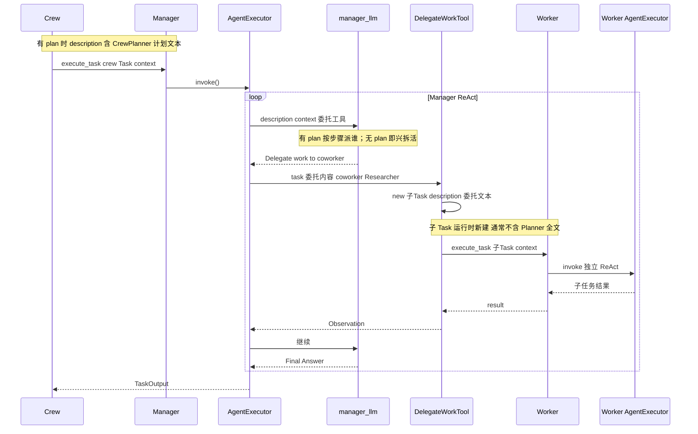
```mermaid
sequenceDiagram
    participant Crew
    participant M as Manager
    participant EX as AgentExecutor
    participant LLM as manager_llm
    participant DT as DelegateWorkTool
    participant W as Worker
    participant WEX as Worker AgentExecutor

    Note over Crew,M: 有 plan 时 description 含 CrewPlanner 计划文本

    Crew->>M: execute_task crew Task context
    M->>EX: invoke()

    loop Manager ReAct
        EX->>LLM: description context 委托工具
        Note over LLM: 有 plan 按步骤派谁；无 plan 即兴拆活
        LLM-->>EX: Delegate work to coworker
        EX->>DT: task 委托内容 coworker Researcher
        DT->>DT: new 子Task description 委托文本
        Note over DT,W: 子 Task 运行时新建 通常不含 Planner 全文
        DT->>W: execute_task 子Task context
        W->>WEX: invoke 独立 ReAct
        WEX-->>W: 子任务结果
        W-->>DT: result
        DT-->>EX: Observation
        EX->>LLM: 继续
        LLM-->>EX: Final Answer
    end

    EX-->>Crew: TaskOutput
```

**委托实现**（`tools/agent_tools/base_agent_tools.py`）：`DelegateWorkTool` 按 `coworker` 匹配 `agent.role`，`new Task(description=委托内容)` 不在 `crew.tasks[]` 里；Worker 结果作为 Observation 回到 Manager ReAct。

##### 行为差异（你最常问的三层）

**1. 执行拓扑 — 无差别**

- Task 仍**线性**执行（Task1 → Task2）
- 每个 Crew Task 的执行者都是 **Manager**
- Worker 只在 **DelegateWorkTool** 被调用时出现
- 没有「先 plan 再生成子任务 DAG」

**2. LLM 调用次数 — 有差别**

| 阶段 | 无 plan | 有 plan |
|------|---------|---------|
| kickoff 前 | 0 | **+1** 次（CrewPlanner，`planning_llm`） |
| 每个 Crew Task | Manager ReAct + N 次委托 | 同上 |
| 每次委托 | Worker 独立 ReAct | 同上 |

**3. prompt 内容 — 有差别**

| 角色 | 无 plan | 有 plan |
|------|---------|---------|
| **CrewPlanner 输入** | N/A | 汇总全部 Task（含 `task.agent` role/goal/tools） |
| **Manager** | 原始 `task.description` + `context` | 同上 **+ CrewPlanner 逐步计划文本** |
| **Worker（委托子 Task）** | Manager 写的委托 `description` | 同上（**不会自动带上** CrewPlanner 全文） |

##### 三个「计划」角色（勿混）

```text
① Task Execution Planner  — Crew.planning 专用；kickoff 前跑 1 次；用完即丢
② Crew Manager            — hierarchical 执行每个 Crew Task；运行时委托 Worker
③ Worker AgentExecutor    — 被委托后跑自己的 ReAct（或 Agent.planning_config）
```

##### `task.agent` 在 hierarchical 下的三重角色

| 角色 | 说明 |
|------|------|
| **不是** Crew Task 执行者 | `_get_agent_to_use` 永远返回 Manager |
| **是** CrewPlanner 摘要里的 Worker 提示 | Planner 按 role 写「谁该干什么」 |
| **是** 委托范围 / 匹配目标 | `_update_manager_tools` 可收窄 coworker 列表；`DelegateWorkTool` 按 role 匹配 |

##### 易错点

1. **Crew.planning 不在 Manager ReAct 循环里** — 在 `prepare_kickoff`，早于 `_create_manager_agent()`。
2. **Planner 不是 Manager** — 不会替 Manager 调用 `DelegateWorkTool`。
3. **plan 不生成 `crew.tasks[]` 之外的子任务图** — 子 Task 仍是 Manager 委托时 `new Task(...)`。
4. **Gemini + OpenAI-compat 代理**：CrewPlanner 的 `output_pydantic` 常因 `$defs`/`$ref` 报 400 — 需单独 `planning_llm`（见 demo `HERMES_PLANNING_MODEL_NAME`）。
5. **hierarchical 没有单独的「规划阶段」** — Manager 不预生成 DAG；每个 Crew Task 仍线性执行。

##### demo 场景（research → write，hierarchical）

**无 plan**：Manager 读 Task1 `"Research {topic}…"` → 自己决定 `delegate → Researcher`；Task2 同理派 Writer。

**有 plan**：Task1 `description` 追加 `"Step 1: Researcher 搜 3 点…"`；Manager 读更长 description 后更可能按步骤委托；Manager **不会**因 plan 跳过委托自己干完。

---

### 3.4 Agent — L2 工人

**抽象**：带人设（role/goal/backstory）的 LLM 执行者；**自己不跑 LLM 循环**，委托给 `AgentExecutor`。

**BaseAgent 核心引用**（`agents/agent_builder/base_agent.py`）：

- `role`, `goal`, `backstory`
- `llm: BaseLLM`
- `crew: Crew | None`（反向引用）
- `agent_executor: AgentExecutor | None`
- `skills`, `tools`, `memory`, `knowledge`

**Agent 特有**（`agent/core.py`）：

- `planning_config: PlanningConfig | None`
- `executor_class`（默认 `AgentExecutor`）
- `planning_enabled` = `planning_config is not None or planning`

**execute_task 链路**：

```
_prepare_task_execution() → knowledge retrieval
→ _finalize_task_prompt() → create_agent_executor(tools, task)
→ _execute_without_timeout() → agent_executor.invoke()
→ _finalize_task_execution()
```

**create_agent_executor** 注入 L3 引用：

```python
self.agent_executor = self.executor_class(
    llm=self.llm,
    task=task,
    agent=self,
    crew=self.crew,
    tools=parsed_tools,
    prompt=prompt,
    max_iter=self.max_iter,
    ...
)
```

**独立入口**：`Agent.kickoff()` 不经 Crew，仍走同一 `AgentExecutor`。

---

### 3.5 Task — 工作单

**抽象**：描述 + 期望输出 + 指派 Agent + 可选 context（前置 Task 输出）。

**关键字段**：`description`, `expected_output`, `agent`, `context: list[Task]`, `tools`, `output: TaskOutput`, guardrails, `async_execution`

**执行**：`task.execute_sync()` → `_execute_core()` → `agent.execute_task(task, context, tools)`

**引用关系**：

- `task.agent` → 指定 Agent（sequential 时由 Crew 选用）
- `task.context` → 前置 Task；Crew 把其输出拼成 context 字符串
- `task.output` → 供后续 Task 或 `CrewOutput` 汇总

---

### 3.6 AgentExecutor — L3 内层 Flow

**抽象**：Agent 的 **真正执行引擎**；**继承 `Flow[AgentExecutorState]`**。

**源码**：`experimental/agent_executor.py`

```python
class AgentExecutor(Flow[AgentExecutorState], BaseAgentExecutor):
    """Standalone: crew/task=None (Agent.kickoff)
       Crew mode: crew+task set (Agent.execute_task)"""
    _skip_auto_memory: bool = True
    suppress_flow_events: bool = True
```

**AgentExecutorState** 同时承载 ReAct 与 Plan-and-Execute：

- `messages`, `iterations`, `current_answer`, `is_finished`
- `plan`, `todos`, `observations`, `replan_count`

**invoke → 内部 kickoff**：

```python
def invoke(self, inputs):
    # reset state
    self._setup_messages(inputs)
    self.kickoff()                    # 内层 Flow 图
    return {"output": formatted_answer.output}
```

**设计要点**：外层 Flow（L0）编排业务阶段；内层 AgentExecutor Flow（L3）编排单 Task 的 LLM 循环。**两层 Flow 嵌套，同一套 runtime**。

**Legacy**：`agents/crew_agent_executor.py` 的 `CrewAgentExecutor` 已 deprecated，默认 `executor_class` 指向 experimental `AgentExecutor`。

---

### 3.7 LLM — 模型网关

**抽象**：统一 `call(messages, tools, ...)` 接口。

| 类型 | 文件 | 职责 |
|------|------|------|
| `BaseLLM` | `llms/base_llm.py` | 抽象基类：`model`, `base_url`, `api_key`, `call()` |
| `LLM` | `llm.py` | `__new__` 工厂：按 model 前缀路由 native provider 或 LiteLLM |
| Native providers | `llms/providers/{openai,anthropic,gemini,...}/completion.py` | 各厂商 SDK 封装 |

**被谁持有**：`Agent.llm`、`Crew.manager_llm`/`planning_llm`、`AgentExecutor.llm`、`Memory.llm`、`PlanningConfig.llm`

**注意**：OpenAI-compatible 代理只需 `base_url` + `api_key`；勿传无效参数（如旧版 `custom_openai`）到 provider。

---

### 3.8 Memory — 横切记忆

**抽象**：统一记忆（默认 LanceDB + LLM 分析）。

**源码**：`memory/unified_memory.py`，辅助 `memory/recall_flow.py`（deep recall 复用 Flow）

**关键方法**：`remember()` / `recall()` / `drain_writes()`

**连接**：

- `Crew.memory=True` → 解析为 `Memory`，`_add_memory_tools()` 注入 Agent
- `Agent.memory` 可覆盖；否则 fallback 到 crew memory
- `AgentExecutor._save_to_memory()` 在 task 完成后写入
- `Flow.memory` 可选，用于 Flow 级记忆

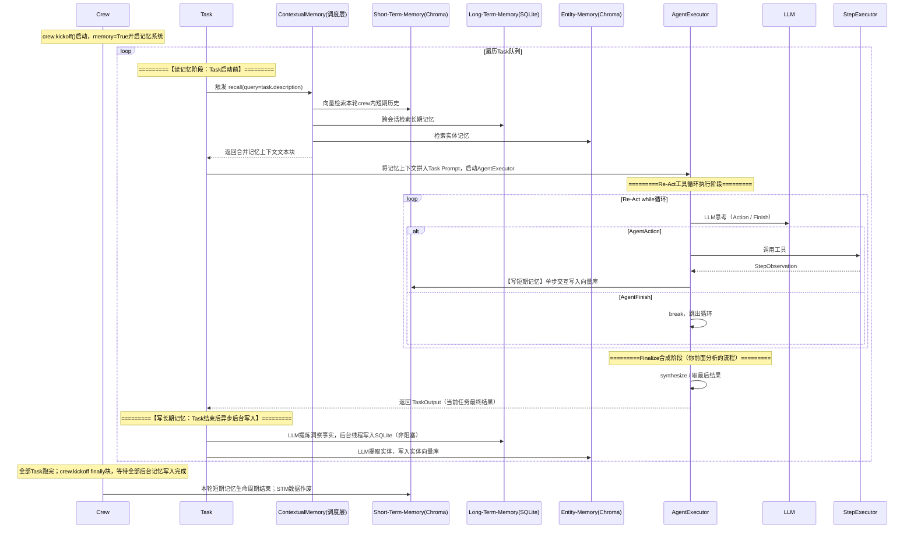
```mermaid
sequenceDiagram
    participant C as Crew
    participant T as Task
    participant CM as ContextualMemory(调度层)
    participant STM as Short‑Term‑Memory(Chroma)
    participant LTM as Long‑Term‑Memory(SQLite)
    participant EM as Entity‑Memory(Chroma)
    participant EX as AgentExecutor
    participant LLM

    Note over C: crew.kickoff()启动，memory=True开启记忆系统
    loop 遍历Task队列
        Note over T: =========【读记忆阶段：Task启动前】=========
        T->>CM: 触发 recall(query=task.description)
        CM->>STM: 向量检索本轮crew内短期历史
        CM->>LTM: 跨会话检索长期记忆
        CM->>EM: 检索实体记忆
        CM-->>T: 返回合并记忆上下文文本块
        T->>EX: 将记忆上下文拼入Task Prompt，启动AgentExecutor

        Note over EX: =========Re‑Act工具循环执行阶段=========
        loop Re‑Act while循环
            EX->>LLM: LLM思考（Action / Finish）
            alt AgentAction
                EX->>StepExecutor: 调用工具
                StepExecutor-->>EX: StepObservation
                EX->>STM: 【写短期记忆】单步交互写入向量库
            else AgentFinish
                EX->>EX: break，跳出循环
            end
        end

        Note over EX: =========Finalize合成阶段（你前面分析的流程）=========
        EX->>EX: synthesize / 取最后结果
        EX-->>T: 返回 TaskOutput（当前任务最终结果）

        Note over T: =========【写长期记忆：Task结束后异步后台写入】=========
        T->>LTM: LLM提炼洞察事实，后台线程写入SQLite（非阻塞）
        T->>EM: LLM提取实体，写入实体向量库
    end

    Note over C: 全部Task跑完；crew.kickoff finally块，等待全部后台记忆写入完成
    C->>STM: 本轮短期记忆生命周期结束；STM数据作废
```
## 三者定位对比表

表格

| 模块 | 存储介质 | 保存什么内容 | 写入时机 | 生命周期 | 核心目的 |
| --- | --- | --- | --- | --- | --- |
| **STM 短期记忆** | ChromaDB 向量库 | 本轮会话内每一步完整交互：思考、工具调用、观测结果 | **每一轮 Re‑Act 工具步骤之后立刻写入** | **仅限当前这一次 `crew.kickoff()`，本轮结束作废** | 克服 LLM 上下文截断；本轮任务内部召回更早的步骤 |
| **LTM 长期记忆** | SQLite + Embedding 索引 | **提炼后的高层洞察、事实结论、任务成果摘要**（不是原始工具日志） | **整个 Task 完全执行结束，产出 TaskOutput 之后后台异步写入** | 永久磁盘保存，跨多次 `kickoff()` 可用 | 沉淀经验；下次遇到相似任务自动召回历史结论 |
| **EntityMemory 实体记忆** | ChromaDB 向量库 | **实体‑事实映射表**实体：人名、项目、公司、文件、客户、产品事实：「张三是项目负责人」「项目截止日期是 10 月」 | Task 结束后，和 LTM 一起后台提取写入 | 永久磁盘保存，跨会话 | Agent 记住对象属性；识别同一个实体跨多轮任务的上下文 |
## 长期记忆复用的两大局限（高频踩坑）

### 局限 1：复用的内容永远是**摘要洞察，不是完整历史会话**

LTM 不会保存：

- 过去一次任务里面全部 AgentAction / StepObservation 工具往返日志
- 完整原始消息列表 `[{role,content}]`

写入 LTM 之前，LLM 会**压缩提炼**，丢掉细节，只保留核心事实结论。

>
> 如果你想要完整原始对话历史跨 kickoff 复用 → LTM 做不到；只能依靠 Flow‑ChatState 会话存储。

### 局限 2：没有 session 隔离！LTM 是全局记忆池

长期记忆库**没有内置 session_id 字段**。
所有会话、所有 crew 运行产生的洞察，全部写入同一个全局记忆库。
👉 后果：A 会话的记忆，可能被 B 无关会话召回。

如果你想要会话隔离的长期记忆，需要手动二次开发：

1. 写入记忆时，往记忆 metadata 附加 `session_id`
2. 检索召回的时候，增加过滤条件 `metadata.session_id == 当前会话id`

## 4. 写入→复用完整闭环时序


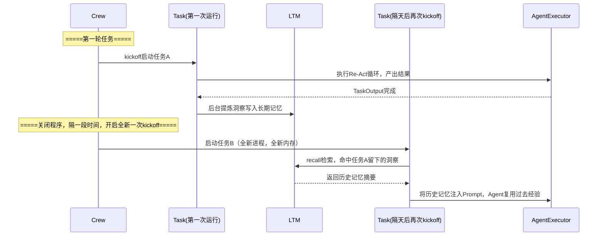
```mermaid
sequenceDiagram
    participant Crew
    participant TaskA as Task(第一次运行)
    participant LTM
    participant TaskB as Task(隔天后再次kickoff)
    participant EX as AgentExecutor

    Note over Crew: =====第一轮任务=====
    Crew->>TaskA: kickoff启动任务A
    TaskA->>EX: 执行Re‑Act循环，产出结果
    EX-->>TaskA: TaskOutput完成
    TaskA->>LTM: 后台提炼洞察写入长期记忆

    Note over Crew: =====关闭程序，隔一段时间，开启全新一次kickoff=====
    Crew->>TaskB: 启动任务B（全新进程，全新内存）
    TaskB->>LTM: recall检索，命中任务A留下的洞察
    LTM-->>TaskB: 返回历史记忆摘要
    TaskB->>EX: 将历史记忆注入Prompt，Agent复用过去经验
```


# 三、一张全景区分四种存储，终结混淆

表格

| 存储 | 能否跨 kickoff 复用 | 存储原始完整消息 | 存储提炼摘要 | 存储实体属性 |
| --- | --- | --- | --- | --- |
| AgentExecutor.state.messages | ❌ | ✅ | ❌ | ❌ |
| STM 短期记忆 | ❌ | 部分交互日志向量 | ❌ | ❌ |
| LTM 长期记忆 | ✅ | ❌ | ✅洞察结论 | ❌ |
| EntityMemory 实体记忆 | ✅ | ❌ | ❌ | ✅实体‑属性映射 |
| Flow‑ChatState.messages | ✅ | ✅完整对话 JSON | ❌ | ❌ |


---

### 3.9 Planning 双轨详解（Crew.plan vs Agent.plan）

CrewAI 有两条**独立、可叠加**的规划路径，外加第三条 **Process 级「计划」**（Task 图 / Manager 委托）。无 `write_todos` middleware；计划形态分别是 **文本注入**、**结构化 TodoList**、**Task 顺序**。

#### 3.9.1 总览对比

| 维度 | **Crew.planning**（Crew 预规划） | **Agent.planning_config**（Agent 内规划） | **Process**（编排级） |
|------|----------------------------------|-------------------------------------------|------------------------|
| 开关 | `Crew(planning=True)` | `Agent(planning_config=PlanningConfig(...))` | `process=sequential` / `hierarchical` |
| 挂载点 | `Crew` | `Agent` | `Crew.process` |
| 时机 | `prepare_kickoff` 末尾，**任何 Task 执行前** | 每个 Task 的 `AgentExecutor.invoke()` **入口** | kickoff 全程 |
| 规划 LLM | `Crew.planning_llm`（默认 `gpt-5.4-mini`） | `PlanningConfig.llm` 或 Agent 自己的 `llm` | `manager_llm`（hierarchical） |
| 产物 | 文本 **append** 到各 `task.description` | `state.plan` + `TodoList`（`PlanStep[]`） | Task 列表顺序 / Manager 运行时委托 |
| 执行中 replan | ❌ 一次性 | ✅ `PlannerObserver` + `handle_replan_now` | Manager 每 Task 运行时决定派谁 |
| 源码 | `planning_handler.py` / `crew._handle_crew_planning` | `reasoning_handler.py` / `agent_executor.py` | `crew.py` Process 分支 |

#### 3.9.2 双轨 + kickoff 协作总图

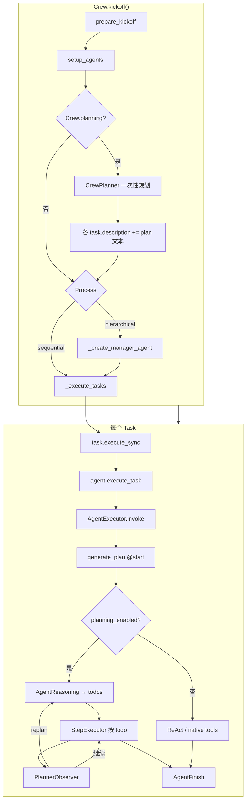
```mermaid
flowchart TB
    subgraph kickoff["Crew.kickoff()"]
        PK[prepare_kickoff]
        PK --> SA[setup_agents]
        SA --> CP{Crew.planning?}
        CP -->|是| CREW_PLAN[CrewPlanner 一次性规划]
        CREW_PLAN --> APP[各 task.description += plan 文本]
        CP -->|否| PROC
        APP --> PROC{Process}
        PROC -->|sequential| EXEC[_execute_tasks]
        PROC -->|hierarchical| MGR[_create_manager_agent]
        MGR --> EXEC
    end

    subgraph per_task["每个 Task"]
        EXEC --> TS[task.execute_sync]
        TS --> AT[agent.execute_task]
        AT --> INV[AgentExecutor.invoke]
        INV --> GP[generate_plan @start]
        GP --> AP{planning_enabled?}
        AP -->|是| AR[AgentReasoning → todos]
        AP -->|否| REACT[ReAct / native tools]
        AR --> SE[StepExecutor 按 todo]
        SE --> OBS[PlannerObserver]
        OBS -->|replan| AR
        OBS -->|继续| SE
        SE --> FIN[AgentFinish]
        REACT --> FIN
    end

    kickoff --> per_task
```

> **叠加关系**：`Crew.planning` 先 enrich `task.description`；带 `planning_config` 的 Agent 在 `AgentReasoning` 里读到的 description **已含 Crew 计划文本**，再生成自己的 `TodoList`。二者互不替代。

---

#### 3.9.3 路径 A：Crew.planning（Crew 预规划）

**目的**：在整支 Crew 开跑前，用一次 LLM 调用为**每个 Task** 生成逐步执行建议，写进 prompt。

**触发链**（`crews/utils.py` → `crew.py`）：

```text
kickoff(inputs)
  → prepare_kickoff()
       → interpolate inputs
       → setup_agents()
       → if crew.planning: crew._handle_crew_planning()   ← 此处
  → _run_sequential_process() | _run_hierarchical_process()
  → _execute_tasks()
```

**CrewPlanner 内部**（`utilities/planning_handler.py`）：

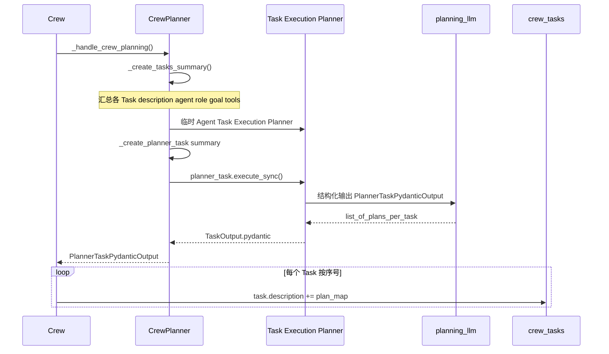
```mermaid
sequenceDiagram
    participant Crew as Crew
    participant CP as CrewPlanner
    participant PA as Task Execution Planner
    participant LLM as planning_llm
    participant Tasks as crew_tasks

    Crew->>CP: _handle_crew_planning()
    CP->>CP: _create_tasks_summary()
    Note over CP: 汇总各 Task description agent role goal tools
    CP->>PA: 临时 Agent Task Execution Planner
    CP->>CP: _create_planner_task summary
    CP->>PA: planner_task.execute_sync()
    PA->>LLM: 结构化输出 PlannerTaskPydanticOutput
    LLM-->>PA: list_of_plans_per_task
    PA-->>CP: TaskOutput.pydantic
    CP-->>Crew: PlannerTaskPydanticOutput

    loop 每个 Task 按序号
        Crew->>Tasks: task.description += plan_map
    end
```

**关键行为**：

1. **临时 Agent**：`role="Task Execution Planner"`，**不属于** `crew.agents[]`，仅用于这一次规划 Task。
2. **单次规划 Task**：输入为全部 Task 摘要；输出 Pydantic `list_of_plans_per_task`（`task_number` + `plan` 文本）。
3. **写入方式**：`task.description += plan`（字符串拼接，**非**替换）。
4. **之后**：正常 `_execute_tasks`；各 Agent 的 `AgentExecutor` **不会**因 Crew.planning 自动进入 plan-and-execute，除非该 Agent 另有 `planning_config`。
5. **无运行时 replan**：计划写死后不再更新。

**配置示例**：

```python
crew = Crew(
    agents=[researcher, writer],
    tasks=[research_task, write_task],
    planning=True,
    planning_llm="gpt-5.4-mini",  # 可选，默认 gpt-5.4-mini
)
```

---

#### 3.9.4 路径 B：Agent.planning_config（Plan-and-Execute）

**目的**：单个 Agent 在执行**当前 Task** 前，先 `AgentReasoning` 生成结构化步骤，再按 todo **逐步**执行，并可 **动态 replan**。

> **完整时序图（推荐从此读）**：[§3.9.7 Agent.plan 完整时序](#397-agentplan-完整时序小白版)

**触发链**：

```text
Task.execute_sync → Agent.execute_task → create_agent_executor → invoke()
  → AgentExecutor Flow.kickoff()
       → @start generate_plan()          ← 入口
       → check_todos_available @router
       → get_ready_todos → execute_todo → observe_step_result
       → (replan) handle_replan_now → 新 todos
       → all_todos_complete → synthesize → AgentFinish
```

**阶段 ①：初始规划**（`reasoning_handler.py`）—— 详见 [§3.9.7 图 2](#397-agentplan-完整时序小白版)

- **不修改** `task.description`（与 Crew.planning 不同；避免 re-invoke 时重复累积）。
- `planning_enabled` = `planning_config is not None` 或 deprecated `planning=True`。

**阶段 ②③：按 todo 执行 + 验收** —— 详见 [§3.9.7 图 1、3、4](#397-agentplan-完整时序小白版)

| `reasoning_effort` | 每步观察 | 失败时 | 成功时 |
|--------------------|----------|--------|--------|
| `low` | 启发式（无额外 LLM） | 仅硬失败 replan | 标记完成 → 下一步 |
| `medium` | `PlannerObserver` LLM | **replan** | 继续下一步 |
| `high` | 完整 decide 管道 | replan / refine / 提前 goal | 可能 refine 剩余计划 |

**PlanningConfig 关键字段**：`reasoning_effort`、`max_steps`、`max_attempts`（规划 refine 次数）、`max_replans`（执行中 replan 上限）、`max_step_iterations`（单步内 ReAct 轮数）、`llm`

**配置示例**（demo phase1 Researcher）：

```python
from crewai.agent.planning_config import PlanningConfig

researcher = Agent(
    role="Researcher",
    planning_config=PlanningConfig(
        reasoning_effort="medium",
        max_attempts=2,
    ),
)
```

---

#### 3.9.5 叠加示例：Crew.plan + Agent.plan 协作时序

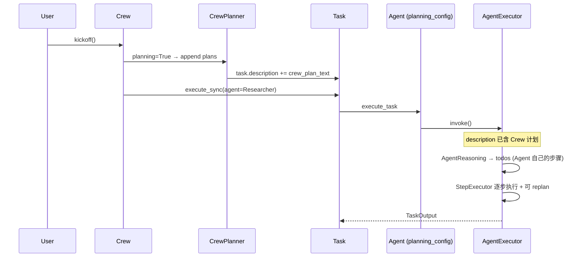
```mermaid
sequenceDiagram
    participant User
    participant Crew
    participant CP as CrewPlanner
    participant Task as Task
    participant Agent as Agent (planning_config)
    participant EX as AgentExecutor

    User->>Crew: kickoff()
    Crew->>CP: planning=True → append plans
    CP->>Task: task.description += crew_plan_text

    Crew->>Task: execute_sync(agent=Researcher)
    Task->>Agent: execute_task
    Agent->>EX: invoke()
    Note over EX: description 已含 Crew 计划
    EX->>EX: AgentReasoning → todos (Agent 自己的步骤)
    EX->>EX: StepExecutor 逐步执行 + 可 replan
    EX-->>Task: TaskOutput
```

---

#### 3.9.6 与 Process 的关系（路径 C）

| Process | 「计划」从哪来 | 与 A/B 关系 |
|---------|----------------|-------------|
| `sequential` | `tasks[]` 顺序 + `Task.context` | A/B 可叠加；执行者 = `task.agent` |
| `hierarchical` | Task 顺序不变；**Manager 运行时**决定委托谁 | A 仍可在 kickoff 前 enrich description；B 在 Manager/Worker 各自的 `execute_task` 内独立触发 |

> **Hierarchical + 有/无 Crew.planning 完整时序与行为对比**：[§3.3.1](#331-hierarchical-完整链路--crewplanning-有无对比)（图 1 kickoff、图 2 Manager 委托 Worker）。

**易错点**：

1. **Crew.planning ≠ Agent.planning**：前者改 `task.description`；后者建 `TodoList`，执行中可 replan。
2. **CrewPlanner 的 Planner Agent** ≠ **hierarchical Manager** ≠ **带 planning_config 的 Worker**；三者角色不同。
3. **默认多 Agent「计划」** = Task 定义 + Process；只有显式开 `planning=True` / `planning_config` 才进入 A/B。
4. **Crew.planning 不改变 hierarchical 拓扑**：只 enrich `task.description`；委托机制见 [§3.3.1 图 2](#图-2manager-委托-worker核心内层--plan-对-prompt-的影响)。

---

#### 3.9.7 Agent.plan 完整时序（小白版）

只讲 **`Agent(planning_config=...)`** 一条路。五句话版：

1. Crew 把 Task 交给 Agent → `AgentExecutor.invoke()` 启动内层 Flow
2. **先规划**：`AgentReasoning` 调 LLM 生成 `TodoList`（施工清单）
3. **再逐步做**：每条 todo 交给 `StepExecutor`（本步内 LLM + 工具小循环）
4. **每步验收**：`PlannerObserver` 看成败，失败可 **replan**（重画未完成的清单）
5. **全部做完**：`finalize` → `synthesize` 拼成最终答案 → 返回 TaskOutput

**与 ReAct 的关系**：规划没产出 todos，或没开 `planning_config` → 退回普通 ReAct（整 Task 一个 loop），见 [图 5](#图-5无-todos-时退回-react)。

---

##### 图 1：端到端总时序（从 Crew 到 Task 输出）

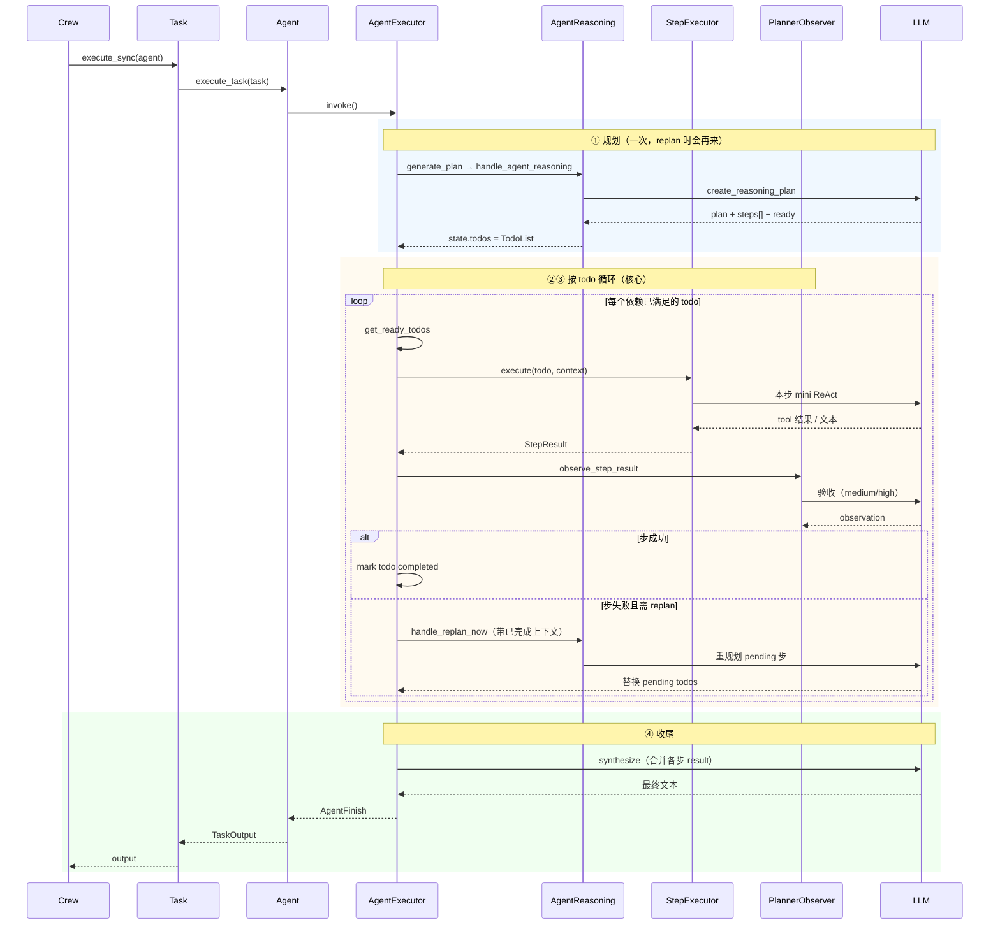
```mermaid
sequenceDiagram
    participant Crew
    participant Task
    participant Agent
    participant EX as AgentExecutor
    participant AR as AgentReasoning
    participant SE as StepExecutor
    participant PO as PlannerObserver
    participant LLM

    Crew->>Task: execute_sync(agent)
    Task->>Agent: execute_task(task)
    Agent->>EX: invoke()

    rect rgb(240, 248, 255)
        Note over EX,LLM: ① 规划（一次，replan 时会再来）
        EX->>AR: generate_plan → handle_agent_reasoning
        AR->>LLM: create_reasoning_plan
        LLM-->>AR: plan + steps[] + ready
        AR-->>EX: state.todos = TodoList
    end

    rect rgb(255, 250, 240)
        Note over EX,PO: ②③ 按 todo 循环（核心）
        loop 每个依赖已满足的 todo
            EX->>EX: get_ready_todos
            EX->>SE: execute(todo, context)
            SE->>LLM: 本步 mini ReAct
            LLM-->>SE: tool 结果 / 文本
            SE-->>EX: StepResult
            EX->>PO: observe_step_result
            PO->>LLM: 验收（medium/high）
            LLM-->>PO: observation
            alt 步成功
                EX->>EX: mark todo completed
            else 步失败且需 replan
                EX->>AR: handle_replan_now（带已完成上下文）
                AR->>LLM: 重规划 pending 步
                LLM-->>EX: 替换 pending todos
            end
        end
    end

    rect rgb(240, 255, 240)
        Note over EX,LLM: ④ 收尾
        EX->>LLM: synthesize（合并各步 result）
        LLM-->>EX: 最终文本
        EX-->>Agent: AgentFinish
        Agent-->>Task: TaskOutput
        Task-->>Crew: output
    end
```

---

##### 图 2：阶段 ① 规划时序（`generate_plan`）

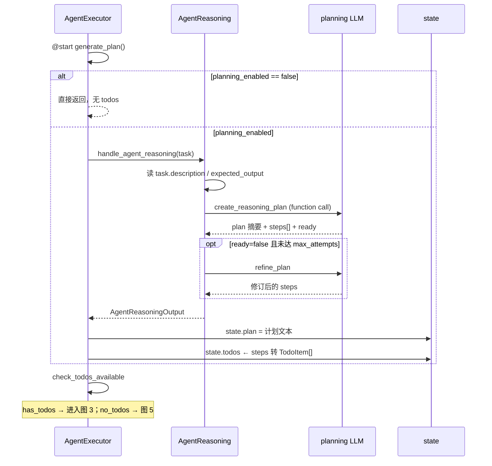
```mermaid
sequenceDiagram
    participant EX as AgentExecutor
    participant AR as AgentReasoning
    participant LLM as planning LLM
    participant ST as state

    EX->>EX: @start generate_plan()
    alt planning_enabled == false
        EX-->>EX: 直接返回，无 todos
    else planning_enabled
        EX->>AR: handle_agent_reasoning(task)
        AR->>AR: 读 task.description / expected_output
        AR->>LLM: create_reasoning_plan (function call)
        LLM-->>AR: plan 摘要 + steps[] + ready
        opt ready=false 且未达 max_attempts
            AR->>LLM: refine_plan
            LLM-->>AR: 修订后的 steps
        end
        AR-->>EX: AgentReasoningOutput
        EX->>ST: state.plan = 计划文本
        EX->>ST: state.todos ← steps 转 TodoItem[]
    end
    EX->>EX: check_todos_available
    Note over EX: has_todos → 进入图 3；no_todos → 图 5
```

**产物示例**（`state.todos`）：

```text
Step 1: 列出子问题        depends_on: []      status: pending
Step 2: 检索资料          depends_on: [1]     status: pending
Step 3: 汇总 research_notes  depends_on: [2]  status: pending
```

---

##### 图 3：阶段 ②③ 单步执行 + 验收时序（循环体）

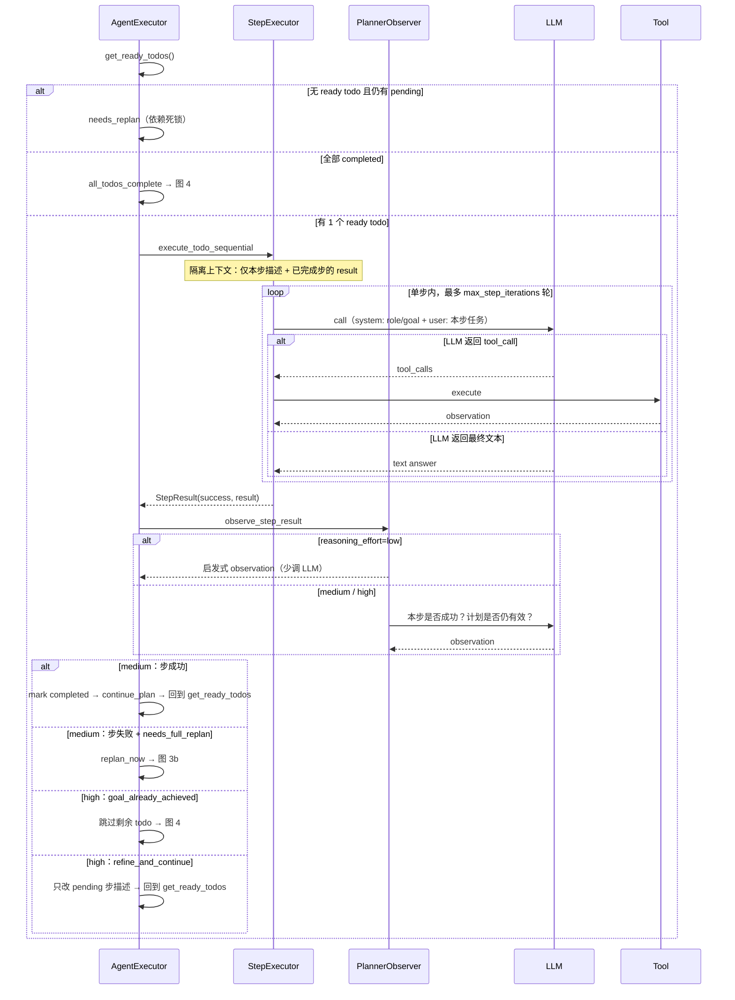
```mermaid
sequenceDiagram
    participant EX as AgentExecutor
    participant SE as StepExecutor
    participant PO as PlannerObserver
    participant LLM
    participant Tool

    EX->>EX: get_ready_todos()
    alt 无 ready todo 且仍有 pending
        EX->>EX: needs_replan（依赖死锁）
    else 全部 completed
        EX->>EX: all_todos_complete → 图 4
    else 有 1 个 ready todo
        EX->>SE: execute_todo_sequential

        Note over SE: 隔离上下文：仅本步描述 + 已完成步的 result
        loop 单步内，最多 max_step_iterations 轮
            SE->>LLM: call（system: role/goal + user: 本步任务）
            alt LLM 返回 tool_call
                LLM-->>SE: tool_calls
                SE->>Tool: execute
                Tool-->>SE: observation
            else LLM 返回最终文本
                LLM-->>SE: text answer
            end
        end
        SE-->>EX: StepResult(success, result)

        EX->>PO: observe_step_result
        alt reasoning_effort=low
            PO-->>EX: 启发式 observation（少调 LLM）
        else medium / high
            PO->>LLM: 本步是否成功？计划是否仍有效？
            LLM-->>PO: observation
        end

        alt medium：步成功
            EX->>EX: mark completed → continue_plan → 回到 get_ready_todos
        else medium：步失败 + needs_full_replan
            EX->>EX: replan_now → 图 3b
        else high：goal_already_achieved
            EX->>EX: 跳过剩余 todo → 图 4
        else high：refine_and_continue
            EX->>EX: 只改 pending 步描述 → 回到 get_ready_todos
        end
    end
```

---

##### 图 3b：replan 时序（步失败或计划失效）

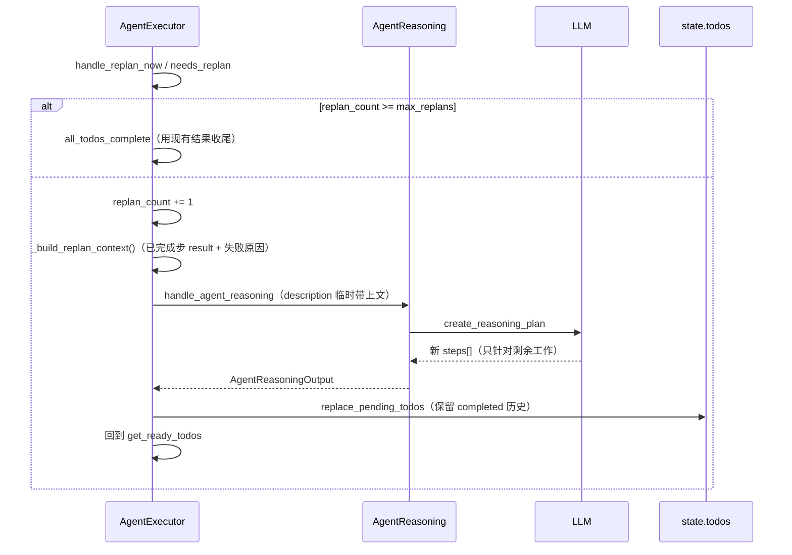
```mermaid
sequenceDiagram
    participant EX as AgentExecutor
    participant AR as AgentReasoning
    participant LLM
    participant ST as state.todos

    EX->>EX: handle_replan_now / needs_replan
    alt replan_count >= max_replans
        EX->>EX: all_todos_complete（用现有结果收尾）
    else
        EX->>EX: replan_count += 1
        EX->>EX: _build_replan_context()（已完成步 result + 失败原因）
        EX->>AR: handle_agent_reasoning（description 临时带上文）
        AR->>LLM: create_reasoning_plan
        LLM-->>AR: 新 steps[]（只针对剩余工作）
        AR-->>EX: AgentReasoningOutput
        EX->>ST: replace_pending_todos（保留 completed 历史）
        EX->>EX: 回到 get_ready_todos
    end
```

---

##### 图 4：阶段 ④ 收尾时序（`finalize`）

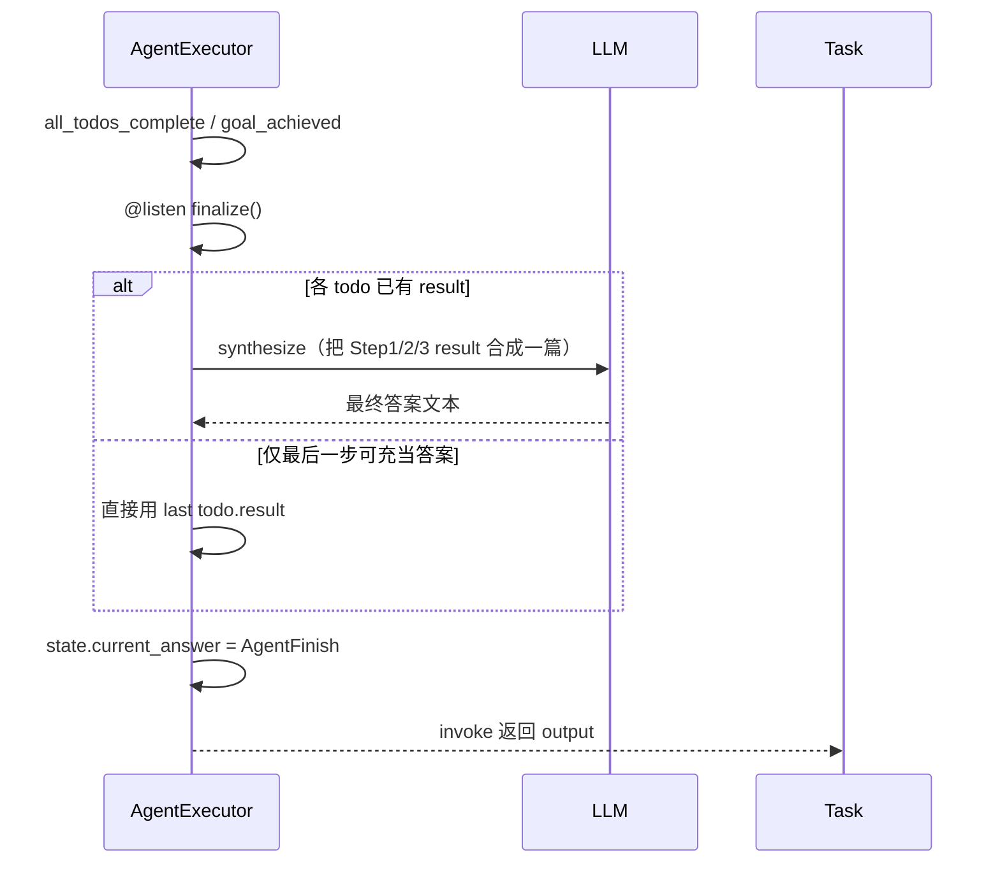
```mermaid
sequenceDiagram
    participant EX as AgentExecutor
    participant LLM
    participant Task

    EX->>EX: all_todos_complete / goal_achieved
    EX->>EX: @listen finalize()

    alt 各 todo 已有 result
        EX->>LLM: synthesize（把 Step1/2/3 result 合成一篇）
        LLM-->>EX: 最终答案文本
    else 仅最后一步可充当答案
        EX->>EX: 直接用 last todo.result
    end

    EX->>EX: state.current_answer = AgentFinish
    EX-->>Task: invoke 返回 output
```

---

##### 图 5：无 todos 时退回 ReAct

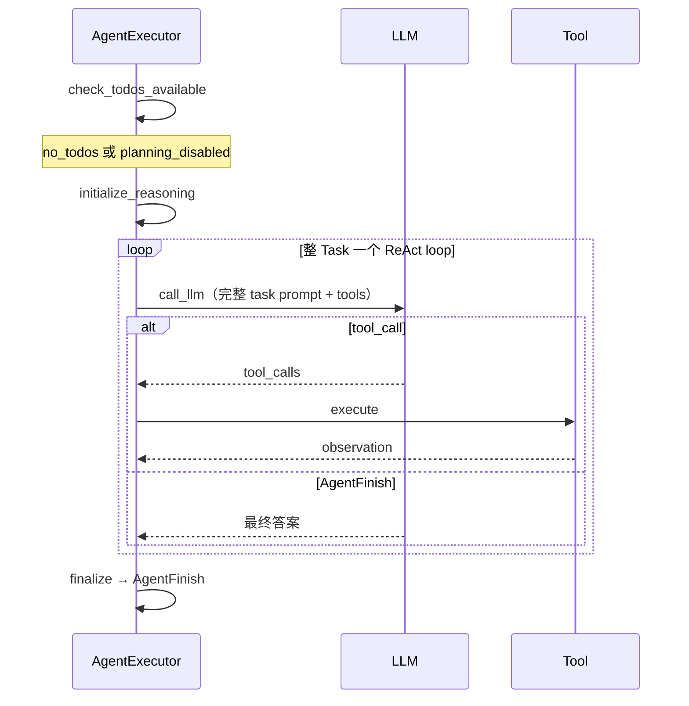
```mermaid
sequenceDiagram
    participant EX as AgentExecutor
    participant LLM
    participant Tool

    EX->>EX: check_todos_available
    Note over EX: no_todos 或 planning_disabled
    EX->>EX: initialize_reasoning
    loop 整 Task 一个 ReAct loop
        EX->>LLM: call_llm（完整 task prompt + tools）
        alt tool_call
            LLM-->>EX: tool_calls
            EX->>Tool: execute
            Tool-->>EX: observation
        else AgentFinish
            LLM-->>EX: 最终答案
        end
    end
    EX->>EX: finalize → AgentFinish
```

---

##### 对照表：Agent.plan 里谁干什么

| 组件 | 角色 | 类比 |
|------|------|------|
| `AgentReasoning` | 写/改施工清单 | 工长列计划 |
| `state.todos` | 清单数据结构 | 白板上的 checkbox |
| `StepExecutor` | 执行**一条** todo | 工人只做当前工序 |
| `PlannerObserver` | 验收本步，决定是否改计划 | 监理 |
| `finalize` + synthesize | 把各步 result 合成 Task 最终输出 | 写竣工报告 |

**源码锚点**：`experimental/agent_executor.py`（Flow 路由）、`utilities/reasoning_handler.py`（规划）、`agents/step_executor.py`（单步执行）、`agents/planner_observer.py`（验收）。

---

### 3.10 Skill — 外部 prompt 扩展

**抽象**：文件系统能力包（`SKILL.md` + `scripts/` / `references/` / `assets/`）。

**渐进披露**（`skills/models.py`）：

| 级别 | 值 | 加载内容 |
|------|-----|----------|
| METADATA | 1 | frontmatter（name, description） |
| INSTRUCTIONS | 2 | 完整 SKILL.md body |
| RESOURCES | 3 | 资源目录清单 |

**连接**：

- 配置：`Agent.skills` 或 `Crew.skills`
- 加载：`setup_agents` → `agent.set_skills()` → `skills/loader.py`
- 注入：格式化后写入 Agent system prompt（`utilities/prompts.py`）

---

## 4. 引用关系总图

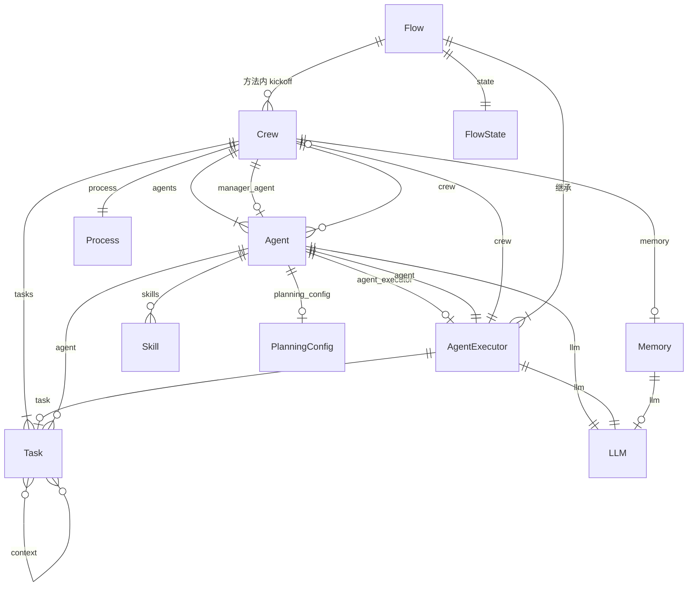
```mermaid
erDiagram
    Flow ||--o{ Crew : "方法内 kickoff"
    Flow ||--|| FlowState : "state"
    Crew ||--|{ Agent : "agents"
    Crew ||--|{ Task : "tasks"
    Crew ||--|| Process : "process"
    Crew ||--o| Memory : "memory"
    Crew ||--o| Agent : "manager_agent"
    Task }o--|| Agent : "agent"
    Task }o--o{ Task : "context"
    Agent ||--|| LLM : "llm"
    Agent ||--o| AgentExecutor : "agent_executor"
    Agent }o--|| Crew : "crew"
    Agent ||--o{ Skill : "skills"
    Agent ||--o| PlanningConfig : "planning_config"
    AgentExecutor ||--|| Agent : "agent"
    AgentExecutor ||--o| Crew : "crew"
    AgentExecutor ||--o| Task : "task"
    AgentExecutor ||--|| LLM : "llm"
    AgentExecutor }|--|| Flow : "继承"
    Memory ||--o| LLM : "llm"
```

**所有权 vs 借用**：

- `Crew` **拥有** agents/tasks 列表；kickoff 时 **借用** 给 Task 执行
- `Agent` **拥有** `agent_executor`；每个 Task 可能 **更新** executor 的 task/tools
- `AgentExecutor` **借用** agent/crew/task/llm，不复制

**运行时绑定时机**：`agent.crew`、`executor.task`、`executor.crew` 在 `prepare_kickoff` / `create_agent_executor` 时写入，非构造时固定。

---

## 5. 三条执行链路

### A. `Crew.kickoff()`

```text
kickoff()
  → prepare_kickoff()              # hooks, 插值, setup_agents, crew planning
  → _run_sequential() | _run_hierarchical()
  → _execute_tasks()
       → prepare_task_execution()  # 选 agent, _prepare_tools()
       → task.execute_sync()
            → agent.execute_task()
                 → create_agent_executor()
                 → agent_executor.invoke()
                      → self.kickoff()   # 内层 Flow
  → _create_crew_output()
  → _drain_memory_writes()
```

**源码锚点**：`crew.py` `kickoff`（~978）、`_execute_tasks`（~1536）、`_get_agent_to_use`（~1692）；`crews/utils.py` `prepare_kickoff`（~249）、`setup_agents`（~71）；`task.py` `_execute_core`（~762）；`agent/core.py` `execute_task`（~760）。

### B. `Agent.execute_task()`

```text
_prepare_task_execution()
→ handle_knowledge_retrieval()
→ _finalize_task_prompt() → create_agent_executor()
→ _execute_without_timeout()
    → agent_executor.invoke({"input": task_prompt, ...})
         → reset AgentExecutorState
         → _setup_messages()
         → kickoff()              # ReAct / plan 节点图
→ _finalize_task_execution()
```

**源码锚点**：`agent/core.py` `execute_task`、`create_agent_executor`；`experimental/agent_executor.py` `invoke`（~2719）。

### C. `Flow.kickoff()`

```text
kickoff() [sync → asyncio.run]
  → kickoff_async()
       → 初始化/恢复 state
       → 遍历 @start 方法
       → _execute_method() + _execute_listeners()
       → 返回最后一个方法返回值
```

**源码锚点**：`flow/runtime/__init__.py` `kickoff_async`（~1998）。

---

## 6. 横切能力注入（`_prepare_tools`）

Crew 不把这些写死在 Agent 构造里，而在 **每个 Task 执行前** 动态注入 tools（`crew.py` `_prepare_tools`）：

| 条件 | 注入 |
|------|------|
| `allow_delegation` + hierarchical | Manager delegation tools |
| `allow_delegation` + sequential | Agent delegation tools |
| `allow_code_execution` | 代码执行 tools |
| `memory` 启用 | Memory recall/save tools |
| `mcps` / `apps` | MCP / platform tools |
| 多模态文件 | File tools |

---

## 7. 设计要点（读源码结论）

1. **Flow 出现两次**：用户 Flow（L0）+ AgentExecutor Flow（L3），同一 `flow/runtime`。
2. **Crew 不做 LLM 循环**：Crew 只循环 Task；LLM 循环全在 AgentExecutor。
3. **Process 只是枚举**：逻辑在 `_get_agent_to_use()` 和 `_prepare_tools()`。
4. **引用在 kickoff 时绑定**：`agent.crew`、`executor.task` 运行时写入。
5. **三种用户入口共用底座**：`Crew.kickoff`、`Flow.kickoff`、`Agent.kickoff` 共用 event bus、hooks、LLM providers、Flow runtime。

---

## 8. 与 demo / 架构文档对照

| 文档 | 内容 |
|------|------|
| [CREWAI_ARCHITECTURE_ANALYSIS.md](./CREWAI_ARCHITECTURE_ANALYSIS.md) | 全量架构、§0 能力图、§11 Flow DSL、时序图 |
| [examples/crewai-hermes-demo](../../examples/crewai-hermes-demo/) | `ConceptsDemoFlow`：L0 Flow + hierarchical Crew（可选 Crew.planning） |
| [examples/crewai-hermes-demo/CONCEPTS.md](../../examples/crewai-hermes-demo/CONCEPTS.md) | demo 层级对照；LLM 读 Hermes active profile |
| [OpenHarness 05-plan-mode 对比](../../OpenHarness/docs/framework-comparison/05-plan-mode.md) | 跨框架 Plan / 编排者对比 |

---

## 9. 源码文件索引

| 实体 | 主文件 |
|------|--------|
| Flow | `flow/flow.py`, `flow/runtime/__init__.py`, `flow/dsl/` |
| Crew | `crew.py`, `crews/utils.py`, `crews/crew_output.py` |
| Process | `process.py` |
| Agent | `agent/core.py`, `agents/agent_builder/base_agent.py` |
| Task | `task.py`, `tasks/task_output.py` |
| LLM | `llm.py`, `llms/base_llm.py`, `llms/providers/` |
| Memory | `memory/unified_memory.py`, `memory/recall_flow.py` |
| AgentExecutor | `experimental/agent_executor.py`, `agents/agent_builder/base_agent_executor.py` |
| PlanningConfig | `agent/planning_config.py` |
| Skill | `skills/models.py`, `skills/loader.py` |
