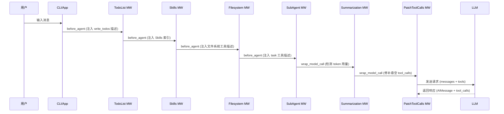
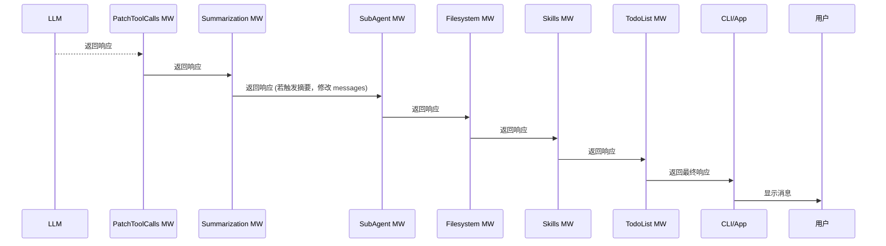
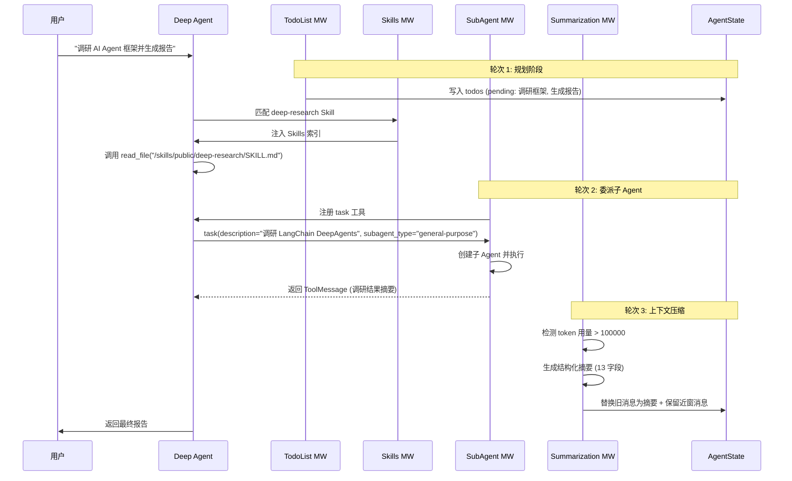

# Deep Agents Middleware Chain 深度设计文档

> **本文目标**：深入解析 `create_deep_agent` 中的 10+ 个中间件，从源码级揭示执行流程、钩子机制、状态变更。  
> **参考 DeerFlow 范式**：采用 DeerFlow Harness 的中间件分析风格（见 `deer-flow/backend/docs/DEERFLOW_FRAMEWORK_QA_ARCHIVE.md` §9）。  
> **适用版本**：`deepagents==0.5.1`、`langchain>=0.3.x`。

---

## 阅读地图

| 章节 | 内容 |
|------|------|
| [一、中间件链总览](#一中间件链总览) | 完整顺序、洋葱模型、钩子类型 |
| [二、前置中间件详解](#二前置中间件详解) | TodoList、Skills、Filesystem、SubAgent |
| [三、核心中间件详解](#三核心中间件详解) | Summarization、PatchToolCalls、AsyncSubAgent |
| [四、后置中间件详解](#四后置中间件详解) | Profile extra、ToolExclusion、Caching、Memory、HITL、Permission |
| [五、中间件执行流程](#五中间件执行流程) | 请求/响应路径、状态变更时序图 |
| [六、自定义中间件开发](#六自定义中间件开发) | 钩子选择、最佳实践、常见陷阱 |

---

## 一、中间件链总览

### 1.1 完整中间件顺序

**源码**：`deepagents/graph.py:284-304`

```python
# Base stack (前置中间件)
middleware_stack = [
    TodoListMiddleware(),                      # 1. Plan 模式待办管理
    SkillsMiddleware(skills=skills),           # 2. Skills 渐进加载（若配置）
    FilesystemMiddleware(backend=backend),     # 3. 文件系统工具注册
    SubAgentMiddleware(subagents=subagents),   # 4. 同步子 Agent
    SummarizationMiddleware(...),              # 5. 上下文压缩
    PatchToolCallsMiddleware(),                # 6. 修补悬空 tool_calls
]

# Async subagents (条件挂载)
if has_async_subagents:
    middleware_stack.append(AsyncSubAgentMiddleware(async_subagents))

# User middleware (用户自定义插入点)
middleware_stack.extend(user_middleware)

# Tail stack (后置中间件)
middleware_stack.extend(profile_extra_middleware)       # 7. 提供商特定中间件
if profile.excluded_tools:
    middleware_stack.append(_ToolExclusionMiddleware(...))  # 8. 排除特定工具
middleware_stack.append(AnthropicPromptCachingMiddleware())  # 9. Anthropic 缓存
if memory:
    middleware_stack.append(MemoryMiddleware(memory=memory))  # 10. 记忆系统
if interrupt_on:
    middleware_stack.append(HumanInTheLoopMiddleware(interrupt_on=interrupt_on))  # 11. HITL
if permissions:
    middleware_stack.append(_PermissionMiddleware(permissions))  # 12. 权限控制（始终最后）
```

### 1.2 洋葱模型（Onion Model）

中间件执行遵循 **洋葱模型**：外层中间件先接收请求、后处理响应。

```
请求路径 (Request):
  TodoList → Skills → Filesystem → SubAgent → Summarization → PatchToolCalls → ... → Model
                                                                          ↓
响应路径 (Response):
  TodoList ← Skills ← Filesystem ← SubAgent ← Summarization ← PatchToolCalls ← ... ← Model
```

**示例**：
- `TodoListMiddleware` 在请求阶段注入 `write_todos` 工具描述到 system prompt。
- `SummarizationMiddleware` 在响应阶段检测 token 超限并触发摘要。
- `PatchToolCallsMiddleware` 在请求阶段修补悬空 tool_calls。

### 1.3 钩子类型（Hook Types）

LangChain 中间件支持以下钩子（见 `langchain.agents.middleware.types.AgentMiddleware`）：

| 钩子名 | 触发时机 | 典型用途 |
|--------|---------|---------|
| `before_agent` | Agent 启动前 | 初始化状态、注入 system prompt |
| `wrap_model_call` | 模型调用前后 | 修改请求消息、处理响应、异常捕获 |
| `after_tool_execution` | 工具执行后 | 记录日志、更新状态 |
| `before_tool_execution` | 工具执行前 | 权限检查、参数验证 |

**Deep Agents 主要使用**：
- `before_agent`：注入 prompt 片段（Skills、Memory、Filesystem）。
- `wrap_model_call`：修补消息（PatchToolCalls）、触发摘要（Summarization）。

---

## 二、前置中间件详解

### 2.1 `TodoListMiddleware`

**源码**：`langchain.agents.middleware.todo.TodoListMiddleware`

**作用**：管理 Plan 模式的待办列表。

#### 2.1.1 钩子实现

```python
def before_agent(self, request: AgentRequest, state: AgentState) -> None:
    """注入 write_todos 工具描述到 system prompt."""
    append_to_system_message(request, WRITE_TODOS_SYSTEM_PROMPT)
```

#### 2.1.2 注入的 Prompt

**常量**：`WRITE_TODOS_SYSTEM_PROMPT`（来自 `langchain.agents.middleware.todo`）

```
## `write_todos`

你可以使用 `write_todos` 工具来管理和规划复杂目标。
对于复杂目标，应使用该工具，确保跟踪每一个必要步骤，并让用户看到你的进展。
该工具非常有助于规划复杂目标，并将较大的复杂目标拆解为更小的步骤。

关键在于：每完成一步就要尽快将对应待办标为完成，不要把多步攒在一起才勾选。
对于只需少数几步的简单目标，最好直接完成目标，**不要**使用该工具。
写待办会消耗时间与 token；仅在管理复杂、多步问题时使用；简单、步数少的请求不要用。

## 待办列表使用要点（务必记住）
- **不要**在同一轮里**并行**多次调用 `write_todos`。
- 执行过程中可以随时**修订**待办列表：新信息可能带来新任务，或使旧任务失效。
```

#### 2.1.3 工具 Schema

**工具名**：`write_todos`  
**Schema**：由 LangChain 自动注册（不在 Deep Agents 源码中）。  
**参数**：
```json
{
  "type": "object",
  "properties": {
    "todos": {
      "type": "array",
      "items": {
        "type": "object",
        "properties": {
          "content": {"type": "string"},
          "status": {"type": "string", "enum": ["pending", "in_progress", "completed"]}
        }
      }
    }
  }
}
```

#### 2.1.4 状态字段

**字段名**：`todos`（定义在 `AgentState` 基类中）  
**类型**：`list[dict[str, str]]`  
**Reducer**：默认 last-write-wins（无自定义合并逻辑）。

#### 2.1.5 使用规则

**何时使用**：
- 任务超过 3 步。
- 需要向用户展示进度。
- 任务可分解为独立子步骤。

**何时不使用**：
- 简单查询（「今天天气如何」）。
- 单步操作（「读取 file.txt」）。
- 临时性任务（无需追踪）。

**常见错误**：
- ❌ 并行调用多次 `write_todos`（同一轮只能调用一次）。
- ❌ 忘记标记已完成的任务（导致待办列表膨胀）。
- ❌ 在简单任务上使用（浪费 token 和延迟）。

---

### 2.2 `SkillsMiddleware`

**源码**：`deepagents/middleware/skills.py`

**作用**：Skills 渐进披露与加载。

#### 2.2.1 钩子实现

```python
def before_agent(self, request: AgentRequest, state: AgentState) -> None:
    """扫描 skills 目录，生成索引并注入 system prompt."""
    if not self.skills:
        return
    
    # 1. 扫描目录
    skills_metadata = self._scan_skills_directories(self.skills)
    
    # 2. 生成索引文本
    locations_text = self._format_skills_locations(skills_metadata)
    list_text = self._format_skills_list(skills_metadata)
    
    # 3. 填充模板
    prompt = SKILLS_SYSTEM_PROMPT.format(
        skills_locations=locations_text,
        skills_list=list_text,
    )
    
    # 4. 注入 system prompt
    append_to_system_message(request, prompt)
    
    # 5. 保存元数据到状态
    state["skills_metadata"] = skills_metadata
```

#### 2.2.2 注入的 Prompt

**模板**：`SKILLS_SYSTEM_PROMPT`（`deepagents/middleware/skills.py:50-80`）

```
## 技能系统（Skills System）

你可以访问技能库，获得专门能力与领域知识。

{skills_locations}

**可用技能：**

{skills_list}

**如何使用技能（渐进披露）：**

技能采用**渐进披露**：上面只看到名称与描述，需要时再读取完整说明。

1. **判断任务是否匹配某技能**  
2. **按列表中的路径读取技能全文**  
3. **遵循 SKILL.md 中的流程与最佳实践**  
4. **引用资源时使用绝对路径**

**何时使用技能：** 用户请求匹配技能领域、需要结构化工作流或成熟模式时。

**执行技能脚本：** 若技能内含脚本，**务必**使用技能列表给出的绝对路径。
```

**示例输出**（`{skills_locations}`）：
```markdown
**Public Skills**: `/skills/public/`
```

**示例输出**（`{skills_list}`）：
```markdown
- **bootstrap**: Generate a personalized SOUL.md through a warm, adaptive onboarding conversation. Trigger when the user wants to create, set up, or initialize their AI partner's identity — e.g., "create my SOUL.md", "bootstrap my agent", "set up my AI partner", "define who you are", "let's do onboarding", "personalize this AI", "make you mine", or when a SOUL.md is missing. Also trigger for updates: "update my SOUL.md", "change my AI's personality", "tweak the soul".
  -> Read `/skills/public/bootstrap/SKILL.md` for full instructions
- **deep-research**: Use this skill instead of WebSearch for ANY question requiring web research. Trigger on queries like "what is X", "explain X", "compare X and Y", "research X", or before content generation tasks. Provides systematic multi-angle research methodology instead of single superficial searches. Use this proactively when the user's question needs online information.
  -> Read `/skills/public/deep-research/SKILL.md` for full instructions
- **frontend-design**: Create distinctive, production-grade frontend interfaces with high design quality. Use this skill when the user asks to build web components, pages, artifacts, posters, or applications (examples include websites, landing pages, dashboards, React components, HTML/CSS layouts, or when styling/beautifying any web UI). Generates creative, polished code and UI design that avoids generic AI aesthetics. (License: Complete terms in LICENSE.txt)
  -> Read `/skills/public/frontend-design/SKILL.md` for full instructions
```

#### 2.2.3 状态字段

**字段名**：`skills_metadata`  
**类型**：`dict[str, dict[str, str]]`（skill_name → {name, description, path}）  
**Reducer**：last-write-wins（无自定义合并）。

#### 2.2.4 工作流程

1. **启动时扫描**：遍历配置的 `skills` 目录（如 `["/skills/public/", "/skills/user/"]`）。
2. **提取元数据**：读取每个 `SKILL.md` 的 YAML frontmatter（name、description）。
3. **生成索引**：拼接成短文本（~50-200 tokens）。
4. **注入 prompt**：附加到 system message。
5. **按需加载**：模型调用 `read_file("/skills/public/deep-research/SKILL.md")` → 获得完整指南（~2000-5000 tokens）。

#### 2.2.5 Token 优化

**优势**：
- **不在每次请求都携带长篇指南**：索引仅 ~100-200 tokens。
- **按需加载**：只有模型判断需要时才读取完整 SKILL.md。
- **缓存友好**：SKILL.md 内容稳定，可被 `AnthropicPromptCachingMiddleware` 缓存。

**对比传统方式**：
- ❌ 传统：将所有 Skill 正文直接拼入 system prompt（~10000+ tokens）。
- ✅ Deep Agents：仅索引 + 渐进加载（~200 tokens + 按需读取）。

---

### 2.3 `FilesystemMiddleware`

**源码**：`deepagents/middleware/filesystem.py`

**作用**：注册文件系统工具并注入使用规范。

#### 2.3.1 钩子实现

```python
def before_agent(self, request: AgentRequest, state: AgentState) -> None:
    """注入文件系统工具描述到 system prompt."""
    # 1. 注入基础工具说明
    append_to_system_message(request, FILESYSTEM_SYSTEM_PROMPT)
    
    # 2. 若后端支持沙箱，注入 execute 工具说明
    if isinstance(self.backend, SandboxBackendProtocol):
        append_to_system_message(request, EXECUTION_SYSTEM_PROMPT)
```

#### 2.3.2 注入的 Prompt

**模板**：`FILESYSTEM_SYSTEM_PROMPT`（`deepagents/middleware/filesystem.py:100-150`）

```
## 文件系统工具 `ls`、`read_file`、`write_file`、`edit_file`、`glob`、`grep`

你可以通过下列工具与文件系统交互。**所有路径必须以 `/` 开头。**

- ls：列出目录（需绝对路径）  
- read_file：读文件  
- write_file：写文件  
- edit_file：编辑文件  
- glob：按模式找文件（如 `**/*.py`）  
- grep：在文件中搜索文本  

**路径规范：**
- 所有路径必须是绝对路径（以 `/` 开头）。
- 虚拟路径映射：`/mnt/user-data/` → 实际工作目录。
- 禁止访问 `/etc`、`/proc` 等系统目录（若后端启用沙箱）。
```

**沙箱执行提示**（`EXECUTION_SYSTEM_PROMPT`）：
```
## 执行工具 `execute`

在支持沙箱的后端下，可使用 `execute` 在沙箱环境中执行 shell 命令（返回输出与退出码）。

**安全限制：**
- 禁止执行 `rm -rf /`、`mkfs` 等危险命令。
- 命令超时限制：30 秒。
- 输出截断：最多 10000 字符。
```

#### 2.3.3 工具注册

**工具清单**：
| 工具名 | 函数 | 作用 |
|--------|------|------|
| `ls` | `ls(path: str)` | 列出目录内容 |
| `read_file` | `read_file(path: str)` | 读取文件内容 |
| `write_file` | `write_file(path: str, content: str)` | 写入文件 |
| `edit_file` | `edit_file(path: str, old_str: str, new_str: str)` | 编辑文件（字符串替换） |
| `glob` | `glob(pattern: str)` | 按通配符找文件 |
| `grep` | `grep(pattern: str, path: str)` | 在文件中搜索文本 |
| `execute` | `execute(command: str)` | 执行 shell 命令（需沙箱） |

**注册方式**：通过 `create_deep_agent(tools=[...])` 传入，或由中间件自动注册。

#### 2.3.4 Backend 协议

**接口**：`BackendProtocol`、`SandboxBackendProtocol`

**实现**：
- `StateBackend`：基于 LangGraph Store 的内存/持久化后端。
- `FilesystemBackend`：本地文件系统后端（`root_dir` 映射到 `/mnt/user-data/`）。
- 自定义后端：实现 `read()`、`write()`、`list()`、`execute()` 方法。

**路径虚拟化**：
```
模型视角：/mnt/user-data/project/main.py
实际路径：{root_dir}/project/main.py
```

---

### 2.4 `SubAgentMiddleware`

**源码**：`deepagents/middleware/subagents.py`

**作用**：注册 `task` 工具并注入子 Agent 编排说明。

#### 2.4.1 钩子实现

```python
def before_agent(self, request: AgentRequest, state: AgentState) -> None:
    """注入子 Agent 编排说明到 system prompt."""
    # 1. 生成可用子 Agent 列表
    available_agents = self._format_available_agents(self.subagents)
    
    # 2. 填充 TASK_TOOL_DESCRIPTION 模板
    task_description = TASK_TOOL_DESCRIPTION.format(
        available_agents=available_agents
    )
    
    # 3. 注入系统提示
    append_to_system_message(request, TASK_SYSTEM_PROMPT)
    
    # 4. 注册 task 工具（通过 tools 通道，非 system prompt）
    #    task 工具的 description = task_description
```

#### 2.4.2 注入的 Prompt

**模板**：`TASK_SYSTEM_PROMPT`（`deepagents/middleware/subagents.py:250-320`）

```
## `task`（子智能体生成器）

你可以使用 **`task` 工具**启动**短生命周期子智能体**来处理隔离任务。这些智能体是**临时的**——仅在该任务期间存在，并返回**单一结果**。

**何时使用 `task`：**
- 任务复杂、多步，且可以**完整委托**在隔离环境中完成  
- 任务与其他任务**独立**，可**并行**执行  
- 需要集中推理或大量 token/上下文，避免拖垮主会话  
- 沙箱能提高可靠性（如代码执行、结构化检索、数据整理）  
- 你只关心子智能体的**最终结果**，不关心其中间推理过程（例如大量调研后返回合成报告、多步计算/查询后返回简明答案）

**子智能体生命周期：**
1. **生成（Spawn）** — 给出清晰角色、指令与期望输出  
2. **运行（Run）** — 子智能体自主完成任务  
3. **返回（Return）** — 子智能体给出单一结构化结果  
4. **合并（Reconcile）** — 在主线程中吸收或综合该结果  

**何时不使用 `task`：**
- 你需要在子智能体结束后仍看到**中间推理或步骤**（`task` 会隐藏这些）  
- 任务很琐碎（少数几次工具调用或简单查询即可）  
- 委派不能降低 token、复杂度或上下文切换成本  
- 拆分只会增加延迟而没有收益  

## 使用 `task` 的重要备忘
- 在可能的情况下**并行**推进工作：对 **tool_calls** 与 **tasks（子智能体）** 皆然；彼此独立的步骤应并行发起，以节省用户时间。  
- 在多部分目标中，用 `task` **隔离**相互独立的子任务。  
- 当你有**复杂、多步且与其他待办相对独立**的任务时，应使用 `task`；这些子智能体能力强、效率高。
```

#### 2.4.3 工具 Schema

**工具名**：`task`  
**输入 Schema**：`TaskToolSchema`（`deepagents/middleware/subagents.py:179-189`）

```python
class TaskToolSchema(BaseModel):
    description: str = Field(
        description="A detailed description of the task for the subagent to perform autonomously. Include all necessary context and specify the expected output format."
    )
    subagent_type: str = Field(
        description="The type of subagent to use. Must be one of the available agent types listed in the tool description."
    )
```

**工具描述**（`TASK_TOOL_DESCRIPTION`）：
```
Launch an ephemeral subagent to handle complex, multi-step independent tasks with isolated context windows.

Available agent types and the tools they have access to:
- general-purpose: 用于研究复杂问题、搜索文件与内容、执行多步任务；在关键词/文件搜索不确定能否前几轮命中时，应用该智能体代为搜索；**与主智能体拥有相同工具集**。

When using the Task tool, you must specify a subagent_type parameter to select which agent type to use.

## Usage notes:
1. Launch multiple agents concurrently whenever possible, to maximize performance; to do that, use a single message with multiple tool uses
2. When the agent is done, it will return a single message back to you. The result returned by the agent is not visible to the user. To show the user the result, you should send a text message back to the user with a concise summary of the result.
...
```

#### 2.4.4 子 Agent 配置

**类型**：`SubAgent`（TypedDict）

```python
class SubAgent(TypedDict):
    name: str                          # 唯一标识
    description: str                   # 功能描述
    system_prompt: str                 # 系统提示
    tools: NotRequired[Sequence[...]]  # 工具列表（可选，默认继承主 Agent）
    model: NotRequired[str | BaseChatModel]  # 模型（可选，覆盖主模型）
    middleware: NotRequired[list[AgentMiddleware]]  # 中间件（可选）
    interrupt_on: NotRequired[dict[str, bool | InterruptOnConfig]]  # HITL 配置
    skills: NotRequired[list[str]]     # Skills 目录
    permissions: NotRequired[list[FilesystemPermission]]  # 权限规则
    response_format: NotRequired[ResponseFormat[Any] | type | dict[str, Any]]  # 结构化输出
```

**默认子 Agent**：若未提供 `general-purpose`，自动添加：

```python
GENERAL_PURPOSE_SUBAGENT = {
    "name": "general-purpose",
    "description": "用于研究复杂问题、搜索文件与内容、执行多步任务",
    "system_prompt": DEFAULT_SUBAGENT_PROMPT,
    "tools": [],  # 继承主 Agent 工具
}
```

#### 2.4.5 执行流程

1. **模型调用**：`task(description="调研竞品 A 和 B", subagent_type="general-purpose")`。
2. **创建子 Agent**：内部调用 `create_agent(model=subagent.model, tools=subagent.tools, system_prompt=subagent.system_prompt, ...)`。
3. **执行子任务**：子 Agent 在自己的 `AgentState` 中运行，可能经历多轮 ReAct。
4. **提取结果**：子 Agent 的最后一条消息（`AIMessage.content`）提取为字符串。
5. **返回主 Agent**：包装成 `ToolMessage(tool_call_id=..., content=result_string)`。

**注意**：
- 子 Agent 的过程消息 **不进入主 checkpoint**。
- 子 Agent 不支持 `ask_clarification`（避免子 thread checkpoint 复杂性）。
- 子 Agent 默认中间件栈：`TodoListMiddleware`、`FilesystemMiddleware`、`SummarizationMiddleware`。

---

## 三、核心中间件详解

### 3.1 `SummarizationMiddleware`

**源码**：`deepagents/middleware/summarization.py`

**作用**：上下文压缩，防止超出模型窗口限制。

#### 3.1.1 钩子实现

```python
def wrap_model_call(
    self,
    request: ModelRequest,
    handler: Callable[[ModelRequest], Awaitable[ModelResponse]],
) -> Awaitable[ModelResponse]:
    """在模型调用前后检测 token 用量并触发摘要."""
    # 1. 检测当前 token 用量
    total_tokens = self._count_tokens(request.messages)
    
    # 2. 若超过阈值，触发摘要
    if total_tokens > self.max_tokens_before_summary:
        request = self._summarize_messages(request)
    
    # 3. 调用内层 handler
    response = await handler(request)
    
    # 4. 返回响应
    return response
```

#### 3.1.2 压缩策略

**5 阶段压缩流程**：

1. **廉价预压缩**：清除旧的工具结果（无需 LLM 调用）。
   ```python
   messages = self._strip_old_tool_results(messages)
   ```

2. **确定压缩范围**：计算需要压缩的消息区间（保留最近 N 条）。
   ```python
   cutoff_index = len(messages) - self.keep_recent_messages
   messages_to_summarize = messages[:cutoff_index]
   messages_to_keep = messages[cutoff_index:]
   ```

3. **生成结构化摘要**：调用 LLM 生成 13 字段的结构化摘要。
   ```python
   summary_prompt = SUMMARY_PROMPT.format(
       messages=get_buffer_string(messages_to_summarize)
   )
   summary_response = await self.model.invoke([HumanMessage(content=summary_prompt)])
   ```

   **摘要字段**（13 个）：
   - 用户目标（User Goal）
   - 关键发现（Key Findings）
   - 已完成步骤（Completed Steps）
   - 待办状态（Todo Status）
   - 技术决策（Technical Decisions）
   - 遇到的问题（Issues Encountered）
   - 下一步计划（Next Steps）
   - 重要代码片段（Important Code Snippets）
   - 文件操作记录（File Operations）
   - 工具调用统计（Tool Call Statistics）
   - 用户偏好（User Preferences）
   - 约束条件（Constraints）
   - 未完成事项（Pending Items）

4. **组装压缩后消息**：保留 head（系统消息）+ 插入 summary + 保留 tail（近窗消息）。
   ```python
   compressed_messages = [
       SystemMessage(content=request.system_prompt),
       HumanMessage(content=f"## Conversation Summary\n{summary_response.content}"),
       *messages_to_keep,
   ]
   ```

5. **清理孤立工具对**：确保每个 `tool_call` 都有对应的 `tool_result`。
   ```python
   compressed_messages = self._fix_dangling_tool_calls(compressed_messages)
   ```

#### 3.1.3 配置参数

**工厂函数**：`create_summarization_middleware()`

```python
from deepagents.middleware.summarization import create_summarization_middleware

summary_mw = create_summarization_middleware(
    model="anthropic:claude-sonnet-4-6",
    max_tokens_before_summary=100000,  # 触发阈值（tokens）
    keep_recent_messages=12,            # 保留最近消息数
    summary_token_budget=3000,          # 摘要最大 token 数
    backend=FilesystemBackend(root_dir="/data"),  # 历史记录存储后端
)
```

**参数说明**：
| 参数 | 类型 | 默认值 | 说明 |
|------|------|--------|------|
| `model` | `str | BaseChatModel` | 必填 | 用于生成摘要的模型 |
| `max_tokens_before_summary` | `int` | 模型窗口的 80% | 触发摘要的 token 阈值 |
| `keep_recent_messages` | `int` | 12 | 保留的最近消息数 |
| `summary_token_budget` | `int` | 3000 | 摘要的最大 token 数 |
| `backend` | `BackendProtocol` | `None` | 历史记录存储后端（可选） |

#### 3.1.4 状态字段

**字段名**：`_summarization_event`（私有字段，`PrivateStateAttr`）  
**类型**：`SummarizationEvent | None`

```python
class SummarizationEvent(TypedDict):
    cutoff_index: int           # 摘要截断位置
    summary_message: HumanMessage  # 摘要消息
    file_path: str | None       # 历史记录文件路径（若配置 backend）
```

**用途**：追踪最近一次摘要事件，用于调试和监控。

#### 3.1.5 性能考量

**成本分析**：
- **摘要成本**：每次触发需额外调用一次 LLM（~3000 tokens 输入 + ~500 tokens 输出）。
- **收益**：避免超出窗口限制导致的错误，保持长期对话连贯性。
- **最佳实践**：设置阈值为模型窗口的 70-80%，预留缓冲。

**示例**（Claude Sonnet 4，窗口 200K tokens）：
- 触发阈值：`200000 * 0.8 = 160000` tokens。
- 摘要成本：~$0.05（输入 $0.003/1K，输出 $0.015/1K）。
- 避免错误：超出窗口会导致 API 拒绝请求（无法恢复）。

---

### 3.2 `PatchToolCallsMiddleware`

**源码**：`deepagents/middleware/patch_tool_calls.py`

**作用**：修补悬空的 `tool_calls`（模型叫了工具但历史上没有对应 `ToolMessage`）。

#### 3.2.1 钩子实现

```python
def wrap_model_call(
    self,
    request: ModelRequest,
    handler: Callable[[ModelRequest], Awaitable[ModelResponse]],
) -> Awaitable[ModelResponse]:
    """在模型调用前修补悬空 tool_calls."""
    # 1. 收集已有 ToolMessage 的 tool_call_id
    existing_tool_msg_ids = {
        msg.tool_call_id
        for msg in request.messages
        if isinstance(msg, ToolMessage)
    }
    
    # 2. 检测悬空 tool_calls
    needs_patch = False
    for msg in request.messages:
        if isinstance(msg, AIMessage) and msg.tool_calls:
            for call in msg.tool_calls:
                if call["id"] and call["id"] not in existing_tool_msg_ids:
                    needs_patch = True
                    break
    
    # 3. 若需要修补，构造新消息列表
    if needs_patch:
        patched_messages = []
        patched_ids = set()
        
        for msg in request.messages:
            patched_messages.append(msg)
            
            if isinstance(msg, AIMessage) and msg.tool_calls:
                for call in msg.tool_calls:
                    call_id = call.get("id")
                    if call_id and call_id not in existing_tool_msg_ids and call_id not in patched_ids:
                        # 插入占位 ToolMessage
                        patched_messages.append(
                            ToolMessage(
                                content="[Tool call was interrupted and did not return a result.]",
                                tool_call_id=call_id,
                                name=call.get("name", "unknown"),
                                status="error",
                            )
                        )
                        patched_ids.add(call_id)
        
        # 4. 覆盖请求消息
        request = request.override(messages=patched_messages)
    
    # 5. 调用内层 handler
    return await handler(request)
```

#### 3.2.2 为何不用 `before_agent` 直接改 state？

**模块注释**（`deepagents/middleware/patch_tool_calls.py:20-30`）：
> 若只靠 **`add_messages` 归约** 往列表末尾追加 synthetic `ToolMessage`，**无法保证**占位消息紧跟在「发出 `tool_calls` 的那条 `AIMessage`」之后；供应商与 LangChain 期望的是 **交替合法序列**（每条 tool call 之后、下一轮模型之前，有对应 `ToolMessage`）。因此必须在 **模型请求路径** 上 **按序重建 `messages` 列表**，把补丁 **插在每个悬空 `AIMessage` 的紧后面**。

**关键点**：
- **交替序列要求**：`AIMessage(tool_calls=[...])` → `ToolMessage(tool_call_id=...)` → `AIMessage(...)`。
- **`add_messages` reducer**：只能追加到列表末尾，无法插入到特定位置。
- **`wrap_model_call`**：可在请求发送前完全重写 `messages` 列表。

#### 3.2.3 占位消息语义

**内容**：`"[Tool call was interrupted and did not return a result.]"`  
**状态**：`status="error"`  
**目的**：
- **不假装**真实工具输出，只声明「被中断/未返回」。
- **恢复消息格式合法性**，让下一轮模型调用不因缺 `ToolMessage` 被 API 拒绝。
- **不是替业务「编造」**工具结果。

#### 3.2.4 触发场景

**常见原因**：
1. **用户中断**：用户按 `Ctrl+C` 停止当前任务。
2. **流式断开**：WebSocket 连接意外断开。
3. **崩溃重启**：进程崩溃后从 checkpoint 恢复。
4. **超时截断**：工具执行超时被强制终止。

**示例**：
```
轮次 1:
  AIMessage(tool_calls=[{"id": "call_123", "name": "read_file", ...}])
  [用户中断，未执行工具]

轮次 2 (恢复后):
  AIMessage(tool_calls=[{"id": "call_123", ...}])  # 悬空！
  [缺少 ToolMessage(tool_call_id="call_123")]

修补后:
  AIMessage(tool_calls=[{"id": "call_123", ...}])
  ToolMessage(tool_call_id="call_123", content="[Tool call was interrupted...]", status="error")
  [现在序列合法，可继续]
```

---

### 3.3 `AsyncSubAgentMiddleware`

**源码**：`deepagents/middleware/async_subagents.py`

**作用**：注册异步子 Agent 工具并注入使用说明。

#### 3.3.1 钩子实现

```python
def before_agent(self, request: AgentRequest, state: AgentState) -> None:
    """注入异步子 Agent 使用说明到 system prompt."""
    # 1. 生成可用异步子 Agent 列表
    available_agents = self._format_available_agents(self.async_subagents)
    
    # 2. 填充 ASYNC_TASK_TOOL_DESCRIPTION 模板
    task_description = ASYNC_TASK_TOOL_DESCRIPTION.format(
        available_agents=available_agents
    )
    
    # 3. 注入系统提示
    append_to_system_message(request, ASYNC_TASK_SYSTEM_PROMPT)
    
    # 4. 注册 5 个异步工具（通过 tools 通道）
    #    start_async_task, check_async_task, update_async_task, cancel_async_task, list_async_tasks
```

#### 3.3.2 注入的 Prompt

**模板**：`ASYNC_TASK_SYSTEM_PROMPT`（`deepagents/middleware/async_subagents.py:176-220`）

```
## Async subagents (remote LangGraph servers)

你有权访问异步子 Agent 工具，它们在远程 LangGraph 服务器上启动后台任务。

### Tools:
- `start_async_task`: 启动新后台任务。立即返回 task ID。
- `check_async_task`: 获取任务当前状态和结果。
- `update_async_task`: 向运行中的任务发送新指令。
- `cancel_async_task`: 停止运行中的任务。
- `list_async_tasks`: 列出所有追踪的任务及实时状态。

### Workflow:
1. **Start** — 使用 `start_async_task` 启动任务。向用户报告 task ID 并停止。
   不要立即检查状态 — 任务在后台运行，你和用户可继续其他工作。
2. **Check (on request)** — 仅在用户明确要求状态更新或结果时使用 `check_async_task`。
   若状态为 "running"，报告并停止 — 不要轮询。
3. **Update** (optional) — 使用 `update_async_task` 向运行中的任务发送新指令。这会中断当前 run 并在同 thread 上启动新 run。task_id 保持不变。
4. **Cancel** (optional) — 使用 `cancel_async_task` 停止不再需要的任务。
5. **Collect** — 当 `check_async_task` 返回状态 "success" 时，结果包含在响应中。
6. **List** — 使用 `list_async_tasks` 一次性查看所有任务的实时状态，或在上下文压缩后回忆 task IDs。

### Critical rules:
- 启动后，**始终**立即将控制权交还用户。不要在启动后自动检查。
- **绝不**在循环中轮询 `check_async_task`。每次用户请求检查一次，然后停止。
```

#### 3.3.3 工具 Schema

**5 个异步工具**：

| 工具名 | 输入 Schema | 作用 |
|--------|------------|------|
| `start_async_task` | `StartAsyncTaskSchema(description, subagent_type)` | 启动后台任务 |
| `check_async_task` | `CheckAsyncTaskSchema(task_id)` | 检查任务状态 |
| `update_async_task` | `UpdateAsyncTaskSchema(task_id, message)` | 更新任务指令 |
| `cancel_async_task` | `CancelAsyncTaskSchema(task_id)` | 取消任务 |
| `list_async_tasks` | `ListAsyncTasksSchema(status_filter)` | 列出所有任务 |

**示例**（`StartAsyncTaskSchema`）：
```python
class StartAsyncTaskSchema(BaseModel):
    description: str = Field(description="A detailed description of the task for the async subagent to perform.")
    subagent_type: str = Field(description="The type of async subagent to use. Must be one of the available types listed in the tool description.")
```

#### 3.3.4 状态字段

**字段名**：`async_tasks`  
**类型**：`dict[str, AsyncTask]`  
**Reducer**：`_tasks_reducer`（合并字典更新）

```python
class AsyncTask(TypedDict):
    task_id: str          # 唯一标识（同 thread_id）
    agent_name: str       # 子 Agent 类型
    thread_id: str        # 远程服务器上的线程 ID
    run_id: str           # 当前执行的 run ID
    status: str           # running/success/error/cancelled
    created_at: str       # ISO-8601 时间戳
    last_checked_at: str  # 最后检查时间
    last_updated_at: str  # 最后更新时间
```

**Reducer 实现**：
```python
def _tasks_reducer(
    existing: dict[str, AsyncTask] | None,
    update: dict[str, AsyncTask],
) -> dict[str, AsyncTask]:
    """Merge task updates into the existing tasks dict."""
    merged = dict(existing or {})
    merged.update(update)
    return merged
```

#### 3.3.5 工作流程

**启动任务**：
1. 模型调用 `start_async_task(description="深度调研 AI Agent 框架", subagent_type="researcher")`。
2. 中间件通过 LangGraph SDK 连接远程服务器：
   ```python
   client = get_sync_client(url=self.url, headers=self.headers)
   thread = client.threads.create()
   run = client.runs.create(thread_id=thread["thread_id"], assistant_id=self.graph_id, input={...})
   ```
3. 创建 `AsyncTask` 记录并存入 `state["async_tasks"][task_id]`。
4. 返回 `ToolMessage` 包含 `task_id`。

**检查状态**：
1. 模型调用 `check_async_task(task_id="thread_abc123")`。
2. 中间件查询远程服务器：
   ```python
   run = client.runs.get(thread_id=task_id, run_id=state["async_tasks"][task_id]["run_id"])
   ```
3. 更新 `state["async_tasks"][task_id]["status"]` 和 `last_checked_at`。
4. 若状态为 `"success"`，返回结果；否则返回当前状态。

**更新指令**：
1. 模型调用 `update_async_task(task_id="thread_abc123", message="聚焦于开源框架")`。
2. 中间件中断当前 run 并启动新 run：
   ```python
   client.runs.cancel(thread_id=task_id, run_id=current_run_id)
   new_run = client.runs.create(thread_id=task_id, assistant_id=graph_id, input={"messages": [HumanMessage(content=message)]})
   ```
3. 更新 `state["async_tasks"][task_id]["run_id"]` 和 `last_updated_at`。

**列出任务**：
1. 模型调用 `list_async_tasks(status_filter="running")`。
2. 中间件遍历 `state["async_tasks"]`，对每个任务查询最新状态。
3. 返回格式化列表。

#### 3.3.6 优势与限制

**优势**：
- **非阻塞**：主 Agent 可继续与其他用户交互。
- **长期运行**：适合耗时任务（数小时的数据处理、大规模调研）。
- **可更新**：中途可发送新指令调整方向。

**限制**：
- **需要远程服务器**：必须部署 LangGraph Server 或使用 LangGraph Platform。
- **网络依赖**：任务状态查询依赖网络连接。
- **成本**：远程服务器运行时间长，token 用量高。

**适用场景**：
- 批量数据处理
- 跨多源头的深度调研
- 需要人工中途干预的长任务

---

## 四、后置中间件详解

### 4.1 Profile extra_middleware

**作用**：提供商特定的中间件（如 OpenAI、Anthropic 优化）。

**来源**：`deepagents/profiles/` 目录下的配置文件。

**示例**（Anthropic 提供商）：
```python
# deepagents/profiles/anthropic.py
extra_middleware = [
    AnthropicSpecificMiddleware(),  #  hypothetical example
]
```

**挂载位置**：用户自定义中间件之后、缓存中间件之前。

---

### 4.2 `_ToolExclusionMiddleware`

**作用**：排除特定工具（根据提供商配置）。

**配置**：`profile.excluded_tools`（提供商配置中的黑名单）。

**钩子实现**：
```python
def before_agent(self, request: AgentRequest, state: AgentState) -> None:
    """从工具列表中移除被排除的工具."""
    excluded_names = set(self.profile.excluded_tools)
    filtered_tools = [
        tool for tool in request.tools
        if _tool_name(tool) not in excluded_names
    ]
    request = request.override(tools=filtered_tools)
```

**使用场景**：
- 某些提供商不支持特定工具类型（如结构化输出）。
- 安全策略禁止某些工具（如 `execute`）。

---

### 4.3 `AnthropicPromptCachingMiddleware`

**源码**：`langchain_anthropic.middleware.AnthropicPromptCachingMiddleware`

**作用**：优化 Anthropic 模型的 prompt caching。

**工作机制**：
- 对 Anthropic 模型，标记 system prompt 和早期消息为 **cacheable**。
- 对非 Anthropic 模型，no-op（无操作）。

**优势**：降低重复请求的 token 成本（Anthropic 对缓存命中部分收费更低，~10% 费用）。

**适用模型**：
- ✅ `claude-3-5-sonnet-*`
- ✅ `claude-3-opus-*`
- ❌ 非 Anthropic 模型（no-op）

**注意事项**：
- 缓存有 TTL（通常几分钟），不适合长时间间隔的请求。
- 频繁变化的 prompt 会降低命中率。

---

### 4.4 `MemoryMiddleware`

**源码**：`deepagents/middleware/memory.py`

**作用**：加载和管理 AGENTS.md 记忆文件。

#### 4.4.1 钩子实现

```python
def before_agent(self, request: AgentRequest, state: AgentState) -> None:
    """加载记忆文件并注入 system prompt."""
    if not self.memory:
        return
    
    # 1. 读取记忆文件
    memory_contents = []
    for path in self.memory:
        content = self.backend.read(path)
        memory_contents.append((path, content))
    
    # 2. 拼接记忆文本
    memory_text = "\n\n".join([
        f"## Memory: {path}\n{content}"
        for path, content in memory_contents
    ])
    
    # 3. 填充模板
    prompt = MEMORY_SYSTEM_PROMPT.format(
        agent_memory=memory_text or "(No memory loaded)"
    )
    
    # 4. 注入 system prompt
    append_to_system_message(request, prompt)
    
    # 5. 保存内容到状态
    state["memory_contents"] = dict(memory_contents)
```

#### 4.4.2 注入的 Prompt

**模板**：`MEMORY_SYSTEM_PROMPT`（`deepagents/middleware/memory.py:50-120`）

```
<agent_memory>
{agent_memory}
</agent_memory>

<memory_guidelines>
    上述 <agent_memory> 从文件系统加载。随着与用户交互，你可以通过调用 `edit_file` 工具保存新知识。

    **从反馈中学习：**
    - 你的**主要优先事项之一**是从与用户的互动中学习；这些学习可以是显式或隐式的。
    - 当你需要记住某件事时，更新记忆必须是**第一时间的即时动作**——在回复用户之前、在调用其他工具之前、在做任何其他事之前，先更新记忆。
    - 当用户说某事更好/更差时，要捕捉**原因**并编码为可复用模式。
    - 每次纠正都是永久改进的机会——不要只修眼前问题，要更新你的说明/记忆。
    - 用户在工具调用过程中打断并给反馈时，是更新记忆的良机：应先更新记忆，再改工具调用。
    - 关注纠正背后的**原则**，而非单次笔误。
    - 用户未必明说「请记住」，但只要信息对未来有用，就应立即写入记忆。

    **索取信息：**
    - 若缺少执行动作所需上下文（例如发 Slack DM 需要用户 ID/邮箱），应**明确询问**用户。
    - 优先**询问**而非臆测你不知道的信息。
    - 用户提供对未来有用的信息时，应立即更新记忆。

    **何时应更新记忆：**（用户明确要求记住、角色/行为描述、对工作的反馈、工具所需 ID、可复用的工具使用模式、新发现的偏好与流程等）

    **何时不应更新记忆：**（临时状态、一次性任务、无长期偏好价值的简单问答、寒暄、已过时信息；**绝不**存储 API 密钥、令牌、密码；用户若提供密钥，不要回显或保存。）

    **示例：**（完整英文例见源码 `deepagents/middleware/memory.py`）
</memory_guidelines>
```

#### 4.4.3 状态字段

**字段名**：`memory_contents`  
**类型**：`dict[str, str]`（path → content）  
**Reducer**：last-write-wins（无自定义合并）。

#### 4.4.4 记忆文件示例

**路径**：`/memory/AGENTS.md`

**内容**：
```markdown
## User Preferences
- Preferred language: Chinese (Simplified)
- Coding style: Concise, avoid verbose comments
- Deployment workflow: Always run `pytest` before `git push`

## Project Context
- Tech stack: React + TypeScript + Vite
- Database: PostgreSQL with Prisma ORM
- CI/CD: GitHub Actions

## Learned Patterns
- When generating API docs, always include curl examples
- User prefers bullet points over long paragraphs
- Error messages should be in English, explanations in Chinese
```

#### 4.4.5 更新机制

**模型操作**：
1. 识别需要记忆的信息（用户偏好、项目上下文等）。
2. 调用 `edit_file("/memory/AGENTS.md", old_str="...", new_str="...")`。
3. 文件写入后端（本地磁盘或远程存储）。
4. 下次会话重新加载最新内容。

**防抖队列**（DeerFlow 特有）：Deep Agents 暂无此优化，频繁写入可能导致 I/O 风暴。

---

### 4.5 `HumanInTheLoopMiddleware`

**源码**：`langchain.agents.middleware.human_in_the_loop.HumanInTheLoopMiddleware`

**作用**：在特定工具调用前中断，等待用户确认。

#### 4.5.1 配置示例

```python
interrupt_on = {
    "edit_file": True,  # 每次编辑文件前暂停
    "execute": {"tools": ["rm", "mv"], "mode": "always"},  # 危险命令总是暂停
    "write_file": {"mode": "on_change"},  # 仅当文件内容变化大时暂停
}
```

#### 4.5.2 工作流程

1. **模型调用**：`edit_file(path="/mnt/user-data/main.py", old_str="...", new_str="...")`。
2. **中间件检测**：检测到 `interrupt_on["edit_file"]` → 抛出 `Interrupt`。
3. **LangGraph 暂停**：保存 checkpoint，等待用户操作。
4. **用户审查**：通过 CLI 或 API 查看即将执行的更改。
5. **用户决策**：批准（continue）、拒绝（reject）、修改（modify）。
6. **恢复执行**：继续下一轮。

#### 4.5.3 中断模式

**模式**：
- `True` / `"always"`：总是中断。
- `"on_change"`：仅在内容变化超过阈值时中断。
- `{"tools": ["rm", "mv"], "mode": "always"}`：针对特定子命令中断。

**示例**（CLI 交互）：
```
🔒 Interrupt: edit_file

即将修改文件: /mnt/user-data/main.py

@@ -10,7 +10,7 @@
 def main():
-    print("Hello")
+    print("Hello, World!")

[Approve] [Reject] [Modify] > Approve
✅ Approved. Continuing...
```

---

### 4.6 `_PermissionMiddleware`

**源码**：`deepagents/middleware/permissions.py`

**作用**：文件系统权限控制（始终最后执行）。

#### 4.6.1 规则配置

```python
from deepagents.middleware.permissions import FilesystemPermission

permissions = [
    FilesystemPermission(path="/mnt/user-data/secrets/", action="deny"),
    FilesystemPermission(path="/mnt/user-data/", action="allow"),
    FilesystemPermission(path="/etc/", action="deny"),
]
```

#### 4.6.2 评估逻辑

**算法**：
1. 按声明顺序匹配路径。
2. 第一条匹配的规则生效。
3. 若无规则匹配，默认允许。

**示例**：
```
请求: read_file("/mnt/user-data/secrets/password.txt")

规则 1: /mnt/user-data/secrets/ → deny ✅ 匹配！
结果: 拒绝访问，返回 ToolMessage(content="Permission denied")
```

#### 4.6.3 子 Agent 继承

**规则**：
- 子 Agent 继承父 Agent 的权限规则。
- 若子 Agent 显式指定自己的 `permissions` 字段，则**完全替换**父规则。

**示例**：
```python
subagents = [
    {
        "name": "restricted-agent",
        "description": "受限子 Agent",
        "system_prompt": "...",
        "permissions": [
            FilesystemPermission(path="/mnt/user-data/public/", action="allow"),
            FilesystemPermission(path="/mnt/user-data/", action="deny"),  # 覆盖父规则
        ],
    }
]
```

---

## 五、中间件执行流程

### 5.1 请求路径（Request Path）



### 5.2 响应路径（Response Path）



### 5.3 状态变更时序图

**场景**：用户请求「调研 AI Agent 框架并生成报告」



---

## 六、自定义中间件开发

### 6.1 钩子选择指南

**选择哪个钩子？**

| 需求 | 推荐钩子 | 示例 |
|------|---------|------|
| 注入 system prompt | `before_agent` | Skills、Memory、Filesystem |
| 修改请求消息 | `wrap_model_call` | PatchToolCalls、Summarization |
| 修改响应消息 | `wrap_model_call` | 后处理模型输出 |
| 工具执行前检查 | `before_tool_execution` | 权限验证、参数校验 |
| 工具执行后记录 | `after_tool_execution` | 日志、监控 |
| 初始化状态 | `before_agent` | 设置默认值 |

### 6.2 开发示例

**示例**：创建一个记录工具调用耗时的中间件

```python
import time
import logging
from langchain.agents.middleware.types import AgentMiddleware, AgentState, ModelRequest, ModelResponse
from typing import Callable, Awaitable

logger = logging.getLogger(__name__)

class ToolTimingMiddleware(AgentMiddleware):
    """记录工具调用耗时的中间件."""
    
    def __init__(self):
        self.timings = {}
    
    async def wrap_model_call(
        self,
        request: ModelRequest,
        handler: Callable[[ModelRequest], Awaitable[ModelResponse]],
    ) -> ModelResponse:
        """包装模型调用，记录耗时."""
        start_time = time.time()
        
        # 调用内层 handler
        response = await handler(request)
        
        elapsed = time.time() - start_time
        
        # 记录耗时
        if hasattr(response, "usage_metadata"):
            logger.info(
                f"Model call took {elapsed:.2f}s, "
                f"tokens: {response.usage_metadata}"
            )
        
        return response
    
    def after_tool_execution(
        self,
        state: AgentState,
        tool_name: str,
        tool_args: dict,
        tool_result: str,
        elapsed_time: float,
    ) -> None:
        """记录工具执行耗时."""
        if tool_name not in self.timings:
            self.timings[tool_name] = []
        
        self.timings[tool_name].append(elapsed_time)
        
        logger.info(
            f"Tool '{tool_name}' took {elapsed_time:.2f}s"
        )
```

**注册中间件**：
```python
from deepagents import create_deep_agent

timing_mw = ToolTimingMiddleware()

agent = create_deep_agent(
    model="anthropic:claude-sonnet-4-6",
    middleware=[timing_mw],  # 插入用户自定义中间件位置
)
```

### 6.3 最佳实践

**Do's**：
- ✅ **保持中间件单一职责**：每个中间件只做一件事。
- ✅ **使用 `append_to_system_message` 注入 prompt**：不要手动拼接字符串。
- ✅ **在 `wrap_model_call` 中调用 `request.override()`**：确保不可变性。
- ✅ **记录日志**：便于调试和监控。
- ✅ **处理异常**：捕获并转换为友好的 `ToolMessage`。

**Don'ts**：
- ❌ **不要在中间件中直接修改 `state`**：使用 `Command(update={...})` 或 `request.override()`。
- ❌ **不要阻塞 `wrap_model_call`**：异步操作使用 `await`。
- ❌ **不要在 `before_agent` 中执行耗时操作**：会延迟 Agent 启动。
- ❌ **不要假设消息顺序**：使用 `PatchToolCallsMiddleware` 风格的健壮算法。

### 6.4 常见陷阱

**陷阱 1**：中间件顺序错误

**错误示例**：
```python
# ❌ 错误：MemoryMiddleware 在 SkillsMiddleware 之前
middleware = [
    MemoryMiddleware(memory=["/memory/AGENTS.md"]),
    SkillsMiddleware(skills=["/skills/public/"]),
]
```

**问题**：若 Memory 文件很大，可能占用过多 token，导致 Skills 索引被截断。

**正确做法**：
```python
# ✅ 正确：按官方顺序
middleware = [
    TodoListMiddleware(),
    SkillsMiddleware(skills=["/skills/public/"]),
    FilesystemMiddleware(),
    SubAgentMiddleware(subagents=...),
    SummarizationMiddleware(...),
    PatchToolCallsMiddleware(),
    MemoryMiddleware(memory=["/memory/AGENTS.md"]),  # 后置
]
```

**陷阱 2**：忘记处理悬空 tool_calls

**错误示例**：
```python
# ❌ 错误：直接在 before_agent 中追加 ToolMessage
def before_agent(self, request, state):
    state["messages"].append(ToolMessage(...))  # 可能破坏交替序列
```

**正确做法**：
```python
# ✅ 正确：在 wrap_model_call 中按序插入
async def wrap_model_call(self, request, handler):
    patched_messages = self._fix_dangling_calls(request.messages)
    request = request.override(messages=patched_messages)
    return await handler(request)
```

**陷阱 3**：并行工具写入冲突

**错误示例**：
```python
# ❌ 错误：多个工具并行写入 artifacts，后一个覆盖前一个
state["artifacts"] = [new_path]  # last-write-wins
```

**正确做法**：
```python
# ✅ 正确：使用自定义 reducer 合并
from typing import Annotated

def merge_artifacts(existing: list[str], new: list[str]) -> list[str]:
    """合并 artifacts 列表并去重."""
    return list(dict.fromkeys(existing + new))

class CustomState(AgentState):
    artifacts: Annotated[list[str], merge_artifacts]
```

---

## 总结

Deep Agents 的中间件链设计遵循以下原则：

1. **分层清晰**：前置中间件负责工具注册和 prompt 注入，后置中间件负责优化和安全。
2. **洋葱模型**：外层中间件先接收请求、后处理响应，形成嵌套结构。
3. **钩子精准**：`before_agent` 用于初始化，`wrap_model_call` 用于消息改写。
4. **状态一致**：所有中间件共用 `AgentState`，通过 reducer 处理并发写入。
5. **可扩展**：用户可在固定位置插入自定义中间件，不影响核心逻辑。

**下一步**：
- 阅读 [Deep Agents Prompt 系统完整运行时文档](./DEEPAGENTS_PROMPT_RUNTIME_COMPLETE.md)（待创建）。
- 阅读 [Deep Agents CLI 与 App 端架构设计文档](./DEEPAGENTS_CLI_APP_ARCHITECTURE.md)（待创建）。
- 参考 DeerFlow Harness 的 19 个中间件对比（见 `deer-flow/backend/docs/DEERFLOW_FRAMEWORK_QA_ARCHIVE.md` §9）。

---

**维护说明**：
- 升级 `deepagents` / `langchain` 后请对照上游源码更新本文档。
- 新增中间件请在对应章节追加，并在文末记录变更日期与内容摘要。
