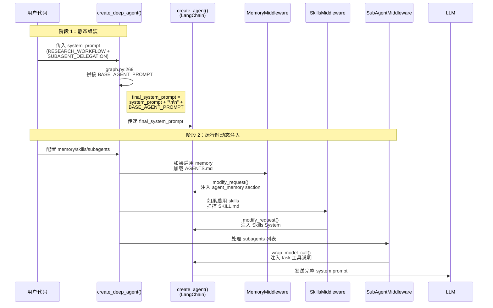
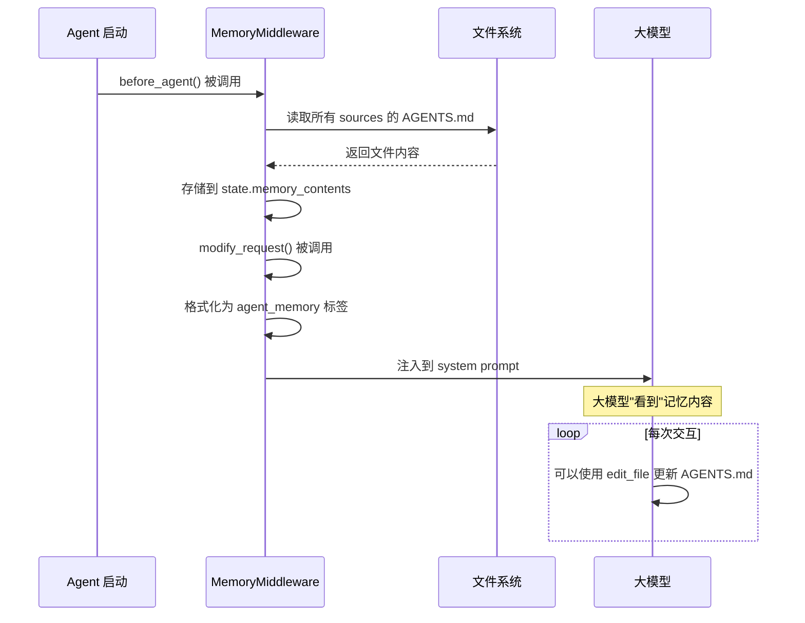
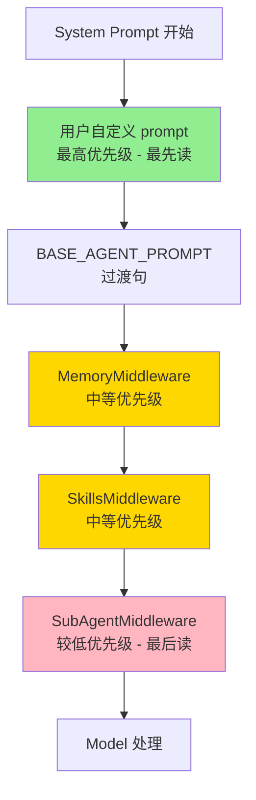
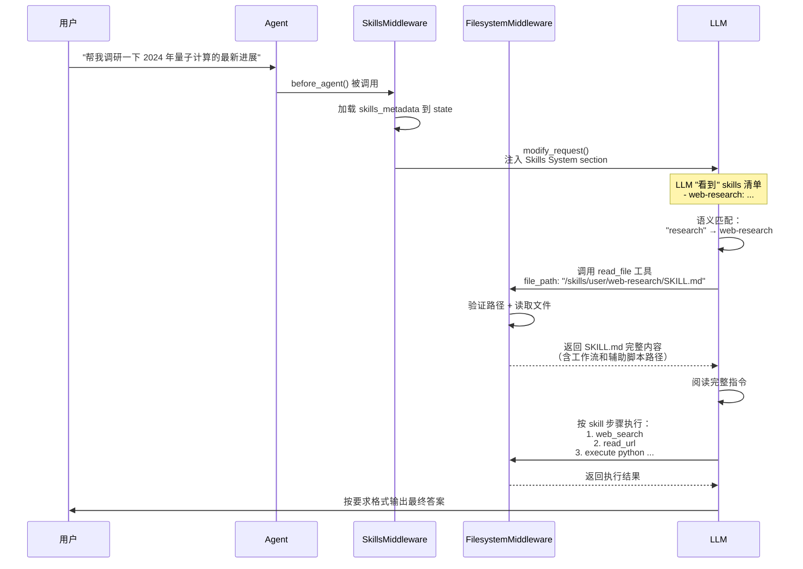

> **归类**：OpenHarness 文档 · [guides](./README.md)（非 OpenHarness 本体，供对照学习）

# Deep Agents Prompt 架构与设计方案分析

## 📋 文档概述

本文档深入分析了 Deep Agents 框架中的 prompt 组装机制、middleware 架构、以及各组件之间的交互关系。基于对 `examples/deep_research` 示例的代码分析和源码研究。

---

## 🎯 目录

1. [Prompt 组装完整流程](#1-prompt-组装完整流程)
2. [MemoryMiddleware 详解](#2-memorymiddleware-详解)
3. [自定义 Prompt 与系统注入的关系](#3-自定义-prompt-与系统注入的关系)
4. [最佳实践与优化建议](#4-最佳实践与优化建议)
5. [实战示例](#5-实战示例)

---

## 1. Prompt 组装完整流程

### 1.1 核心组装公式

```
最终 System Prompt = 
  [用户自定义 system_prompt]              // prompts.py 中定义的指令
  + "\n\n"
  + [BASE_AGENT_PROMPT]                  // 固定字符串
  + (可选) [MemoryMiddleware 注入]        // AGENTS.md 内容
  + (可选) [SkillsMiddleware 注入]        // Skills 系统说明
  + (必选) [SubAgentMiddleware 注入]      // task 工具说明
  + (必选) [SummarizationMiddleware]      // 上下文管理（不注入 prompt）
```

### 1.2 组装时序图



### 1.3 各层级的具体内容

#### **层级 1：用户自定义 Prompt**

位置：`examples/deep_research/research_agent/prompts.py`

```python
# agent.py:28-37
INSTRUCTIONS = (
    RESEARCH_WORKFLOW_INSTRUCTIONS      # ~65 行，800 tokens
    + "\n\n"
    + "=" * 80
    + "\n\n"
    + SUBAGENT_DELEGATION_INSTRUCTIONS.format(  # ~35 行，500 tokens
        max_concurrent_research_units=3,
        max_researcher_iterations=3,
    )
)
```

**关键内容**：
- 研究工作流 6 步骤
- 报告写作指南（比较/列表/总结三种模式）
- 引用格式规范
- 子代理委托策略（何时并行/串行）

---

#### **层级 2：BASE_AGENT_PROMPT**

位置：`libs/deepagents/deepagents/graph.py:35`

```python
BASE_AGENT_PROMPT = "In order to complete the objective that the user asks of you, you have access to a number of standard tools."
```

**作用**：提醒模型有标准工具可用（write_todos, read_file, execute, task 等）

---

#### **层级 3：MemoryMiddleware 注入**

位置：`libs/deepagents/deepagents/middleware/memory.py`

**触发条件**：当 `create_deep_agent(memory=[...])` 时启用

**注入内容**：
```markdown
<agent_memory>
{从 AGENTS.md 文件加载的内容}
</agent_memory>

<memory_guidelines>
    The above <agent_memory> was loaded in from files in your filesystem.
    As you learn from your interactions with the user, you can save new 
    knowledge by calling the `edit_file` tool.
    
    **Learning from feedback:**
    - One of your MAIN PRIORITIES is to learn from your interactions...
    - When you need to remember something, updating memory must be your 
      FIRST, IMMEDIATE action...
    
    **When to update memories:**
    - When the user explicitly asks you to remember something
    - When the user describes your role or how you should behave
    - When the user gives feedback on your work
    ...
</memory_guidelines>
```

**典型长度**：300-1000 tokens（取决于 AGENTS.md 大小）

---

#### **层级 4：SkillsMiddleware 注入**

位置：`libs/deepagents/deepagents/middleware/skills.py`

**触发条件**：当 `create_deep_agent(skills=[...])` 时启用

**注入内容**：
```markdown
## Skills System

You have access to a skills library that provides specialized capabilities and domain knowledge.

**User Skills**: `/skills/user/` (higher priority)
**Project Skills**: `/skills/project/`

**Available Skills:**
- **web-research**: Conduct comprehensive web research using search engines
  -> Allowed tools: tavily_search, read_file
  -> Read `/skills/user/web-research/SKILL.md` for full instructions
- **code-review**: Review code for best practices and potential issues
  -> Read `/skills/project/code-review/SKILL.md` for full instructions

**How to Use Skills (Progressive Disclosure):**
Skills follow a **progressive disclosure** pattern - you see their name and description above, but only read full instructions when needed:

1. **Recognize when a skill applies**: Check if the user's task matches a skill's description
2. **Read the skill's full instructions**: Use the path shown in the skill list above
3. **Follow the skill's instructions**: SKILL.md contains step-by-step workflows, best practices, and examples
4. **Access supporting files**: Skills may include helper scripts, configs, or reference docs - use absolute paths
...
```

**典型长度**：400-800 tokens（取决于技能数量）

---

#### **层级 5：SubAgentMiddleware 注入**

位置：`libs/deepagents/deepagents/middleware/subagents.py`

**触发条件**：始终启用（只要有 subagents）

**注入内容**：
```markdown
## `task` (subagent spawner)

You have access to a `task` tool to launch short-lived subagents that handle isolated tasks. These agents are ephemeral — they live only for the duration of the task and return a single result.

When to use the task tool:
- When a task is complex and multi-step, and can be fully delegated in isolation
- When a task is independent of other tasks and can run in parallel
- When a task requires focused reasoning or heavy token/context usage
- When sandboxing improves reliability (e.g. code execution, structured searches, data formatting)
- When you only care about the output of the subagent, and not the intermediate steps
...

TASK_TOOL_DESCRIPTION（约 240 行详细示例和说明）

TASK_SYSTEM_PROMPT（约 30 行生命周期说明）

Available subagent types:
- general-purpose: General-purpose agent for researching complex questions, searching for files and content, and executing multi-step tasks...
- research-agent: Delegate research to the sub-agent researcher. Only give this researcher one topic at a time.
```

**典型长度**：~1500 tokens（非常详细的通用说明）

---

### 1.4 Token 消耗估算

| 组件 | Tokens | 占比 | 是否必需 |
|------|--------|------|----------|
| 自定义 RESEARCH_WORKFLOW | ~800 | 23% | ✅ 是 |
| 自定义 SUBAGENT_DELEGATION | ~500 | 14% | ✅ 是 |
| BASE_AGENT_PROMPT | ~20 | 1% | ✅ 是 |
| MemoryMiddleware | 300-1000 | 9-28% | ❌ 可选 |
| SkillsMiddleware | 400-800 | 11-23% | ❌ 可选 |
| SubAgentMiddleware | ~1500 | 43% | ✅ 是 |
| **总计** | **3520-4620** | 100% | - |

**观察**：
- 系统注入内容占比高达 **57%-77%**
- 自定义 prompt 仅占 **23%-37%**
- SubAgentMiddleware 是最大的单一来源

---

## 2. MemoryMiddleware 详解

### 2.1 Memory 的本质

**定义**：存储在 `AGENTS.md` 文件中的持久化上下文信息

**包含内容**：
- 项目特定的背景信息
- 开发规范和指南
- 架构决策和说明
- 用户偏好和习惯
- 构建/测试命令

**关键特性**：
- ✅ **静态知识库**：预先写入的 Markdown 文件
- ✅ **版本可控**：可通过 git 管理变更
- ✅ **多层级支持**：全局 + 项目 + 个人
- ✅ **动态更新**：AI 可通过 `edit_file` 工具主动更新

---

### 2.2 Memory vs Skills 的区别

| 维度 | Memory | Skills |
|------|--------|--------|
| **加载方式** | 始终加载（always loaded） | 按需加载（on-demand） |
| **用途** | 提供持久上下文（persistent context） | 提供特定工作流（specific workflows） |
| **形式** | 直接注入 system prompt | 显示元数据，需要时读取完整指令 |
| **典型内容** | 项目规范、用户偏好、架构说明 | 具体任务的 step-by-step 指南 |
| **文件格式** | `AGENTS.md` | `SKILL.md` |
| **更新时机** | 通过 `edit_file` 动态更新 | 手动创建/修改文件 |

**原文引用**（memory.py:8-10）：
> "Unlike skills (which are on-demand workflows), memory is always loaded and provides persistent context."

---

### 2.3 MemoryMiddleware 三大核心功能

#### **功能 1：加载外部知识库到 System Prompt**

```python
# memory.py:360-374
def modify_request(self, request: ModelRequest) -> ModelRequest:
    """Inject memory content into the system message."""
    contents = request.state.get("memory_contents", {})
    agent_memory = self._format_agent_memory(contents)
    
    new_system_message = append_to_system_message(
        request.system_message, 
        agent_memory
    )
    
    return request.override(system_message=new_system_message)
```

**实际效果**：将 AGENTS.md 内容注入到每次模型调用的 system prompt 中

---

#### **功能 2：支持多个记忆源**

```python
# memory.py:226-234
def _format_agent_memory(self, contents: dict[str, str]) -> str:
    sections = []
    for path in self.sources:  # 按顺序遍历所有源
        if contents.get(path):
            sections.append(f"{path}\n{contents[path]}")
    
    memory_body = "\n\n".join(sections)
    return MEMORY_SYSTEM_PROMPT.format(agent_memory=memory_body)
```

**典型配置**：
```python
middleware = MemoryMiddleware(
    backend=backend,
    sources=[
        "~/.deepagents/AGENTS.md",      # 全局用户偏好
        "./.deepagents/AGENTS.md",      # 项目特定规范
    ],
)
```

---

#### **功能 3：提供动态学习指导**

```markdown
<memory_guidelines>
    The above <agent_memory> was loaded in from files in your filesystem. 
    As you learn from your interactions with the user, you can save new 
    knowledge by calling the `edit_file` tool.
    
    **Learning from feedback:**
    - One of your MAIN PRIORITIES is to learn from your interactions...
    - When you need to remember something, updating memory must be your 
      FIRST, IMMEDIATE action...
    
    **When to update memories:**
    - When the user explicitly asks you to remember something
    - When the user describes your role or how you should behave
    - When the user gives feedback on your work
    ...
</memory_guidelines>
```

**关键特性**：不仅加载静态内容，还**教导大模型如何主动更新记忆**

---

### 2.4 Memory 的生命周期



---

### 2.5 AGENTS.md 示例

#### **示例 1：项目根目录 AGENTS.md**

```markdown
# Global development guidelines for the Deep Agents monorepo

This document provides context to understand the Deep Agents Python project and assist with development.

## Project architecture and context

### Monorepo structure

This is a Python monorepo with multiple independently versioned packages that use `uv`.

```txt
deepagents/
├── libs/
│   ├── deepagents/  # SDK
│   ├── cli/         # CLI tool
│   ├── acp/         # Agent Context Protocol support
│   └── harbor/      # Evaluation/benchmark framework
├── .github/         # CI/CD workflows and templates
└── README.md        # Information about Deep Agents
```

### Development tools & commands

- `uv` – Fast Python package installer and resolver
- `make` – Task runner for common development commands
- `ruff` – Fast Python linter and formatter
- `ty` – Static type checking
- `pytest` – Testing framework

### Code quality standards

All Python code MUST include type hints and return types.

**Commit standards:**
```txt
feat(sdk): add new chat completion feature
fix(cli): resolve type hinting issue
chore(harbor): update infrastructure dependencies
```
```

---

#### **示例 2：Content Builder Agent 的 AGENTS.md**

```markdown
# Content Writer Agent

You are a content writer for a technology company. Your job is to create engaging, informative content that educates readers about AI, software development, and emerging technologies.

## Brand Voice

- **Professional but approachable**: Write like a knowledgeable colleague, not a textbook
- **Clear and direct**: Avoid jargon unless necessary; explain technical concepts simply
- **Confident but not arrogant**: Share expertise without being condescending
- **Engaging**: Use concrete examples, analogies, and stories to illustrate points

## Writing Standards

1. **Use active voice**: "The agent processes requests" not "Requests are processed by the agent"
2. **Lead with value**: Start with what matters to the reader, not background
3. **One idea per paragraph**: Keep paragraphs focused and scannable
4. **Concrete over abstract**: Use specific examples, numbers, and case studies
5. **End with action**: Every piece should leave the reader knowing what to do next

## Content Pillars

Our content focuses on:
- AI agents and automation
- Developer tools and productivity
- Software architecture and best practices
- Emerging technologies and trends

## Research Requirements

Before writing on any topic:
1. Use the `researcher` subagent for in-depth topic research
2. Gather at least 3 credible sources
3. Identify the key points readers need to understand
4. Find concrete examples or case studies to illustrate concepts
```

---

## 3. 自定义 Prompt 与系统注入的关系

### 3.1 是否会冲突？

**答案**：**不会报错，但存在注意力竞争**

通过源码分析（graph.py:269），组装方式是**简单字符串拼接**：

```python
# graph.py:269
final_system_prompt = system_prompt + "\n\n" + BASE_AGENT_PROMPT
```

**无冲突原因**：
- ✅ 纯文本追加，无语法冲突
- ✅ 自定义 prompt 在前（优先级更高）
- ✅ Middleware 通过 `append_to_system_message()` 有序注入

---

### 3.2 潜在的"软冲突"

#### **问题 1：Prompt 过长导致注意力稀释**

```
总长度估算（启用所有 middleware）：
├── 自定义 RESEARCH_WORKFLOW: ~800 tokens
├── 自定义 SUBAGENT_DELEGATION: ~500 tokens  
├── BASE_AGENT_PROMPT: ~20 tokens
├── MemoryMiddleware: ~700 tokens
├── SkillsMiddleware: ~600 tokens
└── SubAgentMiddleware: ~1500 tokens

总计：~4120 tokens（不含对话历史）
```

**影响**：
- Claude Sonnet 4.5 虽然支持 200k tokens，但**注意力会随着长度衰减**
- 关键指令（如"ALWAYS use sub-agents"）可能被淹没在长文本中

---

#### **问题 2：指令重复**

**对比两处指令**：

**自定义 prompt**（prompts.py:9）：
```markdown
3. **Research**: Delegate research tasks to sub-agents using the task() tool 
   - ALWAYS use sub-agents for research, never conduct research yourself
```

**SubAgentMiddleware**（subagents.py:139）：
```markdown
3. Each agent invocation is stateless. You will not be able to send additional 
   messages to the agent, nor will the agent be able to communicate with you 
   outside of its final report. Therefore, your prompt should contain a highly 
   detailed task description...
```

**风险**：
- 两处都在强调子代理的使用方式
- 可能导致模型困惑：**哪里的优先级更高？**

---

#### **问题 3：格式不一致**

**自定义 prompt 使用**：
```markdown
# Research Workflow
## Delegation Strategy
**DEFAULT: Start with 1 sub-agent**
```

**系统注入使用**：
```markdown
## Skills System
## `task` (subagent spawner)
<agent_memory>
<memory_guidelines>
```

**影响**：
- Markdown 层级混乱（有的用 `#`，有的用 `##`，有的用 XML 标签）
- 模型可能难以区分**核心指令**vs**辅助说明**

---

### 3.3 优先级分析

虽然不会报错，但存在**隐式优先级**：



**心理学效应**：
- ✅ **首因效应**：开头的内容印象更深 → 自定义 prompt 占优
- ⚠️ **近因效应**：结尾的内容也容易被记住 → SubAgentMiddleware 占优
- ⚠️ **中间遗忘**：Memory/Skills 可能被忽略

---

## 4. 最佳实践与优化建议

### 4.1 精简自定义 Prompt

**原则**：自定义 prompt = 领域特定的**不可替代规则**

**优化前**（prompts.py）：
```python
RESEARCH_WORKFLOW_INSTRUCTIONS = """# Research Workflow

Follow this workflow for all research requests:

1. **Plan**: Create a todo list with write_todos to break down the research into focused tasks
2. **Save the request**: Use write_file() to save the user's research question to `/research_request.md`
3. **Research**: Delegate research tasks to sub-agents using the task() tool - ALWAYS use sub-agents for research, never conduct research yourself
4. **Synthesize**: Review all sub-agent findings and consolidate citations (each unique URL gets one number across all findings)
5. **Write Report**: Write a comprehensive final report to `/final_report.md` (see Report Writing Guidelines below)
6. **Verify**: Read `/research_request.md` and confirm you've addressed all aspects with proper citations and structure

## Research Planning Guidelines
- Batch similar research tasks into a single TODO to minimize overhead
- For simple fact-finding questions, use 1 sub-agent
- For comparisons or multi-faceted topics, delegate to multiple parallel sub-agents
- Each sub-agent should research one specific aspect and return findings

...（后续还有大量详细指导，共 65 行）
"""
```

**优化后**：
```python
RESEARCH_WORKFLOW_INSTRUCTIONS = """# Deep Research Domain Rules

**Core Principle**: You are an ORCHESTRATOR, not a researcher. Your value is in coordination, not execution.

**Non-Negotiable Rules:**
1. NEVER call tavily_search directly - always delegate to research-agent
2. NEVER conduct research yourself - use task(research-agent, "detailed topic...")
3. Always batch similar topics into ONE sub-agent call
4. Citations must be globally consistent across ALL sub-agent reports

**Report Structure Compliance:**
- Follow the exact structure patterns specified below
- No meta-commentary ("I found...", "After researching...")

## Critical Report Patterns

**For comparisons:**
1. Introduction → 2. Overview A → 3. Overview B → 4. Detailed comparison → 5. Conclusion

**Citation format:**
- Inline: [1], [2], [3]
- Sources section: `### Sources` with numbered list
- Each URL gets ONE number across entire report
"""
```

**优势**：
- ✅ 减少 60%+ token 使用（从 800 → 300 tokens）
- ✅ 突出**真正重要的领域规则**
- ✅ 避免与系统注入内容重复（信任系统的 scaffolding）

---

### 4.2 按需禁用 Middleware

**推荐配置**：
```python
from deepagents import create_deep_agent

# ❌ 不推荐：默认启用所有功能
agent = create_deep_agent(
    model=model,
    tools=[tavily_search, think_tool],
    system_prompt=INSTRUCTIONS,
    subagents=[research_sub_agent],
    memory=["./.deepagents/AGENTS.md"],  # +700 tokens
    skills=["/skills/user/"],             # +600 tokens
)

# ✅ 推荐：明确是否需要
agent = create_deep_agent(
    model=model,
    tools=[tavily_search, think_tool],
    system_prompt=精简版_INSTRUCTIONS,     # 只保留领域特定规则
    subagents=[research_sub_agent],
    # 不传 memory/skills → 不加载对应 middleware
    # 节省 1300+ tokens，除非确实需要持久化知识
)
```

**判断标准**：
- ✅ **启用 Memory**：需要跨会话持久化用户偏好/项目规范
- ✅ **启用 Skills**：有可复用的标准化工作流（如代码审查流程）
- ❌ **禁用**：单次任务或临时实验

---

### 4.3 利用近因效应

**技巧**：将最关键规则放在 system_prompt 末尾

```python
# 优化后的结构
INSTRUCTIONS = (
    RESEARCH_WORKFLOW_INSTRUCTIONS  # 领域规则
    + "\n\n"
    + "=" * 80
    + "\n\n"
    + SUBAGENT_DELEGATION_INSTRUCTIONS.format(...)  # 委托策略
    + "\n\n"
    + "**REMEMBER: Your primary value is orchestration, not execution.**\n"
    + "**NEVER conduct research yourself - always use the research-agent.**"
)
```

**心理学依据**：
- 近因效应（Recency Effect）：最后出现的信息更容易被记住
- 适用于**绝对不能违反的核心规则**

---

### 4.4 统一格式规范

**建议**：
- ✅ 用 `#` 表示顶级核心指令
- ✅ 用 `##` 表示次级分类
- ✅ 用 `**bold**` 强调不可违反的规则
- ✅ 避免混用 XML 标签（让系统注入部分使用）

**示例**：
```markdown
# Deep Research Domain Rules

## Non-Negotiable Rules
1. **NEVER** call tavily_search directly
2. **ALWAYS** delegate to research-agent

## Report Patterns
...
```

---

### 4.5 子 Agent Prompt 优化

**当前实现**（agent.py:40-45）：
```python
research_sub_agent = {
    "name": "research-agent",
    "description": "Delegate research to the sub-agent researcher. Only give this researcher one topic at a time.",
    "system_prompt": RESEARCHER_INSTRUCTIONS.format(date=current_date),
    "tools": [tavily_search, think_tool],
}
```

**优化建议**：
```python
research_sub_agent = {
    "name": "research-agent",
    "description": "Expert web researcher. Use for gathering facts, statistics, academic papers, and industry reports. Returns synthesized findings with citations.",  # 更具体的描述
    "system_prompt": """You are an expert research assistant. Today's date is {date}.

**Your Mission**: Conduct thorough, efficient web research to answer specific questions.

**Critical Rules:**
1. Use think_tool AFTER EVERY search to assess: "Do I have enough? What's missing?"
2. Stop after 3-5 searches maximum (simple=3, complex=5)
3. Return structured findings with clear citations [1], [2], [3]

**Search Strategy:**
1. Start broad → 2. Assess gaps → 3. Search narrow → 4. Stop when confident

**Output Format:**
## Key Findings
[Organized by theme with inline citations]

### Sources
[1] Title: URL
[2] Title: URL
""".format(date=current_date),
    "tools": [tavily_search, think_tool],
}
```

**改进点**：
- ✅ 更清晰的 subagent 描述（帮助主 agent 决策）
- ✅ 精简的 system_prompt（去除冗余，聚焦核心）
- ✅ 强调思考工具的使用时机

---

## 5. 实战示例

### 5.1 场景 1：快速原型验证

**目标**：最小化 prompt 长度，快速测试功能

```python
from deepagents import create_deep_agent
from langchain.chat_models import init_chat_model

model = init_chat_model(model="anthropic:claude-sonnet-4-5-20250929")

# 极简配置
minimal_agent = create_deep_agent(
    model=model,
    tools=[],  # 不需要自定义工具
    system_prompt="You are a helpful research assistant. Use the task tool to delegate research.",
    subagents=[{
        "name": "researcher",
        "description": "Web research expert",
        "system_prompt": "Research topics thoroughly using tavily_search. Return findings with citations.",
        "tools": [],
    }],
    # 不启用 memory/skills
)
```

**Token 消耗**：~2000 tokens（比完整版减少 50%）

---

### 5.2 场景 2：生产环境部署

**目标**：平衡功能完整性与效率

```python
from deepagents import create_deep_agent
from deepagents.middleware.memory import MemoryMiddleware
from deepagents.backends.filesystem import FilesystemBackend

model = init_chat_model(model="anthropic:claude-sonnet-4-5-20250929")
backend = FilesystemBackend(root_dir="/workspace")

# 启用必要的 middleware
production_agent = create_deep_agent(
    model=model,
    tools=[tavily_search, think_tool],
    system_prompt=精简版_INSTRUCTIONS,  # ~500 tokens
    subagents=[research_sub_agent],
    middleware=[
        MemoryMiddleware(
            backend=backend,
            sources=[
                "/workspace/.deepagents/AGENTS.md",  # 项目规范
            ],
        ),
        # 不启用 Skills，因为没有标准化工作流
    ],
)
```

**Token 消耗**：~3000 tokens（平衡点）

---

### 5.3 场景 3：企业级知识库

**目标**：充分利用 Memory 和 Skills 构建组织知识

```python
enterprise_agent = create_deep_agent(
    model=model,
    tools=[custom_tools],
    system_prompt=enterprise_instructions,  # ~400 tokens
    subagents=[...],
    memory=[
        "~/.deepagents/AGENTS.md",           # 个人偏好
        "/workspace/.deepagents/AGENTS.md",  # 项目规范
        "/org/standards/AGENTS.md",          # 组织标准
    ],
    skills=[
        "/skills/code-review/",              # 代码审查流程
        "/skills/security-audit/",           # 安全审计流程
        "/skills/api-design/",               # API 设计规范
    ],
)
```

**Token 消耗**：~5000+ tokens（功能最完整）

**适用场景**：
- ✅ 长期运行的企业助手
- ✅ 需要严格遵循组织规范
- ✅ 有多个标准化工作流

---

### 5.4 调试技巧

#### **技巧 1：查看最终 prompt**

```python
from langchain_core.messages import HumanMessage

# 创建一个测试消息
result = agent.invoke({
    "messages": [HumanMessage(content="Test")]
})

# 查看 trace（如果使用 LangSmith）
# 或在 middleware 中添加日志
import logging
logging.basicConfig(level=logging.DEBUG)
logger = logging.getLogger("deepagents.middleware")
```

---

#### **技巧 2：分层测试**

```python
# 步骤 1：测试基础 agent（无 middleware）
base_agent = create_deep_agent(
    model=model,
    system_prompt="Simple instruction",
    subagents=[],
)

# 步骤 2：添加 subagents
with_subagents = create_deep_agent(
    model=model,
    system_prompt="Simple instruction",
    subagents=[research_sub_agent],
)

# 步骤 3：添加 memory
with_memory = create_deep_agent(
    model=model,
    system_prompt="Simple instruction",
    subagents=[research_sub_agent],
    memory=["./.deepagents/AGENTS.md"],
)

# 逐步验证每层的效果
```

---

#### **技巧 3：Token 计数**

```python
import tiktoken

def count_prompt_tokens(prompt_text: str) -> int:
    """估算 prompt 的 token 数"""
    encoder = tiktoken.encoding_for_model("claude-3-sonnet")
    return len(encoder.encode(prompt_text))

# 测试各组件
print(f"RESEARCH_WORKFLOW: {count_prompt_tokens(RESEARCH_WORKFLOW_INSTRUCTIONS)}")
print(f"SUBAGENT_DELEGATION: {count_prompt_tokens(SUBAGENT_DELEGATION_INSTRUCTIONS)}")
print(f"BASE_AGENT_PROMPT: {count_prompt_tokens(BASE_AGENT_PROMPT)}")
```

---

## 附录 A：关键源码位置索引

| 组件 | 文件路径 | 关键函数/变量 |
|------|---------|--------------|
| 主组装逻辑 | `libs/deepagents/deepagents/graph.py` | `create_deep_agent()` (L269) |
| BASE_AGENT_PROMPT | `libs/deepagents/deepagents/graph.py` | L35 |
| MemoryMiddleware | `libs/deepagents/deepagents/middleware/memory.py` | `modify_request()` (L360), `_format_agent_memory()` (L214) |
| SkillsMiddleware | `libs/deepagents/deepagents/middleware/skills.py` | `modify_request()` (L698) |
| SubAgentMiddleware | `libs/deepagents/deepagents/middleware/subagents.py` | `wrap_model_call()` (L672), `_get_subagents()` (L621) |
| SummarizationMiddleware | `libs/deepagents/deepagents/middleware/summarization.py` | 继承自 LangChain 基类 |

---

## 附录 B：示例项目对比

| 示例项目 | AGENTS.md | Skills | Subagents | Prompt 特点 |
|---------|-----------|--------|-----------|------------|
| **deep_research** | ❌ 无 | ❌ 无 | ✅ 1 个（research-agent） | 超长自定义 prompt（1300+ tokens） |
| **content-builder-agent** | ✅ 有（品牌声音/写作标准） | ✅ 2 个（blog-post, social-media） | ✅ YAML 配置 | 中等长度，聚焦内容创作 |
| **text-to-sql-agent** | ✅ 有（SQL 规范/安全要求） | ✅ 2 个（query-writing, schema-exploration） | ❌ 无 | 短小精悍，依赖 skills |

**观察**：
- deep_research 最适合做 prompt 优化（重复内容最多）
- content-builder-agent 展示了 skills 的正确用法（可复用工作流）
- text-to-sql-agent 证明了短 prompt + skills 的有效性

---

## 附录 C：检查清单

在提交新的 deep agent 配置前，请检查：

### Prompt 设计
- [ ] 自定义 prompt 是否聚焦领域特定规则？
- [ ] 是否与系统注入内容重复？
- [ ] 关键规则是否放在了开头或结尾？
- [ ] Markdown 格式是否统一（`#` vs `##` vs XML）？
- [ ] Token 数是否控制在合理范围（<1000 tokens）？

### Middleware 配置
- [ ] 是否真的需要 Memory？有跨会话持久化需求吗？
- [ ] 是否真的需要 Skills？有标准化工作流吗？
- [ ] Subagents 的描述是否清晰且 actionable？
- [ ] 是否禁用了不必要的 middleware？

### Subagent 设计
- [ ] System prompt 是否精简（<500 tokens）？
- [ ] 是否明确说明了停止条件？
- [ ] 是否指定了输出格式？
- [ ] Tools 配置是否最小化（只给必需的）？

### 测试验证
- [ ] 是否进行了分层测试（逐步添加 middleware）？
- [ ] 是否查看了完整的 system prompt（通过 trace）？
- [ ] 是否估算了总 token 消耗？
- [ ] 是否在真实场景下验证过效果？

---

## 修订历史

| 版本 | 日期 | 作者 | 变更说明 |
|------|------|------|----------|
| v1.0 | 2026-03-31 | AI Assistant | 初始版本，基于源码分析和对话整理 |
| v1.1 | 2026-04-09 | AI Assistant | 新增 Skills 系统完整分析（注入机制、LLM 决策逻辑、使用流程） |

---

## 附录 D：Skills 系统深度解析

### D.1 Skills 架构设计

#### **核心设计理念**

DeepAgent 采用 **Anthropic Agent Skills Pattern**，三大核心原则：

1. **渐进式披露（Progressive Disclosure）**
   - System prompt 只展示元数据（name + description + path）
   - LLM 按需读取完整 SKILL.md 内容
   - 节省 token，提高灵活性

2. **后端抽象（Backend Abstraction）**
   - 通过 Backend Protocol 统一访问接口
   - 支持 FilesystemBackend、StateBackend、StoreBackend
   - 平台无关，路径标准化（PurePosixPath）

3. **多层覆盖（Layered Override）**
   - Sources 按顺序加载，后加载的同名 skill 覆盖前面的
   - 支持 base → user → project → team 分层
   - Last-wins 语义，灵活配置

---

#### **Skill 文件结构规范**

每个 skill 是一个目录，必须包含 `SKILL.md`：

```
/skills/user/web-research/
├── SKILL.md          # 必需：YAML frontmatter + markdown 指令
└── helper.py         # 可选：辅助脚本、配置文件等
```

**SKILL.md 格式：**
```markdown
---
name: web-research
description: Structured approach to conducting thorough web research
license: MIT
compatibility: Python 3.10+
allowed-tools: [web_search, read_url]
metadata:
  version: "1.0"
  author: "Team A"
---

# Web Research Skill

## When to Use
- User asks you to research a topic
- You need to gather information from multiple sources
- The task requires systematic data collection

## Workflow

### Step 1: Define Research Questions
Break down the user's request into specific questions...

### Step 2: Search Strategy
Use these search techniques:
1. Start with broad searches to understand the landscape
2. Narrow down to specific aspects
3. Cross-reference multiple sources

## Helper Scripts
This skill includes a Python script at `/skills/user/web-research/organize.py` 
that can help structure your research notes.
```

**约束条件（Agent Skills Specification）：**
- `name`: 1-64 字符，仅小写字母数字和单连字符，必须与目录名一致
- `description`: 1-1024 字符，描述技能用途和使用时机
- `compatibility`: ≤500 字符（可选），环境要求
- `MAX_SKILL_FILE_SIZE`: 10MB（防止 DoS 攻击）

---

### D.2 Skills 加载流程详解

#### **阶段 1：初始化（create_deep_agent）**

位置：[`graph.py:169-170`](file:///Users/gqli/work/deepagents/libs/deepagents/deepagents/graph.py#L169-L170) 和 [`graph.py:231-232`](file:///Users/gqli/work/deepagents/libs/deepagents/deepagents/graph.py#L231-L232)

```python
# 主代理 middleware 栈
if skills is not None:
    deepagent_middleware.append(SkillsMiddleware(backend=backend, sources=skills))

# 通用子代理 middleware 栈（同样注入）
if skills is not None:
    gp_middleware.append(SkillsMiddleware(backend=backend, sources=skills))
```

**关键点：**
- ✅ SkillsMiddleware 同时注入到**主代理**和**通用子代理**
- ✅ 自定义子代理可通过 `SubAgent(skills=[...])` 单独配置
- ⚠️ 使用 factory 函数时：`SkillsMiddleware(backend=lambda rt: StateBackend(rt), ...)`

---

#### **阶段 2：执行前加载（before_agent / abefore_agent）**

位置：[`skills.py:720-788`](file:///Users/gqli/work/deepagents/libs/deepagents/deepagents/middleware/skills.py#L720-L788)

```python
def before_agent(self, state, runtime, config):
    # 跳过已加载的情况（避免重复加载）
    if "skills_metadata" in state:
        return None
    
    backend = self._get_backend(state, runtime, config)
    all_skills = {}
    
    # 按顺序加载所有 sources
    for source_path in self.sources:
        source_skills = _list_skills(backend, source_path)
        for skill in source_skills:
            all_skills[skill["name"]] = skill  # 后加载的覆盖前面的
    
    return SkillsStateUpdate(skills_metadata=list(all_skills.values()))
```

**加载步骤：**
1. **检查缓存**：如果 `skills_metadata` 已在 state 中，跳过加载
2. **解析 backend**：支持直接实例或工厂函数
3. **遍历 sources**：对每个 source 路径调用 `_list_skills()`
4. **合并去重**：同名 skill 后加载的覆盖前面的（last-wins）

---

#### **阶段 3：扫描与解析（_list_skills / _alist_skills）**

位置：[`skills.py:393-469`](file:///Users/gqli/work/deepagents/libs/deepagents/deepagents/middleware/skills.py#L393-L469)

```python
def _list_skills(backend, source_path):
    # 1. 列出 source 下的所有子目录
    items = backend.ls_info(base_path)
    skill_dirs = [item["path"] for item in items if item.get("is_dir")]
    
    # 2. 构造 SKILL.md 路径并批量下载
    skill_md_paths = [str(PurePosixPath(dir) / "SKILL.md") for dir in skill_dirs]
    responses = backend.download_files(skill_md_paths)
    
    # 3. 解析每个 SKILL.md
    for (dir_path, md_path), response in zip(...):
        content = response.content.decode("utf-8")
        directory_name = PurePosixPath(dir_path).name
        metadata = _parse_skill_metadata(content, md_path, directory_name)
        if metadata:
            skills.append(metadata)
    
    return skills
```

**关键特性：**
- ✅ 使用 `PurePosixPath` 确保跨平台路径一致性
- ✅ 批量下载优化性能
- ✅ 容错处理：缺少 SKILL.md 或解析失败时跳过并记录警告

---

#### **阶段 4：元数据解析（_parse_skill_metadata）**

位置：[`skills.py:245-341`](file:///Users/gqli/work/deepagents/libs/deepagents/deepagents/middleware/skills.py#L245-L341)

```python
def _parse_skill_metadata(content, skill_path, directory_name):
    # 1. 文件大小检查
    if len(content) > MAX_SKILL_FILE_SIZE:
        return None
    
    # 2. 提取 YAML frontmatter
    match = re.match(r"^---\s*\n(.*?)\n---\s*\n", content, re.DOTALL)
    frontmatter_data = yaml.safe_load(match.group(1))
    
    # 3. 验证必填字段
    name = frontmatter_data.get("name", "").strip()
    description = frontmatter_data.get("description", "").strip()
    if not name or not description:
        return None
    
    # 4. 验证名称格式（warn but continue）
    is_valid, error = _validate_skill_name(name, directory_name)
    
    # 5. 截断超长字段
    if len(description) > MAX_SKILL_DESCRIPTION_LENGTH:
        description = description[:MAX_SKILL_DESCRIPTION_LENGTH]
    
    # 6. 解析 allowed_tools（支持列表或空格分隔字符串）
    raw_tools = frontmatter_data.get("allowed-tools")
    allowed_tools = str(raw_tools).split() if isinstance(raw_tools, str) else raw_tools
    
    return SkillMetadata(...)
```

---

### D.3 Prompt 注入机制

#### **System Prompt 模板**

位置：[`skills.py:551-590`](file:///Users/gqli/work/deepagents/libs/deepagents/deepagents/middleware/skills.py#L551-L590)

```python
SKILLS_SYSTEM_PROMPT = """
## Skills System

You have access to a skills library that provides specialized capabilities.

{skills_locations}

**Available Skills:**

{skills_list}

**How to Use Skills (Progressive Disclosure):**

Skills follow a **progressive disclosure** pattern - you see their name and description above, but only read full instructions when needed:

1. **Recognize when a skill applies**: Check if the user's task matches a skill's description
2. **Read the skill's full instructions**: Use the path shown in the skill list above
3. **Follow the skill's instructions**: SKILL.md contains step-by-step workflows, best practices, and examples
4. **Access supporting files**: Skills may include helper scripts, configs, or reference docs - use absolute paths

**When to Use Skills:**
- User's request matches a skill's domain (e.g., "research X" -> web-research skill)
- You need specialized knowledge or structured workflows
- A skill provides proven patterns for complex tasks

**Executing Skill Scripts:**
Skills may contain Python scripts or other executable files. Always use absolute paths from the skill list.

**Example Workflow:**

User: "Can you research the latest developments in quantum computing?"

1. Check available skills -> See "web-research" skill with its path
2. Read the skill using the path shown
3. Follow the skill's research workflow (search -> organize -> synthesize)
4. Use any helper scripts with absolute paths

Remember: Skills make you more capable and consistent. When in doubt, check if a skill exists for the task!
"""
```

---

#### **格式化输出**

**Skills Locations（[`skills.py:668-677`](file:///Users/gqli/work/deepagents/libs/deepagents/deepagents/middleware/skills.py#L668-L677)）：**
```python
def _format_skills_locations(self):
    locations = []
    for i, source_path in enumerate(self.sources):
        name = PurePosixPath(source_path.rstrip("/")).name.capitalize()
        suffix = " (higher priority)" if i == len(self.sources) - 1 else ""
        locations.append(f"**{name} Skills**: `{source_path}`{suffix}")
    return "\n".join(locations)
```

**示例输出：**
```
**User Skills**: `/skills/user/`
**Project Skills**: `/skills/project/` (higher priority)
```

---

**Skills List（[`skills.py:679-696`](file:///Users/gqli/work/deepagents/libs/deepagents/deepagents/middleware/skills.py#L679-L696)）：**
```python
def _format_skills_list(self, skills):
    if not skills:
        return "(No skills available yet. You can create skills in ...)"
    
    lines = []
    for skill in skills:
        annotations = _format_skill_annotations(skill)  # License, Compatibility
        desc_line = f"- **{skill['name']}**: {skill['description']}"
        if annotations:
            desc_line += f" ({annotations})"
        lines.append(desc_line)
        if skill["allowed_tools"]:
            lines.append(f"  -> Allowed tools: {', '.join(skill['allowed_tools'])}")
        lines.append(f"  -> Read `{skill['path']}` for full instructions")
    
    return "\n".join(lines)
```

**示例输出：**
```
- **web-research**: Structured approach to conducting thorough web research (License: MIT, Compatibility: Python 3.10+)
  -> Allowed tools: web_search, read_url
  -> Read `/skills/user/web-research/SKILL.md` for full instructions
- **code-review**: Best practices for reviewing code quality and security
  -> Read `/skills/project/code-review/SKILL.md` for full instructions
```

---

#### **注入时机（wrap_model_call）**

位置：[`skills.py:790-822`](file:///Users/gqli/work/deepagents/libs/deepagents/deepagents/middleware/skills.py#L790-L822)

```python
def wrap_model_call(self, request, handler):
    modified_request = self.modify_request(request)
    return handler(modified_request)

def modify_request(self, request):
    skills_metadata = request.state.get("skills_metadata", [])
    skills_locations = self._format_skills_locations()
    skills_list = self._format_skills_list(skills_metadata)
    
    skills_section = self.system_prompt_template.format(
        skills_locations=skills_locations,
        skills_list=skills_list,
    )
    
    new_system_message = append_to_system_message(request.system_message, skills_section)
    return request.override(system_message=new_system_message)
```

**注入流程：**
1. 从 state 获取 `skills_metadata`
2. 格式化 locations 和 list
3. 填充模板生成 skills section
4. 使用 `append_to_system_message()` 追加到 system prompt
5. 返回修改后的 request 给 handler

---

### D.4 LLM 如何决策和使用 Skill

#### **LLM 决策逻辑**

当 LLM 接收到增强后的 system prompt 后，通过以下步骤决定使用哪个 skill：

**步骤 1：语义匹配**
- LLM 将用户请求与每个 skill 的 `description` 进行语义匹配
- 例如：用户说 "research quantum computing" → 匹配到 "web-research" skill（description 包含 "research"）

**步骤 2：优先级判断**
- 如果多个 skill 都匹配，LLM 根据描述的精确度选择
- 后加载的 sources 优先级更高（system prompt 中会标注 `(higher priority)`）

**步骤 3：工具推荐参考**
- 如果 skill 定义了 `allowed_tools`，LLM 会优先使用该 skill 推荐的工具
- 例如：`allowed-tools: [web_search, read_url]` 提示 LLM 这些工具与该 skill 配合使用

---

#### **LLM 使用 Skill 的完整流程**



---

#### **实际交互示例**

**用户输入：**
> "帮我调研一下 2024 年量子计算的最新进展"

**LLM 内部思考过程：**
```
1. 检查可用 skills → 看到 "web-research: Structured approach to conducting thorough web research"
2. 这个 skill 适用于研究任务，应该使用它
3. 先读取完整指令 → read_file("/skills/user/web-research/SKILL.md")
4. 按照 skill 的工作流：
   - Step 1: 定义研究问题
   - Step 2: 使用 web_search 搜索
   - Step 3: 用 organize.py 整理笔记
   - Step 4: 按要求格式输出
```

**LLM 的工具调用序列：**
```python
# 第 1 步：读取 skill 完整指令
ToolCall({
    "name": "read_file",
    "args": {
        "file_path": "/skills/user/web-research/SKILL.md",
        "offset": 0,
        "limit": 100  # 默认分页读取，避免 token 溢出
    }
})

# 第 2 步：按 skill 指令定义研究问题
AIMessage(content="我将按照 web-research skill 的步骤进行研究...")

# 第 3 步：使用 skill 推荐的工具
ToolCall({
    "name": "web_search",
    "args": {"query": "quantum computing breakthroughs 2024"}
})

# 第 4 步：读取 skill 提到的辅助脚本
ToolCall({
    "name": "read_file",
    "args": {"file_path": "/skills/user/web-research/organize.py"}
})

# 第 5 步：执行辅助脚本
ToolCall({
    "name": "execute",
    "args": {"command": "python /skills/user/web-research/organize.py --input notes.md"}
})

# 第 6 步：按 skill 要求的格式输出
AIMessage(content="""
# Quantum Computing Research Summary

## Key Findings
1. ...
2. ...

## Sources
- Source 1: ...
- Source 2: ...
""")
```

---

### D.5 关键技术细节

#### **1. 文件读取的分页机制**

为防止大文件导致 context overflow，`read_file` 支持分页：

```python
# LLM 可以分多次读取大文件
read_file("/skills/user/large-skill/SKILL.md", offset=0, limit=100)   # 第 1-100 行
read_file("/skills/user/large-skill/SKILL.md", offset=100, limit=100) # 第 101-200 行
```

**工具描述中的明确指引（[`filesystem.py:178-193`](file:///Users/gqli/work/deepagents/libs/deepagents/deepagents/middleware/filesystem.py#L178-L193)）：**
```markdown
**IMPORTANT for large files and codebase exploration**: Use pagination with offset and limit parameters to avoid context overflow
  - First scan: read_file(path, limit=100) to see file structure
  - Read more sections: read_file(path, offset=100, limit=200) for next 200 lines
  - Only omit limit (read full file) when necessary for editing
```

---

#### **2. 路径验证与安全**

所有文件访问都经过路径验证（[`filesystem.py:130-163`](file:///Users/gqli/work/deepagents/libs/deepagents/deepagents/middleware/filesystem.py#L130-L163)）：

```python
def _validate_path(file_path: str) -> str:
    """Validate and normalize file path."""
    # 必须是绝对路径
    if not file_path.startswith("/"):
        raise ValueError(f"Path must be absolute: {file_path}")
    
    # 防止目录穿越攻击
    normalized = os.path.normpath(file_path)
    if ".." in normalized.split(os.sep):
        raise ValueError(f"Path traversal detected: {file_path}")
    
    return normalized
```

---

#### **3. 辅助文件访问**

Skill 可以包含任意辅助文件（Python 脚本、配置文件、数据集等），LLM 通过绝对路径访问：

**Skill 目录结构：**
```
/skills/user/data-analysis/
├── SKILL.md              # 主指令文件
├── analyze.py            # Python 分析脚本
├── config.yaml           # 配置文件
└── templates/
    └── report.md         # 报告模板
```

**LLM 使用方式：**
```python
# 读取辅助脚本
read_file("/skills/user/data-analysis/analyze.py")

# 执行脚本
execute("python /skills/user/data-analysis/analyze.py --input data.csv")

# 读取配置
read_file("/skills/user/data-analysis/config.yaml")

# 使用模板
read_file("/skills/user/data-analysis/templates/report.md")
```

**System Prompt 强调（[`skills.py:577-578`](file:///Users/gqli/work/deepagents/libs/deepagents/deepagents/middleware/skills.py#L577-L578)）：**
```markdown
**Executing Skill Scripts:**
Skills may contain Python scripts or other executable files. Always use absolute paths from the skill list.
```

---

#### **4. allowed_tools 的作用**

虽然目前标记为实验性功能，但 `allowed_tools` 字段可以引导 LLM 优先使用特定工具：

**SKILL.md frontmatter：**
```yaml
---
name: web-research
description: Structured approach to conducting thorough web research
allowed-tools: [web_search, read_url, save_notes]
---
```

**System Prompt 展示（[`skills.py:692-693`](file:///Users/gqli/work/deepagents/libs/deepagents/deepagents/middleware/skills.py#L692-L693)）：**
```markdown
- **web-research**: Structured approach to conducting thorough web research
  -> Allowed tools: web_search, read_url, save_notes
  -> Read `/skills/user/web-research/SKILL.md` for full instructions
```

**作用：**
- ⚠️ **不是强制限制**：LLM 仍可使用其他工具
- ✅ **软性引导**：提示 LLM 这些工具与该 skill 高度相关
- 🎯 **提高准确性**：帮助 LLM 选择更合适的工具组合

---

### D.6 设计亮点总结

1. **渐进式披露（Progressive Disclosure）**
   - 首次只展示元数据（节省 token）
   - LLM 按需读取完整指令（灵活高效）

2. **明确的行动指引**
   - System Prompt 提供具体示例
   - 告诉 LLM "何时用"、"怎么用"、"用什么工具"

3. **文件系统抽象**
   - 统一的 `read_file` 工具访问所有 skill 文件
   - 支持分页、路径验证、大小限制

4. **辅助文件支持**
   - Skill 不只是文本指令，可包含可执行脚本
   - LLM 通过绝对路径访问任意辅助资源

5. **安全性保障**
   - 路径验证防止目录穿越
   - 文件大小限制（10MB）防止 DoS
   - Token 限制自动截断超大响应

6. **灵活性**
   - `allowed_tools` 软性引导而非硬性限制
   - LLM 可根据实际情况调整策略

---

### D.7 最佳实践与常见问题

#### **最佳实践**

1. **Skill 命名规范**
   - ✅ 使用短横线分隔的小写单词：`web-research`, `code-review`
   - ❌ 避免下划线、大写字母、特殊字符

2. **Description 编写技巧**
   - ✅ 包含触发关键词："research", "review", "analyze"
   - ✅ 明确使用时机："When user asks...", "For tasks involving..."
   - ❌ 避免过于宽泛的描述

3. **Skill 内容组织**
   - ✅ 清晰的 step-by-step 工作流
   - ✅ 提供具体示例和输出格式
   - ✅ 标注辅助文件路径（绝对路径）

4. **多源配置策略**
   ```python
   agent = create_deep_agent(
       skills=[
           "/skills/base/",      # 基础技能（最低优先级）
           "/skills/user/",      # 用户技能
           "/skills/project/",   # 项目技能（最高优先级）
       ],
   )
   ```

---

#### **常见问题**

**Q1: Skills 是否会自动继承到子代理？**

A: **不会**。这是常见陷阱：
- ✅ 主代理的 `skills` 参数只会影响主代理和通用子代理
- ❌ 自定义子代理需要通过 `SubAgent(skills=[...])` 显式配置
- 💡 原因：不同子代理可能需要不同的技能集

**Q2: Skill 路径是相对路径还是绝对路径？**

A: **取决于 backend**：
- `FilesystemBackend`: 相对于 `root_dir` 的绝对路径
- `StateBackend`: 虚拟路径（以 `/` 开头）
- ⚠️ 始终使用 POSIX 风格（`/` 而非 `\`）

**Q3: 如何调试 skill 加载问题？**

A: 三种方法：
```python
# 方法 1：查看日志
import logging
logging.basicConfig(level=logging.WARNING)

# 方法 2：检查 state
result = agent.invoke({"messages": [...]})
# 在 checkpoint 中查看 skills_metadata

# 方法 3：手动测试
from deepagents.middleware.skills import _list_skills
skills = _list_skills(backend, "/skills/user/")
print(f"Loaded {len(skills)} skills")
```

**Q4: Skill 文件太大怎么办？**

A: 三种策略：
1. **拆分 skill**：将大型 skill 拆分为多个小型 skill
2. **使用辅助文件**：将详细内容移到单独的 `.md` 文件，在 SKILL.md 中引用
3. **依赖分页读取**：LLM 会通过 `read_file(offset, limit)` 分页读取

---

### D.8 Token 消耗估算

| 组件 | Tokens | 占比 | 说明 |
|------|--------|------|------|
| Skills System 标题和说明 | ~200 | 25% | 固定开销 |
| Skills Locations | ~50 | 6% | 每增加一个 source +20 tokens |
| Skills List（元数据） | ~400-600 | 50-75% | 每个 skill ~50-80 tokens |
| 总计（3 个 skills） | ~650-850 | 100% | 不含完整 SKILL.md 内容 |

**观察**：
- ✅ 渐进式披露显著降低 token 消耗（相比直接注入完整指令）
- ⚠️ Skill 数量过多仍会导致 system prompt 膨胀
- 💡 建议：每个 agent 配置 3-5 个核心 skills 为宜

---

### D.9 与其他 Middleware 的对比

| 维度 | MemoryMiddleware | SkillsMiddleware | SubAgentMiddleware |
|------|------------------|------------------|--------------------|
| **加载方式** | 始终加载（always loaded） | 按需加载（on-demand） | 始终加载 |
| **注入内容** | AGENTS.md 完整内容 | 仅元数据（name + description + path） | task 工具详细说明 |
| **Token 消耗** | 300-1000 | 400-800 | ~1500 |
| **更新机制** | AI 可通过 edit_file 动态更新 | 手动创建/修改文件 | 静态配置 |
| **适用场景** | 持久化上下文（用户偏好、项目规范） | 标准化工作流（代码审查、安全审计） | 任务分解和并行执行 |

**原文引用**（memory.py:8-10）：
> "Unlike skills (which are on-demand workflows), memory is always loaded and provides persistent context."

---

## 参考资源

### 官方文档
- [Deep Agents Overview](https://docs.langchain.com/oss/python/deepagents/overview)
- [Contributing Guide](https://docs.langchain.com/oss/python/contributing/overview)
- [AGENTS.md Specification](https://agents.md/)
- [Anthropic Agent Skills](https://docs.anthropic.com/en/docs/agents-and-tools/agent-skills/overview)

### 关键源码
- `libs/deepagents/deepagents/graph.py` - 主组装逻辑
- `libs/deepagents/deepagents/middleware/skills.py` - Skills 系统完整实现
- `libs/deepagents/deepagents/middleware/memory.py` - Memory 系统实现
- `libs/deepagents/deepagents/middleware/subagents.py` - SubAgent 系统实现
- `examples/deep_research/` - 深度研究示例
- `examples/content-builder-agent/` - 展示了 skills 的正确用法

### 相关技术
- [LangChain Agents](https://docs.langchain.com/oss/python/langchain/quickstart)
- [LangGraph](https://docs.langchain.com/oss/python/langgraph/quickstart)
- [Textual TUI](https://textual.textualize.io/guide/)（CLI 使用）

---

**文档结束**
