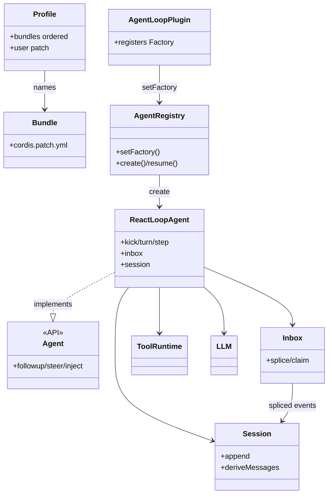

# 0b · 顶层设计与实体边界（DSH）

> **补「只有流程图、看不出封装」的缺口。** 流程逐步见 [00-流程与概念对照.md](./00-流程与概念对照.md)。  
> 本篇只回答：**谁封装什么、边界在哪、依赖怎么指。**

写作标准与 Penguin 对齐：见 deepseek 侧约定——实体表 / 写入归属 / 对照 / 固定vs扩展；禁止只有 mermaid。

---

## 1. 顶层设计目标与非目标

| 目标 | 落点实体 |
|------|----------|
| 多表面共用内核 | Profile/Bundle 组装；同一 `ReactLoopAgent` 工厂 |
| 策略不进 while | Waterfall 检查点（pre-step、tools/*…） |
| 可回放、可审计 | **Session** 只追加事件；Inbox 也 spliced |
| 循环可整包替换 | **`dsh-agent-loop` 插件** → `agents.setFactory` |
| 执行环境一致 | FS + Subprocess **成对** Provider（执行世界） |

| 非目标 | 说明 |
|--------|------|
| 把 Turn/claim 拆成热插拔小插件 | 默认算法写死在 `ReactLoopAgent`；插件是**整包 Driver** |
| Session 类写磁盘 | Persistence **订阅** session/event |
| core 工具直连远程 API 各写一套 | 走执行世界 Provider |

---

## 2. 分层与包边界

```text
表面 Web/Headless/ACP/SDK
    → Profile 组装 Cordis 插件树
        → ctx.agents（注册表 + Factory 槽）
        → Agent 句柄（followup/steer/inject）
            → ReactLoopAgent（默认 Driver）
                → Session / Inbox / systemPrompt / tools / llm
```

| 层 | 代表 | 允许知道 | 禁止 |
|----|------|----------|------|
| 组装 | Profile、Bundle、Patch、app-boot | 装哪些插件行 | Turn 算法 |
| 注册表 | `ctx.agents` | create/resume、setFactory | 私有 kick 实现 |
| 句柄 | `Agent` API | 入队与唤醒语义 | 工具沙箱实现 |
| Driver | `ReactLoopAgent` | Session、Inbox、dispatch | 厂商 SDK 细节 |
| 真源 | `Session` | append / deriveMessages / surface | 文件路径格式（persistence 插件） |
| 能力 | tools、llm、fs、subprocess | 各 seam 端口 | import agent-loop 私有文件 |

---

## 3. 核心实体目录

| 实体 | 拥有（封装） | 不拥有 | 协作者 |
|------|--------------|--------|--------|
| **Profile** | 有序 Bundle 名 + 本档 Patch；启动入口 | Bundle 源码、Loop 算法 | Boot → Loader |
| **Bundle** | 一份 `cordis.patch.yml` + 插件包 | 「今天启动哪套」 | 被 Profile 引用 |
| **Patch** | 对插件行表的 insert/覆盖/disable | 运行时对话状态 | compose → Entry 表 |
| **Cordis Loader / ctx** | 插件生命周期、服务挂载 | 业务 Turn | 所有插件 |
| **`ctx.agents` / AgentRegistry** | 活 Agent 表、**唯一 Factory 槽** | React 循环正文 | loop 插件 setFactory |
| **`dsh-agent-loop` 插件** | 注册 Factory、创建 `ReactLoopAgent` | 强制永远用这一种算法（可被替换整包） | agents、session |
| **`ReactLoopAgent`** | phase、kick/turn/step、与 Inbox/Session 协作 | 持久化文件、Web HTTP | Session、Inbox、tools、llm、waterfall |
| **`Agent`（对外）** | followup/steer/inject/cancel 契约 | 必须是 ReactLoopAgent（只要实现工厂） | UI/SDK |
| **`Session`** | 只追加 SessionEvent；surface 折叠；deriveMessages | 自己写 jsonl | Driver 写；UI/persistence 订 |
| **`Inbox`** | next-turn/next-step 投影；splice/claim | user/message 表面（claim 后由 Driver append） | Session 事件 |
| **`ToolRuntime` / tools** | 单次工具执行流水线 waterfall | Agent 何时调工具 | Driver executeToolCalls |
| **LLM 适配** | provider 流式 | 是否开 Turn | Driver agent/request |
| **FS / Subprocess** | 同一执行世界读写与进程 | 审批文案 | tools |



---

## 4. 固定算法 vs 插件扩展

| 固定（默认包内） | 扩展方式 |
|------------------|----------|
| kick→turn→claim→LLM→tools 顺序 | 换 **整个** agent-loop 插件 / Factory |
| Inbox 两桶语义 | 一般不改；改 Driver 才动 |
| Session append-only | 换 persistence 订阅方，不改公理 |
| — | **Waterfall**：pre-step、request、tools/* |
| — | Bundle 增删能力（llm、fs、web…） |

「Loop 是插件」= 上表左侧整包可替换；≠ 每一步是小插件。见 [GLOSSARY](./GLOSSARY.md#一切皆插件到底指什么含-loop)。

---

## 5. 与 Penguin 实体对照（防串台）

| 职责 | DSH | Penguin |
|------|-----|---------|
| 用例入口 | Agent.followup + wake | Session.run |
| 编排内核 | ReactLoopAgent（可整包换） | ContextEngine（产品内固定） |
| 消息真源 | SessionEvent 日志 | Trace JSONL + OmniMessage |
| 排队 | Inbox splice/claim | steer / carry-over（非事件 Inbox） |
| 组装 | Profile/Bundle/Cordis | createAgent + 文件 Skill |
| 审批 | tools waterfall / approval 服务 | ApproveFn 回调 |

---

## 6. 改代码决策树

```text
改组装面 / 开关插件     → Patch / Bundle / Profile
改一步是否进模型       → agent/pre-step 插件
改工具审批             → tools/* 或 approval 插件
改循环哲学             → 新 agent-loop（setFactory），勿在业务里抄 while
改历史投影             → Session surface / derive，勿第二 messages[]
改沙箱                 → fs+subprocess 成对
```

流程逐步（写入清单）继续用 [00-流程与概念对照.md](./00-流程与概念对照.md)。
