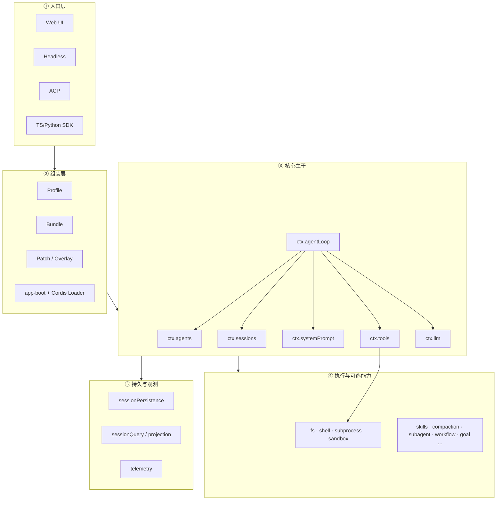
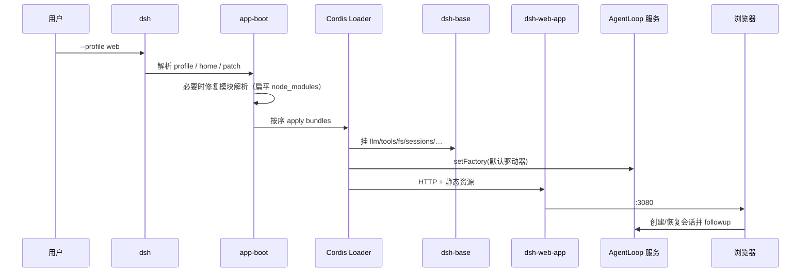
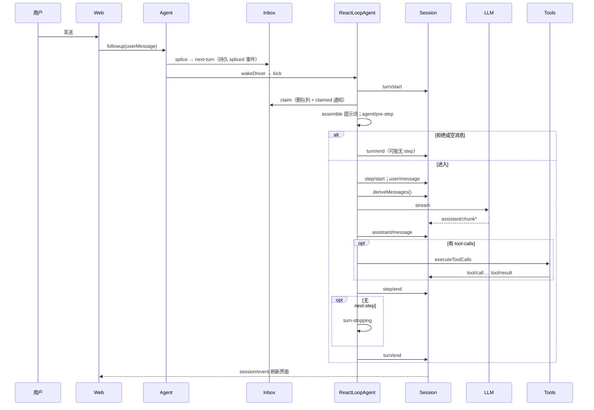

# 第二章 · 总体架构、模块分工与端到端

> **阅读顺序第 2 步**｜若「词多没细节」请先读 **[00-流程与概念对照.md](./00-流程与概念对照.md)**｜术语：[GLOSSARY.md](./GLOSSARY.md)  
> 目标：建立 **全局地图**——有哪些块、谁依赖谁、启动怎么走。  
> **「用户发一句话」逐步写了什么 Session 事件**：以 **00** 为准；下文 §6 是摘要。

### 本章目录

1. [分层总图](#1-分层总图)  
2. [模块分工详表](#2-模块分工详表)  
3. [依赖纪律](#3-依赖纪律为什么强调)  
4. [组装：从命令到插件树](#4-组装从命令到插件树)  
5. [E2E：启动到可聊天](#5-e2e启动到可聊天)  
6. [E2E：用户发一句话](#6-e2e用户发一句话内环)  
7. [内环 vs 外环](#7-内环-vs-外环)  
8. [数据与事件怎么流动](#8-数据与事件怎么流动)  
9. [扩展决策树](#9-扩展决策树)  
10. [后文导航](#10-后文导航)

---

## 1. 分层总图



记忆口诀：

> **入口选 Profile → 装 Bundle → 核心 Loop 跑对话 → 工具碰执行世界 → 事件可被 UI/磁盘订阅。**

---

## 2. 模块分工详表

| 层级 | 模块 | `ctx` 键（若有） | 职责（白话） | 典型包路径 |
|------|------|-----------------|--------------|------------|
| 组装 | Profile/Bundle/Boot | — | 决定装哪些插件 | `boot/app-boot`，`bundle/*` |
| 句柄 | Agent 服务 | `ctx.agents` | 创建/恢复 Agent；followup/steer/inject/cancel | `core/agent` |
| 驱动 | Agent Loop | `ctx.agentLoop` | 默认 `ReactLoopAgent`：Turn/Step | `core/agent-loop` |
| 真源 | Session | `ctx.sessions` | 只追加事件；投影 messages | `core/session` |
| 提示词 | System Prompt | `ctx.systemPrompt` | 拼 system 段 + 工具 schema | `core/system-prompt` |
| 工具 | Tools | `ctx.tools` | 注册、守卫执行、Code Mode | `core/tools` |
| 作用域 | Scope | （库） | 按 Agent 隔离注册 | `core/scope` |
| 模型 | LLM | `ctx.llm` | 适配器、流式、请求词汇 | `llm/*` |
| 文件 | FS | `ctx.fs` | 读改文件 | `fs/*` |
| Shell | Shell | `ctx.shell` | bash 等 | `shell/*` |
| 进程 | Subprocess | `ctx.subprocess` | 通用进程 | `subprocess/*` |
| 沙箱 | Sandbox | `ctx.sandbox` 等 | 策略与约束 | `sandbox/*` |
| 技能 | Skills | `ctx.skills` | 发现/加载技能 | `skill/*` |
| 压缩 | Compaction | 事件 + engine | 压上下文 | `compaction/*` |
| 委派 | Subagent | `ctx.subagents` | 子 Agent | `subagent/*` |
| 编排 | Workflow/Goal | `ctx.workflowEngine` / `ctx.goals` | 外环 | `workflow/` `goal/` |
| 人机 | Approval/AskUser/Commands | 各键 | 审批、提问、斜杠命令 | `interaction/` 等 |
| Web | WebServer/ApiProxy | `webServer` 等 | HTTP、静态、网关 | `web/` `host/` |
| 持久 | Persistence | `sessionPersistence` | 落盘 | `session/` 持久化包 |
| 设置凭据 | Settings/Credentials | 对应键 | 配置与密钥 | `settings/` `credentials/` |

更全的「每个子系统一页说明」见 **[第三章 · 子系统全景](./03-子系统全景.md)**。

---

## 3. 依赖纪律（为什么强调）

```text
✅ agent-loop → agent, session, tools, systemPrompt, llm
✅ tools →（不依赖）agent-loop
✅ 业务插件 → dsh-agent 公开 API / ctx 事件
❌ 业务插件 → import agent-loop 私有文件
❌ 在内存维护第二份「真」messages[]
❌ 只换 fs、不换 subprocess 却指望沙箱一致
```

这样 **默认循环可替换**，工具与会话不会被拖死。

---

## 4. 组装：从命令到插件树

### 4.1 叠加顺序

```text
[] 
 → profile 列出的每个 bundle（顺序）
 → profile 的 cordis.patch.yml
 → home 级 patch
 → 命令行 --patch overlay
```

### 4.2 发行层角色

| Bundle | 作用 |
|--------|------|
| `dsh-base` | 几乎总是第一层：模型、工具、持久化、沙箱、审批、设置、凭据、遥测… |
| `dsh-web-app` | 浏览器应用、客户端模块图 |
| `dsh-headless` | 一次性任务运行器，无长期 HTTP 服务 |

Profile 模板：`web`、`headless`（还可自建）。

### 4.3 自检

```bash
dsh --profile web --dump-config
```

打印出来的每个条目都可被你的 patch 替换——这是「一切皆配置可覆盖」的操作化。

---

## 5. E2E：启动到可聊天



**要点**：到「可以点发送」为止，核心是 **插件树就绪 + 工厂已注册**；还没有 Turn。

---

## 6. E2E：用户发一句话（内环）

### 6.1 时序



### 6.1.1 逐步详解

**完整逐步（每步 Session 写了什么 / 插件能否拦）见 [00-流程与概念对照.md §2](./00-流程与概念对照.md#2-发一句话逐步到底含写了什么)。** 下文保留摘要。

整条链三拍：**入队 splice → 唤醒 kick → 认领后 Turn/Step**。

#### ① 用户 → Web：发送

人在浏览器输入并点发送。此时还没有 Turn、没有模型调用——只是 UI 拿到一条用户文本。

#### ② Web → Agent：`followup(userMessage)`

Web（或 SDK）调用 Agent 公开 API **`followup`**，语义是：「这是一句新用户话，请开/续跑。」

实现上等价于 `send(message, 'next-turn', wakeup=true)`：

| API | 进哪个桶 | 是否唤醒 |
|-----|----------|----------|
| `followup` | `next-turn` | 是 |
| `steer` | `next-step` | 是 |
| `inject` | `next-step` | **否**（只塞上下文，等下次唤醒一起被领） |

#### ③ Agent → Inbox：`splice` → `next-turn`（你标的红框）

**作用**：把消息**持久地**放进收件箱，而不是只塞内存队列。

- Inbox 有两个桶：`next-turn`（新一轮用户话）、`next-step`（尽快插进下一步）。
- `splice` 会先往 Session 写 **`agent/inbox/spliced`** 事件，再改内存投影。
- 因此：刷新、恢复会话、审计都能重建「当时排队里有什么」——符合「模型可见 ⟺ 已记录」的同一家族纪律（Inbox 状态也是日志投影）。

**不是**直接 `session.append('user/message')`。`user/message` 要等后面 **claim 成功并进入 step** 才写入对话表面。

#### ④ Agent → Driver：`wakeDriver` → `kick`（你标的红框）

**作用**：若驱动器空闲，就真正开始干活；若正在跑/维护中，则只**闩住**「待会再醒」，避免丢唤醒或双开驱动。

```text
wakeDriver:
  idle → phase=running，启动 kick()
  非 idle → 可能设 wakeRequested，等当前活动结束再醒

kick:
  while (await turn()) { }   // 有活就一轮轮 turn，直到没下一轮
  finally → phase=idle；若仍有 pending 且被闩过，再 wakeDriver
```

- **`wakeDriver`**：预约/启动驱动（状态机）。
- **`kick`**：驱动体内的循环，反复调用 `turn()`。

没有这一步，消息会躺在 Inbox 里没人消费。

#### ⑤ Driver → Session：`turn/start`

打开一轮边界。一轮里可以有多个 Step（多轮「模型↔工具」）。日志里留下 `turn/start`，便于 UI/遥测对齐「第几轮」。

#### ⑥ Driver → Inbox：`claim`（你标的红框）

**作用**：从队列**取出**本步要用的消息，并**从队列删除**（同样写 `agent/inbox/spliced` 删除型事件），再发 **`claimed` 通知**。

典型认领顺序：

1. 清空并领走当前全部 `next-step`
2. 若本步目标是 `next-turn`，再领走 `next-turn` 队头 **1** 条

认领之后：

- 这些消息归本 Turn 所有；
- 不会被另一个并发消费者再领一次；
- 随后才会进入 `user/message` 写入（见下）。

对照记忆：**splice = 入队；claim = 出队并记账。**

#### ⑦ Driver 内部：`assemble` + `agent/pre-step`

1. **`systemPrompt.assemble`**：拼系统提示词段 + 工具 schema 等。  
2. **`agent/pre-step` waterfall**：插件可改 `messages`，或 **`reject`**（例如压缩策略挡一步）。

默认决策是 `enter`：带上 claimed 消息（外加投影出的动态上下文）。

#### ⑧ `alt`：拒绝 / 空消息 vs 进入

| 分支 | 何时 | 结果 |
|------|------|------|
| 拒绝或空 | `pre-step` 返回 `reject`，或首步 messages 为空 | `turn/end`（可能**没有**任何 `step/*`）——开了轮次边界但没调模型 |
| 进入 | `enter` 且有消息 | 开 Step，写用户消息，调模型 |

这解释了为什么图上「可能无 step」：Turn 边界已开，工作却被策略挡掉或队列空了。

#### ⑨ 进入后：Step → LLM → Tools

```text
step/start
  → 把 decision.messages 写成 user/message（此时才进对话表面）
  → deriveMessages() 从 Session 投影历史
  → LLM stream → assistant/chunk* → 折叠为 assistant/message
  → 若有 tool-calls：executeToolCalls → tool/call … tool/result
  → step/end
  → 若本轮该停且无 next-step：agent/turn-stopping（最后插话机会）
  → turn/end
```

工具结果按模型给出的顺序 commit，避免并行执行打乱历史。

#### ⑩ Session → UI：`session/event`

Session 每 `append` 都会发出事件；Web 订阅后刷新气泡/工具卡片。持久化插件若启用，同一条事件流落盘——所以刷新后历史还在。

### 6.1.2 三红框对照（速记）

| 红框 | 一句话 |
|------|--------|
| **splice** | 消息进 Inbox，并写成可回放的 spliced 事件 |
| **wakeDriver → kick** | 空闲则启动驱动，循环跑 `turn()` |
| **claim** | 从 Inbox 取出并删除，通知 claimed，再交给 pre-step |

### 6.2 和铁律的对应

| 现象 | 对应设计 |
|------|----------|
| 刷新后历史还在 | Persistence 订了 session 事件（若启用） |
| 模型上下文和 UI 一致 | 都来自同一日志投影/订阅 |
| 中途插入指令 | `steer` → next-step + 唤醒 |
| 只塞文件变更说明 | `inject` → next-step，不独自唤醒 |
| 工具结果顺序不错乱 | 调度器按模型序 commit |

逐步机制细讲见 [第五章 PART1](./ARCHITECTURE_PART1.md)；完整故事见 [04 场景](./04-关键场景详解.md)；逐行代码见 `source/01`。

---

## 7. 内环 vs 外环

```text
内环（默认总在）：
  Inbox → Turn → Step → LLM → Tools → …

外环（可选插件）：
  Goal Round：同会话里为某个目标再开轮次
  Ralph：每次全新子 Agent + 有界交接
  Workflow：脚本里调用 agent()/子 Agent
  人工斜杠命令：改领域状态，不一定进模型消息
```

外环 **不应**再维护第二套 transcript；应落到 Session 或明确的子 Session。

---

## 8. 数据与事件怎么流动

### 8.1 三类事件（选域是改代码的第一步）

| 域 | 例子 | 何时用 |
|----|------|--------|
| **会话事件** | `user/message`、`tool/result`、`turn/start` | 必须可回放、进历史或审计 |
| **Agent 事件** | `agent/pre-step`、`agent/status`、inbox 通知 | 拦截进行中工作、UI 状态灯 |
| **能力事件** | `tools/*`、`fs/*`、`llm/*` | 给某个 seam 加策略，不 import 循环 |

### 8.2 一次工具调用的数据路径

```text
模型产出 tool-call 块
  → Session: tool/call
  → tools/pre-execute（可拒绝）→ guards/审批
  → tools/execute → 定义的 execute()
  → tools/post-execute → finalize
  → Session: tool/result（带 sourceEventSeqs 指向 call）
  → 下次 deriveMessages 看到 tool 结果消息
```

---

## 9. 扩展决策树

```text
加工具？                    → ctx.tools 注册 + 必要时 tools/* 事件
换模型厂？                  → ctx.llm Provider
换沙箱？                    → fs + subprocess（+ sandbox 策略）成对 Provider
改「这步是否进模型」？      → agent/pre-step
改模型路由/参数？            → agent/request
上下文爆了要重试？          → agent/request-error / compaction
停轮前再插一句？            → agent/turn-stopping
子任务委派？                → ctx.subagents
新产品面（又一个 UI）？      → 新 profile/bundle，复用 base
换整套循环算法？            → 新 AgentLoop factory（最后手段）
```

---

## 本章总结

1. **五层**：入口 → 组装(Profile/Bundle) → 核心主干 → 执行/可选能力 → 持久与观测。  
2. **启动 E2E**：装插件树 + 注册 Loop 工厂；还没 Turn。  
3. **发消息 E2E**：Inbox → Turn/Step → LLM/Tools → Session 事件 → UI。  
4. **铁律**：模型可见 ⟺ 已记日志；扩展优先挂事件，少改默认司机。  
5. **下一步**：用 03 找子系统，用 04 跟完整故事，再用 `source/` 对代码（每段有注释和小结）。

---

## 10. 后文导航

| 下一篇 | 内容 |
|--------|------|
| [03-子系统全景](./03-子系统全景.md) | **补齐广度**：每个主要子系统是什么、关键类型、典型流程 |
| [04-关键场景详解](./04-关键场景详解.md) | **补齐深度场景**：多工具、审批、压缩、子 Agent、取消… |
| [ARCHITECTURE_PART1](./ARCHITECTURE_PART1.md) | Cordis/循环/会话/工具机制深挖 |
| [source/](./source/README.md) | 源码函数级走读 |
