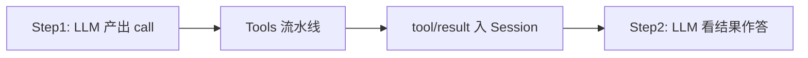
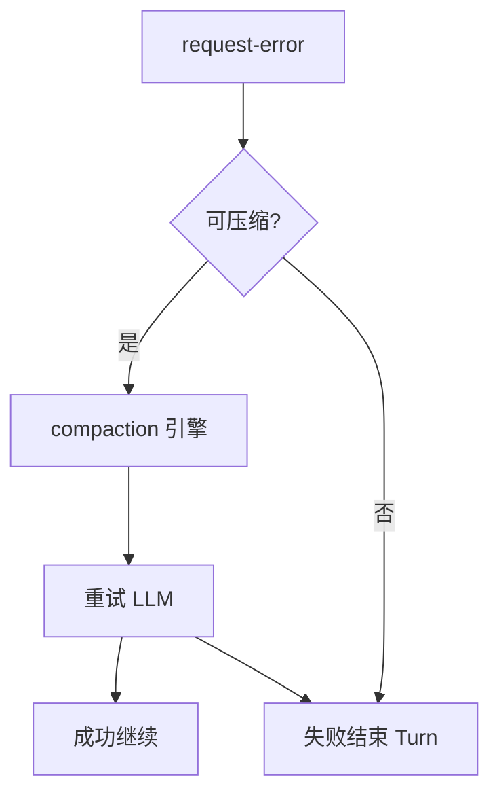

# 第四章 · 关键场景详解（深度补齐）

> **阅读顺序第 4 步**｜建议先读 [02](./02-总体架构与端到端.md) + [03](./03-子系统全景.md)。  
> 目标：用**完整故事**把多子系统串起来——每场景含触发条件、逐步流、落盘事件、失败分支、你该改哪。

### 本章目录

1. [场景阅读约定](#1-场景阅读约定)  
2. [S1 纯文本问答（无工具）](#s1-纯文本问答无工具)  
3. [S2 单工具调用](#s2-单工具调用)  
4. [S3 多工具并行 + 模型序提交](#s3-多工具并行--模型序提交)  
5. [S4 审批拒绝](#s4-审批拒绝)  
6. [S5 Steer / Inject 插入](#s5-steer--inject-插入)  
7. [S6 取消进行中的 Turn](#s6-取消进行中的-turn)  
8. [S7 上下文溢出 → 压缩重试](#s7-上下文溢出--压缩重试)  
9. [S8 子 Agent 委派](#s8-子-agent-委派)  
10. [S9 Ask User 等待人类](#s9-ask-user-等待人类)  
11. [S10 Headless 一次性任务](#s10-headless-一次性任务)  
12. [S11 崩溃恢复（持久化）](#s11-崩溃恢复持久化)  
13. [S12 斜杠命令不进模型](#s12-斜杠命令不进模型)  
14. [场景 → 代码入口速查](#14-场景--代码入口速查)

---

## 1. 场景阅读约定

每个场景用同一模板：

```text
目标 / 触发
参与子系统
逐步（编号）
关键 Session 事件（示意）
失败与边界
改代码落点
```

事件名以官方 `SessionEventMap` / Agent 事件为准；此处为学习示意。

---

## S1 纯文本问答（无工具）

**目标**：用户问一句，模型直接答完，Turn 结束。

**参与**：Web → Agent → Inbox → Loop → SystemPrompt → LLM → Session →（可选）Persistence。

**逐步**：

1. UI `followup(userMessage)`  
2. Inbox splice → `next-turn`；`wakeDriver`  
3. `turn/start` → `claim` → `pre-step` 通过  
4. `step/start` + `user/message`  
5. `deriveMessages` → LLM stream → `assistant/chunk*` → `assistant/message`  
6. 无 tool-calls → `step/end` → `turn-stopping`（无可插）→ `turn/end`  
7. UI 经 `session/event` 刷新

**失败**：`pre-step` 拒绝 → 可能无 step 的短 Turn；LLM 错误 → `agent/request-error` 路径（见 S7）。

**落点**：改「进不进模型」→ `agent/pre-step`；改答法 → system prompt / 模型。

---

## S2 单工具调用

**目标**：模型决定调一个工具（如读文件），拿到结果再答。

**逐步（在 S1 基础上）**：

1. 首个 `assistant/message` 含 `tool-call`  
2. Session：`tool/call`  
3. `tools/pre-execute` → guards → `execute` → `post-execute`  
4. Session：`tool/result`（`sourceEventSeqs` 指向 call）  
5. Loop 开 **下一 Step**：再次 `deriveMessages`（已含 tool 结果）→ 再调 LLM  
6. 最终无 tool-calls → 结束 Turn



**落点**：工具实现 → `ToolDefinition.execute`；拦执行 → `tools/pre-execute` / Approval。

---

## S3 多工具并行 + 模型序提交

**目标**：一模型响应里多个 tool-call；可并行跑，但**提交顺序跟模型列出的顺序**。

**关键机制**：`executeToolCalls` / `runGroup` / `commitReady`（见 `source/02`）。

**示意**：

```text
模型顺序: call-A, call-B, call-C
实际完成: B 先完, A 次之, C 最后
Session 可见 tool/result 顺序仍: A → B → C
（未轮到的结果在缓冲，commitReady 后才 append）
```

**失败**：某一个 call 失败 → 通常仍按序提交失败结果，后续模型 Step 看到错误信息。

**落点**：调度策略极少改；多数改单工具超时/重试。

---

## S4 审批拒绝

**目标**：危险操作弹出审批，用户点拒绝。

**逐步**：

1. 进入 `tools/pre-execute` 或 Approval guard  
2. UI 展示 `ApprovalRequest`  
3. 用户 **deny** → `ApprovalOutcome` 否定  
4. 工具流水线失败路径 → Session 写入失败型 `tool/result`（或等价错误载荷）  
5. 下一 Step 模型看到「被拒绝」，可改策略或向用户解释

**边界**：会话级策略「总是允许/拒绝」可跳过弹窗但仍记审计事件。

**落点**：Approval 插件、工具危险等级元数据、UI answerer。

---

## S5 Steer / Inject 插入

| | Steer | Inject |
|---|--------|--------|
| 典型用途 | 用户中途改口令 | 系统塞「文件已变」等 |
| 队列 | 常为 `next-step` | `next-step` |
| 唤醒 | **会** wake | **不**独自 wake |
| 时机 | 当前 step 结束后或 turn-stopping 窗口 | 依赖已有 kick/turn |

**逐步（Steer）**：

1. 用户在生成中点「插入指令」  
2. `steer(text)` → inbox splice  
3. 驱动器在安全点 claim 到插入内容  
4. 作为后续 step 的用户侧输入进入 Session  
5. 模型在新上下文上继续

**落点**：Inbox 语义、UI 绑定；不要直接 `messages.push`。

---

## S6 取消进行中的 Turn

**目标**：用户点 Stop。

**逐步（示意）**：

1. `cancel` / abort 信号进入 Agent  
2. 进行中的 LLM stream / 工具执行收到中止  
3. Session 以明确的 Turn 结束原因收尾（如 cancelled）  
4. 部分已写入的 `assistant/chunk` 或 `tool/result` **保留**（日志只追加）  
5. UI 显示已停止；队列中未 claim 的 inbox 项策略依实现（常保留待下次）

**落点**：AbortSignal 贯通 llm/tools；勿删历史事件「假装没发生」。

---

## S7 上下文溢出 → 压缩重试

**目标**：请求太大或模型报 context overflow，压缩后重试同一逻辑回合。

**逐步**：

1. `buildRequest` / stream 失败 → `agent/request-error`  
2. Compaction 引擎跑：写 `compaction/*` 事件，改写或标记可投影历史  
3. TokenMeter 更新视角  
4. Loop **重试**请求（仍同一 Turn/产品语义，具体边界看实现）  
5. 成功则继续；仍失败则向用户报错结束



**落点**：`CompactionEngine`、pruner、错误分类；钩子 `agent/request-error`。

---

## S8 子 Agent 委派

**目标**：父 Agent 把子任务交给 Subagent，收回结果。

**逐步**：

1. 模型调 `tool-subagent`（或 API `ctx.subagents.start`）  
2. Provider（如 inprocess）创建子 Agent + 子 Session（或隔离视图）  
3. 子 Agent 自有 Inbox/Loop/Tools（Scope 隔离）  
4. 子 run 结束 → `SubagentResult`  
5. 父 Session 写入工具结果 → 父模型继续

**边界**：子 Agent 权限/工具集 ≤ 父；沙箱策略继承或显式收紧。

**落点**：`subagent` Provider、结果汇总格式、是否共享 cwd。

---

## S9 Ask User 等待人类

**目标**：模型问用户选择题，UI 弹出，答完再继续。

**逐步**：

1. 工具 `ask_user` → `userQuestions` seam  
2. Turn/工具执行处于等待（阻塞该 tool execution）  
3. 用户提交答案 → answer 事件  
4. `tool/result` 带答案  
5. 下一 Step 模型继续

**与审批区别**：审批是允不允许；Ask User 是业务问答。

---

## S10 Headless 一次性任务

**目标**：CI/脚本：`dsh --profile headless …` 跑完退出。

**逐步**：

1. Profile 叠 `dsh-base` + `dsh-headless`（无长期 Web）  
2. 任务运行器创建 Agent，投递初始 prompt  
3. 内环跑到终止条件（无工具/显式完成/错误）  
4. 进程退出码反映成败  
5. 若启用 persistence，日志留在 home 目录供回放

**落点**：headless runner 包、退出码约定、环境变量凭据。

---

## S11 崩溃恢复（持久化）

**目标**：进程挂了，重启后会话还在，队列不丢。

**逐步**：

1. 运行中每次 `append` → Persistence 后端（JSONL/SQLite）  
2. 崩溃  
3. 重启 Boot → 加载 SessionHeader + 事件日志  
4. Inbox 的 **spliced 持久事件** 可重建未 claim 队列  
5. UI 恢复 Agent；用户继续 followup

**边界**：只进内存没订 persistence 的事件会丢——这就是铁律「可见即应记日志」的工程压力。

**落点**：`session-persistence-*`、flush 时机、迁移。

---

## S12 斜杠命令不进模型

**目标**：用户输入 `/compact` 或业务命令，直接改状态。

**逐步**：

1. UI 解析为 command 而非普通 followup  
2. `ctx.commands` 调用 handler  
3. Handler 可：触发 compaction、改 settings、写 Session 领域事件  
4. **默认不**经 LLM；除非 handler 显式再 `followup`

**落点**：commands 注册、与 AskUser/Approval 的互斥。

---

## 14. 场景 → 代码入口速查

| 场景 | 优先阅读 |
|------|----------|
| S1–S2 | `source/01-react-loop-agent.md` |
| S3 | `source/02-tool-scheduler-runtime.md` |
| S4/S9 | PART2 审批/提问；`docs/subsystems/approval.md` |
| S5–S6 | `source/03-session-inbox-factory.md` + agent cancel |
| S7 | PART2 compaction；`agent/request-error` |
| S8 | PART2 subagent；`docs/subsystems/subagent.md` |
| S10 | PART3 surfaces；headless bundle |
| S11 | PART3 持久化；`docs/subsystems/persistence.md` |
| S12 | `docs/subsystems/commands.md` |

---

## 本章总结

1. **快乐路径**：followup → claim → 模型 →（工具）→ turn/end；UI 只订 Session。  
2. **多工具**：可以并行跑，**必须按模型序 commit**（S3）。  
3. **人拦一层**：审批拒绝 / Ask User 等待，都要给模型一个可投影的结果（S4/S9）。  
4. **插入与停止**：steer/inject 进 Inbox；cancel 清相位，日志只追加不删（S5/S6）。  
5. **撑不住就压**：溢出 → compaction → 重试（S7）。  
6. **外环与恢复**：子 Agent、headless、持久化崩溃恢复，都不另造第二套 messages（S8/S10/S11）。  
7. **命令可以不经模型**（S12）——别和 followup 混成一条路径。

场景对上号后，再进 `source/` 看函数；源码篇已按「白话→代码→注释→小结→章末总结」重写。

加厚专题（压缩 JSONL 示例、HITL 时序、Trajectory、多框架对照）：[06-运行时深度专题](./06-运行时深度专题-Memory压缩投影HITL.md)。

下一层机制深挖：[ARCHITECTURE_PART1.md](./ARCHITECTURE_PART1.md)。
