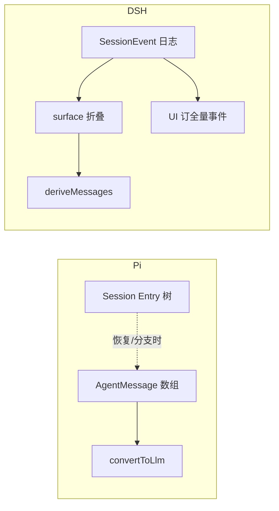

# 对照 · Pi Agent Loop 与 DSH Loop

> **对照用**：本仓 `pi/`（`@earendil-works/pi-agent-core` + coding-agent）与 DeepSeek Harness。  
> 权威行为以各自源码与官方 docs 为准。  
> 相关术语：[GLOSSARY.md](./GLOSSARY.md)｜DSH 发消息 E2E：[02 §6](./02-总体架构与端到端.md)

### 本章目录

1. [一句话总差](#1-一句话总差)  
2. [Loop 流程对照](#2-loop-流程对照)  
3. [入队 API：同名不同义](#3-入队-api同名不同义)  
4. [Session 读写设计](#4-session-读写设计)  
5. [Message 投影设计](#5-message-投影设计)  
6. [读写 + 投影串起来](#6-读写--投影串起来)  
7. [选型直觉](#7-选型直觉)

---

## 1. 一句话总差

| | **Pi** | **DSH** |
|--|--------|---------|
| 定位 | 可嵌入的最小 agent-core + coding harness | 插件平台上的可替换 Driver |
| Loop | 「跑完一段 ReAct」：一次 `prompt`/`runLoop` 同步跑到底 | 「常驻驱动器」：`wake` → `kick` → 多 `turn`/`step`，可 `idle` 再醒 |
| 真源 | 运行时以 **`AgentMessage[]`** 为主；Session 树/JSONL 是 harness 层存储 | **Session 只追加事件**；messages **只是投影** |
| 扩展 | 回调钩子 + Extensions | Cordis 插件 + waterfall（Loop 也可换） |

---

## 2. Loop 流程对照

### 2.1 Pi（`packages/agent/src/agent-loop.ts` → `runLoop`）

```text
prompt(msgs) / continue
  → agent_start
  → 外层 while（为 followUp 再开轮）
       → 内层 while（有 tool 或 steering）
            → 注入 pending（steering）
            → stream 一次 assistant
            → 有 toolCalls → 执行 → 推进 messages[]
            → prepareNextTurn / shouldStopAfterTurn
            → drain steering → 有则继续内层
       → 本可停下 → drain followUp → 有则继续外层
  → agent_end
```

- Pi 的 **turn**（`turn_start`/`turn_end`）≈ 一次 LLM + tools，更接近 DSH 的 **Step**。  
- 已在跑时不能再 `prompt`；必须 `steer` / `followUp` 进内存队列。  
- **无「唤醒」**：还在同一次 `runLoop` 里，tool 结束后自己 `getSteeringMessages` / 将停时 `getFollowUpMessages`。

### 2.2 DSH（`ReactLoopAgent`）

```text
followup / steer / inject
  → Inbox.splice（写 agent/inbox/spliced）
  → 若需唤醒：wakeDriver → kick（仅 idle 真正启动）
  → while turn():
       turn/start
       while step:
         claim → assemble → agent/pre-step
         → deriveMessages() → LLM → tools
         → 若将停且无 next-step：turn-stopping
       turn/end
  → idle（队列还有且闩过则再 wake）
```

- **Turn** = 大边界；**Step** = 一次模型调用。  
- **running** 时 step/tool 边界自己看 Inbox；**唤醒只对付 idle**。  
- 策略挂 waterfall，不写死在 while 里。

### 2.3 概念对齐表

| Pi | DSH 近似 |
|----|----------|
| turn（LLM+tools） | Step |
| 一次 `prompt` 整段 run | 一次 `kick`（内可多 Turn） |
| steering 队列 | `next-step`（但不持久、不 wake） |
| followUp 队列 | 「本 run 将结束时再塞」≠ DSH `followup` |
| `prompt`（空闲新开） | `followup` + wake |
| （无） | `inject`（入队不醒） |

---

## 3. 入队 API：同名不同义

| | **Pi** | **DSH** |
|--|--------|---------|
| 开跑 | `prompt(...)`；流式中必须 `streamingBehavior` | `followup` → `next-turn` + 唤醒 |
| steer | 每内层 turn 结束后 drain，插进下一次 assistant 前 | `next-step` + 唤醒；下一步 **claim** 时领 |
| follow-up / followup | 将 `agent_end` 时 drain，再开外层 | 用户新话用 **followup**，偏新 Turn |
| inject | 无同名（有 asides 等旁路） | `next-step`、**不唤醒** |

详见 [GLOSSARY · followup/steer/inject](./GLOSSARY.md) 与「唤醒」说明。

---

## 4. Session 读写设计

### 4.1 写什么

| | **Pi** | **DSH** |
|--|--------|---------|
| 运行时直接推什么 | 循环内 **`currentContext.messages.push(...)`**（AgentMessage） | 循环内 **`session.append(type, data, opts?)`**（SessionEvent） |
| 持久层写什么 | Harness Session：**树状 Entry**（message / compaction / custom / model_change…）+ lane/branch；`appendMessage` / `appendEntry` | **同一条事件流**可由 persistence 插件订 `session/event` 落盘；Session 类本身不写文件 |
| Inbox / 排队 | 内存 `steeringQueue` / `followUpQueue`（Agent 上） | **`agent/inbox/spliced` 也是 Session 事件**；Inbox 是投影 |

### 4.2 读什么、谁读

| 读者 | **Pi** | **DSH** |
|------|--------|---------|
| Loop 调模型前 | 读内存 `AgentMessage[]`（可先 `transformContext`） | **`deriveMessages()`** 从事件日志投影 |
| UI | 订 AgentEvent 流（message_update 等）；亦可读 Session 快照 | 订 **`session/event`**（含 chunk）；表面历史另有 surface 折叠 |
| 恢复 / 分支 | Session 树 + branch path → `buildSessionContext` 重建 messages | 重放事件 → 重建 Session / Inbox 投影 |
| 压缩 | Entry 类型 `compaction` + retainedTail；上下文构建时裁路径 | `surfaceOp: replace` 等改表面；压缩策略挂 waterfall |

### 4.3 设计意图

```text
Pi：
  热路径优先「数组在手」→ 调 LLM 快、嵌入简单
  Session 树解决分支、compaction、崩溃恢复（harness 规格很重）
  Loop 核心（agent-loop）可以不绑死某一种 Session 后端

DSH：
  热路径也走 append → 强制「模型可见 ⟺ 已记录」
  没有第二份「真」messages[] 与日志并行
  Inbox 入队/出队同样落事件，刷新/审计与对话同一公理
```

**对照一句**：Pi 是「消息数组是工作集，Session 是可选/分层的存储与树」；DSH 是「事件日志是唯一工作集，messages 永远是读模型」。

---

## 5. Message 投影设计

### 5.1 Pi：两级（运行时）+ 可选（从树重建）

**A. 每次调 LLM 前（agent-loop 热路径）**

```text
AgentMessage[]（上下文工作集）
  → transformContext?     // 剪枝、注入外部上下文（仍是 AgentMessage[]）
  → convertToLlm          // → 供应商 Message[]（过滤 UI-only / 自定义类型）
  → stream
```

- `AgentMessage` 可声明合并扩展；LLM 只认 user / assistant / toolResult。  
- **投影发生在调用边界**，不是「每次 UI 刷新从磁盘重放」。

**B. 从 Session 树构建上下文（harness）**

```text
branch path 上的 Entry[]
  → entryTransforms（默认：从最近 compaction 切开）
  → sessionEntryToContextMessages / projectors
  → AgentMessage[]（再进入上面的 A）
```

分支、compaction summary、custom entry 投影器都在这一层。

### 5.2 DSH：事件 → 表面 → messages

```text
session.append(事件)
  ├─ 全部事件：UI / 遥测 / 持久化可订
  └─ 带 surfaceOp 的表面事件：进入「对话表面」有序列表
        → deriveMessages() → 给模型的 messages[]
```

| 机制 | 作用 |
|------|------|
| **`surfaceOp: append`** | 该事件成为历史上的一个节点（如最终 `assistant/message`） |
| **`surfaceOp: replace`** | 压缩等：用新节点替换一段旧表面 |
| **chunk vs message** | `assistant/chunk*` 可订来做打字机；进模型的通常是折叠后的 `assistant/message` |
| **`sourceEventSeqs`** | tool/result 等指向 call，保持溯源 |

`pre-step` 认领的 Inbox 消息，要 **`append('user/message', …, { surfaceOp: 'append' })`** 之后才进入表面；仅 `inbox/spliced` 不算对话历史节点。

### 5.3 投影对比表

| 维度 | **Pi** | **DSH** |
|------|--------|---------|
| 工作集形态 | `AgentMessage[]`（可变数组） | `SessionEvent[]`（只追加） |
| 给模型的转换 | `transformContext` + **`convertToLlm`** | **`deriveMessages()`**（+ systemPrompt.assemble） |
| 自定义类型 | 声明合并 + convert 时消化 | 新事件类型 + 是否标 surface / 如何 derive |
| UI 与模型是否同构 | 常不同：UI 看事件流；模型看 convert 后 | **同日志**：UI 可看全量事件，模型看表面投影 |
| 压缩落点 | Session Entry `compaction` + 路径裁剪 | 表面 **replace** + 策略插件 |
| Inbox 是否进投影公理 | 否（内存队列） | 是（spliced 事件；claim 后才 user/message） |

---

## 6. 读写 + 投影串起来

### Pi（一次 prompt）

```text
写：push AgentMessage /（harness）appendMessage→Entry
读：内存数组 或 树→buildContext→AgentMessage[]
投影：transformContext → convertToLlm → LLM
回写：assistant / toolResult 再 push（并可选持久化 Entry）
```

### DSH（一次 followup）

```text
写：splice → inbox/spliced；claim 后 user/message；stream 中 chunk；折叠 assistant/message；tool/call|result
读：全程从 Session（或订阅 session/event）
投影：deriveMessages() → LLM
（无）单独维护第二份 messages 真源
```



---

## 7. 选型直觉

| 你要… | 更贴近 |
|-------|--------|
| 短路径嵌入、热路径数组、扩展用回调/Extension | **Pi** |
| 可回放审计、多表面组装、策略插件化、Inbox 也事件化 | **DSH** |
| 重分支树 / compaction Entry 规格 | Pi harness Session 文档极深；DSH 用表面 replace + 插件 |
| 换整套循环算法 | DSH 一等公民（换 factory）；Pi 多在钩子与外层 Session |

> **学 Pi**：`convertToLlm` 边界清晰、steering/followUp drain 时机简单。  
> **守 DSH**：不要把「内存 messages[]」做成与 Session 并行的第二真相；投影只读、写入只 append。

源码锚点：

- Pi loop：`pi/packages/agent/src/agent-loop.ts`、`agent.ts`  
- Pi 上下文：`pi/packages/agent/src/harness/session/context.ts`  
- DSH loop：`deepseek-harness/packages/core/agent-loop/src/agent.ts`  
- DSH session / surface：`deepseek-harness/packages/core/session/`（`deriveMessages`、surface 测试）

加厚（Memory 分层、压缩示例、HITL、Trajectory、Cordis 边界）：[06-运行时深度专题](./06-运行时深度专题-Memory压缩投影HITL.md)。
