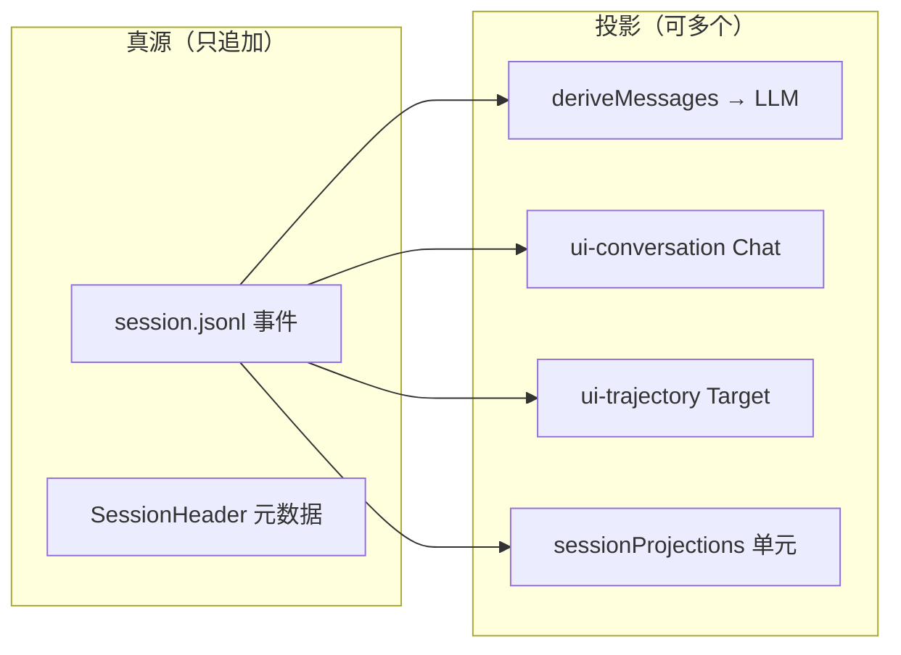
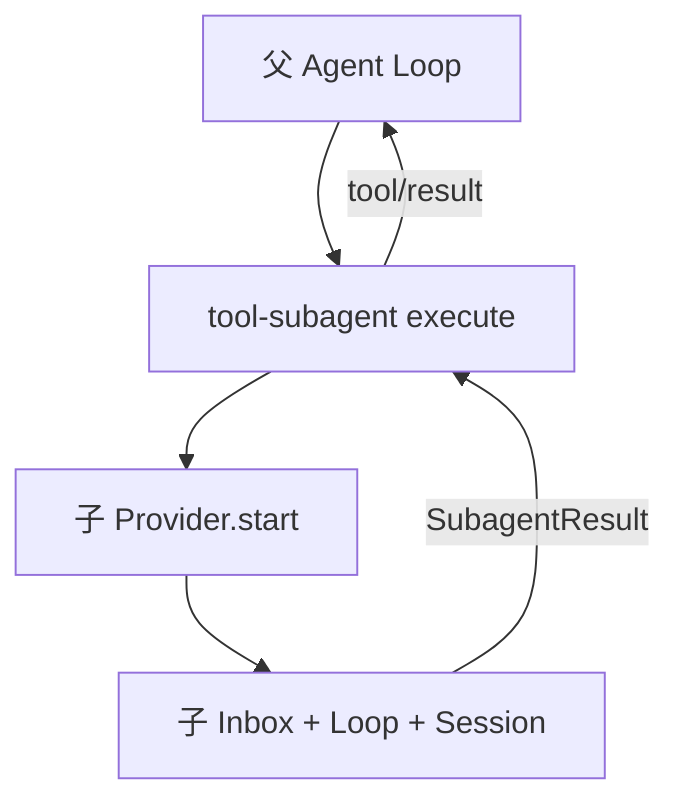
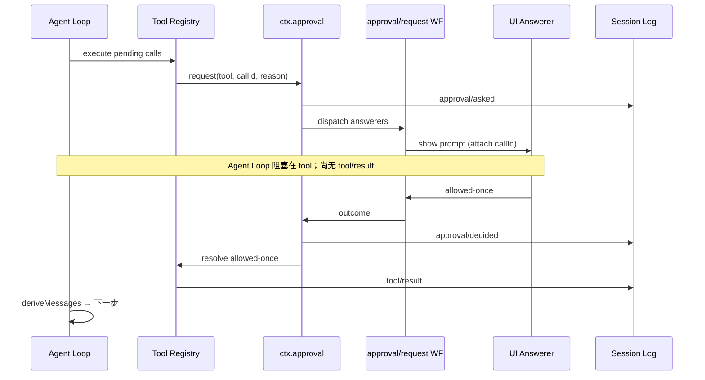

# 第六章 · 运行时深度专题（Memory / 压缩 / 投影 / HITL / Trajectory / 对照）

> **阅读顺序第 6 步**｜建议在 [03 子系统全景](./03-子系统全景.md)、[04 关键场景](./04-关键场景详解.md)、[05 对照 Pi](./05-对照-Pi-与-DSH.md) 之后读。  
> 目标：把「记忆分层、压缩如何改 surface、多投影、审批暂停、Trajectory、与其它 Agent 框架对照、Cordis 协议边界」**串成一张可落地的图**——含写入归属与熟悉对照。  
> 权威类型：`docs/subsystems/*.zh.md`；本篇是学习向加厚。

### 本章目录

1. [总览：真源 vs 投影](#1-总览真源-vs-投影)
2. [Memory：短期 / 长期 / 实体 / 流程](#2-memory短期--长期--实体--流程)
3. [文件与 Skills：提取与「召回」](#3-文件与-skills提取与召回)
4. [压缩：原理、时机、完整示例](#4-压缩原理时机完整示例)
5. [session.jsonl.zstd 与持久化](#5-sessionjsonlzstd-与持久化)
6. [Session 投影与同类型项目](#6-session-投影与同类型项目)
7. [多 Agent：子 Agent 与并发模型](#7-多-agentsubagent-与并发模型)
8. [HITL：审批暂停与恢复](#8-hitl审批暂停与恢复) — **细读** [07-HITL审批流程详解](./07-HITL审批流程详解.md)
9. [Trajectory：定义、流程、同类](#9-trajectory定义流程同类)
10. [多框架 Session 设计对照表](#10-多框架-session-设计对照表)
11. [Cordis 插件协议](#11-cordis-插件协议)
12. [Cordis 是否「只为差异」？](#12-cordis-是否只为差异)
13. [本章导航](#13-本章导航)

---

## 1. 总览：真源 vs 投影

| 概念 | DSH 里是什么 | **拥有** | **不拥有** | 熟悉对照 |
|------|-------------|----------|------------|----------|
| **Session 日志** | 只追加 `SessionEvent` | 全部历史事实 | 模型该看到什么 | Git 提交历史 |
| **Surface** | `surface.nodes` + `surfaceOp` | 模型可见边界 | 人类聊天 UI 全文 | Condenser 输出 |
| **deriveMessages()** | 从 surface **投影** messages | 每次请求的 LLM 输入 | 事件真源 | CQRS 读模型 |
| **Inbox** | `agent/inbox/spliced` 事件 | 待认领投递 | 内存队列数组 | Pi `steer` 队列（但 DSH 持久） |

**写入归属（一句话）**：Loop / Tools / Compaction / Approval **只 append 事件**；**从不**在真源上删改旧行；改模型上下文 = 新事件 + `surfaceOp`。



---

## 2. Memory：短期 / 长期 / 实体 / 流程

DSH **没有** deer-flow 式「单一 `memory.json` 长期事实轨」作为内核默认；记忆是 **正交能力** 拼起来。

### 2.1 分层表

| 层级 | 实体 / 存储 | 写入路径 | 进入模型 | 性质 |
|------|-------------|----------|----------|------|
| **短期工作记忆** | `Session.log` + `surface.nodes` | 每 turn/step append | `deriveMessages()` | **真源 + 投影** |
| **Inbox 队列** | `agent/inbox/spliced` | splice / claim | `claim('next-turn'/'next-step')` | **持久投影**，非内存数组 |
| **Skills** | 磁盘 `SKILL.md` 等 | 人 / 包维护 | `skill` 工具 + system 片段 | **指令插件**，非 transcript |
| **Compaction 摘要** | `compaction/*` + replace 检查点 | 压缩引擎 | 替换后的 checkpoint `user/message` | **上下文压缩**，非 LTM |
| **附件** | `<DSH_HOME>/attachments/v1` | 用户消息前落盘 | 事件里引用 | 二进制外置 |
| **SessionHeader** | 与 log 并列 | 创建 / fork | **不进** `deriveMessages` | cwd、parent、seedLength |
| **KV / Domain** | `ctx.storage` 各 domain | 插件 `put/update` | 插件自读 | 可选长期状态 |

| 实体 | **拥有** | **不拥有** |
|------|----------|------------|
| `ctx.sessions` | append、surface fold、deriveMessages | Skills 文件内容、MCP 进程 |
| `ctx.skills` | 注册表、scope 合并、发现元数据 | Session transcript |
| `ctx.compaction` | 压缩策略、replace 检查点 | 向量检索 |
| `ctx.storage` | 命名域 KV | 默认「用户记忆」语义 |

### 2.2 一轮对话中的记忆流

```text
用户输入 → Inbound → inbox(next-turn) 或 steer(next-step)
  → turn/start → step/start
  → claim inbox → user/message (surface append)
  → deriveMessages() → LLM
  → assistant/chunk… → assistant/message
  → tools 调度 → tool/result
  → step/end → turn/end
  → session/flush → persistence 写 jsonl.zstd
```

**与 LangChain `libs/deepagents` 的区别**：后者用 LangGraph **checkpoint** 当真源 + `SummarizationMiddleware` 改 checkpoint；DSH 用 **事件日志 + surface replace**。见 [§10](#10-多框架-session-设计对照表)。

---

## 3. 文件与 Skills：提取与「召回」

| 路径 | 机制 | 写入归属 | 熟悉对照 |
|------|------|----------|----------|
| **Skills** | `ctx.skills` 按 scope 合并 → `skill` 工具读全文 | 磁盘文件 + 注册表事件 | Hermes `skill_view` |
| **读文件** | `filesystem` / `bash` seam | tool result 进 Session | 任意 coding agent |
| **Compaction offload** | 摘要 + 可选 spill | compaction 引擎 | OpenHands condenser |
| **Tool result pruner** | 缩短旧 tool 输出再摘要 | pruner 服务 | 手工截断 tool 结果 |
| **向量 recall** | **无默认** | 需自建插件或外接 domain | crewAI Memory / mem0 |

**召回流程（Skill）示意**：

```text
模型调 skill(name)
  → tools 流水线
  → skill 工具读 provider 快照 / 文件全文
  → tool/result 写入 Session（append）
  → 下一轮 deriveMessages 包含该 result
```

---

## 4. 压缩：原理、时机、完整示例

### 4.1 原理

- 压缩 **不删 log**；只改 **surface**（模型可见投影）。
- 审计三步：`compaction/start` → `compaction/summary` → `compaction/end`（**仅日志**，不进模型 transcript）。
- 真正改模型上下文：带 `surfaceOp: { op: 'replace', start, end }` 的 **`user/message`**（压缩检查点）。
- `shadowedSeqs` 记录被遮住的 surface 节点；`replaceGeneration` 变化时 `deriveMessages()` **整表重建** surface 索引。

官方：`docs/subsystems/compaction.zh.md`。

### 4.2 时机

| 触发 | 时机 | 说明 |
|------|------|------|
| **pressure** | `agent/pre-step` 串行 hook（`compactIfNeeded`） | token / 窗口压力 |
| **context-overflow** | `agent/request-error` 恢复路径 | 请求失败后重试前 |
| **manual** | `/compact` 或 compaction 工具 | 可插在 **两 turn 之间**（Trajectory 里 `turn: null`） |
| **prune** | 压缩前可选 | tool-result pruner 缩短旧 tool 输出 |

顺序：`pre-step` →（可选 prune）→ LLM 写 summary → append 审计 + replace 检查点 → 下一步 `deriveMessages()` 用新 surface。

### 4.3 压缩前 surface（逻辑）

假设 surface 上有 4 条 append 节点（seq 10–13）：

```text
[10] user: "分析 repo 结构"
[11] assistant: tool-call read_file(...)
[12] tool/result: <大段文件内容>
[13] assistant: "结构是 …"
```

模型下次请求看到 **4 条 message**。

### 4.4 压缩后追加的事件（示意 JSONL）

**审计（不进模型 transcript）**：

```jsonl
{"type":"compaction/start","seq":20,"time":100,"data":{"reason":"pressure","replaceGeneration":1}}
{"type":"compaction/summary","seq":21,"time":150,"data":{"summary":"用户要求分析 repo；已读 README 与 libs；结论是 monorepo…","shadowedSeqs":[10,11,12,13]}}
{"type":"compaction/end","seq":22,"time":151,"data":{}}
```

**改 surface 的检查点（进模型）**：

```jsonl
{"type":"user/message","seq":23,"time":152,"data":{"role":"user","id":"cmp-1","content":[{"type":"text","text":"[Conversation summary]\n用户要求分析 repo…"}],"source":{"kind":"compaction"}},"surfaceOp":{"op":"replace","start":10,"end":13}}
```

要点：

- seq 10–13 **仍在 log**（Trajectory / 导出 / replay 可见）。
- `deriveMessages()` 在 replace 范围内 **不再展开** 10–13，只留一条 summary 形 `user`。
- Chat UI 可能仍显示完整历史 + compaction 标记。

### 4.5 压缩后下次 LLM 投影

```text
1. system（来自 request/header，不变）
2. user: "[Conversation summary] 用户要求分析 repo…"   ← 检查点
3. （若又有新 turn）user: 新用户话 / inbox claim 的内容
```

场景串联见 [04 S7](./04-关键场景详解.md#s7-上下文溢出--压缩重试)。

---

## 5. session.jsonl.zstd 与持久化

| 维度 | 说明 |
|------|------|
| **逻辑格式** | 一行一个 JSON 事件：`type` + `seq` + `time` + `data` + 可选 `surfaceOp` |
| **物理格式** | zstd 帧压缩的 append-only 文件 |
| **写入** | `session/flush` 后由 Persistence 协调器落盘 |
| **读取** | 解压 → 按 `seq` 重放 → 重建 surface + inbox 投影 |

**未压缩片段示例**（与仓库 snapshot 同形，`scripts/snapshots/`）：

```jsonl
{"type":"session","version":0,"id":"sess-abc","createdAt":0,"cwd":"/proj","delegationDepth":0}
{"type":"agent/inbox/spliced","seq":0,"time":0,"data":{"target":"next-turn","start":0,"inserted":[{"role":"user","content":[{"type":"text","text":"hello"}],"source":{"kind":"user"},"id":"m1"}]}}
{"type":"turn/start","seq":1,"time":1,"data":{"turn":1}}
{"type":"user/message","seq":2,"time":2,"data":{"role":"user","content":[{"type":"text","text":"hello"}],"source":{"kind":"user"},"id":"m1"},"surfaceOp":"append"}
{"type":"assistant/message","seq":3,"time":3,"data":{"turn":1,"step":1,"message":{"role":"assistant","content":[{"type":"text","text":"hi"}],"source":{"kind":"model"},"id":"m2"}},"surfaceOp":"append"}
```

压缩后在 **同一文件** 末尾追加 `compaction/*` + 带 `surfaceOp.replace` 的 `user/message`；zstd 只是外层编码。

**拥有 / 不拥有**：

| | Persistence 协调器 | Session 类 |
|--|-------------------|------------|
| **拥有** | flush 订阅、zstd 帧、崩溃恢复读 | 内存 fold、deriveMessages |
| **不拥有** | surface 语义、compaction 规则 | 磁盘路径策略（由 persistence 插件定） |

深挖：[ARCHITECTURE_PART3 §4](./ARCHITECTURE_PART3.md#4-持久化谁订阅-sessionevent)、`docs/subsystems/persistence.zh.md`。

---

## 6. Session 投影与同类型项目

DSH 有 **多层投影**，不是「一份 messages 打天下」：

| 投影 | 消费者 | 机制 |
|------|--------|------|
| **deriveMessages** | Agent Loop / LLM | surface fold |
| **ui-conversation** | Chat UI | Chat Definition + legacy.nodes |
| **ui-trajectory** | 工程师调试 UI | 独立 Definition + target builder |
| **sessionProjections** | Host / ApiProxy | `ProjectionDefinition` 纯函数 fold |

「**事件日志真源 + 多投影**」同类：

| 项目 | 真源 | LLM 投影 | UI 投影 |
|------|------|----------|---------|
| **DSH** | `session.jsonl` | `deriveMessages()` | Chat + Trajectory + projections |
| **OpenHands** | Event stream | Condenser | 事件 UI |
| **OpenHarness** | envelope / trace | 适配层 | 多轨分离 |
| **Pi** | harness JSONL；loop 主用数组 | 运行时 `AgentMessage[]` | 扩展回调 |
| **nanobot** | 轻量 session 文件 | 直接列表 | 轻量 |
| **Hermes** | transcript + skill 侧车 | while-loop messages | 终端 |

架构族归类见 OpenHarness `21-session-message-architecture.md`（Family A：CQRS 式事件 + 多读模型）。

官方：`docs/subsystems/session-projection.zh.md`。

---

## 7. 多 Agent：子 Agent 与并发模型

子 Agent **不是** loop 内置，而是 **Subagent seam**（`ctx.subagents`）。

### 7.1 Provider 与两种子 Agent

| 模式 | API | 行为 |
|------|-----|------|
| **一次性** | `SubagentProvider.start()` | 子跑完 → 结果回父 tool result |
| **可延续** | `prepareContinuable` + continuation manager | 子独立 session；父用 `send_message` / `interrupt` / `report` |

Provider 兄弟包：spawn-in-process、fork、ACP、Codex、Claude Code、dsh-sdk。

### 7.2 同步 / 异步 / 并行

| 层级 | 行为 | 熟悉对照 |
|------|------|----------|
| **父 loop 等子 one-shot** | 父 tool `execute` **await** 子 → **同步于父 step** | 普通 tool 阻塞 |
| **父内多个 tool call** | `parallel` 可重叠；`exclusive` 形成屏障 | LangGraph 并行 tools |
| **continuable 子** | 子 **独立** driver；父不阻塞整个 harness（除非父 tool 在等） | 后台 worker |
| **workflow** | pipeline / 并行 DAG | 外环编排，仍落 Session |

子 tool 在 Trajectory 里通过 `subCalls` **嵌套树**；Chat 把 code-dispatch 折叠进 root call。

场景：[04 S8](./04-关键场景详解.md#s8-子-agent-委派)。深挖：`docs/subsystems/subagent.zh.md`、`ARCHITECTURE_PART2`。



---

## 8. HITL：审批暂停与恢复

DSH **不是** LangGraph `interrupt_on`；是 **审批 seam（`ctx.approval`）+ 工具 waterfall**。

### 8.1 与 Ask User / Steer 的区别

| 机制 | 目的 | 是否结束 step |
|------|------|---------------|
| **Approval（HITL）** | 某次 tool 能否执行 | **否**，等同 tool 内阻塞 |
| **Ask User** | 模型向用户提问 | 依工具实现 |
| **Steer** | `next-step` inbox 插入 | 在 step 边界注入 |
| **Follow-up** | `next-turn` inbox | turn 末注入 |

### 8.2 流程

1. 模型发出 tool call → `tools/pre-execute` waterfall。  
2. 策略 / 插件或 `ask` 工具调 `ctx.approval.request()`。  
3. 服务 append `approval/asked`（**仅审计，不进模型**）。  
4. **挂起**：`request()` 的 Promise 未 resolve；尚无 `tool/result`。  
5. UI / ACP answerer 在 `approval/request` waterfall 上应答。  
6. `approval/decided` + outcome：`allowed-once` / `rejected` / `cancelled` / `unavailable`（**fail-closed**）。  
7. 工具继续或返回错误 result → loop 继续。

`ApprovalPolicy`：`ask`（走 answerer）或 `never`（一律 rejected，适合 CI）。

### 8.3 时序图



**写入归属**：`approval/*` → 仅审计；模型可见 = tool result + runtime-context 快照（非删改旧 assistant message）。

场景：[04 S4](./04-关键场景详解.md#s4-审批拒绝)、[04 S9](./04-关键场景详解.md#s9-ask-user-等待人类)。官方：`docs/subsystems/approval.zh.md`。

---

## 9. Trajectory：定义、流程、同类

**Trajectory** = `@deepseek-ai/dsh-client-ui-trajectory`：**调试 / 审计视图**，不是 LangSmith trace，也不是第二份真源。

| 维度 | 说明 |
|------|------|
| **数据** | 同一 Session 窗口上 **独立 Definition** + target builder |
| **内容** | 按 turn/step 的 provider **请求流**（assistant / compaction / tool 嵌套 `subCalls`） |
| **与 Chat** | 不消费 Chat `legacy.nodes`；**不跑第二遍 business fold** |
| **Compaction** | 独立 manual 在 `Between turns`；编号 compact 在 turn 内 |
| **能力** | 虚拟滚动、时间线、token/TTFT、区间选择 |

```text
Session events（真源）
    ├─ ui-conversation → Chat snapshot（人类可读）
    └─ ui-trajectory   → Trajectory target（工程师可读）
```

**同类**：OpenHands 事件 UI、ACP 客户端 session inspection、部分 IDE 调试时间线；**产品聊天**仍多用 Chat projection。

包 README：`packages/client/ui-trajectory/README.zh.md`；runtime 说明：`packages/client/runtime/README.zh.md` §Trajectory。

---

## 10. 多框架 Session 设计对照表

相对 **DSH 事件日志 + surface 投影**：

| 框架 | Session 记录 | Message | Memory | 压缩 |
|------|--------------|---------|--------|------|
| **DSH** | 追加事件 jsonl.zstd | `deriveMessages` / surface | skills + compaction + 可选 KV | replace 检查点 + 审计 |
| **Pi** | JSONL；loop 主用数组 | 运行时 `AgentMessage[]` | 扩展 + 文件 | harness 可选 |
| **MAF** | 宿主 + ContextProvider | provider 组装 | 插件 memory | 依 provider |
| **OpenAI Agents SDK** | run/session 对象 | items 列表 | 外置 | 无统一内置 |
| **OpenHands** | EventStore | Condenser 投影 | 设置 / condenser | Condenser 链 |
| **Hermes** | transcript 文件 | while-loop 数组 | skills 文件 | 手动 / 截断 |
| **OpenHarness** | envelope + trace | 适配层 | permission/hook 侧 | 依 harness |
| **crewAI** | task 状态 | crew 消息 | Memory 实体 | 摘要 task |
| **nanobot** | 轻量 session | 列表直传 | 极少 | 截断 |
| **GenericAgent** | 依实现 | 常见单轨 messages | 通常无 | 少见 |
| **libs/deepagents**（LangChain SDK） | LangGraph checkpoint | middleware 改 state | `AGENTS.md` + middleware | SummarizationMiddleware |

Pi 细对照：[05-对照-Pi-与-DSH.md](./05-对照-Pi-与-DSH.md)。MAF / Penguin：[ARCHITECTURE_PART3 §7–8](./ARCHITECTURE_PART3.md)。

---

## 11. Cordis 插件协议

Cordis = **运行时插件内核**（进程内能力注册与策略总线），**不是** MCP 替代品。

### 11.1 插件形态

```text
npm 包 @deepseek-ai/dsh-*
  → cordis.definePlugin({ id, setup(ctx) })
  → Bundle（cordis.patch.yml）叠进 Profile
```

### 11.2 三类角色（能力 seam 常见）

| 角色 | 职责 | 例子 |
|------|------|------|
| **Definition** | 类型与 seam 契约 | `dsh-compaction` |
| **Provider** | 实现服务 | `ctx.compaction.register(...)` |
| **Consumer** | waterfall / tool | `dsh-tool-*`、`dsh-command-*` |

### 11.3 注册与生命周期

```text
setup(ctx):
  ctx.effect(() => { register…; return () => unregister })  // 可逆
  ctx.on('agent/pre-step', handler)
  ctx.waterfall('tools/pre-execute', fn, { order })
```

- **HMR**：开发态 unload 时 effect 清理注册。  
- **Profile / Bundle / Patch**：见 [GLOSSARY](./GLOSSARY.md#profile--bundle--patch关系总表)。

### 11.4 与 Skill / MCP 边界

| | Cordis 插件 | Skill | MCP |
|--|-------------|-------|-----|
| 跑在哪 | harness 进程内 | 磁盘 + `skill` 工具 | 外进程 |
| 能改 loop | ✅ waterfall / driver | ❌ | ❌ |
| 能改 UI | ✅ slots | ❌ | ❌ |
| 典型用途 | compaction、approval、Trajectory tab | 领域 SOP | 外部 API |

教程：`docs/cordis-tutorial/index.zh.md`；primer：`docs/cordis-primer.zh.md`。

---

## 12. Cordis 是否「只为差异」？

**一半对**：成熟 harness 迭代重心确实是 **Skill + MCP + 模型 hook**；若产品只有「聊天 + 工具 + 技能」，**Middleware 链**（LangChain deepagents）或 **Pi 扩展** 往往路径更短。

**Cordis 仍可能值钱的场景**：

1. **同进程多能力、可卸载**：compaction、approval、subagent 后端、UI slot 需 **可逆注册**。  
2. **策略总线**：`tools/pre-execute`、`agent/pre-step` 统一 **fail-closed**（审批、策略、审计）。  
3. **Session 事件 + 多投影**：Chat / Trajectory / export **共享 log**。  
4. **可替换 driver**：常驻 driver vs 嵌入 loop，用插件换而非 fork 主仓。  
5. **产品化 SKU**：Web / CLI / ACP / 多 subagent 后端 **拼 Bundle**。

**结论**：Cordis 不是替代 Skill/MCP，而是 **「谁能在哪条 seam 上改行为」的治理层**。只维护 skill 库时像过度设计；同一二进制支撑多表面 + 可观测 Trajectory 时，是在 **减 fork**。

---

## 13. 本章导航

| 文档 | 用途 |
|------|------|
| [04 关键场景](./04-关键场景详解.md) | S4/S7/S8/S9 场景故事 |
| [05 对照 Pi](./05-对照-Pi-与-DSH.md) | Loop 与 Session 读写 |
| [ARCHITECTURE_PART2](./ARCHITECTURE_PART2.md) | Seam / 审批 / Subagent 深挖 |
| [ARCHITECTURE_PART3](./ARCHITECTURE_PART3.md) | 持久化 / 投影 / MAF 对照 |
| `docs/subsystems/compaction.zh.md` | 压缩类型权威 |
| `docs/subsystems/approval.zh.md` | 审批类型权威 |
| `docs/subsystems/session-projection.zh.md` | 投影单元权威 |

---

## 本章总结

1. **Memory** 在 DSH 是分层正交能力，默认无向量 LTM。  
2. **压缩** 改 surface replace，不删 log；时机在 pre-step / request-error / manual。  
3. **多投影** 共享事件真源；Trajectory ≠ Chat ≠ deriveMessages。  
4. **HITL** = `ctx.approval` 阻塞 tool，非 checkpoint interrupt。  
5. **子 Agent** one-shot 同步阻塞父 tool；父内 tools 可 parallel。  
6. **Cordis** 管进程内 seam 与策略；Skill/MCP 管知识与外连 API。
