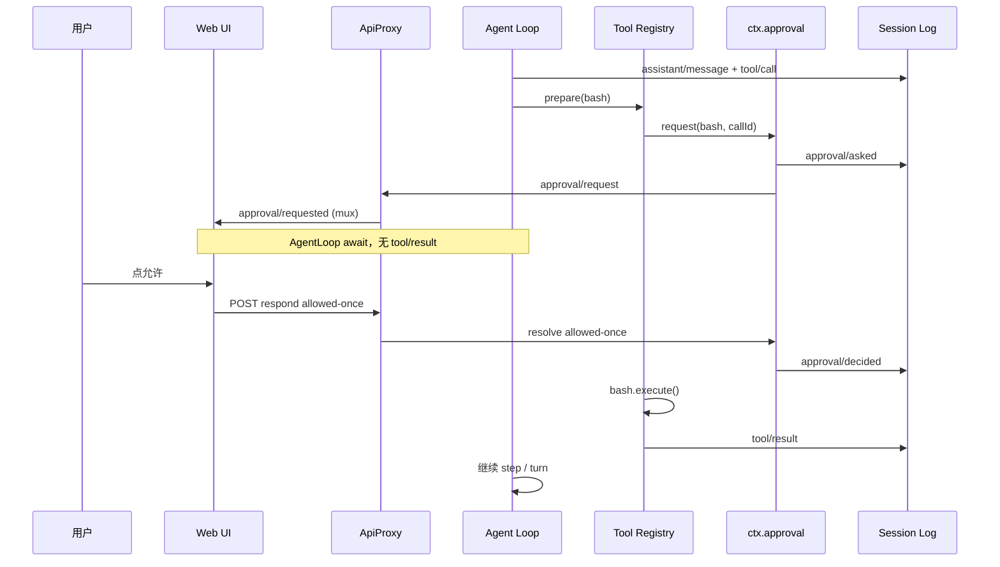
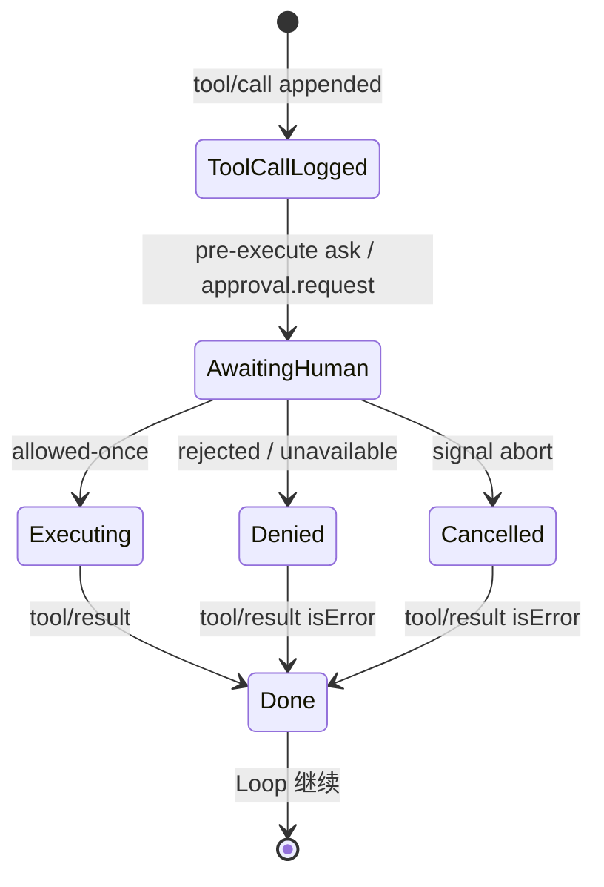

# 第七章 · HITL 审批流程详解（从零看懂）

> **专治「看不懂暂停/恢复」**｜读完应能回答：卡在哪、Session 写了什么、用户点允许后谁被唤醒。  
> 权威类型：`docs/subsystems/approval.zh.md`。加厚专题其它章节：[06](./06-运行时深度专题-Memory压缩投影HITL.md)。

### 本章目录

1. [先分清两条「等人」路径](#1-先分清两条等人路径)
2. [和 LangGraph interrupt 的区别](#2-和-langgraph-interrupt-的区别)
3. [审批 HITL：参与角色](#3-审批-hitl参与角色)
4. [逐步流程（以 bash 要提权为例）](#4-逐步流程以-bash-要提权为例)
5. [暂停时内存里发生什么](#5-暂停时内存里发生什么)
6. [用户点「允许」后如何恢复](#6-用户点允许后如何恢复)
7. [Session 里会出现哪些事件](#7-session-里会出现哪些事件)
8. [四种结局与模型看到什么](#8-四种结局与模型看到什么)
9. [时序图](#9-时序图)
10. [常见误区](#10-常见误区)

---

## 1. 先分清两条「等人」路径

| | **审批（Approval）** | **Ask User（userQuestions）** |
|--|---------------------|------------------------------|
| 问什么 | **能不能执行这个 tool**（权限） | **业务问题**（选 A/B、填表） |
| 服务 | `ctx.approval` | `ctx.userQuestions`（如 `ask_user` 工具） |
| 典型场景 | bash 沙箱提权、hook 要求人工放行 | 模型问「用哪个框架？」 |
| 工具结果 | 拒绝 → `Error: user rejected…` | 正常 result 带用户答案 |
| 审计事件 | `approval/asked` + `approval/decided` | 无这对审计（走问答协议） |

**本章只讲审批 HITL**。Ask User 见 [04 S9](./04-关键场景详解.md#s9-ask-user-等待人类)。

---

## 2. 和 LangGraph interrupt 的区别

| | LangGraph `interrupt_on` | DSH Approval |
|--|--------------------------|--------------|
| 暂停点 | Run 结束，checkpoint 标 interrupt | **Turn 仍开着**，卡在 tool `prepare` |
| 恢复 | 带人类输入 **重新 invoke** | **同一个 Promise** 被 UI resolve |
| 真源 | checkpoint state | Session 事件日志（审批只有审计对） |
| 模型 transcript | 可能还没 tool result | 已有 `assistant` + `tool/call`，**尚无** `tool/result` |

记忆口诀：**DSH = 工具线程在 `await ctx.approval.request()` 上睡觉，不是 loop 先退出。**

---

## 3. 审批 HITL：参与角色

```text
Agent Loop（turn 开着）
  → executeToolCalls
    → tools.prepare（内部 waterfall tools/pre-execute）
      → 某 listener 返回 { kind: 'ask' }
      → serviceAsk → ctx.approval.request()  ← 在这里 await
        → append approval/asked
        → waterfall approval/request
          → Web ApiProxy answerer：往浏览器推 approval/requested，注册 PendingApproval
        → （挂起直到人类应答）
        → append approval/decided
      → allowed-once 则继续 dispatch 工具 body
    → append tool/result
  → 下一步 step / 结束 turn
```

| 角色 | 职责 |
|------|------|
| **`tools/pre-execute`** | 策略链：返回 `allow` / `deny` / **`ask`** |
| **`ctx.approval.request()`** | 写审计对 + 调 answerer + **返回 outcome** |
| **`approval/request` answerer** | Web：ApiProxy；ACP：机器一次性决策 |
| **Tool Registry** | `ask` → 调 approval；`allowed-once` → 才真正 `execute` |

谁会产生 `ask`？

- Permission presets / hooks（如 Claude Code hooks 映射到 `pre-execute`）
- bash 沙箱 **提权**（`sandbox_permissions`）在 **execute 前** 调 `approveEscalation` → 内部也是 `ctx.approval.request()`

---

## 4. 逐步流程（以 bash 要提权为例）

**设定**：模型已输出 `tool-call: bash`，参数里要带 `sandbox_permissions`。

| 步 | 发生了什么 | Turn 状态 |
|----|------------|-----------|
| 1 | LLM 流式结束，Session 已有 `assistant/message`（含 tool call） | turn **开着** |
| 2 | `executeToolCalls` → `append tool/call` | 同上 |
| 3 | `tools/pre-execute` 或 bash 体内调 `approval.request()` | 同上 |
| 4 | `approval/asked` 写入 Session（**不进模型 transcript**） | 同上 |
| 5 | ApiProxy 推 `approval/requested` 到浏览器；UI 在 **该 tool call 旁** 显示允许/拒绝 | 同上 |
| 6 | **`request()` Promise 未 resolve** → `prepare` 未返回 → **尚无 tool/result** | **看起来「停了」** |
| 7 | 用户点「允许」→ `POST /api/respond` → `pending.resolve('allowed-once')` | 同上 |
| 8 | `approval/decided`；`request()` 返回；bash **真正执行** | 同上 |
| 9 | `tool/result` 写入 Session | 同上 |
| 10 | 若无更多 tool → `step/end`；可能再调 LLM 或 `turn/end` | turn 结束或下一步 |

**关键**：步骤 6 时 **Loop 没有退出**，只是 `await` 在工具调度栈里。

---

## 5. 暂停时内存里发生什么

```text
[JavaScript 调用栈示意]

executeToolCalls()
  await fillPool()
    await startCall()
      await tools.prepare(exec)     ← 卡在这里
        await waterfall(pre-execute)
        await serviceAsk()
          await approval.request()  ← 卡在这里
            await approval/request waterfall
              new Promise(...)      ← UI 还没 resolve
```

同时存在：

- **`PendingApproval`**（ApiProxy 内存表）：`rpcId` → `resolve(outcome)`
- **浏览器 mux 流**：收到 `approval/requested` 帧，刷新后 **同一 rpcId 可重放**

**没有**：

- 单独的 `session/paused` 事件
- Loop driver 回到 idle 再等 wake（除非用户同时点了 Stop）

用户点 Stop → `exec.signal` abort → outcome `cancelled` → tool 以取消错误结束。

---

## 6. 用户点「允许」后如何恢复

**不是**「新开一个 session / 重新 prompt」。

```text
浏览器 POST /api/respond { rpcId, outcome: 'allowed-once' }
  → ApiProxy 找到 PendingApproval
  → pending.resolve('allowed-once')
  → approval/request 的 Promise 完成
  → approval.request() append decided 并 return
  → serviceAsk 映射为 { kind: 'allow' }
  → tools.prepare 返回 dispatch
  → bash.execute() 跑命令
  → tool/result
  → commitReady() 按模型序提交
  → Loop 继续（同 turn、同 step 调度栈展开）
```

源码锚点：

- `packages/interaction/user-approval/src/index.ts` — `request()` / `decide()`
- `packages/core/tools/src/index.ts` — `serviceAsk()`
- `packages/host/apiproxy/src/api-proxy.ts` — `approval/request` listener、`PendingApproval`

---

## 7. Session 里会出现哪些事件

**模型可见（surface）**（暂停前已有）：

```text
user/message
assistant/message          ← 含 bash tool-call
tool/call                  ← 调度时已 append
（尚无 tool/result）
```

**仅审计（不进 deriveMessages）**：

```text
approval/asked           ← 问了能不能执行 bash
approval/decided         ← allowed-once / rejected / …
```

**恢复后追加**：

```text
tool/result                ← bash 输出或 Error: user rejected…
```

`approval/*` **永远不会**变成 LLM 的 user/assistant message；模型通过 **tool result 文本** 知道被拒或成功。

---

## 8. 四种结局与模型看到什么

| outcome | 工具是否执行 | 典型 tool result |
|---------|--------------|----------------|
| `allowed-once` | ✅ 只这一次 | 正常 bash 输出 |
| `rejected` | ❌ | `Error: the user rejected tool "bash"` |
| `cancelled` | ❌（用户 Stop） | `Error: approval for tool "bash" was cancelled` |
| `unavailable` | ❌（无 UI / headless 无 answerer） | `Error: … no approval channel is available` |

策略 `ApprovalPolicy.never`（CI）：**不调 answerer**，直接 `rejected`。

---

## 9. 时序图

### 9.1 总览



### 9.2 状态机（单 tool call）



---

## 10. 常见误区

| 误区 | 实际 |
|------|------|
| 「HITL = 整轮对话暂停，进程 idle」 | Turn **仍开着**；只是 **一个 tool 的 prepare 在 await** |
| 「恢复 = 用户发 followup 新消息」 | 恢复 = **应答审批 RPC**，不是 inbox 新 user 话 |
| 「approval 会写进模型上下文」 | `approval/*` **仅审计**；模型看 **tool result** |
| 「和 ask_user 是一回事」 | 审批 = 权限；ask_user = 业务问答，走 `userQuestions` |
| 「headless 默认能等人」 | 无 answerer → `unavailable` **fail-closed**；CI 用 `policy: never` |

---

## 本章总结

1. HITL = **`tools/pre-execute` 的 `ask`** 或工具内 **`ctx.approval.request()`**。  
2. 暂停 = **`await request()`**，不是 checkpoint interrupt。  
3. 恢复 = UI **resolve PendingApproval**，同一条调用链继续执行 tool body。  
4. Session 在暂停期已有 **tool/call**，缺 **tool/result**；审批只有 **audit 对**。  
5. Ask User 是另一条 seam，不要和审批混读。
