# DeepSeek Harness · 架构文档 PART 1

> **核心主干**：Cordis 运行时 · Profile/Bundle/Patch · AgentRegistry / Agent / ReactLoopAgent · Turn/Step/kick/wake · Session 公理 · Inbox · 工具流水线概览 · 三域事件 ·「Loop 是插件」澄清 · 与 Penguin/Pi/MAF 对照
>
> **质量条**：对齐 `pi/docs/ARCHITECTURE.md` 与 `agent-framework/docs/ARCHITECTURE_PART1.md` 的密度——实体表（拥有|不拥有|依赖|禁止）、Familiar 对照、每步 Session 写入归属、**源码走读**（问题/触发/带注释摘录/逐步表/自检，见 §4.4）、继承 vs 引用类图、节末小结。**不是**薄 TOC + 无注释代码块 + 一堆 mermaid。
>
> **对齐文档**：[00-流程与概念对照](./00-流程与概念对照.md) · [00b-顶层设计与实体边界](./00b-顶层设计与实体边界.md) · [GLOSSARY](./GLOSSARY.md)
>
> **源码根**：`deepseek-harness/packages/`（主干：`core/agent` · `core/agent-loop` · `core/session` · `boot/app-boot` · `bundle/base`）
>
> **本卷不覆盖**：Seam/执行世界/Subagent/外环细节 → [ARCHITECTURE_PART2](./ARCHITECTURE_PART2.md)；对照深度 → [ARCHITECTURE_PART3](./ARCHITECTURE_PART3.md) / [05-对照-Pi-与-DSH](./05-对照-Pi-与-DSH.md)

**阅读顺序**：§0 → §1 → §3 → §4 → §5（含写入清单）→ §6–§7 → §10 → §11–§12。卡在术语时回 [GLOSSARY](./GLOSSARY.md)。

---

## §0 导航与心智模型

### 0.1 一句话心智模型

```text
dsh --profile <name>
  → Profile 点名有序 Bundle → 各层 Patch 叠到空插件表 []
  → Cordis Loader 按 Entry 表启动插件树 → ctx（服务挂架）
  → dsh-agent-loop.apply：ctx.agents.setFactory(AgentLoop)
  → UI/SDK：agents.create / resume → ReactLoopAgent（默认 Driver）
  → followup/steer/inject → Inbox.splice（写 agent/inbox/spliced）
  → wakeDriver → kick：while turn() { claim → pre-step → step(LLM/tools) }
  → 真源始终是 Session.append；模型历史 = deriveMessages() 投影
```

口诀：

- **组装层**决定「装哪些插件行」；**不**决定 Turn 算法。
- **默认 Driver** 里的 while 是固定状态机；**可换的是整包 Factory**。
- **Session 只追加事实**；Inbox / surface / messages 都是投影。
- **策略挂 waterfall/serial**；不要改 `ReactLoopAgent` 源码加业务 if。

### 0.2 章节索引

| 章节 | 内容 | 关键源码 / 文档 |
|------|------|----------------|
| §0 | 导航、心智模型、Familiar 总表、端到端时序 | 本卷 |
| §1 | 产品命题与非目标 | [00b §1](./00b-顶层设计与实体边界.md) |
| §2 | Cordis：fiber / inject / ctx / emit·bail·serial·waterfall + Filter 对照 | `vendor/cordis` · `docs/cordis-primer` |
| §3 | Profile / Bundle / Patch 边界、类图、叠层、整行覆盖 | `boot/app-boot/src/profile.ts` · `bundle/base/cordis.patch.yml` |
| §4 | AgentRegistry · Store · Handle · Driver 全实体 · Session/Surface · Inbox · Scope · Dispatch · 能力层 · 事件域 · 全量类图 | `core/agent` · `core/agent-loop` · `core/session` |
| §5 | Turn/Step/kick/wake/claim **完整控制流 + 每步写入清单** | `agent-loop/src/agent.ts` · [00 §2](./00-流程与概念对照.md) |
| §6 | Session 公理：append-only · surfaceOp · deriveMessages · persistence 分离 | `session/src/index.ts` · `surface.ts` |
| §7 | Inbox 两桶 · splice vs claim · followup/steer/inject · 唤醒语义 | `agent/src/inbox.ts` |
| §8 | 工具流水线概览（pre/execute/post） | `tools/src/index.ts` · PART2 |
| §9 | 三域事件 agent / session / capability | `dispatch.ts` · SessionEventMap |
| §10 | 「Loop 是插件」澄清 | [GLOSSARY](./GLOSSARY.md#一切皆插件到底指什么含-loop) |
| §11 | 与 Penguin / Pi / MAF 对照 | [05](./05-对照-Pi-与-DSH.md) · [00b §5](./00b-顶层设计与实体边界.md) |
| §12 | 扩展决策树 + 总结 | 本卷 |

### 0.3 Familiar 对照（新词 → 你已经会的东西）

> 完整白话见 [GLOSSARY](./GLOSSARY.md) 与 [00 §1](./00-流程与概念对照.md)。此处是 PART1 速查。

| DSH 词 | 一句话 | 接近的旧知识 | **不是** |
|--------|--------|--------------|----------|
| **Cordis** | 可卸载的插件运行时 | OSGi / Spring 容器 + 可逆 Bean | 又一个 Agent 语义框架 |
| **`ctx`** | 进程内服务挂架 | Spring `ApplicationContext` | HTTP Request 上下文 |
| **Fiber** | 插件（子树）生命周期单元 | OSGi Bundle 生命周期 | 协程/用户态线程 |
| **`inject`（插件）** | 声明依赖服务就绪后才 `apply` | `@Autowired` / 构造注入 | Inbox 的 `inject` API |
| **Profile** | 可启动菜单（点哪些料包） | `application-web.yml` 激活哪套 | Bundle 本身 |
| **Bundle** | 可发布料包（自带 Patch） | Spring Boot Starter | 启动入口 |
| **Patch** | 改插件行表的 YAML 操作 | 多层 `application-*.yml` | git diff |
| **Waterfall** | 必须 `next()` 的中间件事件 | Filter / Koa middleware | 新算法 |
| **Agent** | 对外句柄：followup/steer/… | 会话上的 Facade | 循环源码类本身 |
| **Agent Loop / Driver** | 真正跑 while 的实现 | 司机；默认 `ReactLoopAgent` | 「每步小插件」 |
| **「Loop 是插件」** | 整包经 Patch 装上并 `setFactory` | 换实现了接口的 Bean | while 拆积木 |
| **Session** | 只追加事件日志 | Event Sourcing store | `messages[]` 真源 |
| **`deriveMessages`** | 从日志投影给模型 | CQRS 读模型 | 第二份真源 |
| **surface / surfaceOp`** | 哪些事件算对话历史上的点 | 物化视图；replace≈压缩改写 | 仅磁盘格式名词 |
| **Inbox** | 两桶待办（也落日志） | 双队列 next-turn / next-step | 可丢内存 list |
| **splice** | 入队并写 `inbox/spliced` | 持久化 enqueue | 立刻写成 user/message |
| **claim** | 出队并记账 | dequeue + ack | 与 splice 同一动作 |
| **wake / kick** | 空闲则启动驱动；kick=while turn | sleep→run；kick=工作循环 | tool 结束后的轮询铃 |
| **Turn** | 一轮大边界 | 「打开到关闭」的业务轮 | Pi 的 turn（Pi≈DSH Step） |
| **Step** | 一次模型调用（可含工具） | 内环一拍 | Turn |
| **Seam** | 定义+实现+使用方 | 端口/适配器 | 随便一个接口 |
| **执行世界** | fs+subprocess 同一本地/远程 | 同一 chroot/沙箱 | 只换其中一个 |

### 0.4 双环心智（最易混淆）

| | **内环（本卷重点）** | **外环（PART2）** |
|--|---------------------|-------------------|
| 是什么 | `ReactLoopAgent` 的 Turn/Step/工具 | Goal / Ralph / Workflow / Jobs |
| 循环单位 | Step ≈ 一次 LLM（可含 tool-calls） | 「再叫一次 Agent / 再开一轮」 |
| 入口 | `followup` / `steer` / `wakeDriver` | 各自编排器调 `agents.create` 或 `followup` |
| 真源 | 同一 `Session` 事件日志 | 也往 Session 写，但不替代内环 |

```text
外环决定「何时再叫一次 Agent」
内环决定「一轮里如何 claim / step / tool」
两边都往 Session 写事实；不要两套 messages[]
```

### 0.5 端到端时序（用户发一句话，含写入）

场景：Web 空闲，用户发送「重构这段」。锚点：`ReactLoopAgent.send/followup/wakeDriver/kick/turn/preStep`（`packages/core/agent-loop/src/agent.ts`），`Inbox.splice/claim`（`packages/core/agent/src/inbox.ts`），`Session.append/deriveMessages`（`packages/core/session/src/index.ts`）。

**读图约定**：`rect` 四段 = 入队 → claim/pre-step → step 内环 → turn 收尾；`session/event` 在**每次** `append` 后扇出给 persistence / telemetry / UI。

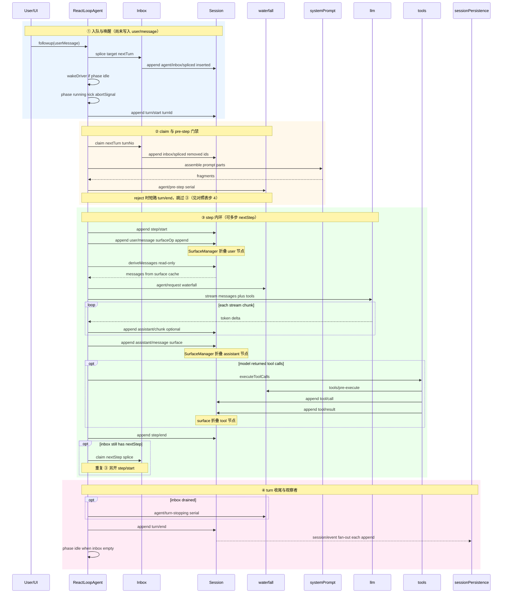

**逐步对照表**（成功路径；与 [00 §2](./00-流程与概念对照.md) 一致）：

| 步序 | 代码锚点（agent.ts 等） | Session 事件 | 进 surface？ | 进 derive？ | 说明 |
|------|-------------------------|--------------|--------------|-------------|------|
| 1 | `followup` → `inbox.splice` | `agent/inbox/spliced`（inserted） | 否 | 否 | 排队事实，UI 可投影「待处理」 |
| 2 | `wakeDriver` → `kick` | `turn/start` | 否 | 否 | 标记一轮协调开始 |
| 3 | `inbox.claim(nextTurn)` | `agent/inbox/spliced`（removed） | 否 | 否 | 队列项离开 inbox 视图 |
| 4 | `assemble` + `preStep` | — | — | — | waterfall 可 reject；不写 Session |
| 5 | `step` 入口 | `step/start` | 否 | 否 | 单步协调边界 |
| 6 | `appendUserMessage` | `user/message` | **是** | **是** | 首次进入对话表面 |
| 7 | `deriveMessages()` | —（只读） | — | 投影 | 从 surface 缓存生成 `Message[]` |
| 8 | `agent/request` + `llm.stream` | `assistant/chunk`×N | 通常否 | 否 | 流式 UI；chunk 多不进 surface |
| 9 | stream 结束 | `assistant/message` | **是** | **是** | 模型最终可见回复 |
| 10 | `executeToolCalls` | `tool/call` + `tool/result` | **是** | **是** | 每工具一对事件 |
| 11 | step 结束 | `step/end` | 否 | 否 | 单步协调结束 |
| 12 | `turnStopping` waterfall | — | — | — | inbox 空时串行钩子 |
| 13 | turn 结束 | `turn/end` | 否 | 否 | 一轮协调结束 |
| 14 | 每次 `append` | — | — | — | `session/event` → persistence / UI |

成功路径「写了什么」清单（事件类型速查）：

```text
agent/inbox/spliced     ← splice 入队（inserted）
turn/start
agent/inbox/spliced     ← claim 删除（removed）
step/start
user/message           ← 首次进入对话表面（surfaceOp append）
assistant/chunk*        ← 可选，多给 UI；通常不进 derive
assistant/message
tool/call, tool/result  ← 若有工具调用
step/end
turn/end
```

**常见断点**（对照调试）：

| 现象 | 先查 | 可能原因 |
|------|------|----------|
| UI 无气泡但有 inbox 事件 | `deriveMessages` / surface 规则 | 只有 `inbox/spliced`，尚未 claim→`user/message` |
| kick 不跑 | `phase` / `wakeDriver` | 仍在 `running` 或 `maintenance` |
| 模型看不到用户句 | surface 折叠 | `user/message` 未 append 或 surfaceOp 错误 |
| 磁盘无新行 | `sessionPersistence` 订约 | 未装插件或 `announce` 前写入被忽略 |

### 0.6 分层一览

```text
表面 Web / Headless / ACP / SDK
    → Profile 组装 Cordis 插件树
        → ctx.agents（注册表 + Factory 槽）
        → Agent 句柄（followup/steer/inject）
            → ReactLoopAgent（默认 Driver）
                → Session / Inbox / systemPrompt / tools / llm
```

| 层 | 代表 | 允许知道 | 禁止 |
|----|------|----------|------|
| 组装 | Profile、Bundle、Patch、app-boot | 装哪些插件行 | Turn 算法 |
| 注册表 | `ctx.agents` | create/resume、setFactory | 私有 kick 实现 |
| 句柄 | `Agent` API | 入队与唤醒语义 | 工具沙箱实现 |
| Driver | `ReactLoopAgent` | Session、Inbox、dispatch | 厂商 SDK 细节 |
| 真源 | `Session` | append / deriveMessages / surface | 文件路径格式（persistence 插件） |
| 能力 | tools、llm、fs、subprocess | 各 seam 端口 | import agent-loop 私有文件 |

### §0 小结

PART1 要把你从「听说皆插件」带到「能对着源码说出：谁拥有什么、每步写了什么、该挂哪条 waterfall」。下一节先钉死产品命题与非目标，避免把平台当成成品聊天 App 来读。

---

## §1 产品命题与非目标

### 1.1 产品是什么

| 项 | 内容 |
|----|------|
| 名称 | DeepSeek Harness（DSH） |
| CLI | `dsh`（例：`npx @deepseek-ai/dsh web` → `:3080`） |
| 阶段 | **开发者预览**；磁盘格式 / 公共 API **无**长期兼容承诺（首个 tagged release 前可自由改基础） |
| 栈 | TypeScript ESM · pnpm workspaces · `@deepseek-ai/dsh-*` · Node `^22.19 \|\| >=24` |
| 定位 | **可组装的 Agent Harness 平台**，不是「一个打好包的聊天 Agent 产品」 |

Familiar：若你来自 Claude Code / Cursor Agent / Penguin——那些交付「开箱即用的一个 App」；DSH 交付的是 **同一内核多产品面（Web/Headless/ACP/SDK）+ 可换 Loop + 可换执行世界** 的组装平台。代价是要懂 Profile≠Bundle≠Patch。

### 1.2 设计目标（落点实体）

| 目标 | 落点实体 | 操作化检验 |
|------|----------|------------|
| 多表面共用内核 | Profile/Bundle 组装；同一 `ReactLoopAgent` 工厂 | Web 与 Headless 只差 Bundle 列表，不复制 while |
| 策略不进 while | Waterfall 检查点（`agent/pre-step`、`tools/*`…） | 审批/压缩/改请求不改 `agent.ts` |
| 可回放、可审计 | **Session** 只追加；Inbox 也 `spliced` | 刷新/重启后队列与历史可重建 |
| 循环可整包替换 | **`dsh-agent-loop` 插件** → `agents.setFactory` | 卸掉该行 → `no agent factory registered` |
| 执行环境一致 | FS + Subprocess **成对** Provider（执行世界） | 读文件与 bash 看见同一 cwd/沙箱 |
| 模型可见 ⟺ 已记录 | `deriveMessages` 只读 surface | 进 LLM 的内容都能从日志投影 |

### 1.3 非目标（明确不做）

| 非目标 | 说明 | 常见误读 |
|--------|------|----------|
| 把 Turn/claim 拆成热插拔小插件 | 默认算法写死在 `ReactLoopAgent`；插件是**整包 Driver** | 「皆插件」≠ while 每行是插件 |
| Session 类写磁盘 | Persistence **订阅** `session/event` | 以为 `Session.append` 直接写 jsonl |
| core 工具直连远程 API 各写一套 | 走执行世界 Provider | 为 E2B 在每个 tool 里 if remote |
| 与成品 Agent 比「最短路径开聊」 | 平台心智成本更高 | 把 DSH 当 Penguin 式产品内核来骂「复杂」 |
| 第二份真 `messages[]` | 热路径也 append；投影只读 | 在 Driver 里维护可变数组当真相 |

### 1.4 核心命题（设计公理）

1. **模型可见 ⟺ 已记录** — 进入 LLM 请求的内容必须能从 Session 日志重建。
2. **注册是可逆副作用** — 工具/提示词/监听器经 `ctx.effect`/`ctx.on`；卸载 = 能力消失。
3. **Waterfall 是策略总线** — `next()` 委托；不调 `next()` = 短路（Filter 语义）。
4. **Driver 可换，契约不可糊** — 扩展依赖 `dsh-agent`，不依赖 `dsh-agent-loop` 私有实现。
5. **能力是完整 Seam** — Definition + Provider + Consumer；缺一角不可替换。

与「简单 ReAct」的本质差：

```text
简单 ReAct:
  messages = [...]
  while tool_calls:
    messages += llm(messages)
    messages += tools(...)

DSH:
  Session.append(events...)          ← 真源
  messages = session.deriveMessages() ← 每次请求重新投影
  inbox 分 next-turn / next-step      ← 人话 vs steer/inject
  pre-step waterfall                  ← 可拒绝本步（仍记 turn）
  tools scheduler                     ← 并行池 + 模型序提交结果
  turn-stopping serial                ← 停轮前最后检查点
```

### §1 小结

DSH 买的是 **平台灵活**（多面、可换 Loop、可审计）；不是最短路径成品 Agent。读源码时先问「这是组装、契约、默认算法、还是策略检查点？」——四层别搅在一起。

---

## §2 Cordis 运行时（fiber · inject · ctx · 事件模式）

> Familiar：把 Cordis 想成「可热插拔的 OSGi/Spring」——装上挂服务，卸掉撤销。它**不是** Agent 语义层；Turn/Session 语义在 `dsh-*` 包里。

### 2.1 五个概念（带设计意图）

| 概念 | 是什么 | 为什么需要 | 拥有 | 不拥有 |
|------|--------|------------|------|--------|
| **插件** `inject` + `apply` | 声明依赖 + 安装副作用 | 拓扑启动，免手写启动序 | 对本 fiber 的注册/监听 | 业务 Turn 算法 |
| **`ctx`** | 服务容器 / 挂架 | 能力挂稳定键；Consumer 不绑实现类 | `ctx.tools` / `ctx.agents` … | HTTP Request 生命周期 |
| **Fiber** | 插件（子树）生命周期单元 | 失败回滚、scoped 子树、HMR | 该插件树的 effect 栈 | Session 事件内容 |
| **类型化事件** | declaration merging | 编译期事件名；目录可校验 | Events 接口成员 | 持久化格式版本（Session 管） |
| **`effect` / `on`** | 可逆注册 | 卸载 = 能力消失 | disposer | 对话历史 |

插件依赖声明（`inject`）与 Inbox 的 `inject` API **同名不同物**：前者是 Cordis 装载序；后者是「塞 next-step 且不唤醒」。

### 2.2 事件分发模式：emit / bail / serial / waterfall（+ parallel）

权威：仓库内 `docs/cordis-primer.md`。

| 模式 | 等返回值？ | 监听器顺序 | 可短路？ | Familiar | DSH 典型用途 |
|------|------------|------------|----------|----------|--------------|
| **emit** | 否 | 注册序观察 | 否 | 事件总线 fire-and-forget | `agent/status`、`tools/result`、`session/event` |
| **bail** | 是 | 谁先返回有效值谁赢 | 是 | 责任链「第一个处理者」 | 少数抢答语义 |
| **serial** | 是 | 有序 await 全员 | 否（全跑完） | 有序钩子队列 | `agent/turn-stopping` |
| **waterfall** | 是 | 洋葱包一层 | **是**（不调 `next()`） | Filter / Koa middleware | `agent/pre-step`、`agent/request`、`tools/*` |
| **parallel** | 是 | 并行 | 视实现 | Promise.all 扇出 | 互不依赖的聚合 |

决策树：

```text
需要改决策 / 改返回值吗？
  否，只观察          → emit
  是，可短路包一层    → waterfall（必须懂 next）
  是，全员按序跑完    → serial
  是，互不依赖并行    → parallel
  是，谁先有效谁赢    → bail
```

### 2.3 Waterfall 与 Filter / 中间件

**Waterfall ≈ Spring Filter / Interceptor / Koa middleware。** 模式没新；名字来自 Cordis 事件调度分类。

| | Spring Filter / Interceptor | Cordis Waterfall |
|--|------------------------------|------------------|
| 挂载点 | Servlet / MVC 链 | **命名事件**（`tools/pre-execute`、`agent/pre-step`） |
| 放行 | `chain.doFilter` | **必须** `await next()` |
| 短路 | 不往后传 | **故意不调** `next()`（一等公民） |
| 改结果 | 偏 request/response | `await next()` 后再改返回值 |
| 同级原语 | Filter ≠ Listener | 与 emit / bail / serial 同属事件族 |

直觉：**Filter ≈ HTTP 门卫；Waterfall ≈ 任意能力缝上的中间件事件。**

**铁律**：只做 telemetry 的 waterfall 监听器也必须 `next()`，否则静默吞链。

源码（`packages/core/tools/src/index.ts`）：

```typescript
/**
 * Allow, deny, or ask before dispatch. `next()` delegates to allow;
 * @mode waterfall
 */
tools/pre-execute(exec, next): Promise<PreToolDecision>
```

### 2.4 Fiber 与可逆注册

```text
Loader 启动插件行 → 创建 fiber → inject 拓扑 → apply(effect/on)
卸载 fiber → 逆序 disposer → 注册表项消失
```

`AgentLoop` 构造（`packages/core/agent-loop/src/index.ts`）：

```typescript
ctx.effect(() => () => this.ownership.dispose(), "agentLoop.transactions()")
ctx.effect(() => ctx.agents.setFactory(this), "agentLoop.setFactory()")
```

`setFactory` 返回 disposer；fiber 卸载 → Factory 槽清空 → create 抛 `no agent factory registered`。

### 2.5 ctx 主干键

| 键 | 包 | 角色 |
|----|-----|------|
| `ctx.agents` | `dsh-agent` | 活 Agent 表 + Factory 槽 + initiator |
| `ctx.sessions` | `dsh-session` | SessionStore |
| `ctx.agentLoop` | `dsh-agent-loop` | 默认 Factory 服务 |
| `ctx.tools` | `dsh-tools` | ToolRuntime |
| `ctx.llm` | `dsh-llm` | 适配器 / stream |
| `ctx.systemPrompt` | `dsh-system-prompt` | assemble |
| `ctx.fs` / `ctx.subprocess` | 执行世界 | 成对 Provider |

依赖方向：

```text
agent-loop → agent, session, system-prompt, tools, llm
tools 不依赖 agent-loop；agent 不依赖 agent-loop
```

### §2 小结

Cordis 解决可逆组装与策略总线；不解决怎么 ReAct。读事件先看 `@mode`。

---

## §3 Profile / Bundle / Patch：实体边界 · 类图 · 叠层 · 覆盖规则

Profile/Bundle/Patch 三元组回答的是 **「进程启动时装哪些 Cordis 插件行」**，不回答 **「ReactLoopAgent 的 while 怎么写」**。这与 Spring Boot 的 `application.yml` 激活哪些 Starter 类似：换 Profile 换料包，不换循环算法（除非换掉 `agent-loop` 整包）。

### 3.1 Profile：可启动的组装菜单
#### Profile 实体边界表
| 拥有 | 不拥有 | 依赖 | 禁止 |
| --- | --- | --- | --- |
| 有序 Bundle 名列表；用户 `cordis.patch.yml`；`$DSH_HOME/profiles/<name>` 目录；`dsh.profile.bundles` manifest | Bundle 源码；插件实现类；Agent 实例；Session 内容 | app-boot `loadProfile` / `composeEntries`；Cordis Loader；各 Bundle 的 patch 文件 | 在 Profile 层写 Turn 算法；直接 import `ReactLoopAgent` 私有实现 |


Profile 是 **部署时选菜**：`dsh --profile web` 解析为 `web` profile 目录，读取其 `package.json` 中 `dsh.profile.bundles`，按序叠加各 Bundle 的 `cordis.patch.yml`，再叠加 profile 自己的 patch、home patch、`--patch` overlay。

**白话对照**：Profile ≈ `application-web.yml` 里 `spring.profiles.active` 指向的那套依赖组合；不是 WAR 包本身。

### 3.2 Bundle：可发布的料包
#### Bundle 实体边界表
| 拥有 | 不拥有 | 依赖 | 禁止 |
| --- | --- | --- | --- |
| 一份 `cordis.patch.yml`（insert / id 覆盖 / disable）；npm 包元数据 `dsh.bundle.patch` | 「今天用户选哪套」；运行时对话状态 | 被 Profile manifest 引用；Cordis 包解析 | 在 Bundle 内硬编码 profile 名；跨 Bundle 隐式合并 config 字段 |


每个 Bundle 是 **可独立发布的 npm 包**，例如 `@deepseek-ai/dsh-base`（共享核心）、`@deepseek-ai/dsh-web-app`（浏览器面）、`@deepseek-ai/dsh-headless`（一次性任务面）。Bundle 只贡献插件行表的一层 patch，不决定 profile 是否选用它。

### 3.3 Patch：对插件行表的操作列表
#### Patch 实体边界表
| 拥有 | 不拥有 | 依赖 | 禁止 |
| --- | --- | --- | --- |
| YAML 操作：`insert` 列表、`id`  targeted 覆盖、`disabled`；`!!js` 条件表达式（仅 config/disabled） | git diff 语义；字段级 deep merge | Loader `applyEntryPatches`；空 `[]` 根 + 逐层叠加 | 在 patch 里写业务逻辑 TypeScript；把 Session 当配置存储 |


**整行 config 替换规则（关键）**：当 patch 以 `- id: foo` 覆盖某行时，**整份 `config` 对象被替换**，不是与下层 merge。因此：

1. 若某行的 config 因部署模式不同而不同，**该行不应出现在 `dsh-base`**，而应只在 `web-app` / `headless` 等 mode bundle 中 **完整重述** 所有 key。
2. base 中只放 **共享插件身份 + 中性默认值**；mode 层 restate 完整 config。
3. 用户 profile patch 最后一写胜出（同 id 后者覆盖前者）。

来源注释（`packages/bundle/base/cordis.patch.yml` 头部）：

```yaml
# A patch replaces the targeted row's whole `config` rather than merging into
# it, so a row whose value differs by mode does NOT live here: it belongs to
# each mode bundle, keeping any single row down to one bundle layer plus the
# user's.
```

### 3.4 叠层顺序（Stack Order）

```text
[]  （空插件行表）
  → Bundle[0].cordis.patch.yml
  → Bundle[1].cordis.patch.yml
  → …
  → profile/cordis.patch.yml
  → $DSH_HOME patch（若配置）
  → CLI --patch overlay
```

行顺序 **不决定加载语义**（激活由服务可用性驱动）；分组仅为可读性。最后一层对同 `id` 的写入胜出。

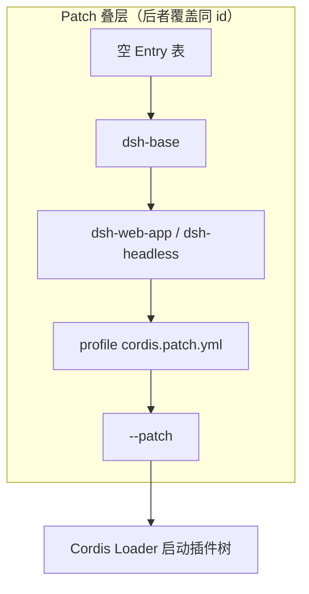

### 3.5 类图：Profile / Bundle / Patch（引用关系，非继承）

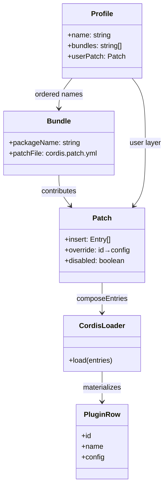

### 3.6 真实 YAML：`agent` / `tools` / `agent-loop` 行

**base 层（`packages/bundle/base/cordis.patch.yml`）核心 spine 摘录：**

```yaml
- id: agent
  name: '@deepseek-ai/dsh-agent'

- id: tools
  name: '@deepseek-ai/dsh-tools'

- id: agent-loop
  name: '@deepseek-ai/dsh-agent-loop'
  config:
    agents: []
```

说明：
- `agent` 注册 `ctx.agents`（AgentRegistry），提供 `setFactory` 槽，**不含**循环实现。
- `tools` 注册工具注册表与 ToolRuntime 消费者；presentation mode 等由上层 restate。
- `agent-loop` 默认 `agents: []`：Web 在客户端请求时 create；headless 由 runner 创建；base 不在启动时强绑 Agent。

**web-app 层对 `tools` 的整行覆盖（节选）：**

```yaml
- id: tools
  config:
    mode: !!js process.env.DSH_TOOLS_MODE
```

**headless 层同样 restate `tools` + 插入 runner：**

```yaml
- id: tools
  config:
    mode: !!js process.env.DSH_TOOLS_MODE

- insert:
    - id: headless-runner
      name: '@deepseek-ai/dsh-headless'
      inject: [headlessStartup]
      config:
        task: !!js ctx.headlessStartup.task
```


### 3.7 Patch 反模式与排障

本节把 §3.1–§3.6 的叠层规则落到 **排障心智模型**：看见症状时先判断是「整行替换误解」还是「叠层顺序/归属错误」，再用 `dsh --dump-config` 与 `composeEntries` 对齐真源。

#### 3.7.1 整行 config 替换 vs K8s strategic merge

DSH patch 对同 `id` 的覆盖是 **整行 `config` 替换**，不是字段级 deep merge。这与 Kubernetes 的 strategic merge patch（按字段合并）不同，更接近「替换整个 ConfigMap 的某个 data 键」：

| 机制 | 同 id 覆盖行为 | 漏写字段的后果 |
| --- | --- | --- |
| DSH `cordis.patch.yml` | 下层 `config` **整对象被替换** | 上层只写 `{ mode: x }` 会抹掉下层的 `tools`、`presentation` 等全部 key |
| K8s strategic merge | 按 schema 合并 map 字段 | 未提及字段通常保留 |
| JSON Merge Patch (RFC 7396) | `null` 删除、对象递归 merge | 语义仍不同于 DSH 的「行级替换」 |

**mode 相关行不得留在 `dsh-base`：** `packages/bundle/base/cordis.patch.yml` 头部注释已写明——若某插件行的 `config` 因 `web` / `headless` 部署模式而不同，该行 **不应出现在 base**，而应在 `dsh-web-app` / `dsh-headless` 各 **完整 restate** 全部 key。base 只保留跨模式共享的插件身份与中性默认值。

#### 3.7.2 反模式清单

| # | 反模式 | 表象 | 根因 | 修复 |
| --- | --- | --- | --- | --- |
| 1 | 同 `id` 不同 `name` | 插件静默换成另一个 npm 包 | Loader 按 `id` 寻址，后者整行覆盖 | 换 id 或确认故意替换包名 |
| 2 | `disabled: true` 当 delete | 行仍在表中占槽，依赖图诡异 | disable 保留行身份，仅跳过 mount | 要彻底移除用 targeted 删除或不再 insert |
| 3 | 依赖 YAML 行顺序决定加载顺序 | 调整 insert 顺序无效 | **行顺序不决定加载语义**；激活由服务可用性驱动 | 查 inject 拓扑与 Cordis fiber 图，而非 patch 文件行序 |
| 4 | web 层只写 `thinking` 增量 | base 里其它 llm 字段消失 | 违反整行替换 | 在 mode bundle **重述完整 config** |
| 5 | profile patch 与 CLI `--patch` 混用同一 id 做实验 | 本地可 boot，CI 不可 | 最后一层胜出，环境叠层不同 | 用 `--dump-config` 对比两层输出 |
| 6 | 在 patch 里写业务 TypeScript | Loader 解析失败或 `!!js` 越界 | patch 仅是 Entry 表操作 | 逻辑进插件包，patch 只调 config |

#### 3.7.3 `--dump-config` 心智模型

`dsh --dump-config`（及 `--dump-default-config`）打印 **与真实 boot 相同的 Entry 表**，因为二者都走 `app-boot` 的 `loadProfile` → `composeEntries`：

```text
resolveDshHome()
  → loadProfile(name, installAnchor)     # 读各 bundle patch + profile cordis.patch.yml
  → layers = [bundle[0].patches, …, profile.patches, CLI overlay?]
  → composeEntries(layers)               # applyEntryPatches([], flatLayers)
  → JSON/YAML 输出（= Cordis Loader 将 mount 的表）
```

**排障口诀：** 「dump 看见什么，进程就 mount 什么。」若运行时行为与预期不符，先 diff dump 与 hand-written `cordis.yml`，再查最后一层 overlay（`$DSH_HOME` patch、`--patch`）。

`composeEntries` 实现（`packages/boot/app-boot/src/profile.ts`）刻意 **从空 `[]` 根开始**、调用 include 自带的 `applyEntryPatches`，使 flag 推导、config dump、实际启动 **不可能分叉**：

```typescript
export function composeEntries(
  layers: readonly PatchOptions[][],
  warn: (message: string) => void = () => {},
): EntryOptions[] {
  return applyEntryPatches([], structuredClone(layers.flat()), (message, ...args) => {
    let index = 0
    warn(message.replace(/%C/g, () => JSON.stringify(args[index++])))
  })
}
```

#### 3.7.4 `healProfilesModuleFallback` 为何存在

Profile 目录在 `$DSH_HOME/profiles/<name>`，用户可通过 `dsh plugin` 安装 **树外插件**。Node 解析裸插件名时沿 `node_modules` 向上查找；pnpm 隔离布局下 profile 目录 **没有** 扁平 `node_modules`，裸名会解析失败。

`healProfilesModuleFallback(installAnchor, home)` 维护 **扁平** `$DSH_HOME/profiles/node_modules`：对安装 app + 各 bundle 闭包中的每个包名建 **符号链接** 指向真实目录。效果：

- 任意 profile 中的 `cordis.patch.yml` 写 `name: '@deepseek-ai/dsh-foo'` 时，Loader 的 `import()` 与 Node 常规解析一致；
- 不依赖 pnpm 把 harness 内置包「链接」进 profile 树；
- 幂等：正确链接保留，安装路径迁移时重指向；悬空链在包名复用前不可见。

这与「Bundle 必须从 dsh 安装目录解析」（`resolveBundleDir` 安装锚点优先）是 **互补** 契约：bundle **层列表** 来自安装；profile **额外依赖** 来自扁平 fallback。

#### 3.7.5 真实 YAML overlay 示例

**场景 A — headless 禁用 HMR（仅 mode 层 restate）：**

```yaml
# packages/bundle/headless/cordis.patch.yml 片段
- id: dev-hmr
  disabled: true
```

base 若含有 `dev-hmr` 行，headless bundle ** targeted 覆盖** `disabled`，而非在 base 写 `!!js` 条件——mode 差异行归 mode bundle。

**场景 B — 用户 profile 重述 system-prompt persona（整行 config）：**

```yaml
# $DSH_HOME/profiles/my-web/cordis.patch.yml
- id: system-prompt
  config:
    persona: |
      You are a concise coding assistant for this team.
      Always cite file paths you edit.
    variables: {}
```

若 web-app bundle 已有 `system-prompt` 行含 `persona` + `variables` + `sections`，profile 层必须 **写全** `config`，不能只追加 `persona` 键。

**场景 C — CLI 一次性实验（最后一层胜出）：**

```bash
dsh --profile web --patch '[{"id":"llm-deepseek","config":{"provider":"deepseek","model":"deepseek-chat"}}]'
```

该 overlay 在 `composeEntries` 栈顶；与 profile patch 同 id 时 **CLI 赢**。

#### 3.7.6 实体决策：新 Bundle vs profile patch vs `--patch`

| 变更性质 | 首选载体 | 理由 |
| --- | --- | --- |
| 可发布、多 profile 复用的 mode 能力（web/headless 差异） | **新 Bundle 或扩展现有 mode bundle** | npm 版本化；`dsh.profile.bundles` 显式选用 |
| 单用户/单团队长期偏好（默认模型、persona） | **profile `cordis.patch.yml`** | 落在 `$DSH_HOME`；不进 git |
| 本地一次性调试、CI 注入 | **`--patch` overlay** | 不写盘；最高优先级 |
| 改 Turn 算法、Session 公理 | **都不选** — 改 `agent-loop` 插件或文档化扩展点 | Profile 层禁止写循环逻辑 |

#### 3.7.7 Home patch vs CLI `--patch` 边界表

| 维度 | `$DSH_HOME` profile patch | CLI `--patch` |
| --- | --- | --- |
| **拥有** | 持久 `cordis.patch.yml`；随 profile 名解析 | 单次进程 argv overlay |
| **不拥有** | 安装内置 bundle 源码；Bundle 默认栈 | 跨会话持久化 |
| **依赖** | `loadProfile` user layer；`PROFILE_PATCH_FILENAME` | `composeEntries` 最后一层 |
| **禁止** | 绕过 Bundle 声明装未在 manifest 列出的包 | 替代 profile 初始化（profile 仍须存在） |
| **叠层顺序** | bundle 栈 → profile patch →（可选 home 全局 patch）→ **CLI** | 栈顶 |
| **典型用途** | 团队 persona、默认 provider | 脚本 A/B、紧急 disable 插件 |


### 3.8 PROFILE_TEMPLATES 与 Boot 序列

**`PROFILE_TEMPLATES`（`packages/boot/app-boot/src/profile.ts`）：**

```typescript
export const PROFILE_TEMPLATES: Record<string, readonly string[]> = {
  web: ['@deepseek-ai/dsh-base', '@deepseek-ai/dsh-web-app'],
  headless: ['@deepseek-ai/dsh-base', '@deepseek-ai/dsh-headless'],
}
```

| 模板 | Bundle 栈 | 典型入口 |
|------|-----------|----------|
| `web` | base → web-app | `dsh --profile web` → HTTP + 浏览器 |
| `headless` | base → headless | `dsh --profile headless "task"` |
| 自定义 | `DEFAULT_PROFILE_BUNDLES` = `[dsh-base]` | `dsh plugin` 初始化 |

**Boot 序列（简化）：**

```text
1. resolveDshHome() → $DSH_HOME
2. loadProfile(name) → 读 manifest.bundles
3. 对每个 bundle：resolveBundleDir → 读 cordis.patch.yml
4. composeEntries([]) → 逐层 applyEntryPatches
5. healProfilesModuleFallback → node_modules 符号链接
6. Cordis Loader 按 Entry 表 mount 插件 fiber
7. agent-loop 插件 effect → agents.setFactory(AgentLoop)
8. 各插件 inject 完成 → ctx.* 服务可用
```

### §3 小结

- Profile = 选哪些 Bundle + 用户 patch；Bundle = 一层插件行贡献；Patch = 整行替换语义的 YAML 操作。
- 换产品面换 Profile/Bundle，**不是**复制 ReactLoopAgent。
- `agent` / `tools` / `agent-loop` 三行是 spine：注册表、工具、默认 Driver 工厂。


## §4 核心实体：注册层 · 驱动层 · 真源层 · 能力层

本章把 **进程内主干** 从「六个名字」扩成 **可落地的实体地图**：每个核心对象的一句话职责、封装边界、依赖谁、禁止谁碰、在创建/运行/销毁里扮演什么角色。对照 MAF：`AgentRegistry` ≈ 会话注册表 + Factory 槽；`ReactLoopAgent` ≈ 内环 ReAct 驱动；`Session` ≈ 事件溯源存储。

**与 §3 的分工**：§3 讲 **启动前** Profile/Bundle/Patch → Cordis Entry 表；本章讲 **启动后** `ctx` 上各 Service 与每 Session 实例如何协作。读图时把「Loader 装上的插件」与「Registry 创建的 Agent」连成一条链（§4.0.3）。

### 4.0 本章要回答的问题

读完 §4，你应能回答：

1. **除了 ReactLoopAgent / Session / Inbox，还有哪些「一等实体」**（Registry、Store、Scope、Dispatch、Surface、ToolRuntime…）？各自管什么？
2. **引用类图里「箭头」表示什么**——持有、调用、事件订阅、投影，不要混成继承。
3. **改功能该动谁**：换循环哲学 vs 改审批 vs 改历史投影 vs 改工具执行，边界在哪？
4. **create → setup → publish → kick** 链上，每个实体何时出现、何时消失？

### 4.0.1 核心实体全景目录（不只六个）

| 实体 | 包 / `ctx` | 一句话职责 | 生命周期 |
|------|------------|------------|----------|
| **`AgentRegistry`** | `ctx.agents` | 活 Agent 表 + **唯一** `AgentFactory` 槽 + initiator ALS | 进程级 Service；unload loop 插件清空 Factory |
| **`AgentFactory`** | 接口 | `create` / `resume` 事务契约 | 由 `AgentLoop`（或替代插件）实现 |
| **`AgentLoop` 插件** | `ctx.agentLoop` + effect | 注册 Factory；`prepare/publish/dispose` 工厂 | Cordis fiber；unload 时 dispose 全部 live agent |
| **`Agent` API** | 接口 | 对外句柄：`followup` / `steer` / `inject` / `cancel` / `whenIdle` | 每个 Session 一个驱动器实例 |
| **`ReactLoopAgent`** | 默认 `Agent` 实现 | `phase` + `kick/turn/step` + 与 Inbox/Session 协作 | create 到 dispose；idle/running/maintenance |
| **`AgentHandle`** | `{ agent, dispose }` | **消费方**持柄：可 teardown | 与 agent 同寿；dispose 顺序固定 |
| **`SessionStore`** | `ctx.sessions` | Session 对象注册表；`prepare/resume/enter/announce` | 进程级；Session 实例由 Store 管理 |
| **`Session`** | 每对话一个 | **只追加** `SessionEvent`；surface 折叠；`deriveMessages` | 与 Agent 1:1 绑定（默认） |
| **`SessionPreparation`** | 工厂内部 | create 前持有「未 announce」的 Session | `using` / publish 或 rollback |
| **`SurfaceManager`** | Session 内部 | 哪些事件进「对话表面」；`replace` 压缩 | 随 Session；`replaceGeneration` 驱动缓存失效 |
| **`Inbox`** | Driver 持有 | `next-turn` / `next-step` 投影；`splice` / `claim` | 随 ReactLoopAgent；从 Session 重放 spliced |
| **`Scope`** | `agent.scope` | Agent 专属 Cordis 子树；`ctx.agent` 代理 | dispose 末尾 `scope.dispose()` |
| **`AgentEventDispatch`** | `agent.dispatch` | 发 `agent/*` 协调事件（非 Session 事实） | 随 Driver |
| **`RuntimeContextProjection`** | Driver 内部 | 把动态上下文段落投影进 pre-step | 随 Driver；读 Session + scoped ctx |
| **`systemPrompt`** | `ctx.systemPrompt` | `assemble`：拼 system 段 + 工具 schema | 进程级 Service |
| **`LLM`** | `ctx.llm` | 适配器注册表；`stream` / 请求词汇 | 进程级；Driver 经 waterfall 调 |
| **`ToolRuntime`** | `ctx.tools` | 注册工具 + `execute` 流水线（waterfall） | 进程级；Driver `executeToolCalls` |
| **`Cordis Context`** | `loopCtx` / `agent.ctx` | 服务挂架 + `dispatch.waterfall/serial` | 进程 / agent 两层 |
| **`Cordis Fiber`** | 每插件子树 | 插件生命周期；`ctx.effect` 清理；`FactoryOwnership` 绑 fiber | unload 时 dispose 子树 |
| **`Waterfall`** | `ctx.dispatch` 机制 | 必须 `next()` 的中间件事件链（Filter 语义） | 非独立 Service；挂在各域事件上 |
| **`sessionPersistence`** | `ctx.sessionPersistence` | load/resume 读盘；**订** `session/event` 写盘 | 非 Session 拥有者 |
| **`subagents` / `jobs`** | `ctx.subagents` · `ctx.jobs` | 子 agent 提供方；后台任务；进程内用 `create` + `Handle` | 非 Driver 内环 |
| **Persistence 等观察者** | Query、Title、Telemetry… | **订阅** `session/event` 或读 derive | 非 Session 拥有者 |

**Familiar 对照**：Registry+Factory ≈ Spring 里「BeanFactory + 唯一 ApplicationContext 定制入口」；Session ≈ Event Store；Inbox ≈ 带 WAL 的双队列；Scope ≈ 请求级子 Context（但绑在 Agent 寿命上）。

### 4.0.2 四层分工（顶层设计）

```text
┌─ 注册与创建层 ─────────────────────────────────────────────┐
│ AgentRegistry · AgentFactory · AgentLoop · SessionStore      │
│ SessionPreparation · AgentHandle · FactoryOwnership          │
│ 职责：谁能 create/resume、Factory 槽、enter/announce 顺序   │
└───────────────────────────┬────────────────────────────────┘
                            │ publish 后
┌─ 驱动层（内环）───────────▼────────────────────────────────┐
│ ReactLoopAgent · Phase · Inbox · AgentEventDispatch        │
│ Scope · RuntimeContextProjection                             │
│ 职责：kick/turn/step、入队/认领、waterfall 检查点、phase     │
└───────────────────────────┬────────────────────────────────┘
                            │ append / derive / execute
┌─ 真源层 ──────────────────▼────────────────────────────────┐
│ Session · SurfaceManager · SessionEvent 日志                 │
│ 职责：只追加事实；表面折叠；deriveMessages 读模型            │
└───────────────────────────┬────────────────────────────────┘
                            │ 读服务 / 写结果事件
┌─ 能力层（Seam 消费者）────▼────────────────────────────────┐
│ ctx.llm · ctx.tools · ctx.systemPrompt ·（fs/shell 等）    │
│ 职责：模型流、工具执行流水线、提示词组装；不决定 Turn 边界   │
└────────────────────────────────────────────────────────────┘
         Persistence / UI / Telemetry ← 订阅 session/event 或 agent/*
```

**设计铁律**：能力层 **不** 维护第二份 transcript；驱动层 **不** 写 jsonl 路径；注册层 **不** 实现 `while (turn)` 内的工具逻辑。

### 4.0.3 Boot 组装 → Runtime 实体（与 §3 衔接）

```text
Profile / Bundle / Patch（§3）
  → composeEntries → Cordis Loader mount 各插件 Fiber
  → ctx.agents / ctx.sessions / ctx.llm / ctx.tools / ctx.agentLoop …
  → AgentLoop.effect: agents.setFactory(agentLoop)
  → 此后 UI 可 agents.create → ReactLoopAgent + Session
```

| 阶段 | 主导实体 | 产出 |
|------|----------|------|
| 解析菜单 | Profile、Bundle patch | 扁平 Entry 插件行表 |
| 挂载服务 | Cordis Loader、各插件 Fiber | 进程级 `ctx.*` Service |
| 注册工厂 | `AgentLoop` → `AgentRegistry.setFactory` | 唯一 `AgentFactory` 槽 |
| 创建对话 | Registry + Factory + SessionStore | `AgentHandle` + 已 announce Session |
| 运行一轮 | ReactLoopAgent + Inbox + Session | `session/*` 事实 + `agent/*` 协调 |

**Waterfall 横切**：不是「第七个核心类」，而是 **各域事件上的 Filter 链**——`agent/pre-step`、`agent/request`、`tools/pre-execute` 等。插件在缝上挂监听器改 payload 或短路；**Turn 边界与 claim 顺序**仍在 Driver 固定算法里（见 §4.2.5）。对照 [GLOSSARY · Waterfall](./GLOSSARY.md)。

更细的实体封装表与决策树见 [00b-顶层设计与实体边界.md](./00b-顶层设计与实体边界.md)。

### 4.1 实体边界表（功能 · 拥有 · 禁止）

#### AgentRegistry (`ctx.agents`)

| | |
|--|--|
| **功能** | 全局 Agent 查找；`setFactory` 唯一槽；`withInitiator` 归因；`create/resume` 委托 Factory |
| **拥有** | `Map<SessionId, Agent>` 活跃表；FactorySlot；AsyncLocalStorage initiator |
| **不拥有** | Session 日志内容；Turn 算法；LLM 连接 |
| **依赖** | Cordis `ctx`；已注册 `AgentFactory` |
| **禁止** | 在 Registry 内写 kick/claim；绕过 Factory 直接 `new ReactLoopAgent` 给 UI |
| **典型调用方** | Web/API：`agents.create`；`AgentLoop`：`setFactory` |

#### Agent API（`Agent` 接口 / 句柄）

| | |
|--|--|
| **功能** | 产品面唯一「对话驱动」契约：入队（followup/steer/inject）、取消、维护任务、状态灯 |
| **拥有** | 无独立存储；语义委托给具体 Driver |
| **不拥有** | 必须是 `ReactLoopAgent`；工具实现 |
| **依赖** | Registry 创建；Driver 实现 Inbox 语义 |
| **禁止** | UI 直接 `session.append('user/message')` 跳过 Inbox/claim |
| **对照** | Penguin 的 `Session.run` 边界；Pi 的 `AgentSession.prompt` |

#### AgentLoop 插件

| | |
|--|--|
| **功能** | Cordis 插件：effect 里 `setFactory`；`prepare→setup→publish`；config `agents: []` 启动 |
| **拥有** | `FactoryOwnership`（liveAgents、startupTasks、teardown signal） |
| **不拥有** | Turn 内 waterfall 监听器（那是各策略插件）；Session 磁盘格式 |
| **依赖** | `agents, sessions, llm, tools, systemPrompt` inject |
| **禁止** | setup 未完成就 `announce`；与第二个 Factory 并存 |
| **换循环** | 替换 **整包** `@deepseek-ai/dsh-agent-loop`（或另一实现 `AgentFactory` 的插件） |

#### ReactLoopAgent（默认 Driver）

| | |
|--|--|
| **功能** | 内环状态机：`wakeDriver→kick→turn→step`；`claim` 后 `pre-step`→LLM→tools |
| **拥有** | `phase`；`inbox`；`dispatch`；`scope`/`ctx`；`runtimeContext`；`activityDone` |
| **不拥有** | 持久化路径；HTTP；厂商 SDK 直连 |
| **依赖** | `Session`、`Inbox`、scoped `ctx`、`loopCtx` 上的 llm/tools/systemPrompt |
| **禁止** | 内存 `messages[]` 真源；在 Driver 里写业务审批 if（挂 waterfall） |
| **内部子对象** | 见 §4.2.3 |

#### SessionStore (`ctx.sessions`)

| | |
|--|--|
| **功能** | Session 实例注册；`prepare/resume`；`enter/announce`；`get(id)` |
| **拥有** | 活跃 Session 引用；enter 栈（作用域查找） |
| **不拥有** | Turn 循环；Inbox 桶 |
| **依赖** | `Session` 类；persistence load（resume 路径） |
| **禁止** | 代替 Driver 写 `user/message`（应 Driver append） |

#### Session（每对话真源）

| | |
|--|--|
| **功能** | append-only 事件日志；surface 折叠；`deriveMessages()` 投影给 LLM |
| **拥有** | `log[]`；`SurfaceManager`；derive 缓存（generation 失效） |
| **不拥有** | 写磁盘（persistence 订阅）；Inbox 内存桶（Inbox 投影 spliced） |
| **依赖** | 事件类型表 `SessionEventMap`；surface 规则 |
| **禁止** | 可变 messages 数组作为唯一真相 |
| **关键 API** | `append` · `deriveMessages` · `events` · `surface` |

#### Inbox

| | |
|--|--|
| **功能** | 两桶排队；`splice` 入队 + 持久；`claim` 出队 + 持久删除 |
| **拥有** | `next-turn` / `next-step` 内存投影 |
| **不拥有** | `user/message` 表面节点（claim 后由 Driver append） |
| **依赖** | `Session.append('agent/inbox/spliced')` **先于** 内存变更 |
| **禁止** | 插件直接 `claim`（internal）；无 spliced 的纯内存队列 |
| **对照** | DSH 独有；Penguin 用 steer 缓冲无此事件类型 |

#### Scope + `agent.ctx`

| | |
|--|--|
| **功能** | Agent 专属 Cordis 子上下文；插件 `inject` 到 agent 世界时可见 `ctx.agent` |
| **拥有** | scoped 服务注册边界 |
| **不拥有** | 进程级 `loopCtx` 全局表 |
| **生命周期** | `createScope(loopCtx, agent)` → dispose 末尾销毁 |

#### AgentEventDispatch

| | |
|--|--|
| **功能** | 发 **协调域** `agent/*`（status、inbox/claimed、pre-step 旁路等） |
| **不替代** | `Session.append` 的 **事实域** `session/*` |
| **拥有** | 与 initiator 绑定的 emit 路径 |

#### systemPrompt / LLM / ToolRuntime（能力三件套）

| 实体 | 功能 | Driver 如何用 |
|------|------|----------------|
| **systemPrompt** | 注册提示词段；`assemble(ctx)` 得 `PromptAssembly` | 每步 `preStep` 前 assemble；可 waterfall `system-prompt/assemble` |
| **LLM** | Provider 适配；流式 `stream` | `step` 内经 `agent/request` waterfall 后 stream |
| **ToolRuntime** | 工具注册 + `execute` 流水线 | `executeToolCalls`；`tools/pre|execute|post` waterfall |

Persistence、Query、Title 等：**订** `session/event` 或读 `deriveMessages`，**不** 进入 Driver 继承链（见 §4.2.5）。

#### Waterfall（跨层机制，非 Driver 子对象）

| | |
|--|--|
| **功能** | 在固定检查点串行/瀑布执行监听器；`next()` 继续链；不调 `next()` = 短路 |
| **拥有** | 无状态存储；Cordis `dispatch.waterfall` / `serial` 调度 |
| **不拥有** | Session 事实；Turn 何时结束（`agent/turn-stopping` 可否决但边界仍由 Driver 发起） |
| **典型缝** | `system-prompt/assemble`、`agent/pre-step`、`agent/request`、`tools/*`、`capability/*` |
| **禁止** | 在 waterfall 里 `new ReactLoopAgent` 或改 `phase`；用 waterfall 替代 `append` 记聊天气泡 |

#### sessionPersistence（接口 + 插件）

| | |
|--|--|
| **功能** | `load(sessionId)` 供 resume；订阅 `session/event` 异步落盘 |
| **拥有** | 存储格式与路径策略（jsonl 等） |
| **不拥有** | `Session.log` 内存真源；Inbox 桶 |
| **依赖** | Session 只追加公理；Factory `resume` 路径 |
| **禁止** | Driver 直接写文件路径；无 persistence 时 `resume` 应明确拒绝 |

### 4.2 引用类图（全量核心实体）

> **读图约定**：`-->` = 持有引用或调用；`..>` = 投影/派生；`--|>` = 继承/实现。  
> **不要**把 `ctx.llm` 画成 ReactLoopAgent 的子类——它们是 Cordis **服务**。

#### 4.2.1 分层总览（从 UI 到磁盘）

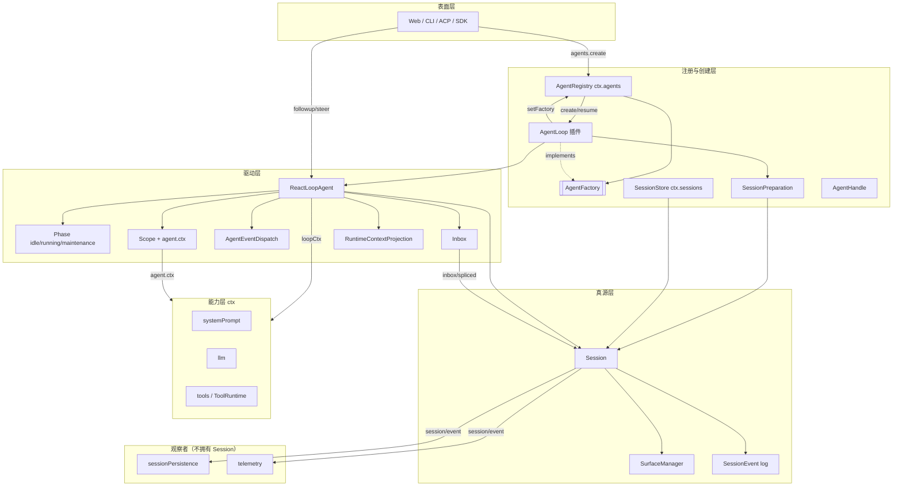

#### 4.2.2 创建链：谁造谁、何时 announce

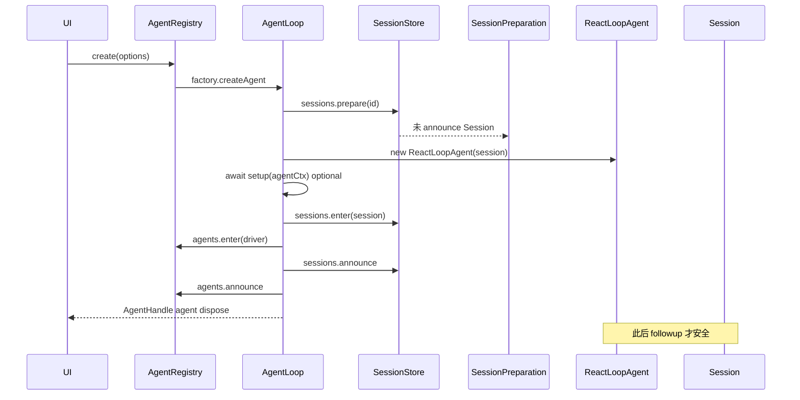

**边界要点**：`Session` 对象在 `prepare` 时已存在，但 **UI/观察者** 应在 `announce` 后才把它当「已发布会话」；`user/message` 只在 claim 后的 step 里写入。

#### 4.2.3 ReactLoopAgent 内部组成（原 §4.2 扩展）

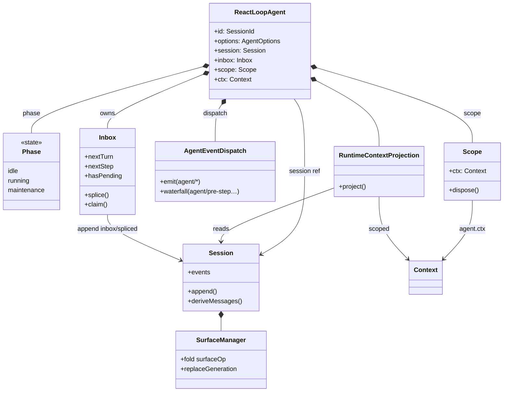

**ReactLoopAgent 字段职责表**：

| 字段 | 类型 | 作用 | 谁不该直接碰 |
|------|------|------|----------------|
| `session` | `Session` | 唯一事实写入目标（除 inbox/spliced 也由 Inbox 写） | UI 绕过 Driver append |
| `inbox` | `Inbox` | 排队；与 followup/steer/inject 联动 | 插件 claim |
| `phase` | `Phase` | idle/running/maintenance；wake/kick 门禁 | 外部强改 phase |
| `dispatch` | `AgentEventDispatch` | agent 协调事件 | 替代 Session 记事实 |
| `scope` / `ctx` | `Scope`, `Context` | agent 世界；assemble、插件 inject | 缓存裸 Driver 类做分支 |
| `runtimeContext` | `RuntimeContextProjection` | 动态上下文进 pre-step | 第二份 messages |
| `loopCtx`（私有） | `Context` | 进程级 agents/sessions/llm | 插件应用业务 if |

#### 4.2.4 Session · Surface · derive 数据流

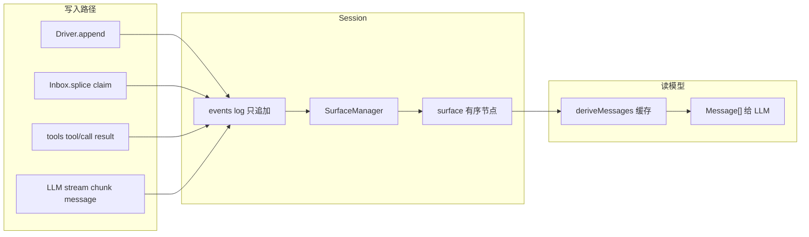

| 概念 | 含义 | 常见误会 |
|------|------|----------|
| **log / events** | 全量追加事件（含 turn/start、inbox/spliced、chunk） | ≠ 全是「聊天气泡」 |
| **surface** | 带 `surfaceOp` 的事件折叠成的对话历史节点 | chunk 常不进 surface |
| **deriveMessages** | 从 surface **投影** LLM 消息；带 generation 缓存 | ≠ 另一份可写真源 |
| **inbox/spliced** | 排队事实；**不进** derive 的对话表面 | ≠ user/message |

#### 4.2.5 Cordis 能力服务与事件域（挂在哪）

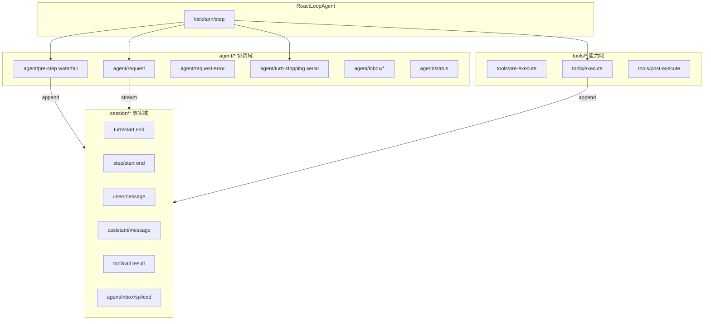

| 域 | 典型事件 | 可回放？ | 扩展方式 |
|----|----------|----------|----------|
| **session/** | user/message, tool/result, turn/* | ✅ 真源 | 新事件类型 + derive 规则 |
| **agent/** | pre-step, status, inbox/claimed | 部分协调 | waterfall / emit |
| **tools/** | pre/execute/post | 工具策略 | waterfall |
| **capability/** | fs/*, llm/* | 策略 | waterfall |

#### 4.2.6 进程级全景：从 Profile 到一次 followup

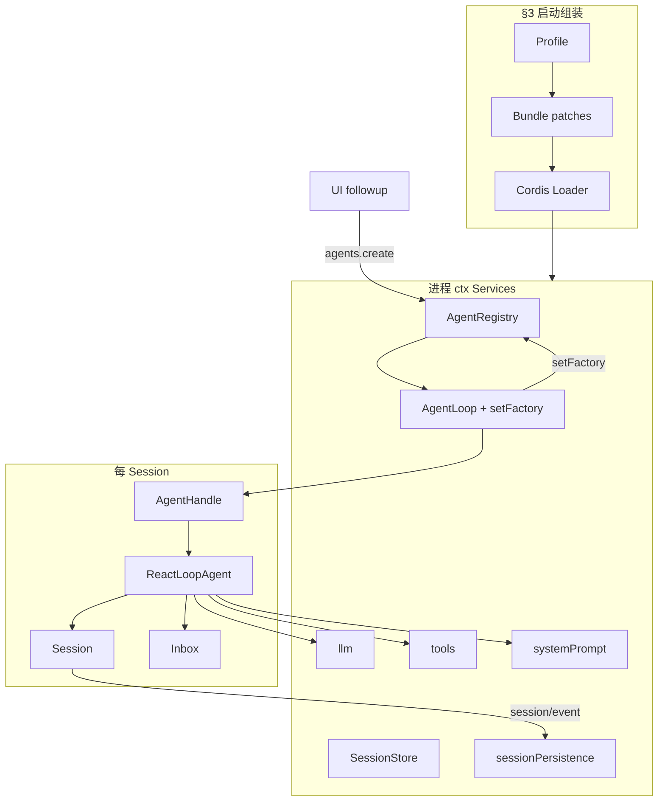

**读图要点**：左侧是 **一次进程** 只发生一次的组装；右侧是 **每对话** 的 Driver+Session 对；`followup` 只触右侧 Driver，不重新跑 Profile。

### 4.3 继承类图：Service · 接口 · 默认实现

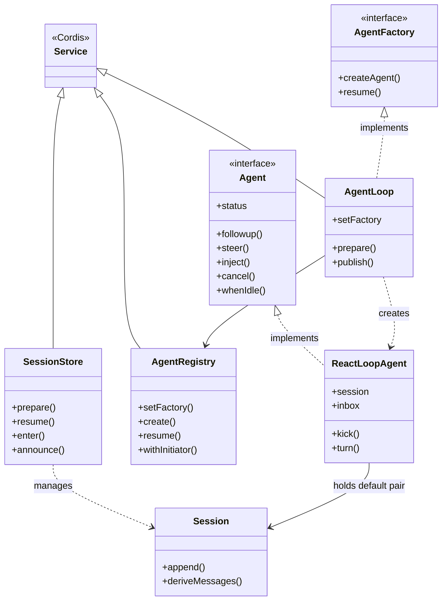

**继承 vs 引用（防混）**：

| 关系 | 例子 | 几个对象 |
|------|------|----------|
| **implements** | `ReactLoopAgent` → `Agent` | 1 个驱动器实例 |
| **extends Service** | `AgentRegistry` | 1 个进程级服务 |
| **holds ref** | `ReactLoopAgent.session` | Driver + Session 两个对象 |
| **projects** | `Inbox` 读 `agent/inbox/spliced` | 1 个 Session，2 种视图 |

### 4.4 读源码指南（本节怎么读）

下面摘录不是「抄代码凑字数」，而是 **把 §4.0–§4.3 的实体边界落到真实文件**。每段固定五块：

| 块 | 你要带走什么 |
|----|----------------|
| **解决什么问题** | 这段代码在整条链路里管哪一步 |
| **谁调用 / 何时触发** | 从 UI 或插件视角的入口 |
| **带注释摘录** | 关键行旁有中文注释；`…` 仅省略与边界无关的细节 |
| **逐步说明** | 按执行顺序拆行 |
| **读完应理解** | 自检：能否向别人讲清边界 |

**文件锚点**（建议 IDE 并排打开）：

| 主题 | 路径 |
|------|------|
| Registry / Factory 槽 | `packages/core/agent/src/index.ts` |
| Loop 插件 / prepare/publish | `packages/core/agent-loop/src/index.ts` |
| 内环 Driver | `packages/core/agent-loop/src/agent.ts` |
| Inbox | `packages/core/agent/src/inbox.ts` |
| Session 投影 | `packages/core/session/src/index.ts` |

---

### 4.5 源码走读：AgentRegistry — Factory 唯一槽与 create 委托

#### 解决什么问题

进程里可能装很多 Cordis 插件，但 **只能有一个「造 Agent 的工厂」**。`AgentRegistry`（`ctx.agents`）负责：

1. 保存这个唯一 Factory 槽（`setFactory`）；
2. 把 `create` / `resume` **转给** Factory，自己不 `new ReactLoopAgent`；
3. 若没有 Factory（没装 `dsh-agent-loop`），用固定错误文案拒绝，而不是静默失败。

#### 谁调用 / 何时触发

```text
AgentLoop 插件 constructor
  → ctx.effect(() => ctx.agents.setFactory(this))   // 进程启动后一次

Web / SDK / ACP
  → ctx.agents.create({ sessionId, … })
  → Registry.create() → factory.createAgent()       // 每次新对话
```

#### 带注释摘录

```typescript
// packages/core/agent/src/index.ts

/** 没装 agent-loop（或任何 AgentFactory 实现）时 create/resume 抛这句 */
const NO_FACTORY_MESSAGE =
  'no agent factory registered (load an agent-loop plugin)'

export class AgentRegistry extends Service {
  /** 当前已注册的工厂；全局只能有一个 */
  private factory: FactorySlot | undefined

  /**
   * AgentLoop 在构造时调用：把「自己」登记为唯一工厂。
   * effect 卸载（loop 插件 unload）时自动清空 factory 槽。
   */
  setFactory(factory: AgentFactory): () => void {
    const dispose = this.ctx.effect(() => {
      if (this.factory !== undefined)
        throw new Error('an agent factory is already registered')
      const target = factory /* … Cordis 去代理层 … */
      this.factory = { target }
      return () => { this.factory = undefined }  // unload 时清空
    }, 'agents.setFactory()')
    return dispose
  }

  /** create/resume 入口：没有工厂就直接失败 */
  private requireFactory(): FactorySlot {
    if (this.factory === undefined) throw new Error(NO_FACTORY_MESSAGE)
    return this.factory
  }

  /**
   * 对外 create：Registry 不造 Agent，只把调用转给 Factory。
   * ownerCtx = 调用方 fiber 的 ctx（谁 create 谁拥有生命周期）。
   */
  async create(options: CreateAgentOptions): Promise<AgentHandle> {
    const ownerCtx = this.ctx
    const { target } = this.requireFactory()
    const receiver = getTraceable(ownerCtx, target)
    return Reflect.apply(target.createAgent, receiver, [ownerCtx, options])
  }
}
```

#### 逐步说明

| 步骤 | 代码 | 含义 |
|------|------|------|
| 1 | `setFactory` | Loop 插件启动时占位；第二个 Factory 会抛错 |
| 2 | `requireFactory` | 任何 create 前先检查槽是否为空 |
| 3 | `Reflect.apply(createAgent, …)` | 真正逻辑在 `AgentLoop.createAgent`，Registry 是薄门面 |
| 4 | effect 的 `return () => …` | 插件 unload → 槽清空 → 此后 create 再报 `NO_FACTORY_MESSAGE` |

#### 读完应理解

- **`NO_FACTORY_MESSAGE` 不是配置项**，而是「没装 loop 插件」的运行时信号。
- Registry **不实现** kick/turn；它甚至 **不持有** `ReactLoopAgent` 的创建细节。
- `create` 返回的是 `AgentHandle`（见 §4.11），不是裸 `Agent`——teardown 权在 Handle。

---

### 4.6 源码走读：AgentLoop 插件 — inject、setFactory、prepare → publish

#### 解决什么问题

`AgentLoop` 是 Cordis **Service 插件**，做两件事：

1. 向 Registry **注册自己为 Factory**；
2. 实现 `createAgent` / `resume` 的 **事务**：`prepare`（造 Driver + Session，但未公开）→ 可选 `setup` → `publish`（enter + announce）→ 失败则 `dispose` 回滚。

#### 谁调用 / 何时触发

```text
Cordis 加载 dsh-agent-loop
  → new AgentLoop(ctx, config)
  → effect: setFactory(this)
  → config.agents[] 里配置的 id 自动 create/resume

ctx.agents.create(...)
  → AgentLoop.createAgent(ownerCtx, options)
  → prepare → await setup? → publish → 返回 AgentHandle
```

#### 带注释摘录 A：插件挂载与依赖

```typescript
// packages/core/agent-loop/src/index.ts

export class AgentLoop extends Service implements AgentFactory {
  /** Cordis 注入：Loop 需要这些进程级服务才能造 Driver */
  static inject = ['agents', 'sessions', 'llm', 'tools', 'systemPrompt']

  constructor(ctx: Context, config: Config) {
    super(ctx, 'agentLoop')
    // ① 进程级：向 Registry 登记「我是工厂」
    ctx.effect(() => ctx.agents.setFactory(this), 'agentLoop.setFactory()')
    // ② 可选：config.agents 里预配置的会话在启动时 create/resume
    // …
  }
}
```

| `inject` 项 | Driver 里用来干什么 |
|-------------|---------------------|
| `agents` | `setFactory`、`enter`、`withInitiator` |
| `sessions` | `prepare` / `resume` / `enter` / `announce` |
| `llm` | `step()` 里 `llm.stream` |
| `tools` | `executeToolCalls` |
| `systemPrompt` | `preStep` 前 `assemble` |

#### 带注释摘录 B：prepare 与 publish（创建事务核心）

```typescript
// packages/core/agent-loop/src/index.ts — prepare() 返回值结构（节选）

private prepare(..., session: Session): PreparedAgent {
  // … 注册 abort、dispose 链、new ReactLoopAgent(loopCtx, id, options, session) …

  return {
    agent,                    // 已构造的 ReactLoopAgent，但 UI 还「不应」看见
    signal: abort.signal,     // setup 期间可被取消
  publish: (source) => {
      // ③ 把 Session 挂进 SessionStore 作用域（ctx.session 可查）
      detachSession = agent.ctx.sessions.enter(session)
      // ④ 把 Agent 挂进 Registry 作用域（ctx.agent 可查）
      detachAgent = loopCtx.agents.enter(agent, ownerCtx.agent)
      // ⑤ 广播「会话已创建」— 持久化/UI 订 session/created
      agent.ctx.sessions.announce(session)
      // ⑥ 广播「Agent 已创建」— 订 agent/created
      loopCtx.agents.announce(agent)
      // ⑦ 协调事件：本轮 session 开始对 UI/遥测
      emitAgentEvent(loopCtx, agent, 'agent/session-start', { source })
      return { agent, dispose }   // AgentHandle 形态
    },
    dispose,                  // 失败或 unload 时整链回滚
  }
}
```

#### 带注释摘录 C：config 驱动的 create（同步路径）

```typescript
create(id: SessionId, options: AgentOptions = {}, meta = {}): Agent {
  // SessionPreparation：持有「未 announce」的 Session；失败时 using 自动回滚
  using preparation = SessionPreparation.create(
    this.runtime.ctx.sessions.prepare(id, { meta }),
  )
  const prepared = this.prepare(this.ctx, id, options, preparation.session)
  try {
    return prepared.publish('startup').agent   // 成功才 announce
  } catch (error: unknown) {
    void prepared.dispose()                      // 失败：不留下半配置世界
    throw error
  }
}
```

#### 逐步说明（publish 顺序不可乱）

| 顺序 | API | 观察者能看到什么 |
|------|-----|------------------|
| 1 | `sessions.prepare` | Session **对象存在**，但不算「已发布」 |
| 2 | `new ReactLoopAgent` | Driver + Inbox 从 Session 日志重放 |
| 3 | `sessions.enter` | 子 ctx 里 `ctx.session` 指向该 Session |
| 4 | `agents.enter` | 子 ctx 里 `ctx.agent` 指向该 Driver |
| 5 | `sessions.announce` | `session/created` 等 |
| 6 | `agents.announce` | `agent/created` 等 |
| 7 | `agent/session-start` | UI 可安全 followup |

**禁止**：在 5–6 之前让 UI `followup`——会看到半配置 agent（§4.10 表）。

#### 读完应理解

- **Loop 是插件** = 这个类 + `setFactory`；换循环 = 换实现 `AgentFactory` 的整包，不是改 Registry。
- `prepare` 与 `publish` 分离 = **创建事务**；`dispose` 保证 cancel → whenIdle → scope.dispose → detach。
- `AgentLoop.inject` 列表 = Driver 运行时的 **最小能力依赖**，不是随便列的包名。

---

### 4.7 源码走读：ReactLoopAgent — followup / wake / kick / turn

#### 解决什么问题

用户发一句话时，**不能**直接 `session.append('user/message')`（那会跳过 Inbox 排队语义）。`ReactLoopAgent` 作为默认 `Agent` 实现：

1. `followup` / `steer` / `inject` → 写入 **Inbox 桶** 并可选 **唤醒** 内环；
2. `wakeDriver` → 仅在 `idle` 时把 `phase` 设为 `running` 并启动 `kick`；
3. `kick` → `while (turn())` 直到队列空或 turn 结束；
4. `turn` → `claim` → `pre-step` → `step`（LLM + tools）→ `turn/end`。

#### 谁调用 / 何时触发

```text
UI: agent.followup(msg)
  → send(msg, 'next-turn', wakeup=true)
  → inbox.splice(...)          // 见 §4.8
  → wakeDriver()
  → withInitiator(this, kick)
  → turn() → preStep() → claim() → step() → deriveMessages() → llm.stream
```

#### Phase 三种形态（读 kick 前先认状态）

```typescript
type Phase =
  | { kind: 'idle'; lastTurn: number }           // 无 driver；可 wake
  | { kind: 'maintenance'; …; wakeRequested }    // runMaintenance 占用
  | { kind: 'running'; abort; turn; step; wakeRequested }  // kick 进行中
```

| `phase.kind` | `status`（对外） | followup 时 wake 行为 |
|--------------|------------------|------------------------|
| `idle` | idle | 启动新 `kick` |
| `running` | running | 通常直接 return（driver 自己会 claim） |
| `maintenance` | idle | 只闩 `wakeRequested`，维护结束后再 wake |

#### 带注释摘录 A：三种入队 API

```typescript
// packages/core/agent-loop/src/agent.ts

followup(input: UserMessage): void {
  this.send(input, 'next-turn', true)   // 下一 Turn 边界；并尝试唤醒
}
steer(input: UserMessage): void {
  this.send(input, 'next-step', true)    // 当前 Turn 的下一步；并唤醒
}
inject(input: UserMessage): void {
  this.send(input, 'next-step', false)   // 进 next-step 桶，但不 wake（排队等）
}

private send(message, target, wakeup: boolean): void {
  // 若正在 abort 后的 running，唤醒输入升级为 next-turn
  const wakingAfterAbort = wakeup && this.phase.kind !== 'idle' && this.phase.abort.signal.aborted
  const resolvedTarget = wakingAfterAbort ? 'next-turn' : target
  this.inbox.splice(resolvedTarget, Infinity, 0, [message])  // 先持久 splice，见 §4.8
  if (wakeup) this.wakeDriver(wakingAfterAbort)
}
```

| API | Inbox 桶 | wake？ | 典型场景 |
|-----|----------|--------|----------|
| `followup` | `next-turn` | 是 | 用户新消息 |
| `steer` | `next-step` | 是 | 打断当前 turn，下一步注入 |
| `inject` | `next-step` | 否 | 后台预填，不抢当前 step |

#### 带注释摘录 B：wakeDriver 与 kick

```typescript
private wakeDriver(wakeAfterAbort = false): void {
  if (this.phase.kind !== 'idle') {
    // 已在跑：maintenance 或 abort 后闩 wakeRequested，等收敛再跑
    if (reason?.kind !== 'disposed' && (maintenance || wakeAfterAbort))
      this.phase.wakeRequested = true
    return
  }
  const driver = Promise.withResolvers<void>()
  this.activityDone = driver.promise
  this.setPhase({ kind: 'running', abort: new AbortController(), turn: lastTurn, step: 0, … })
  // 整段 kick 在 initiator 边界内 — 插件 requireInitiator() 得到「正在跑的 agent」
  this.loopCtx.agents.withInitiator(this, () => this.kick())
    .then(driver.resolve, driver.reject)
}

private async kick(): Promise<void> {
  try {
    while (await this.turn()) {}   // turn() 返回 true = 还有 pending，开下一 turn
  } catch { /* 错误在 driver 边界 containment */ }
  finally {
    if (this.phase.kind === 'running') {
      this.setPhase({ kind: 'idle', lastTurn: turn })
      // idle 后若曾闩 wake 且队列非空，再 wake 一轮
      if (wakeRequested && this.inbox.hasPending) this.wakeDriver()
    }
  }
}
```

#### 带注释摘录 C：turn 骨架（与 §5 对照）

```typescript
private async turn(): Promise<boolean> {
  const turn = phase.turn + 1
  this.session.append('turn/start', { turn })     // ① Turn 边界写入 Session
  while (true) {
    const decision = await this.preStep(target, { turn, step })  // ② claim + assemble + pre-step waterfall
    if (decision.kind === 'reject') { … return false }
    this.session.append('step/start', { turn, step })
    for (const message of decision.messages)
      this.session.append('user/message', message, { surfaceOp: 'append' })  // ③ 此时才进对话表面
    const stepEnd = await this.step(decision.assembly)   // ④ deriveMessages → LLM → tools
    this.session.append('step/end', { turn, step })
  }
  this.session.append('turn/end', { turn, reason: turnEnds })
  return this.inbox.hasPending   // ⑤ 还有排队则 true，kick 继续 while(turn)
}
```

#### 读完应理解

- **user/message 不在 followup 时写入**；在 `claim` + `pre-step` 通过后的 `step` 里写入。
- `kick` 是 **单 driver 边界**；`withInitiator` 让 waterfall 知道「谁在跑循环」。
- `phase` 是 **内存门禁**；Session 里的 `turn/start` 是 **可回放事实**——两者不要混。

---

### 4.8 源码走读：Inbox — splice 先落 Session，再改内存

#### 解决什么问题

用户消息要先 **排队**（next-turn / next-step 两桶），并在 **claim** 时一次性领走。Inbox 保证：

1. 排队状态 **可回放**（崩溃/resume 后从 `agent/inbox/spliced` 重建）；
2. **先 append 事件，再改内存**——观察者看到的顺序与恢复一致；
3. `claim` 是 **Driver 内部** API，插件不应直接 claim。

#### 两桶语义

| 桶 | 含义 | followup 写入？ |
|----|------|-----------------|
| `next-turn` | 等 **下一个 Turn** 开头消费 | `followup` → 此桶 |
| `next-step` | 等 **当前 Turn 下一步** step 边界 | `steer`/`inject` → 此桶 |

`claim('next-turn', turn)`：先清空整个 `next-step`，再取 `next-turn` 队头 **1 条**。

#### 带注释摘录 A：claim

```typescript
// packages/core/agent/src/inbox.ts

claim(target: InboxTarget, turn: number): UserMessage[] {
  // ① 领走 next-step 桶全部（durably 删除）
  const claimed = this.mutate('next-step', 0, this.nextStep.length, [], false)
  if (target === 'next-turn') {
    // ② 再领 next-turn 队头 1 条
    claimed.push(...this.mutate('next-turn', 0, 1, [], false))
  }
  for (const message of claimed)
    this.notifications.claimed(message, turn)  // agent/inbox/claimed 协调事件
  return claimed   // 交给 pre-step；尚未 user/message
}
```

#### 带注释摘录 B：mutate（WAL 顺序）

```typescript
private mutate(target, start, deleteCount, inserted, discardRemoved): UserMessage[] {
  // … 规范化 start/deleteCount …
  const splice = { target, start, removedCount?, inserted, outcome? }
  this.validate(splice)   // 防重复 message.id

  // ③ 先写 Session 真源（WAL：Write-Ahead Log）
  const event = this.session.append('agent/inbox/spliced', splice)

  // ④ 再改内存投影（与 event.data 一致）
  const removed = inbox.splice(actualStart, actualDeleteCount, ...event.data.inserted)

  if (discardRemoved) for (const m of removed) this.notifications.discarded(m)
  for (const m of event.data.inserted) this.notifications.inserted(m)
  return removed
}
```

#### 构造时重放

```typescript
constructor(session, notifications) {
  for (const event of session.events.slice(session.header.seedLength ?? 0)) {
    if (event.type !== 'agent/inbox/spliced') continue
    this.apply(event.data)   // resume 后内存桶与磁盘一致
  }
}
```

#### 读完应理解

- `agent/inbox/spliced` **不进** `deriveMessages` 对话表面；它是排队事实。
- **followup 只产生 splice(insert)**；**claim 产生 splice(remove)**。
- 若你看到「内存桶与 UI 不一致」，先查 Session 里 splice 事件顺序，而不是只盯 `inbox.nextTurn`。

---

### 4.9 源码走读：Session.deriveMessages — 从 surface 投影 LLM 历史

#### 解决什么问题

LLM 需要的是 **Message[]**，Session 存的是 **SessionEvent[]**。`deriveMessages()` 是 **读模型**：

- 只从 **surface**（折叠后的对话节点）投影；
- 带 **generation 缓存**——surface 被 `replace` 压缩时整表重算；
- **不** 是第二份可写真源；真源仍是 `log` 里 append-only 事件。

#### surface vs log（复习）

| | `events` / `log` | `surface` | `deriveMessages()` |
|--|------------------|-------------|-------------------|
| 内容 | 全量事件（chunk、inbox/spliced、turn/*） | 对话气泡相关节点 | `Message[]` 给模型 |
| 谁写 | Driver、Inbox、tools | `surfaceOp` 规则折叠 | 只读 |
| 可回放 | ✅ | 由 log 推导 | 由 surface 推导 |

#### 带注释摘录

```typescript
// packages/core/session/src/index.ts

deriveMessages(): Message[] {
  const surface = this.surface
  const nodes = surface.nodes              // surface 上的 seq 列表
  const generation = surface.replaceGeneration

  // ① surface 被 replace 过 → 清空缓存，整表重投影
  if (generation !== this.derivedGeneration) {
    this.derived = []
    this.derivedNodes = 0
    this.derivedGeneration = generation
  }

  // ② 增量：只处理新增的 surface 节点
  for (const seq of nodes.slice(this.derivedNodes)) {
    const msg = this.deriveEventMessage(this.log[seq]!)
  // ③ 空 assistant（仅 usage）→ null，不进 transcript
    if (msg) this.derived.push(msg)
  }
  this.derivedNodes = nodes.length
  return [...this.derived]   // ④ 返回副本，防止外部 mutate 缓存
}
```

#### step() 里如何用

```typescript
// agent.ts — step() 内（概念）
const messages = this.session.deriveMessages()   // 当前对话表面 → Message[]
const stream = this.loopCtx.llm.stream({ … messages, system … })
```

#### 读完应理解

- 改「模型看到的历史」→ 改 **surface 规则** 或 **deriveEventMessage**，不要维护平行 `messages[]`。
- `assistant/chunk` 流式事件多在 log 里；最终 `assistant/message` 进 surface 后 derive 才稳定。
- inbox 排队、turn 元数据在 log 里但 **不一定** 出现在 derive 结果里——这是设计，不是 bug。

---

### 4.10 包依赖图（core spine）

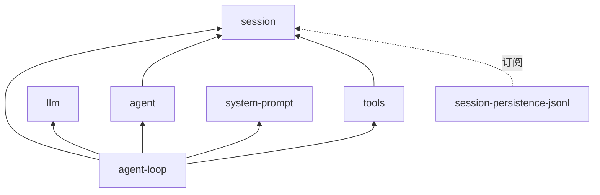

### 4.11 创建事务：prepare → setup → publish → rollback

| 阶段 | 动作 | 失败时 |
| --- | --- | --- |
| prepare | new ReactLoopAgent；注册 dispose；未 enter registry | dispose 回滚 scope |
| setup | await setup(agentCtx)；可选 commit() | dispose；不 announce |
| publish | sessions.enter + agents.enter → announce → session-start | detach；已 emit 的需配对 disposed |
| rollback | dispose：cancel machine → whenIdle → scope.dispose → detach | 工厂 unload 同理 |


### 4.12 Initiator / withInitiator / FactoryOwnership

本节补齐 §4.2–§4.11 未展开的 **进程内因果边界**：谁算「发起方」、kick 如何继承、工厂如何拥有活 agent 生命周期。

#### 4.12.1 AsyncLocalStorage initiator：是什么 / 不是什么

`AgentRegistry` 用 Node `AsyncLocalStorage<Agent>` 保存 **当前异步链的发起 agent**（`packages/core/agent/src/index.ts`）。

| 是 | 不是 |
| --- | --- |
| 进程内 **归因**：日志、指标、子调用默认知道「哪个 agent 触发了这段异步工作」 | **认证/授权**；不证明调用方有权操作目标 session |
| `withInitiator(agent, op)` 边界内的 `requireInitiator()` / `currentInitiator()` | Session durable 身份（session id、header lineage） |
| 子 agent continuation 携带 **子**；父 continuation 在 `withInitiator` 返回后恢复 **父** | 跨进程 wire 上的 caller id（须显式字段） |

子 agent fork 时：**session header** 记 lineage；registry **`owner`** 是运行时创建者 fiber；initiator 在子 driver 的 `kick()` 内为 **子 ReactLoopAgent**。

#### 4.12.2 `withInitiator` 包裹 `kick`

`ReactLoopAgent.wakeDriver` 在 `idle → running` 时启动 driver：

```typescript
this.loopCtx.agents.withInitiator(this, () => this.kick()).then(driver.resolve, driver.reject)
```

含义：

- 整个 `kick → while(turn) → step → LLM/tools` 链在 **该 agent** 的 initiator 边界内；
- 插件在 waterfall 里 `requireInitiator()` 得到 **正在跑循环的 agent**，不是 HTTP 请求线程上的偶然 agent；
- `withInitiator` **保留** `operation` 的同步返回值或 Promise 身份（不包一层新 Promise）。

#### 4.12.3 create vs register vs enter / announce

| 阶段 | API / 动作 | 注册表状态 | Session 状态 |
| --- | --- | --- | --- |
| **create**（工厂） | `AgentLoop.create` → `SessionPreparation` + `prepare` | 尚未 `announce` | `sessions.prepare` 分配 id，可能未 enter |
| **setup** | `await setup(agentCtx)`（可选） | 仍私有 | 配置写入 session 事件 |
| **publish** | `sessions.enter` + `agents.enter` → `announce` ×2 → `agent/session-start` | `agents.get(id)` 可见 | `sessions.get(id)` 活跃 |
| **register**（setFactory） | `ctx.agents.setFactory(this)` effect | Factory 槽占用 | — |

`enter` 建立 **作用域查找**（`ctx.agent`、`ctx.session` 代理）；`announce` 触发 **`agent/created` / `session/created`** 等观察者事件。顺序必须是 **先 setup 后 announce**（§4.11 表），否则 UI 看到半配置 agent。

#### 4.12.4 FactoryOwnership、`liveAgents` 与 dispose 顺序

`AgentLoop` 私有类 `FactoryOwnership`（`packages/core/agent-loop/src/index.ts`）跟踪：

- `liveAgents: Set<() => Promise<void>>` — 每个已 `prepare` 的 agent 的 **共享 dispose**；
- `startupTasks` — config 驱动 `agents: []` 启动任务；
- `teardown` AbortController — fiber UNLOADING 时拒绝新 create/resume。

`dispose()` 顺序：

```typescript
async dispose(): Promise<void> {
  this.accepting = false
  this.teardown.abort(new Error('agent loop is not active'))
  this.inactive.resolve()
  await Promise.all([
    ...[...this.liveAgents].map(dispose => dispose()),
    ...this.startupTasks,
  ])
}
```

单个 agent 的 `dispose`（`prepare` 内 memoized）顺序：**`cancel({ kind: 'disposed' })` → `whenIdle()` → `scope.dispose()` → `detachAgent` / `detachSession` → untrack**。保证 loop 退出后再拆 registry 与 session store。

#### 4.12.5 AgentHandle vs `agents.get` 裸 Agent

**解决什么问题**：同一个 `Agent` 实例，**谁能 teardown**？观察方（UI 列表）不应能误杀会话；消费方（ACP、subagent 父级）必须能可靠停掉子 agent。

| 方式 | 类型 | 能 `dispose`？ | 典型持有者 |
|------|------|----------------|------------|
| `create()` / `resume()` 返回值 | `AgentHandle` | ✅ `handle.dispose()` | SDK、ACP、subagent |
| `agents.get(id)` | 裸 `Agent` | ❌ 无 teardown 权 | UI 只读、事件订阅 |

```typescript
// packages/core/agent/src/index.ts — 概念类型

/** 消费方能力：agent + 精确 teardown */
type AgentHandle = {
  agent: Agent
  dispose(): Promise<void>   // cancel → whenIdle → 注销 → 移 session → scope.dispose
}

/** 观察方：只能 followup/cancel 等 Agent API，不能拆生命周期 */
ctx.agents.get(sessionId): Agent | undefined
```

`dispose()` 与 `agent.cancel()` 区别：`cancel` 停 **当前 turn**；`dispose` 停 **整个 agent 寿命** 并从 Registry/Store 移除。

#### 4.12.6 SessionPreparation — 未 announce 的 Session 护栏

**解决什么问题**：`sessions.prepare(id)` 会分配 Session 对象。若在 `publish` 前失败，不能把「半存在」的 Session 留给观察者。`SessionPreparation` + TS `using` = **RAII**：作用域结束自动回滚未发布 Session。

```typescript
// packages/core/agent-loop/src/index.ts — create 路径

create(id, options, meta): Agent {
  // ① prepare：Session 存在，但未 announce
  using preparation = SessionPreparation.create(
    this.runtime.ctx.sessions.prepare(id, { meta }),
  )
  const prepared = this.prepare(this.ctx, id, options, preparation.session)
  try {
    // ② publish 成功 → preparation 正常结束，Session 已 announce
    return prepared.publish('startup').agent
  } catch (error) {
    // ③ publish 失败 → prepared.dispose + using 回滚 preparation
    void prepared.dispose()
    throw error
  }
}
```

**resume 路径**（概念）：`sessionPersistence.load` → `sessions.resume` → 同一套 `prepare`/`publish`；`ReactLoopAgent` 构造时从 `session.events` **重放** inbox splice；`deriveMessages` 从 surface 继续投影。

#### 4.12.7 源码走读：initiator API — 插件如何知道「谁在跑」

**解决什么问题**：`pre-step` / `tools/execute` 等 waterfall 可能在深层 async 里执行。没有 initiator，日志只能写「某个 HTTP 线程」，无法归因到 **正在 kick 的 agent**。

```typescript
// packages/core/agent/src/index.ts

/** 可选读：没有边界时返回 undefined（适合日志「可能无 agent」） */
currentInitiator(): Agent | undefined {
  return this.initiators.getStore()   // AsyncLocalStorage
}

/** 强制读：waterfall 内部 helper 用；无边界则抛 NO_INITIATOR_MESSAGE */
requireInitiator(): Agent {
  const agent = this.currentInitiator()
  if (agent === undefined) throw new Error(NO_INITIATOR_MESSAGE)
  return agent
}

/** 建立边界：kick 整段在 withInitiator(this, kick) 内 */
withInitiator<T>(agent: Agent, operation: () => T): T {
  return this.runWithInitiator(agent, operation)
}

/** 清除边界：定时器/队列泵用，避免继承「第一个碰到的 agent」 */
withoutInitiator<T>(operation: () => T): T {
  return this.runWithInitiator(undefined, operation)
}
```

| 方法 | 何时用 |
|------|--------|
| `withInitiator(agent, kick)` | Driver 启动内环 |
| `requireInitiator()` | 插件确信在 driver 边界内 |
| `currentInitiator()` | 可选归因（metrics） |
| `withoutInitiator()` | 后台泵、共享定时器初始化 |

#### 4.12.8 ReactLoopAgent 上的 Scope / class ref

`ReactLoopAgent` 构造时 `this.scope = createScope(loopCtx, this)`，`this.ctx = this.scope.ctx.extend({ agent: this })`。

| 引用 | 用途 |
| --- | --- |
| `agent.scope` | agent-scoped Cordis 世界；`scope.dispose()` 在 driver dispose 末尾调用 |
| `agent.ctx` | 带 `agent` 字段的 Context；waterfall、`systemPrompt.assemble` 用 |
| `loopCtx`（私有） | 进程级 `agents`/`sessions`/`llm`；`withInitiator` 在 **loopCtx.agents** 上调用 |

**注意：** 插件应通过 `ctx.agent`（enter 后）或事件 payload 的 `agent` 字段拿主体，不要缓存裸 `ReactLoopAgent` 类引用做 `instanceof` 分支——自定义 `AgentFactory` 可替换驱动器实现。


### §4 小结

- **不止六个实体**：Registry / Loop / Store / Handle / Driver / Session / Surface / Inbox / Scope / Dispatch / 能力三件套 / Persistence 观察者——见 §4.0.1 与 §4.2 全图。
- **四层分工**：注册创建 → 驱动内环 → Session 真源 → ctx 能力；改审批挂 tools/*，改历史挂 surface/derive，换循环换 **整包** Factory。
- **源码走读**：§4.4 指南 + §4.5–§4.9 每段含「问题 / 触发 / 注释代码 / 逐步表 / 自检」；IDE 打开 `packages/core/agent*`、`agent-loop*`、`session*` 对照读。
- **三条硬边界**：`NO_FACTORY_MESSAGE` = 未装 loop；`user/message` 在 claim 后而非 followup；Inbox **先** `append inbox/spliced` **再**改内存。


## §5 Turn / Step / kick / wake / claim 完整控制流 + 每步 Session 写入清单

本章把 [00-流程与概念对照](./00-流程与概念对照.md) 的 11 步展开为 **可审计表**，并给出 phase 状态机与写入归属总表。

### 5.1 逐步表（输入 | 动作 | Session 写入 | 内存 | 插件可拦吗）

| 步骤 | 输入/触发 | 动作 | Session 写入 | 内存/phase | 插件可拦 |
| --- | --- | --- | --- | --- | --- |
| 1 | UI `agent.followup(msg)` | Facade 接到用户输入 | 无 | 无 user/message | 否 |
| 2 | `inbox.splice('next-turn', …)` | 先 append inbox/spliced，再改内存桶 | `agent/inbox/spliced`（inserted） | next-turn +1 | 否（internal） |
| 3 | `wakeDriver()` → `kick()` | idle 则 phase=running 并异步 kick | 通常无 | phase→running | 否 |
| 4 | `turn()` 开头 | 打开 Turn 边界 | `turn/start` | turn 编号 +1 | 否 |
| 5 | `preStep` → `inbox.claim` | 领 next-step 全量 + next-turn 队头 1 条 | `agent/inbox/spliced`（removed） | 桶变短；claimed[] | 否 |
| 6 | `systemPrompt.assemble` + `agent/pre-step` | 拼系统提示；可 reject | 通常无 | messages 可能被改 | **是** waterfall |
| 7a | reject 或空 messages | 不开 step | `turn/end`（可无 step/*） | turn 结束 | 是（pre-step） |
| 7b | enter 且有消息 | 开 Step | `step/start`；每条 `user/message`（surfaceOp: append） | 进入对话表面 | 是（pre-step） |
| 8 | `deriveMessages()` → LLM | 从表面投影读历史 | `assistant/chunk*`；`assistant/message` | 流式 UI | request / request-error |
| 9 | tool-calls | executeToolCalls 调度 | `tool/call`；`tool/result` | 工具状态 | **是** tools/* |
| 10 | `step/end`；`turn-stopping`；`turn/end` | 关 Step/Turn；可能续 next-step | `step/end`；`turn/end` | phase 可能续 turn | turn-stopping 可拦 |
| 11 | UI 刷新 | 订 `session/event` | 无新写入 | 投影更新 | 否 |

### 5.2 控制流 Mermaid

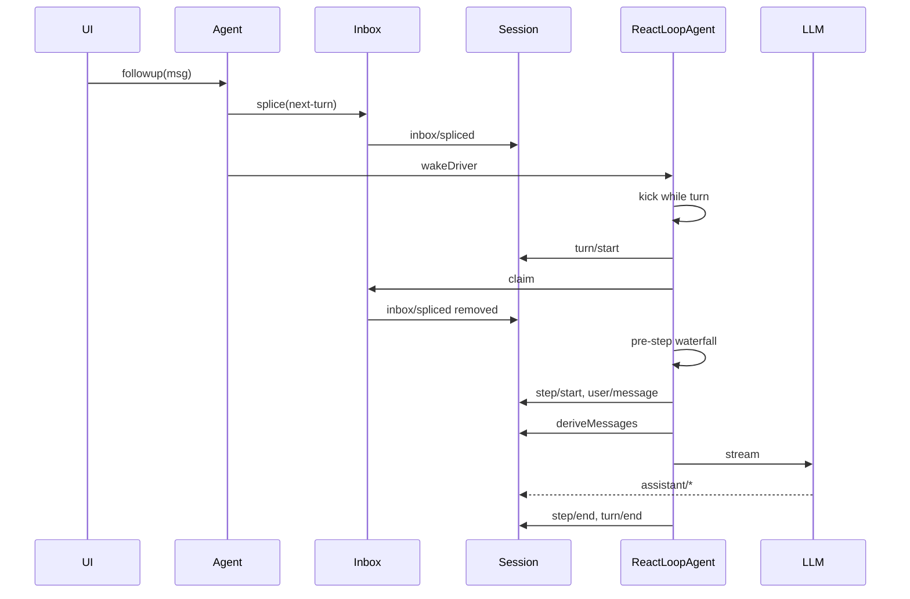

### 5.3 Phase 状态机

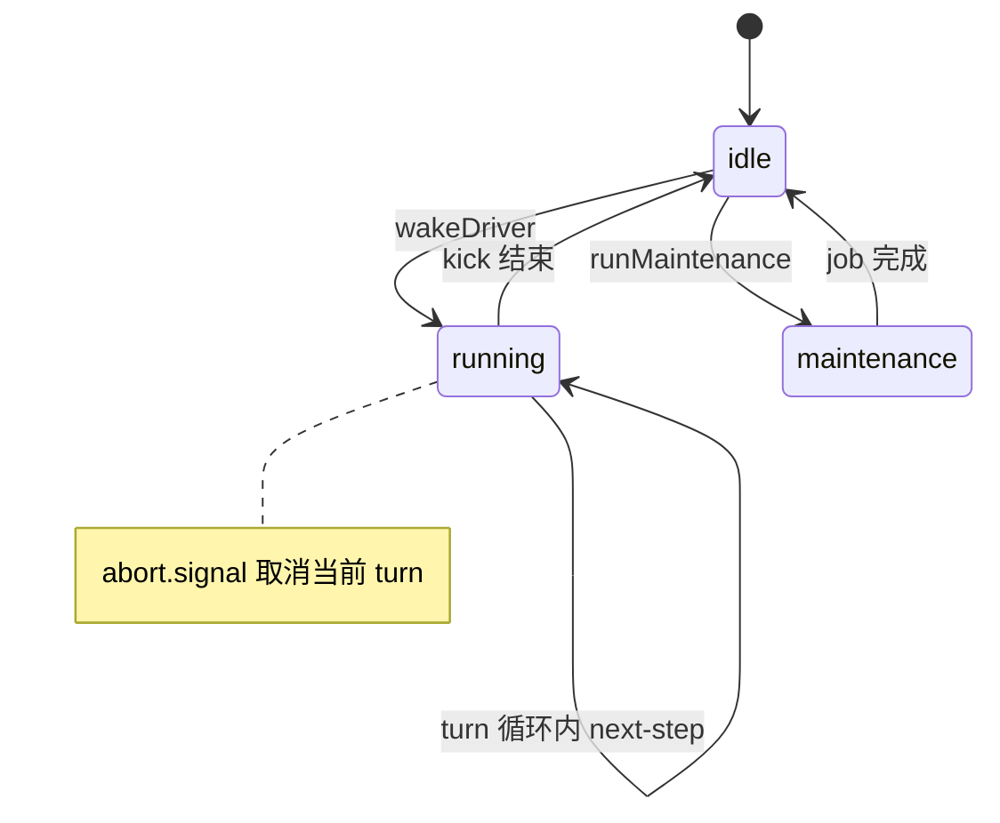

| phase | 含义 | wake 行为 |
|-------|------|-----------|
| `idle` | 无 driver | wake 启动 kick |
| `running` | kick/turn 进行中 | 通常直接 return（自己 claim） |
| `maintenance` | runMaintenance | 闩 wakeRequested，结束后重 wake |

### 5.4 完整写入归属表

| 事件类型 | 写入者 | 时机 | 可回放 |
| --- | --- | --- | --- |
| agent/inbox/spliced | Inbox.mutate | 入队/出队/清空 | 是 |
| turn/start | ReactLoopAgent.turn | Turn 边界 | 是 |
| turn/end | ReactLoopAgent.turn finally | Turn 结束原因 | 是 |
| step/start | ReactLoopAgent.turn | Step 边界 | 是 |
| step/end | ReactLoopAgent.turn finally | Step 结束 | 是 |
| user/message | ReactLoopAgent.turn | claim 后表面用户话 | 是 |
| assistant/chunk | ReactLoopAgent.step | 流式（常非表面） | 是 |
| assistant/message | ReactLoopAgent.step | 助手回合表面 | 是 |
| tool/call | executeToolCalls | 工具调用 | 是 |
| tool/result | ToolRuntime | 工具结果 | 是 |
| request/header | buildRequest | 模型路由锚点 | 是 |

### 5.5 源码：turn / preStep / step 关键行

已见于 §4.5 与 `agent.ts`：`turn()` 内 `while(true)` 调 `preStep`；`preStep` 调 `claim` + `agent/pre-step` waterfall；`step()` 调 `deriveMessages` + `llm.stream` + `executeToolCalls`。


### 5.6 边界情形详解

以下 12 条各 **独立**，对 §5.1 逐步表做 edge-case 补充；涉及 Session 写入处标明事件类型。

#### 5.6.1 next-step 续跑无需 wake

当某 step 结束且 `inbox.nextStep.length > 0` 时，`turn()` 内层循环将 `target` 设为 `'next-step'` 并 **继续同一 turn**，不回到 `idle`，故 **不调用 `wakeDriver`**。

```typescript
// agent.ts turn() 内
if (turnEnds && this.inbox.nextStep.length === 0) break
target = 'next-step'
```

| 阶段 | Session 写入 |
| --- | --- |
| 续跑下一步 | 新 `step/start`；可能 `user/message`（claim 后） |
| 无 | 无第二次 `turn/start` |

与 Pi 内层 while drain steering 类似，但 DSH 队列是 **`agent/inbox/spliced` 持久化事实**。

#### 5.6.2 pre-step reject 仍有 turn/start + turn/end

`preStep` 返回 `{ kind: 'reject' }` 时：

```typescript
if (decision.kind === 'reject') {
  turnEnds = { kind: 'blocked' }
  return false  // 退出 turn 内层 while，仍走 finally
}
```

| 事件 | 写入 |
| --- | --- |
| `turn/start` | 已写（turn 开头） |
| `step/start` | **无** |
| `turn/end` | `{ reason: { kind: 'blocked' } }` |

插件用 reject 短路模型调用，但 **Turn 边界仍闭合**，UI 可显示「本轮被拦截」。

#### 5.6.3 首步空 messages → completed turn without step

```typescript
if (phase.step === 0 && decision.messages.length === 0) {
  turnEnds = { kind: 'completed' }
  return false
}
```

典型原因：waking message 在 claim 前被 `cancel` 清掉，或 `agent/pre-step` 把 enter 改写成空数组。**仍写 `turn/start` + `turn/end(completed)`，无 `step/*`**。避免「空 turn 挂起」。

#### 5.6.4 max-tokens sticky across steps

```typescript
const stepEnd = await this.step(decision.assembly)
if (turnEnds === null || turnEnds.kind !== 'max-tokens') turnEnds = stepEnd
```

同一 turn 内若某 step 以 `max-tokens` 结束，后续 step 即使 `completed` **也不降级** turn 结局。Session：`step/end` 每步都有；`turn/end.reason.kind === 'max-tokens'` 反映 **最坏** step。

#### 5.6.5 abort / cancel 与 keepInbox

```typescript
cancel(cause, options = {}): void {
  if (!options.keepInbox) {
    this.inbox.clear()
    if (this.phase.kind !== 'idle') this.phase.wakeRequested = false
  }
  if (this.phase.kind !== 'idle') this.phase.abort.abort(cause)
}
```

| 选项 | inbox | wakeRequested | turn/end |
| --- | --- | --- | --- |
| 默认 cancel | `clear()` 持久 splice | 清除 | `aborted` |
| `{ keepInbox: true }` | 保留队列 | 不清 latch（除非无 keepInbox 分支） | `aborted`，待处理话留待下次 wake |

`keepInbox` **不**恢复已被同步 claim 走的消息。

#### 5.6.6 maintenance phase + wakeRequested latch

`runMaintenance` 独占 `maintenance` phase；此间 `followup` 触发 `wakeDriver` 只会：

```typescript
if (reason?.kind !== 'disposed' && (this.phase.kind === 'maintenance' || wakeAfterAbort)) {
  this.phase.wakeRequested = true
}
```

maintenance `finally`：`idle` 后若 `wakeRequested && inbox.hasPending` 再 `wakeDriver()`。**无 Session 写入**（纯 phase 闩）。

#### 5.6.7 wakingAfterAbort 将 target 重分类为 next-turn

```typescript
const wakingAfterAbort = wakeup && this.phase.kind !== 'idle' && this.phase.abort.signal.aborted
const resolvedTarget = wakingAfterAbort ? 'next-turn' : target
this.inbox.splice(resolvedTarget, ...)
```

在 **abort 已触发但 driver 尚未收敛到 idle** 窗口到达的 waking send，不能加入已中止活动的 `next-step`，强制进 **next-turn**。分类在 splice **之前** 捕获，避免 reentrant cancel 观察者改分类。

#### 5.6.8 turn-stopping serial 最后注入机会

当 `turnEnds` 已设定且 `nextStep` 为空，关 turn 前：

```typescript
await this.dispatch.serial('agent/turn-stopping', { turn, signal })
```

监听器可 `steer()` 注入 **下一步**（`/loop` 模式），使 `nextStep` 非空并 **继续 turn** 而不结束。若仍为空则 `break` → `turn/end`。Session：steer 追加 `agent/inbox/spliced`；若继续则有额外 `step/*`。

#### 5.6.9 assistant/chunk 不在表面；assistant/message 带 sourceEventSeqs

流式阶段：

```typescript
chunkSeqs.push(this.session.append('assistant/chunk', { turn, step, chunk }).seq)
// ...
this.session.append('assistant/message', {
  turn, step, message, ...usage
}, { surfaceOp: 'append', sourceEventSeqs: chunkSeqs })
```

| 事件 | deriveMessages | 用途 |
| --- | --- | --- |
| `assistant/chunk` | 否 | UI 流式、回放 chunk 序列 |
| `assistant/message` | 是 | 模型可见助手回合；`sourceEventSeqs` 指向 chunk seq |

空 content 的 `assistant/message` 仍可能记录（如 tool-only max-tokens 步），但 **空内容不进 derived history**。

#### 5.6.10 tool-calls 后续跑 step 循环 vs turn 结束

`step()` 内 `executeToolCalls` 返回 `concluded: false` 时 `step()` 返回 `null`，turn 内层 **再开一步**（同 turn 新 step 编号），无需新 user message（工具结果已在表面）。

| 路径 | Session |
| --- | --- |
| 有 tool-calls 且需继续 | `tool/call`、`tool/result`；下一 `step/start` |
| 无 tool-calls | `step/end` → 可能 turn-stopping → `turn/end` |

#### 5.6.11 失败 LLM 路径写入归属清单（request-error retry）

`assembler.finish` 为 `error`/`aborted` 时进入 `agent/request-error` waterfall：

| 步骤 | 写入者 | 事件 |
| --- | --- | --- |
| 流已开始 | ReactLoopAgent | `assistant/chunk`（已有 seq） |
| 失败定格 | 通常无新表面消息 | 无 `assistant/message`（未过 finish 成功路径） |
| 监听器 `{ kind: 'retry' }` | — | 无额外事件；同 step 重建 request |
| 未处理失败 | throw `LlmError` | `turn/end` `reason.kind === 'error'`；`agent/error` |

**归因检查：** 失败 turn 应有 `turn/start` + `turn/end(error)`；retry 成功时同 step 最终仍有 `assistant/message` + `step/end`。

#### 5.6.12 Pi 命名对照：Pi turn ≈ DSH Step 混淆表

| Pi / 口语 | DSH 精确术语 | Session 边界 |
| --- | --- | --- |
| Pi turn（一次模型往返） | **Step** | `step/start` … `step/end` |
| Pi session 多轮对话 | **Turn**（可含多 Step） | `turn/start` … `turn/end` |
| followUp 排队 | `followup` → **next-turn** 桶 | inbox splice，非 user/message |
| steering 插入 | `steer` → **next-step** 桶 | 同上 |
| 内层 while 继续 | turn 内 `target='next-step'` | 无新 turn/start |

记忆：**DSH Turn 是审计大边界；Step 是一次 `deriveMessages` + LLM 调用（可含工具链）。**


### §5 小结

- **Turn** = 大边界（`turn/start`…`turn/end`）；**Step** = 一次模型调用（可含工具链）。
- **wake** 只解决 idle→running；running 时靠 claim 消费队列。
- 用户话进 **对话表面** 的时机是 claim 之后 `user/message`，不是 splice 时。


## §6 Session 公理：append-only · surfaceOp · deriveMessages · persistence 订阅分离

### 6.1 公理表

| 公理 | 陈述 | 违反后果 |
| --- | --- | --- |
| A1 append-only | 已提交事件不可原地修改；修正靠新事件 + surface replace | 回放不一致；投影漂移 |
| A2 模型可见 ⟺ 已记录 | 进 LLM 的输入必须能从 Session 重建 | 审计失败；合规风险 |
| A3 surface 单源 | deriveMessages 只走 surface 节点序 | 双真源 messages[] |
| A4 正交持久化 | Session 不写盘；persistence 订 session/event | 核心层绑死存储格式 |
| A5 inbox 亦日志 | Inbox 队列事实用 inbox/spliced 表达 | 重启丢队列 |


### 6.2 surface vs non-surface 事件

| 类别 | 示例 | 进入 deriveMessages? | 用途 |
| --- | --- | --- | --- |
| surface append | user/message, assistant/message, tool/result | 是 | 对话历史 |
| surface replace | compaction replace | 替换节点 | 压缩 |
| non-surface | turn/start, step/start, assistant/chunk, inbox/spliced | 否 | 边界/UI/队列 |


### 6.3 deriveMessages 缓存与 replaceGeneration

当 compaction 触发 surface `replace` 时，`SurfaceManager.replaceGeneration` 递增，`deriveMessages` **整缓存作废重建**，保证 O(新节点) 增量在 replace 后仍正确。

```typescript
// replaceGeneration 变化 → 清空 derived 缓存
if (generation !== this.derivedGeneration) {
  this.derived = []
  this.derivedNodes = 0
  this.derivedGeneration = generation
}
```

### 6.4 Persistence 正交图

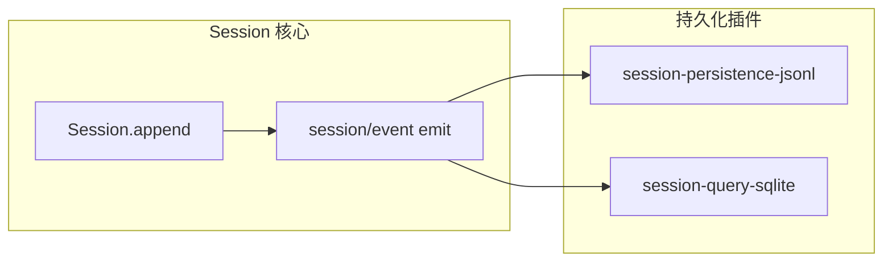

### 6.5 Session 拥有 / 不拥有
#### Session（汇总） 实体边界表
| 拥有 | 不拥有 | 依赖 | 禁止 |
| --- | --- | --- | --- |
| 内存 log；header；surface 状态；derive 缓存 | jsonl 路径；SQLite schema；WebSocket | dsh-llm Message 类型；插件声明的 SessionEventMap 扩展 | 业务层直接 splice inbox 外写 user/message |


### §6 小结
- Session 是 **唯一对话事实日志**；messages 是派生视图。
- surfaceOp 标记决定哪些 seq 进入投影。
- 持久化是 **订阅者**，不是 Session 内建方法。

## §7 Inbox：两桶 · splice vs claim · followup/steer/inject · 唤醒语义

### 7.1 两桶（Two Buckets）

| 桶 | 语义 | 典型 API |
|----|------|----------|
| `next-turn` | 等待独立 Turn 的用户话 | `followup` |
| `next-step` | 等待下一 Step 边界的话 | `steer`, `inject` |

claim 顺序：**先清空 entire next-step，再取 next-turn 队头 1 条**（当 target 为 next-turn 时）。

### 7.2 splice vs claim
|  | splice | claim |
| --- | --- | --- |
| 谁调用 | send/followup/steer/inject/工具旁路 | Driver preStep（internal） |
| Session | 写 inserted/removed splice | 写 removed splice |
| 内存 | 改桶内容 | 取出消息数组 |
| 唤醒 | 不自动唤醒（由 send 的 wakeup 参数决定） | 不唤醒 |


### 7.3 followup / steer / inject API 表
| API | target | wakeup | 含义 |
| --- | --- | --- | --- |
| followup | next-turn | true | 新 Turn；空闲则 wake |
| steer | next-step | true | 下一步插入；wake |
| inject | next-step | false | 入队但不 wake（running 时下一步领） |


### 7.4 唤醒语义

- **仅 idle** 时 `wakeDriver` 真正启动 `kick`。
- **running** 时 driver 在 step 边界自己 `claim`，无需重复 wake。
- **maintenance** 或 **abort 后 wake**：闩 `wakeRequested`，收敛后再 wake。
- `disposed` 不闩 wake（ teardown 不等新 turn）。

### 7.5 mutate：先 Session 后内存

见 §4.6：`session.append('agent/inbox/spliced', …)` 在 `inbox.splice` **之前**，同步 `session/event` 观察者看到突变前快照 + 事件坐标可重建 removed。

### §7 小结
- Inbox 不是纯内存队列，是 **Session 事件的增量投影**。
- splice≠claim：前者入队持久化，后者 step 边界消费。
- Pi 的 followUp 与 DSH followup **不同义**（见 §11）。

## §8 工具流水线概览（pre / execute / post waterfall）

### 8.1 两层：executeToolCalls 调度 vs ToolRuntime

```text
ReactLoopAgent.step
  → executeToolCalls（agent-loop：并行度、顺序、inbox 旁路）
       → ToolRuntime.run（dsh-tools：单次工具 waterfall）
            → tools/pre-execute → guards → tools/execute → tools/post-execute → tools/result
```

| 层 | 包 | 职责 |
|----|-----|------|
| 调度层 | agent-loop `tool-calls.ts` | 并行上限、group、step 内多 call |
| 执行层 | dsh-tools ToolRuntime | 单工具契约、审批、超时包装 |

### 8.2 序列

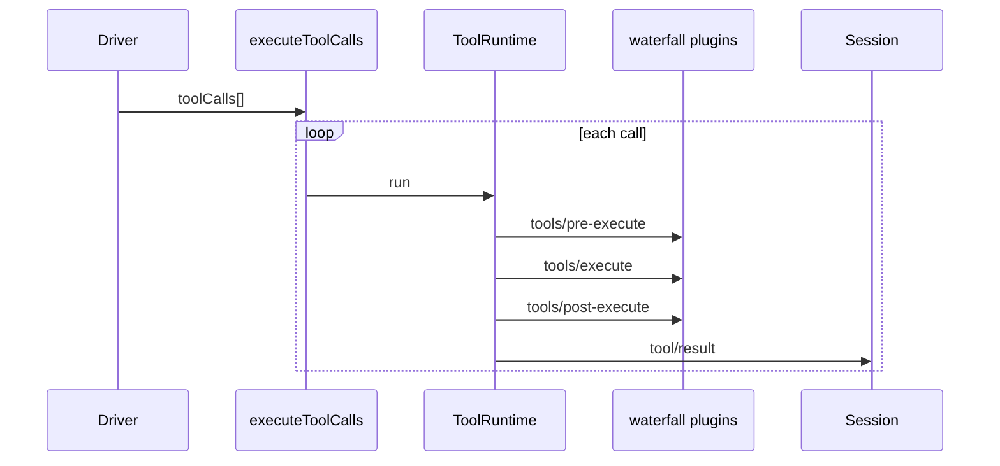

### 8.3 细节见 PART2
审批策略、timeout-policy、repeat-tool-reminder、code mode 等分别在 PART2 工具卷展开。

### 8.4 单次工具调用：瀑布细节与写入归属

Familiar：把 `tools/pre-execute` → `tools/execute` → `tools/post-execute` 想成 Filter 链；`tools/result` 是 emit 观察点。

| 阶段 | 模式 | 可短路？ | Session 写入（谁） | 典型插件 |
|------|------|----------|-------------------|----------|
| `tools/pre-execute` | waterfall | 是（不调 next / deny） | 通常尚无 `tool/result`；`tool/call` 常已由调度器先写 | approval、policy |
| guards / ask | 注册表内单调守卫 | 是 | 拒绝时常以错误型结果收尾 | timeout、permission |
| `tools/execute` | waterfall around | 可包装 timeout/retry | 无（执行中） | timeout-policy |
| `definition.execute` | 工具体 | — | 可能间接触发其它 append | fs/shell consumers |
| `tools/post-execute` | waterfall | 可改写/block 结果 | 仍未最终 commit 前 | 脱敏、spill 预览 |
| finalize + materialize | ToolRuntime | — | 调度器按模型序 `tool/result` | — |
| `tools/result` | emit | 否 | 已写入；只观察冻结结果 | 遥测 |

```text
Scheduler（agent-loop/tool-calls.ts）
  1. session.append('tool/call', ...)
  2. ToolRuntime.prepare → pre-execute waterfall
  3. guards / approval
  4. tools/execute waterfall → definition.execute
  5. tools/post-execute
  6. 按模型给出的 tool-call 顺序 commit tool/result
  7. emit tools/result（冻结快照）
```

**Code Mode collapse（架构点）**：被折叠工具若被模型直接调用，在进审批瀑布 **之前** final-deny——避免「用户批准了一个永远不该直接调用的工具」。

**与 agent 域边界**：工具策略挂 `tools/*`；「本步要不要进模型」挂 `agent/pre-step`；二者同属 waterfall 族，但 **事件名不同、短路对象不同**。

| 拥有（ToolRuntime） | 不拥有 | 依赖 | 禁止 |
|---------------------|--------|------|------|
| 单次调用流水线与事件契约 | Agent 何时开 Step | Session append、定义表 | 在 tool 体里偷偷维护第二份对话历史 |
| 结果物化与 presentation | 并行调度算法（属 agent-loop） | ctx.fs 等执行世界 | 只换 FS 不换 subprocess |

细节卷：[ARCHITECTURE_PART2](./ARCHITECTURE_PART2.md)。

### §8 小结

- 改「要不要跑工具」挂 `tools/*`，不改 `ReactLoopAgent` while。
- 调度与执行分离：并行度在 agent-loop settings，语义在 ToolRuntime。
- `next()` 铁律与 `agent/pre-step` 同族；telemetry 监听器也必须放行。

## §9 三域事件：agent / session / capability

### 9.1 示意图

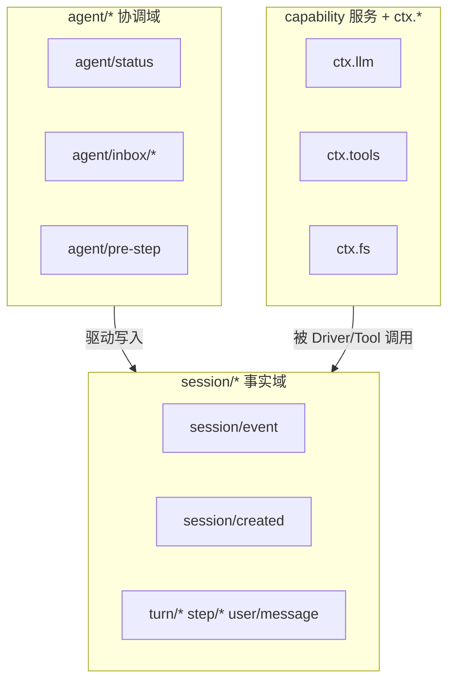

### 9.2 消费者表
| 域 | 典型事件/入口 | 消费者 | 可回放？ |
| --- | --- | --- | --- |
| agent | agent/status, agent/inbox/inserted | UI 状态灯、调试 | 部分（inbox 写 session） |
| session | session/event | UI 历史、persistence、telemetry | 是 |
| capability | ctx.tools.run | 工具实现 | 结果必须落 session |


### 9.3 误用后果

| 误用 | 后果 |
|------|------|
| 用 agent/* 当审计真源 | 丢事件；无法重建模型输入 |
| 绕过 Session 直接改 UI 历史 | 与 deriveMessages 分叉 |
| 在 capability 层 emit 假 session 事件 | 破坏 append-only 单一写入路径 |

### 9.4 域边界 FAQ（实操）

| 我想做… | 订什么 / 写什么 | 不要做 |
|---------|-----------------|--------|
| UI 状态灯「正在跑」 | `agent/status`（emit） | 把它当 transcript 真源 |
| 聊天历史 / SDK 回放 | `session/event` + surface 投影 | 另开业务 WS 存一份 messages |
| 队列里还有几条 | 读 Inbox 投影或回放 `inbox/spliced` | 只活在 UI 内存 list |
| 工具审批 | `tools/pre-execute` | 改 `definition.execute` 塞 if |
| 压缩上下文 | pre-step / compaction 写 surface replace | 原地改旧 `user/message` 事件 |
| 持久化落盘 | persistence 订 `session/event` | 让 `Session.append` 直接写文件 |

```text
错误架构：
  UI ←→ 私有 messages[] ←→ Agent
正确架构：
  UI ← session/event ← Session.append ← Driver/Tools
  UI ← agent/status  （仅协调，非历史）
```

**Scoped 分发**：多数 `tools/*` / `agent/*` 经 scope 过滤——agent-scoped 监听器只收到本 Agent 的调用。注册表级 `tools/change` 故意 **不过滤**（工具集变化影响所有人的下次 assemble）。

### §9 小结

- **session/** = 法庭记录；**agent/** = 控制室指示灯；**capability** = 干活的人。
- 插件若需 UI 闪烁订 `agent/status`；若需持久化订 `session/event`。不要发明第四套业务真源。

## §10 「Loop 是插件」澄清

### 10.1 三层表
| 层 | 内容 | 谁提供 |
| --- | --- | --- |
| 契约 | Agent 接口、AgentFactory、Inbox 语义 | dsh-agent |
| 默认算法 | kick/turn/step/preStep | dsh-agent-loop / ReactLoopAgent |
| 部署 | cordis.patch.yml 一行 agent-loop + setFactory | Bundle patch |


### 10.2 YAML agent-loop 行

```yaml
- id: agent-loop
  name: '@deepseek-ai/dsh-agent-loop'
  config:
    agents: []
```

### 10.3 setFactory ≠ per-step plugins

- `setFactory` 注册 **整包创建能力**，不是把 while 的每一行变成插件。
- 每步策略在 **waterfall**（pre-step、tools/*、request），不是替换 for 循环体。

### 10.4 正确 vs 错误心智模型
|  | 正确 | 错误 |
| --- | --- | --- |
| 一切皆插件 | agent-loop **包**可卸换；tools/llm 也是包 | while 每行是小插件 |
| 扩展 | 挂 waterfall / 换 Factory | fork ReactLoopAgent 加 if remote |
| 固定 | 默认 ReactLoopAgent 的 turn/step 顺序 | 「皆插件」= 没有固定流程 |


### 10.5 替换 Driver 检查清单

若你写新的 `AgentFactory` / loop 插件，至少满足：

| # | 要求 | 为何 |
|---|------|------|
| 1 | 实现 `createAgent` / `resume` | 注册表只认 `AgentFactory` |
| 2 | `ctx.effect(() => agents.setFactory(this))` | 卸载可逆；唯一槽 |
| 3 | publish 前完成 setup；失败 dispose | 观察者不见半配置世界 |
| 4 | 模型输入只来自 `session.deriveMessages()` | 公理「模型可见 ⟺ 已记录」 |
| 5 | 用户入队走 Inbox 两桶或显式文档化差异 | UI/API 契约稳定 |
| 6 | turn/step（或等价边界）写入可回放事件 | 审计与 fork |
| 7 | 不依赖业务插件 import 你的私有文件 | 能力包不绑死循环包 |
| 8 | 更新 `docs/architecture.md` / 本 doc-sn | AGENTS：改 loop 必改文档 |

```yaml
# 替换整包：在 profile / overlay patch 覆盖 id
- id: agent-loop
  name: '@your-org/custom-agent-loop'
```

**不要**：在默认 `ReactLoopAgent` 里加 `if (remote)`；用执行世界成对 Provider，或换 Factory。

### §10 小结

- 「Loop 是插件」= **Driver 实现可整包替换**；默认实现仍是固定 while。
- 日常扩展挂 waterfall；换循环哲学才换 Factory。

## §11 与 Penguin / Pi / MAF 对照

### 11.1 总表
| 维度 | DSH | Pi | Penguin | MAF |
| --- | --- | --- | --- | --- |
| 入口 | Agent.followup + wake | agent.prompt() | Session.run | agent.run() |
| 编排 | ReactLoopAgent（可换 Factory） | runLoop 固定 | ContextEngine 固定 | Middleware 管道 |
| 消息真源 | SessionEvent + deriveMessages | AgentMessage[] | Trace JSONL | 取决于宿主 |
| 排队 | Inbox splice/claim 持久化 | 内存 steering/followUp | steer/carry-over | 宿主队列 |
| 组装 | Profile/Bundle/Cordis | coding-agent 配置 | createAgent + Skill 文件 | 代码组装 |
| 审批 | tools waterfall + approval 服务 | 钩子/扩展 | ApproveFn | 工具策略中间件 |
| Turn 命名 | Turn 大 / Step = 一次 LLM | turn ≈ DSH Step | 产品 turn | 宿主定义 |


### 11.2 Pi turn ≈ DSH Step

Pi 一次 `turn_start`…`turn_end`（LLM+tools）对应 DSH 的 **`step/start`…`step/end`**。DSH 的 **Turn** 可含多个 Step（next-step 续跑）。

### 11.3 MAF agent.run / ContextProvider vs DSH

| MAF | DSH 近似 |
|-----|----------|
| `agent.run` 单次会话 | 一次 `kick`（可多 turn） |
| ContextProvider 注入上下文 | `systemPrompt` + context/* 插件 + `agent/pre-step` |
| Middleware | Cordis waterfall |
| Tool 注册 | `ctx.tools` + cordis patch tools 行 |

### 11.4 迁移片段（Pi → DSH）

| Pi | DSH | 注意 |
|----|-----|------|
| `prompt(msgs)` / `continue` | `followup` + wake；或空闲后再 kick | Pi 一次跑到底；DSH 可 idle 再醒 |
| 内存 steering | `steer` → next-step + wakeup | DSH 还写 `inbox/spliced` |
| followUp（将停再塞） | 更接近 turn-stopping 时机塞 next-step；≠ `followup` API | 同名不同义 |
| `AgentMessage[]` 热路径 | Session 事件 + `deriveMessages` | 勿并行维护数组 |
| Extension 回调 | Cordis 插件 + `@mode` 事件 | 看 emit vs waterfall |
| Pi turn | **DSH Step** | DSH Turn ⊃ Step |

```text
从 Pi 迁到 DSH 最短路径：
  1. 把 prompt() 换成 followup（用户新话）
  2. 把内存 steering 换成 steer + Inbox
  3. 删除并行 messages[]；一律 deriveMessages
  4. 钩子迁到 agent/pre-step 与 tools/*
```

**相对 MAF**：`agent.run` ≈ 一次 `kick` 内的工作；ContextProvider ≈ systemPrompt/context 插件 + pre-step；Middleware ≈ waterfall。MAF 无 Cordis Profile 组装轴。

**相对 Penguin**：`Session.run` ≈ followup+wake；编排内核产品内固定；排队非事件 Inbox。见 [00b §5](./00b-顶层设计与实体边界.md)。

### §11 小结

- 选型：要 **可插拔进程内平台 + 事件溯源** → DSH；要 **最小嵌入库** → Pi；要 **另一产品会话模型** → Penguin。

## §12 扩展决策树 + 总结

### 12.1 决策树（文本）

```text
要改什么？
├─ 装/卸能力（模型、工具、Web）
│    → Profile / Bundle / cordis.patch.yml
├─ 某步是否进模型、改 messages
│    → agent/pre-step waterfall
├─ 模型路由、重试
│    → agent/request、agent/request-error、llm 插件
├─ 工具审批、超时、包装
│    → tools/*、approval、timeout-policy
├─ 历史压缩、投影
│    → compaction 插件 + surface replace
├─ 执行环境（本地/远程沙箱）
│    → fs + subprocess 成对 Provider（执行世界）
└─ 换循环哲学（非 ReAct step 边界）
     → 新 agent-loop 插件实现 AgentFactory
     → 禁止：在业务插件里抄 while
```

### 12.2 禁止模式（Forbidden Patterns）

1. **第二份 messages[] 真源** — 一律 `session.deriveMessages()`。
2. **未装 loop 就 create agent** — 必然 `NO_FACTORY_MESSAGE`。
3. **patch 字段 merge 幻想** — 整行 config 替换。
4. **只换 fs 不换 subprocess** — 执行世界分裂。
5. **waterfall 忘记 next()** — 静默吞链。
6. **插件直接 claim Inbox** — internal API。
7. **在 Session 类写 jsonl** — 应用 persistence 插件。

### 12.3 PART1 收尾与 PART2 链接

PART1（§0–§12）完成后，读者应能：

1. 从 Profile 启动画出插件 spine（agent / tools / agent-loop）。
2. 逐步跟踪 followup → splice → wake → claim → deriveMessages → LLM。
3. 区分 agent 协调事件与 session 事实事件。
4. 知道扩展应挂 waterfall 还是换 Factory。

**PART2** 将展开：工具契约全文、compaction、subagent、approval、context 插件、LLM 适配与测试策略。

### 12.4 源码阅读路线图

| 顺序 | 文件 | 关注点 |
| --- | --- | --- |
| 1 | packages/boot/app-boot/src/profile.ts | PROFILE_TEMPLATES、composeEntries |
| 2 | packages/bundle/base/cordis.patch.yml | spine 插件行 |
| 3 | packages/core/agent/src/index.ts | AgentRegistry、setFactory |
| 4 | packages/core/agent-loop/src/index.ts | prepare/publish/dispose |
| 5 | packages/core/agent-loop/src/agent.ts | kick/turn/step |
| 6 | packages/core/agent/src/inbox.ts | splice/claim 顺序 |
| 7 | packages/core/session/src/index.ts | deriveMessages |
| 8 | packages/core/session/src/surface.ts | surfaceOp、replaceGeneration |
| 9 | doc-sn/00-流程与概念对照.md | 11 步对照 |
| 10 | docs/architecture.md | 权威架构 |


### §12 终章

DeepSeek Harness 的核心张力被刻意保持：**组装极灵活（一切皆插件）**，**默认循环极固定（ReactLoopAgent）**，**事实极严格（Session append-only）**。理解这三条，就不会在「皆插件」与「固定 while」之间假打架，也不会把 Pi 的 turn 与 DSH 的 Turn 混为一谈。
