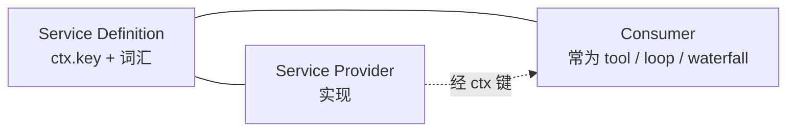
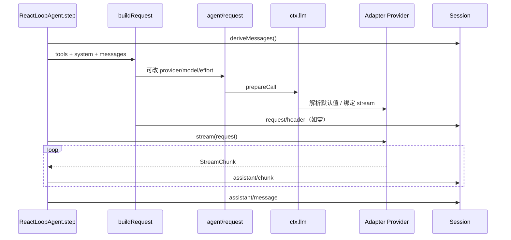
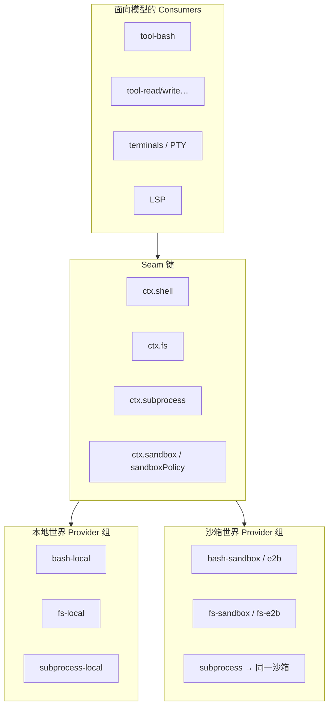
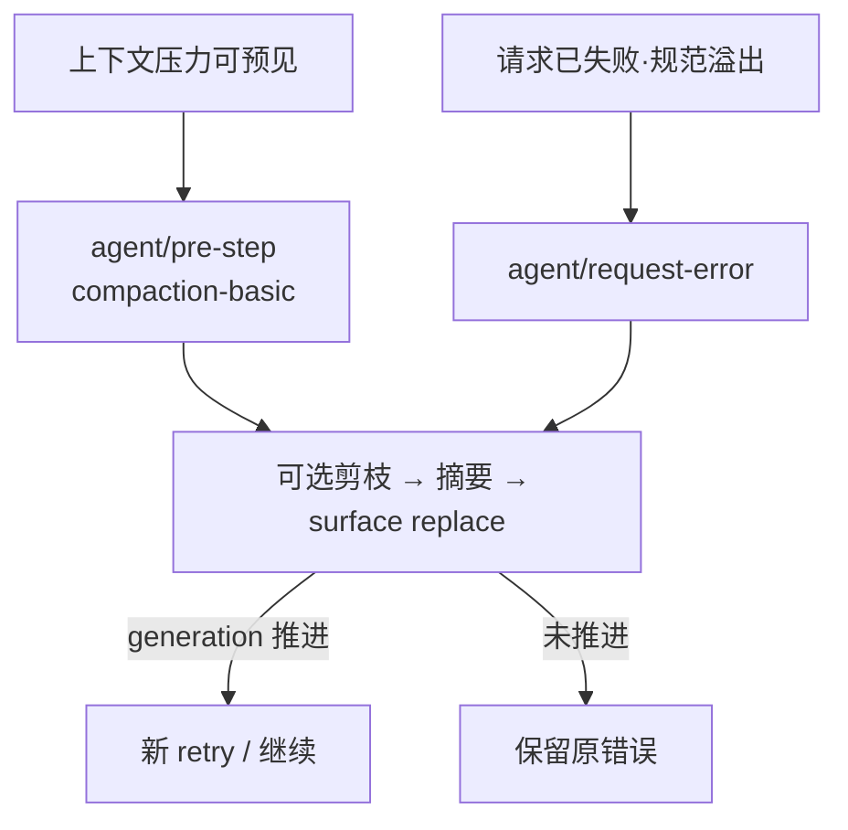
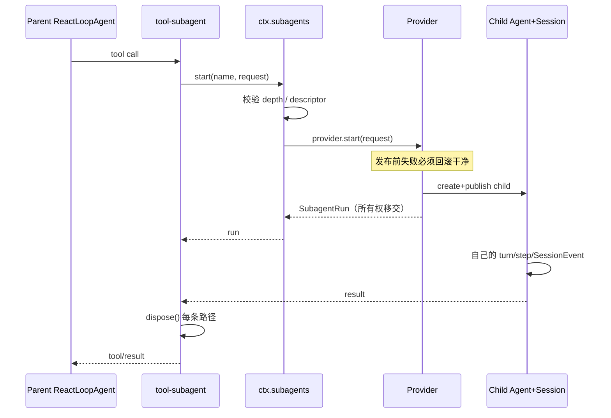
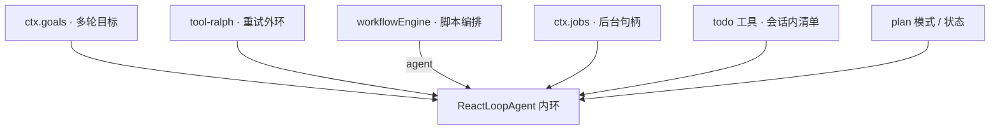

# 第六章 · 能力扩展（Seam / 执行世界 / Skills / Compaction / Subagent / 审批）

> **阅读顺序第 7 步**（先读 [01](./01-项目介绍与设计思路.md)–[04](./04-关键场景详解.md)、[第五章 PART1](./ARCHITECTURE_PART1.md)、[00b 实体边界](./00b-顶层设计与实体边界.md)）  
> **Seam** = 可替换能力的完整边界（Definition + Provider + Consumer），详见 [术语表](./GLOSSARY.md)  
> **本卷立场**：补「只有流程图、看不出封装」的缺口——每节必须有 **实体拥有/不拥有**、**写入归属**、**熟悉对照**、**源码引用**。禁止「只贴 mermaid」。

### 本章目录

- [§0 本卷要回答的问题](#0-本卷要回答的问题)
- [§1 Capability Seam 三人组](#1-capability-seam-三人组)
- [§2 LLM 请求链](#2-llm-请求链)
- [§3 执行世界（FS + Subprocess 成对）](#3-执行世界fs--subprocess-成对)
- [§4 Skills 发现 / 加载 vs DSH 工具](#4-skills-发现--加载-vs-dsh-工具)
- [§5 Compaction / Spill](#5-compaction--spill)
- [§6 Subagent（所有权 / 深度 / 与父 Inbox）](#6-subagent所有权--深度--与父-inbox)
- [§7 Plan / Todo / Goal / Jobs 外环 vs 内环 Turn](#7-plan--todo--goal--jobs-外环-vs-内环-turn)
- [§8 Interaction：审批 / Ask-User / Permission](#8-interaction审批--ask-user--permission)
- [§9 Hooks cookbook + 扩展决策树](#9-hooks-cookbook--扩展决策树)
- [§10 安全摘要](#10-安全摘要)
- [§11 工作示例：换 E2B](#11-工作示例从想换-e2b到正确改法)
- [§12 工作示例：溢出恢复](#12-工作示例溢出恢复挂在哪)
- [§13 工作示例：子回流](#13-工作示例子-agent-与父-inbox-的三种回流)
- [§14 衔接检查表](#14-与-part1--00b-的衔接检查表)
- [§15 本卷小结](#15-本卷小结)

---

## §0 本卷要回答的问题

1. 「可替换能力」最小完备单元是什么？为什么单独一个 interface **≠** Seam？  
2. 一次成功 step 里，LLM 请求如何拼装、如何过 waterfall、流式 chunk 写到哪、失败重试挂在哪？  
3. 为什么换沙箱是 **成对换** 文件系统 + 进程，而不是给 Bash 工具加 `if remote`？split-world bug 长什么样？  
4. Skills 与 `dsh-tools` 注册的工具如何分工？谁发现、谁加载、谁进模型上下文？  
5. Compaction / Spill 插在 `pre-step` 还是 `request-error`？surface replace 谁写？  
6. 子 Agent 启动成功前后，所有权怎么移交？与父级 Inbox / Session 如何衔接？  
7. Plan / Todo / Goal / Jobs / Ralph / Workflow 相对内环 Turn/Step 各管什么？  
8. 审批拒绝为何仍要落 `tool/result`？Hooks 扩展优先挂哪一层？

**与 00b 对齐口诀**：Seam 管可替换执行；Session 管真相；Subagent 管所有权移交；外环只管「再叫一次内环」。

---

## §1 Capability Seam 三人组

### 1.1 定义：完整边界，不是一个 interface

DSH 的官方约定（见根 `AGENTS.md` 与 [docs/capability-seams.zh.md](../docs/capability-seams.zh.md)）：

> **A capability seam comprises Service Definition / Service Provider / Consumer roles. It is complete, never one role.**

| 角色 | 拥有（封装） | 不拥有 | 典型落点 |
|------|--------------|--------|----------|
| **Service Definition** | `ctx` 键、服务 API、类型/事件词汇、错误分类、注册表契约 | 具体远程 SDK、具体工具 schema | `dsh-llm`、`dsh-fs`、`dsh-subprocess`、`dsh-subagent`、`dsh-shell`、`dsh-web`、`dsh-skill`、`dsh-compaction`、`dsh-spill`… |
| **Service Provider** | 对 Definition API 的一种实现；可注册/可卸载 | 面向模型的工具文案、Loop 算法 | `llm-deepseek`、`fs-local` / `fs-e2b`、`subprocess-local`、`bash-local` / `bash-sandbox`、`subagent-spawn-in-process`… |
| **Consumer** | 把能力接到模型/循环/人机：工具、命令、waterfall 监听、UI | Provider 内部实现细节 | `tool-bash`、`tool-fs`、`tool-skill`、`tool-subagent`、`compaction-basic`（挂 pre-step）、`agent-loop`（调 `ctx.llm`） |



**缺一不可**：

| 缺什么 | 运行期症状 |
|--------|------------|
| 无 Definition | Provider 无处挂；类型与事件词汇散落；生成目录无法交叉检查 |
| 无 Provider | `ctx` 有键无实现 → 第一次调用炸 |
| 无 Consumer | 「能力」存在但模型/循环用不到 → **假 seam** |

单独一个 TypeScript `interface` **≠** seam。同包可兼 Definition + 部分 Consumer（例如 `dsh-llm`），文档仍按三角记账。

### 1.2 实体表：Seam 相关对象

| 实体 | 拥有 | 不拥有 | 协作者 |
|------|------|--------|--------|
| **Capability Seam** | 三人组契约本身 | 某次 Turn 的消息内容 | Cordis Loader 装入插件树 |
| **`ctx.<key>`** | 进程内服务句柄 | 磁盘格式、HTTP 帧 | Consumer 只依赖键，不 import Provider 类 |
| **Registry（注册表）** | 按名注册 Provider；effect 作用域 disposer | 模型何时调用 | Definition 包 |
| **Waterfall 检查点** | 可短路/可改写的策略链 | 执行世界本身 | Consumer 或策略插件 |

### 1.3 写入归属（Seam 层）

| 写什么 | 谁写 | 谁不该写 |
|--------|------|----------|
| Provider 注册 / 注销 | Definition 的 `register*` + Provider `apply` | 业务 UI 直接 mutate 注册表内部 Map |
| 能力执行副作用（读文件、spawn） | Provider | Consumer 里 `fs.readFileSync` 旁路 |
| 模型可见结果 | Consumer（工具）经 `tools` 流水线 → Driver `append tool/result` | Provider 直接 `session.append`（除非该 Provider 明确拥有会话词汇，如 compaction） |
| 策略拒绝 | waterfall 短路 / approval | 在 Provider 里写死产品审批文案 |

### 1.4 熟悉对照

| 熟悉概念 | DSH Seam |
|----------|----------|
| 操作系统「驱动 + 系统调用 + 应用」 | Provider ≈ 驱动；Definition ≈ syscall 面；Consumer ≈ 应用 |
| Spring「接口 + 实现 Bean + Controller」 | 同三角；但 DSH 生命周期随 Cordis fiber **可逆卸载** |
| MAF `ContextProvider` | MAF 挂在 Agent/session **管道**上攒上下文；DSH Seam 是 **`ctx` 服务键**，真源另在 Session 日志（见 §1.6） |
| Penguin Environment | Penguin 副作用进 Environment；DSH 拆成多个成对 Seam（fs/shell/subprocess），不是单一 Environment 上帝对象 |

### 1.5 工作实例（完整三人组）

#### 例 A · LLM

| 角色 | 包 | 职责一句话 |
|------|-----|------------|
| Definition | `@deepseek-ai/dsh-llm` | `ctx.llm`：适配器注册、`prepareCall` / `stream`、错误分类 |
| Provider | `dsh-llm-deepseek`（及 replay 等） | 具体厂商流式协议 |
| Consumer | `dsh-agent-loop` | `ReactLoopAgent.step` → `buildRequest` → `llm.prepareCall` / `stream` |

Driver 调 LLM 的骨架（注意：messages 来自 **投影**，不是第二真相）：

```332:345:packages/core/agent-loop/src/agent.ts
  private async step(assembly: PromptAssembly): Promise<StepEndReason | null> {
    /* v8 ignore next -- private callers establish the running phase before executing a step */
    if (this.phase.kind !== 'running') throw new Error(`agent "${this.id}": step outside running phase`)
    const { turn, step, abort: { signal } } = this.phase
    signal.throwIfAborted()
    const system = renderPrompt(assembly)

    while (true) {
      const { request, preparedCall } = await this.buildRequest(
        turn, step, assembly.tools, system, this.session.deriveMessages(), signal,
      )
      const assembler = new BlockAssembler()
      const chunkSeqs: number[] = []
      const stream = preparedCall?.stream(request) ?? this.loopCtx.llm.stream(request)
```

#### 例 B · 文件系统（执行世界一半）

| 角色 | 包 | 职责一句话 |
|------|-----|------------|
| Definition | `dsh-fs` | `ctx.fs`：resolve / read / write / list… |
| Provider | `fs-local`、`fs-e2b`、`fs-sandbox`… | 本地盘或远程沙箱盘 |
| Consumer | `tool-fs`、`tool-str-replace-editor`… | 模型工具只调 `ctx.fs.*` |

工具侧消费（路径解析与写入都走 seam，不直连 `node:fs`）：

```108:114:packages/fs/tool-fs/src/write.ts
      const target = await ctx.fs.resolve(input.filePath, sessionResolveOptions(exec, input.filePath, sandboxPolicy?.workspaceRoot))
      // ...
        outcome = await ctx.fs.writeText(target, input.content, intent, exec.signal, sandboxPolicy)
```

#### 例 C · Subprocess / Shell（执行世界另一半）

| 角色 | 包 | 职责一句话 |
|------|-----|------------|
| Definition | `dsh-subprocess` / `dsh-shell` | spawn 原语 vs bash 执行面 |
| Provider | `subprocess-local`、`bash-local`、`bash-sandbox`、E2B 适配… | 同一「世界」的进程实现 |
| Consumer | `tool-bash`、`terminal-*`、LSP stdio… | 模型/IDE 侧入口 |

**架构约束**：FS Provider 与 Subprocess/Shell Provider 必须指向 **同一执行世界**（§3）。

#### 例 D · Skills

| 角色 | 包 | 职责一句话 |
|------|-----|------------|
| Definition | `dsh-skill` | `ctx.skills`：Provider 注册、snapshot/list/get |
| Provider | `skill-filesystem`（及 runtime `register`） | 从目录等后端发现候选项 |
| Consumer | `tool-skill` | 目录消息 + `skill` 工具加载正文 |

Definition **不**渲染模型指引、**不**注册工具——见 [packages/skill/skill/README.zh.md](../packages/skill/skill/README.zh.md)。

#### 例 E · Subagent

| 角色 | 包 | 职责一句话 |
|------|-----|------------|
| Definition | `dsh-subagent` | `ctx.subagents`：start / followup / 深度词汇 |
| Provider | `subagent-spawn-in-process`、`subagent-acp`、`subagent-codex`… | 同进程或远程委派 |
| Consumer | `tool-subagent`、`tool-ralph`、`workflow` 的 `agent()` | 面向模型/脚本的委派入口 |

### 1.6 与 MAF ContextProvider / Penguin 对照（思考）

| | MAF | DSH | Penguin |
|--|-----|-----|---------|
| 挂载点 | Agent 上的 provider 列表 | Cordis 插件树 → `ctx.*` | Environment + Skill 文件 |
| 生命周期 | 随 Agent/session run | 随 fiber / effect（可 HMR 卸载） | 进程内 Environment；Skill 读盘 |
| 策略扩展 | before_run / 管道 | waterfall 事件 + 服务方法 | ApproveFn、引擎内钩子 |
| 「历史」真源 | HistoryProvider 等常与 session.state 绑定 | **Session 日志投影**（不是另一套 history 服务） | Trace JSONL + OmniMessage / 内存 messages |

DSH 把「记忆真源」从 Provider 管道里抽出来，变成 **日志公理**；Seam 只管「怎么执行 / 怎么叫模型」，不管「什么叫真相」。权威表：[docs/capability-seams.zh.md](../docs/capability-seams.zh.md)。

### 1.7 假 Seam 嗅探清单

改代码前自问：

1. 有没有稳定的 `ctx` 键与类型出口？  
2. 有没有至少一个可替换 Provider，且注册走 `effect`？  
3. 有没有真实 Consumer（工具 / loop / 命令），而不只是「以后 UI 会用」？  
4. Consumer 是否 **只**依赖 Definition，从不 import 具体 Provider 包？（bundle 组装除外）

若 3 为否 → 先别开新键；若 4 为否 → 依赖纪律已破（见 PART3 §1）。

### 1.8 假 Seam 与「半 Seam」案例（加厚）

| 案例 | 看起来像能力 | 缺哪一角 | 后果 |
|------|--------------|----------|------|
| 只加 `interface Sandbox` | 类型 | 无 ctx 键、无 Provider、无 Consumer | 无处注入，变成死类型 |
| 只注册 `ctx.foo` 空服务 | Definition | 无 Provider | 首次调用炸 |
| 实现 E2B 客户端库 | Provider 气质 | 无 Definition、工具仍 `node:fs` | 双路径，必分裂 |
| 写了 `tool-foo` 直连 SDK | Consumer | 无 seam，工具绑死厂商 | 无法换后端、难测 |
| Bundle 挂了 Provider 无人用 | Def+Prov | 无 Consumer | 假 seam（文档绿、产品无感） |

**补全顺序（懒高级）**：先确认 Consumer 真实需求 → 写/复用 Definition → 最小 Provider → Bundle 成对挂上 → 测「换 Provider 行为变、Consumer 代码不变」。

### 1.9 Waterfall 与 Seam 的关系

| | Waterfall | Seam |
|--|-----------|------|
| 解决什么 | **策略**何时短路/改写 | **能力**如何替换实现 |
| 挂在哪 | 命名事件 | `ctx` 服务键 |
| 例子 | `tools/pre-execute` 拒绝 | `ctx.fs` 换 e2b |
| 常见错 | 在 Provider 里写死审批 | 用瀑布冒充可换后端 |

两者正交：同一工具调用可以先过 waterfall（审批），再进 seam（真正执行）。

### 1.10 本节小结

> Seam = Definition + Provider + Consumer。换能力换 Provider；换模型可见入口换 Consumer；换契约才动 Definition。假 seam 比没有 seam 更危险。Waterfall 管策略，不替代 Seam。

---

## §2 LLM 请求链

### 2.1 实体表

| 实体 | 拥有 | 不拥有 |
|------|------|--------|
| **`ReactLoopAgent`** | kick/turn/step、调用 `buildRequest`、消费 stream、协调工具 | 厂商 HTTP 细节、磁盘 jsonl |
| **`buildRequest`** | 折叠 route / effort / tools / system；跑 `agent/request`；`prepareCall`；写 `request/header` | 改 Session surface（压缩另挂） |
| **`ctx.llm`** | 适配器解析、默认值、stream 句柄 | 是否开启 Turn |
| **`Session.deriveMessages()`** | 从事件日志投影模型消息 | 策略性剪枝（应在 pre-step / compaction） |
| **`agent/request` waterfall** | 改 provider/model/effort 等提案 | 直接 append assistant |
| **`agent/request-error` waterfall** | 返回 `{ kind: 'retry' }` 或放行抛错 | 偷偷吞掉错误不记账 |

### 2.2 写入归属（一次成功 step）

| 事件 / 数据 | 写入者 | 时机 |
|-------------|--------|------|
| `turn/start` / `turn/end` | Driver | turn 边界 |
| `step/start` / `step/end` | Driver | step 边界 |
| `user/message`（claim 后） | Driver | pre-step enter 之后 |
| `request/header`、`request/context` | Driver.`buildRequest` | 路由/系统提示/工具集变化时 |
| `assistant/chunk` | Driver.step 循环 | 每个 stream chunk |
| `assistant/message` | Driver | stream 正常结束；携带 `sourceEventSeqs` |
| `tool/result` 等 | 工具流水线（经 Driver `executeToolCalls`） | 工具结束后 |

**公理**：模型可见 ⟺ 已记录。chunk 进日志，最终 message 用 `sourceEventSeqs` 关联——回放与 UI 打字机共用一条链。

### 2.3 端到端调用栈（叙事 + 时序）

成功路径的叙事顺序：

1. `turn()` 打开 `turn/start`，`preStep` claim Inbox → `systemPrompt.assemble` → `agent/pre-step`。  
2. enter 后写 `step/start`，把 claim 的 user 消息 `append` 进 surface。  
3. `step()` → `buildRequest(…, session.deriveMessages(), …)`。  
4. `agent/request` 可改配置 → `llm.prepareCall` → 必要时记 `request/header`。  
5. `for await` stream → 每 chunk `assistant/chunk` → `BlockAssembler`。  
6. 正常结束 → `assistant/message`；若有 tool-call → `executeToolCalls`；否则 turn 可结束。



`pre-step` 与 claim（策略入口，compaction 常挂这里）：

```225:242:packages/core/agent-loop/src/agent.ts
  private async preStep(target: InboxTarget, position: { turn: number; step: number }): Promise<PreparedStep> {
    /* v8 ignore next -- private callers establish the running phase before proposing a step */
    if (this.phase.kind !== 'running') throw new Error(`agent "${this.id}": pre-step outside running phase`)
    const signal = this.phase.abort.signal
    const claimed = this.inbox.claim(target, position.turn)
    const assembly = await this.loopCtx.systemPrompt.assemble(assembleContextFor(this, signal))
    signal.throwIfAborted()
    const sections = renderContextSections(assembly)
    const context = this.runtimeContext.project(joinContextSections(sections), sections)
    const decision = await this.dispatch.waterfall(
      'agent/pre-step', { messages: claimed, ...position, signal },
      (): Promise<PreStepDecision> => Promise.resolve<PreStepDecision>({
        kind: 'enter',
        messages: context === undefined ? claimed : [...claimed, context],
      }),
    )
```

`agent/request` 与缺省 route 失败：

```438:445:packages/core/agent-loop/src/agent.ts
    const proposedConfig = await this.dispatch.waterfall(
      'agent/request', { turn, step, signal },
      () => Promise.resolve(seedConfig),
    )
    signal.throwIfAborted()
    if (!proposedConfig.provider || !proposedConfig.model) {
      throw new Error(`agent "${this.id}" has no provider/model: set AgentOptions.provider and AgentOptions.model or supply both via the agent/request waterfall`)
    }
```

### 2.4 失败与重试

```text
stream 结束 kind=error|aborted
  → agent/request-error waterfall
       默认：undefined → 抛 LlmError
       插件：{ kind: 'retry' } → step 内 while 再 buildRequest
```

```353:370:packages/core/agent-loop/src/agent.ts
      const finish = assembler.finish
      if (finish.kind === 'error' || finish.kind === 'aborted') {
        const action = await this.dispatch.waterfall(
          'agent/request-error', {
            turn,
            step,
            provider: request.provider,
            failure: finish.failure,
            retryPolicy: preparedCall?.retryPolicy,
            signal,
          },
          () => Promise.resolve<RequestErrorAction>(undefined),
        )
        signal.throwIfAborted()
        if (action?.kind !== 'retry') {
          throw new LlmError(finish.failure.message, finish.failure.code, finish.failure)
        }
        continue
      }
```

**设计意图**：溢出恢复、换模型、剪枝后重试，都挂在 **同一检查点**，不在 `for await` 里散落 `if`。Compaction 与溢出的分工见 §5。

### 2.5 熟悉对照

| | DSH | MAF | Pi |
|--|-----|-----|-----|
| 调模型前读历史 | `deriveMessages()` | SessionContext / History 管道 | 内存 `AgentMessage[]`（可 transform） |
| 改请求 | `agent/request` waterfall | 中间件 / provider | 回调 / options |
| 流式 | chunk 事件落 Session | 依 Hosting 订阅 | AgentEvent 流 |
| 重试 | `agent/request-error` → retry | 各实现自定 | 多在外层 |

### 2.7 请求头与上下文事件（写入细目）

`buildRequest` 在路由/系统提示/工具集变化时追加 `request/header`，并在 provider/model/contextWindow 变化时维护 request context（见同文件后半）。这些事件：

- **模型可见约定的一部分**（恢复时重建较早调用）  
- **不是** surface 上的对话气泡（通常无 `surfaceOp` 或非消息表面）  
- 让 persistence/resume 能对齐「当时用了什么模型/工具集」

| 事件 | 写入者 | 读者 |
|------|--------|------|
| `request/header` | Driver.buildRequest | resume、调试、KV 前缀判断 |
| request context 相关 | Driver | token meter / 压缩估压等 |
| `assistant/chunk` | Driver.step | UI 打字机、最终 message 的 `sourceEventSeqs` |

### 2.8 本节小结

> 请求链 = 投影消息 + waterfall 改配置 + Provider stream + 全程 append。策略进 waterfall；真相进 Session；厂商细节进 LLM Provider。

---

## §3 执行世界（FS + Subprocess 成对）

### 3.1 问题：工具各自 `if remote` 会炸

若每个工具自己实现「本地 vs E2B」：

- Bash / PTY / LSP / 读文件 四处 fork  
- 策略（审批、路径沙箱）重复且易漏  
- 更糟：**读到的文件**与 **bash 看到的 cwd** 来自两个世界 → **split-world bug**

### 3.2 解法：同一「世界」上的一对（或多对）Provider



| 实体 | 拥有 | 不拥有 |
|------|------|--------|
| **执行世界（概念）** | 「文件视图」与「进程视图」的一致性约束 | 审批文案、Loop |
| **`ctx.fs`** | 路径 resolve、读写、list | bash 语义 |
| **`ctx.subprocess` / `ctx.shell`** | spawn / bash 执行 | 文件内容语义 |
| **`ctx.sandbox` / `sandboxPolicy`** | 进程约束与路径/网络策略断言 | 具体工具 schema |
| **工具 Consumers** | 把模型参数翻译成 seam 调用 | 私自 `child_process` / `fs` |

### 3.3 Split-world bug（必须记住）

**症状**：`read_file` 看到仓库 A 的内容；`bash` 在沙箱 B 里 `cat` 到另一份树或空目录。模型据此「修好」的补丁永远对不上。

**根因**：FS Provider 与 Subprocess/Shell Provider **不是同一后端世界**。

**修复原则**：

1. Bundle / Profile 成对切换 Provider（本地组 ↔ E2B 组）。  
2. 新增远程世界时，同时交付 fs + subprocess（+ 需要的 shell/terminal）适配。  
3. 在集成测试里断言「写文件 → bash cat」字节一致。

E2B POC 组（`packages/e2b`）存在的意义正是：**成对**提供沙箱生命周期与 fs/subprocess 适配，而不是只给 bash 加一个 remote flag。

### 3.4 策略层位置

```text
模型 call bash
  → tools/pre-execute / approval（人机）
  → sandboxPolicy（路径/网络断言）
  → ctx.shell / subprocess（真正开进程）
```

政策在 Seam **外侧**（waterfall + policy 服务），不在 Provider 里写死「产品审批逻辑」。子 Agent 委派时还会把沙箱覆盖与审批策略 **冻结进子会话日志**（见 §6.6）。

### 3.5 写入归属

| 写什么 | 谁 |
|--------|-----|
| 沙箱内文件变更 | 远程世界的真实磁盘（经 fs Provider） |
| 本地工作区变更 | `fs-local` 等 |
| `sandbox/mode`、审批策略事件 | 策略服务 / 委派辅助（会话日志） |
| 工具结果文本 | tools 流水线 → Session |

Session **不**镜像整个沙箱文件系统；它只记录模型可见的工具结果与策略事件。

### 3.6 熟悉对照

| | DSH | Penguin | MAF |
|--|-----|---------|-----|
| 副作用出口 | 多个成对 Seam | 单一 Environment | Tool 实现 + Hosting |
| 换远程 | 换 Provider 组 | 换 Environment 实现 | 换 tool backend |
| 一致性 | 显式成对纪律 | Environment 内聚 | 依集成方 |

### 3.7 本节小结

> 执行世界 = FS + 进程视图的一致性。成对替换；拆对即正确性 bug，不是性能问题。

---

## §4 Skills 发现 / 加载 vs DSH 工具

### 4.1 位置：不是第二套 Agent

Skills 是：

- 发现 / 加载技能包（说明书 + 资源元数据）  
- 把技能正文与目录 **注入** 模型可见通道（工具结果或显式 inject）  
- 生命周期随配置与 scope（全局 / preset 层）

Skills **不是**：

- 私自维护 `messages[]`  
- 直接 patch `ReactLoopAgent`  
- 替代 `dsh-tools` 的通用工具注册表

### 4.2 实体表

| 实体 | 拥有 | 不拥有 |
|------|------|--------|
| **`ctx.skills`（Definition）** | Provider 注册、snapshot/list/get、调用策略字段、`renderSkillContent` | 面向模型的 `skill` 工具 schema |
| **Skill Provider** | 某后端的 list/get（文件系统等） | 全局合并策略（归注册表） |
| **`tool-skill`（Consumer）** | 持久目录消息、`skill` 工具、用户手势注入 | Provider 发现实现 |
| **`ctx.tools`** | 通用工具注册与执行流水线 | Skill 目录语义 |

### 4.3 发现 vs 加载（渐进式）

| 阶段 | API | 进模型吗 |
|------|-----|----------|
| 发现 | `snapshot` / `list` → 摘要（name/description/invocation） | 通常经 `tool-skill` 写成 **目录消息**（可失效替换） |
| 加载 | `get(name)` → 全文定义 | 经 `skill` 工具结果或用户显式 inject；`renderSkillContent` 统一形态 |

注册表 **不缓存正文**；`get()` 每次向胜出 Provider 要正文（见 skill README）。这与 Penguin「系统提示只注元数据、正文用 read_file」同族，但 DSH 有 **独立 skill 工具 + 注册表 seam**，不是「只有读文件约定」。

### 4.4 写入归属

| 内容 | 写入者 | 形态 |
|------|--------|------|
| 技能目录（初始/替换） | `tool-skill` 等 Consumer | Session 消息（模型可见） |
| 加载后的 `<skill_content>` | `renderSkillContent` → 工具结果或 inject | 保留在日志中 |
| `skill-invocation` MessageSource | 用户显式注入路径 | 元数据，供 UI/回放 |

### 4.5 与 DSH Tools 对照

| | Skills | Tools（`ctx.tools`） |
|--|--------|----------------------|
| 主要载荷 | 长说明书 / 流程知识 | 可执行副作用 + schema |
| 注册 | `ctx.skills.registerProvider` / `register` | `ctx.tools` 注册工具 |
| 执行 | 加载文本给模型遵循 | `tools/*` waterfall + execute |
| 失败模式 | 发现不完整、名称冲突 | 校验失败、审批拒绝、执行错误 |

两者可组合：Skill 说明书要求「先用某工具」；工具仍走 tools 流水线与执行世界。

### 4.6 熟悉对照

| | DSH | Penguin | Claude Code 式 |
|--|-----|---------|----------------|
| 载体 | `ctx.skills` + filesystem Provider | `agent_state/skills` + `SKILL.md` | 项目 skills 目录 / 插件 |
| 进上下文 | 目录消息 + skill 工具 | `SKILL_METADATA` + read_file | 各自 harness |
| 热更新 | Provider `invalidate` + `skills/change` | 读盘无缓存 | 依实现 |

### 4.7 本节小结

> Skills = 可发现的说明书 seam；Tools = 可执行能力。Consumer（`tool-skill`）负责模型接口；Definition 保持策略无关。

---

## §5 Compaction / Spill

### 5.1 两条触发路径



| 路径 | 时机 | 典型插件 |
|------|------|----------|
| **预防** | 进模型前 `agent/pre-step` | `compaction-basic`、tool-result pruner |
| **恢复** | stream/`prepareCall` 失败后 `agent/request-error` | 同一 compaction 家族或专用恢复插件 |

官方生命周期约定：恢复发生在 **失败 step 结束之后、失败 turn 结束之前**；只有 surface replacement generation 推进时才开新重试轮次。

### 5.2 实体表

| 实体 | 拥有 | 不拥有 |
|------|------|--------|
| **`ctx.compaction`** | 压缩能力契约 / 检查点词汇 | 何时强制压缩（策略插件） |
| **`compaction-basic`** | 选区、摘要 LLM 调用、`compaction/start|end`、surface replace 事务 | 改 `deriveMessages` 纯函数语义 |
| **`Session` surface** | `surfaceOp: append \| replace` 折叠规则 | 自动决定压缩策略 |
| **`ctx.spillStore` + spill-policy** | 大工具结果外置；日志留引用 | 替换整个对话摘要策略 |
| **`deriveMessages`** | 纯投影 | 副作用压缩 |

### 5.3 为何挂 pre-step 而不是改 `deriveMessages`

- `deriveMessages` 是纯投影，保持简单、可测、可缓存。  
- 压缩是 **策略**（何时摘要、摘要进不进日志、如何 replace）→ waterfall / compaction 事务。  
- 投影缓存靠 replace generation / surface 失效，与 Session 公理一致。

压缩事务打开标记（写入归属在 compaction Consumer/Provider，经 Session API）：

```152:189:packages/compaction/compaction-basic/src/region.ts
export async function compactSurfaceRegion(
  // ...
) {
  // ...
  const compactionId = CompactionId(randomUUID())
  // ...
  const startEvent = session.append('compaction/start', lifecycle)
```

摘要提示词与请求目的在 summarizer 中固定为 compaction 用途（避免污染普通对话 source）。

### 5.4 Spill

| | Compaction | Spill |
|--|------------|-------|
| 目标 | 缩短 **对话表面** | 缩短 **单次工具结果** 体积 |
| 手段 | 摘要 + replace 区间 | 外置存储 + 日志引用 |
| 真源 | 仍是 Session 事件（含 compaction 事件） | spill store + 引用事件；模型可见内容可重建 |

Spill：**字节**可不进主 jsonl，但「可见内容可重建」公理仍成立——引用必须足够定位外置对象。

### 5.5 写入归属

| 事件 | 谁写 |
|------|------|
| `compaction/start` / `compaction/end` | compaction 实现 |
| surface `replace` | compaction 事务（经 Session.append 选项） |
| spill 引用 / 外置 blob | spill Provider + policy Consumer |
| 普通 `assistant/*` `tool/*` | Driver / tools（不变） |

### 5.6 熟悉对照

| | DSH | MAF | Pi |
|--|-----|-----|-----|
| 压缩策略对象 | Seam + waterfall | `CompactionStrategy` / Provider | Session Entry `compaction` + retainedTail |
| 历史真源 | 事件日志 + surface | History + session.state | Entry 树 / 内存 messages |
| 大结果 | Spill seam | 依实现折叠 | 依 harness |

### 5.7 本节小结

> 预防走 pre-step；恢复走 request-error；两者都通过 Session surface / 事件记账。不要把压缩塞进 `deriveMessages`。

---

## §6 Subagent（所有权 / 深度 / 与父 Inbox）

### 6.1 Seam 形状（复习）

| | |
|--|--|
| Definition | `ctx.subagents`（`dsh-subagent`） |
| Providers | spawn/fork 同进程、ACP、Codex、Claude Code、dsh-sdk 子进程… |
| Consumers | `dsh-tool-subagent`、控制工具、`workflow` 的 `agent()`、`tool-ralph` |

包文档权威：[packages/subagent/subagent/README.zh.md](../packages/subagent/subagent/README.zh.md)。

### 6.2 实体表

| 实体 | 拥有 | 不拥有 |
|------|------|--------|
| **`SubagentRuntime`** | 注册表、start 校验、深度词汇、可继续管理器协作 | 子 Turn 算法（仍是 child 的 Driver） |
| **`SubagentProvider`** | 发布前设置与回滚；兑现 `SubagentRun` | 调用方何时 dispose |
| **`SubagentRun`** | 一次性委派的结果与 dispose | 可继续 Activation（另一套） |
| **Child `Session`** | 子自己的事件日志 | 父 messages 数组别名 |
| **Continuation / Activation** | 可继续子的驻留与冷恢复 | 一次性 Task 包装（可继续路径刻意没有） |

### 6.3 一次委派时序（同进程 one-shot）



### 6.4 所有权边界（必须记住）

| 阶段 | 谁拥有 | 义务 |
|------|--------|------|
| `start()` 兑现前 | **Provider** | 失败要 cancel / rollback / quiesce；不得泄漏半发布 child |
| 兑现后 | **调用方**（通常工具） | 每条路径 `dispose()`；结果只从 `SubagentRun.result` 读 |
| 可继续子 | **Continuation manager** 拥有 Activation | 调用方 signal 只管准入前；其后取消不 dispose 子 agent |

远程 Provider：`localAgent === undefined`，生命周期 id 在 parent 作用域；**没有**本地 child Session 进追踪枚举。

### 6.5 深度单调

`SessionHeader.delegationDepth` **权威且单调**：运行时选项可以增大深度，不能降到 header 下界以下。恢复后的子 agent **不能**被重新计成顶层。这是防「无限委派 + 冷恢复」组合漏洞的设计。

相关词汇：`AgentOptions.subagentDepth`、`assertSubagentMaxDepth`、`delegationDepthOf(agent)`——归 subagent Definition，Provider/Consumer 共用。

### 6.6 委派策略冻结

进程内路径在边界捕获父级沙箱覆盖，并将子审批策略固定为适合委派的策略（例如 `'never'`），写入子自己的 `sandbox/mode` / `approval/policy` 事件（`source: 'delegation'`）。冷恢复 **重放** 已持久化事件，不重新捕获父级——父级事后改策略不溯及子。

### 6.7 与父 Inbox 的关系

| | 说明 |
|--|------|
| 子跑完 | 内容进父的 `tool/result`；可能的 `additionalContexts` → 父 **next-step** |
| 共享？ | **不**共享 messages 数组；谱系靠 header / 投影 |
| 可继续结算 | 管理器向父投递结算通知（followup / steer / inject 依父状态）；与子自撰 `report` 来源 kind 不同 |
| 父 Inbox | 仍是父 Session 上的 `agent/inbox/spliced` 投影；子有自己的 Inbox |

### 6.8 写入归属

| 写哪里 | 谁 |
|--------|-----|
| 子 Session 事件 | 子 Driver / 子工具 |
| `subagent/descriptor` | 本地会话支撑的启动路径 |
| 父 `tool/result` | 父工具 Consumer |
| `subagent/start`/`end` | SubagentRuntime（观察用） |
| 父结算通知消息 | Continuation manager |

### 6.9 熟悉对照

| | DSH | MAF Handoff | Penguin Subagent |
|--|-----|-------------|------------------|
| 所有权 | 发布前后硬切；dispose 义务 | 依图节点/handoff 配置 | Environment 内派发 |
| 深度 | header 单调 | 依编排 | 依实现 |
| 真源 | 父子各有 Session 日志 | 常共享 thread/state | Trace / 消息 |

### 6.10 本节小结

> 发布前 Provider 负责干净失败；发布后调用方拥有 Run。深度单调。父子不共享 messages——只共享「委派结果进父工具结果 / 通知」的契约。

---

## §7 Plan / Todo / Goal / Jobs 外环 vs 内环 Turn

### 7.1 分层图



### 7.2 实体表

| 机制 | 拥有 | 不拥有 | 与内环关系 |
|------|------|--------|------------|
| **Todo** | 模型可读写的清单；可注册 projection | 跨进程工作流引擎 | 工具写入 Session 事件；下轮可清空（见 todo README） |
| **Plan mode** | 协作计划状态 / 进出命令 | 替换 Turn/Step | 状态进日志；循环仍是 ReactLoop |
| **Goal** | 同会话目标域与生命周期 | 第二套 transcript | 再 followup / 再驱动内环 |
| **Jobs** | 后台任务注册与 `job_*` 控制 | 会话真源 | 结果收集后回到可观察通道 |
| **Ralph** | 「整段工作再试」工具化外环 | 改 kick/turn 语义 | 经 subagent / agents 再进内环 |
| **Workflow** | 脚本何时 `agent()`、扇出汇合 | BlockAssembler / deriveMessages | worker + `ctx.subagents` |
| **内环 Turn/Step** | 单 agent 对话算法 | 跨任务编排哲学 | Session 真源 |

### 7.3 写入归属

| 外环动作 | 应写入 | 禁止 |
|----------|--------|------|
| Todo 更新 | `todo/write` 等会话事件 | 只改 UI React state |
| Goal 进展 | goal 域事件 / 再 followup | 旁路 console 当状态 |
| Workflow `agent()` | 子 Session + 父可见结果 | workflow 包内复制 Loop |
| Ralph 重试 | 新的委派/轮次事件 | 丢弃失败轮次不记账 |

**架构思考**：外环全部应表现为「再 `followup` / 再 `subagents.start` / 再写 Session」；禁止外环私藏第二套 transcript。

### 7.4 熟悉对照

| | DSH | MAF | Penguin |
|--|-----|-----|---------|
| 编排 | workflow / goal / ralph | Workflow Builder / Executor、Orchestrator | Goal 模式等产品内环外策略 |
| 单 agent 循环 | 可替换 `ReactLoopAgent` | Agent tool loop | ContextEngine 固定 |
| 清单 | todo / plan 工具与状态 | 依应用 | 依技能/工具 |

### 7.5 本节小结

> 外环决定「何时再叫内环」；内环决定「一轮里如何 step/tool」。两边都往 Session 写事实。

---

## §8 Interaction：审批 / Ask-User / Permission

### 8.1 实体表

| 实体 | 拥有 | 不拥有 |
|------|------|--------|
| **`ctx.approval`** | 请求/取消、审计事件、`approval/policy` | 具体 Web/ACP 按钮 UI |
| **Answerer 链** | 把问题桥到人 | 工具执行体 |
| **`tool-ask-user` / user-questions** | 结构化提问 | 沙箱策略 |
| **permission-presets** | 预设权限组合 | 执行世界后端 |
| **`tools/pre-execute` 等** | 执行前闸门 | LLM provider |

### 8.2 时序

```mermaid
sequenceDiagram
  participant Loop
  participant Tools
  participant Ask as approval / ask-user
  participant Human

  Loop->>Tools: dispatch tool
  Tools->>Ask: 需要人批？
  Ask->>Human: 桥到 Web/ACP/CLI
  Human-->>Ask: allow / deny
  alt deny
    Tools-->>Loop: tool/result 错误形态（仍落盘）
  else allow
    Tools->>Tools: execute body
  end
```

### 8.3 写入归属（审计）

| 事件 | 含义 |
|------|------|
| `approval/asked` | 已向 answerer 提出问题（open turn 内） |
| `approval/decided` | 同一 id 的结局（allow/deny/…） |
| `approval/policy` | 会话策略切换（可被委派冻结） |

Invariant 要求 asked/decided 成对、在 open turn 内——见 `packages/interaction/user-approval/src/invariant.ts`。

### 8.4 关键也是事实

**拒绝也必须有 `tool/result`**（错误形态），否则：

- 回放缺对（assistant tool-call 无结果）  
- 模型下一步失真  
- UI 无法展示「被拒」

这与「模型可见 ⟺ 已记录」同一公理。

### 8.5 熟悉对照

| | DSH | Penguin | MAF |
|--|-----|---------|-----|
| 审批 | approval seam + tools waterfall | ApproveFn 回调 | 依 Hosting / 中间件 |
| Ask user | 独立 questions seam + 工具 | 产品对话框 | 依应用 |
| 子 Agent | 委派可冻结为 never | 依 Environment | handoff 权限另议 |

### 8.6 本节小结

> 人机决策走 approval/questions；结局进审计事件；工具结果无论允许与否都要落盘。

---

## §9 Hooks cookbook + 扩展决策树

### 9.1 优先顺序（懒高级 / ponytail）

1. 已有 **waterfall** 事件能挂吗？（`agent/pre-step`、`agent/request`、`agent/request-error`、`agent/turn-stopping`、`tools/*`）  
2. 已有 **Seam** 换 Provider 能搞定吗？  
3. 才考虑新 `ctx` 键（**完整三人组**）  
4. 最后才换 **AgentLoop factory**（整包 Driver）

「先 fork `agent.ts`」几乎总是错 rung。

### 9.2 Hooks 包定位

`packages/hooks`：Claude Code / Codex **桥** + 共享 wire-protocol。它们把外部 hook 协议 **适配** 到 DSH 事件/服务，而不是在 Loop 里开新后门。

| 该做 | 不该做 |
|------|--------|
| 映射外部 hook → waterfall / 服务调用 | 在 hook 里维护第二 messages[] |
| 失败可观察、可审计 | 静默 skip 导致模型以为成功 |

### 9.3 扩展食谱（本卷相关）

| 场景 | 路径 |
|------|------|
| 进模型前改上下文 / 压缩 | `agent/pre-step` |
| 改模型路由 | `agent/request` |
| 溢出恢复 | `agent/request-error` → retry |
| 工具审批 | `tools/pre-execute` + `ctx.approval` |
| 新沙箱 | **成对** FS + Subprocess Provider + policy |
| 新委派传输 | `SubagentProvider` + 配置 tool-subagent |
| 新技能源 | `ctx.skills.registerProvider` |
| 新循环算法 | 新 factory + 更新 lifecycle 文档 |

### 9.4 安全笔记（扩展时）

- Waterfall 监听器做 telemetry **必须** `next()`，否则静默吞链。  
- 不要在 hook 里直接 `eval` 用户内容。  
- 凭证走 `ctx.credentials` 按操作解析，**不进**日志明文。  
- 远程 Provider 输入在边界校验；同进程可信类型不重复防御性克隆（见 AGENTS 约定）。

### 9.5 本节小结

> 扩展优先挂检查点与 Provider；完整 Seam 次之；换 Loop 最后。Hooks 是桥，不是第二内核。

---

## §10 安全摘要

| 层 | 手段 | 拥有者直觉 |
|----|------|------------|
| 工具入口 | collapse / UNKNOWN_TOOL 短路、guards | `ctx.tools` + guard 包 |
| 人机 | approval、permission、ask-user | interaction 组 |
| 执行 | sandbox policy、Landlock（native）、成对世界 | sandbox / fs / subprocess |
| 凭据 | `ctx.credentials` | credentials 组 |
| 委派 | maxDepth、toolFilter、persona、策略冻结 | subagent |
| 观测 | session 审计事件、invariants | session + 各 invariant 包 |

安全策略应挂在 **边界**（pre-execute、sandbox、凭证、委派），不要散落在每个 `tool.execute` 里复制粘贴。

---

## §11 工作示例：从「想换 E2B」到正确改法

### 11.1 错误改法（症状驱动）

```text
在 tool-bash.execute 里：
  if (process.env.USE_E2B) return e2b.run(cmd)
  else return local.spawn(cmd)
```

问题：

1. `tool-fs` 仍读本地盘 → split-world。  
2. LSP / terminal / pwsh 各抄一份 if。  
3. 审批与 sandboxPolicy 无法统一断言「当前世界」。  
4. 单元测试要 mock 工具，而不是替换 Provider。

### 11.2 正确改法（Seam + 成对世界）

```text
1. 确认/实现 fs-e2b + subprocess-e2b（+ 需要的 bash/shell Provider）
2. Bundle / Profile Patch：禁用本地组，启用 E2B 组（同一 profile 内成对）
3. sandbox / e2b 生命周期服务先就绪（inject 拓扑）
4. 集成断言：writeText → bash cat 字节一致
5. 工具代码零改（仍只调 ctx.fs / ctx.shell）
```

### 11.3 写入归属在这次切换里变了什么

| 不变 | 变了 |
|------|------|
| Session 事件词汇 | 文件/进程实际落点（远程盘） |
| tools waterfall | Provider 实现 |
| Driver kick/turn/step | Bundle 行表 |

这就是「能力可替换、循环不动」的具体含义。

---

## §12 工作示例：溢出恢复挂在哪

### 12.1 预防路径（pre-step）

```text
claim → assemble → agent/pre-step
  compaction-basic 估压
    → 可选 compactSurfaceRegion
    → surface replace + compaction/* 事件
  → enter → step → deriveMessages() 已是新表面
```

### 12.2 恢复路径（request-error）

```text
stream/prepare 失败（上下文溢出类）
  → agent/request-error
  → 插件 compact / 换模型 / 剪枝
  → 若 surface generation 推进：返回 { kind: 'retry' }
  → step 内 while 再 buildRequest
  → 未推进：抛出原 LlmError（turn 记 error）
```

### 12.3 为何不能在 `for await` 里直接 catch 后静默压缩

- 压缩是否成功、替换了哪段表面，必须进 **Session**，否则回放/UI/KV 前缀语义分裂。  
- retry 决策要可被其他插件参与（waterfall），不能写死在 Driver 私有 catch。  
- turn/step 边界的 `turn/end reason` 依赖结构化失败，而不是「假装没失败」。

---

## §13 工作示例：子 Agent 与父 Inbox 的三种回流

| 回流 | 通道 | 父 Inbox？ | 典型 |
|------|------|------------|------|
| 同步委派结果 | 父 `tool/result` | 通常否（同 step 内消化） | one-shot `start` + await |
| 附加上下文 | `additionalContexts` → 父 next-step splice | **是** | 工具要求父下一步看见摘要 |
| 可继续结算通知 | manager → 父 followup/steer/inject | 依父忙闲 | Activation settled |

**对照口诀**：子 Session 是子的真源；父只通过 **正式消息/工具结果/通知** 看见子，不通过共享数组。

---

## §14 与 PART1 / 00b 的衔接检查表

读完本卷，应能不看流程图回答：

| 问题 | 期望答案锚点 |
|------|--------------|
| 新能力最小完备单元？ | §1 三人组 |
| 消息从哪来？ | `deriveMessages`，不是 Provider 私有 list |
| 换沙箱动哪？ | §3 成对 Provider + Bundle |
| 压缩动哪？ | §5 pre-step / request-error + surface |
| 子失败谁清理？ | §6 发布前 Provider，发布后 dispose |
| 审批拒绝写不写日志？ | §8 必须有 tool/result + audit |
| 想改 while？ | §9 先 waterfall；最后才 setFactory |

---

## §15 本卷小结

> **Seam 管可替换执行；Session 管真相；执行世界成对一致；Skills 说明书 ≠ Tools 执行；Compaction/Spill 改表面或外置字节但仍可重建；Subagent 管所有权移交；外环只管再叫内环；审批拒绝也是事实。**

与 [00b](./00b-顶层设计与实体边界.md) 决策树一致：

```text
改组装面 / 开关插件     → Patch / Bundle / Profile
改一步是否进模型       → agent/pre-step
改工具审批             → tools/* 或 approval
改循环哲学             → 新 agent-loop（setFactory）
改历史投影             → Session surface / derive
改沙箱                 → fs+subprocess 成对
```

**本卷实体速查（拥有 / 不拥有 一览）**

| 实体 | 拥有 | 不拥有 |
|------|------|--------|
| Seam Definition | ctx 键与词汇 | 厂商 SDK |
| Seam Provider | 一种实现 | 工具文案 |
| Seam Consumer | 模型/人机入口 | Provider 内部 |
| ReactLoopAgent | kick/turn/step | 持久化文件 |
| Session | append/derive/surface | fopen |
| Inbox | splice/claim 投影 | user/message 表面（claim 后 Driver 写） |
| 执行世界 | fs+进程一致性 | 审批文案 |
| Skills | 发现/加载说明书 | 第二套 Agent |
| Compaction | 压缩事务与事件 | 改 derive 纯函数 |
| Spill | 外置大结果 | 对话摘要策略 |
| SubagentRuntime | 委派契约与深度 | 子 Turn 算法 |
| Approval | 人机闸与审计 | 沙箱后端 |
| Goal/Ralph/Workflow | 外环再进入 | 替换内环语义 |

下一卷：[ARCHITECTURE_PART3.md](./ARCHITECTURE_PART3.md)——包地图、产品表面、持久化订阅、与 MAF / Penguin / Pi 对照、工程门禁与 E2E 总图。

---

## 附录 · 本卷事件 / 检查点速查

| 检查点 / 事件族 | 模式 | 典型挂载 |
|-----------------|------|----------|
| `agent/pre-step` | waterfall | compaction、拒进模型、注入上下文 |
| `agent/request` | waterfall | 改 provider/model/effort |
| `agent/request-error` | waterfall | retry / 溢出恢复 |
| `agent/turn-stopping` | serial | 将停时最后机会 |
| `tools/pre-execute` 等 | waterfall | 审批、timeout guard |
| `approval/asked`·`decided` | 日志审计 | 人机成对 |
| `compaction/start`·`end` | 日志 | 压缩事务 |
| `subagent/start`·`end` | 观察事件 | 委派生命周期 |
| `agent/inbox/spliced` | 日志 | 排队真源 |
| `assistant/chunk`·`message` | 表面 | 流式与合成 |
| `tool/result` | 表面 | 含拒绝 |

**口诀**：策略进 waterfall；事实进 Session；能力进 Seam。
