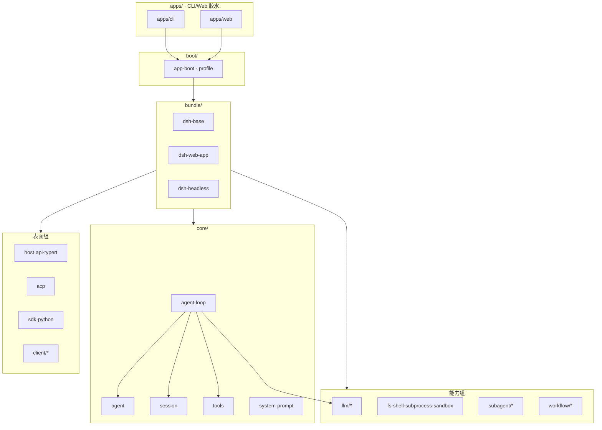
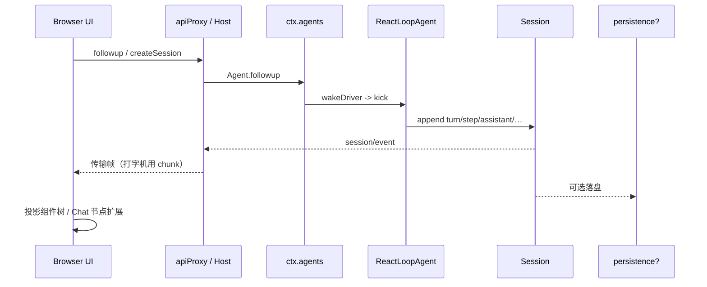
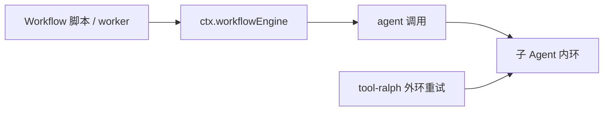
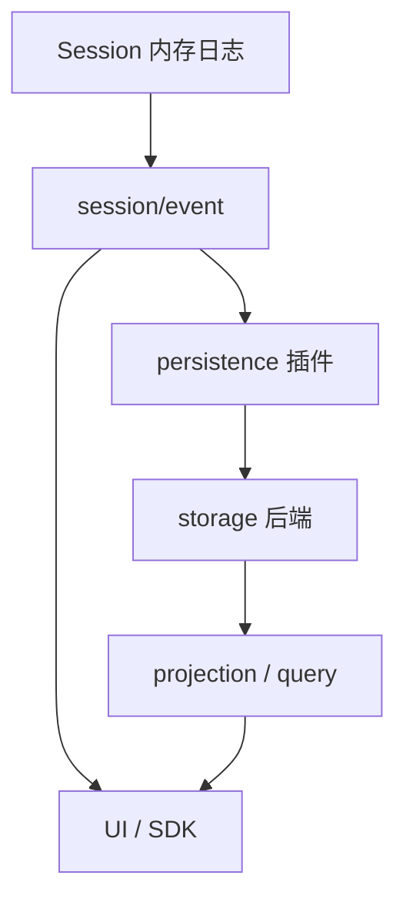
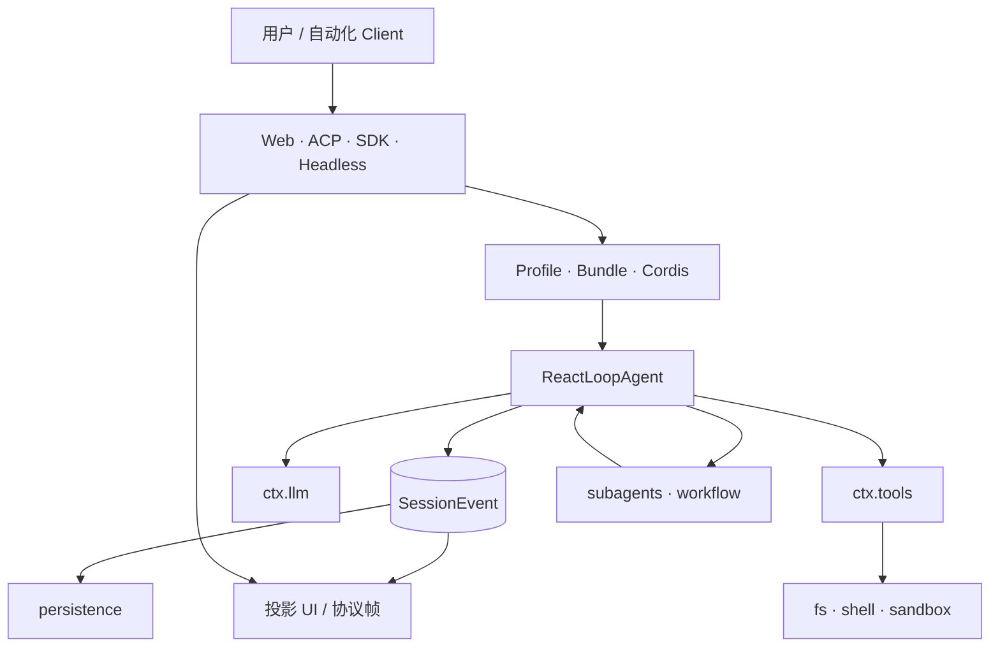

# 第七章 · 产品表面、包地图、持久化与对照

> **阅读顺序第 8 步**（先读 [PART1](./ARCHITECTURE_PART1.md)、[PART2](./ARCHITECTURE_PART2.md)、[00b](./00b-顶层设计与实体边界.md)）  
> **MAF** = Microsoft Agent Framework（对照用，不是本项目依赖）  
> **本卷立场**：表面是投影、持久化是订阅、编排是外环、内核是可替换 Driver + 事件日志。每节含 **实体拥有/不拥有**、**写入归属**、**熟悉对照**、**源码/包引用**；禁止流程图独角戏。

### 本章目录

- [§0 本卷要回答的问题](#0-本卷要回答的问题)
- [§1 Monorepo 包地图与依赖纪律](#1-monorepo-包地图与依赖纪律)
- [§2 Web / Headless / ACP / SDK 表面](#2-web--headless--acp--sdk-表面)
- [§3 Workflow / Ralph 外环](#3-workflow--ralph-外环)
- [§4 持久化：谁订阅 session/event](#4-持久化谁订阅-sessionevent)
- [§5 Query / Projection / Title](#5-query--projection--title)
- [§6 API / Typert / Host](#6-api--typert--host)
- [§7 与 MAF 对照（加厚）](#7-与-maf-对照加厚)
- [§8 与 Penguin / Pi 实体对照](#8-与-penguin--pi-实体对照)
- [§9 扩展食谱](#9-扩展食谱)
- [§10 工程门禁与文档体系](#10-工程门禁与文档体系)
- [§11 E2E 总图与场景走查](#11-e2e-总图与场景走查)
- [§12 与 00b 对齐的改代码决策树](#12-与-00b-对齐的改代码决策树)
- [§13 包组速查](#13-包组速查扩展用)
- [§14 工作示例：只读审计表面](#14-工作示例新增只读审计表面)
- [§15 工作示例：JSONL→SQLite](#15-工作示例把-jsonl-换成-sqlite)
- [§16 Bundle 与 Profile](#16-bundle-家族与-profile-配方表面组装细讲)
- [§17 Factory 槽](#17-factory-槽与loop-是插件)
- [§18 Persistence 协调器](#18-persistence-协调器行为运维向)
- [§19 MAF Hosting](#19-maf-hosting-vs-dsh-多表面再厚一层)
- [§20 Penguin/Pi 选型](#20-penguin--pi-选型附录)
- [§21 工程门禁跑什么](#21-工程门禁改表面--改持久化时跑什么)
- [§22 反模式画廊](#22-反模式画廊本卷)
- [§23 与 PART2 分工](#23-与-part2-的分工避免重复劳动)
- [§23b deriveMessages 投影锚](#23b-derivemessages读模型如何从表面投影本卷补锚)
- [§24 本卷小结](#24-本卷小结)

---

## §0 本卷要回答的问题

1. 从 `dsh` 进程到浏览器画面，会话事件怎么走？谁持有真相？  
2. 包组如何分层？谁允许依赖谁？为何 caps 不能反向依赖 UI？  
3. Workflow 里的 `agent()` 和内层 Turn/Step 是什么关系？Ralph 呢？  
4. 为什么「写磁盘」故意不写在 Session 类里面？谁订阅 `session/event`？  
5. Query / Projection / Title 与真源如何正交？  
6. 和 Microsoft Agent Framework、Penguin、Pi 比，**该借鉴什么、不该照搬什么**？  
7. 扩展新表面 / 新持久化后端 / 新循环时，工程门禁卡住什么？

---

## §1 Monorepo 包地图与依赖纪律

### 1.1 物理布局 → 逻辑层

路径约定：`packages/<group>/<pkg>/` → npm `@deepseek-ai/dsh-<pkg>`。组 README 拥有组内包/ctx 键地图；总表见 [packages/README.md](../packages/README.md)。生成依赖图：[docs/module-graph.zh.md](../docs/module-graph.zh.md)。



### 1.2 组职责总表（拥有 / 不拥有）

| 组 | 拥有 | 不拥有 |
|----|------|--------|
| **core/** | Session、Agent 句柄、默认 Loop、tools、system-prompt | 具体 Web 组件、具体厂商 HTTP |
| **bundle/** | 可安装 Patch 层（profile 料包） | Turn 算法正文 |
| **boot/** | Profile 启动胶水 | 业务工具实现 |
| **llm/** | LLM seam 家族 | Session 真源 |
| **fs/shell/subprocess/sandbox/terminal/lsp** | 执行世界相关 seams | 审批文案（interaction） |
| **skill/compaction/spill/web/…** | 各能力三人组 | agent-loop 私有文件 |
| **subagent/workflow/goal/jobs/todo/plan** | 委派与外环 | 第二套 messages[] |
| **session/**（durable） | persistence、projection、title、telemetry | Session 类本身（在 core） |
| **session-query/** | 只读检索/搜索 | append |
| **interaction/** | approval、ask-user、commands、permission | 沙箱后端 |
| **host/client/api/typert** | Web 网关与浏览器半 | Driver while |
| **acp/sdk** | 协议表面 | 换 Loop 语义 |
| **hooks/extensions** | 外部桥、自省挂载 | 旁路日志 |
| **test-support/util/examples** | 测试与零依赖工具 | 产品默认行为承诺（support 更低） |

### 1.3 依赖纪律（架构硬约束）

| 允许 | 禁止 |
|------|------|
| Bundle 组合 core + caps + surface 插件行 | caps **反向**依赖某个 UI / client 包 |
| Consumer / UI **订阅** `session/event` | surface **直接 mutate** Session 内部数组 |
| 扩展插件依赖 **Service Definition** | 扩展插件依赖 **具体 Provider** 包（组装 Bundle 除外） |
| 新能力完整 Seam（三人组） | 业务包 `import` agent-loop **私有**源文件 |
| `dsh-agent` 作为可替换 Loop 的稳定面 | UI 写死 `ReactLoopAgent` 类型 |

根约定原话（意译）：**Extension plugins depend on Service Definitions, never concrete providers.** `dsh-agent-loop` is swappable；UI/hook/tool 用 `dsh-agent`。

### 1.4 写入归属（包边界视角）

| 写什么 | 允许写入的包角色 |
|--------|------------------|
| SessionEvent | Driver、工具流水线、明确拥有会话词汇的能力（approval/compaction/inbox…） |
| 磁盘会话日志 | **persistence Provider**（订事件） |
| 浏览器 DOM / React state | client 包（投影，可丢） |
| Provider 注册 | Definition + Provider `apply` |
| Patch 行表 | Bundle / Profile / Home / CLI——不是运行时业务代码 |

### 1.5 熟悉对照

| | DSH monorepo | 典型「单包 Agent」 | MAF |
|--|--------------|-------------------|-----|
| 组装 | Profile/Bundle/Patch | 一个 App 配置 | Hosting + DI 注册 |
| 能力边界 | 显式 Seam 包三角 | 常揉进 core | ContextProvider / Tools |
| UI | client 组可 HMR | 常绑死 | Hosting 另层 |

### 1.6 本节小结

> 组边界 = 所有权边界。Bundle 组装；Definition 定契约；Provider 可换；Surface 只投影。打破依赖箭头，比加一个功能更贵。

---

## §2 Web / Headless / ACP / SDK 表面

### 2.1 表面对照

| 表面 | 入口直觉 | 循环是否同一套 | 长驻？ |
|------|----------|----------------|--------|
| **Web** | `--profile web` / `:3080` | 是 | 是（服务器 + 浏览器） |
| **Headless** | `--profile headless "task"` | 是 | 否（跑完退出） |
| **ACP** | `dsh-acp` / demo | 是（协议桥） | 依宿主 |
| **JSON-RPC / TS SDK** | `dsh-sdk` | 是 | 依部署 |
| **Python SDK** | `python/sdk` | 是（连同一运行时） | 依部署 |

**架构点**：产品面差在 **Profile/Bundle 组装与传输**，不差在「再抄一套 while」。

### 2.2 实体表（表面层）

| 实体 | 拥有 | 不拥有 |
|------|------|--------|
| **Profile** | 启动配方：bundles 顺序 + 本档 Patch | Bundle 源码、Loop 算法 |
| **Web Host / apiProxy** | HTTP/WS 分派到 ctx 服务 | Session 内部存储结构 |
| **Browser UI** | 投影与交互手势 | 真相（刷新应能重建） |
| **ACP Server** | Agent Client Protocol 映射 | 私有第二日志 |
| **SDK Server/Client** | JSON-RPC 协议与句柄 | 厂商模型协议（仍走 llm） |
| **Headless bin** | 一次性任务驱动与退出码 | 长驻 UI 状态 |

### 2.3 Web：从 followup 到 UI（投影链）



**写入归属**：

| 步骤 | 写哪里 |
|------|--------|
| 用户发送 | 经 Agent API → Inbox splice（Session 事件）→ 后 claim 成 user/message |
| 模型流式 | `assistant/chunk` → 传输帧 |
| 持久化 | persistence 订同一 `session/event` |
| UI state | 可丢；权威在日志 |

浏览器 **不持有真相**。重连/刷新：从持久化或内存日志重建，不信任前端 React state。

### 2.4 ACP / SDK

```text
外部 Client
  → ACP 或 JSON-RPC
  → 映射为 agents/sessions 操作
  → 同一套 session/event 订阅
  → 审批可桥到 Client 的 permission 通道
```

| | ACP | SDK |
|--|-----|-----|
| 受众 | 自动化 / IDE 协议 | 程序化嵌入 |
| 审批 | 桥到协议 permission | 桥到 RPC / 回调 |
| 真源 | 仍是 SessionEvent | 同左 |

### 2.5 Headless

无长驻服务器；跑完任务进程退出；仍写同一事件词汇（若启用 persistence）。适合 CI、脚本、`pnpm dsh --profile headless "task"`。

### 2.6 熟悉对照

| | DSH 多表面 | Penguin | MAF Hosting |
|--|-----------|---------|-------------|
| 共用内核 | Profile 换 Bundle | 常单产品面 | SessionStore + API |
| 传输 | Host/Typert/ACP/SDK | Web/SDK 产品内 | HTTP 多实例 |
| 真相 | Session 事件 | Trace / OmniMessage | AgentSession.state + History |

### 2.7 本节小结

> 表面 = 投影 + 传输。换表面换 Profile/桥，不换 Driver 真理。

---

## §3 Workflow / Ralph 外环

### 3.1 定位



Workflow **不是**第二个 Turn/Step 实现；它是编排层：何时 `agent()`、如何扇出、如何汇合。底层仍走 `ctx.subagents` / `ctx.agents` 创建路径。Ralph：面向「整段工作再试」的工具化外环。

### 3.2 实体表

| 实体 | 拥有 | 不拥有 |
|------|------|--------|
| **`ctx.workflowEngine`** | 脚本执行契约、请求校验 | BlockAssembler、deriveMessages |
| **workflow-worker-thread** | Worker 中跑脚本；经宿主调 `SubagentRuntime.start` | 父 Session 私改 |
| **`tool-workflow`** | 模型入口 | 自造 Loop |
| **`tool-ralph`** | 重试外环策略工具 | 替换 kick/turn |
| **内环** | Turn/Step | 跨任务 DAG 哲学 |

Worker 宿主侧会捕获 `SubagentRun`（见 `workflow-worker-thread` host）：编排拥有「何时 start」，一次性 run 的 dispose 纪律仍遵守 PART2 §6。

### 3.3 写入归属

| 应该 | 不应该 |
|------|--------|
| 用正式 API 启停子 agent | 在 workflow 包内复制 Loop / Assembler |
| 失败写回可观察事件 / 工具结果 | 只打 console 当状态 |
| 脚本与宿主取消信号贯通 | 忽略 signal 泄漏子进程 |

### 3.4 熟悉对照

| | DSH | MAF Workflow | Penguin Goal |
|--|-----|--------------|--------------|
| 图/脚本 | workflow 脚本 + worker | Workflow Builder / Executor | Goal 产品模式 |
| Superstep | **不要**抄进 agent.ts | 图节点推进 | — |
| 与单 agent | 外环调用内环 | 可嵌 Agent 节点 | 外策略 |

### 3.5 本节小结

> Workflow/Ralph = 再进入内环的编排。结果进 Session/工具结果；禁止旁路日志。

---

## §4 持久化：谁订阅 session/event

### 4.1 正交切分（核心图）



### 4.2 实体表

| 组件 | 拥有 | 不拥有 |
|------|------|--------|
| **`Session`（core）** | append / derive / surface / requestHeader——**不** `fopen` | 磁盘路径格式、批次策略 |
| **`ctx.sessionPersistence`** | 持久化 seam API：create/append/load/prepare/inspect… | 具体 JSONL vs SQLite 细节（Provider） |
| **PersistenceCoordinator** | 每 id 串行写入、批窗、崩溃 closer、flush 屏障 | UI 帧 |
| **JSONL / SQLite Provider** | 存储原语实现 | Session 类 API 形状 |
| **实时订阅方** | UI/SDK/ACP：订 `session/event` 做投影 | 擅自 truncate 日志中段 |

权威： [packages/session/session-persistence/README.zh.md](../packages/session/session-persistence/README.zh.md)。

### 4.3 为何 Session 不写文件

| 理由 | 说明 |
|------|------|
| **可测** | 纯内存 Session 跑 Loop；测试不碰磁盘 |
| **可换后端** | 桌面 sqlite、CI 关 persistence、服务端对象存储——Loop 零改 |
| **单一真源形状** | 磁盘只是事件流的一种投影；没有并行「持久消息」类型 |
| **崩溃语义集中** | closer / 撕裂尾 / 批处理在 coordinator，不散落 Driver |

**公理回顾**：持久化单元就是现有 `SessionEvent`（事件溯源）。Header（cwd、delegationDepth、origin…）单独传输，归 `dsh-session`。

### 4.4 写入归属（端到端）

| 阶段 | 谁写 | 写什么 |
|------|------|--------|
| 运行中 | Driver/工具/能力 | 内存 Session.append → 发 `session/event` |
| 订阅 | Persistence coordinator | 复制事件入批次 → 后端 `appendBatch` |
| flush | 显式 `session/flush` / dispose 屏障 | 排空待写 |
| 恢复 load | Provider + coordinator | 读存储；冷崩溃可 **追加** 合成 closer（不重写已 flush 中段） |
| 禁止 | 任意包 | 改写已 flush 事件；UI 当权威 |

### 4.5 磁盘格式警告

开发者预览：**无长期兼容承诺**。`SESSION_FORMAT_VERSION` 现为 `0`。业务不要 hardcode 字段偏移；工具链/迁移看官方 persistence 文档与 Agent Notes。未知事件类型默认拒绝，除非信封 `ignorable: true`。

### 4.6 熟悉对照

| | DSH | MAF | Pi / Penguin |
|--|-----|-----|--------------|
| 谁落盘 | persistence 订事件 | HistoryProvider / SessionStore 你方托管 | Session JSONL / Trace |
| 运行时真源 | 内存事件日志 | session.state + History | 常 messages[] 或 Entry 树 |
| 崩溃 | 合成 closer 平衡日志 | 依实现 | 依 harness |

### 4.7 本节小结

> Session 只追加；Persistence 订阅；后端可换。写磁盘不进 Session 类——这是可测性与可替换性的同一枚硬币。

---

## §5 Query / Projection / Title

### 5.1 三者与真源的关系

| 机制 | 读还是写 | 拥有 | 不拥有 |
|------|----------|------|--------|
| **Session 日志** | 写（append-only）+ 投影 derive | 真相 | 搜索索引 |
| **`ctx.sessionProjections`** | 由事件折叠出视图 | 注册单元（todos、subagentTiming…） | 替代日志 |
| **`ctx.sessionQuery`** | 只读检索、血缘、过滤、FTS | 查询家族 | append |
| **`ctx.sessionTitle`** | 由日志派生标题 | title 策略 Provider | 改历史事件 |

### 5.2 Projection 写入归属

Projection **不写真相**：它 `apply` 事件流得到可序列化视图，经 history 尾页 / `session/projection` 推送帧给载体。例：`tool-todo` 注册 `todos` 单元——`todo/write` 更新表，`turn/start` 清空等（见 todo README）。未挂载注册表的组合不受影响。

### 5.3 Query

session-query 组：逻辑语料、有界读、血缘、事件关系、语义过滤、SQLite FTS 等。**只读**。UI「会话列表/搜索」应走 query，而不是扫 UI 内存。

### 5.4 Title

标题由日志支撑的策略生成（first-prompt LLM、all-prompts LLM 等 Provider）。标题是派生数据：丢了可重建；不可反向当 transcript。

### 5.5 熟悉对照

| | DSH | MAF | CQRS 直觉 |
|--|-----|-----|-----------|
| 命令侧 | Session.append | History save / memory write | Command |
| 查询侧 | query + projection | 读 session.state / 外部店 | Query |
| 风险 | 查询当真相 | History 与 Memory 双写漂移 | 双写 |

### 5.6 本节小结

> Projection/Query/Title = 读模型。写模型只有事件日志（经 Session API）。

---

## §6 API / Typert / Host

### 6.1 分层

```text
浏览器 API 调用
  → Host 网关（与传输无关的分派）
  → Typert 类型化边界
  → 落到 ctx 服务方法（agents/sessions/…）
```

| 实体 | 拥有 | 不拥有 |
|------|------|--------|
| **Host / apiProxy** | 路由注册、分派稳定面 | LLM 厂商细节 |
| **Typert** | 类型图生成、加载、运行时注册、网关 | 业务策略 |
| **clientModules / HMR** | 浏览器插件图 | Loop while |
| **Chat 节点扩展** | UI 呈现 | Session 公理 |

Host 的价值：**传输可换**（HTTP/WS），业务分派稳定。扩展 Chat 节点走客户端插件图，不是改 Loop。

### 6.2 写入归属

| 写 | 谁 |
|----|-----|
| 会话事实 | 仍经 Agent/Session（Host 只是门） |
| 客户端模块注册 | client 组合 effect |
| 网关错误 | 传输层；不应伪造 tool/result |

### 6.3 本节小结

> Host/Typert 是门与类型边界；真相仍在 Session。

---

## §7 与 MAF 对照（加厚）

### 7.1 概念映射（勿 1:1 硬译）

| MAF | DSH 近似 | 差异（重要） |
|-----|----------|--------------|
| Agent + Tool Loop | `ReactLoopAgent` + `ctx.tools` | DSH Loop **可整包替换**；默认实现不该被业务 import |
| ContextProvider 管道 | Cordis 插件 + waterfall | DSH 真源在 Session 日志，不在 Provider 链累计 messages |
| HistoryProvider | `deriveMessages` + persistence | History 常是第二存储；DSH 坚持事件为唯一对话真源 |
| AgentSession.state | SessionHeader + 各投影 / 服务状态 | DSH 避免「巨大 state dict 当真源」 |
| Workflow Builder / Executor | `workflowEngine` + Cordis | MAF 图 **superstep ≠** DSH Turn；别把 superstep 抄进 agent.ts |
| Orchestrator（GroupChat 等） | 无单一内置 Orchestrator；subagent/workflow/外环 | 中心路由是 **可选编排**，不是内核 |
| Handoff | subagent / 工具委派 | DSH 所有权模型更硬（发布前后） |
| SessionStore（Hosting） | session-persistence + query | 同「外置状态」思想；事件模型不同 |
| CompactionStrategy | compaction seam + pre-step/error | 都控窗；DSH 与 surface replace 绑定 |
| Middleware | waterfall / serial | 同族；DSH 挂命名事件 |

### 7.2 该从 MAF 借鉴的

- **显式中间件检查点**（DSH 已有：pre-step、request、request-error、turn-stopping、tools/*）  
- **编排与单 agent 循环分离**（DSH：workflow/goal vs agent-loop）  
- **Provider 可测试替换**（DSH：Seam Provider）  
- **Hosting 无状态 API + 外置会话**（DSH：Session + persistence；多实例时同思想）

### 7.3 不该从 MAF 照搬的

- 把 History/Memory 做成与日志 **并行的第二真相**  
- 在 Harness 内核里长出「唯一 Orchestrator」上帝对象  
- 为了图编排 **改写** Turn/Step 语义（应停在外环）  
- 把 `AgentSession.state` 大杂烩当成唯一扩展面（DSH 用声明事件 + ctx 服务）

### 7.4 Memory 对照专节

MAF（见本仓 `agent-framework/docs/ARCHITECTURE_PART2.md` 思路）：Session 状态 / History / 长期 Recall / 单次 run 工作区 / Compaction **分层**。

DSH 对应：

| MAF 层 | DSH |
|--------|-----|
| 对话历史 | SessionEvent 表面 + derive |
| 长期召回 | 未做成与日志并行的第一公民 Memory 模块；可经工具/外部 seam 扩展 |
| 单次 run 工作区 | 一次 kick 内的 phase/Inbox；仍落事件 |
| Compaction | § PART2 Compaction/Spill |
| session.state 分桶 | 投影单元 + 各服务自己的会话事件 |

**借鉴**：分层清晰。**守住**：不要引入第二 transcript。

### 7.5 一句话对照

> **MAF 强在「Agent 工作流图 + Provider 管道」；DSH 强在「插件可逆运行时 + 事件溯源会话 + 可替换 Driver」。**  
> 学 MAF 的编排清晰度；守 DSH 的日志公理与 Seam 纪律。

更细内环：[CORE_RUNTIME.md](./CORE_RUNTIME.md)；MAF 笔记在 `agent-framework/docs/`（若本地有）。

---

## §8 与 Penguin / Pi 实体对照

### 8.1 总表（职责 → 实体）

| 职责 | DSH | Penguin | Pi（agent-core + harness） |
|------|-----|---------|----------------------------|
| 用例入口 | `Agent.followup` + wake | `Session.run` / 产品入口 | `prompt` / `runLoop` |
| 编排内核 | `ReactLoopAgent`（可整包换） | ContextEngine（产品内固定） | `runLoop`（可嵌入） |
| 消息真源 | SessionEvent 日志 | Trace JSONL + OmniMessage | 运行时 `AgentMessage[]`；Session Entry 树在 harness |
| 排队 | Inbox splice/claim（也是事件） | steer / carry-over（非事件 Inbox） | steering / followUp **内存队列** |
| 组装 | Profile/Bundle/Cordis | createAgent + 文件 Skill | 代码组装 + Extensions |
| 审批 | tools waterfall / approval 服务 | ApproveFn | 回调 / streamingBehavior |
| 副作用 | 成对执行世界 seams | Environment | 工具实现 |
| 扩展 Skills | `ctx.skills` + tool-skill | `SKILL.md` 目录 | 依 coding-agent |
| 压缩 | surface replace + compaction 事件 | 产品策略 | Entry `compaction` + retainedTail |

### 8.2 Pi 专项（与 [05](./05-对照-Pi-与-DSH.md) 对齐）

| Pi | DSH |
|----|-----|
| turn（LLM+tools） | **Step** |
| 一次 `prompt` 整段 run | 一次 `kick`（可多 Turn） |
| steering 队列 | next-step（持久事件；不 wake 的是 inject） |
| 无「唤醒」 | idle → wakeDriver |
| `messages.push` | `session.append` |
| `convertToLlm` / 内存上下文 | `deriveMessages` |

**同名陷阱**：Pi `followUp` ≠ DSH `followup`；详见 05 与 GLOSSARY。

### 8.3 Penguin 专项

| Penguin | DSH |
|---------|-----|
| 无 Cordis 插件树 | 一切皆插件（含 Loop） |
| Skill 文件即扩展主路径 | Skill seam **之一**；工具/Provider 同等重要 |
| Environment 聚合副作用 | 拆 fs/shell/subprocess/sandbox |
| Goal 产品外环 | goal/ralph/workflow 外环家族 |

选 DSH = 买平台灵活（多表面、可换 Loop、可换世界）。选 Penguin = 买更短路径的产品心智（Skill+Environment）。

### 8.4 写入归属对照（防串台）

| 动作 | DSH 写哪 | 串台成 Penguin/Pi 时的错法 |
|------|----------|---------------------------|
| 用户新话 | Inbox 事件 → claim → user/message | 只推进内存 messages |
| 排队 | `agent/inbox/spliced` | 纯内存 list 当可回放真相 |
| 压缩 | surface replace 事件 | 只改内存数组不记账 |
| 落盘 | persistence 订阅 | Session 类直接写文件 |

### 8.5 本节小结

> 对照表用于选型与阅读源码，不用于「把别家类名 paste 进 DSH」。实体边界以 [00b](./00b-顶层设计与实体边界.md) 为准。

---

## §9 扩展食谱

| 场景 | 路径 | 先读 |
|------|------|------|
| 新工具 | `dsh-tools` 注册 + 必要 waterfall；勿改 loop | cookbook/adding-a-tool |
| 新模型厂 | `ctx.llm` Provider | llm 组 README |
| 新沙箱世界 | **成对** FS + Subprocess Provider + policy + Bundle | PART2 §3 |
| 新委派传输 | `SubagentProvider` + tool-subagent 配置 | subagent README |
| 新 Skill 源 | `ctx.skills.registerProvider` | skill README |
| 新 UI 块 | web clientModules / Chat 节点 | client 组 |
| 新循环算法 | 新 AgentLoop factory + lifecycle 文档 | architecture.md |
| 新产品面 | 新 profile + bundle，复用 base | PART1 §3 |
| 新持久化后端 | 实现 persistence Provider / backend 钩子 | session-persistence README |
| 新投影 | `sessionProjections.register` | projection 包 |
| 外环重试 | ralph / goal / workflow，不改 turn | PART2 §7 |
| Hooks 桥 | hooks 组适配到 waterfall | hooks README |

决策树：PART1 §9、PART2 §9、本卷 §12。

---

## §10 工程门禁与文档体系

| 机制 | 作用 |
|------|------|
| `verify-cordis-config` | bare 插件名 ∈ dependencies |
| 生成 Cordis / tool / persistence 目录 | 声明与调用交叉检查 |
| `doc-sync` / 双语配对 | 官方 docs 字数与翻译门禁 |
| `verify-doc-budgets` | 站立文档天花板（**doc-sn 不进**） |
| Agent Notes | 决策 why；扩展前必读相关 Notes |
| `test:coverage` | CI 覆盖率门（非普通 `test`） |
| snapshot / e2e | 组装应用可见行为；无 key 可 skip e2e |
| package invariants | 每包 `./invariant` 注册 |

**doc-sn** 是学习向说明书：可厚写；**改行为**仍以官方 docs + Notes + 测试为准。

### 10.1 熟悉对照

| | DSH | 普通开源库 |
|--|-----|------------|
| 配置门禁 | cord-cordis-config 等 | 常靠人工 |
| 文档 | 生成目录 + 预算 + 双语 | README 为主 |
| 预览阶段 | 格式可破；foundation over blast radius | 常强兼容 |

---

## §11 E2E 总图与场景走查

### 11.1 全仓总图



### 11.2 场景 A · Web 用户发一句话

1. UI → Host → `Agent.followup`  
2. Inbox splice（事件已存在）→ wake → kick  
3. claim → pre-step → append user → LLM stream → chunks  
4. `session/event` → 打字机；可选 persistence 批写  
5. 工具则 tools waterfall → 执行世界 → tool/result  

写入清单见 [00 §2](./00-流程与概念对照.md)。

### 11.3 场景 B · Headless CI 任务

1. `--profile headless` 组装（无 web client bundle）  
2. 同一 Loop；任务结束进程退出  
3. 若挂 persistence：磁盘留日志供失败复盘  

### 11.4 场景 C · Workflow 扇出子 Agent

1. 模型或脚本触发 workflow  
2. worker/host → `subagents.start`  
3. 子 Session 独立事件；结果回父工具/编排  
4. 禁止在 worker 里维护「汇总 messages」当真源  

### 11.5 场景 D · 刷新浏览器

1. UI 状态丢弃  
2. 从 persistence / 内存 store 加载事件  
3. derive / projection 重建视图  
4. 若仍持有 Agent：可继续订阅 live 事件  

### 11.6 本节小结

> 四条场景共用同一内核公理；差在组装与订阅方。

---

## §12 与 00b 对齐的改代码决策树

```text
改组装面 / 开关插件           → Patch / Bundle / Profile
改一步是否进模型             → agent/pre-step
改工具审批                   → tools/* 或 approval
改循环哲学                   → 新 agent-loop（setFactory），勿在业务抄 while
改历史投影                   → Session surface / derive，勿第二 messages[]
改沙箱                       → fs+subprocess 成对
改落盘格式 / 后端            → persistence Provider；不动 Session 公理
改会话列表 / 搜索            → session-query；不扫 UI state
改标题策略                   → session-title Provider
改 Web 呈现                  → clientModules；不改 Driver
改协议表面                   → acp / sdk 映射层
改外环编排                   → workflow / goal / ralph
```

**00b 非目标提醒**：不要把 Turn/claim 拆成热插拔小插件；默认算法在 `ReactLoopAgent`；插件是 **整包 Driver**。

---

## §13 包组速查（扩展用）

| 你想动… | 先打开组 |
|---------|----------|
| 循环 / 会话 / 工具注册 | `packages/core` |
| 模型 | `packages/llm` |
| 文件/bash/沙箱 | `fs` `shell` `subprocess` `sandbox` |
| 技能 | `skill` |
| 压缩/外溢 | `compaction` `spill` |
| 子代理 | `subagent` |
| 工作流 | `workflow` |
| 人机 | `interaction` |
| 落盘/投影/标题 | `session`（durable）`session-query` |
| Web | `host` `client` `boot` `bundle` |
| 协议 | `acp` `sdk` |
| 门禁/测试夹具 | `test-support` `scripts` |

---

## §14 工作示例：新增「只读审计表面」

目标：外部系统只订阅事件、不发 followup。

| 步骤 | 做 | 不做 |
|------|----|------|
| 1 | 新小包订 `session/event`，过滤后写出 | 改 ReactLoopAgent |
| 2 | Bundle 可选挂载 | 让 caps 依赖该审计 UI |
| 3 | 测试：append 一条 → 审计看到 | mock 私有 Driver 字段 |
| 4 | 文档：声明延迟、失败隔离 | 审计失败阻断 turn（除非产品明确要求） |

这示范 **Surface 只投影** 的扩展方式。

---

## §15 工作示例：把 JSONL 换成 SQLite

| 步骤 | 做 |
|------|----|
| 1 | 使用/实现 `session-persistence-sqlite` Provider |
| 2 | Bundle 换 persistence 行；Definition API 不变 |
| 3 | 跑恢复 / inspect / listSnapshots 契约测试 |
| 4 | 确认 Loop 与 UI **零改** |

证明：Session 不写文件这一刀，值回票价。

---

## §16 Bundle 家族与 Profile 配方（表面组装细讲）

### 16.1 Bundle 实体表

| 实体 | 拥有 | 不拥有 |
|------|------|--------|
| **`dsh-base`** | 几乎每个 profile 最先叠的核心 patch | Web Host、一次性 runner 专属 |
| **`dsh-web-app`** | 浏览器表层 patch + 运行时粘合 | Headless 退出语义 |
| **`dsh-headless`** | 一次性任务 runner 挂载 | Host / Web 层 |
| **树外 Bundle** | 用户 `plugin add` 进 profile 的料包 | 改 core 源码的权利 |

权威：[packages/bundle/README.zh.md](../packages/bundle/README.zh.md)。

### 16.2 写入归属（组装时，非运行时）

| 写什么 | 谁 | 何时 |
|--------|-----|------|
| Patch YAML | Bundle 作者 / Profile 维护者 / Home / CLI `--patch` | 启动前 |
| 最终插件 Entry 表 | Loader compose | 启动时 |
| 运行时 Session | Driver 等 | 启动后 |

**熟悉对照**：Patch ≈ 多层 `application-*.yml`；Bundle ≈ Spring Boot Starter；Profile ≈ 激活哪套依赖的菜单。不是 git diff，也不是运行时 messages。

### 16.3 典型配方差在哪

| Profile 直觉 | 多出来的层 | 仍然共用 |
|--------------|------------|----------|
| web | web-app、host、client… | base → core loop / session / tools |
| headless | headless-runner | 同左 |
| 自定义 | 你的 bundle | 同左 |

这直接回答「产品面差在哪一层，循环差在哪一层」：**差在组装；循环同一套。**

---

## §17 Factory 槽与「Loop 是插件」

### 17.1 实体表

| 实体 | 拥有 | 不拥有 |
|------|------|--------|
| **`ctx.agents` / AgentRegistry** | 活 Agent 表、**唯一 Factory 槽** | React 循环正文 |
| **`dsh-agent-loop` 插件** | `setFactory` 注册、创建 `ReactLoopAgent` | 强制永远用这一种算法（可被整包替换） |
| **`Agent` API** | followup/steer/inject/cancel 契约 | 必须是 ReactLoopAgent 类型 |

`setFactory` 契约（唯一槽、effect 可逆）：

```360:381:packages/core/agent/src/index.ts
  /**
   * Register the agent-creation factory (the loop calls this on construction,
   * effect-scoped). ...
   * Throws if a factory is already registered. Returns the disposer; on
   * dispose the factory slot is cleared.
   */
  setFactory(factory: AgentFactory): () => void {
    const dispose = this.ctx.effect(() => {
      if (this.factory !== undefined) throw new Error('an agent factory is already registered')
      const target = (factory as AgentFactory & { [symbols.original]?: AgentFactory })[symbols.original] ?? factory
      this.factory = { target }
      return () => { this.factory = undefined }
    }, 'agents.setFactory()')
```

### 17.2 「Loop 是插件」≠「每一步是小插件」

| 正确理解 | 错误理解 |
|----------|----------|
| 整包 agent-loop 可经 Patch 卸掉并换 factory | 把 claim/LLM/tools 拆成热插拔积木 |
| 策略挂 waterfall | 业务 fork `agent.ts` 抄 while |
| UI 依赖 `dsh-agent` | UI import `ReactLoopAgent` 私有路径 |

与 00b「固定算法 vs 插件扩展」表一致。

### 17.3 写入归属

| 写 | 谁 |
|----|-----|
| factory 槽 | loop 插件 effect |
| Agent 实例与其 Session | factory create/resume |
| 卸载撤销 | disposer（HMR / 卸插件） |

---

## §18 Persistence 协调器行为（运维向）

### 18.1 必须遵守的不变量（摘自官方 README）

- **仅追加**；崩溃轮次用合成 closer **关闭**，不截断已 flush 中段。  
- **连续 seq**；append 批次首 seq == 已存储 next-seq。  
- **JSON 可序列化**；非 JSON 可序列化数据拒绝。  
- **`append` 返回 ⇒ 批次已持久**（对该后端语义）。

### 18.2 谁订阅什么

| 订阅 / 调用 | 角色 |
|-------------|------|
| `session/event` | coordinator 复制入批；UI/协议做 live 投影 |
| `session/flush` | 排空屏障；dispose / 显式检查点 |
| `session/disposed` | 释放 per-id 写入状态 |
| `load` / `prepare` / `inspect` | 恢复与冷读路径 |

### 18.3 写入归属再强调

| 禁止 | 原因 |
|------|------|
| Session 类 `fs.writeFile` | 破坏可测与可换后端 |
| UI 改 seq / 删中段事件 | 破坏回放与工具配对 |
| 业务「优化」重写历史 | 应用 compaction 的正式 replace，而不是私改存储 |

### 18.4 熟悉对照

| | DSH persistence | 数据库 WAL | 聊天 App 本地 DB |
|--|-----------------|------------|------------------|
| 追加 | 事件批次 | WAL 记录 | 常更新行 |
| 崩溃 | closer 平衡 | 恢复未完成事务 | 依实现 |
| 真源 | 事件流 | 页+WAL | 常「当前行」 |

---

## §19 MAF Hosting vs DSH 多表面（再厚一层）

### 19.1 相似点

- 都希望 **API 无状态**、会话外置。  
- 都需要多客户端（HTTP、自动化）打到同一 agent 运行时。  
- 都区分「单 agent 循环」与「编排/工作流」。

### 19.2 不同点（落地）

| 维度 | MAF Hosting 直觉 | DSH |
|------|------------------|-----|
| 会话载体 | `AgentSession` + SessionStore | `Session` 事件 + persistence |
| 扩展挂载 | ContextProvider 列表 | Cordis 插件树 + Profile |
| 多产品面 | 常一个 Hosting 服务 | 多个 Profile 配方 |
| 热更新 | 依部署 | fiber/effect 可逆（含 HMR 场景） |

### 19.3 迁移心智（若你从 MAF 来）

1. 别找 HistoryProvider 挂第二列表——改订 Session 事件 / derive。  
2. 别把 Workflow superstep 揉进 Turn——放 workflow/ralph。  
3. 中间件 ≈ waterfall，但挂 **命名事件**，不是全局一条匿名链。  
4. Handoff ≈ subagent，但先读所有权与 depth。

---

## §20 Penguin / Pi 选型附录

### 20.1 什么时候别用 DSH 心智硬套

| 你在做… | 更贴 |
|---------|------|
| 单产品、Skill 文件驱动、少表面 | Penguin 式短路径 |
| 嵌入最小 loop 到已有 App | Pi agent-core |
| 多表面、可换世界、可换 Driver、要审计回放 | **DSH** |

### 20.2 同名词速查（再贴一次）

| 词 | DSH | 别家常见 |
|----|-----|----------|
| followup | next-turn + 可 wake | Pi followUp ≈ 将结束再开外层 |
| turn | 大边界 | Pi turn ≈ DSH Step |
| session | 事件日志对象 | 常「聊天线程」或 Entry 树 |
| plugin | Cordis 插件 | VS Code / Claude 扩展 |

---

## §21 工程门禁：改表面 / 改持久化时跑什么

| 改动类型 | 最小本地证据（直觉） |
|----------|----------------------|
| 新工具 / 模型可见行为 | 包测 + **snapshot**（组装应用） |
| 新 Provider | 单元 + REAL composition 若产品可见 |
| Persistence | 契约测：append/load/inspect/崩溃 closer |
| Profile/Bundle | `verify-cordis-config`、boot smoke |
| 文档 | 官方 docs 走 doc-sync；doc-sn 可厚写但不替代 |
| 类型/导出 | typecheck、export jsdoc 门 |

完整政策：[docs/testing.md](../docs/testing.md)、根 `AGENTS.md`。**不要**默认跑全仓；按 diff 选最小集。

---

## §22 反模式画廊（本卷）

| 反模式 | 为何坏 | 正确 |
|--------|--------|------|
| caps import client | 依赖倒转；无头部署拉 UI | caps 只依赖 Definition |
| UI 持有 messages[] 当真源 | 刷新丢真相 | 订事件 / 从 persistence 重建 |
| Session.writeJsonl | 锁死后端 | persistence 订阅 |
| workflow 内复制 deriveMessages | 双投影漂移 | 调正式 Agent/subagent API |
| 为图编排改 Turn 语义 | 内核腐化 | 外环再 followup |
| 文档只贴 mermaid | 看不出封装 | 实体表 + 写入归属（本卷标准） |

---

## §23 与 PART2 的分工（避免重复劳动）

| 问题 | 去哪卷 |
|------|--------|
| Seam / 执行世界 / Skills / Compaction / Subagent / 审批 | **PART2** |
| 包地图 / 表面 / 持久化订阅 / 对照 / 门禁 / E2E | **本卷 PART3** |
| Cordis / Turn/Step / Session 公理细讲 | **PART1** |
| 逐步发消息写入清单 | **00** |
| 实体边界一页纸 | **00b** |
| Pi 对照深讲 | **05** |

---

## §23b `deriveMessages`：读模型如何从表面投影（本卷补锚）

持久化与 UI 都围绕「事件 → 消息」；Driver 调模型前同样走这条投影，而不是持有可变 `messages[]` 真源：

```726:747:packages/core/session/src/index.ts
  deriveMessages(): Message[] {
    const surface = this.surface
    const nodes = surface.nodes
    const generation = surface.replaceGeneration
    if (generation !== this.derivedGeneration) {
      this.derived = []
      this.derivedNodes = 0
      this.derivedGeneration = generation
    }
    for (const seq of nodes.slice(this.derivedNodes)) {
      const msg = this.deriveEventMessage(this.log[seq]!)
      if (msg) this.derived.push(msg)
    }
    this.derivedNodes = nodes.length
    return [...this.derived]
  }
```

| 事实 | 含义 |
|------|------|
| `replaceGeneration` 变化 | compaction 等 surface replace 会使缓存失效 |
| 返回新数组、元素深冻结 | 调用方不能通过改数组污染日志 |
| 空 content assistant 可派生为 null | 不进 transcript（如仅 usage 的 max-tokens 步） |

**写入归属**：投影本身不写盘；compaction 写 replace 事件后，下一次 `deriveMessages` 自然看到新表面。persistence 存的是事件，不是这份派生数组。

**熟悉对照**：CQRS 查询端；Pi 则是直接读/改内存 `AgentMessage[]`（见 05）。

加厚专题（压缩 JSONL 前后示例、Trajectory、HITL 时序、多框架对照表）：[06-运行时深度专题](./06-运行时深度专题-Memory压缩投影HITL.md)。

---

## §24 本卷小结

> **表面是投影 · 持久化是订阅 · 编排是外环 · 内核是可替换 Driver + 事件日志。**  
> 与 MAF 对照时，映射概念可以，合并真源不行。  
> 与 Penguin/Pi 对照时，认准 Inbox/Session/Loop 语义差，忌同名词。

**本卷实体速查**

| 实体 | 拥有 | 不拥有 |
|------|------|--------|
| Profile/Bundle/Patch | 组装 | Turn 算法 |
| Web/ACP/SDK/Headless | 传输与投影 | 第二真相 |
| workflow/ralph | 外环再进入 | 内环语义 |
| Session | 内存事件 API | 磁盘 I/O |
| sessionPersistence / coordinator | 落盘契约与批写 | UI |
| Projections/Query/Title | 读模型 | append |
| Host/Typert | 门与类型 | Driver while |
| AgentRegistry factory 槽 | 唯一可换 Driver 入口 | 循环正文本身 |

三卷 + [CORE_RUNTIME.md](./CORE_RUNTIME.md) + [00](./00-流程与概念对照.md) / [00b](./00b-顶层设计与实体边界.md) / [05](./05-对照-Pi-与-DSH.md) / [GLOSSARY](./GLOSSARY.md) 构成 doc-sn 主干。落地改代码前回到官方短文、包 README 与 Agent Notes。

**收束口诀（可贴显示器）**：组装看 Profile；能力看 Seam；策略看 Waterfall；真相看 Session；落盘看订阅；表面只投影；外环再进入；对照可映射，真源不合并。

---

## 附录 · 本卷阅读验收

读完本卷，应能口头回答：

1. Session 类为什么不写文件？谁写？  
2. Web 刷新后真相从哪来？  
3. 换 SQLite 要不要改 Loop？  
4. MAF HistoryProvider 为何不能 1:1 搬进 DSH？  
5. Pi 的 turn 对应 DSH 的哪一层？

---

## 附录 B · 包组 → ctx 键速查（学习向，非生成权威）

> 权威生成图见 [docs/capability-seams.zh.md](../docs/capability-seams.zh.md)。下表只服务「读本卷时建立肌肉记忆」。

| 组 / 代表包 | 典型 `ctx` 键 | 角色直觉 |
|-------------|---------------|----------|
| core/session | `sessions` | 内存 Session 商店 |
| core/agent | `agents` | 注册表 + factory 槽 |
| core/agent-loop | （setFactory） | 默认 Driver |
| core/tools | `tools` | 工具注册与执行流水线 |
| core/system-prompt | `systemPrompt` | 系统提示组装 |
| llm/* | `llm` | 模型适配 |
| fs/* | `fs` | 文件系统世界 |
| shell/* | `shell` | bash 执行 |
| subprocess/* | `subprocess` | 进程原语 |
| sandbox/* | `sandbox` / `sandboxPolicy` | 进程约束与策略 |
| skill/* | `skills` | 技能注册表 |
| compaction/* | `compaction` | 压缩 |
| spill/* | `spillStore` | 大结果外置 |
| subagent/* | `subagents` | 委派 |
| workflow/* | `workflowEngine` | 脚本编排 |
| goal/* | `goals` | 同会话目标 |
| jobs/* | `jobs` | 后台任务 |
| interaction/* | `approval` / `userQuestions` / `commands` | 人机 |
| session persistence | `sessionPersistence` | 落盘 seam |
| session projection | `sessionProjections` | 投影单元 |
| session-query | `sessionQuery` | 只读查询 |
| session-title | `sessionTitle` | 标题 |
| host/api | `apiProxy` / `webServer` 等 | 网关与路由 |
| client | `clientModules` | 浏览器插件图 |
| credentials | `credentials` | 凭据引用 |
| settings | `settings` | 用户设置 |
| storage | `storage` | 非会话存储 |
| workspace | `workspaceRegistry` | 工作区实体 |

**纪律复习**：Consumer 依赖 **键/Definition**，不要依赖表中某一 Provider 包名（除非你在写 Bundle 组装行）。

---

## 附录 C · 从「想加功能」到文件路径（决策 30 秒）

```text
想改模型看到的历史？
  → 先问：是策略还是真源？
     策略 → PART2 pre-step / compaction
     真源 → Session.append 事件类型（新类型要进 SessionEventMap）

想加远程执行？
  → PART2 执行世界成对；本卷 Bundle 换行

想加 IDE 协议？
  → 本卷 ACP/SDK 表面；映射到 agents/sessions，勿抄 Loop

想加「自动重试整段任务」？
  → ralph/goal/workflow；结果仍进 Session

想加「会话列表搜索」？
  → session-query；不要扫 client state

想换默认循环算法？
  → 新 agent-loop 包 + setFactory + 更新官方 lifecycle 文档
```

与 [00b §6](./00b-顶层设计与实体边界.md) 决策树同构；本附录补「落哪个目录」直觉。
