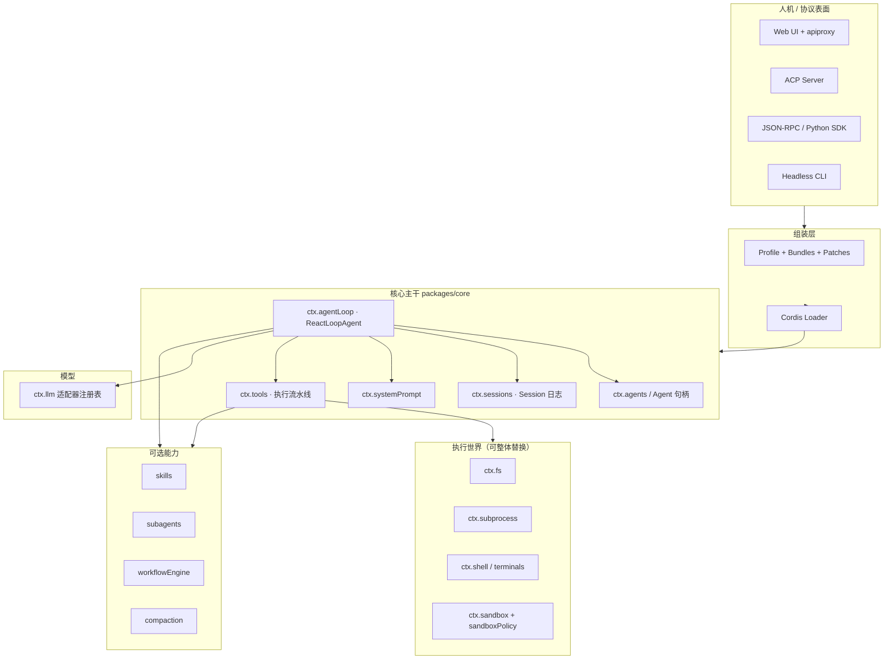
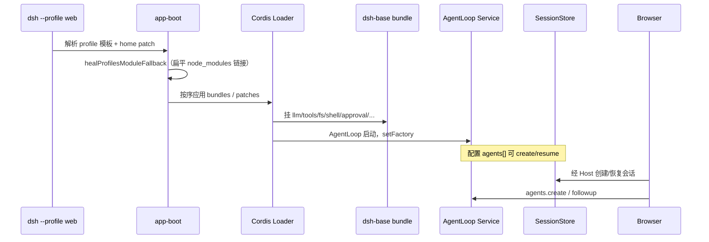
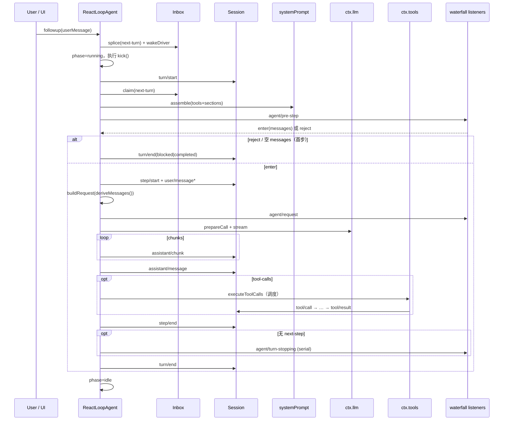
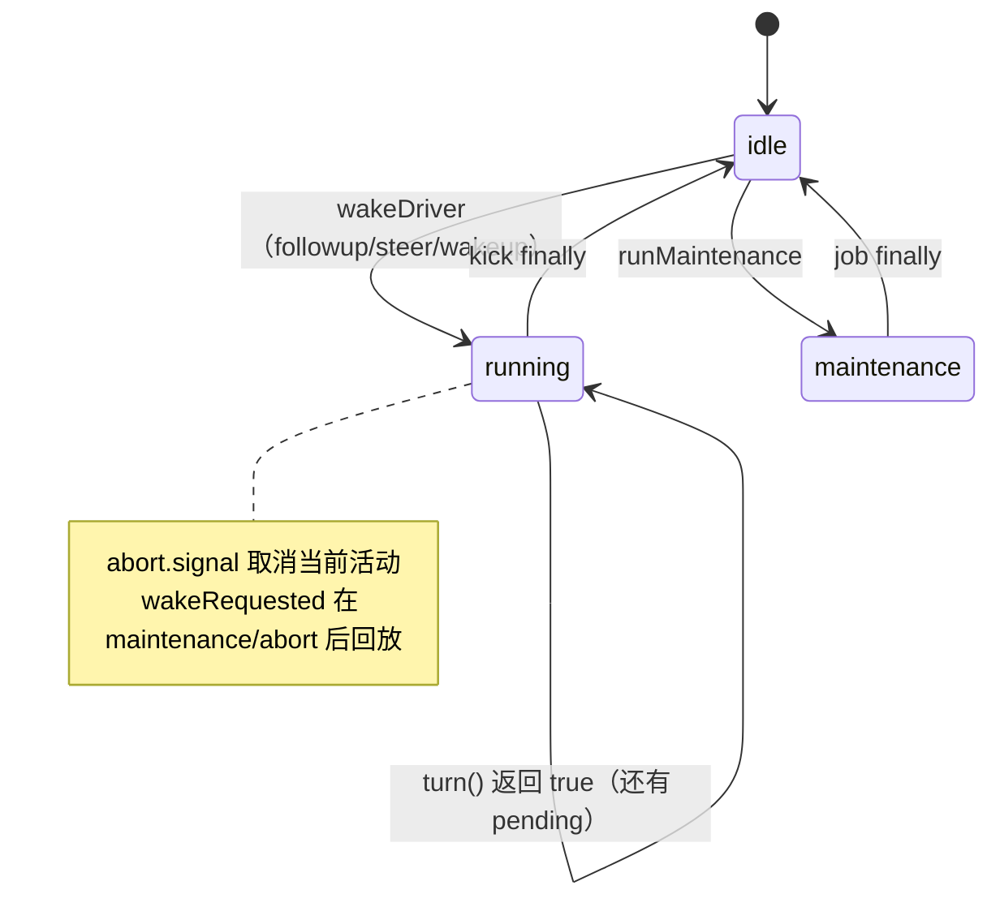
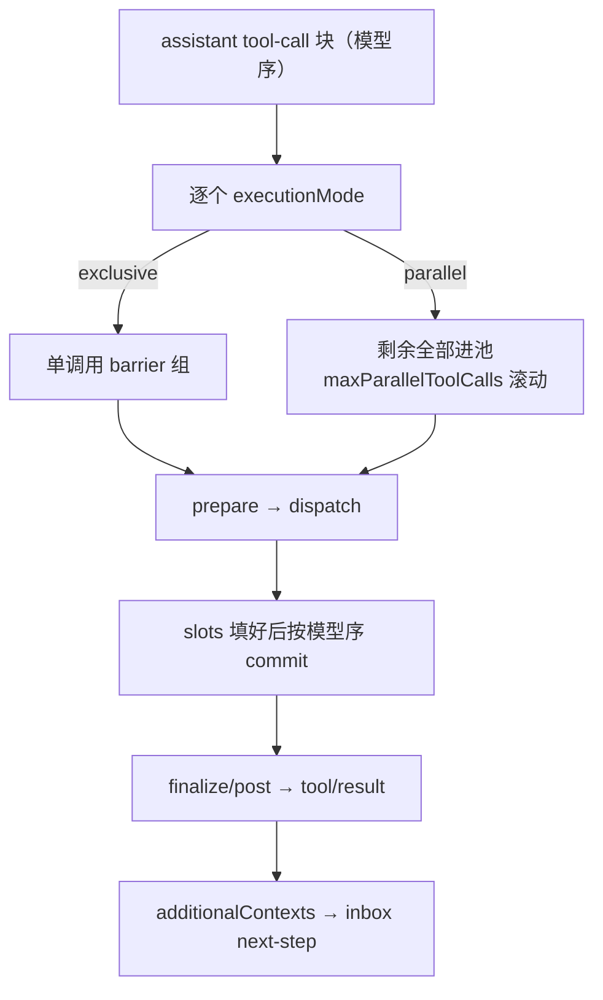

# 进阶速查 · 核心运行时（公理 / 图 / 权衡）

> **不建议作为第一篇阅读。**  
> 正确顺序：[README 目录](./README.md) → [术语表](./GLOSSARY.md) → [01](./01-项目介绍与设计思路.md) → [02](./02-总体架构与端到端.md) → 第三～五章。  
> 本文件是「读完总体后」的浓缩速查；**逐函数源码**见 [source/](./source/README.md)。

---

## 0. 架构思考：这个 Harness 在解决什么问题？

### 0.1 问题陈述

做一个「能写代码、调工具、可扩展」的 Agent，常见失败模式是：

| 失败模式 | 表现 | DSH 的对策 |
|----------|------|------------|
| **特权内核** | Tool Loop 写死在一个巨类里，加能力只能 fork | 一切皆 Cordis 插件；连 `agent-loop` 也可替换 |
| **双份真相** | 内存 messages[] 与落盘 transcript 不一致 | **唯一真源 = SessionEvent 日志**；模型历史只是投影 |
| **策略与执行缠死** | 审批/沙箱/钩子改工具实现 | 统一挂 `tools/*` waterfall + guards |
| **换沙箱要改十处** | FS/Bash/PTY/LSP 各自一套远程逻辑 | **执行世界绑定**：`fs`+`subprocess` 成对换 Provider |
| **扩展靠改循环** | 新需求直接改 while(true) | 扩展点表：`agent/*`、`tools/*`、`fs/*`；改循环须改文档 |

### 0.2 核心命题（设计公理）

1. **模型可见 ⟺ 已记录**  
   任何进入 LLM 请求的内容，必须能从 `Session` 日志重建。否则回放、fork、遥测、UI 都会撒谎。

2. **注册是可逆副作用**  
   工具、提示词片段、监听器经 `ctx.effect`/`ctx.on` 安装；插件卸载 = 能力消失。这是 HMR 与热替换的物理基础。

3. **Waterfall 是策略总线，不是装饰器糖**  
   `next()` 委托；不调 `next()` = 短路。审批拒绝、pre-step reject、request-error retry 都走这条语义。  
   模式 = Filter/中间件/洋葱；名词 = Cordis 事件调度名（与 emit/bail/serial 并列）。对照见 [GLOSSARY](./GLOSSARY.md#waterfall-与-filter中间件)。

4. **Driver 可换，契约不可糊**  
   对外契约在 `Agent` / `ctx.agents`；`ReactLoopAgent` 只是默认实现。扩展应依赖 `dsh-agent`，不依赖 `dsh-agent-loop`。

5. **能力是完整 Seam**  
   Definition + Provider + Consumer 一起设计；缺一角就不是可替换能力。

### 0.3 和「简单 ReAct 循环」的本质差

```text
简单 ReAct:
  messages = [...]
  while tool_calls:
    messages += llm(messages)
    messages += tools(...)

DSH:
  Session.append(events...)          ← 真源
  messages = session.deriveMessages() ← 每次请求重新投影
  inbox 分 next-turn / next-step      ← 人话 vs steer/inject
  pre-step waterfall                  ← 可拒绝本步（仍记 turn）
  tools scheduler                     ← 并行池 + 模型序提交结果
  turn-stopping serial                ← 停轮前最后检查点
```

**历史从不「就地 mutate 一个数组」**；每一步都是 append 事实 + 再投影。

---

## 1. 系统模块设计图

### 1.1 逻辑分层



### 1.2 包依赖（主干，概念级）

```text
agent-loop
  ├── agent          （句柄、inbox、事件分发）
  ├── session        （append / deriveMessages）
  ├── system-prompt  （assemble / render）
  ├── tools          （prepare / dispatch / finalize）
  └── llm            （prepareCall / stream）

tools 不依赖 agent-loop
agent 不依赖 agent-loop
→ 循环可替换而不拖垮能力包
```

### 1.3 进程内对象所有权

```text
AgentLoop (Service / Factory)
  └── FactoryOwnership
        └── ReactLoopAgent × N
              ├── scope / agent.ctx     （scoped 注册世界）
              ├── inbox                 （投影自 session 的 agent/inbox/spliced）
              ├── session               （与 agent.id 同 SessionId）
              └── phase: idle | maintenance | running
```

创建失败必须回滚「未发布」状态（setup 事务）；`dispose` 顺序：停 driver → 注销 → 移出 store → unwind scope。

---

## 2. 端到端：从启动到一次用户提问

### 2.1 Boot → 可对话



**架构含义**：产品形态差（Web vs Headless）主要是 **bundle 差一层**，不是两套循环。

### 2.2 一次 `followup` 到最终回复（主路径）



---

## 3. 状态机：`ReactLoopAgent.phase`

源码：`packages/core/agent-loop/src/agent.ts`

```ts
type Phase =
  | { kind: 'idle'; lastTurn: number }
  | { kind: 'maintenance'; abort; lastTurn; wakeRequested }
  | { kind: 'running'; abort; turn; step; wakeRequested }
```



### 3.1 投递语义（为何分三个 API）

| API | Inbox 目标 | wakeup | 典型用途 |
|-----|------------|--------|----------|
| `followup` | `next-turn` | true | 用户新一轮话 |
| `steer` | `next-step` | true | 中途插入，尽快进入下一步 |
| `inject` | `next-step` | **false** | 上下文（文件变更、skill 正文）；**不独自唤醒** |

关键细节（源码注释翻译成架构语言）：

- 若活动已 abort 又收到 wakeup，会把目标抬成 `next-turn`，避免「死活动」吞掉唤醒消息。  
- `wakeDriver`：idle 才真正 `kick()`；maintenance / abort 中只 **latch** `wakeRequested`，在收敛时回放。  
- `disposed` 取消 **不 latch**，避免 teardown 还去开模型轮次。

---

## 4. 核心流程代码分析：Turn / Step / PreStep

### 4.1 `kick`：Driver 边界

```210:222:packages/core/agent-loop/src/agent.ts
  private async kick(): Promise<void> {
    try {
      while (await this.turn()) {}
    } catch (_error) {
      // Reported failures and cancellation are contained at the driver boundary.
    } finally {
      if (this.phase.kind === 'running') {
        const { turn, wakeRequested } = this.phase
        this.setPhase({ kind: 'idle', lastTurn: turn })
        if (wakeRequested && this.inbox.hasPending) this.wakeDriver()
      }
    }
  }
```

**思考**：错误在 driver 边界消化（已通过 `agent/error` 上报的再抛也会被吞），保证 UI 不会看到「未捕获的循环爆炸」；但 **turn/end 仍会写入**（见 `turn()` 的 finally）。

### 4.2 `preStep`：认领 + 组装 + 策略门

```225:243:packages/core/agent-loop/src/agent.ts
  private async preStep(target: InboxTarget, position: { turn: number; step: number }): Promise<PreparedStep> {
    const claimed = this.inbox.claim(target, position.turn)
    const assembly = await this.loopCtx.systemPrompt.assemble(assembleContextFor(this, signal))
    const sections = renderContextSections(assembly)
    const context = this.runtimeContext.project(joinContextSections(sections), sections)
    const decision = await this.dispatch.waterfall(
      'agent/pre-step', { messages: claimed, ...position, signal },
      (): Promise<PreStepDecision> => Promise.resolve<PreStepDecision>({
        kind: 'enter',
        messages: context === undefined ? claimed : [...claimed, context],
      }),
    )
    return decision.kind === 'reject' ? decision : { ...decision, assembly }
  }
```

**顺序有意为之**：

1. **先 claim**（inbox 持久 splice 成纯删除）  
2. **再 assemble** 提示词/工具 schema  
3. **RuntimeContextProjection** 可把「运行时上下文」合成额外 user 消息  
4. **默认 enter** = claimed ± context；监听器可改写或 reject  

**Compaction** 等插件挂在 `pre-step`：在派生请求前处理压力，而不是改 `step()` 内部。

### 4.3 `turn`：打开边界 → 多 step → 关闭

关键控制流（简化）：

```text
append turn/start
loop:
  preStep(target)
  if reject → turnEnds=blocked; return false
  if 首步且 messages 空 → completed; return false   // 仍占用 turn 边界
  append step/start
  append user/message*
  step(assembly) → completed | max-tokens | null(工具后还要继续?)
  append step/end
  if 结束且 next-step 空 → serial turn-stopping
  if 结束且 next-step 空 → break
  target = next-step
finally:
  append turn/end(reason)
if inbox 还有 → 新 AbortController, step=0, return true  // kick 继续下一 turn
```

**架构细节**：

| 行为 | 原因 |
|------|------|
| reject 仍有 `turn/start`+`turn/end` | 审计「尝试过」；空转也有记录 |
| `max-tokens` sticky | 后续 step 正常完成不能掩盖「曾触顶」 |
| `turn-stopping` 在确认无 next-step 后 | 给插件最后机会注入/续跑；之后再 break |
| 同 kick 内多 turn | `turn()` 返回 true 时换新 abort，继续清空 inbox |

### 4.4 `step`：请求构建 → 流式 → 工具

```332:400:packages/core/agent-loop/src/agent.ts
  private async step(assembly: PromptAssembly): Promise<StepEndReason | null> {
    const system = renderPrompt(assembly)
    while (true) {
      const { request, preparedCall } = await this.buildRequest(
        turn, step, assembly.tools, system, this.session.deriveMessages(), signal,
      )
      // stream → assistant/chunk* → assembler
      // error → agent/request-error waterfall → retry | throw
      // success → assistant/message
      // no tools → completed
      // tools → executeToolCalls(...); concludesTurn ? completed : null
    }
  }
```

**每次 LLM 调用都 `deriveMessages()`**：压缩/替换 generation 变化后，投影缓存失效（见 Session）。

`buildRequest`：

1. 从 `requestHeader` / `AgentOptions` 合成 seed config  
2. `agent/request` waterfall 可改 provider/model/effort  
3. `llm.prepareCall` 解析适配器默认值  
4. 必要时 append `request/header`（initial/resume/change）  
5. 冻结 `GenerateOptions`（system + tools + messages）

---

## 5. Inbox：持久队列投影

源码：`packages/core/agent/src/inbox.ts`

```text
两个桶：next-turn[] · next-step[]
真源事件：agent/inbox/spliced（可回放）
运行时投影：Inbox 增量 apply splices
```

`claim(target, turn)`：

- 清空并返回全部 `next-step`  
- 若 target=`next-turn`，再取 **一条** `next-turn`  
- 发布 `agent/inbox/claimed`；持久 splice 是纯删除  

**思考**：Inbox 状态能从日志重建 → 进程崩溃恢复后，未完成队列仍在；这与「模型历史可重建」同一哲学。

---

## 6. 工具调度：模型序 vs 并行执行

源码：`packages/core/agent-loop/src/tool-calls.ts`

### 6.1 调度策略



要点：

- **dispatch 可重叠**；**结果提交必须模型序**（`commitReady` 只推进连续就绪槽）  
- abort：已开始的 drain；未开始的写 **synthetic error result**，保证回放合法  
- scheduler 内部失败：不伪造 result，保留已写的 `tool/call`  
- `concludesTurn`：工具可声明结束轮次  

### 6.2 与 `ToolRuntime.execute` 的分工

| 层 | 职责 |
|----|------|
| `executeToolCalls` | 并发调度、模型序、会话 append call/result |
| `tools[SCHEDULER].prepare/dispatch/finalize` | pre-execute → guards → body → post-execute → finalizeContent |

`ToolRuntime.execute`（`packages/core/tools/src/index.ts`）单调用路径：

```text
createExecution（参数 JSON 快照、token、collapse/UNKNOWN_TOOL 短路）
  → waterfall tools/pre-execute
  → monotonic guards
  → approval ask（如需要）
  → waterfall tools/execute（环绕 timeout/retry）
       → definition.execute()
  → waterfall tools/post-execute
  → finalizeContent
  → tools/result 通知（冻结权威结果）
```

**Code Mode collapse**：可见但被折叠的工具名在进策略流水线 **之前** 就 final-deny，避免「审批了一个永远不该直接调的工具」。

---

## 7. Session：append 与 derive

### 7.1 写入

- 所有事件经 `Session.append`；须 `isJsonValue`  
- `surfaceOp` / `sourceEventSeqs` 描述表面如何演化（例如 assistant/message 引用 chunk seqs）  
- `replaceGeneration` 递增时，派生缓存整体作废（压缩替换表面）

### 7.2 读出

```726:747:packages/core/session/src/index.ts
  deriveMessages(): Message[] {
    // generation 变了 → 清空 derived 缓存
    // 按 surface.nodes 增量 deriveEventMessage
    // 空内容 assistant/message → null（不进 transcript，但仍在日志里）
    return [...this.derived]
  }
```

**思考**：UI 可以订阅原始 `assistant/chunk` 做打字机；模型只看折叠后的 `assistant/message` 与 tool 对。两者同出一源。

### 7.3 持久化正交

`SessionStore` **不**做落盘。Persistence 插件订 `session/event`，在 flush/dispose 时写 jsonl/sqlite。  
→ 换存储后端不改 Loop。

---

## 8. 工厂：`AgentLoop` 如何把 Agent「发布」到世界上

源码：`packages/core/agent-loop/src/index.ts`

```text
prepare（建 ReactLoopAgent + scope，未发布）
  → setup(agentCtx) 注册 scoped 能力
  → publish：
       进入 sessions / agents 注册表
       emit agent/created
       session-start 通知
       启动 machine（可被 followup 唤醒）
  → 失败：memoized dispose 回滚
```

`FactoryOwnership`：卸载 loop 时 abort 所有创建中任务并 dispose 全部 live agents。  
配置型 agents：launcher 可注入 `configuredAgentIdentities`（精确 sessionId create/resume），与 cordis.yml 里的模型路由分离——**身份归启动器，路由归可 patch 配置**。

---

## 9. 端到端场景矩阵

| 场景 | 路径要点 |
|------|----------|
| 纯问答无工具 | turn→1 step→stream→assistant/message→completed→turn-stopping→turn/end |
| 多工具并行 | executeToolCalls parallel 组；结果仍按 call 序写日志 |
| 用户中途 steer | next-step + wakeup；当前 step 结束后 claim 进下一步 |
| inject 文件变更 | next-step **无** wakeup；等下一次 followup/steer 一并 claim |
| 审批拒绝 | pre-execute/ask → denied → 仍有 tool/result（错误形态） |
| 上下文溢出 | request-error → compaction 路径 → 可能新 retry turn |
| 取消 | abort signal；工具未开始 → ABORTED_BEFORE_DISPATCH |
| Subagent | 父工具 → ctx.subagents.start → 子 ReactLoopAgent 或外进程 Provider |
| Workflow | worker 跑脚本 → agent() → 同上 subagent 扇出 |

---

## 10. 架构权衡（显式取舍）

| 选择 | 得到 | 付出 |
|------|------|------|
| 事件溯源会话 | 回放/fork/投影一致 | 每步 append + 投影成本；事件词汇要谨慎演进 |
| Waterfall 策略 | 无侵入扩展 | 监听器必须懂 `next()`；顺序敏感 |
| 循环可替换 | 实验新 Driver | 契约测试面大；禁止扩展依赖 loop 包 |
| 工具调度与 Runtime 分离 | 并发策略可进化 | 两层 API，调试要会分层看 |
| Profile/Bundle 组装 | 同一内核多产品面 | 配置拓扑复杂；需 dump-config |

---

## 11. 读源码路线图（建议顺序）

1. `agent/src/inbox.ts` — 队列语义  
2. `agent-loop/src/agent.ts` — `wakeDriver` → `kick` → `turn` → `step`  
3. `agent-loop/src/tool-calls.ts` — `runGroup` / `commitReady`  
4. `tools/src/index.ts` — `execute` / `prepare` / guards  
5. `session/src/index.ts` — `append` / `deriveMessages` / surface  
6. `agent-loop/src/index.ts` — FactoryOwnership / publish  
7. `boot/app-boot/src/profile.ts` — 组装与 module fallback  

配合官方图：`docs/agent-lifecycle.zh.md`、`docs/tool-execution-pipeline.zh.md`。

---

## 12. 小结

DeepSeek Harness 的「架构灵魂」不是某一个 Agent 类，而是：

> **用 Cordis 把能力拆成可卸载插件；用 SessionEvent 把时间变成可回放事实；用 Waterfall 把策略留在循环外；用 Seam 把执行世界整块替换。**

`ReactLoopAgent` 只是把这些公理编成可运行的 Turn/Step 状态机。理解它，就理解了整仓扩展该往哪挂。
