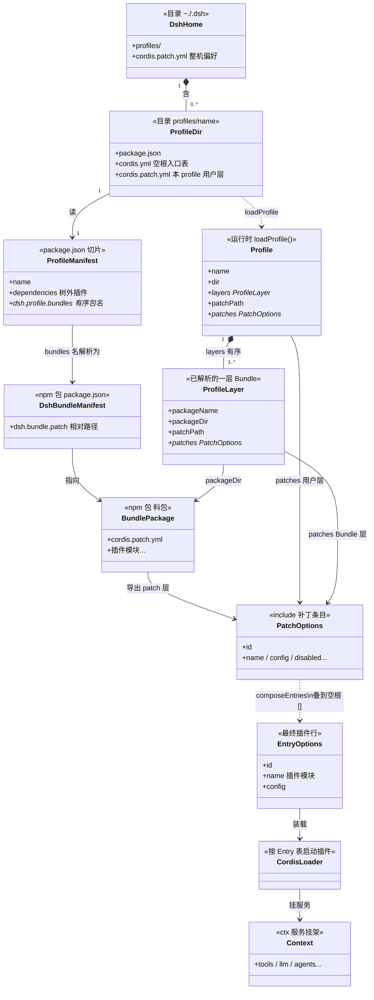

# 术语表（先读这个）

> 本文档用白话解释 doc-sn 里会出现的名词。  
> **建议**：遇到不懂的词就回这里查；读源码章之前至少扫一遍。

---

## 产品与入口

| 名词 | 白话意思 |
|------|----------|
| **DeepSeek Harness / DSH** | DeepSeek 开源的「智能体外壳/框架」。你装上后，用命令 `dsh` 跑 Web 或无界面任务。它自己管「怎么一轮轮跟模型对话、怎么调工具」，并允许用插件扩展。 |
| **Harness（外壳）** | 不是模型本身，而是包在模型外面的工程系统：会话、工具、权限、UI、扩展点。 |
| **`dsh`** | 命令行入口。例如 `npx @deepseek-ai/dsh web` 打开网页版。 |
| **Agent（智能体）** | 这里指「能跟模型对话、能调工具、有一份会话历史」的一个运行实例。不是特指某个人设角色。 |
| **开发者预览** | 还在大改，接口/磁盘格式随时可能变，不要当长期稳定产品依赖。 |

---

## 插件与组装（Cordis）

| 名词 | 白话意思 |
|------|----------|
| **Cordis** | 一套「插件运行时」（像可热插拔的积木底座）。DSH **整仓都是插件**：连默认的对话循环也是插件，可以换掉。 |
| **插件（plugin）** | 一段安装到 Cordis 里的代码：声明依赖、往公共对象上挂能力、监听事件。卸载插件 = 能力消失。 |
| **`ctx`（上下文）** | 进程里的「服务挂架」。例如 `ctx.tools`、`ctx.llm`、`ctx.sessions`。插件通过 `ctx` 互相找能力，而不是硬编码 import 某个实现类。 |
| **`inject`** | 插件声明「我依赖哪些服务就绪后才能启动」。加载器按依赖拓扑启动，不用手写启动顺序。 |
| **Fiber** | Cordis 里一个插件（或插件子树）的生命周期单元。失败可回滚，卸载可撤销注册。 |
| **Profile（配置档）** | **可启动的一份产品配方**。回答「这次启动由哪些 Bundle 按什么顺序叠起来？」。落盘在 `$DSH_HOME/profiles/<name>/`；用 `dsh --profile <name>` 启动。例如 `web`、`headless`。详见 [三者关系](#profile--bundle--patch关系总表)。 |
| **Bundle（组合包）** | **可安装、可分发的配置层（npm 包）**。回答「这个包贡献哪些插件/覆盖？」。核心是一份 Patch（`cordis.patch.yml`）。例如 `dsh-base`、`dsh-web-app`。**不能单独当启动入口**。 |
| **Patch（补丁配置）** | **改插件行表的一层 YAML 操作**（insert / 按 id 覆盖 / disable）。Bundle、Profile、Home、`--patch` 都提供 Patch。详见 [什么是 Patch](#什么是-patch)。 |
| **Waterfall（瀑布事件）** | Cordis 的一种**事件调度模式**：监听器按顺序包一层；必须调 `next()` 才交给下游。**不调 `next()` = 短路**（例如直接拒绝）。用来挂审批、改请求等策略。**概念上 = 中间件 / 洋葱模型 / Spring Filter·Interceptor**，不是新算法——只是 Cordis 事件族里对「可改写、可短路」那一种 dispatch 的名字（与 emit / bail / serial 并列）。详见下方 [Waterfall 与 Filter](#waterfall-与-filter中间件)。 |
| **Serial / Parallel / Emit / Bail** | 另外几种事件模式：Serial=排队等完；Parallel=并行；Emit=通知一声不等返回值；Bail=谁先返回有效值谁赢并短路。 |

### Profile / Bundle / Patch：关系总表

三者不是并列的三种「产品」，而是 **配方 → 料包 → 操作内容** 三层：

```text
Profile（菜单/配方，可启动）
  ├── 引用 Bundle 名*（有序依赖）
  │     └── 每个 Bundle 包含 1 份 Patch（料包自带的 cordis.patch.yml）
  ├── 自己包含 1 份 Patch（profiles/<name>/cordis.patch.yml）
  └── 启动时再叠：Home Patch、CLI --patch
        │
        ▼ 按序 apply
空插件表 []  ──►  最终 Entry 表  ──►  Cordis Loader ──► ctx
```

| | **包含什么** | **作用** | **依赖谁** |
|--|--------------|----------|------------|
| **Patch** | YAML 数组：`insert` / 按 `id` 覆盖 / `disabled` | **唯一真正改配置的操作单位**：改「装哪些插件、怎么配」 | 不依赖 Profile/Bundle；谁提供都行。依赖的是 Cordis **插件行表**语义 |
| **Bundle** | npm 包 = `dsh.bundle` + **一份 Patch** + 插件代码 | **可分发的能力切片**（贡献一层配置） | **依赖**自己的 Patch（无 patch 不算合法 Bundle）。**被** Profile 的 `bundles` 列表引用，不反向依赖 Profile |
| **Profile** | 目录 = `dsh.profile.bundles`（包名列表）+ **自己的 Patch** + 空根 `cordis.yml` | **可启动的产品面**：决定叠哪些 Bundle、什么顺序 | **依赖**所列 Bundle（须能解析到带 `dsh.bundle` 的包）。不包含 Bundle 源码，只存名字 |

**依赖方向（单向）**：

```text
Profile  ──引用包名──►  Bundle  ──内含──►  Patch
   │                                         ▲
   └──────────也直接内含─────────────────────┘
                          Home / --patch 也是 Patch
```

- Profile **需要** Bundle；Bundle **不需要**知道有没有 Profile。  
- Bundle / Profile / Home / CLI **都产出 Patch**；Loader **只吃合成后的插件表**，不关心层从哪来。  
- **没有「Profile 包含 Bundle 目录」**：包含的是名字引用；物理包在安装目录 / profile 的 `node_modules`。

**一句话**：Patch 是动词（改表）；Bundle 是带着一份 Patch 的料包；Profile 是点名多份 Bundle、再加自己 Patch 的启动菜单。

### 为什么 DeepSeek 这样设计（及其他 Agent 为何少见）

DSH 把自己定位成 **可组装的 Harness 平台**，不是「一个打好包的聊天 Agent 产品」。Profile/Bundle/Patch 解决的是文档里写明的痛点：**产品面复制粘贴**——Web 一套循环、Headless 再抄一套。

| 设计目标 | Profile/Bundle/Patch 怎么服务它 |
|----------|--------------------------------|
| 多表面共用一个内核 | `web` / `headless` 只换 Bundle 列表，不换 `ReactLoopAgent` |
| 一切皆插件（含默认 Loop） | 装什么由 Patch 行表决定；卸载 = 能力消失 |
| 上游可发料包、下游可改 | Bundle 作者发 npm；用户用 Profile / Home / `--patch` 覆盖，不必 fork `dsh-base` |
| 配置可回放、可 dump | 合成层顺序固定，`--dump-config` 能看出最终表 |

**和其他 Agent 的差别（不是谁更高明，是产品形态不同）**：

| 类型 | 代表直觉 | 扩展方式 | 为何通常没有 Profile/Bundle/Patch |
|------|----------|----------|----------------------------------|
| **成品 Agent** | Claude Code、Codex、Cursor Agent、Penguin | MCP / Skill / hooks / 设置项 | 交付「开箱即用的一个 App」；内核写死，扩展挂边上，不需要「换整桌菜单」 |
| **库 / SDK** | LangChain Deep Agents、各 Agent 框架 | Python/TS **代码里**拼 graph、tools | 组合发生在调用方源码，不需要 YAML 插件表 + 多层 patch |
| **Harness 平台** | **DSH（DeepSeek Harness）** | Cordis 插件 + Bundle 层 + Profile 启动 | 要同时支撑 Web/Headless/SDK、可换 Loop、可换执行世界——组装必须一等公民 |

其他项目也有「分层配置」的影子（环境变量、settings.json、plugin 目录），但很少把 **「空插件表 + 有序 patch 叠层 + 以 profile 为唯一启动入口」** 做成主轴——因为那套心智成本高，只有当你真的要 **同一内核多产品面、第三方发 Bundle、用户不改源码覆盖** 时才划算。

代价也很实在：要懂 Profile≠Bundle≠Patch、覆盖是整行替换、合成后扁平。选 DSH = 买平台灵活；选 Penguin/Claude Code 式 = 买更短路径的产品心智。

细节展开：[Profile 与 Bundle](#profile-与-bundle) · [什么是 Patch](#什么是-patch) · [类图](#类图对象引用与职责)

### Profile 与 Bundle

二者都写在 `package.json` 的 `dsh` 键下，但**回答的问题不同，也不能混用**：

| | Bundle（组合包） | Profile（配置档） |
|--|------------------|-------------------|
| 问题 | **贡献什么？** | **由哪些贡献按什么顺序组成？** |
| Manifest | `dsh.bundle` → 指向 `cordis.patch.yml` | `dsh.profile.bundles` → 有序 npm 包名列表 |
| 形态 | 可发布的 npm 包（作者写、用户装） | `$DSH_HOME/profiles/<name>/` 目录（用户启动） |
| 启动 | ❌ 不能单独当入口 | ✅ `dsh --profile <name>` |

**厨房类比**：

- **Bundle** = 预制菜料包（「基础灶台」「Web 界面」「无头跑批」各一包）
- **Profile** = 今天要做的那道菜的**配方单**：先开灶台（`dsh-base`），再加 Web 料（`dsh-web-app`）
- **Patch** = 在配方上再改盐（本地偏好 / `--patch`）

```text
你敲：dsh --profile web
         │
         ▼
profile「web」的 bundles 列表（有序）
  ① @deepseek-ai/dsh-base      ← 模型、工具、会话、审批、持久化…
  ② @deepseek-ai/dsh-web-app   ← HTTP/前端/Web 专用覆盖
         │
         ▼
再叠：profile 自己的 cordis.patch.yml
再叠：$DSH_HOME/cordis.patch.yml（整机共用偏好）
再叠：命令行 --patch
         │
         ▼
Cordis Loader 按最终插件表启动 → 才有 Agent Loop / UI
```

常见配方：

| Profile（直觉） | 典型 Bundle 顺序 |
|-----------------|------------------|
| Web | `dsh-base` → `dsh-web-app` |
| Headless | `dsh-base` → `dsh-headless` |
| 只跑核心（调试） | 仅 `dsh-base` |

记住一句：**Bundle 是料包，Profile 是菜单；你点菜单，不点料包。**

### 什么是 Patch

**Patch ≠ git 补丁。** 这里指 Cordis Loader 的**配置层操作**：一份 YAML 数组，描述如何改「最终要启动的插件行表」。

启动时根表是空的：

```yaml
# profile 目录里的 cordis.yml（每次 boot 重写）
[]
```

每一层 patch 依次打上去，得到最终插件表，再交给 Loader。

#### 一份 patch 长什么样

**① 插入整批插件**（`dsh-base` 典型写法）：

```yaml
- insert:
    - id: llm
      name: '@deepseek-ai/dsh-llm'
    - id: session
      name: '@deepseek-ai/dsh-session'
    - id: agent
      name: '@deepseek-ai/dsh-agent'
    # …更多行
```

**② 按 id 改已有行**（`dsh-web-app` 典型写法——后层覆盖前层）：

```yaml
- id: hmr
  disabled: true          # 关掉 base 里已插入的 hmr

- id: system-prompt
  config:
    persona: >-
      You are a coding agent …
```

**③ 你自己的层**（profile / `$DSH_HOME` / `--patch ./my.yml`）同样是这种 YAML，例如再关某个插件、改端口、加本地插件行。

#### 四层分别是什么文件

| 顺序 | 谁贡献 | 文件从哪来 | 典型内容 |
|------|--------|------------|----------|
| ① | Bundle `dsh-base` | 包内 `cordis.patch.yml` | 大批 `insert`：核心插件 |
| ② | Bundle `dsh-web-app` | 包内 `cordis.patch.yml` | 按 `id` 覆盖/补 Web 专用配置 |
| ③ | 当前 Profile | `$DSH_HOME/profiles/<name>/cordis.patch.yml` | 你对这个 profile 的偏好 |
| ④ | 机器级 + CLI | `$DSH_HOME/cordis.patch.yml`；以及 `--patch <文件>` | 整机共用；临时实验 overlay |

#### 覆盖规则（容易踩坑）

- 用 **`id`** 对准同一行；**后写覆盖先写**。
- 覆盖时通常是 **整份 `config` 替换，不是深合并**——后层要写全自己关心的键。
- `disabled: true` = 这行仍在表里但不启动。
- 合成结束后是一张扁平的插件行表；**运行时不再记得「这行来自哪个 Bundle」**。

和 Spring 的粗对照：Patch 层 ≈ 多份 `application-*.yml` 按序覆盖 Bean 定义；Bundle 自带的 patch ≈ starter 自带的 `auto-configuration` 清单。

权威示例：`packages/bundle/base/cordis.patch.yml`、`packages/bundle/web-app/cordis.patch.yml`。

---

#### 类图（对象引用与职责）

类型真源：`packages/boot/app-boot/src/profile.ts`（`Profile` / `ProfileLayer` / `Dsh*Manifest`）。



**谁引用谁（读图顺序）**：

1. **磁盘**：`DshHome` → 多个 `ProfileDir`；每个 Profile 的 `package.json` 只存 **Bundle 包名字符串列表**，不内嵌 Bundle 代码。  
2. **解析**：`loadProfile` 把每个包名解析成 `ProfileLayer`（包目录 + 已读入的 `patches`），再附上本目录 `cordis.patch.yml` → 得到运行时 `Profile`。  
3. **合成**：按序把各层 `PatchOptions` 打到空的 `EntryOptions[]`（`cordis.yml` 根为 `[]`），再叠 home / `--patch` → 最终插件行表。  
4. **运行**：`CordisLoader` 按行表启动插件，往 `ctx` 挂能力——**Profile/Bundle 到此职责结束**，不再参与 Turn/Step。

**职责边界**：

| 实体 | 负责 | 不负责 |
|------|------|--------|
| Bundle / `DshBundleManifest` | 贡献一层 patch（装哪些插件、默认配置） | 决定「今天启动哪套产品」 |
| Profile / `ProfileManifest` | 有序点名 Bundle + 本档用户 patch | 实现 Agent Loop / 工具逻辑 |
| `ProfileLayer` | 一次「包名→磁盘→patches」的解析结果 | 热改业务算法 |
| `PatchOptions` → `EntryOptions` | 配置合成与覆盖（按 id 整行替换） | 运行时对话状态 |
| Loader / `ctx` | 真正跑插件与服务 | 记住「我来自哪个 Bundle」（合成后扁平） |

权威：[docs/user/develop/basic/publish.zh.md](../docs/user/develop/basic/publish.zh.md)

---

### Waterfall 与 Filter/中间件

**模式没新，名词是调度分类名。** 按 Spring Filter / Interceptor、Koa/Express middleware 理解「挂策略、可短路、可改写」完全够用。

| | Spring Filter / Interceptor | Cordis Waterfall |
|--|------------------------------|------------------|
| 挂载点 | Servlet / MVC 链 | **命名事件**（如 `tools/pre-execute`、`agent/pre-step`） |
| 放行 | `chain.doFilter` / `preHandle` 返回 true | **必须** `await next()` |
| 短路 | 不往后传 | **故意不调** `next()`（一等公民语义） |
| 改结果 | 偏 request/response；Interceptor 常 pred/post | `await next()` 后再改返回值，天然是变换管线 |
| 同级原语 | Filter ≠ Listener ≠ AOP | 与 `emit` / `bail` / `serial` 同属 `ctx.*` 事件族 |

直觉：**Filter ≈ HTTP 门卫；Waterfall ≈ 任意能力缝上的中间件事件。** 审批、改 LLM 请求、包工具执行，挂不同事件名，而不是挤进一条全局 Filter 链。DSH 沿用 Cordis 叫法，没有另造「DSH Filter」。

权威：[docs/user/develop/framework/events.zh.md](../docs/user/develop/framework/events.zh.md)

---

## 对话循环（Agent Loop）

| 名词 | 白话意思 |
|------|----------|
| **Agent Loop / Driver（驱动器）** | 「真正跑对话」的那套逻辑。默认实现叫 `ReactLoopAgent`（名字里的 ReAct ≈ 推理+行动循环）。 |
| **「Loop 也是插件」** | **≠「Turn/Step/claim 每一步都是拼出来的」**。是指：实现循环的**整包**（`@deepseek-ai/dsh-agent-loop`）和其他能力一样，经 Bundle/Patch **装进 Cordis**，向 `ctx.agents.setFactory(...)` 注册工厂；**卸掉这行 = 没人能 create Agent**。默认包里的 `kick→turn→claim→LLM` 流程是写死的代码；要换算法是 **换另一个 loop 插件/工厂**，不是把 while 拆成一堆小插件。扩展日常行为靠 **waterfall 检查点**，不是改循环源码。详见下方 [「一切皆插件」到底指什么](#一切皆插件到底指什么含-loop)。 |
| **`ReactLoopAgent`** | 默认驱动器类：处理用户消息入队、开轮次、调模型、调工具、写日志。 |
| **Turn（轮次）** | 一次「从打开到关闭」的大边界，日志里有 `turn/start`…`turn/end`。一轮里可以有多步。 |
| **Step（步骤）** | 一轮里的一小步：通常「调一次模型」，若有工具则执行工具后再决定要不要下一步。 |
| **Inbox（收件箱）** | 排队等处理的用户/系统消息。分两个桶：`next-turn`（新一轮用户话）、`next-step`（尽快插入下一步的内容）。 |
| **`followup`** | 用户发一条新话：进 `next-turn`，并唤醒驱动器开跑。 |
| **`steer`** | 中途插入一条：进 `next-step`，并唤醒，尽快进入下一步。 |
| **`inject`（Inbox）** | 插入上下文（如文件变更说明）：进 `next-step`，但**不单独唤醒**（等下次 followup/steer 一起被领走）。与 Cordis 插件的 `inject` 依赖声明不是一回事。 |
| **`claim`（认领）** | 驱动器从 Inbox 取出本步要用的消息，并从队列里删掉（写进持久日志）。 |
| **`pre-step`** | 进入一步之前的检查点：认领消息、组装系统提示词、插件可「拒绝本步」或改写消息。 |
| **`turn-stopping`** | 准备结束本轮、且没有下一步排队时的最后检查点：插件还可再塞消息续跑。 |
| **phase（相位）** | 驱动器内部状态：`idle`（空闲）、`running`（在跑）、`maintenance`（维护任务，对外仍像空闲）。 |
| **kick** | 驱动器真正开始干活：循环调用 `turn()`，直到 Inbox 清空或出错。 |

**followup / steer / inject 对照**（实现都是 `send(msg, target, wakeup)`）：

| | 进哪个桶 | 唤醒？ | 典型场景 |
|--|----------|--------|----------|
| **followup** | `next-turn` | ✅ | 用户在聊天框发一句新话 → 新一轮 |
| **steer** | `next-step` | ✅ | 跑着途中插指令：「先别删文件」→ 尽快进下一步 |
| **inject** | `next-step` | ❌ | 静默塞上下文（文件变更说明等）；下次 followup/steer 认领时一起带上 |

认领时：先领光 `next-step`，若开新用户话再领 `next-turn` 队头 1 条——所以 inject/steer 跟「下一步」绑在一起，followup 偏向新 Turn 边界。

**「唤醒」是什么**：不是轮询铃，而是——若驱动器 **`idle`**，调用 `wakeDriver` 把它切到 `running` 并启动 `kick()`；若**已经在跑**，注释写明 *Live drivers claim queued work themselves*，`wakeDriver` 基本直接 return（维护中 / abort 后另有闩锁）。所以 **steer 带 wakeup=true，主要是为了「空闲时插一句也能跑起来」**；tool 结束后循环自己看 `next-step` 有没有货，不依赖再唤醒一次。**inject 不唤醒**：空闲时只入队，一直躺到下次 followup/steer。

### 「一切皆插件」到底指什么（含 Loop）

你的直觉没错：**默认 `ReactLoopAgent` 里的 kick → turn → claim → LLM → tools 是固定流程**，Session 怎么 append / derive 也是固定契约。文档说「Loop 也是插件」**不是**说这些步骤像 Lego 一样每块一个插件拼出来。

三层分清：

| 层 | 固定还是可插？ | 例子 |
|----|----------------|------|
| **对外契约** | 相对固定 | `followup` / `steer`、`session.append`、`deriveMessages` |
| **默认算法** | 写死在 `ReactLoopAgent` 源码里 | Turn/Step、Inbox claim 顺序 |
| **谁提供算法** | **整包是 Cordis 插件** | `cordis.patch.yml` 里一行 `id: agent-loop` → `@deepseek-ai/dsh-agent-loop` |

组装时和其他插件一样被装上：

```yaml
# dsh-base 的 cordis.patch.yml（节选）
- id: agent-loop
  name: '@deepseek-ai/dsh-agent-loop'
```

这个插件启动时做的事本质是：向 **`ctx.agents.setFactory(...)`** 注册「如何 create/resume 一个会跑循环的 Agent」。  
没装这行 → 报错 `no agent factory registered (load an agent-loop plugin)`。  
卸掉这行 → 工厂撤销（和其他插件一样可逆）。

所以「皆插件」指的是 **部署/组装单元**：

```text
✅ 对：agent-loop、tools、llm、fs、persistence… 都是 Patch 表上的插件行
✅ 对：日常扩展 = 另装插件，挂 waterfall（pre-step / tools/*），不改 ReactLoopAgent.ts
✅ 对：真要换循环哲学 = 写另一个实现 AgentFactory 的插件，替换 agent-loop 那一行
❌ 错：以为 claim/splice/turn 每一步都是独立热插拔插件
❌ 错：以为「固定流程」就否定了「loop 是插件」——固定的是默认实现内部，插件的是「装哪套实现」
```

和 Session 的关系也一样：`dsh-session` 是插件；**append-only + deriveMessages 是该插件定义的契约**。换持久化后端是另挂 persistence 插件订事件，不是把 Session 拆成「读写各一个插件」。

一句话：**插件 = 装进进程的能力包；默认 Loop 包内部是固定状态机；可插的是「整包替换」+「检查点挂策略」，不是把 while 拆碎。**

---

## 会话与日志

| 名词 | 白话意思 |
|------|----------|
| **Session（会话）** | 一次对话的容器：里面是**只追加**的事件日志（谁说了什么、调了什么工具）。 |
| **SessionEvent（会话事件）** | 日志里的一条：如 `user/message`、`assistant/chunk`、`tool/result`、`turn/start`。 |
| **「模型可见 ⟺ 已记录」** | 设计铁律：模型请求里用到的历史，必须能从会话日志推出来；不能只活在内存数组里。 |
| **`deriveMessages`（派生消息）** | 从会话日志「投影」出给模型看的 `messages[]`。UI 可以额外订原始 chunk；模型看折叠后的消息。 |
| **Surface（表面）** | 哪些事件算「对话历史上的节点」。例如打字过程的 chunk 不一定进历史，最终的 `assistant/message` 才进。 |
| **`surfaceOp`** | 写事件时声明如何进表面：追加、替换等。压缩上下文会「替换」旧节点。 |
| **Persistence（持久化）** | 另有插件订阅会话事件，把日志写到磁盘（jsonl/sqlite 等）。**Session 类本身不写文件。** |

---

## 工具与执行

| 名词 | 白话意思 |
|------|----------|
| **Tool（工具）** | 模型可调用的能力：读文件、跑 shell、搜网页等。 |
| **ToolRuntime** | 执行单个工具调用的运行时：前置检查 → 审批/守卫 → 真正执行 → 后置处理 → 通知结果。 |
| **Scheduler（调度器）** | Agent Loop 里对「一批工具调用」的调度：哪些可并行、结果必须按模型给出的顺序写入日志。 |
| **`executionMode`** | 某次调用是 `parallel`（可并行）还是 `exclusive`（独占屏障）。 |
| **Code Mode / collapse** | 一种展示模式：模型表面上看到很多工具，但**只允许直接调用** `run_code`，其它工具必须在代码里间接调用。直接乱调会在进审批之前就被拒绝。 |
| **Seam（接缝/能力边界）** | 「可替换的一类能力」的完整设计：要有定义（挂在 `ctx.xxx`）、实现（Provider）、使用者（Consumer，常是工具）。三者缺一不叫完整 Seam。 |
| **Provider / Consumer** | Provider=实现方；Consumer=调用方。换沙箱 = 换 Provider，尽量不改 Consumer。 |
| **执行世界** | 文件系统 + 进程/Shell 等应指向**同一**本地或远程环境。只换 FS 不换 Shell 会导致「读到的文件」和「bash 看到的目录」不一致。 |

---

## 人机与安全

| 名词 | 白话意思 |
|------|----------|
| **Approval（审批）** | 一次性「允不允许做这件事」。常拦在工具真正执行前；拒绝后模型会看到失败型工具结果。 |
| **Ask User / userQuestions** | 向用户提业务问题（选项/填空），等答案再继续——和审批不同：审批是权限，这个是问答。 |
| **Commands（命令）** | 斜杠命令等人类指令注册表；可以**不经模型**直接改设置、触发压缩等。 |
| **Plan Mode** | 计划协作模式：先商量计划再执行，状态记在日志里。 |
| **Permission Preset** | 权限预设（宽松/严格/自定义），变更会记事件便于审计。 |
| **Sandbox（沙箱）** | 限制文件与进程能碰哪里。换实现时 **FS 与 subprocess 要成对换**，否则策略对不上。 |
| **CredentialRef** | 配置里只存「凭据引用」，不存明文密钥；真正用时才解析。 |

---

## 上下文与存储

| 名词 | 白话意思 |
|------|----------|
| **Compaction（压缩）** | 上下文太长时摘要/裁剪历史。常挂在 `pre-step` 或请求失败重试路径。DSH 用 **surface replace** 不改删 log；详见 [06 §4](./06-运行时深度专题-Memory压缩投影HITL.md#4-压缩原理时机完整示例)。 |
| **Trajectory** | 工程师向的 **调试 UI 视图**（`ui-trajectory`）：按 turn/step 展示 provider 请求流与嵌套 tool，与 Chat 共用 Session 真源、独立投影。详见 [06 §9](./06-运行时深度专题-Memory压缩投影HITL.md#9-trajectory定义流程同类)。 |
| **Approval / HITL** | `ctx.approval` 审批 seam：工具执行前暂停等人，`allowed-once` 才继续；不是 LangGraph interrupt。详见 [06 §8](./06-运行时深度专题-Memory压缩投影HITL.md#8-hitl审批暂停与恢复)。 |
| **Token Meter** | 按会话日志修订号计量 token，给压缩和计费看「现在有多胖」。 |
| **Spill** | 超大文本先存外头，消息里只留引用，避免日志爆炸。 |
| **Attachment** | 图片等二进制附件的持久存储。 |
| **Session Persistence** | 把会话事件落到 JSONL/SQLite；崩溃后靠它恢复。 |
| **Session Query / Projection** | 查询历史、追踪关系；或用纯函数投影出 UI 所需视图。 |
| **Settings / Storage / Workspace** | 用户设置分层解析；非会话域存储；工作区与会话 cwd 的登记。 |

---

## 扩展与其它循环

| 名词 | 白话意思 |
|------|----------|
| **Subagent（子智能体）** | 父 Agent 委派出去的另一个 Agent（同进程或子进程）。有严格的「发布前失败要回滚、发布后谁负责 dispose」规则。 |
| **Workflow / Ralph / Goal** | 可选的「外环」：决定何时再叫一轮 Agent，本身不是 Turn/Step 的替代实现。Goal=持久目标+Round；Ralph=每次新子 Agent 有界交接。 |
| **Jobs** | 后台任务运行时（长时间活着的 job，不等同于一次 Turn）。 |
| **Skills（技能）** | 可发现/加载的技能包，常通过 `skill` 工具或提示词贡献进模型。 |
| **Typert** | 跨宿主的类型化远程调用描述与网关（扩展/Host 边界）。 |
| **Extensions** | 运行时动态装插件（带版本、审批、可撤销）。 |
| **ACP / SDK** | 外部协议或客户端：用标准接口连上同一套会话事件，而不是另一套循环。 |
| **MAF** | Microsoft Agent Framework，对照学习用；不是 DSH 依赖。 |
| **内环 / 外环** | 内环=默认 Turn/Step/工具循环；外环=Goal/Workflow/Ralph 等决定「再开一轮」的编排。 |

---

## 一张对照：「用户发一句话」经过哪些词

```text
用户在 Web 点发送
  → followup（把话放进 Inbox 的 next-turn，并唤醒）
  → wakeDriver / kick（空闲则开始跑）
  → turn（开一轮，写 turn/start）
  → pre-step（claim 消息，组装 system prompt，插件可拒绝）
  → step（deriveMessages → 调 LLM → 可能 executeToolCalls）
  → 工具结果写 SessionEvent
  → turn-stopping（可选）→ turn/end
  → UI 订阅 session/event 显示
```

读正文时若再遇到生词，先回本表。
