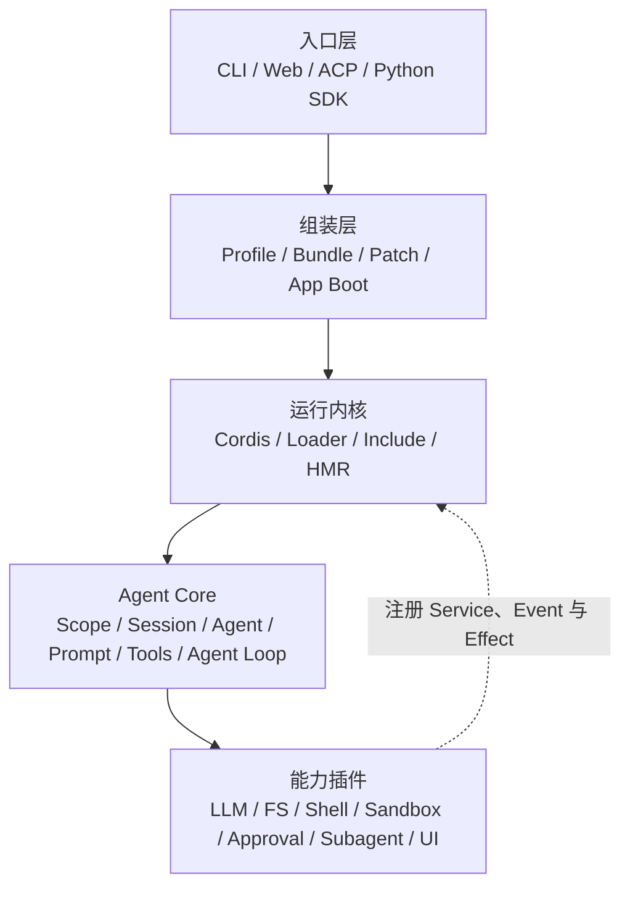
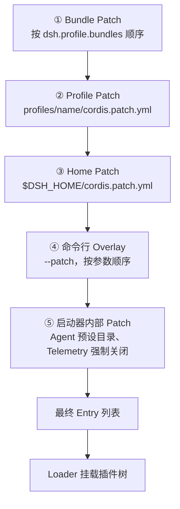
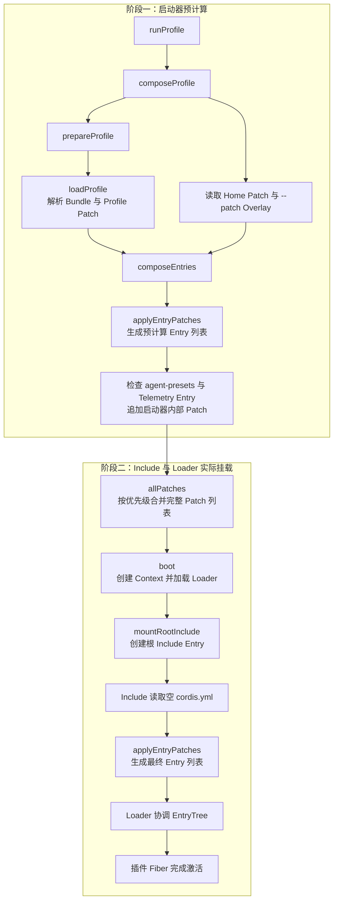
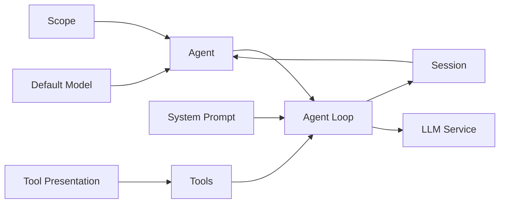
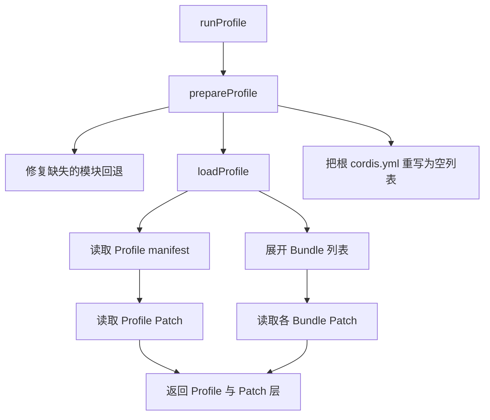
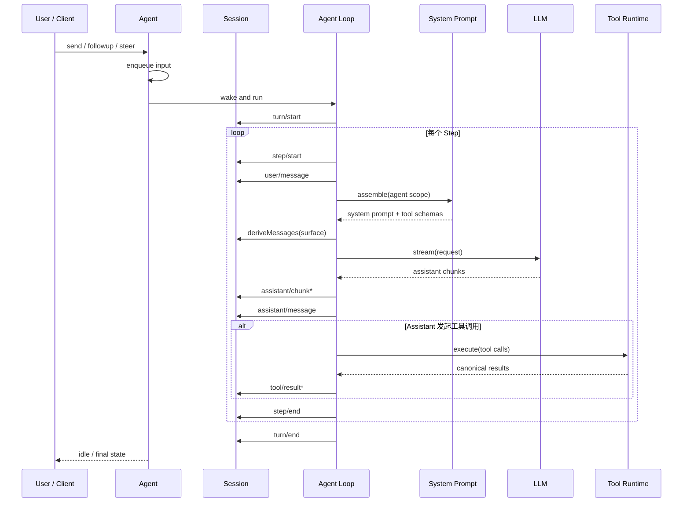
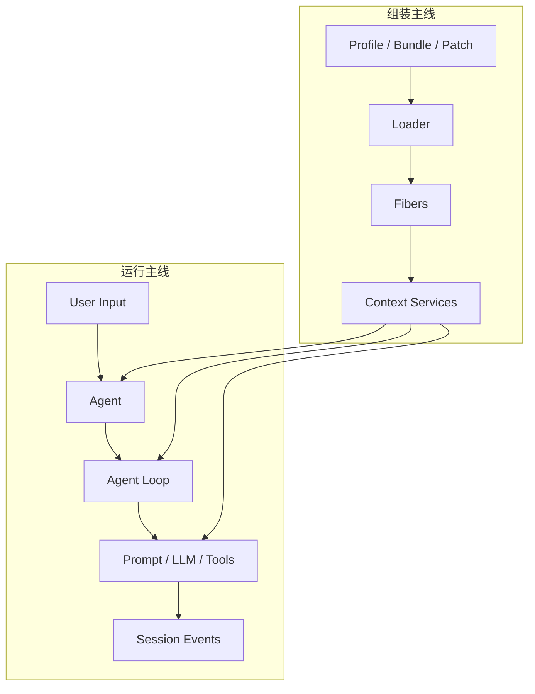

# 浅析 DeepSeek Harness

*   源码仓库：`deepseek-ai/deepseek-harness`

*   分支：`master`

*   版本：`dsh-v0.1.0-rc.8`

*   Commit：`141eb6fef83422698aef7a981029e843e8161534`

*   说明：本文涉及的类型、调用链和文件位置均以该版本为准。DeepSeek Harness 仍处于 Developer Preview，后续版本可能出现破坏兼容性的变化。


只看大语言模型，我们看到的是一个接收消息、生成消息的函数；真正把它变成编码 Agent 的，是模型外面那一整套运行系统：系统提示词、工具、工作目录、权限、沙箱、会话、重试、子 Agent、UI，以及把它们组织起来的生命周期。

这套运行系统就是 **Agent Harness**。

DeepSeek Harness（简称 DSH）最值得研究的地方，不是又实现了一遍“调用模型—执行工具”的循环，而是选择了一个更彻底的架构：**一切皆插件（Everything is a Plugin）**。模型适配器、工具注册表、Session、Agent Loop，乃至 Web 应用本身，都是配置树里的插件。插件可以被插入、替换、暂停或卸载；它提供的服务、事件监听器和其他副作用也会随生命周期一起撤销。

理解 DSH 可以沿两条主线展开：

```text
组装主线：Profile → Bundle → Patch → Loader → Entry → Fiber

运行主线：User → Agent → Session → System Prompt → LLM → Tools → Session
```

前一条解释“这个应用是怎样组装出来的”，后一条解释“组装完成后一次任务怎样运行”。本文先讲配置，再讲支撑配置树的 Cordis，最后进入 Agent 核心运行时和完整调用链。

---

# 第一部分：从 Agent Harness 说起

## 1. 什么是 Agent Harness

### 1.1 模型不是 Agent

LLM 本身擅长根据输入预测输出，但它通常不知道当前项目在哪、有哪些文件、命令是否执行成功，也不会天然保存跨轮次状态。要让模型在真实环境里持续完成任务，至少还需要下面这些能力：

| 能力 | Harness 需要回答的问题 |
| --- | --- |
| 上下文组装 | 本轮应该把哪些规则、文件、历史和运行环境发给模型？ |
| 模型路由 | 使用哪个 Provider、哪个 Model，以什么参数发起请求？ |
| 工具系统 | 模型能调用什么？输入和输出如何校验？ |
| 执行环境 | Shell、文件系统、PTY、浏览器等能力在哪里运行？ |
| 会话状态 | 用户消息、模型输出、工具调用如何记录、恢复和分叉？ |
| 权限与安全 | 哪些操作允许、拒绝或必须获得人工批准？ |
| 生命周期 | 组件重载或卸载时，监听器、进程和资源如何清理？ |
| 可观测性与恢复 | 失败发生在哪一层？能否重试、回放或修复？ |

从工程实现的角度，可以把 Agent 粗略理解为：

```text
Agent ≈ Model + Harness
```

Model 负责推理和生成；Harness 则负责模型之外的上下文、工具、状态、执行环境和控制循环。

同一个模型放在不同 Harness 中，实际表现可能差异很大。差异往往来自工具协议、提示词结构、上下文裁剪、并发策略、错误处理和权限边界，而不仅仅来自模型参数。

### 1.2 Harness 与 Agent Framework 的差别

二者没有绝对统一的行业边界，但可以用一个实用口径区分：

*   **Agent Framework** 更偏向构建 Agent 的编程框架：提供流程、节点、状态管理和编排等抽象，开发者在这些抽象之上实现具体的 Agent。

*   **Agent Harness** 更偏向完整运行环境：它接住模型调用、工具执行、会话持久化、权限、沙箱、UI 和扩展生态。


DSH 同时提供框架能力和可直接运行的产品形态，但“harness”这个命名强调的是：它不是某个特定工作流，而是承载多种 Agent 组合的运行底座。

## 2. DeepSeek Harness 是什么

DeepSeek Harness 基于 TypeScript/Node.js 构建，以 Cordis 作为插件运行内核。

目前提供多种入口：

*   **Web**：在浏览器中使用的完整交互界面；

*   **Headless**：一次性执行任务，不启动 Web Server；

*   **ACP**：通过 Agent Client Protocol 接入其他宿主；

*   **Python SDK**：从 Python 程序创建和驱动 Harness 运行时；

*   **插件与 Profile**：按部署需要重新组合模型、工具、策略和界面。


在本文参考的 `rc.8` 中，项目仍明确标记为 **Developer Preview**。因此，阅读它时应区分两类知识：

1.  容易变化的 API、包名和配置字段；

2.  相对稳定的设计思想，例如插件化、可逆副作用、事件溯源 Session 和能力 seam。


后者才是这套源码最值得带走的部分。

## 3. DeepSeek Harness 主要作者与 Cordis 的由来

### 3.1 崔天一：DeepSeek Harness 核心作者

[崔天一（Tianyi Cui）](https://github.com/tianyicui)本科毕业于[浙江大学计算机系](https://www.36kr.com/p/3935871461916035)，是 DeepSeek Harness 的核心作者，目前在 DeepSeek Harness 团队工作。

在加入 DeepSeek 之前，他曾在 Jane Street 香港办公室工作近九年，从事股票、固定收益领域的软件开发和量化研究；2022 年又联合创办了香港量化交易公司 TSY Capital。他于 2026 年 3 月加入 DeepSeek，开始参与 Harness 方向的研发。

Harness 的核心不是训练模型，而是把模型的决策安全、稳定地转化为真实操作。量化交易系统面对的是同一类问题：策略只是起点，真正决定结果的是执行、风控、状态管理和故障处理。因此，DeepSeek 选择崔天一来负责 Harness 也就不难理解：他的量化背景并非跨行，恰恰提供了构建这类执行系统所需要的工程经验。

他同时是 Cordis 理论论文的共同作者，参与了 Cordis 从工程架构到形式化表达的工作。

### 3.2 Yifan Shi：从 Koishi 到 Cordis

[Yifan Shi](https://github.com/shigma)（GitHub 用户名 **Shigma**）是 Cordis 和 Koishi 的主要作者，也是论文 _A Programming Paradigm for Spatiotemporal Composability_ 的第一作者，并参与了 [DeepSeek-V3](https://arxiv.org/abs/2412.19437) 与 [DeepSeek-R1](https://arxiv.org/abs/2501.12948) 技术报告。

### 3.3 Cordis 的历史

Cordis 并不是为了 DeepSeek Harness 临时开发的框架。它最早的大规模落地项目是 **Koishi**。

[Koishi](https://github.com/koishijs/koishi) 是一个使用 TypeScript 开发的跨平台聊天机器人框架，可以同时接入 QQ、Telegram、Discord、飞书等通信平台。Cordis 在其中承担插件运行时的角色：

*   在服务端，平台适配器、数据库驱动、管理功能和机器人业务能力都以插件形式运行在 Cordis Context 上；

*   插件可以声明对数据库、消息平台等 Service 的依赖，并随依赖变化重新激活；

*   用户可以在控制台中启用、停用或更新插件，而不必重启整个机器人；

*   Koishi 的 Web 管理控制台本身也是另一套 Cordis 应用，在浏览器环境中组合页面和 UI 插件。


Cordis 的演进可以概括为三个阶段：

1.  **在 Koishi 中形成核心机制**：[2022 年的 Koishi 4.7.x](https://github.com/koishijs/koishi/discussions/727) 已经开始使用 Cordis 的 Context 派生、Service 隔离和插件生命周期能力；

2.  **从机器人框架中独立出来**：到 [2024 年](https://github.com/koishijs/koishi/discussions/1361)，Cordis 进一步吸收原本位于 Koishi 中的 Loader 和 HMR 能力，成为可以服务于 Yakumo 等其他项目的通用插件框架；

3.  **形成通用理论和 v4 实现**：2026 年的 Cordis 论文将多年工程经验总结为“可逆 Effect”和“响应式 Coeffect”，并给出了更严格的组件生命周期、声明式 Loader、配置协调和热更新模型。


论文的案例研究仍以 Koishi 为例：Koishi 使用 Cordis v3，拥有数千个独立开发的社区插件；DeepSeek Harness 则使用正在演进的 Cordis v4。v4 重新设计了部分 Effect、Coeffect 和 Loader 语义，但两者共享同一套核心组合模型。

论文最终把这套模型归纳为两个关键概念：

*   **时间可组合性（可逆 Effect）**：组件离开时，它产生的副作用能够被完整撤销；

*   **空间可组合性（响应式 Coeffect）**：组件可以声明自己依赖什么，并随依赖的出现、消失和替换而自动激活或停用。


DSH 把这套源自大型插件生态的能力用于 Agent Harness：模型、工具、会话、执行器和 UI 都成为可以动态组合的组件。

---

# 第二部分：DeepSeek Harness 整体架构

## 1. 先看全景

DSH 可以粗略分成五层：



这里的“层”是为了理解而做的逻辑划分，并不表示严格的单向依赖。实际运行时，能力插件会向 Cordis Context 注册服务，Core 再通过稳定的 `ctx.<key>` 消费这些服务。

## 2. Monorepo 目录与职责

| 目录 | 主要职责 |
| --- | --- |
| `apps/cli` | `dsh` 命令入口、参数解析、Profile 启动与 Headless/Web 分派 |
| `apps/web` | Web 应用入口与构建 |
| `packages/boot` | 通用启动粘合层、命令行参数服务、Profile 解析 |
| `packages/bundle` | 官方组合包，将大量插件配置打包为可叠加的 Patch 层 |
| `packages/core` | Session、Agent、Scope、System Prompt、Tools、Agent Loop 等核心抽象 |
| `packages/llm` | 模型消息词汇、流式接口与 Provider Adapter |
| `packages/context` | 工作区指令、文件引用、会话引用等上下文来源 |
| `packages/fs`、`shell`、`subprocess`、`sandbox` | 执行世界及其策略 |
| `packages/session` | Session 持久化、查询、标题等外围实现 |
| `packages/subagent`、`jobs`、`workflow` | 子 Agent、后台任务和工作流能力 |
| `packages/client`、`web` | Host/Client 协议、客户端状态与 UI |
| `vendor` | 固定并修改过的 Cordis 及相关基础包 |
| `python` | Python SDK 与捆绑运行时 |
| `native` | 平台相关的原生辅助程序，例如 Linux Landlock 启动器 |

`packages/core` 只拥有最基础的运行语义。文件系统、沙箱、审批、压缩、持久化、模型适配器等能力位于独立包中，通过 Service 和 Event 接到核心流程上。这种边界使默认实现可以被替换，而不必修改 Agent Loop。

## 3. Everything is a Plugin

“一切皆插件”不是说所有源码模块都是插件，而是说模型、工具、会话和 Agent Loop 等运行时能力都通过 Cordis 插件挂载，并可以通过配置替换符合相同接口的实现。

例如：

*   `ctx.sessions` 由 Session 插件提供；

*   `ctx.tools` 由 ToolRuntime 插件提供；

*   `ctx.systemPrompt` 由 SystemPrompt 插件提供；

*   `ctx.agents` 和默认 Agent Loop 也来自插件；

*   某个模型 Provider、Shell 后端或审批策略同样由插件注册。


因此，扩展 DSH 的常规方式不是修改一个中央内核，而是在同一棵插件树中增加新的提供方、消费者或策略插件。

## 4. Service、Event 与 Effect

理解 DSH 的插件模型，需要先认识 Cordis 提供的三种基础机制：Service、Event 与 Effect。

| 机制 | 关注点 | 具体作用 | 例子 |
| --- | --- | --- | --- |
| Service | 能力 | 提供可直接调用、可替换的服务接口 | `ctx.llm`、`ctx.tools`、`ctx.sessions` |
| Event | 流程 | 提供可供插件监听、拦截或参与处理的流程扩展点 | `agent/pre-step`、`tools/pre-execute` |
| Effect | 生命周期 | 管理随插件创建、并在插件卸载时撤销的资源 | 服务注册、监听器、定时器、子 Fiber |

三者通常会在同一个插件中配合使用：通过 Service 暴露能力，通过 Event 接入流程，再由 Effect 保证相关注册和资源随插件卸载一并撤销。

## 5. Capability Seam

官方架构文档把一项可替换能力称为 **seam**。完整 seam 通常包含：

1.  **Service Definition**：定义稳定接口；

2.  **Service Provider**：提供一种具体实现；

3.  **Consumer**：消费该能力，常见形式是模型工具或上层服务。


以 Agent Loop 为例：`dsh-agent` 定义 `Agent`、`AgentFactory` 和 `ctx.agents` 等稳定接口；`dsh-agent-loop` 提供默认的循环实现，并将自己的 `AgentFactory` 注册到 `ctx.agents`；UI、Hooks 和工具等 Consumer 只依赖 `dsh-agent` 暴露的接口，不直接依赖具体的 Agent Loop。

因此，只要新的 Agent Loop 实现相同接口并完成注册，就可以替换默认实现，而不需要同步修改 UI、Hooks 和工具等上层模块。

---

# 第三部分：配置系统——Harness 如何被组装出来

DSH 的配置描述了整个应用的插件树，可以用来：

*   选择要挂载的插件，并传入插件配置；

*   组织插件的分组关系，隔离指定 Service；

*   声明插件依赖，以及消费 Service 时使用的配置；

*   启用或禁用某个 Entry；

*   组合官方 Bundle，并叠加 Profile、用户配置和命令行 Overlay。


这些配置会先被组合成最终的 Entry 列表，再由 Loader 转换为运行中的插件树。

## 1. Entry、Patch 与 Overlay

### 1.1 Entry

`EntryOptions` 描述一条可以被 Loader 运行的插件配置。它在源码中的定义经过接口合并后，可以表示为：

```ts
interface EntryOptions {
  /** Entry 的稳定身份，Patch、更新和诊断都依赖它。 */
  id: string
  /** 要加载的插件模块名或路径。 */
  name: string
  /** 传给插件的配置。 */
  config?: any
  /** 是否将 config 解释为子 Entry 列表。 */
  group?: boolean | null
  /** 是否阻止该 Entry 及其子节点运行。 */
  disabled?: boolean | null
  /** 为该 Entry 增加 Service 依赖。 */
  inject?: Inject | null
  /** 为该 Entry 消费的 Service 附加配置。 */
  intercept?: Dict | null
  /** 将指定 Service 放入独立或具名的隔离域。 */
  isolate?: Dict<true | string> | null
}
```

对应到 YAML 配置：

```yaml
- id: agent-loop
  name: "@deepseek-ai/dsh-agent-loop"
  config:
    maxParallelToolCalls: 10
  inject:
    - agents
    - llm
```

### 1.2 Patch

`PatchOptions` 描述对 Entry 列表执行的一次修改。与 `EntryOptions` 相比，它的字段基本都是可选的，因为一条 Patch 只需要写出希望修改的部分：

```ts
interface PatchOptions {
  /** 目标 Entry；普通修改时必填，根级插入时可以省略。 */
  id?: string
  /** 要插入的 Entry；有 id 时插入目标 Group，否则插入根列表。 */
  insert?: EntryOptions[]
  name?: string
  config?: any
  group?: boolean | null
  disabled?: boolean | null
  inject?: any
  intercept?: any
  isolate?: any
  [key: string]: any
}
```

因此，`id` 只是类型上统一写成可选，并非任何情况下都能省略：不含 `insert` 的 Patch 必须指定 `id`，否则会被跳过。

它主要有两种形式。第一种是按 `id` 修改已有 Entry：

```yaml
- id: agent-loop
  config:
    maxParallelToolCalls: 4
```

第二种是插入新 Entry：

```yaml
- insert:
    - id: my-tool
      name: ./plugins/my-tool.ts
```

一个容易混淆的点是：`insert` 的值虽然是一个 Entry 数组，但外层对象仍然只是 **一条 Patch**。`PatchOptions[]` 才是一整个 Patch 层。

还有一个重要语义：Patch 会覆盖它明确给出的 Entry 字段；当它给出 `config` 时，替换的是整个 `config` 字段，不会自动深度合并。因此，用户 Patch 必须重述希望保留的配置项。

### 1.3 Overlay

Overlay 不是一种独立的数据结构。从类型关系上看，可以将它理解为：

```ts
type Overlay = PatchOptions[]
```

这里的 `Overlay` 是对用途的称呼，并不是源码中实际导出的类型。它强调的是这组 Patch 的来源和优先级：它们覆盖在已有组合之上。

## 2. Profile 与 Bundle

### 2.1 Profile

Profile 是 `$DSH_HOME/profiles/<name>` 下的一套可以按名称选择的运行配置，例如 `web` 或 `headless`。

#### 目录结构

一个 Profile 目录包含以下文件：

```text
~/.dsh/profiles/headless/
├── package.json
├── cordis.patch.yml
├── cordis.yml
└── pnpm-workspace.yaml
```

#### `package.json`：Bundle 清单

首先，`package.json` 是 Profile 的清单文件，其中的 `dsh.profile.bundles` 决定要按什么顺序叠加 Bundle。以 `headless` 为例，其核心内容如下：

```json
{
  "name": "dsh-profile-headless",
  "private": true,
  "dependencies": {},
  "dsh": {
    "profile": {
      "bundles": [
        "@deepseek-ai/dsh-base",
        "@deepseek-ai/dsh-headless"
      ]
    }
  }
}
```

#### `cordis.patch.yml`：Profile 自定义配置

Bundle 只提供基础组合，`cordis.patch.yml` 用来保存当前 Profile 自己的修改。它初始化时也是一个空的 Patch 列表 `[]`，之后可以按需编辑。例如，下面的 Patch 覆盖了 Agent Loop 的配置：

```yaml
- id: agent-loop
  config:
    agents: []
    maxParallelToolCalls: 4
```

#### `cordis.yml`：Loader 的空根

启动 Profile 时，`prepareProfile()` 会生成或重写 `cordis.yml`。它不是零字节空文件，而是一份内容固定为 `[]` 的空 Entry 列表。这个空文件不是漏写了配置，而是有意作为 Loader 实际挂载的 Include 入口、Profile 相对路径的解析基准，以及所有 Patch 的合成起点。真正的插件树由 Bundle 和用户 Patch 从空列表上逐层构造，因此用户不应该手动修改它。

`prepareProfile()` 每次启动都会重写 `cordis.yml`，是为了避免 Loader 的配置写回将组合后的 Entry 固化到根文件中；否则下次启动再次应用 Bundle Patch 时，就可能重复插入同一批 Entry。

#### `pnpm-workspace.yaml`：外置插件

`pnpm-workspace.yaml` 为安装在 Profile 中的外置插件提供模块解析环境。通过 `dsh plugin --profile <name> add <package>` 安装的依赖会记录在该 Profile 的 `package.json` 中。

#### Profile 的初始化

启动内置的 `web` 或 `headless` Profile 时，如果对应目录中还没有 `package.json`，`loadProfile()` 就会调用 `initProfile()`，创建 `package.json`、`cordis.patch.yml` 和 `pnpm-workspace.yaml`；`cordis.yml` 则由 `prepareProfile()` 在每次启动时重写。其他名称的 Profile 必须先通过 `dsh plugin --profile <name> add <package>` 创建。

### 2.2 Bundle

Bundle 是插件配置的分发单位。它在自己的 `package.json` 中通过 `dsh.bundle.patch` 声明 Patch 文件；这里的路径相对于 **Bundle 包目录** 解析：

```json
{
  "dsh": {
    "bundle": {
      "patch": "./cordis.patch.yml"
    }
  }
}
```

例如，`@deepseek-ai/dsh-base` 的这段配置指向该包内部的 `@deepseek-ai/dsh-base/cordis.patch.yml`，而不是 Profile 目录下的同名文件。两者作用不同：Bundle 的 `cordis.patch.yml` 随包发布，提供一层基础配置；Profile 的 `cordis.patch.yml` 由用户维护，并叠加在所有 Bundle Patch 之后。

`dsh-base` 提供模型、工具、Session、持久化、沙箱、审批、设置和凭据等公共能力；`dsh-web-app` 增加 Web 应用；`dsh-headless` 增加一次性 Runner。

Profile 决定“叠哪些 Bundle”，Bundle 决定“向树里插入哪些 Entry”。

## 3. 配置层与优先级

`composeProfile()` 按下面的顺序合成配置：



图中各层自上而下依次应用，越靠后的 Patch 优先级越高。

用户可以用下面的命令查看实际组合结果：

```bash
dsh --profile web --dump-config
```

### 启动器内部 Patch

启动器在前面的配置层合成后，还会追加两项内部 Patch：

*   **Agent 预设目录 Patch**：Agent Preset（Agent 配置预设）是决定 Agent 使用哪些 Persona、工具和提示词扩展的一套可复用插件组合。CLI 随包提供了 `standard`、`code`、`minimal` 和 `cordis` 等 Preset，但它们的绝对路径会随源码运行、全局安装或 `npx` 启动而变化。启动器知道本次运行所使用的实际安装目录，因此把这个目录写入 `agent-presets` 的 `roots`，使 DSH 能发现并列出这些内置 Preset。

*   **Telemetry 强制关闭 Patch**：Telemetry 负责自动采集并上报运行数据。当 `DSH_TELEMETRY_DISABLED` 为任意非空值时，启动器会生成一个针对 `session-telemetry-otel` 的 `{ disabled: true }` Patch，使 Telemetry 插件不再挂载。这个开关不能只写在 Bundle 或 Profile 中，因为这些配置仍可能被后续的用户 Patch 或命令行 Overlay 覆盖；只有由启动器在最后追加，才能保证任何前置配置都无法重新开启 Telemetry。


因此，这两项并不是用户需要编写的 Patch，而是启动器把运行时信息和硬开关转换成的最终配置。后出现的 Patch 会覆盖前面的同名字段，所以它们被放在优先级最高的位置。

## 4. 从 Profile 到运行中的插件树

这条链路分为两个阶段：启动器先预计算一次配置，确定本次启动需要哪些内部 Patch；随后根 Include 再应用完整 Patch，交给 Loader 挂载。



第一阶段从 `runProfile()` 调用 `composeProfile()` 开始。`prepareProfile()` 负责加载 Profile，并重写空的 `cordis.yml`；`loadProfile()` 按 `dsh.profile.bundles` 的顺序解析每个 Bundle 的 Patch，同时读取 Profile 自己的 `cordis.patch.yml`。随后，`composeProfile()` 再读取 Home Patch 和命令行 Overlay，并调用 `composeEntries()` 将这些层应用到空列表上。

这次生成的 Entry 列表只是启动器的**预计算结果**，不会直接交给 Loader。启动器用它判断配置中是否存在 `agent-presets` 和 `session-telemetry-otel`，据此追加前面介绍的两项内部 Patch。`allPatches()` 再按优先级将 Bundle、Profile、Home、命令行和内部 Patch 拼成完整列表。

第二阶段由 `boot()` 创建根 Context、加载 Cordis Loader，并通过 `mountRootInclude()` 构造一个固定的根 Entry：

```ts
{
  id: 'include',
  name: 'cordis:include',
  config: {
    path: profileCordisYml,
    patches: allPatches,
  },
}
```

这个 Include 读取内容为 `[]` 的 `cordis.yml`，调用 `applyEntryPatches()` 得到最终 Entry 列表，再由 Loader 将它协调为 `EntryTree`，逐个加载插件并创建 Fiber。只有这些 Fiber 完成激活后，启动过程才算成功。

**为什么预计算和实际挂载都使用** `applyEntryPatches()`？ 因为启动器的判断、`--dump-config` 展示的内容和 Loader 真正挂载的结果必须遵守同一套 Patch 规则。`composeEntries()` 因而直接复用 Include 导出的实现，而不是维护另一套合成逻辑。

**为什么每次应用前都要克隆？** `applyEntryPatches()` 会修改目标 Entry，而 `insert` 又会把 Patch 中的 Entry 对象放进结果树。如果下一次合成复用这些对象，上一次覆盖的值就可能残留在内存中，即使删除对应 Patch 也无法恢复 Bundle 默认值。因此，初次启动和每次热更新都会使用新的对象副本，确保每次合成都从未被修改的配置层重新开始。

## 5. Patch 的几个精确规则

1.  非 Insert Patch 必须有 `id`；

2.  如果同时给出 `name`，它必须与目标 Entry 的 `name` 一致，否则跳过；

3.  `insert` 没有 `id` 时插到根列表；

4.  `insert` 带 `id` 时插入目标 Group 的 `config`；

5.  找不到目标、目标不是 Group 等情况会警告并跳过；

6.  新插入 Entry 会立即加入索引，因此同一 Patch 列表中后续 Patch 可以继续修改它；

7.  Patch 只能作用于当前 Include 所看到的树，不会跨越 Include 子树边界任意寻址。


第 6 条是 DSH vendored Include 相对上游的重要修正之一，也是多层 Bundle 从空根构造完整配置的前提。

## 6. 配置热更新

`runProfile()` 会监听两份用户文件：

*   Profile 的 `cordis.patch.yml`；

*   Home 级 `$DSH_HOME/cordis.patch.yml`。


发生变更后，不是只把“变化的那一层”生硬贴到现有对象上，而是重新读取两个用户层，再按照完整优先级运行 `composeLive()`。随后根 Include 更新自己的 Patch，Loader 对 Entry 进行事务式协调。

如果读取、解析或新树应用失败，系统尽量保留上一棵可用树，并通过 HMR 事件报告错误。这种“先形成候选状态，成功后提交，失败则回滚”的思路贯穿 vendored Loader 的本地增强。

---

# 第四部分：Vendor 内核——Cordis 与 Loader

## 1. 为什么把 Cordis 放进 `vendor`

DSH 没有直接依赖 npm 上随时变化的 Cordis，而是把 Cordis 及相关包的源码复制到 `vendor/`，并重命名到 `@deepseek-ai` scope。`vendor/README.md` 给出的理由可以概括为三个词：

*   **可审计**：框架内核源码与产品源码一起接受检查；

*   **可修改**：DSH 可以修补生命周期、事务更新和 HMR 问题；

*   **可固定**：一次发行使用确定的框架快照。


DSH 使用的是经过本地修改的 Cordis 快照，因此本文以后续 `vendor/` 中的实际源码为准，不能仅依据对应版本的上游文档判断其行为。

## 2. Cordis 解决什么问题

传统插件系统很容易完成“加载”：调用插件入口即可。真正困难的是“运行一段时间后再安全卸载”，以及“依赖的服务变化后如何重新协调”。

Cordis 分别用两套机制处理：

```text
时间维度：Effect 记录资源的反向操作
空间维度：Inject 记录插件需要的服务
```

如果一个插件注册事件、提供服务、启动定时器并挂载子插件，Cordis 会把对应的清理函数记录到该插件的 Fiber。插件卸载时，清理函数反向执行。

如果一个插件声明依赖 `tools` 和 `llm`，这些服务不齐时 Fiber 保持 `PENDING`；服务齐备后进入加载；其中一个服务离开时，插件被卸载；依赖重新满足后又可以重新激活。

这就是论文中“可逆 Effect”和“反应式 Coeffect”在工程层的对应物。

## 3. Context：统一入口，而不是万能实现

插件通常只接触一个对象：

```ts
function apply(ctx: Context) {
  ctx.provide(...)
  ctx.inject(...)
  ctx.plugin(...)
  ctx.effect(...)
  ctx.on(...)
}
```

这些方法看起来都属于 `Context`，实际由不同的内置服务负责：

```text
ctx.get / provide / accessor / mixin
    → ReflectService

ctx.plugin / inject
    → RegistryService

ctx.effect
    → 当前 Fiber

ctx.on / emit / waterfall / parallel / serial
    → EventsService
```

`Context` 的价值是提供统一的、带作用域的访问界面，而不是亲自实现所有功能。

### 3.1 Context 是 Proxy

`new Context()` 构造时先创建原始实例，再返回：

```ts
new Proxy(this, ReflectService.handler)
```

因此插件拿到的 `ctx` 是代理对象。普通属性读取会先检查真实属性；如果没有，就交给 ReflectService 按服务、Accessor、Inject 和 Isolate 规则解析。

这使插件可以写：

```ts
ctx.tools.register(...)
```

而不需要自己去某个容器中查询 `tools`。

### 3.2 子 Context 使用原型继承

`ctx.extend(meta)` 的核心是以当前 Context 为原型创建新对象，再把 `meta` 作为自有属性写入。由此形成：

```text
rootCtx
  ↑ prototype
pluginCtx
  ↑ prototype
scopedCtx
```

子 Context 可以覆盖 `fiber`、isolate map、intercept map 或业务元数据，同时继续从父 Context 继承其他能力。

这里需要纠正一种常见说法：不是“每派生一次 Context 就一定创建一个 Fiber”。`ctx.plugin()` 会创建 Fiber 及其主要子 Context；普通 `extend()` 还可以继续派生多个 Context，它们在没有覆盖 `fiber` 时仍属于同一个 Fiber 生命周期。

## 4. Reflect：服务从哪里来

ReflectService 负责 Context Proxy 背后的属性和服务解析。它维护两类信息：

*   `props`：某个名字是 Service 还是 Accessor；

*   `store`：不同 Isolate label 下实际提供的服务实现。


### 4.1 `provide()` 的真实语义

`ctx.provide(name, value)` 会调用当前 Fiber 的 `effect()`：

```text
effect setup
  1. 声明这个 Context 属性是 Service
  2. 在当前 isolate label 下注册实现
  3. 记录提供者 Fiber
  4. 通知依赖该服务的 Fiber

effect cleanup
  1. 从服务表撤下实现
  2. 通知依赖者重新检查
  3. 等待相关 Fiber 完成卸载/切换
  4. 从提供者自己的运行视图移除
```

因此，“provide 只是调用 effect”不够准确。更准确的说法是：

> `provide()` 定义服务注册和注销规则，并把这组规则交给 `effect()` 托管生命周期。

### 4.2 Mixin 为什么能让方法出现在 `ctx` 上

ReflectService 构造时把不同服务的方法混入 Context：

*   `reflect` → `get`、`set`、`provide`、`accessor`、`mixin`

*   `fiber` → `runtime`、`effect`

*   `registry` → `inject`、`plugin`

*   `events` → `on`、`emit`、`waterfall` 等


Mixin 创建的是带 get/set 的 Accessor，并在取到函数时绑定正确的接收者。它也由 Effect 托管，所以 Mixin 本身可以随生命周期撤销。

## 5. Registry：从插件定义到插件实例

Cordis 支持三种插件形态：

```ts
// 函数
function plugin(ctx, config) {}

// 类
class Plugin {
  constructor(ctx, config) {}
}

// 对象
const plugin = {
  apply(ctx, config) {},
}
```

RegistryService 将它们规范化为可执行 callback，并为每个插件定义维护一个共享的 `Plugin.Runtime`：

```text
Plugin.Runtime
├── callback
├── Config
├── name
└── fibers：该插件定义的所有存活实例
```

所以 **Runtime 代表插件定义，Fiber 代表一次挂载实例**。同一个插件多次传给 `ctx.plugin()`，会共享 Runtime，但得到不同的 Fiber。

`ctx.inject(deps, callback)` 也不是另一套依赖系统，它相当于创建一个带 `inject` 声明的临时插件。依赖变化时，这个 callback 会随 Fiber 重新运行。

## 6. Fiber：一个插件运行实例

Fiber 可以定义为：

> 一个插件在某个父 Context 下的一次运行时挂载，拥有自己的配置、依赖快照、主要 Context、Effect 列表和清理边界。

### 6.1 Fiber 与 Context 的关系

创建普通插件 Fiber 时，构造函数会基于父 Context 派生一个子 Context，并把自身写入 `fiber` 字段：

```text
parent Context
  └── child Fiber
        └── fiber.ctx
              └── ctx.fiber ──回指──> child Fiber
```

于是：

*   `fiber.ctx` 回答“插件在哪个 Context 中运行”；

*   `ctx.fiber` 回答“当前 Context 的资源由哪个 Fiber 管理”。


这种互指是有意设计，不是内存模型上的疏忽。

### 6.2 父 Fiber 托管子 Fiber

子 Fiber 的 `dispose` 本身通过 `parent.fiber.effect()` 注册到父 Fiber。父插件卸载时，子插件会自动被清理。

在 `rc.8` 的实现中，子 Fiber 会先把完整 disposer 交给父 Fiber，再发布 `internal/plugin` 事件，避免同步事件观察者在资源所有权尚未建立时触发重入销毁。

### 6.3 Fiber 状态

Fiber 的主要状态包括：

| 状态 | 含义 |
| --- | --- |
| `PENDING` | 依赖尚未满足 |
| `LOADING` | 正在校验配置并运行插件入口 |
| `ACTIVE` | 插件已激活 |
| `FAILED` | 配置或插件入口失败 |
| `UNLOADING` | 正在执行清理 |
| `DISPOSED` | 已永久销毁，不再重启 |

常见变化不是一条简单直线：

```text
依赖满足：PENDING → LOADING → ACTIVE
依赖消失：ACTIVE → UNLOADING → PENDING
再次满足：PENDING → LOADING → ACTIVE
最终销毁：任意可销毁状态 → UNLOADING → DISPOSED
```

### 6.4 从依赖变化到插件激活

Fiber 创建后不会直接运行插件入口。构造函数先发布 `internal/plugin` 事件，让 Loader 等组件有机会补充 Inject；随后调用 `_checkImpl()` 查找每项依赖在当前 Context 中可见的服务实现，再由 `_refresh()` 决定是否激活插件。此后，只要服务被提供、移除或替换，`ReflectService.notify()` 就会重新检查依赖了该服务的 Fiber，并再次触发 `_refresh()`。

整个过程可以分成四步：

1.  **计算依赖指纹。** `_refresh()` 根据 Inject 中的服务计算 `epoch`：只要有一项依赖找不到可用实现，结果就是 `INACTIVE`；依赖全部满足时，则将各服务提供者的 Fiber `uid` 拼成一个字符串。因而 `epoch` 不是简单的执行次数，而是当前依赖实现组合的指纹，既能表示“依赖是否齐全”，也能识别“服务实现是否已经被替换”。

2.  **决定加载还是卸载。** `_setEpoch()` 发现新旧 `epoch` 相同时不做任何处理；从 `INACTIVE` 变为有效值时进入 `LOADING` 并调用 `_reload()`；依赖消失或实现发生变化时，则先进入 `UNLOADING`，清理旧实现下产生的 Effect。若新的依赖仍然有效，清理完成后再重新加载插件。

3.  **解析配置并执行插件。** `_reload()` 先保存本次依赖实现的快照，再通过 `internal/config` 瀑布事件处理原始配置，并使用插件声明的 `Config` Schema 完成校验和转换。确认加载期间 `epoch` 没有再次变化后，才调用 `_execute(_runner)`。Registry 在创建 Fiber 前已经把函数插件、类插件和对象插件统一为可执行回调；执行时，普通函数会被直接调用，类则会被实例化并运行初始化钩子。

4.  **登记清理函数。** 插件入口可以不返回内容，也可以返回一个 disposer、一个最终得到 disposer 的 Promise，或通过同步、异步 iterable 产生多个 disposer。`_execute()` 会把这些 disposer 收集到当前 Fiber；Fiber 卸载时，它们会作为同一生命周期内的资源被统一清理。异步 iterable 执行期间如果 `epoch` 已经变化，迭代也会停止，避免继续向过期的 Fiber 注册资源。


因此，依赖变化时并不是简单地“再执行一次插件”，而是按照下面的顺序完成一次生命周期切换：

```text
重新检查服务实现
→ 计算新的 epoch
→ 清理旧 epoch 下的 Effect（如有）
→ 解析并校验配置
→ 在新的依赖快照下执行插件
→ 收集本轮产生的 disposer
```

如果加载或卸载尚未完成时依赖又发生变化，Fiber 只更新目标 `epoch`；当前过渡结束后会继续卸载或重载，直到实际状态与最新依赖一致。这样可以避免并发的服务变化把同一个插件重复激活。

## 7. Effect：资源与清理必须放在一起

`ctx.effect(setup)` 立即运行 setup，并收集它返回或 yield 的 disposer：

```ts
ctx.effect(() => {
  const resource = acquire()
  return () => resource.release()
})
```

Fiber 卸载或显式调用返回的 disposer 时，Effect 中收集的清理函数按逆序执行。这种局部性非常重要：创建资源和释放资源在同一段代码里，而不是分别散落在 `start()` 和 `shutdown()` 中。

常见的 Effect 包括：

*   `ctx.provide()`：托管服务注册；

*   `ctx.on()`：托管事件监听器；

*   `ctx.plugin()`：父 Fiber 托管子 Fiber；

*   `ctx.mixin()`：托管 Context Accessor；

*   业务插件自行注册的定时器、进程、缓存或连接。


Effect 归 Fiber 所有，但它管理的资源不一定“存储在 Fiber 里”。例如服务实现存放在 ReflectService 的表中，Fiber 只保存如何撤销它。

## 8. Inject、Isolate 与 Intercept

这三个概念经常混在一起，可以用三个问题区分：

| 概念 | 回答的问题 |
| --- | --- |
| Inject | 插件需要哪些服务才能运行？ |
| Isolate | 当前 Context 应该使用哪一个同名服务实现？ |
| Intercept | 当前插件希望怎样消费选中的服务？ |

### 8.1 Inject

插件可以用数组只声明依赖，也可以用对象同时给出 Intercept 配置。Fiber 会保存当前满足依赖的服务实现；服务出现、离开或换成另一个提供者时，epoch 改变，从而驱动插件卸载和重新加载。

### 8.2 Isolate

`ctx.isolate(name, label)` 为某个服务名建立独立解析域。同名 `ctx.tools` 或其他服务可以在不同域中拥有不同实现，而不会互相冲突。

### 8.3 Intercept

`ctx.intercept(name, config)` 不替换服务提供者，也不修改提供者的全局配置。它把一份消费侧配置挂到子 Context，供被选中的服务在为当前插件解析配置时使用。

可以这样区分二者：

```text
isolate：决定使用哪一个服务实现
intercept：决定怎样使用选中的服务
```

## 9. Events：流程扩展点

EventsService 支持多种分发语义：

| 模式 | 用途 |
| --- | --- |
| `emit` | 按注册顺序同步通知观察者，不汇总结果 |
| `bail` | 第一个给出有效结果的监听器终止查找 |
| `waterfall` | 环绕中间件；监听器调用 `next()` 才进入下游 |
| `parallel` | 并行执行并等待监听器 |
| `serial` | 按顺序执行并等待监听器 |

DSH 大量策略点使用 Waterfall。例如 `agent/request`、`tools/pre-execute` 和 `tools/post-execute`。监听器既可以在调用 `next()` 前后包装下游，也可以短路流程并给出自己的结果。

`ctx.on()` 的监听器注册同样是 Effect，因此插件卸载后不会留下悬空观察者。

## 10. Loader：持续维护运行时插件树

Cordis Core 管理单个插件实例的生命周期，Loader 则管理配置中的一组插件：它把 `EntryOptions[]` 变成 Entry 和 Fiber，并在配置发生变化后，让运行中的插件树收敛到新的配置。

### 10.1 Loader 的三种身份

Loader 同时处在三个层面：

*   **配置树**：`Loader extends EntryTree`，持有根 `EntryGroup` 和按 ID 索引的 Entry Store；

*   **Cordis 插件**：启动时通过 `ctx.plugin(Loader)` 挂载，其事件监听和内部资源受 Fiber 管理；

*   **Service**：构造函数将自身提供为 `ctx.loader`，其他插件可以用 Inject 等待或使用它。


因此，Loader 不只是“导入模块的工具”。它负责解析插件模块、维护配置树、把 Entry 与 Fiber 关联、协调配置更新和失败回滚，并向其他插件暴露整棵树的加载状态。`!!js` 配置求值、Isolate 和 Intercept 也通过 Loader 注册的全局事件接入 Entry 的 Context；HMR 则建立在 Loader 提供的 Entry、模块导入和替换能力之上。

### 10.2 配置树的三个运行时对象

Loader 用三个对象分别表示树、分组和节点：

```text
EntryTree
├── ctx
├── root: EntryGroup
└── store: id → Entry

EntryGroup
├── ctx
├── tree
└── data: EntryOptions[]

Entry
├── options: EntryOptions
├── parent: EntryGroup
├── fiber?: Fiber
├── subgroup?: EntryGroup
└── subtree?: EntryTree
```

*   `EntryTree` 是一棵配置树的边界，负责按 ID 查找节点、修改树结构、等待任务结束以及触发持久化；

*   `EntryGroup` 持有一组有序的 `EntryOptions`，负责批量创建、更新和删除这些节点；

*   `Entry` 是单个配置条目的运行时表示，负责导入插件、构造 Entry 专属 Context，并持有实际运行的 Fiber。


假设配置中有 `database` 和 `agent` 两个条目，`root.data` 保存适合排序和写回文件的原始配置数组，`tree.store` 则保存适合运行时寻址的 `id → Entry` 索引。`entry.parent` 记录节点属于哪个 Group。配置数据与运行时对象分开后，Loader 才能在不破坏原有顺序和文件结构的情况下完成查找、移动与回滚。

### 10.3 一个 Entry 如何变成 Fiber

一组新配置通常先交给 `EntryGroup.update()`，再逐个进入下面的挂载过程：

```text
EntryGroup.create(options)
→ 创建或复用 Entry，并设置 parent
→ Entry.update(options, create=true)
→ Entry.init()
→ EntryTree.import(options.name)
→ Loader.unwrapExports()
→ Entry._patchContext()
→ entry.ctx.registry.plugin(plugin, options.config)
→ Fiber 根据 Inject 等待依赖并激活插件
→ Entry._await() 等待本次激活完成
```

`EntryTree.import()` 以该树的 `baseUrl` 为基准解析模块，也能通过 `cordis:` 前缀读取 Loader 内置插件。`unwrapExports()` 负责消除 ESM、CommonJS 和 default export 的包装差异。

创建 Fiber 时，Loader 对 `internal/plugin` 事件的监听会补上两层关联：把配置中的 `inject` 合并进 Fiber 的依赖声明，并让 `entry.fiber` 与 `fiber.entry` 相互指向。前者使配置文件可以追加插件依赖，后者使 Loader 能从插件实例找到其配置节点，也能从配置节点控制对应实例。

### 10.4 Loader 如何判断整棵树已经稳定

插件导入和 Fiber 加载都可能是异步的。`EntryTree.getTasks()` 会递归遍历当前树及 Include 子树，收集 Entry 的模块导入任务和 Fiber 的加载、卸载任务。`EntryTree.await()` 反复等待这些任务，并调用每个 Entry 的 `_await()` 汇总启动错误；确认没有新任务出现后，才认为整棵树已经稳定。

Loader Service 还支持消费侧配置 `{ await: true }`。使用这一配置的插件在 Loader 仍有未完成任务时不会被激活，因而可以明确声明“必须等插件树加载完再启动”，而不需要自行轮询状态。

### 10.5 单个 Entry 的更新与回滚

`Entry.update()` 会先计算旧配置与候选配置的字段差异，再选择更新方式：

*   **首次出现或恢复启用**：导入模块并启动新的 Fiber；

*   **变为禁用**：卸载现有 Fiber，但保留 Entry 配置；

*   **修改** `config`、`intercept` 或 `isolate` 等字段：保留 Entry 身份，通过 `loader/patch-context` 更新 Context；其中 `config` 会交给现有 Fiber 更新，`isolate` 变化会通知受影响的服务依赖，`intercept` 则更新该 Entry 消费服务时使用的配置；

*   **修改** `name`、`inject` 或 `group`：这些字段会改变插件本身或其生命周期边界，因此需要替换 Fiber。


替换插件时，如果 `name` 发生变化，Loader 会先导入候选模块，导入成功后才卸载旧 Fiber。新插件启动失败时，它会恢复旧配置并重新启动旧插件；软更新失败时，也会重新应用旧 Context 和旧配置。Entry 在更新完全成功后才把候选字段提交到原配置对象。

Entry 的跨 Group 移动同样带有回滚：`EntryTree.update()` 会暂时调整父 Group 和位置，如果后续更新失败，再把 Entry 放回原来的 Group 和索引。

### 10.6 整组配置的事务更新

配置文件变化时，更新单位不是一个 Entry，而是整个 `EntryOptions[]`。`EntryGroup.update()` 的处理顺序是：

1.  为缺少 ID 的条目生成 ID，并在实际修改前拒绝重复 ID；

2.  并行创建或更新新配置中的所有 Entry，等待全部结果；

3.  只有这些 Entry 全部成功后，才删除新配置中已经不存在的旧 Entry，并提交新的 `group.data`；

4.  任意一项失败时，反向移除本次新增的 Entry，再按旧配置恢复原有 Entry；

5.  回滚本身也发生错误时，把原始错误和回滚错误合并抛出。


这里的“事务”不是数据库事务，而是 Loader 对运行时插件树提供的提交和补偿机制。它尽量保证一次配置更新要么形成完整的新树，要么回到更新前的可用树，不让只更新了一半的配置成为新的稳定状态。

### 10.7 Group 与 Include：两种嵌套方式

Group 和 Include 都能在一个 Entry 下继续容纳其他 Entry，但边界不同：

| 维度 | Group | Include |
| --- | --- | --- |
| 继承 | `EntryGroup` | `EntryTree` |
| 配置来源 | 当前 Entry 内联的 `config` | 外部 YAML 或 JSON 文件 |
| 创建的结构 | 当前树中的子分组 | 具有独立根 Group 和 Store 的子树 |
| Entry 关联字段 | `subgroup` | `subtree` |
| 是否复用根 Loader | 是 | 是 |

Group 只改变当前树的层次结构，其子 Entry 仍进入同一个 `tree.store`：

```text
rootGroup
└── backendEntry
    └── subgroup → backendGroup
                   ├── databaseEntry
                   └── apiEntry
```

Include 则为另一个配置文件建立新的 EntryTree：

```text
parent EntryTree
└── includeEntry
    └── subtree → Include EntryTree
                  ├── rootGroup
                  └── independent store
```

Include 声明 `static inject = ['loader']`，因此它仍使用已有的 `ctx.loader` 导入和管理插件，并不会再创建一个 Loader Service。可以把二者简单理解为：Group 在当前树里分组，Include 把另一棵配置树挂进来。

### 10.8 Include 如何刷新配置文件

Include 首次启动时按当前 `baseUrl` 定位文件，读取 YAML 或 JSON，校验顶层值必须是数组，保留其中的 `!!js` 表达式节点，然后依次应用 Patch 并调用 `root.update()`。只有运行时树更新成功后，才会把本次读取的文本和原始数据记为新的已提交状态。

后续刷新走同一条路径：

```text
读取候选文件
→ 解析并校验 EntryOptions[]
→ 应用 Patch
→ EntryGroup.update() 事务更新子树
→ 成功后提交本次文件快照
```

所有刷新都会进入同一个 `applyQueue` 串行执行，避免初始化、文件监听和连续保存同时修改同一棵树。读取、解析或应用失败时，错误会交给调用方，上一棵成功加载的树仍然保留。运行时修改需要写回时，Include 先写入临时文件，再通过 `rename` 替换目标文件，避免产生只写了一半的配置。

### 10.9 HMR 如何使用 Loader

HMR（Hot Module Replacement，模块热替换）是指不重启整个 DSH 进程，只重新加载发生变化及受其影响的插件模块。DSH 的 HMR 除了监听插件源码，也负责监听 Loader 使用的配置文件，因此需要分别处理两类变化：

*   **配置文件变化**：找到对应的 Include，调用 `include.refresh()`。同一文件连续发生变化时，只记录新的 dirty 状态并串行刷新；失败会记录日志并发出 `hmr/config-update-failed`，不会主动清空上一棵可用树。

*   **插件源码变化**：沿 Node 模块依赖关系找出受影响的插件入口。属于 CLI 或框架自身依赖的文件会请求完整重启；普通插件模块则尝试局部替换。


局部替换时，HMR 会先备份并清理 ESM、CommonJS 模块缓存，再导入所有候选插件。只要有一个候选模块导入失败，就恢复缓存，此时旧插件还没有被卸载。候选模块全部可用后，才逐个删除旧 Runtime 并在原父 Context 和原配置下创建新 Fiber；替换阶段失败时，再恢复缓存和旧插件。

因此，HMR 并不是绕过 Loader 直接重启任意代码，而是借助 Loader 的模块解析、Entry/Fiber 关联以及 Cordis 的可逆 Effect，把一次源码变化转换为可回滚的插件替换。

### 10.10 Loader 的完整处理链

将上面的对象和阶段串起来，Loader 的主链路可以概括为：

```text
EntryOptions[]
→ EntryGroup.update() 校验并协调整组配置
→ Entry.create() / Entry.update()
→ 解析模块并更新 Entry Context
→ Registry 创建 Fiber
→ Fiber 等待 Inject、执行插件并收集 Effect
→ EntryTree.await() 等待整棵树稳定
→ 成功提交新配置；失败则恢复旧 Entry 和旧 Fiber
```

配置文件变化从 Include 进入这条链，插件源码变化由 HMR 找到受影响的 Runtime 后进入 Fiber 替换流程。后文的完整调用链还会把 Loader 放回 DSH 启动过程，说明 Profile 的多层 Patch 最终如何到达根 Include；这里关注的是配置交给 Loader 之后，插件树怎样被创建并持续维护。

---

# 第五部分：`packages/core`——Agent 的核心运行时

## 1. Core 包的分工

`packages/core` 在 `rc.8` 中包含九个包：

| 包 | 核心职责 | 主要 Context 面 |
| --- | --- | --- |
| `scope` | 按 Agent 划分注册可见性和生命周期 | 库，无固定 Service key |
| `session` | 仅追加事件日志、Surface 投影、内存 SessionStore | `ctx.sessions` |
| `agent` | Agent 接口、Inbox、活跃 Agent Registry 和事件 | `ctx.agents` |
| `agent-default-model` | 新 Agent 使用的部署级默认模型选择 | `ctx.agentDefaultModel` |
| `system-prompt` | Prompt Section、变量、上下文和 Tool Schema 组装 | `ctx.systemPrompt` |
| `tools` | 作用域化工具注册表和受控执行流水线 | `ctx.tools` |
| `agent-tool-presentation` | 为单个 Agent 选择 Native/Code/Both 工具呈现 | 调用 `ctx.tools.presentAs()` |
| `agent-loop` | 默认 Agent Driver：模型请求、工具执行和 Turn 控制 | `ctx.agentLoop` |
| Core 根包 | 聚合说明，不提供另一个“超级内核” | — |

它们的关系可以先简化为：



Scope 和 Session 是底座，Agent 把它们组合成一个运行主体，Agent Loop 再使用 Prompt、LLM 和 Tools 驱动这个主体完成工作。

## 2. Scope：把注册限定到某个 Agent

### 2.1 为什么全局 Context 还不够

一个 DSH 进程可以同时运行多个 Agent。它们可能共享模型 Provider、文件系统后端和持久化服务，但拥有不同的：

*   Persona；

*   工具集合；

*   工具呈现模式；

*   Prompt Section；

*   策略或限制。


如果所有注册都进入同一张全局表，一个 Agent 的工具很容易泄漏给另一个 Agent。

### 2.2 `createScope()` 做了什么

`createScope(ctx, key)` 会创建一个由空插件 Fiber 支撑的子 Context，并给它写入 Scope key。通过这个 Context 完成的注册同时获得两种属性：

1.  **可见性**：只在对应 Scope 或其规则允许的子 Scope 中可见；

2.  **所有权**：Scope Fiber 销毁时，这些注册一起撤销。


```text
Root Context
├── Global Tool / Prompt contributions
└── Agent Scope Context (key = sessionId)
    ├── Agent-local Tool
    ├── Agent-local Persona
    └── Agent-local Presentation Mode
```

Scope 还支持父链。子 Scope 可以看到祖先层贡献，靠近自己的同名贡献遮蔽更远的贡献。这适合表达“Preset 提供公共能力，每个 Agent 再局部覆盖”。

> \[!warning\] Scope 不是权限边界 Scope 面向受信任的同进程插件，解决注册路由和生命周期所有权。它不是沙箱，也不能阻止恶意插件直接访问进程中的其他对象。真正的权限和执行隔离由 Approval、Sandbox、FS Policy 等独立能力负责。

## 3. Session：事件日志是真相，消息历史是投影

### 3.1 Session 的核心原则

`Session` 是 Agent 交互历史的仅追加事实源。模型历史、UI、Transcript、持久化、Fork 和恢复都从这份日志派生。

```text
Session Event Log（事实）
        ↓
Session Surface（模型可见的有序投影）
        ↓
deriveMessages()
        ↓
LLM Message History
```

这与“直接维护一个 messages 数组”有本质区别。日志里除了模型消息，还可以保存：

*   `turn/start`、`turn/end`；

*   `step/start`、`step/end`；

*   流式 `assistant/chunk`；

*   完整的 `assistant/message`；

*   `tool/call`、`tool/result`；

*   请求头、重试、压缩及插件扩展事件。


其中只有一部分进入模型历史。

### 3.2 模型可见即已记录

DSH 有一条重要不变量：

> 发送给模型的会话内容，必须能够从 Session Log 重建。

如果插件要给模型增加持久上下文，不能只在请求发送前临时修改数组；它应产生能够记录来源的 Session Event。否则 Resume、Fork、遥测和重放都会看到不同的世界。

### 3.3 Event Log 与 Surface

Event Log 永远只追加，但模型上下文需要压缩和修正。DSH 通过 Surface 解决：新的替换事件可以遮蔽旧 Surface 节点，而不删除原日志。

```text
原始日志：A B C D E F     （永久保留）
Surface： A [summary] E F  （模型当前看到）
```

这既保留了审计和回放事实，也允许压缩旧上下文。面向人的 Transcript 通常应投影原始追加事件，面向模型的请求则读取 Surface。

### 3.4 SessionStore 不等于持久化后端

Core 中的 `SessionStore` 创建并持有内存 Session，提供 `create()`、`get()`、`list()`、`fork()` 和 `flush()` 等能力，但它故意不直接负责磁盘持久化。

持久化插件订阅 `session/event` 并在 `session/flush` 上建立写入屏障。这样 JSONL、本地数据库或其他存储实现可以替换，而 Session 的事件语义保持不变。

### 3.5 Agent ID 与 Session ID

当前设计中，一个 Agent 与它驱动的 Session 共享同一个 ID。这是同一条身份轴，不存在另一份独立的 `AgentId`。Agent 活着时拥有 Session；Agent 结束后，Session 仍可以被恢复和查看。

## 4. Agent：运行中的任务主体

核心 `Agent` 接口大致包含：

```text
Agent
├── id / options
├── session
├── inbox
├── status
├── ctx：Agent Scope Context
├── send / followup / steer / inject
├── run
├── cancel
└── whenIdle
```

### 4.1 `ctx.agents`

Agent Registry 负责创建、恢复、查询和持有活跃 Agent。调用方不应直接构造 Agent Loop 包内部的具体 Driver，而是通过 `ctx.agents` 获得稳定的公共接口。

Agent 创建涉及多个有顺序要求的资源：Session、Scope、具体 Driver、Registry 条目和生命周期事件。实现使用“prepare → setup → publish”的方式，避免创建失败时把半成品 Agent 暴露给观察者。

### 4.2 Inbox 与三种发送方式

Agent 的待处理输入统一进入 Inbox，但目标时机不同：

| 方法 | 进入位置 | 是否唤醒 Agent |
| --- | --- | --- |
| `followup()` | 下一 Turn 队列 | 是 |
| `steer()` | 下一 Step 输入 | 是 |
| `inject()` | 下一 Step 输入 | 否 |

`inject()` 不主动唤醒的原因是：它常用于补充上下文，应等待另一个真实工作项触发下一步，而不是凭一条背景信息打开新的模型请求。

### 4.3 取消和空闲

`cancel(cause)` 会以协作方式中止当前活动；默认还会清理待处理工作。它不能强制杀死忽略 `AbortSignal` 的同进程异步代码，因此 Driver 会等待已启动工作收敛，再进入稳定状态。

`whenIdle()` 等待的是整个 Agent 当前活动链达到静止，而不是某一条消息的独立完成 Promise。

## 5. Agent Default Model：新 Agent 从哪里获得模型

`ctx.agentDefaultModel` 提供部署级默认选择：

```ts
{
  provider: string,
  model: string,
  reasoningEffort?: string,
}
```

Headless、Web Host 等入口都读取同一个服务，避免各自维护一套默认值。它只决定 **新创建 Agent 的初始选择**；已经记录请求配置的 Session 在恢复后继续使用自己的选择，不会因全局默认值变化而偷偷改路由。

该服务也不负责验证某个模型是否真的存在。模型目录和具体 Adapter 才拥有可用性事实，最终请求路径负责给出诊断。

## 6. System Prompt：每个 Step 都重新组装

SystemPrompt 服务不是一个字符串，而是一个作用域化注册表。插件可以贡献：

*   **Section**：有名称和顺序的提示词片段；

*   **Variable**：例如 `{{model}}`、`{{cwd}}`；

*   **Context Provider**：动态运行时上下文；

*   **Tool Provider**：模型可见的 Tool Schema；

*   **Assembly Waterfall**：在交付前协作修改最终组装。


### 6.1 组装过程

```text
合并全局层与 Agent Scope 层
→ 收集 Prompt Sections
→ 解析 Variables
→ 收集 Tool Schemas
→ 按 order / toolOrder 排序
→ system-prompt/assemble waterfall
→ 应用 complete section 与 runtime-context 约束
→ renderPrompt()
```

默认开场白是：

```text
You are an AI agent powered by DeepSeek Harness.
```

随后是部署 Persona、插件提供的工具说明和其他 Section。Agent Scope 中的同名贡献可以遮蔽全局项。

### 6.2 Prompt 和 Tool Schema 是同一次组装

虽然模型 API 通常把 System Prompt 和 Tool Schema 放在不同 wire 字段中，DSH 把二者视为同一份 `PromptAssembly`。原因是“告诉模型它能做什么”必须保持一致：

*   Prompt 不能指导模型调用一个被隐藏的工具；

*   Code Mode 的 SDK 文本必须对应真实可执行的工具；

*   工具顺序和可见性变化会共同改变请求前缀。


### 6.3 对 KV Cache 的影响

每个 Step 都会重新发送系统提示词和 Schema。只要文本、变量、工具集合和顺序逐字节稳定，Provider 才可能复用前缀缓存。动态 Prompt 插件虽然强大，但每轮改变靠前内容会显著降低缓存命中率。

## 7. Tools：注册、呈现和执行是三件事

### 7.1 ToolDefinition

一个工具不只有名字和 `execute()`，还包含：

*   描述和输入 JSON Schema；

*   规范输出 Schema；

*   把规范值渲染成模型 ContentBlock 的函数；

*   可选 UI Presentation；

*   可选超时声明；

*   可选并发安全分类器；

*   最后的 `finalizeContent()`。


输入、规范业务值、模型可见结果和 UI 展示被有意分开。这样工具可以保留机器可验证的值，同时为模型和人类生成不同投影。

### 7.2 工具作用域

`ctx.tools.register(definition)` 从调用 Context 推导注册层：

*   普通插件 Context → 全局工具；

*   `agent.ctx` → 只对该 Agent 可见的工具；

*   同名 Agent 工具可以遮蔽全局工具。


Tool Schema 的呈现、运行时查找和执行限制必须使用同一 Scope 视图，否则模型可能看到一个实际上不能调用的工具。

### 7.3 Native、Code 与 Both

ToolRuntime 支持三种呈现模式：

| 模式 | 模型看到什么 |
| --- | --- |
| `native` | 每个工具的原生 Function Calling Schema |
| `code` | 保留的 `run_code` 工具和生成的 SDK |
| `both` | 原生工具与 Code Mode 同时可用 |

Code Mode 不只是隐藏 Schema。执行器也会拒绝模型绕过 `run_code` 直接调用其他工具，从而保证“通告面”和“可调用面”一致。

### 7.4 工具执行流水线

一次工具调用按下面的顺序经过 ToolRuntime：

```text
解析 ToolDefinition 和 Scope
→ tools/pre-execute
→ 单调 Tool Guards
→ tools/execute waterfall
→ ToolDefinition.execute()
→ 校验规范输出
→ tools/post-execute
→ ToolDefinition.finalizeContent()
→ tools/result 观察通知
```

*   `pre-execute` 适合允许、拒绝或请求批准；

*   Guard 适合必须单调收紧的拥有方策略；

*   `execute` Waterfall 适合超时、指标和包装执行；

*   `post-execute` 可以检查或替换结果并追加上下文；

*   `finalizeContent` 只允许工具拥有者修改最后的模型可见内容；

*   `tools/result` 只观察已经提交的结果。


所有异常和拒绝最终都会规范化为结构化失败和稳定的模型可见错误内容，而不是让任意异常对象进入 Session。

## 8. Agent Tool Presentation：一个 Agent 看哪种工具形态

`agent-tool-presentation` 是一行很小但边界清晰的插件。它调用：

```ts
ctx.tools.presentAs('native' | 'code' | 'both')
```

为当前 Agent Scope 选择工具形态。

它没有为每个 Agent 创建一份新的 ToolRuntime。工具注册表及其消费者都位于 Host 平面；真正需要局部化的是“这个 Agent 应该看到哪种投影”。因此，同一进程可以同时运行 Native Agent 和 Code Mode Agent，而它们共享底层工具实现。

## 9. Agent Loop：真正的“模型—工具”循环

### 9.1 Turn 与 Step

*   **Step**：一次模型请求，加上该响应产生的工具调用；

*   **Turn**：从领取用户工作开始，到没有任何待处理工作为止，可以包含零个或多个 Step。


为什么 Turn 可能没有 Step？因为输入可以在 `agent/pre-step` 被拒绝或改写为空。系统仍记录一次打开并关闭的 Turn，用来表达“这批工作被领取和处理过”，但不会发起模型请求。

### 9.2 一次 Step

进入 Step 后，默认 Driver 会：

1.  追加 `step/start`；

2.  把获准消息追加为 `user/message`；

3.  从 Session Surface 派生历史；

4.  组装 System Prompt 与 Tool Schema；

5.  解析 Provider、Model 和 Adapter 默认值；

6.  通过 `agent/request` 和 `llm/stream` 请求模型；

7.  持续记录 `assistant/chunk`；

8.  请求成功后提交完整 `assistant/message`；

9.  调度模型给出的 Tool Calls；

10.  按模型顺序提交 `tool/call` 和 `tool/result`；

11.  追加 `step/end`；

12.  判断是否还欠下一次请求。


### 9.3 为什么既记录 Chunk 又记录 Message

流式 Chunk 用于忠实回放、UI 增量展示和 Usage 统计；完整 Message 是成功 Provider 调用的完成锚点，也是后续模型历史的稳定来源。

如果请求失败，不会伪造一条成功的 Assistant Message。若用户取消时已经看到了非空文本前缀，循环会提交带 `interrupted: true` 的消息，使后续请求知道用户实际看见过什么。

### 9.4 工具并发

工具是否可并发由工具定义的 `isConcurrencySafe(args)` 分类：

*   独占调用形成屏障；

*   声明安全的调用进入有界滚动池；

*   启动前会重新分类，避免定义在排队期间变化；

*   执行主体可以重叠，但策略、持久结果和结果上下文仍按模型顺序提交。


没有声明安全，或分类异常时，默认独占。这个默认值避免未知副作用被乐观并发。

### 9.5 Agent Loop 刻意不负责什么

默认循环只负责“请求模型、执行工具、判断是否继续”。其他行为通过插件接入：

*   Compaction：监听 `agent/pre-step` 和请求错误；

*   Retry：监听 `agent/request-error`；

*   Approval/Sandbox/Plan：使用工具执行事件和 Guard；

*   Persistence：监听 `session/event` 和 `session/flush`；

*   UI：观察 Session 事件与 Agent 状态；

*   Subagent：通过 `ctx.subagents`、`ctx.agents` 和 Jobs 组合。


这正是 Everything is a Plugin 在业务核心中的体现：默认循环不是所有策略的最终归宿。

---

# 第六部分：完整调用链——从启动到一次 Agent 任务

前面分别拆开了配置、Cordis、Loader 和 Agent Core。本节把它们重新接起来。需要始终区分两条链：

```text
组装主线解决：进程里最终有哪些能力？
运行主线解决：这些能力如何共同完成一次任务？
```

## 1. 组装主线：`dsh` 如何变成一棵运行中的插件树

### 1.1 命令入口

以 Web Profile 为例，启动命令最终进入根目录脚本：

```text
pnpm dsh ...
  ↓
node --import tsx/esm apps/cli/src/bin.ts
  ↓
parseDshArgs(process.argv.slice(2), readVersion())
  ↓
动态导入 ./profile-boot.ts
  ↓
runProfile(...)
```

`bin.ts` 负责解析命令和选择执行模式，不负责组装插件。进入 Profile 分支后，它从模块命名空间中取出导出的 `runProfile` 函数，再把环境变量、Profile 名称、命令行 Patch 和剩余参数交给它。

### 1.2 Profile 准备阶段

`runProfile()` 先调用 `prepareProfile()`：



这一步只准备“如何组装”的材料，还没有启动业务插件。Web 和 Headless 的默认模板分别叠加：

```text
web      = dsh-base + dsh-web-app
headless = dsh-base + dsh-headless
```

### 1.3 创建根 Context 与 Loader

随后进入通用 `boot()`：

```text
new Context()
  ↓
设置 baseUrl
  ↓
provide('dshHomePath', ...)
  ↓
加载 Loader 插件，得到 ctx.loader
  ↓
执行 prepare(ctx)
  ↓
mountRootInclude(...)
```

这里有一个容易忽略的顺序：**Loader 必须先存在，根 Include 才能被挂载；根 Include 挂载后，配置树中的其他插件才有机会被 Loader 创建。**

`prepare(ctx)` 由具体入口注入。在 CLI Profile 启动中，它会提供冻结后的启动环境、命令行参数等服务，因此后续插件不需要直接依赖 `process.argv` 或可变的全局环境。

### 1.4 根 Include 构造最终树

`mountRootInclude()` 注册 Loader 自带的 `group` 和 `include` 类型，然后创建一个指向 Profile 根 `cordis.yml` 的 Include Entry。这个文件本身是空数组，真正的内容来自前面合成的 Patch：

```text
空 cordis.yml
  + Bundle Patches
  + Profile Patch
  + Home Patch
  + CLI Patches
  + Internal Patches
  ↓
applyEntryPatches()
  ↓
最终 EntryOptions[]
  ↓
Include / Group / Plugin Entry
  ↓
每个插件对应的 Cordis Fiber
```

Loader 对 Entry 执行创建或更新，Entry 再解析模块、校验配置并启动插件。插件在自己的 Fiber Context 上注册 Service、Event 和 Effect。依赖满足时 Fiber 进入 Active；依赖缺失时，它保持等待或随着依赖变化重新计算状态。

### 1.5 启动何时算完成

根树挂载后，`boot()` 会等待 Loader 的活动收敛，并执行激活审计。只有预期插件完成装载或进入可解释状态，启动才算成功。如果任何准备或装载步骤抛错，`boot()` 会销毁已创建的根 Context，避免半启动资源遗留。

因此，DSH 的启动不是“把一批模块 import 完就结束”，而是一次带所有权、依赖检查和失败清理的运行时事务。

## 2. 运行主线：一次 Agent 请求如何完成

启动完成后，入口层通过 `ctx.agents` 创建或恢复 Agent。无论请求来自 Web、Headless、ACP 还是 Python SDK，进入核心后都会收敛到相近的 Agent 生命周期。



这张图省略了插件事件，但保留了三条关键不变量：

1.  用户、Assistant 和工具的可见结果先成为 Session 事实，再用于后续模型请求；

2.  每个 Step 至多对应一次模型请求，工具调用可能触发下一个 Step；

3.  Agent Loop 控制流程，策略插件通过事件和 Service seam 介入，不需要接管整个循环。


## 3. Turn 内部到底发生了什么

### 3.1 领取输入并开始 Turn

Agent 从 Inbox 领取下一批工作。`followup()` 面向下一 Turn，`steer()` 和 `inject()` 面向下一 Step；其中 `inject()` 本身不会唤醒休眠 Agent。

开始工作后，循环记录 `turn/start`，随后进入 Step。插件可以在 `agent/pre-step` 阶段压缩上下文、补充策略状态或决定当前是否应继续。

### 3.2 组装模型请求

每次 Step 都重新组装请求，而不是复用一个永不变化的 Prompt 字符串：

```text
Session Surface ──deriveMessages()──┐
                                   ├── Agent Request
SystemPrompt Sections ──assemble()─┤
Tool Schemas ──────────────────────┤
Model Selection / Parameters ──────┘
```

SystemPrompt 会合并全局和 Agent Scope 内的 Section、变量、动态 Context 与工具 Schema。随后 Agent Loop 触发 `agent/request`，让模型适配层发起流式调用。

### 3.3 流式输出与提交

模型的增量输出以 `assistant/chunk` 进入 Session，完整响应以 `assistant/message` 收束。一次成功的 Provider 调用必须产生且只产生一个完整 Assistant Message。

失败时不会伪造成功消息；如果取消发生前用户已经看到非空文本，系统会把这段可见前缀作为 `interrupted` 消息提交，避免 UI 所见和下一轮模型所知不一致。

### 3.4 是否进入下一 Step

*   Assistant 没有工具调用，通常结束当前 Turn；

*   有工具调用时，先执行工具并记录结果，再进入下一 Step；

*   新的 `steer` 或 `inject` 输入会在 Step 边界合并；

*   插件可以在 stopping 阶段提出继续工作，但必须遵守 Loop 的终止和取消语义。


## 4. 工具调用的子链

一次工具调用不是直接执行 `definition.execute()`，而是经过一条可插入策略的流水线：


| 阶段 | 适合做什么 |
| --- | --- |
| `pre-execute` | 记录上下文、准备策略输入、做前置观察 |
| Guard | 审批、权限、只读限制等“只能收紧”的决策 |
| `execute` waterfall | 沙箱、远端执行器等替换或包裹实际执行路径 |
| `definition.execute` | 工具自己的业务实现 |
| 输出校验 | 保证返回值满足声明的规范形式 |
| `post-execute` | 审计、指标、后处理 |
| `finalizeContent` | 生成要写入会话并返回模型的最终内容 |
| `result` | 只读观察最终结果 |

工具并发在 Agent Loop 中调度：安全调用可以进入有界并发池，独占调用形成屏障，但结果仍按模型给出的顺序提交。这样既避免副作用乱序，又不会把明确的只读工作全部串行化。

## 5. 配置热更新链

Profile Patch 或 Home Patch 发生变化时，调用链是：

```text
文件监听器发现变化
  ↓
重新读取两个用户 Patch 层
  ↓
composeLive() 从原始层重新合成
  ↓
structuredClone() 生成候选对象图
  ↓
根 Include 更新 Patch
  ↓
Loader 比较并协调 Entry
  ↓
创建 / 更新 / 停用对应 Fiber
```

它不是把新配置直接永久合并进旧对象。每次都从原始低优先级层重新计算，才能在用户删除一个覆盖项时恢复 Bundle 默认值。

如果候选配置解析或应用失败，Loader/Include 尽量保留上一棵可用树，并通过 HMR 事件暴露错误。成功提交后，旧 Fiber 的 Effect 被逆序清理，新 Fiber 获得自己的资源所有权。

## 6. 卸载与退出链

当 Entry 被删除、禁用或整个进程退出时，链路沿启动方向反向收束：

```text
Entry 停用
  ↓
Fiber 进入 Unloading
  ↓
子 Fiber 先收敛
  ↓
Effect disposer 逆序执行
  ↓
Service / Event / Timer / Process 注册撤销
  ↓
依赖该 Service 的其他 Fiber 重新评估
  ↓
Fiber 进入 Disposed
```

这条反向链正是“时间可组合性”的工程含义。插件是否容易挂载只解决一半问题；它能否完整退出，才决定系统能不能安全重载和动态重组。

## 7. 两条主线在哪里汇合



组装主线最终产出 `ctx.agents`、`ctx.systemPrompt`、`ctx.tools`、模型 Provider 等服务；运行主线消费这些服务完成任务。插件树一旦更新，服务供给随之变化，运行中的任务则通过 Scope、依赖跟踪和 Step 边界感知这些变化。

---

# 第七部分：DSH 的设计原则与取舍

## 1. 生命周期优先于模块边界

传统模块系统擅长回答“代码从哪里 import”，却不擅长回答“谁拥有这个监听器，它什么时候消失”。DSH 把 Fiber 和 Effect 放在中心，要求资源注册与插件生命周期绑定。

这带来一个很实用的审查问题：

> 每当插件创建监听器、定时器、子进程或服务时，它的 disposer 归哪个 Fiber 所有？

如果答案不明确，热更新和错误恢复迟早会泄漏资源。

## 2. 依赖是响应式关系，不是一次性检查

`inject` 声明的不是“启动时帮我找一次服务”，而是“我的有效性依赖这些服务”。提供方出现、替换或消失时，Cordis 会重新评估消费者 Fiber。

这就是空间可组合性：插件不必知道提供方在配置树中的绝对位置，只需声明能力关系；部署可以更换实现，生命周期系统负责重新组合。

## 3. 配置描述结构，Patch 描述差异

Bundle 不复制出多份完整配置，而是提供可以叠加的 Patch。Profile、用户层和命令行只表达相对于低层的差异。

优点是复用和覆盖成本低；代价是最终状态不能只看某一个 YAML 文件，必须结合层顺序和 Patch 语义。`--dump-config` 因而不是便利功能，而是理解实际部署状态的重要入口。

## 4. 日志保存事实，Surface 服务模型

Session 同时面对两个看似冲突的目标：

*   审计、恢复和回放需要仅追加事实；

*   模型上下文窗口要求压缩、替换和裁剪。


DSH 没有二选一，而是用 Event Log 保存事实，用 Surface 表达当前模型视图。两者分开之后，Compaction 不再意味着删除历史。

## 5. 核心定义机制，插件决定策略

Agent Loop 定义 Turn/Step 和消息提交语义；工具运行时定义标准执行流水线；至于重试几次、何时压缩、是否审批、在哪个沙箱执行，则由插件在 seam 上决定。

这种边界避免核心变成充满部署特例的条件分支，但也提高了阅读难度：一个行为往往由“核心默认逻辑 + 若干事件监听器”共同决定，不能只读一个函数就下结论。

## 6. 安全采用保守默认值

DSH 多处使用 fail-closed 思路：

*   工具未明确声明并发安全时，按独占处理；

*   Guard 只允许把决策收紧，不能由后来的 Hook 把拒绝改回允许；

*   失败的模型请求不伪造完成消息；

*   Scope 不冒充安全沙箱，执行隔离交给专门能力。


这些选择牺牲了一部分表面吞吐或便利性，换取更容易推理的副作用和安全边界。

## 7. 动态能力的代价

DSH 的灵活性不是免费的：

| 收益 | 相应代价 |
| --- | --- |
| 插件可热插拔、服务可替换 | 控制流更分散，需要追踪 Event 和 Service seam |
| 多层 Patch 高度复用 | 最终配置不等于任一源文件 |
| Prompt 可动态贡献 | 频繁变化会降低模型 KV Cache 命中率 |
| Session 可审计、可投影 | 需要理解 Event Log 与 Surface 两套视图 |
| 同进程插件组合高效 | Scope 不是恶意代码隔离，仍需 Sandbox/Approval |

因此，DSH 更像一套为大型 Agent 产品准备的可组合运行时，而不是追求最短示例代码的轻量循环库。

## 8. 五个常见误解

| 误解 | 更准确的理解 |
| --- | --- |
| `cordis.yml` 是空的，所以没有配置 | 空文件是根 Include 锚点，真正配置来自多层 Patch |
| Context 是普通依赖注入容器 | 它还通过 Proxy、Fiber 和响应式依赖管理能力生命周期 |
| Group 与 Include 都只是嵌套数组 | Group 留在同一棵树；Include 创建有独立寻址边界的子树 |
| SessionStore 就是持久化数据库 | Core Store 管内存对象，持久化由事件插件实现 |
| Scope 提供权限隔离 | Scope 只管可见性和所有权，不是安全边界 |

---

# 第八部分：源码阅读与调试指南

## 1. 推荐阅读顺序

按源码目录从上到下读，容易先掉进大量具体插件。更高效的路径是：

1.  **建立产品全景**：读根 README 和 `docs/architecture.zh.md`；

2.  **理解如何组装**：读 CLI `bin.ts`、`profile-boot.ts` 和 App Boot；

3.  **理解运行内核**：依次读 Cordis 的 Context、Reflect、Registry、Fiber；

4.  **理解配置树**：读 Loader 的 Tree、Entry、Group，再读 Include；

5.  **理解 Agent 事实模型**：读 Scope、Session、Agent；

6.  **理解一次请求**：读 System Prompt、Tools、Agent Loop；

7.  **最后读外围能力**：模型 Provider、持久化、审批、沙箱、Subagent 和 UI。


这个顺序对应三个逐层深入的问题：

```text
应用是怎么被装起来的？
组件为什么能安全地出现和消失？
装好以后一次任务怎么跑？
```

## 2. 阅读一个插件时问四个问题

面对任意插件，不必一开始追完全部代码，先回答：

1.  它通过 `inject` 依赖哪些 Service？

2.  它通过 `provide`、事件或注册表贡献什么？

3.  它创建的副作用由哪个 Fiber/Scope 所有？

4.  卸载、失败和依赖消失时如何清理？


这四个问题通常比“它 export 了哪些函数”更接近 DSH 的真实架构。

## 3. 按现象定位层次

| 现象 | 优先检查 | 原因 |
| --- | --- | --- |
| 插件完全没出现 | Profile、Bundle、Patch、`--dump-config` | 很可能 Entry 根本没有进入最终树 |
| Entry 存在但插件不工作 | Loader 状态、模块解析、Fiber inject | 可能是装载失败或依赖未满足 |
| 改配置后不能恢复默认值 | Patch 优先级、对象是否重新克隆 | 可能把覆盖写入了复用对象 |
| 一个 Agent 看到了另一个 Agent 的工具 | Scope key 和注册时使用的 Context | 注册可能落到了全局 Scope |
| Resume 后模型上下文不同 | Session Event 与 Surface 投影 | 可能绕过日志临时修改了消息 |
| 工具似乎绕过审批/沙箱 | pre-execute、Guard、execute waterfall | 策略挂载点或执行替换链可能缺失 |
| 工具结果顺序异常 | 并发分类与提交顺序 | 执行并发不应改变模型顺序 |
| 热更新后监听器重复触发 | Effect disposer 与 Fiber 所有权 | 旧副作用可能没有被撤销 |
| UI 有半段回复，模型却不知道 | `assistant/chunk` / interrupted commit | 取消路径可能没有提交可见前缀 |

## 4. 配置问题先看最终结果

遇到 Profile 问题，第一步通常是：

```bash
dsh --profile web --dump-config
```

然后沿最终 Entry 的 `id` 反查它来自哪个 Bundle 或用户 Patch。不要只看最上层文件猜测结果，因为 Insert 可以即时建立后续 Patch 的目标，而字段覆盖按层顺序生效。

## 5. 生命周期问题沿所有权反向查

当出现重复监听、悬挂进程或热更新污染时，从症状对应的资源向上追：

```text
资源是谁创建的？
  → disposer 是否注册为 Effect？
    → Effect 属于哪个 Fiber？
      → Fiber 的父子关系是否正确？
        → Entry 更新时旧 Fiber 是否真正退出？
```

DSH 中很多“偶发重复执行”本质上不是事件系统错误，而是资源没有绑定到正确的生命周期。

## 6. 请求问题按 Session 事件切段

一次 Turn 已经被 `turn/start`、`step/start`、Assistant、Tool 和结束事件自然分段。调试时可以先确定：

*   用户输入是否进入日志；

*   System Prompt 与 Tool Schema 是否按预期组装；

*   Provider 是否产生完整 Assistant Message；

*   Tool Call 是否通过标准执行流水线；

*   Tool Result 是否按顺序提交；

*   下一 Step 或 Turn 为什么开始/停止。


这样比只查看最终 Transcript 更容易区分模型问题、工具问题和生命周期问题。

## 7. 阅读动态系统时避免静态错觉

下面几种写法在 DSH 中尤其容易误导：

*   看到某个 Service 的类型声明，就假设运行时一定存在该实现；

*   看到默认 Bundle，就忽略高优先级 Patch 可以替换它；

*   看到注册代码，就忽略注册只在对应 Fiber 存活期间有效；

*   看到 Assistant Chunk，就把它当成已完成消息；

*   看到 Scope，就推断它具有进程级安全隔离。


更可靠的思路是同时追踪“结构、状态、生命周期、可见范围”四个维度。

---

# 第九部分：附录

## 1. 术语速查

| 术语 | 本文中的含义 |
| --- | --- |
| Harness | 把模型变成可运行 Agent 的上下文、工具、状态、策略与控制环境 |
| Context | Cordis 暴露 Service、Event 和当前 Fiber 所有权的代理对象 |
| Service | 通过 `ctx.<key>` 消费、可被插件动态提供或替换的能力 |
| Fiber | 一个插件实例的运行与资源所有权单元 |
| Effect | 随 Fiber 生命周期自动撤销的副作用 |
| Entry | Loader 配置树中的一个插件实例描述 |
| Group | 同一 EntryTree 内的结构分组 |
| Include | 挂载配置文件并形成独立子树边界的 Entry |
| Profile | 一种部署形态，由 Bundle 列表和用户 Patch 组成 |
| Bundle | 可复用的一组 Entry Patch |
| Patch | 对 Entry 树的插入或字段级覆盖操作 |
| Scope | Agent 维度的注册可见性和生命周期域 |
| Session Log | 仅追加的会话事实源 |
| Surface | 当前向模型暴露的 Session 投影 |
| Turn | Agent 领取一批输入直到本轮停止的过程 |
| Step | 一次模型请求及其紧随的工具执行 |
| Guard | 只能把执行决策进一步收紧的策略检查 |
| Host / Client | Host 拥有权威状态与副作用，Client 发送命令并投影状态 |

## 2. 关键源码索引

以下链接全部固定到本文参考 Commit，避免 `master` 后续变化造成行文与源码不一致。

### 启动与配置

*   [`apps/cli/src/bin.ts`](https://github.com/deepseek-ai/deepseek-harness/blob/141eb6fef83422698aef7a981029e843e8161534/apps/cli/src/bin.ts)：CLI 入口与模式分派

*   [`apps/cli/src/profile-boot.ts`](https://github.com/deepseek-ai/deepseek-harness/blob/141eb6fef83422698aef7a981029e843e8161534/apps/cli/src/profile-boot.ts)：Profile 准备、组合、热更新与启动

*   [`packages/boot/app-boot`](https://github.com/deepseek-ai/deepseek-harness/tree/141eb6fef83422698aef7a981029e843e8161534/packages/boot/app-boot)：通用 `boot()`、Profile/Bundle 解析与默认模板


### Cordis 与配置树

*   [`vendor/cordis/src/context.ts`](https://github.com/deepseek-ai/deepseek-harness/blob/141eb6fef83422698aef7a981029e843e8161534/vendor/cordis/src/context.ts)：Context 构造与派生

*   [`vendor/cordis/src/reflect.ts`](https://github.com/deepseek-ai/deepseek-harness/blob/141eb6fef83422698aef7a981029e843e8161534/vendor/cordis/src/reflect.ts)：Proxy、Service 暴露与依赖通知

*   [`vendor/cordis/src/registry.ts`](https://github.com/deepseek-ai/deepseek-harness/blob/141eb6fef83422698aef7a981029e843e8161534/vendor/cordis/src/registry.ts)：插件规范化与 Runtime

*   [`vendor/cordis/src/fiber.ts`](https://github.com/deepseek-ai/deepseek-harness/blob/141eb6fef83422698aef7a981029e843e8161534/vendor/cordis/src/fiber.ts)：生命周期、依赖刷新与 Effect

*   [`vendor/loader`](https://github.com/deepseek-ai/deepseek-harness/tree/141eb6fef83422698aef7a981029e843e8161534/vendor/loader)：EntryTree、EntryGroup、Entry 与 Group

*   [`vendor/include`](https://github.com/deepseek-ai/deepseek-harness/tree/141eb6fef83422698aef7a981029e843e8161534/vendor/include)：Include 与 Patch 算法


### Agent Core

*   [`packages/core/scope`](https://github.com/deepseek-ai/deepseek-harness/tree/141eb6fef83422698aef7a981029e843e8161534/packages/core/scope)：作用域化注册

*   [`packages/core/session`](https://github.com/deepseek-ai/deepseek-harness/tree/141eb6fef83422698aef7a981029e843e8161534/packages/core/session)：Session Event Log 与 Surface

*   [`packages/core/agent`](https://github.com/deepseek-ai/deepseek-harness/tree/141eb6fef83422698aef7a981029e843e8161534/packages/core/agent)：Agent 公共接口、Registry 与 Inbox

*   [`packages/core/system-prompt`](https://github.com/deepseek-ai/deepseek-harness/tree/141eb6fef83422698aef7a981029e843e8161534/packages/core/system-prompt)：Prompt 与 Tool Schema 组装

*   [`packages/core/tools`](https://github.com/deepseek-ai/deepseek-harness/tree/141eb6fef83422698aef7a981029e843e8161534/packages/core/tools)：工具注册与执行流水线

*   [`packages/core/agent-tool-presentation`](https://github.com/deepseek-ai/deepseek-harness/tree/141eb6fef83422698aef7a981029e843e8161534/packages/core/agent-tool-presentation)：Native/Code/Both 呈现

*   [`packages/core/agent-loop`](https://github.com/deepseek-ai/deepseek-harness/tree/141eb6fef83422698aef7a981029e843e8161534/packages/core/agent-loop)：Turn/Step 与默认执行循环


### 仓库内说明文档

*   [`docs/architecture.zh.md`](https://github.com/deepseek-ai/deepseek-harness/blob/141eb6fef83422698aef7a981029e843e8161534/docs/architecture.zh.md)

*   [`docs/cordis-primer.zh.md`](https://github.com/deepseek-ai/deepseek-harness/blob/141eb6fef83422698aef7a981029e843e8161534/docs/cordis-primer.zh.md)

*   [`docs/agent-lifecycle.zh.md`](https://github.com/deepseek-ai/deepseek-harness/blob/141eb6fef83422698aef7a981029e843e8161534/docs/agent-lifecycle.zh.md)


## 3. 版本与引用约定

本文对源码的判断以以下快照为准：

```text
Repository: deepseek-ai/deepseek-harness
Branch:     master
Tag:        dsh-v0.1.0-rc.8
Commit:     141eb6fef83422698aef7a981029e843e8161534
Checked:    2026-09-02
```

选择把版本放在文档开头，是为了让读者在进入正文前就知道适用范围；附录再次保留完整快照和固定 Commit 链接，方便长期引用。以后更新本文时，应同时修改 YAML 元数据、开头的“阅读基准”、本节快照和源码链接。

## 4. 延伸阅读

*   [DeepSeek Harness 官方仓库](https://github.com/deepseek-ai/deepseek-harness)

*   [DeepSeek Harness 官方介绍页](https://www.deepseek.com/harness/en/)

*   [DeepSeek Harness 文档站](https://deepseek-harness.github.io/deepseek-harness/)

*   [Cordis 官方仓库](https://github.com/cordiverse/cordis)

*   [A Programming Paradigm for Spatiotemporal Composability](https://arxiv.org/abs/2608.25512)

*   [Tianyi Cui 的 GitHub 主页](https://github.com/tianyicui)


---
> \[!summary\] 一句话总结 DeepSeek Harness 用 Profile/Patch 描述应用结构，用 Loader 把结构变成插件树，用 Cordis Fiber 管理可逆副作用和响应式依赖，再以事件溯源 Session、作用域化 Prompt/Tools 与最小 Agent Loop 组合出完整的 Agent 运行时。
