# DeepTutor 完整架构设计文档（第一部分）

> **版本**: 2.0 · **整理**: 2026-09-01  
> **设计原理导读（图表为主，推荐先读）**：[DESIGN_THINKING_SERIES.md](./DESIGN_THINKING_SERIES.md) · [CONTEXT_AND_PROJECTION.md](./CONTEXT_AND_PROJECTION.md)  
> **本文档定位**：源码级深潜（含字段表与实现锚点），改代码时查阅。  
> **体例参照**: [`docs/codex-architecture`](../codex-architecture/ARCHITECTURE_PART1.md)

---

## 目录

- [第1章：项目定位与设计哲学](#第1章项目定位与设计哲学)
- [第2章：启动与配置](#第2章启动与配置)
- [第3章：ChatOrchestrator — 统一编排入口](#第3章chatorchestrator--统一编排入口)
- [第4章：TurnRuntimeManager — Turn 执行与持久化边界](#第4章turnruntimemanager--turn-执行与持久化边界)
- [第5章：双层插件：Tool vs Capability](#第5章双层插件tool-vs-capability)
- [第6章：Message 与 StreamEvent 三层投影](#第6章message-与-streamevent-三层投影)
- [第7章：AgentLoop — narration / finish 语义](#第7章agentloop--narration--finish-语义)
- [第8章：dispatch_tool_calls — 并行工具分发](#第8章dispatch_tool_calls--并行工具分发)
- [第9章：ContextBuilder — 历史裁剪与 LLM 摘要](#第9章contextbuilder--历史裁剪与-llm-摘要)
- [第10章：Memory L1–L3 体系](#第10章memory-l1l3-体系)
- [第11章：run_agentic_loop — 标签驱动第二引擎](#第11章run_agentic_loop--标签驱动第二引擎)
- [第12章：Session 与 Turn 持久化](#第12章session-与-turn-持久化)
- [第13章：端到端流程总览](#第13章端到端流程总览)

---

## 第1章：项目定位与设计哲学

### 1.1 核心定位

DeepTutor（HKUDS）是面向 **个性化学习** 的 Agent-Native 系统。与通用编码 Agent 的本质差异不在「有没有工具」，而在 **任务本体** 与 **上下文契约**：

| 维度 | DeepTutor | Codex | Prime Agent |
|------|-----------|-------|-------------|
| 默认任务 | 讲解、出题、研究、可视化 | 写代码、改仓库 | 长时编码/研究 |
| 知识来源 | KB/RAG、论文、笔记、Memory | 仓库文件、shell | IPython 变量 + 文件 |
| 用户画像 | L1/L2/L3 Memory 跨会话 | AGENTS.md + thread memory | Continual Harness |
| 模式切换 | **Capability**（deep_solve 等） | CollaborationMode（Plan） | RLM `rlm.run()` |
| 主循环 | `AgentLoop` / `run_agentic_loop` | `run_turn` | `runAgentLoop` |
| 流协议 | `StreamEvent` + `turn_events` | `EventMsg` + Rollout | Daemon JSONL v7 |

### 1.2 分层架构

本节分六层阅读：**运行时分层总览** → **全栈实体全景**（含 Web/CLI/WS 与外部 LLM）→ **源码级核心实体** → **实体属性速查** → **`deeptutor/` 目录树** → **控制面/数据面**。

三大设计支柱贯穿各层：**Agent-Native**（Capability 接管整轮，非 UI 皮肤）· **UnifiedContext**（单对象贯穿编排链）· **Persistent Learning Profile**（L1–L3 Memory + Notebook + Mastery）。

> 实体字段与时序深潜另见 [ENTITY_AND_SEQUENCES.md §1–2](./ENTITY_AND_SEQUENCES.md#第一篇-实体模型)。

#### 1.2.1 运行时分层总览

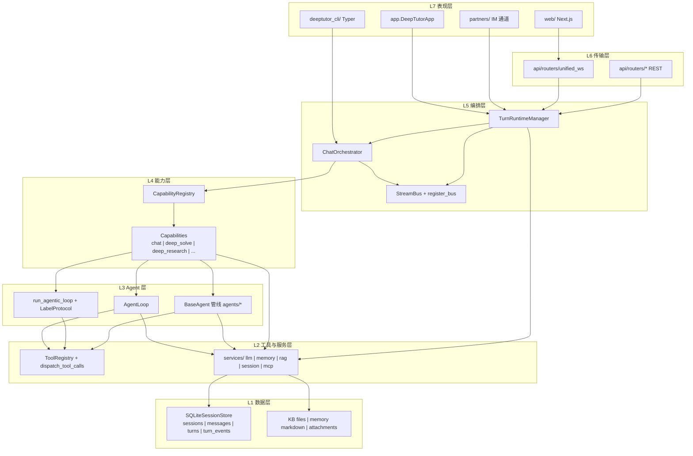

#### 1.2.2 全栈实体全景（客户端 · 运行时 · 服务）

> **重要**：下图覆盖 Next.js Web、Typer CLI、统一 WS、编排链、Capability/Agent/Tool 插件、服务层与 SQLite/文件存储的**完整实体边界与调用链**。后续精简文档时**不得删除**；若需更新，应在本节增补而非挪走。

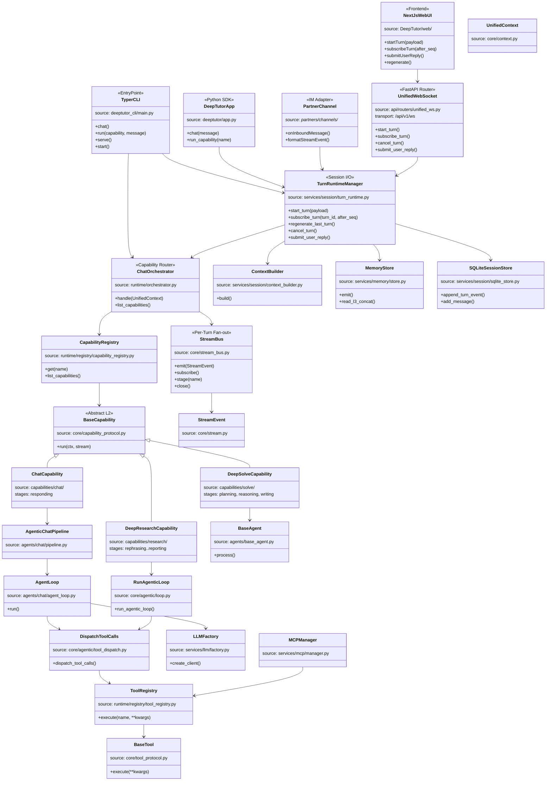

#### 1.2.3 运行时核心实体（源码级 classDiagram）

下图与 §1.2.2 互补：只画 **`DeepTutor/deeptutor/` 进程内** 的真实 Python 类型与字段关系。

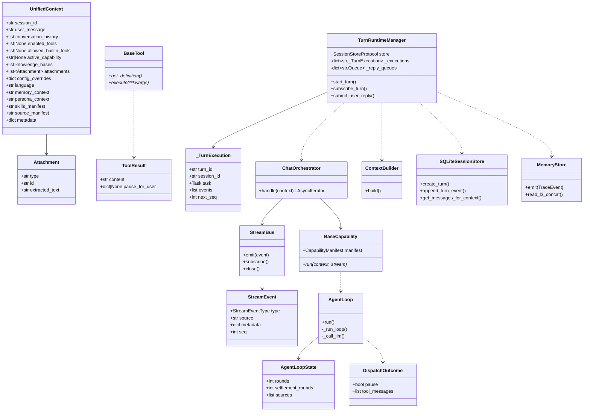

#### 1.2.4 核心实体属性速查

| 实体 | 源码 | 核心属性 / 方法 | 关系 |
|------|------|-----------------|------|
| **UnifiedContext** | `core/context.py` | `session_id`, `user_message`, `conversation_history`, `active_capability`, `enabled_tools`, `metadata.turn_id` | Turn 输入契约 |
| **Attachment** | `core/context.py` | `type`, `id`, `url`/`base64`, `extracted_text` | N:1 UnifiedContext |
| **TurnRuntimeManager** | `services/session/turn_runtime.py` | `store`, `_executions`, `_reply_queues`; `start_turn`, `subscribe_turn`, `submit_user_reply` | Web/API 组合根 |
| **_TurnExecution** | 同上 | `turn_id`, `events[]`, `next_seq`, `task`, `subscribers` | 进程内 live turn |
| **ChatOrchestrator** | `runtime/orchestrator.py` | `_cap_registry`, `_tool_registry`; `handle()` | 薄路由 + StreamBus 生命周期 |
| **StreamBus** | `core/stream_bus.py` | `_history`, `emit`, `subscribe`, `stage`, `close` | `register_bus(turn_id)` 供 WS 重连 |
| **StreamEvent** | `core/stream.py` | `type`, `source`, `stage`, `content`, `metadata`, `seq` | UI/审计投影 |
| **BaseCapability** | `core/capability_protocol.py` | `manifest`; `run(ctx, stream)` | L2；拥有整轮 |
| **AgentLoop** | `agents/chat/agent_loop.py` | `run()`, `_run_loop()`, `_call_llm()` | narration/finish 语义 |
| **BaseTool** | `core/tool_protocol.py` | `get_definition()`, `execute()` → `ToolResult` | L1；单次调用 |
| **dispatch_tool_calls** | `core/agentic/tool_dispatch.py` | → `DispatchOutcome` | 并行上限 8 |
| **ContextBuilder** | `services/session/context_builder.py` | `build()` → `ContextBuildResult` | turn 开始前摘要 |
| **SQLiteSessionStore** | `services/session/sqlite_store.py` | `sessions`, `messages`, `turns`, `turn_events` | 默认持久化 |
| **MemoryStore** | `services/memory/store.py` | `emit`, `read_l3_concat`, `update_l2/l3` | L1–L3 |
| **UnifiedWebSocket** | `api/routers/unified_ws.py` | `start_turn`, `subscribe_turn`, `regenerate` | `/api/v1/ws` |

**会话数据四概念**（勿称 L0–L3，避免与 Memory L1–L3、运行时 L7–L1、Tool L1 冲突）：

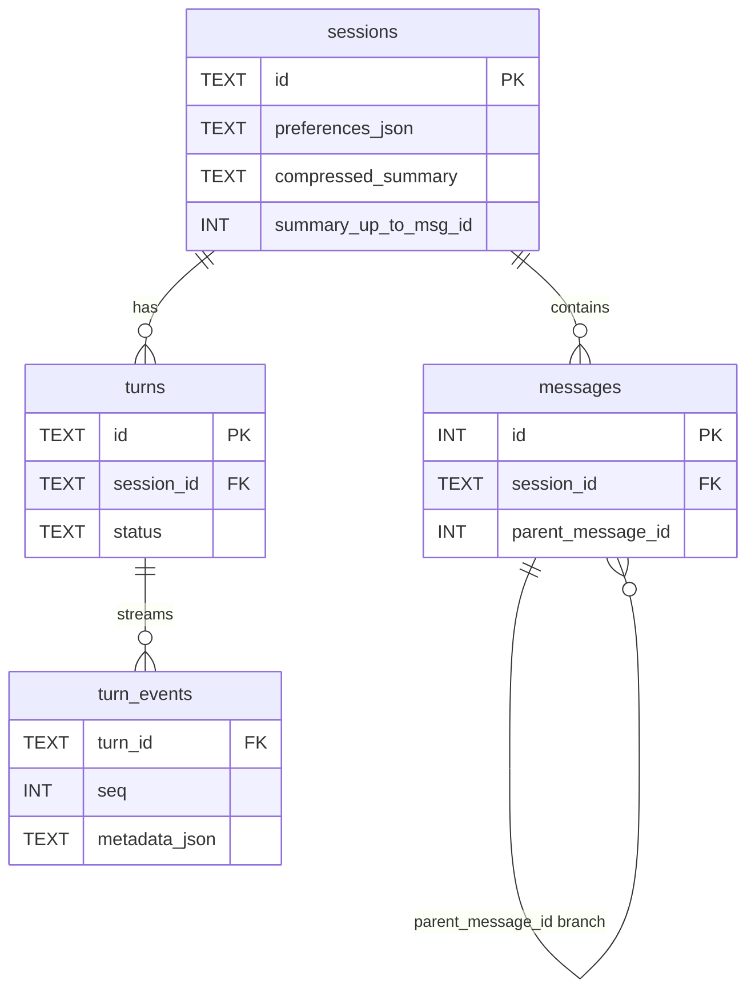

| 概念 | 源码锚点 | 持久化 | 关系与用途 |
|------|----------|--------|------------|
| **Session** | `session_id` | `sessions` + `preferences_json` + 摘要水位 | 根；KB、mastery_path、语言 |
| **Turn** | `turn_id` | `turns` + **`turn_events` 全流** | Session 1:N；执行边界、subscribe、regenerate |
| **Message** | `messages.id`, `parent_message_id` | `messages` | Session 1:N **树**，**跨 Turn**；ContextBuilder、分支 |
| **Agent round（trace）** | `call_id`, `call_role` in metadata | **`turn_events` 子集** | Turn 内 trace；finish 终稿 → `messages.content` |

完整字段见 [ENTITY §3](./ENTITY_AND_SEQUENCES.md#3-持久化-ersqlite)；整合叙述见 [all.md §1](./all.md#深入一层会话数据四概念勿与-memory-l1l3--运行时-l7l1--tool-l1-混淆)。

#### 1.2.5 `deeptutor/` 仓库分层目录

```text
DeepTutor/
├── deeptutor_cli/              # Typer CLI（chat / run / serve / kb / partner）
├── web/                        # Next.js（消费 unified_ws）
└── deeptutor/
    ├── app.py                  # DeepTutorApp SDK
    ├── api/routers/            # unified_ws, settings, system, auth
    ├── runtime/                # orchestrator, launcher, registry, bootstrap
    ├── core/                   # context, stream, protocols, agentic/*
    ├── capabilities/           # L2 插件 + prompts/{en,zh}/
    ├── agents/                 # AgentLoop, BaseAgent, 各 capability 管线
    ├── tools/builtin/          # L1 工具
    ├── services/
    │   ├── session/            # TurnRuntimeManager, ContextBuilder, sqlite_store
    │   ├── llm/ memory/ rag/ mcp/ config/ skill/
    ├── knowledge/ skills/ learning/ book/ co_writer/ partners/
    ├── multi_user/ events/ i18n/ config/
```

#### 1.2.6 控制面与数据面分离

| 平面 | 载体 | 谁读写 |
|------|------|--------|
| **控制面** | WS `start_turn` / `submit_user_reply` / `cancel` / `regenerate` | 前端写、TurnRuntime 读 |
| **数据面（模型）** | OpenAI `messages[]` in `UnifiedContext` | AgentLoop / pipeline 追加 |
| **数据面（UI）** | `StreamEvent` 流 | StreamBus → WS / CLI |
| **审计** | `turn_events` 表 + `messages` 表 | TurnRuntime 双写 |

Web 路径唯一执行入口：`TurnRuntimeManager.start_turn` → `ChatOrchestrator.handle`。CLI `deeptutor run` 可直调 Orchestrator（无 TRM 持久化）。

### 1.3 设计不变量（源码级）

| # | 不变量 | 违反时的症状 | 源码锚点 |
|---|--------|--------------|----------|
| 1 | **单一编排入口** — CLI/WS/SDK 均经 `ChatOrchestrator.handle` | 双路径行为分叉、事件格式不一致 | `runtime/orchestrator.py` |
| 2 | **Turn 与 Stream 绑定** — `turn_id` 注册 `StreamBus`，支持重连补发 | WS 断线后 UI 状态错乱 | `stream_bus.register_bus` |
| 3 | **narration ≠ answer** — 有 tool_calls 的轮次文本是铺垫，不写入持久化答案 | 侧边栏显示工具前言为最终回复 | `agent_loop.py` `call_role` |
| 4 | **Tool 与 Capability 正交** — Tool 单次调用；Capability 拥有整轮 | 在 chat 里硬编码 deep_solve 阶段 | `tool_protocol` / `capability_protocol` |
| 5 | **上下文预算与截断分离** — `context_budget` 仅信息性；截断在 `ContextBuilder` | 误以为 budget 会自动裁剪 | `context_builder.py` |
| 6 | **Memory 可编辑** — L2/L3 为 Markdown + 脚注，用户可手改 | 黑盒向量记忆无法审计 | `services/memory/document.py` |

---

## 第2章：启动与配置

### 2.1 入口点

| 入口 | 路径 | 启动方式 |
|------|------|----------|
| CLI | `deeptutor_cli/main.py` | `deeptutor chat` / `deeptutor run <cap> "..."` |
| API | `deeptutor/api/` + `unified_ws.py` | `deeptutor serve` / `deeptutor start` |
| SDK | `deeptutor/app.py` `DeepTutorApp` | `pip install deeptutor` 后 Python 调用 |
| 组合启动 | `runtime/launcher.py` | 后端端口发现 + 前端一起起 |

**关键路径**：Web/CLI 的「发消息」**不**直接调 Capability，而是 `TurnRuntimeManager.start_turn` → 后台 task → `ChatOrchestrator.handle`。

### 2.2 配置原则

**运行时设置** → `data/user/settings/*.json`（`services/config/runtime_settings.py`）

- 项目根 `.env` **故意忽略**（避免与多用户/容器部署冲突）
- 进程环境变量可覆盖 JSON（文档见 `AGENTS.md`）

### 2.3 依赖分层

```
pip install deeptutor       # CLI + Web + 打包前端
pip install deeptutor-cli     # 仅 CLI + LLM + RAG
.[server] / .[partners] / .[math-animator]  # 可选 extra
```

---

## 第3章：ChatOrchestrator — 统一编排入口

### 3.1 设计原理

| 原理 | 含义 |
|------|------|
| **薄编排** | Orchestrator 不做 LLM 调用、不做持久化；只路由 Capability + 管理 StreamBus 生命周期 |
| **默认 chat** | `active_capability is None` → `"chat"` |
| **失败可观测** | 未知 capability 仍走完整 Stream 协议（ERROR + DONE），前端无需特殊分支 |
| **完成广播** | `EventBus.CAPABILITY_COMPLETE` 供 Partners / 分析模块订阅 |

### 3.2 职责（源码）

```26:47:DeepTutor/deeptutor/runtime/orchestrator.py
class ChatOrchestrator:
    """
    Routes a ``UnifiedContext`` to the correct capability, manages
    the ``StreamBus`` lifecycle, and publishes completion events.
    """

    async def handle(self, context: UnifiedContext) -> AsyncIterator[StreamEvent]:
        """
        Execute a single user turn and yield streaming events.

        If ``context.active_capability`` is set, the corresponding capability
        handles the turn. Otherwise, the default ``chat`` capability is used.
        """
```

### 3.3 控制流

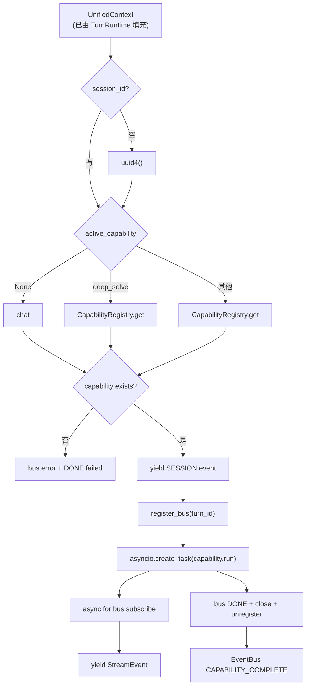

### 3.4 StreamBus 生命周期

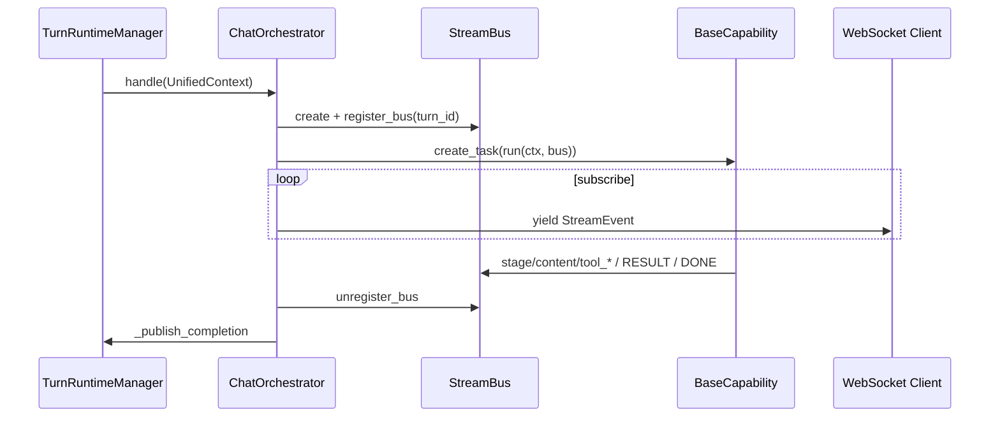

阶段约定：

1. 创建 `StreamBus`，若 `metadata.turn_id` 存在则 `register_bus(turn_id)`（支持 WS 中途 `subscribe_turn`）
2. Capability 内 `async with stream.stage(...)` 发 `STAGE_START/END`
3. `finally` 块发 `DONE`（`metadata.status` = completed/failed），`close()`，`unregister_bus`
4. 外层 `await task` 确保 capability 完全结束后再发 `CAPABILITY_COMPLETE`

### 3.5 与 TurnRuntime 的分工

| 组件 | 负责 | 不负责 |
|------|------|--------|
| `TurnRuntimeManager` | 建 turn、持久化事件、组装 `UnifiedContext`、ask_user 队列 | Capability 选择逻辑 |
| `ChatOrchestrator` | Capability 路由、StreamBus、完成事件 | 用户消息入库、历史裁剪 |

---

## 第4章：TurnRuntimeManager — Turn 执行与持久化边界

### 4.1 设计原理

TurnRuntime 是 **Web/API 路径的「Session Io」**：把一次用户提交变成后台 asyncio 任务，并把 `StreamEvent` **同时** 推给 live 订阅者与 SQLite `turn_events`。

| 原理 | 含义 |
|------|------|
| **进程本地 liveness** | `running` 状态以本进程 `_executions` 为准；重启后孤儿 turn 标 `failed` |
| **双通道事件** | 内存 `execution.events` + DB `append_turn_event`，`seq` 单调递增 |
| **答案与轨迹分离** | narration 轮次的 content 不进 `messages` 表最终答案 |
| **暂停可恢复** | `ask_user` 通过 `_reply_queues[turn_id]` 与 WS `submit_user_reply` 对接 |

### 4.2 核心数据结构

```603:619:DeepTutor/deeptutor/services/session/turn_runtime.py
@dataclass
class _TurnExecution:
    turn_id: str
    session_id: str
    capability: str
    payload: dict[str, Any]
    task: asyncio.Task[None] | None = None
    subscribers: list[_LiveSubscriber] = field(default_factory=list)
    events: list[dict[str, Any]] = field(default_factory=list)
    next_seq: int = 1
    events_flushed: bool = False
```

```621:640:DeepTutor/deeptutor/services/session/turn_runtime.py
class TurnRuntimeManager:
    """Run one turn in the background and multiplex persisted/live events."""
    # ...
    # Per-turn reply queues used by tools that pause the agentic
    # loop (e.g. ``ask_user``).
    self._reply_queues: dict[str, asyncio.Queue[dict[str, Any] | None]] = {}
```

### 4.3 `start_turn` 阶段表

| 阶段 | 行为 | 源码要点 |
|------|------|----------|
| S1 | 校验 capability config、`validate_capability_config` | 剥离 `_persist_user_message` 等 runtime-only 键 |
| S2 | `ensure_session`、合并 preferences（persona、llm_selection、tools、KB） | 多用户 `apply_allowed_llm_selection` |
| S3 | `_recover_orphan_running_turns_for_session` | 清陈旧 `running` |
| S4 | `create_turn`、注册 `_TurnExecution`、发 `SESSION` 事件 | |
| S5 | `asyncio.create_task(_run_turn)` | 后台执行 |

### 4.4 `_run_turn` 主路径

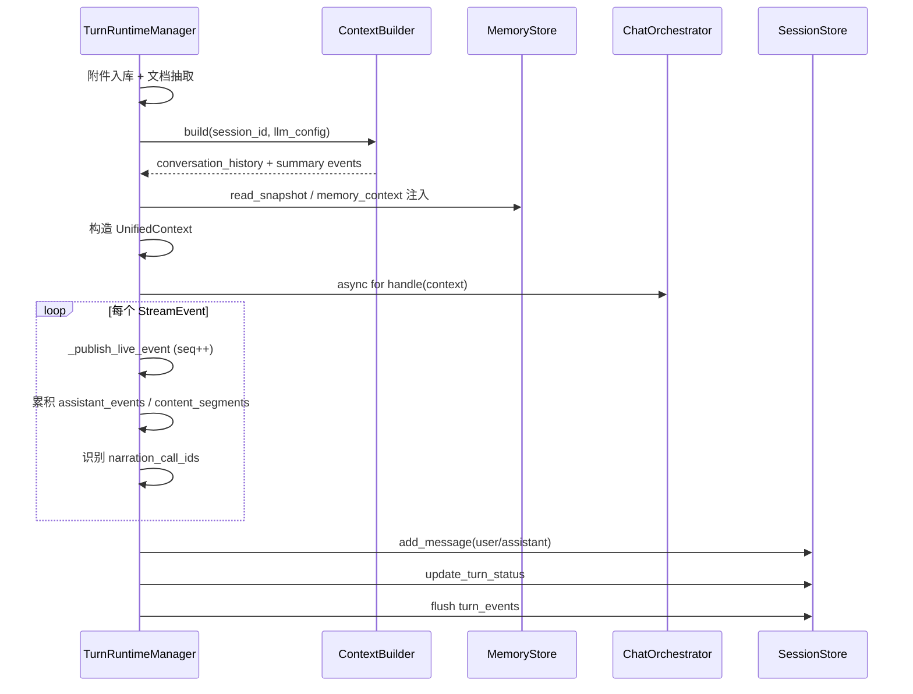

### 4.5 narration 过滤与持久化答案

`_narration_marker_call_id` 识别 `call_role == "narration"` 且 `answer_visible is not True` 的 trace 完成事件；`_assemble_persisted_answer` 在拼接 content 时排除这些 `call_id`：

```77:108:DeepTutor/deeptutor/services/session/turn_runtime.py
def _narration_marker_call_id(event: StreamEvent) -> str | None:
    """call_id of a chat-loop round that resolved as narration ..."""
    metadata = event.metadata or {}
    if (
        metadata.get("trace_kind") == "call_status"
        and metadata.get("call_state") == "complete"
        and metadata.get("call_role") == "narration"
        and metadata.get("answer_visible") is not True
    ):
        ...
```

**DSML 例外**：DeepSeek 等 provider 在同一轮同时输出用户可见 prose + tool call 时，`answer_visible=True` 保留该 prose 进入答案。

### 4.6 `subscribe_turn` 与重连

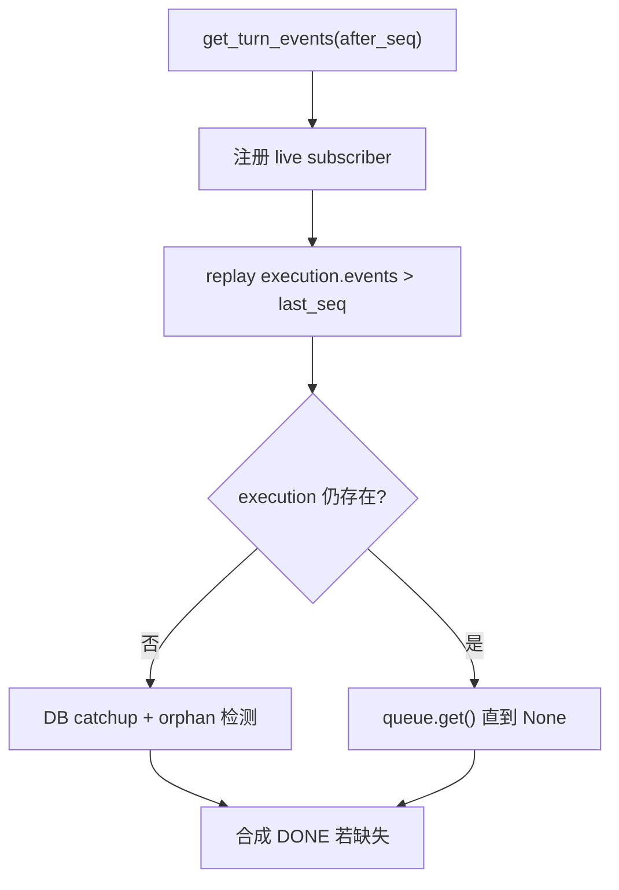

- `after_seq` 支持 WS 断线续传
- 若 live 结束未见 `DONE`，对 **已终止** turn 合成 `synthesized: true` 的 DONE（`ask_user` 暂停中的 running turn **不**合成，避免 UI 误判完成）

### 4.7 Regenerate / Cancel / ask_user

| API | 语义 |
|-----|------|
| `regenerate_last_turn` | 删尾部 assistant、新 `turn_id`、`_persist_user_message=False` |
| `cancel_turn` | `task.cancel()` + status `cancelled` |
| `submit_user_reply` | 向 `_reply_queues[turn_id]` 投递，AgentLoop 内 `await` 恢复 |

---

## 第5章：双层插件：Tool vs Capability

### 5.1 设计原理

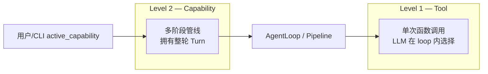

| | Tool | Capability |
|--|------|------------|
| **协议** | `core/tool_protocol.py` `BaseTool` | `core/capability_protocol.py` `BaseCapability` |
| **注册** | `runtime/registry/tool_registry.py` | `runtime/registry/capability_registry.py` |
| **粒度** | 一次 `execute()` | `run(ctx, stream)` 多 stage |
| **用户感知** | Settings 开关 / `--tool` | `deeptutor run <cap>` / UI 模式 |
| **结束契约** | 返回 `ToolResult` | `emit_capability_result()` 统一信封 |

### 5.2 Level 1 — Tools

```47:61:DeepTutor/deeptutor/core/tool_protocol.py
@dataclass
class ToolDefinition:
    name: str
    description: str
    parameters: list[ToolParameter] = field(default_factory=list)
    raw_parameters: dict[str, Any] | None = None  # MCP 等完整 JSON Schema
```

**条件挂载**（`agents/_shared/tool_composition.py`）：

```46:57:DeepTutor/deeptutor/agents/_shared/tool_composition.py
_CONDITIONAL_MOUNT_FLAGS: dict[str, str] = {
    "rag": "has_kb",
    "read_source": "has_sources",
    "read_memory": "has_memory",
    "read_skill": "has_skills",
    ...
}
```

`compose_enabled_tools(user_toggles, ToolMountFlags)` = 用户 toggles ∪ 上下文门控 ∪ `--tool` 强制。

### 5.3 Level 2 — Capabilities

| Capability | Stages | 引擎 |
|------------|--------|------|
| `chat` | `responding` | `AgentLoop` |
| `mastery_path` | `responding` | `AgentLoop` + mastery 工具 |
| `deep_solve` | planning → reasoning → writing | 多 `BaseAgent` |
| `deep_research` | rephrasing → … → reporting | `run_agentic_loop` per stage |
| `deep_question` | ideation → generation | `BaseAgent` |
| `visualize` | analyzing → generating → reviewing | 多 Agent |
| `math_animator` | concept_* → render_output | 独立 pipeline |

**统一结果信封**: `capabilities/_shared.py` → `emit_capability_result(response, cost_summary)`

### 5.4 何时用哪种引擎

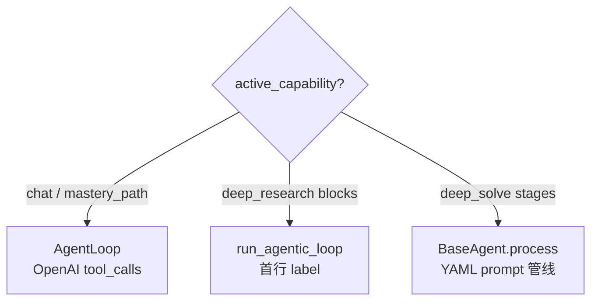

---

## 第6章：Message 与 StreamEvent 三层投影

### 6.1 两套协议

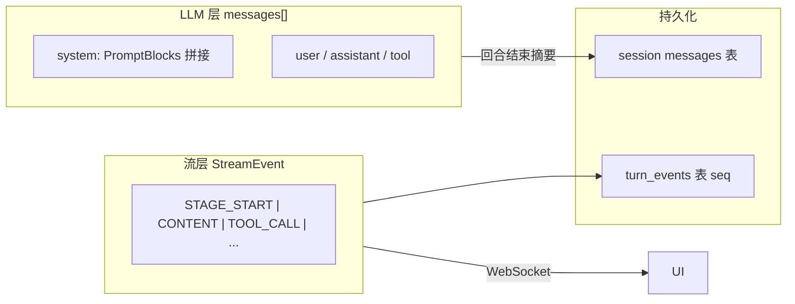

### 6.2 StreamEventType

| 类型 | 用途 |
|------|------|
| `STAGE_START/END` | Capability 阶段边界 |
| `THINKING/CONTENT` | 模型输出分流 |
| `TOOL_CALL/TOOL_RESULT` | 工具轨迹 |
| `RESULT` | capability 结束信封 |
| `WAIT_FOR_INPUT` | `ask_user` 暂停 |
| `DONE` | Turn 终止（含 status） |

`StreamEvent` 含 `session_id`、`turn_id`、`seq`（有序回放）。

### 6.3 Chat PromptBlocks

`ChatPromptAssembler`（`prompt_blocks.py`）将 blocks 排序拼接为 **单一 system string**：

| PromptBlock.name | 段落 |
|----------------|------|
| `general` / `runtime_policy` / `loop` | 固定 preamble |
| `persona_style` | Persona |
| `memory` | memory_context |
| `tools` | 工具清单 |
| `skills` | skills_manifest |
| `sources` | 附件源 manifest |
| `capability` | 独占 capability playbook |

`context_budget.py` 在每轮 LLM 调用后统计 token 占用（**信息性**，不阻断）。

---

## 第7章：AgentLoop — narration / finish 语义

### 7.1 设计声明（源码注释）

```1:24:DeepTutor/deeptutor/agents/chat/agent_loop.py
"""Single-loop chat agent.

One chat turn = ONE agent loop over a single growing conversation:

* each round is one LLM call; its text streams to the user as a ``content``
  block, and its tool calls are dispatched with their ``role=tool`` results
  appended back into the conversation;
* a round that DOES call tools is "narration" — its text is a preamble to
  the tool work — and the loop continues;
* a round that calls NO tools is the ``finish``: its text IS the final
  user-facing answer and the loop ends
```

**无单独 respond pass** — 与旧双阶段 chat 不同。每轮文本 **实时流式**；轮次结束时 `call_role` 告知前端如何渲染。

### 7.2 设计原理

| 原理 | 含义 |
|------|------|
| **流式即真相** | 不猜测「这段文字是中间态还是最终答案」；用 `call_role` 事后标注 |
| **单会话增长** | 同一 `messages[]` 贯穿 exploration + settlement + finish |
| **预算分层** | exploration 预算 + `MAX_SETTLEMENT_ROUNDS=3` + 一次 forced finish |
| **可恢复失败** | 非首轮 LLM 失败 → `_forced_finish`  salvage，而非丢 turn |

### 7.3 状态机

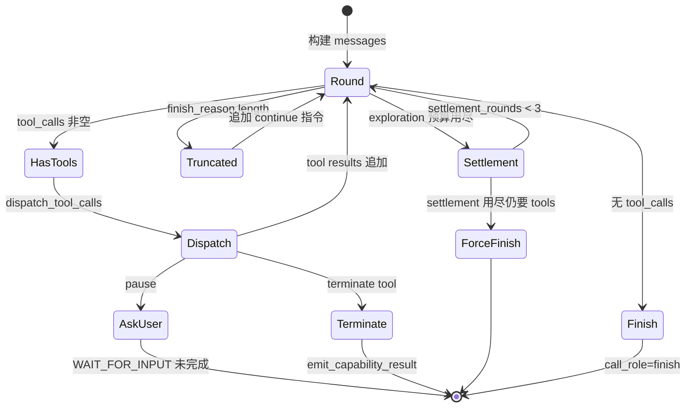

### 7.4 `call_role` 发射逻辑

```760:775:DeepTutor/deeptutor/agents/chat/agent_loop.py
        completion_metadata: dict[str, Any] = {
            "trace_kind": "call_status",
            "call_state": "complete",
            "call_role": "narration" if tool_calls or truncated_round else "finish",
        }
        if (dsml_calls or truncated_round) and answer_content_emitted:
            completion_metadata["answer_visible"] = True
```

| `call_role` | 条件 | UI / 持久化 |
|-------------|------|-------------|
| `narration` | 本轮有 tool_calls，或 token 截断续写中 | 默认不进最终答案 |
| `finish` | 无 tool_calls 且非截断续写 | 文本即答案 |
| `narration` + `answer_visible` | DSML 同轮 prose+tool | prose 保留在答案中 |

### 7.5 Settlement 与 Forced Finish

- **Exploration rounds** — `effective_max_rounds(context)`，默认来自 chat params
- **Settlement** — 预算用尽后注入 `_settle_exhausted_instruction()`，仍允许 tools（含 ask_user 边界）
- **Forced finish** — settlement 用尽后 `tool_schemas=None` 强制无工具一轮

### 7.6 Context Checkpoint

工具可通过 `metadata._context_checkpoint.summary` 触发 `_fold_context_checkpoint`：将 checkpoint 之前 messages 折叠为一条 system `[Context checkpoint]`，防止长工具输出撑爆窗口。

---

## 第8章：dispatch_tool_calls — 并行工具分发

### 8.1 设计原理

`core/agentic/tool_dispatch.py` 从 chat pipeline **提升**为 capability 无关原语：

| 原理 | 含义 |
|------|------|
| **并行默认** | `asyncio.gather`，上限 `MAX_PARALLEL_TOOL_CALLS = 8` |
| **批内去重** | 相同 (tool, args) 只执行一次；`ask_user` 更严：批内第二个一律 stub |
| **子轨迹隔离** | 每个 tool call 独立 `call_id` trace |
| **失败可恢复** | 单工具失败用 `progress`+`call_state=error`，不升维为 turn 级 ERROR |
| **pause 优先** | 第一个 `pause_for_user` 获胜；其他 parallel 工具仍执行 |

### 8.2 DispatchOutcome

```55:75:DeepTutor/deeptutor/core/agentic/tool_dispatch.py
@dataclass(frozen=True)
class DispatchOutcome:
    sources: list[dict[str, Any]] = field(default_factory=list)
    tool_messages: list[dict[str, Any]] = field(default_factory=list)
    tool_metadata_by_id: dict[str, dict[str, Any]] = field(default_factory=dict)
    terminate: bool = False
    terminate_payload: dict[str, Any] | None = None
    pause: bool = False
    pause_payload: dict[str, Any] | None = None
    pause_tool_call_id: str | None = None
```

### 8.3 执行流

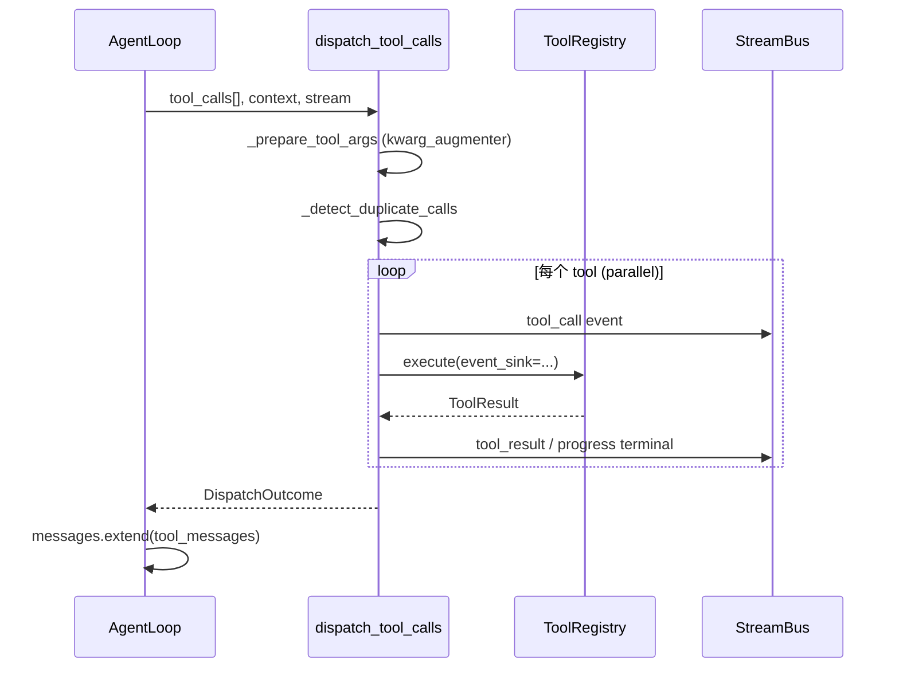

### 8.4 可注入钩子

| 钩子 | 用途 |
|------|------|
| `kwarg_augmenter` | chat 注入 `source_index` 等服务端字段 |
| `retrieve_meta_factory` | RAG 类工具 UI 显示为 Retrieve 子轨迹 |
| `unknown_error_message_factory` | i18n 错误文案 |

`execute_tool_call` 也可被 capability **单工具**路径直接调用（不经并行批）。

---

## 第9章：ContextBuilder — 历史裁剪与 LLM 摘要

### 9.1 设计原理

| 原理 | 含义 |
|------|------|
| **预算比例制** | `history_budget = context_window × 0.35`；summary 占 budget 的 40% |
| **水位线** | `summary_up_to_msg_id` 标记已摘要消息；仅成功摘要后推进 |
| **分支安全** | edit-branch 时若水位线不在祖先链上，丢弃旧 summary 重建 |
| **抗漂移** | 前缀仍 fit `rebuild_source_budget` 时从 **原始消息** 重摘要，非 summary-of-summary |
| **降级** | 摘要失败 → 保留旧 summary + 硬 pop 最旧消息直到 fit |

### 9.2 算法流

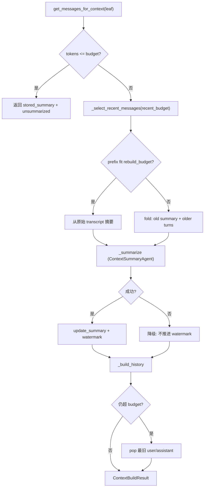

### 9.3 与 AgentLoop 的关系

- TurnRuntime 在 `_run_turn` 开头调用 `ContextBuilder.build()` → 填入 `UnifiedContext.conversation_history`
- AgentLoop 每轮 `_guard_context_window` 是 **第二轮防线**（针对单 turn 内 messages 膨胀）
- `on_event` 回调可将摘要阶段 progress 流入 live turn（source 过滤为 `context_builder` 以外）

### 9.4 关键 API

```348:367:DeepTutor/deeptutor/services/session/context_builder.py
    async def build(
        self,
        *,
        session_id: str,
        llm_config: LLMConfig,
        language: str = "en",
        on_event: Callable[[StreamEvent], Awaitable[None]] | None = None,
        leaf_message_id: int | None = None,
    ) -> ContextBuildResult:
```

`leaf_message_id` 支持 **消息树分支**：只取该叶节点祖先链上的消息。

---

## 第10章：Memory L1–L3 体系

### 10.1 三层模型

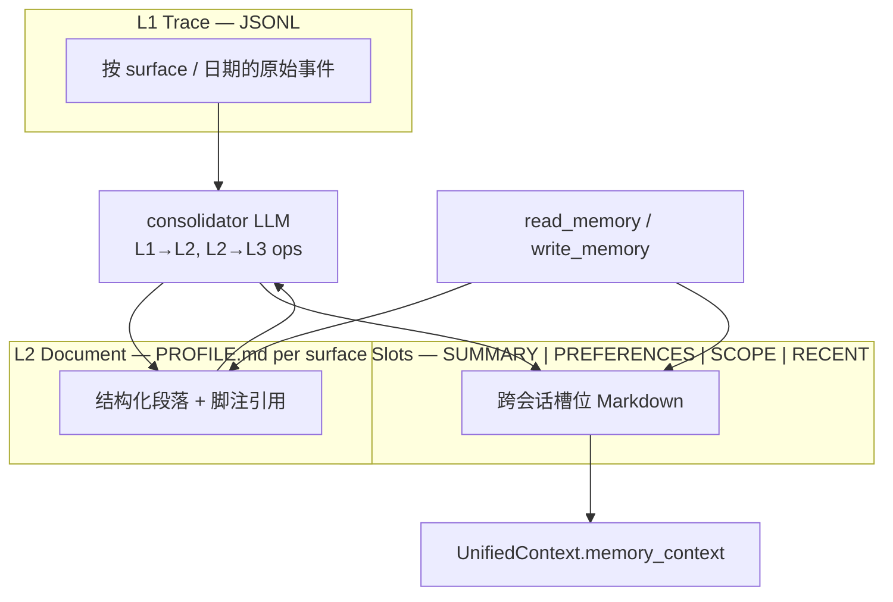

```1:12:DeepTutor/deeptutor/services/memory/__init__.py
"""Three-layer memory subsystem.
- trace   : L1 raw event capture
- document: L2/L3 markdown + footnote citations
- consolidator: LLM-driven L1→L2 and L2→L3 ops
"""
```

### 10.2 MemoryStore 门面

```68:102:DeepTutor/deeptutor/services/memory/store.py
class MemoryStore:
    """Stateless facade. Safe to call as a process-wide singleton."""

    async def emit(self, event: TraceEvent) -> None:
        await trace.append(event)

    def read_l3_concat(self) -> str:
        """Concatenate all four L3 docs for the ``read_memory`` tool."""
```

| API | 层 | 用途 |
|-----|-----|------|
| `emit(TraceEvent)` | L1 | 追加原始 trace |
| `read_doc` / `read_raw` | L2/L3 | 读 Markdown |
| `read_l3_concat` | L3 | 注入 system / `read_memory` 工具 |
| `update_l2` / `update_l3` | L2/L3 | consolidator 合并 |
| `apply_ops_payload` | L2/L3 | Workbench 预览→应用 ops |
| `write_preference` | L3 preferences | 用户显式偏好写入 |

### 10.3 文档格式与可解释性

`document.py` — Markdown + 脚注 `[^1]` + HTML comment entry id `<!--m_xxx-->`，round-trip 幂等。用户可在 Memory 页面直接编辑 L2/L3。

### 10.4 Turn 集成

TurnRuntime `_run_turn` 中：

1. `get_memory_store().read_snapshot(surface)` → `memory_context`
2. 客户端 `memory_references` 可选择性提示 L3 slot（v2 实际 `read_l3_concat` 返回全量）
3. Turn 结束且非 regenerate 时触发 L1 emit + 可选 async consolidate

### 10.5 工具接口

| Tool | 行为 |
|------|------|
| `read_memory` | 读当前 L3 快照进上下文 |
| `write_memory` | 经 ops 写 L2/L3（guards） |
| `partner_read_memory` / `partner_write_memory` | Partners 独立 surface |

---

## 第11章：run_agentic_loop — 标签驱动第二引擎

### 11.1 为何需要第二引擎

| | `AgentLoop` (chat) | `run_agentic_loop` |
|--|-------------------|---------------------|
| 协议 | OpenAI `tool_calls` / DSML | **首行 label** + 正文 |
| 终止 | 无 tool_calls | `terminal` 标签集 |
| 违例 | provider 错误 | protocol repair message 再采样 |
| 典型用途 | 默认对话 | deep_research block/report、部分 solve 阶段 |

### 11.2 LabelProtocol

```39:64:DeepTutor/deeptutor/core/agentic/loop.py
@dataclass(frozen=True)
class LabelProtocol:
    allowed: tuple[str, ...]
    terminal: frozenset[str]
    intermediate: frozenset[str]
    final: frozenset[str]
    tool_label: str | None
```

- `terminal` — 退出循环
- `intermediate` — 保留 prose 为 assistant context，继续迭代
- `final` — 该标签的 post-label 文本 **流式给用户**（可与 intermediate 重叠，如 `PAUSE`）
- `tool_label` — 本轮走 `dispatch_tools`

### 11.3 LoopHost 回调

```79:149:DeepTutor/deeptutor/core/agentic/loop.py
class LoopHost(Protocol):
    async def guard_context_window(self, messages: list[dict[str, Any]]) -> None: ...
    async def dispatch_tools(self, *, iteration: int, tool_calls: list[dict[str, Any]]) -> DispatchOutcome: ...
    async def resolve_pause(self, dispatch: DispatchOutcome) -> bool: ...
    async def on_intermediate(self, label: str, text: str) -> str | None: ...
    async def force_finalize(self, *, messages: list[dict[str, Any]], start_iteration: int) -> tuple[str, bool, int]: ...
```

`deep_research/pipeline.py` 为 rephrase / decompose / block / report 各 stage 定义独立 `LabelProtocol`；`_BlockLoopHost.on_intermediate` 在 `APPEND` 标签时扩展动态队列。

### 11.4 主循环流

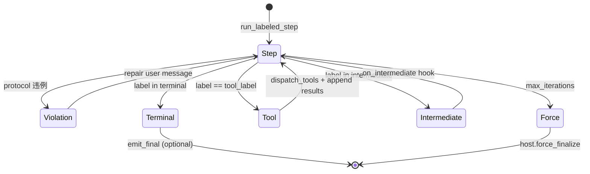

协议违例类型：`missing_label`、`multiple_labels`、`tool_without_calls`、`{label}_with_tools`。

---

## 第12章：Session 与 Turn 持久化

### 12.1 双存储代际

| 代际 | 管理器 | 存储 |
|------|--------|------|
| Legacy | `SessionManager`（chat） | `data/.../chat/sessions.json` |
| 统一 | `UnifiedSessionManager` | SQLite / PocketBase |

现代接口 `SessionStoreProtocol`：

- `create_session` / `create_turn`
- `append_turn_event(turn_id, event, seq)`
- `get_messages_for_context(session_id, leaf_message_id)` — 支持分支

### 12.2 ER 模型

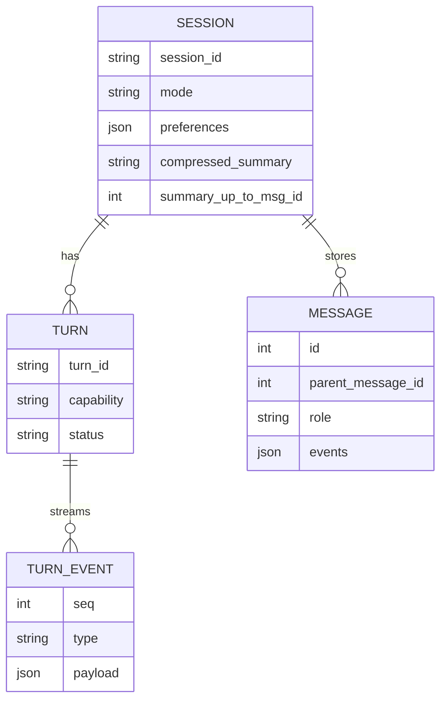

### 12.3 Regenerate 与分支

- **Regenerate** — 保留 user message，新 turn，跳过重复 memory emit
- **Edit branch** — `parent_message_id` 创建兄弟节点；ContextBuilder 只沿祖先链取历史

---

## 第13章：端到端流程总览

### 13.1 WebSocket 第一问

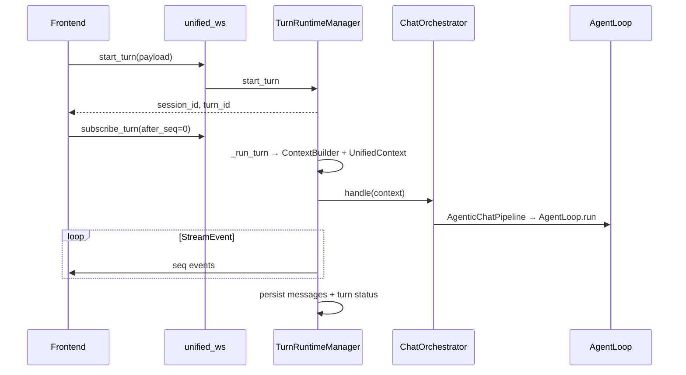

### 13.2 CLI `deeptutor run deep_research`

`active_capability=deep_research` → **不**经过 `AgentLoop` → `agents/research/pipeline.py` 多阶段 `run_agentic_loop`。

### 13.3 与 Codex 对照

| 步骤 | DeepTutor | Codex |
|------|-----------|-------|
| 路由 | `active_capability` | CollaborationMode |
| 循环 | `AgentLoop` / `run_agentic_loop` | `run_turn` |
| 暂停 | `WAIT_FOR_INPUT` + `submit_user_reply` | `UserInputAnswer` Op |
| 压缩 | `ContextBuilder` 摘要 | `run_auto_compact` |
| 事件 | `StreamEvent.seq` | `EventMsg` + Rollout |

---

**下一章**: [ARCHITECTURE_PART2.md](./ARCHITECTURE_PART2.md) — KB/RAG、Skills、Capability 管线深潜、包地图
