# DeepTutor 完整架构设计文档（第二部分）

> **版本**: 2.0 · **整理**: 2026-09-01  
> **体例参照**: [`docs/codex-architecture/ARCHITECTURE_PART2.md`](../codex-architecture/ARCHITECTURE_PART2.md)

---

## 目录

- [第1章：Knowledge Base 与 RAG](#第1章knowledge-base-与-rag)
- [第2章：Skills 渐进披露系统](#第2章skills-渐进披露系统)
- [第3章：MCP 与 Partners 多通道](#第3章mcp-与-partners-多通道)
- [第4章：Capability 管线深潜](#第4章capability-管线深潜)
- [第5章：Sandbox 与代码执行](#第5章sandbox-与代码执行)
- [第6章：多 Agent 与 BaseAgent](#第6章多-agent-与-baseagent)
- [第7章：deeptutor 包地图与模块依赖](#第7章deeptutor-包地图与模块依赖)

---

## 第1章：Knowledge Base 与 RAG

### 1.1 设计原理

| 原理 | 含义 |
|------|------|
| **KB 为显式资源** | 用户/Session 选择 `knowledge_bases[]`；无 KB 则不挂载 `rag` |
| **引用可回放** | 检索片段进入 `ToolResult.sources` → `AgentLoopState.sources` → `StreamEvent.SOURCES` |
| **多引擎可插拔** | LightRAG / LlamaIndex 等 pipeline 在 `services/rag/pipelines/` |
| **Manifest 告知模型** | system `knowledge_base_note` 列出可用 KB 与策略 |

### 1.2 模块架构

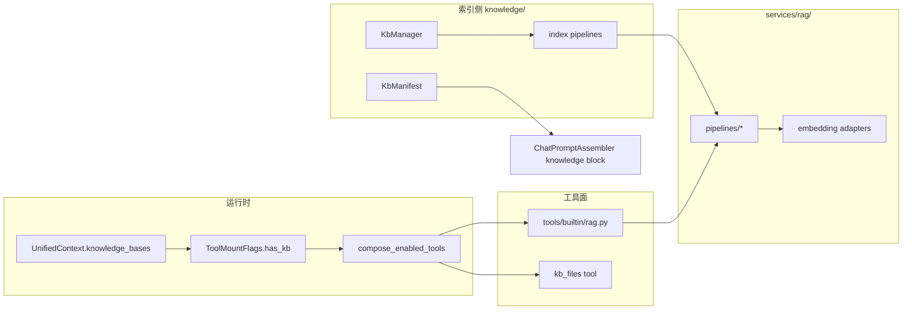

### 1.3 数据流

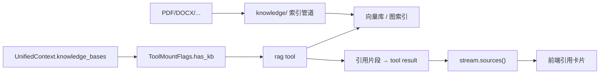

### 1.4 挂载与 CLI

```bash
deeptutor kb create my-kb --doc textbook.pdf
deeptutor kb list
deeptutor run chat "..." --kb physics
```

`compose_enabled_tools` 在 `has_kb=True` 时自动挂载 `rag`、`kb_files`（无需用户在 Settings 勾选）。

### 1.5 RAG Tool 执行路径

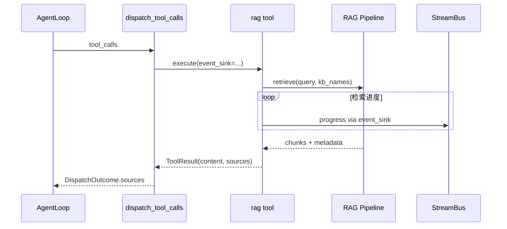

`retrieve_meta_factory` 将 RAG 调用在 UI 上渲染为 **Retrieve** 子轨迹（`trace_role=retrieve`）。

### 1.6 核心类型与文件

| 类型 / 函数 | 文件 | 作用 |
|-------------|------|------|
| `RagTool` | `tools/builtin/rag.py` | LLM 可见检索工具；`execute()` 调 pipeline |
| `KbManifest` | `knowledge/manifest.py` | KB 元数据 → system prompt 块 |
| `ToolMountFlags` | `agents/_shared/tool_composition.py` | `has_kb` 门控 `rag` / `kb_files` |
| `compose_enabled_tools` | 同上 | toggles ∪ 上下文门控 ∪ `--tool` 强制 |
| RAG pipelines | `services/rag/pipelines/` | LightRAG / LlamaIndex 等可插拔后端 |
| `retrieve_meta_factory` | `agents/chat/pipeline.py` | UI 子轨迹 `trace_role=retrieve` |

### 1.7 概念—代码对照

| 设计概念 | 实现 |
|----------|------|
| KB 选择 | `UnifiedContext.knowledge_bases` + `sessions.preferences_json` |
| 无 KB 不挂载 | `ToolMountFlags(has_kb=False)` → `rag` 不在 schema |
| 引用回放 | `ToolResult.sources` → `AgentLoopState.sources` → `StreamEvent.SOURCES` |
| 检索进度 | `ToolEventSink` → `StreamEvent.PROGRESS` |
| Regenerate 复现 | `request_snapshot.knowledge_bases` in turn metadata |

### 1.8 关键模块

| 路径 | 职责 |
|------|------|
| `knowledge/` | KB 创建、索引、manifest |
| `services/rag/` | 检索服务、embedding 适配 |
| `tools/builtin/rag.py` | LLM 可见工具面 |
| `knowledge/manifest.py` | `KbManifest` → prompt block |

### 1.9 与 Session 联动

- Session `preferences.knowledge_bases` 持久化用户选择
- Regenerate 可通过 `overrides.knowledge_bases` 覆盖
- Turn 级 KB 列表进入 `request_snapshot` 便于 regenerate 复现

---

## 第2章：Skills 渐进披露系统

### 2.1 设计原理（对比 Codex）

| | Codex | DeepTutor |
|--|-------|-----------|
| Skill 注入 | Context fragment 一次性注入 | **manifest 一行 + on-demand read** |
| 模型获取全文 | 已在 context | `read_skill(name)` 拉取 SKILL.md |
| 扩展工具 | MCP / 内置 | `load_tools` 延迟加载工具包 |

**动机**：教育场景 skill 数量多、全文长；渐进披露控制 system prompt 体积，同时保留「模型自主发现」能力。

### 2.2 模块架构

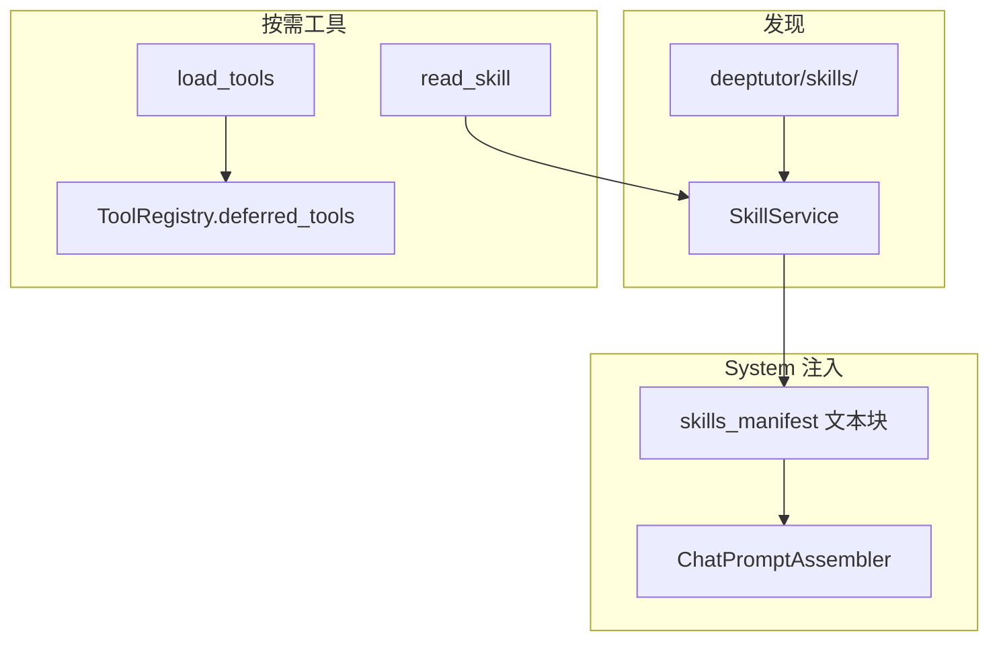

### 2.3 三阶段披露

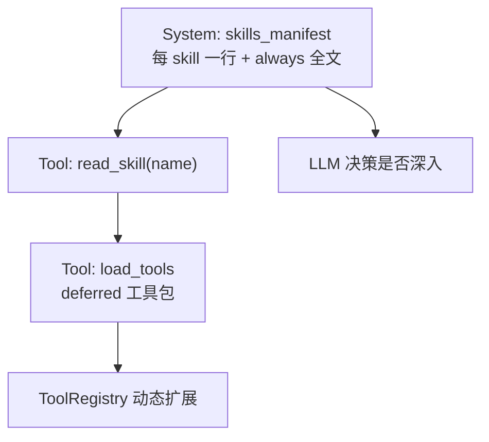

### 2.4 目录与格式

- `deeptutor/skills/` — 内置与可安装 skill 包
- 格式接近 Cursor skill：`SKILL.md` + YAML frontmatter
- `services/skill/` `SkillService` 负责发现、manifest 生成

### 2.5 核心类型与文件

| 类型 | 文件 | 作用 |
|------|------|------|
| `SkillService` | `services/skill/` | 扫描 skill 目录、生成 manifest |
| `ReadSkillTool` | `tools/builtin/read_skill.py` | 按名拉取 `SKILL.md` 全文 |
| `LoadToolsTool` | `tools/builtin/load_tools.py` | 加载 `deferred=True` 工具 schema |
| `BaseTool.deferred` | `core/tool_protocol.py` | MCP 等延迟暴露标记 |
| `UnifiedContext.skills_manifest` | `core/context.py` | TurnRuntime 预填 manifest 块 |

### 2.6 挂载条件

```python
# agents/_shared/tool_composition.py
"read_skill": "has_skills",
"load_tools": "has_skills",  # 条件挂载
```

用户 `--tool read_skill` 可强制启用；`has_skills` 由 skill 目录非空或配置决定。

### 2.7 Capability 独占 Playbook

部分 capability 在 `capabilities/prompts/{en,zh}/` 声明 **独占** playbook（如 `deep_solve.yaml`），与全局 skills **正交**：

- 全局 skills = 跨 capability 可复用工作流
- Capability playbook = 该模式下的阶段指令与状态文案

---

## 第3章：MCP 与 Partners 多通道

### 3.1 设计原理

| 原理 | 含义 |
|------|------|
| **MCP 即 Tool 适配** | 外部 server 工具 → `ToolDefinition(raw_parameters=…)` |
| **渐进暴露** | MCP 工具默认 `deferred=True`，经 `load_tools` 加载 |
| **Provider 可追溯** | `provider_identity()` → `metadata.tool_provider` |
| **Partner 隔离 surface** | 每 IM 伴侣独立 memory surface + `partner_*` 工具 |

### 3.2 MCP Client 架构

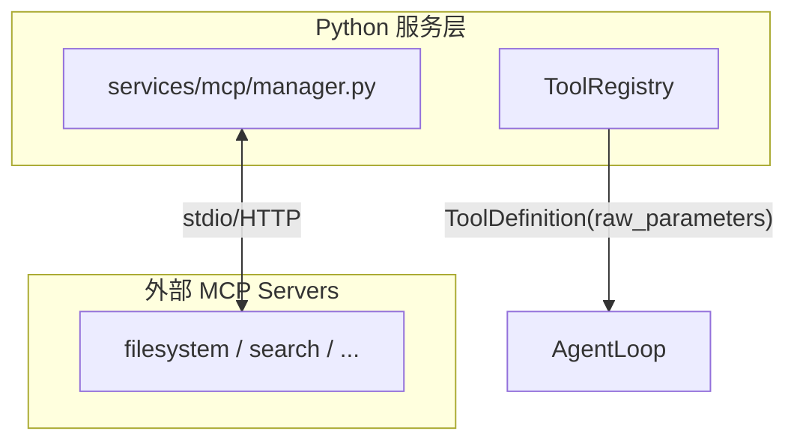

### 3.3 核心类型与文件

| 类型 | 文件 | 作用 |
|------|------|------|
| `MCPManager` | `services/mcp/manager.py` | 连接生命周期、reload |
| `McpToolAdapter` | `services/mcp/` | 上游 schema → `BaseTool` |
| `provider_identity` | `core/tool_protocol.py` | `(kind, provider_id)` 供 UI trace |
| `_provider_of` | `core/agentic/tool_dispatch.py` | 派发时写入 `tool_provider` |
| `ProviderToolView` | `multi_user/` + registry | 用户级 MCP 工具叠加 |

### 3.4 Partners（IM 伴侣）

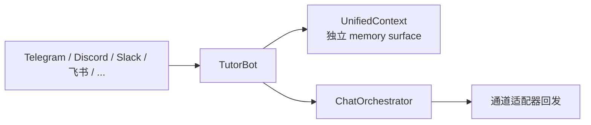

| 设计点 | 说明 |
|--------|------|
| 每 Partner 独立 surface | L2/L3 memory 与 Web 用户隔离 |
| `partner_*` 工具变体 | 替换内置 memory 工具 |
| 同一 runtime | 复用 TurnRuntime + StreamBus 语义 |

```bash
deeptutor partner list
```

### 3.5 端到端数据流（Partner 入站）

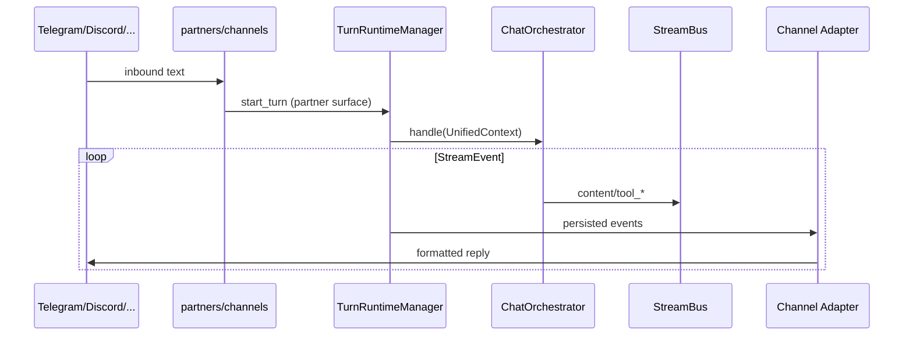

### 3.6 多通道统一

Partner 入站消息 → `UnifiedContext` → `ChatOrchestrator` → StreamBus 事件 → 通道适配器格式化回 IM。Turn 级 `ask_user` 在 IM 上映射为「回复本条消息继续」。

---

## 第4章：Capability 管线深潜

### 4.1 设计原理

| 原理 | 含义 |
|------|------|
| **Stage 即 UX 单元** | `stream.stage(name)` 驱动前端进度条与时间线 |
| **引擎按复杂度选型** | chat=AgentLoop；research block=run_agentic_loop；solve=BaseAgent 编排 |
| **统一出口** | 所有 capability 必须 `emit_capability_result` |
| **i18n 外置** | `capabilities/prompts/{en,zh}/` YAML |

### 4.2 模块架构（Capability 注册与路由）

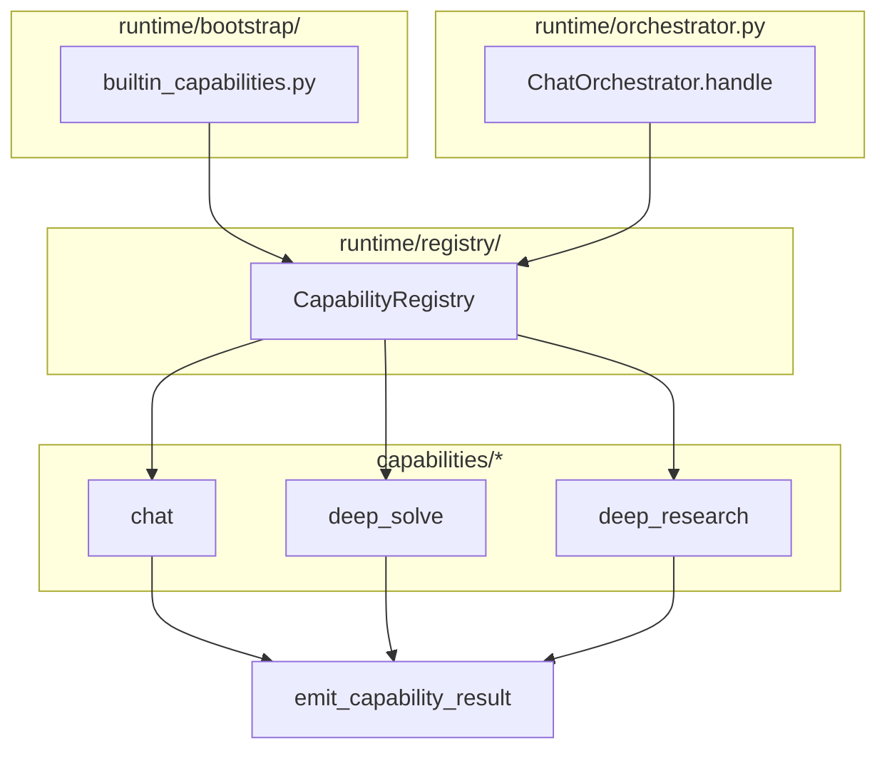

### 4.3 引擎选型决策表

| Capability | 引擎 | 源码锚点 |
|------------|------|----------|
| `chat`, `mastery_path` | `AgentLoop` | `agents/chat/capability.py` |
| `deep_research` (block/report) | `run_agentic_loop` + `LabelProtocol` | `agents/research/pipeline.py` |
| `deep_solve`, `deep_question`, `visualize` | `BaseAgent.process()` stage 链 | `agents/solve/`, `agents/question/` |
| `math_animator` | 长 pipeline + Manim | `agents/math_animator/pipeline.py` |

### 4.4 chat

| 项 | 值 |
|----|-----|
| 实现 | `agents/chat/capability.py` → `AgenticChatPipeline` |
| Stages | `responding`（对外单 stage；内部无 exploring 阶段名） |
| 引擎 | `AgentLoop` |
| 预算 | exploration + settlement + forced finish |

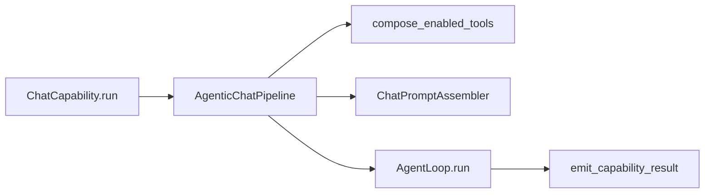

### 4.5 deep_solve

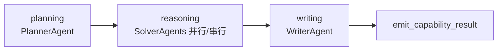

| 模块 | 路径 |
|------|------|
| Capability 类 | `capabilities/deep_solve/` |
| Agents | `agents/solve/` |
| Prompts | `capabilities/prompts/{en,zh}/deep_solve.yaml` |
| 工具 | `rag`, `code_execution`, `web_search`（manifest 声明） |

各 stage 为独立 `BaseAgent.process()` 调用，stage 间通过 Python 数据结构（plan、partial solutions）传递，**非** label loop。

### 4.6 deep_research

**阶段**：`rephrasing → decomposing → researching → reporting`

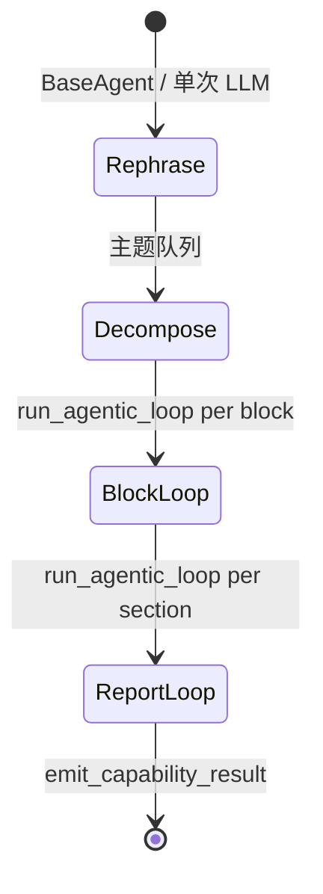

| 组件 | 职责 |
|------|------|
| `agents/research/pipeline.py` | 主编排 |
| `_PROTOCOL_BLOCK` 等 | 各 stage `LabelProtocol` |
| `_BlockLoopHost.on_intermediate` | `APPEND` 标签扩展 block 队列 |
| `CitationManager` | 引用去重与格式化 |

长文本分块 + `UsageTracker` 累计 `cost_summary`。

#### 4.6.1 LabelProtocol 实例

| Stage | `allowed` 标签 | `terminal` | `tool_label` |
|-------|----------------|------------|--------------|
| block | `SEARCH`, `APPEND`, `DONE`, … | `DONE` | `SEARCH` |
| report | `WRITE`, `REVISE`, `FINAL`, … | `FINAL` | — |

`LoopHost.on_intermediate("APPEND")` 动态扩展 block 队列——研究管线核心扩展点。

### 4.7 deep_question

`ideation → generation` — `agents/question/`；支持 mimic source（仿照样题风格出题）。

### 4.8 visualize

| 阶段 | 输出 |
|------|------|
| analyzing | 选定 render_type |
| generating | SVG / Chart.js / Mermaid / HTML |
| reviewing | 质量检查 |

`render_type=manim` 时路由到 `math_animator` 子管线（需 `.[math-animator]`）。

### 4.9 math_animator

独立 6+ stage pipeline（`agents/math_animator/pipeline.py`）：

`concept_analysis → concept_design → code_generation → code_retry → summary → render_output`

Manim 渲染为 **可选重依赖**；失败时 stage 级 retry 与 code_retry 阶段兜底。

### 4.10 mastery_path

- 与 chat 共用 `AgentLoop` 框架
- 额外 mastery 工具（进度、测验节点）
- 按 topic type gating（`learning/policy.py` SM-2 风格复习调度）
- Session 级 `mastery_path_id` 关联（TurnRuntime 持久化到 preferences）

### 4.11 结果信封与核心 API

| 函数 | 文件 | 作用 |
|------|------|------|
| `emit_capability_result` | `capabilities/_shared.py` | 统一 `RESULT` + `cost_summary` |
| `validate_capability_config` | `runtime/request_contracts.py` | `start_turn` 前 config schema 校验 |
| `CapabilityRegistry.get` | `runtime/registry/capability_registry.py` | Orchestrator 路由 |

```python
# capabilities/_shared.py
await emit_capability_result(stream, {
    "response": "...",
    "completed": True,
    "engine": "agent_loop",
    ...
}, usage=usage_tracker)
```

前端与 WS 统一解析 `StreamEventType.RESULT` + `metadata.cost_summary`。

---

## 第5章：Sandbox 与代码执行

### 5.1 设计原理

| 原理 | 含义 |
|------|------|
| **可用才暴露** | 沙箱不可用时 **不** 向模型注册 schema（避免必败 tool call） |
| **双工具面** | `exec`（shell）与 `code_execution`（NL→Python）分离 |
| **产物可附着** | 生成文件 URL 进入 assistant message attachments |

### 5.2 模块架构

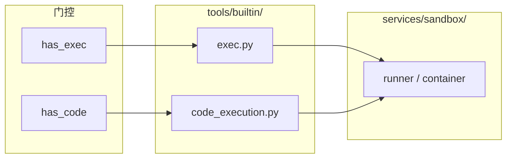

### 5.3 工具对

| Tool | 路径 | 挂载标志 |
|------|------|----------|
| `exec` | `tools/builtin/exec.py` | `has_exec` |
| `code_execution` | `tools/builtin/code_execution.py` | `has_code` |

`services/sandbox/` — 容器或本地 runner（见 `CONTAINERIZATION.md`）。

### 5.4 执行流

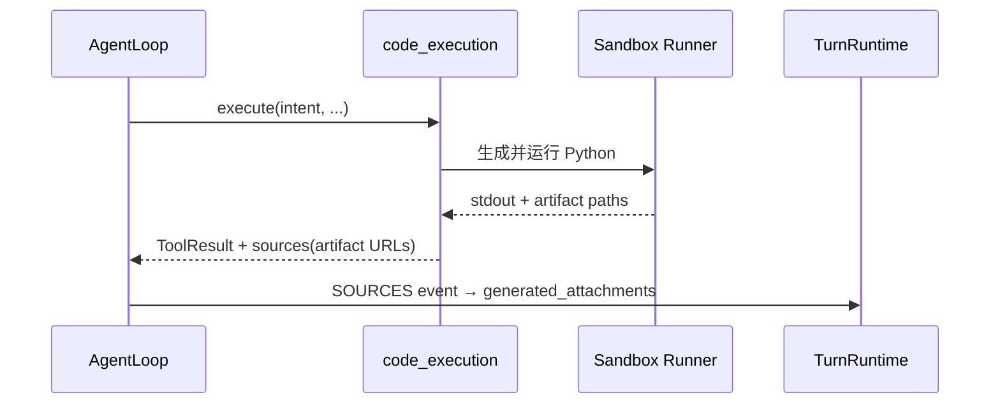

### 5.5 核心类型与概念对照

| 概念 | 实现 |
|------|------|
| 沙箱不可用 | `ToolMountFlags` 为 false → schema 不注册 |
| NL→代码 | `code_execution` 内部 LLM 生成 Python 再 `runner` 执行 |
| 产物 URL | `ToolResult.sources` → TurnRuntime `generated_attachments` |
| 容器部署 | `services/sandbox/` + `CONTAINERIZATION.md` |

### 5.6 与 Codex 对比

| | DeepTutor | Codex |
|---|-----------|-------|
| 执行 | Python 沙箱 + exec | unified_exec + Seatbelt |
| 审批 | 产品层/部署配置 | ExecApproval + Guardian |
| Patch | 无一等 `apply_patch` | 核心工具 |

---

## 第6章：多 Agent 与 BaseAgent

### 6.1 BaseAgent 契约

```32:45:DeepTutor/deeptutor/agents/base_agent.py
class BaseAgent(ABC):
    """
    Unified base class for all module agents.
    Subclasses must implement the `process()` method.
    """
```

提供：LLM 配置、`PromptManager`、流式/非流式 `complete`/`stream_llm`、token 统计、`set_trace_callback`。

### 6.2 BaseAgent API 速查

| 方法 | 作用 |
|------|------|
| `process(**kwargs)` | 子类必须实现的主入口 |
| `complete()` / `stream_llm()` | 非流式 / 流式 LLM 调用 |
| `set_trace_callback()` | 将 token/进度写入 `StreamBus` |
| `get_prompt()` | 经 `PromptManager` 加载 YAML |

### 6.3 用于何处

| 模块 | Agent 类 | 编排方式 |
|------|----------|----------|
| deep_solve | Planner / Solver / Writer | Capability stage 顺序调用 |
| deep_research | 各 stage agents + LoopHost | pipeline + `run_agentic_loop` |
| visualize | analysis / code_generator / review | stage 管线 |
| math_animator | concept / code / visual_review | 长 pipeline |
| notebook | summarize / analysis | 按需调用 |
| context_builder | `_ContextSummaryAgent` | 内部摘要专用 |

### 6.4 chat deliberately 不用 BaseAgent 主循环

`chat` 用 `AgentLoop` + `core/agentic/*` 原语：

- 需要 narration/finish、settlement、DSML fallback
- 需要与 `dispatch_tool_calls` 深度集成

### 6.5 Team / 书籍引擎（扩展）

`book/`、`co_writer/` 描述的多 Agent 协作：

- 同一进程 asyncio 内顺序/并行多个 `BaseAgent`
- **非** Codex `spawn_agent` 线程隔离；**非** Prime `rlm.run()` 子 Session


---

## 第7章：deeptutor 包地图与模块依赖

### 7.1 顶层目录职责

| 包/目录 | 职责 | 关键类型 |
|---------|------|----------|
| `runtime/` | Orchestrator、registry、launcher、bootstrap | `ChatOrchestrator` |
| `core/` | context、stream、协议、agentic 原语 | `UnifiedContext`, `dispatch_tool_calls`, `run_agentic_loop` |
| `agents/` | 各 capability 的 Agent 与 chat loop | `AgentLoop`, `BaseAgent` |
| `capabilities/` | Capability 类、prompts、`_shared` | `BaseCapability` |
| `tools/builtin/` | 内置工具实现 | `BaseTool` |
| `api/` | FastAPI routers、unified_ws | `TurnRuntimeManager` 入口 |
| `services/llm/` | Provider 抽象、流式、多模态 | `LLMConfig`, DSML |
| `services/memory/` | 三层 memory | `MemoryStore` |
| `services/session/` | 存储、context、turn runtime | `ContextBuilder`, `TurnRuntimeManager` |
| `services/rag/` | 检索 | pipelines |
| `knowledge/` | KB 索引与 manifest | |
| `skills/` | Skill 包 | |
| `partners/` | IM 通道 | |
| `learning/` | 学习路径、mastery | `policy.py` |
| `book/` / `co_writer/` | 长内容多 Agent | |
| `multi_user/` | 鉴权、模型/工具白名单 | |
| `deeptutor_cli/` | Typer CLI | |
| `web/` | Next.js 前端 | |

### 7.2 关键注册与启动链

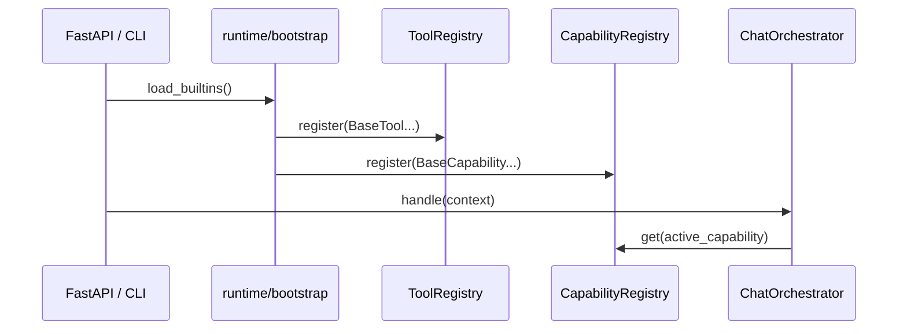

| 启动钩子 | 文件 |
|----------|------|
| `load_builtins()` | `runtime/registry/tool_registry.py` |
| `builtin_capabilities` | `runtime/bootstrap/builtin_capabilities.py` |
| `get_turn_runtime_manager()` | `services/session/__init__.py` 单例 |

### 7.3 依赖方向（禁止反向）

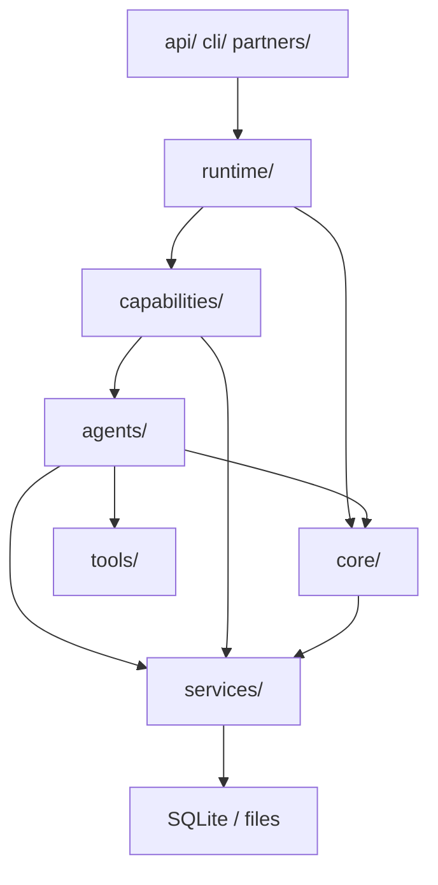

- `core/` **不** import `agents/` 或 `capabilities/`
- `services/session/turn_runtime.py` 是 **组合根**（延迟 import orchestrator）

### 7.4 与 Codex crate 对照

| DeepTutor | Codex |
|-----------|-------|
| `ChatOrchestrator` | `ThreadManager` + routing |
| `TurnRuntimeManager` | `SessionIo` + `RolloutRecorder` |
| `AgentLoop` | `run_turn` |
| `ContextBuilder` | `compact` + `ContextManager` |
| `StreamEvent` | `EventMsg` |
| `CapabilityRegistry` | skills + collaboration mode |

---

**上一章**: [ARCHITECTURE_PART1.md](./ARCHITECTURE_PART1.md)  
**下一章**: [ARCHITECTURE_PART3.md](./ARCHITECTURE_PART3.md)
