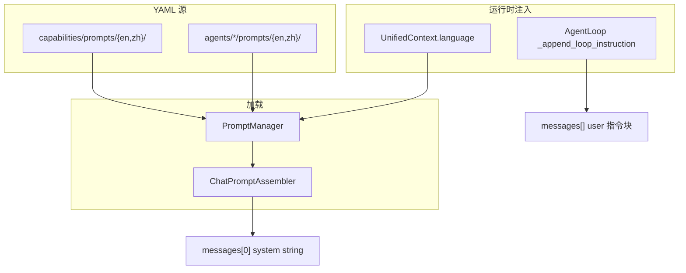
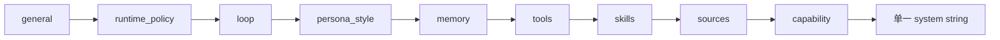
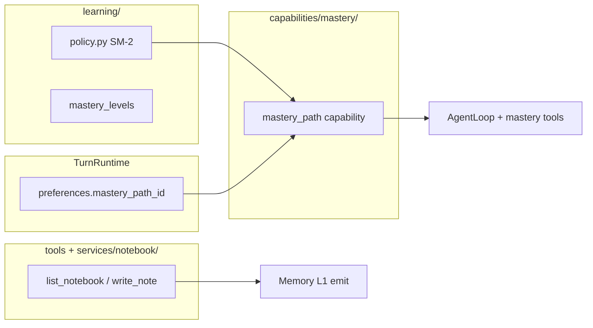
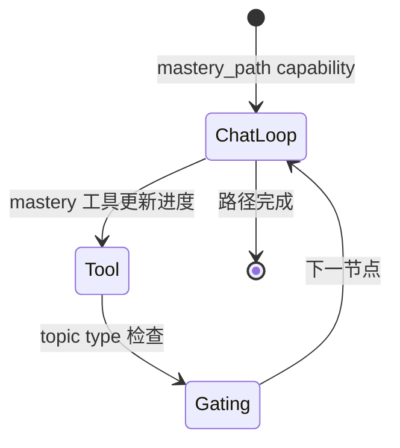
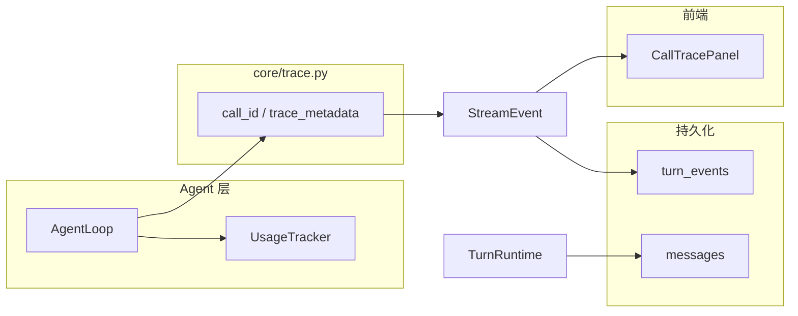
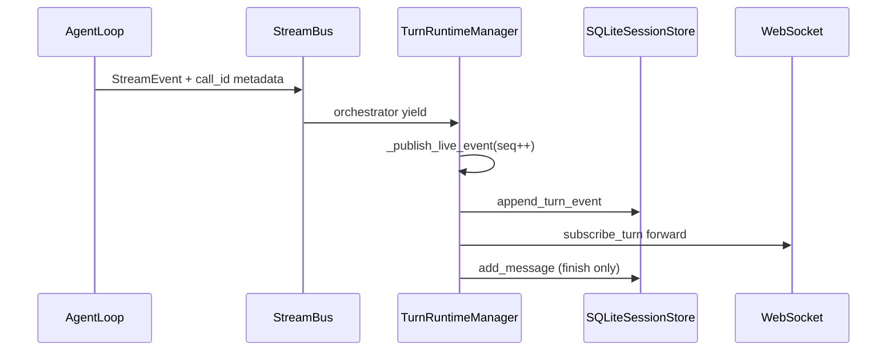
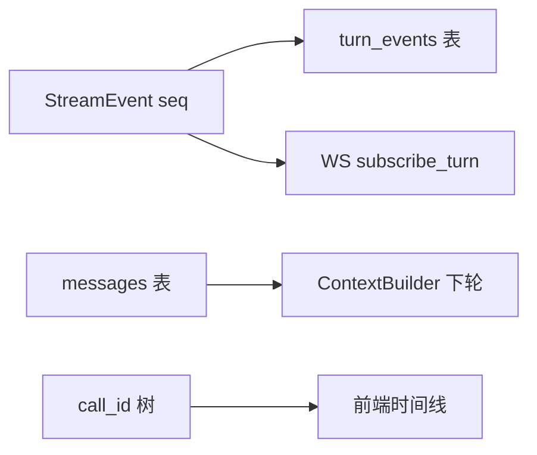
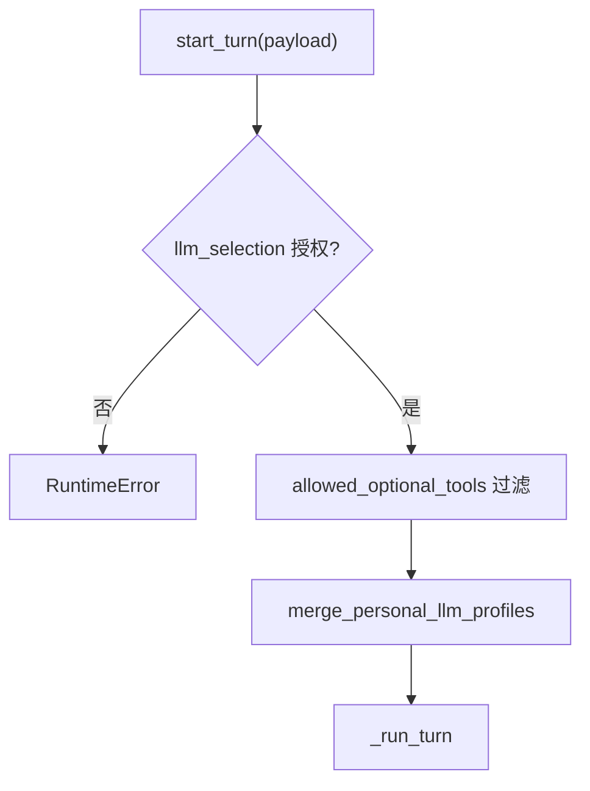
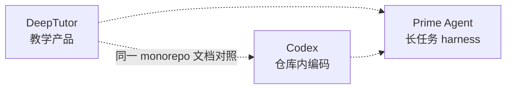

# DeepTutor 完整架构设计文档（第三部分）

> **版本**: 2.0 · **整理**: 2026-09-01  
> **体例参照**: [`docs/codex-architecture/ARCHITECTURE_PART3.md`](../codex-architecture/ARCHITECTURE_PART3.md)

---

## 目录

- [第1章：Prompt 体系与 i18n](#第1章prompt-体系与-i18n)
- [第2章：Learning / Mastery / Notebook](#第2章learning--mastery--notebook)
- [第3章：Observability、成本与 Trace](#第3章observability成本与-trace)
- [第4章：多用户与权限](#第4章多用户与权限)
- [第5章：设计目标、优缺点与演进](#第5章设计目标优缺点与演进)
- [第6章：三项目选型矩阵](#第6章三项目选型矩阵)

---

## 第1章：Prompt 体系与 i18n

### 1.1 设计原理

| 原理 | 含义 |
|------|------|
| **Prompt 外置** | 能力逻辑在 Python；措辞在 YAML，便于非工程师迭代 |
| **单 system 拼接** | `ChatPromptAssembler` 产出 **一条** system string（非多条 system 消息） |
| **语言跟随 context** | `UnifiedContext.language` 选择 `{en,zh}` 目录 |
| **块级预算可见** | `context_budget._BLOCK_SEGMENTS` 标注各段 token 归属 |

### 1.2 模块架构



### 1.3 目录布局

```
capabilities/prompts/{en,zh}/<capability>.yaml   # stage 文案 + playbook
agents/chat/prompts/{en,zh}/agentic_chat.yaml      # chat loop 指令
agents/research/prompts/{en,zh}/pipeline.yaml      # research 标签协议说明
agents/solve/prompts/...
```

`services/prompt/manager.py` `PromptManager` 按 module + agent_name 加载，支持嵌套 key 与 `labels.*` 状态字符串。

### 1.4 核心类型与文件

| 类型 | 文件 | 作用 |
|------|------|------|
| `PromptManager` | `services/prompt/manager.py` | module + agent_name → YAML 树 |
| `ChatPromptAssembler` | `agents/chat/prompt_blocks.py` | `PromptBlock` 排序拼接 |
| `PromptBlock` | 同上 | `general`, `memory`, `tools`, `capability`, … |
| `build_context_budget` | `agents/chat/context_budget.py` | 信息性 token 分段 |
| `get_response_language` | `services/settings/interface_settings.py` | 默认 `language` |

### 1.5 Chat PromptBlocks 组装顺序



**优先级**：`capability` block 在独占模式（如 deep_solve CLI run）下可覆盖通用 chat 指令片段。

### 1.6 AgentLoop 动态指令

Loop 在 runtime 向 `messages` 追加 **user 角色** 指令（`_append_loop_instruction`），避免连续 user 消息：

| 场景 | 指令来源 |
|------|----------|
| Settlement 开始 | `_settle_exhausted_instruction()` |
| Forced finish | `_finish_exhausted_instruction()` |
| Token 截断续写 | `loop.continue_truncated` |
| 空 finish nudge | `loop.finish_empty_nudge` |

### 1.7 i18n 覆盖面

| 层 | 机制 |
|----|------|
| UI/API | `core/i18n.py`、`deeptutor/i18n/` |
| Capability 状态 | YAML `labels.*`、`notices.*` |
| Agent 输出语言 | `language` 字段 + prompt 约束「用中文/英文回答」 |
| ContextBuilder 摘要 | `language.startswith("zh")` 切换 system prompt |

---

## 第2章：Learning / Mastery / Notebook

### 2.1 模块架构



### 2.2 Notebook

**设计**：用户学习笔记与对话 **解耦存储**，但可被 RAG/read 进上下文。

| 组件 | 路径 |
|------|------|
| 工具 | `list_notebook`, `write_note` |
| 服务 | `services/notebook/` |
| 挂载 | `has_notebooks` |

Memory consolidator 可将 notebook 事件作为 L1 来源。

### 2.3 Mastery Path



| 模块 | 职责 |
|------|------|
| `learning/policy.py` | SM-2 风格 due 日期、复习调度 |
| `learning/mastery_levels` | 掌握度量化 |
| `mastery_path` capability | AgentLoop + 专用工具 |

Session `preferences.mastery_path_id` 由 TurnRuntime 在显式 payload 时持久化。

### 2.4 Book Engine

`book/` — 多 Agent 将材料编译为结构化书籍（见 `DEEPTUTOR_DEEP_DIVE.md` §20）：

- 材料解析 → 大纲 → 章节并行生成 → 汇编
- 与 chat Turn 独立，可长跑 batch

### 2.5 Co-Writer

`co_writer/` — 协作写作 Agent 链，复用 `BaseAgent` + 专用 prompts；支持 human-in-the-loop 修订轮次。

---

## 第3章：Observability、成本与 Trace

### 3.1 设计原理

| 原理 | 含义 |
|------|------|
| **双写可观测** | `turn_events` 全量 seq + `messages` 摘要答案 |
| **Trace 在 metadata** | `call_id` 树挂在 `StreamEvent.metadata`，非独立表 |
| **成本随 RESULT** | `UsageTracker` → `emit_capability_result.cost_summary` |
| **预算仅信息** | `context_budget` 不触发截断 |

### 3.2 模块架构



### 3.3 UsageTracker

`core/agentic/usage.py`：

- 累计 prompt/completion tokens（含流式 `record_streamed_usage`）
- Capability 结束写入 `emit_capability_result` → `cost_summary`
- AgentLoop 在 `LLMRequestSnapshot` 上附加 `context_budget` 元数据

### 3.4 Trace 元数据

`core/trace.py` — 统一 `call_id`、`trace_metadata`：

| 字段 | 用途 |
|------|------|
| `call_kind` | `agent_loop_round` / `tool_planning` / `llm_summarization` |
| `call_role` | `narration` / `finish` |
| `trace_group` | `stage` / `tool_call` |
| `tool_provider` | MCP 来源识别 |

附在 `StreamEvent.metadata`，前端 `CallTracePanel` 按 `call_id` 分组。

### 3.5 Context Budget（信息性）

`agents/chat/context_budget.py` `build_context_budget(LLMRequestSnapshot)`：

- 返回各 segment（system/history/tools）token 估算与窗口占比
- **不**自动截断——截断由 `ContextBuilder` 在 **turn 开始前** 完成

### 3.6 Event Bus（模块间）

`events/event_bus.py` — 内部 pub/sub（非 WS 协议）：

| 事件 | 订阅方示例 |
|------|------------|
| `CAPABILITY_COMPLETE` | Partners 统计、内存 probe |
| 自定义 | 插件扩展 |

Orchestrator `_publish_completion` 在 turn 结束后发布。

### 3.7 Turn 级可观测性端到端



### 3.8 Turn 级数据流总览



---

## 第4章：多用户与权限

### 4.1 设计原理

| 原理 | 含义 |
|------|------|
| **请求级用户** | `get_current_user()` context var，middleware 注入 |
| **单点 enforcement** | `start_turn` 过滤 LLM 与 tools |
| **路径隔离** | `PathService` + per-user `data/user/` |
| **个人模型合并** | owner-bound Codex profile 与共享 catalog 合并 |

### 4.2 权限检查链（start_turn）



### 4.3 上下文隔离

`multi_user/context.py` `get_current_user()` — 请求级用户上下文（API middleware 注入）。

### 4.4 模型访问

TurnRuntime `start_turn` 路径：

1. `apply_allowed_llm_selection` — 非管理员不得使用未授权模型
2. 无 `llm_selection` 时非 admin 自动 pin 第一个可用 granted 模型
3. `merge_personal_llm_profiles` — 个人 Codex 等 profile 与共享 catalog 合并（#781）

### 4.5 工具白名单

`multi_user/tool_access.py` `allowed_optional_tools()` — admin 授予的 per-user 工具子集；在 `start_turn` **唯一 enforcement 点**过滤 `payload.tools`。

### 4.6 核心类型与文件

| 类型 | 文件 | 作用 |
|------|------|------|
| `get_current_user` | `multi_user/context.py` | 当前请求用户 |
| `apply_allowed_llm_selection` | `multi_user/model_access.py` | LLM 授权门控 |
| `allowed_optional_tools` | `multi_user/tool_access.py` | per-user 工具子集 |
| `merge_personal_llm_profiles` | `multi_user/personal_models.py` | 个人 provider 合并 |
| `ws_require_auth` | `api/routers/auth.py` | WS 鉴权 |

### 4.7 Memory / 存储隔离

`paths.memory_root()` 经 `PathService` + context var 解析到 per-user 目录。

---

## 第5章：设计目标、优缺点与演进

### 5.1 设计目标

| 目标 | 手段 |
|------|------|
| 教育垂直深度 | 多 Capability 管线（解题/研究/可视化） |
| 统一入口 | TurnRuntime + ChatOrchestrator + UnifiedContext |
| 可扩展 | Tool/Capability registry + skills + MCP |
| 跨会话记忆 | L1/L2/L3 Memory + consolidator |
| 多通道 | Partners + 同一 runtime |
| 可观测流 | StreamEvent seq + turn_events + trace |
| 可恢复对话 | subscribe_turn、regenerate、edit branch |

### 5.2 优点

1. **双层插件清晰** — Tool 与 Capability 职责分离，`deeptutor run <cap>` 语义自然
2. **AgentLoop 简洁** — narration/finish 单循环，前端渲染规则明确
3. **Memory 可解释** — Markdown + 脚注，用户可编辑 L2/L3
4. **WS 协议完善** — regenerate、subscribe、ask_user resume、合成 DONE 兜底
5. **Python 生态** — 快速集成 LLM provider、RAG、Manim
6. **TurnRuntime 边界清晰** — 持久化、权限、附件、memory 注入集中在一处

### 5.3 缺点 / 代价

| 代价 | 说明 |
|------|------|
| 双 Session 存储 | legacy JSON 与 SQLite 并存，迁移心智负担 |
| 无统一事件溯源 | 不像 Rollout 的 append-only 全事件；`turn_events` 与 `messages` 双写 |
| Capability 间重复 | 各 pipeline 自有编排，共享仅 `BaseAgent` / agentic 原语 |
| 无 Plan 协作模式 | 规划散落在各 capability stage，无 Codex 式 Plan/Default 切换 |
| 沙箱弱于 Codex | 教育场景够用；生产 shell 需自备边界 |
| 配置分散 | JSON settings + pyproject extras + Docker |
| 双 Agent 引擎 | chat 用 AgentLoop，research 用 label loop，学习曲线偏高 |

### 5.4 适用场景

| 场景 | 推荐度 |
|------|--------|
| AI 辅导 / 研学 / 出题 | ⭐⭐⭐⭐⭐ |
| 知识库问答 + 工具 | ⭐⭐⭐⭐ |
| IM 学习伴侣 | ⭐⭐⭐⭐ |
| 企业代码 Agent | ⭐⭐ — 用 Codex / Prime |
| 强审批编码 | ⭐⭐ — 用 Codex |
| 长时 unattended 编码 | ⭐⭐ — 用 Prime Daemon |

### 5.5 演进方向（文档外推，非承诺）

- 统一 Session 存储代际，废弃 legacy JSON
- 将部分 capability stage 进一步收敛到 `run_agentic_loop` + 声明式 `LabelProtocol`
- 可选 Plan 模式（chat 内显式 planning capability）

---

## 第6章：三项目选型矩阵

| 维度 | DeepTutor | Codex | Prime Agent |
|------|-----------|-------|-------------|
| **运行时语言** | Python | Rust | TypeScript + Python kernel |
| **主循环** | AgentLoop / run_agentic_loop | run_turn | runAgentLoop |
| **消息模型** | OpenAI messages + StreamEvent | ResponseItem + EventMsg | AgentMessage + SessionEntry |
| **Session 键** | session_id + turn_id + seq | ThreadId + Rollout jsonl | Session JSONL 树 |
| **压缩** | ContextBuilder LLM 摘要 | auto_compact + fragments | CompactionEntry + buildSessionContext |
| **Plan** | capability stages | ModeKind::Plan | goals / autonomous |
| **多 Agent** | BaseAgent 编排 / asyncio | spawn_agent 新 Thread | rlm.run() 子 Session |
| **主工具面** | 多 L1 Tool | shell / patch / MCP | 单 IPython |
| **默认交互** | WS TurnRuntime | 进程内 Session loop | Daemon Worker |
| **MCP** | 可选 partners | 一等公民 | kernel 内调用 |
| **Skills** | read_skill 渐进披露 | context fragments | Python import |
| **目标用户** | 学习者 | 开发者 | 长时编码/研究 |

### 6.1 组合使用建议



---

**深潜**: [CORE_RUNTIME_WALKTHROUGH.md](./CORE_RUNTIME_WALKTHROUGH.md)  
**实体时序**: [ENTITY_AND_SEQUENCES.md](./ENTITY_AND_SEQUENCES.md)  
**对照**: [Codex 架构](../codex-architecture/README.md) · [Prime Agent 架构](../prime-agent-architecture/README.md)
