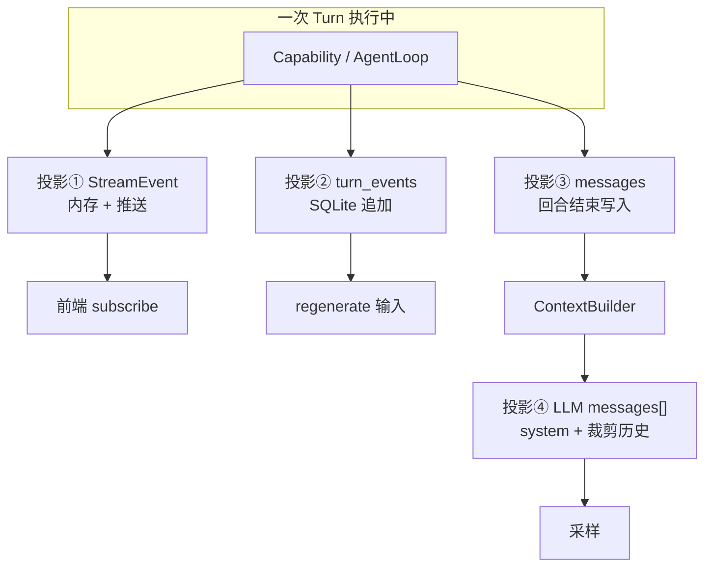
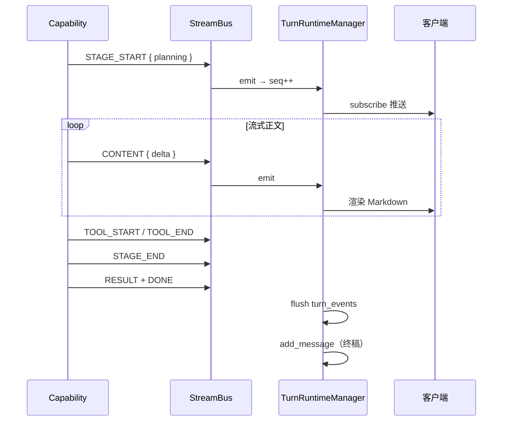
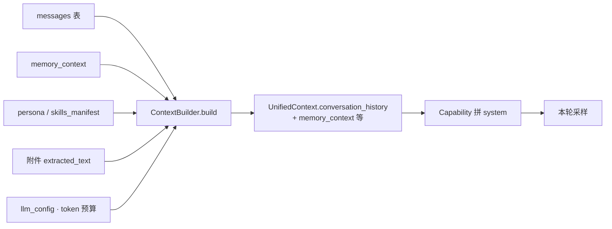
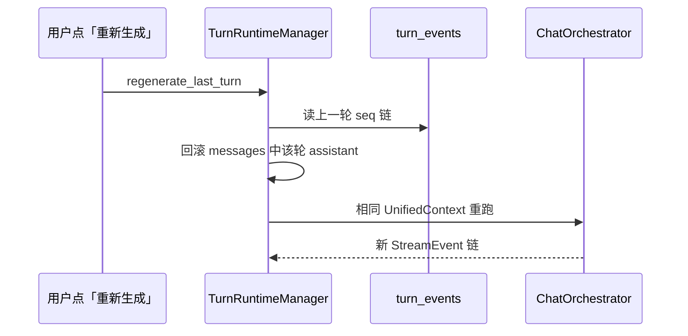

# DeepTutor 上下文与三层投影导读

> **定位**：讲清 **UI 看到的、模型读到的、磁盘记的** 为何是三套东西。  
> **阅读时间**：~15 分钟  
> **循序渐进**：[DESIGN_THINKING_SERIES.md §5](./DESIGN_THINKING_SERIES.md#第-5-步三层投影--ui--模型--落库)  
> **深潜**：[PART1 §6](./ARCHITECTURE_PART1.md#第6章message-与-streamevent-三层投影) · [ENTITY §2–3](./ENTITY_AND_SEQUENCES.md)

---

## 1. 一句话

DeepTutor 的一次 Turn = **执行时流（StreamEvent）** + **对话终稿（messages）** + **可回放轨迹（turn_events）**；发给 LLM 的 `messages[]` 是 **ContextBuilder 另算出来的第四层**，四者 **不同构**。

---

## 2. 为什么要分裂

| 消费者 | 需要什么 | 若强行合一的后果 |
|--------|----------|------------------|
| **Web UI** | 毫秒级 delta、阶段条、工具进度 | 用 messages 表会丢中间态 |
| **下一轮模型** | 干净、短、role 正确 | 塞入全轨迹会爆 token、污染推理 |
| **regenerate / 审计** | 完整 seq 链 | 只存终稿无法重放 |
| **产品分析** | cost、stage 耗时 | 终稿里没有 |

---

## 3. 四种投影对照

| 投影 | 粒度 | 典型内容 | 持久化 | 进下轮 LLM？ |
|------|------|----------|--------|--------------|
| **StreamEvent** | 事件级 | `CONTENT`、`TOOL_START`、`STAGE_*`、`ASK_USER` | 经 TRM 转存 | 否 |
| **turn_events** | 同上 + `seq` | 与 StreamEvent 同构 JSON | `turn_events` 表 | 否（regenerate 用） |
| **messages** | 回合级 | user 问 + assistant **最终**答 | `messages` 表 | **是**（经 Builder） |
| **LLM input** | 请求级 | system 块 + 裁剪后 history + 附件文本 | 一般不单独存 | 当次采样 |

---

## 4. StreamEvent 生命周期

**不变量**：`seq` 单调递增；断线后 `subscribe_turn(after_seq=N)` 只补缺口。

---

## 5. messages 与 narration

部分 Capability 有 **多轮内部 narration**（模型自问自答、中间草稿）。设计原则：

| 类型 | 是否进 `messages` | 是否进 turn_events |
|------|---------------------|-------------------|
| 用户可见最终答案 | ✅ | ✅ |
| 内部 narration 轮 | ❌（默认） | ✅（可选，全轨迹） |
| 工具原始输出 | 经摘要后进 assistant | ✅ |

**易错**：在 UI 里看到很长流式内容，不等于下轮 history 里有同样长度——Builder 可能只保留终稿。

---

## 6. ContextBuilder 做了什么

| 步骤 | 设计意图 |
|------|----------|
| 拉取最近 N 轮 messages | 控制 token |
| 超限时 LLM 摘要 | 保留语义、丢字面 |
| 注入 L3 memory | 跨会话个性化 |
| 附件转文本 | 多模态统一进 user 侧 |

---

## 7. regenerate 如何用轨迹

**要点**：regenerate 依赖 **turn_events 全轨迹**，不是只靠 messages 终稿。

---

## 8. 与 Codex / Prime 对照

| | DeepTutor | Codex | Prime |
|--|-----------|-------|-------|
| 流式协议 | `StreamEvent` | `EventMsg` | Daemon v7 事件 |
| 模型历史 | `ContextBuilder` 产出 | `ContextManager.history` | `buildSessionContext()` |
| 审计轨迹 | `turn_events` | Rollout JSONL | Session JSONL 树 |
| UI≠模型 | ✅ 三层+Builder | ✅ EventMsg≠ResponseItem | ✅ Turn 事件≠持久化 Turn |

---

## 9. 心智模型（五句）

1. **StreamEvent 是给「看」的** — 实时、可订阅。  
2. **messages 是给「记对话」的** — 下轮默认输入源。  
3. **turn_events 是给「重放」的** — regenerate 与审计。  
4. **LLM input 是给「想」的** — Builder 裁剪后的第四层。  
5. **四层不同构是设计，不是 bug。**

---

## 相关文档

| 文档 | 内容 |
|------|------|
| [DESIGN_THINKING_SERIES.md](./DESIGN_THINKING_SERIES.md) | 总运行路径 |
| [CORE_RUNTIME_WALKTHROUGH.md](./CORE_RUNTIME_WALKTHROUGH.md) | CLI/WS 实例 |
| [PART1 §6、§9](./ARCHITECTURE_PART1.md) | 字段与实现深潜 |
