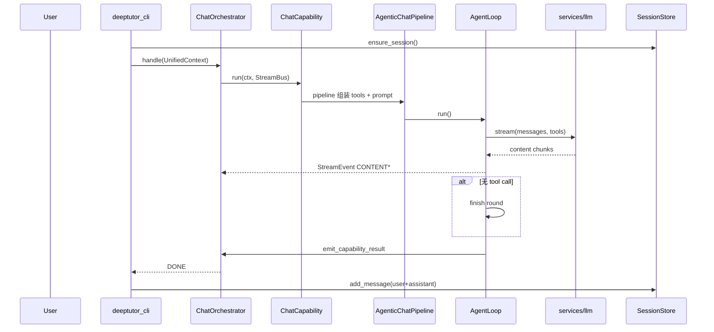
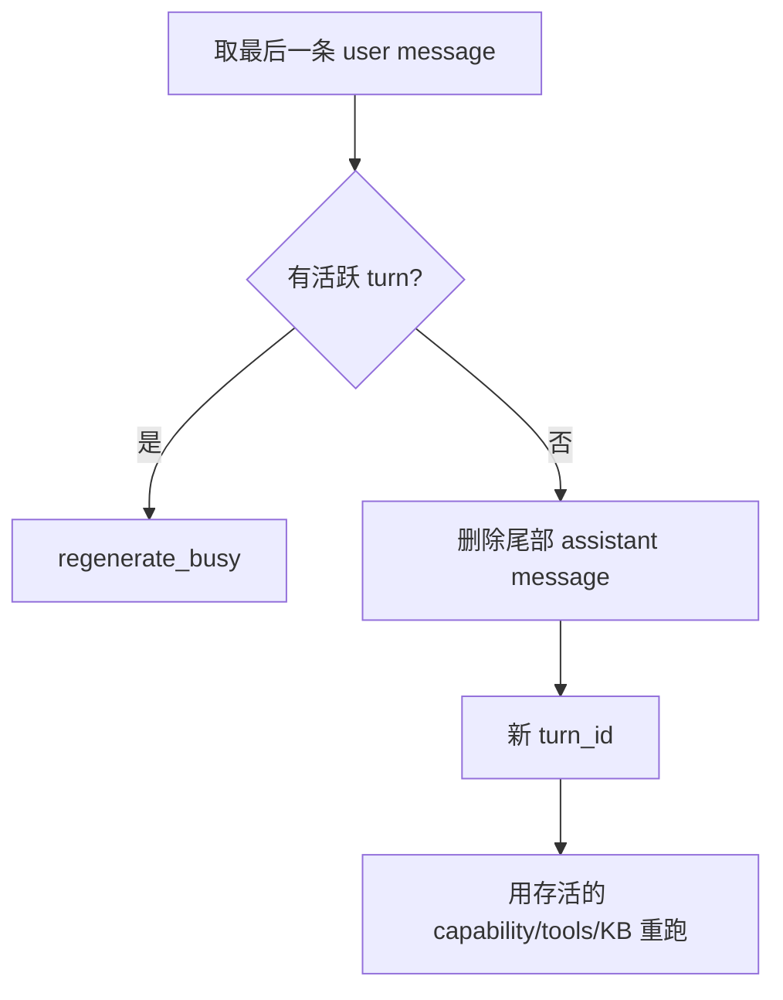

# DeepTutor 核心运行时走查

> **配套**: [DESIGN_THINKING_SERIES.md](./DESIGN_THINKING_SERIES.md) · [CONTEXT_AND_PROJECTION.md](./CONTEXT_AND_PROJECTION.md)  
> **深潜**: [PART1 §1.2](./ARCHITECTURE_PART1.md#12-分层架构) · [ENTITY_AND_SEQUENCES](./ENTITY_AND_SEQUENCES.md)

---

## 场景 A：CLI 冷启动 — 第一次 `deeptutor chat`

### A.1 用户操作

```bash
pip install deeptutor
deeptutor chat
# 输入：解释一下傅里叶变换
```

### A.2 时序



### A.3 UnifiedContext 实例

```python
UnifiedContext(
    session_id="unified_01J...",
    user_message="解释一下傅里叶变换",
    conversation_history=[],
    active_capability=None,  # → chat
    enabled_tools=None,      # 未指定 toggles
    knowledge_bases=[],
    language="zh",
    metadata={"turn_id": "turn_01J..."},
)
```

### A.4 StreamEvent 序列（典型无工具）

```
SESSION { session_id, turn_id }
STAGE_START { stage: "responding", source: "chat" }
CONTENT { ... }              # 流式
RESULT { response, cost_summary }
STAGE_END
DONE
```

### A.5 LLM messages（简化）

```json
[
  {
    "role": "system",
    "content": "<general>...</general><memory>...</memory><tools>...</tools>..."
  },
  {
    "role": "user",
    "content": "解释一下傅里叶变换"
  }
]
```

---

## 场景 B：同 Session 第二次提问

### B.1 用户操作

```
那它和拉普拉斯变换有什么区别？
```

### B.2 差异点

| 步骤 | 第一次 | 第二次 |
|------|--------|--------|
| session_id | 新建 | **复用** |
| conversation_history | `[]` | **从 SessionStore 加载** |
| context_builder | 无裁剪 | 可能 **摘要中间历史** |
| memory_context | 可能空 | 可能含 **L2 快照**（若 consolidator 跑过） |

### B.3 context_builder 裁剪逻辑

`get_messages_for_context(session_id)` → token 总和超限时：

1. 保留 system 侧注入（在 pipeline 内单独算）
2. 保留最近 N 条消息
3. 可选：对更早消息调用 summarizer → 插入一条 `role: system` 摘要

与 Codex `CompactionSummary` **类似目标、不同实现**（无独立 Condensation 事件类型）。

---

## 场景 C：WebSocket 提问 + 断线重连

### C.1 客户端消息

```json
{
  "type": "start_turn",
  "session_id": "unified_01J...",
  "message": "画一个正弦函数的图",
  "capability": "visualize",
  "config": { "render_mode": "svg" }
}
```

### C.2 服务端

1. `create_turn(session_id, capability=visualize)`
2. `orchestrator.handle` → `VisualizeCapability.run`
3. 每 `StreamEvent` `append_turn_event(turn_id, seq++)`

### C.3 重连

```json
{ "type": "subscribe_turn", "turn_id": "turn_01J...", "after_seq": 42 }
```

服务端从 `turn_events` 重放 `seq > 42` 的事件。

### C.4 ask_user 暂停

1. `AgentLoop` 调用 `ask_user` tool
2. `StreamEventType.WAIT_FOR_INPUT`
3. 客户端 `submit_user_reply` 或 `user_input`
4. **同一 turn_id** 上循环 resume（非新 turn）

---

## 场景 D：`/regenerate` 或 WS `regenerate`

### D.1 触发

CLI REPL：`/regenerate`  
WS：`{ "type": "regenerate", "session_id": "..." }`

### D.2 步骤



### D.3 overrides 示例

```json
{
  "type": "regenerate",
  "session_id": "unified_01J...",
  "overrides": {
    "capability": "deep_solve",
    "tools": ["rag", "web_search"],
    "knowledge_bases": ["math-kb"]
  }
}
```

---

## 场景 E：切换 Capability — `deep_research`

### E.1 CLI

```bash
deeptutor run deep_research "2024 年 RLHF 综述" \
  -t web_search -t paper_search
```

### E.2 与 chat 的路径差异


- **不**实例化 `AgentLoop`
- 各 stage 独立 `BaseAgent` + YAML prompt
- `StreamEvent.STAGE_START/END` 标记阶段边界
- 最终 `RESULT` 常为长报告 Markdown

### E.3 enabled_tools

`-t` 映射到 `UnifiedContext.enabled_tools`；research pipeline 内部再过滤可用工具。

---

## 场景 F：带 RAG + tool 的 chat 一轮

### F.1 用户

已选 KB `physics`，问：「根据课本解释麦克斯韦方程组」

### F.2 循环展开

```
Round 1:
  LLM → tool_call: rag(query="麦克斯韦方程组")
  dispatch → chunks
  messages += assistant(tool_calls) + tool(results)

Round 2:
  LLM → content: "根据教材，麦克斯韦方程组..."
  finish → emit_capability_result
  stream.sources([{title, url, snippet}, ...])
```

### F.3 metadata

`emit_capability_result` payload：

```json
{
  "response": "...",
  "completed": true,
  "engine": "agent_loop",
  "rounds": 2,
  "tool_steps": 1,
  "metadata": {
    "context_budget": {
      "window": 128000,
      "used": 18500,
      "segments": { "system_prompt": 4200, "history": 12000, ... }
    }
  }
}
```

---

## 场景 G：Memory 写入后下一问

1. 用户通过 UI Memory 页或 `write_memory` tool 更新偏好
2. `consolidator` 将 L1 trace 合并进 L2 `PROFILE.md`
3. 下一 turn `read_memory` 或自动 `memory_context` 注入 system
4. 模型回答体现「用户偏好」（如偏好英文术语）

---

## 调试清单

| 现象 | 检查 |
|------|------|
| 工具未出现 | `compose_enabled_tools` + `ToolMountFlags` |
| WS 无事件 | `turn_events` 表 seq；`subscribe_turn` after_seq |
| regenerate 失败 | `get_active_turn`；`nothing_to_regenerate` |
| 历史丢失 | legacy JSON vs SQLite store 是否混用 |
| 上下文爆炸 | `context_builder` 摘要日志；`context_budget` 读数 |

---

**返回**: [ARCHITECTURE.md](./ARCHITECTURE.md)
