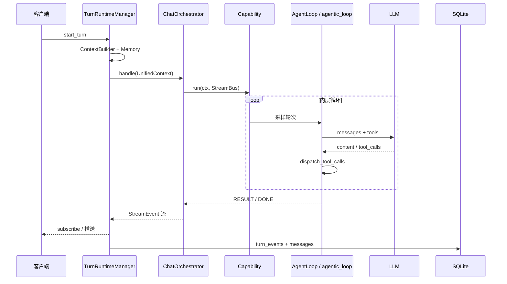
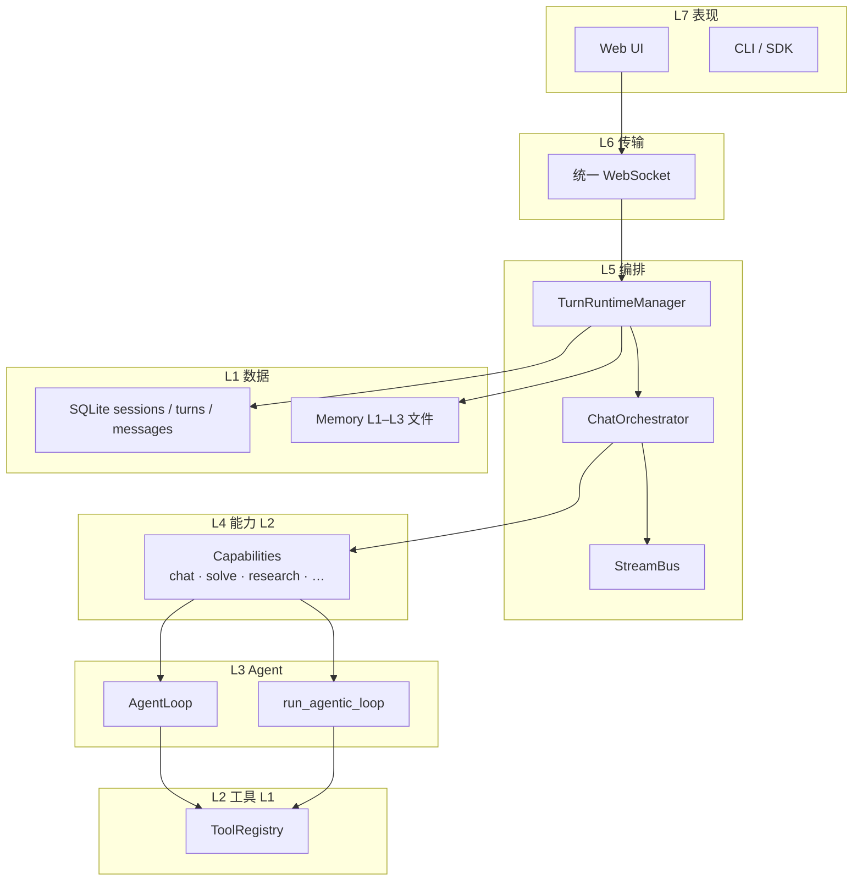
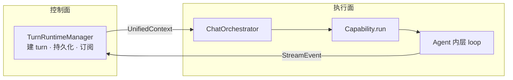
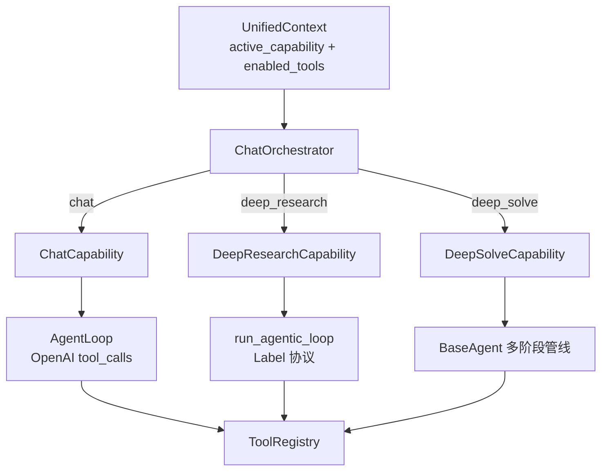
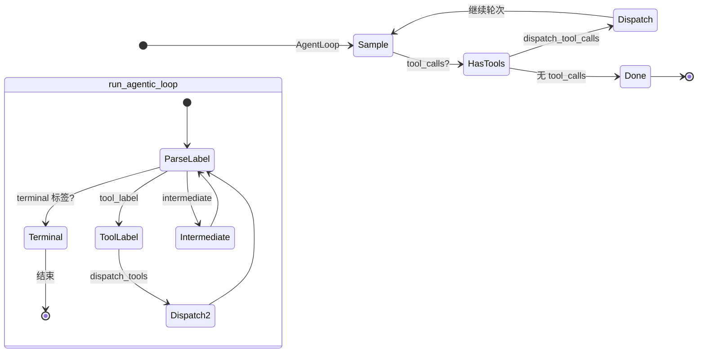
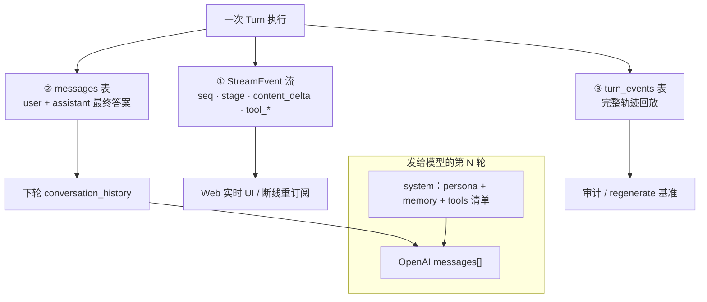
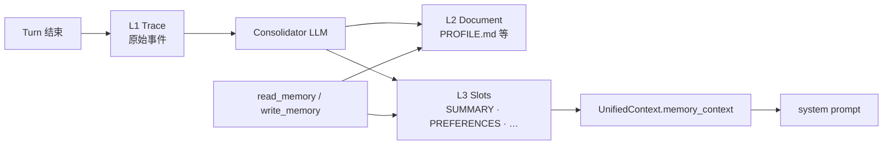
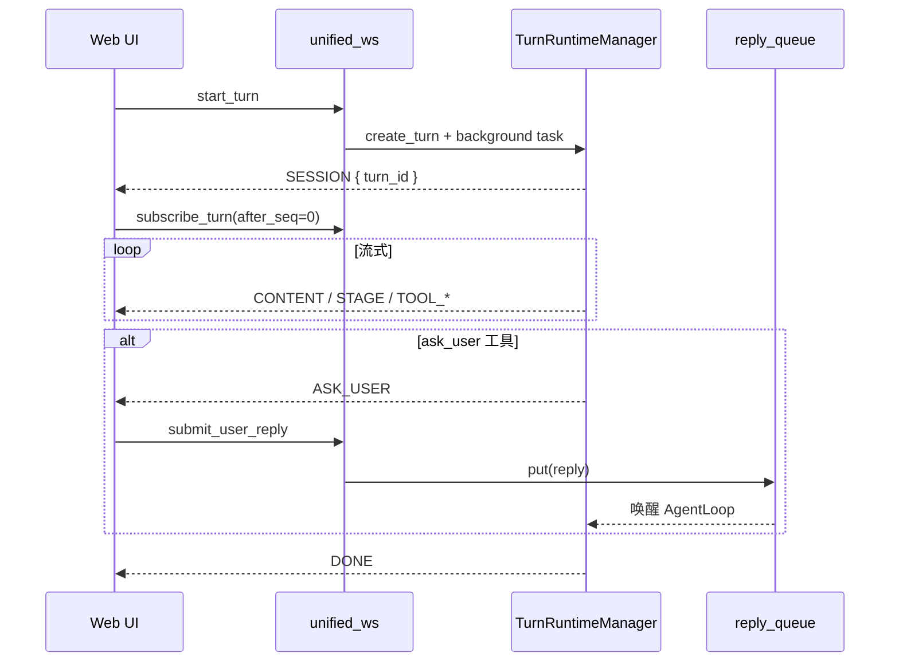
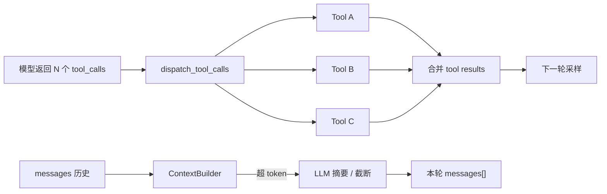

# DeepTutor 设计思想导读

> **阅读方式**：先读本导读（~35 分钟）→ [README.md](./README.md) → 需要改代码时再打开 PART / ENTITY  
> **写法标准**：[PROGRESSIVE_ARCH_DOC_METHODOLOGY.md](../agent-doc-template/PROGRESSIVE_ARCH_DOC_METHODOLOGY.md)  
> **跨项目对照**：[CROSS_AGENT_CONCEPT_MAP.md](../agent-doc-template/CROSS_AGENT_CONCEPT_MAP.md) · [Codex 导读](../codex-architecture/DESIGN_THINKING_SERIES.md)

---

## 先建立一条运行路径

Web / CLI / SDK 看起来入口不同，但 **能力执行链是同一条**：

```text
客户端提交（消息 + capability + 工具开关）
  → TurnRuntimeManager.start_turn（Web）或直接 ChatOrchestrator.handle（CLI）
  → ContextBuilder 拼历史 + Memory 快照
  → ChatOrchestrator 按 active_capability 路由
  → Capability.run（chat / deep_solve / deep_research / …）
  → AgentLoop 或 run_agentic_loop（内层 tool loop）
  → StreamEvent 流式推出（seq 单调递增）
  → 落库：turn_events（轨迹）+ messages（最终对话）
```



后面每一节在这条路径上 **加一个透镜**；不是按 Python 包名列模块。

---

## 第 1 步：七层架构 — 谁该知道什么

**一句话**：**表现层只传意图；编排层只路由能力；Agent 层只跑 loop；数据层记三种不同真相。**



| 层 | 设计问题 | 不该做的事 |
|----|----------|------------|
| L5 编排 | 这一轮走哪个 Capability？ | 在 Orchestrator 里写研究管线细节 |
| L4 能力 | 整轮 UX 阶段（planning → writing） | 直接调 LLM 而不经 Agent 抽象 |
| L3 Agent | 单轮内多步 tool loop | 关心 WebSocket 重连 |
| L1 数据 | 轨迹 vs 对话 vs 记忆分层 | 把 StreamEvent 当 LLM history 唯一来源 |

→ 实体关系深潜：[ENTITY_AND_SEQUENCES §1](./ENTITY_AND_SEQUENCES.md#第一篇-实体模型) · 分层详图：[PART1 §1.2](./ARCHITECTURE_PART1.md#12-分层架构)

---

## 第 2 步：控制面 vs 执行面

**一句话**：**TurnRuntimeManager = 会话 I/O 总控**；**ChatOrchestrator = 能力路由器**；**Capability = 真正跑模型的地方**。

| | TurnRuntimeManager | ChatOrchestrator |
|--|-------------------|------------------|
| **输入** | HTTP/WS payload | 已组好的 `UnifiedContext` |
| **输出** | `turn_events` 持久化 + live 订阅 | `StreamEvent` 流 |
| **管** | session、regenerate、ask_user 队列 | capability 选择、StreamBus 生命周期 |
| **不管** | Agent 内 tool 并行策略 | 用户消息是否入库（TRM 做） |



**校正**：CLI 可 **跳过** TurnRuntime，直接 `orchestrator.handle`；Web 路径 **必须** 经 TRM 才有 `turn_id` / `seq` / 断线重订阅。

→ [PART1 §3–§4](./ARCHITECTURE_PART1.md#第3章chatorchestrator--统一编排入口)

---

## 第 3 步：双层插件 — Tool vs Capability

**一句话**：**L1 Tool = 单步副作用**；**L2 Capability = 接管整轮编排**（可多阶段、换引擎、换协议）。



| 对比 | L1 Tool | L2 Capability |
|------|---------|---------------|
| 粒度 | 一次 `execute` | 一整轮 Turn |
| 注册 | `ToolRegistry` | `CapabilityRegistry` |
| 用户感知 | 工具开关 | 模式切换（解题 / 研究 / 聊天） |
| 流式阶段 | 无 | `STAGE_START/END`（planning、writing…） |

**设计原因**：教育场景需要 **长管线**（重述 → 检索 → 写报告），不宜塞进单次 tool call；Capability 是 **产品模式**，Tool 是 **原子能力**。

→ [PART1 §5](./ARCHITECTURE_PART1.md#第5章双层插件tool-vs-capability) · [PART2 §4 Capability 管线](./ARCHITECTURE_PART2.md)

---

## 第 4 步：两条 Agent 引擎

**一句话**：默认聊天走 **OpenAI tool_calls**；研究/部分解题走 **首行 Label + 正文** 的第二协议。



| | AgentLoop | run_agentic_loop |
|--|-----------|------------------|
| 协议 | `tool_calls` JSON | 首行 `LABEL` + 正文 |
| 终止 | 模型不再调工具 | `terminal` 标签集 |
| 违例处理 | Provider 报错 | protocol repair 再采样 |
| 典型能力 | `chat` | `deep_research`、`deep_solve` 部分阶段 |

**易错**：不是「研究用 AgentLoop、聊天用 agentic」——以 **Capability 实现** 为准；同一产品可混用 BaseAgent 多阶段 + 两种 loop。

→ [PART1 §7、§11](./ARCHITECTURE_PART1.md#第7章agentloop--narration--finish-语义)

---

## 第 5 步：三层投影 — UI ≠ 模型 ≠ 落库

**一句话**：同一次 Turn 在系统里有 **三条消费者链**，不能混成一种「消息」。



| 投影 | 存什么 | 谁消费 | 常见误解 |
|------|--------|--------|----------|
| **StreamEvent** | 流式增量、阶段、工具中间态 | 前端、`subscribe_turn` | ≠ 直接等于 LLM messages |
| **messages** | 回合级 user/assistant 终稿 | 下一轮 `ContextBuilder` | narration 中间轮可能 **不进** 此表 |
| **turn_events** | 与 StreamEvent 同构持久化 | regenerate、审计 | 体积大，不整包喂模型 |

**设计原因**：UI 要丝滑增量；模型要干净上下文；合规要全轨迹——三者目标冲突，故 **故意分裂**。

→ 专文：[CONTEXT_AND_PROJECTION.md](./CONTEXT_AND_PROJECTION.md)

---

## 第 6 步：Memory L1–L3 — 学习画像怎么长出来

**一句话**：**L1 记发生过什么 → consolidator 提炼 → L2 结构化档案 → L3 槽位注入下轮 system**。



| 层 | 形态 | 跨会话 | 用户可编辑 |
|----|------|--------|------------|
| L1 | 追加 trace | 是 | 否（原始日志） |
| L2 | Markdown + 脚注 | 是 | 是（Workbench） |
| L3 | 固定槽位摘要 | 是 | 是 |

与 Codex Memories 对照：DeepTutor 更偏 **教育画像**（偏好、掌握度），不是编码仓库蒸馏。

→ [PART1 §10](./ARCHITECTURE_PART1.md#第10章memory-l1l3-体系) · [PART3 Mastery](./ARCHITECTURE_PART3.md)

---

## 第 7 步：WebSocket Turn 生命周期

**一句话**：`start_turn` 点火后台任务；客户端用 `subscribe_turn(after_seq)` **追事件**；`ask_user` 用 **reply 队列** 暂停 loop。



| 操作 | 语义 |
|------|------|
| `cancel_turn` | 取消后台 task |
| `regenerate_last_turn` | 以 turn_events 为基准重跑 |
| `submit_user_reply` | 仅 ask_user 暂停态 |

→ [CORE_RUNTIME_WALKTHROUGH](./CORE_RUNTIME_WALKTHROUGH.md) · [ENTITY §12.2](./ENTITY_AND_SEQUENCES.md)

---

## 第 8 步：工具并行与 Context 裁剪

**一句话**：**同轮多 tool_calls 并行派发**；**超长历史由 ContextBuilder 裁剪或 LLM 摘要**，不阻塞 StreamEvent。



→ [PART1 §8–§9](./ARCHITECTURE_PART1.md)

---

## 第 9 步：最小核心与扩展边界

| 在核心 | 在扩展 |
|--------|--------|
| `UnifiedContext` 契约 | Partners IM 通道 |
| `ChatOrchestrator` 路由 | 单个 Capability 业务细节 |
| `AgentLoop` / `run_agentic_loop` | 具体 Tool 插件 |
| `StreamEvent` 协议 | MCP 连接器实现 |
| Memory L1–L3 模型 | 单个 KB/RAG 索引策略 |

**与 Codex / Prime 各记一句**：

| 项目 | 会话真相 | 模式切换 |
|------|----------|----------|
| **DeepTutor** | SQLite turns + messages | Capability |
| **Codex** | Rollout JSONL + ContextManager | CollaborationMode / spawn_agent |
| **Prime** | Session JSONL 树 | `rlm.run()` 子 Session |

→ [README 对照表](./README.md#与-codex--sdk-对照)

---

## 阅读路径

```text
DESIGN_THINKING_SERIES（本文）
  → CONTEXT_AND_PROJECTION（三层投影专文）
  → CORE_RUNTIME_WALKTHROUGH（CLI/WS 实例）
  → PART1 / PART2（改代码时）
  → ENTITY_AND_SEQUENCES（字段级 + 函数级）
```
