# DeepTutor — 实体模型、时序与模块深潜

> **设计原理（图表为主，推荐先读）**：[DESIGN_THINKING_SERIES.md](./DESIGN_THINKING_SERIES.md)  
> **本文档定位**：字段级 / 函数级深潜，含模块锚点。  
> **配套**: [PART1](./ARCHITECTURE_PART1.md) · [WALKTHROUGH](./CORE_RUNTIME_WALKTHROUGH.md)

---

## 导读：阅读顺序

| 你想搞清… | 跳转 |
|-----------|------|
| `UnifiedContext` 有哪些字段 | [§2.1](#21-unifiedcontext单-turn-输入) |
| WS 消息类型 | [§12.1 unified_ws](#121-unified_ws-传输层) |
| `start_turn` 到落库 | [§12.2 TurnRuntimeManager](#122-turnruntimemanager-全生命周期) |
| Chat 单轮怎么 loop | [§12.6 AgentLoop](#126-agentloop-轮次状态机) |
| 工具怎么并行派发 | [§12.7 dispatch_tool_calls](#127-dispatch_tool_calls) |
| Research 与 Chat 差异 | [§5](#5-chat-vs-research-两套-loop) + [§12.11](#1211-run_agentic_loop--labelprotocol) |
| 记忆 L1/L2/L3 | [§12.12 MemoryStore](#1212-memorystore-三层) |

---

## 完整目录

**第一篇 实体模型** — §1–5  
**第二篇 端到端时序** — §6–10  
**第三篇 模块深潜** — §12（12.1–12.13）  
**第四篇 JSON 实例** — §11

---

# 第一篇 实体模型

## 1. 实体总览与分层

> **与 PART1 §1.2 对齐**：全栈 classDiagram 见 [ARCHITECTURE_PART1.md §1.2.2–1.2.3](./ARCHITECTURE_PART1.md#122-全栈实体全景客户端--运行时--服务)；本节为字段级速查与时序锚点。

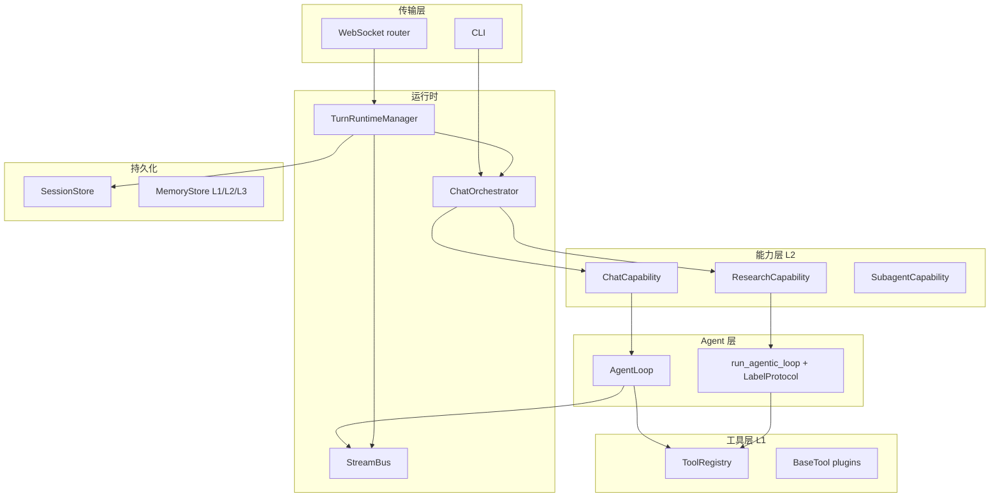

**不变量**：

- 所有消费者最终调用 `ChatOrchestrator.handle(UnifiedContext)` 或经 `TurnRuntimeManager` 包装后调用。
- **流式真相** = `StreamEvent`（带 `seq`）；**对话真相** = `messages` 表；**回合元数据** = `turns` + `turn_events`。

---

## 2. 核心实体字段表

### 2.1 `UnifiedContext`（单 Turn 输入）

| 字段 | 类型 | 含义 |
|------|------|------|
| `session_id` | `str` | 会话 ID；空则 orchestrator 生成 UUID |
| `user_message` | `str` | 当前用户文本 |
| `conversation_history` | `list[dict]` | OpenAI 格式历史 |
| `enabled_tools` | `list[str] \| None` | L1 工具开关；`None`=未指定，`[]`=全关 |
| `allowed_builtin_tools` | `list[str] \| None` | 内置工具白名单 |
| `active_capability` | `str \| None` | L2 能力名；默认 `chat` |
| `knowledge_bases` | `list[str]` | RAG KB |
| `attachments` | `list[Attachment]` | 附件 |
| `config_overrides` | `dict` | 温度、模型、预算等 |
| `language` | `str` | `en` / `zh` |
| `memory_context` | `str` | 注入 system 的记忆快照 |
| `persona_context` | `str` | Persona 指令 |
| `skills_manifest` | `str` | Skills 清单块 |
| `source_manifest` | `str` | 附件 source 清单 |
| `metadata` | `dict` | `turn_id`、`wait_for_user_reply` 等运行时键 |

源码：`deeptutor/core/context.py`。

### 2.2 `Attachment`

| 字段 | 说明 |
|------|------|
| `type` | `image` / `file` / `pdf` |
| `url`, `base64`, `filename`, `mime_type` | 载荷 |
| `id` | AttachmentStore 目录名 |
| `extracted_text` | 文档抽取纯文本 |

### 2.3 `StreamEvent`

| 字段 | 说明 |
|------|------|
| `type` | `StreamEventType` 枚举 |
| `source` | 产出方（`chat`、`rag`、`orchestrator`…） |
| `stage` | 子阶段 |
| `content` | 文本载荷 |
| `metadata` | 结构化扩展（`call_id`、`turn_terminal`…） |
| `session_id`, `turn_id` | 关联 |
| `seq` | 单 turn 内单调递增（由 StreamBus 赋值） |
| `timestamp` | Unix 秒 |

`StreamEventType` 全集：`STAGE_START`, `STAGE_END`, `THINKING`, `OBSERVATION`, `CONTENT`, `TOOL_CALL`, `TOOL_RESULT`, `PROGRESS`, `SOURCES`, `RESULT`, `ERROR`, `SESSION`, `SESSION_META`, `DONE`, `WAIT_FOR_INPUT`。

源码：`deeptutor/core/stream.py`。

### 2.4 `_TurnExecution`（进程内）

| 字段 | 说明 |
|------|------|
| `turn_id`, `session_id`, `capability` | 标识 |
| `payload` | WS/HTTP 原始请求 dict |
| `task` | `asyncio.Task` 跑 `_run_turn` |
| `subscribers` | 实时 WS 订阅队列 |
| `events` | 内存缓冲（flush 前） |
| `next_seq` | 事件序号游标 |

源码：`services/session/turn_runtime.py`。

### 2.5 `BaseCapability` / `BaseTool`

| 层级 | 基类 | 注册 | 执行入口 |
|------|------|------|----------|
| L2 | `BaseCapability` | `capability_registry` | `async def run(context: UnifiedContext, stream: StreamBus)` |
| L1 | `BaseTool` | `tool_registry` | `async def execute(**kwargs) -> ToolResult` |

`CapabilityManifest` 字段：`name`, `description`, `stages[]`, `tools_used[]`, `cli_aliases[]`, `request_schema`, `config_defaults`。

`compose_enabled_tools()` 根据 `enabled_tools` + `ToolMountFlags` 合并 schema。

### 2.6 编排层关键方法（源码签名）

| 类 | 方法 | 文件 |
|----|------|------|
| `TurnRuntimeManager` | `start_turn(payload) -> (session, turn)` | `turn_runtime.py` |
| | `subscribe_turn(turn_id, after_seq=0)` | 同上 |
| | `regenerate_last_turn(session_id, overrides?)` | 同上 |
| | `cancel_turn(turn_id) -> bool` | 同上 |
| | `submit_user_reply(turn_id, reply) -> bool` | 同上 |
| | `has_live_execution(turn_id) -> bool` | 同上 |
| `ChatOrchestrator` | `handle(context) -> AsyncIterator[StreamEvent]` | `orchestrator.py` |
| | `list_tools()`, `list_capabilities()` | 同上 |
| `StreamBus` | `emit(event)`, `subscribe()`, `close()` | `stream_bus.py` |
| | `stage(name)` contextmanager | 同上 |
| | `wait_for_input(prompt) -> str` | 同上 |
| | `register_bus(turn_id, bus)` / `get_bus(turn_id)` | 同上 |
| `AgentLoop` | `run() -> None` | `agent_loop.py` |
| | `_run_loop()`, `_call_llm()`, `_forced_finish()` | 同上 |
| `SQLiteSessionStore` | `create_turn`, `append_turn_event`, `add_message` | `sqlite_store.py` |
| | `get_messages_for_context(leaf_message_id?)` | 同上 |
| `ContextBuilder` | `build(session_id, llm_config, ...) -> ContextBuildResult` | `context_builder.py` |

### 2.7 `DispatchOutcome` / `ToolResult`（工具层）

| 类型 | 关键字段 | 语义 |
|------|----------|------|
| `ToolResult` | `content`, `sources`, `pause_for_user`, `terminate_turn` | 单工具返回；`pause_for_user` 触发 ask_user |
| `DispatchOutcome` | `tool_messages`, `pause`, `terminate`, `sources` | 并行批聚合；第一个 pause 获胜 |

---

## 3. 持久化 ER（SQLite）

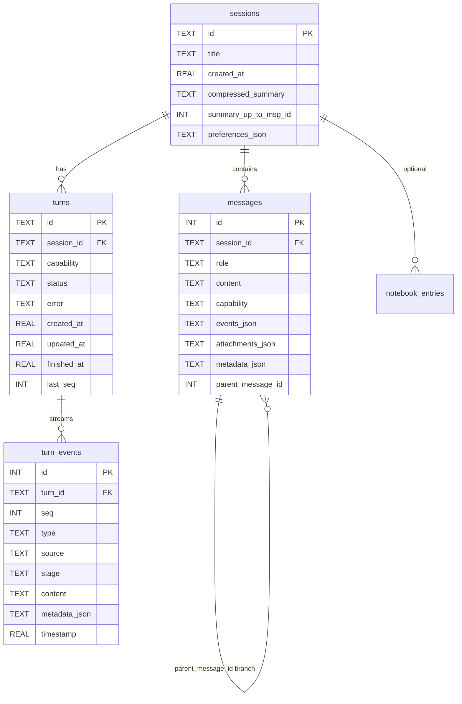

**状态机（`turns.status`）**：`running` → `completed` | `failed` | `interrupted`（孤儿 running 在进程重启时由 `TurnRuntimeManager._fail_orphan_running_turn` 修正）。

**消息分支**：`parent_message_id` 非空时形成编辑树；regenerate 走新 sibling 分支。

---

## 4. 运行时对象关系

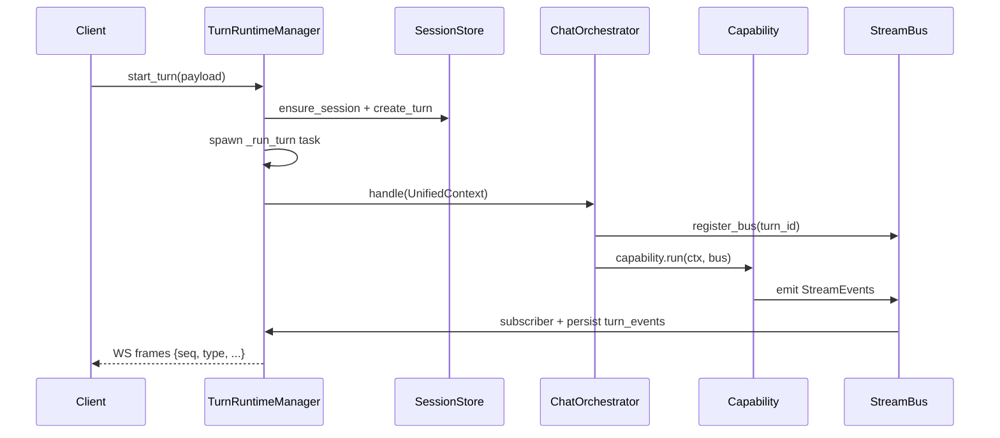

`StreamBus`：`deeptutor/core/stream_bus.py` — 单 turn 一个实例，关闭后 `unregister_bus`。

---

## 5. Chat vs Research 两套 Loop

| | **Chat** `AgentLoop` | **Research** `run_agentic_loop` |
|--|----------------------|----------------------------------|
| 文件 | `agents/chat/agent_loop.py` | `core/agentic/loop.py` |
| 协议 | OpenAI tool calls；round = narration 或 finish | 首行 **Label**（`THINK`/`TOOL`/…） |
| 终止 | 无 tool 的 round = finish | `LabelProtocol.terminal` |
| Host | `AgenticChatPipeline` | `LoopHost` 实现（如 research pipeline） |
| 暂停 | `ask_user` + `reply_queue` | 依 capability 的 `PAUSE` label |

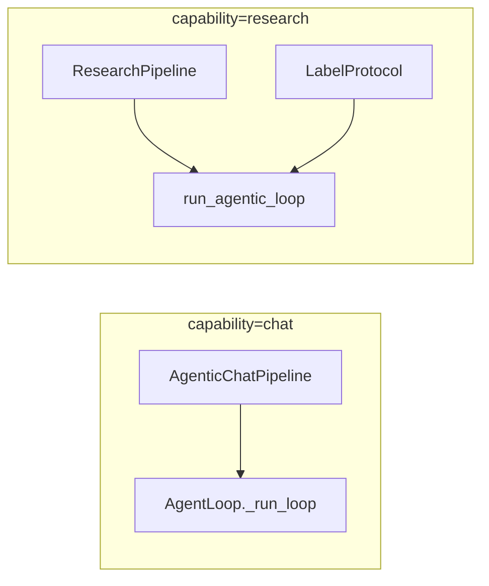

---

# 第二篇 端到端时序

## 6. 端到端时序 A：WebSocket start_turn → chat 工具轮

**场景**：用户问 *Explain backprop*，模型先 `rag_search` 再流式回答。

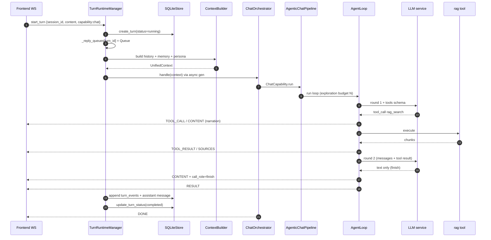

**AgentLoop 轮次语义**（文件头注释）：

1. 有 tool call 的 round → **narration**（前言），循环继续  
2. 无 tool call 的 round → **finish**（最终答案），循环结束  
3. 预算耗尽 → **settlement**（最多 3 轮）→ 必要时强制无 tool 终轮  

---

## 7. 端到端时序 B：同 Session 第二问

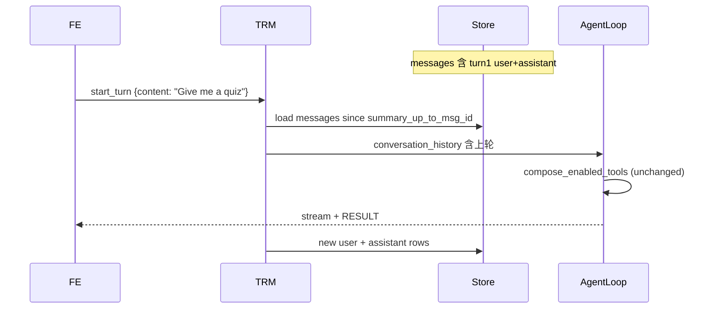

`ContextBuilder` 负责压缩摘要边界：`sessions.compressed_summary` + `summary_up_to_msg_id`。

---

## 8. 端到端时序 C：regenerate 分支

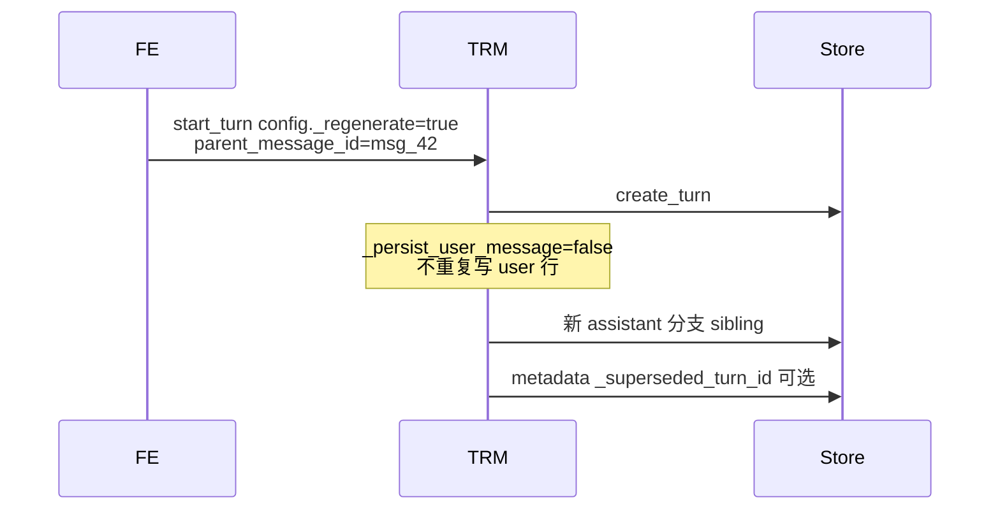

运行时键在 `start_turn` 从 public config 剥离：`runtime_only_keys` 含 `_regenerate`, `_regenerated_from_message_id`, `_superseded_turn_id`。

---

## 9. 端到端时序 D：ask_user 暂停恢复

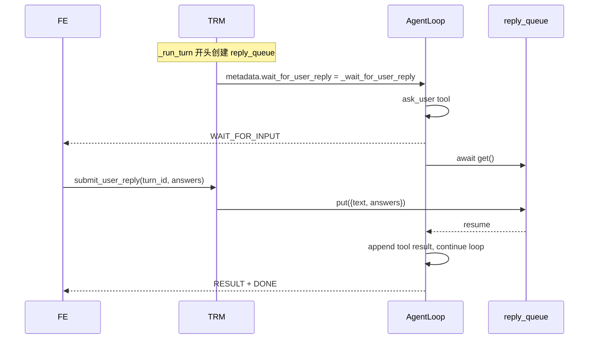

`submit_user_reply` 在 turn 非 awaiting 时返回 `False`（队列已清理）。

---

## 10. 端到端时序 E：切换 capability（research）

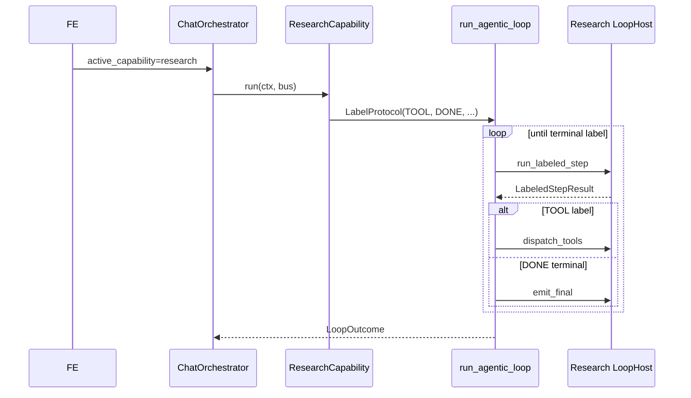

Research 不走 `AgentLoop` 的 narration/finish 启发式，而走 **label 协议**。

---

# 第三篇 模块深潜

> 自外向内：WS → TurnRuntime → Orchestrator → Capability → Agent Loop → Tool。

## 12.1 unified_ws 传输层

**文件**: `api/routers/unified_ws.py` — 单端点 `GET /api/v1/ws`

| 客户端 `type` | 服务端行为 |
|---------------|------------|
| `message` / `start_turn` | `TurnRuntimeManager.start_turn(payload)` |
| `subscribe_turn` | `subscribe_turn(turn_id, after_seq)` 追赶事件 |
| `subscribe_session` | 订阅 session 当前 active turn |
| `resume_from` | 断线重连 in-flight turn |
| `submit_user_reply` / `user_input` | `submit_user_reply` → `reply_queue` |
| `regenerate` | 构造 `_regenerate` runtime config 再 `start_turn` |
| `cancel_turn` | 取消 task + `update_turn_status` |
| `check_active_turn` | 孤儿 running 行修正 |

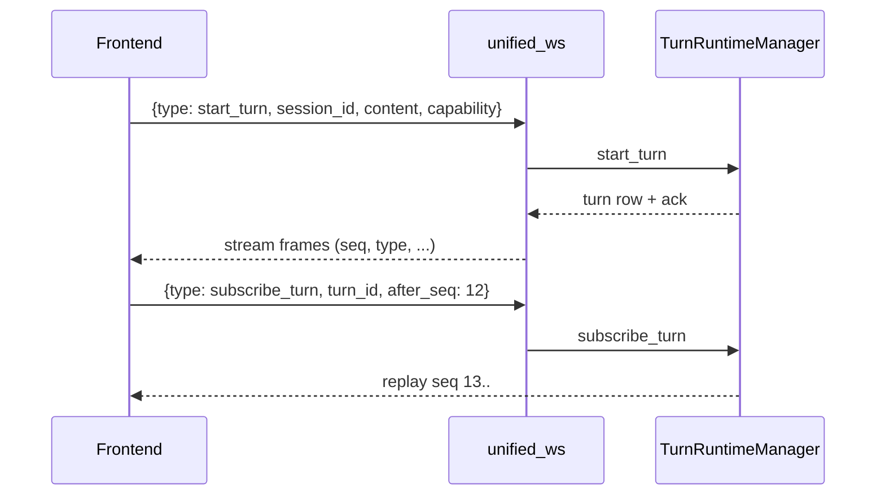

---

## 12.2 TurnRuntimeManager 全生命周期

**文件**: `services/session/turn_runtime.py`

### 12.2.1 进程内对象

```python
@dataclass
class _TurnExecution:
    turn_id: str
    session_id: str
    capability: str
    payload: dict[str, Any]
    task: asyncio.Task | None
    subscribers: list[_LiveSubscriber]   # WS 实时队列
    events: list[dict]                   # flush 前缓冲
    next_seq: int = 1
```

另：`self._executions: dict[str, _TurnExecution]`、`self._reply_queues: dict[str, asyncio.Queue]`（`ask_user` 专用）。

### 12.2.2 `start_turn` 阶段表

| 步骤 | 函数逻辑 | 副作用 |
|------|----------|--------|
| S1 | `validate_capability_config` | 剥离 `runtime_only_keys`（`_regenerate` 等） |
| S2 | `store.ensure_session` | 无 session_id 则创建 |
| S3 | `_recover_orphan_running_turns_for_session` | 清 stale `running` |
| S4 | `store.create_turn` | `status=running` |
| S5 | `_executions[turn_id] = _TurnExecution` | 注册内存 |
| S6 | `asyncio.create_task(_run_turn)` | 后台执行 |
| S7 | 返回 `(turn_dict, first_event)` | WS 立即 ack |

### 12.2.3 `_run_turn` 阶段表（L1199+）

| 阶段 | 内容 |
|------|------|
| R0 | 创建 `reply_queue`，写入 `context.metadata["wait_for_user_reply"]` |
| R1 | 解析 attachments → `AttachmentStore` 持久化字节 |
| R2 | `ContextBuilder.build` → bounded history + 可选 summary |
| R3 | `get_memory_store` → `memory_context` 注入 |
| R4 | Persona / Skills / KB / notebook / book references 拼装 |
| R5 | `ChatOrchestrator.handle(UnifiedContext)` 异步迭代 |
| R6 | 每个 `StreamEvent`：`append_turn_event(seq)` + fanout subscribers |
| R7 | 组装 `assistant` message（剔除 narration 段、thinking 标签） |
| R8 | `update_turn_status(completed|failed)` + `finally` 清理 queue |

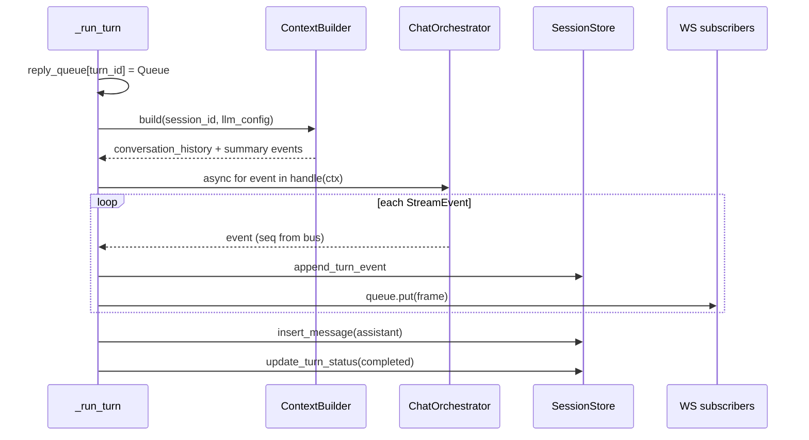

### 12.2.4 断线重连与孤儿 Turn

`_fail_orphan_running_turn`：DB 里 `running` 但本进程无 `_executions` → 标 `failed` + `_INTERRUPTED_TURN_ERROR`。  
`subscribe_turn(turn_id, after_seq)`：先 replay DB `turn_events`，再挂 live subscriber。

---

## 12.3 ContextBuilder（历史预算）

**文件**: `services/session/context_builder.py`

| 参数 | 默认 | 含义 |
|------|------|------|
| `history_budget_ratio` | 0.35 | 历史占 context window 比例 |
| `summary_target_ratio` | 0.40 | 摘要目标长度 |

**流程**:

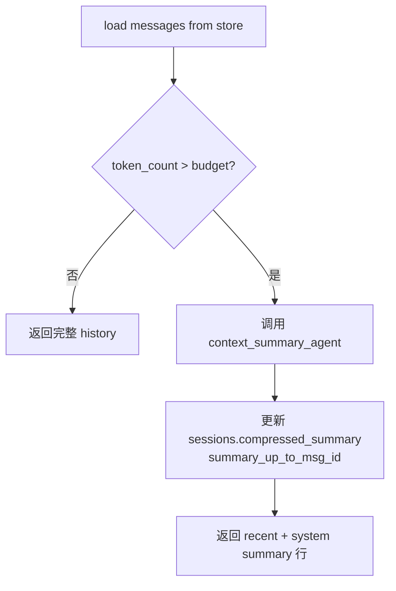

`ContextBuildResult` 含 `conversation_history`、`context_text`、`events`（可能含 `THINKING`/`PROGRESS` 追踪摘要进度）。

---

## 12.4 ChatOrchestrator

**文件**: `runtime/orchestrator.py`

| 步骤 | 行为 |
|------|------|
| 1 | `session_id` 空则 `uuid4()` |
| 2 | `cap_registry.get(active_capability or "chat")` |
| 3 | yield 合成 `SESSION` StreamEvent（带 turn_id） |
| 4 | `StreamBus()` + `register_bus(turn_id, bus)` |
| 5 | `asyncio.create_task(_run)`：`capability.run(ctx, bus)` |
| 6 | `async for event in bus.subscribe(): yield` |
| 7 | `await task`；`_publish_completion` → 全局 `EventBus` |

未知 capability：**不抛异常**，在 bus 上 `ERROR` + `DONE` 后关闭。

---

## 12.5 AgenticChatPipeline

**文件**: `agents/chat/agentic_pipeline.py`（`ChatCapability.run` 的唯一入口）

| 子阶段 | 职责 |
|--------|------|
| 组装 system | `ChatPromptAssembler` + persona + memory + skills + sources |
| 工具列表 | `compose_enabled_tools` + partner 抑制 + generation 门控 |
| Provider 视图 | `build_tool_view` / deferred tools |
| 创建 Loop | `AgentLoop(pipeline=self, ...)` |
| 运行 | `await loop.run(context, bus)` |

`CHAT_OPTIONAL_TOOLS` = `default_optional_tools()` 减去 excluded；partner 模式用 `partner_*` 替换 `read_memory`/`write_memory`。

---

## 12.6 AgentLoop 轮次状态机

**文件**: `agents/chat/agent_loop.py`

### 12.6.1 轮次分类

| 本轮 LLM 输出 | `call_role` | 循环 |
|---------------|-------------|------|
| 含 `tool_calls` | `narration` | 继续 exploration |
| 无 `tool_calls` | `finish` | **结束**（答案即本轮文本） |
| 预算耗尽仍要 tool | settlement（≤3 轮） | 仍允许 tool |
| settlement 仍要 tool | 强制无 tool 终轮 | 结束 |

### 12.6.2 单轮内部时序

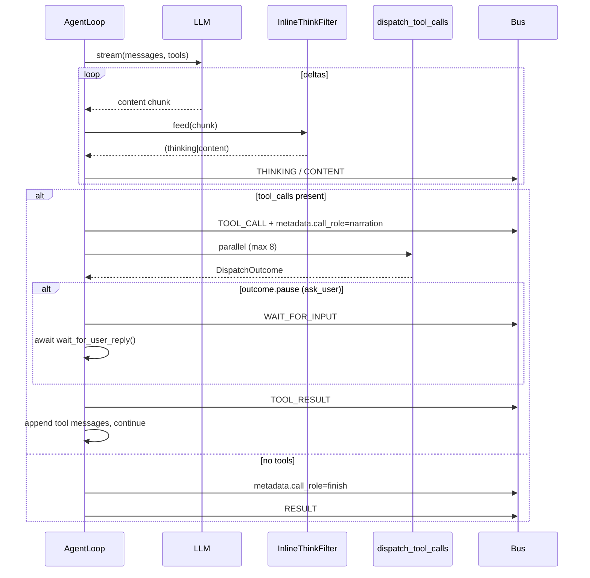

### 12.6.3 与持久化的关系

`TurnRuntimeManager` 用 `content_segments` + `narration_call_ids` **丢弃** narration 文本，只持久化 finish 段到 `messages.content`（与前端 bubble 一致）。

---

## 12.7 dispatch_tool_calls

**文件**: `core/agentic/tool_dispatch.py`

| 字段 / 常量 | 值 |
|-------------|-----|
| `MAX_PARALLEL_TOOL_CALLS` | 8 |
| `DispatchOutcome.pause` | `ask_user` 首个 pause 胜出 |
| `DispatchOutcome.terminate` | 预留；chat 现用 pause |

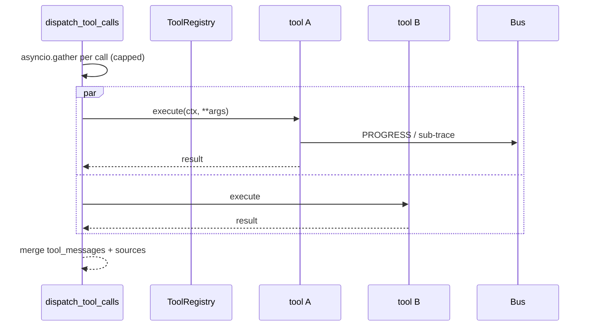

**KwargAugmenter**：chat pipeline 注入 `source_index` 等；capability 可自定义。  
**参数校验**：`missing_required_args` → 合成 error `role=tool` 消息，不抛到 WS 层。

---

## 12.8 compose_enabled_tools

**文件**: `agents/_shared/tool_composition.py`

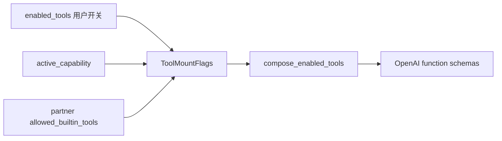

| `enabled_tools` | 语义 |
|-----------------|------|
| `None` | 未指定 → 默认 optional 全集（受 capability 约束） |
| `[]` | 显式关闭所有 optional |
| `["rag_search", ...]` | 白名单 |

内置工具（`rag`、`read_memory`…）按 **上下文条件** 自动挂载，除非 partner 白名单限制。

---

## 12.9 StreamBus

**文件**: `core/stream_bus.py`

| 机制 | 说明 |
|------|------|
| `_history` | 已 emit 事件；新 subscriber 先 replay 再挂队列 |
| `close()` | 向所有 subscriber 发 `None` 哨兵 |
| `register_bus(turn_id)` | 全局 dict；`ask_user` 等可通过 turn_id 找 bus |
| helpers | `content()`、`error()`、`stage()` 上下文管理器 |

**seq 赋值**：通常在 `TurnRuntimeManager` 持久化前写入 `event.seq = next_seq++`（bus 内 event 可能 seq=0，以 TRM 为准）。

---

## 12.10 SessionStore（SQLite）

**文件**: `services/session/sqlite_store.py`

| API | 用途 |
|-----|------|
| `ensure_session` | upsert session + preferences |
| `create_turn` | 新 turn_id，`running` |
| `append_turn_event` | `UNIQUE(turn_id, seq)` |
| `insert_message` | user/assistant；支持 `parent_message_id` 分支 |
| `list_messages_for_context` | 按分支祖先链取 history |
| `update_turn_status` | 终态 + error 文本 |
| `list_active_turns` | 孤儿检测 |

**编辑树**：`parent_message_id` 指向分支点；regenerate 在相同 parent 下新建 assistant sibling。

---

## 12.11 run_agentic_loop + LabelProtocol

**文件**: `core/agentic/loop.py`、`agents/research/pipeline.py`（示例 Host）

```python
@dataclass(frozen=True)
class LabelProtocol:
    allowed: tuple[str, ...]
    terminal: frozenset[str]      # 退出循环
    intermediate: frozenset[str]  # 继续，prose 进 context
    final: frozenset[str]         # 终端标签是否流式 emit 正文
    tool_label: str | None        # 唯一可带 tool_calls 的标签
```

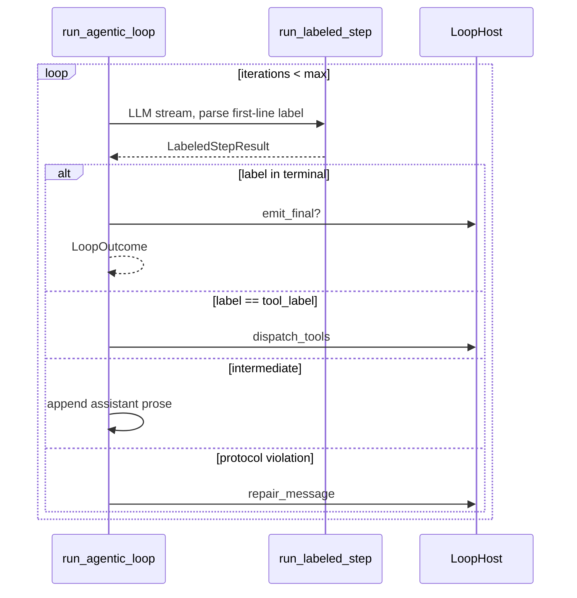

Research 的 `TOOL` / `DONE` / `THINK` 标签与 Chat 的 OpenAI native tool_calls **互斥路径**——同一产品内按 capability 选型。

---

## 12.12 MemoryStore 三层

**文件**: `services/memory/store.py`、`services/memory/trace.py`、`consolidator.py`

| 层 | 存储 | 写入 | 读取注入 |
|----|------|------|----------|
| **L1** | JSONL trace | `MemoryStore.emit(TraceEvent)` | 后台 consolidator 消费 |
| **L2** | `data/.../memory/L2/{surface}.md` | consolidator / `write_memory` tool | `read_doc(L2, surface)` |
| **L3** | 四 slot Markdown（PROFILE 等） | ops API / tool | `read_l3_concat()` → system |

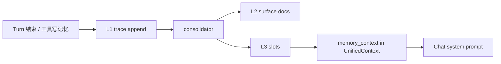

`ContextBuilder` / `_run_turn` 在 R3 阶段调用 `get_memory_store()` 填充 `context.memory_context`。

---

## 12.13 Registry（Capability / Tool）

| 注册表 | 文件 | 发现方式 |
|--------|------|----------|
| `capability_registry` | `runtime/registry/capability_registry.py` | 插件 entry points |
| `tool_registry` | `runtime/registry/tool_registry.py` | `BaseTool` 子类 |

`ChatOrchestrator.get_capability_manifests()` / `get_tool_schemas()` 供前端与 OpenAI 请求组装使用。

---

# 第四篇 JSON 实例

## 11. 对象实例示例

### 11.1 WS `start_turn` payload

```json
{
  "session_id": "sess_9c2f",
  "content": "Explain backpropagation simply",
  "capability": "chat",
  "language": "en",
  "config": {
    "temperature": 0.7,
    "enabled_tools": ["rag_search", "web_fetch"]
  },
  "attachments": []
}
```

### 11.2 持久化的 `turn_events` 行（逻辑）

```json
{
  "turn_id": "turn_a1b2",
  "seq": 14,
  "type": "tool_result",
  "source": "rag_search",
  "content": "Found 3 chunks...",
  "metadata_json": "{\"call_id\":\"call_xyz\",\"turn_terminal\":false}"
}
```

### 11.3 `StreamEvent` RESULT

```json
{
  "type": "result",
  "source": "chat",
  "content": "Backpropagation adjusts weights by...",
  "metadata": {
    "answer": "Backpropagation adjusts weights by...",
    "sources": [{"title": "NN Chapter 4", "url": "..."}],
    "turn_terminal": true
  },
  "session_id": "sess_9c2f",
  "turn_id": "turn_a1b2",
  "seq": 28
}
```

### 11.4 `UnifiedContext` 片段（`_run_turn` 构建后）

```json
{
  "session_id": "sess_9c2f",
  "user_message": "Explain backpropagation simply",
  "active_capability": "chat",
  "conversation_history": [
    {"role": "user", "content": "Hi"},
    {"role": "assistant", "content": "Hello!"}
  ],
  "memory_context": "## Long-term memory\nUser prefers concise answers.",
  "metadata": {
    "turn_id": "turn_a1b2",
    "wait_for_user_reply": "<callable>"
  }
}
```

### 11.5 OpenAI 消息（Loop 内一轮后）

```json
[
  {"role": "user", "content": "Explain backpropagation simply"},
  {
    "role": "assistant",
    "content": "Let me search your materials first.",
    "tool_calls": [{
      "id": "call_xyz",
      "type": "function",
      "function": {"name": "rag_search", "arguments": "{\"query\":\"backprop\"}"}
    }]
  },
  {"role": "tool", "tool_call_id": "call_xyz", "content": "[chunk1] ..."}
]
```

---

返回 [文档中心](./README.md)
