# DeepTutor 模块深潜图解（血肉版）

> **已并入** [all.md 第十篇](./all.md#第十篇模块深潜图解血肉) 为权威正文；本文件保留便于单独阅读/ diff。  
> **真源**：`DeepTutor/deeptutor/` · [ENTITY_AND_SEQUENCES.md](./ENTITY_AND_SEQUENCES.md)

---

## 1. Mastery Path — 掌握度路径

### 1.1 框架：产品闭环在运行时中的位置

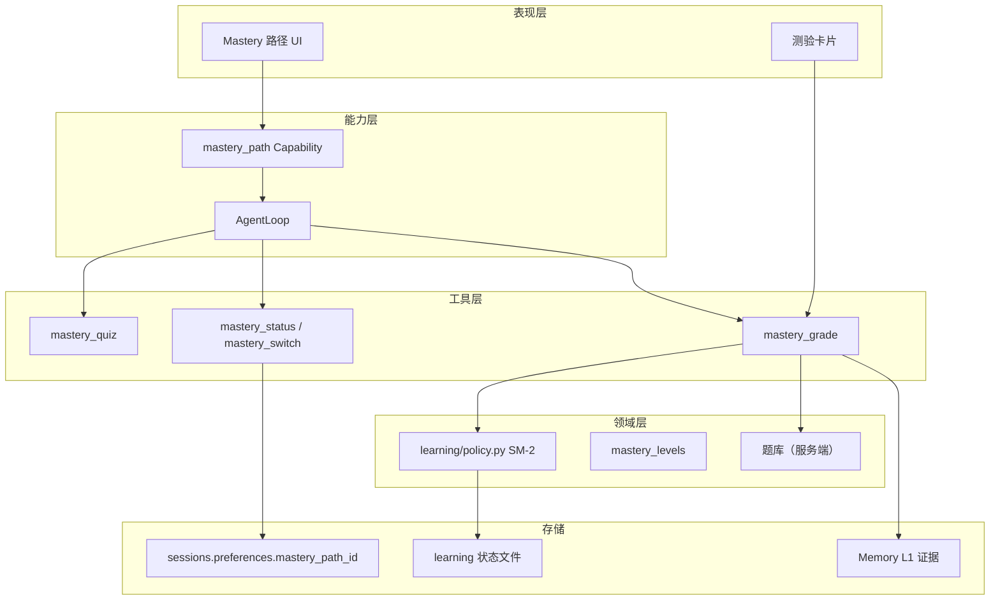
```mermaid
graph TB
    subgraph UI["表现层"]
        MP_UI["Mastery 路径 UI"]
        QUIZ_UI["测验卡片"]
    end
    subgraph Cap["能力层"]
        MPC["mastery_path Capability"]
        AL["AgentLoop"]
    end
    subgraph Tools["工具层"]
        MQ["mastery_quiz"]
        MG["mastery_grade"]
        MS["mastery_status / mastery_switch"]
    end
    subgraph Domain["领域层"]
        POL["learning/policy.py SM-2"]
        LV["mastery_levels"]
        QB["题库（服务端）"]
    end
    subgraph Store["存储"]
        PREF["sessions.preferences.mastery_path_id"]
        LEARN["learning 状态文件"]
        MEM["Memory L1 证据"]
    end

    MP_UI --> MPC
    MPC --> AL
    AL --> MQ & MG & MS
    MG --> QB
    MG --> POL
    POL --> LEARN
    MS --> PREF
    MG --> MEM
    QUIZ_UI --> MG
```

**解读**：Mastery 不是「聊天里顺便出题」。`mastery_path` 是一条 **带硬 gate 的长期练习闭环**：Agent 在对话中调用 `mastery_*` 工具，但 **判分与标准答案永远在服务端**（`mastery_grade` → 题库/rubric），LLM 看不到答案，从架构上防泄题、防 prompt 改分。

### 1.2 时序：一次测验节点

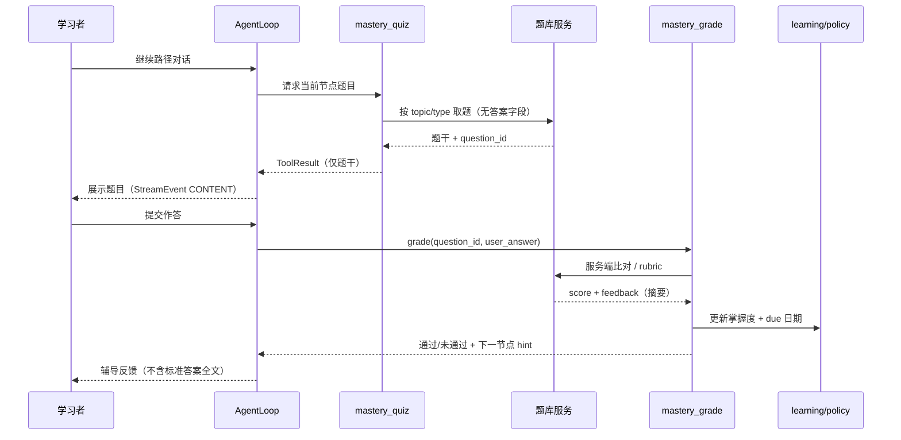
```mermaid
sequenceDiagram
    participant U as 学习者
    participant AL as AgentLoop
    participant MQ as mastery_quiz
    participant SRV as 题库服务
    participant MG as mastery_grade
    participant POL as learning/policy

    U->>AL: 继续路径对话
    AL->>MQ: 请求当前节点题目
    MQ->>SRV: 按 topic/type 取题（无答案字段）
    SRV-->>MQ: 题干 + question_id
    MQ-->>AL: ToolResult（仅题干）
    AL-->>U: 展示题目（StreamEvent CONTENT）

    U->>AL: 提交作答
    AL->>MG: grade(question_id, user_answer)
    MG->>SRV: 服务端比对 / rubric
    SRV-->>MG: score + feedback（摘要）
    MG->>POL: 更新掌握度 + due 日期
    MG-->>AL: 通过/未通过 + 下一节点 hint
    AL-->>U: 辅导反馈（不含标准答案全文）
```

### 1.3 状态机：Topic Gate

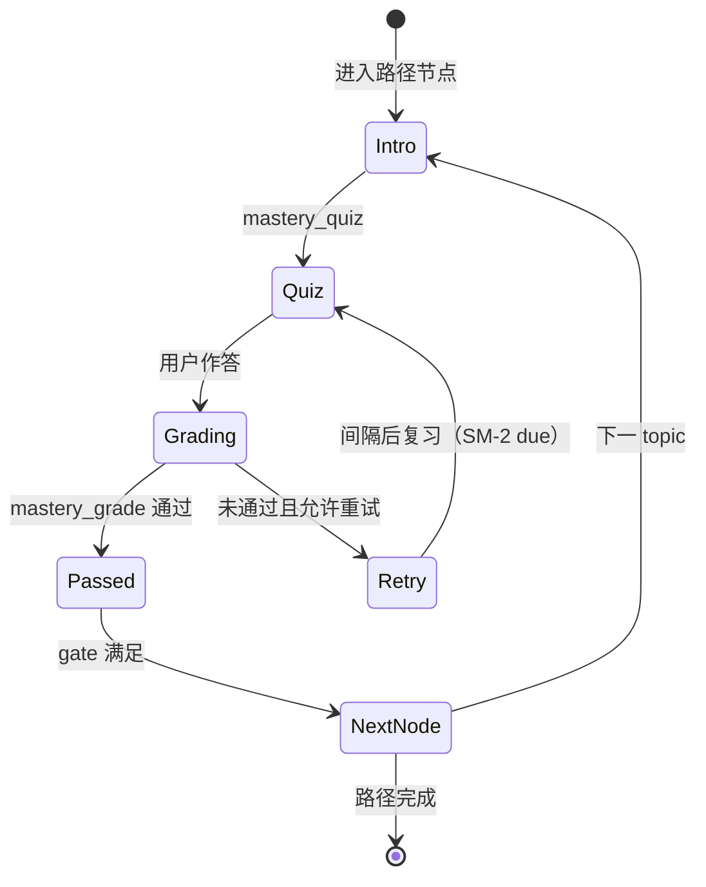
```mermaid
stateDiagram-v2
    [*] --> Intro: 进入路径节点
    Intro --> Quiz: mastery_quiz
    Quiz --> Grading: 用户作答
    Grading --> Passed: mastery_grade 通过
    Grading --> Retry: 未通过且允许重试
    Retry --> Quiz: 间隔后复习（SM-2 due）
    Passed --> NextNode: gate 满足
    NextNode --> Intro: 下一 topic
    NextNode --> [*]: 路径完成
```

**解读**：`learning/policy.py` 负责 **间隔复习**（SM-2 风格 due）；`mastery_levels` 量化掌握度。Session `preferences.mastery_path_id` 在 TurnRuntime 显式 payload 时持久化，保证刷新页面后路径不断档。

---

## 2. deep_question（Quiz）与 quiz_judge

### 2.1 框架：出题 vs 掌握度

| 维度 | `deep_question` | `mastery_path` |
|------|-----------------|----------------|
| 目标 | 快速生成测验卷 | 长期路径 + gate |
| 引擎 | BaseAgent：ideation → generation | AgentLoop + mastery 工具 |
| 答案 | 写入题库，**不进 prompt** | 同上 |
| API | `quiz_judge` 服务端判分 | `mastery_grade` |

### 2.2 流程：出题管线

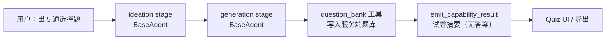
```mermaid
flowchart LR
    IN["用户：出 5 道选择题"] --> IDE["ideation stage<br/>BaseAgent"]
    IDE --> GEN["generation stage<br/>BaseAgent"]
    GEN --> BANK["question_bank 工具<br/>写入服务端题库"]
    BANK --> OUT["emit_capability_result<br/>试卷摘要（无答案）"]
    OUT --> UI["Quiz UI / 导出"]
```

### 2.3 时序：判分（与 Mastery 共用防泄题原则）

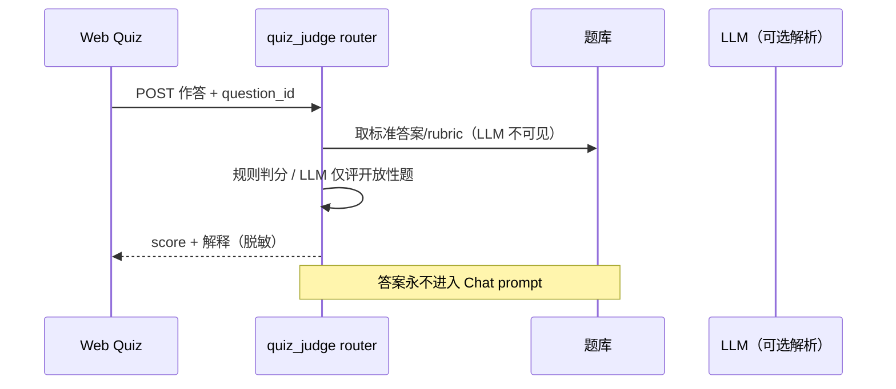
```mermaid
sequenceDiagram
    participant UI as Web Quiz
    participant API as quiz_judge router
    participant BANK as 题库
    participant LLM as LLM（可选解析）

    UI->>API: POST 作答 + question_id
    API->>BANK: 取标准答案/rubric（LLM 不可见）
    API->>API: 规则判分 / LLM 仅评开放性题
    API-->>UI: score + 解释（脱敏）
    Note over API,BANK: 答案永不进入 Chat prompt
```

**解读**：`deep_question` 的 mimic source 可在 ideation 阶段读取样题 **风格**，但生成题后答案立即落库隔离。教师场景可单独用 Quiz API 做班级测验，与 Chat Turn 解耦。

---

## 3. deep_research — 四阶段调研

### 3.1 框架图

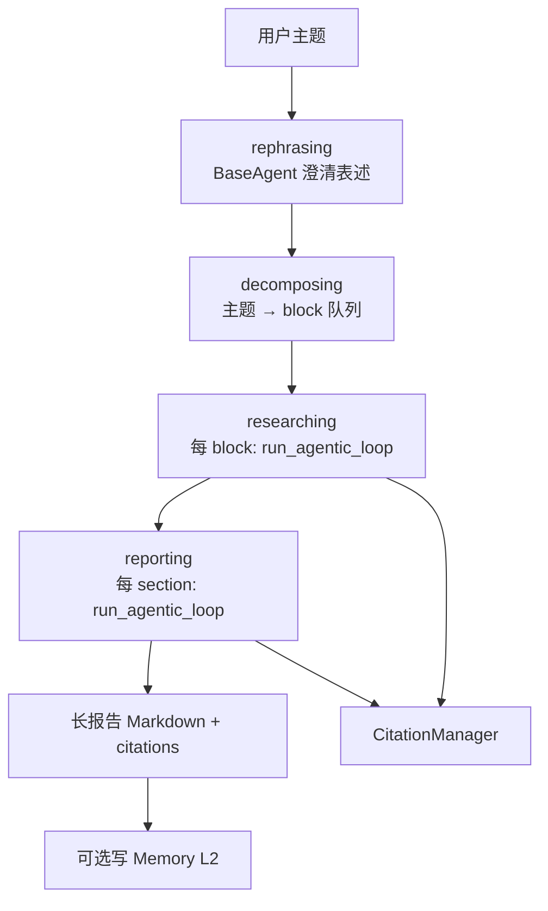
```mermaid
flowchart TB
    IN["用户主题"] --> R1["rephrasing<br/>BaseAgent 澄清表述"]
    R1 --> R2["decomposing<br/>主题 → block 队列"]
    R2 --> R3["researching<br/>每 block: run_agentic_loop"]
    R3 --> R4["reporting<br/>每 section: run_agentic_loop"]
    R4 --> OUT["长报告 Markdown + citations"]
    R3 --> CIT["CitationManager"]
    R4 --> CIT
    OUT --> MEM["可选写 Memory L2"]
```

### 3.2 时序：单个 research block（标签协议）

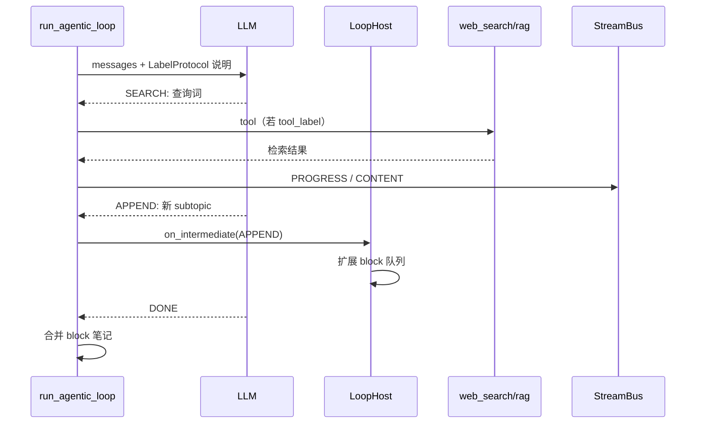
```mermaid
sequenceDiagram
    participant LP as run_agentic_loop
    participant LLM as LLM
    participant HOST as LoopHost
    participant WS as web_search/rag
    participant BUS as StreamBus

    LP->>LLM: messages + LabelProtocol 说明
    LLM-->>LP: SEARCH: 查询词
    LP->>WS: tool（若 tool_label）
    WS-->>LP: 检索结果
    LP->>BUS: PROGRESS / CONTENT
    LLM-->>LP: APPEND: 新 subtopic
    LP->>HOST: on_intermediate(APPEND)
    HOST->>HOST: 扩展 block 队列
    LLM-->>LP: DONE
    LP->>LP: 合并 block 笔记
```

**解读**：research **不用 AgentLoop**，而用 `LabelProtocol`（首行标签 `SEARCH`/`APPEND`/`DONE`/`WRITE`…）。`APPEND` 是核心扩展点：模型可动态增加子课题，无需预先固定 DAG。`UsageTracker` 在 capability 末写入 `cost_summary`。

---

## 4. deep_solve — 三 Agent 管线

### 4.1 时序（Capability 级，非 chat 内 solve_* 工具）

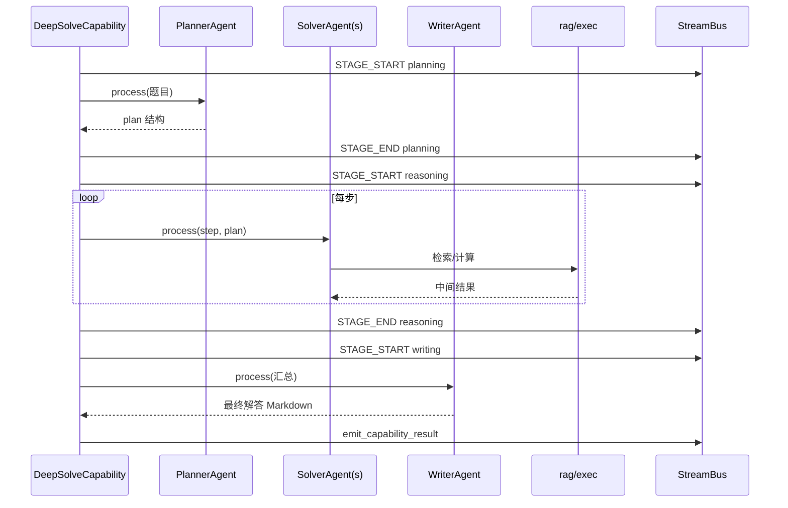
```mermaid
sequenceDiagram
    participant CAP as DeepSolveCapability
    participant P as PlannerAgent
    participant S as SolverAgent(s)
    participant W as WriterAgent
    participant RAG as rag/exec
    participant BUS as StreamBus

    CAP->>BUS: STAGE_START planning
    CAP->>P: process(题目)
    P-->>CAP: plan 结构
    CAP->>BUS: STAGE_END planning

    CAP->>BUS: STAGE_START reasoning
    loop 每步
        CAP->>S: process(step, plan)
        S->>RAG: 检索/计算
        RAG-->>S: 中间结果
    end
    CAP->>BUS: STAGE_END reasoning

    CAP->>BUS: STAGE_START writing
    CAP->>W: process(汇总)
    W-->>CAP: 最终解答 Markdown
    CAP->>BUS: emit_capability_result
```

**解读**：`deeptutor run solve` 走 **三 stage BaseAgent**；Chat 里也可通过 `solve_plan` 等工具在 **单 AgentLoop** 内分步。两套路径服务不同 UX，共享同一套 prompt YAML（`deep_solve.yaml`）。

---

## 5. math_animator 与 visualize

### 5.1 math_animator 流程

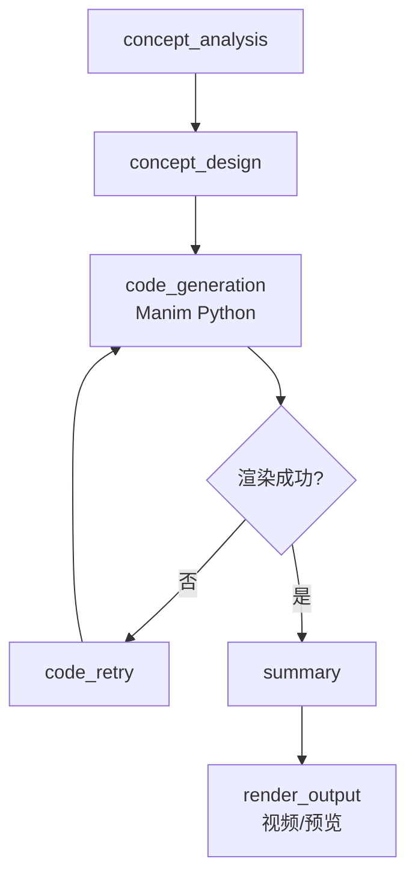
```mermaid
flowchart TD
    A["concept_analysis"] --> B["concept_design"]
    B --> C["code_generation<br/>Manim Python"]
    C --> D{"渲染成功?"}
    D -->|否| E["code_retry"]
    E --> C
    D -->|是| F["summary"]
    F --> G["render_output<br/>视频/预览"]
```

**解读**：依赖 `.[math-animator]` extra；失败在 stage 级重试，避免整 turn 报废。产物进 Workspace `outputs/...`。

### 5.2 visualize 与 manim 路由

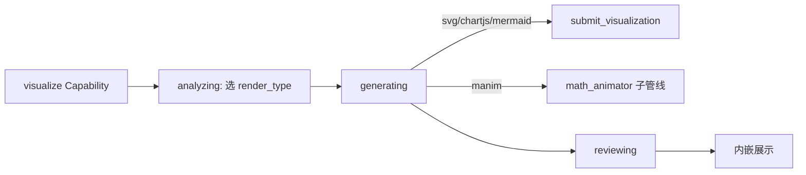
```mermaid
flowchart LR
    V["visualize Capability"] --> AN["analyzing: 选 render_type"]
    AN --> GEN["generating"]
    GEN -->|svg/chartjs/mermaid| SUB["submit_visualization"]
    GEN -->|manim| MA["math_animator 子管线"]
    GEN --> REV["reviewing"]
    REV --> UI["内嵌展示"]
```

---

## 6. ask_questions — 澄清式辅导

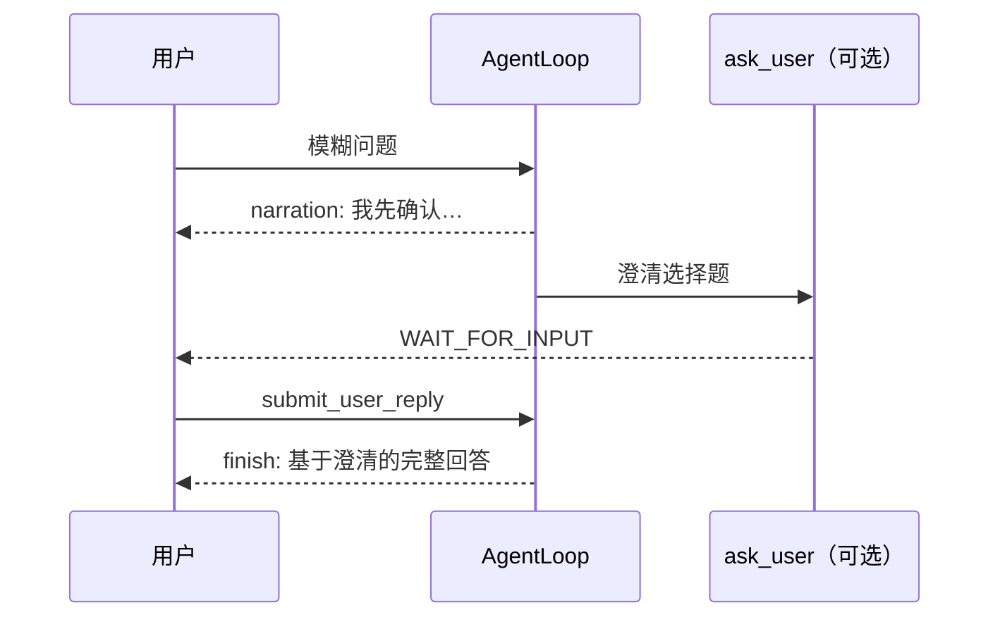
```mermaid
sequenceDiagram
    participant U as 用户
    participant AL as AgentLoop
    participant AU as ask_user（可选）

    U->>AL: 模糊问题
    AL-->>U: narration: 我先确认…
    AL->>AU: 澄清选择题
    AU-->>U: WAIT_FOR_INPUT
    U->>AL: submit_user_reply
    AL-->>U: finish: 基于澄清的完整回答
```

**解读**：与 `chat` 共享 AgentLoop，但 playbook 强制 **先澄清再答**，降低幻觉；`ask_user` 与 chat 相同暂停语义（同 turn_id 续跑）。

---

## 7. immersive_reading / immersive_watching

### 7.1 Reading 框架

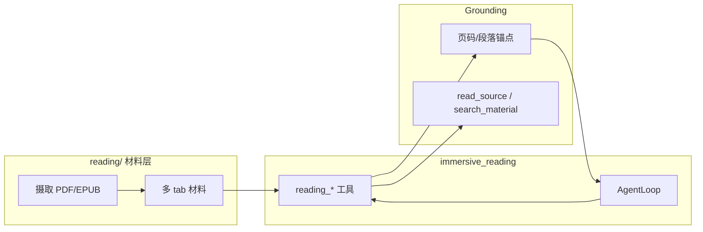
```mermaid
graph LR
    subgraph Mat["reading/ 材料层"]
        ING["摄取 PDF/EPUB"]
        TABS["多 tab 材料"]
    end
    subgraph Cap["immersive_reading"]
        AL["AgentLoop"]
        RT["reading_* 工具"]
    end
    subgraph Ground["Grounding"]
        PAGE["页码/段落锚点"]
        RS["read_source / search_material"]
    end
    ING --> TABS
    TABS --> RT
    AL --> RT
    RT --> PAGE
    RT --> RS
    PAGE --> AL
```

### 7.2 Video 时序

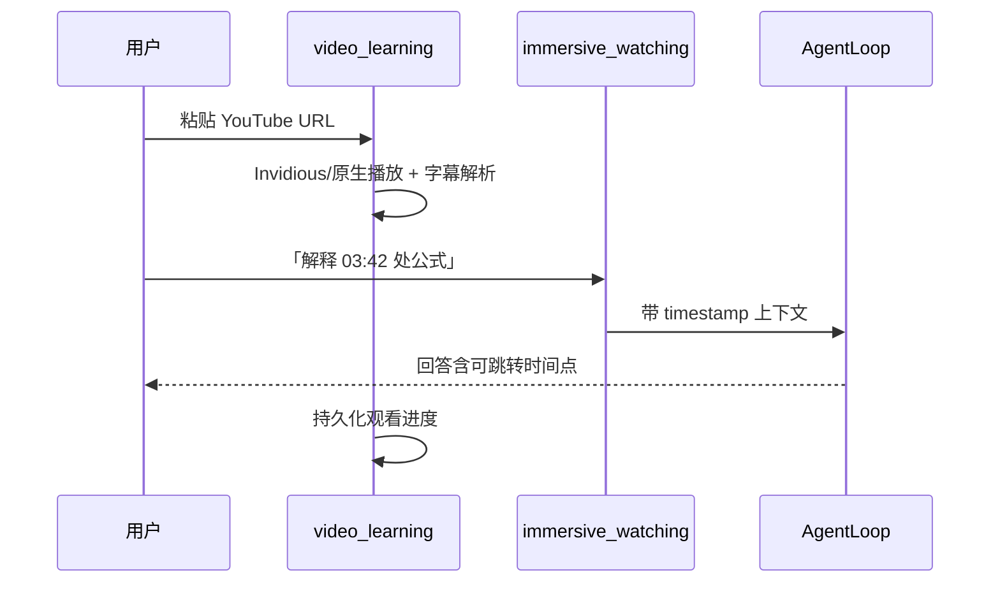
```mermaid
sequenceDiagram
    participant U as 用户
    participant VL as video_learning
    participant CAP as immersive_watching
    participant AL as AgentLoop

    U->>VL: 粘贴 YouTube URL
    VL->>VL: Invidious/原生播放 + 字幕解析
    U->>CAP: 「解释 03:42 处公式」
    CAP->>AL: 带 timestamp 上下文
    AL-->>U: 回答含可跳转时间点
    VL->>VL: 持久化观看进度
```

---

## 8. Book 活书编译

### 8.1 框架

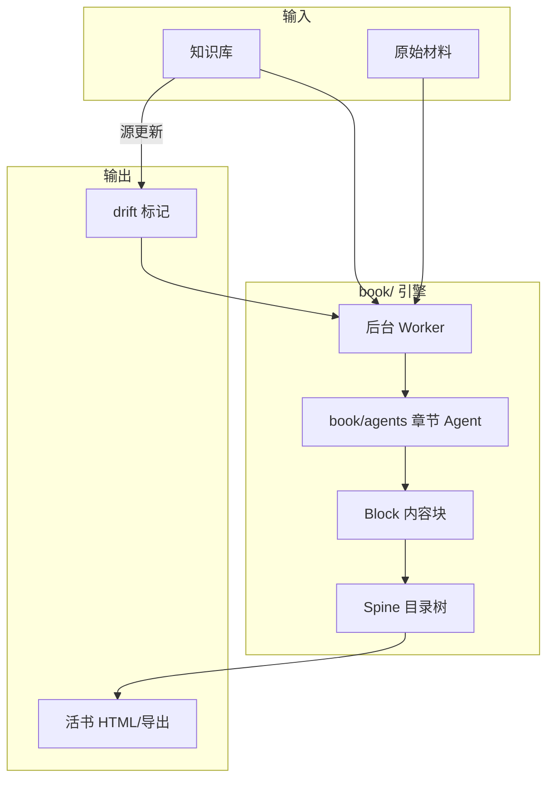
```mermaid
graph TB
    subgraph Input["输入"]
        KB["知识库"]
        DOC["原始材料"]
    end
    subgraph BookEng["book/ 引擎"]
        SPINE["Spine 目录树"]
        BLK["Block 内容块"]
        W["后台 Worker"]
        AG["book/agents 章节 Agent"]
    end
    subgraph Out["输出"]
        LIVE["活书 HTML/导出"]
        DRIFT["drift 标记"]
    end
    DOC --> W
    KB --> W
    W --> AG
    AG --> BLK
    BLK --> SPINE
    SPINE --> LIVE
    KB -->|源更新| DRIFT
    DRIFT --> W
```

### 8.2 时序：块级重编译

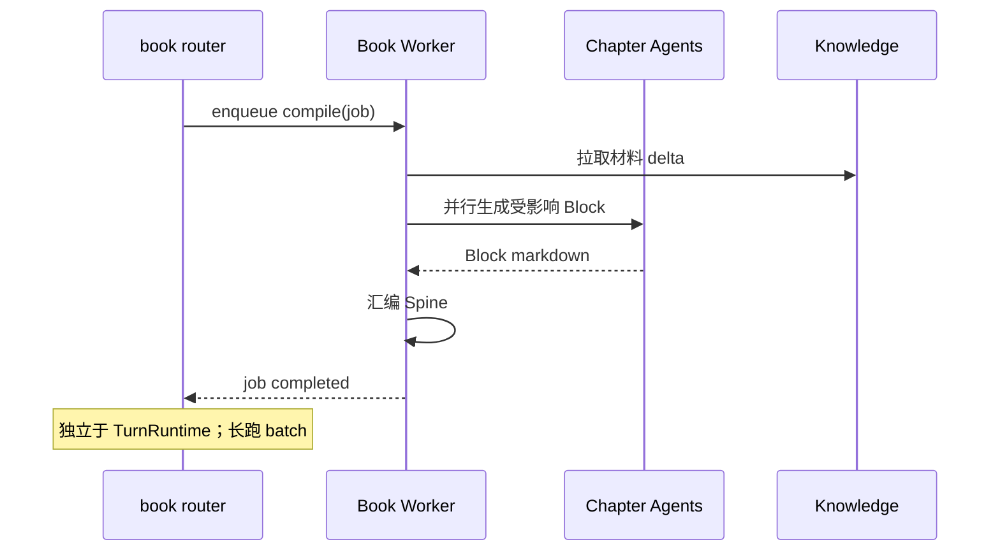
```mermaid
sequenceDiagram
    participant API as book router
    participant W as Book Worker
    participant AG as Chapter Agents
    participant KB as Knowledge

    API->>W: enqueue compile(job)
    W->>KB: 拉取材料 delta
    W->>AG: 并行生成受影响 Block
    AG-->>W: Block markdown
    W->>W: 汇编 Spine
    W-->>API: job completed
    Note over API: 独立于 TurnRuntime；长跑 batch
```

**解读**：Book **不走** `start_turn` 主路径；避免长编译阻塞 WS。与 `co_writer` 产出可互相引用。

---

## 9. co_writer — 段落协作链

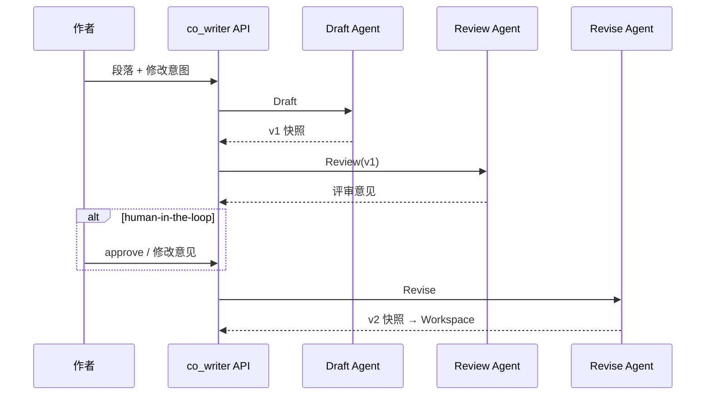
```mermaid
sequenceDiagram
    participant U as 作者
    participant API as co_writer API
    participant D as Draft Agent
    participant R as Review Agent
    participant V as Revise Agent

    U->>API: 段落 + 修改意图
    API->>D: Draft
    D-->>API: v1 快照
    API->>R: Review(v1)
    R-->>API: 评审意见
    alt human-in-the-loop
        U->>API: approve / 修改意见
    end
    API->>V: Revise
    V-->>API: v2 快照 → Workspace
```

---

## 10. course_study — 机构课程单元

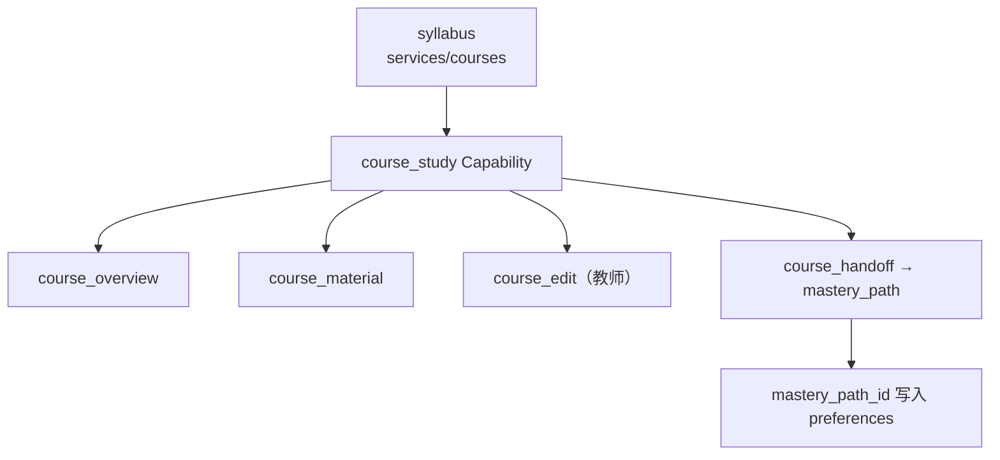
```mermaid
flowchart TB
    SYL["syllabus<br/>services/courses"] --> CS["course_study Capability"]
    CS --> T1["course_overview"]
    CS --> T2["course_material"]
    CS --> T3["course_edit（教师）"]
    CS --> T4["course_handoff → mastery_path"]
    T4 --> MP["mastery_path_id 写入 preferences"]
```

**解读**：`course_handoff` 把单元学完的手势 **交接** 到掌握度路径，适合院校包课：课程结构在 `courses_state`，练习闭环在 Mastery。

---

## 11. LLM 与模型层

### 11.1 Provider 框架

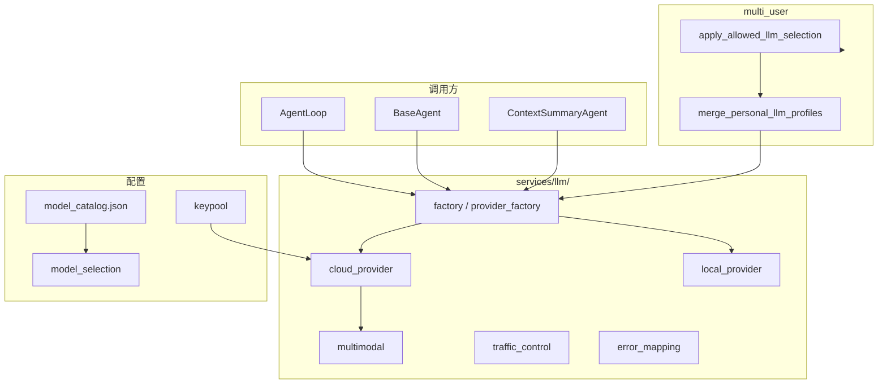
```mermaid
graph TB
    subgraph Callers["调用方"]
        AL["AgentLoop"]
        BA["BaseAgent"]
        CB["ContextSummaryAgent"]
    end
    subgraph LLM["services/llm/"]
        FAC["factory / provider_factory"]
        CLOUD["cloud_provider"]
        LOCAL["local_provider"]
        MM["multimodal"]
        TC["traffic_control"]
        EM["error_mapping"]
    end
    subgraph Config["配置"]
        CAT["model_catalog.json"]
        KEY["keypool"]
        SEL["model_selection"]
    end
    subgraph Gate["multi_user"]
        ALLOW["apply_allowed_llm_selection"]
        MERGE["merge_personal_llm_profiles"]
    end

    AL & BA & CB --> FAC
    FAC --> CLOUD & LOCAL
    CLOUD --> MM
    CAT --> SEL
    KEY --> CLOUD
    Gate --> ALLOW --> MERGE
    MERGE --> FAC
```

### 11.2 时序：流式一轮

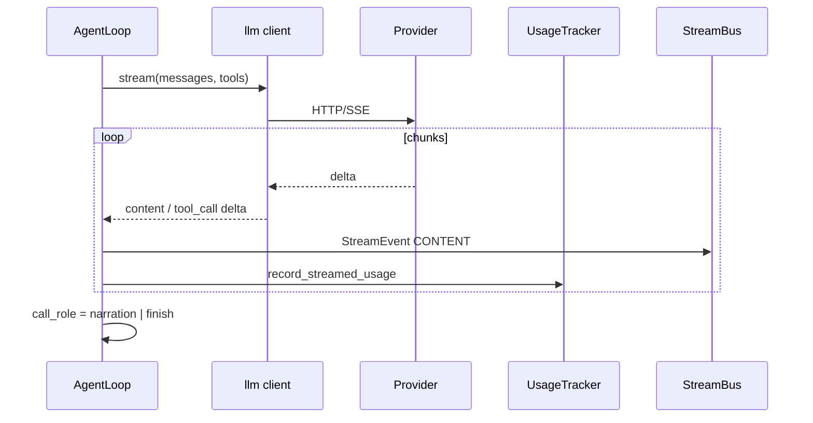
```mermaid
sequenceDiagram
    participant AL as AgentLoop
    participant CLI as llm client
    participant PR as Provider
    participant UT as UsageTracker
    participant BUS as StreamBus

    AL->>CLI: stream(messages, tools)
    CLI->>PR: HTTP/SSE
    loop chunks
        PR-->>CLI: delta
        CLI-->>AL: content / tool_call delta
        AL->>BUS: StreamEvent CONTENT
        AL->>UT: record_streamed_usage
    end
    AL->>AL: call_role = narration | finish
```

**解读**：`request_compat` 处理 DSML 等变体；`context_window` 供 ContextBuilder 算 budget；**截断不在 Provider 层**，在 ContextBuilder + AgentLoop `_guard_context_window`。

---

## 12. RAG — 摄取与检索

### 12.1 摄取流程

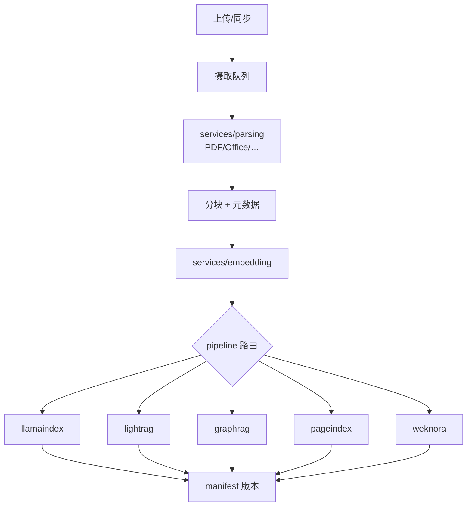
```mermaid
flowchart TD
    UP["上传/同步"] --> Q["摄取队列"]
    Q --> PAR["services/parsing<br/>PDF/Office/…"]
    PAR --> CHK["分块 + 元数据"]
    CHK --> EMB["services/embedding"]
    EMB --> PIPE{"pipeline 路由"}
    PIPE --> LI["llamaindex"]
    PIPE --> LR["lightrag"]
    PIPE --> GR["graphrag"]
    PIPE --> PI["pageindex"]
    PIPE --> WK["weknora"]
    LI & LR & GR & PI & WK --> MAN["manifest 版本"]
```

### 12.2 检索时序（Turn 内）

```mermaid
sequenceDiagram
    participant AL as AgentLoop
    participant DT as dispatch_tool_calls
    participant RAG as rag tool
    participant PIPE as pipelines/*
    participant BUS as StreamBus

    AL->>DT: tool_call rag(query)
    DT->>RAG: execute(event_sink)
    RAG->>PIPE: retrieve(kb_names, query)
    loop progress
        RAG->>BUS: PROGRESS（Retrieve 子轨迹）
    end
    PIPE-->>RAG: chunks
    RAG-->>DT: ToolResult + sources
    DT-->>AL: messages += tool result
    AL->>BUS: SOURCES（引用卡片）
```

**解读**：`ToolMountFlags.has_kb=False` 时 **rag 不出现在 schema**，避免无 KB 时的必败调用。`read_source` 用于精读单文件页码，与批量 `rag` 互补。

---

## 13. 附件与多模态

```mermaid
sequenceDiagram
    participant UI as Web/CLI
    participant TRM as TurnRuntimeManager
    participant ATT as AttachmentStore
    participant CB as ContextBuilder
    participant ASM as ChatPromptAssembler
    participant LLM as multimodal client

    UI->>TRM: start_turn + files[]
    TRM->>ATT: 存字节 + OCR/抽取
    TRM->>CB: build()
    CB->>ASM: sources block + attachments
    ASM->>LLM: messages 含 image_url / text
    LLM-->>TRM: 回答
    Note over TRM: generated_attachments 回写 message
```

**解读**：`imagegen`/`videogen` 走 `services/imagegen`、`videogen` + `generation_http`；与 **用户上传附件** 路径不同，但产物都可通过 `sources` 附着到 assistant 消息。

---

## 14. Persona 与 Prompt 组装

```mermaid
flowchart TD
    PERS["services/persona"] --> CTX["persona_context"]
    MEM["Memory L2/L3"] --> CTX
    SK["skills_manifest"] --> ASM["ChatPromptAssembler"]
    KB["KbManifest"] --> ASM
    CAP["capability playbook YAML"] --> ASM
    CTX --> ASM
    ASM --> BLOCKS["general → runtime_policy → loop<br/>→ persona_style → memory → tools<br/>→ skills → sources → capability"]
    BLOCKS --> SYS["单一 system string"]
    SYS --> AL["AgentLoop messages[0]"]
```

**解读**：Persona 是 **角色层**（怎么说话）；Memory 是 **事实层**（用户是谁、学过什么）。Partner 使用独立 persona + `partner_*` memory 工具，不与 Web default 混 surface。

---

## 15. 多用户与权限

```mermaid
sequenceDiagram
    participant REQ as HTTP/WS 请求
    participant MW as middleware
    participant TRM as TurnRuntimeManager
    participant MA as model_access
    participant TA as tool_access

    REQ->>MW: JWT / session
    MW->>MW: set_current_user()
    REQ->>TRM: start_turn(payload)
    TRM->>MA: apply_allowed_llm_selection
    alt 未授权模型
        MA-->>REQ: RuntimeError
    end
    TRM->>TA: allowed_optional_tools ∩ payload.tools
    TRM->>TRM: PathService → per-user data/user/
    TRM->>TRM: _run_turn
```

**解读**：**唯一 enforcement 点** 在 `start_turn`；Capability 内部不再二次鉴权模型。Memory 根、`sessions.db` 路径经 `PathService` 隔离。

---

## 16. Skills 与 MCP

### 16.1 Skills 三阶段时序

```mermaid
sequenceDiagram
    participant TRM as TurnRuntime
    participant ASM as PromptAssembler
    participant LLM as LLM
    participant RS as read_skill
    participant LT as load_tools

    TRM->>ASM: skills_manifest（每 skill 一行）
    ASM->>LLM: system 含 manifest
    LLM->>RS: read_skill("exam-coach")
    RS-->>LLM: SKILL.md 全文
    LLM->>LT: load_tools(["mcp:filesystem"])
    LT-->>LLM: deferred 工具 schema 展开
    LLM->>LLM: 后续轮可使用 MCP 工具
```

### 16.2 MCP 框架

```mermaid
graph LR
    MCPM["MCPManager"] <-->|stdio/HTTP| EXT["外部 MCP Server"]
    MCPM --> ADP["McpToolAdapter"]
    ADP --> TR["ToolRegistry<br/>deferred=True"]
    TR --> LT["load_tools"]
    LT --> AL["AgentLoop"]
```

---

## 17. Partners IM 全栈

```mermaid
sequenceDiagram
    participant TG as Telegram/飞书/…
    participant CH as partners/channels
    participant BOT as PartnerRunner
    participant TRM as TurnRuntimeManager
    participant ORCH as ChatOrchestrator
    participant AD as Channel Adapter
    participant MEM as Memory surface partner:id

    TG->>CH: inbound text
    CH->>BOT: normalize
    BOT->>TRM: start_turn(surface=partner)
    TRM->>MEM: 读 L2/L3
    TRM->>ORCH: handle
    loop StreamEvent
        ORCH->>AD: format chunk
        AD->>TG: 回复消息
    end
    TRM->>MEM: 异步 consolidator
```

**解读**：`partner_read` / `partner_memorize` 替换默认 `read_memory`/`write_memory`；`ask_user` = 「回复本条消息继续」。

---

## 18. Web 前端数据流

```mermaid
graph TB
    subgraph Pages["Next.js pages"]
        CHAT["Chat / Solve / …"]
        MAST["Mastery"]
        READ["Reader / Player"]
        SET["Settings"]
    end
    subgraph Client["浏览器"]
        WS_C["WebSocket client"]
        REST_C["fetch REST"]
    end
    subgraph Server["FastAPI"]
        UWS["unified_ws"]
        RT["routers/*"]
        TRM["TurnRuntimeManager"]
    end

    CHAT --> WS_C
    MAST --> REST_C
    READ --> REST_C
    SET --> REST_C
    WS_C <--> UWS --> TRM
    REST_C --> RT
```

### WS 状态机（客户端）

```mermaid
stateDiagram-v2
    [*] --> Idle
    Idle --> Starting: start_turn
    Starting --> Streaming: SESSION + subscribe
    Streaming --> Streaming: CONTENT/STAGE/TOOL
    Streaming --> Waiting: WAIT_FOR_INPUT
    Waiting --> Streaming: submit_user_reply
    Streaming --> Done: DONE
    Done --> Idle
    Streaming --> Idle: cancel_turn
```

**解读**：`CallTracePanel` 消费 `metadata.call_id`；`regenerate` 走 REST/WS 专用消息，TRM 用 `turn_events` + `request_snapshot` 重跑。

---

## 19. CLI 三路对比

```mermaid
flowchart LR
    subgraph A["deeptutor chat"]
        A1["REPL"] --> A2["SessionStore"]
        A2 --> A3["Orchestrator"]
    end
    subgraph B["deeptutor run cap"]
        B1["单次"] --> B3["Orchestrator"]
    end
    subgraph C["deeptutor serve"]
        C1["FastAPI"] --> C2["TRM 完整路径"]
    end
```

| 路径 | 持久化 turn_events | 多用户 | 适用 |
|------|-------------------|--------|------|
| chat | 依配置 | 否 | 本地调试 |
| run | 轻量 | 否 | 脚本/CI |
| serve/start | 完整 | 是 | 产品 |

---

## 20. 后台 Worker

```mermaid
graph TB
    subgraph Triggers["触发"]
        API["REST enqueue"]
        CRON["services/cron"]
        DRIFT["KB/Book drift"]
    end
    subgraph Workers["runtime/ + services/"]
        UP["update_worker"]
        ISO["isolated_worker"]
        BK["book worker"]
        ING["KB ingest worker"]
    end
    subgraph Store["状态"]
        JOB["job 表/文件"]
        OUT["Workspace 产物"]
    end
    Triggers --> Workers
    Workers --> JOB
    Workers --> OUT
```

---

## 21. setup / explore_context / 外部 KB 连接器

### setup 向导

```mermaid
flowchart TD
    U["新用户"] --> INS["inspect_setup"]
    INS --> REQ["request_credential"]
    REQ --> APP["apply_setting"]
    APP --> JOB["run_setup_job<br/>测连通/KB ingest"]
    JOB --> OK["可开始 chat"]
```

### Obsidian / IMA / MarginNote4

```mermaid
graph LR
    CAP["capabilities/obsidian|ima|marginnote4"] --> TOOLS["专用 *_search/read 工具"]
    TOOLS --> EXT["外部库 API / 本地 vault"]
    EXT --> AL["AgentLoop 同一编排"]
```

**解读**：连接器 **不替换** `rag`；是额外工具面，按连接类型挂载。

---

## 22. consult_subagent

```mermaid
sequenceDiagram
    participant AL as AgentLoop（DeepTutor）
    participant CS as consult_subagent
    participant H as 外部 Harness
    participant WS as 用户 Workspace

    AL->>CS: 委托任务描述
    CS->>H: CLI 子进程 / API
    H->>WS: 可选写代码产物
    H-->>CS: stdout 摘要
    CS-->>AL: tool_result（不进新 Turn）
    AL-->>AL: 继续 narration/finish
```

---

## 23. Hints / plugins / logging（横切）

```mermaid
flowchart LR
    subgraph Hints["只读 UI 建议"]
        CH["chat_hints"]
        MH["mastery_hints"]
        RH["reading_hints"]
    end
    subgraph Plug["plugins/loader"]
        PL["第三方扩展"]
    end
    subgraph Log["logging/"]
        AD["adapters"]
        ST["stats"]
    end
    REST["suggestions API"] --> Hints
    BOOT["load_builtins"] --> Plug
    TRM --> Log
```

**解读**：Hints **不注入** LLM prompt，减少 token；plugins 在 boot 时扩展 registry；logging stats 可对接运维大盘（非 turn_events）。

---

## 24. ContextBuilder + AgentLoop 双防线（复习）

```mermaid
flowchart TB
    subgraph T0["Turn 开始前"]
        CB["ContextBuilder.build<br/>摘要旧 messages"]
    end
    subgraph T1["Turn 内每轮"]
        AL["AgentLoop"]
        GW["_guard_context_window"]
        CP["_fold_context_checkpoint"]
    end
    MSG["SQLite messages 全量保留"] --> CB
    CB --> AL
    AL --> GW
    GW --> CP
```

---

**返回**：[all.md](./all.md) · [diagrams/](./diagrams/README.md)
