# DeepTutor 系统设计文档（整合版）

> **项目**：[HKUDS/DeepTutor](https://github.com/HKUDS/DeepTutor) · 本仓库 `DeepTutor/`  
> **论文**：[arXiv:2604.26962](https://arxiv.org/abs/2604.26962) — *Lifelong Personalized Tutoring*  
> **本文**：DeepTutor 架构的 **单一权威入口**——产品认知、运行时、业务模块、图解索引、横向对比与商业化方向。各节 **「深入一层」** 子节从 PART1–3 / 走查文档补回实现细节；字段级仍见 [ENTITY_AND_SEQUENCES.md](./ENTITY_AND_SEQUENCES.md)。  
> **配套**：[README.md](./README.md) · [DESIGN_THINKING_SERIES.md](./DESIGN_THINKING_SERIES.md) · [diagrams/](./diagrams/README.md)

---

## 阅读说明

| 你想… | 读哪里 |
|--------|--------|
| **搞懂 DeepTutor 是什么、能做什么** | [§零 产品认知](#零产品认知) · [§七 商业化](#七设计目标与商业化方向) |
| **看架构图（推荐）** | [§图解索引](#图解索引) |
| **改 Chat / Turn / 投影** | 第一篇 + [CONTEXT_AND_PROJECTION.md](./CONTEXT_AND_PROJECTION.md) |
| **加 Capability / Tool / Skill** | 第二篇 + `deeptutor/runtime/bootstrap/builtin_capabilities.py` |
| **做 Book / Mastery / Partners** | 第三篇 |
| **Prompt / 多用户 / 可观测** | 第五篇 |
| **优劣势与选型** | [§六 架构优劣势](#六架构优劣势与横向对比) |
| **字段级时序** | [ENTITY_AND_SEQUENCES.md](./ENTITY_AND_SEQUENCES.md) |
| **CLI/WS 走查** | [CORE_RUNTIME_WALKTHROUGH.md](./CORE_RUNTIME_WALKTHROUGH.md) |
| **API / CLI / 工具全集** | [第八篇](#第八篇api前端与-cli) · [第九篇](#第九篇内置工具全集) |
| **图解血肉（流程/时序/框架）** | [第十篇](#第十篇模块深潜图解血肉) |

---

## 图解索引

本目录 [diagrams/](./diagrams/README.md) 现有 **8 张** Archify 交互图；正文各节已链到对应图。尚缺专用 Archify 的模块见 [§图解缺口与补充](#图解缺口与补充)（文内用 Mermaid 补位）。

| 图 | 链接 | 对应正文 |
|----|------|----------|
| 六层运行时 | [stack](./diagrams/deeptutor-stack.architecture.html) | 第一篇 §1 · 控制面/执行面 |
| Turn 时序 | [turn](./diagrams/deeptutor-turn.sequence.html) | §3 TurnRuntimeManager · §5.1 WS |
| Orchestrator | [orchestrator](./diagrams/deeptutor-orchestrator.workflow.html) | §4 |
| **四层投影** | [context-projection](./diagrams/deeptutor-context-projection.dataflow.html) | §6 |
| 冷启动 E2E | [e2e](./diagrams/deeptutor-e2e.sequence.html) | §7 |
| Memory L1–L3 | [memory](./diagrams/deeptutor-memory.dataflow.html) | §5 |
| AgentLoop | [agent-loop](./diagrams/deeptutor-agent-loop.workflow.html) | 第二篇 §3 |
| Context 压缩 | [compaction](./diagrams/deeptutor-compaction.workflow.html) | §2.3 |

### 图解缺口与补充

| 建议专题图 | Archify HTML | 血肉版（Mermaid + 解读） |
|------------|--------------|---------------------------|
| Mastery Path | 仍缺 | [第十篇 §1](#1-mastery-path--掌握度路径) |
| Book 编译 | 仍缺 | [第十篇 §8](#8-book-活书编译) |
| Partners IM | 仍缺 | [第十篇 §17](#17-partners-im-全栈) |
| Skills + MCP | 仍缺 | [第十篇 §16](#16-skills-与-mcp) |
| Prompt 组装 | 仍缺 | [第十篇 §14](#14-persona-与-prompt-组装) |
| RAG 摄取/检索 | 仍缺 | [第十篇 §12](#12-rag--摄取与检索) |
| 多用户门控 | 仍缺 | [第十篇 §15](#15-多用户与权限) |
| Quiz 判分 | 仍缺 | [第十篇 §2](#2-deep_questionquiz-与-quiz_judge) |
| Web 前端 WS | 仍缺 | [第十篇 §18](#18-web-前端数据流) |
| LLM Provider | 仍缺 | [第十篇 §11](#11-llm-与模型层) |

---

## 零、产品认知

### 0.1 一句话

**DeepTutor = 终身个性化辅导工作区**：把答疑、出题、掌握度路径、深度解题、研究、看书、看视频、做书/笔记等 **多种学习形态** 接到 **同一套 Agent 运行时** 上，并用 **可编辑的三层 Memory** 沉淀学习者画像。

它不是「又一个通用 Chat Agent」，也不是「纯 RAG 问答」。

### 0.2 要解决什么问题

| 痛点 | DeepTutor 的方向 |
|------|------------------|
| 学习活动分散（聊天、刷题、看书、视频各一套） | **多 Capability 共享 Session、Memory、KB、Workspace** |
| 辅导无法验收 | **Mastery Path 硬 gate**、题库服务端判分、Quiz 不泄题 |
| 上下文爆掉 | **ContextBuilder 滚动摘要** + turn 级轨迹回放 |
| 个性化不可见 | **L1 证据 → L2 事实 → L3 画像**，UI 可编辑 |
| 只有聊天没有 grounded | **多引擎 KB**（RAG / PageIndex / GraphRAG / LightRAG / WeKnora / IMA / Obsidian…）+ 沉浸阅读页码引用 |
| 渠道割裂 | **Partners IM** 与 Web/CLI 共用同一 TurnRuntime |

### 0.3 产品面 vs 运行时

```text
┌─────────────────────────────────────────────────────────────┐
│ 产品面（用户看到的「模式」）                                    │
│  Chat · Ask Questions · Solve · Quiz(deep_question)         │
│  Research · Visualize · Mastery Path · Course Study         │
│  Immersive Reading / Watching · Book · Co-Writer · Partners │
└───────────────────────────┬─────────────────────────────────┘
                            │ 多数模式 → 一个 TurnCapability
                            ▼
┌─────────────────────────────────────────────────────────────┐
│ 运行时（工程师改的「引擎」）                                    │
│  TurnRuntimeManager → ChatOrchestrator → Capability.run      │
│       → AgentLoop / run_agentic_loop → ToolRegistry           │
│       → StreamEvent → turn_events + messages                  │
└─────────────────────────────────────────────────────────────┘
```

- **Turn Capability**：一次用户发送 → 一整轮编排（`chat`、`deep_solve`、`mastery_path`…）。
- **业务引擎**（Book、Co-Writer、Reading 摄取等）：可有 **自己的 worker/编译状态机**，必要时再挂 Capability 或独立 API。

### 0.4 控制面 vs 执行面

| 平面 | 职责 | 典型模块 |
|------|------|----------|
| **控制面** | 谁、用什么模型/工具、哪条 Capability、权限与路径 | `api/`、`multi_user/`、`TurnRuntimeManager.start_turn`、`ChatOrchestrator` |
| **执行面** | LLM 采样、工具派发、阶段推进、事件流 | `AgentLoop`、`run_agentic_loop`、`dispatch_tool_calls`、`StreamBus` |

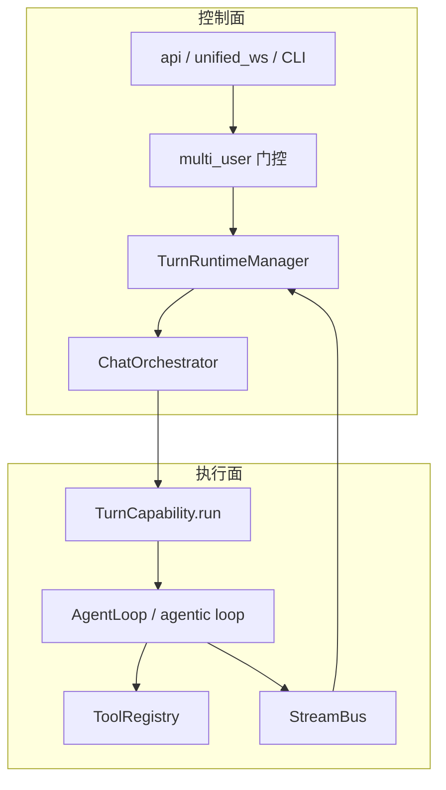

### 0.5 三条设计支柱

1. **Agent-Native**：模式差异在 **Capability 策略 + 工具白名单 + Prompt**，不是前端换皮 + 后端巨型 `if mode == quiz`。
2. **UnifiedContext**：从 Web / CLI / Partner IM 进来，**一个上下文对象**贯穿 Orchestrator → Capability → Tool。
3. **Persistent Learning Profile**：Memory L1–L3 + Learning/Mastery 服务；**turn_events 管回放，Memory 管画像**。

### 0.6 与 Codex / 通用 Agent 的差异（速览）

| 维度 | DeepTutor | 通用编码 Agent |
|------|-----------|----------------|
| 任务本体 | 教、练、测、研、读 | 改仓库、跑 CI |
| 状态核心 | 掌握度、路径、题库 | Issue、PR、Plan |
| 记忆 | L1/L2/L3 学习画像 | 文件记忆 / Harness |
| 验收 | `mastery_grade`、gate、服务端答案 | 测试 / lint gate |

### 0.7 深入一层：用户旅程与双目录

**典型学习闭环**（跨多个 Turn，可换 Capability）：

```text
Chat 答疑 → deep_research 写报告 → deep_question 出题
    → mastery_path 练习判分 → immersive_reading 读原文
    → Memory L2 更新 → 下一轮 Chat 自动带上画像
```

**两个「家」不要混**：

| 目录 | 路径 | 存什么 | Agent 能否写 |
|------|------|--------|--------------|
| **Runtime Home** | `data/user/settings/` 或 `DEEPTUTOR_HOME` | API Key、SQLite、Memory、内部状态 | 否（配置面） |
| **Content Workspace** | 默认 `<runtime-home>/data/user/workspace` 或 Settings 指定 | 书稿、下载、代码运行产物 | 是（`outputs/<cap>/<session>/<turn>/`） |

论文 *Lifelong Personalized Tutoring* 强调的「跨会话画像」落在 **Memory + Learning**，不是把聊天记录当唯一状态。

### 0.8 深入一层：七层运行时（对照 stack 图）

| 层 | 包 | 一句话 |
|----|-----|--------|
| L7 表现 | `web/`、`deeptutor_cli/`、`partners/`、`app.py` | 用户触达 |
| L6 传输 | `api/routers/unified_ws.py`、REST | `start_turn` / `subscribe_turn` |
| L5 编排 | `TurnRuntimeManager`、`ChatOrchestrator`、`StreamBus` | Turn 生命周期 + 路由 |
| L4 能力 | `capabilities/*`、`CapabilityRegistry` | 一整轮工作流 |
| L3 Agent | `AgentLoop`、`run_agentic_loop`、`BaseAgent` 管线 | LLM 循环 |
| L2 工具/服务 | `ToolRegistry`、`services/*` | 副作用与 IO |
| L1 数据 | SQLite、`memory/` 文件、KB 索引 | 持久化 |

**设计不变量**（改代码时自检）：单一编排入口 `ChatOrchestrator.handle`；`narration ≠ answer`（有 tool_calls 的轮次文本不当作终稿）；Tool 与 Capability 正交；`context_budget` 只报告不截断。

---

## 目录

### 第一篇：核心运行时架构

1. [核心实体总览](#1-核心实体总览)
2. [Session 与会话存储](#2-session-与会话存储)
3. [TurnRuntime 单轮执行](#3-turnruntime-单轮执行)
4. [Orchestrator 能力调度](#4-orchestrator-能力调度)
5. [Memory 三层记忆体系](#5-memory-三层记忆体系)
6. [四层投影模型](#6-四层投影模型)
7. [启动恢复流程](#7-启动恢复流程)
8. [核心实体关系](#8-核心实体关系)
9. [ContextBuilder 与历史裁剪](#9-contextbuilder-与历史裁剪)
10. [core 协议与 runtime/agentic](#10-core-协议与-runtimeagentic)

### 第二篇：Capability 与 Agent 体系

1. [Capability 插件体系](#1-capability-插件体系-1)
2. [内置 Capability 清单](#2-内置-capability-清单)
3. [AgentLoop 与双引擎](#3-agentloop-与双引擎)
4. [子 Agent 边界](#4-子-agent-边界)
5. [Deep Solve 剖析](#5-deep-solve-剖析)
6. [Capability 协作](#6-capability-协作)
7. [其余 Capability 专节](#7-其余-capability-专节)
8. [BaseAgent 与 run_agentic_loop](#8-baseagent-与-run_agentic_loop)

### 第三篇：业务模块

1. [knowledge / RAG](#1-knowledge--rag)
2. [learning / mastery / notebook](#2-learning--mastery--notebook)
3. [book](#3-book)
4. [co_writer](#4-co_writer)
5. [reading / video](#5-reading--video)
6. [visualizers](#6-visualizers)
7. [courses](#7-courses)
8. [partners](#8-partners)
9. [LLM 与模型层](#9-llm-与模型层)
10. [多模态、附件与生成](#10-多模态附件与生成)
11. [Persona 与人设](#11-persona-与人设)
12. [RAG 管线逐引擎](#12-rag-管线逐引擎)
13. [Hints 与建议](#13-hints-与建议)
14. [认证与外部 Provider](#14-认证与外部-provider)

### 第四篇：基础设施

1. [Workspace](#1-workspace)
2. [Sandbox](#2-sandbox)
3. [Knowledge Ingestion](#3-knowledge-ingestion)
4. [UnifiedContext](#4-unifiedcontext)
5. [ToolRegistry](#5-toolregistry)
6. [完整包地图](#6-完整包地图)
7. [后台 Worker 与进程](#7-后台-worker-与进程)
8. [plugins / logging / 运维服务](#8-plugins--logging--运维服务)

### 第五篇：横切能力

1. [Skills 渐进披露](#1-skills-渐进披露)
2. [MCP 与外部工具](#2-mcp-与外部工具)
3. [Prompt 体系与 i18n](#3-prompt-体系与-i18n)
4. [多用户与权限](#4-多用户与权限)
5. [可观测性、成本与 Trace](#5-可观测性成本与-trace)
6. [WebSocket Turn 生命周期](#6-websocket-turn-生命周期)

### 第八篇：API、前端与 CLI

1. [REST API 路由地图](#1-rest-api-路由地图)
2. [Web 前端架构](#2-web-前端架构)
3. [CLI 命令矩阵](#3-cli-命令矩阵)
4. [DeepTutorApp SDK](#4-deeptutorapp-sdk)

### 第九篇：内置工具全集

### 第十篇：模块深潜图解（血肉）

Mastery · Quiz · Research · Solve · 阅读/视频 · Book · co_writer · Course · LLM · RAG · 附件 · Persona · 多用户 · Skills/MCP · Partners · Web · CLI · Worker · setup/连接器 · subagent · Hints

### 第六篇：架构优劣势与横向对比

### 第七篇：设计目标与商业化方向

---

## 第一篇：核心运行时架构

> 对照图：[stack](./diagrams/deeptutor-stack.architecture.html) · [turn](./diagrams/deeptutor-turn.sequence.html)

### 1. 核心实体总览

| 实体 | 定位 | 生命周期 | 核心职责 |
|------|------|----------|----------|
| **Session** | 会话顶层容器 | 跨多 Turn | 元数据、消息索引、与 SessionStore 绑定 |
| **TurnRuntimeManager** | Turn 服务门面 | 单例/按 store scope | 组装上下文、执行 turn、flush 事件、写 messages |
| **ChatOrchestrator** | 薄调度 | 单次 `handle()` | 按 `active_capability` 调 `TurnCapability.run` |
| **Memory**（L1/L2/L3） | 学习画像 | 跨 Session | trace / document / consolidator（**独立于 SQLite**） |
| **StreamBus** | 流式总线 | Turn 内 | `publish` → 客户端 subscribe |
| **TurnCapability** | 任务工作流 | Turn 内 | Prompt、阶段、工具集、调用 AgentLoop |
| **AgentLoop** | 推理循环 | Turn 内 | LLM ↔ tool；narration vs finish |

> **原则**：会话级资源（Session、Memory、KB 绑定）跨 Turn 共享；Turn 级输出目录与 turn_events 按轮隔离。

#### 深入一层：会话数据四概念（勿与 Memory L1–L3 / 运行时 L7–L1 / Tool L1 混淆）

旧稿用 **L0–L3** 编号容易读成严格嵌套；实际 ER 是 **Session 下 Turn 与 Message 并列**，`turn_events` 挂在 Turn 下，Agent trace 是 events 的子语义。下面用 **概念名** 代替 L0–L3。

**持久化 ER（SQLite）** — 与 [ENTITY §3](./ENTITY_AND_SEQUENCES.md#3-持久化-ersqlite) 一致：

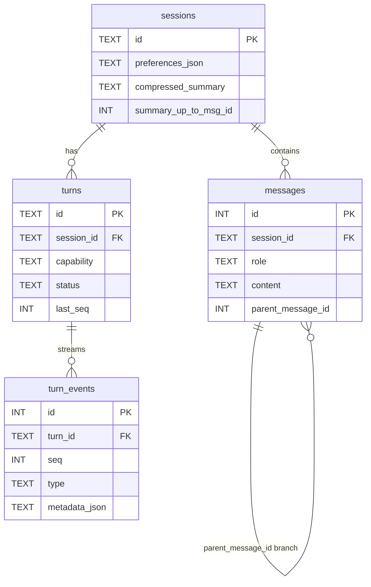

```text
Session
├── Turn[]              一次 start_turn → turns + turn_events（全量流）
│   └── turn_events[]   seq 单调；带 call_id 的为 Agent round（trace 子集）
└── messages[]          对话树（parent_message_id），跨 Turn，给 ContextBuilder
```

**三条「真相」**（比 L0–L3 更不易拧）：

| 真相 | 载体 | 用途 |
|------|------|------|
| **流式 / 回放** | `turn_events`（`turn_id` + `seq`） | UI subscribe、regenerate 输入、Trace |
| **对话终稿** | `messages`（`id` + `parent_message_id` 树） | 下轮 LLM 上下文、分支编辑 |
| **回合元数据** | `turns` | capability、status、与 assistant 消息关联 |

**四概念对照表**（非嵌套层级）：

| 概念 | 主 ID | 存储 | 与其它概念的关系 | 主要用途 |
|------|--------|------|------------------|----------|
| **Session** | `session_id` | `sessions`（`preferences_json`、`compressed_summary`、`summary_up_to_msg_id`） | 根 | KB/语言/mastery 偏好；**滚动摘要水位** |
| **Turn** | `turn_id` | `turns` + **`turn_events` 整段流** | Session 1:N；一次执行边界 | subscribe、regenerate；**仅 Turn 有**进程内 `_TurnExecution` |
| **Message** | `id`, `parent_message_id` | `messages` | Session 1:N **树**；**跨 Turn**，非 Turn 子表 | 终稿对话；ContextBuilder 按叶节点祖先链裁剪 |
| **Agent round（trace）** | `metadata.call_id`, `call_role` | **`turn_events` 的子集**（同表，非第四张表） | Turn 内逻辑轮次 | CallTracePanel；**仅 finish 轮**正文进 `messages.content`（narration 默认不进） |

**Turn 运行时（仅 L1 概念）**：进程内 `_TurnExecution`（`events[]`、`next_seq`、`subscribers`）缓存 live 流；重启后孤儿 turn 标 `failed`；客户端 `subscribe_turn(after_seq)` 从 DB 补 `turn_events`。

**Memory**（`services/memory/` 的 L1 Trace / L2 Fact / L3 Synthesis）在 **文件系统**，与上表四概念 **正交**，勿混编号。

---

### 2. Session 与会话存储

**真源**：`deeptutor/services/session/sqlite_store.py` · `session.py`

#### 2.1 Session 职责

- `session_id`、标题、偏好、滚动摘要水位；
- 不内嵌「Agent 状态机」——执行状态在 Turn 管线里。

#### 2.2 SQLite 四表

> **表间关系**：见本篇 §1「会话数据四概念」ER 图，或 [ENTITY §3](./ENTITY_AND_SEQUENCES.md#3-持久化-ersqlite)（Session 下 **Turn ∥ Message 并列**，`turn_events` → Turn）。

| 表 | 用途 | 要点 |
|----|------|------|
| `sessions` | 元数据 + `compressed_summary` + `summary_up_to_msg_id` | 摘要水位只改此表 |
| `messages` | user/assistant **终稿** | `get_messages_for_context()` 的原材料；**`parent_message_id` 分支树** |
| `turns` | 每轮元数据（capability、status、assistant_message_id） | 轻量索引；与 messages **关联而非父子** |
| `turn_events` | 全轨迹（tool、stage、ask_user、`call_id`…） | Turn 的子流；regenerate 输入；含 Agent trace **子集** |

#### 2.3 滚动摘要

- 压缩的是 **送给 LLM 的上下文视图**，不是删 `messages` 行；
- 流程：读全量 `messages` → 用 `summary_up_to_msg_id` 之前替换为 `compressed_summary` → 之后消息原样拼接；
- 设计目的：审计/分支/regenerate 仍可用完整终稿。

> 图：[compaction](./diagrams/deeptutor-compaction.workflow.html)

#### 深入一层：messages 分支与 preferences

- **编辑分支**：新 user 消息可挂 `parent_message_id`，形成消息树；regenerate 针对某 `turn_id` 重跑，不删历史行。
- **`preferences_json`** 常见键：`knowledge_bases`、`mastery_path_id`、`language`、persona；Turn 开始时合并进 `UnifiedContext`。
- **双存储代际**：早期 legacy JSON Session 与 SQLite 并存（迁移期）；新路径以 `SQLiteSessionStore` 为准。`get_messages_for_context()` 是 ContextBuilder 的唯一消息入口。
- **turn 状态**：`turns.status` 跟踪 `running` / `completed` / `failed` / `cancelled`；与 StreamEvent `DONE.metadata.status` 对齐。

---

### 3. TurnRuntime 单轮执行

**真源**：`services/session/turn_runtime.py`（v2 门面）→ `turns/turn_executor.py` 等

`TurnRuntimeManager` 是 **组合类**（`TurnRequestPreparer` + `TurnExecutor` + `TurnLifecycle` + …），不是单一 `TurnState` 对象。

#### 3.1 职责

1. **start_turn**：分配 `turn_id`、挂 `StreamBus`、构建 `UnifiedContext`、**多用户门控**（模型/工具）；
2. **调用** `ChatOrchestrator.handle()`，消费 `StreamEvent` 流；
3. **结束**：flush `turn_events`、写入 assistant `messages`、触发 Memory 抽取（异步）、发布 `CAPABILITY_COMPLETE`；
4. **regenerate**：按 `turn_id` 重载 `turn_events` 重跑；
5. **ask_user**：通过 `TurnRuntimeContext.wait_for_user_reply` 暂停续跑（见 `core/context.py`）。

#### 3.2 并发约束

同一会话通常 **同时只有一个活跃 turn**（避免交错写 messages / 事件）。

> 图：[turn](./diagrams/deeptutor-turn.sequence.html) · [e2e](./diagrams/deeptutor-e2e.sequence.html)

#### 深入一层：`start_turn` 阶段与组合类

`TurnRuntimeManager` 内部分工（`services/session/turn_runtime.py` + `turns/` 子包）：

| 组件 | 职责 |
|------|------|
| `TurnRequestPreparer` | 校验 payload、`validate_capability_config`、组装 `UnifiedContext`、注入 Memory/KB manifest |
| `TurnExecutor` | 后台 `asyncio.Task` 跑 `ChatOrchestrator.handle`，逐条 `_publish_live_event` |
| `TurnLifecycle` | flush `turn_events`、写 assistant `messages`、更新 `turns` 元数据 |
| `reply_queues` | `ask_user` 时 `wait_for_user_reply` ↔ `submit_user_reply` |

**Web/API 路径**：`start_turn` → 后台 task → 客户端 `subscribe_turn`。  
**CLI `deeptutor run`**：可直调 `ChatOrchestrator.handle`（轻量路径，持久化行为依 CLI 子命令而定）。  
**SDK `DeepTutorApp`**：封装 TRM，适合嵌入式集成。

`request_snapshot` 会冻结本轮 KB、工具 toggles、模型选择，供 **regenerate** 复现同一输入条件。

---

### 4. Orchestrator 能力调度

**真源**：`runtime/orchestrator.py`

```python
class ChatOrchestrator:
    async def handle(self, context: UnifiedContext) -> AsyncIterator[StreamEvent]:
        cap = self._cap_registry.get(context.active_capability or "chat")
        async for event in cap.run(context, bus):
            yield event
        # 完成后发 CAPABILITY_COMPLETE（event_bus）
```

#### 4.1 路由

| 优先级 | 机制 |
|--------|------|
| 1 | 客户端 / CLI **显式** `UnifiedContext.active_capability` |
| 2 | UI 模式切换（Mastery、Reading、Solve…）在入口层写入 |
| 3 | 默认 `chat` |

> 不存在独立的「LLM Auto 路由器」作为核心架构；个别场景在 TRM 预处理（如 quiz 前置路由测试）。

> 图：[orchestrator](./diagrams/deeptutor-orchestrator.workflow.html)

#### 深入一层：StreamBus 生命周期与失败路径

```text
create StreamBus → register_bus(turn_id)
  → asyncio.create_task(capability.run)
  → async for bus.subscribe → yield StreamEvent（含递增 seq）
  → finally: DONE + close + unregister_bus
  → EventBus.CAPABILITY_COMPLETE
```

- **未知 capability**：仍走完整协议（`ERROR` + `DONE failed`），前端无需特殊分支。
- **`stream.stage(name)`**：Capability 内 `async with` 发 `STAGE_START/END`，驱动 UI 进度条。
- **分工**：TRM 负责入库与 `UnifiedContext` 填充；Orchestrator **不负责** 历史裁剪或 user 消息持久化。

---

### 5. Memory 三层记忆体系

**真源**：`services/memory/`（`trace.py` · `document.py` · `consolidator/` · `paths.py`）

> 图：[memory](./diagrams/deeptutor-memory.dataflow.html)

| 层 | 存储 | 内容 | 写入 | 读取 |
|----|------|------|------|------|
| **L1 Trace** | `trace/<surface>/<YYYY-MM-DD>.jsonl` | 原始证据事件 append-only | `memory_write`、trace 钩子 | L2 抽取、溯源 |
| **L2 Fact** | 各 surface 的 markdown 文档 | 结构化事实 + `evidence` 脚注 | Consolidator / 工具 | 注入上下文、UI 编辑 |
| **L3 Synthesis** | `L3_SLOTS`（profile / preferences / …） | 跨 surface 综合画像 | L2→L3 聚合 | System / 个性化 |

**与 `turn_events` 的关系**：`turn_events` 属于 **Session 回放**；L1 属于 **Memory 证据层**。Turn 事件是 L1 的**重要来源之一**，但不是同一存储。

#### 深入一层：Surface、L3 槽位与 Consolidator

**Memory Surface**（隔离不同渠道画像）：

| Surface | 典型来源 |
|---------|----------|
| `default` / `web` | 主站 Chat |
| `partner:<id>` | IM 伴侣独立人设 |
| `notebook` | 笔记写入事件 |

**L3_SLOTS**（跨 surface 综合，可 UI 编辑）：`profile`、`preferences`、`learning_goals` 等（见 `services/memory/paths.py`）。

**Consolidator 流水线**（异步，Turn 结束后触发）：

```text
L1 trace 新事件 → 抽取候选事实 → 合并进 L2 markdown（带 evidence 脚注）
    → 周期性 L2→L3 聚合 → ChatPromptAssembler 的 memory block 注入下轮
```

用户可在设置页 **手改 L2/L3**；下次 Turn 的 system prompt 立即生效。Notebook 事件也可作为 L1 来源（`services/notebook/`）。

---

### 6. 四层投影模型

**真源**：[CONTEXT_AND_PROJECTION.md](./CONTEXT_AND_PROJECTION.md)

| 投影 | 载体 | 持久化 | 进下轮 LLM？ |
|------|------|--------|--------------|
| ① **StreamEvent** | StreamBus | 经 flush → `turn_events` | 否 |
| ② **turn_events** | SQLite | ✅ | 否（regenerate 用） |
| ③ **messages** | SQLite 终稿 | ✅ | 是（经 Builder） |
| ④ **LLM input** | ContextBuilder 动态组装 | 一般不单独存 | 当次采样 |

```text
Capability / AgentLoop
    ├─→ StreamEvent ──→ UI subscribe
    ├─→ turn_events ──→ flush 落库
    └─→ messages 终稿 ──→ ContextBuilder ──→ LLM messages[]
```

> 图：[context-projection](./diagrams/deeptutor-context-projection.dataflow.html)

#### 深入一层：StreamEvent 类型与 narration 规则

常见 `StreamEvent.type`（`core/stream.py`）：

| 类型 | 何时发 | 是否进 messages 终稿 |
|------|--------|----------------------|
| `SESSION` | Turn 开始 | 否 |
| `STAGE_START` / `STAGE_END` | Capability stage | 否 |
| `CONTENT` | LLM 流式文本 | **仅 finish 轮**写入 assistant 消息 |
| `TOOL_CALL` / `TOOL_RESULT` | 工具派发 | 否（进 turn_events） |
| `WAIT_FOR_INPUT` | `ask_user` | 否 |
| `RESULT` | `emit_capability_result` | 结构化结果 + `cost_summary` |
| `DONE` | Turn 结束 | 否 |

**关键**：`call_role=narration` 的 CONTENT 是「工具前言」，**不能**当侧边栏最终答案；这是 DeepTutor 与简单 Chat 封装的核心差异之一。

---

### 7. 启动恢复流程

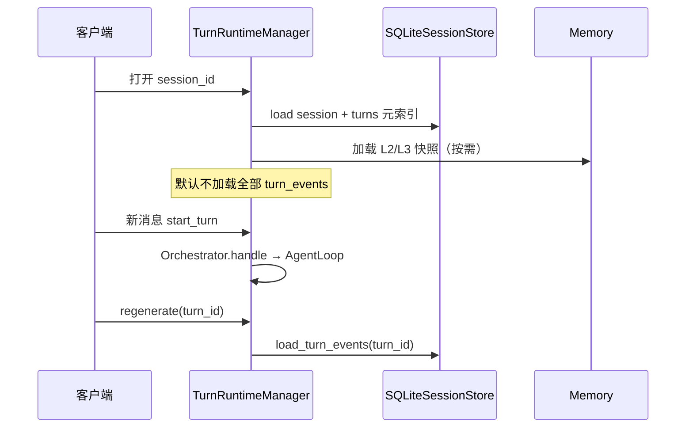

#### 深入一层：三条入口路径对比

| 入口 | 命令/路径 | 持久化 | 典型场景 |
|------|-----------|--------|----------|
| CLI 交互 | `deeptutor chat` | SessionStore 写 messages | 本地调试、脚本化辅导 |
| CLI 单次 | `deeptutor run solve "..."` | 依子命令 | CI、批处理出题 |
| Web WS | `unified_ws` `start_turn` | 完整 turn_events + subscribe | 产品主路径 |
| SDK | `DeepTutorApp.chat()` | 同 TRM | 第三方嵌入 |
| Partner | `partners/channels/*` | 同 TRM + partner surface | Telegram/飞书等 |

**场景 B（同 Session 第二问）**：`conversation_history` 从 Store 加载；若 token 超限，`ContextBuilder` 在 **turn 开始前** 对更早消息做 LLM 摘要（类似 Codex compaction，但无独立 Condensation 事件类型）。

**场景 C（断线重连）**：`subscribe_turn(turn_id, after_seq=42)` 从 `turn_events` 重放 `seq > 42`，无需重跑 LLM。

---

### 8. 核心实体关系

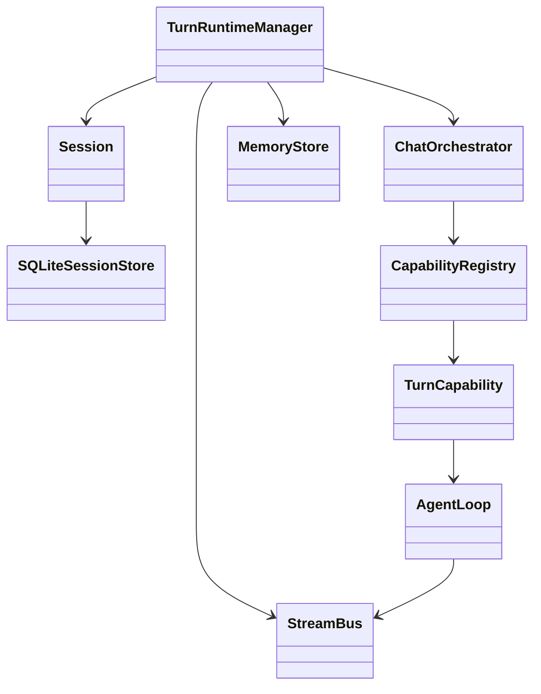

---

### 9. ContextBuilder 与历史裁剪

**真源**：`services/session/context_builder.py` · `ContextSummaryAgent`

Turn 开始前由 TRM 调用 `ContextBuilder.build()`，产出 `conversation_history` 填入 `UnifiedContext`。与 `sessions.compressed_summary` / `summary_up_to_msg_id` 水位线配合。

| 原理 | 含义 |
|------|------|
| 预算比例 | `history_budget ≈ context_window × 0.35`；摘要占 budget 约 40% |
| 水位线 | 仅摘要成功后推进 `summary_up_to_msg_id` |
| 分支安全 | edit-branch 时若水位不在祖先链，丢弃旧 summary 重建 |
| 抗漂移 | 前缀仍 fit 时从 **原始消息** 重摘要，非 summary-of-summary |
| 降级 | 摘要失败 → 保留旧 summary + 硬 pop 最旧消息 |

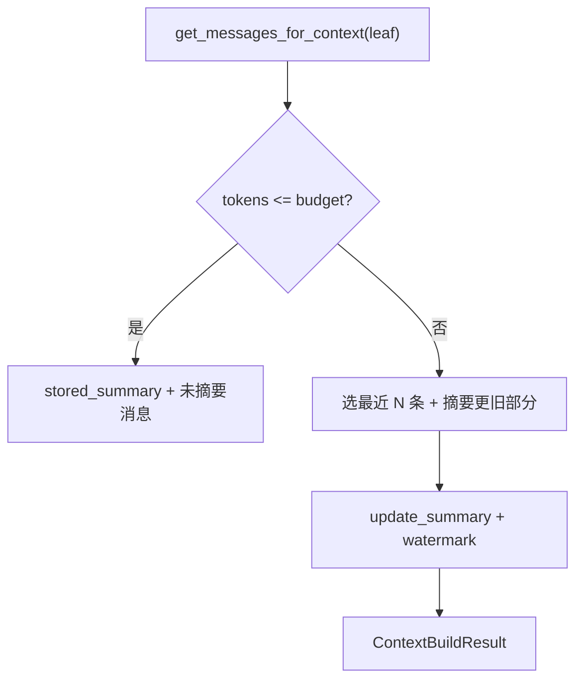

#### 深入一层

- **`leaf_message_id`**：支持消息树分支，只取该叶节点祖先链；
- **与 AgentLoop**：`build()` 是 turn 级第一道防线；loop 内 `_guard_context_window` + `_fold_context_checkpoint` 是第二道（单 turn 内 tool 输出膨胀）；
- **live 进度**：`on_event` 可将摘要阶段 progress 流入 StreamEvent（source 过滤 `context_builder`）；
- **与 compaction 图**：[compaction](./diagrams/deeptutor-compaction.workflow.html)。

**narration 过滤**（TRM 侧，非 ContextBuilder）：`_narration_marker_call_id` + `_assemble_persisted_answer` 排除 `call_role=narration` 的 CONTENT；DSML 同轮 prose+tool 时 `answer_visible=True` 保留 prose。

---

### 10. core 协议与 runtime/agentic

#### 10.1 `core/` 契约层

| 文件 | 职责 |
|------|------|
| `context.py` | `UnifiedContext`、`Attachment`、`TurnRuntimeContext` |
| `capability_protocol.py` | `BaseCapability` / `TurnCapability.run` |
| `tool_protocol.py` | `BaseTool`、`ToolDefinition`、`deferred` |
| `stream.py` | `StreamEvent`、`StreamEventType` |
| `trace.py` | `call_id`、`trace_metadata` |
| `turn_request.py` | Turn payload 类型 |
| `errors.py` | 统一错误类型 |

#### 10.2 `runtime/agentic/` 执行原语

| 模块 | 职责 |
|------|------|
| `tool_dispatch.py` | `dispatch_tool_calls`、并行上限 8、批内去重、`DispatchOutcome` |
| `loop.py` | `run_agentic_loop` 主循环 |
| `labels.py` / `labeled_step.py` | `LabelProtocol` 标签协议 |
| `usage.py` | `UsageTracker` |
| `client.py` | Agentic LLM 客户端封装 |
| `tool_arg_guard.py` | 工具参数校验 |
| `think_stream.py` / `tool_call_stream.py` | 流式解析 |

#### 深入一层：`dispatch_tool_calls` 行为

| 行为 | 说明 |
|------|------|
| 并行默认 | `asyncio.gather`，`MAX_PARALLEL_TOOL_CALLS = 8` |
| 批内去重 | 相同 (tool, args) 只执行一次 |
| `ask_user` | 批内第二个 ask 一律 stub；第一个 `pause` 获胜 |
| 单工具失败 | `call_state=error`，不升维为 turn 级 ERROR |
| 钩子 | `kwarg_augmenter`、`retrieve_meta_factory`、i18n 错误工厂 |

**`runtime/` 其它**：`request_contracts.py`（config 校验）、`stream_bus.py`、`capability_routing.py`（测试/边缘路由）、`launcher.py`（`deeptutor start`）、`worker_process.py` / `update_worker.py`（后台任务）。

---

## 第二篇：Capability 与 Agent 体系

### 1. Capability 插件体系

**真源**：`core/capability_protocol.py`（`TurnCapability`）· `runtime/registry/capability_registry.py`

- **L1 Tool**：单步副作用（`rag`、`exec`、`memory_write`…）；
- **L2 TurnCapability**：一整轮工作流（系统 prompt、阶段、工具白名单、用 AgentLoop 还是 agentic 管线）。

Capability **不**直接 import `services`；走 `ToolRegistry`。

**扩展包**（非全部注册为内置 Turn，多为 KB 连接器或 Partner 辅助）：

| 目录 | 用途 |
|------|------|
| `capabilities/setup/` | 首次配置向导 |
| `capabilities/explore_context/` | 上下文探索辅助 |
| `capabilities/ima/` · `marginnote4/` · `obsidian/` | 外部知识库连接器 |
| `capabilities/partner_authoring/` · `partner_group/` | Partner 人设与群组 |
| `capabilities/subagent/` | `consult_subagent` 相关 |

#### 深入一层：注册与 `TurnCapability` 契约

**启动链**（`runtime/bootstrap/`）：

```text
load_builtins() → ToolRegistry.register(BaseTool...)
              → CapabilityRegistry.register(BaseCapability...)
deeptutor run <cap>  →  CLI 解析别名 → active_capability 写入 context
```

`TurnCapability`（`core/capability_protocol.py`）必须实现：

- `manifest`：对外名称、默认工具、stage 列表、config schema；
- `async run(ctx: UnifiedContext, stream: StreamBus)`：唯一入口，结尾 **`emit_capability_result`**。

Capability **禁止**直接 `import services`；需要 RAG/内存时声明工具名，由 `compose_enabled_tools` 在 pipeline 内挂载。

---

### 2. 内置 Capability 清单

**真源**：`runtime/bootstrap/builtin_capabilities.py` → `BUILTIN_CAPABILITY_SPECS`

| name | CLI 别名 | 产品用途 | Agent 形态 |
|------|----------|----------|------------|
| `chat` | chat | 通用辅导对话 | AgentLoop |
| `ask_questions` | ask | 先澄清再答 | AgentLoop |
| `deep_solve` | solve | 分步解题 | AgentLoop + solve_* 工具 |
| `deep_question` | quiz | 快速出题 | `run_agentic_loop` 多阶段 |
| `deep_research` | research | 深度调研报告 | `run_agentic_loop` 多阶段 |
| `math_animator` | animate | 数学动画（Manim） | 专用管线 |
| `visualize` | visualize | 图表/可视化 | 专用管线 + `submit_visualization` |
| **`mastery_path`** | mastery | **掌握度路径 + 硬 gate** | MasteryLoopPipeline |
| `immersive_reading` | — | 沉浸阅读引用 | AgentLoop + reading 工具 |
| `immersive_watching` | — | 视频时间轴学习 | 专用模式 |
| `course_study` | — | 课程单元学习 | 与 syllabus/mastery 联动 |

**非 Turn Capability 的产品引擎**：

| 模块 | 路径 | 说明 |
|------|------|------|
| Book | `book/` | 活书编译 worker |
| Co-Writer | `co_writer/` | 段落级改写 |
| Reading 摄取 | `reading/` | 材料入库与扩展 |
| Partners IM | `partners/` | 渠道 + 角色 |

**`agents/` 与 Capability 对应**：

| agents 包 | 服务的能力 |
|-----------|------------|
| `agents/chat/` | `chat`、`ask_questions`、部分 reading |
| `agents/research/` | `deep_research` |
| `agents/question/` | `deep_question` |
| `agents/loop/agent_loop.py` | 通用 AgentLoop |
| `agents/math_animator/` | `math_animator` |
| `agents/visualize/` | `visualize` |
| `agents/vision_solver/` | 视觉解题辅助 |
| `agents/notebook/` | Notebook 工具侧 |

#### 深入一层：各 Capability 的 Stage 与引擎选型

| Capability | 引擎 | Stages（对外 UX） | 源码锚点 |
|------------|------|-------------------|----------|
| `chat` | AgentLoop | `responding` | `agents/chat/capability.py` |
| `ask_questions` | AgentLoop | 澄清 → 回答 | `capabilities/ask_questions/` |
| `deep_solve` | BaseAgent 链 | `planning` → `reasoning` → `writing` | `agents/solve/` |
| `deep_research` | run_agentic_loop | `rephrasing` → `decomposing` → `researching` → `reporting` | `agents/research/pipeline.py` |
| `deep_question` | BaseAgent 链 | `ideation` → `generation` | `agents/question/` |
| `visualize` | 专用管线 | `analyzing` → `generating` → `reviewing` | `agents/visualize/` |
| `math_animator` | 6+ stage | 概念分析 → 代码生成 → Manim 渲染 | `agents/math_animator/pipeline.py` |
| `mastery_path` | AgentLoop + mastery 工具 | 对话中穿插测验节点 | `capabilities/mastery/` |
| `immersive_reading` | AgentLoop | 页码级引用 | `capabilities/reading/` |
| `immersive_watching` | 专用 | 时间轴字幕 | `capabilities/watching/` |
| `course_study` | AgentLoop | 单元进度 | `capabilities/course_study/` |

**deep_research 扩展点**：`LabelProtocol` 的 `APPEND` 标签经 `LoopHost.on_intermediate` 动态扩展 block 队列；`CitationManager` 做引用去重。

**visualize**：`render_type=manim` 时路由到 `math_animator` 子管线（需 `.[math-animator]` extra）。

---

### 3. AgentLoop 与双引擎

**真源**：`agents/loop/agent_loop.py` · `core/agentic/run_agentic_loop.py`

> 图：[agent-loop](./diagrams/deeptutor-agent-loop.workflow.html)

| 引擎 | 用于 | 协议 |
|------|------|------|
| **AgentLoop** | chat、solve、mastery、reading… | narration / finish / settlement / ask_user |
| **run_agentic_loop** | research、quiz | 标签协议（`LabelProtocol`）多阶段 |

**AgentLoop 语义**：

| 轮次类型 | 条件 | 含义 |
|----------|------|------|
| **narration** | 本轮有 tool_calls | 面向用户的叙述往往是「工具前言」；默认继续 loop |
| **finish** | 本轮无 tool_calls | 文本即最终答案；loop 结束 |
| **settlement** | 探索预算用尽 | 有限额外轮，避免硬截断 |
| **ask_user** | 调用 ask_user | Turn 暂停，等用户回复后 **同 Turn 续跑** |

主路径：**单会话 messages 不断增长** → `dispatch_tool_calls` **并行**派发同轮多 tool → 事件进 StreamBus。

#### 深入一层：探索预算与工具派发

**Chat 预算三阶段**（`agents/chat/`）：

| 阶段 | 含义 |
|------|------|
| exploration | 正常 tool 轮次，有上限 |
| settlement | 预算用尽后的收束轮（避免硬截断） |
| forced finish | 仍无法结束时强制无 tool 结束 |

**并行派发**（`core/agentic/tool_dispatch.py`）：同轮多个 `tool_calls` 并行执行，默认上限 **8**；结果合并后进入下一轮 LLM 采样。

**run_agentic_loop**（research/quiz）：模型输出 **标签**（如 `SEARCH`、`DONE`、`WRITE`），`LabelProtocol` 定义 `allowed` / `terminal` / `tool_label`；与 OpenAI native tool_calls 是 **两套协议**，不要混读。

**动态 loop 指令**（追加为 user 消息，避免连续 user）：settlement 开始、token 截断续写（`loop.continue_truncated`）、空 finish nudge（`loop.finish_empty_nudge`）。

---

### 4. 子 Agent 边界

- **`consult_subagent` 工具**：在 **同一 Turn** 内咨询外部 CLI/Partner harness（Claude Code、Codex、Hermes…），不新开 Turn；
- **`capabilities/subagent/`**：子 agent 扩展；
- **deep_research**：多阶段 agentic 管线；子任务由 research 实现编排。

**不是子 Agent**：`deep_solve` 的多步是 **单 AgentLoop + solve_plan 工具状态**，不新建 Orchestrator 路由。

#### 深入一层：`consult_subagent` 与外部 Harness

`consult_subagent` 工具可在 **同一 Turn** 内调用外部 Agent CLI，常见集成：

| Harness | 典型用途 |
|---------|----------|
| Claude Code / Codex | 作业里的代码、仓库修改 |
| Hermes / opencode / Kimi | 替代模型或专项任务 |
| DeepSeek / Antigravity 等 | 用户自选后端 |

特点：**不新开 Turn**、不复制完整 Session 树；结果以 tool_result 回到当前 AgentLoop。DeepTutor 保持「学习大脑」，编码长任务交给 monorepo 兄弟项目。

`capabilities/subagent/` 与 `services/subagent/` 提供发现、鉴权与超时封装。

---

### 5. Deep Solve 剖析

**真源**：`capabilities/solve/`

工具链：`solve_plan` → `solve_finish_step` → `solve_replan`（受上限约束）+ `rag` / `exec` / `reason`。

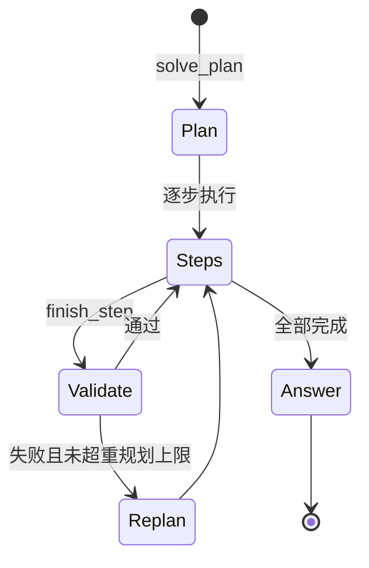

#### 深入一层：Solve 三 Agent 与工具面

**产品层**（`deep_solve` Capability）与 **工具层**（chat 内 `solve_*`）并存：

| 层 | 实现 | 说明 |
|----|------|------|
| Capability 管线 | `PlannerAgent` → `SolverAgent(s)` → `WriterAgent` | 各 stage 独立 `BaseAgent.process()`，Python 结构传 plan |
| AgentLoop 工具 | `solve_plan`, `solve_finish_step`, `solve_replan` | 单 loop 内分步，状态在 tool 参数 |

默认工具面（manifest）：`rag`、`code_execution` / `exec`、`web_search`（视配置）；Prompt 来自 `capabilities/prompts/{en,zh}/deep_solve.yaml`（**独占 playbook**，与全局 skills 正交）。

---

### 6. Capability 协作

Capability **互不直接调用**。

| 协作方式 | 说明 |
|----------|------|
| 共享 Session | Memory、KB、Workspace 跨 Turn |
| Turn 轮换 | 用户切换模式 → 下一 Turn 换 `active_capability` |
| 工具 | `consult_subagent`、共享 `rag` 读同一 KB |
| Event Bus | `CAPABILITY_COMPLETE` 等内部事件 |

典型：**Research Turn 写 Memory → Quiz Turn 读 L2 出题 → Mastery Turn 判分更新掌握度**。

#### 深入一层：端到端数据流示例

```text
Turn 1  deep_research
  → turn_events 记录 SEARCH/WRITE 轨迹
  → Memory L1 写入研究摘要证据
  → Consolidator 更新 L2「已学主题」

Turn 2  deep_question（读 L2 + KB）
  → 生成测验题（答案存服务端题库，不进 prompt）

Turn 3  mastery_path
  → mastery_grade 判分 → learning/policy 更新 due 日期
  → Session preferences 记录 path 进度

Turn 4  chat
  → ChatPromptAssembler memory block 注入 L3 画像
  → 辅导语气自动个性化
```

跨 Capability **唯一共享句柄**：`session_id` + Memory + KB 绑定 + Workspace；无 Capability 间直接函数调用。

---

### 7. 其余 Capability 专节

> 各 Capability 的 **框架图 + 时序图 + 状态机 + 解读** 见 [第十篇](#第十篇模块深潜图解血肉)。以下保留速查索引。

#### 7.1 ask_questions

**产品语义**：先澄清再答——减少幻觉。引擎 `AgentLoop`；独占 playbook。澄清轮可用 `ask_user` 暂停（同 turn 续跑）。

→ 时序图：[第十篇 §6](#6-ask_questions--澄清式辅导)

#### 7.2 deep_question（Quiz）

| 项 | 值 |
|----|-----|
| Stages | `ideation` → `generation` |
| 引擎 | `BaseAgent` 链（`agents/question/`） |
| 特性 | mimic source（仿照样题风格）、题库写入 |
| 判分 | **`api/routers/quiz_judge.py`** — 服务端评分，答案不进 LLM prompt |
| 与 mastery | Quiz 偏「快速出题」；Mastery 偏长期路径 + gate |

#### 7.3 deep_research（补充）

| Stage | 引擎 |
|-------|------|
| rephrasing | 单次 LLM / BaseAgent |
| decomposing | 主题队列 |
| researching | 每 block `run_agentic_loop`（`SEARCH`/`APPEND`/`DONE`） |
| reporting | 每 section `run_agentic_loop`（`WRITE`/`REVISE`/`FINAL`） |

`CitationManager` 引用去重；`UsageTracker` 累计 `cost_summary`。

#### 7.4 math_animator

```text
concept_analysis → concept_design → code_generation → code_retry
    → summary → render_output（Manim）
```

- 路径：`agents/math_animator/pipeline.py`
- 依赖：`.[math-animator]` extra；失败时 `code_retry` stage 兜底
- 与 visualize：`render_type=manim` 时 visualize 路由到此管线

#### 7.5 visualize

| Stage | 输出 |
|-------|------|
| analyzing | 选定 `render_type`（svg/chartjs/mermaid/html…） |
| generating | 渲染产物 |
| reviewing | 质量检查 |

`submit_visualization` 工具将产物附着到 turn；插件见 `visualizers/`。

#### 7.6 course_study

工具：`course_overview`、`course_material`、`course_edit`、`course_handoff`（`capabilities/course_study/tools`）。与 `services/courses.py`、`courses_state.py`、syllabus 及 mastery 路径联动；适合机构包课单元。

#### 7.7 immersive_reading / immersive_watching

**Reading 工具族**：`reading_list_tabs`、`search_material`、`read_material`、`reader_goto`、`reader_annotate` 等——页码/段落级 grounded，非整篇塞 context。

**Watching**：`video_learning/` + `capabilities/watching/`；YouTube/Invidious、字幕时间轴、`timestamp` 跳转；进度可恢复。

#### 7.8 连接器 Capability（KB 外挂）

| Capability | 工具前缀 | 场景 |
|------------|----------|------|
| `obsidian` | `obsidian_*` | Vault 搜索/读/写/反链 |
| `marginnote4` | `marginnote_*` | MN4 卡片与文档 |
| `ima` | `ima_*` | 腾讯 IMA 库 |
| `setup` | `inspect_setup`、`apply_setting`… | 首次配置向导 |
| `explore_context` | 上下文探索 | 辅助理解当前 session 状态 |
| `partner_authoring` | `propose_partner` | 人设提案 |
| `partner_group` | `invoke_other` | 群组内多 Partner 协作 |

#### 7.9 vision_solver

`agents/vision_solver/` — 图像/截图输入的解题辅助，可与 `deep_solve` 或多模态 LLM 配合；非独立 Turn Capability，作为管线组件。

---

### 8. BaseAgent 与 run_agentic_loop

#### 8.1 BaseAgent

**真源**：`agents/base_agent.py`

```text
BaseAgent(ABC)
  ├── process(**kwargs)     # 子类必须实现
  ├── complete() / stream_llm()
  ├── get_prompt()          # PromptManager + YAML
  └── set_trace_callback()  # → StreamBus
```

用于：`deep_solve` 三 stage、`deep_question` 两 stage、`visualize` 各 stage、research 部分前置阶段。

#### 8.2 run_agentic_loop

**真源**：`runtime/agentic/loop.py` + `labels.py`

| 概念 | 说明 |
|------|------|
| 输出格式 | 模型首行 **标签**（非 OpenAI `tool_calls`） |
| `LabelProtocol` | `allowed`、`terminal`、`tool_label` |
| `LoopHost` | `on_intermediate("APPEND")` 等扩展队列 |
| 用于 | `deep_research` block/report；部分 quiz 阶段 |

#### 深入一层：三引擎选型（决策树）

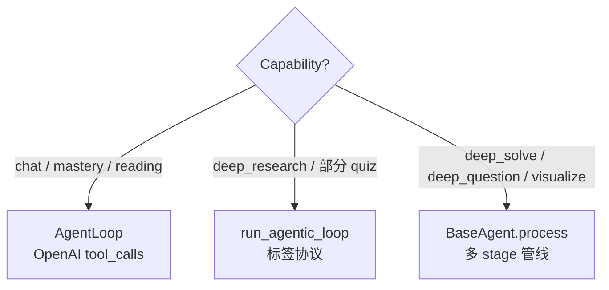

---

## 第三篇：业务模块

### 1. knowledge / RAG

**路径**：`services/knowledge/` · `services/rag/` · 顶层 `knowledge/`（索引 manifest）

- 多连接类型：本地向量、linked、Obsidian、LightRAG Server、IMA、WeKnora、MarginNote4、GraphRAG、PageIndex…；
- Agent 经 **`rag` / `read_source` 工具**检索；
- `ToolMountFlags` / Session `preferences.knowledge_bases` 控制挂载；regenerate 可用 `overrides.knowledge_bases` 复现。

#### 深入一层：多引擎 KB 与检索路径

| 连接类型 | 典型场景 | Agent 工具 |
|----------|----------|------------|
| 本地向量（LlamaIndex 等） | 自建文档库 | `rag` |
| PageIndex / GraphRAG / LightRAG | 结构化/图谱检索 | `rag`（后端切换） |
| Linked Obsidian vault | 个人笔记 | `capabilities/obsidian/` + ingest |
| IMA / MarginNote4 | 已有学习库导入 | 专用 capability 连接器 |
| LightRAG Server / WeKnora | 远程 KB 服务 | HTTP 客户端 |
| `read_source` | 精读单文件 | 页码/段落级引用 |

**摄取流水线**（异步 worker）：上传 → `services/parsing/` 解析（PDF/Office…）→ 分块 → `services/embedding/` → 索引追加；失败分段重试，manifest 在顶层 `knowledge/` 与 `services/knowledge/` 维护版本。

---

### 2. learning / mastery / notebook

**路径**：`learning/` · `services/learning/` · `capabilities/mastery/` · `services/notebook/`

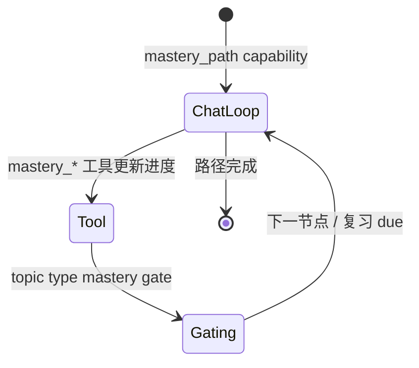

| 组件 | 职责 |
|------|------|
| `learning/policy.py` | SM-2 风格复习调度 |
| `learning/mastery_levels` | 掌握度量化 |
| `mastery_path` capability | AgentLoop + 专用工具 |
| `mastery_grade` 等 | **标准答案在服务端**，防泄题 |
| Notebook 工具 | `list_notebook` / `write_note`，与对话解耦存储 |

Session `preferences.mastery_path_id` 由 TurnRuntime 在显式 payload 时持久化。

#### 深入一层：Gate、判分与 Notebook

**Mastery Gate**（`learning/policy.py`）：

- 按 **topic type** 决定过关条件（例如连续正确 N 次、题型组合）；
- **SM-2 风格** `due` 日期调度间隔复习；
- `mastery_grade` / `mastery_submit` 等工具：**评分逻辑在服务端**，标准答案与 rubric 不进入 LLM 上下文（防泄题、防 prompt 注入改分）。

**Notebook**（`services/notebook/`）：

- 与 Chat messages **解耦存储**；
- `list_notebook` / `write_note` 工具挂载条件 `has_notebooks`；
- Consolidator 可将笔记事件汇入 L1，再上升为 L2 事实。

**Course Study**：`services/courses.py` 管理 syllabus 单元；与 `mastery_path_id`、课程进度 state 联动，适合机构包课。

---

### 3. book

**路径**：`book/`

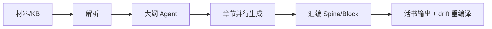

多 Agent 将材料编译为结构化书籍；与 chat Turn **独立**，可长跑 batch worker。

#### 深入一层：活书模型

| 概念 | 说明 |
|------|------|
| **Spine** | 书骨架 / 目录树 |
| **Block** | 可独立重编译的内容块 |
| **Worker** | 后台 job：材料变更或 KB drift 触发块级重生成 |
| **与 KB** | 书可绑定知识库；源文档更新 → 标记 drift → 增量编译 |

适合出版 SaaS：内容团队管 Spine，Agent 填 Block，人审后发布。

---

### 4. co_writer

**路径**：`co_writer/` — Draft → Review → Revise 段落级链，版本快照，human-in-the-loop。

#### 深入一层

- 段落为最小修订单元，每轮保留 **版本快照** 便于对比回滚；
- 复用 `BaseAgent` + 专用 prompts，可插入 human approve 再继续；
- 产出写入 Content Workspace，可被 `immersive_reading` 或 Book 引擎引用。

---

### 5. reading / video

| 模块 | 路径 | 能力 |
|------|------|------|
| Reading | `reading/` · `immersive_reading` | 页码/段落引用、扩展测验 |
| Video | `video_learning/` · `immersive_watching` | 字幕时间轴、Invidious、进度恢复 |

#### 深入一层

**Reading**：`reading/` 负责材料摄取与扩展（翻译、词汇卡、随读测验）；`immersive_reading` Capability 在 AgentLoop 内用 **页码/段落锚点** 做 grounded 引用（非整篇塞 context）。

**Video**：YouTube 链接触发隐私增强播放；管理员可切 **自托管 Invidious**；字幕时间轴与 `immersive_watching` 同步，辅导回答可带 `timestamp` 跳转；进度可恢复。

---

### 6. visualizers

**路径**：`visualizers/` — 插件注册 + `submit_visualization` / Visualize Capability。

#### 深入一层

- 插件注册表扩展 render 类型（SVG、Chart.js、Mermaid、HTML iframe 等）；
- `submit_visualization` 将产物 URL/嵌入写入 turn_events，UI 内嵌展示；
- 与 `math_animator` 分工：一般图表走 visualize；数学动画走 Manim 重管线。

---

### 7. courses

**路径**：`services/courses.py` · `courses_state.py` · `course_study` capability

机构场景下，课程是 **syllabus 容器**，掌握度是 **练习闭环**；二者通过 `course_handoff` 工具交接。

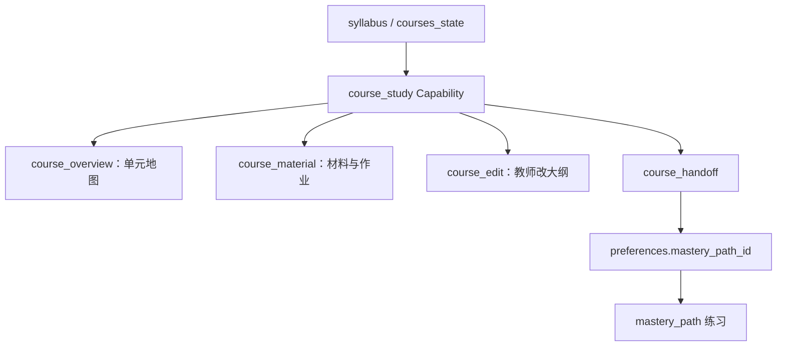

**解读**：学生完成单元后，handoff 把上下文 **写入 Session preferences** 并切换到 Mastery 路径，避免「上完课不知道练什么」。教师侧用 REST `courses` router；学生侧可在 Chat 或专用 Course UI 触发 `course_*` 工具。完整时序见 [第十篇 §10](#10-course_study--机构课程单元)。

### 8. partners

**路径**：`deeptutor/partners/` · `services/partners/` · `services/partner_groups/`

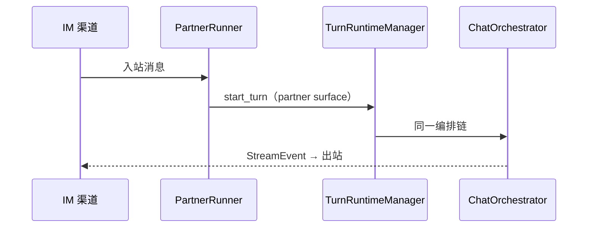

- Partner = 人设 + 模型 + 工具权限 + **独立 memory surface**；
- 不重复实现 Book/Mastery 等业务引擎。

#### 深入一层：渠道与 Surface

| 渠道 | 路径 | 备注 |
|------|------|------|
| Telegram / Discord / Slack / 飞书等 | `partners/channels/` | `deeptutor partner list` |
| Partner 群组 | `services/partner_groups/` | 多 bot 编排 |
| 人设 authoring | `capabilities/partner_authoring/` | 配置 persona + 工具集 |

每 Partner：**独立 memory surface**（`partner:<id>`），`partner_*` 工具变体替换默认 memory 工具；`ask_user` 在 IM 上映射为「回复消息继续」。入站与 Web **同一** `TurnRuntimeManager` 链路，仅适配器格式化不同。

---

### 9. LLM 与模型层

**真源**：`services/llm/`

| 模块 | 职责 |
|------|------|
| `factory.py` / `provider_factory.py` | 按配置构造 Provider |
| `cloud_provider.py` / `local_provider.py` | 云端 API vs 本地 |
| `openai_http_client.py` | OpenAI 兼容 HTTP |
| `multimodal.py` | 图像/附件消息格式 |
| `context_window.py` | 窗口大小查询 |
| `reasoning_params.py` | 推理模型参数 |
| `usage_frame.py` / `telemetry.py` | token 与遥测 |
| `traffic_control.py` | 限流 |
| `error_mapping.py` | Provider 错误 → 统一异常 |
| `request_compat.py` | DSML 等兼容层 |

**模型选择**：`services/model_selection/` + `provider_registry.py` + `keypool.py`（密钥池）；Turn 时 `llm_selection` 经 `multi_user` 门控；个人 Codex profile 经 `merge_personal_llm_profiles` 合并。

#### 深入一层：一次 LLM 调用的路径

```text
AgentLoop._call_llm
  → services/llm client（stream）
  → UsageTracker.record_streamed_usage
  → StreamEvent CONTENT / THINKING
  → context_budget 附加到 LLMRequestSnapshot（仅信息）
```

Settings 中模型目录：`data/user/settings/model_catalog.json`（多用户场景由 admin 授予子集）。

Provider 栈框架图、流式时序与 `traffic_control` / `error_mapping` 解读 → [第十篇 §11](#11-llm-与模型层)。

---

### 10. 多模态、附件与生成

#### 10.1 附件全链路

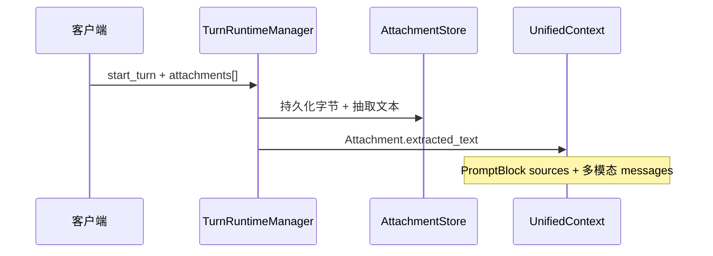

- **真源**：`core/context.py` `Attachment`；`api/routers/attachments.py`；ENTITY §R1
- **生成物回写**：`ToolResult.sources` → TRM `generated_attachments` → assistant message（sandbox `code_execution`、visualize 等）

#### 10.2 生成服务

| 服务 | 路径 | 工具 |
|------|------|------|
| 图像 | `services/imagegen/` | `imagegen` |
| 视频 | `services/videogen/` | `videogen` |
| 语音 | `services/voice/` | `api/routers/voice.py` |
| HTTP 代理 | `generation_http.py` | 统一外部生成 API |

`services/search/`、`web_source/`、`github_source/` 支撑 `web_search`、`web_fetch`、`github` 工具。

完整附件时序（上传 → 抽取 → multimodal messages → generated_attachments 回写）→ [第十篇 §13](#13-附件与多模态)。

---

### 11. Persona 与人设

**路径**：`services/persona/` · `api/routers/personas.py`

| 环节 | 说明 |
|------|------|
| 存储 | Persona 定义（语气、角色、约束） |
| 注入 | `UnifiedContext.persona_context` → PromptBlock `persona_style` |
| Session | `preferences` 可绑定默认 persona |
| Partner | Partner 人设与 Web persona **独立**；`partner_authoring` 可提案新 Partner |

与 Memory L3 `preferences` 正交：Persona 是 **即时角色**，Memory 是 **跨会话事实**。

Prompt 九块组装流程图 → [第十篇 §14](#14-persona-与-prompt-组装)。

---

### 12. RAG 管线逐引擎

**真源**：`services/rag/pipelines/`

| Pipeline | 目录 | 特点 |
|----------|------|------|
| LlamaIndex | `llamaindex/` | 经典向量 RAG |
| LightRAG | `lightrag/` | 本地 LightRAG |
| LightRAG Server | `lightrag_server/` | 远程服务 |
| GraphRAG | `graphrag/` | 图谱检索 |
| PageIndex | `pageindex/` | 页级索引 |
| WeKnora | `weknora/` | 自托管 WeKnora |
| IMA | `ima/` | 腾讯 IMA 后端 |

统一入口：`rag` 工具 → `services/rag/` 按 KB manifest 的 `engine` 字段路由。`modes.py` / `base.py` 定义管线接口；换引擎 **不改** AgentLoop。

#### 深入一层：检索在 turn 内的轨迹

`dispatch_tool_calls` + `retrieve_meta_factory` 将 RAG 调用显示为 UI **Retrieve** 子轨迹；`read_source` 用于精读单文件（页码引用），与批量 `rag` 互补。

摄取流程图 + Turn 内检索时序 → [第十篇 §12](#12-rag--摄取与检索)。

---

### 13. Hints 与建议

Hints 是 **旁路产品层**：在用户输入前展示建议 chips，**不写入** system prompt，不占 context window。

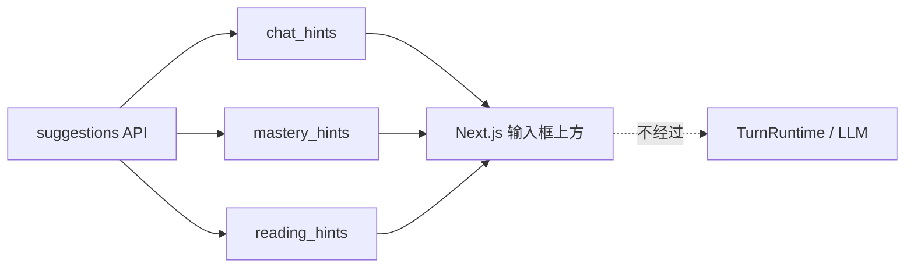

| 模块 | 触发场景 | 典型输出 |
|------|----------|----------|
| `chat_hints.py` | 空会话 / 新话题 | 「继续上次微积分」「出两道练习题」 |
| `mastery_hints.py` | Mastery 页 | 下一复习节点、到期提醒 |
| `reading_hints.py` | 阅读器内 | 段落摘要、词汇卡入口 |
| `suggestions.py` | 聚合 API | 按当前 route 选 hint 源 |

**解读**：与 Memory 注入不同——Hints 是 **一次性 UI 快捷操作**；用户点击后才变成正式 `user_message` 进入 Turn。详见 [第十篇 §23](#23-hints--plugins--logging横切)。

---

### 14. 认证与外部 Provider

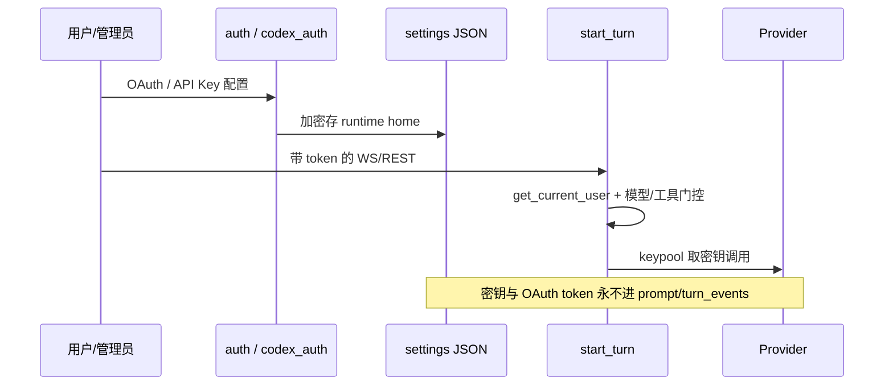

| 模块 | 职责 |
|------|------|
| `services/auth.py` | 会话与基础鉴权 |
| `codex_auth/` | 个人 Codex profile，`merge_personal_llm_profiles` |
| `codebuddy_*` | CodeBuddy 凭证 |
| `api/routers/auth.py` | `ws_require_auth` |
| `multi_user/` | 用户隔离 + `apply_allowed_llm_selection` |

多用户门控时序见 [第十篇 §15](#15-多用户与权限)。

---

## 第四篇：基础设施

### 1. Workspace

**路径**：`services/workspace/`

- **Content Workspace** 与 **runtime home**（`data/user/settings`）分离；
- 产出默认 `outputs/<capability>/<session>/<turn>/`；
- 模型只见相对路径；读-only 边界 + 写 outputs 需确认。

#### 深入一层

```text
Runtime Home（私有）          Content Workspace（Agent 可写）
├── data/user/settings/       ├── outputs/<cap>/<session>/<turn>/
├── SQLite sessions.db        ├── 用户上传的学习材料
├── memory/ L1-L3             └── 书稿、图表、代码运行结果
└── API keys（不进 prompt）
```

Settings → Workspace 可改 workspace 根目录；`workspace_*` 工具 enforce 读边界与写确认（防越权读系统配置）。

---

### 2. Sandbox

**路径**：`services/sandbox/`

优先级：Runner sidecar → bwrap → 受限 subprocess（需显式开启）→ 无则 `exec` 禁用。教育场景够用；**弱于 Codex 级生产 shell 隔离**。

#### 深入一层：exec 降级链

| 级别 | 机制 | 何时启用 |
|------|------|----------|
| 1 | Runner sidecar | Docker/K8s 部署，隔离最强 |
| 2 | bubblewrap (`bwrap`) | Linux 命名空间沙箱 |
| 3 | 受限 subprocess | Settings 显式开启 |
| 4 | 禁用 | 无沙箱时 `exec` 工具不可用 |

`deep_solve` / research 的代码执行走此链；企业客户若需「学生跑任意代码」，应规划 sidecar 或外接 Jupyter，而非假设默认安装即生产级隔离。

---

### 3. Knowledge Ingestion

后台队列：解析 → 清洗 → 分块 → embedding → 索引追加；失败分段重试。真源：`services/knowledge/`、`services/rag/pipelines/`、`services/parsing/`。

#### 深入一层

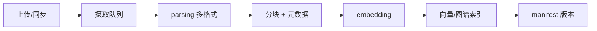

- 大文件 **分段重试**，不阻塞 Turn 主路径；
- Session `preferences.knowledge_bases` 决定本轮挂载哪些库；
- Regenerate 用 `overrides.knowledge_bases` 复现当时检索范围。

---

### 4. UnifiedContext

**路径**：`core/context.py`

贯穿入口 → Orchestrator → Capability → Tool 的 **唯一上下文对象**（session、capability、KB、附件、`TurnRuntimeContext`、`skills_manifest`、workspace 等）。

#### 深入一层：关键字段

| 字段 | 作用 |
|------|------|
| `session_id` / `user_message` | 会话与本轮输入 |
| `conversation_history` | 经 ContextBuilder 裁剪后的 OpenAI messages |
| `active_capability` | 路由键；`None` → `chat` |
| `enabled_tools` / toggles | 用户或 admin 工具白名单 |
| `knowledge_bases` | 本轮挂载 KB 列表 |
| `attachments` | 多模态；`extracted_text` 可注入 |
| `language` | `en` / `zh`，驱动 PromptManager 目录 |
| `metadata.turn_id` | StreamBus 注册与事件关联 |
| `TurnRuntimeContext` | `wait_for_user_reply`、workspace 解析 |
| `skills_manifest` | 渐进披露 skill 清单块 |

CLI 冷启动示例见 [CORE_RUNTIME_WALKTHROUGH §A.3](./CORE_RUNTIME_WALKTHROUGH.md)。

---

### 5. ToolRegistry

**路径**：`runtime/registry/tool_registry.py`

| 工具族 | 服务 |
|--------|------|
| `rag` / `read_source` | knowledge / rag |
| `exec` | sandbox |
| `memory_*` | memory |
| `mastery_*` | learning + mastery |
| `ask_user` | turn 暂停恢复 |
| `workspace_*` | workspace |
| `read_skill` / `load_tools` | skill + MCP deferred |

#### 深入一层：条件挂载

`agents/_shared/tool_composition.py` 按 **谓词** 挂载工具，避免 system prompt 膨胀：

| 谓词 | 工具示例 |
|------|----------|
| `has_skills` | `read_skill`, `load_tools` |
| `has_notebooks` | `list_notebook`, `write_note` |
| `has_knowledge_bases` | `rag`, `read_source` |
| capability manifest | `solve_*`, `mastery_*` 等独占工具 |

`BaseTool.deferred=True`（MCP 包）在 `load_tools` 调用前 **不出现在** LLM tool schema 里。

---

### 6. 完整包地图

**依赖方向**（禁止反向）：`api/cli/partners` → `runtime` → `capabilities` → `agents` → `core` / `services` → 存储。

| 包/目录 | 职责 |
|---------|------|
| `runtime/` | Orchestrator、registry、launcher、bootstrap、`stream_bus` |
| `core/` | context、stream、协议、agentic、`trace` |
| `agents/` | 各 capability 的 Agent 与 `AgentLoop` |
| `capabilities/` | TurnCapability 实现、prompts、`_shared` |
| `tools/builtin/` | 内置工具 |
| `api/` | FastAPI、`unified_ws`、`TurnRuntimeManager` 入口 |
| `deeptutor_cli/` | Typer CLI（`deeptutor run <cap>`） |
| `deeptutor_web/` / `web/` | Next.js 前端 |
| `services/llm/` | Provider、流式、多模态、DSML |
| `services/session/` | SQLite、`ContextBuilder`、`TurnRuntimeManager` |
| `services/memory/` | L1–L3 |
| `services/rag/` · `services/knowledge/` | 检索与 KB |
| `services/mcp/` | MCP 客户端 |
| `services/skill/` | Skill 发现与 manifest |
| `services/prompt/` | `PromptManager` |
| `services/sandbox/` · `workspace/` | 执行与文件边界 |
| `services/auth.py` · `multi_user/` | 鉴权、模型/工具白名单、`PathService` |
| `services/settings/` · `config/` | JSON 设置与配置 |
| `events/` | 内部 `event_bus`（非 WS） |
| `i18n/` · `core/i18n.py` | 国际化 |
| `plugins/` | 可插拔扩展点 |
| `skills/` | Skill 包目录（EduHub 可安装） |
| `learning/` | 策略与掌握度模型 |
| `book/` · `co_writer/` · `reading/` · `video_learning/` | 长内容引擎 |
| `partners/` | IM 通道适配 |
| `app/` | 应用容器/启动装配 |

**启动链**：`load_builtins()` → `ToolRegistry` + `CapabilityRegistry` → `get_turn_runtime_manager()` 单例。

#### 深入一层：配置与入口

| 入口 | 命令 | 说明 |
|------|------|------|
| 全量安装 | `pip install deeptutor` | Web + CLI + 打包前端 |
| 轻量 CLI | `pip install deeptutor-cli` | 无 Web |
| 可选 extra | `.[server]` `.[partners]` `.[math-animator]` | 按需依赖 |

**配置原则**：运行时设置 → `data/user/settings/*.json`；项目根 `.env` **故意忽略**（多用户/容器友好）；进程环境变量可覆盖 JSON。

`runtime/launcher.py`：`deeptutor start` 组合后端端口发现 + 前端一起起。

---

### 7. 后台 Worker 与进程

| 模块 | 路径 | 职责 |
|------|------|------|
| `worker_process.py` | `runtime/` | 隔离子进程执行重任务 |
| `isolated_worker.py` | `runtime/` | 单任务隔离 |
| `update_worker.py` | `runtime/` | 应用/KB 更新 |
| `background_leader.py` | `runtime/` | 多 worker 选主 |
| `memory_probe.py` / `memory_reclaim.py` | `runtime/` | 内存监控与回收 |
| `services/cron/` | `services/` | 定时任务（`cron` 工具可注册 job） |
| Book worker | `book/` 内部 | 活书编译、drift 重编译 |
| KB ingest | `services/knowledge/` | 摄取队列 worker |

CLI/API 触发长任务后立即返回；状态经 REST 或 StreamEvent 查询。

---

### 8. plugins / logging / 运维服务

| 模块 | 路径 | 职责 |
|------|------|------|
| `plugins/loader.py` | `plugins/` | 第三方插件加载 |
| `logging/adapters/` | `logging/` | 日志适配 |
| `logging/stats/` | `logging/` | 统计指标 |
| `services/doctor.py` | `services/` | 健康检查（`deeptutor doctor`） |
| `services/app_update.py` | `services/` | 应用更新 |
| `services/storage/` | `services/` | 通用存储抽象 |
| `singleflight_cache.py` | `services/` | 请求合并缓存 |
| `pocketbase_client.py` | `services/` | 可选 PocketBase 同步 |
| `events/event_bus.py` | `events/` | 内部 pub/sub |

**EventBus 订阅示例**：`CAPABILITY_COMPLETE` → Partners 统计、memory probe；插件可扩展自定义事件。

---

## 第五篇：横切能力

### 1. Skills 渐进披露

| | Codex | DeepTutor |
|--|-------|-----------|
| Skill 注入 | Context fragment 一次性 | **manifest 一行 + `read_skill`** |
| 扩展工具 | MCP / 内置 | **`load_tools` 延迟加载 deferred 包** |

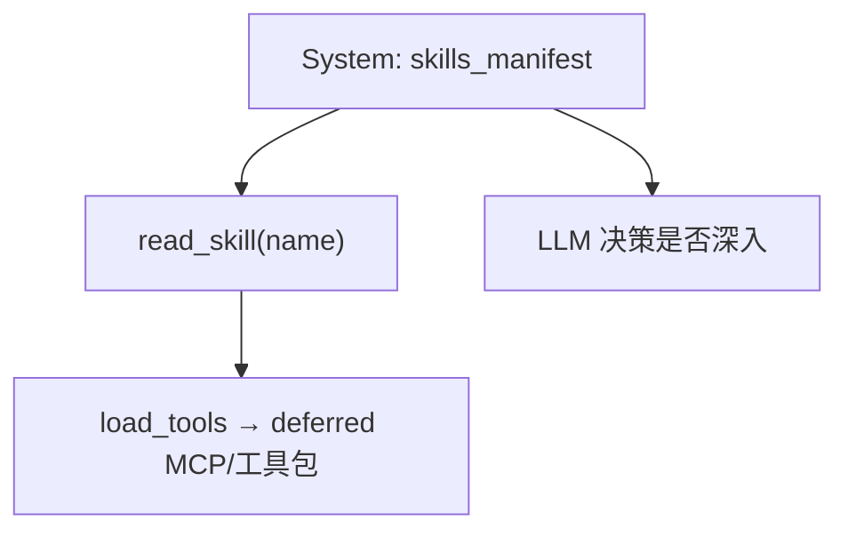

- 真源：`services/skill/`、`deeptutor/skills/`、`tools/builtin/read_skill.py`
- Capability 独占 playbook：`capabilities/prompts/{en,zh}/` 与全局 skills **正交**

#### 深入一层

- Skill 包格式：Cursor 风格 `SKILL.md` + YAML frontmatter，目录 `deeptutor/skills/`；
- EduHub 可安装社区 skill；`SkillService`（`services/skill/`）扫描并生成 **一行一条** 的 manifest；
- `always` 标记的 skill 可全文预注入；其余靠模型自主 `read_skill`；
- 与 Codex context fragment 对比：DeepTutor 更适合 **skill 数量多、全文长** 的教育场景。

---

### 2. MCP 与外部工具

- MCP 工具 → `ToolDefinition(raw_parameters=…)`，默认 `deferred=True`
- `MCPManager`（`services/mcp/manager.py`）管理连接；`metadata.tool_provider` 供 UI trace
- Partner 通道可叠加 per-user MCP 视图（`multi_user` + registry）

#### 深入一层

| 组件 | 文件 | 职责 |
|------|------|------|
| `MCPManager` | `services/mcp/manager.py` | stdio/HTTP 连接、reload |
| `McpToolAdapter` | `services/mcp/` | 上游 JSON Schema → `ToolDefinition` |
| `provider_identity` | `core/tool_protocol.py` | UI trace 显示工具来源 |
| `ProviderToolView` | `multi_user/` | 用户级 MCP 叠加 |

MCP 工具默认 **deferred**；模型需先 `load_tools(["mcp:filesystem"])` 类调用才暴露 schema。`metadata.tool_provider` 写入 `turn_events` 供 `CallTracePanel` 展示。

---

### 3. Prompt 体系与 i18n

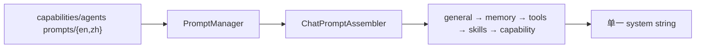

- `ChatPromptAssembler`（`agents/chat/prompt_blocks.py`）按块拼接；
- AgentLoop 动态 **user 角色** loop 指令（settlement、截断续写、空 finish nudge）；
- UI/API i18n：`i18n/`、`UnifiedContext.language`

#### 深入一层：PromptBlocks 顺序

| 块 | 内容 |
|----|------|
| `general` | 全局政策、安全 |
| `runtime_policy` | 运行约束 |
| `loop` | AgentLoop 行为说明 |
| `persona_style` | 人设/语气 |
| `memory` | L2/L3 快照 |
| `tools` | 工具使用说明 |
| `skills` | skills_manifest |
| `sources` | KB/附件/书引用 |
| `capability` | 当前模式独占指令（可覆盖 chat 片段） |

`PromptManager`（`services/prompt/manager.py`）按 `module + agent_name` 加载 YAML；`labels.*` / `notices.*` 供 stage 状态文案 i18n。ContextBuilder 摘要的 system prompt 亦随 `language.startswith("zh")` 切换。

---

### 4. 多用户与权限

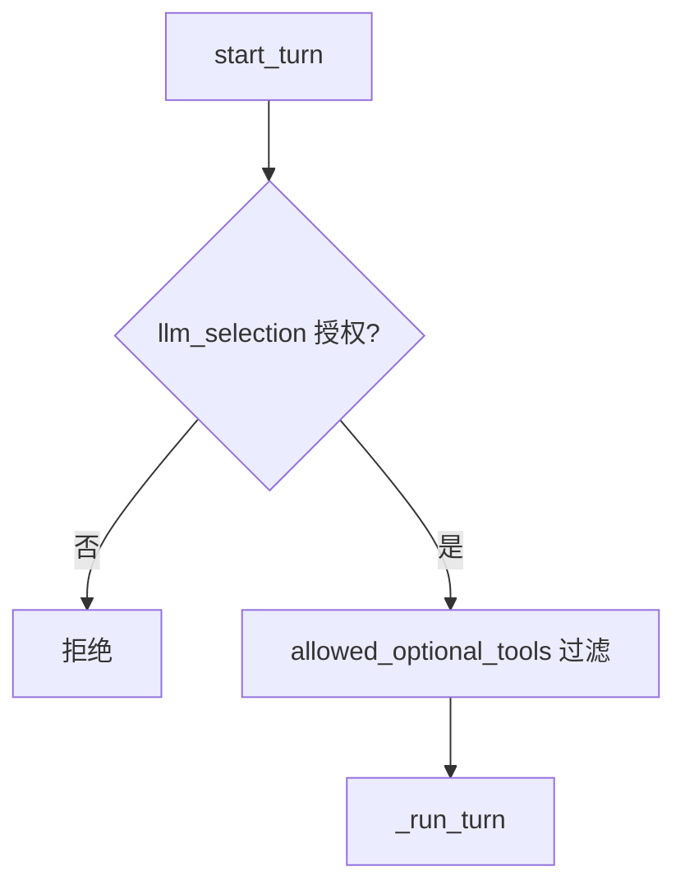

- **唯一 enforcement 点**：`start_turn` 过滤模型与可选工具
- `PathService` + per-user `data/user/`；Memory 根路径经 context var 隔离
- WS：`ws_require_auth`（`api/routers/auth.py`）

#### 深入一层

| 检查 | 函数 | 时机 |
|------|------|------|
| LLM 授权 | `apply_allowed_llm_selection` | `start_turn` |
| 工具子集 | `allowed_optional_tools` | `start_turn` **唯一 enforcement** |
| 个人模型 | `merge_personal_llm_profiles` | owner-bound Codex 等与 catalog 合并 |
| 路径隔离 | `PathService` + `get_current_user()` | Memory、workspace、SQLite 路径 |

非 admin 无 `llm_selection` 时自动 pin **第一个已授权** 模型。Admin 可授予 per-user 可选工具（如 `exec`、`consult_subagent`）。

---

### 5. 可观测性、成本与 Trace

| 机制 | 说明 |
|------|------|
| 双写 | `turn_events` 全量 seq + `messages` 终稿 |
| Trace | `call_id` 树在 `StreamEvent.metadata`；前端 `CallTracePanel` |
| 成本 | `UsageTracker` → `emit_capability_result.cost_summary` |
| Context budget | `build_context_budget` **仅信息**；截断由 `ContextBuilder` 在 turn 前完成 |

#### 深入一层：Trace 字段与 Event Bus

| `metadata` 字段 | 含义 |
|-----------------|------|
| `call_id` | 树形 trace 节点 ID |
| `call_kind` | `agent_loop_round` / `tool_planning` / `llm_summarization` |
| `call_role` | `narration` / `finish` |
| `trace_group` | `stage` / `tool_call` |
| `tool_provider` | MCP 来源 |

`UsageTracker`（`core/agentic/usage.py`）流式累计 token → `emit_capability_result.cost_summary`。内部 `events/event_bus.py` 发布 `CAPABILITY_COMPLETE` 供 Partners 统计等订阅（**非** WS 协议）。

---

### 6. WebSocket Turn 生命周期

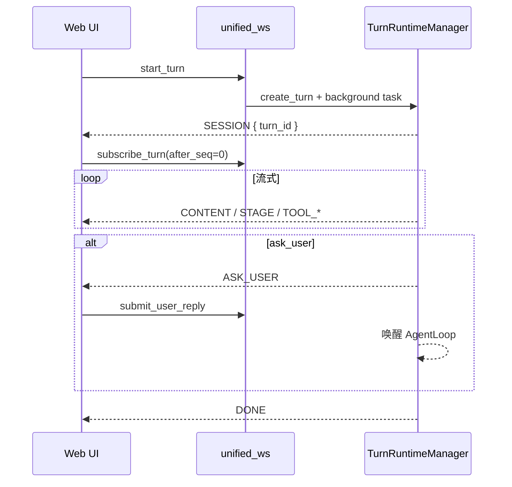

| 操作 | 语义 |
|------|------|
| `cancel_turn` | 取消后台 task |
| `regenerate_last_turn` | 以 turn_events 为基准重跑 |
| `submit_user_reply` | 仅 ask_user 暂停态 |

#### 深入一层：WS 消息与合成 DONE

**客户端 `start_turn` payload 要点**：`session_id`、`message`、`capability`（可选）、`config`（capability 专属）、`llm_selection`、`tools` toggles、`knowledge_bases`。

**断线重连**：不必重跑模型；`subscribe_turn(after_seq)` 从 SQLite 补发。

**合成 DONE 兜底**：异常路径仍保证前端收到 `DONE`，避免 UI 永久 loading（见 TRM lifecycle）。

**regenerate**：基于 **turn_events + request_snapshot** 重放输入条件，可换模型或覆盖 KB（`overrides`）。

---

## 第八篇：API、前端与 CLI

### 1. REST API 路由地图

**基址**：FastAPI `deeptutor/api/` · 传输层与 TRM 对接。

| 路由模块 | 路径 | 职责 |
|----------|------|------|
| **unified_ws** | `api/routers/unified_ws.py` | `start_turn` / `subscribe_turn` / `cancel` / `regenerate` / `submit_user_reply` |
| sessions | `sessions.py` | 会话 CRUD、分支 |
| memory | `memory.py` | L2/L3 读写、Memory Graph |
| knowledge | `knowledge.py` | KB 管理、摄取触发 |
| mastery_path | `mastery_path.py` | 路径、进度、报表 |
| question / quiz_judge | `question.py`, `quiz_judge.py` | 题库、服务端判分 |
| book | `book.py` | 活书编译状态 |
| co_writer | `co_writer.py` | 协作写作 |
| reading / reading_extensions | `reading*.py` | 阅读材料与扩展 |
| video_learning | `video_learning.py` | 视频学习 |
| courses | `courses.py` | 课程单元 |
| partners / partner_groups | `partners.py`, `partner_groups.py` | IM 伴侣与群组 |
| personas | `personas.py` | 人设 |
| notebook / question_notebook | `notebook.py`, `question_notebook.py` | 笔记与题本 |
| attachments / outputs | `attachments.py`, `outputs.py` | 上传与产出物 |
| tools / skills / mcp_settings | `tools.py`, `skills.py`, `mcp_settings.py` | 工具与 MCP 配置 |
| capabilities / capabilities_settings | `capabilities.py`, `capabilities_settings.py` | Capability 元数据 |
| workspace | `workspace.py` | Content Workspace |
| visualizers | `visualizers.py` | 可视化插件 |
| voice | `voice.py` | 语音 |
| subagents | `subagents.py` | 外部 harness 配置 |
| multi_user | `multi_user.py` | 用户与授权 |
| settings / system / dashboard | `settings.py`, `system.py`, `dashboard.py` | 设置、健康、大盘 |
| imports | `imports.py` | 批量导入 |
| marginnote4 | `marginnote4.py` | MN4 连接器 API |
| agent_config | `agent_config.py` | Agent 配置 |
| auth | `auth.py` | 登录、WS token |
| space_cli_apps / space_mcp | `space_*.py` | Space 内 CLI/MCP |

**契约**：`api/contracts/` 定义请求/响应 schema，与前端 code-gen 对齐。

---

### 2. Web 前端架构

**路径**：`DeepTutor/web/`（Next.js）

| 关注点 | 实现要点 |
|--------|----------|
| 实时流 | 消费 `unified_ws` StreamEvent；`subscribe_turn(after_seq)` 断线续传 |
| 模式切换 | UI 写入 `active_capability`（Chat/Solve/Mastery/Reading…） |
| 进度 | `STAGE_START/END` 驱动进度条与时间线 |
| Trace | `CallTracePanel` 按 `call_id` 分组（metadata） |
| 成本 | `RESULT.metadata.cost_summary` |
| ask_user | `WAIT_FOR_INPUT` → 表单 → `submit_user_reply` |
| Memory | 可编辑 L2/L3、Memory Graph 可视化 |
| 设置 | 模型/工具/KB/Workspace 绑定 settings API |

前端 **不** 直接调 Capability；一切经 TRM + WS 协议，保证与 CLI/Partner 行为一致。

#### 深入一层：页面域（概念）

```text
Chat / Ask          → chat, ask_questions
Solve / Research    → deep_solve, deep_research
Quiz                → deep_question
Mastery             → mastery_path + 路径 UI
Reading / Video     → immersive_* + 阅读器/播放器
Book / Co-Writer    → 独立工作台 + book/co_writer API
Settings / Admin    → multi_user, model_catalog, MCP
Partners            → partner 管理 + 渠道状态
```

---

### 3. CLI 命令矩阵

**真源**：`deeptutor_cli/main.py`

| 命令 | 模块 | 说明 |
|------|------|------|
| `deeptutor chat` | `chat.py` | 交互式会话 |
| `deeptutor run <cap> "..."` | `main.py` | 单次 Capability |
| `deeptutor serve` / `start` | `main.py` + `launcher` | API + Web |
| `deeptutor init` | `init_cmd.py` / `init_wizard.py` | 初始化 runtime home |
| `deeptutor kb *` | `kb.py` | 知识库管理 |
| `deeptutor book *` | `book.py` | 活书 CLI |
| `deeptutor partner *` | `partner.py` | Partner 管理 |
| `deeptutor skill *` | `skill.py` | Skill 安装/登录 |
| `deeptutor memory *` | `memory.py` | Memory 查看/编辑 |
| `deeptutor notebook *` | `notebook.py` | 笔记 |
| `deeptutor workspace *` | `workspace_cmd.py` | Workspace |
| `deeptutor config *` | `config_cmd.py` | 配置 |
| `deeptutor provider *` | `provider_cmd.py` | Provider |
| `deeptutor doctor` | `doctor.py` | 健康检查 |
| `deeptutor plugin *` | `plugin.py` | 插件 |

CLI `run` 可绕过完整 TRM（轻量路径）；`chat`/`serve` 走 SessionStore + Orchestrator。

---

### 4. DeepTutorApp SDK

**真源**：`deeptutor/app.py` `DeepTutorApp`

```python
# 概念用法
app = DeepTutorApp()
await app.chat(message="...", session_id=...)
await app.run_capability("deep_solve", message="...")
```

封装 `get_turn_runtime_manager()`，适合 Jupyter、脚本、第三方后端嵌入；与 WS 协议 **语义一致**（同一 TRM）。

---

## 第九篇：内置工具全集

**真源**：`tools/builtin_specs.py` → `BUILTIN_TOOL_SPECS`（惰性加载，启动时不 import 全部实现）

### 通用与检索

| 工具 | 说明 |
|------|------|
| `brainstorm` | 头脑风暴 |
| `rag` | 知识库检索 |
| `kb_files` | KB 文件列表 |
| `read_source` | 精读单源（页码） |
| `web_search` / `web_fetch` | 联网搜索/抓取 |
| `paper_search` | arXiv 等 |
| `github` | GitHub 源 |
| `reason` | 显式推理链 |

### Memory / Skill / 笔记

| 工具 | 说明 |
|------|------|
| `read_memory` / `write_memory` | L2/L3 读写 |
| `read_skill` / `load_tools` | Skills + deferred MCP |
| `list_notebook` / `write_note` | 学习笔记 |
| `question_bank` | 题库操作 |

### 执行与 Workspace

| 工具 | 说明 |
|------|------|
| `exec` | Shell（沙箱门控） |
| `code_execution` | NL→Python（见 solve manifest） |
| `workspace_*` | list/read/search/present/export |
| `cron` | 注册定时任务 |

### Mastery 族（`capabilities/mastery/tools`）

`mastery_status`、`mastery_quiz`、`mastery_grade`、`mastery_skip_question`、`mastery_assess`、`mastery_build`、`mastery_mode`、`mastery_profile`、`mastery_revise`、`mastery_paths`、`mastery_switch`、`mastery_leave`、`mastery_topics`、`mastery_sessions`、`mastery_open_session`、`mastery_new_session`

### Solve 族

`solve_plan`、`solve_finish_step`、`solve_replan`

### 阅读 / 课程 / 连接器

| 前缀 | 工具数 | Capability |
|------|--------|------------|
| `reading_*` / `material_*` / `reader_*` | 7+ | immersive_reading |
| `course_*` | 4 | course_study |
| `obsidian_*` | 9 | obsidian |
| `marginnote_*` | 7 | marginnote4 |
| `ima_*` | 5 | ima |
| `inspect_setup` 等 | 4 | setup |

### 多模态 / 子 Agent / Partner

| 工具 | 说明 |
|------|------|
| `imagegen` / `videogen` | 图像/视频生成 |
| `submit_visualization` | 可视化产物 |
| `geogebra_analysis` | GeoGebra |
| `consult_subagent` | 外部 harness |
| `ask_user` | Turn 暂停 |
| `partner_read` / `partner_memorize` / `partner_search` | Partner memory |
| `propose_partner` / `invoke_other` | Partner 编排 |

挂载由 `compose_enabled_tools(user_toggles, ToolMountFlags)` 决定；沙箱不可用时 `exec` **不出现在** schema 中。

### 工具调用时序（AgentLoop 内）

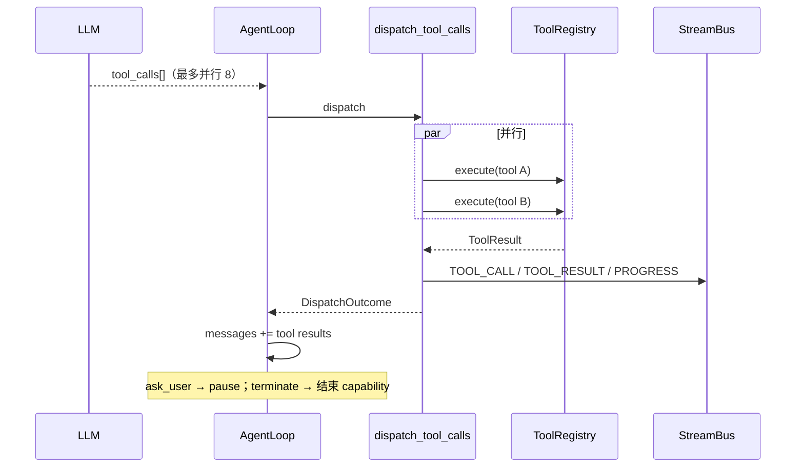

**解读**：批内重复 (tool,args) 去重；`rag` 走 `retrieve_meta_factory` 显示 Retrieve 子轨迹；MCP 工具需先 `load_tools` 才进入 schema。Capability 专属工具（`mastery_*`、`solve_*`）仅在对应 `active_capability` 挂载。

---

## 第十篇：模块深潜图解（血肉）

> 本篇将原先仅列目录的模块写透：**框架图说明边界，时序图说明调用顺序，流程图说明状态迁移**，每节附设计解读。真源代码路径见各节正文。

## 1. Mastery Path — 掌握度路径

### 1.1 框架：产品闭环在运行时中的位置

```mermaid
graph TB
    subgraph UI["表现层"]
        MP_UI["Mastery 路径 UI"]
        QUIZ_UI["测验卡片"]
    end
    subgraph Cap["能力层"]
        MPC["mastery_path Capability"]
        AL["AgentLoop"]
    end
    subgraph Tools["工具层"]
        MQ["mastery_quiz"]
        MG["mastery_grade"]
        MS["mastery_status / mastery_switch"]
    end
    subgraph Domain["领域层"]
        POL["learning/policy.py SM-2"]
        LV["mastery_levels"]
        QB["题库（服务端）"]
    end
    subgraph Store["存储"]
        PREF["sessions.preferences.mastery_path_id"]
        LEARN["learning 状态文件"]
        MEM["Memory L1 证据"]
    end

    MP_UI --> MPC
    MPC --> AL
    AL --> MQ & MG & MS
    MG --> QB
    MG --> POL
    POL --> LEARN
    MS --> PREF
    MG --> MEM
    QUIZ_UI --> MG
```

**解读**：Mastery 不是「聊天里顺便出题」。`mastery_path` 是一条 **带硬 gate 的长期练习闭环**：Agent 在对话中调用 `mastery_*` 工具，但 **判分与标准答案永远在服务端**（`mastery_grade` → 题库/rubric），LLM 看不到答案，从架构上防泄题、防 prompt 改分。

### 1.2 时序：一次测验节点

```mermaid
sequenceDiagram
    participant U as 学习者
    participant AL as AgentLoop
    participant MQ as mastery_quiz
    participant SRV as 题库服务
    participant MG as mastery_grade
    participant POL as learning/policy

    U->>AL: 继续路径对话
    AL->>MQ: 请求当前节点题目
    MQ->>SRV: 按 topic/type 取题（无答案字段）
    SRV-->>MQ: 题干 + question_id
    MQ-->>AL: ToolResult（仅题干）
    AL-->>U: 展示题目（StreamEvent CONTENT）

    U->>AL: 提交作答
    AL->>MG: grade(question_id, user_answer)
    MG->>SRV: 服务端比对 / rubric
    SRV-->>MG: score + feedback（摘要）
    MG->>POL: 更新掌握度 + due 日期
    MG-->>AL: 通过/未通过 + 下一节点 hint
    AL-->>U: 辅导反馈（不含标准答案全文）
```

### 1.3 状态机：Topic Gate

```mermaid
stateDiagram-v2
    [*] --> Intro: 进入路径节点
    Intro --> Quiz: mastery_quiz
    Quiz --> Grading: 用户作答
    Grading --> Passed: mastery_grade 通过
    Grading --> Retry: 未通过且允许重试
    Retry --> Quiz: 间隔后复习（SM-2 due）
    Passed --> NextNode: gate 满足
    NextNode --> Intro: 下一 topic
    NextNode --> [*]: 路径完成
```

**解读**：`learning/policy.py` 负责 **间隔复习**（SM-2 风格 due）；`mastery_levels` 量化掌握度。Session `preferences.mastery_path_id` 在 TurnRuntime 显式 payload 时持久化，保证刷新页面后路径不断档。

---

## 2. deep_question（Quiz）与 quiz_judge

### 2.1 框架：出题 vs 掌握度

| 维度 | `deep_question` | `mastery_path` |
|------|-----------------|----------------|
| 目标 | 快速生成测验卷 | 长期路径 + gate |
| 引擎 | BaseAgent：ideation → generation | AgentLoop + mastery 工具 |
| 答案 | 写入题库，**不进 prompt** | 同上 |
| API | `quiz_judge` 服务端判分 | `mastery_grade` |

### 2.2 流程：出题管线

```mermaid
flowchart LR
    IN["用户：出 5 道选择题"] --> IDE["ideation stage<br/>BaseAgent"]
    IDE --> GEN["generation stage<br/>BaseAgent"]
    GEN --> BANK["question_bank 工具<br/>写入服务端题库"]
    BANK --> OUT["emit_capability_result<br/>试卷摘要（无答案）"]
    OUT --> UI["Quiz UI / 导出"]
```

### 2.3 时序：判分（与 Mastery 共用防泄题原则）

```mermaid
sequenceDiagram
    participant UI as Web Quiz
    participant API as quiz_judge router
    participant BANK as 题库
    participant LLM as LLM（可选解析）

    UI->>API: POST 作答 + question_id
    API->>BANK: 取标准答案/rubric（LLM 不可见）
    API->>API: 规则判分 / LLM 仅评开放性题
    API-->>UI: score + 解释（脱敏）
    Note over API,BANK: 答案永不进入 Chat prompt
```

**解读**：`deep_question` 的 mimic source 可在 ideation 阶段读取样题 **风格**，但生成题后答案立即落库隔离。教师场景可单独用 Quiz API 做班级测验，与 Chat Turn 解耦。

---

## 3. deep_research — 四阶段调研

### 3.1 框架图

```mermaid
flowchart TB
    IN["用户主题"] --> R1["rephrasing<br/>BaseAgent 澄清表述"]
    R1 --> R2["decomposing<br/>主题 → block 队列"]
    R2 --> R3["researching<br/>每 block: run_agentic_loop"]
    R3 --> R4["reporting<br/>每 section: run_agentic_loop"]
    R4 --> OUT["长报告 Markdown + citations"]
    R3 --> CIT["CitationManager"]
    R4 --> CIT
    OUT --> MEM["可选写 Memory L2"]
```

### 3.2 时序：单个 research block（标签协议）

```mermaid
sequenceDiagram
    participant LP as run_agentic_loop
    participant LLM as LLM
    participant HOST as LoopHost
    participant WS as web_search/rag
    participant BUS as StreamBus

    LP->>LLM: messages + LabelProtocol 说明
    LLM-->>LP: SEARCH: 查询词
    LP->>WS: tool（若 tool_label）
    WS-->>LP: 检索结果
    LP->>BUS: PROGRESS / CONTENT
    LLM-->>LP: APPEND: 新 subtopic
    LP->>HOST: on_intermediate(APPEND)
    HOST->>HOST: 扩展 block 队列
    LLM-->>LP: DONE
    LP->>LP: 合并 block 笔记
```

**解读**：research **不用 AgentLoop**，而用 `LabelProtocol`（首行标签 `SEARCH`/`APPEND`/`DONE`/`WRITE`…）。`APPEND` 是核心扩展点：模型可动态增加子课题，无需预先固定 DAG。`UsageTracker` 在 capability 末写入 `cost_summary`。

---

## 4. deep_solve — 三 Agent 管线

### 4.1 时序（Capability 级，非 chat 内 solve_* 工具）

```mermaid
sequenceDiagram
    participant CAP as DeepSolveCapability
    participant P as PlannerAgent
    participant S as SolverAgent(s)
    participant W as WriterAgent
    participant RAG as rag/exec
    participant BUS as StreamBus

    CAP->>BUS: STAGE_START planning
    CAP->>P: process(题目)
    P-->>CAP: plan 结构
    CAP->>BUS: STAGE_END planning

    CAP->>BUS: STAGE_START reasoning
    loop 每步
        CAP->>S: process(step, plan)
        S->>RAG: 检索/计算
        RAG-->>S: 中间结果
    end
    CAP->>BUS: STAGE_END reasoning

    CAP->>BUS: STAGE_START writing
    CAP->>W: process(汇总)
    W-->>CAP: 最终解答 Markdown
    CAP->>BUS: emit_capability_result
```

**解读**：`deeptutor run solve` 走 **三 stage BaseAgent**；Chat 里也可通过 `solve_plan` 等工具在 **单 AgentLoop** 内分步。两套路径服务不同 UX，共享同一套 prompt YAML（`deep_solve.yaml`）。

---

## 5. math_animator 与 visualize

### 5.1 math_animator 流程

```mermaid
flowchart TD
    A["concept_analysis"] --> B["concept_design"]
    B --> C["code_generation<br/>Manim Python"]
    C --> D{"渲染成功?"}
    D -->|否| E["code_retry"]
    E --> C
    D -->|是| F["summary"]
    F --> G["render_output<br/>视频/预览"]
```

**解读**：依赖 `.[math-animator]` extra；失败在 stage 级重试，避免整 turn 报废。产物进 Workspace `outputs/...`。

### 5.2 visualize 与 manim 路由

```mermaid
flowchart LR
    V["visualize Capability"] --> AN["analyzing: 选 render_type"]
    AN --> GEN["generating"]
    GEN -->|svg/chartjs/mermaid| SUB["submit_visualization"]
    GEN -->|manim| MA["math_animator 子管线"]
    GEN --> REV["reviewing"]
    REV --> UI["内嵌展示"]
```

---

## 6. ask_questions — 澄清式辅导

```mermaid
sequenceDiagram
    participant U as 用户
    participant AL as AgentLoop
    participant AU as ask_user（可选）

    U->>AL: 模糊问题
    AL-->>U: narration: 我先确认…
    AL->>AU: 澄清选择题
    AU-->>U: WAIT_FOR_INPUT
    U->>AL: submit_user_reply
    AL-->>U: finish: 基于澄清的完整回答
```

**解读**：与 `chat` 共享 AgentLoop，但 playbook 强制 **先澄清再答**，降低幻觉；`ask_user` 与 chat 相同暂停语义（同 turn_id 续跑）。

---

## 7. immersive_reading / immersive_watching

### 7.1 Reading 框架

```mermaid
graph LR
    subgraph Mat["reading/ 材料层"]
        ING["摄取 PDF/EPUB"]
        TABS["多 tab 材料"]
    end
    subgraph Cap["immersive_reading"]
        AL["AgentLoop"]
        RT["reading_* 工具"]
    end
    subgraph Ground["Grounding"]
        PAGE["页码/段落锚点"]
        RS["read_source / search_material"]
    end
    ING --> TABS
    TABS --> RT
    AL --> RT
    RT --> PAGE
    RT --> RS
    PAGE --> AL
```

### 7.2 Video 时序

```mermaid
sequenceDiagram
    participant U as 用户
    participant VL as video_learning
    participant CAP as immersive_watching
    participant AL as AgentLoop

    U->>VL: 粘贴 YouTube URL
    VL->>VL: Invidious/原生播放 + 字幕解析
    U->>CAP: 「解释 03:42 处公式」
    CAP->>AL: 带 timestamp 上下文
    AL-->>U: 回答含可跳转时间点
    VL->>VL: 持久化观看进度
```

---

## 8. Book 活书编译

### 8.1 框架

```mermaid
graph TB
    subgraph Input["输入"]
        KB["知识库"]
        DOC["原始材料"]
    end
    subgraph BookEng["book/ 引擎"]
        SPINE["Spine 目录树"]
        BLK["Block 内容块"]
        W["后台 Worker"]
        AG["book/agents 章节 Agent"]
    end
    subgraph Out["输出"]
        LIVE["活书 HTML/导出"]
        DRIFT["drift 标记"]
    end
    DOC --> W
    KB --> W
    W --> AG
    AG --> BLK
    BLK --> SPINE
    SPINE --> LIVE
    KB -->|源更新| DRIFT
    DRIFT --> W
```

### 8.2 时序：块级重编译

```mermaid
sequenceDiagram
    participant API as book router
    participant W as Book Worker
    participant AG as Chapter Agents
    participant KB as Knowledge

    API->>W: enqueue compile(job)
    W->>KB: 拉取材料 delta
    W->>AG: 并行生成受影响 Block
    AG-->>W: Block markdown
    W->>W: 汇编 Spine
    W-->>API: job completed
    Note over API: 独立于 TurnRuntime；长跑 batch
```

**解读**：Book **不走** `start_turn` 主路径；避免长编译阻塞 WS。与 `co_writer` 产出可互相引用。

---

## 9. co_writer — 段落协作链

```mermaid
sequenceDiagram
    participant U as 作者
    participant API as co_writer API
    participant D as Draft Agent
    participant R as Review Agent
    participant V as Revise Agent

    U->>API: 段落 + 修改意图
    API->>D: Draft
    D-->>API: v1 快照
    API->>R: Review(v1)
    R-->>API: 评审意见
    alt human-in-the-loop
        U->>API: approve / 修改意见
    end
    API->>V: Revise
    V-->>API: v2 快照 → Workspace
```

---

## 10. course_study — 机构课程单元

```mermaid
flowchart TB
    SYL["syllabus<br/>services/courses"] --> CS["course_study Capability"]
    CS --> T1["course_overview"]
    CS --> T2["course_material"]
    CS --> T3["course_edit（教师）"]
    CS --> T4["course_handoff → mastery_path"]
    T4 --> MP["mastery_path_id 写入 preferences"]
```

**解读**：`course_handoff` 把单元学完的手势 **交接** 到掌握度路径，适合院校包课：课程结构在 `courses_state`，练习闭环在 Mastery。

---

## 11. LLM 与模型层

### 11.1 Provider 框架

```mermaid
graph TB
    subgraph Callers["调用方"]
        AL["AgentLoop"]
        BA["BaseAgent"]
        CB["ContextSummaryAgent"]
    end
    subgraph LLM["services/llm/"]
        FAC["factory / provider_factory"]
        CLOUD["cloud_provider"]
        LOCAL["local_provider"]
        MM["multimodal"]
        TC["traffic_control"]
        EM["error_mapping"]
    end
    subgraph Config["配置"]
        CAT["model_catalog.json"]
        KEY["keypool"]
        SEL["model_selection"]
    end
    subgraph Gate["multi_user"]
        ALLOW["apply_allowed_llm_selection"]
        MERGE["merge_personal_llm_profiles"]
    end

    AL & BA & CB --> FAC
    FAC --> CLOUD & LOCAL
    CLOUD --> MM
    CAT --> SEL
    KEY --> CLOUD
    Gate --> ALLOW --> MERGE
    MERGE --> FAC
```

### 11.2 时序：流式一轮

```mermaid
sequenceDiagram
    participant AL as AgentLoop
    participant CLI as llm client
    participant PR as Provider
    participant UT as UsageTracker
    participant BUS as StreamBus

    AL->>CLI: stream(messages, tools)
    CLI->>PR: HTTP/SSE
    loop chunks
        PR-->>CLI: delta
        CLI-->>AL: content / tool_call delta
        AL->>BUS: StreamEvent CONTENT
        AL->>UT: record_streamed_usage
    end
    AL->>AL: call_role = narration | finish
```

**解读**：`request_compat` 处理 DSML 等变体；`context_window` 供 ContextBuilder 算 budget；**截断不在 Provider 层**，在 ContextBuilder + AgentLoop `_guard_context_window`。

---

## 12. RAG — 摄取与检索

### 12.1 摄取流程

```mermaid
flowchart TD
    UP["上传/同步"] --> Q["摄取队列"]
    Q --> PAR["services/parsing<br/>PDF/Office/…"]
    PAR --> CHK["分块 + 元数据"]
    CHK --> EMB["services/embedding"]
    EMB --> PIPE{"pipeline 路由"}
    PIPE --> LI["llamaindex"]
    PIPE --> LR["lightrag"]
    PIPE --> GR["graphrag"]
    PIPE --> PI["pageindex"]
    PIPE --> WK["weknora"]
    LI & LR & GR & PI & WK --> MAN["manifest 版本"]
```

### 12.2 检索时序（Turn 内）

```mermaid
sequenceDiagram
    participant AL as AgentLoop
    participant DT as dispatch_tool_calls
    participant RAG as rag tool
    participant PIPE as pipelines/*
    participant BUS as StreamBus

    AL->>DT: tool_call rag(query)
    DT->>RAG: execute(event_sink)
    RAG->>PIPE: retrieve(kb_names, query)
    loop progress
        RAG->>BUS: PROGRESS（Retrieve 子轨迹）
    end
    PIPE-->>RAG: chunks
    RAG-->>DT: ToolResult + sources
    DT-->>AL: messages += tool result
    AL->>BUS: SOURCES（引用卡片）
```

**解读**：`ToolMountFlags.has_kb=False` 时 **rag 不出现在 schema**，避免无 KB 时的必败调用。`read_source` 用于精读单文件页码，与批量 `rag` 互补。

---

## 13. 附件与多模态

```mermaid
sequenceDiagram
    participant UI as Web/CLI
    participant TRM as TurnRuntimeManager
    participant ATT as AttachmentStore
    participant CB as ContextBuilder
    participant ASM as ChatPromptAssembler
    participant LLM as multimodal client

    UI->>TRM: start_turn + files[]
    TRM->>ATT: 存字节 + OCR/抽取
    TRM->>CB: build()
    CB->>ASM: sources block + attachments
    ASM->>LLM: messages 含 image_url / text
    LLM-->>TRM: 回答
    Note over TRM: generated_attachments 回写 message
```

**解读**：`imagegen`/`videogen` 走 `services/imagegen`、`videogen` + `generation_http`；与 **用户上传附件** 路径不同，但产物都可通过 `sources` 附着到 assistant 消息。

---

## 14. Persona 与 Prompt 组装

```mermaid
flowchart TD
    PERS["services/persona"] --> CTX["persona_context"]
    MEM["Memory L2/L3"] --> CTX
    SK["skills_manifest"] --> ASM["ChatPromptAssembler"]
    KB["KbManifest"] --> ASM
    CAP["capability playbook YAML"] --> ASM
    CTX --> ASM
    ASM --> BLOCKS["general → runtime_policy → loop<br/>→ persona_style → memory → tools<br/>→ skills → sources → capability"]
    BLOCKS --> SYS["单一 system string"]
    SYS --> AL["AgentLoop messages[0]"]
```

**解读**：Persona 是 **角色层**（怎么说话）；Memory 是 **事实层**（用户是谁、学过什么）。Partner 使用独立 persona + `partner_*` memory 工具，不与 Web default 混 surface。

---

## 15. 多用户与权限

```mermaid
sequenceDiagram
    participant REQ as HTTP/WS 请求
    participant MW as middleware
    participant TRM as TurnRuntimeManager
    participant MA as model_access
    participant TA as tool_access

    REQ->>MW: JWT / session
    MW->>MW: set_current_user()
    REQ->>TRM: start_turn(payload)
    TRM->>MA: apply_allowed_llm_selection
    alt 未授权模型
        MA-->>REQ: RuntimeError
    end
    TRM->>TA: allowed_optional_tools ∩ payload.tools
    TRM->>TRM: PathService → per-user data/user/
    TRM->>TRM: _run_turn
```

**解读**：**唯一 enforcement 点** 在 `start_turn`；Capability 内部不再二次鉴权模型。Memory 根、`sessions.db` 路径经 `PathService` 隔离。

---

## 16. Skills 与 MCP

### 16.1 Skills 三阶段时序

```mermaid
sequenceDiagram
    participant TRM as TurnRuntime
    participant ASM as PromptAssembler
    participant LLM as LLM
    participant RS as read_skill
    participant LT as load_tools

    TRM->>ASM: skills_manifest（每 skill 一行）
    ASM->>LLM: system 含 manifest
    LLM->>RS: read_skill("exam-coach")
    RS-->>LLM: SKILL.md 全文
    LLM->>LT: load_tools(["mcp:filesystem"])
    LT-->>LLM: deferred 工具 schema 展开
    LLM->>LLM: 后续轮可使用 MCP 工具
```

### 16.2 MCP 框架

```mermaid
graph LR
    MCPM["MCPManager"] <-->|stdio/HTTP| EXT["外部 MCP Server"]
    MCPM --> ADP["McpToolAdapter"]
    ADP --> TR["ToolRegistry<br/>deferred=True"]
    TR --> LT["load_tools"]
    LT --> AL["AgentLoop"]
```

---

## 17. Partners IM 全栈

```mermaid
sequenceDiagram
    participant TG as Telegram/飞书/…
    participant CH as partners/channels
    participant BOT as PartnerRunner
    participant TRM as TurnRuntimeManager
    participant ORCH as ChatOrchestrator
    participant AD as Channel Adapter
    participant MEM as Memory surface partner:id

    TG->>CH: inbound text
    CH->>BOT: normalize
    BOT->>TRM: start_turn(surface=partner)
    TRM->>MEM: 读 L2/L3
    TRM->>ORCH: handle
    loop StreamEvent
        ORCH->>AD: format chunk
        AD->>TG: 回复消息
    end
    TRM->>MEM: 异步 consolidator
```

**解读**：`partner_read` / `partner_memorize` 替换默认 `read_memory`/`write_memory`；`ask_user` = 「回复本条消息继续」。

---

## 18. Web 前端数据流

```mermaid
graph TB
    subgraph Pages["Next.js pages"]
        CHAT["Chat / Solve / …"]
        MAST["Mastery"]
        READ["Reader / Player"]
        SET["Settings"]
    end
    subgraph Client["浏览器"]
        WS_C["WebSocket client"]
        REST_C["fetch REST"]
    end
    subgraph Server["FastAPI"]
        UWS["unified_ws"]
        RT["routers/*"]
        TRM["TurnRuntimeManager"]
    end

    CHAT --> WS_C
    MAST --> REST_C
    READ --> REST_C
    SET --> REST_C
    WS_C <--> UWS --> TRM
    REST_C --> RT
```

### WS 状态机（客户端）

```mermaid
stateDiagram-v2
    [*] --> Idle
    Idle --> Starting: start_turn
    Starting --> Streaming: SESSION + subscribe
    Streaming --> Streaming: CONTENT/STAGE/TOOL
    Streaming --> Waiting: WAIT_FOR_INPUT
    Waiting --> Streaming: submit_user_reply
    Streaming --> Done: DONE
    Done --> Idle
    Streaming --> Idle: cancel_turn
```

**解读**：`CallTracePanel` 消费 `metadata.call_id`；`regenerate` 走 REST/WS 专用消息，TRM 用 `turn_events` + `request_snapshot` 重跑。

---

## 19. CLI 三路对比

```mermaid
flowchart LR
    subgraph A["deeptutor chat"]
        A1["REPL"] --> A2["SessionStore"]
        A2 --> A3["Orchestrator"]
    end
    subgraph B["deeptutor run cap"]
        B1["单次"] --> B3["Orchestrator"]
    end
    subgraph C["deeptutor serve"]
        C1["FastAPI"] --> C2["TRM 完整路径"]
    end
```

| 路径 | 持久化 turn_events | 多用户 | 适用 |
|------|-------------------|--------|------|
| chat | 依配置 | 否 | 本地调试 |
| run | 轻量 | 否 | 脚本/CI |
| serve/start | 完整 | 是 | 产品 |

---

## 20. 后台 Worker

```mermaid
graph TB
    subgraph Triggers["触发"]
        API["REST enqueue"]
        CRON["services/cron"]
        DRIFT["KB/Book drift"]
    end
    subgraph Workers["runtime/ + services/"]
        UP["update_worker"]
        ISO["isolated_worker"]
        BK["book worker"]
        ING["KB ingest worker"]
    end
    subgraph Store["状态"]
        JOB["job 表/文件"]
        OUT["Workspace 产物"]
    end
    Triggers --> Workers
    Workers --> JOB
    Workers --> OUT
```

---

## 21. setup / explore_context / 外部 KB 连接器

### setup 向导

```mermaid
flowchart TD
    U["新用户"] --> INS["inspect_setup"]
    INS --> REQ["request_credential"]
    REQ --> APP["apply_setting"]
    APP --> JOB["run_setup_job<br/>测连通/KB ingest"]
    JOB --> OK["可开始 chat"]
```

### Obsidian / IMA / MarginNote4

```mermaid
graph LR
    CAP["capabilities/obsidian|ima|marginnote4"] --> TOOLS["专用 *_search/read 工具"]
    TOOLS --> EXT["外部库 API / 本地 vault"]
    EXT --> AL["AgentLoop 同一编排"]
```

**解读**：连接器 **不替换** `rag`；是额外工具面，按连接类型挂载。

---

## 22. consult_subagent

```mermaid
sequenceDiagram
    participant AL as AgentLoop（DeepTutor）
    participant CS as consult_subagent
    participant H as 外部 Harness
    participant WS as 用户 Workspace

    AL->>CS: 委托任务描述
    CS->>H: CLI 子进程 / API
    H->>WS: 可选写代码产物
    H-->>CS: stdout 摘要
    CS-->>AL: tool_result（不进新 Turn）
    AL-->>AL: 继续 narration/finish
```

---

## 23. Hints / plugins / logging（横切）

```mermaid
flowchart LR
    subgraph Hints["只读 UI 建议"]
        CH["chat_hints"]
        MH["mastery_hints"]
        RH["reading_hints"]
    end
    subgraph Plug["plugins/loader"]
        PL["第三方扩展"]
    end
    subgraph Log["logging/"]
        AD["adapters"]
        ST["stats"]
    end
    REST["suggestions API"] --> Hints
    BOOT["load_builtins"] --> Plug
    TRM --> Log
```

**解读**：Hints **不注入** LLM prompt，减少 token；plugins 在 boot 时扩展 registry；logging stats 可对接运维大盘（非 turn_events）。

---

## 24. ContextBuilder + AgentLoop 双防线（复习）

```mermaid
flowchart TB
    subgraph T0["Turn 开始前"]
        CB["ContextBuilder.build<br/>摘要旧 messages"]
    end
    subgraph T1["Turn 内每轮"]
        AL["AgentLoop"]
        GW["_guard_context_window"]
        CP["_fold_context_checkpoint"]
    end
    MSG["SQLite messages 全量保留"] --> CB
    CB --> AL
    AL --> GW
    GW --> CP
```

---

**返回**：[all.md](./all.md) · [diagrams/](./diagrams/README.md)


---

## 六、架构优劣势与横向对比

### 6.1 设计目标（工程侧）

| 目标 | 手段 |
|------|------|
| 教育垂直深度 | 多 Capability 管线（解题/研究/可视化/Mastery） |
| 统一入口 | TurnRuntime + ChatOrchestrator + UnifiedContext |
| 可扩展 | Tool/Capability registry + skills + MCP |
| 跨会话记忆 | L1/L2/L3 Memory + consolidator |
| 多通道 | Partners + 同一 runtime |
| 可观测流 | StreamEvent seq + turn_events + trace |
| 可恢复对话 | subscribe_turn、regenerate、edit branch |

#### 深入一层：何时选 DeepTutor vs 兄弟项目

```text
教学/测评/掌握度/多模态学习  → DeepTutor（主产品）
仓库内改代码、PR、Plan 模式    → Codex
数小时 unattended 编码/实验   → Prime Agent
作业里偶尔要写代码            → DeepTutor consult_subagent → Codex
```

### 6.2 优点

1. **双层插件清晰** — Tool 与 Capability 职责分离，`deeptutor run <cap>` 语义自然  
2. **垂直闭环完整** — 教→练→测→掌握度 gate，竞品少见一体化  
3. **Memory 可解释** — Markdown + 脚注，用户可编辑 L2/L3  
4. **WS 协议完善** — regenerate、subscribe、ask_user resume、DONE 兜底  
5. **多引擎 KB** — 同一 `rag` 工具面挂载异构知识源  
6. **TurnRuntime 边界清晰** — 持久化、权限、附件、memory 注入集中  
7. **全栈可交付** — Python API + Next.js + CLI，适合产品化而非纯库  

### 6.3 缺点与代价

| 代价 | 说明 |
|------|------|
| 双 Session 存储代际 | legacy JSON 与 SQLite 并存，迁移心智负担 |
| 无统一事件溯源 | 非 Rollout 式 append-only 全事件；`turn_events` 与 `messages` 双写 |
| Capability 间重复 | 各 pipeline 自有编排，共享主要为 agentic 原语 |
| 无 Plan 协作模式 | 规划散落在 capability stage，无 Codex 式 Plan/Default 切换 |
| 沙箱弱于 Codex | 教育场景够用；生产 shell 需自备边界 |
| 配置分散 | JSON settings + pyproject extras + Docker |
| **双 Agent 引擎** | chat 用 AgentLoop，research/quiz 用 label loop，学习曲线偏高 |
| 运维复杂度 | KB 摄取、多租户、沙箱、MCP 连接器需运营能力 |

### 6.4 三项目选型矩阵

| 维度 | DeepTutor | Codex | Prime Agent |
|------|-----------|-------|-------------|
| **运行时语言** | Python | Rust | TypeScript + Python kernel |
| **主循环** | AgentLoop / run_agentic_loop | run_turn | runAgentLoop |
| **消息模型** | OpenAI messages + StreamEvent | ResponseItem + EventMsg | AgentMessage + SessionEntry |
| **Session 键** | session_id + turn_id + seq | ThreadId + Rollout jsonl | Session JSONL 树 |
| **压缩** | ContextBuilder LLM 摘要 | auto_compact + fragments | CompactionEntry |
| **Plan** | capability stages | ModeKind::Plan | goals / autonomous |
| **多 Agent** | consult_subagent / agentic 阶段 | spawn_agent 新 Thread | rlm.run() 子 Session |
| **主工具面** | 多 L1 Tool | shell / patch / MCP | 单 IPython |
| **默认交互** | WS TurnRuntime | 进程内 Session loop | Daemon Worker |
| **MCP** | 可选 deferred | 一等公民 | kernel 内调用 |
| **Skills** | read_skill 渐进披露 | context fragments | Python import |
| **目标用户** | 学习者 | 开发者 | 长时编码/研究 |

### 6.5 与其他范式对比（简表）

| 范式 | DeepTutor 相对位置 |
|------|-------------------|
| **纯 Chat + RAG** | 多模式、Mastery 验收、Memory 画像更深 |
| **LangGraph / 状态图框架** | 业务已固化在 Capability，非用户自绘图；上手快、定制需改代码 |
| **MetaGPT 多角色 SOP** | 无固定 PM/Architect 角色链；Book/Research 内部有多 Agent 但不暴露为通用 SOP |
| **Pi / 极简 agent-core** | 更重产品层（WS、SQLite、Memory、KB）；非最小 harness |
| **OpenAI Agents SDK** | 同类 Turn+Tool，但 DeepTutor 强教育域与全栈 UI |
| **Hermes / 外部 harness** | 可作为 `consult_subagent` **被调用**，DeepTutor 做「学习大脑」 |

### 6.6 适用场景

| 场景 | 推荐度 |
|------|--------|
| AI 辅导 / 研学 / 出题 / 掌握度 | ⭐⭐⭐⭐⭐ |
| 知识库问答 + 工具 | ⭐⭐⭐⭐ |
| IM 学习伴侣 / 白标 Partner | ⭐⭐⭐⭐ |
| 机构课程 + 学习分析 | ⭐⭐⭐⭐ |
| 企业代码 Agent | ⭐⭐ — 用 Codex / Prime |
| 强审批编码 / 长时 unattended 编码 | ⭐⭐ — 用 Codex / Prime |

### 6.7 演进方向（文档外推，非承诺）

- 统一 Session 存储代际，废弃 legacy JSON  
- 部分 capability stage 收敛到 `run_agentic_loop` + 声明式 `LabelProtocol`  
- 补全 Archify 图（Mastery、Book、Partners、Skills）  
- 可选 Plan 模式（chat 内显式 planning capability）  

#### 深入一层：技术债与迁移建议

| 债项 | 现状 | 建议 |
|------|------|------|
| legacy JSON Session | 与 SQLite 并存 | 新功能只写 SQLite；读路径双支持 |
| 双 Agent 引擎 | AgentLoop vs label loop | 新 capability 优先 `run_agentic_loop` + 声明式协议 |
| Capability 重复编排 | 各 pipeline 独立 | 抽取 `_shared` 与 `emit_capability_result` 模式 |
| 沙箱 | 教育默认够用 | 企业版文档明确 sidecar 要求 |

---

## 七、设计目标与商业化方向

### 7.1 产品级设计目标

| 目标 | 用户可感知结果 |
|------|----------------|
| **终身学习工作区** | 一个账号贯通聊天、刷题、阅读、视频、研究 |
| **可验收的辅导** | Mastery gate、服务端判分、路径可视化 |
| **可编辑个性化** | Memory Graph：证据→事实→画像可溯源、可改 |
| **多源知识一体** | 校本库、Obsidian、IMA、企业 KB 同一 `rag` 面 |
| **渠道不限于 Web** | Partners IM、CLI、未来嵌入第三方 App |
| **机构可管可控** | 多用户、模型/工具白名单、审计 turn_events |

#### 深入一层：与论文主张的对应

| 论文概念 | 实现落点 |
|----------|----------|
| Lifelong | Memory L1–L3 跨 Session；Mastery 间隔复习 |
| Personalized | L3 画像 + persona + 可编辑 L2 |
| Tutoring | 多 Capability（讲/练/测/研）+ ask_questions 澄清 |
| Grounded | KB/RAG + 阅读页码 + 视频时间轴 |

### 7.2 我们能用它做什么（能力清单）

- **个人**：AI 家教、考研/竞赛解题、论文调研、数学动画、沉浸式读论文/看视频  
- **内容方**：Book 引擎批量生成结构化教材；Co-Writer 协作改稿  
- **教师/教研**：Quiz 生成、课程单元（`course_study`）、掌握度看板  
- **企业培训**：私有 KB + 合规自托管 + 学习路径 + 测验闭环  
- **平台方**：Partner 白标 IM 导师、EduHub Skills 生态  

### 7.3 商业化产品形态

| 形态 | 目标客户 | 卖点 | 技术复用 |
|------|----------|------|----------|
| **B2C 订阅** | 学生、终身学习者 | 全模式辅导 + Memory 画像 | SaaS 多租户、`multi_user` |
| **B2B 院校版** | 高校、培训机构 | 课程包、Mastery 报表、班级隔离 | `course_study`、权限、自托管 |
| **企业知识学院** | 中大型企业 | 内训 KB、合规部署、测验认证 | KB 摄取、sandbox、audit |
| **Partner 白标** | 社交/IM/硬件厂商 |  branded 学习伴侣 | `partners/`、独立 memory surface |
| **出版 / 内容 SaaS** | 出版社、教培内容团队 | 活书、自动出题、可视化 | `book/`、`deep_question` |
| **API / 嵌入式** | EdTech 集成商 | TurnRuntime + 选定 Capability | `api/`、WS 协议、无头部署 |

#### 深入一层：定价与交付要素

| 计费维度 | 可观测数据 |
|----------|------------|
| 按 Turn / Capability | `turns.capability` + `cost_summary` |
| 按 token | `UsageTracker` 累计 |
| 按 KB 存储 | ingest manifest + 向量体积 |
| 按 Partner 座席 | 独立 surface + 渠道数 |

**MVP 交付清单**：Docker  compose、`deeptutor init`、admin 授模型/工具、单 KB ingest 跑通、Mastery 演示路径、turn_events 导出（机构审计）。

### 7.4 商业化关键差异化（相对通用 Agent）

1. **掌握度闭环** — 不是「聊完就算」，而是 gate + 间隔复习 + 可汇报数据  
2. **防作弊出题** — 答案不进 prompt，适合正式测评场景  
3. **Inspectable Memory** — 家长/教师/合规可审阅画像依据  
4. **多引擎 KB** — 降低客户「已有知识资产」迁移成本  
5. **全栈交付** — 缩短从开源到可售卖 MVP 的路径  

### 7.5 商业化风险与对策

| 风险 | 对策 |
|------|------|
| 模型成本高 | UsageTracker、按能力限流、小模型路由 |
| 多租户运维重 | 标准化 Docker、KB worker 水平扩展、托管 ingest |
| 与通用 Chat 同质化 | 强化 Mastery、课程、机构报表等 **不可一键复制** 的垂直功能 |
| 沙箱与安全 | 企业版加强隔离；编码类需求引导 Codex 集成而非自研 |
| 隐私合规 | 自托管、per-user 路径、turn_events 留存策略可配置 |

### 7.6 与 monorepo 兄弟项目组合

```mermaid
graph LR
    DT["DeepTutor<br/>教学产品"]
    CX["Codex<br/>仓库内编码"]
    PA["Prime Agent<br/>长任务 harness"]
    DT -.->|"consult_subagent"| CX
    DT -.->|"研学/长报告"| PA
```

- **DeepTutor**：学习场景主产品  
- **Codex / Prime**：作业里的代码、实验脚本、深度工程任务通过 subagent **外挂**，避免重复造编码 runtime  

#### 深入一层：集成架构示意

```text
┌─────────────────────────────────────┐
│ DeepTutor 产品（学习域状态）          │
│ Session · Memory · Mastery · KB     │
└──────────────┬──────────────────────┘
               │ consult_subagent
       ┌───────┴───────┐
       ▼               ▼
   Codex            Prime
（仓库 patch）    （长时 IPython 实验）
```

同一 monorepo 文档对照：[Codex 架构](../codex-architecture/README.md) · [Prime Agent 架构](../prime-agent-architecture/README.md) · [跨项目索引](../CROSS_AGENT_DESIGN_INDEX.md)。

---

## 附录

### 设计约束

| 约束 | 说明 |
|------|------|
| Agent 不直接 import services | 经 ToolRegistry |
| services 不 import capabilities | 避免环依赖 |
| L1 trace append-only | 证据不可篡改；L2/L3 可编辑 |
| messages 终稿保留 | 摘要只动 sessions 水位 |
| Memory ≠ turn_events | 画像 vs 回放 |

### 附录 C：StreamEvent 典型序列（无工具 Chat）

```text
SESSION { session_id, turn_id }
STAGE_START { stage: "responding", source: "chat" }
CONTENT { ... }              # 流式；finish 轮写入 messages
RESULT { response, cost_summary }
STAGE_END
DONE
```

### 附录 D：第二篇与分章文档映射

| all.md 篇章 | 更深源码级 |
|-------------|------------|
| 第一篇 §1–10 | [ARCHITECTURE_PART1](./ARCHITECTURE_PART1.md) §1–13 |
| 第二篇 §1–8 | [ARCHITECTURE_PART2](./ARCHITECTURE_PART2.md) §4–6 |
| 第三篇 §1–14 | [ARCHITECTURE_PART2](./ARCHITECTURE_PART2.md) §1–3 · [PART3](./ARCHITECTURE_PART3.md) |
| 第四篇 §7–8 | `runtime/worker_*` · `CONTAINERIZATION.md` |
| 第五篇 | [ARCHITECTURE_PART3](./ARCHITECTURE_PART3.md) §1–4 |
| 第八篇 | `api/routers/*` · `web/` |
| 第九篇 | `tools/builtin_specs.py` |
| 走查 | [CORE_RUNTIME_WALKTHROUGH](./CORE_RUNTIME_WALKTHROUGH.md) 场景 A–E |
| 字段级 | [ENTITY_AND_SEQUENCES](./ENTITY_AND_SEQUENCES.md) |

### 附录 E：模块覆盖自检（相对 `deeptutor/` 顶层）

| 状态 | 模块 |
|------|------|
| ✅ 已专节 | runtime, core, session, capabilities(全部), agents, services/llm, memory, rag, mcp, skill, partners, book, co_writer, reading, video, learning, multi_user, api(索引), cli, web(概述), tools(全集) |
| 📎 字段级见 ENTITY | SQLite 列、函数级时序、JSON 示例 |
| 🔧 部署见仓库 | `CONTAINERIZATION.md`、Docker、pyproject extras |

### 持久化分层

| 层 | 技术 | 内容 |
|----|------|------|
| SessionStore | SQLite | sessions、messages、turns、turn_events |
| Memory | 文件 JSONL + md | L1 trace、L2、L3 |
| Knowledge | 文件 + 向量索引 | chunks、manifest |
| Learning | 文件/DB | 掌握度、答题记录 |
| Workspace | 用户目录 | 产出物、书稿、阅读材料 |

### 延伸阅读

| 文档 | 内容 |
|------|------|
| [DESIGN_THINKING_SERIES.md](./DESIGN_THINKING_SERIES.md) | 九步心智模型 |
| [ARCHITECTURE_PART1–3](./ARCHITECTURE.md) | 分章深潜 |
| [CORE_RUNTIME_WALKTHROUGH.md](./CORE_RUNTIME_WALKTHROUGH.md) | CLI/WS 场景 |
| [ENTITY_AND_SEQUENCES.md](./ENTITY_AND_SEQUENCES.md) | 字段级 ER |
| [CONTEXT_AND_PROJECTION.md](./CONTEXT_AND_PROJECTION.md) | 四层投影专文 |

---

**返回**：[README.md](./README.md) · [diagrams/](./diagrams/README.md)
