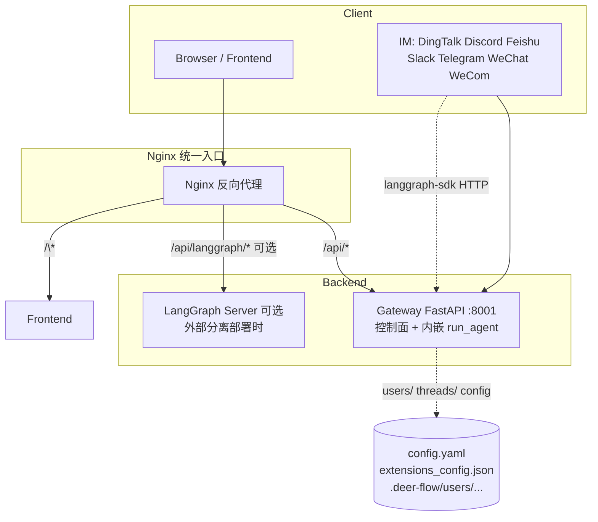

> **维护说明**：与 [APP_PACKAGE_AND_AGENT_ECOSYSTEM_zh.md](APP_PACKAGE_AND_AGENT_ECOSYSTEM_zh.md) 内容同步；两文件应保持一致。

# DeerFlow `app` 包：模块结构、方案设计与实现原理

本文说明 **`backend/app` 如何组织**（Gateway + IM Channels）、**与 Harness / LangGraph 的边界**、**请求怎样变成 Agent Run**，并保留与 **开源 Agent 形态** 的对照表。

**与 Harness 的关系**：`packages/harness/deerflow` 的深度设计（`ThreadState`、中间件全链、Skills、沙箱、`task` 子 Agent、MCP deferred、`memory.json` 等）集中在 **[DEERFLOW_FRAMEWORK_QA_ARCHIVE.md](DEERFLOW_FRAMEWORK_QA_ARCHIVE.md)**。本文只覆盖 **`app` 包**：**控制面 API、Run/SSE 编排、线程元数据 Store、IM 适配**；**不**重复解释图内推理细节。

---

## 0. 包定位与架构边界

| 层 | 职责 | 典型代码 / 进程 |
|----|------|-----------------|
| **前端** | UI、`useStream`、配置台 | `frontend` |
| **反向代理** | 路径分流：静态、`/api/*` → Gateway；可选 `/api/langgraph/*` → 独立 LangGraph | Nginx 等 |
| **`app`（Gateway）** | FastAPI：**Auth**、**模型/MCP/memory/skills/agents 管理**、**线程与产物 API**、**LangGraph Platform 兼容 runs/threads**、**进程内嵌 Agent 运行时**（`RunManager` + `StreamBridge` + `run_agent`） | `uvicorn app.gateway.app:app`（默认 **:8001**） |
| **LangGraph Server（可选第二进程）** | 官方/部署常用的 **独立 Agent 运行时**；本仓库 **默认不依赖** | 常见 `:2024`（仅外部分离部署时） |
| **Harness（`deerflow`）** | `make_lead_agent`、`run_agent`、checkpointer/store 工厂、per-user 路径解析 | 被 Gateway **同进程 import** |

**关键事实（实现层面）**

1. **本仓库默认拓扑：Gateway 即 Agent 运行时**。`lifespan` 初始化 `checkpointer` / `store` / `StreamBridge` / `RunManager`，并在 **同一进程** 内 `run_agent`（`app/gateway/deps.py`、`app/gateway/services.py`）。浏览器与 IM 均通过 Gateway 的 **`/api/threads/.../runs`** 等兼容 API 驱动对话。
2. **IM 通道默认 `langgraph_url`** 为 **`http://localhost:8001/api`**（`ChannelManager.DEFAULT_LANGGRAPH_URL`），即 **调本机 Gateway**，而非独立 `:2024` LangGraph。外部分离部署时可设 **`DEER_FLOW_CHANNELS_LANGGRAPH_URL`**。
3. **MCP**：Gateway 读写 **`extensions_config.json`**；`PUT /api/mcp/config` 落盘并 **`reload_extensions_config`**；Harness 侧 **`get_cached_mcp_tools`** 按配置 **mtime** 自动失效重载。
4. **用户隔离**：线程、memory、自定义 agent 目录在 **`{base_dir}/users/{user_id}/`** 下（`config/paths.py`）；Gateway Auth 中间件设置 `user_context`。

---

## 1. 系统上下文（与 Gateway / LangGraph 的关系）

典型部署：**浏览器**经 **Nginx** 分流到 Gateway；**Gateway** 同时承担控制面 API 与 **内嵌 Agent 运行时**；**IM（`app/channels`）** 经 **langgraph-sdk（HTTP）** 调 Gateway 的 **`/api`** runs API（默认 `http://localhost:8001/api`）。



---

## 2. `backend/app` 目录结构

```
app/
├── gateway/                    # FastAPI Gateway
│   ├── app.py                  # create_app()、lifespan、路由挂载
│   ├── config.py               # GatewayConfig（host/port/CORS，环境变量）
│   ├── deps.py                 # langgraph_runtime、get_stream_bridge / run_manager / checkpointer / store
│   ├── services.py             # Run 生命周期、SSE 帧格式、build_run_config、与 Harness 对接
│   ├── path_utils.py           # 线程虚拟路径 → 磁盘路径（委托 get_paths().resolve_virtual_path）
│   └── routers/                # 薄 HTTP 层，业务进 services 或 deerflow.*
│       ├── models.py
│       ├── mcp.py
│       ├── memory.py
│       ├── skills.py
│       ├── artifacts.py
│       ├── uploads.py
│       ├── threads.py          # 线程 CRUD、state、search；Store namespace ("threads",)
│       ├── agents.py
│       ├── suggestions.py
│       ├── channels.py
│       ├── auth.py             # /api/v1/auth（登录、会话、CSRF）
│       ├── feedback.py         # /api/threads/{id}/runs/{run_id}/feedback
│       ├── assistants_compat.py
│       ├── thread_runs.py      # POST …/threads/{id}/runs/stream|wait|…
│       └── runs.py             # POST /api/runs/stream|wait（无预建 thread 也可）
└── channels/                   # IM 集成（与 Gateway 同进程，lifespan 启动）
    ├── service.py              # ChannelService 单例、注册表、from_app_config
    ├── manager.py              # 消费 MessageBus、调 LangGraph SDK、与 Gateway Run 参数对齐
    ├── message_bus.py
    ├── store.py
    ├── base.py
    ├── commands.py
    └── dingtalk.py / discord.py / feishu.py / slack.py
        telegram.py / wechat.py / wecom.py
```

---

## 3. Gateway 方案设计：分层与职责

### 3.1 `create_app` 与路由挂载

- **`app/gateway/app.py`**：`FastAPI(..., lifespan=lifespan)`，按 **功能域** `include_router`，**不在此文件写业务逻辑**。
- **OpenAPI tags** 与 `/docs` 分组一一对应，便于前端与运维识别。

### 3.2 `lifespan`：启动顺序

1. **`get_app_config()`**（`deerflow.config.app_config`）：加载 **Harness 级**配置；失败则 **直接抛错**，Gateway 不半启动。
2. **`async with langgraph_runtime(app)`**（`deps.py`）：向 **`app.state`** 注入  
   `stream_bridge`、`checkpointer`、`store`（可为空上下文）、`run_manager`。  
   使用 **`AsyncExitStack`** 管理异步上下文，保证关闭时释放连接。
3. **`start_channel_service()`**（可选）：从 **`config.yaml` 的 `channels` 节**（经 `AppConfig.model_extra`）读配置；失败 **记日志不致命**，避免无 IM 时启动失败。
4. **shutdown**：`stop_channel_service()`，再退出 `langgraph_runtime`。

### 3.3 `deps.py`：依赖注入约定

- **初始化**：仅 **`langgraph_runtime`** 写入 `app.state`。
- **读侧**：`get_stream_bridge` / `get_run_manager` / `get_checkpointer` 在缺失时 **`HTTP 503`**；`get_store` **允许 None**（部分功能降级）。

### 3.4 Routers vs `services.py`

| 层级 | 职责 |
|------|------|
| **`routers/*.py`** | 校验 Pydantic body、取 `Request`、调 **`services`** 或 **`deerflow.*`**、返回 `StreamingResponse` / JSON。 |
| **`services.py`** | **Run 编排**：`start_run`、`sse_consumer`、`format_sse`（与 **LangGraph Platform SSE** 字段顺序对齐，供 `useStream` / `langgraph-sdk` 解析）、`build_run_config`、`normalize_input`、`resolve_agent_factory`（统一 **`make_lead_agent`**）。 |
| **`path_utils.py`** | 线程沙箱虚拟路径解析，**禁止越权**（`ValueError` → 400/403）。 |

**设计意图**：HTTP 形状变化只改 router；**与 LangGraph SDK 的 wire 协议**集中在 `services.py`，避免多处复制 SSE 格式。

### 3.5 Run / Thread 与 Harness 的衔接

- **`resolve_agent_factory`**：当前 **无论 `assistant_id` 为何**，工厂均为 **`make_lead_agent`**；**自定义顾问**通过 **`configurable["agent_name"]`** 注入（与 `build_run_config` 内对 `assistant_id` 的规范化一致）。**ChannelManager** 侧有同类逻辑，保证 **HTTP API 与 IM 行为一致**（`services.py` 注释明示）。
- **`build_run_config`**：合并 **`thread_id`**、客户端 **`configurable` / `context`**（LangGraph ≥0.6 若同传二者会 **优先 `context`** 并打日志）、**`metadata`**；非默认 **`assistant_id`** 时写入 **`agent_name`**。
- **`RunCreateRequest.context`**（DeerFlow 扩展）：仅白名单键写入 **`configurable`**（`model_name`、`mode`、`thinking_enabled`、`reasoning_effort`、`is_plan_mode`、`subagent_enabled`、`max_concurrent_subagents`）。
- **线程在 Store 中的可见性**：`start_run` 内可对 **Store** 做 **`_upsert_thread_in_store`**，使 **从未 POST /threads 的 stateless run** 仍出现在 **`/threads/search`**。
- **标题同步**：`TitleMiddleware` 把标题写在 **checkpoint**；Gateway 在 run 结束后 **`_sync_thread_title_after_run`** 读 checkpoint、回写 Store 的 **`values.title`**（与 `threads` router 协作，**非致命**失败）。

---

## 4. IM Channels 实现要点

- **`ChannelService`**（`channels/service.py`）：从 **`get_app_config()` → `model_extra["channels"]`** 读配置；**`_CHANNEL_REGISTRY`** 做 **渠道名 → import 路径** 懒加载；组合 **`MessageBus` + `ChannelStore` + `ChannelManager`**。
- **`ChannelManager`**（`channels/manager.py`）：从 Bus 取 **入站消息**，用 **httpx + langgraph-sdk** 调 **`langgraph_url`**（默认 **`http://localhost:8001/api`**，即本机 Gateway）；**`gateway_url`** 用于拉取附件等（默认 `http://localhost:8001`）。可通过 **`DEER_FLOW_CHANNELS_LANGGRAPH_URL`** / **`DEER_FLOW_CHANNELS_GATEWAY_URL`** 覆盖。**会话级默认 Run 配置**（如 `thinking_enabled`、`is_plan_mode`）与 **每渠道覆盖** 在 manager 内合并。
- **与 Gateway Run 的一致性**：解析 **`assistant_id` / `agent_name`**、冲突策略（如 thread busy）等与 **`build_run_config`** 叙事对齐，避免 **同一产品两套参数语义**。
- **能力差异**：`CHANNEL_CAPABILITIES` 标记 **是否支持流式** 等（Feishu/WeCom vs Slack/Telegram）。

---

## 5. 原理层：内嵌运行时与可选分进程、配置为何落盘

1. **默认：Gateway 内嵌运行时**  
   本仓库 **单进程** 完成 runs/SSE/checkpoint，降低本地与单机部署复杂度。需要 **独立扩缩容** 时，可将 Nginx 的 `/api/langgraph/*` 指到外部 LangGraph，并设置 IM 的 **`DEER_FLOW_CHANNELS_LANGGRAPH_URL`**。

2. **MCP 与工具缓存**  
   Gateway **不在启动时**预连 MCP；**`extensions_config.json`** 为 SSOT。`PUT /api/mcp/config` 写盘 + reload；下次 `get_cached_mcp_tools` 检测 **mtime** 后重载（**通常无需重启**）。

3. **文件作为集成平面 + per-user 隔离**  
   `config.yaml`、extensions、`users/{user_id}/threads/`、skills：**可审计、可回滚**；Auth 启用后 memory/agent 数据按 **`user_id`** 分桶（`DEFAULT_USER_ID = "default"` 为未登录回退）。

更细的 ThreadState、中间件顺序、子 Agent 无独立 checkpoint 等见 **[DEERFLOW_FRAMEWORK_QA_ARCHIVE.md](DEERFLOW_FRAMEWORK_QA_ARCHIVE.md)**（§3、§7、§9 等）。

---

## 6. API 路由速查（与实现文件）

| 区域 | Router 模块 | 前缀 / 说明 |
|------|-------------|----------------|
| 模型 | `routers/models.py` | `/api/models` |
| MCP | `routers/mcp.py` | `/api/mcp` |
| Memory | `routers/memory.py` | `/api/memory` |
| Skills | `routers/skills.py` | `/api/skills` |
| Artifacts | `routers/artifacts.py` | `/api/threads/{id}/artifacts` |
| Uploads | `routers/uploads.py` | `/api/threads/{id}/uploads` |
| Threads | `routers/threads.py` | `/api/threads`（CRUD、state、search、Store） |
| Agents | `routers/agents.py` | `/api/agents`（`SOUL.md`、`config.yaml`） |
| Suggestions | `routers/suggestions.py` | `/api/threads/{id}/suggestions` |
| Channels | `routers/channels.py` | `/api/channels` |
| Assistants 兼容 | `routers/assistants_compat.py` | LangGraph Platform stub |
| Runs（线程内） | `routers/thread_runs.py` | `/api/threads/{id}/runs/...` |
| Runs（无状态） | `routers/runs.py` | `/api/runs/stream`、`/wait` |
| Auth | `routers/auth.py` | `/api/v1/auth/*`（登录、注册、CSRF cookie） |
| Feedback | `routers/feedback.py` | `/api/threads/{id}/runs/{run_id}/feedback` |
| 健康 | `app.py` 内联 | `GET /health` |

**Auth**：`AuthMiddleware` 对非公开路径 **fail-closed**；IM 内部调用使用 **`internal_auth`** 头绕过浏览器 CSRF。

**CORS**：注释说明由 **Nginx** 处理，FastAPI 侧不叠一层（避免重复）。

---

## 7. 分析维度：主 Agent、子 Agent、工具与数量

| 维度 | 含义 | 常见实现 |
|------|------|----------|
| **主 Agent** | 用户对话的默认入口，持有主线程状态与工具绑定 | 单图 `create_agent`、或编排器选模型 |
| **子 Agent** | 独立上下文或独立循环的推理单元 | 第二 agent 实例、子图、远程会话 |
| **用 Tool 调 Agent** | 主模型通过 **function calling** 触发委派 | `task(...)`、`delegate_to_agent`、spawn 等 |
| **固定数量** | 角色在代码或配置里 **枚举** | 多类 `XxxAgent`、固定 crew |
| **动态数量** | 运行时按任务 **spawn** | 多 `task` 调用、多 session |

**DeerFlow（本仓库）**

- **主 Agent**：由 **`make_lead_agent`** 构建的 **lead**；Run 由 Gateway **`run_agent`** 驱动。  
- **子 Agent**：`subagent_enabled` 时 **`task` 工具** → **同进程**第二 `create_agent`，结果 **`ToolMessage`** 回主会话（非第二张独立「注册图」）。详见 **[DEERFLOW_FRAMEWORK_QA_ARCHIVE.md](DEERFLOW_FRAMEWORK_QA_ARCHIVE.md) §7**。  
- **数量**：由模型 **`task` 调用次数**决定；**`SubagentLimitMiddleware`** 等约束并发。  
- **`app` 包**：**不实现**图内工具逻辑；负责 **HTTP/SDK 形态、线程与元数据、IM 接入**。

---

## 8. 代表开源项目（高活跃 / 常被对比）

以下名称以社区常用仓库为准；**架构会迭代**，请以官方 README / `ARCHITECTURE.md` 为准。

### 8.1 [OpenClaw](https://github.com/openclaw/openclaw)

- **形态**：自托管 Agent，强调 **Gateway 控制面**、多通道；配置多 **Markdown 化**。  
- **主/子**：社区有 **多会话 / subagents / spawn** 等讨论；偏 **控制面动态会话**，与 DeerFlow **单图 + `task`** 不同栈。

### 8.2 [OpenManus](https://github.com/FoundationAgents/OpenManus)

- **形态**：Python **多 Agent 类** + **统一 Tool 层**。  
- **主/子**：**Manus** 协调 + **Planning / ReAct** 等阶段，偏 **固定角色类枚举**。

### 8.3 爬虫向 Agent（如 [Crawl4AI](https://github.com/unclecode/crawl4ai) 周边）

- **形态**：多为 **单 ReAct + 浏览器/抓取 Tool** 或 **流水线**。  
- **主/子**：通常 **不等价**于 DeerFlow 的 **`task` 子图**。

### 8.4 其他极简对照

| 项目 / 类型 | 主入口 | 子 Agent 常见形态 | 扩展方式 |
|-------------|--------|-------------------|----------|
| **LangGraph / Deep Agents** | 单图或多图 | 子图、`task`、middleware | 图组合、工具 |
| **AutoGen / CrewAI** | 多角色 | 固定或多角色 + 编排 | 角色、流程 DAG |
| **OpenHands / SWE-agent** | 仓库任务 | 单主循环 + 环境工具 | 沙箱 + 工具集 |

---

## 9. 对照小结表

| 项目 | 更像「主 Agent」 | 子 Agent / 并行 | 是否主要靠「Tool 调另一个 Agent」 |
|------|------------------|-----------------|-----------------------------------|
| **DeerFlow** | LangGraph lead（`make_lead_agent`） | 可选：`task` → 第二 `create_agent` | **是**（`task` 工具） |
| **OpenClaw** | Gateway 下会话/身份 | spawn / subagents（以上游为准） | **偏 RPC/会话原语** |
| **OpenManus** | Manus 协调 | 多 **Agent 类** | **工具层 + 类继承** |
| **Crawl4AI + Agent 示例** | 单 ReAct 或薄编排 | 少数多工具示例 | **多为 Tool** |

---

## 10. 相关文档

- **[DEERFLOW_FRAMEWORK_QA_ARCHIVE.md §4.3](DEERFLOW_FRAMEWORK_QA_ARCHIVE.md#lead-prompt-full-chain)** — Lead Agent：**system / tools / messages** 全链路（与 `SYSTEM_PROMPT_*.md` 快照对照）；Deep Agents 对照见同文 **§11.3.1** / **§9.9**。  
- **[DEERFLOW_FRAMEWORK_QA_ARCHIVE.md](DEERFLOW_FRAMEWORK_QA_ARCHIVE.md)** — Harness：`task`、Skills、`ThreadState`、中间件、Sandbox、MCP、`memory.json`；**§11.5** 范式词典；**§11.6–11.8** gstack / OpenSandbox。  
- **`backend/docs/ARCHITECTURE.md`**、**`CLAUDE.md`** — 仓库级总览（若与本文冲突以代码为准）。

---

## 11. 维护说明

- 第三方仓库链接与架构描述 **非 DeerFlow 官方承诺**；引用时请核对目标仓库版本。  
- **`app/gateway/app.py` 增删 `include_router`** 时：请同步更新本文 **§6 路由表** 与 **§2 目录结构**。  
- **`channels/service.py` 的 `_CHANNEL_REGISTRY`** 新增渠道时：更新 **§2** 与 **§1** 图中 IM 列表（如有需要）。
