# DeerFlow `app` 包：架构、分层与端到端链路

本文回答三个问题：**`backend/app` 是干什么的？内部分几层？用户一句话怎样变成 Agent 回复？**

图内推理（中间件、`task` 子 Agent、Sandbox、MCP 工具实现）见 **[DEERFLOW_FRAMEWORK_QA_ARCHIVE.md](DEERFLOW_FRAMEWORK_QA_ARCHIVE.md)**。本文只讲 **`app` 包** 及其在整条链路中的位置。

---

## 阅读地图

| 你想搞清楚… | 看哪一节 |
|-------------|----------|
| app 一句话定位 | **§0** |
| **服务启动时初始化什么、顺序如何** | **§2.5** |
| **IM 消息端到端（逐步、不省略核心路径）** | **§5.1–§5.3** |
| **关键类职责 + 与 OpenHarness 对比文档对齐** | **§3、§3.1** |
| 浏览器完整链路 | **§1、§4** |
| app 内部分层、谁调谁 | **§2** |
| Gateway 启动与 Run 编排细节 | **§9** |
| app 与 Harness 边界 | **§6** |
| HTTP 路由列表 | **§12** |
| 与 OpenClaw 等开源形态对照 | **§14–§15** |

---

## §0 三十秒：`app` 到底干什么？

**`app` = DeerFlow 的「产品接入层」**，不是 Agent 大脑本身。

```text
用户（浏览器 / 钉钉 / Telegram …）
        ↓
   app 包接住请求
        ↓  鉴权、线程元数据、LangGraph Platform 兼容 API、SSE 推流
   deerflow.runtime.run_agent（同进程）
        ↓  后台 asyncio 任务
   make_lead_agent → LangGraph 图（中间件 + 工具 + LLM）
        ↓
   回复经 StreamBridge → SSE / IM 出站
```

| 包 | 类比 | 职责 |
|----|------|------|
| **`app`** | 机场柜台 + 登机口 | HTTP/IM 接入、用户与线程管理、把请求翻译成一次 **Run** |
| **`deerflow`（Harness）** | 飞机与机组 | 构图、`run_agent` 执行图、checkpoint、工具与沙箱 |
| **`frontend`** | 乘客手机 App | UI、`useStream` 消费 SSE |

**默认部署事实**：**没有单独的 LangGraph Server 进程**。`uvicorn app.gateway.app:app`（`:8001`）在 `lifespan` 里启动 checkpointer / `RunManager` / `StreamBridge`，并在同进程 `import` 后调用 `run_agent`。Nginx 把 `/api/langgraph/*` 重写到 Gateway 的 `/api/*`，所以前端 SDK 以为在调 LangGraph Platform，实际仍是 Gateway。

**依赖方向（硬边界）**：`app → deerflow` 允许；`deerflow → app` **禁止**（`tests/test_harness_boundary.py` 在 CI 强制执行）。

### 0.1 Gateway 与 Agent：几个进程？怎么调用？

| 路径 | 进程 | 调用方式 |
|------|------|----------|
| **Web UI → Run** | **1**（同 uvicorn） | `services.start_run` → **`asyncio.create_task(run_agent(...))`**，Python 直接调用 |
| **IM → Run** | **1**（同上） | `ChannelManager` → **`langgraph-sdk` HTTP** → `localhost:8001/api`（本机环回） |
| **外部分离 LangGraph**（可选） | **2+** | IM/Web 可指到独立 `:2024` |

IM 走 HTTP **不是**第二个 Agent 进程，而是刻意与 Web **共用同一套 Run API**。

---

## §1 端到端链路：一句话如何变成回复

### 1.1 两条入口，一条 Run 管道

浏览器和 IM **最终都走同一套 Run API**（`POST …/runs/wait` 或 `…/stream`）。  
**区别不在 Gateway 内部，而在「谁当 HTTP 客户端、谁读响应、谁写回用户界面」。**

#### 1.1.1 先记住：Gateway 不会主动「推回 IM」

| 误解 | 实际 |
|------|------|
| Gateway 跑完后 HTTP 回调 Channel | ❌ 没有这种 webhook |
| Gateway 把 response 发给 IM 平台 | ❌ Gateway 只 **响应** 当前 HTTP 请求 |
| IM 写回靠 Gateway 再发 HTTP | ❌ 写回是 **ChannelManager 读第一条 HTTP 的 body/SSE**，再 `bus → Channel.send()` 调钉钉/飞书 API |

**IM 路径**：`ChannelManager` 与 `Gateway` 在 **同一 uvicorn 进程**；Manager 用 `langgraph-sdk` 当 **HTTP 客户端** 调 `localhost:8001/api`，在 **同一次请求** 里拿到 Agent 结果。

#### 1.1.2 浏览器 vs IM（文字对照）

```text
【浏览器】
  Frontend → POST …/runs/stream（浏览器持有一条 HTTP 长连接）
          → Gateway start_run → run_agent → StreamBridge
          → SSE 沿 **同一条 HTTP** 回到浏览器 → useStream 渲染

【IM 写回 — 三步】
  ① 入站（不经 Gateway HTTP）
     IM 平台 → Channel → bus.publish_inbound → ChannelManager

  ② 要 Agent 回答（经 Gateway HTTP，Manager 当客户端）
     ChannelManager → langgraph-sdk POST …/runs/wait|stream
                    → Gateway start_run → run_agent → StreamBridge
                    → JSON 或 SSE 沿 **Manager 发起的 HTTP** 回到 Manager

  ③ 写回 IM 平台（不经 Gateway HTTP）
     Manager 解析 text → bus.publish_outbound
                      → Channel._on_outbound → channel.send()
                      → 调飞书/钉钉 Open API → 用户看到消息
```

#### 1.1.3 协作图（同一进程内的 localhost 环回）

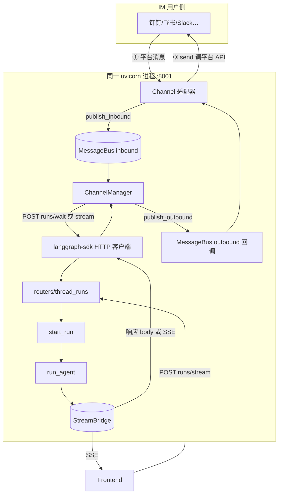

**读图要点**

1. **一个大框 = 一个进程**；`SDK → RT` 是 **127.0.0.1 环回**，不是第二个服务。  
2. Gateway **不主动找 IM**；是 Manager **await** 自己发出去的那条 HTTP 的响应。  
3. 旧图 `CH_MGR → IM` 易误解为「Gateway 推给 IM」——实际是 **Channel 调外部平台 API**。

#### 1.1.4 Gateway 如何把 response 交给调用方？

| 模式 | Gateway 返回什么 | IM 侧如何拿到 |
|------|------------------|---------------|
| **wait** | HTTP 200 + JSON（最终 checkpoint state） | `result = await client.runs.wait(...)` |
| **stream** | HTTP 200 + SSE 流 | `async for chunk in client.runs.stream(...)` |

Web 与 IM **共用** `start_run` + `run_agent` + `StreamBridge`；只是 **谁打开 HTTP 连接读响应** 不同。

**写回源码锚点**：`manager.py` `runs.wait` L944 / `runs.stream` L1013 → `publish_outbound` L990 → `base.py` `_on_outbound` → `send()`

### 1.2 一次 Run 的 8 个阶段（与代码对应）

| 阶段 | 做什么 | 关键代码 |
|------|--------|----------|
| 1. 接入 | 校验 body、Auth、线程归属 | `routers/thread_runs.py` → `start_run` |
| 2. 登记 Run | 创建 `RunRecord`、冲突策略（409） | `RunManager.create_or_reject` |
| 3. 拼配置 | `thread_id`、`context`（model/plan/subagent）、`agent_name` | `build_run_config`、`merge_run_context_overrides` |
| 4. 启后台任务 | 不阻塞 HTTP 响应体 | `asyncio.create_task(run_agent(...))` |
| 5. 构图执行 | `make_lead_agent` + `graph.astream` | `runtime/runs/worker.py` |
| 6. 推事件 | values / messages-tuple 等 | `StreamBridge.publish` |
| 7. 流式返回 | LangGraph Platform 兼容 SSE | `sse_consumer` → `format_sse` |
| 8. 收尾 | checkpoint 落盘、线程标题、run 状态 | worker `finally`、thread_store |

**`app` 负责 1–4、6–7 的「外壳」；阶段 5 的「大脑」在 Harness，但由 `app/gateway/services.py` 触发。**

---

## §2 分层架构（`app` 内部 + 边界）

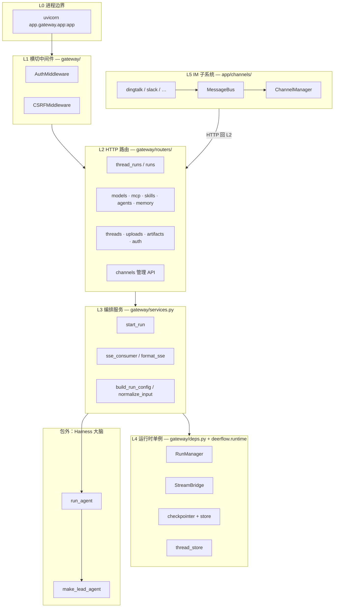

### 2.1 各层职责表

| 层 | 目录 | 职责 | **不**做什么 |
|----|------|------|-------------|
| **L1** | `gateway/*middleware*` | 登录态、`user_id`、CSRF | 不跑 LLM |
| **L2** | `gateway/routers/` | Pydantic 校验、HTTP 状态码 | 不写 SSE 格式、不构图 |
| **L3** | `gateway/services.py` | Run 生命周期、与 LangGraph SDK **线协议对齐** | 不实现工具/中间件 |
| **L4** | `deps.py` + `deerflow.runtime` | 单例引擎、持久化、事件桥 | 不知道 DingTalk 消息格式 |
| **L5** | `channels/` | IM 入站/出站、附件、会话键 | **不**直接 `make_lead_agent`（走 HTTP） |
| **包外** | `deerflow.agents.*` | ReAct 循环、工具、记忆注入 | 不 import `app` |

### 2.2 控制面 vs 数据面（帮助理解「作用」）

| 类型 | 由 `app` 提供 | 例子 |
|------|---------------|------|
| **控制面** | 配置与元数据 CRUD | `PUT /api/mcp/config`、`GET /api/agents`、`/api/threads/search` |
| **数据面** | 一次对话的执行与推流 | `POST …/runs/stream` → `run_agent` → SSE |

MCP / skills / memory 的 **内容**在 Harness 消费；Gateway 负责 **落盘路径、权限、触发 reload**，让 Harness 下次 run 读到新配置。

---

## §2.5 服务启动初始化全流程（Gateway + Runtime + Channel）

入口：`uvicorn app.gateway.app:app` → `create_app()` → **`lifespan()`**（`app/gateway/app.py`）。

### 2.5.1 启动顺序总览

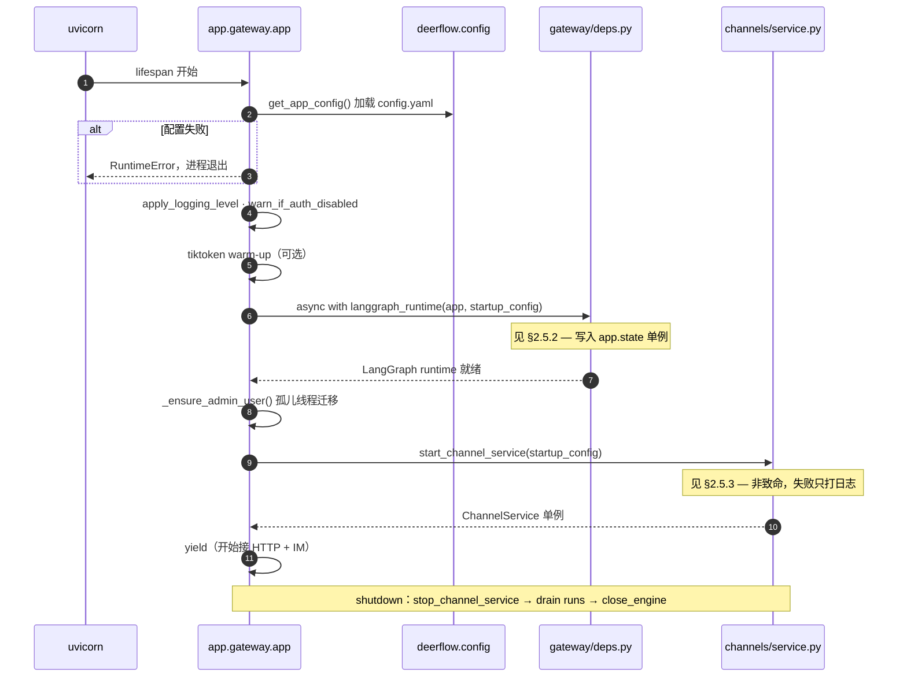

### 2.5.2 `langgraph_runtime` 内部（`gateway/deps.py`）

按 **实际代码顺序** 初始化；全部挂在 **`app.state`**，供 `get_run_context()` 读取。

| 步骤 | 写入 `app.state` | 作用 |
|------|------------------|------|
| 1 | `stream_bridge` | Run 事件 pub/sub，SSE 消费者订阅 |
| 2 | （副作用）`init_engine_from_config` | SQL 引擎（sqlite/postgres） |
| 3 | `checkpointer` | LangGraph checkpoint 持久化 |
| 4 | `store` | LangGraph Store（线程 metadata 等） |
| 5 | `run_store` / `feedback_repo` | Run 记录、反馈（SQL 或 MemoryRunStore） |
| 6 | `thread_store` | 线程列表/search 元数据 |
| 7 | `run_event_store` + `run_events_config` | Run 事件日志 / token 统计 |
| 8 | `run_manager` | Run 生命周期、并发策略、orphan recovery |

**并行关系**：此时 **尚未** 启动 IM；但 HTTP 已可在 `yield` 后接受 `POST …/runs`（Web 路径）。

### 2.5.3 `ChannelService` 启动（`channels/service.py`）

在 `langgraph_runtime` **之后**调用（需要 Gateway 已监听 Run API）。

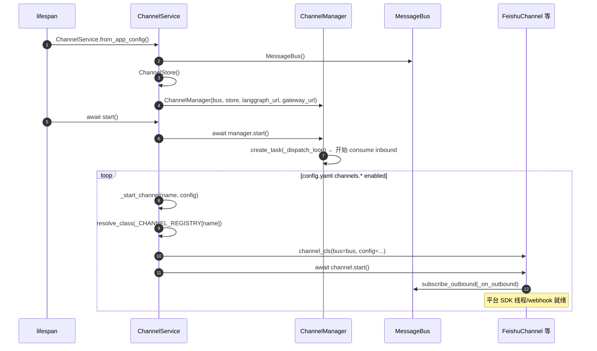

| 步骤 | 代码 | 说明 |
|------|------|------|
| 读配置 | `AppConfig.model_extra["channels"]` | `config.yaml` 里 `channels.feishu.enabled` 等 |
| 先启 Manager | `await manager.start()` | **`_dispatch_loop`** 后台 task，阻塞等 `bus.get_inbound()` |
| 再启各 Channel | `_start_channel` | 7 个注册名见 `_CHANNEL_REGISTRY` |
| 单例 | `start_channel_service` → `_channel_service` | `get_channel_service()` 供 Manager 查 streaming 能力 |

**Shutdown**（逆序）：各 `channel.stop()` → `manager.stop()`（取消 dispatch loop）→ `langgraph_runtime` finally 里 drain runs。

### 2.5.4 启动后进程内并行任务

```text
同一 uvicorn 进程内（yield 之后）至少存在：

  ① FastAPI 主 event loop     — 处理 HTTP（Web Run、配置 API）
  ② ChannelManager._dispatch_loop — asyncio.Task，消费 MessageBus inbound
  ③ 各 Channel 平台线程       — 如 Feishu lark WS 在独立 thread（feishu.py _run_ws）
  ④ 每次 Run                  — asyncio.create_task(run_agent) 临时任务
```

---

## §3 类图、引用关系与关键类职责

> 与 **[OpenHarness 09-channels.md §6.8.3、§6.7](../../../OpenHarness/docs/framework-comparison/09-channels.md#683-deer-flow)** 描述 **一致**；本文以 **当前 `deer-flow/backend` 源码** 为准。若冲突，**以源码 + 本文** 为准。

### 3.1 关键类职责速查（IM + Gateway）

| 类 | 文件 | 职责（一句话） | 与 nanobot 差异 |
|----|------|----------------|-----------------|
| **`MessageBus`** | `channels/message_bus.py` | 入站 `asyncio.Queue` + 出站 callback 列表 | 同 nanobot 双队列思想；deer-flow 出站用 **subscribe 广播** |
| **`InboundMessage`** | 同上 | 平台 → 调度器的标准入站 DTO | 含 `topic_id` 映射 DeerFlow thread |
| **`OutboundMessage`** | 同上 | 调度器 → 平台的标准出站 DTO | 含 `thread_id`、artifacts、attachments |
| **`Channel`** | `channels/base.py` | 抽象适配器：`start/stop/send` | nanobot 叫 `BaseChannel` |
| **`ChannelStore`** | `channels/store.py` | IM `(channel, chat_id, topic)` → `thread_id` JSON 映射 | nanobot 无对等类（会话键在 AgentLoop） |
| **`ChannelManager`** | `channels/manager.py` | **消费 inbound** + 调 langgraph-sdk + **publish outbound** | nanobot 的 CM **只 consume outbound**；入站由 `AgentLoop` 吃 |
| **`ChannelService`** | `channels/service.py` | 读 config、启 Manager、懒加载 7 个 Channel | 对应 nanobot gateway 启动里的 registry + start_all |
| **`RunManager`** | `deerflow/runtime/runs/manager.py` | Run 登记、409 冲突、cancel、状态 | Harness，被 Gateway `start_run` 使用 |
| **`StreamBridge`** | `deerflow/runtime/stream_bridge/` | run_id 事件桥，SSE 订阅端 | Harness |
| **`start_run`** | `gateway/services.py` | HTTP → `create_task(run_agent)` | Web 路径 **不**经 MessageBus |
| **`run_agent`** | `deerflow/runtime/runs/worker.py` | `make_lead_agent` + `astream` + publish | Harness 大脑执行体 |

**deer-flow 的 Bus 走向**（与 OpenHarness §6.7 一致）：

```text
入站:  Channel.start() → bus.publish_inbound → ChannelManager._dispatch_loop → get_inbound
出站:  ChannelManager → bus.publish_outbound → 各 Channel._on_outbound → send()
Agent: ChannelManager → langgraph-sdk HTTP → Gateway start_run → run_agent（同进程）
```

### 3.2 完整类图（channels + gateway 协作）

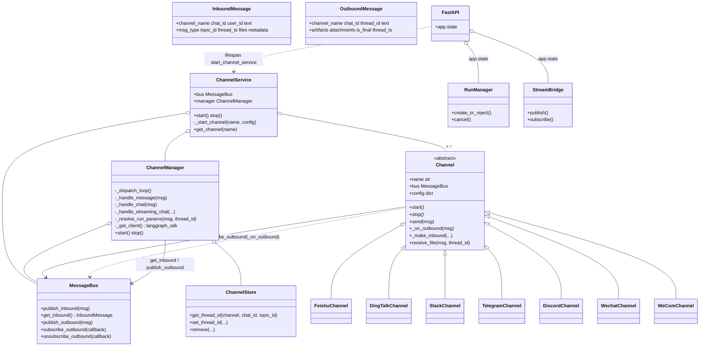

### 3.3 引用关系（启动后对象树）

```text
lifespan()
├── langgraph_runtime → app.state
│     ├── stream_bridge
│     ├── checkpointer / store
│     ├── run_manager ←── services.start_run / run_agent
│     └── thread_store
│
└── start_channel_service() → 全局 _channel_service
      ├── MessageBus (单例)
      ├── ChannelStore → .deer-flow/channels/store.json
      ├── ChannelManager(bus, store)
      │     └── asyncio.Task: _dispatch_loop
      └── dict[name → Channel实例]
            └── 每个 Channel: bus.subscribe_outbound(_on_outbound)
```

**注册表**（静态，非 entry_points）：

```python
# channels/service.py
_CHANNEL_REGISTRY = {
    "dingtalk": "app.channels.dingtalk:DingTalkChannel",
    "discord":  "app.channels.discord:DiscordChannel",
    "feishu":   "app.channels.feishu:FeishuChannel",
    ...
}
```

### 3.4 Gateway Run 路径类协作（Web，不经 MessageBus）

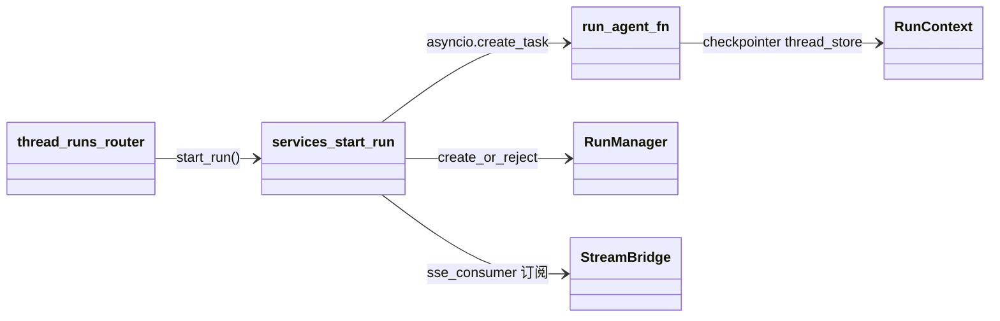

---

## §4 时序图 A — 浏览器一次流式对话

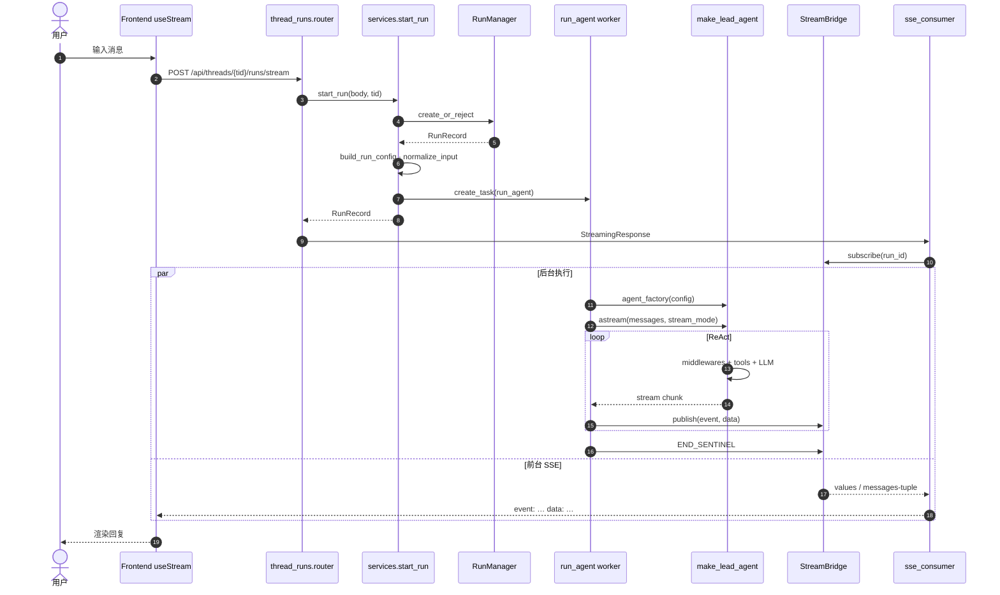

**源码锚点**

| 步骤 | 文件 | 符号 |
|------|------|------|
| HTTP 入口 | `app/gateway/routers/thread_runs.py` | `create_run_stream` |
| 启 Run | `app/gateway/services.py` | `start_run` L278+ |
| 后台图执行 | `packages/harness/deerflow/runtime/runs/worker.py` | `run_agent` L124+ |
| SSE 格式 | `app/gateway/services.py` | `format_sse` L47+ |

---

## §5 IM 消息端到端（核心路径逐步）

IM 与 OpenHarness 文档 §6.7 一致：**`ChannelManager` 是 inbound 消费者**；出站由各 Channel 订阅 `bus.subscribe_outbound`；Agent 执行走 **langgraph-sdk → Gateway HTTP → `run_agent`**（同进程环回）。

### 5.1 总览：从平台消息到用户看到回复

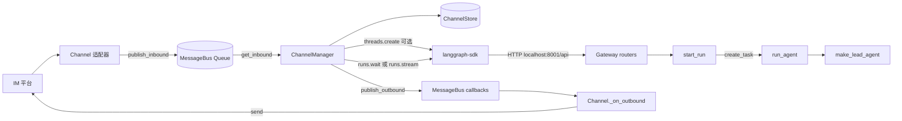

### 5.2 逐步清单（非流式 `runs.wait` 路径，如 Slack/Telegram）

| # | 步骤 | 执行者 | 代码位置 |
|---|------|--------|----------|
| 1 | 平台推送消息（webhook / WS / 长轮询） | `FeishuChannel` 等 | 如 `feishu.py` `_on_message` |
| 2 | 封装 `InboundMessage`（含 `chat_id`、`user_id`、`topic_id`） | Channel | `base._make_inbound` |
| 3 | **`await bus.publish_inbound(msg)`** | Channel | `message_bus.py` |
| 4 | **`msg = await bus.get_inbound()`** | `ChannelManager._dispatch_loop` | `manager.py` L818+ |
| 5 | **`asyncio.create_task(_handle_message(msg))`** | ChannelManager | 信号量限制并发（默认 5） |
| 6 | **`ChannelStore.get_thread_id(...)`** | ChannelManager | 无映射则下一步建 thread |
| 7 | **`client.threads.create()`**（首次） | langgraph-sdk → Gateway | `manager._create_thread` |
| 8 | **`store.set_thread_id(...)`** 持久化映射 | ChannelStore | `store.json` |
| 9 | **`_resolve_run_params`** → `assistant_id`、`run_config`、`run_context` | ChannelManager | 与 `build_run_config` 对齐 |
| 10 | 附件：`channel.receive_file` + `_ingest_inbound_files` | Channel + Manager | 可能调 `gateway_url` uploads |
| 11 | **`client.runs.wait(thread_id, input={messages:[...]}, context=...)`** | langgraph-sdk → HTTP | `manager._handle_chat` L944 |
| 12 | Gateway **`thread_runs`** → **`start_run`** → **`run_agent`** | 同进程 | `services.py` |
| 13 | **`make_lead_agent` + middleware + tools + LLM** | Harness | `worker.py` |
| 14 | wait 响应 JSON → **`_extract_response_text` / artifacts** | ChannelManager | |
| 15 | 构造 **`OutboundMessage`** | ChannelManager | |
| 16 | **`await bus.publish_outbound(outbound)`** | ChannelManager | |
| 17 | 各 Channel **`_on_outbound`**（匹配 `channel_name`） | Channel | `base.py` |
| 18 | **`await channel.send(msg)`** + 可选 `send_file` | Channel | 回 IM 平台 |

### 5.3 流式路径（Feishu / WeCom）

与 §5.2 相同直到步骤 11，之后：

| # | 步骤 | 说明 |
|---|------|------|
| 11′ | **`client.runs.stream(..., stream_mode=["messages-tuple","values"])`** | `manager._handle_streaming_chat` |
| 12′ | Gateway 返回 **SSE**；sdk 迭代 chunk | 同 Web `sse_consumer` 数据源 |
| 13′ | Manager 合并 delta，节流后 **多次 `publish_outbound`**（`is_final=false`） | `STREAM_UPDATE_MIN_INTERVAL_SECONDS=0.35` |
| 14′ | 最后一包 **`is_final=true`** | Channel 更新平台消息 |

### 5.4 时序图（含 Gateway 内部，不省略 Run）

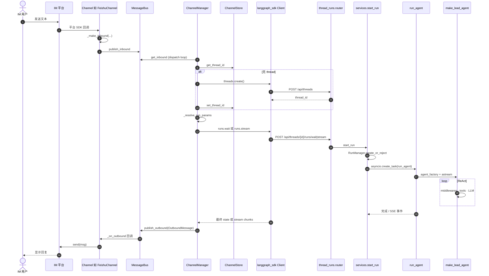

### 5.5 IM 调 Gateway 时的鉴权

`ChannelManager._get_client()` 携带 **`create_internal_auth_headers()`** + CSRF cookie/header（`internal_auth` 系统角色），绕过浏览器 CSRF，与 `AuthMiddleware` 约定一致。

### 5.6 与 §4（浏览器）的差异

| 维度 | 浏览器 §4 | IM §5 |
|------|-----------|-------|
| 入口 | 直接 HTTP POST | MessageBus → ChannelManager → HTTP |
| 触发 `run_agent` | **`start_run` 直接 `create_task`** | 同上，但由 **sdk HTTP** 触发 |
| 响应 | 浏览器读 SSE | Manager 解析 sdk stream/wait → outbound bus |
| 线程映射 | 前端已知 `thread_id` | **`ChannelStore`** 维护 IM 会话键 |

环境变量：`DEER_FLOW_CHANNELS_LANGGRAPH_URL`、`DEER_FLOW_CHANNELS_GATEWAY_URL` 覆盖默认 `http://localhost:8001/api` 与 `http://localhost:8001`。

---

## §6 `app` 与 Harness 边界（最容易混淆）

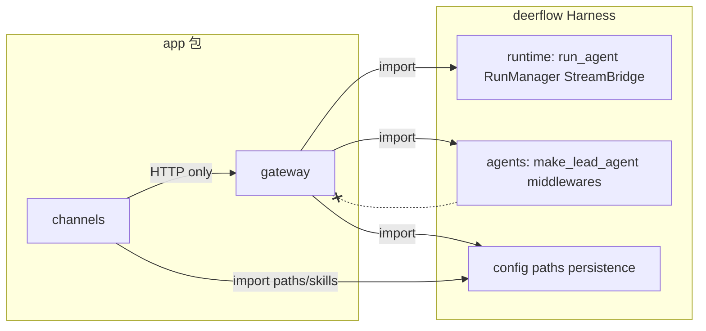

| 问题 | 答案 |
|------|------|
| `run_agent` 算 app 还是 Harness？ | **实现在 Harness**（`deerflow/runtime`），**由 app 的 `start_run` 触发** |
| 为何 runtime 不在 `app/` 里？ | 保持 Harness 可单独测试、可被 `deerflow.client` 等复用；`app` 只是部署入口 |
| IM 为何用 HTTP 调自己？ | 统一 Run 语义；`ChannelManager` 与 `services.build_run_config` 刻意对齐 |
| 自定义 Agent 谁加载？ | Gateway 只把 `assistant_id` → `agent_name` 写入 context；**`make_lead_agent` 读 SOUL.md** |

---

## §7 系统部署上下文

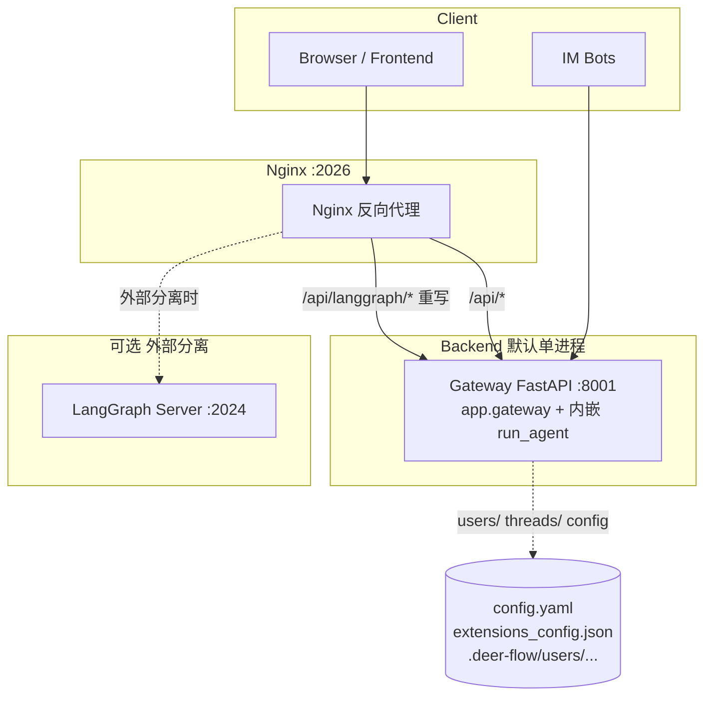

---

## §8 `backend/app` 目录结构

```
app/
├── gateway/                    # FastAPI Gateway（L1–L4）
│   ├── app.py                  # create_app()、lifespan、路由挂载
│   ├── config.py               # GatewayConfig（host/port）
│   ├── deps.py                 # langgraph_runtime、get_run_context
│   ├── services.py             # ★ Run 编排 + SSE 线协议
│   ├── path_utils.py           # 线程虚拟路径 → 磁盘（委托 deerflow.config.paths）
│   └── routers/                # 薄 HTTP（L2）
│       ├── thread_runs.py      # ★ POST …/runs/stream|wait
│       ├── runs.py             # 无预建 thread 的 stateless run
│       ├── threads.py          # 线程 CRUD、search、Store
│       ├── models.py / mcp.py / memory.py / skills.py / agents.py
│       ├── artifacts.py / uploads.py / suggestions.py / channels.py
│       ├── auth.py / feedback.py / assistants_compat.py
└── channels/                   # IM（L5）
    ├── service.py              # ChannelService、_CHANNEL_REGISTRY
    ├── manager.py              # ★ MessageBus → langgraph-sdk
    ├── message_bus.py / store.py / base.py / commands.py
    └── dingtalk.py … wecom.py  # 各平台适配器
```

---

## §9 Gateway 实现要点

### 9.1 `lifespan` 启动顺序（`app/gateway/app.py`）

完整分步见 **§2.5**。摘要：

1. **`get_app_config()`** — Harness 配置；失败则进程不启动。
2. **`langgraph_runtime(app, startup_config)`** — 注入 `stream_bridge`、`checkpointer`、`store`、`run_manager`、`thread_store`（`deps.py`）。
3. **`_ensure_admin_user()`** — 孤儿线程迁移（需 store 已就绪）。
4. **`start_channel_service()`** — 读 `config.yaml` 的 `channels`；失败仅日志，不阻断 Gateway。

### 9.2 `services.py` 核心约定

- **`format_sse`**：字段顺序 `event` → `data` → `id`，对齐 LangGraph Platform / `useStream`。
- **`normalize_input`**：把 Platform 的 `messages` dict 转成 `BaseMessage`，保留 `additional_kwargs`（附件元数据）。
- **`build_run_config`**：`assistant_id` → `agent_name`；与 `ChannelManager._resolve_run_params` **语义一致**。
- **`body.context` 白名单**：`model_name`、`thinking_enabled`、`is_plan_mode`、`subagent_enabled` 等写入 `configurable` + `context`。

### 9.3 Run / Thread 衔接

- **无 POST /threads 的 run** 也会 `_upsert_thread_in_store`，保证 `/threads/search` 可见。
- **标题**：`TitleMiddleware` 写 checkpoint；run 结束后 worker 同步到 `thread_store`。
- **鉴权**：`inject_authenticated_user_context` 把服务端 `user_id` 写入 run context（工具写用户目录时不丢身份）。

---

## §10 IM Channels 要点

- **`ChannelService`**：`config.yaml` → `channels` 节 → 懒加载 `_CHANNEL_REGISTRY`（**7 个**注册渠道，见 §3.3）。
- **启动顺序**：先 `manager.start()`（dispatch loop），再各 `channel.start()`（见 **§2.5.3**）。
- **`ChannelManager`**：唯一 **inbound 消费者**；`runs.wait` / `runs.stream` 经 langgraph-sdk；附件 ingest 可能用 `gateway_url`。
- **`DEFAULT_LANGGRAPH_URL = http://localhost:8001/api`** — 本机 Gateway，不是 `:2024`。
- **`CHANNEL_CAPABILITIES`**：Feishu/WeCom `supports_streaming=True`；其余默认整段 `runs.wait`。
- **出站**：**不**经 Manager 的 send 循环 → `publish_outbound` → 各 Channel 已注册的 `_on_outbound`（与 OpenHarness §6.7 deer-flow 小节一致）。

---

## §11 原理补充

1. **默认单进程**：降低本地部署成本；扩缩容时可外置 LangGraph 并改 `DEER_FLOW_CHANNELS_LANGGRAPH_URL`。
2. **MCP SSOT**：`extensions_config.json`；`PUT /api/mcp/config` 落盘 + reload；Harness `get_cached_mcp_tools` 按 mtime 失效。
3. **用户隔离**：`{base_dir}/users/{user_id}/`（`deerflow.config.paths`）；Auth 关闭时回退 `default`。

---

## §12 API 路由速查

| 区域 | Router | 前缀 |
|------|--------|------|
| 模型 | `models.py` | `/api/models` |
| MCP | `mcp.py` | `/api/mcp` |
| Memory | `memory.py` | `/api/memory` |
| Skills | `skills.py` | `/api/skills` |
| Artifacts | `artifacts.py` | `/api/threads/{id}/artifacts` |
| Uploads | `uploads.py` | `/api/threads/{id}/uploads` |
| Threads | `threads.py` | `/api/threads` |
| Agents | `agents.py` | `/api/agents` |
| Runs | `thread_runs.py` / `runs.py` | `/api/threads/{id}/runs/...`、`/api/runs/...` |
| Auth | `auth.py` | `/api/v1/auth/*` |
| Channels | `channels.py` | `/api/channels` |
| 健康 | `app.py` | `GET /health` |

---

## §13 主/子 Agent 与 `app` 的关系

| 维度 | DeerFlow | **`app` 包角色** |
|------|----------|------------------|
| 主 Agent | `make_lead_agent` | 只通过 `resolve_agent_factory` 指向该工厂 |
| 子 Agent | `task` 工具 → 第二 `create_agent` | **不参与**；Run 内由 Harness 执行 |
| 并发 | `RunManager` multitask_strategy | **负责** 409 冲突与 disconnect 策略 |

详见 **[DEERFLOW_FRAMEWORK_QA_ARCHIVE.md](DEERFLOW_FRAMEWORK_QA_ARCHIVE.md) §7**。

---

## §14 开源项目对照（简表）

| 项目 | 接入层 | Agent 运行时 |
|------|--------|--------------|
| **DeerFlow** | `app` Gateway + channels | Harness 内嵌 `run_agent` |
| **OpenClaw** | Gateway 控制面 | 上游会话/spawn 原语 |
| **OpenManus** | 多为单进程 API | 多 Agent 类枚举 |
| **LangGraph 官方** | 常独立 LangGraph Server | 图在 Server 进程 |

---

## §15 相关文档

- **[OpenHarness 09-channels.md §6.7–§6.8.3](../../../OpenHarness/docs/framework-comparison/09-channels.md)** — 多框架 IM 对比；deer-flow **`ChannelManager` 入站调度** 与类图 **应与本文 §3、§5 一致**。
- **[DEERFLOW_FRAMEWORK_QA_ARCHIVE.md](DEERFLOW_FRAMEWORK_QA_ARCHIVE.md)** — Harness 深度：中间件、`task`、Skills、Sandbox、memory。
- **[ARCHITECTURE.md](ARCHITECTURE.md)** — 仓库级架构与 Run 生命周期 Mermaid。
- **[middleware-execution-flow.md](middleware-execution-flow.md)** — 中间件执行顺序。
- **`CLAUDE.md`** — 开发约定与热加载边界。

---

## §16 维护说明

- 增删 `app/gateway/app.py` 的 `include_router` 时，同步 **§12 路由表** 与 **§8 目录结构**。
- `_CHANNEL_REGISTRY` 新增渠道时，同步 **§8** 与 **§7** 部署图。
- 与 [APP_PACKAGE_AND_AGENT_ECOSYSTEM.md](APP_PACKAGE_AND_AGENT_ECOSYSTEM.md) 保持内容同步。
