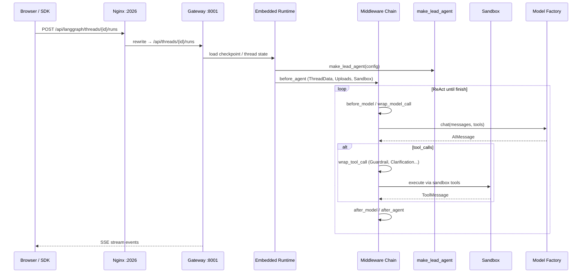

# Architecture Overview

This document provides a comprehensive overview of the DeerFlow backend architecture.

## System Architecture

```
┌──────────────────────────────────────────────────────────────────────────┐
│                              Client (Browser)                             │
└─────────────────────────────────┬────────────────────────────────────────┘
                                  │
                                  ▼
┌──────────────────────────────────────────────────────────────────────────┐
│                          Nginx (Port 2026)                               │
│                    Unified Reverse Proxy Entry Point                      │
│  ┌────────────────────────────────────────────────────────────────────┐  │
│  │  /api/langgraph/*  →  Gateway LangGraph-compatible runtime (8001)  │  │
│  │  /api/*            →  Gateway REST APIs (8001)                     │  │
│  │  /*                →  Frontend (3000)                               │  │
│  └────────────────────────────────────────────────────────────────────┘  │
└─────────────────────────────────┬────────────────────────────────────────┘
                                  │
          ┌───────────────────────┴───────────────────────┐
          │                                               │
          ▼                                               ▼
┌─────────────────────────────────────────────┐ ┌─────────────────────┐
│              Gateway API                    │ │     Frontend        │
│              (Port 8001)                    │ │    (Port 3000)      │
│                                             │ │                     │
│  - LangGraph-compatible runs/threads API    │ │  - Next.js App      │
│  - Embedded Agent Runtime                   │ │  - React UI         │
│  - SSE Streaming                            │ │  - Chat Interface   │
│  - Checkpointing                            │ │                     │
│  - Models, MCP, Skills, Uploads, Artifacts  │ │                     │
│  - Thread Cleanup                           │ │                     │
└─────────────────────────────────────────────┘ └─────────────────────┘
          │
          ▼
┌──────────────────────────────────────────────────────────────────────────┐
│                         Shared Configuration                              │
│  ┌─────────────────────────┐  ┌────────────────────────────────────────┐ │
│  │      config.yaml        │  │      extensions_config.json            │ │
│  │  - Models               │  │  - MCP Servers                         │ │
│  │  - Tools                │  │  - Skills State                        │ │
│  │  - Sandbox              │  │                                        │ │
│  │  - Summarization        │  │                                        │ │
│  └─────────────────────────┘  └────────────────────────────────────────┘ │
└──────────────────────────────────────────────────────────────────────────┘
```

## Gateway Run Lifecycle (Mermaid)



生产中间件完整顺序见 [middleware-execution-flow.md](middleware-execution-flow.md)（最多约 21 个）。

---

## Component Details

### Gateway Embedded Agent Runtime

The agent runtime is embedded in the FastAPI Gateway and built on LangGraph for robust multi-agent workflow orchestration. Nginx rewrites `/api/langgraph/*` to Gateway's native `/api/*` routes, so the public API remains compatible with LangGraph SDK clients without running a separate LangGraph server.

**Entry Point**: `packages/harness/deerflow/agents/lead_agent/agent.py:make_lead_agent`

**Key Responsibilities**:
- Agent creation and configuration
- Thread state management
- Middleware chain execution
- Tool execution orchestration
- SSE streaming for real-time responses

**Graph registry**: `langgraph.json` remains available for tooling, Studio, or direct LangGraph Server compatibility.
It is not the default service entrypoint; scripts and Docker deployments run the Gateway embedded runtime.

```json
{
  "agent": {
    "type": "agent",
    "path": "deerflow.agents:make_lead_agent"
  }
}
```

### Gateway API

FastAPI application providing REST endpoints plus the public LangGraph-compatible `/api/langgraph/*` runtime routes.

**Entry Point**: `app/gateway/app.py`

**Routers**:
- `auth.py` - `/api/v1/auth` - Login, registration, CSRF cookies
- `models.py` - `/api/models` - Model listing and details
- `thread_runs.py` / `runs.py` - `/api/threads/{id}/runs`, `/api/runs/*` - LangGraph-compatible runs and streaming
- `feedback.py` - `/api/threads/{id}/runs/{run_id}/feedback` - Run feedback
- `mcp.py` - `/api/mcp` - MCP server configuration
- `memory.py` - `/api/memory` - Cross-session memory CRUD
- `skills.py` - `/api/skills` - Skills management
- `agents.py` - `/api/agents` - Custom agent SOUL/config management
- `uploads.py` - `/api/threads/{id}/uploads` - File upload
- `threads.py` - `/api/threads` - Thread CRUD, state, search; filesystem cleanup
- `artifacts.py` - `/api/threads/{id}/artifacts` - Artifact serving
- `suggestions.py` - `/api/threads/{id}/suggestions` - Follow-up suggestion generation
- `channels.py` - `/api/channels` - IM channel status

The web conversation delete flow first deletes Gateway-managed thread state through the LangGraph-compatible route, then the Gateway `threads.py` router removes DeerFlow-managed filesystem data via `Paths.delete_thread_dir()`.

### Agent Architecture

```
┌─────────────────────────────────────────────────────────────────────────┐
│                           make_lead_agent(config)                        │
└────────────────────────────────────┬────────────────────────────────────┘
                                     │
                                     ▼
┌─────────────────────────────────────────────────────────────────────────┐
│                     Middleware Chain (make_lead_agent)                   │
│  Shared runtime: ToolOutputBudget → ThreadData → Uploads → Sandbox →    │
│    Dangling → LLMErrorHandling → (Guardrail) → SandboxAudit →           │
│    ToolErrorHandling                                                    │
│  Lead-only: DynamicContext → (Summarization) → (Todo) → (TokenUsage) →  │
│    Title → Memory → (ViewImage) → (DeferredToolFilter) →                │
│    (SubagentLimit) → (LoopDetection) → (SafetyFinishReason) →           │
│    Clarification (always last)                                          │
│  Full hook order: middleware-execution-flow.md / QA_ARCHIVE §9.2        │
└────────────────────────────────────┬────────────────────────────────────┘
                                     │
                                     ▼
┌─────────────────────────────────────────────────────────────────────────┐
│                              Agent Core                                  │
│  ┌──────────────────┐  ┌──────────────────┐  ┌──────────────────────┐   │
│  │      Model       │  │      Tools       │  │    System Prompt     │   │
│  │  (from factory)  │  │  (configured +   │  │  (with skills)       │   │
│  │                  │  │   MCP + builtin) │  │                      │   │
│  └──────────────────┘  └──────────────────┘  └──────────────────────┘   │
└─────────────────────────────────────────────────────────────────────────┘
```

### Thread State

`ThreadState` extends LangChain `AgentState` with thread-scoped fields: sandbox binding, workspace/uploads/outputs paths, UI artifacts, plan todos, upload metadata, and vision cache. The same schema is used by the lead agent, the `task` subagent path, and tools with `ToolRuntime[..., ThreadState]`, so checkpoints restore both **messages** and **per-thread filesystem / sandbox state**. Implementation: `packages/harness/deerflow/agents/thread_state.py`. Consolidated design (reducers, merge semantics, Skills context): [DEERFLOW_FRAMEWORK_QA_ARCHIVE.md](DEERFLOW_FRAMEWORK_QA_ARCHIVE.md) (design doc, §3, §6).

### Sandbox System

```
┌─────────────────────────────────────────────────────────────────────────┐
│                           Sandbox Architecture                           │
└─────────────────────────────────────────────────────────────────────────┘

                      ┌─────────────────────────┐
                      │    SandboxProvider      │ (Abstract)
                      │  - acquire()            │
                      │  - get()                │
                      │  - release()            │
                      └────────────┬────────────┘
                                   │
              ┌────────────────────┼────────────────────┐
              │                                         │
              ▼                                         ▼
┌─────────────────────────┐              ┌─────────────────────────┐
│  LocalSandboxProvider   │              │  AioSandboxProvider     │
│  (packages/harness/deerflow/sandbox/local.py) │              │  (packages/harness/deerflow/community/)       │
│                         │              │                         │
│  - Singleton instance   │              │  - Docker-based         │
│  - Direct execution     │              │  - Isolated containers  │
│  - Development use      │              │  - Production use       │
└─────────────────────────┘              └─────────────────────────┘

                      ┌─────────────────────────┐
                      │        Sandbox          │ (Abstract)
                      │  - execute_command()    │
                      │  - read_file()          │
                      │  - write_file()         │
                      │  - list_dir()           │
                      └─────────────────────────┘
```

**Virtual Path Mapping**:

| Virtual Path | Physical Path |
|-------------|---------------|
| `/mnt/user-data/workspace` | `backend/.deer-flow/threads/{thread_id}/user-data/workspace` |
| `/mnt/user-data/uploads` | `backend/.deer-flow/threads/{thread_id}/user-data/uploads` |
| `/mnt/user-data/outputs` | `backend/.deer-flow/threads/{thread_id}/user-data/outputs` |
| `/mnt/skills` | `deer-flow/skills/` |

### Tool System

```
┌─────────────────────────────────────────────────────────────────────────┐
│                            Tool Sources                                  │
└─────────────────────────────────────────────────────────────────────────┘

┌─────────────────────┐  ┌─────────────────────┐  ┌─────────────────────┐
│   Built-in Tools    │  │  Configured Tools   │  │     MCP Tools       │
│  (packages/harness/deerflow/tools/)       │  │  (config.yaml)      │  │  (extensions.json)  │
├─────────────────────┤  ├─────────────────────┤  ├─────────────────────┤
│ - present_files     │  │ - web_search        │  │ - github            │
│ - ask_clarification │  │ - web_fetch         │  │ - filesystem        │
│ - view_image        │  │ - bash              │  │ - postgres          │
│                     │  │ - read_file         │  │ - brave-search      │
│                     │  │ - write_file        │  │ - puppeteer         │
│                     │  │ - str_replace       │  │ - ...               │
│                     │  │ - ls                │  │                     │
└─────────────────────┘  └─────────────────────┘  └─────────────────────┘
           │                       │                       │
           └───────────────────────┴───────────────────────┘
                                   │
                                   ▼
                      ┌─────────────────────────┐
                      │   get_available_tools() │
                      │   (packages/harness/deerflow/tools/__init__)  │
                      └─────────────────────────┘
```

Full middleware hook order and memory vs middleware split: [DEERFLOW_FRAMEWORK_QA_ARCHIVE.md](DEERFLOW_FRAMEWORK_QA_ARCHIVE.md) (§9, [附录 B](DEERFLOW_FRAMEWORK_QA_ARCHIVE.md#appendix-memory-tools)).

Deep dive — **Memory**, **tool_search**, **ask_clarification**, **MCP loading/call/cache**, and the end-to-end **tool assembly flow** (with diagrams): [DEERFLOW_FRAMEWORK_QA_ARCHIVE.md — 附录 B](DEERFLOW_FRAMEWORK_QA_ARCHIVE.md#appendix-memory-tools).

### Model Factory

```
┌─────────────────────────────────────────────────────────────────────────┐
│                          Model Factory                                   │
│                     (packages/harness/deerflow/models/factory.py)                              │
└─────────────────────────────────────────────────────────────────────────┘

config.yaml:
┌─────────────────────────────────────────────────────────────────────────┐
│ models:                                                                  │
│   - name: gpt-4                                                         │
│     display_name: GPT-4                                                 │
│     use: langchain_openai:ChatOpenAI                                    │
│     model: gpt-4                                                        │
│     api_key: $OPENAI_API_KEY                                            │
│     max_tokens: 4096                                                    │
│     supports_thinking: false                                            │
│     supports_vision: true                                               │
└─────────────────────────────────────────────────────────────────────────┘
                                   │
                                   ▼
                      ┌─────────────────────────┐
                      │   create_chat_model()   │
                      │  - name: str            │
                      │  - thinking_enabled     │
                      └────────────┬────────────┘
                                   │
                                   ▼
                      ┌─────────────────────────┐
                      │   resolve_class()       │
                      │  (reflection system)    │
                      └────────────┬────────────┘
                                   │
                                   ▼
                      ┌─────────────────────────┐
                      │   BaseChatModel         │
                      │  (LangChain instance)   │
                      └─────────────────────────┘
```

**Supported Providers**:
- OpenAI (`langchain_openai:ChatOpenAI`)
- Anthropic (`langchain_anthropic:ChatAnthropic`)
- DeepSeek (`langchain_deepseek:ChatDeepSeek`)
- Custom via LangChain integrations

### MCP Integration

```
┌─────────────────────────────────────────────────────────────────────────┐
│                          MCP Integration                                 │
│                        (packages/harness/deerflow/mcp/manager.py)                              │
└─────────────────────────────────────────────────────────────────────────┘

extensions_config.json:
┌─────────────────────────────────────────────────────────────────────────┐
│ {                                                                        │
│   "mcpServers": {                                                       │
│     "github": {                                                         │
│       "enabled": true,                                                  │
│       "type": "stdio",                                                  │
│       "command": "npx",                                                 │
│       "args": ["-y", "@modelcontextprotocol/server-github"],           │
│       "env": {"GITHUB_TOKEN": "$GITHUB_TOKEN"}                          │
│     }                                                                   │
│   }                                                                     │
│ }                                                                       │
└─────────────────────────────────────────────────────────────────────────┘
                                   │
                                   ▼
                      ┌─────────────────────────┐
                      │  MultiServerMCPClient   │
                      │  (langchain-mcp-adapters)│
                      └────────────┬────────────┘
                                   │
              ┌────────────────────┼────────────────────┐
              │                    │                    │
              ▼                    ▼                    ▼
       ┌───────────┐        ┌───────────┐        ┌───────────┐
       │  stdio    │        │   SSE     │        │   HTTP    │
       │ transport │        │ transport │        │ transport │
       └───────────┘        └───────────┘        └───────────┘
```

### Skills System

```
┌─────────────────────────────────────────────────────────────────────────┐
│                          Skills System                                   │
│                       (packages/harness/deerflow/skills/loader.py)                             │
└─────────────────────────────────────────────────────────────────────────┘

Directory Structure:
┌─────────────────────────────────────────────────────────────────────────┐
│ skills/                                                                  │
│ ├── public/                        # Public skills (committed)           │
│ │   ├── pdf-processing/                                                 │
│ │   │   └── SKILL.md                                                    │
│ │   ├── frontend-design/                                                │
│ │   │   └── SKILL.md                                                    │
│ │   └── ...                                                             │
│ └── custom/                        # Custom skills (gitignored)          │
│     └── user-installed/                                                 │
│         └── SKILL.md                                                    │
└─────────────────────────────────────────────────────────────────────────┘

SKILL.md Format:
┌─────────────────────────────────────────────────────────────────────────┐
│ ---                                                                      │
│ name: PDF Processing                                                     │
│ description: Handle PDF documents efficiently                            │
│ license: MIT                                                            │
│ allowed-tools:                                                          │
│   - read_file                                                           │
│   - write_file                                                          │
│   - bash                                                                │
│ ---                                                                      │
│                                                                          │
│ # Skill Instructions                                                     │
│ Loaded on demand after discovery or explicit slash activation...         │
└─────────────────────────────────────────────────────────────────────────┘
```

### Request Flow

```
┌─────────────────────────────────────────────────────────────────────────┐
│                         Request Flow Example                             │
│                    User sends message to agent                           │
└─────────────────────────────────────────────────────────────────────────┘

1. Client → Nginx
   POST /api/langgraph/threads/{thread_id}/runs
   {"input": {"messages": [{"role": "user", "content": "Hello"}]}}

2. Nginx → Gateway API (8001)
   `/api/langgraph/*` is rewritten to Gateway's LangGraph-compatible `/api/*` routes

3. Gateway embedded runtime
   a. Load/create thread state
   b. Execute middleware chain (see middleware-execution-flow.md):
      - Shared runtime: thread paths, uploads, sandbox, dangling patch,
        LLM error handling, optional guardrails, sandbox audit, tool errors
      - Lead-only: dynamic context, optional summarization/todo/token usage,
        title, memory queue, optional vision/deferred MCP filter/subagent limit,
        loop detection, safety finish reason, clarification (last)

   c. Execute agent:
      - Model processes messages
      - May call tools (bash, web_search, etc.)
      - Tools execute via sandbox
      - Results added to messages

   d. Stream response via SSE

4. Client receives streaming response
```

## Data Flow

### File Upload Flow

```
1. Client uploads file
   POST /api/threads/{thread_id}/uploads
   Content-Type: multipart/form-data

2. Gateway receives file
   - Validates file
   - Stores in .deer-flow/threads/{thread_id}/user-data/uploads/
   - If document: converts to Markdown via markitdown

3. Returns response
   {
     "files": [{
       "filename": "doc.pdf",
       "path": ".deer-flow/.../uploads/doc.pdf",
       "virtual_path": "/mnt/user-data/uploads/doc.pdf",
       "artifact_url": "/api/threads/.../artifacts/mnt/.../doc.pdf"
     }]
   }

4. Next agent run
   - UploadsMiddleware lists files
   - Injects file list into messages
   - Agent can access via virtual_path
```

### Thread Cleanup Flow

```
1. Client deletes conversation via the LangGraph-compatible Gateway route
   DELETE /api/langgraph/threads/{thread_id}

2. Web UI follows up with Gateway cleanup
   DELETE /api/threads/{thread_id}

3. Gateway removes local DeerFlow-managed files
   - Deletes .deer-flow/threads/{thread_id}/ recursively
   - Missing directories are treated as a no-op
   - Invalid thread IDs are rejected before filesystem access
```

### Configuration Reload

```
1. Client updates MCP config or requests a cache reset
   PUT /api/mcp/config
   POST /api/mcp/cache/reset

2. Gateway updates runtime state
   - PUT writes extensions_config.json and reloads configuration
   - Both endpoints reset the MCP tools cache and persistent sessions

3. MCP Manager reloads on next use
   - get_cached_mcp_tools() lazily reinitializes MCP tools
   - Loads current server configurations and tool lists

4. Next agent run uses new tools
```

## Security Considerations

### Sandbox Isolation

- Agent code executes within sandbox boundaries
- Local sandbox: Direct execution (development only)
- Docker sandbox: Container isolation (production recommended)
- Path traversal prevention in file operations

### API Security

- Thread isolation: Each thread has separate data directories
- File validation: Uploads checked for path safety
- Environment variable resolution: Secrets not stored in config

### MCP Security

- Each MCP server runs in its own process
- Environment variables resolved at runtime
- Servers can be enabled/disabled independently

## Performance Considerations

### Caching

- MCP tools cached with file mtime invalidation
- Configuration loaded once, reloaded on file change
- Skills parsed once at startup, cached in memory

### Streaming

- SSE used for real-time response streaming
- Reduces time to first token
- Enables progress visibility for long operations

### Context Management

- Summarization middleware reduces context when limits approached
- Configurable triggers: tokens, messages, or fraction
- Preserves recent messages while summarizing older ones

**Skills and multi-step tool use**: The agent does not load full skill files into the initial system prompt; it only gets a compact skill index. Once it chooses a skill, each `read_file` / `bash` / MCP call returns content that is stored as a **tool result message** and typically **remains in the conversation history** for subsequent model invocations. A single user request can therefore span **many model calls** (ReAct loop: think → tool → think → tool → …), and each call usually sends **system + full accumulated `messages`**, so token usage rises quickly. Large skill bodies, reference markdown, script stdout, or search results compound the effect. Mitigations: enable summarization (see [summarization.md](summarization.md)), prefer shorter skills and progressive disclosure, use `read_file` line ranges when appropriate, and limit how many skills are enabled per deployment. Details: [DEERFLOW_FRAMEWORK_QA_ARCHIVE.md](DEERFLOW_FRAMEWORK_QA_ARCHIVE.md) §6.2.
