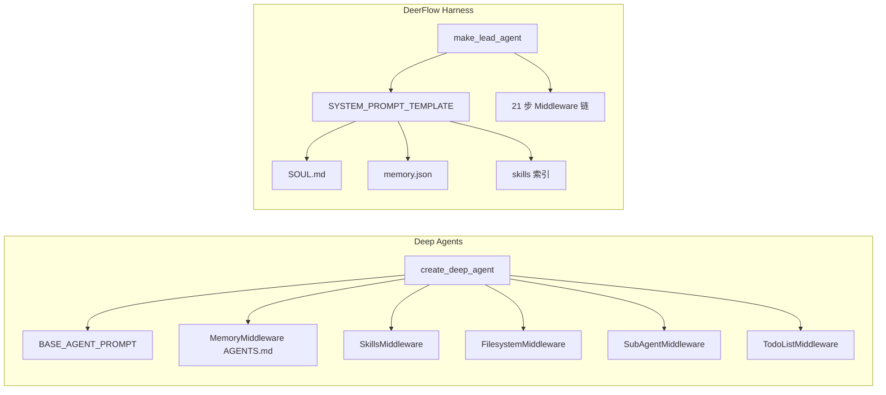
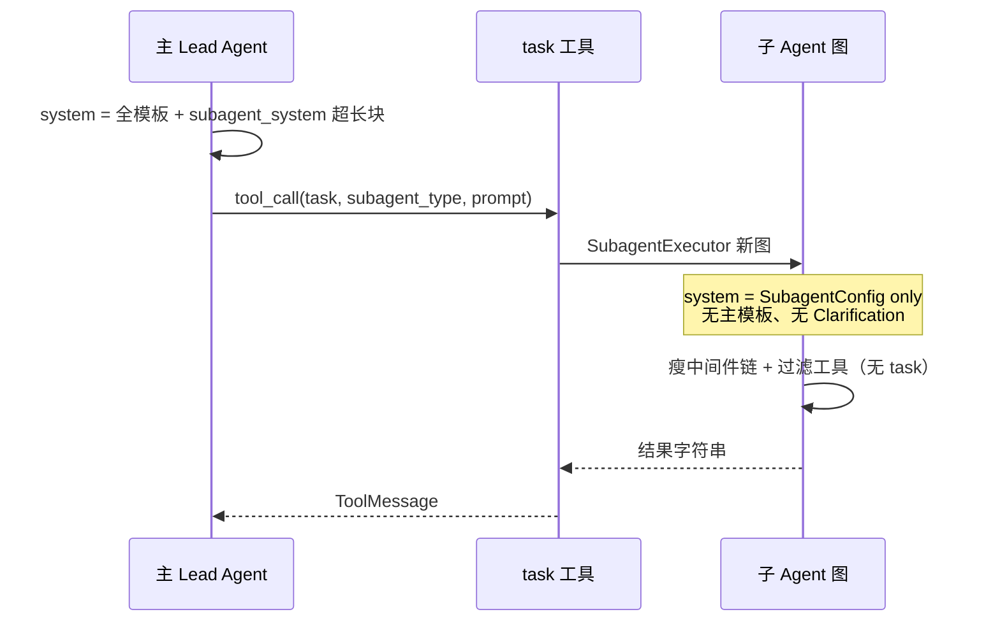

# Deep Agents vs DeerFlow：Prompt 与上下文对照

> **版本**: 2.0（独立完整版，非存根）  
> **Deep Agents**: [langchain-ai/deepagents](https://github.com/langchain-ai/deepagents) · `create_deep_agent` / `graph.py`  
> **DeerFlow**: `agents/lead_agent/prompt.py` · `apply_prompt_template`  
> **归档真源**: [DEERFLOW_FRAMEWORK_QA_ARCHIVE.md §11.3.1](DEERFLOW_FRAMEWORK_QA_ARCHIVE.md#deepagents-prompt-vs-deerflow)

---

## 1. 架构定位对照

| 维度 | Deep Agents | DeerFlow |
|------|-------------|----------|
| 入口 | `create_deep_agent(...)` | `make_lead_agent(config)`（Gateway 生产） |
| 默认 system | 库内 **BASE_AGENT_PROMPT** + 长 harness | **XML 分块模板** `apply_prompt_template` |
| 长期记忆进 system | `memory=[paths]` → **AGENTS.md 全文** | **memory.json** 结构化摘要 + 异步 LLM 更新 |
| 技能 | `skills=` 目录，中间件按需 | 磁盘 Skills + system **仅索引** + `read_file` |
| 规划 | **默认 TodoListMiddleware** | **`is_plan_mode`** 才挂 Todo |
| 子 Agent | `subagents=[{system_prompt, tools, model}]` | 内置类型 + **超长 `<subagent_system>`** |
| MCP 爆炸 | 依赖绑定策略 | **deferred + tool_search + DeferredToolFilter** |

---

## 2. System Prompt 组成对照表

### 2.1 Deep Agents

| 部分 | 机制 |
|------|------|
| 默认 harness | `BASE_AGENT_PROMPT`：规划、文件、子 Agent、长程执行 |
| 用户段 | `system_prompt` 参数：**拼在 BASE 前面**（`user + "\n\n" + BASE`） |
| Memory | `MemoryMiddleware` 读 **AGENTS.md** 等进 system |
| Skills | `SkillsMiddleware` 按需暴露 SKILL 内容 |
| 文件叙事 | `FilesystemMiddleware` + Backend 路径 |
| 子 Agent | `SubAgentMiddleware` + `TASK_SYSTEM_PROMPT` + **`task` 工具超长 description** |

### 2.2 DeerFlow

| 块 | 来源 |
|----|------|
| `<soul>` | `SOUL.md` |
| `<memory>` | `memory.json` |
| `<clarification_system>` | 模板 + **ClarificationMiddleware**（垫底） |
| `<skill_system>` | 索引 only |
| `<available-deferred-tools>` | `tool_search` 条件 |
| `<subagent_system>` | `subagent_enabled` |
| `<working_directory>` | `/mnt/user-data/...` |
| 动态 messages | Uploads / ViewImage / Summarization / Dangling 等（**不进 template 字符串**） |

---

## 3. 主 / 子 Agent Prompt 详尽对照（`subagent_enabled=True`）

| 维度 | Deep Agents 默认 | DeerFlow |
|------|------------------|----------|
| **主侧子 Agent 篇幅** | 偏短（`TASK_SYSTEM_PROMPT` + 类型列表；更多在 **task 工具 doc**） | **`<subagent_system>` 超长**（产品化规则） |
| **主侧显式计划** | **默认 TodoList** | **`write_todos` 仅 plan_mode** |
| **子侧静态 prompt** | 极短 `DEFAULT_SUBAGENT_PROMPT` | **长**（工人提示 + output_format） |
| **子侧中间件** | **胖**（Todo + Filesystem + Summarization [+ Skills]） | **瘦**（无 TodoList/Clarification/Memory） |
| **子侧再委派** | 默认子图无 SubAgentMiddleware | **硬禁止** `task` 在子工具列表 |
| **子侧 MCP deferred** | 依 tools 配置 | **无 DeferredFilter** → 可能仍全量绑 MCP schema |

---

## 4. `write_todos` / `task` 注册对照

详见 QA 归档 **[§9.9](DEERFLOW_FRAMEWORK_QA_ARCHIVE.md#deerflow-deepagents-todo-task)**。摘要：

| | Deep Agents | DeerFlow |
|--|-------------|----------|
| Todo | 主图 **默认** `TodoListMiddleware` | **`is_plan_mode`** 才挂 |
| `task` | `SubAgentMiddleware` 提供 | `task_tool` + `SubagentExecutor` |
| 子图 Todo | 默认子图 **有** TodoList | 子图 **无** |

---

## 5. Context Engineering 五类上下文（Deep Agents 文档 vs DeerFlow）

| 类型 | Deep Agents 文档 | DeerFlow 对应 |
|------|------------------|---------------|
| Input context | system + AGENTS.md + Skills + tool prompts | `apply_prompt_template` + middleware 注入 |
| Runtime context | `config["context"]` 不透传除非工具读 | Gateway metadata / LangGraph configurable |
| Compression | Offloading + Summarization 写回 FS | `SummarizationMiddleware` + checkpoint messages |
| Subagent isolation | 主只见子最终结果 | `task` 线程池 + 主 checkpoint 仅多 ToolMessage |
| Long-term memory | Store + `/memories/` CompositeBackend | **memory.json** + MemoryMiddleware 队列（非 LangGraph Store 默认） |

深度对照：QA **[§11.3.2](DEERFLOW_FRAMEWORK_QA_ARCHIVE.md#deepagents-context-engineering)**。

---

## 6. 「谁有默认 system？」澄清

- **Deep Agents**：不传 `system_prompt` 时仍有 **库默认长 harness**；示例常让人误以为只有 `INSTRUCTIONS` 一段。
- **DeerFlow**：**固定**走 `SYSTEM_PROMPT_TEMPLATE`，XML 块在仓库内一目了然。

---

## 7. 选用与迁移提示

| 目标 | 倾向 |
|------|------|
| 少改默认、快速 file + subagent harness | Deep Agents 默认配方 |
| 强澄清、MCP token 控制、Gateway 产品一致 | DeerFlow 模板 + 中间件链 |
| 从 Deep Agents 迁移 | `AGENTS.md` → 拆分为 **`SOUL.md`（人格）+ memory.json（事实）** |

---

## 8. plan-and-execute 生态索引（非本仓库实现）

| 类型 | 示例 |
|------|------|
| 教学 | [LangChain Plan-and-Execute](https://blog.langchain.com/plan-and-execute-agents/) |
| 多角色 | MetaGPT、CrewAI、AutoGen |

**范式**：DeerFlow 模板 **CLARIFY → PLAN → ACT** + 可选 `write_todos` + `task`，实现上仍是 **单主图 ReAct**；Deep Agents 是 **Todo + 文件 + 子 Agent + 摘要** harness。

---

## 9. 相关文档

| 文档 | 内容 |
|------|------|
| [PROMPT_AND_CONTEXT_FULL_CHAIN.md](PROMPT_AND_CONTEXT_FULL_CHAIN.md) | Lead 全链路 system/tools/messages |
| [DEERFLOW_ARCHITECTURE_V2.md](DEERFLOW_ARCHITECTURE_V2.md) | v2.1 架构 |
| [middleware-execution-flow.md](middleware-execution-flow.md) | 中间件执行图 |

---

**最后更新**: 2026-06-01
