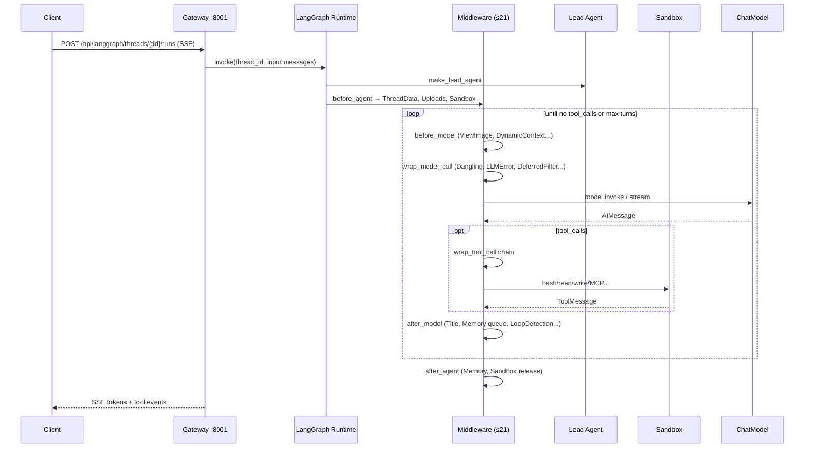
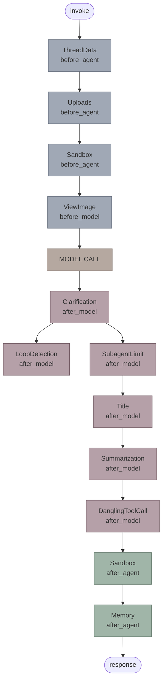

# DeerFlow 最新架构深度解析 (v2.1)

> **最后更新**: 2026-06-08  
> **版本**: v2.1（对照 `packages/harness/deerflow` + `app/` 修订）  
> **分析方法**: 基于最新源码深度分析  
> **目标**: 全面反映 DeerFlow 的最新架构变化和模块设计  
> **重要**：**Gateway 生产路径**使用 **`make_lead_agent`**；**`create_deerflow_agent` / `DeerFlowClient`** 为 SDK/嵌入式路径，中间件链更短，勿混为一谈。

---

## 📋 目录

- [1. 核心架构变化概览](#1-核心架构变化概览)
- [2. RuntimeFeatures 声明式配置系统](#2-runtimefeatures-声明式配置系统)
- [3. Middleware 完整执行流程（生产链）](#3-middleware-完整执行流程生产链)
- [4. 新增关键模块详解](#4-新增关键模块详解)
- [5. 记忆系统架构](#5-记忆系统架构)
- [6. Subagents 模块](#6-subagents-模块)
- [7. Guardrails 安全机制](#7-guardrails-安全机制)
- [8. Tracing 与 Reflection](#8-tracing-与-reflection)
- [9. 与其他框架对比](#9-与其他框架对比)

---

## 1. 核心架构变化概览

### 1.1 主要变化总结

| 维度 | v1.x | v2.1 (最新) | 说明 |
|------|------|------------|------|
| **生产 Middleware** | 14个 | **最多约 22 个**（按配置开关） | 含 ToolOutputBudget、DynamicContext、SafetyFinishReason 等 |
| **配置方式** | YAML驱动 | **YAML + RuntimeFeatures** | Gateway 走 `config.yaml`；SDK 可用 `RuntimeFeatures` |
| **安全机制** | 基础沙箱 | **熔断器+命令审计+护栏** | LLMErrorHandling + SandboxAudit + Guardrail（可选） |
| **可观测性** | 有限日志 | **LangSmith / Langfuse** | `tracing/factory.py`；非 OpenTelemetry |
| **扩展性** | 固定链 | **@Next/@Prev + custom_middlewares** | SDK 路径支持；生产链在 `_build_middlewares` 注入 |

### 1.2 模块结构图

```
packages/harness/deerflow/
├── agents/                    # Agent核心
│   ├── factory.py            # create_deerflow_agent (新入口)
│   ├── features.py           # RuntimeFeatures (新增)
│   ├── thread_state.py       # ThreadState定义
│   ├── lead_agent/           # Lead Agent实现
│   ├── middlewares/          # 中间件（生产链见 §3）
│   │   ├── clarification_middleware.py
│   │   ├── dangling_tool_call_middleware.py
│   │   ├── deferred_tool_filter_middleware.py    ← NEW
│   │   ├── llm_error_handling_middleware.py      ← NEW
│   │   ├── loop_detection_middleware.py
│   │   ├── memory_middleware.py
│   │   ├── model_call_logging_middleware.py      ← NEW
│   │   ├── sandbox_audit_middleware.py           ← NEW
│   │   ├── subagent_limit_middleware.py
│   │   ├── summarization_middleware.py
│   │   ├── thread_data_middleware.py
│   │   ├── title_middleware.py
│   │   ├── todo_middleware.py
│   │   ├── token_usage_middleware.py             ← NEW
│   │   ├── tool_error_handling_middleware.py
│   │   ├── uploads_middleware.py
│   │   └── view_image_middleware.py
│   ├── memory/               # 记忆系统
│   │   ├── queue.py          # 防抖队列
│   │   ├── storage.py        # 存储后端
│   │   ├── updater.py        # 事实抽取
│   │   └── summarization_hook.py  # 压缩前Hook
│   └── checkpointer/         # Checkpoint管理
├── subagents/                # 子Agent系统 (重构)
│   ├── registry.py           # 注册表
│   ├── executor.py           # 执行器
│   └── builtins/             # 内置子Agent
├── guardrails/               # 护栏系统 (新增)
│   ├── middleware.py         # GuardrailMiddleware
│   ├── provider.py           # Provider接口
│   └── builtin.py            # 内置规则
├── tracing/                  # 追踪系统 (新增)
│   └── factory.py            # Tracer工厂
├── reflection/               # 反射系统 (新增)
│   └── resolvers.py          # 类解析器
├── models/                   # 模型工厂
├── tools/                    # 工具系统
├── sandbox/                  # 沙箱系统
├── mcp/                      # MCP集成
├── skills/                   # Skills系统
└── config/                   # 配置系统
```

---

## 2. RuntimeFeatures 声明式配置系统

### 2.1 设计理念

**v1.x的问题**:
- 依赖YAML配置文件
- 全局单例状态
- 难以测试和替换组件

**v2.0的解决方案**:
```python
# 纯Python参数，无文件依赖
from deerflow.agents import create_deerflow_agent
from deerflow.agents.features import RuntimeFeatures

agent = create_deerflow_agent(
    model=my_model,
    tools=[tool1, tool2],
    features=RuntimeFeatures(
        sandbox=True,              # 启用沙箱
        memory=False,              # 禁用记忆
        summarization=my_custom_middleware,  # 自定义中间件
        subagent=True,             # 启用子Agent
        vision=True,               # 启用视觉
        auto_title=True,           # 自动标题
        guardrail=False,           # 禁用护栏
    ),
    plan_mode=True,                # 计划模式
    name="my-agent",
)
```

### 2.2 RuntimeFeatures定义

**文件**: `agents/features.py`

```python
@dataclass
class RuntimeFeatures:
    """Declarative feature flags for create_deerflow_agent.
    
    Most features accept:
    - True: use the built-in default middleware
    - False: disable
    - An AgentMiddleware instance: use this custom implementation instead
    
    summarization and guardrail have no built-in default — they only
    accept False (disable) or an AgentMiddleware instance (custom).
    """
    
    sandbox: bool | AgentMiddleware = True
    memory: bool | AgentMiddleware = False
    summarization: Literal[False] | AgentMiddleware = False
    subagent: bool | AgentMiddleware = False
    vision: bool | AgentMiddleware = False
    auto_title: bool | AgentMiddleware = False
    guardrail: Literal[False] | AgentMiddleware = False
```

### 2.3 Middleware组装逻辑

**文件**: `agents/factory.py:155-291`

```python
def _assemble_from_features(
    feat: RuntimeFeatures,
    *,
    name: str = "default",
    plan_mode: bool = False,
    extra_middleware: list[AgentMiddleware] | None = None,
) -> tuple[list[AgentMiddleware], list[BaseTool]]:
    """Build an ordered middleware chain + extra tools from feat."""
    
    chain: list[AgentMiddleware] = []
    extra_tools: list[BaseTool] = []
    
    # [0-2] Sandbox infrastructure
    if feat.sandbox is not False:
        chain.append(ThreadDataMiddleware(lazy_init=True))
        chain.append(UploadsMiddleware())
        chain.append(SandboxMiddleware(lazy_init=True))
    
    # [3] DanglingToolCall (always)
    chain.append(DanglingToolCallMiddleware())
    
    # [4] Guardrail
    if feat.guardrail is not False:
        if isinstance(feat.guardrail, AgentMiddleware):
            chain.append(feat.guardrail)
        else:
            raise ValueError("guardrail=True requires a custom AgentMiddleware")
    
    # [5] ToolErrorHandling (always)
    chain.append(ToolErrorHandlingMiddleware())
    
    # [6] Summarization
    if feat.summarization is not False:
        if isinstance(feat.summarization, AgentMiddleware):
            chain.append(feat.summarization)
        else:
            raise ValueError("summarization=True requires a custom AgentMiddleware")
    
    # [7] TodoMiddleware (plan_mode)
    if plan_mode:
        chain.append(TodoMiddleware(...))
    
    # [8] Auto Title
    if feat.auto_title is not False:
        chain.append(TitleMiddleware())
    
    # [9] Memory
    if feat.memory is not False:
        chain.append(MemoryMiddleware(agent_name=name))
    
    # [10] Vision
    if feat.vision is not False:
        chain.append(ViewImageMiddleware())
        extra_tools.append(view_image_tool)
    
    # [11] Subagent
    if feat.subagent is not False:
        chain.append(SubagentLimitMiddleware())
        extra_tools.append(task_tool)
    
    # [12] LoopDetection (always)
    chain.append(LoopDetectionMiddleware())
    
    # [13] Clarification (always last among built-ins)
    chain.append(ClarificationMiddleware())
    extra_tools.append(ask_clarification_tool)
    
    # Insert extra_middleware via @Next/@Prev
    if extra_middleware:
        _insert_extra(chain, extra_middleware)
    
    return chain, extra_tools
```

### 2.4 @Next/@Prev 动态定位

**文件**: `agents/features.py:41-62`

```python
def Next(anchor: type[AgentMiddleware]):
    """Declare this middleware should be placed after anchor in the chain."""
    def decorator(cls: type[AgentMiddleware]) -> type[AgentMiddleware]:
        cls._next_anchor = anchor
        return cls
    return decorator


def Prev(anchor: type[AgentMiddleware]):
    """Declare this middleware should be placed before anchor in the chain."""
    def decorator(cls: type[AgentMiddleware]) -> type[AgentMiddleware]:
        cls._prev_anchor = anchor
        return cls
    return decorator
```

**使用示例**:

```python
from deerflow.agents.features import Next, Prev
from langchain.agents.middleware import AgentMiddleware

@Next(TitleMiddleware)
class MyCustomMiddleware(AgentMiddleware):
    """This middleware will be inserted right after TitleMiddleware."""
    pass

# Usage
agent = create_deerflow_agent(
    model=model,
    features=RuntimeFeatures(auto_title=True),
    extra_middleware=[MyCustomMiddleware()],
)
```

---

## 3. Middleware 完整执行流程（生产链）

**源码**：`build_lead_runtime_middlewares`（`tool_error_handling_middleware.py`）+ `_build_middlewares`（`lead_agent/agent.py`）。**ClarificationMiddleware 永远最后**。

### 3.1 生产链顺序（`make_lead_agent` / Gateway）

**共享运行时**（`build_lead_runtime_middlewares`）：

| # | Middleware | 主要钩子 | 说明 |
|---|-----------|----------|------|
| 1 | ToolOutputBudgetMiddleware | `wrap_tool_call` | 工具输出 token 预算 |
| 2 | ThreadDataMiddleware | `before_agent` | 线程目录与 `thread_data` |
| 3 | UploadsMiddleware | `before_agent` / `abefore_agent` | 上传文件注入 |
| 4 | SandboxMiddleware | sandbox 生命周期 | 沙箱获取/释放 |
| 5 | DanglingToolCallMiddleware | `wrap_model_call` | 补缺失 ToolMessage |
| 6 | LLMErrorHandlingMiddleware | `wrap_model_call` | 模型错误归一化 + 熔断 |
| 7 | GuardrailMiddleware | `wrap_tool_call` | 可选；`guardrails.enabled` |
| 8 | SandboxAuditMiddleware | `wrap_tool_call` | Bash/文件操作审计 |
| 9 | ToolErrorHandlingMiddleware | `wrap_tool_call` | 工具异常 → error ToolMessage |

**Lead 专用**（`_build_middlewares` 追加）：

| # | Middleware | 条件 | 说明 |
|---|-----------|------|------|
| 10 | DynamicContextMiddleware | 始终 | 日期/记忆注入首条 HumanMessage |
| 11 | SummarizationMiddleware | `summarization.enabled` | 上下文压缩 |
| 12 | TodoListMiddleware | `is_plan_mode` | 计划模式 Todo |
| 13 | TokenUsageMiddleware | `token_usage.enabled` | Token 统计 |
| 14 | TitleMiddleware | 始终 | 自动标题 |
| 15 | MemoryMiddleware | 始终 | 记忆入队 |
| 16 | ViewImageMiddleware | 模型 `supports_vision` | 图片 base64 注入 |
| 17 | DeferredToolFilterMiddleware | `tool_search.enabled` | **`wrap_model_call`** 隐藏 deferred MCP schema |
| 18 | SubagentLimitMiddleware | `subagent_enabled` | 截断超额 `task` 调用 |
| 19 | LoopDetectionMiddleware | `loop_detection.enabled` | 循环检测 |
| 20 | SafetyFinishReasonMiddleware | `safety_finish_reason.enabled` | 安全终止时清 tool_calls |
| 21 | ClarificationMiddleware | 始终（最后） | 拦截 `ask_clarification` |

**注意**：

- **`ModelCallLoggingMiddleware`** 源码存在（`model_call_logging_middleware.py`），但 **未接入** 生产链；仅作调试参考。
- **SDK 路径**（`create_deerflow_agent`）链更短：无 ToolOutputBudget、LLMErrorHandling、SandboxAudit、DynamicContext、DeferredToolFilter、TokenUsage、SafetyFinishReason 等。
- **子 Agent** 使用 `build_subagent_runtime_middlewares`：**含 Dangling 修补**，无 Uploads / DeferredToolFilter / Clarification。

### 3.2 Gateway Run 端到端时序



**与 SDK 路径差异**：`create_deerflow_agent` 不经 Gateway，中间件链更短（约 13–14），无 ToolOutputBudget、LLMErrorHandling、DynamicContext、DeferredToolFilter 等。

### 3.3 执行流程图（钩子分组）



### 3.4 洋葱模型 vs 管道模型

**真正的洋葱模型**（如Koa/Express）：
- 每个middleware同时负责before和after
- 形成完美嵌套：`activate`跨越整个内层执行

**DeerFlow的实际情况**：
- **不是洋葱，是管道**
- 大部分middleware只用一个钩子
- `before_agent`/`after_agent`只跑一次
- `before_model`/`after_model`每轮循环都跑

**硬依赖只有2处**：
1. ThreadData在Sandbox之前（sandbox需要线程目录）
2. Clarification在列表最后（after_model反序时最先执行）

---

## 4. 新增关键模块详解

### 4.1 LLMErrorHandlingMiddleware（熔断器模式）

**文件**: `agents/middlewares/llm_error_handling_middleware.py`

**核心功能**:
- **重试机制**: 指数退避重试（最多3次）
- **熔断器**: 连续失败5次后进入Open状态，60秒后探测
- **错误分类**: transient/busy/quota/auth/generic
- **用户友好消息**: 根据错误类型返回不同提示

**实现细节**:

```python
class LLMErrorHandlingMiddleware(AgentMiddleware):
    retry_max_attempts: int = 3
    retry_base_delay_ms: int = 1000
    retry_cap_delay_ms: int = 8000
    
    circuit_failure_threshold: int = 5
    circuit_recovery_timeout_sec: int = 60
    
    def wrap_model_call(self, request, handler):
        # Step 1: 检查熔断器
        if self._check_circuit():
            return Command(goto=END, update={
                "messages": [AIMessage(content=self._build_circuit_breaker_message())]
            })
        
        # Step 2: 重试循环
        for attempt in range(1, self.retry_max_attempts + 1):
            try:
                result = handler(request)
                self._record_success()  # 成功则重置熔断器
                return result
            except Exception as exc:
                retriable, reason = self._classify_error(exc)
                
                if not retriable:
                    # 不可重试错误（quota/auth），立即返回用户消息
                    return Command(goto=END, update={
                        "messages": [AIMessage(content=self._build_user_message(exc, reason))]
                    })
                
                if attempt == self.retry_max_attempts:
                    # 达到最大重试次数
                    self._record_failure()  # 记录失败，可能触发熔断
                    return Command(goto=END, update={
                        "messages": [AIMessage(content=self._build_user_message(exc, reason))]
                    })
                
                # 等待后重试
                wait_ms = self._build_retry_delay_ms(attempt, exc)
                time.sleep(wait_ms / 1000)
```

**熔断器状态机**:

```
Closed (正常) 
  ↓ 连续失败5次
Open (熔断，拒绝请求60秒)
  ↓ 60秒后
Half-Open (探测，允许1个请求)
  ↓ 成功 → Closed
  ↓ 失败 → Open
```

### 4.2 SandboxAuditMiddleware（Bash命令审计）

**文件**: `agents/middlewares/sandbox_audit_middleware.py`

**核心功能**:
- **高风险命令检测**: `rm -rf /`, `dd if=`, `mkfs`, `cat /etc/shadow`等
- **中风险命令警告**: `chmod 777`, `pip install`, `apt-get install`
- **复合命令拆分**: 正确处理 `cmd1 && cmd2 ; cmd3`
- **引号感知**: 不误判引号内的控制字符

**高风险模式示例**:

```python
_HIGH_RISK_PATTERNS = [
    re.compile(r"rm\s+-[^\s]*r[^\s]*\s+(/\*?|~/?\*?|/home\b|/root\b)\s*$"),
    re.compile(r"dd\s+if="),
    re.compile(r"mkfs"),
    re.compile(r"cat\s+/etc/shadow"),
    re.compile(r">+\s*/etc/"),
    re.compile(r"\|\s*(ba)?sh\b"),  # pipe to bash
    re.compile(r"[`$]\(?\s*(curl|wget|bash|sh|python|ruby|perl|base64)"),
    re.compile(r"base64\s+.*-d.*\|"),
    re.compile(r">+\s*(/usr/bin/|/bin/|/sbin/)"),
    re.compile(r"/proc/[^/]+/environ"),
    re.compile(r"\b(LD_PRELOAD|LD_LIBRARY_PATH)\s*="),
    re.compile(r"/dev/tcp/"),  # bash networking
    re.compile(r"\S+\(\)\s*\{[^}]*\|\s*\S+\s*&"),  # fork bomb :(){ :|:& };:
]
```

**执行流程**:

```python
def wrap_tool_call(self, request, handler):
    if request.tool_call.get("name") != "bash":
        return handler(request)
    
    command = request.tool_call.get("args", {}).get("command", "")
    verdict = _classify_command(command)
    
    if verdict == "block":
        # 阻止执行，返回错误消息
        return Command(update={
            "messages": [ToolMessage(
                content=f"Command blocked for security reasons: {command}",
                tool_call_id=request.tool_call["id"],
            )]
        })
    
    if verdict == "warn":
        logger.warning(f"Medium-risk command detected: {command}")
    
    # 继续执行
    return handler(request)
```

### 4.3 ModelCallLoggingMiddleware（调试参考，默认未启用）

**文件**: `agents/middlewares/model_call_logging_middleware.py`

**状态**：实现存在，但 **未挂载** 到 `make_lead_agent` / `_build_middlewares`。生产可观测性请用 **LangSmith / Langfuse**（`tracing/factory.py`）。

### 4.4 DeferredToolFilterMiddleware（deferred MCP schema 过滤）

**文件**: `agents/middlewares/deferred_tool_filter_middleware.py`

**核心功能**（`tool_search.enabled` 时）:
- 在 **`wrap_model_call`** 阶段从 `request.tools` **移除** 尚未晋升的 deferred MCP schema
- ToolNode 仍保留完整工具列表供执行；模型需先通过 **`tool_search`** 发现工具
- 晋升状态保存在 **`ThreadState.promoted`**（按 catalog hash 作用域）

### 4.5 TokenUsageMiddleware（Token统计）

**文件**: `agents/middlewares/token_usage_middleware.py`

**核心功能**:
- 统计每次模型调用的输入/输出token数
- 累计会话总token消耗
- 支持成本估算

---

## 5. 记忆系统架构

### 5.1 三层架构

```
┌─────────────────────────────────────────┐
│  Layer 1: SummarizationMiddleware       │
│  • 基于langchain的成熟方案               │
│  • Token超阈值 → LLM生成摘要            │
│  • 替换旧消息                           │
└─────────────────────────────────────────┘
              ↓ 触发Hook
┌─────────────────────────────────────────┐
│  Layer 2: memory_flush_hook             │
│  • 压缩前捕获即将丢弃的消息              │
│  • 立即入队（add_nowait）               │
│  • 防止信息丢失                         │
└─────────────────────────────────────────┘
              ↓ 后台处理
┌─────────────────────────────────────────┐
│  Layer 3: MemoryUpdateQueue             │
│  • 异步批处理                           │
│  • LLM抽取结构化facts                   │
│  • 写入memory.json                      │
└─────────────────────────────────────────┘
```

### 5.2 防抖队列（Debounce Queue）

**文件**: `agents/memory/queue.py`

**核心概念**:
- **防抖（Debounce）**: 在一系列连续操作中，只执行最后一次操作，并且要等待一段时间没有新操作后才执行
- **成本节省**: 减少88-92%的LLM调用

**工作流程**:

```
T+0s   用户: "帮我分析代码"
       → queue.add() 
       → 启动定时器 (将在T+30s触发)
       
T+10s  用户: "继续查看依赖"
       → queue.add()
       → 取消T+30s的定时器
       → 重新启动定时器 (将在T+40s触发)  ← 防抖生效！
       
T+20s  用户: "优化数据库查询"
       → queue.add()
       → 取消T+40s的定时器
       → 重新启动定时器 (将在T+50s触发)
       
T+50s  定时器触发！
       → _process_queue()
       → 批量处理3轮对话
       → 调用一次LLM抽取facts
       → 写入memory.json
```

**两种模式**:
- `queue.add()` → 防抖30秒（常规对话）
- `queue.add_nowait()` → 立即处理（压缩前紧急保存）

### 5.3 Summarization Hook

**文件**: `agents/memory/summarization_hook.py`

```python
def memory_flush_hook(event: SummarizationEvent) -> None:
    """Flush messages about to be summarized into the memory queue."""
    
    # Step 1: 过滤消息
    filtered_messages = filter_messages_for_memory(
        list(event.messages_to_summarize)
    )
    
    # Step 2: 检测纠正/强化信号
    correction_detected = detect_correction(filtered_messages)
    reinforcement_detected = detect_reinforcement(filtered_messages)
    
    # Step 3: 立即入队（不等待防抖！）
    queue = get_memory_queue()
    queue.add_nowait(  # ← 关键：使用add_nowait
        thread_id=event.thread_id,
        messages=filtered_messages,
        agent_name=event.agent_name,
        correction_detected=correction_detected,
        reinforcement_detected=reinforcement_detected,
    )
```

---

## 6. Subagents 模块

### 6.1 模块结构

```
subagents/
├── registry.py           # 子Agent注册表
├── executor.py           # 执行器
├── config.py             # 配置
└── builtins/             # 内置子Agent
    ├── general_purpose.py  # 通用子 Agent（除 task 外全部工具）
    └── bash_agent.py       # Bash 命令专家
```

### 6.2 执行流程

```python
# 通过 task 工具调用子 Agent
task(
    description="Review this Python code for best practices",
    prompt="...",
    subagent_type="general-purpose",  # 或 "bash"
)

# Executor内部流程
1. 从registry查找子Agent配置
2. 创建独立的Agent实例
3. 在隔离的上下文中执行
4. 返回结果作为ToolMessage
```

---

## 7. Guardrails 安全机制

### 7.1 模块结构

```
guardrails/
├── middleware.py         # GuardrailMiddleware
├── provider.py           # Provider接口
└── builtin.py            # 内置规则
```

### 7.2 工作原理

```python
class GuardrailMiddleware(AgentMiddleware):
    def wrap_tool_call(self, request, handler):
        # Step 1: 检查工具调用是否符合安全规则
        violations = self._check_guardrails(request)
        
        if violations:
            # Step 2: 阻止违规操作
            return Command(update={
                "messages": [ToolMessage(
                    content=f"Blocked by guardrails: {violations}",
                    tool_call_id=request.tool_call["id"],
                )]
            })
        
        # Step 3: 继续执行
        return handler(request)
```

---

## 8. Tracing 与 Reflection

### 8.1 Tracing（追踪系统）

**文件**: `tracing/factory.py`

**功能**:
- 集成 **LangSmith**（`LangChainTracer`）与 **Langfuse**（`CallbackHandler`）
- 回调挂在 **图调用根**（`run_agent` / `DeerFlowClient.stream`），避免重复 span
- `tracing/metadata.py` 注入 `langfuse_session_id`（thread_id）、`langfuse_user_id`、`langfuse_tags`

### 8.2 Reflection（反射系统）

**文件**: `reflection/resolvers.py`

**功能**:
- 动态类解析
- 从字符串导入类（如`langchain_openai:ChatOpenAI`）
- 支持插件化模型提供商

---

## 9. 与其他框架对比

### 9.1 Middleware架构对比

| 框架 | Middleware数量 | 配置方式 | 扩展性 | 安全机制 |
|------|--------------|---------|--------|---------|
| **DeerFlow v2.1** | 最多约 22 个（按配置） | YAML + RuntimeFeatures | custom_middlewares | 熔断器+审计+护栏 |
| **OpenHarness** | ~10个 | 配置文件 | Hook系统 | 基础沙箱 |
| **deepagents** | ~8个 | Python API | 中间件组合 | Offload机制 |
| **LangGraph原生** | 5个 | 手动添加 | 有限 | 无 |

### 9.2 记忆系统对比

| 框架 | 压缩策略 | 外存集成 | 成本优化 |
|------|---------|---------|---------|
| **DeerFlow** | SummarizationMiddleware | memory.json + 防抖队列 | ✅ 88-92%节省 |
| **OpenHarness** | microcompact/session/full | 独立于压缩 | ❌ 无批处理 |
| **deepagents** | offload+summary | 文件系统offload | ⚠️ 中等 |

---

## 附录：快速参考

### A. 创建Agent的三种方式

```python
# 方式1: 使用RuntimeFeatures（推荐）
from deerflow.agents import create_deerflow_agent
from deerflow.agents.features import RuntimeFeatures

agent = create_deerflow_agent(
    model=model,
    features=RuntimeFeatures(
        sandbox=True,
        memory=True,
        subagent=True,
    ),
)

# 方式2: 完全自定义Middleware
agent = create_deerflow_agent(
    model=model,
    middleware=[mw1, mw2, mw3],  # 完全接管
)

# 方式3: 使用extra_middleware插入
agent = create_deerflow_agent(
    model=model,
    features=RuntimeFeatures(sandbox=True),
    extra_middleware=[MyCustomMiddleware()],  # 通过@Next/@Prev定位
)
```

### B. 常用Middleware定位锚点

```python
# 可用的锚点类型
ThreadDataMiddleware
UploadsMiddleware
SandboxMiddleware
DanglingToolCallMiddleware
ToolErrorHandlingMiddleware
TitleMiddleware
MemoryMiddleware
ViewImageMiddleware
SubagentLimitMiddleware
LoopDetectionMiddleware
ClarificationMiddleware  # 必须保持在最后
```

---

**文档维护**:
- 本文档基于 DeerFlow 最新源码编写（`packages/harness/deerflow` + `app/`）
- 所有代码片段均可在 `packages/harness/deerflow/` 中找到对应实现
- 如需更新，请同步修改相关章节并更新版本号

---

**版本历史**:
- v2.1 (2026-06-08): 对照源码修订
  - 修正生产中间件链（含 ToolOutputBudget、DynamicContext、SafetyFinishReason 等）
  - 明确 ModelCallLogging **未接入**生产链；Tracing 为 LangSmith/Langfuse
  - 修正内置子 Agent 名称；DeferredToolFilter 钩子为 `wrap_model_call`
  - 区分 `make_lead_agent`（Gateway）与 `create_deerflow_agent`（SDK）
- v2.0 (2026-04-26): 全面重构，反映架构变化
- v1.0: 初始版本（已归档至 DEERFLOW_FRAMEWORK_QA_ARCHIVE.md）