# DeerFlow Harness 设计文档

> **定位**：`backend/packages/harness/deerflow` 的 **架构设计文档与模块方案说明**。  
> **权威顺序**：仓库 **源码** > **本文** > `ARCHITECTURE.md` / `CLAUDE.md`。  
> **维护**：设计或模块行为变更时，同步更新对应章节。

| 元信息 | 说明 |
|--------|------|
| **配套文档** | [ARCHITECTURE.md](ARCHITECTURE.md)、[APP_PACKAGE_AND_AGENT_ECOSYSTEM.md](APP_PACKAGE_AND_AGENT_ECOSYSTEM.md) |
| **Lead 全链路** | [§4.3](#lead-prompt-full-chain) |
| **Sandbox 架构** | [§8.1](#sandbox-architecture) |
| **Memory / 会话压缩** | [附录 B.1.9](#memory-session-compression) |
| **Plan 模式行为** | [§9.8.7](#plan-mode-behavior-changes) |

> **本文路径**：`deer-flow/backend/docs/DEERFLOW_FRAMEWORK_QA_ARCHIVE.md`  
> 若打开的是 `ARCHITECTURE.md` 或仓库根目录下的同名文件，看不到下列章节。

### 三个专题速查

| 你要看的 | 章节 |
|----------|------|
| Sandbox 设计架构与原理 | [§8.1 架构总览](#sandbox-architecture)（§8.2 Provider · §8.3 虚拟路径 · §8.4 生命周期 · §8.5 bash 链） |
| Memory 压缩与 session 存储 | [附录 B.1.9 三层存储与会话压缩](#memory-session-compression)（在 **第五章之后** 的附录 B 内） |
| Plan 模式下行为改变 | [§9.8.7 行为差异：Plan 开 vs 关](#plan-mode-behavior-changes)（在 **第九章** 末尾） |

---

<a id="doc-overview"></a>

## 文档说明

### 结构（六个 Part）

| Part | 章节 | 内容 |
|------|------|------|
| **I 总览** | [一](#一设计思想总论)、[附](#appendix-deep-principles) | 设计原则、不变量、调试速查 |
| **II 架构** | [二](#二分层与运行时)、[三](#三状态与消息) | 分层、`ThreadState`、checkpoint |
| **III 主 Agent** | [四](#四主-agent工厂与-prompt) | 工厂、Prompt、SOUL |
| **IV 能力模块** | [五](#五工具系统与-api-传递)、[附录 B](#appendix-memory-tools)、[六](#六skills-范式)、[七](#七子-agent原理与行为学深度) | Tool、Memory、MCP、Skills、子 Agent |
| **V 基础设施** | [八](#八sandbox)（[§8.1 架构](#sandbox-architecture)）、[九](#九中间件链)（[§9.8 Plan](#plan-mode-is-plan-mode)） |
| **VI 参考** | [十](#十推荐阅读与文件索引) | 源码路径 |

### 阅读路径

| 目标 | 顺序 |
|------|------|
| **建立全局图** | 一 §1.1–1.6 → 二 → 三 §3.1–3.2 → 四 §4.3 → [附](#appendix-deep-principles) |
| **Gateway / 集成** | 二 → [APP_PACKAGE…](APP_PACKAGE_AND_AGENT_ECOSYSTEM.md) → 四 → 附录 B → 九 |
| **改 Sandbox** | [§8.1](#sandbox-architecture) |
| **改 Memory / 会话压缩** | [附录 B.1.9](#memory-session-compression) |
| **改 Plan 模式** | [§9.8.7](#plan-mode-behavior-changes) |

---

## 〇、学习目标

**学完应能回答：**

1. **Agent 的「行为」由谁塑造？** —— 模型 + **系统提示（规范）** + **可用工具集合（动作空间）** + **中间件（硬约束）**；DeerFlow 不实现独立「推理引擎」，而是 **Orchestration harness**。  
2. **Skills 和 Tools 本质区别？** —— **差别在「如何声明 / 如何被发现」**：Tools 的 **name/description/schema** 绑定在 Chat API 的 **`tools` 字段**（或 SDK `bind_tools`）；Skills 只在 system 里放 **短索引（路径 + 描述）**，**不把 SKILL 正文绑进 schema**。**相同的是「进历史的形状」**：模型一旦发起工具调用，**执行结果都以 `ToolMessage` 追加进 `messages`**。Skills **没有第二条魔法通道**——读 `SKILL.md` 就是调 **`read_file`（或同类文件工具）**，**整份（或指定行范围）文件内容即该次调用的 tool 返回值**，与 `web_search`、MCP、bash 一样，都是 **tool result → 上下文**。  
3. **子 Agent 是不是另一张图？** —— **不是**；是主会话里 **`task` 工具** 触发的 **第二个 `create_agent` 实例**，线程池跑完结果 **以一坨 ToolMessage 回来**。  
4. **Sandbox 调的是中间件还是工具？** —— 中间件管 **`sandbox_id` 状态**；**执行**在 **`bash`/`read_file` 等工具**里调用 `Sandbox` 接口。  

**适合读者**：要在 LangGraph/LangChain 栈上做多工具、沙箱、委派、MCP 的产品或框架开发者。

---

> **Part I — 总览与设计原则**

---

## 一、设计思想总论

> **本章焦点**：DeerFlow 的 **设计取舍**（声明式配置 + 反射 + ReAct）与 **三条系统不变量**；读后续章节时随时回到 §1.6 对照。


### 1.1 核心范式：**声明式配置 + 反射 + 标准 Agent 循环**

- **配置**：`config.yaml` 描述模型、工具引用（`use: module:symbol`）、沙箱 Provider 类等；`extensions_config.json` 描述 MCP、Skills 开关。  
- **反射**：`reflection.resolve_variable` / `resolve_class` 在运行时把字符串解析成 Python 对象。  
- **运行时**：`langchain.agents.create_agent` 提供 **模型 ↔ 工具** 的 **ReAct 式闭环**；DeerFlow **不手写**每一步消息 append，而靠 LangChain 实现 + `ThreadState` 扩展字段。

**思想**：把「易变部分」（换模型、换工具组、换沙箱实现）**数据化**；把「稳定部分」（状态形状、中间件顺序、虚拟路径协议）**代码化**。

### 1.2 **Harness 与 App 分离**

- **Harness**（`deerflow`）：可发布包；**不知道** HTTP Gateway、IM 渠道。  
- **App**（`app.*`）：产品与协议适配层。  
- **依赖方向**：`app → deerflow` 单向；CI 保证 **无反向 import**。

**思想**：**框架可复用**、**产品可换壳**；与「单体后端」相比，测试与二次集成成本更低。

### 1.3 **三种「能力」三条通路**

| 能力类型 | 如何进入模型 | 如何「执行」 |
|----------|----------------|--------------|
| **规范（Policy）** | 写进 **system prompt**（澄清优先、引用格式、子 Agent 编排说明） | 模型 **遵守或偏离**；**ClarificationMiddleware** 等对特定工具做 **图级中断** |
| **Skills** | **Prompt 索引**（name/description/**路径**） | 模型调 **`read_file`** → **文件内容作为该工具返回值** → **`ToolMessage`**；后续回合 **按文档行事** |
| **Tools** | **API `tools` 数组**（或 SDK `bind_tools`） | **ToolNode** 执行 Python/MCP/沙箱 → 结果 **`ToolMessage`** |

**回写共性**：上表两类在 **「声明」** 上分路（索引在 system vs schema 在 `tools`），在 **「执行之后」** 并轨：**凡是工具调用，返回值都进入 `messages` 里的 `ToolMessage`**。因此读 `SKILL.md` 时，**全文（或所读片段）占的是某条 ToolMessage 的 content**，不是「悄悄注入进 system」；后续轮次模型再基于这条历史继续推理。

**思想**：不要把一切都塞进 prompt（伤 token、难版本化）；**结构化工具**走 **native tool calling**；**长链路方法论**走 **可版本控制的 Markdown + 渐进加载**（正文晚到，以 **文件工具返回值** 的形式进入历史）。

### 1.4 **子 Agent：进程内委派，非分布式调度**

- 无中心 Scheduler 服务；**委派 = 一次特殊的工具调用**，内部再起 Agent。

**思想**：实现简单、延迟可控；代价是 **`task` 路径阻塞**、线程池与并发需 **`SubagentLimitMiddleware`** 兜底。

### 1.5 **Sandbox：抽象环境 + 虚拟路径**

- 模型与 prompt 只谈 **`/mnt/user-data`**、**`/mnt/skills`**；主机路径由 **tools 层** 映射并 **校验/脱敏**。

**思想**：**可移植叙事**（本地/Docker 一致）；**安全边界**集中在路径解析，而不是每个工具各写一套。

### 1.6 读后续章节时建议带着的三条**系统不变量**

下文各节若在罗列「有什么」，可回到这三条问「它维护了哪条不变量、破坏了会怎样」。

1. **ReAct 消息协议（对话侧）**  
   一次合法的「工具回合」在抽象上是：`AIMessage` 带 `tool_calls` → 每条 call 对应一条 `ToolMessage`（含 `tool_call_id`）→ 下一次模型调用再读入上述历史。若用户中断、崩溃或流式断开，会出现 **悬空的 tool_calls**（模型以为工具会执行，历史上却没有对应 ToolMessage）。**DanglingToolCallMiddleware** 的存在说明：这不是边缘情况，而是 **分布式/流式 UI 下的常态**；修补的目标是让后续 `create_agent` 图调度仍满足供应商/SDK 对交替消息的检查，而不是「帮模型猜工具结果」。**具体算法**见 [§1.7](#dangling-tool-call-middleware)。

2. **状态 = checkpoint 存盘的那一坨（持久化侧）**  
   **先用人话想**：开了 checkpointer 之后，每隔几步 LangGraph 会把 **当前这条线程的全部状态** 写进存储（像游戏存档）。**读档**时恢复的也是这一整包，而不是只恢复「最后一句聊天」。  
   **和聊天列表并列的**还有：`sandbox` 句柄、`thread_data` 目录、`artifacts`（要给前端展示的虚拟路径）、`todos`、上传元数据、`viewed_images` 等——这些都在 **`ThreadState`** 里声明。  
   **为什么要强调这个？** 若某信息只放在 **Python 全局变量、单例缓存、函数闭包** 里，**一重启进程或换副本就丢**，也不会写进存档；**该进 `ThreadState` 的就必须进 schema**，才能跟 `messages` 一起被 checkpoint。  
   **「reducer / merge」又是啥？** 同一轮里 **多个工具并行** 回写同一条字段时，图里会多次合并更新。若合并语义是 **「新来的整段盖住旧的」**（last-write-wins），后完成的工具会 **抹掉** 先完成的工具写进 `artifacts` 的路径 → UI 少文件。**`merge_artifacts`** 做的是 **旧列表 + 新列表拼起来再按顺序去重**，让并行 `present_files` **都保留**。这和「存档原子」是一件事的两面：**既要能存盘，也要定义好多处同时改同一字段时怎么合并**。

3. **三类控制的反馈回路（行为侧）**  
   - **Prompt**：改模型的先验与话术，**无强制力**，成本低、可 A/B。  
   - **Tools**：改 **动作空间**（能调用什么 API）；多一个 `task` 或多 50 个 MCP，**策略分布**会变。  
   - **Middleware**：改 **轨迹级约束**（超限截断、错误吞成 ToolMessage、澄清时 `goto END`）。  
   产品上要「既温柔又硬」，通常是 **Prompt 解释为什么 + Middleware 执行真的边界**；只写文档不写代码，模型会漂移；只写代码不写 Prompt，模型不知道何时触发工具。

<a id="dangling-tool-call-middleware"></a>

### 1.7 `DanglingToolCallMiddleware` 如何修补（逻辑梳理）

**源码**：`agents/middlewares/dangling_tool_call_middleware.py`。挂在 **`wrap_model_call`**（同步 / 异步 `awrap_model_call`），在 **每次调用主模型之前** 对 `request.messages` 做一次扫描与改写，再 `request.override(messages=patched)` 交给内层 handler。

**为何不用 `before_agent` / `before_model` 直接改 state？** 模块注释写明：若只靠 **`add_messages` 归约** 往列表末尾追加 synthetic `ToolMessage`，**无法保证**占位消息紧跟在「发出 `tool_calls` 的那条 `AIMessage`」之后；供应商与 LangChain 期望的是 **交替合法序列**（每条 tool call 之后、下一轮模型之前，有对应 `ToolMessage`）。因此必须在 **模型请求路径** 上 **按序重建 `messages` 列表**，把补丁 **插在每个悬空 `AIMessage` 的紧后面**。

**算法（与实现一致）**：

1. **收集已有回应**  
   遍历当前 `messages`，把所有 **`ToolMessage`** 的 `tool_call_id` 放进集合 `existing_tool_msg_ids`。

2. **判断是否需要修补**  
   遍历每条 **`AIMessage`**，对其 `tool_calls` 里每个条目取 `id`；若存在某个 `id` **非空**且 **不在** `existing_tool_msg_ids` 里，则置 `needs_patch = true`（表示存在「叫了工具但历史上没有返回」）。

3. **构造新列表（保序插入）**  
   - 若不需要修补，返回 `None`，不覆盖 `request`。  
   - 否则新建 `patched`，**按原顺序**遍历每条消息：先 `append` 该条；若当前条是 `AIMessage` 且带 `tool_calls`，则对其每个 `tool_call`：若 `id` 既不在全局 `existing_tool_msg_ids`、也不在**本轮已补过的** `patched_ids`（防重复），则 **立即** `append` 一条 **合成的 `ToolMessage`**：  
     - `content`：固定英文说明 `[Tool call was interrupted and did not return a result.]`  
     - `tool_call_id`：与悬空 call 一致  
     - `name`：来自 `tool_calls[i].get("name", "unknown")`  
     - `status="error"`  
   - 打日志：`Injecting N placeholder ToolMessage(s) for dangling tool calls`。

**语义**：占位内容 **不假装**真实工具输出，只声明「被中断/未返回」；目的是 **恢复消息格式合法性**，让下一轮模型调用不因缺 `ToolMessage` 被 API 拒绝，而不是替业务「编造」工具结果。若同一轮多条 `AIMessage` 各自悬空，会对 **每一段** 在**其紧后**分别插入对应占位（顺序由步骤 3 的单遍扫描保证）。

---

---

> **Part II — 架构与运行时**

---

## 二、分层与运行时

**本章回答**：代码分几层、默认部署下谁调谁、嵌入式与 Gateway 差在哪。

```
┌─────────────────────────────────────────────────────────────┐
│  app（产品层）                                               │
│  Gateway · Channels · 上传/记忆 HTTP API                     │
└───────────────────────────┬─────────────────────────────────┘
                            │ import / HTTP（Channels 环回）
┌───────────────────────────▼─────────────────────────────────┐
│  deerflow harness（框架包）                                  │
│  make_lead_agent · ThreadState · tools · middleware · MCP   │
└───────────────────────────┬─────────────────────────────────┘
                            │ create_agent / LangGraph
┌───────────────────────────▼─────────────────────────────────┐
│  LangChain + LangGraph 运行时                                  │
│  checkpoint · store · tool_calls 闭环                          │
└─────────────────────────────────────────────────────────────┘
```

| 入口 | 典型场景 | 与 harness 关系 |
|------|----------|-----------------|
| **Gateway 内嵌运行时（默认）** | Web / IM 产品 | `app/gateway` lifespan 初始化 checkpointer/store，`RunManager` 调 **`run_agent`**；工厂 **`make_lead_agent`**。`langgraph.json` 供 Studio / 外部分离 LangGraph。 |
| **Gateway HTTP 面**（`app`） | 配置、上传、产物 | 模型列表、MCP/Skills 配置、记忆 API；与 Agent **通过文件 + HTTP 协作**（详见 [APP_PACKAGE…](APP_PACKAGE_AND_AGENT_ECOSYSTEM.md)）。 |
| **`DeerFlowClient`** | 脚本 / 嵌入式 | 同套 `deerflow` **进程内**跑 agent，无需 LangGraph HTTP；装配差异见 [§4.1.1](#deerflow-client-vs-make-lead-agent)。 |

---

## 三、状态与消息

> **本章焦点**：`ThreadState` 字段语义、谁写入 `messages`、主子 Agent 是否共用 checkpoint、reducer 解决什么并行问题。


### 3.1 `ThreadState`（源码：`agents/thread_state.py`）

**定位**：在 LangChain **`AgentState`** 上扩展，使 LangGraph checkpoint **同时持久化对话与线程级资源**。`make_lead_agent`、子 Agent（`task`）路径、以及 `ToolRuntime[..., ThreadState]` 的工具共用 **同一 `state_schema`**，避免各层各用一套 dict。

**基类（概念）**：`messages` 使用 **`add_messages`** 归约；框架还可含 `jump_to`、`structured_response` 等；DeerFlow不重复定义这些，只在下表 **追加**字段。

| 字段 | 作用 |
|------|------|
| `sandbox` | `sandbox_id`：`SandboxMiddleware` / Provider 句柄；执行类工具据此取 `Sandbox` 实例。 |
| `thread_data` | `workspace_path` / `uploads_path` / `outputs_path`：当前 `thread_id` 在宿主机上的目录，与 `/mnt/user-data/...` 虚拟路径对齐（`ThreadDataMiddleware` 早期写入）。 |
| `title` | 自动会话标题（`TitleMiddleware`）。 |
| `artifacts` | 见下 **[「artifacts」是什么](#artifacts-是什么)**：本质是 **`present_files` 登记进状态的「给用户看的产物」路径列表**。 |
| `todos` | Plan 模式任务列表（`TodoListMiddleware` / `TodoMiddleware`）。 |
| `uploaded_files` | 上传文件元数据，配合上传与上下文。 |
| `viewed_images` | 路径 → `{base64, mime_type}`；带 **`merge_viewed_images`**：一般 **合并**；若更新为 **`{}`** 表示 **清空全部**（供 `ViewImageMiddleware` 注入后复位，防无限膨胀）。 |

<a id="artifacts-是什么"></a>

#### 「artifacts」是什么？

**一句话**：`artifacts` 是 **`ThreadState` 里的一个 `list[str]`**，记录 **「应该出现在产品 UI 里、供用户查看/下载的最终产物」** 在 **虚拟路径**下的位置；**不是**「线程目录里所有文件」的自动快照。

**从哪来**：几乎只通过内置工具 **`present_files`**（`tools/builtins/present_file_tool.py`）写入。模型在 **`/mnt/user-data/outputs`**（仅该目录）里生成或拷贝好交付物后，**主动调用** `present_files`，工具把路径 **规范化**为形如 **`/mnt/user-data/outputs/...`** 的字符串，并以 `Command(update={"artifacts": [...], "messages": [...]})` 合并进状态。  
**为何需要这一层**：文件在磁盘上存在 ≠ 产品要展示；中间过程、临时文件可以留在 `workspace` 而不进列表。**`present_files` = 显式「上架」**，把「给用户的结果」和「代理自己用的垃圾」分开。

**谁用**：客户端 / Gateway 根据这些虚拟路径拼 **产物 URL**（例如 `DeerFlowClient` 里 `/api/threads/{thread_id}/artifacts/mnt/user-data/...` 一类），前端才能渲染卡片、预览、下载。**随 checkpoint 持久化**，重连同一线程仍知道「这一会话已经交付过哪些文件」。

**`merge_artifacts`**：同一轮里可 **并行**多次 `present_files`；reducer 把多段更新 **按顺序拼接再去重**，避免「后一次覆盖前一次」导致 UI 少文件（见 §3.3）。

**不是什么**：① 不是上传区列表（那是 `uploaded_files` 等链路）；② 不是模型读过的所有路径；③ 非 `outputs` 下的路径会被 `present_files` **拒绝**（工具内校验）。

#### `ThreadState` 四条设计原则（白话）

原文四条若读起来像口号，可以按下面「**要解决什么问题**」来理解：

**（1）单 schema 贯通主 Agent、子 Agent、工具**  
- **意思**：主会话的 lead、`task` 拉起的子 Agent、以及带 `ToolRuntime[..., ThreadState]` 的工具，**共用同一份 `ThreadState` 类型**（同一套键：messages、sandbox、thread_data、artifacts…），而不是主图用 dict A、子图用 dict B、工具里再手写另一套字段名。  
- **为何**：checkpoint 恢复、读 `thread_id`、解析路径、透传 sandbox 时，**处处假设状态形状一致**；若各层各搞一套，很容易出现「子任务里 sandbox 有值、主线程工具读不到」这类隐性 bug。  
- **一句记**：**一张类型表，全链路认**。

**（2）`NotRequired` + checkpoint = 字段可以「后来才有」**  
- **意思**：很多扩展字段在 TypedDict 里标成 **`NotRequired`**：新开线程时 checkpoint 里可能 **还没有** `title`、`artifacts`、plan 的 `todos` 等；跑过几轮、中间件和工具写过之后，**同一线程的后续 checkpoint 里才逐渐出现**。  
- **为何**：不要求第一步就必须填满整张表；**缺键**表示「还没发生那类事件」，而不是错误。和「整包存档」合在一起：存档里看到的是 **当前已累积到的状态**，不是固定模板。  
- **一句记**：**先能跑起来，字段随运行长出来**。

**（3）线程 = 资源边界（不止聊天）**  
- **意思**：产品上的「一个会话 / thread」在实现里不只等于 `messages` 列表，还 **绑定** 一块隔离资源：**磁盘上的 workspace/uploads/outputs 目录**、**沙箱实例（sandbox_id）** 等；这些都挂在 `ThreadState`（如 `thread_data`、`sandbox`）上，和对话 **同生共灭**（同 thread_id）。  
- **为何**：否则会出现「消息还在，文件目录却对不上」「换线程却复用旧沙箱」等产品事故。  
- **一句记**：**聊的是 thread，落盘与执行环境也跟 thread**。

**（4）title / artifacts / todos 与对话「同源」持久化**  
- **意思**：会话标题、已上架产物列表、计划待办 **不作为** 仅存在前端的孤立 UI 状态，而是 **写进 LangGraph 状态（checkpoint）**，和 `messages` 一起保存、一起随 thread 加载。  
- **为何**：Web 刷新、IM 渠道（Feishu/Slack 等）另一条连接、多终端 **都应看到同一份**「标题是什么、交了哪些文件、计划进行到哪」；若只存在浏览器内存，换端就丢。对齐的是 **「状态单一事实来源在服务端 checkpoint」**。  
- **一句记**：**产品可见的会话元数据，跟聊天记录一块存档**。

<a id="messages-who-writes"></a>

### 3.2 `messages` 谁写入？主 Agent 与子 Agent 是否共用一份 checkpoint？

#### 主会话里，谁在改 `messages`？

- **`create_agent` 图**：**Model 节点**产出 `AIMessage`（含可选 `tool_calls`）；**Tool 节点**执行工具后追加 **`ToolMessage`**。这是默认主路径。  
- **中间件**：例如 **`DanglingToolCallMiddleware`** 在 `wrap_model_call` 里 **改写即将送给模型的那份** `messages` 列表（补占位 `ToolMessage`）；**摘要中间件**会把旧消息压成摘要 + 保留近窗——最终仍会反映到 **checkpoint 里的 `messages`**。  
- **返回 `Command(update={...})` 的工具**：如 **`present_files`** 用 **LangGraph `Command`** 一次写入 **`artifacts` + `messages`**（见下 **[Command 与 ToolMessage](#command-vs-toolmessage)**）。  
- **进程内 Client / 入口**：如 **`client.py`** 可在发起 run 前注入 **`HumanMessage`** 等。  

**原理**：DeerFlow **遵循** LangChain 的消息协议；额外写入集中在 **中间件** 与 **少数工具的 Command**。

<a id="command-vs-toolmessage"></a>

#### `Command` 是什么？和 `ToolMessage` 什么关系？

二者 **不在同一层**：**`ToolMessage` 是一种消息对象**（对话历史里的一格）；**`Command` 是工具（或中间件）返回给图运行时的「状态补丁 + 可选路由」信封**（LangGraph 概念）。

| | **`ToolMessage`** | **`Command`** |
|---|-------------------|---------------|
| **是什么** | `messages` 里的一种 **role=tool** 的消息：带 **`tool_call_id`**、**`content`**（给下一轮模型看的文本）。 | 一个 **返回值类型**：常见字段 **`update`**（要 merge 进 **整张 `ThreadState`** 的增量）、可选 **`goto`**（跳节点 / 结束图，如 `END`）。 |
| **典型从哪来** | 工具 **返回普通字符串** 时，框架往往会 **自动包成** `ToolMessage`；或你在 `Command(update={"messages": [ToolMessage(...)]})` 里 **显式塞进去**。 | 工具函数 **`return Command(...)`**；或 **`ClarificationMiddleware`** 拦截 `ask_clarification` 后 **`return Command(update={...}, goto=END)`**。 |
| **能干什么** | 只表示 **「这一次工具调用的可见结果」**（模型读它继续推理）。 | **`update` 里可同时改多个键**：例如 `{"artifacts": [...], "messages": [ToolMessage(...)]}`——**一条工具返回里既改产物列表，又追加对话消息**；`goto=END` 时 **顺带中断** 本轮图。 |

**关系**：**`ToolMessage` 可以嵌在 `Command` 里面**——`Command` 的 `update["messages"]` 里放一条或多条 `ToolMessage`，经 **`add_messages` reducer** 并进历史。**不能**说「Command 替代了 ToolMessage」；准确说法是：**需要多字段原子更新或要打断图时，用 `Command` 包一层；其中对话部分仍用 `ToolMessage` 表达。**

**和「只返回字符串」的工具对比**：返回 `str` 时，通常只有 **一条隐式/自动的 `ToolMessage`**，**改不了** `artifacts` 等其它 state 键；**`present_files`** 必须 **同时** 更新 **`artifacts`**，所以用 **`Command(update={...})`**。

#### 子 Agent 会把「过程消息」写进主线程的 `ThreadState` 吗？

**不会。** 要分清三件事：

| 概念 | 实际情况 |
|------|----------|
| **类型** | 子 run 也用 **`ThreadState` 作 `state_schema`**（与主会话 **同一套字段类型**），工具里 `ToolRuntime[..., ThreadState]` 形状一致。 |
| **存活的 state 实例** | **两套内存里的图状态**：主图一份、`task` 内部 **`create_agent` 再起的一份**。子 run **不传**与主线程共享的 **checkpointer**（见 `subagents/executor.py`），子图自己的 `messages` **只活在当次子任务执行期间**。 |
| **写回主图** | 子 run 结束后，**只有** `task` 工具在 **主图**里对应的那条（些）**`ToolMessage`**（内容为成功/失败摘要字符串等）进入 **主** `messages`；子图里的多轮 **Human/AI/Tool 交替** **不会**逐条 merge 进主 checkpoint。 |

**为何这样设计**：子任务常常是 **多轮 ReAct**，若全过程并进主 `messages`，主线程上下文会 **二次爆炸**；产品上通常只需要 **结论**，过程可通过 **流式事件** 旁路展示（见下）。

#### 子 Agent 过程用户还能看见吗？

可以 **走 SSE / 自定义事件**，但 **不等于写进主 checkpoint**。`task_tool` 在轮询子结果时，会把子 run 中新增的 **`ai_messages` 摘要** 通过 **`get_stream_writer()`** 发 **`task_running`** 等事件给前端（见 `tools/builtins/task_tool.py`）。这是 **观测面**，与 **主 `ThreadState.messages` 持久化** 分开。

#### 一例走完（对照 checkpoint）

**设定**：用户让主 Agent「用子 Agent 调研两家竞品」。主线程已开 checkpointer，`thread_id = T1`。

1. **主图 checkpoint 里已有**：`[…, HumanMessage("调研两家…"), …]`。  
2. 主模型输出 **`task(...)`**，主图执行 Tool 节点 → 进入 **`task` 工具**。  
3. **子 run 启动**（内存中新图）：`messages = [HumanMessage(子任务 prompt)]`，可能接着出现 `AIMessage(web_search…)`、`ToolMessage(搜索结果)`、`AIMessage(再搜索…)`、`ToolMessage(...)`……共 **N 条**，这些 **只存在于子 run 的状态**，**不写进** 主图的 `messages`。  
4. 子 run 结束，`task` 工具向 **主图** 返回字符串，例如 **`Task Succeeded. Result: …`**。主图 Tool 节点追加 **一条 `ToolMessage`**（tool_call_id 对应本次 `task`）。  
5. **下一次主图 checkpoint** 持久化的是 **主** `messages`：**包含** 上述 **一条（或失败时一条错误）** 子任务结果 **`ToolMessage`**；**不包含** 子图里那 N 条过程消息。  
6. 若前端订阅了流：**`task_running`** 仍可能在过程中收到多条子 AI 片段——用于 **进度展示**，**重启后不会从主 checkpoint 的 `messages` 里还原出完整子轨迹**（除非另行做日志/观测存储）。

**一句记**：**主 checkpoint = 主对话 + 子任务「结果条」；子对话全过程 = 子 run 内存（+ 可选流式事件），默认不进主存档。**

<a id="subagent-no-hitl"></a>

#### 子 Agent 会有「用户确认 / 澄清」吗？如何避免中断与恢复？

子任务路径 **不按主会话的 HITL（人机澄清）设计**，否则子图里 **`ask_clarification` → interrupt** 需要 **子 thread 的 checkpoint / resume**，与当前 **「子 run 无独立持久化存档」**（见 [§7.5](#75-execution-model)、[§3.4](#checkpoint-scope)）冲突。

**实现上靠「不让子 Agent 走到那条路」**：

- **工具拒绝列表**：内置子类型（如 `general-purpose`、`bash`）在 `SubagentConfig` 里 **`disallowed_tools` 含 `ask_clarification`**（并通常禁 **`task` / `present_files`** 等），子侧 **拿不到**「问用户」工具。  
- **中间件栈**：**`SubagentExecutor._create_agent`** 使用 **`build_subagent_runtime_middlewares`**（`tool_error_handling_middleware.py`），**不包含** **`ClarificationMiddleware`**，即使配置误开，也 **不会**走主 Agent 那套「澄清垫底 → `Command`+`goto END`」。  
- **Prompt**：子 Agent system 侧约束 **不要要澄清**，在信息不足时 **自治**推进。

**产品语义**：需要用户补充信息时，由 **主 Agent** 在 **主会话** 调 **`ask_clarification`**，后续用户句以 **`HumanMessage`** 进入 **主** `messages`，由 **主 checkpoint** 承接续跑。

### 3.3 `Annotated[..., reducer]` 到底在解决什么？

LangGraph 在合并状态更新时，对带 **`Annotated[T, fn]`** 的键会调用 **`fn(old, new)`**（概念上；具体以 LangGraph/LangChain 版本为准），而不是简单把 `new` 整块盖住 `old`。

- **`artifacts` + `merge_artifacts`**：同一轮里多个工具并行回写「要展示的虚拟路径」时，若采用覆盖语义，后完成的工具会抹掉先完成的列表。**合并 + 去重保序**对应的产品语义是：**本轮所有产物都要出现在 UI 列表里**，且顺序稳定可预期。实现上就是 `dict.fromkeys(existing + new)` —— 数学上是 **列表拼接后取首次出现** 的等价刻画。

- **`viewed_images` + `merge_viewed_images`**：一般路径是 **按路径键合并**（新图覆盖同键）。**特例 `new == {}`** 被定义为 **整表清空**：这不是「没有更新」，而是 **显式哨兵**——`ViewImageMiddleware` 在把 base64 注入上下文后需要 **扔掉大 payload**，否则 state/checkpoint 会指数膨胀。用「空 dict」而不是单独布尔字段，是为了 **少一个键、少一种组合爆炸**；代价是 **约定** 必须写清楚（见 `thread_state.py` 注释）。

- **未加 reducer 的 `NotRequired` 字段**（如 `sandbox`、`thread_data`）：更新语义更接近 **整段替换**（谁写谁负责带全量或 None）。这类字段通常 **单次权威写入**（中间件首轮 setup），并行写冲突较少；若未来出现多写入者，就要么加 reducer，要么在代码层串行化。

<a id="checkpoint-scope"></a>

### 3.4 Checkpoint 里「有什么 / 没有什么」

- **有**：**主图** `ThreadState` 中参与 schema 的字段（含主 `messages`、sandbox、artifacts…）。**子 Agent 内部多轮 `messages` 默认不在此存档**；父 checkpoint 只多 **`task` 工具对应的结果向 `ToolMessage`**。取舍与 **逐步例子** 见 [§3.2](#messages-who-writes)。

- **子轨迹能否「读档」恢复**：当前实现 **不为子 run 挂载与主线程共享的 checkpointer**，**没有**可像主 `thread_id` 那样 **精确续跑子图中途状态** 的独立存档。这是 **产品/成本/主上下文体积** 的取舍，**不是**理论上做不到：若引入 **子专用 checkpointer + 子 thread_id 策略**，或把子对话 **落盘 / 可观测存储**，即可做成可恢复（工程与运维成本会上升）。

- **没有 / 不在此层**：Gateway 里的 OAuth token、纯 UI 瞬时状态、未接入 state_schema 的缓存。集成时若误以为「checkpoint = 全站真相」，会漏掉 **跨进程文件**（`extensions_config.json` 等）这一事实来源。

---

---

> **Part III — 主 Agent**

---

## 四、主 Agent：工厂与 Prompt

> **本章焦点**：`make_lead_agent` 如何装配模型、工具与中间件；`apply_prompt_template` 各 system 块含义；**§4.3** 拆解进入一次模型调用的 system / tools / messages 三路通道。

### 4.1 `make_lead_agent`

- **`configurable`**：模型、思考、计划模式、`subagent_enabled`、`agent_name`、`is_bootstrap` 等。  
- **两支**：Bootstrap（`setup_agent` + skills 白名单）vs 默认 Lead（`load_agent_config` 工具组 + per-agent memory）。  
- **输出**：`create_agent(..., state_schema=ThreadState, system_prompt=apply_prompt_template(...))`。

<a id="deerflow-client-vs-make-lead-agent"></a>

### 4.1.1 `DeerFlowClient` 与 `make_lead_agent`：嵌入式 vs Gateway（装配差异）

二者最终都是 **`create_agent` + `ThreadState` + `apply_prompt_template`**，但 **Client 是「瘦身、可缓存的进程内入口」**，**`make_lead_agent` 是「产品级工厂」**。当前实现对比如下（以 harness 源码为准）。

| 维度 | **`make_lead_agent`** | **`DeerFlowClient._ensure_agent`** |
|------|------------------------|-------------------------------------|
| **`reasoning_effort`** | 传入 **`create_chat_model(..., reasoning_effort=...)`** | **未传**（仅 **`thinking_enabled`**） |
| **模型名** | **`load_agent_config(agent_name)`** 的 **`config.yaml` 里 `model`** 可与请求合并 | **仅用** `configurable.model_name`（**不读** per-agent `config.yaml` 的 model） |
| **`get_available_tools`** | 支持 **`groups=agent_config.tool_groups`** | **无 `groups`**（**无** per-agent 工具组过滤） |
| **Bootstrap** | **`is_bootstrap`** 分支：`setup_agent`、**`available_skills={"bootstrap"}`** | **无**该分支 |
| **LangSmith `metadata`** | 写入 **`config["metadata"]`** | **不写** |
| **`MemoryMiddleware` / `_build_middlewares`** | **`_build_middlewares(..., agent_name=agent_name)`** | **同样传入** `agent_name=self._agent_name`（构造参数）；**per-agent memory 与 SOUL 在 Client 侧已对齐** |
| **`apply_prompt_template`** | **`agent_name=...`** | **同样传入** `agent_name=self._agent_name` |
| **Agent 缓存键** | 由外层决定 | **`(model_name, thinking_enabled, is_plan_mode, subagent_enabled, agent_name, available_skills)`**（**无** `reasoning_effort`） |
| **checkpointer** | 依赖编译侧 | **构造参数或** **`get_checkpointer()`** |

**`tool_search` / `DeferredToolFilterMiddleware`**：Client 与 Lead **共用** **`agents/lead_agent/agent.py` 的 `_build_middlewares`**，故 **`app_config.tool_search.enabled`** 时 **嵌入式路径同样会挂 deferred 过滤**（与下文 [§5.5](#subagent-deferred-mcp) 子 Agent 对比时，「主路径」含 Client + `make_lead_agent`）。

**SOUL / `agent_name`**：见 [§4.2.0](#soul-design)。**`DeerFlowClient(agent_name=...)`** 已支持 per-agent **`SOUL.md`** 与 **per-agent memory**（经 `_build_middlewares` / `apply_prompt_template`）。未传 `agent_name` 时仍回退 **`{base_dir}/SOUL.md`** 与全局 memory。Gateway 产品路径通过 **`configurable["agent_name"]`** 选顾问。

### 4.2 系统提示块（思想）

DeerFlow 的系统提示采用**模块化设计**，每个块都有明确的**设计意图**和**对应的中间件保障**。

<a id="soul-design"></a>

#### 4.2.0 `<soul>` 与 `SOUL.md`：人格、价值观与行为边界

**是什么**：**`SOUL.md`** 是一段 **纯 Markdown 文本**，描述 **Agent 的人格、语气、价值观、禁区、对用户的承诺** 等「**我是谁、我怎样待人**」层内容。加载后嵌入主模板 **`SYSTEM_PROMPT_TEMPLATE`** 的 **`{soul}`** 占位符，位于 **`<role>...</role>` 之后**、**`<memory_context>`** 等块之前（见 `agents/lead_agent/prompt.py` 中 **`get_agent_soul` → `apply_prompt_template(..., soul=...)`**）。

**解决什么问题**

| 问题 | SOUL 的定位 |
|------|-------------|
| 同一套 **通用 DeerFlow 能力**（工具、澄清、子 Agent）下，不同 **产品 persona** 怎么区分？ | 用 **独立文件**维护「顾问 / 客服 / 内部助手」等 **身份叙事**，与 **通用 `<role>`** 解耦。 |
| **业务红线**（不能说啥、必须怎样确认）写进超长主 prompt 难维护？ | 抽到 **`SOUL.md`**，按 **agent 维度**版本管理；主模板保持 **机制性**块（澄清、子 Agent、Skills）。 |
| 与 **`<memory>`** 混淆？ | **Memory** = **跨会话事实摘要**（`memory.json`，LLM 维护）；**SOUL** = **相对稳定的身份与口吻契约**，通常 **人工编辑**，不经过「记忆更新」管道。 |

**如何加载（路径规则）**

实现：**`config/agents_config.py`** 中 **`load_agent_soul(agent_name)`**：

- **`agent_name` 非空**：读 **`{base_dir}/agents/{agent_name}/SOUL.md`**（`agent_name` 会 **`.lower()`** 进路径，见 `paths.agent_dir`）。  
- **`agent_name` 为 `None`**：读 **`{base_dir}/SOUL.md`**（**全局**人格，无独立 agent 目录时）。  
- 文件不存在或为空：**`{soul}`** 展开为空字符串，不影响其它块。

**`agent_name` 从哪来**：**`RunnableConfig.configurable["agent_name"]`**。**`make_lead_agent`**（Gateway 生产路径）与 **`DeerFlowClient(agent_name=...)`**（嵌入式）均会传给 **`apply_prompt_template(..., agent_name=...)`** 与 **`MemoryMiddleware`**，从而启用 per-agent **`SOUL.md`** 与 per-agent memory（路径见 `users/{user_id}/agents/{name}/`）。

**注意（嵌入式 `DeerFlowClient`）**：构造时传入 **`agent_name`** 即可启用 per-agent **`agents/{name}/SOUL.md`** 与 memory；未传则与全局 **`SOUL.md`** / 全局 memory 对齐。与 **`make_lead_agent`** 的剩余差异见 **[§4.1.1](#deerflow-client-vs-make-lead-agent)**（`reasoning_effort`、per-agent **`config.yaml` model/tool_groups**、Bootstrap 分支、LangSmith **`metadata`** 等）。

**能用来做什么（实践）**

- **多租户 / 多顾问**：每个顾问目录 **`agents/<id>/SOUL.md` + `config.yaml`**，同一 Harness 进程按请求选 **`agent_name`**。  
- **A/B 人设**：只换 SOUL 文件，不动工具与中间件。  
- **Bootstrap 创建 Agent**：**`setup_agent`** 工具可把用户提供的 soul 正文写入 **`SOUL.md`**（见 `tools/builtins/setup_agent_tool.py`）。

**与外部项目集成（如自研 Assistant）**：把原 **`BUSINESS_PROMPT` / 人设段** 迁到 **`SOUL.md`**（或运行时生成该文件），通过 **`agent_name`** 与 DeerFlow 对齐；**业务规则**若仍很长，可 **Skills** 渐进加载或保留少量静态块，避免 system 单文件失控。

**源码指针**：[`agents_config.py`](../packages/harness/deerflow/config/agents_config.py)（`load_agent_soul`）、[`prompt.py`](../packages/harness/deerflow/agents/lead_agent/prompt.py)（`get_agent_soul`、`SYSTEM_PROMPT_TEMPLATE`）、[`paths.py`](../packages/harness/deerflow/config/paths.py)（目录布局注释）。

#### 4.2.1 `<clarification_system>`：先澄清再干活

**设计目标**：**降低错误交付率** —— 防止模型在信息不足时瞎猜，导致做错功。

**核心机制**（源码：`agents/lead_agent/prompt.py` 第 168-235 行）：

```xml
<clarification_system>
**WORKFLOW PRIORITY: CLARIFY → PLAN → ACT**
1. FIRST: 思考中分析请求
2. SECOND: 立即调用 ask_clarification
3. THIRD: 澄清解决后才执行

**强制场景：**
- missing_info（缺失信息）
- ambiguous_requirement（模糊需求）
- approach_choice（方法选择）
- risk_confirmation（风险操作）
- suggestion（建议批准）

**严格执行：**
❌ 不要边做边问 → ✅ 先问再做
</clarification_system>
```

**与 Middleware 的配合**：

| 层级 | 作用 |
|------|------|
| **Prompt（软约束）** | 告诉模型"应该"怎么做，提供**认知框架** |
| **ClarificationMiddleware（硬约束）** | 在 **`wrap_tool_call` 内、工具体执行前** 拦截 `ask_clarification`，返回 **`Command(update={messages:[ToolMessage…]}, goto=END)`**（详见 [下节](#clarification-interrupt)） |

**为什么需要两者配合？**
- 仅有 Prompt：模型可能"忘记"或"偷懒"，继续猜测
- 仅有 Middleware：模型不知道**何时**该调用工具
- **组合拳**：Prompt 塑造行为 → Middleware 保证执行

<a id="clarification-interrupt"></a>

#### 为何用中间件中断，而不是在 `ask_clarification` 工具体里 `goto END`？

**现状**：`tools/builtins/clarification_tool.py` 里的 **`ask_clarification` 实现是占位**——只返回一句 `"Clarification request processed by middleware"`；注释写明 **真正逻辑在 `ClarificationMiddleware`**。`wrap_tool_call` 命中 **`ask_clarification` 时不会调用** `handler(request)`，因此 **工具体里的 Python 函数实际上不会执行到 return**（除未走中间件的路径外，正常 lead 链路上不会用到那句返回值）。

**为何这样拆：**

1. **图级语义集中在一处**：`Command(update={...}, goto=END)` 是 **LangGraph 的「改状态 + 结束本轮图」**；放在 **`wrap_tool_call`** 里，与 **ToolMessage 格式化**（图标、选项列表）绑在一起，**不必**让每个 Agent 变体都记得「这个工具返回要特别处理」。  
2. **与中间件链顺序一致**：`ClarificationMiddleware` **故意排在最后**（见 §9），先让 **ToolErrorHandling** 等处理「真工具异常」；澄清是 **特殊人机门控**，单独短路，避免和其它 `wrap_tool_call` 语义缠在一起。若把 `goto END` 写进工具体，仍要依赖框架把工具返回值识别为 `Command`，且 **格式化/中断策略** 与 **工具 schema** 混在一个文件里，后续改 UI 文案或路由要改工具定义。  
3. **工具只负责「可被模型调用的契约」**：name / args schema / docstring 给模型看；**运行时策略**（是否中断、展示格式）归中间件——和「Prompt 管意图、Middleware 管硬行为」同构。

**若在工具内 `return Command(...)` 行不行？** 在 LangGraph 体系里 **通常也可以**；DeerFlow 选 **中间件** 是 **工程分层**（契约 vs 编排），不是语法上唯一解。

#### 中断发生在工具执行**前**还是**后**？`messages` 怎么变？

**时机**：**在真正执行 `ask_clarification` 工具 handler 之前**。`ClarificationMiddleware.wrap_tool_call`（或 async 版）发现 `name == "ask_clarification"` 后，**直接**走 `_handle_clarification`，**不调用** `handler(request)`，因此谈不上「工具体跑完再中断」——**短路发生在工具实现被调用之前**。

**`messages` 序列（概念上）**：

1. **中断前一刻**：历史中已有 **上一条 `AIMessage`**，且带 **`tool_calls`**，其中一条是 **`ask_clarification`**（含 `id`、参数里的 `question` / `options` 等）。  
2. **中间件返回的 `Command`**：`update={"messages": [ToolMessage(...)]}`，`goto=END`。  
   - 这条 **`ToolMessage`**：`content` 为中间件 **格式化后的澄清文案**（含图标、选项）；**`tool_call_id`** 与上述 call **对齐**，满足 ReAct 协议「每个 tool call 有回应」。  
3. **合并进状态**：`messages` 经 **`add_messages`** 追加该 **`ToolMessage`**；**本轮不再**追加新的 **`AIMessage`**（注释：前端可直接识别该 tool 消息做卡片）。  
4. **`goto=END`**：**本 run 的图结束**，模型不会在同一 run 里继续 `model → tools` 循环。  
5. **用户在后端/前端回复**：下一次请求再注入 **`HumanMessage`（用户补充）**，从 checkpoint 恢复的 **`messages`** 已包含 **「带 tool_calls 的 AI」+「澄清 ToolMessage」+ 新的用户句**，主 Agent 再继续推理。

**与「执行完再中断」的对比**：若先跑工具体再中断，工具体可能写副作用或返回弱文本；当前设计 **统一由中间件** 生成 **展示用 ToolMessage** 并 **立刻 END**，行为确定。

**实际工作流**：
```
用户："部署应用"
  ↓
LLM 思考：缺少环境信息 → 触发 clarification_system
  ↓
LLM 调用：ask_clarification(question="部署到哪个环境？", type="missing_info")
  ↓
ClarificationMiddleware.wrap_tool_call() 拦截（**不执行**工具体）
  ↓
返回 Command(update={messages:[ToolMessage(格式化问题)]}, goto=END) → 历史已补全 tool 回应 + 本 run 结束 ⛔
  ↓
前端展示：❓ 您希望部署到哪个环境？
          1. development
          2. staging  
          3. production
  ↓
用户回答："staging"
  ↓
重启 Agent → 继续执行
```

**设计亮点**：
✅ **类型化澄清**：5 种 `clarification_type` 对应不同图标和场景  
✅ **示例驱动**：Prompt 中给出具体代码示例，降低理解成本  
✅ **中断而非继续**：用 `goto=END` 真正停止，不是让 LLM 自己决定  
✅ **用户友好 UI**：前端渲染为"需要您的帮助"卡片，而非冷冰冰的工具消息

---

#### 4.2.2 `<skill_system>`：索引 + Progressive Loading

**设计目标**：**控制 prompt 体积** —— 把长篇方法论**延迟加载**，避免 token 爆炸。

**核心机制**（源码：`prompt.py` 第 398-412 行）：

```xml
<skill_system>
**Progressive Loading Pattern:**
1. 用户查询匹配技能 → 立即 read_file(SKILL.md)
2. 理解工作流和指令
3. Skill 文件包含 references/ 下的外部资源引用
4. 仅在需要时加载引用资源
5. 精确遵循技能指令

**Skills located at:** /mnt/skills

<available_skills>
    <skill>
        <name>chart-visualization</name>
        <description>可视化数据图表生成</description>
        <location>/mnt/skills/public/chart-visualization/SKILL.md</location>
    </skill>
</available_skills>
</skill_system>
```

**与传统方法的对比**：

| 方法 | Prompt 内容 | Token 消耗 | 灵活性 |
|------|------------|-----------|--------|
| **传统** | 注入所有技能的完整文档 | 💀 巨大（数万 token） | ❌ 难以更新 |
| **DeerFlow** | 仅注入**索引**（名称 + 描述 + 路径） | ✅ 极小（数百 token） | ✅ 文件系统版本化 |

**Progressive Loading 四步曲**（以 `chart-visualization` 为例）：

```
Turn 1: 用户："用面积图展示月度销量"
  ↓
LLM: 看到 skill_system 索引 → 决定 read_file(SKILL.md)
  ↓
ToolMessage: SKILL.md 全文（含 Workflow 说明）
  ↓
Turn 2: LLM 读到 SKILL.md 第 2 步："先读 references/generate_area_chart.md"
  ↓
ToolMessage: reference 文档（字段规范、示例）
  ↓
Turn 3: LLM 组装 JSON payload → bash(node generate.js ...)
  ↓
ToolMessage: 脚本输出（图片 URL）
  ↓
最终：向用户报告链接 + args
```

**关键点**：
- **Skill 本身不执行** → 是 LLM 按文档指引**自行发起工具调用**
- **References 默认不加载** → 只有 LLM 读到 SKILL.md 后**按需读取**
- **脚本由 Node 执行** → 不是框架的"Skill 运行时"

**为什么这样设计？**
✅ **Token 效率**：10 个技能 × 每份 5000 字 = 5 万字 vs 1000 字索引  
✅ **版本控制**：Skills 是 Markdown 文件，可用 Git 管理历史  
✅ **渐进式消费**：只读需要的部分，避免一次性灌入大量无关内容  
✅ **通用工具链**：用 `read_file`/`bash` 等已有工具，无需专用 API

**代价与缓解**：
- **代价**：多轮推理会导致上下文膨胀（见 §6.2）
- **缓解**：
  - 打开 `SummarizationMiddleware` 自动摘要
  - Skill 文档瘦身（只保留核心逻辑）
  - `read_file` 支持行范围参数（若工具实现）

---

#### 4.2.3 `<subagent_system>`（条件启用）：编排者身份 + 硬并发上限

**设计目标**：**改变模型的任务分解先验** —— 从"全能自己干"转向"并行委派"。

**启用条件**（源码：`prompt.py` 第 448-454 行）：

```python
def apply_prompt_template(subagent_enabled=False, max_concurrent=3):
    subagent_section = (
        _build_subagent_section(max_concurrent) 
        if subagent_enabled 
        else ""
    )
```

**只有当 `subagent_enabled=True` 时才注入此块**。

**核心内容**（源码：`prompt.py` 第 8-148 行）：

```xml
<subagent_system>
**🚀 SUBAGENT MODE ACTIVE - DECOMPOSE, DELEGATE, SYNTHESIZE**

你是任务编排者：
1. DECOMPOSE: 拆解复杂任务为并行子任务
2. DELEGATE: 用 parallel task 调用同时启动多个子 agent
3. SYNTHESIZE: 收集并整合结果为连贯答案

**⛔ HARD LIMIT: 每轮最多 {n} 个 task 调用**
- 超出部分会被系统**静默丢弃**
- 如果子任务数 > {n}，必须分批次执行
- 示例：6 个子任务，n=3 → Turn1: 前 3 个 → Turn2: 后 3 个 → Turn3: 整合

**适用场景：**
✅ 复杂研究问题（多源信息）
✅ 多维度分析（独立方面）
✅ 大型代码库（同时看多处）

❌ 不适用：
- 简单单步操作（直接用工具）
- 需要立即澄清
- 顺序依赖任务

**关键工作流：**
1. COUNT: 思考中明确计数"我有 N 个子任务"
2. PLAN BATCHES: 如果 N>{n}，规划分批
3. EXECUTE: 只启动当前批次（最多{n}个）
4. REPEAT: 等结果后启动下一批
5. SYNTHESIZE: 全部完成后整合
</subagent_system>
```

**与 Middleware 的对齐**：

| 组件 | 作用 |
|------|------|
| **Prompt** | 塑造模型的**身份认同**（"你是编排者"）和**行为模式**（"先计数再分批"） |
| **SubagentLimitMiddleware** | **物理截断**超额 `task` 调用（>n 的部分直接丢弃） |

**为什么需要 Middleware？**
- 模型可能"上头"一次想调用 10 个子任务
- Prompt 说"会丢弃"但模型不信（RLHF 训练让它倾向于完成所有请求）
- Middleware **真丢弃** → 形成反馈环 → 模型学会遵守限制

**行为学影响**（深度分析见 §7.4）：

开启 `subagent_enabled` 后，模型行为发生**结构性变化**：

1. **动作空间扩展**：多了 `task` 这个高层动作
2. **Prompt 先验强化**：长段 `<subagent_system>` 提供**强引导**
3. **Middleware 硬约束**：超限调用被截断 → 模型调整策略
4. **仍非确定性**：模型仍可选择不使用 `task`（产品设计需平衡）

**示例对比**：

**关闭子 Agent**：
```
用户："对比 5 家云服务商"
  ↓
LLM: 自己逐个搜索 → web_search(AWS) → web_search(Azure) → ...
     （在同一 messages 里累积 5 轮工具结果，上下文爆炸）
```

**开启子 Agent**：
```
用户："对比 5 家云服务商"
  ↓
LLM 思考：5 个子任务 > 3（上限）→ 分两批
  ↓
Turn 1: task(AWS) + task(Azure) + task(GCP)  ← 并行 3 个
  ↓
等待结果 → 每个子 Agent 独立执行多轮工具
  ↓
Turn 2: task(Alibaba) + task(Oracle)  ← 第二批 2 个
  ↓
Turn 3: 整合全部 5 份结果 → 综合报告
```

**优势**：
- ✅ **主会话清爽**：只收到 5 份浓缩的 ToolMessage
- ✅ **并行加速**：子 Agents 同时跑
- ✅ **上下文隔离**：子 Agent 的历史不污染主对话

---

#### 4.2.4 `<working_directory>` & `<citations>`：可执行的团队规范

**设计目标**：把**交付物位置**和**证据链**写成**可执行的协议**，而非空洞建议。

##### 4.2.4.1 工作目录规范（第 243-254 行）

```xml
<working_directory existed="true">
- User uploads: `/mnt/user-data/uploads` - 用户上传文件（自动列入上下文）
- User workspace: `/mnt/user-data/workspace` - 临时工作目录
- Output files: `/mnt/user-data/outputs` - 最终交付物必须保存到这里

**File Management:**
- 上传文件自动列入 <uploaded_files> 区块
- 用 read_file 读取上传文件（使用路径列表中的路径）
- PDF/PPT/Excel/Word 有转换后的 *.md 版本
- 所有临时工作在 /mnt/user-data/workspace
- 最终交付物必须复制到 /mnt/user-data/outputs 并用 present_file 展示
</working_directory>
```

**虚拟路径协议**：

**设计亮点**：
- ✅ **模型只见虚拟路径**：`/mnt/user-data/uploads/file.txt`
- ✅ **主机路径映射由工具层处理**：`LocalSandbox.resolve_path()`
- ✅ **安全边界集中**：`validate_local_tool_path()` 统一校验

**为什么这样设计？**
- **可移植性**：本地/Docker/K8s 路径结构一致
- **安全性**：模型不知道真实主机路径，无法构造恶意路径遍历
- **叙事一致性**：用户对文件说"在 uploads 里"，模型永远理解

##### 4.2.4.2 引用规范（第 262-323 行）

```xml
<citations>
**CRITICAL: Always include citations when using web search results**

- **何时使用**：web_search/web_fetch 后必须引用
- **格式**：Markdown 链接 `[citation:TITLE](URL)` 紧跟声明
- **位置**：内联引用放在支持的句子后面
- **Sources 章节**：报告末尾收集所有引用

**示例 - 内联引用：**
```markdown
2026 年 AI 趋势包括增强的推理能力 [citation:AI Trends 2026](https://techcrunch.com/ai-trends)。
多模态整合也有显著进展 [citation:OpenAI Research](https://openai.com/research)。
```

**示例 - Sources 章节格式：**
```markdown

> **Part IV — 能力子系统（模块方案）**

---

## 五、工具系统与 API 传递

> **本章焦点**：工具如何组装并进入 Chat API、MCP/deferred/`tool_search` 机制、Skills 与 Tools 在 **声明** 上分路、在 **ToolMessage** 上并轨。


### 5.1 组装：`get_available_tools`

- `config.tools`（反射）+ 内置（`present_file`、`ask_clarification`、条件 `view_image`、条件 **`task`**）+ **MCP**（缓存 + 可选 `tool_search` 延迟注册）。

### 5.2 到模型：**SDK vs HTTP**

- **SDK（LangChain）**：`ChatOpenAI.bind_tools([...])` → 底层 HTTP 客户端组 JSON。  
- **HTTP（OpenAI 兼容 Chat Completions，含火山方舟 Ark）**：  
  - **`POST .../chat/completions`**  
  - Body：**`model`**、**`messages`**、**`tools`**（`type: function` + `name`/`description`/`parameters` JSON Schema）、**`tool_choice`** 等。  
  - Response：**`choices[].message.tool_calls`**（`function.name` + `arguments` 字符串）。

**与 Skills 对比**：Skills 的 **元数据**在 **`messages` 里 system 的文本**；Tools 的 **定义**在 **`tools` 字段**，**不是**默认全部挤进 `content`。**声明不同，回写相同**：执行后都是 **`ToolMessage`**（例如整份 `SKILL.md` = 一次 `read_file` 的返回内容）。

### 5.3 多进程一致性

- MCP / Skills 状态：**`ExtensionsConfig.from_file()`** 读盘，避免 Gateway 改配置而 LangGraph 进程仍用旧缓存。

### 5.4 工具 = 对外契约：schema、绑定与 deferred MCP 的**优化目标**

**MCP 工具加载架构**：

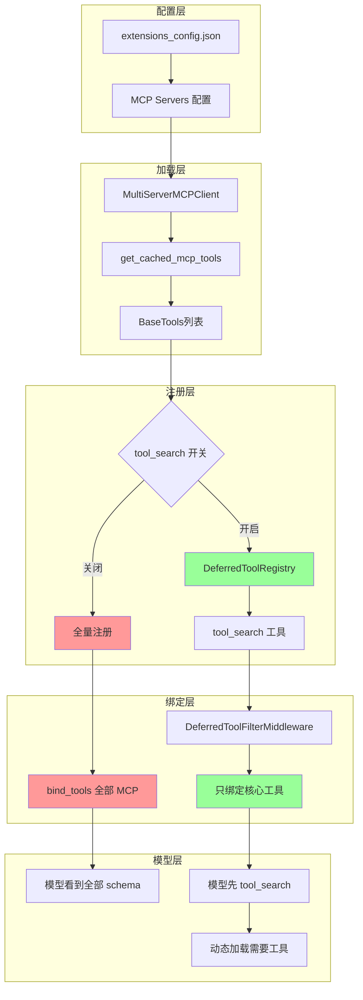

从模型视角，**一次 chat 调用**里真正进入「决策」的工具有限：**`bind_tools` / HTTP `tools` 数组**把每个工具的名称、描述、**JSON Schema parameters** 送给模型。这里有三个常被忽略的推论：

1. **信息瓶颈**：模型对环境的认识，一部分来自 system/user 文本，一部分来自 **工具定义的长度与质量**。加工具不只是「多一个能力」，而是 **多占上下文、多引入混淆**（同名义项、过度重叠的 description）。所以 DeerFlow 会有 **工具过滤**（子 Agent allowlist）、**条件注册**（无 `task` 时动作空间直接少一维）。

2. **MCP 全量注册的 token 成本**：若几十个 MCP 工具一次性绑定，**每次**模型调用都要携带 **全部 function schema**，往往比几轮 `web_search` 结果还贵。**DeferredToolFilter + `tool_search`** 把问题改成两阶段：先只绑「搜索/核心」工具，模型显式拉取 deferred 工具的 schema，再动态出现在后续 turn。优化目标是 **降低平均绑定的 schema 体积**，代价是 **多一轮延迟与更长的对话深度**——属于典型的 **latency–token 权衡**。

   **问题详解**：
   
   想象系统有 50 个 MCP 工具（搜索、计算、数据库查询、文件操作、API 调用等）。
   
   **传统做法（全量注册）**：
   - 每次调用模型时，都要把这 50 个工具的**完整描述**（名称、功能说明、参数格式等）全部发给模型
   - 这些描述可能比几轮搜索结果的内容还要长
   - 即使模型只需要用其中 1-2 个工具，也要先"看"完所有 50 个工具的描述
   - 类比：要开 1 个抽屉，却要先看一遍整个柜子的说明书
   
   **解决方案：两阶段加载**（DeferredToolFilter + tool_search）：
   
   **第一阶段**：
   - 只绑定"核心工具"（如 `tool_search` 工具本身）
   - 模型先评估需要什么能力
   
   **第二阶段**：
   - 模型明确请求："我需要 X 工具"
   - 系统才把 X 工具的详细描述加载进来
   - 然后模型可以使用 X 工具
   
   **实际示例**：
   ```
   全量注册：
   用户：帮我查天气
   系统：[发送 50 个工具的完整描述] → 模型 → 调用 weather 工具
   
   两阶段加载：
   用户：帮我查天气
   系统：[只发送 tool_search 工具] → 模型
   模型：我需要 weather 工具
   系统：[发送 weather 工具的描述] → 模型 → 调用 weather 工具
   ```
   
   **权衡分析**：
   
   **好处**：
   - 平均每次调用携带的工具描述更少
   - 显著节省 token 成本
   - 特别适用于工具多但每次只用到少数几个的场景
   
   **代价**：
   - 多一轮交互（延迟增加）
   - 对话深度变长
   
   **类比理解**：
   - 全量注册：每次点外卖，都要把整本菜单背一遍
   - 两阶段加载：先问"想吃什么"，再给你看相关类别的菜单

3. **Skills 为何不走 `tools` 数组**：Skill 正文可以是 **任意长 Markdown**，若做成 function schema 或塞进 `parameters`，要么 **违反 schema 简洁性**，要么 **爆炸**。所以 Skills 走 **文件 + `read_file`**：把「长内容」从 **绑定阶段** 推迟到 **工具结果阶段**——**`read_file` 仍是标准 Tool**，返回的 **整段字符串** 与别的工具一样，以 **`ToolMessage`** 进入 `messages`。用 **多轮 ReAct** 换 **首轮 bind 更瘦**；不是「不用 tools」，而是 **用通用文件工具当管道，把知识放在 FS**。

<a id="mcp-implementation"></a>

### 5.5 MCP：**如何实现、如何用、如何进 `messages`（和 Skills 对比）**

**MCP 实现流程**：

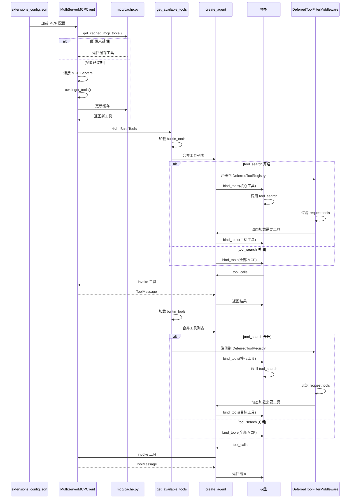

**Skills** 是 **「磁盘文档 + prompt 索引 + 通用文件类工具」**；**MCP** 在 DeerFlow 里是 **「远端/进程外 MCP Server → LangChain `BaseTool` → 与内置工具同一套 tool calling」**。二者 **不共享同一条封装链**：Skills **不经** MCP；MCP **也不**替你读 `SKILL.md`。

#### 如何实现（仓库内路径）

1. **配置**：Gateway 侧读写 **`extensions_config.json`**（含 `mcpServers`、启用开关、stdio/SSE/HTTP、OAuth 等）。  
2. **发现工具**：`deerflow/mcp/tools.py` 里 **`MultiServerMCPClient`（`langchain-mcp-adapters`）** 连各 server，**`await client.get_tools()`** 得到 **`list[BaseTool]`**——每个 MCP 工具已是 **标准 LangChain Tool**（`name` / `description` / `args_schema`，invoke 时走 MCP 协议调远端）。  
3. **OAuth**：`mcp/oauth.py` 可对 HTTP/SSE 注入**鉴权头**；可做 **`tool_interceptor`**。  
4. **缓存与热更新**：`mcp/cache.py` **`get_cached_mcp_tools()`**；配置 **mtime** 变了会 **失效重载**，以便 **Gateway 与 LangGraph 多进程** 下仍能拉到新 MCP。  
5. **并入 Agent**：`get_available_tools`（`tools/tools.py`）把 **`loaded_tools + builtin_tools + mcp_tools`** 交给 **`create_agent`** 的 **ToolNode**；模型侧通过 **`bind_tools` / HTTP `tools`** 看到其中 **允许绑定** 的那一部分（见下 **deferred**）。

<a id="tool-search-toggle-mcp"></a>

#### 为何 `tool_search` **开/关**会改变 MCP 的「行为」？

**核心**：开关 **不改变** MCP Server 是否连接、也不改变 **`get_mcp_tools()` 是否把工具加载进进程**——`mcp_tools` 在两种情况下 **都会** 拼进 `get_available_tools` 的返回值，**ToolNode** 仍 **持有** 可执行的 **`BaseTool`**。变的是 **「模型在每一轮 Chat 请求里能不能直接看到 MCP 的完整 function schema」** 以及 **是否多一个 `tool_search` 工具 + 一段 system 提示**。

| | **`tool_search` 关**（`config` 里默认常见） | **`tool_search` 开** |
|---|----------------|---------------------|
| **`DeferredToolRegistry`** | **不**登记 MCP（`tools.py` 里整块 `if config.tool_search.enabled` **不执行**） | 每个 MCP 工具 **register** 进 registry |
| **`tool_search` 工具** | **不出现**在 builtin 列表 | **追加**到 builtins，模型可调用 |
| **System** | **无** `<available-deferred-tools>` 名字列表（`prompt.py` `get_deferred_tools_prompt_section`） | **有** deferred 工具**名**列表，提示先 `tool_search` 再调 |
| **`DeferredToolFilterMiddleware`** | **不挂载**（`agent.py` 仅当 `app_config.tool_search.enabled` 为真才 `append`） | **每次 `wrap_model_call`** 从 **`request.tools` 去掉** registry 里登记的 **名字**，再交给模型绑定 |
| **模型看到的 MCP** | **每轮** `tools` 数组里带 **全部** MCP 的 **name + description + parameters**（**token 多**，但可 **直接** `tool_calls`） | **每轮绑定**里 **没有**这些 MCP 的完整 schema；需 **`tool_search`** 或靠历史里已有 JSON（见上节）再决定如何调用 |
| **MCP 实际执行** | **ToolNode** 照常能执行 | **同上**（对象仍在全量工具列表里） |

**一句记**：**关 = MCP 当普通工具「全量摊在桌上」；开 = MCP 从「绑给模型的 schema」里藏起来，换 `tool_search` + 中间件过滤 + prompt 点名，省上下文、多一步发现。**

<a id="subagent-deferred-mcp"></a>

#### 主 Agent vs 子 Agent：`tool_search` 打开时绑定一样吗？

**不一样（过滤只作用在「主 Lead 路径」，不含子图）。** **`DeferredToolFilterMiddleware` 由 `_build_middlewares` 挂载**——**`make_lead_agent` 与 `DeerFlowClient._ensure_agent` 共用该函数**，故 **二者主会话**在 **`tool_search` 开** 时 **都会**从 **`request.tools` 摘掉** deferred MCP schema。**`SubagentExecutor._create_agent`** 使用 **`build_subagent_runtime_middlewares`**，**没有** deferred 过滤。

因此 **`tool_search` 开启** 时：**主会话**（Gateway 或嵌入式 Client）按上表 **绑定更瘦**；**子 Agent**（`task` 内）从 **`get_available_tools(..., subagent_enabled=False)`** 拿到 **同一套**全量工具（含 MCP **`BaseTool`**、以及开启 deferred 时 **builtin `tool_search`**），但 **子图每轮 `wrap_model_call` 不会** 自动去掉 deferred 名字——**子侧模型很可能仍每轮在 API 里看到完整 MCP function 定义**（除非未来与主 Agent 对齐）。**省 token / 先 `tool_search` 再调 MCP 的产品叙事，主要针对主对话路径。**

<a id="deferred-meaning"></a>

#### 「Deferred」是什么意思？为何有**两种**方案？常见误解纠正

**Deferred（推迟）指什么？**  
指把 MCP 工具的 **完整 function 定义（description + parameters 等）** **推迟**再塞进「**每一轮**发给大模型的 **`tools` / `bind_tools` 列表」——**不是**推迟执行、**不是** MCP Server 晚启动。对象早已加载进进程，**ToolNode** 手里一直有 **`BaseTool`**；只是 **模型侧**若干轮里 **看不到** 这些 schema，或只看到 **名字**（`<available-deferred-tools>`）和/或通过 **`tool_search`** 在 **`ToolMessage` 里**读到 JSON。

**为何要做两种方案？**  
- **关**：实现简单、模型 **开箱即用** 调 MCP；代价是 **MCP 一多，每轮请求里 schema 占 token 暴涨**（§5.4）。  
- **开**：用 **多一步 `tool_search` + 历史里长 JSON** 换 **多数轮绑定更瘦**；代价是 **发现延迟**、流程变长、与 **供应商是否校验「tool_calls 必须属于当轮 tools 列表」** 有关。

**对你理解的逐条对齐与纠正**

| 你的说法 | 更精确的说法 |
|----------|----------------|
| **关**：每个 MCP 一个 tool 定义，和普通 tool 一样传给大模型 | **对。** 每个 MCP 能力 = 一个 **`BaseTool`**，与其它工具一起进 **每轮绑定**。 |
| **开**：只给大模型一个 `tool_search`，它等于所有 MCP | **前半句不严谨。** 开的时候模型 **仍然**绑定 **`read_file`、`bash`、`config.yaml` 里配的业务工具**（如 `web_search`）、`present_files`、`ask_clarification` 等 **非 deferred** 工具；**额外多一个** **`tool_search`**。**被藏起来的只是** registry 里那些 **MCP 衍生工具** 的 **schema**。`tool_search` **本身不是**「所有 MCP 的合体」，而是一个 **按关键词/名字查 deferred 列表、返回匹配项的 OpenAI function JSON 字符串** 的普通工具。 |
| 搜到之后调用和普通 tool 一样，但 tool 不存在、要中间件拦截伪造 | **执行侧 tool 存在。** 每个 MCP 仍是 **真实的 `BaseTool`**，挂在 **全量工具列表** 上，**ToolNode 按名字执行**，走 **MCP adapter**，**没有**「中间件假装执行 MCP」这条路径。**`DeferredToolFilterMiddleware` 只做一件事**：在 **`wrap_model_call`** 里 **改写即将绑给模型的 `request.tools`**，**去掉** deferred 名字；**不**包在 **`wrap_tool_call`** 里拦截每一次 MCP 调用。与 **`ClarificationMiddleware`**（拦截 `ask_clarification`）是 **不同类** 中间件。 |

**流程心智图（开）**  

```
加载阶段：mcp_tools → 全进 Agent 工具列表（ToolNode 可执行）
          └→ 同时 register 进 DeferredToolRegistry

每轮调模型前：DeferredToolFilterMiddleware → request.tools = 全量 − deferred 名
          → 大模型本轮「看见的」tools 里没有 MCP 长 schema

可选：模型调 tool_search → ToolMessage 里 JSON（若干 MCP 的完整定义）
模型再发 tool_calls：name = 某个 mcp__xxx → ToolNode 用已有 BaseTool 真执行
```

<a id="tool-search-implementation"></a>

#### `tool_search` 实现摘要（Catalog、promoted 状态、检索语法）

> **实现已演进（2026-06）**：当前为 **`DeferredToolCatalog` + `assemble_deferred_tools` + `ThreadState.promoted`**，不再使用早期的 **`DeferredToolRegistry` 全局单例**。`DeferredToolFilterMiddleware` 除 **`wrap_model_call` 过滤 schema** 外，还在 **`wrap_tool_call` 拦截未 promote 的 deferred 调用**。详见 **[附录 B.2](#appendix-memory-tools)**。

实现集中在 **`tools/builtins/tool_search.py`**：

1. **`DeferredToolCatalog`**（immutable）：`search(query)` 在 **name + description** 上匹配，返回最多 **`MAX_RESULTS`（5）** 个 **`BaseTool`**；**`hash`** 为 catalog schema 摘要，写入 **`state.promoted.catalog_hash`**。  
2. **查询语法**：**`select:name1,name2`**；**`+keyword rest`**；否则 **正则**（非法 pattern 转义为字面量）。  
3. **`tool_search` 工具**：命中后 **`Command(update={promoted, messages:[ToolMessage(JSON schemas)]})`**。  
4. **装配**：**`assemble_deferred_tools(filtered, enabled)`** 在 **`agent.py`** **skill 策略过滤之后** 调用；**fail-closed** 若 enabled 且有 MCP 却无 deferred 集。

**源码指针（相对仓库根 `deer-flow/`）** — 均以 **harness** 包为准：

| 职责 | 路径 |
|------|------|
| **`DeferredToolFilterMiddleware`**（`wrap_model_call` 从 `request.tools` 去掉 deferred 名） | [`backend/packages/harness/deerflow/agents/middlewares/deferred_tool_filter_middleware.py`](../packages/harness/deerflow/agents/middlewares/deferred_tool_filter_middleware.py) |
| **`DeferredToolCatalog` / `assemble_deferred_tools` / `tool_search` 工具** | [`backend/packages/harness/deerflow/tools/builtins/tool_search.py`](../packages/harness/deerflow/tools/builtins/tool_search.py) |
| **`ToolSearchConfig`、YAML/字典加载** | [`backend/packages/harness/deerflow/config/tool_search_config.py`](../packages/harness/deerflow/config/tool_search_config.py) |
| **`app_config.tool_search` 并入总配置** | [`backend/packages/harness/deerflow/config/app_config.py`](../packages/harness/deerflow/config/app_config.py) |
| **开启 `tool_search` 时：MCP 进 registry、builtin 追加 `tool_search`** | [`backend/packages/harness/deerflow/tools/tools.py`](../packages/harness/deerflow/tools/tools.py) |
| **Lead agent：`tool_search.enabled` 时注册上述中间件** | [`backend/packages/harness/deerflow/agents/lead_agent/agent.py`](../packages/harness/deerflow/agents/lead_agent/agent.py) |
| **System prompt：deferred 工具名列表 / `tool_search` 说明** | [`backend/packages/harness/deerflow/agents/lead_agent/prompt.py`](../packages/harness/deerflow/agents/lead_agent/prompt.py) |
| **行为与中间件单测** | [`backend/tests/test_tool_search.py`](../tests/test_tool_search.py) |

#### 如何使用（模型与运维）

- **运维**：在扩展配置里 **启用 server**，保证 LangGraph 进程能访问（本机 stdio / 网络 URL）。  
- **模型**：与普通函数工具一样 —— **`AIMessage.tool_calls`** 里出现 **`function.name`** 对应 MCP 衍生工具名（可带 **前缀** `tool_name_prefix=True`）；**参数** 走 JSON Schema；执行由 **LangChain Tool → MCP adapter → Server** 完成。  
- **关闭 `tool_search`**：所有已加载 MCP 工具 **与配置/内置工具一起** 进入每轮 **可见工具 schema**（token 压力大时见 §5.4）。  
- **开启 `tool_search`（deferred）**：  
  - MCP 工具对象 **仍加入** `get_available_tools` 返回的 **全量列表**；**ToolNode** 侧 **可按工具名路由、执行** 到对应 **`BaseTool`**（含 MCP 衍生的工具）。  
  - **`DeferredToolRegistry`** 登记这些工具；**`DeferredToolFilterMiddleware`** 在 **每次 `wrap_model_call`** 里从 **`request.tools` 去掉** 所有 deferred **名字**，使 **本轮绑定给 Chat API 的 `tools` schema** 不含这些 MCP 函数定义（省 token）。  
  - 模型可先调 **`tool_search`**：返回值为 **JSON 字符串**（`convert_to_openai_function` 得到的 **OpenAI function 定义数组**），作为 **`tool_search` 对应的那条 `ToolMessage.content`** 进入 `messages`，供模型 **在对话里「看到」完整 name/description/parameters**。  
  - **后续轮**：若模型发出 **指向某 MCP 工具名** 的 **`tool_calls`**，**ToolNode** 仍可能 **执行** registry 里已有对象（与 **供应商/Chat API 是否要求 tool 必须出现在当轮 `tools` 绑定列表** 有关；若 API 校验严格，需以所用 **LangChain/LangGraph + 模型供应商** 的实际行为为准）。产品设计意图是：**用一轮 `tool_search` 的 ToolMessage 换多轮「不把全部 MCP schema 绑在请求里」**。

####「如何封装 message」——没有第二条 MCP 专用消息类型

- **进 `messages` 的只有标准对话消息**：**User / System / AI / Tool**。  
- **一次 MCP 调用**：对历史而言与 **`web_search`/`bash` 无区别** —— 先有一条 **`AIMessage`（带指向该 MCP 工具名的 `tool_calls`）**，再有一条 **`ToolMessage`（`tool_call_id` 对齐，`content` 为 adapter 把远端结果转成的字符串或结构化文本）**。  
- **没有**「MCP 包一层专用 envelope」塞进 `messages`；**MCP 协议** 只发生在 **adapter ↔ MCP Server** 之间，对 **LLM 暴露面** 仍是 **OpenAI 式 tool calling**。  
- **`tool_search` 的「封装」**：只是把 **若干工具的完整 JSON Schema** 放进 **`tool_search` 那次调用的 `ToolMessage.content`**（很长时同样占上下文），换取 **前面若干轮不绑全量 MCP schema**。

#### 与 Skills 一句对照

| | **Skills** | **MCP** |
|---|------------|---------|
| **能力从哪声明** | system 里 **索引** + 路径 | **`tools` / `bind_tools`**（或 deferred + **`tool_search` 返回的 JSON**） |
| **执行载体** | **`read_file` 等已有工具** | **每个 MCP 能力 = 独立 `BaseTool`** |
| **进历史的形状** | 多为 **`read_file` 的 `ToolMessage`** | **`tool_calls` 对应工具的 `ToolMessage`**（与内置工具同形） |

<a id="skills-mcp-full-example"></a>

### 5.6 完整示例：同一线程里 Skills 与 MCP 在 `messages` 里长什么样

下面是一个 **虚构但贴合机制** 的「消息时间线」：同一名用户、同一 `thread_id`，已启用 **chart 类 Skill**；并假设扩展里接了 **GitHub MCP**（工具名带前缀，形如 `mcp__github__search_repositories`，真实名称以 **`MultiServerMCPClient(..., tool_name_prefix=True)`** 产出为准）。

#### 设定

- **System**（节选）：含 `<skill_system>` 里 **`chart-visualization`** 的 name/description/`/mnt/skills/.../SKILL.md`；若 **`tool_search` 开启**，另有 `<available-deferred-tools>` 列出 **deferred 的 MCP 工具名**（仅名字，无长 schema）。  
- **本轮绑定到 Chat API 的 `tools`**（以下 **默认指主 Agent**；**子 Agent** 见 [§5.5 主/子差异](#subagent-deferred-mcp)）：  
  - **无 deferred**：`read_file`、`bash`、`present_files`、`web_search`、…、**全部 MCP 工具 schema**。  
  - **有 deferred**：`read_file`、`bash`、…、**`tool_search`**、（可选少量非 MCP 工具）—— **不含** deferred MCP 的整段 function schema；MCP 仍有 **可执行对象** 挂在 **ToolNode**。

---

#### 时间线 A：只做 Skill（不调用 MCP）

| 步 | 角色 | 发生了什么 |
|---|------|------------|
| 1 | User | `HumanMessage`：「用面积图展示这组月度销量 …」 |
| 2 | Model | `AIMessage`：`tool_calls=[{name: read_file, args: {path: /mnt/skills/.../SKILL.md}}]` |
| 3 | Tool | `ToolMessage`：`content` = **整份 SKILL.md 文本**，`tool_call_id` 对齐 |
| 4 | Model | `AIMessage`：`tool_calls=[{name: read_file, args: {path: .../references/generate_area_chart.md}}]` |
| 5 | Tool | `ToolMessage`：reference 全文 |
| 6 | Model | `AIMessage`：`tool_calls=[{name: bash, args: {...}}]`（跑 `generate.js`） |
| 7 | Tool | `ToolMessage`：脚本 stdout（如图链接） |
| 8 | Model | `AIMessage`：**纯文本**回复用户（可无 `tool_calls`） |
| 9 | （可选） | `present_files` → `Command` 更新 **`artifacts`** + 一条短 **`ToolMessage`** |

**要点**：Skill **从不**作为单独的 `tools` 数组项出现；**`read_file` / `bash`** 出现在 `tools` 里，**返回全是 `ToolMessage`**。

---

#### 时间线 B：只做 MCP（`tool_search` 关闭，GitHub 已启用）

| 步 | 角色 | 发生了什么 |
|---|------|------------|
| 1 | User | `HumanMessage`：「查一下 deer-flow 仓库本周有无新 PR」 |
| 2 | Model | `AIMessage`：`tool_calls=[{name: mcp__github__search_pull_requests, args: {...}}]`（**本步请求里的 `tools` 已含该函数完整 schema**） |
| 3 | Tool | `ToolMessage`：`content` = adapter 从 GitHub MCP 取回的 **字符串化结果**（JSON/Markdown 等） |
| 4 | Model | `AIMessage`：汇总答用户 |

**要点**：MCP 与 `web_search` 一样占 **`tools` 定义**；**历史形态仍是 AI → Tool**。

---

#### 时间线 C：`tool_search` 开启（deferred MCP）时的 **额外** 前几步

在 **时间线 B** 的 **第 2 步之前**，模型可能先 **发现 schema**（当本轮绑定里 **没有** 该 MCP 函数定义时，依产品与你的模型/供应商行为而定）：

| 步 | 角色 | 发生了什么 |
|---|------|------------|
| C1 | Model | `AIMessage`：`tool_calls=[{name: tool_search, args: {query: "+github pull"}}]` |
| C2 | Tool | `ToolMessage`：`content` = **`tool_search` 返回的 JSON 字符串**（内含 `name` / `description` / `parameters` 等 OpenAI function 形态），占上下文 |
| C3 | Model | `AIMessage`：对 **`mcp__github__...`** 发起 **`tool_calls`**（参数需与 C2 中 schema 一致） |
| C4 | Tool | `ToolMessage`：MCP **真实执行结果** |

之后才接 **时间线 B 第 4 步** 一类总结。

**要点**：**多一轮「tool_search + 长 ToolMessage」** 换 **之前若干轮不把全部 MCP schema 绑进请求**；**没有**新的 `messages` 类型。

---

#### 和 checkpoint 的关系

上述 **`messages` + `artifacts`（若有）** 随 **主线程 `ThreadState`** **一并 checkpoint**（见 §3）。**子 Agent** 内部链不在此例展开（见 §3.2）。

<a id="tool-skill-industry-pattern"></a>

### 5.7 Tool/MCP 与 Skill：**行业常见模式** vs **DeerFlow 默认**

**并非**所有 Agent 都「不全量绑工具」；**规模上来后**常见做法是 **「首轮只暴露必要工具 + 发现类工具」**，Skill 则常用 **「短索引在 system + 正文晚到」**。

| 层 | **常见模式（工具/MCP 多的时候）** | **DeerFlow 默认** |
|----|-----------------------------------|-------------------|
| **Tool / MCP** | **常驻少量 + `tool_search` / list / router**；当前 `bind_tools` 里找不到合适能力时 **先检索** 再暴露 schema | **`tool_search` 关**：MCP **全量 schema** 绑进每轮；**开**：deferred + **`tool_search`** + **`DeferredToolFilterMiddleware`**（[§5.5](#mcp-implementation)、[`#tool-search-implementation`](#tool-search-implementation)） |
| **Skill** | **name + 一句 description + 路径** 在 prompt；**`read_file(SKILL.md)`** → **references/ 脚本按需** | **`<skill_system><available_skills>`** 全量短索引 + **Progressive Loading**（`prompt.py` 步骤 1–5） |
| **索引也膨胀时** | **少量置顶 skill + `search_skills`**（返回 Top-K 元数据）→ 再 **`read_file`**；开源侧 **少统一命名**，可参考 **LangChain4j [Tool Search](https://github.com/langchain4j/langchain4j/pull/4570)** 思路、**`deepagents` `SkillsMiddleware`** 的渐进叙事 |

**一句记**：**Tool 侧 DeerFlow 已有 deferred + `tool_search`；Skill 侧默认全量短索引——技能多到索引也装不下时，在不破坏渐进加载的前提下加 `search_skills`，与 Tool 侧对称。**

---


---

<a id="appendix-memory-tools"></a>

## 附录 B：Memory 与 Tool 子系统

> **并入说明**：原独立文档 `MEMORY_AND_TOOLS.md` 已合并入本附录。与 **[§5.5](#mcp-implementation)**、**[§9.1](#agents-memory-walkthrough)**、**[§4.2.1](#clarification-interrupt)** 互补；涉及 **DynamicContext 注入**、**DeferredToolCatalog**、**state.promoted**、**MCP session pool**、**完整 Tool 装配** 时，**以本节为当前源码权威描述**。

**源码根目录**：`packages/harness/deerflow/`

| 主题 | 关键模块 |
|------|----------|
| Memory 写入 | `agents/middlewares/memory_middleware.py`, `agents/memory/queue.py`, `agents/memory/updater.py` |
| Memory 读取/注入 | `agents/middlewares/dynamic_context_middleware.py`, `agents/lead_agent/prompt.py` |
| Memory 存储 | `agents/memory/storage.py`, `config/paths.py` |
| tool_search | `tools/builtins/tool_search.py`, `agents/middlewares/deferred_tool_filter_middleware.py` |
| ask_clarification | `tools/builtins/clarification_tool.py`, `agents/middlewares/clarification_middleware.py` |
| MCP | `mcp/tools.py`, `mcp/cache.py`, `mcp/session_pool.py`, `mcp/client.py` |
| Tool 装配 | `tools/tools.py`, `agents/lead_agent/agent.py`, `skills/tool_policy.py` |

### B.1 Memory 系统

#### B.1.1 与 Checkpointer 的区别

| 机制 | 作用 | 存储 | 生命周期 |
|------|------|------|----------|
| **LangGraph Checkpointer** | 多轮 `messages` / graph state | `checkpoints.db` 等 | 会话级 |
| **Memory（本节）** | 跨会话用户画像、历史摘要、离散 facts | `memory.json` | 用户级长期个性化 |

#### B.1.2 数据模型（`memory.json`）

```json
{
  "version": "1.0",
  "lastUpdated": "2026-06-18T...Z",
  "user": {
    "workContext":      { "summary": "...", "updatedAt": "..." },
    "personalContext":  { "summary": "...", "updatedAt": "..." },
    "topOfMind":        { "summary": "...", "updatedAt": "..." }
  },
  "history": {
    "recentMonths":        { "summary": "...", "updatedAt": "..." },
    "earlierContext":      { "summary": "...", "updatedAt": "..." },
    "longTermBackground":  { "summary": "...", "updatedAt": "..." }
  },
  "facts": [
    {
      "id": "fact_abc123",
      "content": "...",
      "category": "preference|knowledge|context|behavior|goal|correction",
      "confidence": 0.9,
      "createdAt": "...",
      "source": "thread_id 或 manual",
      "sourceError": "可选，correction 类记录先前错误"
    }
  ]
}
```

#### B.1.3 文件路径与读写

**默认路径**（`Paths.base_dir` = `backend/.deer-flow/`）：

```text
.deer-flow/users/{user_id}/memory.json
.deer-flow/users/{user_id}/agents/{agent_name}/memory.json
```

- `user_id` 来自 `get_effective_user_id()`，无鉴权时为 `"default"`
- `memory.storage_path` 为**绝对路径**时退出 per-user 隔离

**读**：`FileMemoryStorage.load()` — JSON + mtime 缓存。**写**：临时文件 + `replace()` 原子替换。

**Gateway API**（`app/gateway/routers/memory.py`）：`GET/DELETE /api/memory`、`POST /api/memory/reload`、`/memory/facts` CRUD、`import/export`。Agent **没有** `read_memory` / `save_memory` 类 tool。

#### B.1.4 注入 Prompt 链路（读路径）

**System Prompt 保持静态**；memory 注入到**首条用户消息**前的 `<system-reminder>` HumanMessage。

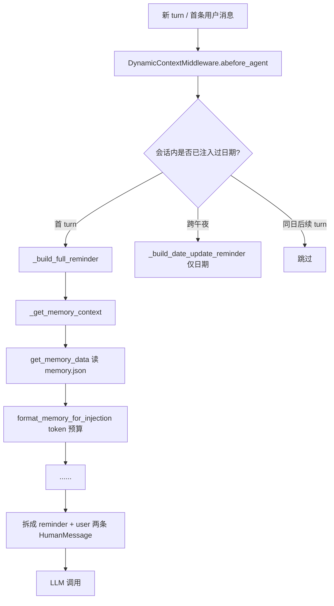

**`format_memory_for_injection()`** 顺序：User Context → History → Facts（按 confidence 降序，直至 `max_injection_tokens` 预算）。

**同 session 冻结**：首 turn 注入后 reminder 不变；`memory.json` debounce 更新后，**当前 thread 已注入块 mid-session 不刷新**。

#### B.1.5 写入链路（写路径）

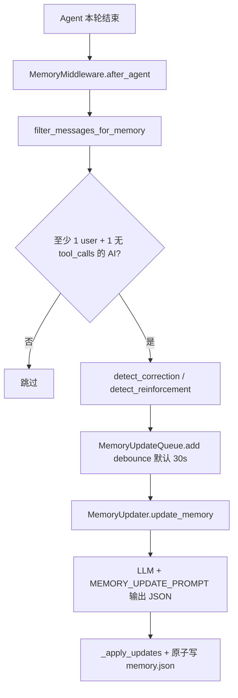

**过滤规则**：仅 user + 最终 AI（无 `tool_calls`）；strip `<uploaded_files>`；enqueue 时捕获 `user_id`（跨 `threading.Timer` 边界）。

#### B.1.6 Memory 相关中间件

| 中间件 | 钩子 | 职责 |
|--------|------|------|
| **DynamicContextMiddleware** | `before_agent` | 读 memory + 日期，注入 `<system-reminder>` |
| **MemoryMiddleware** | `after_agent` | 过滤 messages，入 debounce 队列 |
| SummarizationMiddleware | `before_model` | 对话上下文压缩，**与 memory.json 无关** |

#### B.1.7 配置（`config.yaml` → `memory`）

```yaml
memory:
  enabled: true
  injection_enabled: true
  debounce_seconds: 30
  max_injection_tokens: 2000
  token_counting: tiktoken   # 或 char（内网）
```

#### B.1.8 Memory 读写与沉淀时序（跨 turn / 跨 thread）

下图把 **读（注入）**、**写（队列 + 防抖 + 二次 LLM）**、**落盘** 与 **下一局何时生效** 放在同一时间轴上。与上文 flowchart 互补：flowchart 看分支，本图看 **参与者与先后**。

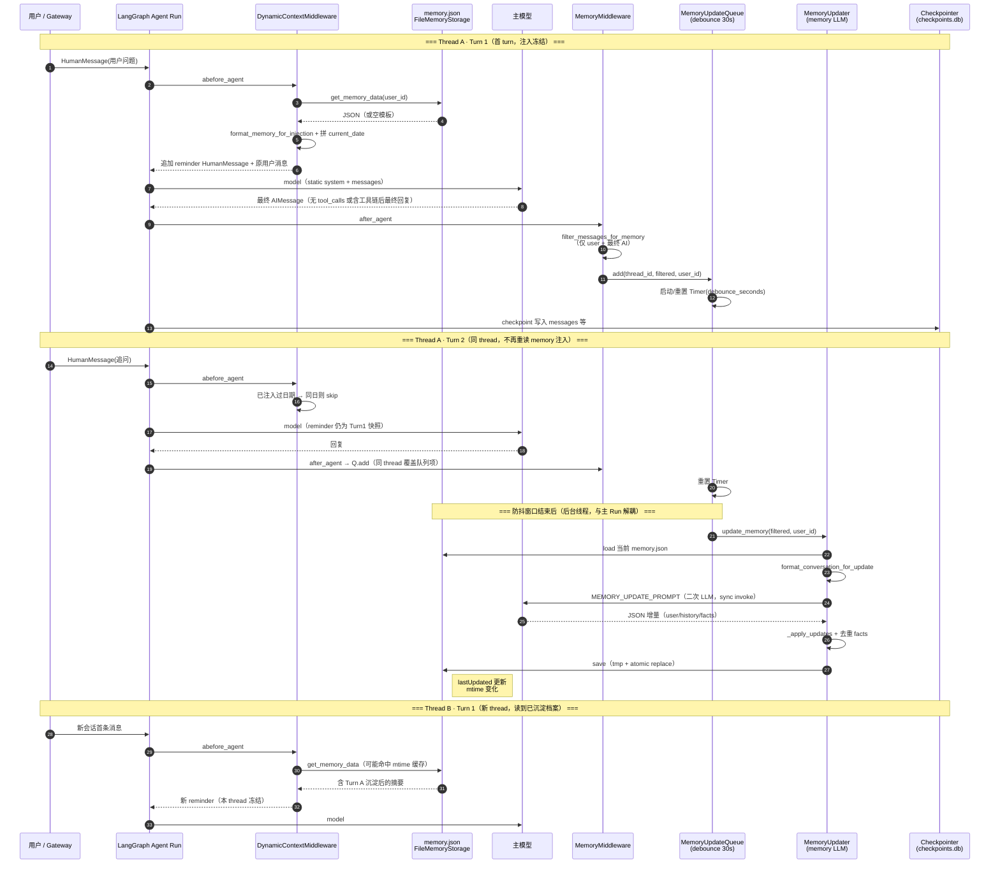

**读写的「生效边界」**（对照上表序号）：

| 阶段 | 何时读 `memory.json` | 何时写 `memory.json` | 模型何时「看见」新沉淀 |
|------|----------------------|----------------------|------------------------|
| 同 thread 后续 turn | **不**重读（reminder 冻结） | debounce 后异步写 | **本 thread 内看不见** mid-session 更新 |
| 新 thread 首 turn | `DynamicContext` 读盘 | 上一轮 debounce 可能刚写完 | **新 thread 首条 reminder** 带最新摘要 |
| Gateway `POST /memory/reload` | 强制 `reload()` 清 mtime 缓存 | 人工 CRUD / import | 下次 **新 thread** 或进程内下次 **首 turn** 注入 |
| `memory.injection_enabled: false` | 跳过注入 | `enabled: true` 时仍可写 | 永不注入，仅后台沉淀 |

**与 Checkpointer 并行**：主对话的 `messages` / `artifacts` 由 **Checkpointer** 按 `thread_id` 存档；**Memory** 按 `user_id`（及可选 `agent_name`）写 **另一份 JSON**，二者 **无自动双向同步**。

<a id="memory-session-compression"></a>

#### B.1.9 三层存储与会话压缩

DeerFlow 里与「记忆」相关的数据落在 **三个互不替代** 的层；混淆它们是调试时最常见的问题。

| 层 | 存什么 | 存储位置 | 绑定键 | 谁读写 |
|----|--------|----------|--------|--------|
| **① Session（Checkpoint）** | 本会话 `messages`、`artifacts`、`todos`、`sandbox_id`、`thread_data`… | `checkpoints.db`（或配置的 checkpointer 后端） | `thread_id` | LangGraph 每步自动 checkpoint |
| **② Session 文件系统** | workspace/uploads/outputs 真实文件 | `.deer-flow/users/{user_id}/threads/{thread_id}/user-data/` | `thread_id` | 沙箱工具读写磁盘 |
| **③ 长期 Memory** | 跨会话用户画像（`user` / `history` / `facts`） | `memory.json`（或 per-agent 路径） | `user_id` | `DynamicContext` 读、`MemoryUpdater` 写 |

**命名陷阱**：checkpointer 配置里的 `type: memory`（如 `InMemorySaver`）是 **checkpoint 后端类型**，与 `agents/memory/`、`memory.json` **无关**。

##### 会话内压缩：`SummarizationMiddleware`

**作用对象**：仅 **当前 thread 的 `messages` 历史**（checkpoint 内），在上下文逼近模型上限时触发。

| 项 | 说明 |
|----|------|
| **钩子** | `before_model`（在 Lead 链中位于 DynamicContext **之后**、Todo **之前**） |
| **触发** | `config.yaml` → `summarization`：`trigger` 可为 token 数、消息条数或 context 比例 |
| **行为** | 保留 **近期 tail**，将更早的轮次 **摘要成一条消息** 写回 `messages` |
| **不压缩** | 静态 `SYSTEM_PROMPT_TEMPLATE`、已注入的 `<system-reminder>`、`memory.json` 文件本体 |

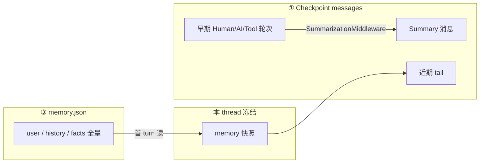

**与 Plan 模式**：`ThreadState.todos` 在 checkpoint 中 **独立于** `messages`；摘要可能滚掉 `write_todos` 的 tool 轮次，由 **`TodoMiddleware.before_model`** 注入 `todo_reminder` 补可见性（见 [§9.8](#plan-mode-is-plan-mode)）。

**与长期 Memory 写入**：`MemoryMiddleware.after_agent` 在摘要 **可能已发生之后** 运行；入队的是 **过滤后** 的 user + 最终 AI（无 ToolMessage），故长期档案是 **对话结论级摘要**，不是工具轨迹原文。

##### 长期 Memory 的两种「压缩」

| 阶段 | 机制 | 配置 |
|------|------|------|
| **写入压缩** | `MemoryUpdater` 用 **第二次 LLM** + `MEMORY_UPDATE_PROMPT`，把本轮对话 **合并进** 结构化 JSON（更新 `user.*.summary`、`history.*`、`facts`） | `memory.enabled`、`debounce_seconds`（默认 30）、`max_facts`（默认 100）、`fact_confidence_threshold` |
| **注入压缩** | `format_memory_for_injection` 从 JSON **按预算裁剪** 成短文本放进 `<memory>` | `max_injection_tokens`（默认 2000）、`token_counting`（`tiktoken` / `char`） |

**`format_memory_for_injection` 裁剪顺序**：

1. User Context（work / personal / topOfMind）
2. History（recentMonths → earlierContext → longTermBackground）
3. Facts（按 `confidence` 降序，直到 token 预算用尽）

磁盘上的 `memory.json` **保留完整结构**（受 `max_facts` 等写入侧限制）；注入只是 **读路径上的有损投影**。

##### 新会话如何「记住」用户

```text
Thread A 多轮对话
  → checkpoint 保存完整（或摘要后）messages
  → debounce 后 memory.json 异步更新

Thread B 新开（新 thread_id）
  → checkpoint messages 为空
  → DynamicContext 首 turn 读 memory.json → 注入 <memory>
  → 模型获得跨会话画像，但看不到 Thread A 的原始 tool 轨迹
```

**同 thread 内**：首 turn 注入的 `<memory>` **冻结**；debounce 写盘后 **本 thread 不会** mid-session 刷新 reminder——新沉淀要到 **下一个 thread 的首 turn** 或 Gateway `POST /api/memory/reload` 后才有机会进入注入路径。

---

### B.2 tool_search 与 DeferredToolFilterMiddleware

**动机**：MCP schema 过大 → **延迟绑定**。模型只见 `<available-deferred-tools>` 名称；完整 schema 经 **`tool_search`** promote 后才进入 `bind_tools`；**ToolNode 仍注册全部工具**。

**装配**（`agent.py`）：

```text
get_available_tools() → filter_tools_by_skill_allowed_tools() → assemble_deferred_tools()
```

- 仅 `metadata.deerflow_mcp = true` 的工具 defer（`tag_mcp_tool` / `is_mcp_tool`）
- `tool_search` 返回 `Command(update={promoted, messages})`；`ThreadState.promoted` 由 `merge_promoted` reducer 合并
- **Fail-closed**：enabled 且有 MCP 但 deferred 集为空 → `RuntimeError`

**DeferredToolFilterMiddleware**：

| 钩子 | 行为 |
|------|------|
| `wrap_model_call` | 从 `request.tools` 移除 hidden deferred schema |
| `wrap_tool_call` | 未 promote 即调用 deferred 工具 → error ToolMessage |

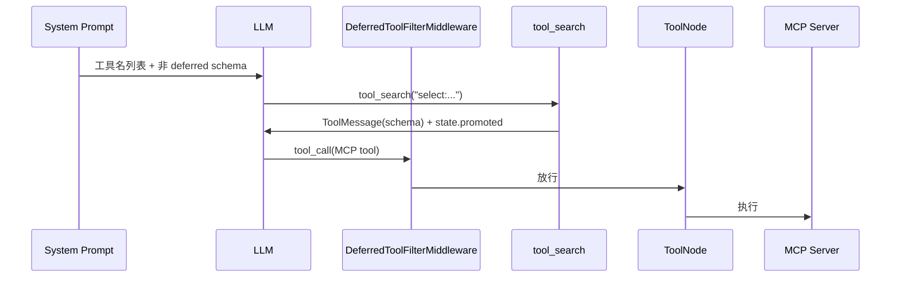

```yaml
tool_search:
  enabled: false   # true → deferred MCP
```

---

### B.3 ask_clarification 与 ClarificationMiddleware

- **Tool**：占位实现 + `return_direct=True`；**ClarificationMiddleware** 在 `wrap_tool_call` **最外层**拦截
- 命中后：`Command(update={messages:[ToolMessage]}, goto=END)` → 本 run 结束，等用户 `HumanMessage`
- 参数：`question`、`clarification_type`、`context`、`options`
- 与 **DeferredToolFilter**、**MemoryMiddleware** 的配合见 **[§4.2.1](#clarification-interrupt)**

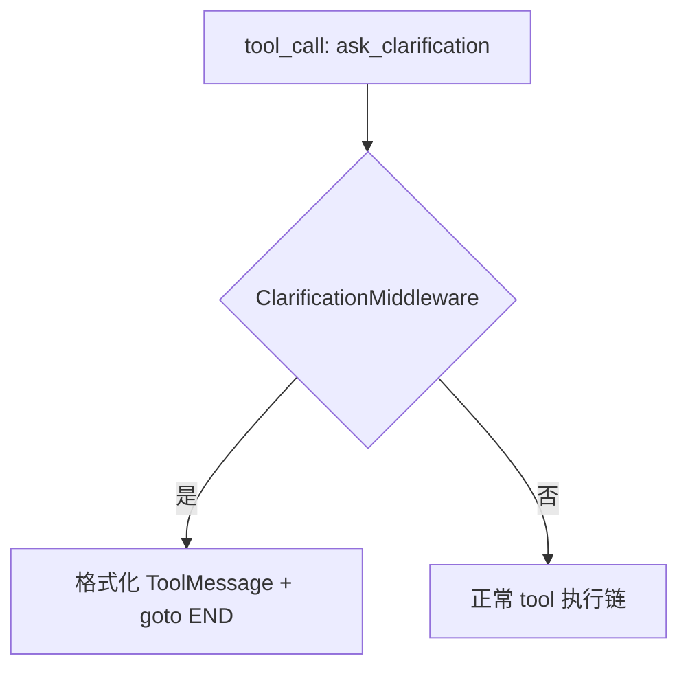

---

### B.4 MCP 工具：加载、缓存与调用

**配置**：`extensions_config.json` → `mcpServers`。**每次** `ExtensionsConfig.from_file()` 读盘。

#### B.4.1 MCP 加载时序（冷启动 / 缓存命中 / 热更新）

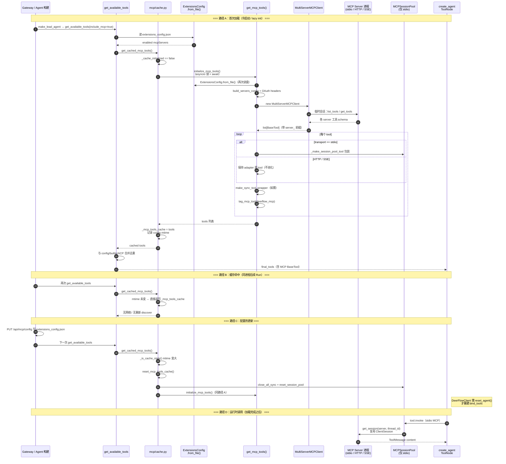

**加载 vs 调用**：

| 阶段 | 发生时机 | 产物 | 是否按 thread 隔离 |
|------|----------|------|-------------------|
| **Discover**（`get_tools`） | 冷启动 / cache miss / 热更新 | 进程内 `BaseTool` 列表 + schema | 否（全局缓存） |
| **Session 池化** | stdio 工具首次 invoke | `(server, thread_id)` → 持久 MCP 会话 | **是**（有状态 server 如 Playwright） |
| **HTTP/SSE invoke** | 每次 tool call | adapter 自建连接，不进入 Pool | 视 server 而定 |

上文 **flowchart**（B.4 原图）保留作步骤总览；本 **sequenceDiagram** 强调 **缓存、mtime 失效、与 Agent 构建的调用关系**。

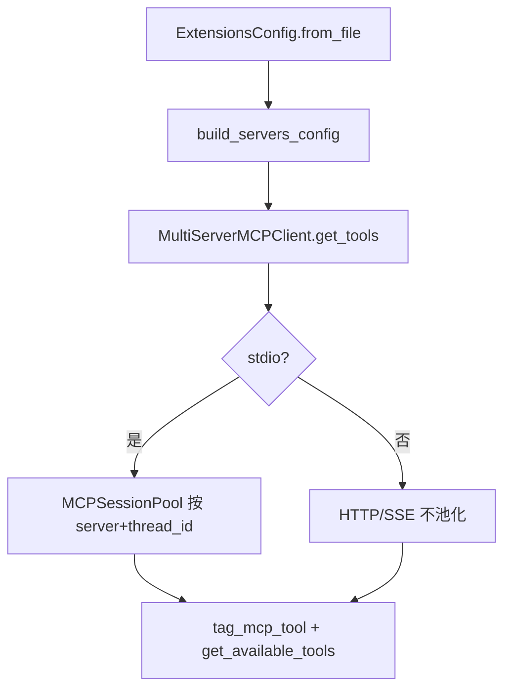

**缓存**（`mcp/cache.py`）：`_mcp_tools_cache` + `extensions_config.json` mtime；stale 时 `reset_mcp_tools_cache()` 并关闭 session pool。

**热更新**：`PUT /api/mcp/config` → mtime 变化 → 下次 `get_cached_mcp_tools()` 重载。

---

### B.5 完整 Tool 加载与绑定流程

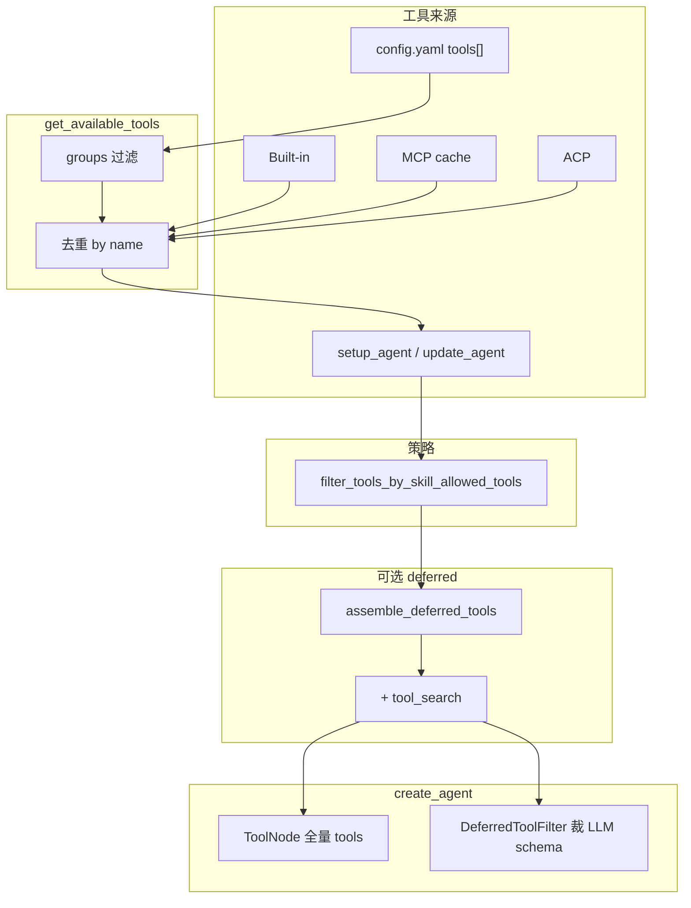

**运行时调用链**：

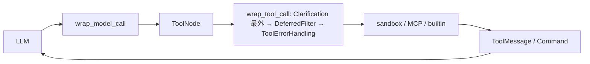

**去重优先级**：config tools > builtin > MCP > ACP（同名跳过后者）。

---

### B.6 配置速查

```yaml
memory:
  enabled: true
  injection_enabled: true
tool_search:
  enabled: false
# extensions_config.json → mcpServers
```

---

## 六、Skills 范式

> **本章焦点**：Skills **无独立运行时**——索引在 system、正文经 `read_file` 进入历史；含全链路示例与 token 膨胀分析。


1. **加载**：`skills/loader.py` + **extensions 启用**。  
2. **进 prompt**：只注入 **目录级索引**，不注入全文。  
3. **选用**：**无硬编码路由**；**LLM** 对齐 description 与用户意图。  
4. **执行**：**通用 `read_file`** → **ToolMessage**；Skill **不是**可执行代码。  
5. **成本**：长 SKILL **占历史 token**；多轮工具后 **上下文会急剧变长**（见 **§6.2**）；缓解依赖 **摘要**、**分段读**、**文档瘦身**、**渐进引用**。

**设计思想**：**Skills = 版本化的运营/领域知识**，用文件系统管理，用 **同一套文件工具** 消费，避免为每个 skill 写插件 API。

<a id="skill-example-chart-visualization"></a>

### 6.1 全链路示例：`chart-visualization`

仓库路径：`skills/public/chart-visualization/`（含 `SKILL.md`、`references/*.md`、`scripts/generate.js`）。用于说明 **Skill 依赖 reference 文档与脚本时**，上下文如何堆叠、**谁在「执行」**。

#### 核心结论（先记三条）

1. **没有 Skill 运行时**：框架不调用 `execute_skill`；**执行** = 模型按 `SKILL.md` 说明，自行发起 **`read_file` / `bash`** 等**已配置工具**。  
2. **references / 脚本内容默认不在 system**：先只有 `<skill_system>` 里 **name + description + `SKILL.md` 路径**；reference 与脚本是 **后续 `read_file` 或 `bash` 的返回值**，以 **`ToolMessage`** 进入 `messages`。  
3. **「识别与继续推理」** = 标准 **ReAct**：每步工具结果 append → 再调模型 → 新的 `tool_calls` 或最终用户回复。

#### 1）初始：system 里有什么

- 除 DeerFlow 通用块外，`<skill_system>` 中有 **索引项**，例如：

```xml
<skill>
  <name>chart-visualization</name>
  <description>... visualize data ... JavaScript script ...</description>
  <location>/mnt/skills/public/chart-visualization/SKILL.md</location>
</skill>
```

- 此时 **无** SKILL 全文、**无** references、**无** 脚本内容。

#### 2）用户：「用面积图展示这组月度销量」

- 新增 `HumanMessage`。模型根据 description / 用户意图，决定 **Progressive Loading 第一步**：`read_file(SKILL.md)`。

#### 3）第一轮工具：`read_file` → `ToolMessage` = 整份 `SKILL.md`

- 模型 `read_file` 虚拟路径：`/mnt/skills/public/chart-visualization/SKILL.md`（运行时解析到主机路径）。  
- 返回的 `ToolMessage` 含：Workflow、**第 2 步**「读 `references/` 对应 md」、**第 3 步** `node ./scripts/generate.js '<json>'`、payload 形状、**第 4 步** 向用户返回 URL + `args`。  
- **references 与 `generate.js` 仍未加载**；模型仅读到 **操作说明书**。

#### 4）第二轮工具：`read_file(references/generate_area_chart.md)`

- 按 SKILL 指引：**时间序列累积趋势** → 面积图 → 读 `references/generate_area_chart.md`。  
- 又一则 `ToolMessage`：字段说明（如必填 `data` 的 `time`/`value`、可选 `stack`、`theme`、`width`/`height` 等）。

#### 5）模型如何「处理」这些返回？

- **无**单独解析器；模型根据 **中文/英文规范** 把用户数据 **映射** 为文档中的 `args`，拼装 SKILL 规定的 JSON，例如：

```json
{
  "tool": "generate_area_chart",
  "args": { "data": [...], "title": "月度销量", ... }
}
```

#### 6）「执行」脚本：仍是工具（通常为 `bash`）

- `SKILL.md` 示例：`node ./scripts/generate.js '<payload>'`。沙箱内模型一般会 **`cd` 到技能目录 + `node`**，使用 **`/mnt/skills/public/chart-visualization/...`** 等虚拟路径，例如：

```bash
cd /mnt/skills/public/chart-visualization && node ./scripts/generate.js '{"tool":"generate_area_chart","args":{...}}'
```

- **`bash` 的 stdout** 再进 **`ToolMessage`**（如图片 URL 或脚本输出）。  
- **Skill 仍未被框架执行**；是 **shell + Node** 在执行磁盘上的 `generate.js`。

#### 7）收尾：对用户的 `AIMessage`

- 模型综合最后一则工具输出，按 SKILL 第 4 步 **回报 URL + 完整 `args`**（可加 Markdown 图片语法）。

#### 8）消息序列（简化）

```
[System]:  ... + <skill_system> 索引 ...
[User]:    用面积图展示月度销量：...
[AI]:      read_file(SKILL.md)
[Tool]:    <SKILL.md 全文>
[AI]:      read_file(references/generate_area_chart.md)
[Tool]:    <reference 全文>
[AI]:      bash(node generate.js ...)
[Tool]:    <脚本输出，如图片 URL>
[AI]:      面向用户的说明与链接
```

#### 9）实践注意

- **依赖**：该 Skill frontmatter 可声明 `nodejs`；**框架不会自动安装 Node**；环境缺省时 `bash` 失败，错误进入 `ToolMessage`，模型再重试或向用户说明。  
- **路径**：技能侧一般用 **`/mnt/skills/...`**；本地沙箱下 skills 多为 **只读**。  
- **Token**：多份 md + 长 JSON 会拉长 `messages`；可配合 **摘要**、控制读取范围、精简 Skill 正文。

<a id="skill-context-growth"></a>

### 6.2 Skills 与上下文膨胀：为何「几次推理」就会很长

这里的「推理」指 **每一次调用模型**（含同一条用户消息下的多轮 ReAct：模型 → `tool_calls` → `ToolMessage` → 再调模型）。**不是**「用户发了几条消息」才算几次。

**为何会胀**

1. **历史通常全量进窗**：每次模型调用，框架会把 **system + 当前线程里已积累的 `messages`** 一并送入（具体截断/摘要策略见 `SummarizationMiddleware` 与配置）。  
2. **Skill 的执行路径 = 多条工具消息**：例如 §6.1：一次「用面积图」可能产生 `read_file(SKILL.md)`、`read_file(reference)`、`bash(node …)` 各一条 **ToolMessage**，每条往往含 **整文件或较长 stdout**；这些都会 **留在 `messages` 里** 供后续轮次使用。  
3. **轮次相乘**：用户再追问、或同一轮里继续查资料 / 再读别的 reference，**每步工具输出都叠加**；若同时开 **多个 Skill** 或大段 **MCP / 检索** 结果，token 增长更快。  
4. **没有单独的「Skill 运行时」清场**：框架不会在用完后自动从历史中删掉已读 SKILL 全文；除非走 **摘要** 或你方自定义裁剪，否则 **读过即留在上下文里**。

**量级直觉（非承诺）**：一次典型「读 SKILL + 读 reference + 跑脚本」可能已是 **数千到上万 token** 级别的工具侧增量；多轮对话或复杂任务下，**「几次」模型调用**即可让 `messages` 明显变长，体感为「上下文巨长」。

**缓解**（与 §6 第 5 点一致，此处强调操作侧）

- 打开并调优 **上下文摘要**（`summarization` 相关配置，见 `backend/docs/summarization.md`）。  
- **Skill 瘦身**：`SKILL.md` 与 `references/` 只保留必要说明；大段样例改为外链或按需读小段。  
- **`read_file` 带行范围**（若工具支持）：避免每次灌入整本 reference。  
- **控制启用技能数量**：索引里 Skill 越多，模型越可能多读；生产环境只开需要的。  
- **监控**：对长线程关注 token / 消息条数，必要时产品层引导新开线程。

<a id="skills-progressive-and-search"></a>

### 6.3 渐进加载：谁会发起第二次 `read_file`？与 **`search_skills` 演进**

#### 框架会不会自动读 `references/` / 脚本？

**不会。** 第一次 **`read_file(SKILL.md)`** 的返回 **整段进入 `ToolMessage`** 后，**没有** harness 钩子自动再读 **`references/`** 或脚本。是否再调 **`read_file` / `bash`** **完全由模型**按 **system**（`<skill_system>` **Progressive Loading** 步骤 3–5、`critical_reminders` 里 **「Load resources incrementally as referenced in skills」**）与 **`SKILL.md` 正文**自行决定。实践上应在 **`SKILL.md` 写清路径与何时必读**，否则模型可能跳过引用。

#### 技能极多：短索引也装不下时

当前默认：**`<available_skills>` 列出全部技能的 name + description + location**（见 `get_skills_prompt_section`）。当条目 **上百** 仍占满 system 时，**不破坏渐进加载**的下一档是：**prompt 只保留少量置顶技能 + 增加 `search_skills(query)`（或 `discover_skills`）**，返回 **Top-K** 条 **同样短** 的 name / description / path，再由模型 **`read_file(SKILL.md)`**。开源生态里 **少** 有统一叫 **`search_skills`** 的框架模块；同类思路见 **LangChain4j Tool Search**、**`deepagents` `SkillsMiddleware`**（技能元数据与全文分离），与 DeerFlow **MCP deferred + `tool_search`**（[§5.5](#mcp-implementation)、[`#tool-search-implementation`](#tool-search-implementation)）对称。

**一句记**：**渐进加载 = 先索引、再 `read_file` 正文、再按需引用；第二层检索是「索引太大」时的产品扩展，不是替代 `read_file`。**

---

## 七、子 Agent：原理与行为学（深度）

> **本章焦点**：`task` 不是第二张图，而是 **阻塞式工具调用 + 第二个 `create_agent`**；开/关对模型行为的因果。


### 7.1 机制回顾

- **入口**：`task` 工具；**实现**：`SubagentExecutor` + **`get_available_tools(subagent_enabled=False)`** + **工具过滤** + **线程池**。  
- **类型**：`general-purpose` vs `bash`（`subagents/builtins`）。  
- **子图**：**非** LangGraph 第二注册图；**同进程**第二个 `create_agent`。

### 7.2 关闭 `subagent_enabled` 时

| 层面 | 表现 |
|------|------|
| **动作空间** | **无 `task`**；不可委派。 |
| **Prompt** | **无** `<subagent_system>`；**无** decomposition 思考行；**无** orchestrator reminder。 |
| **中间件** | **无** `SubagentLimitMiddleware`。 |
| **典型行为** | 复杂任务 **在同一 `messages` 里** 多轮工具摸索；上下文更易膨胀，但路径简单、无子 run 调度开销。 |

### 7.3 开启 `subagent_enabled` 时

| 层面 | 表现 |
|------|------|
| **动作空间** | **有 `task`**。 |
| **Prompt** | **强编排脚本**：DECOMPOSE / DELEGATE / SYNTHESIZE；**每轮最多 N 个 `task`**；多批计划；`general-purpose` / `bash` 语义。 |
| **中间件** | **截断超额** `task` calls，**强制**与「分批」叙事一致。 |
| **典型行为** | 模型 **更常被诱导** 并行子研究、子探索；主会话主要收 **浓缩 ToolMessage**；子会话 **不**拼进主 `messages` 全历史。 |

<a id="74-model-behavior-causality"></a>

### 7.4 对大模型行为的**因果**（学习 Agent 设计时的要点）

1. **动作空间（Action Space）**：多一个高层动作 `task`，**最优策略分布**会从「全能自己搞」向「能派就派」偏移。  
2. **指令先验（Prompt Priors）**：长段 `<subagent_system>` 提供 **高先验** 的分解模板与 **社会规范式** 约束（“HARD LIMIT”）；对 **研究型、多源并行** 类 cue 尤敏感。  
3. **对齐约束（Middleware）**：模型想 **一次 10 个 task** → 实际只有 N 个生效 → **反馈环** 迫使后续 turn 继续批次（若训练/对齐理会工具失败，也可能改变策略）。  
4. **仍非确定性**：模型 **可以** 在开启子 Agent 时仍全程不用 `task`；**产品设计**若要强委派，需 **用户指令** 或 **缩短/增强** subagent 块。

**设计思想**：子 Agent 是 **「上下文隔离 + 并行度」** 的产品开关：用 **Prompt 塑形**，用 **Middleware 对齐机器极限**，用 **工具缺失** 彻底关闭能力。

<a id="75-execution-model"></a>

### 7.5 执行模型再挖一层：阻塞、线程池与「无子 checkpoint」

- **`task` 工具与「阻塞」**：子 run 在 **`SubagentExecutor.execute_async`** 里提交到 **后台线程池**，但 **`task_tool`**（`tools/builtins/task_tool.py`）在 **当前处理本次 tool 调用的上下文**里 **`while True` 轮询 `get_background_task_result` + `time.sleep(5)`**，直到 **完成 / 失败 / 超时** 才 **return 字符串**。因此对 **父图 Tool 节点**而言，这一步仍是 **长时间占用的慢工具**——注释里的 *background* 主要指 **子 Agent 在独立线程里跑**，**不是**指父侧发起 `task` 后立即无阻塞返回。

- **线程池（`subagents/executor.py`）**：全局 **`ThreadPoolExecutor`** 两套——**`_scheduler_pool`**、**`_execution_pool`**，默认各 **`max_workers=3`**，与 **`MAX_CONCURRENT_SUBAGENTS = 3`** 一起约束 **并行子任务数**。调度线程里 **`_execution_pool.submit(self.execute, ...)`** 且对 **`Future.result(timeout=config.timeout_seconds)`** 做 **执行超时**。**`execute()`** 内 **`asyncio.run(self._aexecute(...))`**：因子 run 可能含 **仅 async 的工具（如 MCP）**，而线程池线程 **无默认事件循环**，故用 **新事件循环**包一层（见源码注释）。

- **调用边界（与 LangGraph DAG）**：子 run 内部可以是 **多轮** `model ↔ tools`（`astream(..., stream_mode="values")` 直到终态），但对 **父图**仍是一次 **`task` 工具调用**。**并行多个 `task`** 时，占满的是 **上述线程池并发** 与 **外部 API 配额**，而不是 LangGraph **自动把子图摊平成异步 DAG**——除非在产品层再包调度。

- **状态隔离**：子 Agent 初始 `messages` 通常只有 **`HumanMessage(prompt)`**，**不**包含父对话全文；但 **`sandbox` / `thread_data`** 可从父态透传（见 `SubagentExecutor._build_initial_state`），使子 run 仍在 **同一 thread 目录与沙箱叙事**下工作。也就是说：**隔离的是「推理历史」不是「磁盘上的 thread 边界」**——若子任务需要知道父会话上文，必须在 `prompt` 里 **显式摘要/引用**，这是设计上的 **信息隐藏 + 防上下文爆炸**。

- **无子 thread checkpoint**：子 **`create_agent(...)` 未传入**与父共享的 checkpointer；子对话 **不落盘为独立 thread**。若子 run 中途崩溃，父侧可能收到 **错误 `ToolMessage`** 或超时，**无法**像主线程那样「从子 checkpoint 精确恢复」。与 [§3.4](#checkpoint-scope) 一致：这是 **当前实现的取舍**，**不是**物理不可恢复——若加 **子 checkpointer + 子 thread_id** 或 **落盘子日志**，可提升可恢复性，成本上升。

---

---

> **Part V — 基础设施**

---

## 八、Sandbox

> **本章焦点**：`Sandbox` 抽象、虚拟路径协议、Provider 选型；中间件维护 `sandbox_id`，**执行**落在 `bash` / `read_file` 等工具。

<a id="sandbox-architecture"></a>

### 8.1 架构总览

Sandbox 子系统把 **「隔离执行环境」** 与 **「模型可见的路径协议」** 拆开：上层只认虚拟路径（`/mnt/user-data/...`），下层由 **Provider** 决定是 **本机 subprocess** 还是 **容器/远程 Pod**。

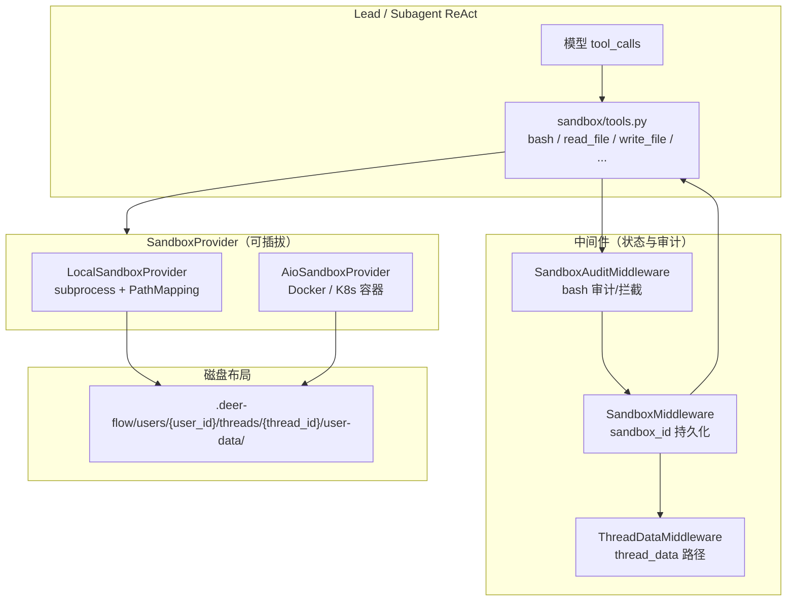

| 层 | 职责 | 关键模块 |
|----|------|----------|
| **工具层** | 模型 API：路径校验、虚拟路径翻译、调用 `Sandbox` API | `sandbox/tools.py` |
| **中间件层** | `thread_data` 目录、`sandbox_id` 写入 `ThreadState`、bash 审计 | `thread_data_middleware.py`、`sandbox/middleware.py`、`sandbox_audit_middleware.py` |
| **Provider 层** | 按 `thread_id` acquire/get/release 具体执行后端 | `sandbox_provider.py`、`local/`、`community/aio_sandbox/` |
| **路径层** | 虚拟路径 ↔ 宿主机目录 | `config/paths.py`、`PathMapping`（Local）或 volume mount（AIO） |

**设计原则**：

1. **中间件管身份，工具管执行** — `SandboxMiddleware` 只保证 `state.sandbox.sandbox_id` 存在并 checkpoint；真正跑命令在 `bash_tool` 等里 `provider.get(sandbox_id)`。
2. **虚拟路径是唯一契约** — Prompt、Skills、产物路径都写 `/mnt/user-data/...`；禁止把宿主机绝对路径暴露给模型（Local 模式输出会 `mask_local_paths_in_output`）。
3. **Provider 可替换** — `config.yaml` → `sandbox.use: deerflow.sandbox.local:LocalSandboxProvider` 或社区 `AioSandboxProvider`；工具与中间件接口不变。

### 8.2 核心抽象

**`Sandbox`**（`sandbox/sandbox.py`）— 执行面 API：

- `execute_command` / `read_file` / `write_file` / `list_dir` / `glob` / `grep` / `download_file` / `update_file`

**`SandboxProvider`**（`sandbox/sandbox_provider.py`）— 生命周期 API：

| 方法 | 语义 |
|------|------|
| `acquire(thread_id)` | 为线程创建或复用沙箱，返回 `sandbox_id` |
| `get(sandbox_id)` | 取已存在实例 |
| `release(sandbox_id)` | Provider 策略释放（Local 多为 no-op；AIO 进 warm pool） |
| `reset()` / `shutdown()` | 进程级清理 |

单例：`get_sandbox_provider()` ← `config.yaml` 反射 `sandbox.use`。

**两种 Provider 对比**：

| 维度 | **LocalSandboxProvider** | **AioSandboxProvider** |
|------|--------------------------|-------------------------|
| 隔离 | 本机 shell + 路径映射，**非内核级** | Docker / K8s 容器 |
| `sandbox_id` | `local:{thread_id}` | `sha256(thread_id)[:8]` |
| 线程目录 | `PathMapping` 挂到 `LocalSandbox` | bind-mount 到容器内同虚拟路径 |
| `release` | 缓存保留（LRU 256） | warm pool + idle checker 销毁 |
| bash 开关 | `sandbox.allow_host_bash` + `security.is_host_bash_allowed()` | 容器内执行，不依赖 host bash 许可 |

### 8.3 虚拟路径协议

**模型可见路径**（`config/paths.py`）：

| 虚拟路径 | 用途 | 权限 |
|----------|------|------|
| `/mnt/user-data/workspace` | 工作区、脚本、中间产物 | 读写 |
| `/mnt/user-data/uploads` | 用户上传 | 读写 |
| `/mnt/user-data/outputs` | 交付物（`present_files` 等） | 读写 |
| `/mnt/user-data` | 聚合 `ls` | 读 |
| `/mnt/skills` | Skills 目录 | **只读** |
| `/mnt/acp-workspace` | ACP 子 Agent 产出 | **只读**（主 Agent 侧） |

**宿主机布局**（`Paths.base_dir` = `backend/.deer-flow/`）：

```text
.deer-flow/users/{user_id}/threads/{thread_id}/user-data/{workspace,uploads,outputs}
.deer-flow/users/{user_id}/threads/{thread_id}/acp-workspace/
```

**翻译链（纵深防御）**：

1. `ThreadDataMiddleware` 把 `thread_data.*_path` 写入 `ThreadState`
2. Provider `acquire` 时建立 **PathMapping**（Local）或 **volume mount**（AIO）
3. `tools.py`：`replace_virtual_path`、`validate_local_tool_path`、`replace_virtual_paths_in_command`
4. `LocalSandbox._resolve_path` 在 subprocess 前做最后一跳

### 8.4 生命周期与线程绑定

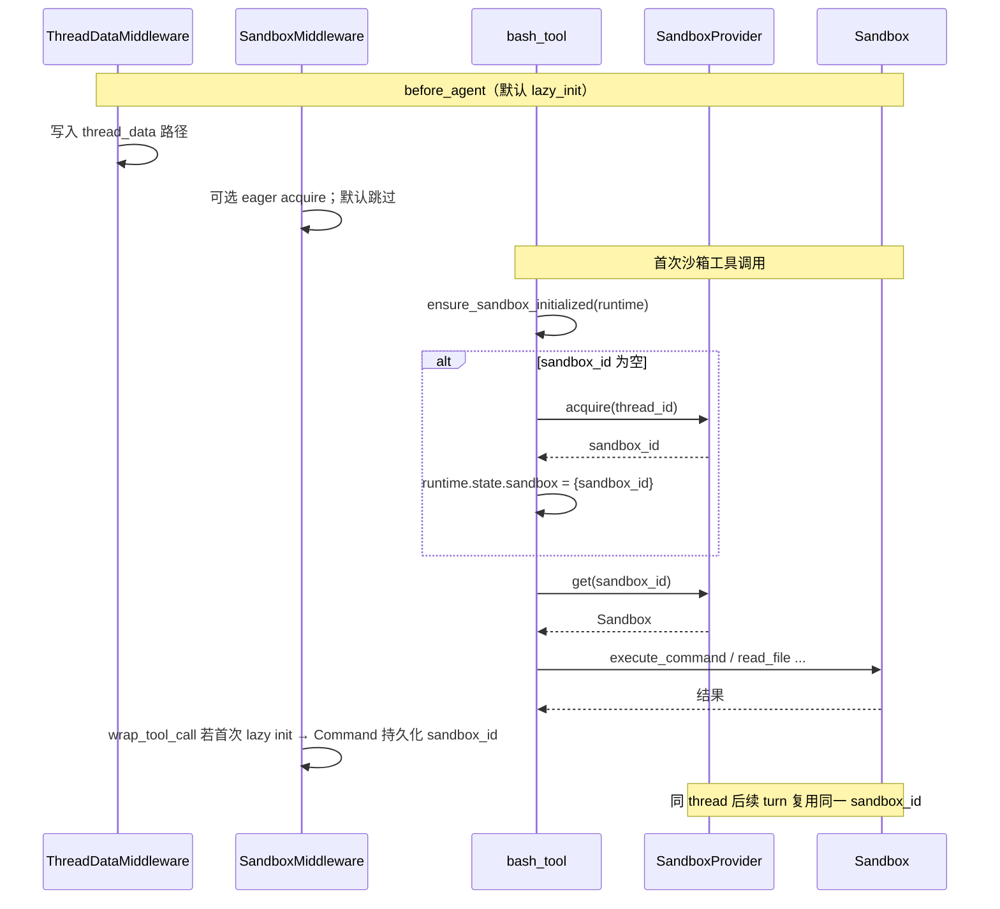

- **`thread_id`** 来自 `runtime.context["thread_id"]` 或 `configurable.thread_id`
- **`sandbox_id`** 存在 `ThreadState.sandbox`，随 **checkpoint** 恢复
- **正常多轮对话不 release**；子 Agent /  ephemeral 路径可在 `after_agent` 释放（见 `SandboxMiddleware`）

### 8.5 典型 `bash` 执行链

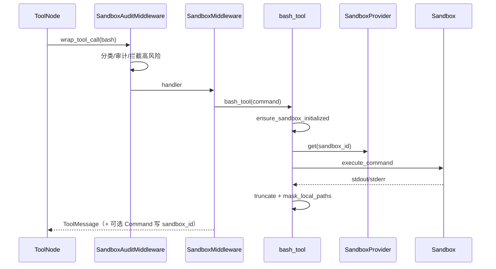

工具注册：`config.yaml` 引用 `deerflow.sandbox.tools:bash_tool` 等；`!is_host_bash_allowed()` 时从可用工具列表 **剔除 bash**。

### 8.6 安全与更强隔离（运维向）

- **LocalSandbox** 为 **本机 subprocess + shell**，边界靠 **路径落在 thread 目录** 与信任模型；适合开发/可信内网，**不宜**作为不可信多租户的唯一防线。  
- **更强隔离**：新增 `SandboxProvider` 实现，把 `execute_command` 映射到容器/远程沙箱 API（E2B、Modal 等），**保留**虚拟路径与 `tools.py` 层。  
- **SandboxAuditMiddleware**：仅拦截 `bash`；高风险命令 block，中风险 warn 追加到 ToolMessage。

**源码索引**：`sandbox/sandbox.py`、`sandbox_provider.py`、`sandbox/tools.py`、`sandbox/middleware.py`、`sandbox/local/`、`community/aio_sandbox/`、`config/paths.py`。

---

## 九、中间件链

> **本章焦点**：中间件 **顺序不可乱**；硬约束 vs Prompt 软约束。**Plan 模式**见 **[§9.8](#plan-mode-is-plan-mode)**。


<a id="middleware-vs-memory"></a>

### 9.1 `agents/middlewares` 与 `agents/memory` 分工

| 区域 | `middlewares/` | `memory/`（`agents/memory/`） |
|------|----------------|------------------------------|
| 职责 | 每次 run 的横切：改状态、拦截模型/工具、限流与安全 | **跨会话长期记忆**：磁盘上的 **`memory.json`**（或可配置路径 / per-agent 文件）、结构化块（`user` / `history` / `facts` 等） |
| 接入 | LangChain `AgentMiddleware` 钩子 | **`MemoryMiddleware`**（`after_agent`）**只把对话入队**；**`MemoryUpdateQueue`** 防抖合并；**`MemoryUpdater`** 调 LLM 按 **`MEMORY_UPDATE_PROMPT`** 合并后 **写回 JSON** |
| 读出 | （不存长期用户画像） | **`_get_memory_context`**：`get_memory_data` + **`format_memory_for_injection`** → 经 **`DynamicContextMiddleware`** 注入首条 **`<system-reminder><memory>`**（**不在**静态 system prompt） |
| 为何拆开 | 顺序敏感、可组合、紧贴 LangGraph 单次 invoke/turn | **持久化格式、更新节奏、注入模板**独立演进；避免与「每一轮模型前」的中间件 DAG 缠死 |

**易混：两个「memory」** — **`agents/memory/`** 是 **产品层「用户长期记忆文件 + 异步摘要管道」**；**checkpointer 配置里的 `type: memory`**（如 **`InMemorySaver`**）是 **LangGraph 的「checkpoint 存在哪」后端**，与 **`memory.json` 用户画像** **无关**。见 [`agents/checkpointer/provider.py`](../packages/harness/deerflow/agents/checkpointer/provider.py) 与 [`agents/memory/__init__.py`](../packages/harness/deerflow/agents/memory/__init__.py) 注释。  
**源码指针（相对仓库根，自 `backend/docs/` 链出）**：`MemoryMiddleware` — [`memory_middleware.py`](../packages/harness/deerflow/agents/middlewares/memory_middleware.py)；队列 / 更新器 — [`queue.py`](../packages/harness/deerflow/agents/memory/queue.py)、[`updater.py`](../packages/harness/deerflow/agents/memory/updater.py)。

<a id="agents-memory-walkthrough"></a>

#### `agents/memory` 是什么？为何要有？和 checkpoint 啥关系？

用两个比喻：

| | **LangGraph checkpoint（`ThreadState`）** | **`agents/memory`（`memory.json`）** |
|---|------------------------------------------|--------------------------------------|
| 像什么 | **这一局聊天**的存档：当前线程里 `messages`、artifacts、本轮 sandbox 等 | **跨多局、跨多天**的「用户档案卡」：压缩后的偏好、长期事实、工作背景摘要 |
| 绑定谁 | **一个 `thread_id` 一条线**（`users/{user_id}/threads/...`） | **`user_id` 下**一份（`users/{user_id}/memory.json`），或 **per-agent**（`users/{user_id}/agents/{name}/memory.json`） |
| 典型用途 | 刷新页面接着聊、同一会话多轮工具 | **新开一个 thread** 时，模型仍可能知道「你常用什么栈、之前提过什么长期目标」 |

**为何单独做一套，不就把所有话都塞进 checkpoint？**  
Checkpoint 按 **线程** 隔离；新会话往往是 **新 thread**，历史 `messages` 默认 **不会**自动跟过去。若把「全站用户画像」写进每一个 thread 的 state，会 **重复、难合并、难控体积**。`memory` 用 **一个（或每 agent 一个）JSON 文件**做 **跨会话单一事实来源**，由 **LLM 摘要合并**维护，体积和字段结构可控（`user` / `history` / `facts` 等，见 `updater.py` 空模板）。

#### 仍糊涂？按时间顺序走一遍「怎么生效」

下面是一条 **主 Agent 回合**里和 memory 相关的真实顺序（配置 **`memory.enabled: true`** 且 **`injection_enabled: true`** 时）：

**A. 读档案（这一轮模型「看见」之前）**

> **源码对齐（2026-06）**：Memory **不再**写入静态 system prompt，而是由 **`DynamicContextMiddleware`** 在 **首条 `HumanMessage` 前** 注入 `<system-reminder><memory>…</memory><current_date>…</current_date></system-reminder>`（利于 prefix cache）。完整链路见 **[附录 B.1](#appendix-memory-tools)**。

1. **`DynamicContextMiddleware.abefore_agent`**（`dynamic_context_middleware.py`）在首 turn 调用 **`_get_memory_context`**（`prompt.py`）。  
2. **`get_memory_data`** 读磁盘 JSON（mtime 缓存）；**`format_memory_for_injection`** 按 **`max_injection_tokens`** 压成短文本。  
3. 若有内容，包进 **`<memory>…</memory>`**，与 **`<current_date>`** 一并写入 **`<system-reminder>`**，拆成 **hide_from_ui 的 HumanMessage** + 用户原文（id 交换技巧）。  
4. **效果**：模型在 **首条用户消息之前** 看到长期摘要；**同 session 内 reminder 冻结**（mid-session 不写回已注入块）。

**B. 写档案（这一轮 Agent 整段跑完之后）**

5. **`MemoryMiddleware.after_agent`** 触发（中间件在 Title 等之后排队，见 §9.2）。  
6. **过滤 `messages`**（`_filter_messages_for_memory`）：  
   - **丢掉** `ToolMessage`、带 **`tool_calls` 的中间 AI**（工具中间步骤不进长期记忆）；  
   - **只保留** **用户 `HumanMessage`** 和 **「最终回复」式 AI**（无 tool_calls）；  
   - 去掉 **`<uploaded_files>...</uploaded_files>`** 块，避免把 **本会话临时上传路径**写进档案（否则下次会话会去找不存在文件）。  
7. 若 **至少有一句用户 + 一句最终助手**，则 **`MemoryUpdateQueue.add(thread_id, filtered, agent_name)`**。  
8. **防抖**：默认 **`debounce_seconds`（如 30）** 内多次会话只 **合并/覆盖同 thread**，定时器到了才处理，避免 **每轮都打一次「记忆更新 LLM」**烧钱。  
9. **`MemoryUpdater.update_memory`**：把 **当前整张 `memory.json` + 过滤后的对话文本** 填进 **`MEMORY_UPDATE_PROMPT`**，**再调一次 LLM**，让它输出 **JSON 增量**（怎么改 summaries / facts）；解析后 **`_apply_updates`**，**去掉上传相关句子**，**写回磁盘**。  
10. **下一轮 / 另一个 thread**：只要同一进程读了更新后的文件，**A 步**里的 `<memory>` 就会变。

**关掉的开关**（`memory_config`）：**`enabled: false`** → 不写队列、不更新文件；**`injection_enabled: false`** → 仍可后台更新，但 **不往 system 里塞 `<memory>`**（少见组合，以配置为准）。

#### 和 §9.1 表格里「middlewares vs memory」怎么对齐？

- **`DynamicContextMiddleware`**：**`before_agent`** 读盘并注入 `<memory>`（经 `_get_memory_context`）。  
- **`agents/middlewares/memory_middleware.py`**：只有 **`after_agent`**，负责 **「要不要排队更新」**。  
- **`agents/memory/`** 包：**队列、更新器、注入格式化、提示词模板** —— **持久化 + 第二次 LLM 调用** 都发生在这里。

**一句记**：**checkpoint 管这一 thread 的对话连续；`memory.json` 管跨会话的「你是谁、之前长期说过啥」；读在拼 system 时，写在 agent 跑完后异步防抖合并。** 磁盘路径见 **`config/paths.py`**（Auth 启用后按 **`user_id`** 隔离；未登录回退 **`default`**）。**完整读写沉淀时序图**见 **[附录 B.1.8](#appendix-memory-tools)**。

### 9.2 顺序与钩子（Lead Agent）

**代码**：`agents/lead_agent/agent.py`（`_build_middlewares`）与 `middlewares/tool_error_handling_middleware.py`（`build_lead_runtime_middlewares`）。

**共享运行时**（`build_lead_runtime_middlewares`，先于 lead 专用列表）：

| 中间件 | 钩子 | 作用 |
|--------|------|------|
| ToolOutputBudgetMiddleware | `wrap_tool_call` | 工具输出 token 预算。 |
| ThreadDataMiddleware | `before_agent` | `thread_id` → `thread_data` 三路路径。 |
| UploadsMiddleware | `before_agent` / `abefore_agent` | 注入上传信息。 |
| SandboxMiddleware | sandbox 生命周期 | 获取/绑定沙箱。 |
| DanglingToolCallMiddleware | `wrap_model_call` | 补 synthetic `ToolMessage`（中断导致悬空 tool_calls）。 |
| LLMErrorHandlingMiddleware | `wrap_model_call` | 模型错误归一化 + 熔断。 |
| GuardrailMiddleware | `wrap_tool_call` | 可选；`guardrails.enabled`。 |
| SandboxAuditMiddleware | `wrap_tool_call` | Bash/文件操作审计。 |
| ToolErrorHandlingMiddleware | `wrap_tool_call` | 异常 → error `ToolMessage`；放行 `GraphBubbleUp`。 |

**Lead 专用**（接在上表之后）：DynamicContext →（可选）Summarization →（可选）**Todo**（仅 **`is_plan_mode`**，见 [§9.8](#plan-mode-is-plan-mode)）→（可选）TokenUsage → Title → Memory →（条件）ViewImage →（条件）DeferredToolFilter（**`wrap_model_call`**，配合 **`tool_search`**）→（条件）SubagentLimit → LoopDetection →（可选）SafetyFinishReason → **Clarification（永远最后）**。

**`ModelCallLoggingMiddleware`** 源码存在但 **未接入** 生产链；可观测性见 **LangSmith / Langfuse**（`tracing/factory.py`）。

子 Agent 使用 `build_subagent_runtime_middlewares`（**无 Uploads**、**含 Dangling 修补**、**无** DeferredToolFilter、**无** Clarification；可选 ViewImage / SafetyFinishReason——与 [§3.2 子 Agent 与澄清](#subagent-no-hitl)、[§5.5 主子 deferred 差异](#subagent-deferred-mcp) 一致）。

### 9.3 Skills vs 内置工具（易混点）

- **Skills** 不是单独一类 Tool：system 里只有 **索引**；消费靠 **`read_file`** 等配置工具读 `/mnt/skills/...`。  
- **Built-ins**（`tools/tools.py`）：如 `present_files`、`ask_clarification`、可选 `task`、`view_image`、开启 deferred MCP 时的 **`tool_search`**。

### 9.4 看似「无返回」的工具

- **`present_files`**：主要更新 state 里 **`artifacts`**，文案次要。  
- **`tool_search`**：返回 **deferred MCP 的 JSON schema**，供后续真正调用。  
- **`ask_clarification`**：常被中间件截获，目的是 **人机中断**。

### 9.5 LangChain 如何串中间件（概念）

`create_agent` 编译 **LangGraph**；`wrap_tool_call` **链式**传入 `ToolNode`；`wrap_model_call` **链式**包住真实 `model.invoke`，中间可 `request.override(...)`；`before_model` / `after_model` 等做状态增量与 `jump_to`。即 **洋葱包装器 + 图钩子**，而非松散回调列表。

### 9.6 中间件栈的设计取舍

长程任务需要摘要、规划、子 Agent、工具/schema 预算、人机卡点 → DeerFlow 以 **middleware 链** 表达，并额外强调：**线程目录**、虚拟路径、Gateway 与扩展读盘、**磁盘 Skills**、Dangling / Loop / SubagentLimit / Deferred + `tool_search`、**文件型 memory 管道**。

**分层原则**：**先环境与张罗状态** → **再上下文与体验** → **再防滥用** → **最后澄清中断**。

### 9.7 顺序不是随便排的：依赖关系与「为何 Clarification 垫底」

中间件列表看似「功能清单」，实质是 **偏序约束的线性化**：

- **`ThreadDataMiddleware` → `UploadsMiddleware` → `SandboxMiddleware`**：后续任何依赖 **真实路径/沙箱句柄** 的逻辑都必须在这之后；否则工具读到空路径或未 acquire 的 sandbox，属于 **竞态类 bug**，而不是模型「不聪明」。

- **`DanglingToolCallMiddleware` 在 `wrap_model_call` 早期**：要在模型 **再次读历史之前** 把协议补全；若放到太晚，可能出现 **已把残缺历史交给模型** 的窗口。

- **`ToolErrorHandlingMiddleware` 在 `wrap_tool_call`**：统一把异常变成 **可继续 ReAct 的 ToolMessage**；应位于 **真正执行工具** 的近旁，且早于 **会中断图的 Clarification** 之前处理「普通工具失败」，避免 **失败与中断语义纠缠**。

- **`DeferredToolFilterMiddleware` 在模型调用链上**：必须在 **绑定 schema 可见** 的路径上改写 `request.tools`；对 **SubagentLimit** 而言，它处理的是 **结构化 tool_calls 数量**，两者正交但同属「防爆炸」族。

- **`ClarificationMiddleware` 明确最后**：它可能对 `ask_clarification` 发出 **跳转 END / interrupt**；若排在前面，后续中间件 **拿不到**「已规范化」的工具错误或未限流的 tool_calls，**硬中断会掩盖本应记录的轨迹**。垫底意味着：**该做的清理、限流、补丁都做完了，再人机暂停**。

理解方式：不要背「第几层是谁」，而是画 **依赖 DAG**，再对照 `agent.py` 的列表是否拓扑排序。

<a id="plan-mode-is-plan-mode"></a>

### 9.8 Plan 模式（规范说明）

> **本节定位**：Plan 模式的定义、开关、运行时序与中间件钩子（见下文各小节）。

#### 9.8.1 定义

**Plan 模式** = 主 Agent 在运行时挂载 **`TodoMiddleware`**，向模型暴露 **`write_todos`** 工具，并在 **`ThreadState.todos`** 中维护可 checkpoint 的待办列表（供 UI 展示进度）。

- **不是**独立子图或第二套 Agent；仍是同一 Lead ReAct 循环，多一个工具 + 一段 system 追加块（`<todo_list_system>`）。
- **与 `task`（子 Agent）正交**：可只开 Plan、只开子 Agent、或两者都开（见 [§7](#七子-agent原理与行为学深度)）。

#### 9.8.2 开关与配置

| 入口 | 字段 | 为真时 |
|------|------|--------|
| LangGraph / Gateway `context` | `configurable.is_plan_mode` | 挂载 `TodoMiddleware`，模型可见 `write_todos` |
| 前端 Web UI | `mode === "pro" \|\| mode === "ultra"` → 写入上列字段 | 同上 |
| `DeerFlowClient` | 构造参数 `plan_mode=True` | 写入 `is_plan_mode`；**Agent 缓存键含此字段**，切换会 **重建 Agent** |

**关（默认，`flash` 等）**：`_create_todo_list_middleware` 返回 `None` → **工具列表里没有 `write_todos`**，也没有 `<todo_list_system>`。这是 **硬开关**（从动作空间移除工具），不只靠 Prompt 说「别用待办」。

#### 9.8.3 开 / 关对比

| 维度 | `is_plan_mode = false` | `is_plan_mode = true` |
|------|------------------------|------------------------|
| 模型工具 | 无 `write_todos` | 有 `write_todos` |
| System | 无 `<todo_list_system>` | 每次 `wrap_model_call` 追加计划规则 |
| 图状态 `todos` | 不通过此路径维护 | `write_todos` **整表替换** 写入，随 checkpoint 持久化 |
| 适用场景 | 单步/轻量问答 | 多步任务、需要可见进度条 |

#### 9.8.4 运行时序（单轮简化）

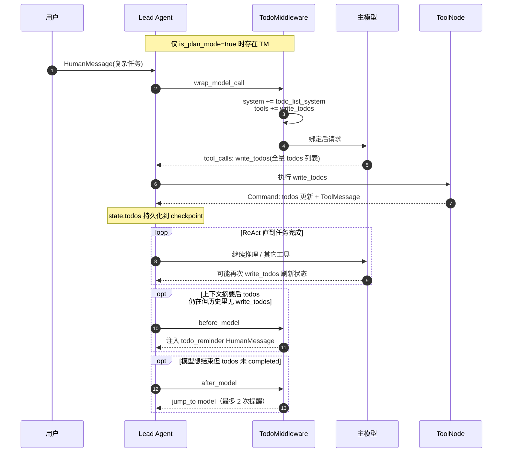

#### 9.8.5 数据契约

**`Todo` 条目**（LangChain `PlanningState`）：

```text
content: str
status: "pending" | "in_progress" | "completed"
```

**`write_todos` 语义**：每次调用提交 **当前认定的完整列表**（全量替换），不是单条 patch。产品规则（写在 Prompt 里）：复杂任务才用（约 3+ 步）、同时仅 **一条** `in_progress`、完成一项立即改状态。

#### 9.8.6 中间件钩子（职责表）

| 钩子 | 实现 | 行为 |
|------|------|------|
| `wrap_model_call` | LangChain `TodoListMiddleware` | 追加 `<todo_list_system>`；注册 `write_todos` schema |
| `write_todos` 工具 | 同上 | `Command(update={todos, messages:[ToolMessage]})` |
| `after_model` | 基类 | 同轮 **多次** `write_todos` → error ToolMessage（禁止并行全表替换） |
| `before_model` | DeerFlow `TodoMiddleware` | `todos` 非空且历史里已看不到 `write_todos` tool_call → 注入 `todo_reminder` |
| `after_model` | DeerFlow 扩展 | 模型 **无 tool_calls** 想结束，但仍有未完成 todo → `jump_to: model`（提醒上限 2 次） |
| `wrap_model_call` | DeerFlow 扩展 | 注入排队的 `todo_completion_reminder`（不写入用户可见 transcript） |

中间件在 Lead 链中的位置：**Summarization 之后、Title/Memory 之前**（见 §9.2 表）。

<a id="plan-mode-behavior-changes"></a>

#### 9.8.7 行为差异：Plan 开 vs 关

Plan 模式不是新 Agent 图，而是 **在同一 Lead ReAct 循环上** 增减工具、中间件钩子与 UI 维度。

##### 对模型动作空间

| 行为 | `is_plan_mode = false` | `is_plan_mode = true` |
|------|------------------------|------------------------|
| 能否调用 `write_todos` | **不能**（工具未注册） | **能** |
| System 追加块 | 无 `<todo_list_system>` | 每轮 `wrap_model_call` 追加计划规则 + 加长 tool description |
| 多步任务组织 | 仅靠 Prompt 自述进度 | 显式 `todos` 状态机 + 中间件硬约束 |
| 提前结束 | 模型无 tool_calls 即正常结束 | 若有未完成 todo，**最多 2 次**被 `after_model` 拉回继续 |
| 摘要后丢计划 | 不适用 | `before_model` 注入 `todo_reminder`（`state.todos` 仍在 checkpoint） |
| 同轮并行 `write_todos` | 不适用 | 基类 `after_model` **拒绝**并返回 error ToolMessage |

##### 对图状态与 Checkpoint

- **`ThreadState.todos`**：`merge_todos` reducer，**全表替换**（`write_todos` 每次提交完整列表）。
- **随 checkpoint 持久化** → 刷新页面、同 `thread_id` 恢复会话后 UI 与模型仍可见列表。
- **关 Plan**：`todos` 字段存在但 **不通过此路径更新**。

##### 对前端与用户可见行为

| 项 | 说明 |
|----|------|
| **模式映射** | `flash` → Plan 关；`pro` / `ultra` → Plan 开（`hooks.ts` → `context.is_plan_mode`） |
| **进度 UI** | `thread.values.todos` 非空时展示 `TodoList`（可折叠待办条） |
| **Chain-of-thought** | `write_todos` 在消息流里显示为紧凑步骤，不展开全表 |
| **隐藏控制消息** | `todo_reminder`、`todo_completion_reminder` 带 `hide_from_ui: true`，不出现在用户消息列表 |

##### 与子 Agent、摘要的交互

- **`subagent_enabled`（ultra）与 Plan（pro/ultra）正交**：可只开 Plan、只开子 Agent、或两者都开。
- **子 Agent 图无 `TodoMiddleware`**：子侧 **没有** `write_todos`；主侧 todo 管 **主会话大步骤**，某步是否 `task` 委派由模型决定。
- **Summarization 在 Todo 之前**：摘要只动 `messages`，不动 `todos`；`TodoMiddleware` 负责在摘要后 **恢复模型对 todos 的感知**。

##### Agent 实例与缓存

`DeerFlowClient` / Lead 工厂缓存键含 **`is_plan_mode`**；运行时切换 pro ↔ flash 会 **重建 Agent**（工具列表与中间件链不同）。

#### 9.8.8 源码索引

| 符号 | 路径 |
|------|------|
| `_create_todo_list_middleware`、`_build_middlewares` | [`agents/lead_agent/agent.py`](../packages/harness/deerflow/agents/lead_agent/agent.py) |
| `TodoMiddleware` | [`agents/middlewares/todo_middleware.py`](../packages/harness/deerflow/agents/middlewares/todo_middleware.py) |
| `ThreadState.todos` | [`agents/thread_state.py`](../packages/harness/deerflow/agents/thread_state.py) |
| LangChain 基类 | `langchain.agents.middleware.todo`（`TodoListMiddleware`、`write_todos`） |
| 前端 `is_plan_mode` | [`frontend/src/core/threads/hooks.ts`](../../frontend/src/core/threads/hooks.ts) |

---


---

## 附：原理深挖（从罗列到因果）

本章把散在各节的「为什么」收束成可复述的 **因果链**，与 §1.6、§3.3、§5.4、§7.5、§9 交叉引用。

### A. 一句话心智模型

DeerFlow 是在 **标准 Chat Completions + tool_calls 协议** 上，叠了一层 **ThreadState（可 checkpoint 的产品状态）** 和 **有序中间件（轨迹约束）**；Skills 与 deferred MCP 都是在 **「把什么推迟到工具结果里再给模型」** 这一原则下做的 **token 经济**。

### B. 失败模式（调试时优先怀疑）

| 现象 | 更可能根因（机制层） |
|------|----------------------|
| 模型报「tool_calls 无对应 tool message」 | 悬空 tool_calls / 中断时机；查 Dangling 修补与客户端取消 |
| 并行上传/展示丢文件 | `artifacts` 若被覆盖会丢；查是否绕过 reducer 或手写 state |
| 子任务「做了但父不知道」 | 子结果未收敛成父 `ToolMessage`；或子 run 异常被吞 |
| MCP 改了不生效 | 多进程缓存；查 extensions mtime 与 LangGraph 进程重载路径 |
| 首轮极慢、后续才快 | deferred 工具两阶段；或首轮绑了过多 schema |
| 开了 `tool_search` 主会话瘦了、子 `task` 里 MCP 仍占 token | **子图无** `DeferredToolFilterMiddleware`；见 [§5.5 主/子差异](#subagent-deferred-mcp) |
| 轻量模式仍出现 `write_todos`、待办噪声 | 查 **`is_plan_mode`** 是否误开；关时应 **无**该工具（见 [§9.8](#plan-mode-is-plan-mode)） |

### C. 与「浮浅文档」的区别

**浮浅**常停在「组件 A 调用组件 B」；**原理层**应能回答：**状态存在哪、谁合并、中断后是否可恢复、多进程下谁是 source of truth、token/latency 权衡落在哪一步**。以上各节即按该标准补全。

---

---

> **Part VI — 参考**

---

## 十、推荐阅读与文件索引

1. `backend/docs/ARCHITECTURE.md`、`APP_PACKAGE_AND_AGENT_ECOSYSTEM.md`、`HARNESS_APP_SPLIT.md`、`CLAUDE.md`；Lead Prompt 全链路见 **[§4.3](#lead-prompt-full-chain)**  
2. `agents/thread_state.py`  
3. `agents/lead_agent/agent.py`、`agents/lead_agent/prompt.py`  
4. `agents/middlewares/tool_error_handling_middleware.py`  
5. `tools/tools.py`、`sandbox/tools.py`  
6. `sandbox/sandbox.py`、`sandbox_provider.py`、`sandbox/middleware.py`  
7. `skills/loader.py`、`skills/parser.py`、`skills/types.py`  
8. `subagents/executor.py`、`tools/builtins/task_tool.py`  
9. `client.py`、`config/app_config.py`、`extensions_config.py`

---

*文件路径：`backend/docs/DEERFLOW_FRAMEWORK_QA_ARCHIVE.md`*
