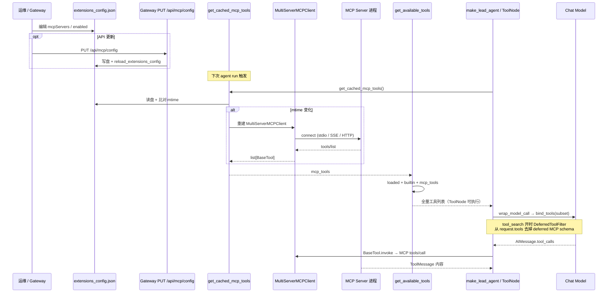

# MCP (Model Context Protocol) Configuration

DeerFlow supports configurable MCP servers and skills to extend its capabilities, which are loaded from a dedicated `extensions_config.json` file in the project root directory.

## Setup

1. Copy `extensions_config.example.json` to `extensions_config.json` in the project root directory.
   ```bash
   # Copy example configuration
   cp extensions_config.example.json extensions_config.json
   ```
   
2. Enable the desired MCP servers or skills by setting `"enabled": true`.
3. Configure each server’s command, arguments, and environment variables as needed.
4. After saving, changes are picked up on the **next MCP tool load** (restart usually **not** required):
   - Direct edits to `extensions_config.json` invalidate the cache via **mtime** in `get_cached_mcp_tools()`
   - Gateway **`PUT /api/mcp/config`** writes the file and calls `reload_extensions_config()`

## OpenViking MCP Tools

OpenViking's official server exposes a Streamable HTTP MCP endpoint at `/mcp`.
DeerFlow connects to it through the same generic MCP client used for other HTTP
servers:

```json
{
  "mcpServers": {
    "openviking": {
      "enabled": true,
      "type": "http",
      "url": "http://127.0.0.1:1933/mcp",
      "headers": {
        "X-API-Key": "$OPENVIKING_API_KEY"
      }
    }
  }
}
```

Set `OPENVIKING_API_KEY` to a normal owner-bound OpenViking **USER API key**.
The key determines the OpenViking account and user. Do not use a root/admin
key, trusted mode, or add `X-OpenViking-Account`, `X-OpenViking-User`, or
`X-OpenViking-Actor-Peer` headers for this personal single-owner setup.
`X-API-Key` is used here because DeerFlow expands a whole-string `$ENV_VAR`
value without storing a credential in the checked-in configuration.
If `OPENVIKING_API_KEY` is missing or empty during initialization, OpenViking
authentication fails and DeerFlow skips that MCP server, so no OpenViking tools
appear. Changing only the environment variable does not invalidate DeerFlow's
already-populated, file-signature-based MCP tool cache; after setting or fixing
the key, restart DeerFlow, modify and re-save the extensions config, or call the
MCP cache-reset endpoint at `POST /api/mcp/cache/reset`.

OpenViking owns the tool schemas and behavior. DeerFlow performs the standard
MCP initialization and discovery flow, prefixes the discovered names with
`openviking_` by default, and routes calls back through the generic MCP client.
For capability parity with other official OpenViking harnesses, DeerFlow exposes
the native `forget` tool with the other discovered tools. `forget` permanently
deletes a `viking://` URI and should be called only after explicit user
confirmation; DeerFlow does not enforce that confirmation.

Operators who do not want agents to call `forget` can block its default visible
name with DeerFlow's existing guardrail configuration:

```yaml
guardrails:
  enabled: true
  provider:
    use: deerflow.guardrails.builtin:AllowlistProvider
    config:
      denied_tools: ["openviking_forget"]
```

If `tool_name_prefix` is disabled for the OpenViking server, block `forget`
instead.

This explicit tool path is separate from the automatic OpenViking memory backend
configured under `config.yaml -> memory`. Both may be enabled at the same time:
the memory backend handles automatic turn capture and recall, while MCP tools
are model-selected operations.

For Docker, point `url` at the OpenViking address reachable from the Gateway
container, such as `http://openviking:1933/mcp` for a shared Compose network or
`http://host.docker.internal:1933/mcp` for a host-installed server.

## Routing Hints

Use `routing` when an MCP server should be preferred for specific requests, such
as internal database questions that should use a PostgreSQL MCP tool before web
search. Routing hints are soft model guidance: they add a
`<mcp_routing_hints>` prompt section, but they do not forbid other tools. Use
agent-level allow/deny policy for hard restrictions. If `tool_search.enabled`
defers MCP tool schemas, matching routing metadata can also auto-promote the
deferred schema before the model call. Auto-promotion is controlled by the
top-level `config.yaml -> tool_search.auto_promote_top_k` setting.

```json
{
   "mcpServers": {
      "postgres": {
         "enabled": true,
         "type": "stdio",
         "command": "npx",
         "args": ["-y", "@modelcontextprotocol/server-postgres", "postgresql://localhost/mydb"],
         "routing": {
            "mode": "prefer",
            "priority": 50,
            "keywords": ["orders", "users", "SQL", "database", "table"]
         },
         "tools": {
            "query": {
               "routing": {
                  "mode": "prefer",
                  "priority": 100,
                  "keywords": ["query database", "orders table", "metrics"]
               }
            }
         }
      }
   }
}
```

- `routing.mode`: `off` disables hints; `prefer` emits hints.
- `routing.priority`: `0` to `100`; higher-priority hints are rendered first.
  When `tool_search.enabled=true`, priority also orders auto-promote matches.
- `routing.keywords`: operator-authored terms that describe when to prefer the
  MCP tool. Empty keywords are allowed but do not emit a hint line and do not
  trigger auto-promotion. Auto-promote matching is a case-insensitive substring
  test against the latest user message (not token/word-boundary matching), so
  prefer distinctive keywords — a short term like `api` also matches `rapid`.
  Over-matching only exposes an extra tool schema (soft/additive), never
  disables other tools.
- `tools.<original_tool_name>.routing`: overrides only the fields explicitly
  set for that tool. The key is the MCP server's original tool name, before the
  `<server>_` prefix added for model binding. If the server-level
  `routing.mode` is `off`, a tool override must set `mode: "prefer"`; setting
  only `priority` or `keywords` still inherits `off` and emits no hint.
- `tool_search.auto_promote_top_k`: global limit for auto-promoted deferred MCP
  schemas per model call. Default `3`; valid range `1..5`.

## Tool Name Prefixes

DeerFlow prefixes discovered MCP tool names with `<server_name>_` by default.
This avoids collisions when two enabled servers expose tools with the same
name. A server that already namespaces its own tools can opt out:

```json
{
  "mcpServers": {
    "semantic-scholar": {
      "type": "stdio",
      "command": "uvx",
      "args": ["s2-mcp-server"],
      "tool_name_prefix": false
    }
  }
}
```

With this setting, a server tool named `semantic_scholar_search_papers` keeps
that name instead of becoming
`semantic-scholar_semantic_scholar_search_papers`. The default is `true` for
backward compatibility. Disable it only when every resulting tool name remains
unique across the enabled servers. Stdio tools continue to use DeerFlow's
persistent per-thread session pool regardless of this setting.

## Server Timeouts

Two independent settings bound stdio MCP servers and durable HTTP/SSE task
calls. `session_init_timeout` covers server bring-up — tool discovery
(subprocess spawn + `initialize` + `tools/list`) and persistent-session
initialization — plus ephemeral HTTP/SSE task-session initialization. It
defaults to 60s so a hung server (e.g. `npx` blocked on a package download, or
a server that never answers `initialize`) cannot block agent construction or
the task poller indefinitely. Set it to `null` to disable:

```json
{
   "mcpServers": {
      "github": {
         "enabled": true,
         "type": "stdio",
         "command": "npx",
         "args": ["-y", "@modelcontextprotocol/server-github"],
         "env": {
            "GITHUB_TOKEN": "$GITHUB_TOKEN"
         },
         "session_init_timeout": 60,
         "tool_call_timeout": 60
      }
   }
}
```

`tool_call_timeout` limits each individual stdio tool call in seconds. Ordinary
durable-task submit/status/cancel calls also honor it for `http` and `sse`
servers, independently of transport idle timeouts, so a live connection that
never returns the matching MCP response cannot stall the task poller. Other
`http` and `sse` tools continue to use transport-level timeouts.

## Filesystem MCP Servers

DeerFlow already provides built-in file tools for thread-scoped workspace access.
Do not add an MCP filesystem server for the same DeerFlow workspace. The
overlapping file tools use different path semantics, which can make LLM tool
selection and file access behavior unstable.

DeerFlow does not currently adapt the MCP Roots mode for filesystem servers. In
particular, it does not publish per-thread MCP roots or map DeerFlow sandbox
paths such as `/mnt/user-data/...` to paths accepted by
`@modelcontextprotocol/server-filesystem`. Use DeerFlow's built-in file tools
for DeerFlow workspace files.

## Durable Background Tasks with Ordinary MCP Tools

An MCP server can expose a fast `submit` tool plus `status` and `cancel` tools
for long-running work. DeerFlow keeps the remote task ID in SQL and polls it
outside the Agent run, so the model does not have to remember or repeatedly
send that ID.

Enable the restart-required runtime in `config.yaml`:

```yaml
mcp_tasks:
  enabled: true
  poll_interval_seconds: 5
  lease_seconds: 120
  max_concurrent_polls: 8
```

Then bind exact remote tool names in `extensions_config.json`. These names are
the server's raw names, before DeerFlow adds any `<server_name>_` prefix:

```json
{
  "mcpServers": {
    "report-service": {
      "enabled": true,
      "type": "http",
      "url": "https://reports.example.com/mcp",
      "session_init_timeout": 60,
      "tool_call_timeout": 60,
      "task_toolsets": [
        {
          "name": "report-generation",
          "submit_tool": "submit_report",
          "status_tool": "get_report_status",
          "cancel_tool": "cancel_report"
        }
      ]
    }
  }
}
```

The three remote tools must use MCP `structuredContent`; ordinary text blocks
are never parsed as a task protocol:

- `submit_report(<business arguments>)` returns
  `{"task_id":"remote-123","status":"running"}` quickly.
- `get_report_status({"task_id":"remote-123"})` returns a status from
  `running`, `input_required`, `completed`, `failed`, or `cancelled`. It may
  also return `result`, `result_artifact` (`uri` plus `mime_type`), `error`,
  `error_code`, `input_required`, and a finite positive
  `poll_after_seconds`. DeerFlow caps that remote scheduling hint at 24 hours.
- `cancel_report({"task_id":"remote-123"})` is idempotent and returns the
  actual terminal status: `cancelled`, `completed`, or `failed`.

For the status tool, `isError: true` means that the status call itself failed;
DeerFlow records a bounded snippet of its first text content block and retries
with capped exponential backoff. It does not infer that the remote task failed,
because MCP tool errors do not distinguish transient from permanent conditions.
A server must report a permanent remote-task failure through a normal tool
result (`isError: false` or omitted) whose `structuredContent` contains
`status: "failed"` and an optional `error`. This distinction lets a temporary
server or network outage recover without terminalizing work that may still be
running remotely.

Persisted task errors are capped at 4,000 characters. An `input_required`
payload must be valid JSON no larger than 64 KiB; an oversized or invalid
payload is treated as a permanent protocol failure instead of being truncated
into a different question. `result_artifact` must likewise serialize as JSON
within 64 KiB; it is a small external reference, not a second result channel.
Remote task IDs and task names are limited to 255 characters, and a task-enabled
server name is limited to 128 characters, matching the durable SQL schema on
both SQLite and PostgreSQL.

`error_code: "task_not_found"` is a permanent failure. Network and transport
errors remain retryable with capped exponential backoff; the query API reports
`tracking_degraded` after repeated failures. Oversized JSON results are not
cut into invalid JSON: DeerFlow stores a text preview, marks
`result_truncated`, and preserves any external `result_artifact` reference.

Only submit remains in the Agent's normal tool list. Status and cancel are
runtime-internal. Query the current thread through:

- `GET /api/threads/{thread_id}/mcp-tasks`
- `GET /api/threads/{thread_id}/mcp-tasks/{task_id}`

Task toolsets require `database.backend: sqlite` or `postgres`; startup fails
instead of falling back to a synchronous submit when persistence or the task
runtime is disabled. Restart recovery also requires the remote service to keep
the task alive and recognize its ID after DeerFlow reconnects. A stdio server
must therefore persist its own tasks; multi-instance deployments should
normally use an independently running HTTP/SSE service.

Server-level OAuth works during background polling and refreshes normally.
Request-scoped secrets from a particular Agent run are not durable task
credentials and are unavailable to later background polls; use server-level
authentication for a task toolset. Restart DeerFlow after changing
`mcp_tasks`, `task_toolsets`, `mcpInterceptors`, or any connection,
authentication, transport, or timeout setting on a task-enabled server.
DeerFlow rejects task-tool reloads that no longer match the Gateway's startup
snapshot instead of discovering tools with new settings while the background
poller still calls the old endpoint. Agent-facing description/routing changes
and changes to servers without task toolsets remain hot-reloadable.

## OAuth Support (HTTP/SSE MCP Servers)

For `http` and `sse` MCP servers, DeerFlow supports OAuth token acquisition and automatic token refresh.

- Supported grants: `client_credentials`, `refresh_token`
- Configure per-server `oauth` block in `extensions_config.json`
- Secrets should be provided via environment variables (for example: `$MCP_OAUTH_CLIENT_SECRET`)

Example:

```json
{
   "mcpServers": {
      "secure-http-server": {
         "enabled": true,
         "type": "http",
         "url": "https://api.example.com/mcp",
         "oauth": {
            "enabled": true,
            "token_url": "https://auth.example.com/oauth/token",
            "grant_type": "client_credentials",
            "client_id": "$MCP_OAUTH_CLIENT_ID",
            "client_secret": "$MCP_OAUTH_CLIENT_SECRET",
            "scope": "mcp.read",
            "refresh_skew_seconds": 60
         }
      }
   }
}
```

## Custom Tool Interceptors

You can register custom interceptors that run before every MCP tool call. This is useful for injecting per-request headers (e.g., user auth tokens from the LangGraph execution context), logging, or metrics.

Declare interceptors in `extensions_config.json` using the `mcpInterceptors` field:

```json
{
  "mcpInterceptors": [
    "my_package.mcp.auth:build_auth_interceptor"
  ],
  "mcpServers": { ... }
}
```

Each entry is a Python import path in `module:variable` format (resolved via `resolve_variable`). The variable must be a **no-arg builder function** that returns an async interceptor compatible with `MultiServerMCPClient`’s `tool_interceptors` interface, or `None` to skip.

Example interceptor that injects auth headers from LangGraph metadata:

```python
def build_auth_interceptor():
    async def interceptor(request, handler):
        from langgraph.config import get_config
        metadata = get_config().get("metadata", {})
        headers = dict(request.headers or {})
        if token := metadata.get("auth_token"):
            headers["X-Auth-Token"] = token
        return await handler(request.override(headers=headers))
    return interceptor
```

- A single string value is accepted and normalized to a one-element list.
- Invalid paths or builder failures are logged as warnings without blocking other interceptors.
- The builder return value must be `callable`; non-callable values are skipped with a warning.

## Architecture: MCP Load → Bind → Execute



### Source files (harness package)

| 职责 | 路径（相对 `deer-flow/backend/packages/harness/deerflow/`） |
|------|-----------------------------------------------------------|
| 配置模型 | `config/extensions_config.py` |
| MCP 客户端 | `mcp/tools.py`（`MultiServerMCPClient`） |
| 缓存 / mtime | `mcp/cache.py`（`get_cached_mcp_tools`） |
| OAuth / 拦截器 | `mcp/oauth.py` |
| 并入工具列表 | `tools/tools.py`（`get_available_tools`） |
| deferred 过滤 | `agents/middlewares/deferred_tool_filter_middleware.py` |
| Gateway 写配置 | `app/gateway/routers/mcp.py` |

### Transport types

| `type` | 连接方式 | 典型用途 |
|--------|----------|----------|
| `stdio` | 子进程 `command` + `args` | 本地 `@modelcontextprotocol/server-*` |
| `sse` | HTTP SSE URL | 远程 MCP 服务 |
| `http` | Streamable HTTP | 远程 MCP + OAuth |

工具暴露名默认带前缀（`tool_name_prefix=True`），形如 `mcp__{server}__{tool_name}`。

### `tool_search` / deferred MCP

当 `config.tool_search.enabled` 为真：

1. MCP 工具仍加载进 **ToolNode 全量列表**（可执行）
2. **`DeferredToolRegistry`** 登记 MCP 工具名
3. **`DeferredToolFilterMiddleware`** 在 **`wrap_model_call`** 从绑给模型的 `tools` 中移除 deferred 名
4. 模型通过 **`tool_search`** 工具在 **ToolMessage** 中获取完整 JSON schema

详见 [PROMPT_AND_CONTEXT_FULL_CHAIN.md §4.2](PROMPT_AND_CONTEXT_FULL_CHAIN.md#42-mcp-与-tool_search-开关)。

---

## How It Works

MCP servers expose tools that are automatically discovered and integrated into DeerFlow’s agent system at runtime. Once enabled, these tools become available to agents without additional code changes.

## Example Capabilities

MCP servers can provide access to:

- **Databases** (e.g., PostgreSQL)
- **External APIs** (e.g., GitHub, Brave Search)
- **Browser automation** (e.g., Puppeteer)
- **Custom MCP server implementations**

## Learn More

For detailed documentation about the Model Context Protocol, visit:  
https://modelcontextprotocol.io
